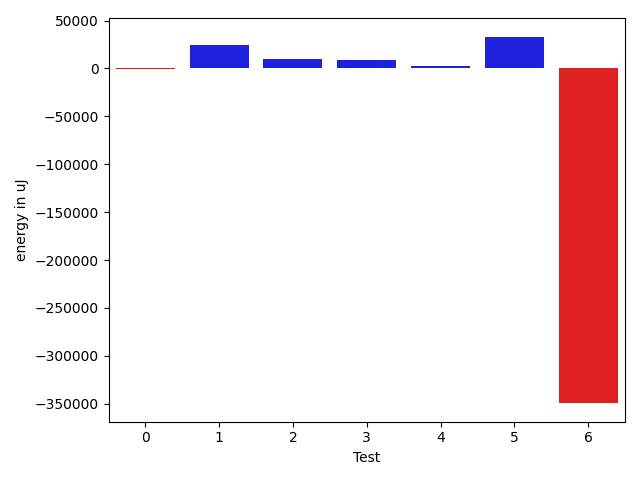

# gson 464483

https://github.com/google/gson/commit/464483

## Delta Energy per test method

| ID | EnergyV1 | EnergyV2 | DeltaEnergy |
| --- | --- | --- | --- |
| 0 | 83859.57643422403 | 83270.16413272168 | -589.4123015023506 |
| 1 | 44193.572404652834 | 68814.31256365031 | 24620.740158997476 |
| 2 | 38258.23552929463 | 47623.26719648885 | 9365.03166719422 |
| 3 | 138047.87591615698 | 146651.87010241096 | 8603.994186253985 |
| 4 | 53211.29831604709 | 55283.155005556706 | 2071.8566895096155 |
| 5 | 35462.72968301049 | 68575.64723047461 | 33112.91754746412 |
| 6 | 732828.1234746338 | 383143.5113922183 | -349684.6120824155 |

## Delta Duration per test method

| ID | DurationV1 | DurationsV2 | DeltaDuration |
| --- | --- | --- | --- |
| 0 | 2915796.168479734 | 2712462.750433616 | -203333.41804611823 |
| 1 | 1016199.1517499706 | 2727091.918463938 | 1710892.7667139673 |
| 2 | 1044382.5710348545 | 1356146.4536597491 | 311763.8826248946 |
| 3 | 5285240.963531848 | 5033096.578528011 | -252144.38500383683 |
| 4 | 1483641.3658059537 | 1837357.9394664865 | 353716.5736605327 |
| 5 | 1252411.6712279906 | 2480898.6652402156 | 1228486.994012225 |
| 6 | 21553167.09223281 | 11803324.087332234 | -9749843.004900575 |

## Misc.

| ID | Test Class | Test Method |
| --- | --- | --- |
| 0 | com.google.gson.functional.StringTest | testSingleQuoteInStringSerialization |
| 1 | com.google.gson.functional.StringTest | testEscapingQuotesInStringSerialization |
| 2 | com.google.gson.functional.EscapingTest | testGsonDoubleDeserialization |
| 3 | com.google.gson.functional.EscapingTest | testGsonAcceptsEscapedAndNonEscapedJsonDeserialization |
| 4 | com.google.gson.functional.EscapingTest | testEscapingObjectFields |
| 5 | com.google.gson.functional.EscapingTest | testEscapingQuotesInStringArray |
| 6 | com.google.gson.functional.NamingPolicyTest | testComplexFieldNameStrategy |

| Test | IterationV1 | IterationV2 | DeltaIteration |
| --- | --- | --- | --- |
| 0 | 51 | 43 | -8 |
| 1 | 33 | 28 | -5 |
| 2 | 73 | 71 | -2 |
| 3 | 93 | 98 | 5 |
| 4 | 86 | 88 | 2 |
| 5 | 82 | 83 | 1 |
| 6 | 99 | 99 | 0 |

| Time Label | Time (s) |
| --- | --- |
| Selection | 34.83418297767639 |
| Injection | 13.359081268310547 |
| Total | 1363.6003031730652 |

