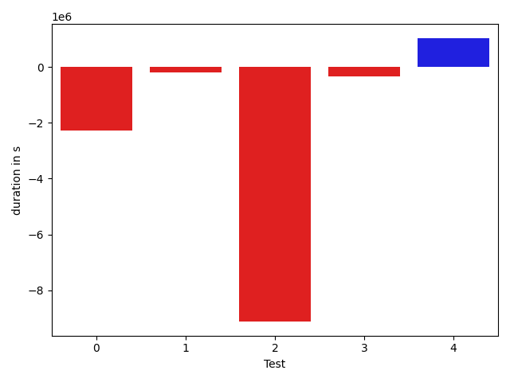

# gson 2d072b

https://github.com/google/gson/commit/2d072b

## Delta Energy per test method

| ID | EnergyV1 | EnergyV2 | DeltaEnergy |
| --- | --- | --- | --- |
| 0 | 281327.5592213253 | 182075.941419242 | -99251.61780208332 |
| 1 | 54422.75176566559 | 45202.15341107493 | -9220.598354590664 |
| 2 | 658412.5854436613 | 351261.7852413772 | -307150.8002022841 |
| 3 | 91549.8078854104 | 80596.59971546773 | -10953.208169942664 |
| 4 | 124455.49677609543 | 121789.19099402321 | -2666.305782072217 |

## Delta Duration per test method

| ID | DurationV1 | DurationsV2 | DeltaDuration |
| --- | --- | --- | --- |
| 0 | 8028719.047428978 | 5756317.152434194 | -2272401.894994783 |
| 1 | 1890165.8703515737 | 1690877.5691520795 | -199288.30119949416 |
| 2 | 19850268.588681273 | 10735428.898257924 | -9114839.690423349 |
| 3 | 2813430.947781152 | 2467275.852362381 | -346155.09541877126 |
| 4 | 3967030.699573518 | 4997144.674642169 | 1030113.9750686511 |

## Misc.

| ID | Test Class | Test Method |
| --- | --- | --- |
| 0 | com.google.gson.internal.bind.JsonElementReaderTest | testSkipValue |
| 1 | com.google.gson.functional.ExclusionStrategyFunctionalTest | testExclusionStrategyWithMode |
| 2 | com.google.gson.functional.ExclusionStrategyFunctionalTest | testExclusionStrategyDeserialization |
| 3 | com.google.gson.functional.CustomDeserializerTest | testJsonTypeFieldBasedDeserialization |
| 4 | com.google.gson.functional.JsonParserTest | testBadFieldTypeForDeserializingCustomTree |

| Test | IterationV1 | IterationV2 | DeltaIteration |
| --- | --- | --- | --- |
| 0 | 83 | 91 | 8 |
| 1 | 99 | 99 | 0 |
| 2 | 99 | 99 | 0 |
| 3 | 99 | 99 | 0 |
| 4 | 99 | 99 | 0 |

| Time Label | Time (s) |
| --- | --- |
| Selection | 34.4783878326416 |
| Injection | 13.809673070907593 |
| Total | 1374.151892900467 |

