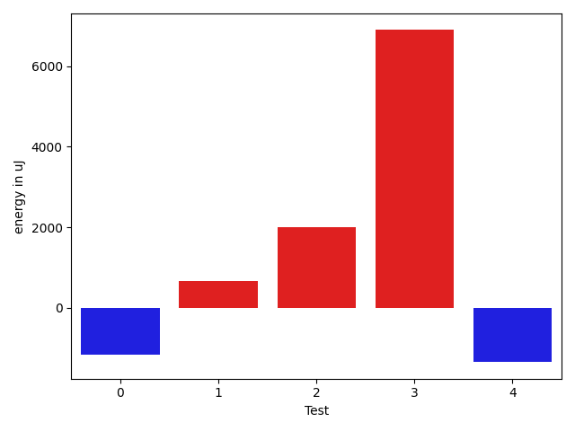

# gson 2d072b

https://github.com/google/gson/commit/2d072b

## Delta Energy per test method

| ID | EnergyV1 | EnergyV2 | DeltaEnergy | σV1 | σV2 |
| --- | --- | --- | --- | --- | --- |
| 0 | 39734 | 38575 | -1159 | 280107.4082360504 | 280023.5454069354 |
| 1 | 36560 | 37231 | 671 | 15026.968345666639 | 14777.894961437381 |
| 2 | 113220 | 115234 | 2014 | 503883.0380764133 | 434163.5393452243 |
| 3 | 75378 | 82275 | 6897 | 65545.47624252495 | 64017.674280213636 |
| 4 | 75500 | 74157 | -1343 | 76551.88130583138 | 65561.37332990029 |

## Delta Duration per test method

| ID | DurationV1 | DurationsV2 | DeltaDuration |
| --- | --- | --- | --- |
| 0 | 6476840.397590362 | 6614840.516483516 | 138000.1188931549 |
| 1 | 1581470.4646464647 | 1624441.9090909092 | 42971.444444444496 |
| 2 | 13588580.313131314 | 10102398.787878787 | -3486181.5252525266 |
| 3 | 3633071.5555555555 | 3849977.8181818184 | 216906.26262626285 |
| 4 | 3874727.303030303 | 3247821.8080808083 | -626905.494949495 |

## Misc.

| ID | Test Class | Test Method |
| --- | --- | --- |
| 0 | com.google.gson.internal.bind.JsonElementReaderTest | testSkipValue |
| 1 | com.google.gson.functional.ExclusionStrategyFunctionalTest | testExclusionStrategyWithMode |
| 2 | com.google.gson.functional.ExclusionStrategyFunctionalTest | testExclusionStrategyDeserialization |
| 3 | com.google.gson.functional.CustomDeserializerTest | testJsonTypeFieldBasedDeserialization |
| 4 | com.google.gson.functional.JsonParserTest | testBadFieldTypeForDeserializingCustomTree |

| Test | IterationV1 | IterationV2 | DeltaIteration |
| --- | --- | --- | --- |
| 0 | 83 | 91 | 8 |
| 1 | 99 | 99 | 0 |
| 2 | 99 | 99 | 0 |
| 3 | 99 | 99 | 0 |
| 4 | 99 | 99 | 0 |

| Time Label | Time (s) |
| --- | --- |
| Selection | 34.4783878326416 |
| Injection | 13.809673070907593 |
| Total | 1374.151892900467 |

