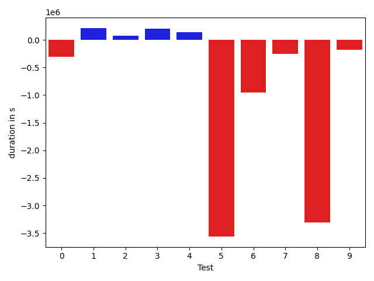
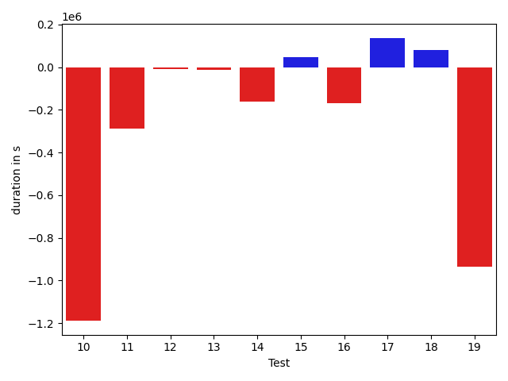
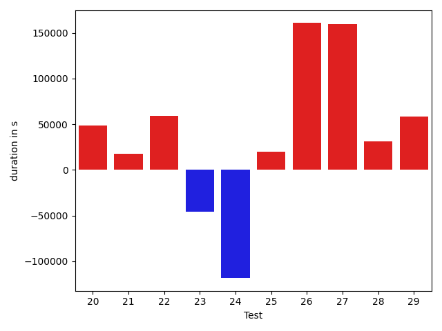
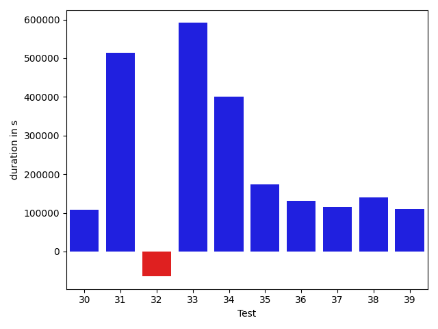
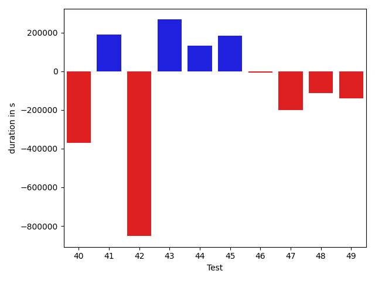
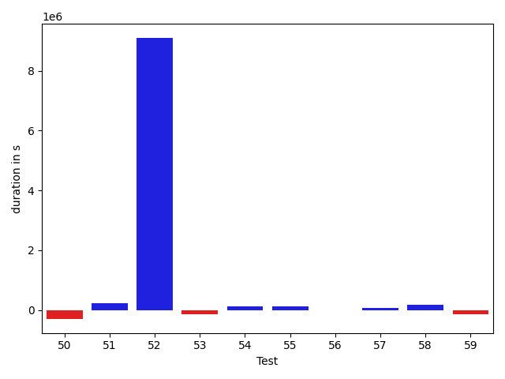
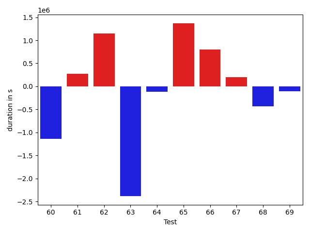
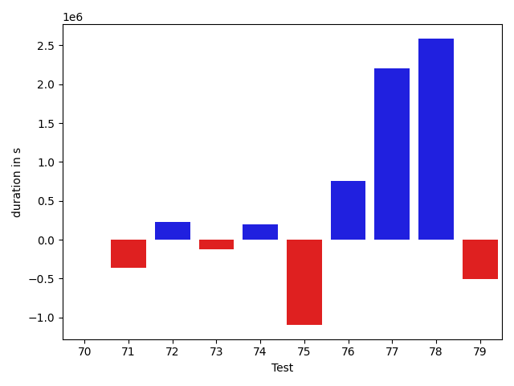
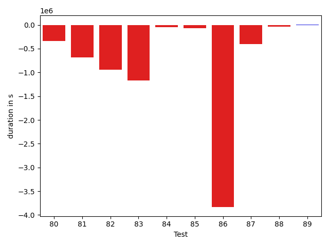

# gson 9c30b0

https://github.com/google/gson/commit/9c30b0

## Delta Energy per test method

| ID | EnergyV1 | EnergyV2 | DeltaEnergy |
| --- | --- | --- | --- |
| 0 | 182329.21680568758 | 151185.44796828134 | -31143.76883740624 |
| 1 | 113526.624455423 | 99785.42658331619 | -13741.197872106815 |
| 2 | 40887.797460547474 | 41397.028559592494 | 509.2310990450205 |
| 3 | 50597.55251520124 | 63725.06583392258 | 13127.513318721336 |
| 4 | 38316.212081363454 | 44413.43406622697 | 6097.221984863514 |
| 5 | 164109.9646082006 | 52780.88298351478 | -111329.08162468582 |
| 6 | 80880.33091556479 | 56292.72401703245 | -24587.606898532336 |
| 7 | 41356.614064352165 | 43070.863058393705 | 1714.2489940415398 |
| 8 | 203825.3793424972 | 100667.42567499937 | -103157.95366749784 |
| 9 | 59245.67297445257 | 40654.641568196166 | -18591.031406256407 |
| 10 | 121767.89069649157 | 112507.39280183148 | -9260.49789466009 |
| 11 | 41293.33273911192 | 43057.89978343544 | 1764.5670443235213 |
| 12 | 42745.951631299096 | 40604.06214519896 | -2141.889486100139 |
| 13 | 44743.72826076659 | 41535.15234203847 | -3208.575918728122 |
| 14 | 42961.87322606756 | 40835.50185222619 | -2126.3713738413717 |
| 15 | 42618.13632524568 | 43923.27728572214 | 1305.140960476463 |
| 16 | 74730.86451789248 | 63610.51243320787 | -11120.352084684608 |
| 17 | 168125.29582439698 | 163508.86077855027 | -4616.435045846709 |
| 18 | 40904.51914730201 | 44595.46513524042 | 3690.9459879384085 |
| 19 | 77938.97697797828 | 49648.2120281274 | -28290.764949850884 |
| 20 | 129297.08460926573 | 126116.64634331872 | -3180.438265947014 |
| 21 | 54186.937219664775 | 45278.16680465302 | -8908.770415011757 |
| 22 | 38738.74722769985 | 37925.458790549215 | -813.288437150637 |
| 23 | 39696.34227231474 | 44791.00835974151 | 5094.666087426769 |
| 24 | 77200.2922147783 | 94532.06715047988 | 17331.774935701585 |
| 25 | 42508.659729003906 | 46975.951263427734 | 4467.291534423828 |
| 26 | 40925.91383242607 | 42519.30085494369 | 1593.3870225176215 |
| 27 | 45807.218026570175 | 95228.34671366678 | 49421.1286870966 |
| 28 | 46141.090917506415 | 42402.57695369552 | -3738.513963810896 |
| 29 | 41591.95752429962 | 40659.3579230085 | -932.59960129112 |
| 30 | 41986.39837169647 | 36514.71328341961 | -5471.685088276863 |
| 31 | 44823.034062981606 | 51300.624755859375 | 6477.5906928777695 |
| 32 | 42739.29872965813 | 42616.94818805158 | -122.35054160654545 |
| 33 | 40712.38345539609 | 67129.652949359 | 26417.269493962915 |
| 34 | 44710.592066287994 | 41550.74316215515 | -3159.848904132843 |
| 35 | 57978.58054728547 | 40232.73865811074 | -17745.841889174728 |
| 36 | 42832.15124505758 | 39901.591749984145 | -2930.5594950734376 |
| 37 | 57850.990969747785 | 57005.235716216426 | -845.7552535313589 |
| 38 | 191524.0785185888 | 184240.9408292245 | -7283.137689364288 |
| 39 | 55810.55475668083 | 37819.121251226534 | -17991.433505454297 |
| 40 | 64549.92379939073 | 41310.529416102865 | -23239.394383287865 |
| 41 | 52390.745684392765 | 47123.12082931969 | -5267.624855073074 |
| 42 | 102919.30614935441 | 56816.615479099666 | -46102.69067025474 |
| 43 | 43105.90349622263 | 41849.07019899842 | -1256.833297224206 |
| 44 | 42848.1094106635 | 40905.19589153393 | -1942.9135191295718 |
| 45 | 41892.13192174706 | 40573.27261652633 | -1318.8593052207289 |
| 46 | 41619.277829376355 | 44090.103254522684 | 2470.8254251463295 |
| 47 | 42318.46606981139 | 39785.977518614265 | -2532.4885511971224 |
| 48 | 39977.56844470833 | 41585.00869534132 | 1607.4402506329861 |
| 49 | 45310.027915237326 | 41538.98478967106 | -3771.0431255662625 |
| 50 | 48760.99888932827 | 44142.21152587073 | -4618.787363457544 |
| 51 | 42913.63273475089 | 36518.384113506276 | -6395.2486212446165 |
| 52 | 77493.2461219982 | 383842.55040711357 | 306349.30428511533 |
| 53 | 70994.816960812 | 40766.27770406474 | -30228.53925674725 |
| 54 | 48204.31224728623 | 71687.81003807359 | 23483.497790787354 |
| 55 | 45112.17363845007 | 40139.62026212254 | -4972.553376327531 |
| 56 | 1665366.7706675457 | 1602367.052742163 | -62999.71792538278 |
| 57 | 45434.27659036673 | 49089.819847206396 | 3655.5432568396645 |
| 58 | 44881.54117562664 | 49977.16008980917 | 5095.618914182531 |
| 59 | 43147.11662202728 | 39578.1436544875 | -3568.9729675397757 |
| 60 | 42448.84340467502 | 39013.517213135856 | -3435.326191539163 |
| 61 | 41540.783148626964 | 40876.347235398454 | -664.4359132285099 |
| 62 | 47920.42163551476 | 41044.00540503739 | -6876.416230477371 |
| 63 | 102982.9251677878 | 77577.1759942011 | -25405.749173586708 |
| 64 | 141012.5506189452 | 268843.3795107027 | 127830.82889175747 |
| 65 | 45833.72589758791 | 44405.7293109111 | -1427.9965866768107 |
| 66 | 161226.73965524885 | 57811.98557926116 | -103414.75407598769 |
| 67 | 41392.17926826145 | 40280.329015275594 | -1111.8502529858524 |
| 68 | 115137.89310076229 | 105426.47687602349 | -9711.416224738801 |
| 69 | 42471.958309893584 | 110314.4162626506 | 67842.45795275702 |
| 70 | 65561.96570329134 | 38618.05579322786 | -26943.909910063478 |
| 71 | 43195.73333548844 | 44632.902604924486 | 1437.1692694360463 |
| 72 | 41852.87390069198 | 38405.04412174225 | -3447.82977894973 |
| 73 | 38962.42987550673 | 42518.80491673127 | 3556.3750412245427 |
| 74 | 41232.62718965592 | 41943.53978761519 | 710.9125979592718 |
| 75 | 69646.04859535529 | 38708.17986857493 | -30937.868726780354 |
| 76 | 42872.50169062407 | 38012.9169020992 | -4859.584788524873 |
| 77 | 51164.88295743911 | 143360.30482296678 | 92195.42186552766 |
| 78 | 119194.98437378397 | 191138.3669181746 | 71943.38254439064 |
| 79 | 53208.218799322036 | 38941.54882735157 | -14266.669971970463 |
| 80 | 119400.74204784466 | 89444.6588970536 | -29956.083150791063 |
| 81 | 40122.894025454836 | 43329.21676970845 | 3206.3227442536154 |
| 82 | 68454.78758853389 | 37920.324857898784 | -30534.462730635103 |
| 83 | 98222.2050181487 | 59144.44376680764 | -39077.76125134106 |
| 84 | 128371.51503800228 | 117597.70441889745 | -10773.810619104828 |
| 85 | 40697.41875806305 | 39488.09852284465 | -1209.3202352184016 |
| 86 | 166483.23442749123 | 60053.124623161886 | -106430.10980432935 |
| 87 | 53467.25083002151 | 38674.847652323544 | -14792.403177697968 |
| 88 | 41445.18608979508 | 41038.20043465495 | -406.9856551401317 |
| 89 | 39504.135498046875 | 42005.08645105362 | 2500.9509530067444 |

## Delta Duration per test method

| ID | DurationV1 | DurationsV2 | DeltaDuration |
| --- | --- | --- | --- |
| 0 | 4447596.966259727 | 4137634.6778070433 | -309962.28845268395 |
| 1 | 2915620.060389979 | 3130143.784165376 | 214523.72377539705 |
| 2 | 720572.4104091186 | 792595.6024170918 | 72023.19200797321 |
| 3 | 1301297.6078090477 | 1506230.216522728 | 204932.6087136804 |
| 4 | 890451.7895034732 | 1026265.038634647 | 135813.24913117383 |
| 5 | 4660832.10304744 | 1099858.7226414052 | -3560973.3804060346 |
| 6 | 2440775.61412665 | 1492734.3231884886 | -948041.2909381615 |
| 7 | 1053422.5198228937 | 801989.5163607536 | -251433.0034621401 |
| 8 | 6182537.035093401 | 2873144.8830622295 | -3309392.152031171 |
| 9 | 1465932.8204277614 | 1289733.5447941204 | -176199.27563364105 |
| 10 | 3789363.2048719996 | 2601616.2696273066 | -1187746.935244693 |
| 11 | 1427404.0027786521 | 1141087.8565108571 | -286316.146267795 |
| 12 | 1057547.8307474242 | 1046951.5031776015 | -10596.327569822664 |
| 13 | 1316202.7926918138 | 1303871.5654822849 | -12331.227209528908 |
| 14 | 1108882.7280908292 | 946330.5148410054 | -162552.21324982378 |
| 15 | 1049472.0652383748 | 1096448.3886493132 | 46976.323410938494 |
| 16 | 1593068.7196432466 | 1422419.8046863829 | -170648.91495686374 |
| 17 | 4130843.770245008 | 4267174.87007774 | 136331.09983273223 |
| 18 | 1203634.9768199264 | 1282920.1953797657 | 79285.2185598393 |
| 19 | 2172562.8475513346 | 1236441.3968776609 | -936121.4506736738 |
| 20 | 3482669.0139519093 | 3156031.336362159 | -326637.6775897504 |
| 21 | 1776849.7817646437 | 1402121.1145751313 | -374728.6671895124 |
| 22 | 1157546.0014750569 | 1083173.808689565 | -74372.19278549193 |
| 23 | 722625.3044889668 | 594368.3767779642 | -128256.92771100265 |
| 24 | 2083351.4677798566 | 2111641.5671678055 | 28290.099387948867 |
| 25 | 372685.1082267761 | 507512.9031715393 | 134827.79494476318 |
| 26 | 500685.82234689593 | 471733.0633854866 | -28952.75896140933 |
| 27 | 1056442.860943893 | 2973428.047191793 | 1916985.1862479001 |
| 28 | 496404.89192062884 | 575376.3240868654 | 78971.43216623657 |
| 29 | 495001.9366312027 | 521944.1457833424 | 26942.209152139723 |
| 30 | 403031.8932361603 | 511310.22001695633 | 108278.32678079605 |
| 31 | 385827.21945911646 | 899144.8046875 | 513317.58522838354 |
| 32 | 520398.89005446434 | 456140.0582792796 | -64258.83177518472 |
| 33 | 1121295.4821957583 | 1712500.2419362767 | 591204.7597405184 |
| 34 | 502486.59302568436 | 903405.9078330994 | 400919.314807415 |
| 35 | 1435065.6101550614 | 1608771.6428413992 | 173706.03268633783 |
| 36 | 1429077.9640413295 | 1560873.041803936 | 131795.07776260655 |
| 37 | 1586579.2886850582 | 1701477.0025698245 | 114897.71388476621 |
| 38 | 4693068.067673182 | 4833178.894282791 | 140110.82660960872 |
| 39 | 1416112.7129030628 | 1526475.3877392167 | 110362.67483615386 |
| 40 | 1922514.0597166661 | 1552825.247094348 | -369688.81262231804 |
| 41 | 1437216.37240067 | 1627642.3111963514 | 190425.93879568134 |
| 42 | 2440295.9386076955 | 1588284.239616212 | -852011.6989914835 |
| 43 | 549523.8072107028 | 816612.1642713924 | 267088.3570606896 |
| 44 | 983898.3547240118 | 1117070.5332598377 | 133172.1785358258 |
| 45 | 1417849.8295069404 | 1600657.9676829518 | 182808.1381760114 |
| 46 | 1194954.0026832675 | 1187803.178095648 | -7150.824587619398 |
| 47 | 1343000.1654453021 | 1141610.9191991074 | -201389.2462461947 |
| 48 | 988016.0415226856 | 875169.3042320793 | -112846.73729060625 |
| 49 | 1389722.6655779602 | 1249119.1660839922 | -140603.49949396797 |
| 50 | 983805.235263322 | 686077.6068552595 | -297727.6284080625 |
| 51 | 811151.4024842792 | 1032532.9564462919 | 221381.55396201264 |
| 52 | 2107949.9558386356 | 11205230.08026458 | 9097280.124425944 |
| 53 | 1448793.2684954442 | 1313261.066790855 | -135532.20170458918 |
| 54 | 1961694.8170162349 | 2094672.93383347 | 132978.11681723525 |
| 55 | 931988.9498967299 | 1052745.3488546954 | 120756.39895796555 |
| 56 | 39767473.997059815 | 39756739.28312701 | -10734.713932804763 |
| 57 | 1457085.9957580345 | 1530929.0446284814 | 73843.04887044686 |
| 58 | 1443759.4241198052 | 1624773.152532558 | 181013.72841275274 |
| 59 | 1314919.4118638807 | 1170725.1808829503 | -144194.23098093038 |
| 60 | 662083.2975034867 | 894469.5629474872 | 232386.26544400048 |
| 61 | 966576.8492264361 | 917902.8157979856 | -48674.033428450464 |
| 62 | 987419.0901451377 | 985097.0974398616 | -2321.9927052761195 |
| 63 | 2538492.70217323 | 2243243.1305395104 | -295249.5716337194 |
| 64 | 3655631.413900709 | 7433603.025628545 | 3777971.6117278365 |
| 65 | 1564761.3377396506 | 1583366.3834998282 | 18605.04576017754 |
| 66 | 5920432.058544338 | 1941946.7519708779 | -3978485.30657346 |
| 67 | 1072530.872073695 | 766560.6609723893 | -305970.2111013058 |
| 68 | 2887740.5229621194 | 2418593.995459605 | -469146.5275025144 |
| 69 | 815501.6750536832 | 3869958.3019101964 | 3054456.6268565133 |
| 70 | 1415904.2609932728 | 1421290.153272675 | 5385.89227940212 |
| 71 | 974304.9845369853 | 615239.0483663739 | -359065.9361706114 |
| 72 | 500171.1976520922 | 727149.1346721649 | 226977.9370200727 |
| 73 | 910850.0134195552 | 788565.2783438491 | -122284.73507570603 |
| 74 | 1032336.5314692868 | 1229943.3842548062 | 197606.85278551944 |
| 75 | 2093669.5353154766 | 999785.6844390604 | -1093883.850876416 |
| 76 | 827390.2581936242 | 1587556.6265818863 | 760166.3683882621 |
| 77 | 1182015.7036251086 | 3381335.218967947 | 2199319.5153428386 |
| 78 | 3022239.553886893 | 5609632.526021229 | 2587392.972134336 |
| 79 | 1286553.1504186713 | 782734.0655218307 | -503819.0848968406 |
| 80 | 2892605.00919135 | 2552781.446601021 | -339823.562590329 |
| 81 | 1611814.461273529 | 924458.3244466995 | -687356.1368268296 |
| 82 | 2033358.0699942904 | 1091223.4582270794 | -942134.611767211 |
| 83 | 2569521.0856344677 | 1404789.7726377698 | -1164731.3129966978 |
| 84 | 3226263.879396219 | 3183742.600535207 | -42521.278861011844 |
| 85 | 729904.6738394853 | 660317.2865592251 | -69587.38728026021 |
| 86 | 5233712.057278008 | 1401045.8921800866 | -3832666.1650979216 |
| 87 | 979882.9213943314 | 579185.5282599479 | -400697.3931343835 |
| 88 | 586071.5968153346 | 546378.3119701147 | -39693.284845219925 |
| 89 | 541294.2125244141 | 548644.2429676056 | 7350.030443191528 |

## Misc.

| ID | Test Class | Test Method |
| --- | --- | --- |
| 0 | com.google.gson.functional.StreamingTypeAdaptersTest | testNullSafe |
| 1 | com.google.gson.functional.JsonAdapterAnnotationOnClassesTest | testJsonAdapterInvoked |
| 2 | com.google.gson.functional.JsonAdapterAnnotationOnClassesTest | testRegisteredDeserializerOverridesJsonAdapter |
| 3 | com.google.gson.functional.JsonAdapterAnnotationOnClassesTest | testJsonAdapterFactoryInvoked |
| 4 | com.google.gson.functional.JsonAdapterAnnotationOnClassesTest | testRegisteredSerializerOverridesJsonAdapter |
| 5 | com.google.gson.functional.CustomDeserializerTest | testDefaultConstructorNotCalledOnObject |
| 6 | com.google.gson.functional.CustomDeserializerTest | testJsonTypeFieldBasedDeserialization |
| 7 | com.google.gson.functional.CustomDeserializerTest | testDefaultConstructorNotCalledOnField |
| 8 | com.google.gson.functional.JsonAdapterSerializerDeserializerTest | testJsonSerializerDeserializerBasedJsonAdapterOnFields |
| 9 | com.google.gson.functional.JsonAdapterSerializerDeserializerTest | testJsonSerializerDeserializerBasedJsonAdapterOnClass |
| 10 | com.google.gson.functional.ThrowableFunctionalTest | testExceptionWithoutCause |
| 11 | com.google.gson.functional.ThrowableFunctionalTest | testErrornWithCause |
| 12 | com.google.gson.functional.ThrowableFunctionalTest | testErrorWithoutCause |
| 13 | com.google.gson.functional.ThrowableFunctionalTest | testExceptionWithCause |
| 14 | com.google.gson.functional.MapTest | testConcurrentSkipListMap |
| 15 | com.google.gson.functional.MapTest | testConcurrentHashMap |
| 16 | com.google.gson.functional.MapTest | testConcurrentMap |
| 17 | com.google.gson.functional.MapTest | testConcurrentNavigableMap |
| 18 | com.google.gson.functional.EnumTest | testEnumSubclassAsParameterizedType |
| 19 | com.google.gson.functional.EnumTest | testEnumCaseMapping |
| 20 | com.google.gson.functional.EnumTest | testEnumSubclass |
| 21 | com.google.gson.functional.EnumTest | testEnumSubclassWithRegisteredTypeAdapter |
| 22 | com.google.gson.functional.EnumTest | testEnumSet |
| 23 | com.google.gson.functional.DelegateTypeAdapterTest | testDelegateInvokedOnStrings |
| 24 | com.google.gson.functional.DelegateTypeAdapterTest | testDelegateInvoked |
| 25 | com.google.gson.functional.TypeAdapterPrecedenceTest | testStreamingHierarchicalFollowedByNonstreaming |
| 26 | com.google.gson.functional.TypeAdapterPrecedenceTest | testStreamingHierarchicalFollowedByNonstreamingHierarchical |
| 27 | com.google.gson.functional.TypeAdapterPrecedenceTest | testNonstreamingFollowedByNonstreaming |
| 28 | com.google.gson.functional.TypeAdapterPrecedenceTest | testStreamingFollowedByStreaming |
| 29 | com.google.gson.functional.TypeAdapterPrecedenceTest | testStreamingFollowedByNonstreaming |
| 30 | com.google.gson.functional.TypeAdapterPrecedenceTest | testStreamingFollowedByNonstreamingHierarchical |
| 31 | com.google.gson.functional.TypeAdapterPrecedenceTest | testSerializeNonstreamingTypeAdapterFollowedByStreamingTypeAdapter |
| 32 | com.google.gson.functional.TypeAdapterPrecedenceTest | testNonstreamingHierarchicalFollowedByNonstreaming |
| 33 | com.google.gson.JsonParserTest | testReadWriteTwoObjects |
| 34 | com.google.gson.JsonParserTest | testParseMixedArray |
| 35 | com.google.gson.functional.ParameterizedTypesTest | testVariableTypeArrayDeserialization |
| 36 | com.google.gson.functional.ParameterizedTypesTest | testVariableTypeDeserialization |
| 37 | com.google.gson.functional.ParameterizedTypesTest | testParameterizedTypeGenericArraysDeserialization |
| 38 | com.google.gson.functional.ParameterizedTypesTest | testVariableTypeFieldsAndGenericArraysDeserialization |
| 39 | com.google.gson.functional.ParameterizedTypesTest | testParameterizedTypeWithVariableTypeDeserialization |
| 40 | com.google.gson.functional.ObjectTest | testSingletonLists |
| 41 | com.google.gson.functional.JsonAdapterAnnotationOnFieldsTest | testPrimitiveFieldAnnotationTakesPrecedenceOverDefault |
| 42 | com.google.gson.functional.JsonAdapterAnnotationOnFieldsTest | testClassAnnotationAdapterFactoryTakesPrecedenceOverDefault |
| 43 | com.google.gson.functional.JsonAdapterAnnotationOnFieldsTest | testJsonAdapterWrappedInNullSafeAsRequested |
| 44 | com.google.gson.functional.JsonAdapterAnnotationOnFieldsTest | testClassAnnotationAdapterTakesPrecedenceOverDefault |
| 45 | com.google.gson.functional.JsonAdapterAnnotationOnFieldsTest | testFieldAnnotationWorksForParameterizedType |
| 46 | com.google.gson.functional.JsonAdapterAnnotationOnFieldsTest | testRegisteredTypeAdapterTakesPrecedenceOverClassAnnotationAdapter |
| 47 | com.google.gson.functional.JsonAdapterAnnotationOnFieldsTest | testFieldAnnotationTakesPrecedenceOverClassAnnotation |
| 48 | com.google.gson.functional.JsonAdapterAnnotationOnFieldsTest | testNonPrimitiveFieldAnnotationTakesPrecedenceOverDefault |
| 49 | com.google.gson.functional.JsonAdapterAnnotationOnFieldsTest | testFieldAnnotationTakesPrecedenceOverRegisteredTypeAdapter |
| 50 | com.google.gson.internal.bind.JsonElementReaderTest | testSkipValue |
| 51 | com.google.gson.functional.TypeVariableTest | testBasicTypeVariables |
| 52 | com.google.gson.functional.TypeVariableTest | testAdvancedTypeVariables |
| 53 | com.google.gson.functional.TypeVariableTest | testTypeVariablesViaTypeParameter |
| 54 | com.google.gson.functional.DefaultTypeAdaptersTest | testOverrideBigIntegerTypeAdapter |
| 55 | com.google.gson.functional.DefaultTypeAdaptersTest | testTimestampSerialization |
| 56 | com.google.gson.functional.DefaultTypeAdaptersTest | testDefaultDateDeserializationUsingBuilder |
| 57 | com.google.gson.functional.DefaultTypeAdaptersTest | testOverrideBigDecimalTypeAdapter |
| 58 | com.google.gson.functional.DefaultTypeAdaptersTest | testDateDeserializationWithPattern |
| 59 | com.google.gson.functional.DefaultTypeAdaptersTest | testDateSerializationInCollection |
| 60 | com.google.gson.functional.DefaultTypeAdaptersTest | testBitSetDeserialization |
| 61 | com.google.gson.functional.DefaultTypeAdaptersTest | testSqlDateSerialization |
| 62 | com.google.gson.functional.MapAsArrayTypeAdapterTest | testMultipleEnableComplexKeyRegistrationHasNoEffect |
| 63 | com.google.gson.functional.MapAsArrayTypeAdapterTest | testSerializeComplexMapWithTypeAdapter |
| 64 | com.google.gson.functional.RuntimeTypeAdapterFactoryFunctionalTest | testSubclassesAutomaticallySerialized |
| 65 | com.google.gson.functional.CollectionTest | testFieldIsArrayList |
| 66 | com.google.gson.functional.CollectionTest | testWildcardCollectionField |
| 67 | com.google.gson.functional.ExclusionStrategyFunctionalTest | testExclusionStrategyWithMode |
| 68 | com.google.gson.functional.ExclusionStrategyFunctionalTest | testExclusionStrategyDeserialization |
| 69 | com.google.gson.functional.JavaUtilConcurrentAtomicTest | testAtomicLongWithStringSerializationPolicy |
| 70 | com.google.gson.functional.JavaUtilConcurrentAtomicTest | testAtomicLongArrayWithStringSerializationPolicy |
| 71 | com.google.gson.functional.UncategorizedTest | testGsonInstanceReusableForSerializationAndDeserialization |
| 72 | com.google.gson.functional.PrimitiveTest | testQuotedStringSerializationAndDeserialization |
| 73 | com.google.gson.functional.EscapingTest | testGsonDoubleDeserialization |
| 74 | com.google.gson.functional.EscapingTest | testGsonAcceptsEscapedAndNonEscapedJsonDeserialization |
| 75 | com.google.gson.functional.EscapingTest | testEscapingQuotesInStringArray |
| 76 | com.google.gson.functional.EscapingTest | testEscapingObjectFields |
| 77 | com.google.gson.functional.NamingPolicyTest | testComplexFieldNameStrategy |
| 78 | com.google.gson.functional.TypeHierarchyAdapterTest | testTypeHierarchy |
| 79 | com.google.gson.functional.TypeHierarchyAdapterTest | testRegisterSuperTypeFirst |
| 80 | com.google.gson.DefaultInetAddressTypeAdapterTest | testInetAddressSerializationAndDeserialization |
| 81 | com.google.gson.functional.ReadersWritersTest | testReadWriteTwoStrings |
| 82 | com.google.gson.functional.ReadersWritersTest | testReadWriteTwoObjects |
| 83 | com.google.gson.functional.JsonParserTest | testBadFieldTypeForDeserializingCustomTree |
| 84 | com.google.gson.functional.JavaUtilTest | testCurrency |
| 85 | com.google.gson.functional.JavaUtilTest | testProperties |
| 86 | com.google.gson.OverrideCoreTypeAdaptersTest | testOverrideStringAdapter |
| 87 | com.google.gson.GsonTypeAdapterTest | testTypeAdapterDoesNotAffectNonAdaptedTypes |
| 88 | com.google.gson.functional.StringTest | testSingleQuoteInStringSerialization |
| 89 | com.google.gson.functional.StringTest | testEscapingQuotesInStringSerialization |

| Test | IterationV1 | IterationV2 | DeltaIteration |
| --- | --- | --- | --- |
| 0 | 99 | 99 | 0 |
| 1 | 99 | 99 | 0 |
| 2 | 49 | 52 | 3 |
| 3 | 83 | 85 | 2 |
| 4 | 49 | 50 | 1 |
| 5 | 48 | 57 | 9 |
| 6 | 99 | 99 | 0 |
| 7 | 60 | 63 | 3 |
| 8 | 99 | 99 | 0 |
| 9 | 99 | 98 | -1 |
| 10 | 99 | 99 | 0 |
| 11 | 89 | 91 | 2 |
| 12 | 88 | 76 | -12 |
| 13 | 96 | 96 | 0 |
| 14 | 72 | 73 | 1 |
| 15 | 59 | 65 | 6 |
| 16 | 97 | 98 | 1 |
| 17 | 99 | 99 | 0 |
| 18 | 84 | 86 | 2 |
| 19 | 86 | 80 | -6 |
| 20 | 99 | 99 | 0 |
| 21 | 94 | 95 | 1 |
| 22 | 76 | 64 | -12 |
| 23 | 36 | 37 | 1 |
| 24 | 99 | 99 | 0 |
| 25 | 19 | 19 | 0 |
| 26 | 25 | 28 | 3 |
| 27 | 82 | 91 | 9 |
| 28 | 43 | 40 | -3 |
| 29 | 23 | 27 | 4 |
| 30 | 23 | 27 | 4 |
| 31 | 25 | 15 | -10 |
| 32 | 23 | 29 | 6 |
| 33 | 72 | 81 | 9 |
| 34 | 21 | 20 | -1 |
| 35 | 96 | 96 | 0 |
| 36 | 91 | 96 | 5 |
| 37 | 96 | 97 | 1 |
| 38 | 99 | 99 | 0 |
| 39 | 91 | 96 | 5 |
| 40 | 99 | 99 | 0 |
| 41 | 98 | 99 | 1 |
| 42 | 99 | 99 | 0 |
| 43 | 37 | 38 | 1 |
| 44 | 68 | 70 | 2 |
| 45 | 98 | 99 | 1 |
| 46 | 88 | 86 | -2 |
| 47 | 90 | 88 | -2 |
| 48 | 70 | 61 | -9 |
| 49 | 95 | 97 | 2 |
| 50 | 42 | 47 | 5 |
| 51 | 55 | 60 | 5 |
| 52 | 98 | 96 | -2 |
| 53 | 94 | 94 | 0 |
| 54 | 99 | 99 | 0 |
| 55 | 73 | 74 | 1 |
| 56 | 99 | 99 | 0 |
| 57 | 99 | 99 | 0 |
| 58 | 99 | 99 | 0 |
| 59 | 92 | 94 | 2 |
| 60 | 49 | 48 | -1 |
| 61 | 51 | 60 | 9 |
| 62 | 79 | 67 | -12 |
| 63 | 99 | 99 | 0 |
| 64 | 99 | 99 | 0 |
| 65 | 83 | 78 | -5 |
| 66 | 98 | 98 | 0 |
| 67 | 70 | 66 | -4 |
| 68 | 99 | 99 | 0 |
| 69 | 67 | 66 | -1 |
| 70 | 98 | 99 | 1 |
| 71 | 45 | 51 | 6 |
| 72 | 30 | 22 | -8 |
| 73 | 40 | 42 | 2 |
| 74 | 66 | 64 | -2 |
| 75 | 45 | 42 | -3 |
| 76 | 47 | 62 | 15 |
| 77 | 81 | 89 | 8 |
| 78 | 99 | 99 | 0 |
| 79 | 46 | 57 | 11 |
| 80 | 99 | 99 | 0 |
| 81 | 71 | 70 | -1 |
| 82 | 71 | 65 | -6 |
| 83 | 86 | 85 | -1 |
| 84 | 99 | 99 | 0 |
| 85 | 35 | 36 | 1 |
| 86 | 40 | 37 | -3 |
| 87 | 35 | 28 | -7 |
| 88 | 30 | 26 | -4 |
| 89 | 14 | 21 | 7 |

| Time Label | Time (s) |
| --- | --- |
| Selection | 35.42056345939636 |
| Injection | 18.648005962371826 |
| Total | 1480.7233955860138 |

