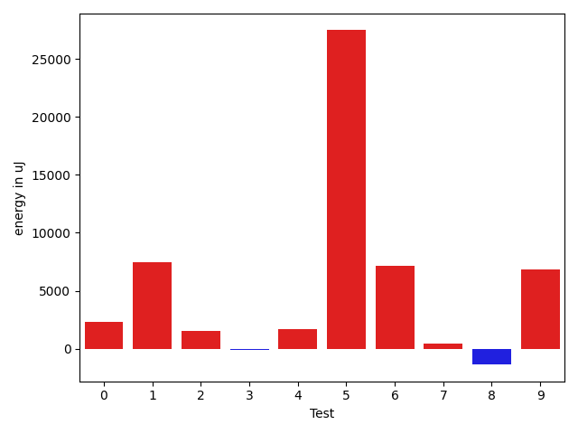
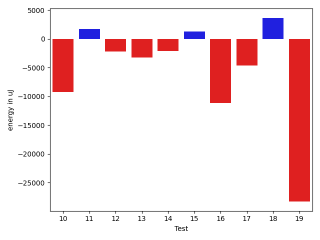
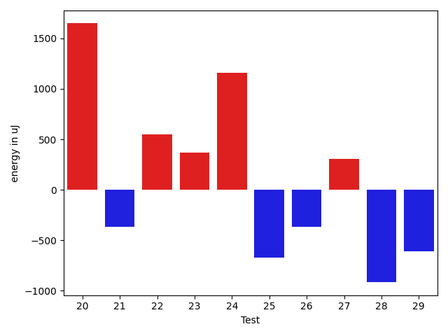
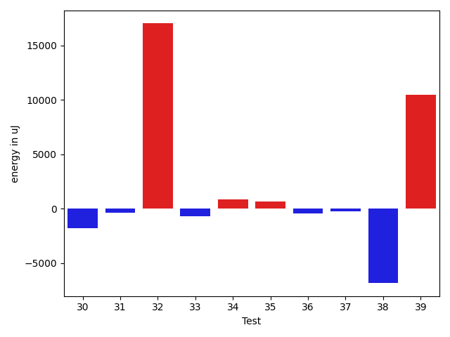
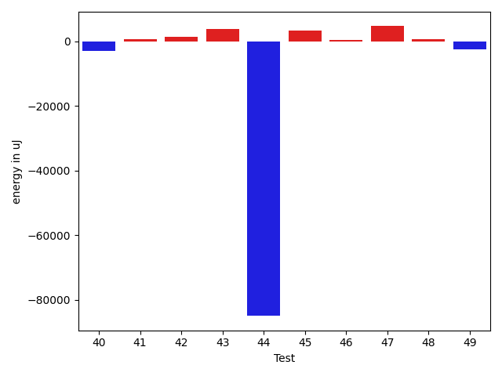
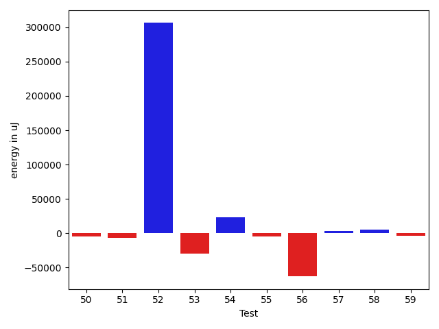
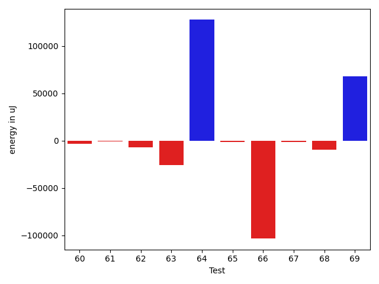
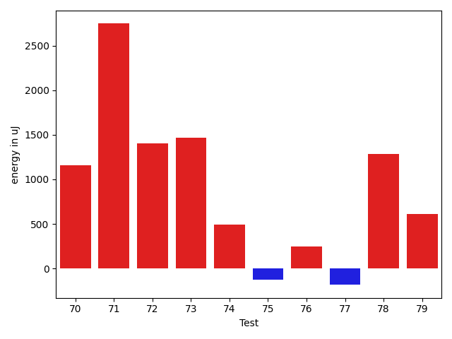
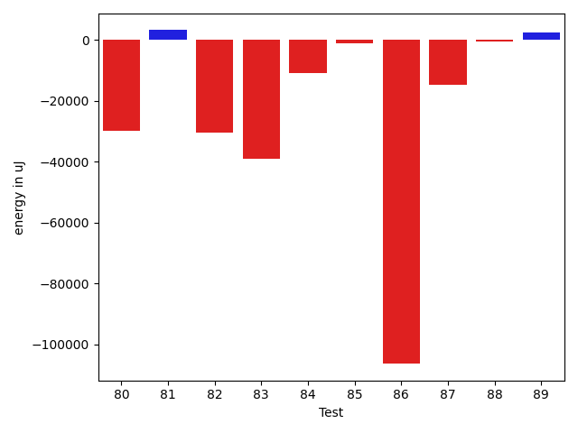

# gson 9c30b0

https://github.com/google/gson/commit/9c30b0

## Delta Energy per test method

| ID | EnergyV1 | EnergyV2 | DeltaEnergy | σV1 | σV2 |
| --- | --- | --- | --- | --- | --- |
| 0 | 40227.17391304348 | 42539.11111111111 | 2311.9371980676297 | 4130.071929599689 | 3507.9133328258386 |
| 1 | 107551.78048780488 | 115000.67032967033 | 7448.889841865457 | 233024.68380949 | 262927.80290945346 |
| 2 | 40687.62790697674 | 42196.625 | 1508.9970930232594 | 4822.144982644114 | 6403.331725311051 |
| 3 | 42586.565217391304 | 42455.51851851852 | -131.04669887278578 | 9817.045512452958 | 10940.66181345186 |
| 4 | 39819.32 | 41503.92857142857 | 1684.6085714285728 | 4336.700263748925 | 4604.381577278719 |
| 5 | 41372.08 | 68831.06666666667 | 27458.986666666664 | 3675.9357983512173 | 102989.01941434771 |
| 6 | 40440.63157894737 | 47549.52631578947 | 7108.894736842107 | 4119.010742380368 | 27048.293946332404 |
| 7 | 40349.608695652176 | 40752.55172413793 | 402.9430284857517 | 3522.176596554422 | 4804.445043744292 |
| 8 | 138347.8282828283 | 136975.46464646465 | -1372.363636363647 | 30908.8442146853 | 22610.464660593378 |
| 9 | 123377.62626262626 | 130214.1313131313 | 6836.505050505046 | 166397.05690018117 | 197105.40988622583 |
| 10 | 45380.08163265306 | 48178.58 | 2798.4983673469396 | 16307.735717696498 | 12345.347651791746 |
| 11 | 45990.14457831325 | 45706.68235294118 | -283.4622253720736 | 13456.978021572042 | 12413.695310101722 |
| 12 | 41137.448979591834 | 41448.653846153844 | 311.20486656200956 | 3299.6125255589463 | 3812.1739501669344 |
| 13 | 46792.36666666667 | 41269.269841269845 | -5523.096825396824 | 29504.055003206297 | 3969.2921851377 |
| 14 | 60301.9494949495 | 60676.77777777778 | 374.8282828282827 | 25739.521115200903 | 23953.274213066878 |
| 15 | 60096.604166666664 | 67937.29824561403 | 7840.6940789473665 | 51569.44404988432 | 57920.48859563137 |
| 16 | 95945.55 | 101065.62162162163 | 5120.071621621624 | 238043.4402018831 | 242273.94236403875 |
| 17 | 175491.0707070707 | 129405.28282828283 | -46085.78787878787 | 236100.0448883221 | 140405.31239532607 |
| 18 | 48833.61616161616 | 55641.510204081635 | 6807.894042465472 | 15744.878957553838 | 44360.96711585509 |
| 19 | 118612.04040404041 | 126356.06060606061 | 7744.020202020198 | 46331.03568467392 | 52744.24593420636 |
| 20 | 47043.49438202247 | 50141.241758241755 | 3097.747376219282 | 12482.900332930589 | 14984.52156216699 |
| 21 | 45688.806818181816 | 43492.19736842105 | -2196.609449760763 | 18824.680001420013 | 9392.279093993468 |
| 22 | 49981.28125 | 51785.010416666664 | 1803.7291666666642 | 15616.049578280516 | 17596.987742635807 |
| 23 | 57317.887323943665 | 58512.81538461539 | 1194.928060671722 | 30909.129026851784 | 36426.7817091902 |
| 24 | 47652.84507042253 | 48955.328571428574 | 1302.4835010060415 | 21262.386688239447 | 20753.33073902764 |
| 25 | 42394.0 | 42063.20547945205 | -330.7945205479482 | 3138.332580987695 | 6777.65591870071 |
| 26 | 54804.43298969072 | 56774.38775510204 | 1969.9547654113194 | 28557.85209764693 | 34837.58954430988 |
| 27 | 145766.35353535353 | 143620.91919191918 | -2145.4343434343464 | 24877.784224595198 | 31661.376772733453 |
| 28 | 42718.28813559322 | 41456.846153846156 | -1261.4419817470625 | 4126.578288922312 | 4242.289973880286 |
| 29 | 41556.12244897959 | 41070.270833333336 | -485.8516156462574 | 3759.9763005801797 | 4576.188064042237 |
| 30 | 75329.49494949495 | 77052.66666666667 | 1723.1717171717173 | 34287.124243900085 | 42109.99820359852 |
| 31 | 41707.739726027394 | 41455.17567567567 | -252.56405035172065 | 3018.18611510426 | 2371.683074163408 |
| 32 | 1611856.6464646466 | 1627008.2525252525 | 15151.606060605962 | 190876.62504532398 | 211763.3132922031 |
| 33 | 53143.61616161616 | 48172.62626262626 | -4970.989898989901 | 18533.171133859167 | 16310.081145767874 |
| 34 | 47670.80808080808 | 52949.37373737374 | 5278.565656565661 | 15347.557094904349 | 18660.184212925666 |
| 35 | 44733.934782608696 | 47461.18085106383 | 2727.2460684551334 | 11027.151910471546 | 14431.465608739436 |
| 36 | 42163.21568627451 | 41497.76666666667 | -665.4490196078405 | 2763.081012017134 | 2386.4204600661265 |
| 37 | 47272.98809523809 | 45263.83720930233 | -2009.1508859357637 | 24531.60677550399 | 9764.928182806041 |
| 38 | 66447.96511627907 | 63413.75 | -3034.2151162790688 | 28253.39756702153 | 22304.616080253432 |
| 39 | 114608.28282828283 | 122589.72727272728 | 7981.4444444444525 | 49100.72054256227 | 44411.23542001145 |
| 40 | 53865.36170212766 | 51020.81052631579 | -2844.5511758118664 | 29323.614114955017 | 20646.03521581131 |
| 41 | 41189.84210526316 | 41851.96875 | 662.1266447368398 | 3701.5384570139836 | 5502.101811378397 |
| 42 | 40406.833333333336 | 41817.21621621621 | 1410.3828828828773 | 4601.117198270679 | 4011.264484431481 |
| 43 | 81696.82828282828 | 85464.39393939394 | 3767.5656565656536 | 32979.976730621434 | 48245.75493228628 |
| 44 | 139778.63888888888 | 54801.92592592593 | -84976.71296296295 | 311125.5212814394 | 30679.939958323987 |
| 45 | 42108.380952380954 | 45525.95 | 3417.569047619043 | 4470.81509002117 | 10871.749300250627 |
| 46 | 46143.739583333336 | 46689.21875 | 545.4791666666642 | 12313.961875351079 | 12927.106537075435 |
| 47 | 44304.65934065934 | 49004.114583333336 | 4699.455242673997 | 10759.407815131039 | 14481.178489155756 |
| 48 | 47860.979166666664 | 48487.59793814433 | 626.6187714776679 | 23934.457348393473 | 15096.17208711225 |
| 49 | 148822.44444444444 | 146338.50505050505 | -2483.939393939392 | 49863.82369857804 | 32087.75691011607 |
| 50 | 43969.36263736264 | 48410.96875 | 4441.606112637361 | 9258.9500870589 | 35178.58336979011 |
| 51 | 63920.22222222222 | 63822.82828282828 | -97.39393939393631 | 30665.710678299343 | 39642.107905263234 |
| 52 | 47990.95918367347 | 50231.15151515151 | 2240.1923314780433 | 15315.172854047529 | 18446.741648369494 |
| 53 | 116078.06060606061 | 125341.18181818182 | 9263.121212121216 | 165683.14255318601 | 204290.75429843986 |
| 54 | 42079.220588235294 | 43571.985714285714 | 1492.7651260504208 | 5625.474897196493 | 10587.43927962734 |
| 55 | 52422.88775510204 | 56412.9595959596 | 3990.071840857556 | 19083.823908671893 | 20738.234632560583 |
| 56 | 45524.545454545456 | 45667.686046511626 | 143.14059196617018 | 11003.592648755772 | 10553.248481757277 |
| 57 | 41687.566666666666 | 42064.931818181816 | 377.3651515151505 | 4029.6465024173576 | 3676.167711191341 |
| 58 | 45701.778947368424 | 48741.75257731959 | 3039.973629951164 | 12298.36488333987 | 16232.408500669162 |
| 59 | 41066.87142857143 | 42035.13114754098 | 968.2597189695516 | 3527.162521758525 | 3887.00963266618 |
| 60 | 78418.51351351352 | 41945.42105263158 | -36473.09246088194 | 216426.27654058734 | 3637.2066684518322 |
| 61 | 42870.36956521739 | 45131.68421052631 | 2261.314645308921 | 6901.500323208544 | 29299.262249353953 |
| 62 | 168376.9898989899 | 198203.43434343435 | 29826.444444444438 | 188683.87279912035 | 270296.425880254 |
| 63 | 146457.7380952381 | 64325.744680851065 | -82131.99341438705 | 241833.97706652465 | 91813.42834745655 |
| 64 | 47271.22784810127 | 41860.835820895525 | -5410.392027205744 | 46583.79719399629 | 6572.330397480199 |
| 65 | 134751.1616161616 | 178240.70707070708 | 43489.54545454547 | 175913.08441603128 | 289571.07900570857 |
| 66 | 163083.0909090909 | 193390.28282828283 | 30307.191919191915 | 96243.90361982226 | 121629.5639382087 |
| 67 | 48172.10843373494 | 48753.653846153844 | 581.5454124189055 | 14574.598818601557 | 15666.214193269809 |
| 68 | 116433.63265306123 | 99570.51020408163 | -16863.1224489796 | 115578.84389784756 | 102716.13097748857 |
| 69 | 47168.671428571426 | 41871.0 | -5297.671428571426 | 26784.44249171598 | 6129.371036495531 |
| 70 | 116195.87878787878 | 139014.28282828283 | 22818.404040404042 | 114233.8879521842 | 179783.9731118984 |
| 71 | 98495.54081632652 | 100578.02083333333 | 2082.4800170068047 | 170483.67917308447 | 132158.68535353462 |
| 72 | 50353.244680851065 | 54831.53191489362 | 4478.287234042553 | 18515.886175542968 | 18152.863679896243 |
| 73 | 49557.05454545454 | 43725.38333333333 | -5831.671212121211 | 54857.984242759434 | 5915.61369623267 |
| 74 | 49155.857142857145 | 57388.0 | 8232.142857142855 | 22967.972364195517 | 30632.989923330326 |
| 75 | 41137.525 | 41759.57142857143 | 622.0464285714261 | 3590.69241224795 | 3721.3007271706515 |
| 76 | 41338.34848484849 | 43768.84375 | 2430.4952651515123 | 4983.728330831046 | 8027.570322836539 |
| 77 | 54227.617021276594 | 46529.24193548387 | -7698.3750857927225 | 31491.447950571284 | 12673.528191808467 |
| 78 | 49131.88888888889 | 53087.380952380954 | 3955.4920634920636 | 30817.879555884236 | 35281.423793584276 |
| 79 | 50435.448979591834 | 47551.919191919194 | -2883.52978767264 | 17506.634677081274 | 15110.848431398628 |
| 80 | 47415.97014925373 | 52094.333333333336 | 4678.363184079608 | 23091.65493120395 | 31937.815733520092 |
| 81 | 112050.9797979798 | 107290.18181818182 | -4760.797979797979 | 38361.395776730875 | 38003.63420776025 |
| 82 | 75471.80232558139 | 60179.788235294116 | -15292.014090287274 | 52616.42028294169 | 68502.55819664377 |
| 83 | 109885.22222222222 | 106494.31313131313 | -3390.9090909090883 | 32683.15058702345 | 27853.212471141545 |
| 84 | 45124.08571428571 | 40944.22222222222 | -4179.863492063494 | 20529.751899372677 | 4565.275926376259 |
| 85 | 48181.13333333333 | 48597.92307692308 | 416.78974358974665 | 22873.939030744623 | 21947.478533856294 |
| 86 | 41299.0 | 47447.380952380954 | 6148.380952380954 | 4302.549094930319 | 30169.708631382142 |
| 87 | 133089.5061728395 | 161933.42696629214 | 28843.92079345265 | 234556.21194713796 | 252270.375041973 |
| 88 | 55129.51111111111 | 57964.1568627451 | 2834.645751633987 | 38323.39666320604 | 40370.499522072656 |
| 89 | 52144.166666666664 | 50353.86363636364 | -1790.3030303030246 | 46263.28128302426 | 22374.99245768376 |

## Delta Duration per test method

| ID | DurationV1 | DurationsV2 | DeltaDuration |
| --- | --- | --- | --- |
| 0 | 573433.1739130435 | 448448.1111111111 | -124985.06280193233 |
| 1 | 3266323.012195122 | 3298957.6703296704 | 32634.65813454846 |
| 2 | 1062577.3255813953 | 729125.475 | -333451.8505813953 |
| 3 | 535915.9130434783 | 612323.3703703703 | 76407.45732689206 |
| 4 | 544349.0 | 682881.5 | 138532.5 |
| 5 | 483350.96 | 1229972.0666666667 | 746621.1066666667 |
| 6 | 542765.1578947369 | 760880.8421052631 | 218115.6842105263 |
| 7 | 513995.82608695654 | 567163.551724138 | 53167.72563718143 |
| 8 | 3779844.4444444445 | 3661865.8484848486 | -117978.59595959587 |
| 9 | 3392907.595959596 | 3710238.484848485 | 317330.888888889 |
| 10 | 1129863.142857143 | 1101812.2 | -28050.942857143003 |
| 11 | 1263944.4819277108 | 1293548.5764705883 | 29604.094542877516 |
| 12 | 795539.2653061225 | 776702.2115384615 | -18837.053767660982 |
| 13 | 1061001.6833333333 | 905510.4603174604 | -155491.223015873 |
| 14 | 1760044.0303030303 | 1765755.6262626264 | 5711.595959596103 |
| 15 | 1512447.2708333333 | 1758668.50877193 | 246221.23793859663 |
| 16 | 2388301.8 | 2591944.972972973 | 203643.17297297297 |
| 17 | 5022748.555555556 | 3510849.232323232 | -1511899.3232323239 |
| 18 | 1489476.5757575757 | 1543714.5102040817 | 54237.93444650597 |
| 19 | 3319090.767676768 | 3434527.707070707 | 115436.93939393898 |
| 20 | 1363590.5505617978 | 1411814.934065934 | 48224.38350413623 |
| 21 | 1231399.125 | 1249169.0394736843 | 17769.91447368427 |
| 22 | 1416397.6875 | 1475261.3333333333 | 58863.645833333256 |
| 23 | 1609535.7887323943 | 1563741.646153846 | -45794.142578548286 |
| 24 | 1345726.309859155 | 1227316.1857142858 | -118410.12414486916 |
| 25 | 973969.875 | 994194.0 | 20224.125 |
| 26 | 1611122.93814433 | 1771814.551020408 | 160691.6128760781 |
| 27 | 3644444.474747475 | 3804108.3232323234 | 159663.84848484863 |
| 28 | 937526.4745762711 | 969075.4923076923 | 31549.01773142116 |
| 29 | 730968.9591836735 | 789714.0 | 58745.04081632651 |
| 30 | 2220427.878787879 | 2377620.8282828284 | 157192.94949494954 |
| 31 | 973864.8219178083 | 1022158.8513513514 | 48294.029433543095 |
| 32 | 39518215.94949495 | 40099667.878787875 | 581451.9292929247 |
| 33 | 1492462.9292929294 | 1508932.9393939395 | 16470.01010101009 |
| 34 | 1446758.2424242424 | 1565999.8686868686 | 119241.62626262615 |
| 35 | 1304650.858695652 | 1387622.244680851 | 82971.3859851989 |
| 36 | 881837.5294117647 | 899166.3166666667 | 17328.787254901952 |
| 37 | 1277375.9404761905 | 1216002.7906976745 | -61373.14977851603 |
| 38 | 1782545.5 | 1616852.5875 | -165692.9125000001 |
| 39 | 3253410.606060606 | 3248719.1414141413 | -4691.464646464679 |
| 40 | 1591924.3404255318 | 1466926.9473684211 | -124997.39305711072 |
| 41 | 1018934.1578947369 | 1040669.53125 | 21735.373355263146 |
| 42 | 745001.8055555555 | 691233.7297297297 | -53768.0758258258 |
| 43 | 2309645.6868686867 | 2378115.494949495 | 68469.80808080826 |
| 44 | 4049228.6805555555 | 1488251.3950617283 | -2560977.2854938274 |
| 45 | 1252171.142857143 | 719032.15 | -533138.9928571429 |
| 46 | 1291217.6458333333 | 1382064.28125 | 90846.63541666674 |
| 47 | 1288250.131868132 | 1344648.8333333333 | 56398.70146520133 |
| 48 | 1418024.4479166667 | 1404948.092783505 | -13076.355133161647 |
| 49 | 4039224.6565656564 | 3857577.0606060605 | -181647.59595959587 |
| 50 | 1272297.7912087913 | 1409589.21875 | 137291.4275412087 |
| 51 | 1771050.9090909092 | 1978818.3737373736 | 207767.46464646445 |
| 52 | 1382133.2551020407 | 1425794.3535353534 | 43661.09843331273 |
| 53 | 3219282.131313131 | 3603808.8585858587 | 384526.7272727275 |
| 54 | 974136.2794117647 | 1093340.5857142857 | 119204.30630252103 |
| 55 | 1513883.2959183673 | 1536787.0404040404 | 22903.74448567303 |
| 56 | 1293465.1022727273 | 1347864.2558139535 | 54399.15354122617 |
| 57 | 1142479.677777778 | 1120928.3977272727 | -21551.280050505185 |
| 58 | 1355060.5263157894 | 1342260.2783505155 | -12800.247965273913 |
| 59 | 909824.5285714286 | 918995.1639344263 | 9170.635362997651 |
| 60 | 1759836.6486486488 | 620726.0263157894 | -1139110.6223328593 |
| 61 | 789551.9782608695 | 1066632.0701754387 | 277080.09191456914 |
| 62 | 4549675.4949494945 | 5697840.101010101 | 1148164.6060606064 |
| 63 | 3992385.095238095 | 1610608.4468085107 | -2381776.6484295847 |
| 64 | 1189632.759493671 | 1071226.6865671643 | -118406.07292650663 |
| 65 | 3745710.5454545454 | 5115151.636363637 | 1369441.0909090913 |
| 66 | 4271333.04040404 | 5066172.838383839 | 794839.7979797982 |
| 67 | 1307474.4578313252 | 1503834.5128205128 | 196360.0549891875 |
| 68 | 3463175.5 | 3033426.826530612 | -429748.6734693879 |
| 69 | 1209646.6142857142 | 1099540.2575757576 | -110106.35670995666 |
| 70 | 3183198.0404040404 | 3871879.717171717 | 688681.6767676766 |
| 71 | 2755511.051020408 | 2673521.28125 | -81989.76977040805 |
| 72 | 1529647.0212765958 | 1540511.670212766 | 10864.648936170153 |
| 73 | 1064371.7272727273 | 883644.5666666667 | -180727.16060606064 |
| 74 | 879422.9142857143 | 1456404.8214285714 | 576981.9071428571 |
| 75 | 744384.225 | 785500.619047619 | 41116.39404761908 |
| 76 | 1032489.5909090909 | 1099397.90625 | 66908.31534090906 |
| 77 | 1591503.3617021276 | 1203788.1129032257 | -387715.2487989019 |
| 78 | 1114669.088888889 | 1197483.3095238095 | 82814.22063492052 |
| 79 | 1428576.0102040817 | 1515310.1616161617 | 86734.15141208004 |
| 80 | 1175315.656716418 | 1372944.8181818181 | 197629.16146540013 |
| 81 | 3139631.3636363638 | 2865280.4545454546 | -274350.9090909092 |
| 82 | 2226077.6395348837 | 1606999.8352941177 | -619077.804240766 |
| 83 | 3054958.98989899 | 2753918.6363636362 | -301040.3535353537 |
| 84 | 942595.1714285715 | 624461.8333333334 | -318133.3380952381 |
| 85 | 834933.4333333333 | 907805.6923076923 | 72872.2589743589 |
| 86 | 511818.5714285714 | 705938.4285714285 | 194119.8571428571 |
| 87 | 3805937.2592592593 | 4612445.370786517 | 806508.1115272576 |
| 88 | 1477475.9777777777 | 1446163.862745098 | -31312.115032679634 |
| 89 | 911841.0333333333 | 1121234.2727272727 | 209393.23939393938 |

## Misc.

| ID | Test Class | Test Method |
| --- | --- | --- |
| 0 | com.google.gson.functional.TypeAdapterPrecedenceTest | testStreamingFollowedByNonstreaming |
| 1 | com.google.gson.functional.TypeAdapterPrecedenceTest | testNonstreamingFollowedByNonstreaming |
| 2 | com.google.gson.functional.TypeAdapterPrecedenceTest | testStreamingFollowedByStreaming |
| 3 | com.google.gson.functional.TypeAdapterPrecedenceTest | testStreamingFollowedByNonstreamingHierarchical |
| 4 | com.google.gson.functional.TypeAdapterPrecedenceTest | testStreamingHierarchicalFollowedByNonstreamingHierarchical |
| 5 | com.google.gson.functional.TypeAdapterPrecedenceTest | testSerializeNonstreamingTypeAdapterFollowedByStreamingTypeAdapter |
| 6 | com.google.gson.functional.TypeAdapterPrecedenceTest | testStreamingHierarchicalFollowedByNonstreaming |
| 7 | com.google.gson.functional.TypeAdapterPrecedenceTest | testNonstreamingHierarchicalFollowedByNonstreaming |
| 8 | com.google.gson.functional.StreamingTypeAdaptersTest | testNullSafe |
| 9 | com.google.gson.functional.JsonAdapterAnnotationOnClassesTest | testJsonAdapterInvoked |
| 10 | com.google.gson.functional.JsonAdapterAnnotationOnClassesTest | testRegisteredSerializerOverridesJsonAdapter |
| 11 | com.google.gson.functional.JsonAdapterAnnotationOnClassesTest | testJsonAdapterFactoryInvoked |
| 12 | com.google.gson.functional.JsonAdapterAnnotationOnClassesTest | testRegisteredDeserializerOverridesJsonAdapter |
| 13 | com.google.gson.functional.CustomDeserializerTest | testDefaultConstructorNotCalledOnField |
| 14 | com.google.gson.functional.CustomDeserializerTest | testJsonTypeFieldBasedDeserialization |
| 15 | com.google.gson.functional.CustomDeserializerTest | testDefaultConstructorNotCalledOnObject |
| 16 | com.google.gson.OverrideCoreTypeAdaptersTest | testOverrideStringAdapter |
| 17 | com.google.gson.functional.JsonAdapterSerializerDeserializerTest | testJsonSerializerDeserializerBasedJsonAdapterOnFields |
| 18 | com.google.gson.functional.JsonAdapterSerializerDeserializerTest | testJsonSerializerDeserializerBasedJsonAdapterOnClass |
| 19 | com.google.gson.functional.ThrowableFunctionalTest | testExceptionWithoutCause |
| 20 | com.google.gson.functional.ThrowableFunctionalTest | testErrornWithCause |
| 21 | com.google.gson.functional.ThrowableFunctionalTest | testErrorWithoutCause |
| 22 | com.google.gson.functional.ThrowableFunctionalTest | testExceptionWithCause |
| 23 | com.google.gson.functional.ReadersWritersTest | testReadWriteTwoObjects |
| 24 | com.google.gson.functional.ReadersWritersTest | testReadWriteTwoStrings |
| 25 | com.google.gson.functional.MapTest | testConcurrentSkipListMap |
| 26 | com.google.gson.functional.MapTest | testConcurrentMap |
| 27 | com.google.gson.functional.MapTest | testConcurrentNavigableMap |
| 28 | com.google.gson.functional.MapTest | testConcurrentHashMap |
| 29 | com.google.gson.functional.DefaultTypeAdaptersTest | testBitSetDeserialization |
| 30 | com.google.gson.functional.DefaultTypeAdaptersTest | testOverrideBigIntegerTypeAdapter |
| 31 | com.google.gson.functional.DefaultTypeAdaptersTest | testTimestampSerialization |
| 32 | com.google.gson.functional.DefaultTypeAdaptersTest | testDefaultDateDeserializationUsingBuilder |
| 33 | com.google.gson.functional.DefaultTypeAdaptersTest | testOverrideBigDecimalTypeAdapter |
| 34 | com.google.gson.functional.DefaultTypeAdaptersTest | testDateDeserializationWithPattern |
| 35 | com.google.gson.functional.DefaultTypeAdaptersTest | testDateSerializationInCollection |
| 36 | com.google.gson.functional.DefaultTypeAdaptersTest | testSqlDateSerialization |
| 37 | com.google.gson.functional.EnumTest | testEnumSubclassAsParameterizedType |
| 38 | com.google.gson.functional.EnumTest | testEnumCaseMapping |
| 39 | com.google.gson.functional.EnumTest | testEnumSubclass |
| 40 | com.google.gson.functional.EnumTest | testEnumSubclassWithRegisteredTypeAdapter |
| 41 | com.google.gson.functional.EnumTest | testEnumSet |
| 42 | com.google.gson.functional.DelegateTypeAdapterTest | testDelegateInvokedOnStrings |
| 43 | com.google.gson.functional.DelegateTypeAdapterTest | testDelegateInvoked |
| 44 | com.google.gson.JsonParserTest | testReadWriteTwoObjects |
| 45 | com.google.gson.JsonParserTest | testParseMixedArray |
| 46 | com.google.gson.functional.ParameterizedTypesTest | testVariableTypeArrayDeserialization |
| 47 | com.google.gson.functional.ParameterizedTypesTest | testVariableTypeDeserialization |
| 48 | com.google.gson.functional.ParameterizedTypesTest | testParameterizedTypeGenericArraysDeserialization |
| 49 | com.google.gson.functional.ParameterizedTypesTest | testVariableTypeFieldsAndGenericArraysDeserialization |
| 50 | com.google.gson.functional.ParameterizedTypesTest | testParameterizedTypeWithVariableTypeDeserialization |
| 51 | com.google.gson.functional.ObjectTest | testSingletonLists |
| 52 | com.google.gson.functional.JsonAdapterAnnotationOnFieldsTest | testPrimitiveFieldAnnotationTakesPrecedenceOverDefault |
| 53 | com.google.gson.functional.JsonAdapterAnnotationOnFieldsTest | testClassAnnotationAdapterFactoryTakesPrecedenceOverDefault |
| 54 | com.google.gson.functional.JsonAdapterAnnotationOnFieldsTest | testClassAnnotationAdapterTakesPrecedenceOverDefault |
| 55 | com.google.gson.functional.JsonAdapterAnnotationOnFieldsTest | testFieldAnnotationWorksForParameterizedType |
| 56 | com.google.gson.functional.JsonAdapterAnnotationOnFieldsTest | testRegisteredTypeAdapterTakesPrecedenceOverClassAnnotationAdapter |
| 57 | com.google.gson.functional.JsonAdapterAnnotationOnFieldsTest | testFieldAnnotationTakesPrecedenceOverClassAnnotation |
| 58 | com.google.gson.functional.JsonAdapterAnnotationOnFieldsTest | testFieldAnnotationTakesPrecedenceOverRegisteredTypeAdapter |
| 59 | com.google.gson.functional.JsonAdapterAnnotationOnFieldsTest | testNonPrimitiveFieldAnnotationTakesPrecedenceOverDefault |
| 60 | com.google.gson.functional.JsonAdapterAnnotationOnFieldsTest | testJsonAdapterWrappedInNullSafeAsRequested |
| 61 | com.google.gson.functional.TypeHierarchyAdapterTest | testRegisterSuperTypeFirst |
| 62 | com.google.gson.functional.TypeHierarchyAdapterTest | testTypeHierarchy |
| 63 | com.google.gson.internal.bind.JsonElementReaderTest | testSkipValue |
| 64 | com.google.gson.functional.MapAsArrayTypeAdapterTest | testMultipleEnableComplexKeyRegistrationHasNoEffect |
| 65 | com.google.gson.functional.MapAsArrayTypeAdapterTest | testSerializeComplexMapWithTypeAdapter |
| 66 | com.google.gson.functional.RuntimeTypeAdapterFactoryFunctionalTest | testSubclassesAutomaticallySerialized |
| 67 | com.google.gson.functional.CollectionTest | testFieldIsArrayList |
| 68 | com.google.gson.functional.CollectionTest | testWildcardCollectionField |
| 69 | com.google.gson.functional.ExclusionStrategyFunctionalTest | testExclusionStrategyWithMode |
| 70 | com.google.gson.functional.ExclusionStrategyFunctionalTest | testExclusionStrategyDeserialization |
| 71 | com.google.gson.functional.TypeVariableTest | testAdvancedTypeVariables |
| 72 | com.google.gson.functional.TypeVariableTest | testTypeVariablesViaTypeParameter |
| 73 | com.google.gson.functional.TypeVariableTest | testBasicTypeVariables |
| 74 | com.google.gson.GsonTypeAdapterTest | testTypeAdapterDoesNotAffectNonAdaptedTypes |
| 75 | com.google.gson.functional.EscapingTest | testGsonDoubleDeserialization |
| 76 | com.google.gson.functional.EscapingTest | testGsonAcceptsEscapedAndNonEscapedJsonDeserialization |
| 77 | com.google.gson.functional.EscapingTest | testEscapingObjectFields |
| 78 | com.google.gson.functional.EscapingTest | testEscapingQuotesInStringArray |
| 79 | com.google.gson.functional.JavaUtilConcurrentAtomicTest | testAtomicLongArrayWithStringSerializationPolicy |
| 80 | com.google.gson.functional.JavaUtilConcurrentAtomicTest | testAtomicLongWithStringSerializationPolicy |
| 81 | com.google.gson.DefaultInetAddressTypeAdapterTest | testInetAddressSerializationAndDeserialization |
| 82 | com.google.gson.functional.JsonParserTest | testBadFieldTypeForDeserializingCustomTree |
| 83 | com.google.gson.functional.JavaUtilTest | testCurrency |
| 84 | com.google.gson.functional.JavaUtilTest | testProperties |
| 85 | com.google.gson.functional.StringTest | testSingleQuoteInStringSerialization |
| 86 | com.google.gson.functional.StringTest | testEscapingQuotesInStringSerialization |
| 87 | com.google.gson.functional.NamingPolicyTest | testComplexFieldNameStrategy |
| 88 | com.google.gson.functional.UncategorizedTest | testGsonInstanceReusableForSerializationAndDeserialization |
| 89 | com.google.gson.functional.PrimitiveTest | testQuotedStringSerializationAndDeserialization |

| Test | IterationV1 | IterationV2 | DeltaIteration |
| --- | --- | --- | --- |
| 0 | 23 | 27 | 4 |
| 1 | 82 | 91 | 9 |
| 2 | 43 | 40 | -3 |
| 3 | 23 | 27 | 4 |
| 4 | 25 | 28 | 3 |
| 5 | 25 | 15 | -10 |
| 6 | 19 | 19 | 0 |
| 7 | 23 | 29 | 6 |
| 8 | 99 | 99 | 0 |
| 9 | 99 | 99 | 0 |
| 10 | 49 | 50 | 1 |
| 11 | 83 | 85 | 2 |
| 12 | 49 | 52 | 3 |
| 13 | 60 | 63 | 3 |
| 14 | 99 | 99 | 0 |
| 15 | 48 | 57 | 9 |
| 16 | 40 | 37 | -3 |
| 17 | 99 | 99 | 0 |
| 18 | 99 | 98 | -1 |
| 19 | 99 | 99 | 0 |
| 20 | 89 | 91 | 2 |
| 21 | 88 | 76 | -12 |
| 22 | 96 | 96 | 0 |
| 23 | 71 | 65 | -6 |
| 24 | 71 | 70 | -1 |
| 25 | 72 | 73 | 1 |
| 26 | 97 | 98 | 1 |
| 27 | 99 | 99 | 0 |
| 28 | 59 | 65 | 6 |
| 29 | 49 | 48 | -1 |
| 30 | 99 | 99 | 0 |
| 31 | 73 | 74 | 1 |
| 32 | 99 | 99 | 0 |
| 33 | 99 | 99 | 0 |
| 34 | 99 | 99 | 0 |
| 35 | 92 | 94 | 2 |
| 36 | 51 | 60 | 9 |
| 37 | 84 | 86 | 2 |
| 38 | 86 | 80 | -6 |
| 39 | 99 | 99 | 0 |
| 40 | 94 | 95 | 1 |
| 41 | 76 | 64 | -12 |
| 42 | 36 | 37 | 1 |
| 43 | 99 | 99 | 0 |
| 44 | 72 | 81 | 9 |
| 45 | 21 | 20 | -1 |
| 46 | 96 | 96 | 0 |
| 47 | 91 | 96 | 5 |
| 48 | 96 | 97 | 1 |
| 49 | 99 | 99 | 0 |
| 50 | 91 | 96 | 5 |
| 51 | 99 | 99 | 0 |
| 52 | 98 | 99 | 1 |
| 53 | 99 | 99 | 0 |
| 54 | 68 | 70 | 2 |
| 55 | 98 | 99 | 1 |
| 56 | 88 | 86 | -2 |
| 57 | 90 | 88 | -2 |
| 58 | 95 | 97 | 2 |
| 59 | 70 | 61 | -9 |
| 60 | 37 | 38 | 1 |
| 61 | 46 | 57 | 11 |
| 62 | 99 | 99 | 0 |
| 63 | 42 | 47 | 5 |
| 64 | 79 | 67 | -12 |
| 65 | 99 | 99 | 0 |
| 66 | 99 | 99 | 0 |
| 67 | 83 | 78 | -5 |
| 68 | 98 | 98 | 0 |
| 69 | 70 | 66 | -4 |
| 70 | 99 | 99 | 0 |
| 71 | 98 | 96 | -2 |
| 72 | 94 | 94 | 0 |
| 73 | 55 | 60 | 5 |
| 74 | 35 | 28 | -7 |
| 75 | 40 | 42 | 2 |
| 76 | 66 | 64 | -2 |
| 77 | 47 | 62 | 15 |
| 78 | 45 | 42 | -3 |
| 79 | 98 | 99 | 1 |
| 80 | 67 | 66 | -1 |
| 81 | 99 | 99 | 0 |
| 82 | 86 | 85 | -1 |
| 83 | 99 | 99 | 0 |
| 84 | 35 | 36 | 1 |
| 85 | 30 | 26 | -4 |
| 86 | 14 | 21 | 7 |
| 87 | 81 | 89 | 8 |
| 88 | 45 | 51 | 6 |
| 89 | 30 | 22 | -8 |

| Time Label | Time (s) |
| --- | --- |
| Selection | 35.42056345939636 |
| Injection | 18.648005962371826 |
| Total | 1480.7233955860138 |

