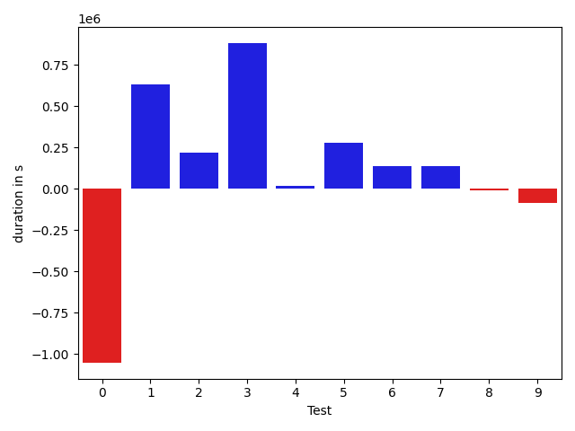
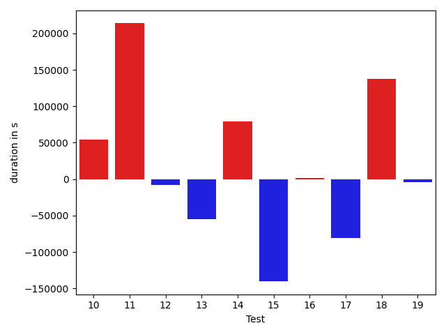
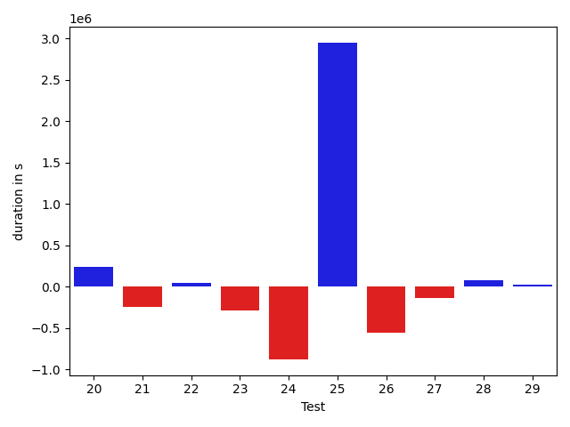
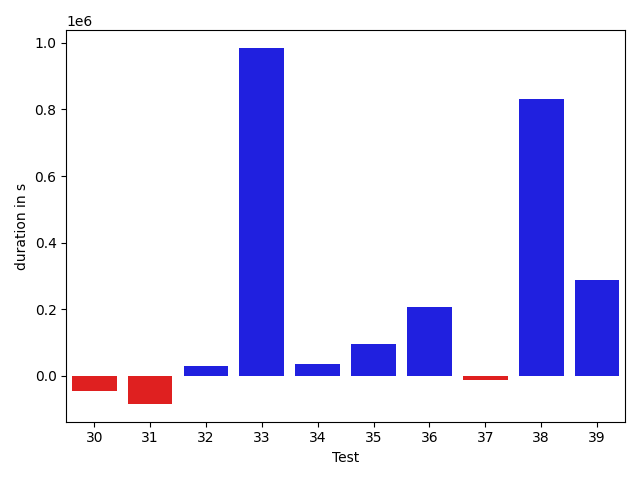
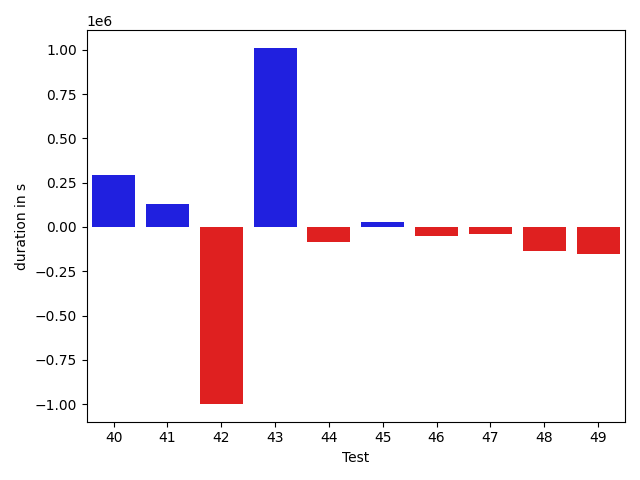
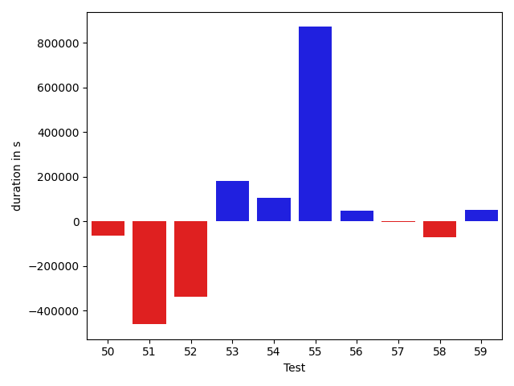
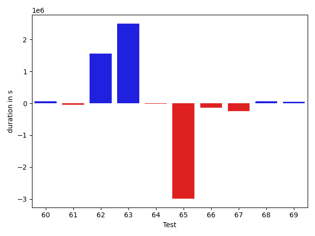
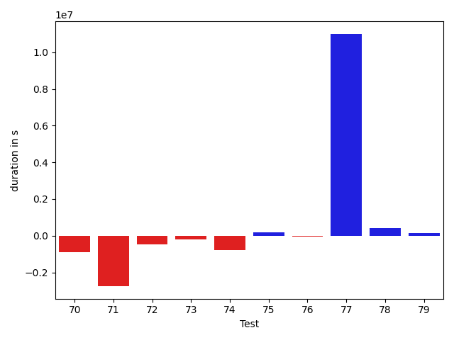
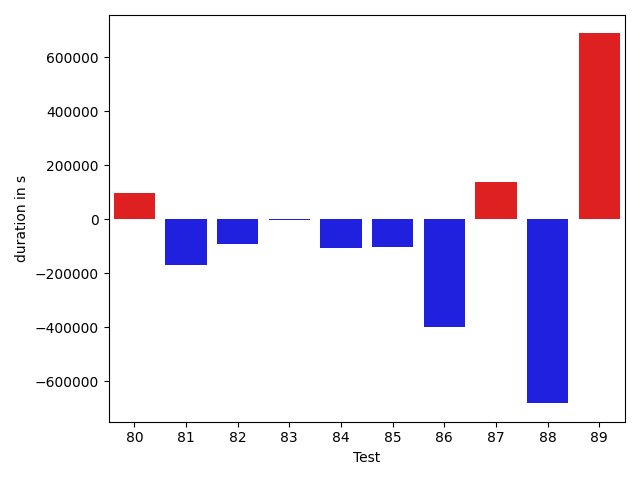

# gson 9e6f2b

https://github.com/google/gson/commit/9e6f2b

## Delta Energy per test method

| ID | EnergyV1 | EnergyV2 | DeltaEnergy |
| --- | --- | --- | --- |
| 0 | 159050.04899579604 | 130284.35637467046 | -28765.692621125578 |
| 1 | 114886.20058468505 | 120250.60755653953 | 5364.406971854478 |
| 2 | 41584.688466290725 | 38357.942195631535 | -3226.7462706591905 |
| 3 | 42846.88121334587 | 61059.07310770684 | 18212.19189436097 |
| 4 | 45818.49819044792 | 38135.54230882632 | -7682.955881621601 |
| 5 | 47146.45569621139 | 40103.20041059752 | -7043.255285613872 |
| 6 | 190321.2393743646 | 149658.63826296385 | -40662.601111400756 |
| 7 | 47026.21706538393 | 40106.19130478101 | -6920.025760602919 |
| 8 | 91837.88530442676 | 91144.66902095098 | -693.2162834757764 |
| 9 | 43463.538488525155 | 44693.388576627316 | 1229.850088102161 |
| 10 | 45899.452784818444 | 45265.91995018876 | -633.532834629681 |
| 11 | 44541.830436276454 | 44274.51684120037 | -267.3135950760843 |
| 12 | 42425.6982700379 | 70013.45751269723 | 27587.759242659333 |
| 13 | 43936.25866387118 | 41486.98394287953 | -2449.274720991649 |
| 14 | 44290.17949685531 | 41282.40340767098 | -3007.776089184328 |
| 15 | 106664.18921848855 | 41296.220312902544 | -65367.96890558601 |
| 16 | 41182.265984277794 | 55057.924183178315 | 13875.65819890052 |
| 17 | 132932.02544119398 | 134146.81109429724 | 1214.7856531032594 |
| 18 | 51664.268602979006 | 44757.93915110623 | -6906.329451872778 |
| 19 | 78954.39358544664 | 51729.35383437641 | -27225.03975107023 |
| 20 | 134668.064284961 | 132029.15434454882 | -2638.9099404121807 |
| 21 | 61123.065648995645 | 44722.204057655545 | -16400.8615913401 |
| 22 | 38952.40092888458 | 42558.35291380131 | 3605.9519849167336 |
| 23 | 40350.95768579488 | 41458.02950181173 | 1107.0718160168544 |
| 24 | 103861.27235197231 | 99011.49189629662 | -4849.780455675689 |
| 25 | 42633.424298763275 | 35498.13517951965 | -7135.289119243622 |
| 26 | 60180.08665183592 | 44830.12217238372 | -15349.964479452196 |
| 27 | 37369.91638183594 | 42470.562791109085 | 5100.646409273148 |
| 28 | 42116.306056685746 | 42488.0214917378 | 371.7154350520577 |
| 29 | 38817.52026081085 | 39904.669509887695 | 1087.1492490768433 |
| 30 | 42888.82094482705 | 41836.09552001953 | -1052.7254248075187 |
| 31 | 40981.08578491211 | 42464.29818248749 | 1483.2123975753784 |
| 32 | 40964.307233233005 | 36843.40242242813 | -4120.904810804874 |
| 33 | 48911.70384949753 | 82241.82622732066 | 33330.122377823136 |
| 34 | 43377.93680310878 | 40019.09263563156 | -3358.8441674772184 |
| 35 | 41498.823196473706 | 40150.19353143253 | -1348.629665041175 |
| 36 | 43522.72090671998 | 41095.65931538475 | -2427.0615913352303 |
| 37 | 40127.39281991347 | 44258.975184267605 | 4131.582364354137 |
| 38 | 113696.69375967476 | 148591.4177831713 | 34894.72402349653 |
| 39 | 42285.39604315862 | 52477.612614893456 | 10192.21657173484 |
| 40 | 43263.90942581999 | 57323.41625939498 | 14059.50683357499 |
| 41 | 45432.453511176805 | 57420.09527082633 | 11987.641759649523 |
| 42 | 80334.27540504174 | 56866.08042172675 | -23468.194983314992 |
| 43 | 69599.67650086911 | 90973.5404618692 | 21373.863961000083 |
| 44 | 44940.55879528775 | 45222.963326840145 | 282.4045315523981 |
| 45 | 45228.52000739025 | 43176.37961720509 | -2052.140390185159 |
| 46 | 39883.509192015175 | 44122.59758910036 | 4239.088397085186 |
| 47 | 44340.27755788724 | 43014.94725742236 | -1325.330300464877 |
| 48 | 37100.39359866921 | 41935.94986438751 | 4835.556265718304 |
| 49 | 41983.04624844882 | 44494.36139051818 | 2511.315142069354 |
| 50 | 42261.17282128233 | 43039.421082161716 | 778.2482608793871 |
| 51 | 105155.98118790996 | 83355.38576861087 | -21800.59541929909 |
| 52 | 73430.96224002306 | 49926.810121927025 | -23504.152118096034 |
| 53 | 75163.81149362314 | 72822.6399554321 | -2341.171538191047 |
| 54 | 39478.73387785381 | 43400.83460858368 | 3922.1007307298714 |
| 55 | 1648975.2341017271 | 1695432.2817192804 | 46457.04761755327 |
| 56 | 41248.287629217884 | 54543.99662117826 | 13295.708991960375 |
| 57 | 45002.47049484296 | 41689.842542495346 | -3312.6279523476114 |
| 58 | 44574.13138136783 | 41629.90240470118 | -2944.228976666651 |
| 59 | 40047.491676959355 | 46750.528936710296 | 6703.037259750941 |
| 60 | 40608.358317589846 | 42568.29197230279 | 1959.9336547129424 |
| 61 | 41524.72440020126 | 39931.150140162536 | -1593.5742600387239 |
| 62 | 95613.5562011457 | 138979.8103447154 | 43366.254143569706 |
| 63 | 132456.07702065175 | 187758.89932662196 | 55302.822305970214 |
| 64 | 49624.84216643248 | 41560.06827843357 | -8064.773887998905 |
| 65 | 207918.77975328793 | 62457.204469581295 | -145461.57528370665 |
| 66 | 43699.18171980188 | 40396.65160125232 | -3302.5301185495628 |
| 67 | 97712.08020310936 | 84793.41451134207 | -12918.665691767295 |
| 68 | 61787.514487562505 | 44789.43656532977 | -16998.077922232733 |
| 69 | 37046.932096280136 | 44897.767928107394 | 7850.8358318272585 |
| 70 | 66430.71076779909 | 37729.91597672795 | -28700.794791071137 |
| 71 | 109379.98934499387 | 49993.5869259738 | -59386.402419020065 |
| 72 | 42558.89101618776 | 41723.17331076607 | -835.7177054216882 |
| 73 | 39702.58929465292 | 41531.346644527795 | 1828.7573498748752 |
| 74 | 80277.29886556978 | 44226.44197329733 | -36050.85689227245 |
| 75 | 40840.26316909946 | 41074.22473012596 | 233.96156102650275 |
| 76 | 42141.80083179372 | 36338.58384198928 | -5803.216989804438 |
| 77 | 60800.32437161634 | 390713.2949619106 | 329912.9705902942 |
| 78 | 114205.67148345154 | 159815.65435723952 | 45609.98287378797 |
| 79 | 41000.71458152674 | 45038.259665541904 | 4037.5450840151607 |
| 80 | 91227.82059103284 | 93136.7015868959 | 1908.880995863059 |
| 81 | 73389.93439368592 | 42728.01313675509 | -30661.92125693083 |
| 82 | 137845.7254887045 | 167376.5548396181 | 29530.829350913584 |
| 83 | 40400.96575033178 | 38280.90299922414 | -2120.062751107638 |
| 84 | 42570.9180194814 | 43067.07276927569 | 496.15474979428836 |
| 85 | 50462.42695182352 | 44083.32149600983 | -6379.105455813697 |
| 86 | 81802.70554386752 | 41740.73178843332 | -40061.9737554342 |
| 87 | 40224.23970934749 | 35947.375936605036 | -4276.86377274245 |
| 88 | 40436.33573913574 | 41095.887451171875 | 659.5517120361328 |
| 89 | 43690.69077420165 | 41968.015625 | -1722.6751492016483 |

## Delta Duration per test method

| ID | DurationV1 | DurationsV2 | DeltaDuration |
| --- | --- | --- | --- |
| 0 | 4447619.730249063 | 3396396.6081745373 | -1051223.1220745258 |
| 1 | 2572190.643390713 | 3205645.254909564 | 633454.611518851 |
| 2 | 692595.5025101602 | 909374.1193943161 | 216778.6168841559 |
| 3 | 899509.5717781427 | 1781763.2810301785 | 882253.7092520358 |
| 4 | 1298645.7228604965 | 1315124.4429700326 | 16478.72010953608 |
| 5 | 712520.7520640956 | 991992.9256041029 | 279472.1735400073 |
| 6 | 4914695.204822151 | 5052679.5049112495 | 137984.3000890985 |
| 7 | 1379349.8495012599 | 1515604.564482652 | 136254.71498139203 |
| 8 | 2619752.8253811123 | 2612792.7668686695 | -6960.058512442745 |
| 9 | 1192966.2177384938 | 1108548.0024974346 | -84418.2152410592 |
| 10 | 1183536.9055780475 | 1237493.1776549108 | 53956.27207686333 |
| 11 | 1024302.7367517484 | 1031949.7309034959 | 7646.994151747553 |
| 12 | 1420031.1052088088 | 2295323.827596027 | 875292.7223872181 |
| 13 | 874857.5577101001 | 1222525.4052944742 | 347667.84758437413 |
| 14 | 1083899.1915519577 | 890639.0707165825 | -193260.12083537527 |
| 15 | 2772921.6014477806 | 807259.158430579 | -1965662.4430172015 |
| 16 | 1361719.9858059662 | 1666259.9249033579 | 304539.9390973917 |
| 17 | 3913772.679588693 | 3751670.629547688 | -162102.05004100502 |
| 18 | 1360746.5269133248 | 1449303.534772335 | 88557.00785901025 |
| 19 | 2226837.125846797 | 1185884.634629277 | -1040952.4912175201 |
| 20 | 3396014.9799050633 | 3633436.267867406 | 237421.2879623426 |
| 21 | 1656194.6026220364 | 1418823.9326449584 | -237370.66997707798 |
| 22 | 1028307.8512169675 | 1076669.6574696254 | 48361.8062526579 |
| 23 | 928769.2484742875 | 644811.204142033 | -283958.04433225445 |
| 24 | 3342866.9429954803 | 2467112.100481013 | -875754.8425144674 |
| 25 | 497854.10148096085 | 3447023.329246521 | 2949169.22776556 |
| 26 | 1725511.6591181678 | 1169818.0647161002 | -555693.5944020676 |
| 27 | 604881.9685668945 | 467804.3954155445 | -137077.57315135002 |
| 28 | 583672.3249342926 | 659428.1012560742 | 75755.77632178157 |
| 29 | 545287.7012062073 | 575314.0366821289 | 30026.33547592163 |
| 30 | 543293.6280869413 | 496053.99597787857 | -47239.632109062746 |
| 31 | 542882.122253418 | 458154.8396759033 | -84727.28257751465 |
| 32 | 596565.5919498801 | 625324.605386734 | 28759.013436853886 |
| 33 | 1365724.6255615274 | 2350504.5271375515 | 984779.901576024 |
| 34 | 520690.94815135223 | 556222.7422814369 | 35531.79413008469 |
| 35 | 1169333.181655128 | 1264110.5601991792 | 94777.3785440512 |
| 36 | 1077384.0570280384 | 1285286.4048843656 | 207902.3478563272 |
| 37 | 1346609.9390988497 | 1334803.8699248151 | -11806.069174034521 |
| 38 | 3029770.816488355 | 3862289.349141378 | 832518.532653023 |
| 39 | 1088076.8073311606 | 1374750.5798784383 | 286673.7725472776 |
| 40 | 1457485.2881020056 | 1750672.8599830172 | 293187.5718810116 |
| 41 | 1242789.7962722804 | 1371182.5958422269 | 128392.79956994648 |
| 42 | 2537044.357936752 | 1537938.2334832833 | -999106.1244534687 |
| 43 | 1586682.5862021702 | 2596845.205924132 | 1010162.6197219617 |
| 44 | 1255805.663329719 | 1168554.44293823 | -87251.2203914891 |
| 45 | 1031981.1110379989 | 1057512.942306526 | 25531.83126852708 |
| 46 | 885330.9382359392 | 835142.038446343 | -50188.89978959621 |
| 47 | 1283412.2582365682 | 1242744.0861810101 | -40668.17205555807 |
| 48 | 659534.5148979016 | 521678.4006462097 | -137856.11425169185 |
| 49 | 1077104.124309955 | 925585.2529239127 | -151518.8713860422 |
| 50 | 920891.4985777983 | 857610.6463174616 | -63280.85226033663 |
| 51 | 2376851.68176904 | 1916489.794596619 | -460361.887172421 |
| 52 | 1591308.3135420447 | 1254378.1681946304 | -336930.1453474143 |
| 53 | 1725758.6315175516 | 1906080.439842151 | 180321.8083245994 |
| 54 | 965311.6289445421 | 1070365.302814012 | 105053.67386946979 |
| 55 | 38908104.269100085 | 39779071.43620381 | 870967.1671037227 |
| 56 | 1391250.406275351 | 1439364.9780682237 | 48114.57179287262 |
| 57 | 1317455.5632416578 | 1315875.6086219088 | -1579.9546197489835 |
| 58 | 1446614.4180379664 | 1374854.833345478 | -71759.58469248842 |
| 59 | 568127.8063457981 | 620591.699845637 | 52463.89349983889 |
| 60 | 817658.937237445 | 880929.8055339345 | 63270.86829648947 |
| 61 | 1068926.451541868 | 1023442.3714212702 | -45484.08012059785 |
| 62 | 2454101.697956953 | 4003718.3604345084 | 1549616.6624775552 |
| 63 | 3350898.935889111 | 5846648.383372093 | 2495749.4474829817 |
| 64 | 1339018.7671226696 | 1327566.1021224726 | -11452.665000197012 |
| 65 | 4711144.484650282 | 1725073.3016397376 | -2986071.1830105446 |
| 66 | 1013325.6197625507 | 882789.6848014956 | -130535.93496105506 |
| 67 | 2762301.697113379 | 2515181.8662395207 | -247119.83087385818 |
| 68 | 1662374.681741797 | 1728935.5993519456 | 66560.91761014867 |
| 69 | 857231.9887109359 | 911008.0507461966 | 53776.06203526072 |
| 70 | 1653364.9126415926 | 749730.2568498957 | -903634.6557916969 |
| 71 | 4001015.9424483753 | 1251645.0770397764 | -2749370.865408599 |
| 72 | 1473698.7967858855 | 1014052.8236158061 | -459645.9731700794 |
| 73 | 1089014.1070183888 | 901665.0104006906 | -187349.0966176982 |
| 74 | 1888817.5258858628 | 1122205.2048409972 | -766612.3210448655 |
| 75 | 793988.5693615982 | 960088.0598706615 | 166099.49050906324 |
| 76 | 771193.5579186094 | 713205.372734471 | -57988.18518413836 |
| 77 | 1398266.122650674 | 12399450.027304508 | 11001183.904653834 |
| 78 | 3180793.540632235 | 3609061.9192019473 | 428268.3785697124 |
| 79 | 757091.9932488934 | 918894.3216505295 | 161802.3284016361 |
| 80 | 2405721.137386962 | 2468696.2618673565 | 62975.12448039465 |
| 81 | 2103627.0385646904 | 1289275.0613121283 | -814351.9772525621 |
| 82 | 3645940.8419711147 | 5748863.091141967 | 2102922.2491708524 |
| 83 | 687308.5753025261 | 771960.6733996216 | 84652.0980970955 |
| 84 | 876656.7306700458 | 681477.034725497 | -195179.69594454882 |
| 85 | 1709725.3134839158 | 442070.6579012871 | -1267654.6555826287 |
| 86 | 2062934.6072199014 | 943212.0407887409 | -1119722.5664311606 |
| 87 | 633767.1637943387 | 655833.4863158762 | 22066.322521537542 |
| 88 | 1874660.588294983 | 460884.4216003418 | -1413776.166694641 |
| 89 | 443967.36324442853 | 640870.6442871094 | 196903.28104268084 |

## Misc.

| ID | Test Class | Test Method |
| --- | --- | --- |
| 0 | com.google.gson.functional.StreamingTypeAdaptersTest | testNullSafe |
| 1 | com.google.gson.functional.JsonAdapterAnnotationOnClassesTest | testJsonAdapterInvoked |
| 2 | com.google.gson.functional.JsonAdapterAnnotationOnClassesTest | testRegisteredDeserializerOverridesJsonAdapter |
| 3 | com.google.gson.functional.JsonAdapterAnnotationOnClassesTest | testRegisteredSerializerOverridesJsonAdapter |
| 4 | com.google.gson.functional.JsonAdapterAnnotationOnClassesTest | testJsonAdapterFactoryInvoked |
| 5 | com.google.gson.OverrideCoreTypeAdaptersTest | testOverrideStringAdapter |
| 6 | com.google.gson.functional.JsonAdapterSerializerDeserializerTest | testJsonSerializerDeserializerBasedJsonAdapterOnFields |
| 7 | com.google.gson.functional.JsonAdapterSerializerDeserializerTest | testJsonSerializerDeserializerBasedJsonAdapterOnClass |
| 8 | com.google.gson.functional.ThrowableFunctionalTest | testExceptionWithoutCause |
| 9 | com.google.gson.functional.ThrowableFunctionalTest | testErrornWithCause |
| 10 | com.google.gson.functional.ThrowableFunctionalTest | testExceptionWithCause |
| 11 | com.google.gson.functional.ThrowableFunctionalTest | testErrorWithoutCause |
| 12 | com.google.gson.functional.ReadersWritersTest | testReadWriteTwoObjects |
| 13 | com.google.gson.functional.ReadersWritersTest | testReadWriteTwoStrings |
| 14 | com.google.gson.functional.MapTest | testConcurrentSkipListMap |
| 15 | com.google.gson.functional.MapTest | testConcurrentHashMap |
| 16 | com.google.gson.functional.MapTest | testConcurrentMap |
| 17 | com.google.gson.functional.MapTest | testConcurrentNavigableMap |
| 18 | com.google.gson.functional.EnumTest | testEnumSubclassAsParameterizedType |
| 19 | com.google.gson.functional.EnumTest | testEnumCaseMapping |
| 20 | com.google.gson.functional.EnumTest | testEnumSubclass |
| 21 | com.google.gson.functional.EnumTest | testEnumSubclassWithRegisteredTypeAdapter |
| 22 | com.google.gson.functional.EnumTest | testEnumSet |
| 23 | com.google.gson.functional.DelegateTypeAdapterTest | testDelegateInvokedOnStrings |
| 24 | com.google.gson.functional.DelegateTypeAdapterTest | testDelegateInvoked |
| 25 | com.google.gson.functional.TypeAdapterPrecedenceTest | testSerializeNonstreamingTypeAdapterFollowedByStreamingTypeAdapter |
| 26 | com.google.gson.functional.TypeAdapterPrecedenceTest | testNonstreamingFollowedByNonstreaming |
| 27 | com.google.gson.functional.TypeAdapterPrecedenceTest | testNonstreamingHierarchicalFollowedByNonstreaming |
| 28 | com.google.gson.functional.TypeAdapterPrecedenceTest | testStreamingFollowedByStreaming |
| 29 | com.google.gson.functional.TypeAdapterPrecedenceTest | testStreamingFollowedByNonstreaming |
| 30 | com.google.gson.functional.TypeAdapterPrecedenceTest | testStreamingHierarchicalFollowedByNonstreaming |
| 31 | com.google.gson.functional.TypeAdapterPrecedenceTest | testStreamingFollowedByNonstreamingHierarchical |
| 32 | com.google.gson.functional.TypeAdapterPrecedenceTest | testStreamingHierarchicalFollowedByNonstreamingHierarchical |
| 33 | com.google.gson.JsonParserTest | testReadWriteTwoObjects |
| 34 | com.google.gson.JsonParserTest | testParseMixedArray |
| 35 | com.google.gson.functional.ParameterizedTypesTest | testVariableTypeArrayDeserialization |
| 36 | com.google.gson.functional.ParameterizedTypesTest | testVariableTypeDeserialization |
| 37 | com.google.gson.functional.ParameterizedTypesTest | testParameterizedTypeGenericArraysDeserialization |
| 38 | com.google.gson.functional.ParameterizedTypesTest | testVariableTypeFieldsAndGenericArraysDeserialization |
| 39 | com.google.gson.functional.ParameterizedTypesTest | testParameterizedTypeWithVariableTypeDeserialization |
| 40 | com.google.gson.functional.ObjectTest | testSingletonLists |
| 41 | com.google.gson.functional.JsonAdapterAnnotationOnFieldsTest | testPrimitiveFieldAnnotationTakesPrecedenceOverDefault |
| 42 | com.google.gson.functional.JsonAdapterAnnotationOnFieldsTest | testClassAnnotationAdapterFactoryTakesPrecedenceOverDefault |
| 43 | com.google.gson.functional.JsonAdapterAnnotationOnFieldsTest | testFieldAnnotationWorksForParameterizedType |
| 44 | com.google.gson.functional.JsonAdapterAnnotationOnFieldsTest | testRegisteredTypeAdapterTakesPrecedenceOverClassAnnotationAdapter |
| 45 | com.google.gson.functional.JsonAdapterAnnotationOnFieldsTest | testFieldAnnotationTakesPrecedenceOverClassAnnotation |
| 46 | com.google.gson.functional.JsonAdapterAnnotationOnFieldsTest | testNonPrimitiveFieldAnnotationTakesPrecedenceOverDefault |
| 47 | com.google.gson.functional.JsonAdapterAnnotationOnFieldsTest | testFieldAnnotationTakesPrecedenceOverRegisteredTypeAdapter |
| 48 | com.google.gson.functional.JsonAdapterAnnotationOnFieldsTest | testJsonAdapterWrappedInNullSafeAsRequested |
| 49 | com.google.gson.functional.JsonAdapterAnnotationOnFieldsTest | testClassAnnotationAdapterTakesPrecedenceOverDefault |
| 50 | com.google.gson.functional.TypeVariableTest | testBasicTypeVariables |
| 51 | com.google.gson.functional.TypeVariableTest | testAdvancedTypeVariables |
| 52 | com.google.gson.functional.TypeVariableTest | testTypeVariablesViaTypeParameter |
| 53 | com.google.gson.functional.DefaultTypeAdaptersTest | testOverrideBigIntegerTypeAdapter |
| 54 | com.google.gson.functional.DefaultTypeAdaptersTest | testTimestampSerialization |
| 55 | com.google.gson.functional.DefaultTypeAdaptersTest | testDefaultDateDeserializationUsingBuilder |
| 56 | com.google.gson.functional.DefaultTypeAdaptersTest | testOverrideBigDecimalTypeAdapter |
| 57 | com.google.gson.functional.DefaultTypeAdaptersTest | testDateDeserializationWithPattern |
| 58 | com.google.gson.functional.DefaultTypeAdaptersTest | testDateSerializationInCollection |
| 59 | com.google.gson.functional.DefaultTypeAdaptersTest | testBitSetDeserialization |
| 60 | com.google.gson.functional.DefaultTypeAdaptersTest | testSqlDateSerialization |
| 61 | com.google.gson.functional.MapAsArrayTypeAdapterTest | testMultipleEnableComplexKeyRegistrationHasNoEffect |
| 62 | com.google.gson.functional.MapAsArrayTypeAdapterTest | testSerializeComplexMapWithTypeAdapter |
| 63 | com.google.gson.functional.RuntimeTypeAdapterFactoryFunctionalTest | testSubclassesAutomaticallySerialized |
| 64 | com.google.gson.functional.CollectionTest | testFieldIsArrayList |
| 65 | com.google.gson.functional.CollectionTest | testWildcardCollectionField |
| 66 | com.google.gson.functional.ExclusionStrategyFunctionalTest | testExclusionStrategyWithMode |
| 67 | com.google.gson.functional.ExclusionStrategyFunctionalTest | testExclusionStrategyDeserialization |
| 68 | com.google.gson.functional.CustomDeserializerTest | testJsonTypeFieldBasedDeserialization |
| 69 | com.google.gson.functional.CustomDeserializerTest | testDefaultConstructorNotCalledOnField |
| 70 | com.google.gson.functional.CustomDeserializerTest | testDefaultConstructorNotCalledOnObject |
| 71 | com.google.gson.functional.JavaUtilConcurrentAtomicTest | testAtomicLongArrayWithStringSerializationPolicy |
| 72 | com.google.gson.functional.JavaUtilConcurrentAtomicTest | testAtomicLongWithStringSerializationPolicy |
| 73 | com.google.gson.functional.EscapingTest | testGsonAcceptsEscapedAndNonEscapedJsonDeserialization |
| 74 | com.google.gson.functional.EscapingTest | testEscapingObjectFields |
| 75 | com.google.gson.functional.EscapingTest | testEscapingQuotesInStringArray |
| 76 | com.google.gson.functional.EscapingTest | testGsonDoubleDeserialization |
| 77 | com.google.gson.functional.NamingPolicyTest | testComplexFieldNameStrategy |
| 78 | com.google.gson.functional.TypeHierarchyAdapterTest | testTypeHierarchy |
| 79 | com.google.gson.functional.TypeHierarchyAdapterTest | testRegisterSuperTypeFirst |
| 80 | com.google.gson.DefaultInetAddressTypeAdapterTest | testInetAddressSerializationAndDeserialization |
| 81 | com.google.gson.functional.JsonParserTest | testBadFieldTypeForDeserializingCustomTree |
| 82 | com.google.gson.functional.JavaUtilTest | testCurrency |
| 83 | com.google.gson.functional.JavaUtilTest | testProperties |
| 84 | com.google.gson.functional.UncategorizedTest | testGsonInstanceReusableForSerializationAndDeserialization |
| 85 | com.google.gson.GsonTypeAdapterTest | testTypeAdapterDoesNotAffectNonAdaptedTypes |
| 86 | com.google.gson.internal.bind.JsonElementReaderTest | testSkipValue |
| 87 | com.google.gson.functional.PrimitiveTest | testQuotedStringSerializationAndDeserialization |
| 88 | com.google.gson.functional.StringTest | testEscapingQuotesInStringSerialization |
| 89 | com.google.gson.functional.StringTest | testSingleQuoteInStringSerialization |

| Test | IterationV1 | IterationV2 | DeltaIteration |
| --- | --- | --- | --- |
| 0 | 99 | 99 | 0 |
| 1 | 99 | 99 | 0 |
| 2 | 43 | 50 | 7 |
| 3 | 54 | 67 | 13 |
| 4 | 87 | 87 | 0 |
| 5 | 40 | 41 | 1 |
| 6 | 99 | 99 | 0 |
| 7 | 98 | 98 | 0 |
| 8 | 99 | 99 | 0 |
| 9 | 89 | 96 | 7 |
| 10 | 97 | 96 | -1 |
| 11 | 83 | 91 | 8 |
| 12 | 62 | 64 | 2 |
| 13 | 74 | 72 | -2 |
| 14 | 68 | 80 | 12 |
| 15 | 60 | 66 | 6 |
| 16 | 97 | 96 | -1 |
| 17 | 99 | 99 | 0 |
| 18 | 88 | 80 | -8 |
| 19 | 82 | 85 | 3 |
| 20 | 99 | 99 | 0 |
| 21 | 96 | 95 | -1 |
| 22 | 75 | 74 | -1 |
| 23 | 37 | 38 | 1 |
| 24 | 99 | 99 | 0 |
| 25 | 21 | 20 | -1 |
| 26 | 85 | 88 | 3 |
| 27 | 15 | 22 | 7 |
| 28 | 29 | 33 | 4 |
| 29 | 21 | 17 | -4 |
| 30 | 30 | 22 | -8 |
| 31 | 16 | 21 | 5 |
| 32 | 30 | 22 | -8 |
| 33 | 72 | 79 | 7 |
| 34 | 34 | 21 | -13 |
| 35 | 94 | 94 | 0 |
| 36 | 96 | 89 | -7 |
| 37 | 97 | 98 | 1 |
| 38 | 99 | 99 | 0 |
| 39 | 95 | 93 | -2 |
| 40 | 99 | 99 | 0 |
| 41 | 99 | 98 | -1 |
| 42 | 99 | 99 | 0 |
| 43 | 99 | 99 | 0 |
| 44 | 86 | 92 | 6 |
| 45 | 78 | 90 | 12 |
| 46 | 62 | 64 | 2 |
| 47 | 96 | 99 | 3 |
| 48 | 31 | 21 | -10 |
| 49 | 69 | 70 | 1 |
| 50 | 64 | 61 | -3 |
| 51 | 99 | 99 | 0 |
| 52 | 94 | 91 | -3 |
| 53 | 99 | 99 | 0 |
| 54 | 80 | 75 | -5 |
| 55 | 99 | 99 | 0 |
| 56 | 99 | 99 | 0 |
| 57 | 99 | 98 | -1 |
| 58 | 94 | 95 | 1 |
| 59 | 52 | 36 | -16 |
| 60 | 55 | 56 | 1 |
| 61 | 73 | 72 | -1 |
| 62 | 99 | 99 | 0 |
| 63 | 99 | 99 | 0 |
| 64 | 81 | 83 | 2 |
| 65 | 97 | 98 | 1 |
| 66 | 63 | 66 | 3 |
| 67 | 99 | 99 | 0 |
| 68 | 99 | 99 | 0 |
| 69 | 59 | 62 | 3 |
| 70 | 55 | 48 | -7 |
| 71 | 98 | 98 | 0 |
| 72 | 67 | 69 | 2 |
| 73 | 62 | 66 | 4 |
| 74 | 61 | 60 | -1 |
| 75 | 36 | 38 | 2 |
| 76 | 38 | 44 | 6 |
| 77 | 89 | 88 | -1 |
| 78 | 99 | 99 | 0 |
| 79 | 44 | 48 | 4 |
| 80 | 99 | 99 | 0 |
| 81 | 87 | 84 | -3 |
| 82 | 99 | 99 | 0 |
| 83 | 43 | 30 | -13 |
| 84 | 43 | 50 | 7 |
| 85 | 33 | 21 | -12 |
| 86 | 58 | 48 | -10 |
| 87 | 26 | 28 | 2 |
| 88 | 18 | 16 | -2 |
| 89 | 33 | 13 | -20 |

| Time Label | Time (s) |
| --- | --- |
| Selection | 34.89143466949463 |
| Injection | 18.599068880081177 |
| Total | 1480.2255897521973 |

