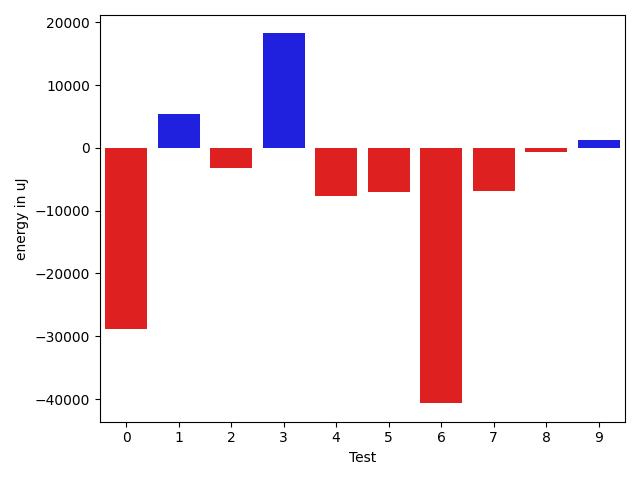
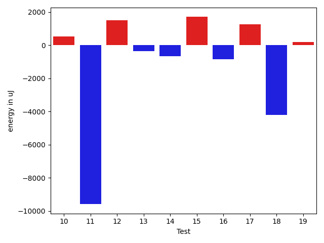
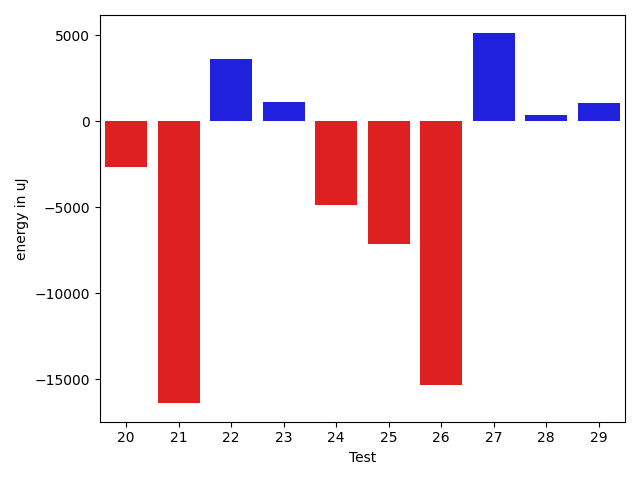
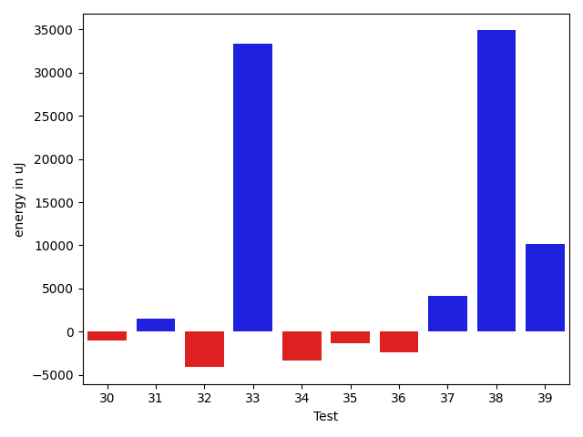
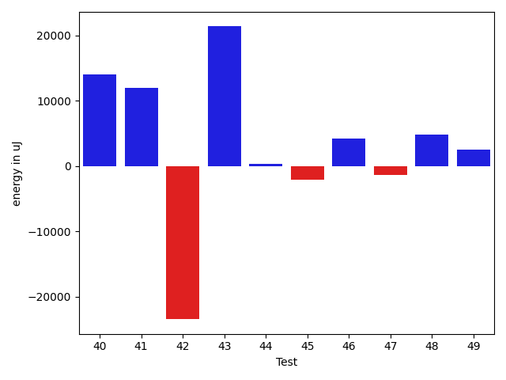
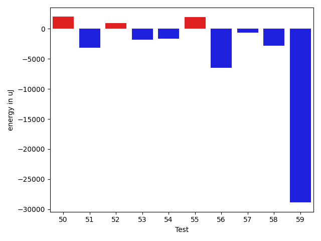
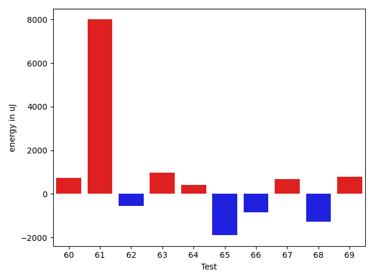
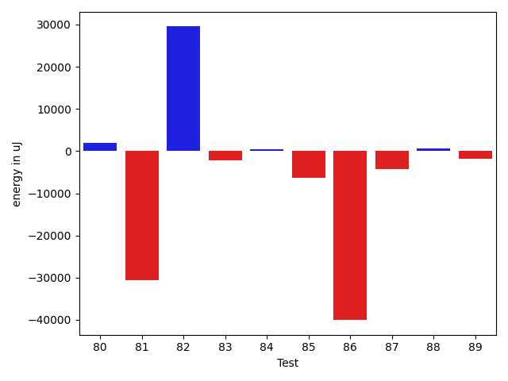

# gson 9e6f2b

https://github.com/google/gson/commit/9e6f2b

## Delta Energy per test method

| ID | EnergyV1 | EnergyV2 | DeltaEnergy | σV1 | σV2 |
| --- | --- | --- | --- | --- | --- |
| 0 | 131592 | 130188 | -1404 | 28765.733000435455 | 36869.602504418086 |
| 1 | 88745 | 90271 | 1526 | 123379.90593104417 | 193171.10494555376 |
| 2 | 43030 | 43152 | 122 | 9471.6030043611 | 17560.266624622294 |
| 3 | 43274 | 41748 | -1526 | 20546.531135599747 | 4307.432717731417 |
| 4 | 42297 | 41504 | -793 | 3411.275563359332 | 6808.863464073868 |
| 5 | 41992 | 43640 | 1648 | 31890.532032433883 | 23588.99493679185 |
| 6 | 45227 | 42846 | -2381 | 52632.634658742485 | 21819.32205971118 |
| 7 | 45654 | 45227 | -427 | 22678.952509889474 | 21509.012611049722 |
| 8 | 43701 | 42114 | -1587 | 381085.44355252455 | 255449.21040081477 |
| 9 | 88806 | 88379 | -427 | 234999.88520035535 | 273456.16209552315 |
| 10 | 43091 | 43640 | 549 | 16300.832096615979 | 17215.033508926226 |
| 11 | 124207 | 114624 | -9583 | 36181.46886316268 | 49844.05010235486 |
| 12 | 43152 | 44678 | 1526 | 8192.445934585849 | 14008.008834974544 |
| 13 | 43518 | 43152 | -366 | 12366.535607843021 | 8923.533380965613 |
| 14 | 45104 | 44433 | -671 | 15409.264861508214 | 26465.585612859533 |
| 15 | 41320 | 43030 | 1710 | 18081.351269768376 | 4565.454294579572 |
| 16 | 79467 | 78613 | -854 | 31938.21619581525 | 26239.078900389453 |
| 17 | 41259 | 42541 | 1282 | 8139.158738870309 | 3662.419684290368 |
| 18 | 1624630 | 1620418 | -4212 | 168740.499261748 | 209979.81580948428 |
| 19 | 42481 | 42664 | 183 | 16073.551284454545 | 16911.261833160628 |
| 20 | 42542 | 43518 | 976 | 14169.374802122797 | 18658.50404586584 |
| 21 | 41748 | 41870 | 122 | 11715.910593271794 | 14987.078496415796 |
| 22 | 41565 | 41870 | 305 | 3079.287948104846 | 4444.485138035926 |
| 23 | 42298 | 41931 | -367 | 14816.663230429507 | 10315.79540279584 |
| 24 | 62317 | 46081 | -16236 | 21833.89353971274 | 21123.30877846346 |
| 25 | 116210 | 119018 | 2808 | 38624.17915168312 | 35893.65932956589 |
| 26 | 41626 | 42237 | 611 | 13977.377905897325 | 3762.903198221007 |
| 27 | 44190 | 42968 | -1222 | 20770.251085119038 | 16281.481609855957 |
| 28 | 41687 | 40283 | -1404 | 3134.9757708797238 | 26909.538663667438 |
| 29 | 84412 | 84717 | 305 | 37992.08221033253 | 44923.861416995394 |
| 30 | 44434 | 44372 | -62 | 142541.39387403394 | 298277.67374186835 |
| 31 | 41564 | 41137 | -427 | 14037.395305250982 | 4356.873659651816 |
| 32 | 44250 | 44372 | 122 | 26653.818160358496 | 44354.21467485727 |
| 33 | 42968 | 44250 | 1282 | 16024.829518259361 | 22662.636235838825 |
| 34 | 45776 | 47851 | 2075 | 160482.47659091558 | 196432.28795304114 |
| 35 | 41687 | 42480 | 793 | 3450.4866495360375 | 4555.5073574133 |
| 36 | 42602 | 42419 | -183 | 6587.014720777315 | 5561.901093078127 |
| 37 | 42908 | 44556 | 1648 | 17865.052809863002 | 90459.86259279591 |
| 38 | 42541 | 44128 | 1587 | 11160.140798222694 | 11464.785398300653 |
| 39 | 42358 | 43457 | 1099 | 6831.6161850763565 | 9514.753105507545 |
| 40 | 42298 | 43518 | 1220 | 27246.373859239153 | 13007.690821428178 |
| 41 | 42054 | 43884 | 1830 | 3793.9662899684913 | 4248.788441940271 |
| 42 | 42541 | 42541 | 0 | 3745.67957530919 | 4427.079591321947 |
| 43 | 130004 | 132262 | 2258 | 231767.74638936284 | 160526.56195104498 |
| 44 | 42237 | 41992 | -245 | 6402.4968278489005 | 5640.142049983633 |
| 45 | 85816 | 83191 | -2625 | 36819.43723104989 | 227222.00044460472 |
| 46 | 45166 | 44494 | -672 | 25945.176221957594 | 19784.813185604675 |
| 47 | 134705 | 137756 | 3051 | 163197.06938579198 | 136538.82895357747 |
| 48 | 42053 | 40832 | -1221 | 9394.336606388153 | 8427.163126623223 |
| 49 | 87647 | 90454 | 2807 | 243489.86604223255 | 230011.61220011924 |
| 50 | 42969 | 43029 | 60 | 26550.52808088222 | 29087.749619556344 |
| 51 | 43212 | 43701 | 489 | 23183.00666796966 | 17435.041621405326 |
| 52 | 43579 | 43885 | 306 | 18556.442918694655 | 17074.3426893215 |
| 53 | 43762 | 43884 | 122 | 37786.42303361952 | 28192.628312101322 |
| 54 | 42785 | 41748 | -1037 | 10411.97533374844 | 9557.828809889126 |
| 55 | 42724 | 43213 | 489 | 12399.397571068195 | 14618.877019865418 |
| 56 | 133850 | 130859 | -2991 | 39702.70779145004 | 41732.27155277551 |
| 57 | 42968 | 42480 | -488 | 12434.875043380513 | 10659.359787904106 |
| 58 | 42541 | 42907 | 366 | 19520.58256202925 | 13751.558750039736 |
| 59 | 93262 | 91369 | -1893 | 207529.4006560859 | 73930.50210833008 |
| 60 | 42054 | 42786 | 732 | 3833.079563159592 | 5344.408230830619 |
| 61 | 70130 | 78125 | 7995 | 223816.01661457116 | 219708.8507323288 |
| 62 | 43823 | 43274 | -549 | 15656.2172105952 | 24078.5962798914 |
| 63 | 39856 | 40833 | 977 | 4177.165961951262 | 4161.04593264911 |
| 64 | 41382 | 41809 | 427 | 7471.603964079318 | 38919.915993891 |
| 65 | 43152 | 41260 | -1892 | 30436.89794672905 | 30421.940272073218 |
| 66 | 42968 | 42114 | -854 | 4033.8345209156614 | 3782.1396742525994 |
| 67 | 94116 | 94787 | 671 | 44014.56343550068 | 48674.08182723232 |
| 68 | 99732 | 98449 | -1283 | 30114.16972123907 | 38443.62409918717 |
| 69 | 75256 | 76049 | 793 | 110984.48381999593 | 107151.62443730427 |
| 70 | 43518 | 43151 | -367 | 15222.892730008618 | 13681.674906125325 |
| 71 | 44128 | 42847 | -1281 | 200693.03165446737 | 19488.86387812797 |
| 72 | 42908 | 40344 | -2564 | 4237.9899227150145 | 4148.998668052329 |
| 73 | 42114 | 43091 | 977 | 5126.386056472922 | 4595.113280422732 |
| 74 | 40039 | 41443 | 1404 | 4495.947450935071 | 3750.1572440861596 |
| 75 | 40466 | 42358 | 1892 | 3911.5162558145066 | 3748.3593135200626 |
| 76 | 41382 | 42053 | 671 | 192493.6864306521 | 3853.7698018888486 |
| 77 | 42725 | 42053 | -672 | 3277.020068193625 | 3885.7471567237103 |
| 78 | 41137 | 41809 | 672 | 4670.4003588795495 | 3305.249313873237 |
| 79 | 44067 | 44860 | 793 | 17076.115370382962 | 40274.16147869581 |
| 80 | 135986 | 137328 | 1342 | 45237.008252455096 | 28069.951938527465 |
| 81 | 41626 | 42053 | 427 | 8300.666600675571 | 3992.3374124494726 |
| 82 | 42176 | 42358 | 182 | 23390.760143335567 | 3958.949283698884 |
| 83 | 45043 | 45532 | 489 | 56287.17193414765 | 44106.82789783281 |
| 84 | 44982 | 44433 | -549 | 39165.21270889562 | 35011.36810960129 |
| 85 | 43274 | 43579 | 305 | 34205.21576566363 | 29434.07619694745 |
| 86 | 43640 | 43274 | -366 | 112938.22051736653 | 33111.44503430774 |
| 87 | 41382 | 42053 | 671 | 20494.18306199831 | 20475.232979755205 |
| 88 | 40832 | 44860 | 4028 | 3732.5204753310372 | 3418.9841321792865 |
| 89 | 43274 | 41076 | -2198 | 23506.223200651813 | 32217.955214647278 |

## Delta Duration per test method

| ID | DurationV1 | DurationsV2 | DeltaDuration |
| --- | --- | --- | --- |
| 0 | 3809104.8080808083 | 3789968.98989899 | -19135.81818181835 |
| 1 | 3003393.414141414 | 3781143.626262626 | 777750.2121212119 |
| 2 | 932990.8333333334 | 1187227.2537313432 | 254236.42039800982 |
| 3 | 1327300.2988505748 | 1266302.632183908 | -60997.666666666744 |
| 4 | 729860.9069767442 | 926012.82 | 196151.91302325577 |
| 5 | 1021810.5762711865 | 964167.1774193548 | -57643.39885183168 |
| 6 | 1897135.5454545454 | 1068611.6041666667 | -828523.9412878787 |
| 7 | 1811105.5656565656 | 1653465.2424242424 | -157640.32323232316 |
| 8 | 6444755.7 | 3113349.1219512196 | -3331406.5780487806 |
| 9 | 4397202.232323232 | 5146289.535353536 | 749087.3030303037 |
| 10 | 1375902.4081632653 | 1430539.0102040817 | 54636.60204081633 |
| 11 | 3142081.97979798 | 3355924.0404040404 | 213842.06060606055 |
| 12 | 1305596.5056179776 | 1297634.1770833333 | -7962.32853464433 |
| 13 | 1203677.0843373493 | 1148449.120879121 | -55227.96345822839 |
| 14 | 1393548.2886597938 | 1472453.3958333333 | 78905.10717353947 |
| 15 | 835678.2307692308 | 695255.8611111111 | -140422.36965811963 |
| 16 | 2102317.4242424243 | 2103576.6363636362 | 1259.2121212119237 |
| 17 | 967204.0 | 886779.5892857143 | -80424.41071428568 |
| 18 | 39458647.01010101 | 39595869.434343435 | 137222.42424242198 |
| 19 | 1482793.9191919193 | 1478888.4141414142 | -3905.505050505046 |
| 20 | 1434533.6666666667 | 1505207.8469387756 | 70674.18027210888 |
| 21 | 1302436.3404255318 | 1354188.8631578947 | 51752.52273236285 |
| 22 | 1002611.6875 | 1023180.2666666667 | 20568.57916666672 |
| 23 | 1279205.6363636365 | 1236424.075 | -42781.561363636516 |
| 24 | 1703693.0609756098 | 1578980.6 | -124712.46097560972 |
| 25 | 3209868.717171717 | 3234756.878787879 | 24888.16161616193 |
| 26 | 1068215.3466666667 | 1005755.3783783783 | -62459.968288288335 |
| 27 | 1500383.8020833333 | 1485117.8631578947 | -15265.93892543856 |
| 28 | 689678.5675675676 | 899369.1578947369 | 209690.59032716928 |
| 29 | 2223782.131313131 | 2484127.232323232 | 260345.10101010092 |
| 30 | 2307094.402777778 | 4158915.1772151897 | 1851820.7744374117 |
| 31 | 676565.0294117647 | 619392.3333333334 | -57172.69607843133 |
| 32 | 1766478.303030303 | 2035767.0808080807 | 269288.77777777775 |
| 33 | 1420429.4141414142 | 1492156.5918367347 | 71727.17769532045 |
| 34 | 2946536.767676768 | 3372691.4646464647 | 426154.6969696968 |
| 35 | 557341.7741935484 | 679296.2857142857 | 121954.51152073732 |
| 36 | 992992.6086956522 | 970560.5428571429 | -22432.065838509356 |
| 37 | 1465067.5959595959 | 1855183.0707070706 | 390115.4747474748 |
| 38 | 1261911.511627907 | 1319321.0543478262 | 57409.542719919235 |
| 39 | 1111970.2435897435 | 1161964.0777777778 | 49993.83418803429 |
| 40 | 1382222.0729166667 | 1383509.686868687 | 1287.6139520201832 |
| 41 | 916713.8870967742 | 926517.296875 | 9803.409778225818 |
| 42 | 745348.9772727273 | 770786.2708333334 | 25437.29356060608 |
| 43 | 4777530.919191919 | 4269408.161616161 | -508122.7575757578 |
| 44 | 1049414.421875 | 912739.9508196721 | -136674.47105532791 |
| 45 | 2189648.1717171716 | 3328429.4545454546 | 1138781.282828283 |
| 46 | 1612621.5638297873 | 1537429.4945054946 | -75192.06932429271 |
| 47 | 5937440.202020202 | 5600843.747474748 | -336596.4545454541 |
| 48 | 1045291.1904761905 | 1128814.9848484849 | 83523.79437229433 |
| 49 | 4472923.292929293 | 4257835.888888889 | -215087.40404040366 |
| 50 | 1116896.534883721 | 1184597.88 | 67701.34511627886 |
| 51 | 1122541.2727272727 | 704329.4285714285 | -418211.8441558442 |
| 52 | 1417576.112244898 | 1433827.948979592 | 16251.836734693963 |
| 53 | 1237094.3880597015 | 1261098.4347826086 | 24004.046722907107 |
| 54 | 1294656.9375 | 1261544.3820224719 | -33112.555477528134 |
| 55 | 1368573.0721649486 | 1334933.3979591837 | -33639.674205764895 |
| 56 | 3855723.01010101 | 3702724.878787879 | -152998.1313131312 |
| 57 | 1297847.4842105263 | 1277499.935483871 | -20347.54872665531 |
| 58 | 1447798.6489361702 | 1305463.0212765958 | -142335.62765957438 |
| 59 | 4031649.797979798 | 3090660.797979798 | -940989.0 |
| 60 | 1021388.0273972603 | 1053913.9166666667 | 32525.88926940644 |
| 61 | 3773810.9101123596 | 4035303.125 | 261492.21488764044 |
| 62 | 1126697.8688524591 | 1252633.7666666666 | 125935.89781420748 |
| 63 | 794766.5789473684 | 749916.9318181818 | -44849.64712918666 |
| 64 | 1025736.3225806452 | 1160790.0606060605 | 135053.73802541534 |
| 65 | 1363796.861111111 | 1407394.3157894737 | 43597.4546783627 |
| 66 | 614960.6511627907 | 674795.0333333333 | 59834.38217054261 |
| 67 | 3147274.0 | 3172094.0505050505 | 24820.050505050458 |
| 68 | 2894909.7474747472 | 3075697.9595959596 | 180788.2121212124 |
| 69 | 3271625.0515463916 | 3201689.9795918367 | -69935.07195455488 |
| 70 | 1334735.5061728396 | 1315259.6746987952 | -19475.83147404436 |
| 71 | 2542365.894117647 | 1490190.7954545454 | -1052175.0986631014 |
| 72 | 499209.1904761905 | 815103.15 | 315893.95952380955 |
| 73 | 544685.4 | 508001.8181818182 | -36683.58181818185 |
| 74 | 732074.2068965518 | 645823.5757575758 | -86250.63113897596 |
| 75 | 528908.5238095238 | 510295.0588235294 | -18613.46498599439 |
| 76 | 1712779.8 | 489467.04545454547 | -1223312.7545454546 |
| 77 | 518977.75 | 515531.14285714284 | -3446.6071428571595 |
| 78 | 525523.1666666666 | 531429.7727272727 | 5906.606060606078 |
| 79 | 1462183.3298969073 | 1920639.8645833333 | 458456.53468642593 |
| 80 | 3822824.1717171716 | 3919449.282828283 | 96625.11111111147 |
| 81 | 1162935.1911764706 | 992269.25 | -170665.9411764706 |
| 82 | 1033937.3 | 943385.0454545454 | -90552.25454545463 |
| 83 | 1800165.8850574712 | 1797803.642857143 | -2362.24220032827 |
| 84 | 1750742.677419355 | 1644450.40625 | -106292.2711693549 |
| 85 | 1478448.310810811 | 1374843.2777777778 | -103605.03303303313 |
| 86 | 1764533.5172413792 | 1363532.7291666667 | -401000.7880747125 |
| 87 | 850785.0769230769 | 988830.5357142857 | 138045.4587912088 |
| 88 | 1116079.8333333333 | 434423.375 | -681656.4583333333 |
| 89 | 802922.9090909091 | 1491028.3076923077 | 688105.3986013987 |

## Misc.

| ID | Test Class | Test Method |
| --- | --- | --- |
| 0 | com.google.gson.functional.StreamingTypeAdaptersTest | testNullSafe |
| 1 | com.google.gson.functional.JsonAdapterAnnotationOnClassesTest | testJsonAdapterInvoked |
| 2 | com.google.gson.functional.JsonAdapterAnnotationOnClassesTest | testRegisteredSerializerOverridesJsonAdapter |
| 3 | com.google.gson.functional.JsonAdapterAnnotationOnClassesTest | testJsonAdapterFactoryInvoked |
| 4 | com.google.gson.functional.JsonAdapterAnnotationOnClassesTest | testRegisteredDeserializerOverridesJsonAdapter |
| 5 | com.google.gson.functional.CustomDeserializerTest | testDefaultConstructorNotCalledOnField |
| 6 | com.google.gson.functional.CustomDeserializerTest | testDefaultConstructorNotCalledOnObject |
| 7 | com.google.gson.functional.CustomDeserializerTest | testJsonTypeFieldBasedDeserialization |
| 8 | com.google.gson.OverrideCoreTypeAdaptersTest | testOverrideStringAdapter |
| 9 | com.google.gson.functional.JsonAdapterSerializerDeserializerTest | testJsonSerializerDeserializerBasedJsonAdapterOnFields |
| 10 | com.google.gson.functional.JsonAdapterSerializerDeserializerTest | testJsonSerializerDeserializerBasedJsonAdapterOnClass |
| 11 | com.google.gson.functional.ThrowableFunctionalTest | testExceptionWithoutCause |
| 12 | com.google.gson.functional.ThrowableFunctionalTest | testErrornWithCause |
| 13 | com.google.gson.functional.ThrowableFunctionalTest | testErrorWithoutCause |
| 14 | com.google.gson.functional.ThrowableFunctionalTest | testExceptionWithCause |
| 15 | com.google.gson.functional.DefaultTypeAdaptersTest | testBitSetDeserialization |
| 16 | com.google.gson.functional.DefaultTypeAdaptersTest | testOverrideBigIntegerTypeAdapter |
| 17 | com.google.gson.functional.DefaultTypeAdaptersTest | testSqlDateSerialization |
| 18 | com.google.gson.functional.DefaultTypeAdaptersTest | testDefaultDateDeserializationUsingBuilder |
| 19 | com.google.gson.functional.DefaultTypeAdaptersTest | testOverrideBigDecimalTypeAdapter |
| 20 | com.google.gson.functional.DefaultTypeAdaptersTest | testDateDeserializationWithPattern |
| 21 | com.google.gson.functional.DefaultTypeAdaptersTest | testDateSerializationInCollection |
| 22 | com.google.gson.functional.DefaultTypeAdaptersTest | testTimestampSerialization |
| 23 | com.google.gson.functional.EnumTest | testEnumSubclassAsParameterizedType |
| 24 | com.google.gson.functional.EnumTest | testEnumCaseMapping |
| 25 | com.google.gson.functional.EnumTest | testEnumSubclass |
| 26 | com.google.gson.functional.EnumTest | testEnumSet |
| 27 | com.google.gson.functional.EnumTest | testEnumSubclassWithRegisteredTypeAdapter |
| 28 | com.google.gson.functional.DelegateTypeAdapterTest | testDelegateInvokedOnStrings |
| 29 | com.google.gson.functional.DelegateTypeAdapterTest | testDelegateInvoked |
| 30 | com.google.gson.JsonParserTest | testReadWriteTwoObjects |
| 31 | com.google.gson.JsonParserTest | testParseMixedArray |
| 32 | com.google.gson.functional.ObjectTest | testSingletonLists |
| 33 | com.google.gson.functional.JsonAdapterAnnotationOnFieldsTest | testPrimitiveFieldAnnotationTakesPrecedenceOverDefault |
| 34 | com.google.gson.functional.JsonAdapterAnnotationOnFieldsTest | testClassAnnotationAdapterFactoryTakesPrecedenceOverDefault |
| 35 | com.google.gson.functional.JsonAdapterAnnotationOnFieldsTest | testJsonAdapterWrappedInNullSafeAsRequested |
| 36 | com.google.gson.functional.JsonAdapterAnnotationOnFieldsTest | testClassAnnotationAdapterTakesPrecedenceOverDefault |
| 37 | com.google.gson.functional.JsonAdapterAnnotationOnFieldsTest | testFieldAnnotationWorksForParameterizedType |
| 38 | com.google.gson.functional.JsonAdapterAnnotationOnFieldsTest | testRegisteredTypeAdapterTakesPrecedenceOverClassAnnotationAdapter |
| 39 | com.google.gson.functional.JsonAdapterAnnotationOnFieldsTest | testFieldAnnotationTakesPrecedenceOverClassAnnotation |
| 40 | com.google.gson.functional.JsonAdapterAnnotationOnFieldsTest | testFieldAnnotationTakesPrecedenceOverRegisteredTypeAdapter |
| 41 | com.google.gson.functional.JsonAdapterAnnotationOnFieldsTest | testNonPrimitiveFieldAnnotationTakesPrecedenceOverDefault |
| 42 | com.google.gson.functional.TypeHierarchyAdapterTest | testRegisterSuperTypeFirst |
| 43 | com.google.gson.functional.TypeHierarchyAdapterTest | testTypeHierarchy |
| 44 | com.google.gson.functional.TypeVariableTest | testBasicTypeVariables |
| 45 | com.google.gson.functional.TypeVariableTest | testAdvancedTypeVariables |
| 46 | com.google.gson.functional.TypeVariableTest | testTypeVariablesViaTypeParameter |
| 47 | com.google.gson.functional.RuntimeTypeAdapterFactoryFunctionalTest | testSubclassesAutomaticallySerialized |
| 48 | com.google.gson.functional.ExclusionStrategyFunctionalTest | testExclusionStrategyWithMode |
| 49 | com.google.gson.functional.ExclusionStrategyFunctionalTest | testExclusionStrategyDeserialization |
| 50 | com.google.gson.functional.UncategorizedTest | testGsonInstanceReusableForSerializationAndDeserialization |
| 51 | com.google.gson.GsonTypeAdapterTest | testTypeAdapterDoesNotAffectNonAdaptedTypes |
| 52 | com.google.gson.functional.JavaUtilConcurrentAtomicTest | testAtomicLongArrayWithStringSerializationPolicy |
| 53 | com.google.gson.functional.JavaUtilConcurrentAtomicTest | testAtomicLongWithStringSerializationPolicy |
| 54 | com.google.gson.functional.ParameterizedTypesTest | testVariableTypeDeserialization |
| 55 | com.google.gson.functional.ParameterizedTypesTest | testParameterizedTypeGenericArraysDeserialization |
| 56 | com.google.gson.functional.ParameterizedTypesTest | testVariableTypeFieldsAndGenericArraysDeserialization |
| 57 | com.google.gson.functional.ParameterizedTypesTest | testParameterizedTypeWithVariableTypeDeserialization |
| 58 | com.google.gson.functional.ParameterizedTypesTest | testVariableTypeArrayDeserialization |
| 59 | com.google.gson.functional.MapAsArrayTypeAdapterTest | testSerializeComplexMapWithTypeAdapter |
| 60 | com.google.gson.functional.MapAsArrayTypeAdapterTest | testMultipleEnableComplexKeyRegistrationHasNoEffect |
| 61 | com.google.gson.functional.NamingPolicyTest | testComplexFieldNameStrategy |
| 62 | com.google.gson.functional.EscapingTest | testEscapingObjectFields |
| 63 | com.google.gson.functional.EscapingTest | testGsonDoubleDeserialization |
| 64 | com.google.gson.functional.EscapingTest | testGsonAcceptsEscapedAndNonEscapedJsonDeserialization |
| 65 | com.google.gson.functional.EscapingTest | testEscapingQuotesInStringArray |
| 66 | com.google.gson.functional.JavaUtilTest | testProperties |
| 67 | com.google.gson.functional.JavaUtilTest | testCurrency |
| 68 | com.google.gson.DefaultInetAddressTypeAdapterTest | testInetAddressSerializationAndDeserialization |
| 69 | com.google.gson.functional.CollectionTest | testWildcardCollectionField |
| 70 | com.google.gson.functional.CollectionTest | testFieldIsArrayList |
| 71 | com.google.gson.functional.TypeAdapterPrecedenceTest | testNonstreamingFollowedByNonstreaming |
| 72 | com.google.gson.functional.TypeAdapterPrecedenceTest | testSerializeNonstreamingTypeAdapterFollowedByStreamingTypeAdapter |
| 73 | com.google.gson.functional.TypeAdapterPrecedenceTest | testNonstreamingHierarchicalFollowedByNonstreaming |
| 74 | com.google.gson.functional.TypeAdapterPrecedenceTest | testStreamingFollowedByStreaming |
| 75 | com.google.gson.functional.TypeAdapterPrecedenceTest | testStreamingFollowedByNonstreaming |
| 76 | com.google.gson.functional.TypeAdapterPrecedenceTest | testStreamingHierarchicalFollowedByNonstreaming |
| 77 | com.google.gson.functional.TypeAdapterPrecedenceTest | testStreamingFollowedByNonstreamingHierarchical |
| 78 | com.google.gson.functional.TypeAdapterPrecedenceTest | testStreamingHierarchicalFollowedByNonstreamingHierarchical |
| 79 | com.google.gson.functional.MapTest | testConcurrentMap |
| 80 | com.google.gson.functional.MapTest | testConcurrentNavigableMap |
| 81 | com.google.gson.functional.MapTest | testConcurrentSkipListMap |
| 82 | com.google.gson.functional.MapTest | testConcurrentHashMap |
| 83 | com.google.gson.functional.JsonParserTest | testBadFieldTypeForDeserializingCustomTree |
| 84 | com.google.gson.functional.ReadersWritersTest | testReadWriteTwoObjects |
| 85 | com.google.gson.functional.ReadersWritersTest | testReadWriteTwoStrings |
| 86 | com.google.gson.internal.bind.JsonElementReaderTest | testSkipValue |
| 87 | com.google.gson.functional.PrimitiveTest | testQuotedStringSerializationAndDeserialization |
| 88 | com.google.gson.functional.StringTest | testEscapingQuotesInStringSerialization |
| 89 | com.google.gson.functional.StringTest | testSingleQuoteInStringSerialization |

| Test | IterationV1 | IterationV2 | DeltaIteration |
| --- | --- | --- | --- |
| 0 | 99 | 99 | 0 |
| 1 | 99 | 99 | 0 |
| 2 | 54 | 67 | 13 |
| 3 | 87 | 87 | 0 |
| 4 | 43 | 50 | 7 |
| 5 | 59 | 62 | 3 |
| 6 | 55 | 48 | -7 |
| 7 | 99 | 99 | 0 |
| 8 | 40 | 41 | 1 |
| 9 | 99 | 99 | 0 |
| 10 | 98 | 98 | 0 |
| 11 | 99 | 99 | 0 |
| 12 | 89 | 96 | 7 |
| 13 | 83 | 91 | 8 |
| 14 | 97 | 96 | -1 |
| 15 | 52 | 36 | -16 |
| 16 | 99 | 99 | 0 |
| 17 | 55 | 56 | 1 |
| 18 | 99 | 99 | 0 |
| 19 | 99 | 99 | 0 |
| 20 | 99 | 98 | -1 |
| 21 | 94 | 95 | 1 |
| 22 | 80 | 75 | -5 |
| 23 | 88 | 80 | -8 |
| 24 | 82 | 85 | 3 |
| 25 | 99 | 99 | 0 |
| 26 | 75 | 74 | -1 |
| 27 | 96 | 95 | -1 |
| 28 | 37 | 38 | 1 |
| 29 | 99 | 99 | 0 |
| 30 | 72 | 79 | 7 |
| 31 | 34 | 21 | -13 |
| 32 | 99 | 99 | 0 |
| 33 | 99 | 98 | -1 |
| 34 | 99 | 99 | 0 |
| 35 | 31 | 21 | -10 |
| 36 | 69 | 70 | 1 |
| 37 | 99 | 99 | 0 |
| 38 | 86 | 92 | 6 |
| 39 | 78 | 90 | 12 |
| 40 | 96 | 99 | 3 |
| 41 | 62 | 64 | 2 |
| 42 | 44 | 48 | 4 |
| 43 | 99 | 99 | 0 |
| 44 | 64 | 61 | -3 |
| 45 | 99 | 99 | 0 |
| 46 | 94 | 91 | -3 |
| 47 | 99 | 99 | 0 |
| 48 | 63 | 66 | 3 |
| 49 | 99 | 99 | 0 |
| 50 | 43 | 50 | 7 |
| 51 | 33 | 21 | -12 |
| 52 | 98 | 98 | 0 |
| 53 | 67 | 69 | 2 |
| 54 | 96 | 89 | -7 |
| 55 | 97 | 98 | 1 |
| 56 | 99 | 99 | 0 |
| 57 | 95 | 93 | -2 |
| 58 | 94 | 94 | 0 |
| 59 | 99 | 99 | 0 |
| 60 | 73 | 72 | -1 |
| 61 | 89 | 88 | -1 |
| 62 | 61 | 60 | -1 |
| 63 | 38 | 44 | 6 |
| 64 | 62 | 66 | 4 |
| 65 | 36 | 38 | 2 |
| 66 | 43 | 30 | -13 |
| 67 | 99 | 99 | 0 |
| 68 | 99 | 99 | 0 |
| 69 | 97 | 98 | 1 |
| 70 | 81 | 83 | 2 |
| 71 | 85 | 88 | 3 |
| 72 | 21 | 20 | -1 |
| 73 | 15 | 22 | 7 |
| 74 | 29 | 33 | 4 |
| 75 | 21 | 17 | -4 |
| 76 | 30 | 22 | -8 |
| 77 | 16 | 21 | 5 |
| 78 | 30 | 22 | -8 |
| 79 | 97 | 96 | -1 |
| 80 | 99 | 99 | 0 |
| 81 | 68 | 80 | 12 |
| 82 | 60 | 66 | 6 |
| 83 | 87 | 84 | -3 |
| 84 | 62 | 64 | 2 |
| 85 | 74 | 72 | -2 |
| 86 | 58 | 48 | -10 |
| 87 | 26 | 28 | 2 |
| 88 | 18 | 16 | -2 |
| 89 | 33 | 13 | -20 |

| Time Label | Time (s) |
| --- | --- |
| Selection | 34.89143466949463 |
| Injection | 18.599068880081177 |
| Total | 1480.2255897521973 |

