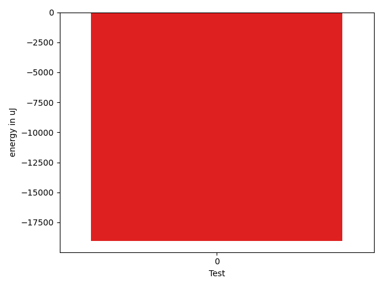

# gson 4976e4

https://github.com/google/gson/commit/4976e4

## Delta Energy per test method

| ID | EnergyV1 | EnergyV2 | DeltaEnergy | σV1 | σV2 |
| --- | --- | --- | --- | --- | --- |
| 0 | 76477 | 72143 | -4334 | 17546.828599621633 | 19966.42252266122 |

## Delta Duration per test method

| ID | DurationV1 | DurationsV2 | DeltaDuration |
| --- | --- | --- | --- |
| 0 | 3520624.9494949495 | 3481739.4444444445 | -38885.505050505046 |

## Misc.

| ID | Test Class | Test Method |
| --- | --- | --- |
| 0 | com.google.gson.JsonObjectTest | testSize |

| Test | IterationV1 | IterationV2 | DeltaIteration |
| --- | --- | --- | --- |
| 0 | 99 | 99 | 0 |

| Time Label | Time (s) |
| --- | --- |
| Selection | 34.48186469078064 |
| Injection | 13.119709968566895 |
| Total | 1351.6494932174683 |

