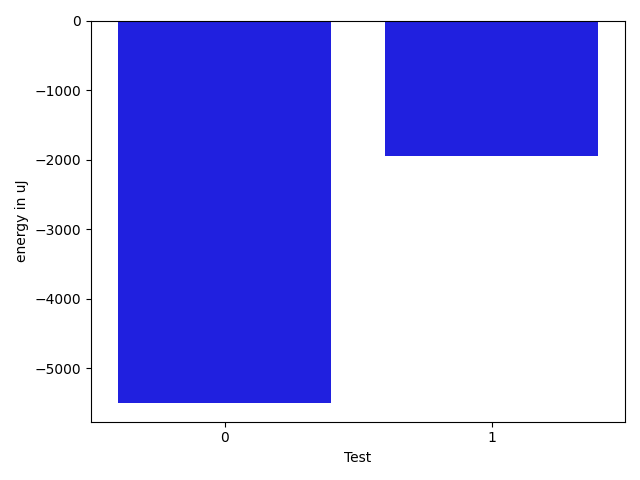

# gson 44cad0

https://github.com/google/gson/commit/44cad0

## Delta Energy per test method

| ID | EnergyV1 | EnergyV2 | DeltaEnergy | σV1 | σV2 |
| --- | --- | --- | --- | --- | --- |
| 0 | 80030.18478260869 | 74696.25 | -5333.934782608689 | 41452.688579593065 | 39289.56814048432 |
| 1 | 673336.2626262626 | 675002.7070707071 | 1666.4444444444962 | 51848.404813735666 | 54604.13066945319 |

## Delta Duration per test method

| ID | DurationV1 | DurationsV2 | DeltaDuration |
| --- | --- | --- | --- |
| 0 | 3149669.5760869565 | 2972449.565217391 | -177220.01086956542 |
| 1 | 21192783.414141413 | 21407548.98989899 | 214765.57575757802 |

## Misc.

| ID | Test Class | Test Method |
| --- | --- | --- |
| 0 | com.google.gson.functional.PrimitiveTest | testNumberDeserialization |
| 1 | com.google.gson.JavaSerializationTest | testNumberIsSerializable |

| Test | IterationV1 | IterationV2 | DeltaIteration |
| --- | --- | --- | --- |
| 0 | 92 | 92 | 0 |
| 1 | 99 | 99 | 0 |

| Time Label | Time (s) |
| --- | --- |
| Selection | 35.08703351020813 |
| Injection | 13.367207527160645 |
| Total | 1366.8940587043762 |

