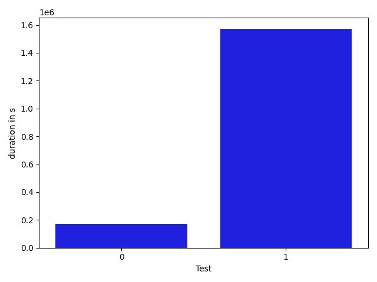

# gson 44cad0

https://github.com/google/gson/commit/44cad0

## Delta Energy per test method

| ID | EnergyV1 | EnergyV2 | DeltaEnergy |
| --- | --- | --- | --- |
| 0 | 54784.219036215545 | 60955.60408145582 | 6171.385045240277 |
| 1 | 675844.276318253 | 694748.7139528195 | 18904.43763456645 |

## Delta Duration per test method

| ID | DurationV1 | DurationsV2 | DeltaDuration |
| --- | --- | --- | --- |
| 0 | 1956542.9885535839 | 2129054.826300624 | 172511.83774703997 |
| 1 | 21307963.712827876 | 22881438.519688465 | 1573474.8068605885 |

## Misc.

| ID | Test Class | Test Method |
| --- | --- | --- |
| 0 | com.google.gson.functional.PrimitiveTest | testNumberDeserialization |
| 1 | com.google.gson.JavaSerializationTest | testNumberIsSerializable |

| Test | IterationV1 | IterationV2 | DeltaIteration |
| --- | --- | --- | --- |
| 0 | 92 | 92 | 0 |
| 1 | 99 | 99 | 0 |

| Time Label | Time (s) |
| --- | --- |
| Selection | 35.08703351020813 |
| Injection | 13.367207527160645 |
| Total | 1366.8940587043762 |

