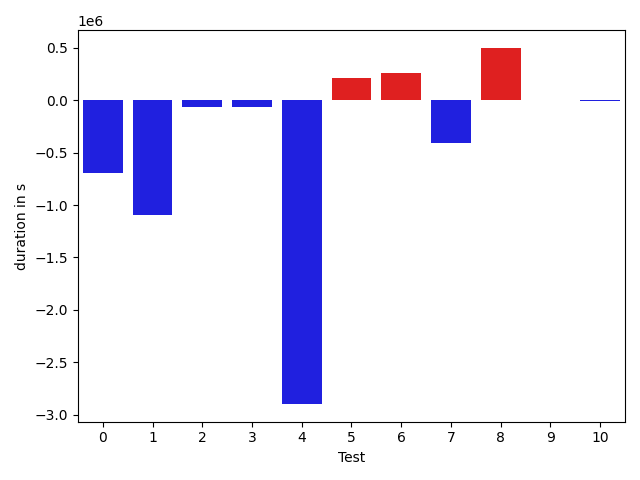
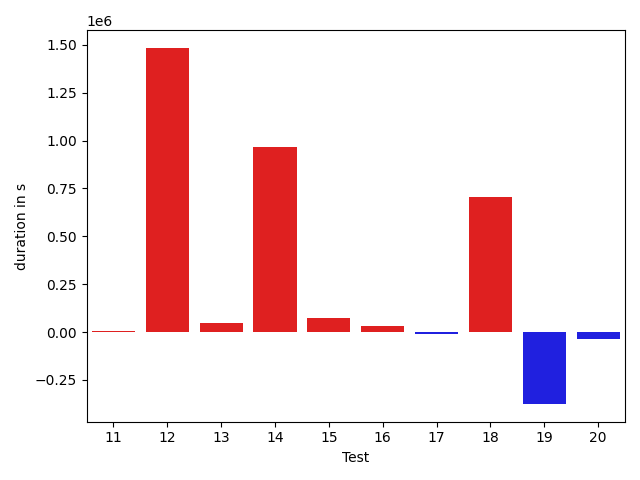

# gson 193349

https://github.com/google/gson/commit/193349

## Delta Energy per test method

| ID | EnergyV1 | EnergyV2 | DeltaEnergy |
| --- | --- | --- | --- |
| 0 | 286743.2860317632 | 427038.3400867228 | 140295.05405495962 |
| 1 | 53582.78549459588 | 36760.92817500243 | -16821.85731959345 |
| 2 | 57422.44675291067 | 49050.941640483055 | -8371.505112427614 |
| 3 | 35726.62091074548 | 38692.317778407276 | 2965.696867661798 |
| 4 | 70490.99982414041 | 36615.44311084441 | -33875.556713296 |
| 5 | 36529.92938278237 | 55329.257127471836 | 18799.327744689464 |
| 6 | 105419.98903332367 | 850463.5254718983 | 745043.5364385745 |
| 7 | 68541.62531333968 | 69848.28660281612 | 1306.6612894764403 |
| 8 | 37916.69971322782 | 50719.41421129856 | 12802.714498070738 |
| 9 | 39773.41078345342 | 49495.98740865357 | 9722.576625200149 |
| 10 | 67320.28518436191 | 36965.368621850954 | -30354.91656251096 |
| 11 | 37819.18671872739 | 43831.436352359946 | 6012.249633632557 |
| 12 | 43955.873792882194 | 164699.27898522606 | 120743.40519234387 |
| 13 | 34316.30236740221 | 47176.70780925022 | 12860.405441848008 |
| 14 | 33441.15931042804 | 34328.57204908174 | 887.4127386537002 |
| 15 | 34603.46085065081 | 51881.106446506004 | 17277.645595855196 |
| 16 | 35736.43592831109 | 39295.278320987876 | 3558.8423926767864 |
| 17 | 37858.028657962 | 34151.191690209576 | -3706.8369677524242 |
| 18 | 213999.74661879672 | 195741.30132689496 | -18258.445291901764 |
| 19 | 169102.41657784994 | 88011.52814710065 | -81090.8884307493 |
| 20 | 246799.1807550786 | 87060.87606582147 | -159738.30468925711 |

## Delta Duration per test method

| ID | DurationV1 | DurationsV2 | DeltaDuration |
| --- | --- | --- | --- |
| 0 | 9741435.31915427 | 13610079.353239223 | 3868644.0340849534 |
| 1 | 1616242.2309885658 | 1038459.2061878317 | -577783.0248007341 |
| 2 | 2387780.751973613 | 1733421.0515772055 | -654359.7003964076 |
| 3 | 1293391.6059352444 | 1247320.9273960486 | -46070.6785391958 |
| 4 | 2243169.4001009655 | 1021374.1591185031 | -1221795.2409824624 |
| 5 | 1333572.5353875987 | 1894836.546357262 | 561264.0109696633 |
| 6 | 3231315.6408975897 | 27442052.4940321 | 24210736.85313451 |
| 7 | 2272311.093838695 | 2140758.5132645043 | -131552.5805741907 |
| 8 | 1429892.4779745787 | 1460654.6593600663 | 30762.18138548755 |
| 9 | 1701462.2166982181 | 1795360.718850467 | 93898.50215224875 |
| 10 | 1773285.6201396864 | 1458016.6755798282 | -315268.9445598582 |
| 11 | 1359150.6369512766 | 1235611.2373002865 | -123539.39965099003 |
| 12 | 1592636.4050952937 | 5339087.121095454 | 3746450.7160001607 |
| 13 | 1622185.7323527792 | 1661244.502700939 | 39058.77034815983 |
| 14 | 1260110.7256679905 | 1294142.8038365154 | 34032.078168524895 |
| 15 | 914674.672616163 | 1255007.0852323575 | 340332.41261619446 |
| 16 | 1198791.698515818 | 1180786.312394481 | -18005.38612133707 |
| 17 | 1478602.2914672266 | 1465247.1114380225 | -13355.180029204115 |
| 18 | 6279672.745581039 | 5944116.04805014 | -335556.6975308992 |
| 19 | 5100319.072701379 | 2377510.5830284925 | -2722808.489672886 |
| 20 | 8473956.009930477 | 2781712.099307565 | -5692243.9106229115 |

## Misc.

| ID | Test Class | Test Method |
| --- | --- | --- |
| 0 | com.google.gson.functional.JsonAdapterAnnotationOnClassesTest | testJsonAdapterInvoked |
| 1 | com.google.gson.functional.JsonAdapterAnnotationOnClassesTest | testRegisteredDeserializerOverridesJsonAdapter |
| 2 | com.google.gson.functional.JsonAdapterAnnotationOnClassesTest | testRegisteredSerializerOverridesJsonAdapter |
| 3 | com.google.gson.functional.JsonAdapterAnnotationOnClassesTest | testNullSafeObjectFromJson |
| 4 | com.google.gson.functional.JsonAdapterAnnotationOnClassesTest | testIncorrectTypeAdapterFails |
| 5 | com.google.gson.functional.JsonAdapterAnnotationOnClassesTest | testJsonAdapterFactoryInvoked |
| 6 | com.google.gson.functional.JsonAdapterSerializerDeserializerTest | testJsonSerializerDeserializerBasedJsonAdapterOnFields |
| 7 | com.google.gson.functional.JsonAdapterSerializerDeserializerTest | testDifferentJsonAdaptersForGenericFieldsOfSameRawType |
| 8 | com.google.gson.functional.JsonAdapterSerializerDeserializerTest | testJsonSerializerDeserializerBasedJsonAdapterOnClass |
| 9 | com.google.gson.functional.JsonAdapterAnnotationOnFieldsTest | testPrimitiveFieldAnnotationTakesPrecedenceOverDefault |
| 10 | com.google.gson.functional.JsonAdapterAnnotationOnFieldsTest | testClassAnnotationAdapterFactoryTakesPrecedenceOverDefault |
| 11 | com.google.gson.functional.JsonAdapterAnnotationOnFieldsTest | testJsonAdapterWrappedInNullSafeAsRequested |
| 12 | com.google.gson.functional.JsonAdapterAnnotationOnFieldsTest | testClassAnnotationAdapterTakesPrecedenceOverDefault |
| 13 | com.google.gson.functional.JsonAdapterAnnotationOnFieldsTest | testFieldAnnotationWorksForParameterizedType |
| 14 | com.google.gson.functional.JsonAdapterAnnotationOnFieldsTest | testFieldAnnotationTakesPrecedenceOverClassAnnotation |
| 15 | com.google.gson.functional.JsonAdapterAnnotationOnFieldsTest | testNonPrimitiveFieldAnnotationTakesPrecedenceOverDefault |
| 16 | com.google.gson.functional.JsonAdapterAnnotationOnFieldsTest | testJsonAdapterInvokedOnlyForAnnotatedFields |
| 17 | com.google.gson.functional.JsonAdapterAnnotationOnFieldsTest | testFieldAnnotationTakesPrecedenceOverRegisteredTypeAdapter |
| 18 | com.google.gson.functional.RuntimeTypeAdapterFactoryFunctionalTest | testSubclassesAutomaticallySerialized |
| 19 | com.google.gson.regression.JsonAdapterNullSafeTest | testNullSafeBugDeserialize |
| 20 | com.google.gson.regression.JsonAdapterNullSafeTest | testNullSafeBugSerialize |

| Test | IterationV1 | IterationV2 | DeltaIteration |
| --- | --- | --- | --- |
| 0 | 99 | 99 | 0 |
| 1 | 69 | 69 | 0 |
| 2 | 92 | 91 | -1 |
| 3 | 80 | 78 | -2 |
| 4 | 61 | 59 | -2 |
| 5 | 96 | 95 | -1 |
| 6 | 99 | 99 | 0 |
| 7 | 99 | 99 | 0 |
| 8 | 98 | 98 | 0 |
| 9 | 99 | 99 | 0 |
| 10 | 99 | 99 | 0 |
| 11 | 68 | 62 | -6 |
| 12 | 98 | 97 | -1 |
| 13 | 99 | 99 | 0 |
| 14 | 96 | 97 | 1 |
| 15 | 57 | 58 | 1 |
| 16 | 88 | 89 | 1 |
| 17 | 98 | 95 | -3 |
| 18 | 99 | 99 | 0 |
| 19 | 64 | 57 | -7 |
| 20 | 92 | 90 | -2 |

| Time Label | Time (s) |
| --- | --- |
| Selection | 33.97868323326111 |
| Injection | 14.367099285125732 |
| Total | 1382.1617226600647 |

