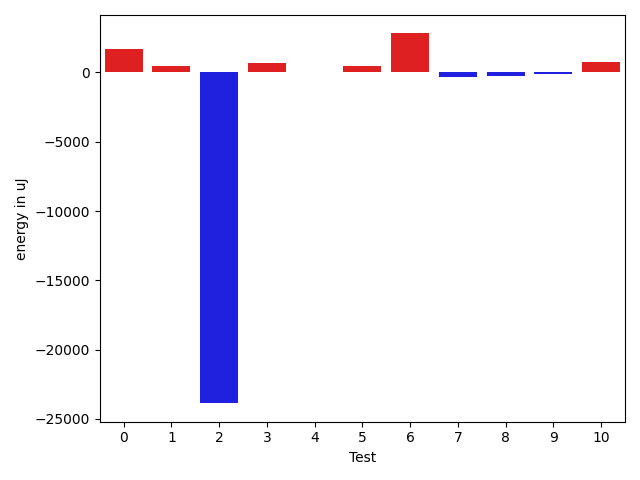
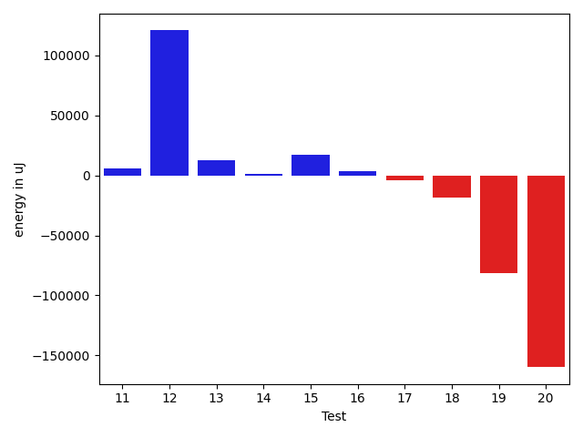

# gson 193349

https://github.com/google/gson/commit/193349

## Delta Energy per test method

| ID | EnergyV1 | EnergyV2 | DeltaEnergy | σV1 | σV2 |
| --- | --- | --- | --- | --- | --- |
| 0 | 72265 | 73974 | 1709 | 372395.284853664 | 341618.1151628487 |
| 1 | 36804 | 37292 | 488 | 375583.9825259033 | 298746.4723903361 |
| 2 | 63476 | 39612 | -23864 | 22910.831357459672 | 24480.80752877565 |
| 3 | 35950 | 36621 | 671 | 9764.008678872306 | 6137.4734097475575 |
| 4 | 36926 | 36926 | 0 | 354135.9414649389 | 200608.87423793256 |
| 5 | 36316 | 36743 | 427 | 262476.74425301584 | 258119.7874769979 |
| 6 | 102966 | 105774 | 2808 | 541557.4301122404 | 556076.9590347485 |
| 7 | 69763 | 69457 | -306 | 131844.01901195198 | 18094.36198514398 |
| 8 | 37719 | 37475 | -244 | 173482.73113158258 | 212687.20043887658 |
| 9 | 36927 | 36804 | -123 | 17163.860076118664 | 15697.88815383643 |
| 10 | 36072 | 36804 | 732 | 17788.449169220294 | 15995.624316658143 |
| 11 | 35156 | 36377 | 1221 | 7075.114463597772 | 7552.854975449808 |
| 12 | 36865 | 37902 | 1037 | 417195.7288332593 | 473992.8611256765 |
| 13 | 38757 | 65551 | 26794 | 18405.073952062776 | 17599.819479298865 |
| 14 | 35217 | 35583 | 366 | 8527.975737135812 | 205721.52094194014 |
| 15 | 34851 | 36011 | 1160 | 5428.933868391511 | 9758.461098624972 |
| 16 | 36071 | 36682 | 611 | 302946.5495952193 | 313884.35646164377 |
| 17 | 37109 | 37414 | 305 | 19455.208610580772 | 17794.588280816373 |
| 18 | 216186 | 219604 | 3418 | 150106.12697624025 | 160145.64225587653 |
| 19 | 40405 | 39917 | -488 | 106359.23667289248 | 104975.45890926066 |
| 20 | 42236 | 41199 | -1037 | 77350.45338343404 | 85599.18745597661 |

## Delta Duration per test method

| ID | DurationV1 | DurationsV2 | DeltaDuration |
| --- | --- | --- | --- |
| 0 | 6459992.545454546 | 5765187.363636363 | -694805.1818181826 |
| 1 | 4663834.31884058 | 3573068.3913043477 | -1090765.9275362324 |
| 2 | 1886973.5652173914 | 1821983.4505494505 | -64990.114667940885 |
| 3 | 1276964.425 | 1208333.1282051282 | -68631.2967948718 |
| 4 | 5116592.426229509 | 2218631.033898305 | -2897961.3923312034 |
| 5 | 3056496.3854166665 | 3267336.8210526314 | 210840.43563596485 |
| 6 | 10696957.333333334 | 10956950.424242424 | 259993.0909090899 |
| 7 | 2572707.797979798 | 2162514.272727273 | -410193.5252525252 |
| 8 | 2042760.030612245 | 2541357.0102040814 | 498596.97959183645 |
| 9 | 1669591.0404040404 | 1671560.3535353534 | 1969.3131313130725 |
| 10 | 1653656.888888889 | 1644731.5454545454 | -8925.34343434358 |
| 11 | 1141711.9705882352 | 1146303.6935483871 | 4591.722960151965 |
| 12 | 5712477.653061224 | 7196476.268041237 | 1483998.614980013 |
| 13 | 1807768.5555555555 | 1853925.2222222222 | 46156.666666666744 |
| 14 | 1358032.5729166667 | 2323238.463917526 | 965205.8910008592 |
| 15 | 1035203.1052631579 | 1109186.4137931035 | 73983.30852994567 |
| 16 | 3718713.4431818184 | 3747843.5280898875 | 29130.08490806911 |
| 17 | 1711723.918367347 | 1703311.6842105263 | -8412.23415682069 |
| 18 | 8844725.737373738 | 9550021.434343435 | 705295.6969696973 |
| 19 | 3762995.434782609 | 3387288.2666666666 | -375707.1681159423 |
| 20 | 3123149.171875 | 3088761.947368421 | -34387.224506578874 |

## Misc.

| ID | Test Class | Test Method |
| --- | --- | --- |
| 0 | com.google.gson.functional.JsonAdapterAnnotationOnClassesTest | testJsonAdapterInvoked |
| 1 | com.google.gson.functional.JsonAdapterAnnotationOnClassesTest | testRegisteredDeserializerOverridesJsonAdapter |
| 2 | com.google.gson.functional.JsonAdapterAnnotationOnClassesTest | testRegisteredSerializerOverridesJsonAdapter |
| 3 | com.google.gson.functional.JsonAdapterAnnotationOnClassesTest | testNullSafeObjectFromJson |
| 4 | com.google.gson.functional.JsonAdapterAnnotationOnClassesTest | testIncorrectTypeAdapterFails |
| 5 | com.google.gson.functional.JsonAdapterAnnotationOnClassesTest | testJsonAdapterFactoryInvoked |
| 6 | com.google.gson.functional.JsonAdapterSerializerDeserializerTest | testJsonSerializerDeserializerBasedJsonAdapterOnFields |
| 7 | com.google.gson.functional.JsonAdapterSerializerDeserializerTest | testDifferentJsonAdaptersForGenericFieldsOfSameRawType |
| 8 | com.google.gson.functional.JsonAdapterSerializerDeserializerTest | testJsonSerializerDeserializerBasedJsonAdapterOnClass |
| 9 | com.google.gson.functional.JsonAdapterAnnotationOnFieldsTest | testPrimitiveFieldAnnotationTakesPrecedenceOverDefault |
| 10 | com.google.gson.functional.JsonAdapterAnnotationOnFieldsTest | testClassAnnotationAdapterFactoryTakesPrecedenceOverDefault |
| 11 | com.google.gson.functional.JsonAdapterAnnotationOnFieldsTest | testJsonAdapterWrappedInNullSafeAsRequested |
| 12 | com.google.gson.functional.JsonAdapterAnnotationOnFieldsTest | testClassAnnotationAdapterTakesPrecedenceOverDefault |
| 13 | com.google.gson.functional.JsonAdapterAnnotationOnFieldsTest | testFieldAnnotationWorksForParameterizedType |
| 14 | com.google.gson.functional.JsonAdapterAnnotationOnFieldsTest | testFieldAnnotationTakesPrecedenceOverClassAnnotation |
| 15 | com.google.gson.functional.JsonAdapterAnnotationOnFieldsTest | testNonPrimitiveFieldAnnotationTakesPrecedenceOverDefault |
| 16 | com.google.gson.functional.JsonAdapterAnnotationOnFieldsTest | testJsonAdapterInvokedOnlyForAnnotatedFields |
| 17 | com.google.gson.functional.JsonAdapterAnnotationOnFieldsTest | testFieldAnnotationTakesPrecedenceOverRegisteredTypeAdapter |
| 18 | com.google.gson.functional.RuntimeTypeAdapterFactoryFunctionalTest | testSubclassesAutomaticallySerialized |
| 19 | com.google.gson.regression.JsonAdapterNullSafeTest | testNullSafeBugSerialize |
| 20 | com.google.gson.regression.JsonAdapterNullSafeTest | testNullSafeBugDeserialize |

| Test | IterationV1 | IterationV2 | DeltaIteration |
| --- | --- | --- | --- |
| 0 | 99 | 99 | 0 |
| 1 | 69 | 69 | 0 |
| 2 | 92 | 91 | -1 |
| 3 | 80 | 78 | -2 |
| 4 | 61 | 59 | -2 |
| 5 | 96 | 95 | -1 |
| 6 | 99 | 99 | 0 |
| 7 | 99 | 99 | 0 |
| 8 | 98 | 98 | 0 |
| 9 | 99 | 99 | 0 |
| 10 | 99 | 99 | 0 |
| 11 | 68 | 62 | -6 |
| 12 | 98 | 97 | -1 |
| 13 | 99 | 99 | 0 |
| 14 | 96 | 97 | 1 |
| 15 | 57 | 58 | 1 |
| 16 | 88 | 89 | 1 |
| 17 | 98 | 95 | -3 |
| 18 | 99 | 99 | 0 |
| 19 | 92 | 90 | -2 |
| 20 | 64 | 57 | -7 |

| Time Label | Time (s) |
| --- | --- |
| Selection | 33.97868323326111 |
| Injection | 14.367099285125732 |
| Total | 1382.1617226600647 |

