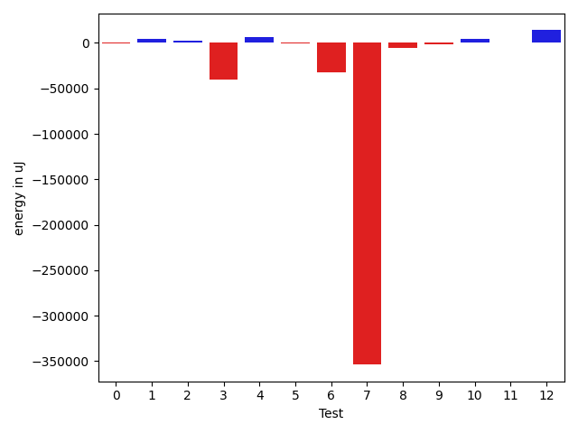
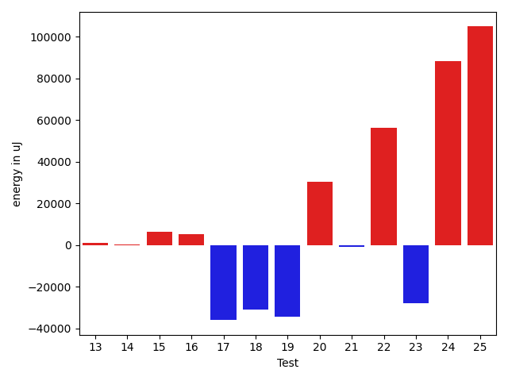
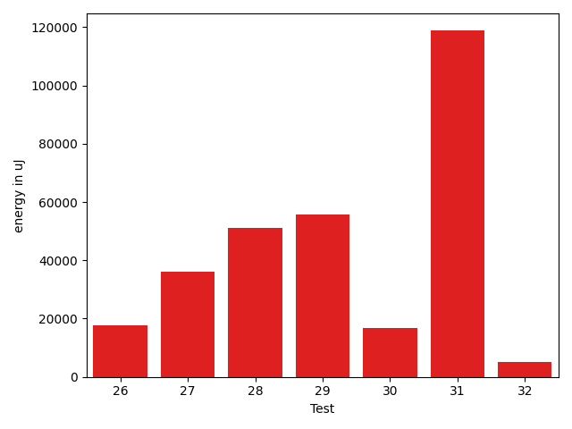

# gson c24af3

https://github.com/google/gson/commit/c24af3

## Delta Energy per test method

| ID | EnergyV1 | EnergyV2 | DeltaEnergy | σV1 | σV2 |
| --- | --- | --- | --- | --- | --- |
| 0 | 37964 | 39551 | 1587 | 4696.3648629167965 | 3873.799050867919 |
| 1 | 37171 | 40771 | 3600 | 8391.707070739287 | 11981.976088381916 |
| 2 | 37475 | 39551 | 2076 | 7562.415751230357 | 5670.745808121032 |
| 3 | 40954 | 40771 | -183 | 49780.32494195816 | 62284.766910509315 |
| 4 | 37842 | 40406 | 2564 | 4303.07518905313 | 3974.078651573077 |
| 5 | 40161 | 42480 | 2319 | 20684.342400609545 | 34181.44453969503 |
| 6 | 40832 | 40284 | -548 | 9175.016644177827 | 44200.13419412652 |
| 7 | 36926 | 37353 | 427 | 7237.500199975196 | 6457.553389691667 |
| 8 | 38391 | 37902 | -489 | 4086.681675610249 | 2690.988998405757 |
| 9 | 38635 | 37719 | -916 | 4130.780675586144 | 2957.410490975201 |
| 10 | 36682 | 37658 | 976 | 117482.49734921307 | 149031.21908658204 |
| 11 | 41138 | 37720 | -3418 | 22167.737643798046 | 7362.943611310176 |
| 12 | 35645 | 36865 | 1220 | 2978.3047548633863 | 165852.3040630654 |
| 13 | 36316 | 37293 | 977 | 4441.751878996099 | 3734.1687388403225 |
| 14 | 37659 | 37842 | 183 | 4548.127806024206 | 3121.503352909015 |
| 15 | 37109 | 38024 | 915 | 4407.002026321295 | 18988.03415136315 |
| 16 | 35401 | 35644 | 243 | 3351.3739614317706 | 25455.12993487716 |
| 17 | 36865 | 37232 | 367 | 197864.88993935808 | 106480.43251512837 |
| 18 | 38330 | 38452 | 122 | 177705.52556448383 | 100102.3770030081 |
| 19 | 39002 | 37903 | -1099 | 183956.39315430413 | 114372.48943624967 |
| 20 | 36988 | 38757 | 1769 | 8971.947782817286 | 103747.96820128035 |
| 21 | 36926 | 36438 | -488 | 4239.265789659118 | 2426.942422568145 |
| 22 | 37659 | 37170 | -489 | 188038.54700655592 | 238982.8289701473 |
| 23 | 38086 | 36682 | -1404 | 125574.33348598091 | 3528.582187910195 |
| 24 | 174683 | 340880 | 166197 | 158797.58696320865 | 141263.32497780563 |
| 25 | 44068 | 45105 | 1037 | 277646.99821715825 | 384451.99399921927 |
| 26 | 64209 | 69946 | 5737 | 24649.546025729636 | 55456.919738173696 |
| 27 | 133545 | 172180 | 38635 | 411176.8223024557 | 357835.52458709513 |
| 28 | 36255 | 71411 | 35156 | 7868.832571562947 | 64390.07085980117 |
| 29 | 39001 | 44982 | 5981 | 28984.321917471098 | 77396.85739101493 |
| 30 | 37719 | 42541 | 4822 | 5386.500065895739 | 25976.77906438749 |
| 31 | 40528 | 98877 | 58349 | 27149.12234147441 | 274687.72676496144 |
| 32 | 38879 | 39673 | 794 | 5521.997178808899 | 12510.89794426825 |

## Delta Duration per test method

| ID | DurationV1 | DurationsV2 | DeltaDuration |
| --- | --- | --- | --- |
| 0 | 812203.268292683 | 870555.3529411765 | 58352.08464849356 |
| 1 | 1087558.49122807 | 1555006.0377358492 | 467447.54650777904 |
| 2 | 1154803.0317460317 | 1252087.5060240964 | 97284.47427806468 |
| 3 | 2029104.1818181819 | 1815815.0 | -213289.18181818188 |
| 4 | 769614.5909090909 | 786057.4 | 16442.809090909082 |
| 5 | 1470010.3648648649 | 1971124.1333333333 | 501113.76846846845 |
| 6 | 1282613.9743589743 | 1761268.134328358 | 478654.15996938385 |
| 7 | 729987.0322580645 | 727968.9782608695 | -2018.0539971949765 |
| 8 | 676360.4090909091 | 690335.75 | 13975.34090909094 |
| 9 | 596720.25 | 594694.0384615385 | -2026.2115384615026 |
| 10 | 1593662.7586206896 | 2328896.206896552 | 735233.4482758623 |
| 11 | 1165477.878787879 | 657851.9666666667 | -507625.9121212122 |
| 12 | 573939.4137931034 | 1940005.15 | 1366065.7362068966 |
| 13 | 844671.5135135135 | 794459.0217391305 | -50212.491774383 |
| 14 | 494475.5 | 529587.8 | 35112.30000000005 |
| 15 | 573799.6 | 780767.7333333333 | 206968.1333333333 |
| 16 | 576725.7894736842 | 721753.6538461539 | 145027.86437246972 |
| 17 | 2463871.714285714 | 1727371.4615384615 | -736500.2527472526 |
| 18 | 2216296.3076923075 | 1192407.8461538462 | -1023888.4615384613 |
| 19 | 2308205.3636363638 | 1518766.2727272727 | -789439.090909091 |
| 20 | 755018.64 | 1888195.4 | 1133176.7599999998 |
| 21 | 644993.1904761905 | 748269.09375 | 103275.90327380947 |
| 22 | 2136010.75 | 3890488.695652174 | 1754477.9456521738 |
| 23 | 1478097.9090909092 | 571584.5172413794 | -906513.3918495298 |
| 24 | 6858943.232323232 | 9564236.97979798 | 2705293.7474747477 |
| 25 | 2950153.2409638553 | 6381179.233333333 | 3431025.992369478 |
| 26 | 2104743.474747475 | 3006914.292929293 | 902170.8181818184 |
| 27 | 7201153.555555556 | 8400706.848484848 | 1199553.2929292917 |
| 28 | 1365485.4 | 3022166.9793814435 | 1656681.5793814436 |
| 29 | 1413123.4782608696 | 3295184.7040816327 | 1882061.225820763 |
| 30 | 942612.5128205129 | 2019773.111111111 | 1077160.598290598 |
| 31 | 1667637.1081081082 | 5260295.818181818 | 3592658.7100737104 |
| 32 | 1000222.375 | 1517716.6075949366 | 517494.2325949366 |

## Misc.

| ID | Test Class | Test Method |
| --- | --- | --- |
| 0 | com.google.gson.functional.JsonParserTest | testBadTypeForDeserializingCustomTree |
| 1 | com.google.gson.functional.JsonParserTest | testChangingCustomTreeAndDeserializing |
| 2 | com.google.gson.functional.JsonParserTest | testBadFieldTypeForDeserializingCustomTree |
| 3 | com.google.gson.functional.JsonParserTest | testDeserializingCustomTree |
| 4 | com.google.gson.functional.JsonParserTest | testBadFieldTypeForCustomDeserializerCustomTree |
| 5 | com.google.gson.functional.ReadersWritersTest | testReadWriteTwoObjects |
| 6 | com.google.gson.functional.ReadersWritersTest | testReadWriteTwoStrings |
| 7 | com.google.gson.internal.bind.JsonElementReaderTest | testStrictNansAndInfinities |
| 8 | com.google.gson.internal.bind.JsonElementReaderTest | testArray |
| 9 | com.google.gson.internal.bind.JsonElementReaderTest | testSkipValue |
| 10 | com.google.gson.internal.bind.JsonElementReaderTest | testNumbers |
| 11 | com.google.gson.internal.bind.JsonElementReaderTest | testNestedObjects |
| 12 | com.google.gson.internal.bind.JsonElementReaderTest | testNulls |
| 13 | com.google.gson.internal.bind.JsonElementReaderTest | testWrongType |
| 14 | com.google.gson.internal.bind.JsonElementReaderTest | testEmptyObject |
| 15 | com.google.gson.internal.bind.JsonElementReaderTest | testEmptyArray |
| 16 | com.google.gson.internal.bind.JsonElementReaderTest | testEarlyClose |
| 17 | com.google.gson.internal.bind.JsonElementReaderTest | testLenientNansAndInfinities |
| 18 | com.google.gson.internal.bind.JsonElementReaderTest | testStrings |
| 19 | com.google.gson.internal.bind.JsonElementReaderTest | testBooleans |
| 20 | com.google.gson.internal.bind.JsonElementReaderTest | testObject |
| 21 | com.google.gson.internal.bind.JsonElementReaderTest | testNumbersFromStrings |
| 22 | com.google.gson.internal.bind.JsonElementReaderTest | testNestedArrays |
| 23 | com.google.gson.internal.bind.JsonElementReaderTest | testStringsFromNumbers |
| 24 | com.google.gson.functional.RuntimeTypeAdapterFactoryFunctionalTest | testSubclassesAutomaticallySerialzed |
| 25 | com.google.gson.JsonParserTest | testReadWriteTwoObjects |
| 26 | com.google.gson.functional.CustomDeserializerTest | testJsonTypeFieldBasedDeserialization |
| 27 | com.google.gson.functional.TypeHierarchyAdapterTest | testTypeHierarchy |
| 28 | com.google.gson.functional.MapTest | testMapNamePromotionWithJsonElementReader |
| 29 | com.google.gson.functional.StreamingTypeAdaptersTest | testFromJsonTree |
| 30 | com.google.gson.functional.PrimitiveTest | testPrimitiveClassLiteral |
| 31 | com.google.gson.functional.ExclusionStrategyFunctionalTest | testExclusionStrategyDeserialization |
| 32 | com.google.gson.functional.ExclusionStrategyFunctionalTest | testExclusionStrategyWithMode |

| Test | IterationV1 | IterationV2 | DeltaIteration |
| --- | --- | --- | --- |
| 0 | 41 | 51 | 10 |
| 1 | 57 | 53 | -4 |
| 2 | 63 | 83 | 20 |
| 3 | 55 | 53 | -2 |
| 4 | 44 | 45 | 1 |
| 5 | 74 | 90 | 16 |
| 6 | 78 | 67 | -11 |
| 7 | 31 | 46 | 15 |
| 8 | 22 | 28 | 6 |
| 9 | 28 | 26 | -2 |
| 10 | 29 | 29 | 0 |
| 11 | 33 | 30 | -3 |
| 12 | 29 | 20 | -9 |
| 13 | 37 | 46 | 9 |
| 14 | 24 | 15 | -9 |
| 15 | 20 | 15 | -5 |
| 16 | 19 | 26 | 7 |
| 17 | 42 | 39 | -3 |
| 18 | 26 | 26 | 0 |
| 19 | 22 | 22 | 0 |
| 20 | 25 | 35 | 10 |
| 21 | 21 | 32 | 11 |
| 22 | 28 | 23 | -5 |
| 23 | 22 | 29 | 7 |
| 24 | 99 | 99 | 0 |
| 25 | 83 | 90 | 7 |
| 26 | 99 | 99 | 0 |
| 27 | 99 | 99 | 0 |
| 28 | 65 | 97 | 32 |
| 29 | 46 | 98 | 52 |
| 30 | 39 | 45 | 6 |
| 31 | 37 | 99 | 62 |
| 32 | 64 | 79 | 15 |

| Time Label | Time (s) |
| --- | --- |
| Selection | 34.365922927856445 |
| Injection | 15.54828953742981 |
| Total | 1380.9537115097046 |

