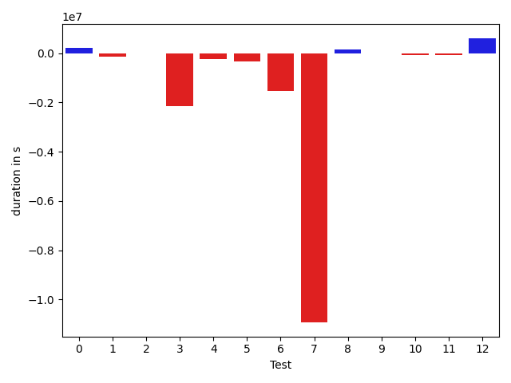
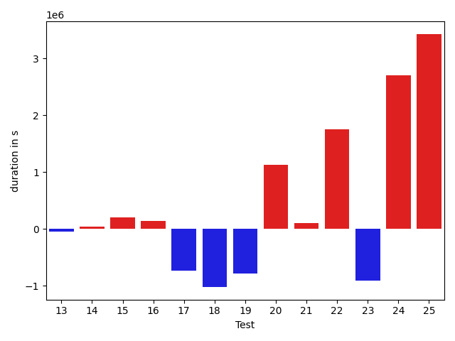
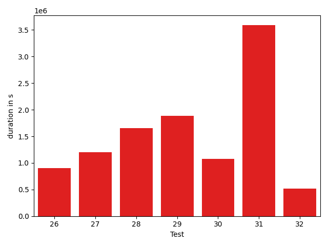

# gson c24af3

https://github.com/google/gson/commit/c24af3

## Delta Energy per test method

| ID | EnergyV1 | EnergyV2 | DeltaEnergy |
| --- | --- | --- | --- |
| 0 | 38684.13555817781 | 37727.384625126215 | -956.7509330515968 |
| 1 | 39667.95422864234 | 43618.82806101169 | 3950.873832369354 |
| 2 | 39021.22028108394 | 41918.659066466134 | 2897.4387853821972 |
| 3 | 79738.08896316272 | 39449.75719113959 | -40288.33177202313 |
| 4 | 35337.1848136779 | 41525.89377374663 | 6188.708960068732 |
| 5 | 36781.44438388711 | 36452.25962134975 | -329.1847625373557 |
| 6 | 68690.3756334862 | 36261.9288870506 | -32428.4467464356 |
| 7 | 392441.48461173475 | 38698.81579616666 | -353742.6688155681 |
| 8 | 40674.91979408264 | 35468.52597476868 | -5206.393819313962 |
| 9 | 38449.095633387566 | 37283.336975097656 | -1165.7586582899094 |
| 10 | 32211.401737213135 | 36856.53371708095 | 4645.131979867816 |
| 11 | 38517.098989114165 | 38496.35131546855 | -20.747673645615578 |
| 12 | 42294.783840905875 | 56184.73243827 | 13889.948597364128 |
| 13 | 34577.76127000898 | 57175.864265441895 | 22598.102995432913 |
| 14 | 38151.23271587031 | 36008.66899575322 | -2142.5637201170903 |
| 15 | 32585.763010025024 | 38790.229248046875 | 6204.466238021851 |
| 16 | 33623.24655532837 | 34074.9087382257 | 451.66218289732933 |
| 17 | 41587.38119384335 | 37220.560755670245 | -4366.820438173105 |
| 18 | 46621.9167804718 | 39527.90415239334 | -7094.012628078461 |
| 19 | 39831.571757256985 | 36667.85113216075 | -3163.7206250962336 |
| 20 | 46314.18909268826 | 45195.22862672806 | -1118.9604659602046 |
| 21 | 36037.13319396973 | 36407.61387363076 | 370.48067966103554 |
| 22 | 217621.3543738454 | 402214.96278743324 | 184593.60841358785 |
| 23 | 67800.38081823413 | 80668.1719830118 | 12867.791164777664 |
| 24 | 39860.62087142676 | 53530.278937279974 | 13669.658065853211 |
| 25 | 39395.88016387816 | 177133.64153313433 | 137737.7613692562 |
| 26 | 40828.09692398709 | 123132.08784176371 | 82303.99091777662 |
| 27 | 272338.5970622872 | 470294.76136504626 | 197956.16430275905 |
| 28 | 39823.54199389723 | 61735.019530402926 | 21911.477536505692 |
| 29 | 44045.083624183986 | 42757.7228175942 | -1287.360806589786 |
| 30 | 37543.433820176746 | 42196.9921009646 | 4653.558280787853 |
| 31 | 52923.47815115635 | 49302.413430778564 | -3621.0647203777844 |
| 32 | 37616.346508990195 | 56957.351273189306 | 19341.00476419911 |

## Delta Duration per test method

| ID | DurationV1 | DurationsV2 | DeltaDuration |
| --- | --- | --- | --- |
| 0 | 665546.3473623432 | 884927.779415654 | 219381.4320533108 |
| 1 | 975335.9376457399 | 833111.1208741968 | -142224.81677154312 |
| 2 | 1090529.9521363645 | 1090196.9313727873 | -333.0207635771949 |
| 3 | 2852075.9401300168 | 696287.0545464568 | -2155788.88558356 |
| 4 | 917955.9524295353 | 680799.4638264206 | -237156.48860311473 |
| 5 | 972235.9528938308 | 651133.5540095125 | -321102.3988843183 |
| 6 | 2066954.4045088957 | 549019.6447462887 | -1517934.759762607 |
| 7 | 11543637.426792234 | 617057.8174619079 | -10926579.609330326 |
| 8 | 597249.5272250175 | 765412.3770185488 | 168162.84979353123 |
| 9 | 507850.25805848837 | 507693.77478027344 | -156.4832782149315 |
| 10 | 695460.0906553268 | 620245.7182355635 | -75214.37241976336 |
| 11 | 617493.8184388801 | 560023.0008639991 | -57470.81757488102 |
| 12 | 860387.1862238683 | 1468869.0956270546 | 608481.9094031863 |
| 13 | 636481.8059188426 | 1297066.2204265594 | 660584.4145077169 |
| 14 | 683979.3895399433 | 700145.0683115801 | 16165.678771636798 |
| 15 | 600063.6318035126 | 565728.8041381836 | -34334.82766532898 |
| 16 | 565946.7379455566 | 569327.433394596 | 3380.69544903934 |
| 17 | 1439102.5946199226 | 1213102.5453228892 | -226000.04929703334 |
| 18 | 879570.2431983948 | 717361.7026925087 | -162208.54050588608 |
| 19 | 559831.199650526 | 615702.2662547873 | 55871.06660426129 |
| 20 | 808660.9898133725 | 922392.9294216633 | 113731.93960829079 |
| 21 | 645351.643330574 | 570714.7583688162 | -74636.88496175781 |
| 22 | 5963592.330592106 | 11295339.24314678 | 5331746.912554675 |
| 23 | 1917530.0696338755 | 2045555.6485693431 | 128025.57893546764 |
| 24 | 886937.5736516074 | 2683263.6440331996 | 1796326.0703815923 |
| 25 | 653322.9492367097 | 5040846.289459037 | 4387523.340222327 |
| 26 | 1642078.5300378902 | 3379694.4557179436 | 1737615.9256800534 |
| 27 | 7383527.161018435 | 13645004.61538676 | 6261477.454368325 |
| 28 | 1046077.4976592048 | 1866752.3395913288 | 820674.841932124 |
| 29 | 1306715.8463270164 | 1464949.970889768 | 158234.12456275173 |
| 30 | 1234033.6623856383 | 1116805.6105910933 | -117228.05179454503 |
| 31 | 1874602.4245436955 | 1611817.2979182454 | -262785.1266254501 |
| 32 | 696266.1171920069 | 2353721.1492488836 | 1657455.0320568767 |

## Misc.

| ID | Test Class | Test Method |
| --- | --- | --- |
| 0 | com.google.gson.functional.JsonParserTest | testBadTypeForDeserializingCustomTree |
| 1 | com.google.gson.functional.JsonParserTest | testChangingCustomTreeAndDeserializing |
| 2 | com.google.gson.functional.JsonParserTest | testBadFieldTypeForDeserializingCustomTree |
| 3 | com.google.gson.functional.JsonParserTest | testDeserializingCustomTree |
| 4 | com.google.gson.functional.JsonParserTest | testBadFieldTypeForCustomDeserializerCustomTree |
| 5 | com.google.gson.internal.bind.JsonElementReaderTest | testStrictNansAndInfinities |
| 6 | com.google.gson.internal.bind.JsonElementReaderTest | testNestedObjects |
| 7 | com.google.gson.internal.bind.JsonElementReaderTest | testStrings |
| 8 | com.google.gson.internal.bind.JsonElementReaderTest | testNumbersFromStrings |
| 9 | com.google.gson.internal.bind.JsonElementReaderTest | testEmptyObject |
| 10 | com.google.gson.internal.bind.JsonElementReaderTest | testArray |
| 11 | com.google.gson.internal.bind.JsonElementReaderTest | testSkipValue |
| 12 | com.google.gson.internal.bind.JsonElementReaderTest | testNumbers |
| 13 | com.google.gson.internal.bind.JsonElementReaderTest | testNulls |
| 14 | com.google.gson.internal.bind.JsonElementReaderTest | testWrongType |
| 15 | com.google.gson.internal.bind.JsonElementReaderTest | testEmptyArray |
| 16 | com.google.gson.internal.bind.JsonElementReaderTest | testEarlyClose |
| 17 | com.google.gson.internal.bind.JsonElementReaderTest | testLenientNansAndInfinities |
| 18 | com.google.gson.internal.bind.JsonElementReaderTest | testBooleans |
| 19 | com.google.gson.internal.bind.JsonElementReaderTest | testObject |
| 20 | com.google.gson.internal.bind.JsonElementReaderTest | testNestedArrays |
| 21 | com.google.gson.internal.bind.JsonElementReaderTest | testStringsFromNumbers |
| 22 | com.google.gson.functional.RuntimeTypeAdapterFactoryFunctionalTest | testSubclassesAutomaticallySerialzed |
| 23 | com.google.gson.JsonParserTest | testReadWriteTwoObjects |
| 24 | com.google.gson.functional.ExclusionStrategyFunctionalTest | testExclusionStrategyWithMode |
| 25 | com.google.gson.functional.ExclusionStrategyFunctionalTest | testExclusionStrategyDeserialization |
| 26 | com.google.gson.functional.CustomDeserializerTest | testJsonTypeFieldBasedDeserialization |
| 27 | com.google.gson.functional.TypeHierarchyAdapterTest | testTypeHierarchy |
| 28 | com.google.gson.functional.MapTest | testMapNamePromotionWithJsonElementReader |
| 29 | com.google.gson.functional.ReadersWritersTest | testReadWriteTwoObjects |
| 30 | com.google.gson.functional.ReadersWritersTest | testReadWriteTwoStrings |
| 31 | com.google.gson.functional.StreamingTypeAdaptersTest | testFromJsonTree |
| 32 | com.google.gson.functional.PrimitiveTest | testPrimitiveClassLiteral |

| Test | IterationV1 | IterationV2 | DeltaIteration |
| --- | --- | --- | --- |
| 0 | 41 | 51 | 10 |
| 1 | 57 | 53 | -4 |
| 2 | 63 | 83 | 20 |
| 3 | 55 | 53 | -2 |
| 4 | 44 | 45 | 1 |
| 5 | 31 | 46 | 15 |
| 6 | 33 | 30 | -3 |
| 7 | 26 | 26 | 0 |
| 8 | 21 | 32 | 11 |
| 9 | 24 | 15 | -9 |
| 10 | 22 | 28 | 6 |
| 11 | 28 | 26 | -2 |
| 12 | 29 | 29 | 0 |
| 13 | 29 | 20 | -9 |
| 14 | 37 | 46 | 9 |
| 15 | 20 | 15 | -5 |
| 16 | 19 | 26 | 7 |
| 17 | 42 | 39 | -3 |
| 18 | 22 | 22 | 0 |
| 19 | 25 | 35 | 10 |
| 20 | 28 | 23 | -5 |
| 21 | 22 | 29 | 7 |
| 22 | 99 | 99 | 0 |
| 23 | 83 | 90 | 7 |
| 24 | 64 | 79 | 15 |
| 25 | 37 | 99 | 62 |
| 26 | 99 | 99 | 0 |
| 27 | 99 | 99 | 0 |
| 28 | 65 | 97 | 32 |
| 29 | 74 | 90 | 16 |
| 30 | 78 | 67 | -11 |
| 31 | 46 | 98 | 52 |
| 32 | 39 | 45 | 6 |

| Time Label | Time (s) |
| --- | --- |
| Selection | 34.365922927856445 |
| Injection | 15.54828953742981 |
| Total | 1380.9537115097046 |

