# gson 2df655

https://github.com/google/gson/commit/2df655

## Delta Energy per test method

| ID | EnergyV1 | EnergyV2 | DeltaEnergy |
| --- | --- | --- | --- |
| 0 | 44436.71084093886 | 42795.546741130165 | -1641.164099808695 |
| 1 | 41974.971267443616 | 59418.3820932731 | 17443.410825829487 |
| 2 | 38336.45294286212 | 37472.15566573112 | -864.2972771309942 |
| 3 | 39128.348220284555 | 37362.81022754713 | -1765.5379927374233 |
| 4 | 40797.81060660962 | 38781.58320308053 | -2016.2274035290902 |
| 5 | 35873.1645165221 | 36298.03154527091 | 424.867028748813 |
| 6 | 93037.58804108956 | 75971.9337780588 | -17065.654263030767 |
| 7 | 40410.6010987582 | 40481.66742237758 | 71.06632361937955 |
| 8 | 37269.86904658234 | 38549.29801715753 | 1279.4289705751944 |
| 9 | 41493.22100357446 | 37125.311702481486 | -4367.909301092972 |
| 10 | 44256.09959811838 | 41923.70897861785 | -2332.390619500533 |
| 11 | 44988.03368792491 | 40745.736251610426 | -4242.297436314482 |
| 12 | 38485.68885938641 | 37257.05828271176 | -1228.6305766746518 |
| 13 | 39138.25977516174 | 37691.3122085341 | -1446.9475666276412 |
| 14 | 39783.619373106456 | 38006.247570894695 | -1777.371802211761 |
| 15 | 38309.83876859871 | 38901.73281369464 | 591.8940450959271 |
| 16 | 36317.49134848213 | 37909.99149064378 | 1592.500142161647 |
| 17 | 39789.44863765733 | 40688.469661396 | 899.0210237386636 |
| 18 | 39728.19465737358 | 38731.257487036826 | -996.9371703367506 |
| 19 | 36444.830406636 | 39845.90713722119 | 3401.0767305851914 |
| 20 | 36616.72270378006 | 37822.884933645044 | 1206.1622298649818 |
| 21 | 1240694.3229036494 | 1035931.8056190847 | -204762.51728456467 |
| 22 | 38726.29649371421 | 37647.81383173836 | -1078.4826619758533 |
| 23 | 80364.52006957252 | 93685.03745567455 | 13320.51738610203 |
| 24 | 39405.31218764186 | 35106.206257716316 | -4299.105929925543 |
| 25 | 72018.22219956008 | 82608.58662297203 | 10590.364423411942 |
| 26 | 31598.793424785137 | 37941.48511886597 | 6342.69169408083 |
| 27 | 56546.86163518835 | 70173.52413217764 | 13626.662496989295 |
| 28 | 64899.77868727623 | 40549.09857310159 | -24350.68011417464 |
| 29 | 42761.26041087875 | 37119.93411511205 | -5641.326295766696 |
| 30 | 61117.5644767875 | 40087.230742123575 | -21030.333734663924 |
| 31 | 40571.10066818977 | 39799.01227040515 | -772.0883977846242 |
| 32 | 62750.45986046325 | 45649.67985851542 | -17100.78000194783 |
| 33 | 38791.239678271595 | 35688.56727874359 | -3102.6723995280045 |
| 34 | 39713.50045865226 | 40600.95538823644 | 887.4549295841789 |
| 35 | 38023.586878560345 | 37258.368763850776 | -765.2181147095689 |
| 36 | 37567.3783488825 | 37505.919487687264 | -61.45886119523493 |
| 37 | 37080.645357842935 | 37324.289882864774 | 243.6445250218385 |
| 38 | 98834.93036026234 | 85386.07691404922 | -13448.853446213121 |
| 39 | 58902.11181447722 | 85534.46811909479 | 26632.35630461757 |
| 40 | 49491.2090138186 | 53958.18757459156 | 4466.978560772957 |
| 41 | 39871.93684539232 | 38009.95219943748 | -1861.9846459548426 |
| 42 | 79106.19126696119 | 62291.41366764749 | -16814.777599313704 |
| 43 | 34397.00575872834 | 37186.33783535403 | 2789.3320766256948 |
| 44 | 37386.51188219218 | 35064.39043258652 | -2322.1214496056564 |
| 45 | 38901.70933299909 | 35279.68522672172 | -3622.024106277371 |
| 46 | 35547.972963367756 | 35935.81524444562 | 387.84228107786475 |
| 47 | 55867.924899059086 | 35319.05070676712 | -20548.874192291965 |
| 48 | 34783.870069660516 | 40389.13921451816 | 5605.269144857644 |
| 49 | 35023.559272949584 | 39861.605072831735 | 4838.045799882151 |
| 50 | 219655.85121403635 | 242297.9249739055 | 22642.07375986915 |
| 51 | 170977.87110697094 | 159901.1716151687 | -11076.699491802225 |
| 52 | 36284.23560892866 | 42916.057544730604 | 6631.821935801941 |
| 53 | 36155.784222560935 | 39471.64379262924 | 3315.859570068307 |
| 54 | 36908.768460929394 | 41299.08800114691 | 4390.319540217519 |
| 55 | 35942.85442708433 | 37140.64337158203 | 1197.7889444977045 |
| 56 | 101822.83167004424 | 102142.83890175696 | 320.00723171271966 |
| 57 | 150729.10792327646 | 34552.65562993414 | -116176.45229334233 |
| 58 | 35733.27458166633 | 36911.075210180206 | 1177.8006285138763 |
| 59 | 36923.82340717316 | 36249.208882808685 | -674.6145243644714 |
| 60 | 39809.05357204146 | 36675.70456920166 | -3133.349002839801 |
| 61 | 42756.03762435913 | 37520.45115661621 | -5235.58646774292 |
| 62 | 54344.40289193283 | 90001.5846608129 | 35657.18176888008 |
| 63 | 77530.5464899122 | 81446.86936453928 | 3916.322874627076 |
| 64 | 111852.99725419664 | 54349.36042164038 | -57503.636832556265 |
| 65 | 37620.744614720345 | 36338.718322753906 | -1282.0262919664383 |
| 66 | 42423.17810964584 | 40675.78369140625 | -1747.3944182395935 |
| 67 | 62604.62893696202 | 160283.62774253963 | 97678.9988055776 |
| 68 | 35498.01138671436 | 35356.9396971463 | -141.0716895680598 |
| 69 | 254897.3286438743 | 279010.09824099427 | 24112.769597119972 |
| 70 | 55231.438815538786 | 38384.66313018878 | -16846.775685350003 |
| 71 | 46521.54606344859 | 40054.63883228367 | -6466.9072311649215 |
| 72 | 40687.58180756107 | 49080.17844964014 | 8392.596642079065 |
| 73 | 40975.52323933691 | 41500.89978378266 | 525.3765444457531 |
| 74 | 43486.01286898421 | 77373.70973433185 | 33887.696865347636 |
| 75 | 40309.93345570491 | 37969.15760582227 | -2340.775849882637 |
| 76 | 42284.45029786892 | 40991.20295081462 | -1293.2473470542973 |
| 77 | 42064.33340788888 | 38193.63345704877 | -3870.699950840113 |
| 78 | 39753.26839653902 | 43973.752048944996 | 4220.483652405979 |
| 79 | 45192.83408361615 | 37386.05803217989 | -7806.77605143626 |
| 80 | 157909.9543371275 | 43879.216302789515 | -114030.73803433799 |
| 81 | 102084.64610452544 | 112173.77295287393 | 10089.12684834849 |
| 82 | 40150.853018313646 | 39767.71209907532 | -383.14091923832893 |
| 83 | 38050.0330070723 | 44967.48197381562 | 6917.448966743323 |
| 84 | 39836.25551809787 | 37457.31679950452 | -2378.9387185933447 |
| 85 | 41161.51407623291 | 37082.96188926697 | -4078.5521869659424 |
| 86 | 37040.8226630969 | 43413.34795438085 | 6372.52529128395 |
| 87 | 40323.135725041386 | 86804.89515094645 | 46481.75942590507 |
| 88 | 43275.27554023266 | 40866.84136533737 | -2408.4341748952866 |
| 89 | 35949.45916105726 | 39444.89551028581 | 3495.4363492285484 |
| 90 | 38683.94195594566 | 39959.48977597417 | 1275.5478200285143 |
| 91 | 40846.353070654484 | 38458.646151539244 | -2387.7069191152405 |
| 92 | 35315.746842692 | 39887.24625244929 | 4571.499409757285 |
| 93 | 39359.658333384985 | 42558.30228745482 | 3198.643954069834 |
| 94 | 41961.62368034815 | 40247.99058968412 | -1713.6330906640287 |
| 95 | 38837.209008581005 | 33745.17526043893 | -5092.033748142072 |
| 96 | 56586.02630172444 | 51862.15116199391 | -4723.875139730531 |
| 97 | 41571.744049581815 | 253883.09816464837 | 212311.35411506656 |
| 98 | 37690.567700138396 | 93818.37835369245 | 56127.81065355405 |
| 99 | 41672.84694133908 | 36585.81086410774 | -5087.036077231336 |
| 100 | 39979.12514054775 | 38585.62196922302 | -1393.50317132473 |
| 101 | 43681.9660692662 | 41923.00911682844 | -1758.9569524377584 |
| 102 | 42644.62618083687 | 41088.842038452975 | -1555.7841423838981 |
| 103 | 39482.422688282204 | 37046.26265256278 | -2436.1600357194257 |
| 104 | 40302.428222764844 | 41698.83531421836 | 1396.4070914535187 |
| 105 | 38826.22159253433 | 39626.36516940873 | 800.1435768743977 |
| 106 | 38483.481673032045 | 40179.82530760765 | 1696.3436345756054 |
| 107 | 43567.97073809104 | 38261.91335710883 | -5306.057380982209 |
| 108 | 38574.21716544151 | 40443.4841820561 | 1869.2670166145908 |
| 109 | 41926.294664543006 | 36467.02728124454 | -5459.267383298466 |
| 110 | 49259.766207854496 | 38978.27764089662 | -10281.48856695788 |
| 111 | 41536.11494557026 | 38311.69912631611 | -3224.415819254151 |
| 112 | 32495.044165991247 | 40400.91751861572 | 7905.873352624476 |
| 113 | 36218.42952483251 | 40635.25799565132 | 4416.828470818815 |
| 114 | 33587.553769979204 | 37374.741779265176 | 3787.188009285972 |
| 115 | 34885.69341657293 | 39428.96004640474 | 4543.266629831807 |
| 116 | 38752.72968933248 | 38681.04664478332 | -71.68304454916506 |
| 117 | 40158.61010761437 | 38609.482426250644 | -1549.1276813637232 |
| 118 | 84419.86384078115 | 47558.704005334526 | -36861.159835446626 |
| 119 | 37684.82805165007 | 40947.664849702065 | 3262.836798051998 |
| 120 | 36354.99114370346 | 41776.53828972578 | 5421.54714602232 |
| 121 | 37977.79527437687 | 38946.30764007568 | 968.5123656988144 |
| 122 | 34927.85898852348 | 41361.26623535156 | 6433.407246828079 |
| 123 | 35288.16911442776 | 37175.37842568511 | 1887.2093112573493 |
| 124 | 39065.71163867538 | 38386.885096441096 | -678.8265422342811 |
| 125 | 32027.31925100088 | 40580.44355845451 | 8553.124307453632 |
| 126 | 56166.6027666023 | 41249.65966637124 | -14916.94310023106 |
| 127 | 37022.168893530965 | 36653.56796777039 | -368.6009257605765 |
| 128 | 38470.26966315508 | 39947.559816122055 | 1477.2901529669762 |
| 129 | 34299.40828342736 | 41314.11713599041 | 7014.708852563053 |
| 130 | 36030.538650512695 | 38751.022369384766 | 2720.4837188720703 |
| 131 | 37798.27431154251 | 36779.84020996094 | -1018.4341015815735 |
| 132 | 37731.55566651281 | 39249.21151000075 | 1517.6558434879407 |
| 133 | 35897.689088985324 | 36830.87748578051 | 933.1883967951871 |
| 134 | 140903.75400024594 | 38839.71903754543 | -102064.0349627005 |
| 135 | 37729.686824376695 | 37200.2364235 | -529.4504008766962 |
| 136 | 34998.20640412825 | 37951.26382045896 | 2953.05741633071 |
| 137 | 37984.66574971508 | 38634.47249629209 | 649.8067465770073 |
| 138 | 36456.763240914326 | 40678.279286866076 | 4221.51604595175 |
| 139 | 40893.18764888495 | 37766.562843322754 | -3126.624805562198 |
| 140 | 36201.18936395645 | 34906.10118484497 | -1295.0881791114807 |
| 141 | 35097.496087789536 | 37951.54131317139 | 2854.045225381851 |
| 142 | 30688.9084299244 | 40206.50424051285 | 9517.59581058845 |
| 143 | 37649.655974379624 | 42068.653260858846 | 4418.997286479222 |
| 144 | 40218.903466425836 | 52990.125310748816 | 12771.22184432298 |
| 145 | 37618.95121400058 | 35139.856618881226 | -2479.094595119357 |
| 146 | 37546.69453152495 | 41832.652837381684 | 4285.958305856737 |
| 147 | 38986.513457895926 | 38367.9324347798 | -618.5810231161231 |
| 148 | 64032.503440123 | 82854.2201206384 | 18821.716680515405 |
| 149 | 43447.24695716449 | 32820.76458731294 | -10626.482369851554 |
| 150 | 37772.750533462226 | 35509.12278403481 | -2263.627749427418 |
| 151 | 35055.87656439567 | 35129.53772488966 | 73.66116049398988 |
| 152 | 39604.97801653667 | 35363.65562872883 | -4241.322387807835 |
| 153 | 40898.1989424314 | 34555.933291914516 | -6342.265650516885 |
| 154 | 43129.86773883551 | 33466.482366383076 | -9663.385372452438 |
| 155 | 37998.47225489421 | 32740.92725282467 | -5257.545002069539 |
| 156 | 44549.36993095465 | 64112.07464065123 | 19562.704709696583 |
| 157 | 39836.73503494263 | 38844.39457321167 | -992.340461730957 |
| 158 | 42604.45692163706 | 31363.61124400422 | -11240.845677632838 |
| 159 | 39199.8580206302 | 37024.49425125122 | -2175.3637693789788 |
| 160 | 41172.64600306749 | 42417.87481942773 | 1245.2288163602352 |
| 161 | 44882.42365980148 | 38088.83860898018 | -6793.585050821304 |
| 162 | 46293.85800575304 | 74566.07836360196 | 28272.22035784892 |
| 163 | 45934.326534439766 | 34428.05600235694 | -11506.270532082825 |
| 164 | 43431.77642582922 | 53913.84708670284 | 10482.070660873615 |
| 165 | 41267.45226410037 | 36914.29237686179 | -4353.15988723858 |
| 166 | 148182.36185122404 | 145388.58959914214 | -2793.7722520818934 |
| 167 | 41393.771939963015 | 36921.15815483419 | -4472.613785128822 |
| 168 | 43363.69656527894 | 38121.36062184561 | -5242.335943433325 |
| 169 | 40815.40857857466 | 37054.79041349795 | -3760.6181650767103 |
| 170 | 43284.00262069702 | 43058.4822075367 | -225.5204131603241 |
| 171 | 40105.84917066246 | 35183.5648845277 | -4922.28428613476 |
| 172 | 39150.77072943747 | 39396.726891427345 | 245.9561619898741 |
| 173 | 41306.12667654778 | 42944.94971565454 | 1638.8230391067627 |
| 174 | 38754.409892824144 | 43600.41645160834 | 4846.006558784196 |
| 175 | 41907.754547691366 | 43136.3892050297 | 1228.6346573383344 |
| 176 | 64116.62291742262 | 43913.71987950461 | -20202.903037918004 |
| 177 | 66763.6142754214 | 59149.44746371924 | -7614.1668117021545 |
| 178 | 37894.94760423231 | 59312.402652453464 | 21417.455048221156 |
| 179 | 41865.91722075709 | 38967.93851235858 | -2897.9787083985066 |
| 180 | 45200.64256985299 | 39923.097449838446 | -5277.545120014547 |
| 181 | 43131.115737231616 | 37320.59513167865 | -5810.520605552963 |
| 182 | 41399.48976589192 | 39746.5906205146 | -1652.8991453773197 |
| 183 | 42835.77253521306 | 37699.65861666812 | -5136.113918544936 |
| 184 | 42201.62228407152 | 38803.50699889101 | -3398.115285180509 |
| 185 | 54946.39959280627 | 43218.27156910482 | -11728.12802370145 |
| 186 | 41344.906959678825 | 39010.54867752864 | -2334.358282150184 |
| 187 | 45947.22597114276 | 40763.915745556355 | -5183.310225586407 |
| 188 | 76061.54948034375 | 75108.63277547511 | -952.9167048686359 |
| 189 | 40348.855173644246 | 34539.671766467865 | -5809.183407176381 |
| 190 | 40500.442867684076 | 39249.6713238011 | -1250.7715438829764 |
| 191 | 40528.90231436565 | 52990.25463041596 | 12461.35231605031 |
| 192 | 42738.810796599704 | 38372.19119303873 | -4366.6196035609755 |
| 193 | 42747.80845100314 | 37453.13147439404 | -5294.676976609102 |
| 194 | 40482.81275470313 | 36537.935268630565 | -3944.877486072568 |
| 195 | 44630.9425029071 | 48958.217000054814 | 4327.274497147715 |
| 196 | 37923.04169511795 | 33868.904743909836 | -4054.1369512081146 |
| 197 | 39673.08541870117 | 36777.71481513977 | -2895.3706035614014 |
| 198 | 40910.49337760059 | 40049.635984176144 | -860.8573934244487 |
| 199 | 303847.3419954147 | 42370.548677021616 | -261476.7933183931 |
| 200 | 56066.980579892275 | 54184.48520407519 | -1882.4953758170886 |
| 201 | 107151.40281282237 | 106726.87175647434 | -424.5310563480307 |
| 202 | 42041.500230097656 | 35877.7790118298 | -6163.721218267856 |
| 203 | 113008.12832897337 | 93211.13348427568 | -19796.994844697692 |
| 204 | 41275.852833023964 | 38957.08852319035 | -2318.764309833612 |
| 205 | 43193.39816570282 | 36856.36061550677 | -6337.037550196052 |
| 206 | 37997.24523550272 | 36059.91738164425 | -1937.327853858471 |
| 207 | 36514.529635071754 | 37750.476914068684 | 1235.9472789969295 |
| 208 | 53206.930694542825 | 49610.1759109835 | -3596.7547835593286 |
| 209 | 35845.00424916847 | 37908.54495003224 | 2063.5407008637703 |
| 210 | 298000.4218525374 | 244606.4609848007 | -53393.96086773666 |
| 211 | 381749.4265979051 | 395675.9551931198 | 13926.52859521471 |
| 212 | 42482.59722233984 | 40758.42941652319 | -1724.1678058166508 |
| 213 | 43920.78329699688 | 65746.74009298228 | 21825.956795985396 |
| 214 | 39953.85969706252 | 42965.72702154843 | 3011.867324485909 |
| 215 | 43057.347939656 | 43141.11381950962 | 83.7658798536213 |
| 216 | 43390.60679214867 | 43752.87592284824 | 362.26913069956936 |
| 217 | 38610.35275901621 | 39866.80442983148 | 1256.451670815266 |
| 218 | 42015.77795675985 | 40867.70949290589 | -1148.0684638539606 |
| 219 | 40803.61795819229 | 36332.035956359556 | -4471.582001832736 |
| 220 | 64683.81727201372 | 40803.35599101087 | -23880.461281002856 |
| 221 | 39094.748794792475 | 38623.78967778594 | -470.9591170065323 |
| 222 | 113269.37774890535 | 97891.57442483088 | -15377.80332407447 |
| 223 | 153043.18249723502 | 146631.71656011476 | -6411.465937120258 |
| 224 | 41713.27416681434 | 37713.17707455597 | -4000.097092258373 |
| 225 | 42781.119566528505 | 39600.93156073569 | -3180.188005792814 |
| 226 | 87688.33184178104 | 59964.560027086736 | -27723.7718146943 |
| 227 | 40197.14881774348 | 39375.898952311094 | -821.2498654323863 |
| 228 | 43172.550078852684 | 38388.660688401236 | -4783.889390451448 |
| 229 | 39021.200936332345 | 368279.20969700813 | 329258.0087606758 |
| 230 | 44856.39434848726 | 36133.903949636966 | -8722.490398850292 |
| 231 | 40893.565275892615 | 36559.49165600538 | -4334.073619887233 |
| 232 | 36717.329471588135 | 39931.55596160889 | 3214.226490020752 |
| 233 | 41229.77607741952 | 37936.71580171585 | -3293.0602757036686 |
| 234 | 37174.985552072525 | 40149.90259242058 | 2974.917040348053 |
| 235 | 42076.43815088272 | 40683.37138175964 | -1393.0667691230774 |
| 236 | 41363.00070462376 | 40378.7749401778 | -984.2257644459605 |
| 237 | 38988.922776296735 | 40288.826173983514 | 1299.9033976867795 |
| 238 | 38639.07681123167 | 40066.09018694982 | 1427.0133757181466 |
| 239 | 33615.171144983506 | 42991.117293373594 | 9375.946148390089 |
| 240 | 41008.24916766584 | 37688.37185245752 | -3319.877315208316 |
| 241 | 39675.66744119488 | 35440.164765936555 | -4235.502675258322 |
| 242 | 41418.49380353093 | 38516.828041855246 | -2901.6657616756856 |
| 243 | 43022.038180835625 | 37169.64185534137 | -5852.396325494257 |
| 244 | 44195.42552158116 | 36616.53031128327 | -7578.895210297887 |
| 245 | 171583.3606009899 | 95312.08952537045 | -76271.27107561944 |
| 246 | 65922.98028645338 | 45269.31062998623 | -20653.66965646716 |
| 247 | 53077.93461301769 | 38623.513824987254 | -14454.420788030438 |
| 248 | 57536.30317914486 | 40017.19935274124 | -17519.103826403618 |
| 249 | 41763.06707692146 | 50701.84567070007 | 8938.77859377861 |
| 250 | 42776.16384272445 | 40771.27646787005 | -2004.8873748543992 |
| 251 | 49990.16221598335 | 45936.64907735727 | -4053.5131386260764 |
| 252 | 41628.13697500093 | 42465.32775198434 | 837.190776983407 |
| 253 | 45296.66260861354 | 100301.07325483169 | 55004.41064621815 |
| 254 | 38275.341765683144 | 37241.20295188547 | -1034.1388137976755 |
| 255 | 42390.13614373258 | 33068.8791807216 | -9321.256963010987 |
| 256 | 47856.21566613473 | 148043.4374983217 | 100187.22183218697 |
| 257 | 42214.35600282347 | 39196.91698609615 | -3017.439016727323 |
| 258 | 41573.486391533166 | 36588.735112363356 | -4984.75127916981 |
| 259 | 34387.58610358995 | 44301.96664621245 | 9914.3805426225 |
| 260 | 41281.2796476422 | 42233.6316611576 | 952.3520135153958 |
| 261 | 41911.62969207764 | 41811.3339509964 | -100.2957410812378 |
| 262 | 40304.086013793945 | 40079.46783936024 | -224.6181744337082 |
| 263 | 39824.35334968567 | 43602.841142416 | 3778.4877927303314 |
| 264 | 44069.253741532244 | 42376.96268928486 | -1692.291052247383 |
| 265 | 40735.47061057505 | 40426.28231263103 | -309.1882979440197 |
| 266 | 45847.527509791165 | 43954.66196057982 | -1892.8655492113467 |
| 267 | 34388.34215222209 | 37856.68825846988 | 3468.3461062477945 |
| 268 | 36825.022683112096 | 37603.82766613836 | 778.8049830262607 |
| 269 | 35474.0996135843 | 38032.21870764944 | 2558.119094065136 |
| 270 | 37072.95858159521 | 40161.958407303064 | 3088.999825707855 |
| 271 | 84192.59422021477 | 104686.75698591082 | 20494.162765696048 |
| 272 | 43143.95679276156 | 62689.753524755084 | 19545.796731993527 |
| 273 | 41215.93852421641 | 41994.740156173706 | 778.8016319572926 |
| 274 | 46945.20214646377 | 103986.01912824143 | 57040.81698177766 |
| 275 | 44013.896947343484 | 43080.03055784888 | -933.8663894946076 |
| 276 | 40654.80589732528 | 41223.03722173115 | 568.2313244058751 |
| 277 | 41977.80724679218 | 37356.460643576494 | -4621.346603215687 |
| 278 | 39131.99489738021 | 41014.72960593818 | 1882.7347085579677 |
| 279 | 184910.3643348081 | 103606.55397010635 | -81303.81036470176 |
| 280 | 40356.7528963685 | 37883.24559211731 | -2473.507304251194 |
| 281 | 38074.645524511056 | 36444.72730077768 | -1629.9182237333735 |
| 282 | 38492.83856164664 | 38520.68064087164 | 27.84207922499627 |
| 283 | 44820.450267392414 | 41012.55825594734 | -3807.892011445074 |

## Delta Duration per test method

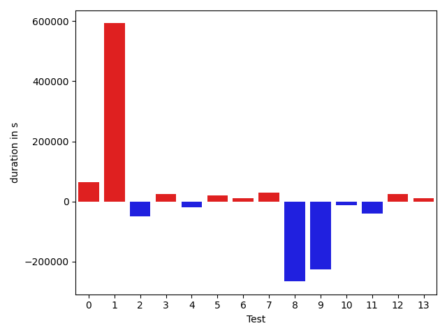

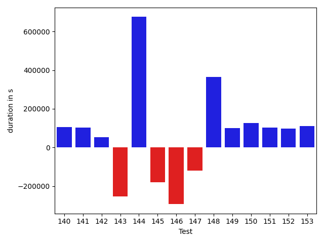

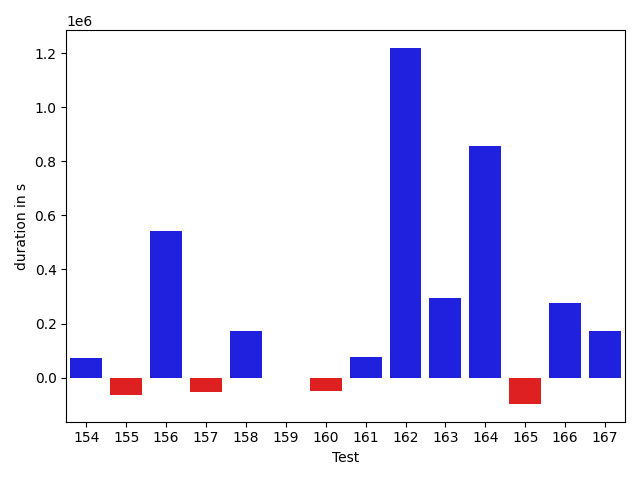

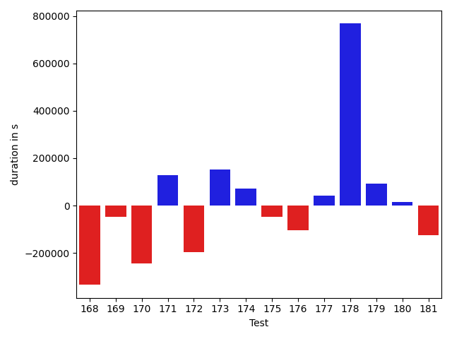

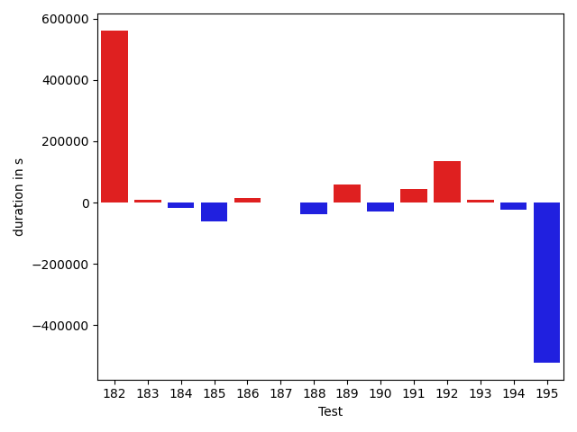

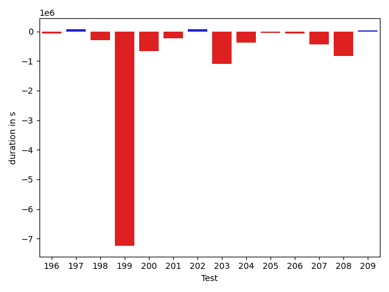

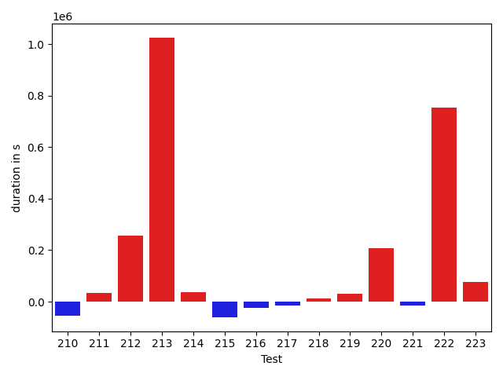

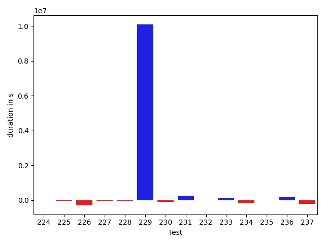

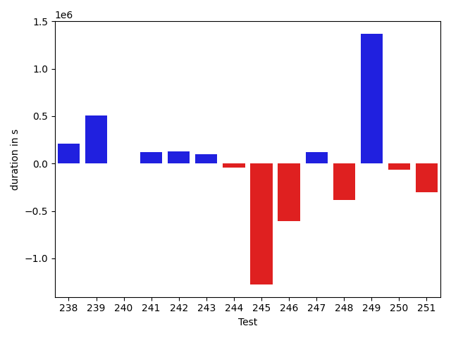

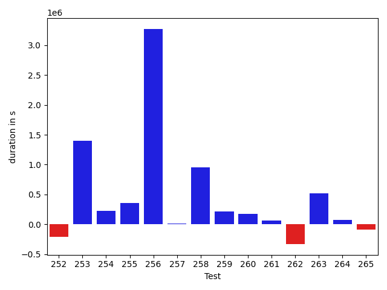

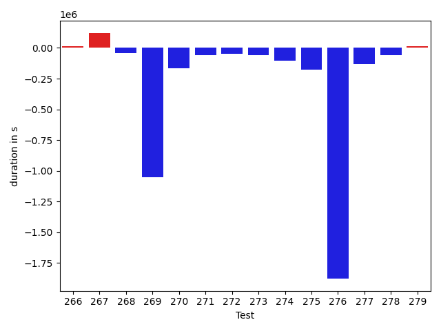

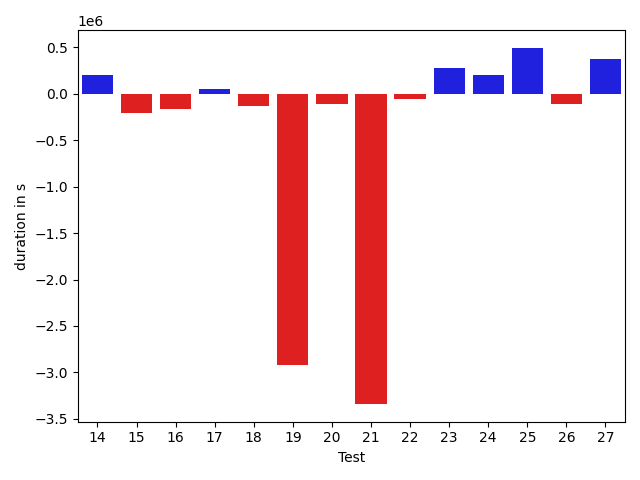

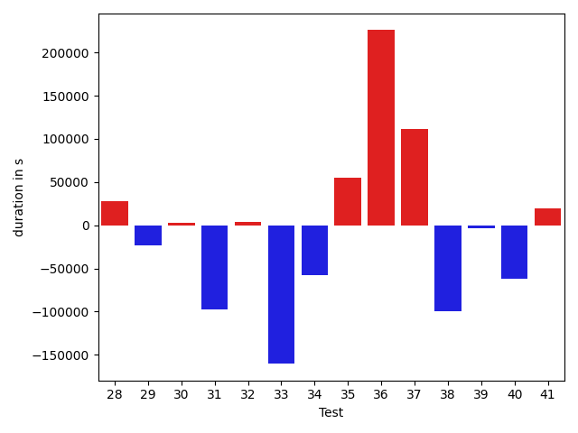

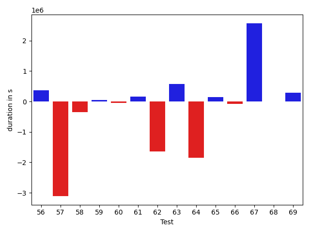

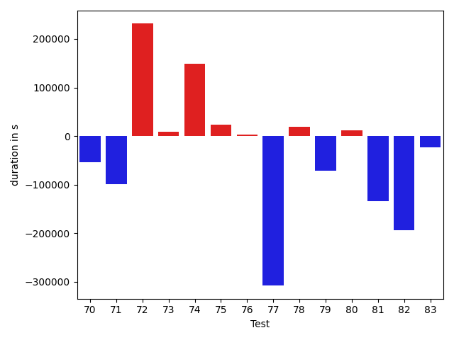

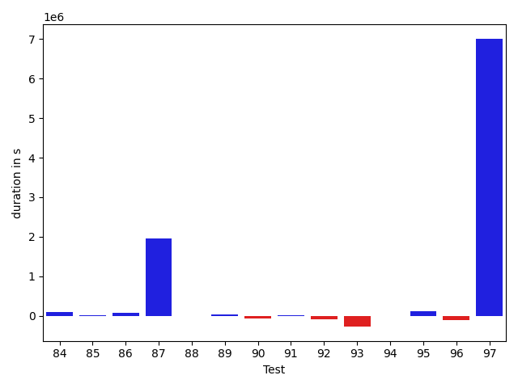

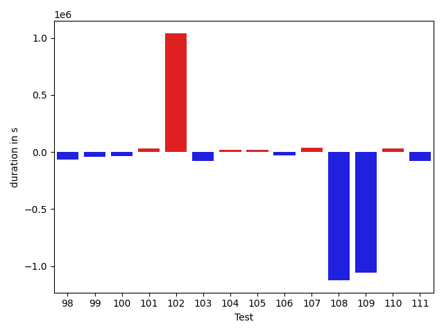

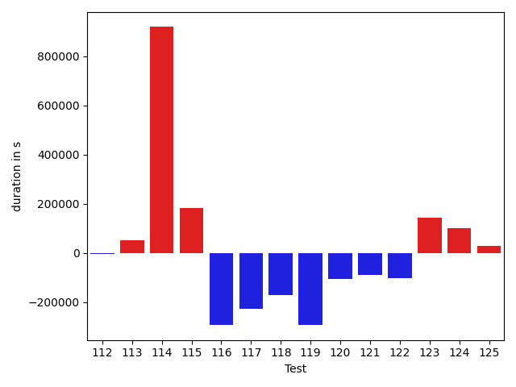

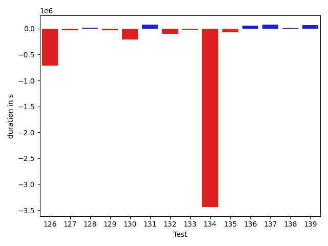

| ID | DurationV1 | DurationsV2 | DeltaDuration |
| --- | --- | --- | --- |
| 0 | 806415.2509754094 | 768274.6928740053 | -38140.55810140411 |
| 1 | 562366.7771653649 | 1220585.85068373 | 658219.0735183652 |
| 2 | 1044341.9915599944 | 1167653.18309884 | 123311.19153884565 |
| 3 | 678072.4161980683 | 702138.8197747112 | 24066.403576642857 |
| 4 | 1096747.8195971935 | 722128.2483349914 | -374619.5712622021 |
| 5 | 723876.9063210337 | 509986.9402600279 | -213889.96606100583 |
| 6 | 2135631.033605057 | 1993917.318816036 | -141713.71478902083 |
| 7 | 969480.2181480011 | 3249144.565841362 | 2279664.347693361 |
| 8 | 1049062.9141244083 | 708649.9481919084 | -340412.96593249985 |
| 9 | 822403.268074956 | 813307.0191519973 | -9096.248922958737 |
| 10 | 971020.6100760158 | 964492.9604444595 | -6527.649631556356 |
| 11 | 691075.5196563008 | 703533.580823962 | 12458.061167661217 |
| 12 | 748382.1900211225 | 599683.4287580947 | -148698.7612630278 |
| 13 | 632507.80843997 | 780207.8463177041 | 147700.03787773405 |
| 14 | 783568.1746610298 | 986482.5269756573 | 202914.3523146275 |
| 15 | 1069182.328520196 | 865610.352813496 | -203571.9757067 |
| 16 | 875262.7949284954 | 713222.9229829725 | -162039.87194552296 |
| 17 | 491114.4845309624 | 537683.1313643642 | 46568.646833401755 |
| 18 | 782782.5085192779 | 648744.8343922177 | -134037.67412706022 |
| 19 | 3408698.955306668 | 484513.63135296456 | -2924185.323953703 |
| 20 | 966641.996220493 | 861989.0277196218 | -104652.96850087121 |
| 21 | 33373589.746041164 | 30033577.131745275 | -3340012.6142958887 |
| 22 | 1264044.5923908607 | 1205801.4628127026 | -58243.12957815803 |
| 23 | 2011545.1419991073 | 2288886.1093831835 | 277340.9673840762 |
| 24 | 521912.36112644523 | 719335.5656059119 | 197423.20447946666 |
| 25 | 1569996.5492394017 | 2063745.6518362307 | 493749.10259682895 |
| 26 | 530838.8992242217 | 423372.16647720337 | -107466.73274701834 |
| 27 | 1833939.5437773163 | 2211811.269880173 | 377871.72610285645 |
| 28 | 1479268.8654935067 | 1305510.4821142815 | -173758.38337922515 |
| 29 | 1092867.5877209092 | 1242912.2738955524 | 150044.68617464323 |
| 30 | 1762031.2640132206 | 1140505.517762639 | -621525.7462505815 |
| 31 | 941038.0389385982 | 811370.7845508843 | -129667.25438771397 |
| 32 | 1766618.2991562726 | 1245716.7301583355 | -520901.568997937 |
| 33 | 1136359.693324184 | 787288.5751804409 | -349071.11814374314 |
| 34 | 1584004.9973473167 | 968198.3058587507 | -615806.691488566 |
| 35 | 1245192.6386316377 | 1114912.8737459958 | -130279.76488564187 |
| 36 | 939681.171195569 | 952195.2568314904 | 12514.085635921452 |
| 37 | 911564.7264502116 | 861663.0052564176 | -49901.721193794045 |
| 38 | 2739072.116881362 | 2804945.0357911186 | 65872.91890975647 |
| 39 | 2037939.835954643 | 2293408.2548852363 | 255468.41893059318 |
| 40 | 1438186.0845538834 | 2123921.582209057 | 685735.4976551738 |
| 41 | 1397025.2848284808 | 1219561.1463064253 | -177464.13852205547 |
| 42 | 2752459.408788792 | 2281440.196022163 | -471019.2127666287 |
| 43 | 1131348.403327647 | 1092491.9111633091 | -38856.492164337775 |
| 44 | 1035151.7959096327 | 1401814.3374468088 | 366662.5415371761 |
| 45 | 1271548.1174917403 | 1382113.422578598 | 110565.30508685764 |
| 46 | 721936.0817795494 | 784888.6554028793 | 62952.57362332998 |
| 47 | 1434235.6488184675 | 1233647.313860482 | -200588.33495798544 |
| 48 | 1616200.8974214785 | 1089635.2466798858 | -526565.6507415927 |
| 49 | 471521.33176271385 | 692850.8964094702 | 221329.5646467564 |
| 50 | 6573198.704422983 | 6295368.317014439 | -277830.3874085443 |
| 51 | 5208739.775456983 | 4513426.641137587 | -695313.1343193958 |
| 52 | 744917.2295663465 | 762336.6411541142 | 17419.411587767652 |
| 53 | 705243.6679413291 | 460156.66332530975 | -245087.00461601932 |
| 54 | 513995.4698268175 | 645915.5370067805 | 131920.067179963 |
| 55 | 530155.9337158352 | 459733.24768066406 | -70422.68603517115 |
| 56 | 3017036.052226083 | 3385391.36454719 | 368355.3123211069 |
| 57 | 4344339.3631417835 | 1236590.850806097 | -3107748.5123356865 |
| 58 | 988043.3288910675 | 638530.4108173742 | -349512.9180736933 |
| 59 | 539798.6250934601 | 587153.3365364075 | 47354.71144294739 |
| 60 | 919984.7242959018 | 869543.1044426964 | -50441.6198532054 |
| 61 | 346074.29507923126 | 499723.76414489746 | 153649.4690656662 |
| 62 | 4076255.146634065 | 2427299.7558440473 | -1648955.3907900178 |
| 63 | 2105221.3478743834 | 2672384.1181228273 | 567162.7702484438 |
| 64 | 3579574.6265884433 | 1732043.3662328636 | -1847531.2603555797 |
| 65 | 468310.98154115677 | 612265.9450683594 | 143954.9635272026 |
| 66 | 455947.22854709625 | 380294.15576171875 | -75653.0727853775 |
| 67 | 2052007.656769685 | 4621098.006007707 | 2569090.3492380218 |
| 68 | 1474369.9467223724 | 1474109.9394801436 | -260.0072422288358 |
| 69 | 8538672.423899064 | 8825645.306913963 | 286972.88301489875 |
| 70 | 1259914.8897196339 | 1262696.6783483708 | 2781.7886287369765 |
| 71 | 612802.6075707836 | 771214.3356939865 | 158411.72812320292 |
| 72 | 1082517.8978399537 | 1362367.3122023556 | 279849.41436240193 |
| 73 | 464296.3443324454 | 643651.8818760142 | 179355.53754356876 |
| 74 | 1118079.2944133275 | 2105221.3929329324 | 987142.0985196049 |
| 75 | 674143.632488236 | 682503.1515775867 | 8359.51908935071 |
| 76 | 775073.1054608654 | 776212.3024877873 | 1139.1970269219019 |
| 77 | 696953.4886968393 | 767140.8263915932 | 70187.33769475389 |
| 78 | 903918.9596593335 | 970816.1365900912 | 66897.1769307577 |
| 79 | 881588.6854671809 | 597821.9872370511 | -283766.6982301298 |
| 80 | 4375883.553494487 | 647005.2311989182 | -3728878.322295569 |
| 81 | 2690925.501281049 | 2928538.9247951284 | 237613.4235140793 |
| 82 | 456447.73408961296 | 494717.8664460182 | 38270.13235640526 |
| 83 | 660493.2110582626 | 765109.2550411487 | 104616.04398288613 |
| 84 | 882305.9856734241 | 980716.3770904299 | 98410.3914170058 |
| 85 | 391864.7606124878 | 408389.4796009064 | 16524.71898841858 |
| 86 | 683550.5048774311 | 768055.9559446704 | 84505.45106723928 |
| 87 | 523711.9930990074 | 2474729.8804040104 | 1951017.8873050031 |
| 88 | 477539.00004410744 | 466417.8973789215 | -11121.102665185928 |
| 89 | 990431.1859074507 | 1031988.8417835553 | 41557.6558761046 |
| 90 | 1136454.0790215917 | 1073581.8897528644 | -62872.18926872732 |
| 91 | 694681.4340489005 | 702120.4855687832 | 7439.051519882749 |
| 92 | 1054234.0239558779 | 968043.9855378637 | -86190.03841801418 |
| 93 | 1038612.1748413438 | 767234.8636401258 | -271377.31120121793 |
| 94 | 711763.291333329 | 713929.8816640683 | 2166.5903307392728 |
| 95 | 835300.6022802009 | 951389.8103592318 | 116089.20807903085 |
| 96 | 1870312.6835864685 | 1770810.6446670783 | -99502.03891939018 |
| 97 | 1157854.7807321402 | 8164328.650811961 | 7006473.870079821 |
| 98 | 674041.4239965929 | 2649418.630844626 | 1975377.2068480332 |
| 99 | 747439.9483783559 | 929050.7283475085 | 181610.77996915253 |
| 100 | 392605.2190968394 | 455773.20869731903 | 63167.9896004796 |
| 101 | 474322.0180305019 | 401595.8261645138 | -72726.19186598808 |
| 102 | 699311.8376018882 | 671920.4091394966 | -27391.428462391603 |
| 103 | 602981.3301635013 | 563376.3375206976 | -39604.9926428037 |
| 104 | 872876.2451507632 | 1086988.574317568 | 214112.3291668048 |
| 105 | 653213.4630523548 | 543044.4467088431 | -110169.01634351164 |
| 106 | 429153.21357141435 | 548721.7237644196 | 119568.5101930052 |
| 107 | 440343.0745191744 | 523608.8057875335 | 83265.73126835912 |
| 108 | 540587.458044657 | 504204.6553993031 | -36382.80264535389 |
| 109 | 568331.6528568296 | 546160.8848722378 | -22170.767984591774 |
| 110 | 959960.0459306396 | 612305.8423782148 | -347654.2035524248 |
| 111 | 1236070.813436282 | 1119293.6440195497 | -116777.16941673239 |
| 112 | 476837.09948747605 | 518026.33212661743 | 41189.23263914138 |
| 113 | 1011330.8963088786 | 663464.9076678478 | -347865.98864103074 |
| 114 | 711899.9675500192 | 767257.9499426073 | 55357.982392588165 |
| 115 | 499824.15006303816 | 552705.9587656655 | 52881.80870262737 |
| 116 | 813743.9999515673 | 603259.3760140402 | -210484.62393752707 |
| 117 | 996723.9205358 | 835362.6773291319 | -161361.24320666818 |
| 118 | 2643143.6467191502 | 801092.1450154707 | -1842051.5017036796 |
| 119 | 819074.4396231237 | 560391.4653484309 | -258682.97427469282 |
| 120 | 385453.8623931259 | 428503.78005218506 | 43049.91765905917 |
| 121 | 386194.58439421654 | 442584.96225738525 | 56390.37786316872 |
| 122 | 348761.81518387794 | 388127.43829345703 | 39365.623109579086 |
| 123 | 579118.2784062754 | 629862.2016015451 | 50743.92319526966 |
| 124 | 557665.7309710366 | 606493.6444694051 | 48827.91349836846 |
| 125 | 377758.1489776373 | 476131.4012900591 | 98373.2523124218 |
| 126 | 1178495.563952445 | 464836.78913989826 | -713658.7748125468 |
| 127 | 501788.06906015426 | 469721.25271401834 | -32066.81634613592 |
| 128 | 476245.8770789504 | 491782.22779119015 | 15536.350712239742 |
| 129 | 461217.51104287803 | 427224.9597926438 | -33992.551250234246 |
| 130 | 583234.7175216675 | 374140.2509174347 | -209094.4666042328 |
| 131 | 392600.5430030823 | 469451.0846557617 | 76850.54165267944 |
| 132 | 598142.5487795146 | 498105.7131594904 | -100036.83562002424 |
| 133 | 469107.58235417306 | 449219.3118786984 | -19888.270475474652 |
| 134 | 3975571.3925278955 | 537217.1562613674 | -3438354.2362665283 |
| 135 | 683320.7709194801 | 611976.839975476 | -71343.9309440041 |
| 136 | 559085.0064950429 | 613080.7888332952 | 53995.78233825229 |
| 137 | 647905.7518309377 | 723978.7924854894 | 76073.0406545517 |
| 138 | 461142.33815395925 | 468027.32506265957 | 6884.986908700317 |
| 139 | 444527.0124823116 | 507926.1281452179 | 63399.11566290632 |
| 140 | 374633.0400452614 | 480576.3377017975 | 105943.2976565361 |
| 141 | 392066.5459535122 | 494253.0791168213 | 102186.5331633091 |
| 142 | 367371.7604076788 | 420229.56615257263 | 52857.80574489385 |
| 143 | 753905.7084252251 | 501465.2493558087 | -252440.4590694164 |
| 144 | 434284.17553420225 | 1109677.1172060966 | 675392.9416718944 |
| 145 | 607538.6057765894 | 427794.5259094238 | -179744.07986716554 |
| 146 | 1164848.5114963138 | 871472.6659931447 | -293375.8455031691 |
| 147 | 642628.0500646869 | 523594.7630453178 | -119033.28701936913 |
| 148 | 1597986.2906214006 | 1963815.966231837 | 365829.67561043636 |
| 149 | 420624.13986697735 | 521848.29769812524 | 101224.1578311479 |
| 150 | 799906.2435010648 | 925998.3091532679 | 126092.06565220305 |
| 151 | 670974.4818404017 | 772960.1589573404 | 101985.67711693875 |
| 152 | 598089.779482282 | 694447.5327240496 | 96357.75324176764 |
| 153 | 719755.4944330647 | 829213.0248552625 | 109457.53042219777 |
| 154 | 425625.79755693674 | 496341.6623991132 | 70715.86484217644 |
| 155 | 481322.20345730474 | 417379.2442152757 | -63942.95924202906 |
| 156 | 681363.8563202117 | 1223141.8174730614 | 541777.9611528497 |
| 157 | 449209.81634902954 | 394229.44011449814 | -54980.3762345314 |
| 158 | 383125.31232082844 | 555269.5144241713 | 172144.20210334286 |
| 159 | 582262.2642093378 | 581058.9084911346 | -1203.3557182031218 |
| 160 | 540714.0342925191 | 489632.53912349045 | -51081.49516902864 |
| 161 | 460956.42503881454 | 536745.0131085515 | 75788.58806973696 |
| 162 | 900929.5209552677 | 2119945.7065918446 | 1219016.1856365767 |
| 163 | 634766.2278168455 | 930307.3191069108 | 295541.0912900653 |
| 164 | 625181.4284671365 | 1481089.1963262814 | 855907.767859145 |
| 165 | 617621.3070256305 | 520314.64573436417 | -97306.66129126633 |
| 166 | 3819507.695336334 | 4094123.2732044067 | 274615.5778680728 |
| 167 | 865770.528777027 | 1038027.9892320001 | 172257.46045497304 |
| 168 | 1127368.3656588944 | 792805.2752286473 | -334563.09043024713 |
| 169 | 476473.76762631536 | 428984.96657850314 | -47488.801047812216 |
| 170 | 663838.1982879639 | 417995.60243713856 | -245842.5958508253 |
| 171 | 387827.63836123794 | 515585.63091502606 | 127757.99255378812 |
| 172 | 746195.4898649752 | 548494.023202956 | -197701.46666201926 |
| 173 | 864255.0384074538 | 1015362.7620447422 | 151107.72363728844 |
| 174 | 558183.0692993216 | 630754.9606441461 | 72571.89134482446 |
| 175 | 1154313.091885514 | 1107478.0824533512 | -46835.00943216286 |
| 176 | 1275964.5515725408 | 1170658.9375574528 | -105305.61401508795 |
| 177 | 1770102.817308037 | 1811541.2499282826 | 41438.4326202455 |
| 178 | 1042646.2375448288 | 1810741.2041631092 | 768094.9666182804 |
| 179 | 887089.0958946878 | 978612.5616793084 | 91523.46578462061 |
| 180 | 1085858.7316620394 | 1100649.532669394 | 14790.801007354632 |
| 181 | 833917.5049975514 | 707362.8088995784 | -126554.69609797304 |
| 182 | 948241.1043236196 | 838575.0555455377 | -109666.0487780819 |
| 183 | 1101040.2884279513 | 926131.6732036177 | -174908.6152243336 |
| 184 | 467501.69943041354 | 552037.0569608118 | 84535.3575303983 |
| 185 | 1139009.1023471453 | 847395.8957179617 | -291613.2066291836 |
| 186 | 707787.6005191781 | 782370.5640522807 | 74582.96353310265 |
| 187 | 1037677.9859970582 | 439702.78535842896 | -597975.2006386293 |
| 188 | 2094981.512954521 | 2176523.9088198533 | 81542.39586533234 |
| 189 | 957770.5744803842 | 796497.730452019 | -161272.84402836522 |
| 190 | 949123.3873806086 | 918790.5360608117 | -30332.85131979687 |
| 191 | 943494.7187199548 | 1557955.2472270597 | 614460.5285071048 |
| 192 | 667381.5747993214 | 865995.3183345809 | 198613.7435352595 |
| 193 | 972094.593377545 | 805116.4414834485 | -166978.15189409652 |
| 194 | 673537.5740565283 | 756757.8030032127 | 83220.2289466844 |
| 195 | 923455.684467746 | 1318467.9343284287 | 395012.24986068276 |
| 196 | 617054.3715987206 | 553153.4735023975 | -63900.89809632301 |
| 197 | 443896.19689178467 | 513468.9061126709 | 69572.70922088623 |
| 198 | 1071531.1744639329 | 778991.1508946903 | -292540.02356924256 |
| 199 | 8990541.239889223 | 1749255.0623827542 | -7241286.177506469 |
| 200 | 2029681.9639317128 | 1365677.9535261872 | -664004.0104055256 |
| 201 | 3084857.515840537 | 2852949.547954805 | -231907.96788573172 |
| 202 | 584286.043272309 | 657327.2598721425 | 73041.21659983345 |
| 203 | 3296613.950807669 | 2192140.8417747207 | -1104473.1090329485 |
| 204 | 966143.1186587901 | 576866.5241997628 | -389276.5944590273 |
| 205 | 463602.5097255707 | 416013.23774138093 | -47589.27198418975 |
| 206 | 541161.9634526968 | 463295.34957414865 | -77866.61387854815 |
| 207 | 829150.5599621534 | 396853.58492602035 | -432296.9750361331 |
| 208 | 1529294.355322197 | 691588.5730606065 | -837705.7822615906 |
| 209 | 602588.7740960409 | 639153.0933591928 | 36564.31926315196 |
| 210 | 8089718.963311076 | 6347371.778570069 | -1742347.1847410072 |
| 211 | 10431036.624893365 | 10022792.953552714 | -408243.6713406518 |
| 212 | 581716.9887182686 | 552941.2634407838 | -28775.725277484744 |
| 213 | 1302899.1427612728 | 1503796.5224526369 | 200897.379691364 |
| 214 | 649476.5560477637 | 540181.470853807 | -109295.08519395662 |
| 215 | 589651.4067317599 | 596212.1978849537 | 6560.791153193801 |
| 216 | 593686.1395387459 | 529939.4561752345 | -63746.68336351134 |
| 217 | 563552.0137319309 | 481949.6032493665 | -81602.41048256436 |
| 218 | 1283166.8501728515 | 897397.1153736673 | -385769.73479918414 |
| 219 | 1122826.3128882877 | 932319.8299874896 | -190506.4829007981 |
| 220 | 1966422.4483772635 | 780425.2715664747 | -1185997.176810789 |
| 221 | 975000.3636485127 | 787196.1463141622 | -187804.21733435057 |
| 222 | 3080772.0359499203 | 3039265.553852458 | -41506.482097462285 |
| 223 | 4843634.404688694 | 4092292.3837593812 | -751342.0209293123 |
| 224 | 697007.4526805562 | 692125.2284608914 | -4882.224219664815 |
| 225 | 815700.015407461 | 768565.8239300448 | -47134.1914774162 |
| 226 | 2040969.8536777275 | 1744871.9927355605 | -296097.860942167 |
| 227 | 996361.0953920698 | 947340.8656628383 | -49020.22972923145 |
| 228 | 842012.0562584833 | 782208.1570054188 | -59803.899253064534 |
| 229 | 963144.5934320092 | 11053778.109743292 | 10090633.516311282 |
| 230 | 695396.729654856 | 600188.4054716101 | -95208.32418324589 |
| 231 | 528636.3101054914 | 794906.1429671645 | 266269.8328616731 |
| 232 | 570863.3933486938 | 574345.8807258606 | 3482.487377166748 |
| 233 | 398228.4314327538 | 537496.4585185051 | 139268.0270857513 |
| 234 | 621183.0479178429 | 441364.4253975153 | -179818.62252032757 |
| 235 | 465627.2236457467 | 447974.5936975479 | -17652.629948198795 |
| 236 | 647676.8828347512 | 819472.5276397169 | 171795.6448049657 |
| 237 | 644158.1779177785 | 440362.3045164123 | -203795.87340136617 |
| 238 | 443850.53368091397 | 655719.6794270724 | 211869.14574615844 |
| 239 | 599077.6582612081 | 1108549.5520489353 | 509471.8937877272 |
| 240 | 595589.4435257018 | 599850.502230525 | 4261.0587048232555 |
| 241 | 658266.384347735 | 775773.787889691 | 117507.40354195598 |
| 242 | 763926.0042833984 | 891684.0018068086 | 127757.99752341025 |
| 243 | 666647.7195508104 | 762616.186402704 | 95968.46685189358 |
| 244 | 652653.9996500381 | 612341.3621191916 | -40312.63753084652 |
| 245 | 4110091.7077712854 | 2834403.9520389326 | -1275687.7557323528 |
| 246 | 1406118.1344639927 | 798070.3684485853 | -608047.7660154074 |
| 247 | 1375346.4213594925 | 1496714.6250926421 | 121368.20373314968 |
| 248 | 990510.9035283327 | 604613.7143483162 | -385897.1891800165 |
| 249 | 549397.1387429237 | 1919075.5208835602 | 1369678.3821406364 |
| 250 | 983488.1920662436 | 919831.213992206 | -63656.978074037586 |
| 251 | 1080449.2863024299 | 774898.2004855155 | -305551.08581691433 |
| 252 | 1175539.4622478117 | 960833.6955419193 | -214705.7667058924 |
| 253 | 1183609.789715416 | 2581340.883266092 | 1397731.0935506758 |
| 254 | 570186.2021265067 | 799316.5112366974 | 229130.30911019072 |
| 255 | 783108.8268588234 | 1139128.2983586523 | 356019.47149982885 |
| 256 | 1095910.393769245 | 4368147.143315433 | 3272236.749546188 |
| 257 | 770631.9259098835 | 778543.5467407526 | 7911.620830869186 |
| 258 | 535774.9914170513 | 1491602.9011127967 | 955827.9096957454 |
| 259 | 1223840.1236842754 | 1437413.3743804423 | 213573.25069616688 |
| 260 | 941985.3838534254 | 1112940.38062727 | 170954.9967738447 |
| 261 | 308612.794921875 | 376487.4246749878 | 67874.6297531128 |
| 262 | 764770.8866729736 | 434178.98298439384 | -330591.9036885798 |
| 263 | 347358.47107315063 | 862888.5743846893 | 515530.1033115387 |
| 264 | 608770.4293731181 | 679138.3993559983 | 70367.96998288017 |
| 265 | 661326.698199487 | 575954.3981266764 | -85372.3000728105 |
| 266 | 1174515.4224720504 | 877747.9484870294 | -296767.473985021 |
| 267 | 730261.0482844114 | 848513.0227400472 | 118251.97445563576 |
| 268 | 641895.6710008059 | 763338.2915897386 | 121442.62058893265 |
| 269 | 922230.997003697 | 924246.4028097049 | 2015.4058060079115 |
| 270 | 1034965.8013041209 | 1256960.0715015351 | 221994.2701974142 |
| 271 | 2395089.055368742 | 2627966.229174592 | 232877.1738058501 |
| 272 | 1204947.2248308444 | 1753490.0591423647 | 548542.8343115202 |
| 273 | 475139.22612020373 | 419214.3936910629 | -55924.832429140806 |
| 274 | 1139456.4594661426 | 3275680.821478672 | 2136224.3620125293 |
| 275 | 1684737.112199435 | 640679.4818708921 | -1044057.6303285429 |
| 276 | 495719.62805971503 | 616303.1640942898 | 120583.53603457473 |
| 277 | 692136.0012157119 | 796014.4021824342 | 103878.40096672229 |
| 278 | 845071.9237594677 | 682714.948478305 | -162356.97528116265 |
| 279 | 5000870.681368064 | 3023529.501331377 | -1977341.1800366873 |
| 280 | 450247.773878932 | 624333.6291980743 | 174085.85531914234 |
| 281 | 719071.1195119126 | 732212.0858619034 | 13140.966349990806 |
| 282 | 477129.6347852219 | 561415.9640330309 | 84286.32924780902 |
| 283 | 1279326.8610289665 | 811208.6266593155 | -468118.23436965095 |

## Misc.

| ID | Test Class | Test Method |
| --- | --- | --- |
| 0 | com.google.gson.functional.PrimitiveTest | testDeserializePrimitiveWrapperAsObjectField |
| 1 | com.google.gson.functional.PrimitiveTest | testMoreSpecificSerialization |
| 2 | com.google.gson.functional.StreamingTypeAdaptersTest | testNullSafe |
| 3 | com.google.gson.functional.StreamingTypeAdaptersTest | testSerializeRecursive |
| 4 | com.google.gson.functional.StreamingTypeAdaptersTest | testSerializeWithCustomTypeAdapter |
| 5 | com.google.gson.functional.StreamingTypeAdaptersTest | testDeserializeWithCustomTypeAdapter |
| 6 | com.google.gson.functional.JsonAdapterAnnotationOnClassesTest | testJsonAdapterInvoked |
| 7 | com.google.gson.functional.JsonAdapterAnnotationOnClassesTest | testRegisteredDeserializerOverridesJsonAdapter |
| 8 | com.google.gson.functional.JsonAdapterAnnotationOnClassesTest | testSuperclassTypeAdapterNotInvoked |
| 9 | com.google.gson.functional.JsonAdapterAnnotationOnClassesTest | testNullSafeObjectFromJson |
| 10 | com.google.gson.functional.JsonAdapterAnnotationOnClassesTest | testJsonAdapterFactoryInvoked |
| 11 | com.google.gson.functional.JsonAdapterAnnotationOnClassesTest | testRegisteredSerializerOverridesJsonAdapter |
| 12 | com.google.gson.functional.JsonAdapterAnnotationOnClassesTest | testIncorrectTypeAdapterFails |
| 13 | com.google.gson.functional.JsonParserTest | testBadTypeForDeserializingCustomTree |
| 14 | com.google.gson.functional.JsonParserTest | testDeserializingCustomTree |
| 15 | com.google.gson.functional.JsonParserTest | testChangingCustomTreeAndDeserializing |
| 16 | com.google.gson.functional.JsonParserTest | testBadFieldTypeForDeserializingCustomTree |
| 17 | com.google.gson.functional.JsonParserTest | testBadFieldTypeForCustomDeserializerCustomTree |
| 18 | com.google.gson.functional.DefaultTypeAdaptersTest | testDateSerializationWithPatternNotOverridenByTypeAdapter |
| 19 | com.google.gson.functional.DefaultTypeAdaptersTest | testBigIntegerFieldDeserialization |
| 20 | com.google.gson.functional.DefaultTypeAdaptersTest | testUrlNullSerialization |
| 21 | com.google.gson.functional.DefaultTypeAdaptersTest | testNullSerialization |
| 22 | com.google.gson.functional.DefaultTypeAdaptersTest | testBigIntegerFieldSerialization |
| 23 | com.google.gson.functional.DefaultTypeAdaptersTest | testBigDecimalFieldSerialization |
| 24 | com.google.gson.functional.DefaultTypeAdaptersTest | testBadValueForBigDecimalDeserialization |
| 25 | com.google.gson.functional.DefaultTypeAdaptersTest | testBigDecimalFieldDeserialization |
| 26 | com.google.gson.functional.DefaultTypeAdaptersTest | testUrlNullDeserialization |
| 27 | com.google.gson.functional.JsonAdapterSerializerDeserializerTest | testJsonSerializerDeserializerBasedJsonAdapterOnFields |
| 28 | com.google.gson.functional.JsonAdapterSerializerDeserializerTest | testDifferentJsonAdaptersForGenericFieldsOfSameRawType |
| 29 | com.google.gson.functional.JsonAdapterSerializerDeserializerTest | testJsonSerializerDeserializerBasedJsonAdapterOnClass |
| 30 | com.google.gson.functional.ThrowableFunctionalTest | testExceptionWithoutCause |
| 31 | com.google.gson.functional.ThrowableFunctionalTest | testErrornWithCause |
| 32 | com.google.gson.functional.ThrowableFunctionalTest | testSerializedNameOnExceptionFields |
| 33 | com.google.gson.functional.ThrowableFunctionalTest | testErrorWithoutCause |
| 34 | com.google.gson.functional.ThrowableFunctionalTest | testExceptionWithCause |
| 35 | com.google.gson.functional.ParameterizedTypesTest | testParameterizedTypeGenericArraysSerialization |
| 36 | com.google.gson.functional.ParameterizedTypesTest | testParameterizedTypesWithWriterSerialization |
| 37 | com.google.gson.functional.ParameterizedTypesTest | testParameterizedTypeWithReaderDeserialization |
| 38 | com.google.gson.functional.ParameterizedTypesTest | testParameterizedTypesSerialization |
| 39 | com.google.gson.functional.ParameterizedTypesTest | testVariableTypeFieldsAndGenericArraysSerialization |
| 40 | com.google.gson.functional.ParameterizedTypesTest | testParameterizedTypeDeserialization |
| 41 | com.google.gson.functional.ParameterizedTypesTest | testVariableTypeFieldsAndGenericArraysDeserialization |
| 42 | com.google.gson.functional.ParameterizedTypesTest | testTypesWithMultipleParametersSerialization |
| 43 | com.google.gson.functional.ParameterizedTypesTest | testParameterizedTypeWithVariableTypeDeserialization |
| 44 | com.google.gson.functional.ParameterizedTypesTest | testVariableTypeArrayDeserialization |
| 45 | com.google.gson.functional.ParameterizedTypesTest | testParameterizedTypeGenericArraysDeserialization |
| 46 | com.google.gson.functional.ParameterizedTypesTest | testDeepParameterizedTypeDeserialization |
| 47 | com.google.gson.functional.ParameterizedTypesTest | testVariableTypeDeserialization |
| 48 | com.google.gson.functional.ParameterizedTypesTest | testTypesWithMultipleParametersDeserialization |
| 49 | com.google.gson.functional.ParameterizedTypesTest | testDeepParameterizedTypeSerialization |
| 50 | com.google.gson.functional.CircularReferenceTest | testCircularSerialization |
| 51 | com.google.gson.functional.CircularReferenceTest | testSelfReferenceArrayFieldSerialization |
| 52 | com.google.gson.functional.CircularReferenceTest | testDirectedAcyclicGraphSerialization |
| 53 | com.google.gson.functional.CircularReferenceTest | testDirectedAcyclicGraphDeserialization |
| 54 | com.google.gson.functional.CircularReferenceTest | testSelfReferenceIgnoredInSerialization |
| 55 | com.google.gson.functional.InheritanceTest | testBaseSerializedAsSubWhenSpecifiedWithExplicitType |
| 56 | com.google.gson.functional.InheritanceTest | testSubInterfacesOfCollectionSerialization |
| 57 | com.google.gson.functional.InheritanceTest | testSubInterfacesOfCollectionDeserialization |
| 58 | com.google.gson.functional.InheritanceTest | testClassWithBaseArrayFieldSerialization |
| 59 | com.google.gson.functional.InheritanceTest | testBaseSerializedAsSub |
| 60 | com.google.gson.functional.InheritanceTest | testClassWithBaseCollectionFieldSerialization |
| 61 | com.google.gson.functional.InheritanceTest | testBaseSerializedAsBaseWhenSpecifiedWithExplicitType |
| 62 | com.google.gson.functional.InheritanceTest | testSubClassSerialization |
| 63 | com.google.gson.functional.InheritanceTest | testBaseSerializedAsBaseWhenSpecifiedWithExplicitTypeForToJsonMethod |
| 64 | com.google.gson.functional.InheritanceTest | testClassWithBaseFieldSerialization |
| 65 | com.google.gson.functional.InheritanceTest | testBaseSerializedAsSubWhenSpecifiedWithExplicitTypeForToJsonMethod |
| 66 | com.google.gson.functional.InheritanceTest | testBaseSerializedAsSubForToJsonMethod |
| 67 | com.google.gson.functional.InheritanceTest | testSubClassDeserialization |
| 68 | com.google.gson.functional.PrettyPrintingTest | testEmptyMapField |
| 69 | com.google.gson.functional.PrettyPrintingTest | testPrettyPrintList |
| 70 | com.google.gson.functional.PrettyPrintingTest | testPrettyPrintArrayOfObjects |
| 71 | com.google.gson.functional.MapTest | testMapSerializationWithNullValues |
| 72 | com.google.gson.functional.MapTest | testInterfaceTypeMapWithSerializer |
| 73 | com.google.gson.functional.MapTest | testMapSerializationWithNullValuesSerialized |
| 74 | com.google.gson.functional.MapTest | testInterfaceTypeMap |
| 75 | com.google.gson.functional.MapTest | testComplexKeysDeserialization |
| 76 | com.google.gson.functional.MapTest | testComplexKeysSerialization |
| 77 | com.google.gson.functional.MapTest | testGeneralMapField |
| 78 | com.google.gson.functional.ReadersWritersTest | testReadWriteTwoObjects |
| 79 | com.google.gson.functional.ReadersWritersTest | testReaderForDeserialization |
| 80 | com.google.gson.functional.ReadersWritersTest | testWriterForSerialization |
| 81 | com.google.gson.functional.ExposeFieldsTest | testNullExposeFieldSerialization |
| 82 | com.google.gson.functional.ExposeFieldsTest | testExposeAnnotationSerialization |
| 83 | com.google.gson.functional.ExposeFieldsTest | testArrayWithOneNullExposeFieldObjectSerialization |
| 84 | com.google.gson.functional.ExposeFieldsTest | testExposedInterfaceFieldSerialization |
| 85 | com.google.gson.functional.ExposeFieldsTest | testNoExposedFieldDeserialization |
| 86 | com.google.gson.functional.ExposeFieldsTest | testNoExposedFieldSerialization |
| 87 | com.google.gson.functional.ExposeFieldsTest | testExposeAnnotationDeserialization |
| 88 | com.google.gson.functional.ExposeFieldsTest | testExposedInterfaceFieldDeserialization |
| 89 | com.google.gson.functional.MoreSpecificTypeSerializationTest | testSubclassFields |
| 90 | com.google.gson.functional.MoreSpecificTypeSerializationTest | testParameterizedSubclassFields |
| 91 | com.google.gson.functional.MoreSpecificTypeSerializationTest | testListOfParameterizedSubclassFields |
| 92 | com.google.gson.functional.MoreSpecificTypeSerializationTest | testListOfSubclassFields |
| 93 | com.google.gson.functional.MoreSpecificTypeSerializationTest | testMapOfSubclassFields |
| 94 | com.google.gson.functional.MoreSpecificTypeSerializationTest | testMapOfParameterizedSubclassFields |
| 95 | com.google.gson.functional.CustomDeserializerTest | testCustomDeserializerReturnsNullForArrayElementsForArrayField |
| 96 | com.google.gson.functional.CustomDeserializerTest | testJsonTypeFieldBasedDeserialization |
| 97 | com.google.gson.functional.CustomDeserializerTest | testDefaultConstructorNotCalledOnObject |
| 98 | com.google.gson.functional.CustomDeserializerTest | testCustomDeserializerReturnsNull |
| 99 | com.google.gson.functional.CustomDeserializerTest | testDefaultConstructorNotCalledOnField |
| 100 | com.google.gson.functional.NullObjectAndFieldTest | testExplicitDeserializationOfNulls |
| 101 | com.google.gson.functional.NullObjectAndFieldTest | testExplicitSerializationOfNullStringMembers |
| 102 | com.google.gson.functional.NullObjectAndFieldTest | testAbsentJsonElementsAreSetToNull |
| 103 | com.google.gson.functional.NullObjectAndFieldTest | testPrintPrintingObjectWithNulls |
| 104 | com.google.gson.functional.NullObjectAndFieldTest | testExplicitSerializationOfNullArrayMembers |
| 105 | com.google.gson.functional.NullObjectAndFieldTest | testExplicitSerializationOfNulls |
| 106 | com.google.gson.functional.NullObjectAndFieldTest | testNullWrappedPrimitiveMemberDeserialization |
| 107 | com.google.gson.functional.NullObjectAndFieldTest | testExplicitSerializationOfNullCollectionMembers |
| 108 | com.google.gson.functional.NullObjectAndFieldTest | testNullWrappedPrimitiveMemberSerialization |
| 109 | com.google.gson.functional.NullObjectAndFieldTest | testExplicitNullSetsFieldToNullDuringDeserialization |
| 110 | com.google.gson.functional.ObjectTest | testArrayOfArraysDeserialization |
| 111 | com.google.gson.functional.ObjectTest | testSingletonLists |
| 112 | com.google.gson.functional.ObjectTest | testClassWithTransientFieldsDeserialization |
| 113 | com.google.gson.functional.ObjectTest | testArrayOfObjectsAsFields |
| 114 | com.google.gson.functional.ObjectTest | testInnerClassSerialization |
| 115 | com.google.gson.functional.ObjectTest | testClassWithObjectFieldSerialization |
| 116 | com.google.gson.functional.ObjectTest | testBagOfPrimitiveWrappersSerialization |
| 117 | com.google.gson.functional.ObjectTest | testArrayOfArraysSerialization |
| 118 | com.google.gson.functional.ObjectTest | testBagOfPrimitiveWrappersDeserialization |
| 119 | com.google.gson.functional.ObjectTest | testClassWithTransientFieldsSerialization |
| 120 | com.google.gson.functional.ObjectTest | testBagOfPrimitivesDeserialization |
| 121 | com.google.gson.functional.ObjectTest | testStringFieldWithEmptyValueDeserialization |
| 122 | com.google.gson.functional.ObjectTest | testClassWithNoFieldsDeserialization |
| 123 | com.google.gson.functional.ObjectTest | testPrivateNoArgConstructorDeserialization |
| 124 | com.google.gson.functional.ObjectTest | testStringFieldWithEmptyValueSerialization |
| 125 | com.google.gson.functional.ObjectTest | testEmptyCollectionInAnObjectSerialization |
| 126 | com.google.gson.functional.ObjectTest | testJsonInSingleQuotesDeserialization |
| 127 | com.google.gson.functional.ObjectTest | testNullFieldsDeserialization |
| 128 | com.google.gson.functional.ObjectTest | testNullFieldsSerialization |
| 129 | com.google.gson.functional.ObjectTest | testPrimitiveArrayFieldSerialization |
| 130 | com.google.gson.functional.ObjectTest | testClassWithNoFieldsSerialization |
| 131 | com.google.gson.functional.ObjectTest | testNullArraysDeserialization |
| 132 | com.google.gson.functional.ObjectTest | testPrimitiveArrayInAnObjectDeserialization |
| 133 | com.google.gson.functional.ObjectTest | testBagOfPrimitivesSerialization |
| 134 | com.google.gson.functional.ObjectTest | testArrayOfObjectsSerialization |
| 135 | com.google.gson.functional.ObjectTest | testArrayOfObjectsDeserialization |
| 136 | com.google.gson.functional.ObjectTest | testInnerClassDeserialization |
| 137 | com.google.gson.functional.ObjectTest | testEmptyCollectionInAnObjectDeserialization |
| 138 | com.google.gson.functional.ObjectTest | testNestedDeserialization |
| 139 | com.google.gson.functional.ObjectTest | testJsonInMixedQuotesDeserialization |
| 140 | com.google.gson.functional.ObjectTest | testClassWithTransientFieldsDeserializationTransientFieldsPassedInJsonAreIgnored |
| 141 | com.google.gson.functional.ObjectTest | testObjectFieldNamesWithoutQuotesDeserialization |
| 142 | com.google.gson.functional.ObjectTest | testNullObjectFieldsDeserialization |
| 143 | com.google.gson.functional.ObjectTest | testNestedSerialization |
| 144 | com.google.gson.functional.ObjectTest | testStringFieldWithNumberValueDeserialization |
| 145 | com.google.gson.functional.ObjectTest | testNullPrimitiveFieldsDeserialization |
| 146 | com.google.gson.JsonParserTest | testReadWriteTwoObjects |
| 147 | com.google.gson.functional.NamingPolicyTest | testGsonWithNonDefaultFieldNamingPolicySerialization |
| 148 | com.google.gson.functional.NamingPolicyTest | testGsonDuplicateNameUsingSerializedNameFieldNamingPolicySerialization |
| 149 | com.google.gson.functional.NamingPolicyTest | testGsonWithUpperCamelCaseSpacesPolicyDeserialiation |
| 150 | com.google.gson.functional.NamingPolicyTest | testComplexFieldNameStrategy |
| 151 | com.google.gson.functional.NamingPolicyTest | testDeprecatedNamingStrategy |
| 152 | com.google.gson.functional.NamingPolicyTest | testAtSignInSerializedName |
| 153 | com.google.gson.functional.NamingPolicyTest | testGsonWithSerializedNameFieldNamingPolicySerialization |
| 154 | com.google.gson.functional.NamingPolicyTest | testGsonWithUpperCamelCaseSpacesPolicySerialiation |
| 155 | com.google.gson.functional.NamingPolicyTest | testGsonWithLowerCaseUnderscorePolicyDeserialiation |
| 156 | com.google.gson.functional.NamingPolicyTest | testGsonWithNonDefaultFieldNamingPolicyDeserialiation |
| 157 | com.google.gson.functional.NamingPolicyTest | testGsonWithLowerCaseUnderscorePolicySerialization |
| 158 | com.google.gson.functional.NamingPolicyTest | testGsonWithSerializedNameFieldNamingPolicyDeserialization |
| 159 | com.google.gson.functional.NamingPolicyTest | testGsonWithLowerCaseDashPolicySerialization |
| 160 | com.google.gson.functional.NamingPolicyTest | testGsonWithLowerCaseDashPolicyDeserialiation |
| 161 | com.google.gson.functional.JsonTreeTest | testJsonTreeNull |
| 162 | com.google.gson.functional.JsonTreeTest | testJsonTreeToString |
| 163 | com.google.gson.functional.JsonTreeTest | testToJsonTreeObjectType |
| 164 | com.google.gson.functional.JsonTreeTest | testToJsonTree |
| 165 | com.google.gson.functional.VersioningTest | testVersionedGsonMixingSinceAndUntilDeserialization |
| 166 | com.google.gson.functional.VersioningTest | testVersionedUntilSerialization |
| 167 | com.google.gson.functional.VersioningTest | testVersionedGsonMixingSinceAndUntilSerialization |
| 168 | com.google.gson.functional.VersioningTest | testVersionedClassesSerialization |
| 169 | com.google.gson.functional.VersioningTest | testVersionedClassesDeserialization |
| 170 | com.google.gson.functional.VersioningTest | testVersionedUntilDeserialization |
| 171 | com.google.gson.functional.VersioningTest | testVersionedGsonWithUnversionedClassesDeserialization |
| 172 | com.google.gson.functional.VersioningTest | testVersionedGsonWithUnversionedClassesSerialization |
| 173 | com.google.gson.functional.FieldExclusionTest | testDefaultInnerClassExclusion |
| 174 | com.google.gson.functional.FieldExclusionTest | testDefaultNestedStaticClassIncluded |
| 175 | com.google.gson.functional.JsonAdapterAnnotationOnFieldsTest | testPrimitiveFieldAnnotationTakesPrecedenceOverDefault |
| 176 | com.google.gson.functional.JsonAdapterAnnotationOnFieldsTest | testClassAnnotationAdapterFactoryTakesPrecedenceOverDefault |
| 177 | com.google.gson.functional.JsonAdapterAnnotationOnFieldsTest | testClassAnnotationAdapterTakesPrecedenceOverDefault |
| 178 | com.google.gson.functional.JsonAdapterAnnotationOnFieldsTest | testFieldAnnotationWorksForParameterizedType |
| 179 | com.google.gson.functional.JsonAdapterAnnotationOnFieldsTest | testFieldAnnotationTakesPrecedenceOverClassAnnotation |
| 180 | com.google.gson.functional.JsonAdapterAnnotationOnFieldsTest | testFieldAnnotationTakesPrecedenceOverRegisteredTypeAdapter |
| 181 | com.google.gson.functional.JsonAdapterAnnotationOnFieldsTest | testJsonAdapterWrappedInNullSafeAsRequested |
| 182 | com.google.gson.functional.JsonAdapterAnnotationOnFieldsTest | testRegisteredTypeAdapterTakesPrecedenceOverClassAnnotationAdapter |
| 183 | com.google.gson.functional.JsonAdapterAnnotationOnFieldsTest | testJsonAdapterInvokedOnlyForAnnotatedFields |
| 184 | com.google.gson.functional.JsonAdapterAnnotationOnFieldsTest | testNonPrimitiveFieldAnnotationTakesPrecedenceOverDefault |
| 185 | com.google.gson.functional.SerializedNameTest | testFirstNameIsChosenForSerialization |
| 186 | com.google.gson.functional.SerializedNameTest | testMultipleNamesDeserializedCorrectly |
| 187 | com.google.gson.functional.SerializedNameTest | testMultipleNamesInTheSameString |
| 188 | com.google.gson.functional.EnumTest | testEnumSubclass |
| 189 | com.google.gson.functional.EnumTest | testClassWithEnumFieldSerialization |
| 190 | com.google.gson.functional.EnumTest | testCollectionOfEnumsDeserialization |
| 191 | com.google.gson.functional.EnumTest | testEnumSet |
| 192 | com.google.gson.functional.EnumTest | testTopLevelEnumSerialization |
| 193 | com.google.gson.functional.EnumTest | testCollectionOfEnumsSerialization |
| 194 | com.google.gson.functional.EnumTest | testEnumSubclassAsParameterizedType |
| 195 | com.google.gson.functional.EnumTest | testEnumCaseMapping |
| 196 | com.google.gson.functional.EnumTest | testClassWithEnumFieldDeserialization |
| 197 | com.google.gson.functional.EnumTest | testTopLevelEnumDeserialization |
| 198 | com.google.gson.functional.TypeVariableTest | testBasicTypeVariables |
| 199 | com.google.gson.functional.TypeVariableTest | testAdvancedTypeVariables |
| 200 | com.google.gson.functional.TypeVariableTest | testTypeVariablesViaTypeParameter |
| 201 | com.google.gson.functional.RuntimeTypeAdapterFactoryFunctionalTest | testSubclassesAutomaticallySerialized |
| 202 | com.google.gson.functional.ExclusionStrategyFunctionalTest | testExclusionStrategyWithMode |
| 203 | com.google.gson.functional.ExclusionStrategyFunctionalTest | testExclusionStrategySerialization |
| 204 | com.google.gson.functional.ExclusionStrategyFunctionalTest | testExclusionStrategySerializationDoesNotImpactDeserialization |
| 205 | com.google.gson.functional.ExclusionStrategyFunctionalTest | testExcludeTopLevelClassSerializationDoesNotImpactDeserialization |
| 206 | com.google.gson.functional.ExclusionStrategyFunctionalTest | testExcludeTopLevelClassDeserializationDoesNotImpactSerialization |
| 207 | com.google.gson.functional.ExclusionStrategyFunctionalTest | testExclusionStrategySerializationDoesNotImpactSerialization |
| 208 | com.google.gson.functional.ExclusionStrategyFunctionalTest | testExclusionStrategyDeserialization |
| 209 | com.google.gson.functional.ConcurrencyTest | testSingleThreadSerialization |
| 210 | com.google.gson.functional.ConcurrencyTest | testMultiThreadSerialization |
| 211 | com.google.gson.functional.ConcurrencyTest | testMultiThreadDeserialization |
| 212 | com.google.gson.functional.ConcurrencyTest | testSingleThreadDeserialization |
| 213 | com.google.gson.functional.FieldNamingTest | testIdentity |
| 214 | com.google.gson.functional.FieldNamingTest | testLowerCaseWithDashes |
| 215 | com.google.gson.functional.FieldNamingTest | testLowerCaseWithUnderscores |
| 216 | com.google.gson.functional.FieldNamingTest | testUpperCamelCase |
| 217 | com.google.gson.functional.FieldNamingTest | testUpperCamelCaseWithSpaces |
| 218 | com.google.gson.functional.RawSerializationTest | testThreeLevelParameterizedObject |
| 219 | com.google.gson.functional.RawSerializationTest | testParameterizedObject |
| 220 | com.google.gson.functional.RawSerializationTest | testCollectionOfObjects |
| 221 | com.google.gson.functional.RawSerializationTest | testTwoLevelParameterizedObject |
| 222 | com.google.gson.functional.InstanceCreatorTest | testInstanceCreatorReturnsBaseType |
| 223 | com.google.gson.functional.InstanceCreatorTest | testInstanceCreatorReturnsSubTypeForField |
| 224 | com.google.gson.functional.InstanceCreatorTest | testInstanceCreatorReturnsSubTypeForTopLevelObject |
| 225 | com.google.gson.functional.MapAsArrayTypeAdapterTest | testMapWithTypeVariableDeserialization |
| 226 | com.google.gson.functional.MapAsArrayTypeAdapterTest | testSerializeComplexMapWithTypeAdapter |
| 227 | com.google.gson.functional.MapAsArrayTypeAdapterTest | testMapWithTypeVariableSerialization |
| 228 | com.google.gson.functional.MapAsArrayTypeAdapterTest | testMultipleEnableComplexKeyRegistrationHasNoEffect |
| 229 | com.google.gson.functional.SecurityTest | testNonExecutableJsonSerialization |
| 230 | com.google.gson.functional.SecurityTest | testJsonWithNonExectuableTokenWithConfiguredGsonDeserialization |
| 231 | com.google.gson.functional.SecurityTest | testJsonWithNonExectuableTokenWithRegularGsonDeserialization |
| 232 | com.google.gson.functional.SecurityTest | testNonExecutableJsonDeserialization |
| 233 | com.google.gson.MixedStreamTest | testWriteClosed |
| 234 | com.google.gson.MixedStreamTest | testWriteInvalidState |
| 235 | com.google.gson.MixedStreamTest | testWriteDoesNotMutateState |
| 236 | com.google.gson.MixedStreamTest | testWriteMixedStreamed |
| 237 | com.google.gson.MixedStreamTest | testReaderDoesNotMutateState |
| 238 | com.google.gson.MixedStreamTest | testReadMixedStreamed |
| 239 | com.google.gson.functional.UncategorizedTest | testInvalidJsonDeserializationFails |
| 240 | com.google.gson.functional.UncategorizedTest | testObjectEqualButNotSameSerialization |
| 241 | com.google.gson.functional.UncategorizedTest | testStaticFieldsAreNotSerialized |
| 242 | com.google.gson.functional.UncategorizedTest | testGsonInstanceReusableForSerializationAndDeserialization |
| 243 | com.google.gson.functional.InterfaceTest | testSerializingInterfaceObjectField |
| 244 | com.google.gson.functional.InterfaceTest | testSerializingObjectImplementingInterface |
| 245 | com.google.gson.functional.TypeHierarchyAdapterTest | testTypeHierarchy |
| 246 | com.google.gson.regression.JsonAdapterNullSafeTest | testNullSafeBugDeserialize |
| 247 | com.google.gson.regression.JsonAdapterNullSafeTest | testNullSafeBugSerialize |
| 248 | com.google.gson.functional.ArrayTest | testSingleNullInArrayDeserialization |
| 249 | com.google.gson.functional.ArrayTest | testSingleNullInArraySerialization |
| 250 | com.google.gson.functional.ArrayTest | testObjectArrayWithNonPrimitivesSerialization |
| 251 | com.google.gson.functional.TreeTypeAdaptersTest | testDeserializeId |
| 252 | com.google.gson.functional.TreeTypeAdaptersTest | testSerializeId |
| 253 | com.google.gson.functional.CollectionTest | testWildcardCollectionField |
| 254 | com.google.gson.functional.CollectionTest | testRawCollectionSerialization |
| 255 | com.google.gson.functional.CollectionTest | testSetDeserialization |
| 256 | com.google.gson.functional.CollectionTest | testSetSerialization |
| 257 | com.google.gson.functional.CollectionTest | testFieldIsArrayList |
| 258 | com.google.gson.functional.CollectionTest | testCollectionOfBagOfPrimitivesSerialization |
| 259 | com.google.gson.GsonTypeAdapterTest | testDeserializerForAbstractClass |
| 260 | com.google.gson.functional.TypeAdapterPrecedenceTest | testNonstreamingFollowedByNonstreaming |
| 261 | com.google.gson.functional.TypeAdapterPrecedenceTest | testStreamingHierarchicalFollowedByNonstreaming |
| 262 | com.google.gson.functional.TypeAdapterPrecedenceTest | testStreamingFollowedByNonstreaming |
| 263 | com.google.gson.functional.TypeAdapterPrecedenceTest | testNonstreamingHierarchicalFollowedByNonstreaming |
| 264 | com.google.gson.GsonBuilderTest | testTransientFieldExclusion |
| 265 | com.google.gson.GsonBuilderTest | testExcludeFieldsWithModifiers |
| 266 | com.google.gson.functional.CustomTypeAdaptersTest | testEnsureCustomDeserializerNotInvokedForNullValues |
| 267 | com.google.gson.functional.CustomTypeAdaptersTest | testCustomNestedSerializers |
| 268 | com.google.gson.functional.CustomTypeAdaptersTest | testCustomNestedDeserializers |
| 269 | com.google.gson.functional.CustomTypeAdaptersTest | testCustomTypeAdapterDoesNotAppliesToSubClasses |
| 270 | com.google.gson.functional.CustomTypeAdaptersTest | testEnsureCustomSerializerNotInvokedForNullValues |
| 271 | com.google.gson.functional.JavaUtilTest | testCurrency |
| 272 | com.google.gson.functional.DelegateTypeAdapterTest | testDelegateInvoked |
| 273 | com.google.gson.functional.DelegateTypeAdapterTest | testDelegateInvokedOnStrings |
| 274 | com.google.gson.ObjectTypeAdapterTest | testSerialize |
| 275 | com.google.gson.functional.JavaUtilConcurrentAtomicTest | testAtomicLongWithStringSerializationPolicy |
| 276 | com.google.gson.functional.EscapingTest | testGsonDoubleDeserialization |
| 277 | com.google.gson.functional.EscapingTest | testGsonAcceptsEscapedAndNonEscapedJsonDeserialization |
| 278 | com.google.gson.functional.EscapingTest | testEscapingObjectFields |
| 279 | com.google.gson.functional.CustomSerializerTest | testSubClassSerializerInvokedForBaseClassFieldsHoldingSubClassInstances |
| 280 | com.google.gson.functional.CustomSerializerTest | testBaseClassSerializerInvokedForBaseClassFields |
| 281 | com.google.gson.functional.CustomSerializerTest | testSubClassSerializerInvokedForBaseClassFieldsHoldingArrayOfSubClassInstances |
| 282 | com.google.gson.functional.CustomSerializerTest | testBaseClassSerializerInvokedForBaseClassFieldsHoldingSubClassInstances |
| 283 | com.google.gson.functional.PrintFormattingTest | testCompactFormattingLeavesNoWhiteSpace |

| Test | IterationV1 | IterationV2 | DeltaIteration |
| --- | --- | --- | --- |
| 0 | 40 | 37 | -3 |
| 1 | 32 | 29 | -3 |
| 2 | 75 | 81 | 6 |
| 3 | 51 | 52 | 1 |
| 4 | 70 | 59 | -11 |
| 5 | 37 | 40 | 3 |
| 6 | 99 | 99 | 0 |
| 7 | 36 | 37 | 1 |
| 8 | 41 | 45 | 4 |
| 9 | 62 | 59 | -3 |
| 10 | 76 | 79 | 3 |
| 11 | 46 | 38 | -8 |
| 12 | 44 | 39 | -5 |
| 13 | 23 | 35 | 12 |
| 14 | 35 | 39 | 4 |
| 15 | 46 | 43 | -3 |
| 16 | 42 | 41 | -1 |
| 17 | 34 | 28 | -6 |
| 18 | 46 | 45 | -1 |
| 19 | 29 | 33 | 4 |
| 20 | 60 | 51 | -9 |
| 21 | 99 | 99 | 0 |
| 22 | 72 | 77 | 5 |
| 23 | 65 | 66 | 1 |
| 24 | 28 | 39 | 11 |
| 25 | 42 | 37 | -5 |
| 26 | 25 | 19 | -6 |
| 27 | 99 | 99 | 0 |
| 28 | 99 | 98 | -1 |
| 29 | 92 | 89 | -3 |
| 30 | 87 | 81 | -6 |
| 31 | 72 | 70 | -2 |
| 32 | 91 | 85 | -6 |
| 33 | 62 | 60 | -2 |
| 34 | 76 | 69 | -7 |
| 35 | 66 | 70 | 4 |
| 36 | 52 | 53 | 1 |
| 37 | 63 | 60 | -3 |
| 38 | 99 | 99 | 0 |
| 39 | 99 | 99 | 0 |
| 40 | 72 | 74 | 2 |
| 41 | 86 | 84 | -2 |
| 42 | 99 | 99 | 0 |
| 43 | 76 | 72 | -4 |
| 44 | 69 | 70 | 1 |
| 45 | 77 | 75 | -2 |
| 46 | 41 | 39 | -2 |
| 47 | 74 | 78 | 4 |
| 48 | 66 | 64 | -2 |
| 49 | 32 | 34 | 2 |
| 50 | 99 | 99 | 0 |
| 51 | 99 | 99 | 0 |
| 52 | 34 | 28 | -6 |
| 53 | 31 | 22 | -9 |
| 54 | 25 | 27 | 2 |
| 55 | 26 | 15 | -11 |
| 56 | 99 | 99 | 0 |
| 57 | 82 | 66 | -16 |
| 58 | 44 | 43 | -1 |
| 59 | 21 | 24 | 3 |
| 60 | 52 | 60 | 8 |
| 61 | 21 | 18 | -3 |
| 62 | 72 | 68 | -4 |
| 63 | 38 | 45 | 7 |
| 64 | 39 | 39 | 0 |
| 65 | 24 | 15 | -9 |
| 66 | 22 | 13 | -9 |
| 67 | 40 | 35 | -5 |
| 68 | 52 | 57 | 5 |
| 69 | 76 | 81 | 5 |
| 70 | 48 | 45 | -3 |
| 71 | 51 | 48 | -3 |
| 72 | 91 | 91 | 0 |
| 73 | 28 | 28 | 0 |
| 74 | 86 | 85 | -1 |
| 75 | 57 | 61 | 4 |
| 76 | 71 | 59 | -12 |
| 77 | 59 | 53 | -6 |
| 78 | 54 | 62 | 8 |
| 79 | 36 | 34 | -2 |
| 80 | 29 | 33 | 4 |
| 81 | 99 | 99 | 0 |
| 82 | 25 | 22 | -3 |
| 83 | 38 | 36 | -2 |
| 84 | 69 | 73 | 4 |
| 85 | 18 | 20 | 2 |
| 86 | 53 | 53 | 0 |
| 87 | 34 | 29 | -5 |
| 88 | 24 | 22 | -2 |
| 89 | 63 | 71 | 8 |
| 90 | 76 | 82 | 6 |
| 91 | 47 | 60 | 13 |
| 92 | 76 | 71 | -5 |
| 93 | 67 | 65 | -2 |
| 94 | 42 | 53 | 11 |
| 95 | 70 | 60 | -10 |
| 96 | 99 | 99 | 0 |
| 97 | 35 | 37 | 2 |
| 98 | 38 | 61 | 23 |
| 99 | 56 | 50 | -6 |
| 100 | 24 | 20 | -4 |
| 101 | 27 | 26 | -1 |
| 102 | 61 | 61 | 0 |
| 103 | 47 | 44 | -3 |
| 104 | 83 | 82 | -1 |
| 105 | 30 | 31 | 1 |
| 106 | 26 | 24 | -2 |
| 107 | 33 | 26 | -7 |
| 108 | 47 | 47 | 0 |
| 109 | 34 | 46 | 12 |
| 110 | 47 | 45 | -2 |
| 111 | 90 | 88 | -2 |
| 112 | 28 | 18 | -10 |
| 113 | 50 | 47 | -3 |
| 114 | 60 | 54 | -6 |
| 115 | 42 | 35 | -7 |
| 116 | 43 | 46 | 3 |
| 117 | 68 | 71 | 3 |
| 118 | 27 | 29 | 2 |
| 119 | 41 | 40 | -1 |
| 120 | 26 | 26 | 0 |
| 121 | 24 | 17 | -7 |
| 122 | 23 | 15 | -8 |
| 123 | 37 | 39 | 2 |
| 124 | 42 | 40 | -2 |
| 125 | 25 | 23 | -2 |
| 126 | 31 | 36 | 5 |
| 127 | 30 | 35 | 5 |
| 128 | 25 | 24 | -1 |
| 129 | 28 | 29 | 1 |
| 130 | 18 | 20 | 2 |
| 131 | 22 | 15 | -7 |
| 132 | 31 | 30 | -1 |
| 133 | 27 | 32 | 5 |
| 134 | 43 | 46 | 3 |
| 135 | 33 | 34 | 1 |
| 136 | 43 | 52 | 9 |
| 137 | 53 | 53 | 0 |
| 138 | 33 | 31 | -2 |
| 139 | 29 | 20 | -9 |
| 140 | 22 | 20 | -2 |
| 141 | 24 | 19 | -5 |
| 142 | 29 | 23 | -6 |
| 143 | 34 | 38 | 4 |
| 144 | 32 | 25 | -7 |
| 145 | 29 | 21 | -8 |
| 146 | 69 | 64 | -5 |
| 147 | 41 | 44 | 3 |
| 148 | 76 | 73 | -3 |
| 149 | 33 | 29 | -4 |
| 150 | 59 | 62 | 3 |
| 151 | 54 | 53 | -1 |
| 152 | 46 | 44 | -2 |
| 153 | 53 | 46 | -7 |
| 154 | 28 | 24 | -4 |
| 155 | 32 | 38 | 6 |
| 156 | 30 | 30 | 0 |
| 157 | 20 | 23 | 3 |
| 158 | 25 | 29 | 4 |
| 159 | 33 | 22 | -11 |
| 160 | 25 | 28 | 3 |
| 161 | 21 | 24 | 3 |
| 162 | 64 | 62 | -2 |
| 163 | 55 | 56 | 1 |
| 164 | 50 | 49 | -1 |
| 165 | 35 | 53 | 18 |
| 166 | 99 | 99 | 0 |
| 167 | 67 | 81 | 14 |
| 168 | 62 | 62 | 0 |
| 169 | 28 | 31 | 3 |
| 170 | 19 | 24 | 5 |
| 171 | 28 | 35 | 7 |
| 172 | 27 | 37 | 10 |
| 173 | 66 | 67 | 1 |
| 174 | 41 | 47 | 6 |
| 175 | 89 | 93 | 4 |
| 176 | 95 | 95 | 0 |
| 177 | 95 | 97 | 2 |
| 178 | 92 | 92 | 0 |
| 179 | 74 | 81 | 7 |
| 180 | 89 | 88 | -1 |
| 181 | 62 | 61 | -1 |
| 182 | 58 | 63 | 5 |
| 183 | 67 | 64 | -3 |
| 184 | 31 | 30 | -1 |
| 185 | 78 | 70 | -8 |
| 186 | 41 | 41 | 0 |
| 187 | 33 | 25 | -8 |
| 188 | 98 | 95 | -3 |
| 189 | 40 | 48 | 8 |
| 190 | 51 | 51 | 0 |
| 191 | 58 | 66 | 8 |
| 192 | 43 | 55 | 12 |
| 193 | 50 | 57 | 7 |
| 194 | 56 | 42 | -14 |
| 195 | 64 | 69 | 5 |
| 196 | 22 | 23 | 1 |
| 197 | 18 | 19 | 1 |
| 198 | 41 | 54 | 13 |
| 199 | 97 | 96 | -1 |
| 200 | 77 | 85 | 8 |
| 201 | 99 | 99 | 0 |
| 202 | 41 | 39 | -2 |
| 203 | 99 | 99 | 0 |
| 204 | 37 | 35 | -2 |
| 205 | 22 | 27 | 5 |
| 206 | 25 | 24 | -1 |
| 207 | 24 | 30 | 6 |
| 208 | 28 | 43 | 15 |
| 209 | 59 | 51 | -8 |
| 210 | 99 | 99 | 0 |
| 211 | 99 | 99 | 0 |
| 212 | 36 | 38 | 2 |
| 213 | 87 | 82 | -5 |
| 214 | 31 | 34 | 3 |
| 215 | 35 | 40 | 5 |
| 216 | 34 | 36 | 2 |
| 217 | 33 | 43 | 10 |
| 218 | 78 | 82 | 4 |
| 219 | 86 | 76 | -10 |
| 220 | 56 | 63 | 7 |
| 221 | 62 | 69 | 7 |
| 222 | 65 | 68 | 3 |
| 223 | 53 | 60 | 7 |
| 224 | 52 | 43 | -9 |
| 225 | 61 | 62 | 1 |
| 226 | 99 | 99 | 0 |
| 227 | 85 | 84 | -1 |
| 228 | 63 | 57 | -6 |
| 229 | 26 | 32 | 6 |
| 230 | 28 | 34 | 6 |
| 231 | 29 | 24 | -5 |
| 232 | 19 | 19 | 0 |
| 233 | 25 | 21 | -4 |
| 234 | 22 | 24 | 2 |
| 235 | 24 | 22 | -2 |
| 236 | 28 | 27 | -1 |
| 237 | 29 | 27 | -2 |
| 238 | 30 | 28 | -2 |
| 239 | 41 | 44 | 3 |
| 240 | 26 | 25 | -1 |
| 241 | 30 | 34 | 4 |
| 242 | 26 | 30 | 4 |
| 243 | 69 | 52 | -17 |
| 244 | 56 | 43 | -13 |
| 245 | 99 | 99 | 0 |
| 246 | 32 | 28 | -4 |
| 247 | 85 | 83 | -2 |
| 248 | 24 | 23 | -1 |
| 249 | 23 | 19 | -4 |
| 250 | 43 | 37 | -6 |
| 251 | 58 | 68 | 10 |
| 252 | 85 | 80 | -5 |
| 253 | 79 | 82 | 3 |
| 254 | 29 | 34 | 5 |
| 255 | 59 | 64 | 5 |
| 256 | 61 | 57 | -4 |
| 257 | 49 | 43 | -6 |
| 258 | 32 | 34 | 2 |
| 259 | 94 | 94 | 0 |
| 260 | 86 | 78 | -8 |
| 261 | 18 | 21 | 3 |
| 262 | 17 | 25 | 8 |
| 263 | 20 | 23 | 3 |
| 264 | 35 | 43 | 8 |
| 265 | 38 | 52 | 14 |
| 266 | 46 | 56 | 10 |
| 267 | 50 | 53 | 3 |
| 268 | 43 | 47 | 4 |
| 269 | 78 | 77 | -1 |
| 270 | 77 | 72 | -5 |
| 271 | 99 | 99 | 0 |
| 272 | 96 | 92 | -4 |
| 273 | 27 | 21 | -6 |
| 274 | 82 | 76 | -6 |
| 275 | 54 | 57 | 3 |
| 276 | 29 | 32 | 3 |
| 277 | 50 | 50 | 0 |
| 278 | 36 | 38 | 2 |
| 279 | 55 | 44 | -11 |
| 280 | 25 | 20 | -5 |
| 281 | 35 | 34 | -1 |
| 282 | 30 | 31 | 1 |
| 283 | 64 | 72 | 8 |

| Time Label | Time (s) |
| --- | --- |
| Selection | 34.17048168182373 |
| Injection | 21.10771131515503 |
| Total | 1526.5694231987 |

