# gson 2df655

https://github.com/google/gson/commit/2df655

## Delta Energy per test method

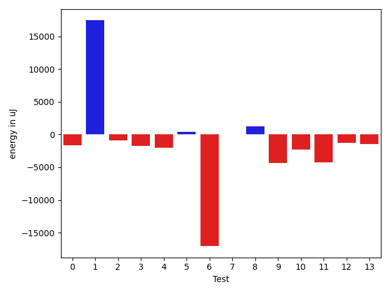

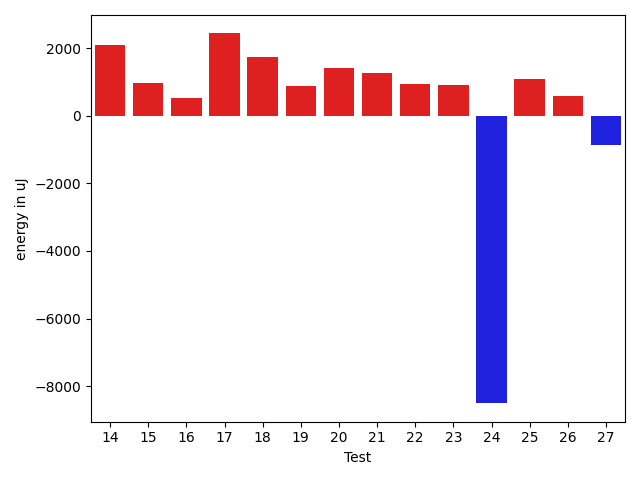

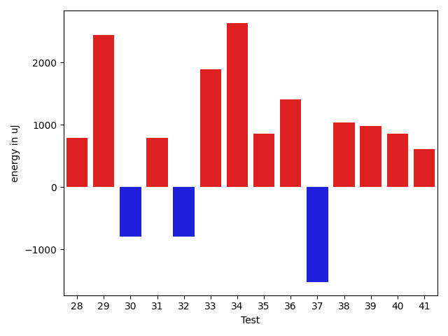

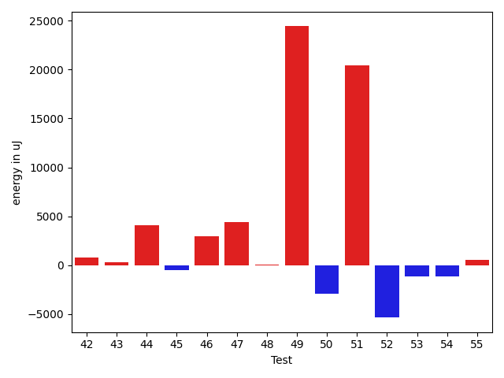

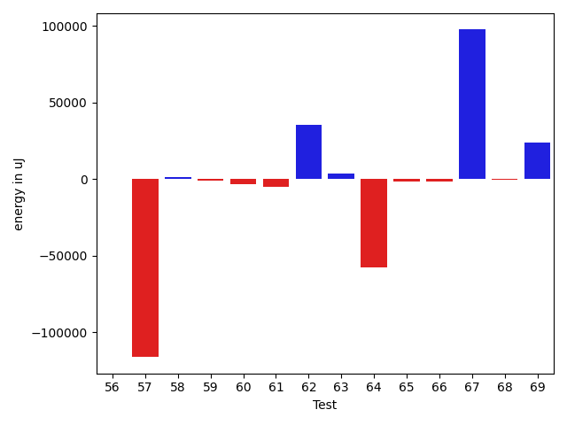

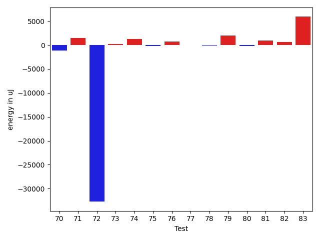

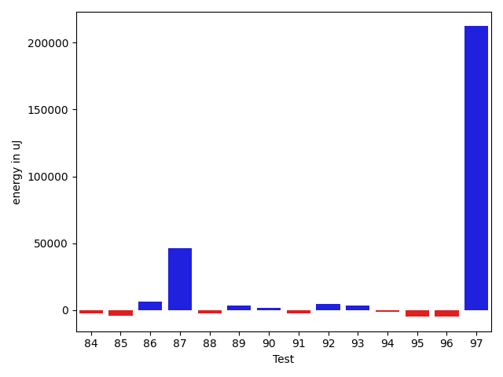

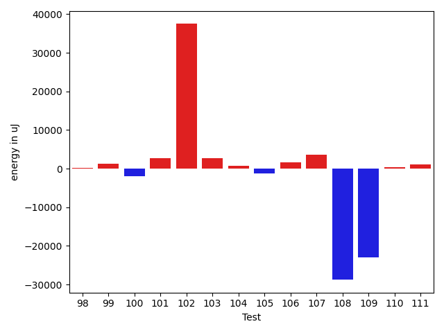

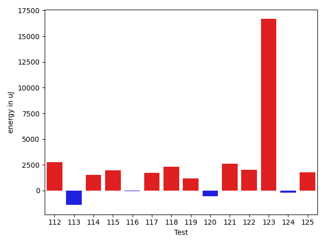

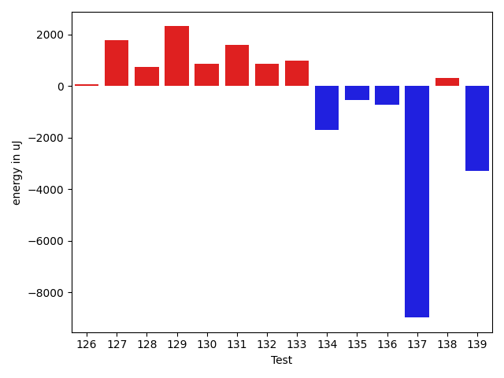

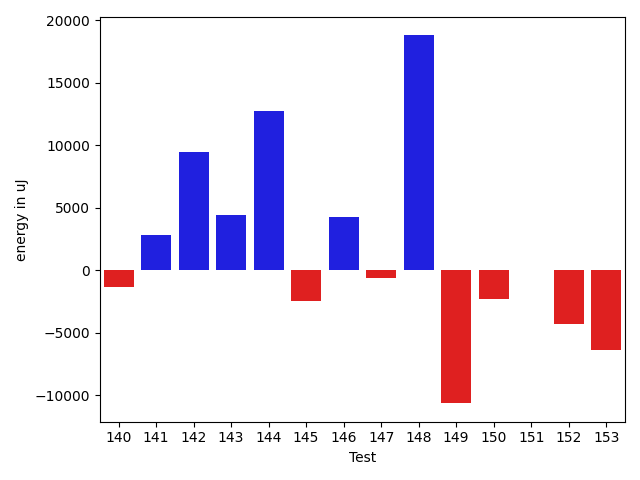

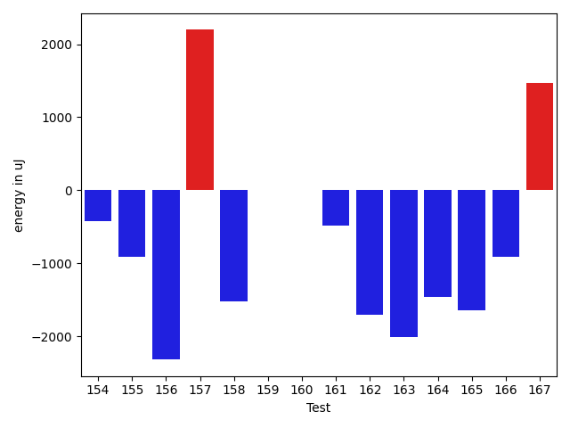

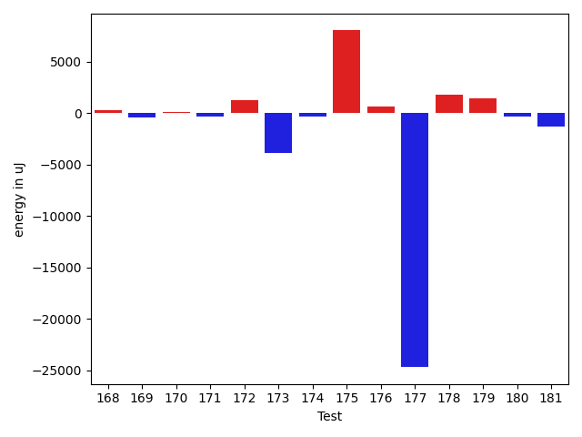

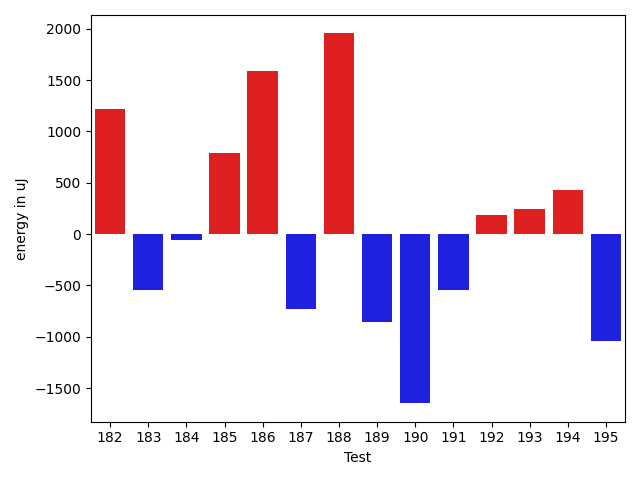

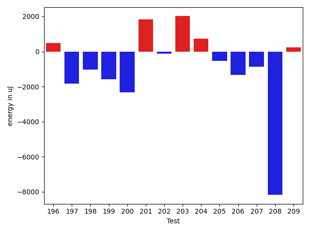

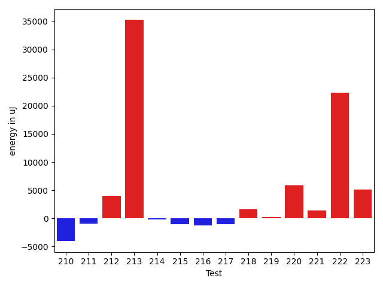

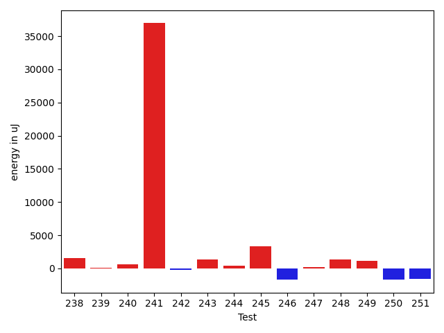

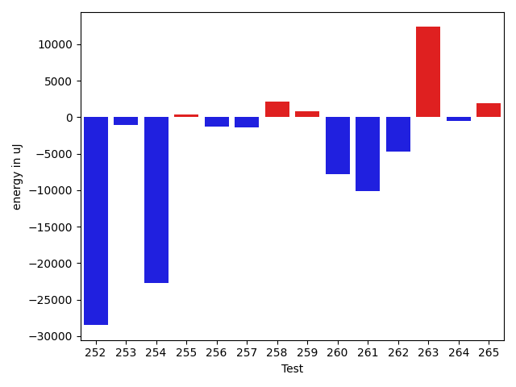

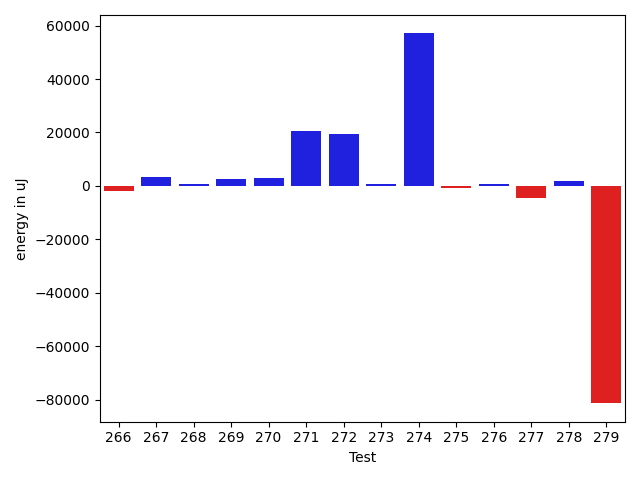

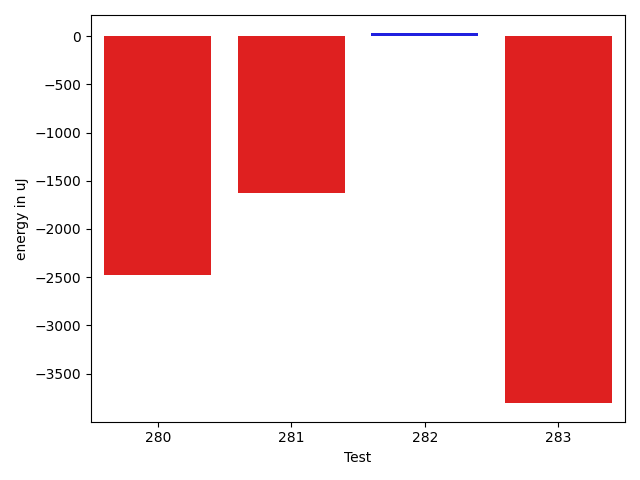

| ID | EnergyV1 | EnergyV2 | DeltaEnergy | σV1 | σV2 |
| --- | --- | --- | --- | --- | --- |
| 0 | 43470.575 | 41259.62162162162 | -2210.9533783783772 | 4942.944961697935 | 5782.801319436199 |
| 1 | 43723.9375 | 56339.55172413793 | 12615.614224137928 | 12434.14657288926 | 33375.009447588694 |
| 2 | 40150.791666666664 | 37834.529411764706 | -2316.262254901958 | 10303.836882359112 | 4221.437309142148 |
| 3 | 41671.97777777778 | 41124.47727272727 | -547.500505050506 | 11193.290957809182 | 9189.04417694502 |
| 4 | 37178.260869565216 | 38480.333333333336 | 1302.0724637681196 | 4261.9201145002535 | 4069.6167660139968 |
| 5 | 38151.97297297297 | 39286.179487179485 | 1134.2065142065112 | 4175.089922880034 | 4127.13640633579 |
| 6 | 38563.90476190476 | 38397.125 | -166.7797619047633 | 3736.373852060079 | 3418.823819586935 |
| 7 | 38334.68 | 39662.434782608696 | 1327.7547826086957 | 3659.2902341301105 | 4725.319982963996 |
| 8 | 47156.48387096774 | 39053.916666666664 | -8102.567204301078 | 29512.53496055747 | 4523.43391791261 |
| 9 | 62922.48148148148 | 61959.0 | -963.4814814814818 | 58117.338127829564 | 50194.8432919503 |
| 10 | 39040.13333333333 | 37782.42857142857 | -1257.704761904759 | 3537.4815875453287 | 3480.533861232164 |
| 11 | 39797.36170212766 | 39735.13333333333 | -62.22836879432725 | 8923.905345410854 | 5796.837542430642 |
| 12 | 39887.64 | 39555.708333333336 | -331.93166666666366 | 3469.6172339899395 | 3811.2882388938465 |
| 13 | 39251.62 | 39340.27659574468 | 88.65659574468009 | 8455.22241904966 | 5975.219742072084 |
| 14 | 36267.82142857143 | 38367.96551724138 | 2100.1440886699493 | 3386.1291011331527 | 4114.511689992727 |
| 15 | 38397.61111111111 | 39373.75 | 976.1388888888905 | 3769.314086421927 | 3956.579923052231 |
| 16 | 38515.86363636364 | 39037.933333333334 | 522.0696969696946 | 4246.542061654984 | 5061.256147988912 |
| 17 | 37333.11666666667 | 39766.59259259259 | 2433.4759259259226 | 3278.8554460953123 | 13534.452002914803 |
| 18 | 39592.023255813954 | 41330.04347826087 | 1738.0202224469176 | 8809.235163295953 | 14094.137490701774 |
| 19 | 37844.07692307692 | 38719.653846153844 | 875.576923076922 | 3748.5334868152304 | 4600.8878904161 |
| 20 | 36945.67857142857 | 38353.72222222222 | 1408.0436507936465 | 3989.942875115341 | 4940.322220772824 |
| 21 | 37808.32258064516 | 39084.73333333333 | 1276.4107526881708 | 3707.448652219603 | 4194.225243779303 |
| 22 | 38545.39705882353 | 39497.40845070423 | 952.0113918806965 | 5488.967695027013 | 4168.867791637669 |
| 23 | 38538.0 | 39443.78125 | 905.78125 | 4717.984134807608 | 4075.8150161530193 |
| 24 | 47231.09302325582 | 38727.913043478264 | -8503.179979777553 | 60949.2054193257 | 3656.9127025645134 |
| 25 | 37558.28571428572 | 38631.68571428571 | 1073.3999999999942 | 3542.8079211250497 | 8451.077901736824 |
| 26 | 37582.69696969697 | 38180.970588235294 | 598.2736185383255 | 4731.1244193964085 | 3826.096055844222 |
| 27 | 38234.88372093023 | 37367.53846153846 | -867.3452593917682 | 3538.6781082659995 | 4163.530683028613 |
| 28 | 38059.28301886792 | 38582.24528301887 | 522.9622641509486 | 3772.574204365964 | 4617.956465902241 |
| 29 | 38065.51515151515 | 38920.48387096774 | 854.9687194525904 | 5110.341915390269 | 3311.6261561545484 |
| 30 | 38925.51724137931 | 39557.0 | 631.4827586206884 | 4824.58606851006 | 4703.488003599031 |
| 31 | 40406.73170731707 | 38625.95 | -1780.7817073170736 | 16563.099751165042 | 3733.1248167587432 |
| 32 | 35300.454545454544 | 36434.85 | 1134.3954545454544 | 2726.8761302545568 | 4034.7924763858673 |
| 33 | 41417.333333333336 | 37674.68421052631 | -3742.6491228070226 | 21850.14821205772 | 4031.8912116254164 |
| 34 | 37136.58620689655 | 38903.30434782609 | 1766.7181409295372 | 4107.226016779841 | 3419.8719583809316 |
| 35 | 36865.117647058825 | 38423.21052631579 | 1558.0928792569612 | 4580.488105025142 | 4058.761278219428 |
| 36 | 36539.0 | 43032.16 | 6493.1600000000035 | 2732.5150617151226 | 25625.68311156602 |
| 37 | 39066.55172413793 | 38669.95238095238 | -396.5993431855459 | 3576.54224834842 | 4384.343719973981 |
| 38 | 41062.693333333336 | 39758.58024691358 | -1304.1130864197548 | 11425.995546966093 | 7082.113418025911 |
| 39 | 40524.54285714286 | 41220.38983050847 | 695.8469733656166 | 7766.5040741557295 | 7412.001545859849 |
| 40 | 37797.39215686275 | 38632.82692307692 | 835.4347662141736 | 4097.581180707406 | 4274.088372080305 |
| 41 | 37729.64864864865 | 38490.2 | 760.5513513513506 | 4362.561565994544 | 4357.585335940077 |
| 42 | 118207.57575757576 | 118997.30303030302 | 789.7272727272648 | 239115.4863203215 | 217309.22318693748 |
| 43 | 38620.0 | 38927.18918918919 | 307.18918918918644 | 5377.372138053225 | 3893.586096895403 |
| 44 | 41535.565217391304 | 45599.60526315789 | 4064.040045766589 | 8154.090735576074 | 15047.833426040675 |
| 45 | 39488.67741935484 | 38970.27118644068 | -518.4062329141598 | 4008.0056209082404 | 4698.77720418765 |
| 46 | 39590.85526315789 | 42546.81012658228 | 2955.954863424384 | 4509.245127933065 | 19852.35365702117 |
| 47 | 41317.756097560974 | 45738.37777777778 | 4420.6216802168055 | 17582.98830116906 | 17535.698001871482 |
| 48 | 38669.77272727273 | 38730.61538461538 | 60.842657342655 | 4549.140492562786 | 4663.53907437526 |
| 49 | 43371.57142857143 | 67778.54054054055 | 24406.96911196912 | 10020.400825418152 | 103985.55631188207 |
| 50 | 41025.05714285714 | 38140.78333333333 | -2884.273809523809 | 5521.184336937953 | 4517.094221184185 |
| 51 | 45313.65789473684 | 65752.75409836066 | 20439.09620362382 | 40007.054530733316 | 69361.78258923226 |
| 52 | 53938.27272727273 | 48592.52525252525 | -5345.747474747477 | 22154.834116363847 | 19324.15331182868 |
| 53 | 40785.482142857145 | 39633.7 | -1151.7821428571478 | 3662.0144582645034 | 4518.62865148266 |
| 54 | 39487.620689655174 | 38377.48148148148 | -1110.1392081736922 | 3524.0200537003593 | 3808.2319837753657 |
| 55 | 40285.75 | 40865.63636363636 | 579.8863636363603 | 4988.926314432128 | 4624.695759481762 |
| 56 | 41279.933333333334 | 40463.92857142857 | -816.0047619047618 | 6208.932752807755 | 8576.283223137478 |
| 57 | 38149.545454545456 | 38001.916666666664 | -147.62878787879163 | 3417.565450956316 | 4604.381237081579 |
| 58 | 40141.357142857145 | 150555.22222222222 | 110413.86507936507 | 4884.953225498287 | 394654.1183119 |
| 59 | 38818.12 | 38873.47619047619 | 55.3561904761882 | 4776.207946226797 | 3610.810285254512 |
| 60 | 37530.0 | 38298.84444444445 | 768.8444444444467 | 4929.632683203115 | 3577.745795302186 |
| 61 | 533228.303030303 | 591992.0101010101 | 58763.70707070711 | 581966.6973738892 | 566147.6959621959 |
| 62 | 35912.53571428572 | 37475.4358974359 | 1562.900183150181 | 4115.0750338771195 | 5000.106484993642 |
| 63 | 40432.40277777778 | 39105.96103896104 | -1326.4417388167421 | 11907.861728076636 | 6453.958005251272 |
| 64 | 55364.26153846154 | 60067.681818181816 | 4703.420279720274 | 26482.94062354215 | 27381.793026355197 |
| 65 | 36021.816666666666 | 39961.19607843137 | 3939.379411764705 | 4166.318400745302 | 9876.685730566543 |
| 66 | 36221.03448275862 | 37839.90909090909 | 1618.874608150465 | 3987.528319931937 | 4045.4743765261296 |
| 67 | 70569.5 | 59689.0 | -10880.5 | 57496.88451694371 | 49959.65995437476 |
| 68 | 36105.92 | 56264.63157894737 | 20158.71157894737 | 4655.9873446563415 | 76412.95017359745 |
| 69 | 109541.81818181818 | 89316.39393939394 | -20225.42424242424 | 218278.8007959464 | 67741.44842952251 |
| 70 | 54121.444444444445 | 51359.683673469386 | -2761.760770975059 | 25810.802230505495 | 19022.724156616296 |
| 71 | 45759.69565217391 | 41925.56179775281 | -3834.133854421103 | 32643.88874584109 | 9255.236148056592 |
| 72 | 81319.62068965517 | 89007.12345679013 | 7687.502767134953 | 69429.16216328122 | 109309.60384014048 |
| 73 | 39996.65277777778 | 40712.08571428571 | 715.432936507932 | 6088.683205020885 | 8155.442963782543 |
| 74 | 56959.692307692305 | 63289.705882352944 | 6330.013574660639 | 37005.3011072359 | 52057.67262832829 |
| 75 | 39885.37096774193 | 42542.5 | 2657.129032258068 | 3929.800574575168 | 10186.657026882438 |
| 76 | 41340.77631578947 | 42936.75362318841 | 1595.9773073989345 | 7551.110484032836 | 8629.272317895637 |
| 77 | 57238.94642857143 | 49124.6976744186 | -8114.248754152824 | 73663.46733829938 | 57549.43514019152 |
| 78 | 40662.50724637681 | 39835.86538461538 | -826.6418617614254 | 6419.388084574905 | 4265.689393416903 |
| 79 | 39174.242424242424 | 40095.642857142855 | 921.400432900431 | 5944.030871541344 | 6076.413900215711 |
| 80 | 39569.442307692305 | 38941.49056603773 | -627.9517416545714 | 3775.604737162907 | 4316.816780665532 |
| 81 | 41913.289855072464 | 39587.31428571429 | -2325.9755693581756 | 24883.137260903615 | 6444.670346313539 |
| 82 | 83247.49494949495 | 77687.07070707071 | -5560.42424242424 | 91111.4951190893 | 70965.32900902128 |
| 83 | 63086.757575757576 | 67575.0 | 4488.242424242424 | 27617.399022893438 | 28692.283574635057 |
| 84 | 39941.41558441558 | 41687.706666666665 | 1746.2910822510821 | 8497.400464757347 | 10594.273206184975 |
| 85 | 39852.36046511628 | 42912.01190476191 | 3059.651439645626 | 8195.69116927657 | 13416.450300083858 |
| 86 | 64565.181818181816 | 67779.71717171717 | 3214.535353535357 | 30391.47863037729 | 31074.2054619539 |
| 87 | 38387.89473684211 | 39330.23611111111 | 942.3413742690027 | 5279.689069739826 | 6889.603535386278 |
| 88 | 38544.12698412698 | 38796.9 | 252.77301587301918 | 3695.0588091291115 | 4650.506702500278 |
| 89 | 38499.65853658537 | 38613.205128205125 | 113.54659161975724 | 3819.576260559803 | 4631.748172926676 |
| 90 | 40098.40540540541 | 40515.44871794872 | 417.0433125433119 | 6265.862393824904 | 8473.732077679422 |
| 91 | 43936.708333333336 | 47957.02702702703 | 4020.318693693691 | 15790.447976226973 | 22928.519421544304 |
| 92 | 39137.27272727273 | 39133.90625 | -3.366477272727934 | 4246.789027822309 | 4676.563938669174 |
| 93 | 37856.96875 | 38012.26470588235 | 155.29595588234952 | 4568.750345310349 | 4976.7265718650115 |
| 94 | 38291.434782608696 | 39319.13636363636 | 1027.7015810276644 | 4305.646533545647 | 4698.852062863619 |
| 95 | 39010.170731707316 | 40069.454545454544 | 1059.2838137472281 | 4676.9437743479075 | 4805.298734704436 |
| 96 | 39837.393939393936 | 38281.55172413793 | -1555.8422152560088 | 4337.919120887019 | 4516.778342154084 |
| 97 | 38974.811320754714 | 39330.34782608696 | 355.5365053322457 | 4745.810482331913 | 4315.273598144514 |
| 98 | 39053.06779661017 | 39317.3064516129 | 264.2386550027295 | 5300.392722464324 | 4419.469638990449 |
| 99 | 38592.07407407407 | 39815.56603773585 | 1223.4919636617778 | 4418.614659939419 | 4704.312824557844 |
| 100 | 40455.32142857143 | 38584.25 | -1871.0714285714275 | 4207.621877137891 | 4664.1219185215705 |
| 101 | 38415.875 | 41113.57894736842 | 2697.70394736842 | 9757.70528463916 | 7079.309097390712 |
| 102 | 78440.36842105263 | 115926.34246575342 | 37485.97404470079 | 164269.44677546367 | 293691.1018811142 |
| 103 | 63879.333333333336 | 66658.23333333334 | 2778.9000000000015 | 47214.62534380163 | 54905.91620380166 |
| 104 | 39401.15 | 40105.34782608696 | 704.1978260869582 | 3991.086722623301 | 3908.129337994749 |
| 105 | 40282.96 | 38994.96551724138 | -1287.9944827586223 | 3746.9498900305566 | 4844.645544009056 |
| 106 | 38215.242424242424 | 39866.954545454544 | 1651.71212121212 | 3720.132858741074 | 4576.585055547549 |
| 107 | 37704.96 | 41307.57142857143 | 3602.6114285714284 | 3811.146824566065 | 8283.918958821756 |
| 108 | 264303.1313131313 | 235533.38383838383 | -28769.747474747477 | 264097.9482580164 | 68728.09692184947 |
| 109 | 195536.49494949495 | 172615.0 | -22921.494949494954 | 243192.19582114593 | 52047.065149213406 |
| 110 | 40013.91176470588 | 40411.75 | 397.83823529411893 | 4345.417379043915 | 4957.408803462033 |
| 111 | 41007.48387096774 | 42111.22727272727 | 1103.7434017595297 | 8986.457832693153 | 7276.628833163048 |
| 112 | 37480.24 | 39763.148148148146 | 2282.908148148148 | 3493.0790690163317 | 3291.267871242684 |
| 113 | 42195.07692307692 | 41879.666666666664 | -315.4102564102577 | 8163.762836335277 | 8002.334447408902 |
| 114 | 62075.77631578947 | 90514.90123456791 | 28439.124918778434 | 73688.05587756916 | 124284.66176450002 |
| 115 | 41881.375 | 42401.822222222225 | 520.4472222222248 | 10288.896635906836 | 8962.307729321825 |
| 116 | 45141.94117647059 | 39672.895833333336 | -5469.045343137252 | 26821.191803886217 | 6015.264992221814 |
| 117 | 38007.392857142855 | 39090.78571428572 | 1083.3928571428623 | 4908.661647240705 | 5292.313195010442 |
| 118 | 69713.27906976744 | 66510.24705882353 | -3203.0320109439053 | 45798.824628883616 | 45110.1702796233 |
| 119 | 61680.649122807015 | 56316.262295081964 | -5364.386827725051 | 58572.5380015845 | 53074.587162059055 |
| 120 | 50095.692307692305 | 44864.74725274725 | -5230.945054945056 | 18412.912442918972 | 13837.892886184856 |
| 121 | 43867.80281690141 | 44077.59322033898 | 209.79040343757515 | 20477.405412795637 | 16744.35584047641 |
| 122 | 38668.28813559322 | 39967.52830188679 | 1299.2401662935736 | 5330.840093589242 | 4541.999857114617 |
| 123 | 110666.36363636363 | 119140.33333333333 | 8473.969696969696 | 62955.25479956275 | 68874.19963024666 |
| 124 | 40577.710144927536 | 43376.643835616436 | 2798.9336906889002 | 9790.165367141866 | 18142.51631847957 |
| 125 | 37444.88888888889 | 38693.3 | 1248.4111111111124 | 5188.110209238994 | 3535.31966164306 |
| 126 | 39032.377358490565 | 39464.22641509434 | 431.8490566037726 | 5068.889485115804 | 4102.538650969478 |
| 127 | 38696.12 | 40330.22727272727 | 1634.1072727272694 | 4784.064835012167 | 3786.3400285742264 |
| 128 | 55963.76470588235 | 52955.137931034486 | -3008.626774847864 | 47418.984253057286 | 38845.64453349119 |
| 129 | 36699.833333333336 | 43953.59090909091 | 7253.757575757576 | 5079.711143909224 | 23362.573577215902 |
| 130 | 39671.02631578947 | 39837.22222222222 | 166.1959064327457 | 4592.359223334951 | 3780.438254364397 |
| 131 | 38902.48275862069 | 39893.55882352941 | 991.0760649087242 | 4872.6114404601085 | 4145.840248271375 |
| 132 | 40571.71186440678 | 40985.078125 | 413.3662605932186 | 8104.567103425515 | 7030.364729391462 |
| 133 | 48770.77215189873 | 45473.29268292683 | -3297.4794689718983 | 31986.516033292603 | 25294.75917785256 |
| 134 | 43077.65573770492 | 49445.912280701756 | 6368.256542996838 | 10330.63918623807 | 57110.086512660215 |
| 135 | 39381.22448979592 | 39113.51162790698 | -267.7128618889401 | 4303.18441302037 | 3545.79544899926 |
| 136 | 40735.21875 | 39776.882352941175 | -958.3363970588252 | 7179.235699808054 | 6705.928056861796 |
| 137 | 89622.17171717172 | 82050.70707070707 | -7571.46464646465 | 44624.53754122829 | 46850.03011593149 |
| 138 | 42867.38636363636 | 38056.0 | -4811.38636363636 | 27603.02890347684 | 4061.4095674308205 |
| 139 | 40600.0 | 38162.041666666664 | -2437.9583333333358 | 4420.958988834027 | 3911.1117396375357 |
| 140 | 39750.17307692308 | 41965.6 | 2215.4269230769205 | 6784.361870454372 | 26657.363814526 |
| 141 | 39495.52380952381 | 40079.77777777778 | 584.2539682539718 | 3963.7494108848823 | 4483.115540627666 |
| 142 | 37158.53846153846 | 37463.066666666666 | 304.5282051282047 | 3319.892772026151 | 3847.8171208563895 |
| 143 | 42030.08536585366 | 41172.71212121212 | -857.3732446415379 | 25537.523717358814 | 18363.566260698528 |
| 144 | 46469.666666666664 | 47289.60294117647 | 819.9362745098042 | 19422.373180032464 | 23243.490460101184 |
| 145 | 83038.1052631579 | 78587.26666666666 | -4450.83859649123 | 43751.7166086023 | 65356.0241138744 |
| 146 | 45255.05128205128 | 41291.05128205128 | -3964.0 | 25405.999399444016 | 8993.224825756384 |
| 147 | 37839.125 | 38972.933333333334 | 1133.8083333333343 | 3921.061615520513 | 4238.934905007258 |
| 148 | 40191.63636363636 | 40015.61538461538 | -176.0209790209774 | 8824.417779122647 | 3055.477465860074 |
| 149 | 61718.65 | 71226.2 | 9507.549999999996 | 61661.05480509962 | 70467.83236537281 |
| 150 | 61443.88888888889 | 58584.140845070426 | -2859.748043818465 | 90154.4124988866 | 69913.56730454948 |
| 151 | 39338.60526315789 | 40387.29268292683 | 1048.6874197689394 | 4573.2749439109675 | 5501.677308514161 |
| 152 | 44766.0 | 42810.015384615384 | -1955.9846153846156 | 17203.973229911815 | 13801.493144965605 |
| 153 | 39338.936170212764 | 38852.88333333333 | -486.052836879433 | 5203.93200932025 | 4544.444828915361 |
| 154 | 39361.73809523809 | 39301.92452830189 | -59.81356693620182 | 4586.967200457462 | 3372.8472538906367 |
| 155 | 46205.88157894737 | 50098.54929577465 | 3892.66771682728 | 20336.09836238007 | 21320.253051763528 |
| 156 | 38677.732142857145 | 38199.142857142855 | -478.5892857142899 | 3969.7621757258935 | 4345.650729787902 |
| 157 | 48384.5 | 53456.057971014496 | 5071.557971014496 | 29574.853311660736 | 29901.420380631556 |
| 158 | 75571.27551020408 | 76458.86315789474 | 887.587647690656 | 27026.422309145124 | 24528.701299159307 |
| 159 | 40121.35 | 39254.354166666664 | -866.9958333333343 | 4752.5305919583525 | 3841.059095969839 |
| 160 | 57314.767441860466 | 46247.90909090909 | -11066.858350951377 | 74241.67348374393 | 46489.93970440281 |
| 161 | 40107.34482758621 | 44500.106060606064 | 4392.7612330198535 | 9519.774786440183 | 16743.64930184864 |
| 162 | 39861.882352941175 | 39304.098039215685 | -557.7843137254895 | 3668.1516884786233 | 6589.924716922193 |
| 163 | 39325.77272727273 | 38385.782608695656 | -939.9901185770723 | 3971.760634687871 | 3944.317519149727 |
| 164 | 44164.98 | 41775.82456140351 | -2389.155438596492 | 11057.02677665203 | 8866.284114797418 |
| 165 | 42581.77777777778 | 40395.52631578947 | -2186.2514619883077 | 12913.538346142159 | 7995.079120561867 |
| 166 | 70797.0579710145 | 48202.34375 | -22594.714221014496 | 200418.48742575033 | 25775.09762967613 |
| 167 | 38490.555555555555 | 39477.92307692308 | 987.3675213675233 | 4625.270733484116 | 4253.675803377203 |
| 168 | 37976.63636363636 | 38243.07692307692 | 266.44055944056163 | 4077.728168880773 | 3533.159295795684 |
| 169 | 43268.7108433735 | 42821.92682926829 | -446.78401410520746 | 13224.728691985685 | 11884.30552449423 |
| 170 | 38686.083333333336 | 38775.45 | 89.36666666666133 | 3487.1251759946263 | 5004.521640226966 |
| 171 | 43050.1 | 42687.032258064515 | -363.06774193548335 | 13085.244797990343 | 7399.439026182 |
| 172 | 39474.54098360656 | 40746.311475409835 | 1271.770491803276 | 3397.377255403565 | 3756.979692675992 |
| 173 | 42103.765957446805 | 38203.77272727273 | -3899.9932301740773 | 28660.486902675188 | 4034.5704280946934 |
| 174 | 39311.72340425532 | 39006.63829787234 | -305.08510638297594 | 7011.396193560113 | 4120.919379064099 |
| 175 | 37893.346153846156 | 45921.291666666664 | 8027.945512820508 | 4287.378658900202 | 29539.709791058045 |
| 176 | 38865.029411764706 | 39488.36956521739 | 623.3401534526856 | 3817.284216986285 | 4119.003353275051 |
| 177 | 120490.51515151515 | 95792.16417910448 | -24698.35097241067 | 319077.1889497398 | 299420.03706088255 |
| 178 | 39031.170731707316 | 40780.51063829787 | 1749.3399065905542 | 3953.5735419160337 | 4056.2095862188426 |
| 179 | 41815.13483146067 | 43286.913978494624 | 1471.7791470339507 | 9488.561008092449 | 12038.224766114063 |
| 180 | 51997.42105263158 | 51645.231578947365 | -352.18947368421505 | 34150.9857108505 | 39975.777073110185 |
| 181 | 40222.04838709677 | 38949.360655737706 | -1272.6877313590667 | 7951.9345129131125 | 4460.921697868906 |
| 182 | 103675.88421052632 | 127176.14432989691 | 23500.260119370592 | 277237.12105685245 | 350119.2559624076 |
| 183 | 43273.82608695652 | 43267.17391304348 | -6.652173913040315 | 13980.685077299462 | 13105.295986910667 |
| 184 | 39813.775862068964 | 39755.206349206346 | -58.56951286261756 | 5299.286074372477 | 4298.652162915427 |
| 185 | 40161.90540540541 | 40268.08641975309 | 106.18101434768323 | 8891.563496369508 | 5183.873760555047 |
| 186 | 42175.22388059701 | 40643.53125 | -1531.6926305970119 | 25172.112526946963 | 7861.908403754361 |
| 187 | 41192.47191011236 | 41933.15909090909 | 740.6871807967254 | 10558.85305961799 | 12221.884049715498 |
| 188 | 38763.06451612903 | 40165.13333333333 | 1402.068817204301 | 4132.9430889479745 | 3343.89661655713 |
| 189 | 42021.3 | 41919.58490566038 | -101.71509433962638 | 7794.9189533952185 | 7944.0206858923375 |
| 190 | 43016.90697674418 | 38827.31914893617 | -4189.587827808013 | 18423.396285403545 | 4096.459276042129 |
| 191 | 40584.4358974359 | 41222.46753246753 | 638.0316350316352 | 6714.156841483874 | 8766.40541711696 |
| 192 | 44723.62337662338 | 47159.75 | 2436.126623376622 | 15311.757556908076 | 21893.16006373655 |
| 193 | 59295.434782608696 | 65517.892857142855 | 6222.458074534159 | 52125.24882044759 | 61649.03491733282 |
| 194 | 40085.170731707316 | 41870.03703703704 | 1784.8663053297205 | 4822.672399034757 | 8573.5984276515 |
| 195 | 91650.0 | 74452.52083333333 | -17197.47916666667 | 223979.5015700017 | 188992.4181410229 |
| 196 | 45051.71428571428 | 45700.10588235294 | 648.3915966386558 | 12326.070949869812 | 15572.654035783387 |
| 197 | 42740.47826086957 | 42615.26315789474 | -125.21510297482746 | 7887.058909982061 | 7857.386453402705 |
| 198 | 41850.3023255814 | 40810.94594594595 | -1039.3563796354501 | 11163.038143042324 | 7909.111878067023 |
| 199 | 46981.625 | 41886.086956521736 | -5095.538043478264 | 25461.478599727372 | 3884.25997554952 |
| 200 | 154401.32323232322 | 137456.41414141413 | -16944.90909090909 | 141396.3004569986 | 35004.31490083718 |
| 201 | 39059.532258064515 | 40451.532258064515 | 1392.0 | 4620.678468258091 | 3933.829065926373 |
| 202 | 39145.25 | 39625.45161290323 | 480.2016129032272 | 4870.465874057341 | 3896.204413054306 |
| 203 | 41198.57894736842 | 41435.0 | 236.4210526315801 | 7820.392831133293 | 3794.43916584959 |
| 204 | 38282.77142857143 | 39454.0 | 1171.228571428568 | 3468.545270082581 | 3872.006266562838 |
| 205 | 39372.13432835821 | 39405.333333333336 | 33.19900497512572 | 4094.188312373989 | 5938.501084937386 |
| 206 | 39816.642857142855 | 39031.0 | -785.6428571428551 | 3974.6556743436067 | 3578.257460991713 |
| 207 | 39112.148148148146 | 40306.16216216216 | 1194.0140140140138 | 4330.556851574494 | 6752.676620516563 |
| 208 | 155271.81818181818 | 185834.202020202 | 30562.38383838383 | 145260.0669718069 | 213910.31425998991 |
| 209 | 41472.09259259259 | 40634.21052631579 | -837.8820662768048 | 10034.41108325361 | 3950.888488734593 |
| 210 | 43332.89655172414 | 39287.46875 | -4045.4278017241377 | 16648.078123200736 | 4085.194747380281 |
| 211 | 41454.92 | 40566.28 | -888.6399999999994 | 5820.189113216168 | 5987.8923538754425 |
| 212 | 40157.583333333336 | 44099.34210526316 | 3941.7587719298244 | 4967.651716494312 | 13876.384331655205 |
| 213 | 76368.06896551725 | 111609.17073170732 | 35241.10176619007 | 192441.19806503985 | 303415.2039043 |
| 214 | 40389.354838709674 | 40229.26470588235 | -160.09013282732485 | 4545.210577813765 | 4000.7302370855737 |
| 215 | 40199.42857142857 | 39199.625 | -999.8035714285725 | 4050.7545631168823 | 4657.596213109827 |
| 216 | 41031.73529411765 | 39723.61111111111 | -1308.124183006541 | 4690.569226141419 | 4218.466409581263 |
| 217 | 40214.666666666664 | 39137.74418604651 | -1076.9224806201528 | 3338.5259191941755 | 3872.359962444771 |
| 218 | 39528.02564102564 | 41171.87804878049 | 1643.85240775485 | 4627.092773848831 | 9529.99774190622 |
| 219 | 43028.96511627907 | 43237.61842105263 | 208.65330477356474 | 10049.601998884953 | 18542.88810679824 |
| 220 | 54593.625 | 60459.65079365079 | 5866.0257936507915 | 63593.82161156024 | 81540.9868093728 |
| 221 | 39826.33870967742 | 41222.565217391304 | 1396.2265077138873 | 6086.993094596285 | 11297.885508819088 |
| 222 | 92834.23076923077 | 115161.32352941176 | 22327.092760180996 | 178947.4176682825 | 245511.44124474484 |
| 223 | 59110.64150943396 | 64250.48333333333 | 5139.841823899369 | 61707.277514325455 | 74902.07338240414 |
| 224 | 39632.903846153844 | 39928.20930232558 | 295.3054561717363 | 3658.741730219113 | 4007.66250701653 |
| 225 | 39115.26666666667 | 38651.294117647056 | -463.97254901961423 | 5617.592473253605 | 4278.293272469702 |
| 226 | 39240.88461538462 | 39815.066666666666 | 574.1820512820486 | 5266.471043869619 | 4189.462606216804 |
| 227 | 46130.48780487805 | 41359.59090909091 | -4770.89689578714 | 21123.278540478317 | 14274.247425343214 |
| 228 | 40891.192307692305 | 38864.6 | -2026.5923076923063 | 6148.921700461176 | 4519.76164858281 |
| 229 | 110453.0505050505 | 111626.88888888889 | 1173.8383838383888 | 229450.75712470087 | 234608.80591802293 |
| 230 | 44853.55294117647 | 41138.369047619046 | -3715.183893557427 | 30084.76830068699 | 8016.3530759076075 |
| 231 | 39589.47619047619 | 38913.52631578947 | -675.9498746867175 | 7765.047576704259 | 4386.150384639803 |
| 232 | 39719.7868852459 | 41678.8870967742 | 1959.1002115282972 | 5435.342657739354 | 10039.64348278595 |
| 233 | 312925.2525252525 | 299734.2525252525 | -13191.0 | 121980.51202270003 | 112597.39182290179 |
| 234 | 392828.0303030303 | 394445.7474747475 | 1617.7171717172023 | 127073.38332270803 | 120736.51064627156 |
| 235 | 46699.0 | 60349.294117647056 | 13650.294117647056 | 43275.55131746456 | 77702.73928027632 |
| 236 | 42163.36111111111 | 44157.31578947369 | 1993.9546783625774 | 7878.0903007178995 | 9606.728015481385 |
| 237 | 132546.87272727274 | 114773.47727272728 | -17773.39545454546 | 317814.52112588356 | 245546.73079481674 |
| 238 | 38657.12 | 40243.45 | 1586.3299999999945 | 5588.876998610723 | 4743.145564654325 |
| 239 | 39210.6 | 39270.67647058824 | 60.07647058823932 | 3990.319881198212 | 4264.0265058261 |
| 240 | 38924.03333333333 | 39542.83870967742 | 618.8053763440839 | 3377.9031709364053 | 3858.3496647239945 |
| 241 | 110247.06060606061 | 147194.202020202 | 36947.1414141414 | 46196.81453748159 | 265574.4200806457 |
| 242 | 43366.44827586207 | 43141.94117647059 | -224.5070993914851 | 13205.81054083497 | 12922.68021380644 |
| 243 | 46991.89411764706 | 48328.25 | 1336.3558823529384 | 15727.387539705476 | 17981.304036067573 |
| 244 | 54913.86170212766 | 55355.51063829787 | 441.6489361702115 | 23396.423808652155 | 21516.387546667713 |
| 245 | 62399.8023255814 | 65712.0 | 3312.197674418603 | 166644.7554823231 | 178264.50959962522 |
| 246 | 41066.444444444445 | 39416.95238095238 | -1649.4920634920636 | 3317.7820774698644 | 5098.895216250659 |
| 247 | 40268.82352941176 | 40451.68 | 182.85647058823815 | 3705.6986518428475 | 9621.60313760654 |
| 248 | 40527.3 | 41875.30434782609 | 1348.004347826085 | 3504.168947125695 | 7699.373974747855 |
| 249 | 39878.12727272727 | 41017.732142857145 | 1139.6048701298714 | 4399.726590904341 | 4490.751402649161 |
| 250 | 63713.26 | 62009.04081632653 | -1704.219183673471 | 80772.6852652083 | 88887.26624809406 |
| 251 | 56204.71875 | 54603.66129032258 | -1601.0574596774168 | 34594.26872306161 | 32812.063973357835 |
| 252 | 66990.38095238095 | 38498.0 | -28492.380952380947 | 119132.7013977735 | 4773.464316755006 |
| 253 | 61502.25 | 60425.569444444445 | -1076.6805555555547 | 78502.34981455174 | 79736.10820819902 |
| 254 | 155975.22222222222 | 133207.9595959596 | -22767.262626262615 | 311417.0229538934 | 279343.5469856854 |
| 255 | 43569.08108108108 | 43965.97142857143 | 396.8903474903491 | 12417.196448557721 | 16326.446255754518 |
| 256 | 39861.454545454544 | 38553.81481481482 | -1307.6397306397266 | 4218.331970289944 | 4805.046583479722 |
| 257 | 39142.70731707317 | 37760.307692307695 | -1382.3996247654723 | 3792.8485417530405 | 4288.661318561474 |
| 258 | 38737.64 | 40860.375 | 2122.7350000000006 | 4093.0343158102155 | 11470.128743873875 |
| 259 | 37607.708333333336 | 38401.2 | 793.4916666666613 | 3475.6470438270753 | 4434.6194304960745 |
| 260 | 58556.67857142857 | 50708.72093023256 | -7847.957641196015 | 31584.587860055115 | 30211.019352120726 |
| 261 | 78883.8 | 68741.56626506025 | -10142.233734939757 | 101432.79803354011 | 85771.60179770694 |
| 262 | 77716.65625 | 73030.46428571429 | -4686.19196428571 | 58592.11106593691 | 59683.96315683022 |
| 263 | 98598.07070707071 | 110972.15151515152 | 12374.080808080806 | 26811.027989308528 | 68712.44432825033 |
| 264 | 53037.71428571428 | 52579.4358974359 | -458.2783882783842 | 30378.013486798005 | 34180.81314151438 |
| 265 | 39792.217391304344 | 41722.395348837206 | 1930.177957532862 | 11532.228773072453 | 12528.82035899172 |
| 266 | 39488.142857142855 | 38456.439024390245 | -1031.7038327526097 | 7334.254870360135 | 4499.753792987066 |
| 267 | 38834.382352941175 | 43334.78571428572 | 4500.403361344543 | 4731.754854265492 | 13695.452194477719 |
| 268 | 38385.608695652176 | 41003.37142857143 | 2617.7627329192546 | 4403.801586368112 | 4117.463852461432 |
| 269 | 86064.42708333333 | 57192.38043478261 | -28872.04664855072 | 118092.84381973438 | 29124.027075685626 |
| 270 | 40122.59259259259 | 40094.0 | -28.592592592591245 | 7425.163428849921 | 3988.5164803828648 |
| 271 | 55762.18292682927 | 55449.46052631579 | -312.7224005134849 | 62013.802145684465 | 74494.86332264103 |
| 272 | 72115.20512820513 | 74281.35714285714 | 2166.1520146520197 | 85232.17851203054 | 78800.47709990374 |
| 273 | 39719.0 | 40971.48 | 1252.4800000000032 | 6564.74176832939 | 4000.176587302116 |
| 274 | 69160.0243902439 | 65265.80487804878 | -3894.2195121951154 | 58032.836197671284 | 48358.26611672079 |
| 275 | 44592.694444444445 | 42686.82352941176 | -1905.8709150326831 | 17910.867907842752 | 7149.694129494542 |
| 276 | 103307.0 | 50483.30303030303 | -52823.69696969697 | 136492.34928540236 | 56356.46796602092 |
| 277 | 46483.851851851854 | 44902.98387096774 | -1580.8679808841116 | 22080.84977095949 | 15685.30102901145 |
| 278 | 39683.22857142857 | 40216.41860465116 | 533.1900332225923 | 4145.795447270915 | 5171.6192337786 |
| 279 | 48975.73684210526 | 52532.25 | 3556.5131578947403 | 48017.87989559295 | 60470.64101467721 |
| 280 | 142793.6923076923 | 83041.96875 | -59751.72355769231 | 358786.7956166008 | 232118.389578934 |
| 281 | 41738.31578947369 | 40289.57894736842 | -1448.736842105267 | 7336.075632771972 | 5917.370284668063 |
| 282 | 42414.96428571428 | 39148.64705882353 | -3266.317226890751 | 11960.189494682954 | 4452.532457736522 |
| 283 | 40137.793103448275 | 39479.541666666664 | -658.2514367816111 | 4267.547041368995 | 5506.408993006594 |

## Delta Duration per test method

| ID | DurationV1 | DurationsV2 | DeltaDuration |
| --- | --- | --- | --- |
| 0 | 753722.725 | 817670.4324324324 | 63947.70743243245 |
| 1 | 725729.875 | 1318046.9310344828 | 592317.0560344828 |
| 2 | 724154.7083333334 | 674334.9411764706 | -49819.76715686277 |
| 3 | 1180344.6666666667 | 1206015.1477272727 | 25670.481060605962 |
| 4 | 412384.347826087 | 393905.3333333333 | -18479.01449275366 |
| 5 | 610610.0540540541 | 630676.5897435897 | 20066.535689535667 |
| 6 | 621963.6428571428 | 632236.85 | 10273.207142857136 |
| 7 | 428776.96 | 457299.82608695654 | 28522.86608695652 |
| 8 | 927727.8387096775 | 662219.5833333334 | -265508.2553763441 |
| 9 | 1562345.1851851852 | 1336891.1724137932 | -225454.012771392 |
| 10 | 526402.8 | 513737.3714285714 | -12665.428571428638 |
| 11 | 816623.9574468085 | 775920.4222222222 | -40703.53522458626 |
| 12 | 517782.88 | 542868.5 | 25085.619999999995 |
| 13 | 815238.44 | 825438.1914893617 | 10199.751489361748 |
| 14 | 432933.78571428574 | 463530.5862068966 | 30596.80049261084 |
| 15 | 488531.5 | 431734.95 | -56796.54999999999 |
| 16 | 400538.3181818182 | 436781.93333333335 | 36243.61515151517 |
| 17 | 770778.3 | 825597.7222222222 | 54819.4222222222 |
| 18 | 780645.8604651163 | 809255.1086956522 | 28609.248230535886 |
| 19 | 477821.76923076925 | 523301.03846153844 | 45479.26923076919 |
| 20 | 486504.6785714286 | 458253.94444444444 | -28250.73412698414 |
| 21 | 569481.1290322581 | 557214.6 | -12266.529032258084 |
| 22 | 945285.2941176471 | 929690.3802816902 | -15594.913835956948 |
| 23 | 570169.6666666666 | 502541.78125 | -67627.88541666663 |
| 24 | 1016999.8837209302 | 707414.7608695652 | -309585.122851365 |
| 25 | 567956.2380952381 | 818731.2 | 250774.96190476185 |
| 26 | 618308.0606060605 | 644003.0294117647 | 25694.96880570415 |
| 27 | 700208.1860465116 | 705188.1346153846 | 4979.948568872991 |
| 28 | 737190.2264150943 | 765119.0 | 27928.773584905663 |
| 29 | 590293.5151515151 | 567270.3870967742 | -23023.128054740955 |
| 30 | 492345.8620689655 | 495035.95 | 2690.0879310345044 |
| 31 | 747121.7073170731 | 649597.2 | -97524.50731707318 |
| 32 | 463700.36363636365 | 467102.35 | 3401.9863636363298 |
| 33 | 614108.7083333334 | 453695.0 | -160413.70833333337 |
| 34 | 453694.8620689655 | 396212.6956521739 | -57482.16641679162 |
| 35 | 652492.6176470588 | 707961.3157894737 | 55468.69814241491 |
| 36 | 466052.84375 | 691820.44 | 225767.59624999994 |
| 37 | 476720.2413793103 | 588019.7142857143 | 111299.472906404 |
| 38 | 1163993.1733333333 | 1064907.012345679 | -99086.16098765424 |
| 39 | 1030457.7857142857 | 1026843.8813559322 | -3613.904358353466 |
| 40 | 801508.2156862745 | 739774.2692307692 | -61733.94645550521 |
| 41 | 597060.027027027 | 616642.525 | 19582.49797297304 |
| 42 | 3322667.707070707 | 3345461.4343434344 | 22793.727272727527 |
| 43 | 678979.3888888889 | 1036399.2162162162 | 357419.82732732734 |
| 44 | 753417.8913043478 | 1082661.8684210526 | 329243.9771167048 |
| 45 | 821688.8709677419 | 912848.6610169491 | 91159.79004920716 |
| 46 | 1040629.4078947369 | 1120007.405063291 | 79377.99716855423 |
| 47 | 872881.0487804879 | 1029019.2888888889 | 156138.24010840105 |
| 48 | 687829.4090909091 | 728583.0256410256 | 40753.61655011657 |
| 49 | 752738.4857142858 | 1641814.5675675676 | 889076.0818532818 |
| 50 | 843830.7571428572 | 848471.45 | 4640.692857142771 |
| 51 | 1034675.3421052631 | 1635848.9836065574 | 601173.6415012942 |
| 52 | 1518522.686868687 | 1514708.4646464647 | -3814.222222222248 |
| 53 | 755232.25 | 781444.02 | 26211.77000000002 |
| 54 | 502860.2068965517 | 535323.7777777778 | 32463.570881226042 |
| 55 | 467116.9166666667 | 472557.0909090909 | 5440.174242424197 |
| 56 | 568456.4333333333 | 766229.7857142857 | 197773.35238095233 |
| 57 | 473758.95454545453 | 492912.4583333333 | 19153.503787878784 |
| 58 | 653918.9285714285 | 4078573.407407407 | 3424654.4788359785 |
| 59 | 494629.04 | 517988.8095238095 | 23359.769523809548 |
| 60 | 784230.9130434783 | 714801.0222222222 | -69429.8908212561 |
| 61 | 14697622.252525253 | 16127022.333333334 | 1429400.0808080807 |
| 62 | 589961.8214285715 | 603344.8717948718 | 13383.050366300275 |
| 63 | 1131250.111111111 | 1104964.6883116884 | -26285.42279942264 |
| 64 | 1534321.3384615385 | 1550868.1666666667 | 16546.8282051282 |
| 65 | 846021.0 | 932259.6274509804 | 86238.62745098036 |
| 66 | 805670.275862069 | 527874.4242424242 | -277795.8516196448 |
| 67 | 1770599.0238095238 | 1504702.2432432433 | -265896.7805662805 |
| 68 | 453594.32 | 968036.3157894737 | 514441.9957894737 |
| 69 | 3261776.5656565656 | 2398704.212121212 | -863072.3535353537 |
| 70 | 1564648.3333333333 | 1510665.887755102 | -53982.44557823124 |
| 71 | 1323819.4456521738 | 1224685.4606741574 | -99133.98497801647 |
| 72 | 2263883.425287356 | 2495152.5185185187 | 231269.09323116252 |
| 73 | 978582.0833333334 | 987265.2285714286 | 8683.145238095196 |
| 74 | 1595834.1538461538 | 1744613.5882352942 | 148779.43438914046 |
| 75 | 898273.6935483871 | 921685.8666666667 | 23412.17311827955 |
| 76 | 1100831.0 | 1104222.2463768115 | 3391.2463768115267 |
| 77 | 1270691.732142857 | 963049.3255813953 | -307642.40656146174 |
| 78 | 783401.4202898551 | 802134.9423076923 | 18733.522017837153 |
| 79 | 1079676.303030303 | 1008738.5714285715 | -70937.7316017315 |
| 80 | 772308.1730769231 | 784113.0566037736 | 11804.883526850492 |
| 81 | 1154447.2318840579 | 1020062.1571428571 | -134385.07474120078 |
| 82 | 2426166.525252525 | 2233277.4444444445 | -192889.08080808073 |
| 83 | 1950888.3535353534 | 1927978.2828282828 | -22910.07070707064 |
| 84 | 1093362.6753246754 | 1062752.48 | -30610.195324675413 |
| 85 | 1167604.0 | 1397773.2976190476 | 230169.29761904757 |
| 86 | 1937455.303030303 | 1971256.4343434344 | 33801.131313131424 |
| 87 | 997733.1315789474 | 998107.4722222222 | 374.34064327483065 |
| 88 | 858887.619047619 | 850241.0833333334 | -8646.535714285681 |
| 89 | 638503.2195121951 | 661674.6923076923 | 23171.47279549716 |
| 90 | 1006573.0810810811 | 980012.5384615385 | -26560.542619542568 |
| 91 | 1179433.736111111 | 1313251.0675675676 | 133817.33145645657 |
| 92 | 963475.5151515151 | 969850.109375 | 6374.594223484863 |
| 93 | 550902.46875 | 528141.1470588235 | -22761.321691176505 |
| 94 | 658270.6521739131 | 653210.1590909091 | -5060.493083004025 |
| 95 | 675054.4634146341 | 636691.3863636364 | -38363.07705099776 |
| 96 | 528562.8181818182 | 510919.2413793103 | -17643.576802507916 |
| 97 | 787387.716981132 | 745185.0869565217 | -42202.63002461032 |
| 98 | 893445.3220338983 | 828208.0161290322 | -65237.30590486608 |
| 99 | 759275.4814814815 | 720364.320754717 | -38911.16072676447 |
| 100 | 501869.1785714286 | 469039.1666666667 | -32830.011904761894 |
| 101 | 598574.75 | 631002.6315789474 | 32427.881578947417 |
| 102 | 2196410.5 | 3237811.3698630137 | 1041400.8698630137 |
| 103 | 1480334.4 | 1404769.7333333334 | -75564.66666666651 |
| 104 | 481587.45 | 500026.60869565216 | 18439.15869565215 |
| 105 | 451994.6 | 471589.8620689655 | 19595.26206896553 |
| 106 | 550288.0909090909 | 520944.45454545453 | -29343.63636363641 |
| 107 | 544261.2 | 581829.8214285715 | 37568.621428571525 |
| 108 | 7246686.595959596 | 6123211.202020202 | -1123475.3939393945 |
| 109 | 5634639.393939394 | 4575041.02020202 | -1059598.3737373734 |
| 110 | 624348.9117647059 | 653907.8571428572 | 29558.945378151257 |
| 111 | 718153.4838709678 | 641111.6818181818 | -77041.80205278599 |
| 112 | 565263.88 | 561053.4074074074 | -4210.472592592589 |
| 113 | 941800.5769230769 | 993257.9298245613 | 51457.35290148447 |
| 114 | 1726995.3421052631 | 2645643.950617284 | 918648.6085120209 |
| 115 | 813407.1875 | 995275.8 | 181868.61250000005 |
| 116 | 1130086.4117647058 | 838793.2291666666 | -291293.18259803916 |
| 117 | 734165.2857142857 | 508765.85714285716 | -225399.42857142852 |
| 118 | 1993633.7209302327 | 1821182.2 | -172451.5209302327 |
| 119 | 1591572.0 | 1298436.5901639345 | -293135.4098360655 |
| 120 | 1420784.043956044 | 1315087.043956044 | -105697.0 |
| 121 | 1053455.7605633803 | 965276.0847457628 | -88179.67581761756 |
| 122 | 865594.4915254237 | 763849.9056603773 | -101744.58586504636 |
| 123 | 3116766.757575758 | 3259136.131313131 | 142369.3737373734 |
| 124 | 963117.0144927537 | 1063522.6438356165 | 100405.62934286287 |
| 125 | 434823.6666666667 | 463407.65 | 28583.983333333337 |
| 126 | 696683.7547169811 | 747267.641509434 | 50583.88679245289 |
| 127 | 526604.92 | 530590.0909090909 | 3985.170909090899 |
| 128 | 1072684.9411764706 | 1033927.0344827586 | -38757.90669371199 |
| 129 | 521805.4166666667 | 692057.8181818182 | 170252.40151515155 |
| 130 | 685398.8684210526 | 811343.1388888889 | 125944.2704678363 |
| 131 | 567704.0344827586 | 537099.9117647059 | -30604.122718052706 |
| 132 | 907492.0169491526 | 920450.3125 | 12958.295550847426 |
| 133 | 1228205.9620253164 | 1157770.8414634147 | -70435.12056190171 |
| 134 | 924938.6229508197 | 1289006.1578947369 | 364067.5349439172 |
| 135 | 730436.0204081633 | 754889.2325581395 | 24453.21214997617 |
| 136 | 705940.375 | 774853.2941176471 | 68912.9191176471 |
| 137 | 2609741.484848485 | 2422509.9494949495 | -187231.53535353532 |
| 138 | 935666.9772727273 | 757818.5348837209 | -177848.44238900638 |
| 139 | 449789.85714285716 | 429429.625 | -20360.23214285716 |
| 140 | 869304.5769230769 | 871168.7833333333 | 1864.2064102564473 |
| 141 | 436815.38095238095 | 398693.77777777775 | -38121.603174603195 |
| 142 | 421322.92307692306 | 388609.3333333333 | -32713.58974358975 |
| 143 | 1148952.756097561 | 1120211.9545454546 | -28740.801552106394 |
| 144 | 1289114.7777777778 | 1130216.6617647058 | -158898.11601307197 |
| 145 | 2196958.1578947366 | 2082386.911111111 | -114571.24678362557 |
| 146 | 1189212.0512820513 | 860393.5641025641 | -328818.4871794871 |
| 147 | 475024.0416666667 | 430303.86666666664 | -44720.17500000005 |
| 148 | 589458.6818181818 | 379113.8461538461 | -210344.83566433564 |
| 149 | 1622988.0 | 1634980.6857142858 | 11992.68571428582 |
| 150 | 1737749.4603174604 | 1559256.8450704226 | -178492.61524703773 |
| 151 | 1033728.4342105263 | 1044490.4512195121 | 10762.017008985858 |
| 152 | 1051109.8208955224 | 1100326.923076923 | 49217.10218140064 |
| 153 | 816951.4042553192 | 879364.9333333333 | 62413.529078014195 |
| 154 | 787572.4761904762 | 783250.5660377359 | -4321.910152740311 |
| 155 | 1250595.7631578948 | 1344896.338028169 | 94300.57487027417 |
| 156 | 756579.5714285715 | 745519.4761904762 | -11060.095238095266 |
| 157 | 1296499.40625 | 1284031.4347826086 | -12467.971467391355 |
| 158 | 2150177.724489796 | 2178355.7263157894 | 28178.001825993415 |
| 159 | 797367.8 | 770392.6041666666 | -26975.19583333342 |
| 160 | 1326707.511627907 | 989507.8 | -337199.7116279069 |
| 161 | 928418.7586206896 | 1050270.9696969697 | 121852.2110762801 |
| 162 | 849269.9803921569 | 948179.5490196078 | 98909.56862745096 |
| 163 | 477188.2727272727 | 539269.695652174 | 62081.42292490124 |
| 164 | 967317.2 | 897147.245614035 | -70169.9543859649 |
| 165 | 712094.8333333334 | 601305.0 | -110789.83333333337 |
| 166 | 1869801.463768116 | 1233310.984375 | -636490.479393116 |
| 167 | 560817.4814814815 | 524979.1538461539 | -35838.32763532759 |
| 168 | 568711.3333333334 | 557193.7692307692 | -11517.564102564123 |
| 169 | 1156076.746987952 | 1078492.780487805 | -77583.96650014701 |
| 170 | 515672.2083333333 | 540208.6 | 24536.391666666663 |
| 171 | 1306576.6666666667 | 939651.2903225806 | -366925.37634408614 |
| 172 | 793069.0655737704 | 766431.0983606557 | -26637.967213114724 |
| 173 | 787130.8510638297 | 743780.25 | -43350.60106382973 |
| 174 | 650991.6808510638 | 663550.6382978724 | 12558.957446808578 |
| 175 | 510464.6538461539 | 677115.6666666666 | 166651.01282051275 |
| 176 | 636185.6470588235 | 586457.4130434783 | -49728.234015345224 |
| 177 | 3547757.0 | 2588993.104477612 | -958763.8955223882 |
| 178 | 606874.9756097561 | 622103.5106382979 | 15228.53502854181 |
| 179 | 1236661.3820224719 | 1293105.3978494625 | 56444.015826990595 |
| 180 | 1463872.042105263 | 1475615.7263157894 | 11743.684210526291 |
| 181 | 824347.2419354839 | 943791.344262295 | 119444.10232681117 |
| 182 | 2946450.4210526315 | 3507749.0103092785 | 561298.589256647 |
| 183 | 1304044.4891304348 | 1313278.5760869565 | 9234.086956521729 |
| 184 | 869662.448275862 | 853082.2063492064 | -16580.24192665564 |
| 185 | 1076363.5675675676 | 1015943.7530864198 | -60419.8144811478 |
| 186 | 987032.8358208955 | 1001052.390625 | 14019.554804104497 |
| 187 | 1220130.7303370787 | 1220978.25 | 847.5196629213169 |
| 188 | 571233.1935483871 | 532215.8333333334 | -39017.36021505378 |
| 189 | 982128.72 | 1041923.358490566 | 59794.63849056605 |
| 190 | 820815.3720930233 | 791688.8297872341 | -29126.54230578919 |
| 191 | 1076221.2564102565 | 1120184.2597402597 | 43963.00333000324 |
| 192 | 1159129.5454545454 | 1293250.25 | 134120.7045454546 |
| 193 | 1620091.8695652173 | 1628197.7857142857 | 8105.916149068391 |
| 194 | 798796.7073170731 | 775314.2962962963 | -23482.41102077684 |
| 195 | 2602152.3092783503 | 2079284.2604166667 | -522868.0488616836 |
| 196 | 1151512.3116883116 | 1190483.517647059 | 38971.205958747305 |
| 197 | 751314.5652173914 | 894725.052631579 | 143410.48741418764 |
| 198 | 873237.9069767442 | 1120879.4324324324 | 247641.52545568824 |
| 199 | 658280.2083333334 | 464345.73913043475 | -193934.46920289862 |
| 200 | 4081356.8080808083 | 3622003.292929293 | -459353.51515151514 |
| 201 | 836296.5 | 838671.2903225806 | 2374.7903225806076 |
| 202 | 582268.6071428572 | 549978.9354838709 | -32289.671658986248 |
| 203 | 585321.1578947369 | 532649.5 | -52671.657894736854 |
| 204 | 663397.1714285715 | 601528.5094339623 | -61868.66199460917 |
| 205 | 948740.5373134328 | 896925.7037037037 | -51814.833609729074 |
| 206 | 532538.0714285715 | 478931.34285714285 | -53606.728571428626 |
| 207 | 723403.0 | 625416.8378378379 | -97986.16216216213 |
| 208 | 4375022.929292929 | 5403203.95959596 | 1028181.0303030303 |
| 209 | 913219.0185185185 | 794925.5789473684 | -118293.43957115011 |
| 210 | 678206.7586206896 | 623721.59375 | -54485.16487068962 |
| 211 | 784492.26 | 819241.74 | 34749.47999999998 |
| 212 | 686063.6944444445 | 943396.7894736842 | 257333.09502923966 |
| 213 | 2047895.3218390804 | 3072800.463414634 | 1024905.1415755537 |
| 214 | 645090.8387096775 | 682916.5882352941 | 37825.749525616644 |
| 215 | 696586.5428571429 | 635889.975 | -60696.56785714289 |
| 216 | 638054.0882352941 | 614732.5277777778 | -23321.560457516345 |
| 217 | 671670.8181818182 | 655380.8604651163 | -16289.957716701902 |
| 218 | 1026802.5897435897 | 1040145.2804878049 | 13342.690744215157 |
| 219 | 1146176.046511628 | 1176071.3421052631 | 29895.29559363518 |
| 220 | 1333296.625 | 1540711.0476190476 | 207414.42261904757 |
| 221 | 995697.6774193548 | 979899.3333333334 | -15798.344086021418 |
| 222 | 2421830.630769231 | 3174116.0735294116 | 752285.4427601807 |
| 223 | 1428947.5094339622 | 1506120.7 | 77173.19056603778 |
| 224 | 716027.4807692308 | 697436.9069767442 | -18590.573792486568 |
| 225 | 617829.0333333333 | 595778.7352941176 | -22050.298039215733 |
| 226 | 566461.3461538461 | 637213.4333333333 | 70752.08717948722 |
| 227 | 880116.2926829269 | 768082.7954545454 | -112033.49722838146 |
| 228 | 570898.8846153846 | 662701.32 | 91802.43538461532 |
| 229 | 3246915.3333333335 | 3293734.8585858587 | 46819.52525252523 |
| 230 | 1199277.505882353 | 1106488.892857143 | -92788.6130252101 |
| 231 | 908693.9682539683 | 894473.8947368421 | -14220.073517126148 |
| 232 | 972849.0819672131 | 947595.8387096775 | -25253.24325753562 |
| 233 | 8219252.161616161 | 8059459.858585859 | -159792.30303030275 |
| 234 | 10736205.121212121 | 10675046.878787879 | -61158.2424242422 |
| 235 | 1152543.1694915255 | 1693065.9411764706 | 540522.7716849451 |
| 236 | 912509.1388888889 | 987188.552631579 | 74679.41374269011 |
| 237 | 3698340.5090909093 | 3135838.840909091 | -562501.6681818184 |
| 238 | 564960.48 | 585918.45 | 20957.969999999972 |
| 239 | 760725.9714285714 | 618857.3235294118 | -141868.64789915958 |
| 240 | 598502.0333333333 | 555245.9354838709 | -43256.097849462414 |
| 241 | 2988237.4646464647 | 4167030.0808080807 | 1178792.616161616 |
| 242 | 1134603.0 | 1079280.6176470588 | -55322.382352941204 |
| 243 | 1305844.0470588235 | 1389520.8875 | 83676.84044117643 |
| 244 | 1613699.5212765958 | 1597638.074468085 | -16061.446808510693 |
| 245 | 1652858.3372093022 | 1852466.3205128205 | 199607.98330351827 |
| 246 | 398305.3333333333 | 457244.90476190473 | 58939.57142857142 |
| 247 | 571898.7058823529 | 534407.44 | -37491.26588235295 |
| 248 | 394566.45 | 835283.8695652174 | 440717.4195652174 |
| 249 | 748874.1272727273 | 816556.9821428572 | 67682.85487012984 |
| 250 | 1589853.5 | 1563741.1224489796 | -26112.377551020356 |
| 251 | 1363528.625 | 1395804.9032258065 | 32276.27822580654 |
| 252 | 1183188.761904762 | 947037.7916666666 | -236150.97023809527 |
| 253 | 1752114.03125 | 1689982.3055555555 | -62131.725694444496 |
| 254 | 4469448.555555556 | 3815141.888888889 | -654306.666666667 |
| 255 | 937446.1621621621 | 794498.9714285714 | -142947.19073359075 |
| 256 | 559215.0454545454 | 529599.4814814815 | -29615.563973063952 |
| 257 | 745454.0243902439 | 779128.717948718 | 33674.69355847407 |
| 258 | 528732.6 | 634261.1666666666 | 105528.56666666665 |
| 259 | 558469.7916666666 | 523799.0333333333 | -34670.7583333333 |
| 260 | 1429254.2857142857 | 1020665.2558139535 | -408589.0299003322 |
| 261 | 2194043.8470588233 | 2001716.0 | -192327.84705882333 |
| 262 | 1895286.125 | 1778513.857142857 | -116772.26785714296 |
| 263 | 2665654.5454545454 | 2989510.878787879 | 323856.3333333335 |
| 264 | 1265564.7142857143 | 1285063.2051282052 | 19498.490842490923 |
| 265 | 892096.5869565217 | 938304.3023255814 | 46207.715369059704 |
| 266 | 765766.8095238095 | 782164.268292683 | 16397.458768873475 |
| 267 | 557045.5588235294 | 677671.0 | 120625.4411764706 |
| 268 | 626634.7826086957 | 586076.1428571428 | -40558.63975155284 |
| 269 | 2669910.2916666665 | 1616527.7173913044 | -1053382.574275362 |
| 270 | 750240.2592592592 | 582828.1428571428 | -167412.11640211637 |
| 271 | 1664249.4390243902 | 1602328.2631578948 | -61921.17586649535 |
| 272 | 2054150.0897435897 | 2003437.9428571428 | -50712.14688644698 |
| 273 | 581999.5454545454 | 522139.28 | -59860.265454545384 |
| 274 | 1698701.4146341463 | 1593623.3414634147 | -105078.07317073154 |
| 275 | 874213.4722222222 | 697707.2058823529 | -176506.26633986935 |
| 276 | 2977199.103448276 | 1100426.0909090908 | -1876773.0125391851 |
| 277 | 1093747.2777777778 | 958863.2741935484 | -134884.0035842294 |
| 278 | 694198.6857142857 | 637055.7906976744 | -57142.89501661132 |
| 279 | 1160527.2631578948 | 1172623.826923077 | 12096.56376518216 |
| 280 | 4067233.076923077 | 2209769.28125 | -1857463.795673077 |
| 281 | 730922.6842105263 | 650649.947368421 | -80272.73684210528 |
| 282 | 667956.0 | 568079.6176470588 | -99876.3823529412 |
| 283 | 562417.1034482758 | 683089.9583333334 | 120672.85488505755 |

## Misc.

| ID | Test Class | Test Method |
| --- | --- | --- |
| 0 | com.google.gson.functional.PrimitiveTest | testDeserializePrimitiveWrapperAsObjectField |
| 1 | com.google.gson.functional.PrimitiveTest | testMoreSpecificSerialization |
| 2 | com.google.gson.functional.ObjectTest | testStringFieldWithEmptyValueDeserialization |
| 3 | com.google.gson.functional.ObjectTest | testSingletonLists |
| 4 | com.google.gson.functional.ObjectTest | testClassWithNoFieldsDeserialization |
| 5 | com.google.gson.functional.ObjectTest | testPrivateNoArgConstructorDeserialization |
| 6 | com.google.gson.functional.ObjectTest | testStringFieldWithEmptyValueSerialization |
| 7 | com.google.gson.functional.ObjectTest | testEmptyCollectionInAnObjectSerialization |
| 8 | com.google.gson.functional.ObjectTest | testJsonInSingleQuotesDeserialization |
| 9 | com.google.gson.functional.ObjectTest | testBagOfPrimitiveWrappersDeserialization |
| 10 | com.google.gson.functional.ObjectTest | testNullFieldsDeserialization |
| 11 | com.google.gson.functional.ObjectTest | testArrayOfArraysDeserialization |
| 12 | com.google.gson.functional.ObjectTest | testNullFieldsSerialization |
| 13 | com.google.gson.functional.ObjectTest | testArrayOfObjectsAsFields |
| 14 | com.google.gson.functional.ObjectTest | testPrimitiveArrayFieldSerialization |
| 15 | com.google.gson.functional.ObjectTest | testClassWithNoFieldsSerialization |
| 16 | com.google.gson.functional.ObjectTest | testNullArraysDeserialization |
| 17 | com.google.gson.functional.ObjectTest | testInnerClassSerialization |
| 18 | com.google.gson.functional.ObjectTest | testBagOfPrimitiveWrappersSerialization |
| 19 | com.google.gson.functional.ObjectTest | testBagOfPrimitivesDeserialization |
| 20 | com.google.gson.functional.ObjectTest | testClassWithTransientFieldsDeserialization |
| 21 | com.google.gson.functional.ObjectTest | testPrimitiveArrayInAnObjectDeserialization |
| 22 | com.google.gson.functional.ObjectTest | testArrayOfArraysSerialization |
| 23 | com.google.gson.functional.ObjectTest | testBagOfPrimitivesSerialization |
| 24 | com.google.gson.functional.ObjectTest | testArrayOfObjectsSerialization |
| 25 | com.google.gson.functional.ObjectTest | testClassWithObjectFieldSerialization |
| 26 | com.google.gson.functional.ObjectTest | testArrayOfObjectsDeserialization |
| 27 | com.google.gson.functional.ObjectTest | testInnerClassDeserialization |
| 28 | com.google.gson.functional.ObjectTest | testEmptyCollectionInAnObjectDeserialization |
| 29 | com.google.gson.functional.ObjectTest | testNestedDeserialization |
| 30 | com.google.gson.functional.ObjectTest | testJsonInMixedQuotesDeserialization |
| 31 | com.google.gson.functional.ObjectTest | testClassWithTransientFieldsSerialization |
| 32 | com.google.gson.functional.ObjectTest | testClassWithTransientFieldsDeserializationTransientFieldsPassedInJsonAreIgnored |
| 33 | com.google.gson.functional.ObjectTest | testObjectFieldNamesWithoutQuotesDeserialization |
| 34 | com.google.gson.functional.ObjectTest | testNullObjectFieldsDeserialization |
| 35 | com.google.gson.functional.ObjectTest | testNestedSerialization |
| 36 | com.google.gson.functional.ObjectTest | testStringFieldWithNumberValueDeserialization |
| 37 | com.google.gson.functional.ObjectTest | testNullPrimitiveFieldsDeserialization |
| 38 | com.google.gson.functional.StreamingTypeAdaptersTest | testNullSafe |
| 39 | com.google.gson.functional.StreamingTypeAdaptersTest | testSerializeWithCustomTypeAdapter |
| 40 | com.google.gson.functional.StreamingTypeAdaptersTest | testSerializeRecursive |
| 41 | com.google.gson.functional.StreamingTypeAdaptersTest | testDeserializeWithCustomTypeAdapter |
| 42 | com.google.gson.functional.JsonAdapterAnnotationOnClassesTest | testJsonAdapterInvoked |
| 43 | com.google.gson.functional.JsonAdapterAnnotationOnClassesTest | testRegisteredDeserializerOverridesJsonAdapter |
| 44 | com.google.gson.functional.JsonAdapterAnnotationOnClassesTest | testRegisteredSerializerOverridesJsonAdapter |
| 45 | com.google.gson.functional.JsonAdapterAnnotationOnClassesTest | testNullSafeObjectFromJson |
| 46 | com.google.gson.functional.JsonAdapterAnnotationOnClassesTest | testJsonAdapterFactoryInvoked |
| 47 | com.google.gson.functional.JsonAdapterAnnotationOnClassesTest | testSuperclassTypeAdapterNotInvoked |
| 48 | com.google.gson.functional.JsonAdapterAnnotationOnClassesTest | testIncorrectTypeAdapterFails |
| 49 | com.google.gson.functional.CustomDeserializerTest | testDefaultConstructorNotCalledOnObject |
| 50 | com.google.gson.functional.CustomDeserializerTest | testCustomDeserializerReturnsNullForArrayElementsForArrayField |
| 51 | com.google.gson.functional.CustomDeserializerTest | testCustomDeserializerReturnsNull |
| 52 | com.google.gson.functional.CustomDeserializerTest | testJsonTypeFieldBasedDeserialization |
| 53 | com.google.gson.functional.CustomDeserializerTest | testDefaultConstructorNotCalledOnField |
| 54 | com.google.gson.MixedStreamTest | testReaderDoesNotMutateState |
| 55 | com.google.gson.MixedStreamTest | testWriteDoesNotMutateState |
| 56 | com.google.gson.MixedStreamTest | testReadMixedStreamed |
| 57 | com.google.gson.MixedStreamTest | testWriteInvalidState |
| 58 | com.google.gson.MixedStreamTest | testWriteMixedStreamed |
| 59 | com.google.gson.MixedStreamTest | testWriteClosed |
| 60 | com.google.gson.functional.DefaultTypeAdaptersTest | testDateSerializationWithPatternNotOverridenByTypeAdapter |
| 61 | com.google.gson.functional.DefaultTypeAdaptersTest | testNullSerialization |
| 62 | com.google.gson.functional.DefaultTypeAdaptersTest | testBadValueForBigDecimalDeserialization |
| 63 | com.google.gson.functional.DefaultTypeAdaptersTest | testBigIntegerFieldSerialization |
| 64 | com.google.gson.functional.DefaultTypeAdaptersTest | testBigDecimalFieldSerialization |
| 65 | com.google.gson.functional.DefaultTypeAdaptersTest | testUrlNullSerialization |
| 66 | com.google.gson.functional.DefaultTypeAdaptersTest | testBigIntegerFieldDeserialization |
| 67 | com.google.gson.functional.DefaultTypeAdaptersTest | testBigDecimalFieldDeserialization |
| 68 | com.google.gson.functional.DefaultTypeAdaptersTest | testUrlNullDeserialization |
| 69 | com.google.gson.functional.JsonAdapterSerializerDeserializerTest | testJsonSerializerDeserializerBasedJsonAdapterOnFields |
| 70 | com.google.gson.functional.JsonAdapterSerializerDeserializerTest | testDifferentJsonAdaptersForGenericFieldsOfSameRawType |
| 71 | com.google.gson.functional.JsonAdapterSerializerDeserializerTest | testJsonSerializerDeserializerBasedJsonAdapterOnClass |
| 72 | com.google.gson.functional.ThrowableFunctionalTest | testExceptionWithoutCause |
| 73 | com.google.gson.functional.ThrowableFunctionalTest | testErrornWithCause |
| 74 | com.google.gson.functional.ThrowableFunctionalTest | testSerializedNameOnExceptionFields |
| 75 | com.google.gson.functional.ThrowableFunctionalTest | testErrorWithoutCause |
| 76 | com.google.gson.functional.ThrowableFunctionalTest | testExceptionWithCause |
| 77 | com.google.gson.functional.InterfaceTest | testSerializingObjectImplementingInterface |
| 78 | com.google.gson.functional.InterfaceTest | testSerializingInterfaceObjectField |
| 79 | com.google.gson.functional.ParameterizedTypesTest | testParameterizedTypeGenericArraysSerialization |
| 80 | com.google.gson.functional.ParameterizedTypesTest | testParameterizedTypesWithWriterSerialization |
| 81 | com.google.gson.functional.ParameterizedTypesTest | testVariableTypeArrayDeserialization |
| 82 | com.google.gson.functional.ParameterizedTypesTest | testParameterizedTypesSerialization |
| 83 | com.google.gson.functional.ParameterizedTypesTest | testVariableTypeFieldsAndGenericArraysSerialization |
| 84 | com.google.gson.functional.ParameterizedTypesTest | testParameterizedTypeGenericArraysDeserialization |
| 85 | com.google.gson.functional.ParameterizedTypesTest | testVariableTypeFieldsAndGenericArraysDeserialization |
| 86 | com.google.gson.functional.ParameterizedTypesTest | testTypesWithMultipleParametersSerialization |
| 87 | com.google.gson.functional.ParameterizedTypesTest | testParameterizedTypeWithVariableTypeDeserialization |
| 88 | com.google.gson.functional.ParameterizedTypesTest | testParameterizedTypeWithReaderDeserialization |
| 89 | com.google.gson.functional.ParameterizedTypesTest | testDeepParameterizedTypeDeserialization |
| 90 | com.google.gson.functional.ParameterizedTypesTest | testVariableTypeDeserialization |
| 91 | com.google.gson.functional.ParameterizedTypesTest | testParameterizedTypeDeserialization |
| 92 | com.google.gson.functional.ParameterizedTypesTest | testTypesWithMultipleParametersDeserialization |
| 93 | com.google.gson.functional.ParameterizedTypesTest | testDeepParameterizedTypeSerialization |
| 94 | com.google.gson.functional.NamingPolicyTest | testAtSignInSerializedName |
| 95 | com.google.gson.functional.NamingPolicyTest | testGsonWithNonDefaultFieldNamingPolicySerialization |
| 96 | com.google.gson.functional.NamingPolicyTest | testGsonWithUpperCamelCaseSpacesPolicyDeserialiation |
| 97 | com.google.gson.functional.NamingPolicyTest | testGsonWithSerializedNameFieldNamingPolicySerialization |
| 98 | com.google.gson.functional.NamingPolicyTest | testComplexFieldNameStrategy |
| 99 | com.google.gson.functional.NamingPolicyTest | testDeprecatedNamingStrategy |
| 100 | com.google.gson.functional.NamingPolicyTest | testGsonWithUpperCamelCaseSpacesPolicySerialiation |
| 101 | com.google.gson.functional.NamingPolicyTest | testGsonWithLowerCaseUnderscorePolicyDeserialiation |
| 102 | com.google.gson.functional.NamingPolicyTest | testGsonDuplicateNameUsingSerializedNameFieldNamingPolicySerialization |
| 103 | com.google.gson.functional.NamingPolicyTest | testGsonWithNonDefaultFieldNamingPolicyDeserialiation |
| 104 | com.google.gson.functional.NamingPolicyTest | testGsonWithLowerCaseUnderscorePolicySerialization |
| 105 | com.google.gson.functional.NamingPolicyTest | testGsonWithSerializedNameFieldNamingPolicyDeserialization |
| 106 | com.google.gson.functional.NamingPolicyTest | testGsonWithLowerCaseDashPolicySerialization |
| 107 | com.google.gson.functional.NamingPolicyTest | testGsonWithLowerCaseDashPolicyDeserialiation |
| 108 | com.google.gson.functional.CircularReferenceTest | testCircularSerialization |
| 109 | com.google.gson.functional.CircularReferenceTest | testSelfReferenceArrayFieldSerialization |
| 110 | com.google.gson.functional.CircularReferenceTest | testDirectedAcyclicGraphSerialization |
| 111 | com.google.gson.functional.CircularReferenceTest | testDirectedAcyclicGraphDeserialization |
| 112 | com.google.gson.functional.CircularReferenceTest | testSelfReferenceIgnoredInSerialization |
| 113 | com.google.gson.functional.PrettyPrintingTest | testEmptyMapField |
| 114 | com.google.gson.functional.PrettyPrintingTest | testPrettyPrintList |
| 115 | com.google.gson.functional.PrettyPrintingTest | testPrettyPrintArrayOfObjects |
| 116 | com.google.gson.functional.MapTest | testMapSerializationWithNullValues |
| 117 | com.google.gson.functional.MapTest | testMapSerializationWithNullValuesSerialized |
| 118 | com.google.gson.functional.MapTest | testInterfaceTypeMap |
| 119 | com.google.gson.functional.MapTest | testComplexKeysDeserialization |
| 120 | com.google.gson.functional.MapTest | testInterfaceTypeMapWithSerializer |
| 121 | com.google.gson.functional.MapTest | testComplexKeysSerialization |
| 122 | com.google.gson.functional.MapTest | testGeneralMapField |
| 123 | com.google.gson.functional.ExposeFieldsTest | testNullExposeFieldSerialization |
| 124 | com.google.gson.functional.ExposeFieldsTest | testExposedInterfaceFieldSerialization |
| 125 | com.google.gson.functional.ExposeFieldsTest | testNoExposedFieldDeserialization |
| 126 | com.google.gson.functional.ExposeFieldsTest | testNoExposedFieldSerialization |
| 127 | com.google.gson.functional.ExposeFieldsTest | testExposeAnnotationSerialization |
| 128 | com.google.gson.functional.ExposeFieldsTest | testExposeAnnotationDeserialization |
| 129 | com.google.gson.functional.ExposeFieldsTest | testExposedInterfaceFieldDeserialization |
| 130 | com.google.gson.functional.ExposeFieldsTest | testArrayWithOneNullExposeFieldObjectSerialization |
| 131 | com.google.gson.functional.CollectionTest | testRawCollectionSerialization |
| 132 | com.google.gson.functional.CollectionTest | testSetDeserialization |
| 133 | com.google.gson.functional.CollectionTest | testWildcardCollectionField |
| 134 | com.google.gson.functional.CollectionTest | testSetSerialization |
| 135 | com.google.gson.functional.CollectionTest | testFieldIsArrayList |
| 136 | com.google.gson.functional.CollectionTest | testCollectionOfBagOfPrimitivesSerialization |
| 137 | com.google.gson.functional.InheritanceTest | testSubInterfacesOfCollectionSerialization |
| 138 | com.google.gson.functional.InheritanceTest | testClassWithBaseArrayFieldSerialization |
| 139 | com.google.gson.functional.InheritanceTest | testBaseSerializedAsSub |
| 140 | com.google.gson.functional.InheritanceTest | testClassWithBaseCollectionFieldSerialization |
| 141 | com.google.gson.functional.InheritanceTest | testBaseSerializedAsBaseWhenSpecifiedWithExplicitType |
| 142 | com.google.gson.functional.InheritanceTest | testBaseSerializedAsSubWhenSpecifiedWithExplicitType |
| 143 | com.google.gson.functional.InheritanceTest | testSubInterfacesOfCollectionDeserialization |
| 144 | com.google.gson.functional.InheritanceTest | testSubClassSerialization |
| 145 | com.google.gson.functional.InheritanceTest | testBaseSerializedAsBaseWhenSpecifiedWithExplicitTypeForToJsonMethod |
| 146 | com.google.gson.functional.InheritanceTest | testClassWithBaseFieldSerialization |
| 147 | com.google.gson.functional.InheritanceTest | testBaseSerializedAsSubWhenSpecifiedWithExplicitTypeForToJsonMethod |
| 148 | com.google.gson.functional.InheritanceTest | testBaseSerializedAsSubForToJsonMethod |
| 149 | com.google.gson.functional.InheritanceTest | testSubClassDeserialization |
| 150 | com.google.gson.functional.MoreSpecificTypeSerializationTest | testSubclassFields |
| 151 | com.google.gson.functional.MoreSpecificTypeSerializationTest | testParameterizedSubclassFields |
| 152 | com.google.gson.functional.MoreSpecificTypeSerializationTest | testMapOfSubclassFields |
| 153 | com.google.gson.functional.MoreSpecificTypeSerializationTest | testListOfParameterizedSubclassFields |
| 154 | com.google.gson.functional.MoreSpecificTypeSerializationTest | testMapOfParameterizedSubclassFields |
| 155 | com.google.gson.functional.MoreSpecificTypeSerializationTest | testListOfSubclassFields |
| 156 | com.google.gson.functional.EnumTest | testEnumSubclassAsParameterizedType |
| 157 | com.google.gson.functional.EnumTest | testEnumCaseMapping |
| 158 | com.google.gson.functional.EnumTest | testEnumSubclass |
| 159 | com.google.gson.functional.EnumTest | testClassWithEnumFieldSerialization |
| 160 | com.google.gson.functional.EnumTest | testTopLevelEnumSerialization |
| 161 | com.google.gson.functional.EnumTest | testEnumSet |
| 162 | com.google.gson.functional.EnumTest | testCollectionOfEnumsDeserialization |
| 163 | com.google.gson.functional.EnumTest | testClassWithEnumFieldDeserialization |
| 164 | com.google.gson.functional.EnumTest | testCollectionOfEnumsSerialization |
| 165 | com.google.gson.functional.EnumTest | testTopLevelEnumDeserialization |
| 166 | com.google.gson.JsonParserTest | testReadWriteTwoObjects |
| 167 | com.google.gson.functional.NullObjectAndFieldTest | testExplicitSerializationOfNullStringMembers |
| 168 | com.google.gson.functional.NullObjectAndFieldTest | testExplicitSerializationOfNullCollectionMembers |
| 169 | com.google.gson.functional.NullObjectAndFieldTest | testExplicitSerializationOfNullArrayMembers |
| 170 | com.google.gson.functional.NullObjectAndFieldTest | testExplicitDeserializationOfNulls |
| 171 | com.google.gson.functional.NullObjectAndFieldTest | testExplicitSerializationOfNulls |
| 172 | com.google.gson.functional.NullObjectAndFieldTest | testAbsentJsonElementsAreSetToNull |
| 173 | com.google.gson.functional.NullObjectAndFieldTest | testPrintPrintingObjectWithNulls |
| 174 | com.google.gson.functional.NullObjectAndFieldTest | testNullWrappedPrimitiveMemberSerialization |
| 175 | com.google.gson.functional.NullObjectAndFieldTest | testNullWrappedPrimitiveMemberDeserialization |
| 176 | com.google.gson.functional.NullObjectAndFieldTest | testExplicitNullSetsFieldToNullDuringDeserialization |
| 177 | com.google.gson.functional.FieldExclusionTest | testDefaultInnerClassExclusion |
| 178 | com.google.gson.functional.FieldExclusionTest | testDefaultNestedStaticClassIncluded |
| 179 | com.google.gson.functional.JsonAdapterAnnotationOnFieldsTest | testPrimitiveFieldAnnotationTakesPrecedenceOverDefault |
| 180 | com.google.gson.functional.JsonAdapterAnnotationOnFieldsTest | testClassAnnotationAdapterFactoryTakesPrecedenceOverDefault |
| 181 | com.google.gson.functional.JsonAdapterAnnotationOnFieldsTest | testJsonAdapterWrappedInNullSafeAsRequested |
| 182 | com.google.gson.functional.JsonAdapterAnnotationOnFieldsTest | testClassAnnotationAdapterTakesPrecedenceOverDefault |
| 183 | com.google.gson.functional.JsonAdapterAnnotationOnFieldsTest | testFieldAnnotationWorksForParameterizedType |
| 184 | com.google.gson.functional.JsonAdapterAnnotationOnFieldsTest | testRegisteredTypeAdapterTakesPrecedenceOverClassAnnotationAdapter |
| 185 | com.google.gson.functional.JsonAdapterAnnotationOnFieldsTest | testFieldAnnotationTakesPrecedenceOverClassAnnotation |
| 186 | com.google.gson.functional.JsonAdapterAnnotationOnFieldsTest | testJsonAdapterInvokedOnlyForAnnotatedFields |
| 187 | com.google.gson.functional.JsonAdapterAnnotationOnFieldsTest | testFieldAnnotationTakesPrecedenceOverRegisteredTypeAdapter |
| 188 | com.google.gson.functional.JsonAdapterAnnotationOnFieldsTest | testNonPrimitiveFieldAnnotationTakesPrecedenceOverDefault |
| 189 | com.google.gson.functional.CustomTypeAdaptersTest | testCustomNestedSerializers |
| 190 | com.google.gson.functional.CustomTypeAdaptersTest | testCustomNestedDeserializers |
| 191 | com.google.gson.functional.CustomTypeAdaptersTest | testCustomTypeAdapterDoesNotAppliesToSubClasses |
| 192 | com.google.gson.functional.CustomTypeAdaptersTest | testEnsureCustomSerializerNotInvokedForNullValues |
| 193 | com.google.gson.functional.CustomTypeAdaptersTest | testEnsureCustomDeserializerNotInvokedForNullValues |
| 194 | com.google.gson.functional.TypeVariableTest | testBasicTypeVariables |
| 195 | com.google.gson.functional.TypeVariableTest | testAdvancedTypeVariables |
| 196 | com.google.gson.functional.TypeVariableTest | testTypeVariablesViaTypeParameter |
| 197 | com.google.gson.functional.ArrayTest | testSingleNullInArraySerialization |
| 198 | com.google.gson.functional.ArrayTest | testObjectArrayWithNonPrimitivesSerialization |
| 199 | com.google.gson.functional.ArrayTest | testSingleNullInArrayDeserialization |
| 200 | com.google.gson.functional.VersioningTest | testVersionedUntilSerialization |
| 201 | com.google.gson.functional.VersioningTest | testVersionedClassesSerialization |
| 202 | com.google.gson.functional.VersioningTest | testVersionedClassesDeserialization |
| 203 | com.google.gson.functional.VersioningTest | testVersionedUntilDeserialization |
| 204 | com.google.gson.functional.VersioningTest | testVersionedGsonMixingSinceAndUntilDeserialization |
| 205 | com.google.gson.functional.VersioningTest | testVersionedGsonMixingSinceAndUntilSerialization |
| 206 | com.google.gson.functional.VersioningTest | testVersionedGsonWithUnversionedClassesDeserialization |
| 207 | com.google.gson.functional.VersioningTest | testVersionedGsonWithUnversionedClassesSerialization |
| 208 | com.google.gson.functional.RuntimeTypeAdapterFactoryFunctionalTest | testSubclassesAutomaticallySerialized |
| 209 | com.google.gson.functional.JavaUtilConcurrentAtomicTest | testAtomicLongWithStringSerializationPolicy |
| 210 | com.google.gson.functional.EscapingTest | testGsonDoubleDeserialization |
| 211 | com.google.gson.functional.EscapingTest | testGsonAcceptsEscapedAndNonEscapedJsonDeserialization |
| 212 | com.google.gson.functional.EscapingTest | testEscapingObjectFields |
| 213 | com.google.gson.functional.FieldNamingTest | testIdentity |
| 214 | com.google.gson.functional.FieldNamingTest | testLowerCaseWithDashes |
| 215 | com.google.gson.functional.FieldNamingTest | testLowerCaseWithUnderscores |
| 216 | com.google.gson.functional.FieldNamingTest | testUpperCamelCase |
| 217 | com.google.gson.functional.FieldNamingTest | testUpperCamelCaseWithSpaces |
| 218 | com.google.gson.functional.RawSerializationTest | testThreeLevelParameterizedObject |
| 219 | com.google.gson.functional.RawSerializationTest | testParameterizedObject |
| 220 | com.google.gson.functional.RawSerializationTest | testCollectionOfObjects |
| 221 | com.google.gson.functional.RawSerializationTest | testTwoLevelParameterizedObject |
| 222 | com.google.gson.functional.InstanceCreatorTest | testInstanceCreatorReturnsBaseType |
| 223 | com.google.gson.functional.InstanceCreatorTest | testInstanceCreatorReturnsSubTypeForField |
| 224 | com.google.gson.functional.InstanceCreatorTest | testInstanceCreatorReturnsSubTypeForTopLevelObject |
| 225 | com.google.gson.functional.UncategorizedTest | testStaticFieldsAreNotSerialized |
| 226 | com.google.gson.functional.UncategorizedTest | testGsonInstanceReusableForSerializationAndDeserialization |
| 227 | com.google.gson.functional.UncategorizedTest | testInvalidJsonDeserializationFails |
| 228 | com.google.gson.functional.UncategorizedTest | testObjectEqualButNotSameSerialization |
| 229 | com.google.gson.functional.MapAsArrayTypeAdapterTest | testSerializeComplexMapWithTypeAdapter |
| 230 | com.google.gson.functional.MapAsArrayTypeAdapterTest | testMapWithTypeVariableSerialization |
| 231 | com.google.gson.functional.MapAsArrayTypeAdapterTest | testMultipleEnableComplexKeyRegistrationHasNoEffect |
| 232 | com.google.gson.functional.MapAsArrayTypeAdapterTest | testMapWithTypeVariableDeserialization |
| 233 | com.google.gson.functional.ConcurrencyTest | testMultiThreadSerialization |
| 234 | com.google.gson.functional.ConcurrencyTest | testMultiThreadDeserialization |
| 235 | com.google.gson.functional.ConcurrencyTest | testSingleThreadSerialization |
| 236 | com.google.gson.functional.ConcurrencyTest | testSingleThreadDeserialization |
| 237 | com.google.gson.functional.CustomSerializerTest | testSubClassSerializerInvokedForBaseClassFieldsHoldingSubClassInstances |
| 238 | com.google.gson.functional.CustomSerializerTest | testBaseClassSerializerInvokedForBaseClassFields |
| 239 | com.google.gson.functional.CustomSerializerTest | testSubClassSerializerInvokedForBaseClassFieldsHoldingArrayOfSubClassInstances |
| 240 | com.google.gson.functional.CustomSerializerTest | testBaseClassSerializerInvokedForBaseClassFieldsHoldingSubClassInstances |
| 241 | com.google.gson.functional.TypeHierarchyAdapterTest | testTypeHierarchy |
| 242 | com.google.gson.functional.TreeTypeAdaptersTest | testDeserializeId |
| 243 | com.google.gson.functional.TreeTypeAdaptersTest | testSerializeId |
| 244 | com.google.gson.GsonTypeAdapterTest | testDeserializerForAbstractClass |
| 245 | com.google.gson.functional.TypeAdapterPrecedenceTest | testNonstreamingFollowedByNonstreaming |
| 246 | com.google.gson.functional.TypeAdapterPrecedenceTest | testStreamingHierarchicalFollowedByNonstreaming |
| 247 | com.google.gson.functional.TypeAdapterPrecedenceTest | testStreamingFollowedByNonstreaming |
| 248 | com.google.gson.functional.TypeAdapterPrecedenceTest | testNonstreamingHierarchicalFollowedByNonstreaming |
| 249 | com.google.gson.functional.JsonTreeTest | testToJsonTreeObjectType |
| 250 | com.google.gson.functional.JsonTreeTest | testToJsonTree |
| 251 | com.google.gson.functional.JsonTreeTest | testJsonTreeToString |
| 252 | com.google.gson.functional.JsonTreeTest | testJsonTreeNull |
| 253 | com.google.gson.functional.PrintFormattingTest | testCompactFormattingLeavesNoWhiteSpace |
| 254 | com.google.gson.functional.ExclusionStrategyFunctionalTest | testExclusionStrategySerialization |
| 255 | com.google.gson.functional.ExclusionStrategyFunctionalTest | testExclusionStrategySerializationDoesNotImpactDeserialization |
| 256 | com.google.gson.functional.ExclusionStrategyFunctionalTest | testExcludeTopLevelClassSerializationDoesNotImpactDeserialization |
| 257 | com.google.gson.functional.ExclusionStrategyFunctionalTest | testExclusionStrategyWithMode |
| 258 | com.google.gson.functional.ExclusionStrategyFunctionalTest | testExcludeTopLevelClassDeserializationDoesNotImpactSerialization |
| 259 | com.google.gson.functional.ExclusionStrategyFunctionalTest | testExclusionStrategySerializationDoesNotImpactSerialization |
| 260 | com.google.gson.functional.ExclusionStrategyFunctionalTest | testExclusionStrategyDeserialization |
| 261 | com.google.gson.regression.JsonAdapterNullSafeTest | testNullSafeBugSerialize |
| 262 | com.google.gson.regression.JsonAdapterNullSafeTest | testNullSafeBugDeserialize |
| 263 | com.google.gson.functional.JavaUtilTest | testCurrency |
| 264 | com.google.gson.functional.JsonParserTest | testDeserializingCustomTree |
| 265 | com.google.gson.functional.JsonParserTest | testChangingCustomTreeAndDeserializing |
| 266 | com.google.gson.functional.JsonParserTest | testBadFieldTypeForDeserializingCustomTree |
| 267 | com.google.gson.functional.JsonParserTest | testBadFieldTypeForCustomDeserializerCustomTree |
| 268 | com.google.gson.functional.JsonParserTest | testBadTypeForDeserializingCustomTree |
| 269 | com.google.gson.functional.DelegateTypeAdapterTest | testDelegateInvoked |
| 270 | com.google.gson.functional.DelegateTypeAdapterTest | testDelegateInvokedOnStrings |
| 271 | com.google.gson.ObjectTypeAdapterTest | testSerialize |
| 272 | com.google.gson.functional.SerializedNameTest | testFirstNameIsChosenForSerialization |
| 273 | com.google.gson.functional.SerializedNameTest | testMultipleNamesInTheSameString |
| 274 | com.google.gson.functional.SerializedNameTest | testMultipleNamesDeserializedCorrectly |
| 275 | com.google.gson.functional.ReadersWritersTest | testReaderForDeserialization |
| 276 | com.google.gson.functional.ReadersWritersTest | testWriterForSerialization |
| 277 | com.google.gson.functional.ReadersWritersTest | testReadWriteTwoObjects |
| 278 | com.google.gson.GsonBuilderTest | testTransientFieldExclusion |
| 279 | com.google.gson.GsonBuilderTest | testExcludeFieldsWithModifiers |
| 280 | com.google.gson.functional.SecurityTest | testNonExecutableJsonSerialization |
| 281 | com.google.gson.functional.SecurityTest | testNonExecutableJsonDeserialization |
| 282 | com.google.gson.functional.SecurityTest | testJsonWithNonExectuableTokenWithConfiguredGsonDeserialization |
| 283 | com.google.gson.functional.SecurityTest | testJsonWithNonExectuableTokenWithRegularGsonDeserialization |

| Test | IterationV1 | IterationV2 | DeltaIteration |
| --- | --- | --- | --- |
| 0 | 40 | 37 | -3 |
| 1 | 32 | 29 | -3 |
| 2 | 24 | 17 | -7 |
| 3 | 90 | 88 | -2 |
| 4 | 23 | 15 | -8 |
| 5 | 37 | 39 | 2 |
| 6 | 42 | 40 | -2 |
| 7 | 25 | 23 | -2 |
| 8 | 31 | 36 | 5 |
| 9 | 27 | 29 | 2 |
| 10 | 30 | 35 | 5 |
| 11 | 47 | 45 | -2 |
| 12 | 25 | 24 | -1 |
| 13 | 50 | 47 | -3 |
| 14 | 28 | 29 | 1 |
| 15 | 18 | 20 | 2 |
| 16 | 22 | 15 | -7 |
| 17 | 60 | 54 | -6 |
| 18 | 43 | 46 | 3 |
| 19 | 26 | 26 | 0 |
| 20 | 28 | 18 | -10 |
| 21 | 31 | 30 | -1 |
| 22 | 68 | 71 | 3 |
| 23 | 27 | 32 | 5 |
| 24 | 43 | 46 | 3 |
| 25 | 42 | 35 | -7 |
| 26 | 33 | 34 | 1 |
| 27 | 43 | 52 | 9 |
| 28 | 53 | 53 | 0 |
| 29 | 33 | 31 | -2 |
| 30 | 29 | 20 | -9 |
| 31 | 41 | 40 | -1 |
| 32 | 22 | 20 | -2 |
| 33 | 24 | 19 | -5 |
| 34 | 29 | 23 | -6 |
| 35 | 34 | 38 | 4 |
| 36 | 32 | 25 | -7 |
| 37 | 29 | 21 | -8 |
| 38 | 75 | 81 | 6 |
| 39 | 70 | 59 | -11 |
| 40 | 51 | 52 | 1 |
| 41 | 37 | 40 | 3 |
| 42 | 99 | 99 | 0 |
| 43 | 36 | 37 | 1 |
| 44 | 46 | 38 | -8 |
| 45 | 62 | 59 | -3 |
| 46 | 76 | 79 | 3 |
| 47 | 41 | 45 | 4 |
| 48 | 44 | 39 | -5 |
| 49 | 35 | 37 | 2 |
| 50 | 70 | 60 | -10 |
| 51 | 38 | 61 | 23 |
| 52 | 99 | 99 | 0 |
| 53 | 56 | 50 | -6 |
| 54 | 29 | 27 | -2 |
| 55 | 24 | 22 | -2 |
| 56 | 30 | 28 | -2 |
| 57 | 22 | 24 | 2 |
| 58 | 28 | 27 | -1 |
| 59 | 25 | 21 | -4 |
| 60 | 46 | 45 | -1 |
| 61 | 99 | 99 | 0 |
| 62 | 28 | 39 | 11 |
| 63 | 72 | 77 | 5 |
| 64 | 65 | 66 | 1 |
| 65 | 60 | 51 | -9 |
| 66 | 29 | 33 | 4 |
| 67 | 42 | 37 | -5 |
| 68 | 25 | 19 | -6 |
| 69 | 99 | 99 | 0 |
| 70 | 99 | 98 | -1 |
| 71 | 92 | 89 | -3 |
| 72 | 87 | 81 | -6 |
| 73 | 72 | 70 | -2 |
| 74 | 91 | 85 | -6 |
| 75 | 62 | 60 | -2 |
| 76 | 76 | 69 | -7 |
| 77 | 56 | 43 | -13 |
| 78 | 69 | 52 | -17 |
| 79 | 66 | 70 | 4 |
| 80 | 52 | 53 | 1 |
| 81 | 69 | 70 | 1 |
| 82 | 99 | 99 | 0 |
| 83 | 99 | 99 | 0 |
| 84 | 77 | 75 | -2 |
| 85 | 86 | 84 | -2 |
| 86 | 99 | 99 | 0 |
| 87 | 76 | 72 | -4 |
| 88 | 63 | 60 | -3 |
| 89 | 41 | 39 | -2 |
| 90 | 74 | 78 | 4 |
| 91 | 72 | 74 | 2 |
| 92 | 66 | 64 | -2 |
| 93 | 32 | 34 | 2 |
| 94 | 46 | 44 | -2 |
| 95 | 41 | 44 | 3 |
| 96 | 33 | 29 | -4 |
| 97 | 53 | 46 | -7 |
| 98 | 59 | 62 | 3 |
| 99 | 54 | 53 | -1 |
| 100 | 28 | 24 | -4 |
| 101 | 32 | 38 | 6 |
| 102 | 76 | 73 | -3 |
| 103 | 30 | 30 | 0 |
| 104 | 20 | 23 | 3 |
| 105 | 25 | 29 | 4 |
| 106 | 33 | 22 | -11 |
| 107 | 25 | 28 | 3 |
| 108 | 99 | 99 | 0 |
| 109 | 99 | 99 | 0 |
| 110 | 34 | 28 | -6 |
| 111 | 31 | 22 | -9 |
| 112 | 25 | 27 | 2 |
| 113 | 52 | 57 | 5 |
| 114 | 76 | 81 | 5 |
| 115 | 48 | 45 | -3 |
| 116 | 51 | 48 | -3 |
| 117 | 28 | 28 | 0 |
| 118 | 86 | 85 | -1 |
| 119 | 57 | 61 | 4 |
| 120 | 91 | 91 | 0 |
| 121 | 71 | 59 | -12 |
| 122 | 59 | 53 | -6 |
| 123 | 99 | 99 | 0 |
| 124 | 69 | 73 | 4 |
| 125 | 18 | 20 | 2 |
| 126 | 53 | 53 | 0 |
| 127 | 25 | 22 | -3 |
| 128 | 34 | 29 | -5 |
| 129 | 24 | 22 | -2 |
| 130 | 38 | 36 | -2 |
| 131 | 29 | 34 | 5 |
| 132 | 59 | 64 | 5 |
| 133 | 79 | 82 | 3 |
| 134 | 61 | 57 | -4 |
| 135 | 49 | 43 | -6 |
| 136 | 32 | 34 | 2 |
| 137 | 99 | 99 | 0 |
| 138 | 44 | 43 | -1 |
| 139 | 21 | 24 | 3 |
| 140 | 52 | 60 | 8 |
| 141 | 21 | 18 | -3 |
| 142 | 26 | 15 | -11 |
| 143 | 82 | 66 | -16 |
| 144 | 72 | 68 | -4 |
| 145 | 38 | 45 | 7 |
| 146 | 39 | 39 | 0 |
| 147 | 24 | 15 | -9 |
| 148 | 22 | 13 | -9 |
| 149 | 40 | 35 | -5 |
| 150 | 63 | 71 | 8 |
| 151 | 76 | 82 | 6 |
| 152 | 67 | 65 | -2 |
| 153 | 47 | 60 | 13 |
| 154 | 42 | 53 | 11 |
| 155 | 76 | 71 | -5 |
| 156 | 56 | 42 | -14 |
| 157 | 64 | 69 | 5 |
| 158 | 98 | 95 | -3 |
| 159 | 40 | 48 | 8 |
| 160 | 43 | 55 | 12 |
| 161 | 58 | 66 | 8 |
| 162 | 51 | 51 | 0 |
| 163 | 22 | 23 | 1 |
| 164 | 50 | 57 | 7 |
| 165 | 18 | 19 | 1 |
| 166 | 69 | 64 | -5 |
| 167 | 27 | 26 | -1 |
| 168 | 33 | 26 | -7 |
| 169 | 83 | 82 | -1 |
| 170 | 24 | 20 | -4 |
| 171 | 30 | 31 | 1 |
| 172 | 61 | 61 | 0 |
| 173 | 47 | 44 | -3 |
| 174 | 47 | 47 | 0 |
| 175 | 26 | 24 | -2 |
| 176 | 34 | 46 | 12 |
| 177 | 66 | 67 | 1 |
| 178 | 41 | 47 | 6 |
| 179 | 89 | 93 | 4 |
| 180 | 95 | 95 | 0 |
| 181 | 62 | 61 | -1 |
| 182 | 95 | 97 | 2 |
| 183 | 92 | 92 | 0 |
| 184 | 58 | 63 | 5 |
| 185 | 74 | 81 | 7 |
| 186 | 67 | 64 | -3 |
| 187 | 89 | 88 | -1 |
| 188 | 31 | 30 | -1 |
| 189 | 50 | 53 | 3 |
| 190 | 43 | 47 | 4 |
| 191 | 78 | 77 | -1 |
| 192 | 77 | 72 | -5 |
| 193 | 46 | 56 | 10 |
| 194 | 41 | 54 | 13 |
| 195 | 97 | 96 | -1 |
| 196 | 77 | 85 | 8 |
| 197 | 23 | 19 | -4 |
| 198 | 43 | 37 | -6 |
| 199 | 24 | 23 | -1 |
| 200 | 99 | 99 | 0 |
| 201 | 62 | 62 | 0 |
| 202 | 28 | 31 | 3 |
| 203 | 19 | 24 | 5 |
| 204 | 35 | 53 | 18 |
| 205 | 67 | 81 | 14 |
| 206 | 28 | 35 | 7 |
| 207 | 27 | 37 | 10 |
| 208 | 99 | 99 | 0 |
| 209 | 54 | 57 | 3 |
| 210 | 29 | 32 | 3 |
| 211 | 50 | 50 | 0 |
| 212 | 36 | 38 | 2 |
| 213 | 87 | 82 | -5 |
| 214 | 31 | 34 | 3 |
| 215 | 35 | 40 | 5 |
| 216 | 34 | 36 | 2 |
| 217 | 33 | 43 | 10 |
| 218 | 78 | 82 | 4 |
| 219 | 86 | 76 | -10 |
| 220 | 56 | 63 | 7 |
| 221 | 62 | 69 | 7 |
| 222 | 65 | 68 | 3 |
| 223 | 53 | 60 | 7 |
| 224 | 52 | 43 | -9 |
| 225 | 30 | 34 | 4 |
| 226 | 26 | 30 | 4 |
| 227 | 41 | 44 | 3 |
| 228 | 26 | 25 | -1 |
| 229 | 99 | 99 | 0 |
| 230 | 85 | 84 | -1 |
| 231 | 63 | 57 | -6 |
| 232 | 61 | 62 | 1 |
| 233 | 99 | 99 | 0 |
| 234 | 99 | 99 | 0 |
| 235 | 59 | 51 | -8 |
| 236 | 36 | 38 | 2 |
| 237 | 55 | 44 | -11 |
| 238 | 25 | 20 | -5 |
| 239 | 35 | 34 | -1 |
| 240 | 30 | 31 | 1 |
| 241 | 99 | 99 | 0 |
| 242 | 58 | 68 | 10 |
| 243 | 85 | 80 | -5 |
| 244 | 94 | 94 | 0 |
| 245 | 86 | 78 | -8 |
| 246 | 18 | 21 | 3 |
| 247 | 17 | 25 | 8 |
| 248 | 20 | 23 | 3 |
| 249 | 55 | 56 | 1 |
| 250 | 50 | 49 | -1 |
| 251 | 64 | 62 | -2 |
| 252 | 21 | 24 | 3 |
| 253 | 64 | 72 | 8 |
| 254 | 99 | 99 | 0 |
| 255 | 37 | 35 | -2 |
| 256 | 22 | 27 | 5 |
| 257 | 41 | 39 | -2 |
| 258 | 25 | 24 | -1 |
| 259 | 24 | 30 | 6 |
| 260 | 28 | 43 | 15 |
| 261 | 85 | 83 | -2 |
| 262 | 32 | 28 | -4 |
| 263 | 99 | 99 | 0 |
| 264 | 35 | 39 | 4 |
| 265 | 46 | 43 | -3 |
| 266 | 42 | 41 | -1 |
| 267 | 34 | 28 | -6 |
| 268 | 23 | 35 | 12 |
| 269 | 96 | 92 | -4 |
| 270 | 27 | 21 | -6 |
| 271 | 82 | 76 | -6 |
| 272 | 78 | 70 | -8 |
| 273 | 33 | 25 | -8 |
| 274 | 41 | 41 | 0 |
| 275 | 36 | 34 | -2 |
| 276 | 29 | 33 | 4 |
| 277 | 54 | 62 | 8 |
| 278 | 35 | 43 | 8 |
| 279 | 38 | 52 | 14 |
| 280 | 26 | 32 | 6 |
| 281 | 19 | 19 | 0 |
| 282 | 28 | 34 | 6 |
| 283 | 29 | 24 | -5 |

| Time Label | Time (s) |
| --- | --- |
| Selection | 34.17048168182373 |
| Injection | 21.10771131515503 |
| Total | 1526.5694231987 |

