# gson 943c67

https://github.com/google/gson/commit/943c67

## Delta Energy per test method

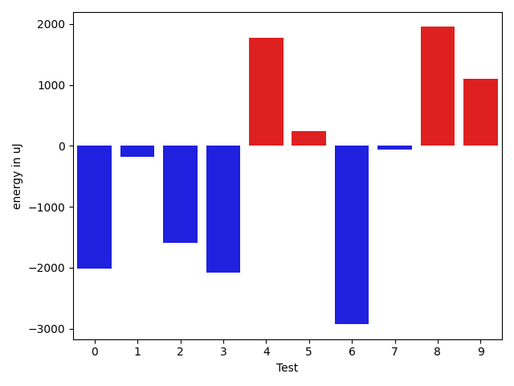

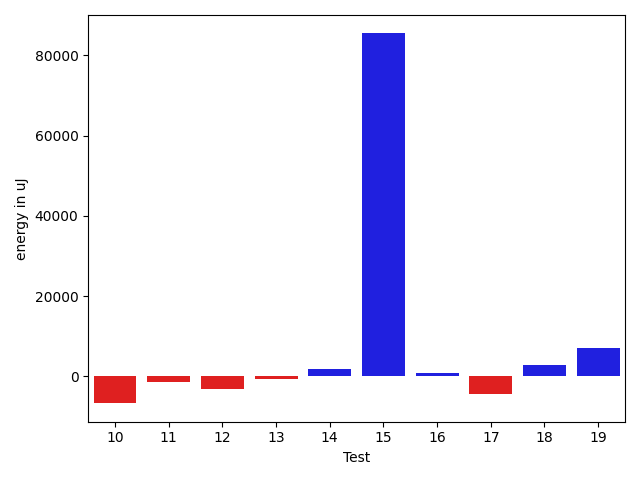

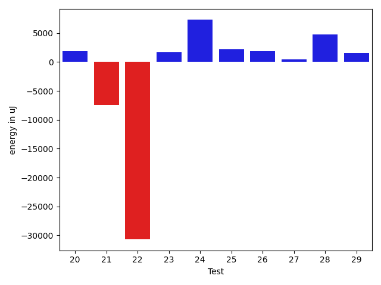

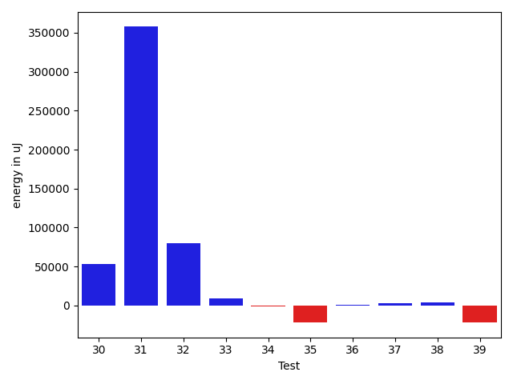

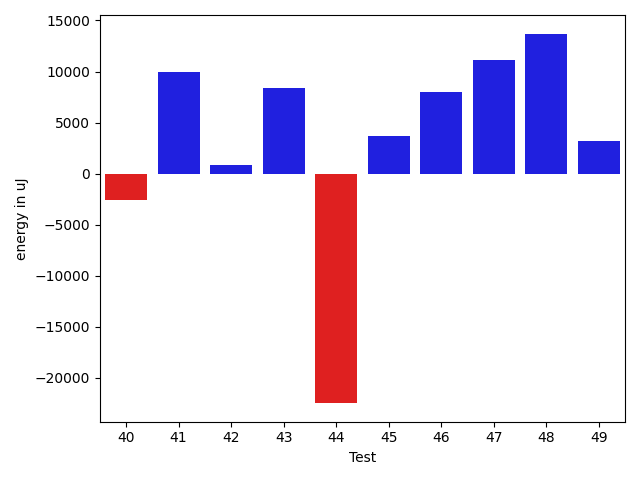

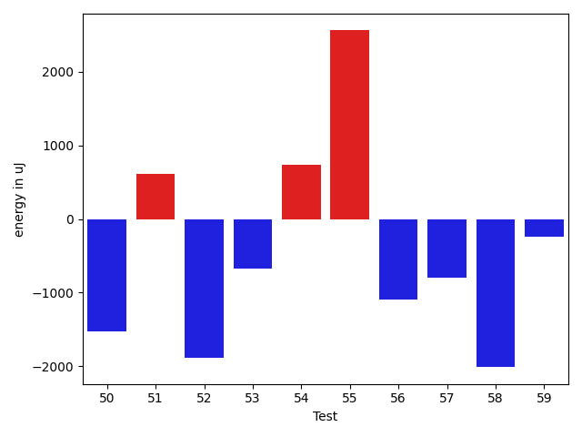

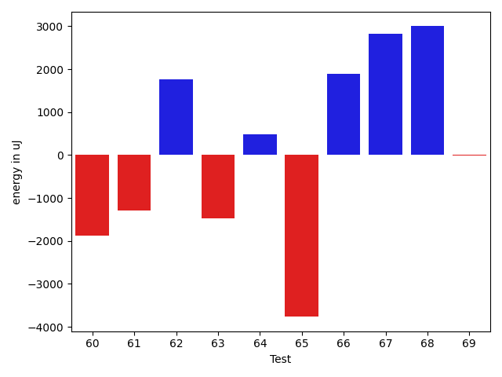

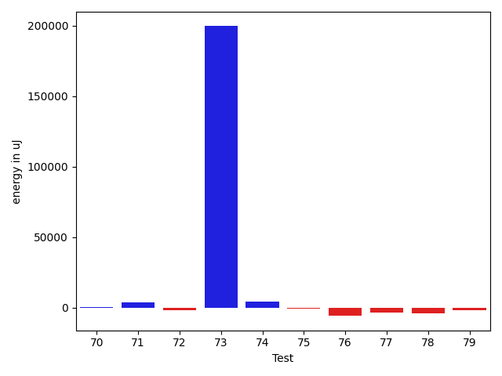

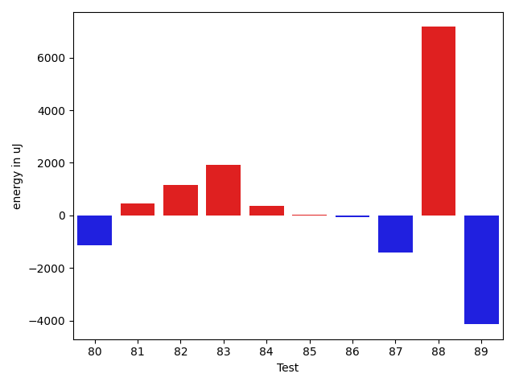

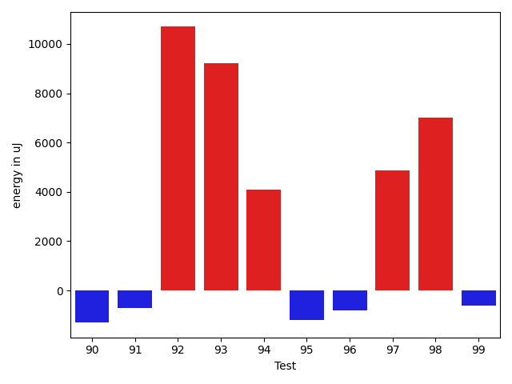

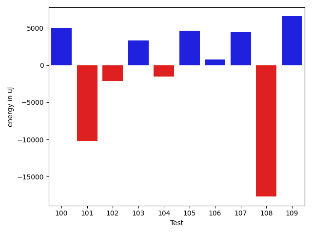

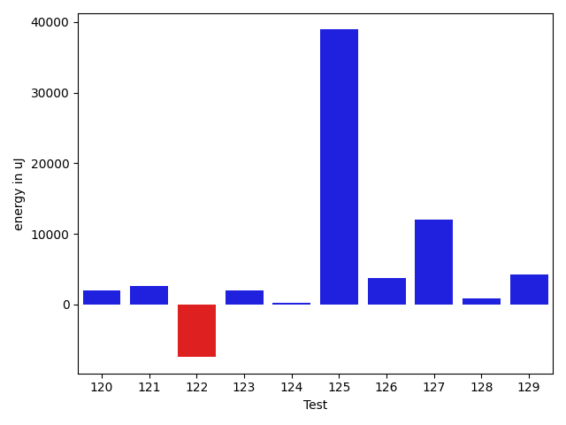

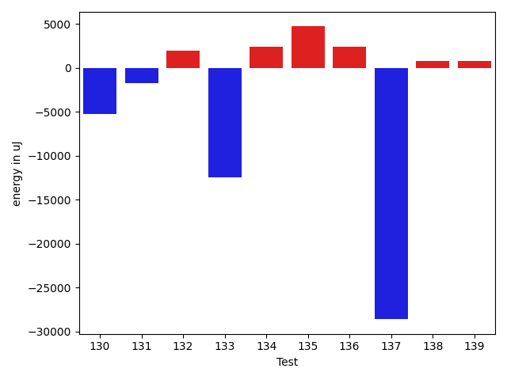

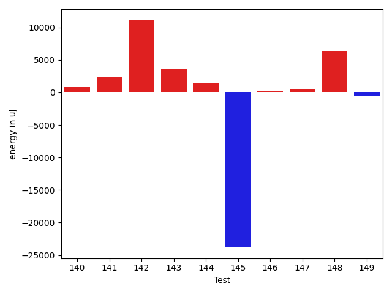

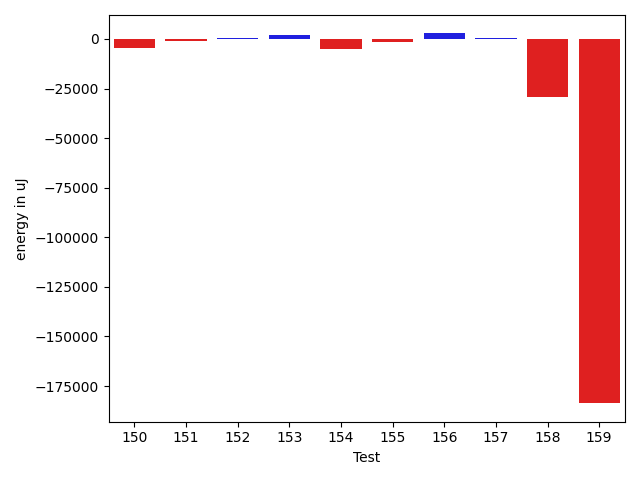

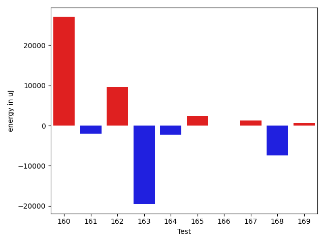

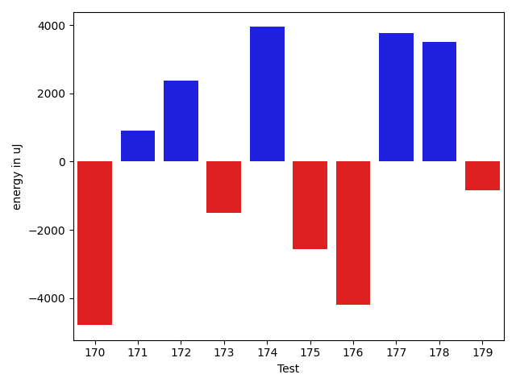

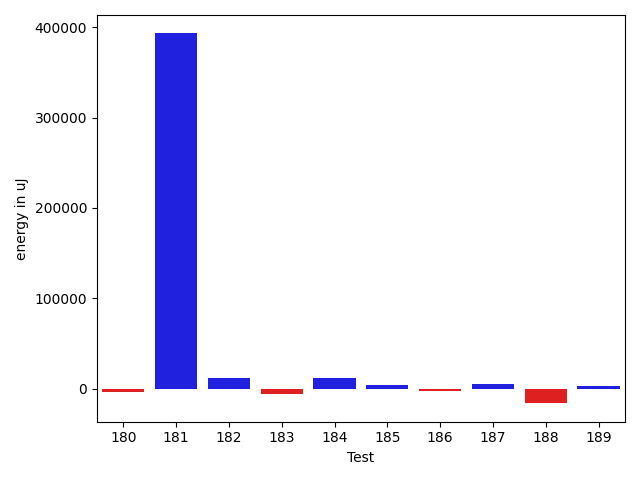

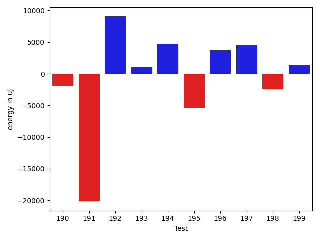

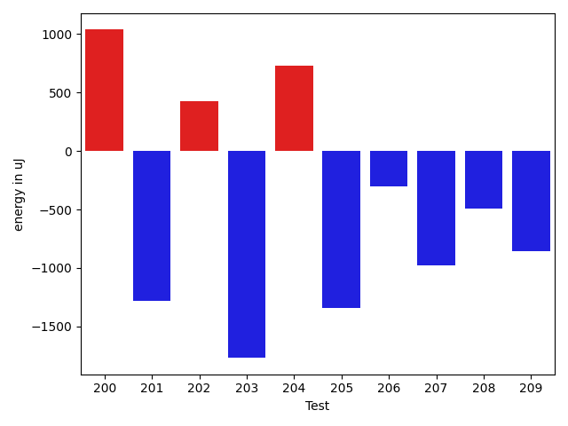

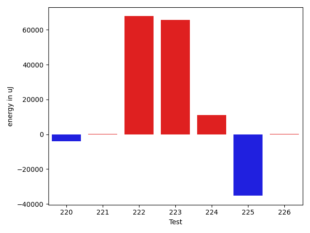

| ID | EnergyV1 | EnergyV2 | DeltaEnergy | σV1 | σV2 |
| --- | --- | --- | --- | --- | --- |
| 0 | 41931 | 39917 | -2014 | 3700.2692598722538 | 5269.155068299551 |
| 1 | 41198 | 41015 | -183 | 3465.558849433795 | 4800.506036867364 |
| 2 | 40161 | 38574 | -1587 | 4918.638690811626 | 4049.225165535633 |
| 3 | 39307 | 37232 | -2075 | 4699.494721469438 | 3181.1961412162073 |
| 4 | 40771 | 42541 | 1770 | 239153.6347231624 | 412535.9946403626 |
| 5 | 39429 | 39673 | 244 | 4389.510742943257 | 4043.898296168199 |
| 6 | 39428 | 36499 | -2929 | 3591.2532031536007 | 4689.407783438651 |
| 7 | 38513 | 38452 | -61 | 3777.754891752595 | 16852.330939524007 |
| 8 | 37903 | 39856 | 1953 | 4138.254074774707 | 4639.580730865733 |
| 9 | 38452 | 39551 | 1099 | 4317.138728704999 | 4634.851069384447 |
| 10 | 40100 | 41443 | 1343 | 7871.135761932843 | 11372.33108997702 |
| 11 | 38025 | 38269 | 244 | 12493.129891198898 | 9421.230231254025 |
| 12 | 39978 | 39429 | -549 | 19383.596245157085 | 12838.08723975708 |
| 13 | 40406 | 42420 | 2014 | 20232.487575873798 | 23587.214733418303 |
| 14 | 40222 | 39978 | -244 | 22819.52206566186 | 14267.097842853957 |
| 15 | 41076 | 39184 | -1892 | 73937.21614266824 | 49567.012655696504 |
| 16 | 38635 | 38635 | 0 | 4522.737025284692 | 4991.673039560739 |
| 17 | 37536 | 39612 | 2076 | 4330.094492731086 | 5338.480776046616 |
| 18 | 38147 | 37292 | -855 | 4125.812861133898 | 5163.323503233958 |
| 19 | 39001 | 38635 | -366 | 12450.729183014686 | 30090.38410717709 |
| 20 | 39978 | 39672 | -306 | 4810.058305345836 | 4545.413194997572 |
| 21 | 41442 | 40588 | -854 | 8479.607468324622 | 25250.487161446057 |
| 22 | 42358 | 42480 | 122 | 377138.42894248135 | 366688.62354290887 |
| 23 | 38574 | 39185 | 611 | 4756.848547612335 | 4943.4634134068565 |
| 24 | 37842 | 38757 | 915 | 5650.042332572525 | 5597.657265499896 |
| 25 | 38025 | 39185 | 1160 | 3720.782040519917 | 4548.527100852548 |
| 26 | 39184 | 38513 | -671 | 4506.681053347048 | 4301.541429260052 |
| 27 | 39673 | 40832 | 1159 | 9564.25493990805 | 12030.028247705388 |
| 28 | 41321 | 41504 | 183 | 8381.714583306277 | 6807.222254929709 |
| 29 | 40344 | 41443 | 1099 | 4464.560594493383 | 4933.220416280377 |
| 30 | 45471 | 44006 | -1465 | 21538.06128310324 | 22477.804159464547 |
| 31 | 37415 | 38514 | 1099 | 3928.095856773355 | 7081.789017034346 |
| 32 | 42664 | 43579 | 915 | 187994.20442745625 | 192757.3148005896 |
| 33 | 40405 | 42175 | 1770 | 14137.824864853246 | 21158.70672555089 |
| 34 | 39612 | 39428 | -184 | 4338.479189022806 | 7564.600315647887 |
| 35 | 39673 | 39490 | -183 | 6211.829000256328 | 10942.237335910377 |
| 36 | 37658 | 39306 | 1648 | 53980.59997896364 | 8232.701340909922 |
| 37 | 39062 | 40710 | 1648 | 4953.854676596957 | 39336.672654529386 |
| 38 | 65368 | 72204 | 6836 | 28087.9437289983 | 26991.14202038769 |
| 39 | 77758 | 78369 | 611 | 293449.5735426929 | 235412.60741777497 |
| 40 | 40528 | 41382 | 854 | 97260.21049759096 | 83563.06839417093 |
| 41 | 39612 | 39978 | 366 | 4655.810585575995 | 4407.13318410052 |
| 42 | 40711 | 41870 | 1159 | 15924.49559482101 | 12931.624536686837 |
| 43 | 37903 | 37720 | -183 | 3924.5578174489924 | 4178.18289539507 |
| 44 | 39001 | 38330 | -671 | 28935.782107755444 | 11066.420843714543 |
| 45 | 38697 | 37902 | -795 | 4154.735072479513 | 3770.164261171258 |
| 46 | 38635 | 38696 | 61 | 4872.43816037053 | 4747.718666340943 |
| 47 | 39185 | 38452 | -733 | 34290.62291643909 | 4174.819659050624 |
| 48 | 37597 | 38391 | 794 | 4424.614520590011 | 4413.62504536841 |
| 49 | 176147 | 176452 | 305 | 29700.23698864566 | 49559.44566330866 |
| 50 | 39672 | 38147 | -1525 | 3438.132467636288 | 4360.637158052295 |
| 51 | 37781 | 38391 | 610 | 4882.189137945247 | 4330.80230882423 |
| 52 | 38452 | 36560 | -1892 | 4444.453257713483 | 4938.291380872203 |
| 53 | 38635 | 37963 | -672 | 25953.290364826342 | 4482.4399299049865 |
| 54 | 39734 | 40466 | 732 | 7555.13531499099 | 7008.196541689036 |
| 55 | 37354 | 39917 | 2563 | 4878.0837063854115 | 5392.7002563114675 |
| 56 | 38757 | 37659 | -1098 | 3801.350411693105 | 3654.670939103847 |
| 57 | 38207 | 37415 | -792 | 4105.668508041122 | 4609.514258574324 |
| 58 | 38879 | 36865 | -2014 | 4410.095539950082 | 4207.379102669528 |
| 59 | 38574 | 38330 | -244 | 4874.717010040464 | 4106.733704229132 |
| 60 | 36255 | 37781 | 1526 | 4331.374059470684 | 3561.1272860570425 |
| 61 | 81847 | 83984 | 2137 | 381751.62207414507 | 331899.04658246116 |
| 62 | 42175 | 44494 | 2319 | 17570.09717486533 | 19548.662709166674 |
| 63 | 39917 | 42053 | 2136 | 15808.673775313493 | 13222.65676387495 |
| 64 | 40161 | 41687 | 1526 | 322902.5984851633 | 4065.9807645381356 |
| 65 | 39856 | 40344 | 488 | 4943.680444777084 | 4027.512488807453 |
| 66 | 41443 | 40954 | -489 | 27243.89738844661 | 23375.03660839459 |
| 67 | 40893 | 43518 | 2625 | 4283.667561231606 | 32376.94589647599 |
| 68 | 42053 | 42420 | 367 | 10485.590274218657 | 6894.1112784018715 |
| 69 | 39856 | 42236 | 2380 | 5876.818012798725 | 5170.123434454926 |
| 70 | 41809 | 42663 | 854 | 18364.415090437655 | 18520.59064540729 |
| 71 | 39856 | 38086 | -1770 | 5343.090250557257 | 4823.999650141568 |
| 72 | 40710 | 40100 | -610 | 9976.034239736751 | 9909.037677143198 |
| 73 | 40344 | 41199 | 855 | 30889.616875528613 | 4445.779051402637 |
| 74 | 44494 | 51269 | 6775 | 48941.99765742435 | 50170.37198873007 |
| 75 | 40100 | 40405 | 305 | 6201.526894254883 | 8695.493785938885 |
| 76 | 38574 | 39978 | 1404 | 4041.535693172049 | 4075.2261315039705 |
| 77 | 39673 | 39551 | -122 | 6450.587763774962 | 5200.434167359085 |
| 78 | 39856 | 40832 | 976 | 4370.607569923595 | 24589.88543558086 |
| 79 | 41626 | 40527 | -1099 | 26520.538022849923 | 185027.2051535177 |
| 80 | 42664 | 42053 | -611 | 3107.533145327251 | 4619.90018451089 |
| 81 | 44311 | 42053 | -2258 | 24408.645732403915 | 23641.075545036412 |
| 82 | 40284 | 43945 | 3661 | 4193.0080365482045 | 5762.02922066488 |
| 83 | 42481 | 42114 | -367 | 4882.395414096633 | 3447.6876398948525 |
| 84 | 40771 | 40161 | -610 | 3942.179945888033 | 4893.725512377648 |
| 85 | 41137 | 40466 | -671 | 4392.988705361317 | 4017.780328170282 |
| 86 | 41016 | 40893 | -123 | 4150.386961343351 | 3990.835068404841 |
| 87 | 39734 | 38391 | -1343 | 3391.8858864452777 | 3758.2532644833823 |
| 88 | 42053 | 42541 | 488 | 5099.527230668678 | 19535.099187495984 |
| 89 | 39184 | 45899 | 6715 | 31120.645136764037 | 5660.509526426524 |
| 90 | 44373 | 43457 | -916 | 3819.6732534751723 | 4459.6183693226485 |
| 91 | 38696 | 39428 | 732 | 8492.527406089264 | 4483.48817035657 |
| 92 | 42297 | 42480 | 183 | 93504.90419887833 | 105359.81486951695 |
| 93 | 43396 | 44861 | 1465 | 19662.868307418692 | 51166.9425227282 |
| 94 | 40589 | 39612 | -977 | 4162.029086800692 | 26563.9844137001 |
| 95 | 39428 | 38391 | -1037 | 4629.403098402644 | 4050.700124592661 |
| 96 | 39428 | 40589 | 1161 | 4650.093736413453 | 4731.983961980557 |
| 97 | 38879 | 41382 | 2503 | 3916.8673221722224 | 23107.61443932257 |
| 98 | 41443 | 41077 | -366 | 13785.557245016309 | 32765.86361315868 |
| 99 | 39977 | 39002 | -975 | 4670.128519644828 | 4200.092251021618 |
| 100 | 37964 | 39673 | 1709 | 4543.972617144178 | 4711.380106255772 |
| 101 | 39917 | 36438 | -3479 | 3871.141221913765 | 4267.654223907942 |
| 102 | 41077 | 42846 | 1769 | 13197.720371330794 | 14245.636236237428 |
| 103 | 39856 | 37598 | -2258 | 4766.270980853313 | 4798.513191719705 |
| 104 | 38391 | 39001 | 610 | 4482.587419961824 | 3540.511442447557 |
| 105 | 40222 | 41382 | 1160 | 4451.414012430115 | 4492.798540527026 |
| 106 | 38269 | 43701 | 5432 | 362943.137938635 | 291022.9116642319 |
| 107 | 41687 | 36193 | -5494 | 4086.706295722755 | 3733.4670362963043 |
| 108 | 40345 | 41870 | 1525 | 21280.859977336444 | 8292.440653390291 |
| 109 | 40955 | 37292 | -3663 | 3724.8022649589707 | 4046.2661195230344 |
| 110 | 39856 | 42114 | 2258 | 6904.645010104108 | 7702.129150071102 |
| 111 | 39307 | 37414 | -1893 | 3633.342832091434 | 4572.020180825709 |
| 112 | 42846 | 41992 | -854 | 347554.9909095724 | 408268.62344901444 |
| 113 | 38880 | 39307 | 427 | 3332.0649316138897 | 7478.865598608218 |
| 114 | 45837 | 44372 | -1465 | 178947.01387132952 | 291031.3680907427 |
| 115 | 39368 | 38818 | -550 | 4263.312412816232 | 8236.825722115535 |
| 116 | 40405 | 41870 | 1465 | 47784.82308909552 | 61891.218594767786 |
| 117 | 39795 | 40527 | 732 | 4261.736157970057 | 4021.963989335799 |
| 118 | 40161 | 40283 | 122 | 3859.8370742817633 | 4604.708302543045 |
| 119 | 38635 | 38696 | 61 | 8519.043749573975 | 4194.382849782294 |
| 120 | 38269 | 39673 | 1404 | 3277.76558185603 | 4337.248521778458 |
| 121 | 40222 | 40283 | 61 | 4304.039801749919 | 5049.785275577324 |
| 122 | 40283 | 37780 | -2503 | 4786.942239049893 | 2719.331949106822 |
| 123 | 39734 | 39002 | -732 | 4369.519466840004 | 4032.783808825423 |
| 124 | 39185 | 38636 | -549 | 4160.890879475171 | 4468.779995617048 |
| 125 | 39855 | 37781 | -2074 | 4737.22208246497 | 4327.242413515268 |
| 126 | 39612 | 39245 | -367 | 3965.130930598181 | 24377.4982784044 |
| 127 | 41931 | 41260 | -671 | 26828.406668970354 | 13066.615069453292 |
| 128 | 39673 | 38391 | -1282 | 34354.05131683889 | 4845.544248200923 |
| 129 | 42053 | 40954 | -1099 | 9704.495579622322 | 6159.04151734948 |
| 130 | 41931 | 43762 | 1831 | 24369.030380587566 | 16762.138131661424 |
| 131 | 40405 | 40467 | 62 | 15327.290008047215 | 12232.473969692073 |
| 132 | 42602 | 42602 | 0 | 15399.534202941084 | 16276.272705920186 |
| 133 | 44067 | 44983 | 916 | 278216.73838259844 | 211737.691628309 |
| 134 | 39429 | 41138 | 1709 | 15422.772055889054 | 13626.514980374111 |
| 135 | 38391 | 40283 | 1892 | 3860.2760071547445 | 16739.6727994788 |
| 136 | 39551 | 40527 | 976 | 6881.42288835035 | 11674.832841299582 |
| 137 | 38330 | 40161 | 1831 | 237375.0069361628 | 12740.418141444383 |
| 138 | 38025 | 39001 | 976 | 3867.6015520675805 | 4567.021156537463 |
| 139 | 40406 | 40832 | 426 | 4284.861421200094 | 5770.490556766229 |
| 140 | 39429 | 40283 | 854 | 9134.697725410844 | 7726.807717849735 |
| 141 | 39367 | 41687 | 2320 | 4825.155821978312 | 4318.218628863835 |
| 142 | 104492 | 115539 | 11047 | 190476.35828765226 | 170744.34974773746 |
| 143 | 37109 | 40649 | 3540 | 11213.547393979516 | 4429.786339966238 |
| 144 | 40222 | 41626 | 1404 | 4320.355898918047 | 3926.6379553506067 |
| 145 | 68969 | 45227 | -23742 | 253576.0379462043 | 33838.74761681439 |
| 146 | 42420 | 42602 | 182 | 17432.7327584304 | 12205.601481632339 |
| 147 | 41016 | 41443 | 427 | 19948.745477184646 | 65897.55633065909 |
| 148 | 130615 | 136901 | 6286 | 152580.63220661037 | 202080.5247229132 |
| 149 | 41015 | 40405 | -610 | 4365.302721447454 | 3948.073961682276 |
| 150 | 40344 | 38940 | -1404 | 3853.4774749568733 | 3933.399604895317 |
| 151 | 38940 | 41443 | 2503 | 10282.478507149917 | 6893.887537046888 |
| 152 | 40894 | 40772 | -122 | 5932.2484038277225 | 3696.2170360723517 |
| 153 | 40222 | 39124 | -1098 | 8393.109547395952 | 6179.279350735547 |
| 154 | 39551 | 39551 | 0 | 18181.951843659575 | 4327.141819352844 |
| 155 | 39429 | 40161 | 732 | 4404.073039377049 | 3968.1193907577267 |
| 156 | 41992 | 39917 | -2075 | 7660.233110145875 | 7268.978439808443 |
| 157 | 37353 | 39124 | 1771 | 5378.323257412527 | 4165.82844581963 |
| 158 | 39794 | 39856 | 62 | 4465.997638826067 | 7715.861722693739 |
| 159 | 39673 | 39795 | 122 | 5726.392514376042 | 5865.796718415593 |
| 160 | 83313 | 80871 | -2442 | 218158.09720512325 | 284939.84036292287 |
| 161 | 40527 | 40344 | -183 | 9307.775961261788 | 6205.914441333442 |
| 162 | 41931 | 43762 | 1831 | 15062.944116569051 | 26625.204900230772 |
| 163 | 124694 | 126648 | 1954 | 177597.14709150983 | 129936.81147888715 |
| 164 | 42297 | 40955 | -1342 | 27634.5061903039 | 22470.16271371273 |
| 165 | 84045 | 80871 | -3174 | 80789.06164718188 | 92043.86258601904 |
| 166 | 39489 | 38391 | -1098 | 5080.448826479434 | 7120.663335205038 |
| 167 | 38757 | 39673 | 916 | 4850.623136916421 | 5879.06929598219 |
| 168 | 43274 | 47242 | 3968 | 343672.930797844 | 303603.87685305113 |
| 169 | 38696 | 41077 | 2381 | 4217.881764926479 | 3958.903036449461 |
| 170 | 40344 | 39367 | -977 | 4095.137302408453 | 4080.077215888803 |
| 171 | 39306 | 40406 | 1100 | 4173.508563375178 | 5412.464810888675 |
| 172 | 41198 | 39978 | -1220 | 4511.204743915188 | 4477.495113341229 |
| 173 | 41382 | 42724 | 1342 | 370077.9643642328 | 391426.83385895856 |
| 174 | 38208 | 40649 | 2441 | 4307.492262983564 | 4419.5180639024165 |
| 175 | 40100 | 40589 | 489 | 4725.2881968415295 | 4201.957151771712 |
| 176 | 40344 | 42847 | 2503 | 11365.84345091788 | 9587.496716518666 |
| 177 | 40588 | 43090 | 2502 | 3443.76288463006 | 4416.429173992139 |
| 178 | 40588 | 42175 | 1587 | 269871.501697045 | 161982.882030097 |
| 179 | 69824 | 46569 | -23255 | 411255.81186420505 | 296188.7772429788 |
| 180 | 39368 | 39429 | 61 | 5281.4408285246 | 3631.067241468543 |
| 181 | 38208 | 40039 | 1831 | 8409.373040443226 | 6473.235462356604 |
| 182 | 38941 | 38452 | -489 | 4963.029991451937 | 4723.253000051378 |
| 183 | 41320 | 40588 | -732 | 4876.722727815868 | 3660.685588389579 |
| 184 | 42175 | 40833 | -1342 | 13406.59380674941 | 13397.631035464772 |
| 185 | 44983 | 45044 | 61 | 28456.59005898859 | 33005.90484586379 |
| 186 | 40711 | 39978 | -733 | 4400.804086755055 | 3750.7971097724926 |
| 187 | 41625 | 42969 | 1344 | 5055.556270852519 | 3798.5367235292065 |
| 188 | 43152 | 41687 | -1465 | 58457.98161700786 | 76684.96713361391 |
| 189 | 42724 | 43274 | 550 | 105360.95838818673 | 72938.49890871241 |
| 190 | 39734 | 44556 | 4822 | 8383.744161354796 | 429666.8678736741 |
| 191 | 40161 | 39734 | -427 | 4327.271247275816 | 3761.3262235546654 |
| 192 | 42541 | 44617 | 2076 | 4888.848992261451 | 3296.635015633951 |
| 193 | 44555 | 45288 | 733 | 21336.866171196518 | 21075.06980143507 |
| 194 | 39917 | 40283 | 366 | 4788.472626920345 | 4301.944068683728 |
| 195 | 40283 | 39429 | -854 | 7571.334057825777 | 8299.761815498294 |
| 196 | 42176 | 41870 | -306 | 22131.73552834362 | 25804.18787152937 |
| 197 | 41931 | 39795 | -2136 | 232116.40626977832 | 298237.2898473655 |
| 198 | 40100 | 42053 | 1953 | 6189.137162384981 | 14132.366787053983 |
| 199 | 39123 | 40222 | 1099 | 5002.69897406869 | 4358.601639117838 |
| 200 | 38818 | 39856 | 1038 | 3931.576549706871 | 197009.88333300097 |
| 201 | 40588 | 39306 | -1282 | 4880.172677208769 | 4294.708312919 |
| 202 | 40222 | 40649 | 427 | 4353.666447371875 | 4998.053536362306 |
| 203 | 40710 | 38940 | -1770 | 10451.0454914303 | 3311.850140838486 |
| 204 | 38635 | 39367 | 732 | 3998.5925008057525 | 4853.663864202657 |
| 205 | 38940 | 37598 | -1342 | 4261.071274893466 | 4230.903503130995 |
| 206 | 40772 | 40467 | -305 | 4183.097715808226 | 5212.013290460877 |
| 207 | 85999 | 85021 | -978 | 146457.42936792134 | 161637.10377233365 |
| 208 | 40406 | 39917 | -489 | 4220.262877476082 | 8277.698158788126 |
| 209 | 42480 | 41626 | -854 | 10257.11151630622 | 5995.053761029432 |
| 210 | 40528 | 39673 | -855 | 7055.535295196884 | 3922.3238055603333 |
| 211 | 40283 | 41199 | 916 | 17848.20557874937 | 11409.817875536339 |
| 212 | 39184 | 40527 | 1343 | 3933.8112153991324 | 3625.251115549604 |
| 213 | 40589 | 40100 | -489 | 3786.1253166767 | 3722.732115232805 |
| 214 | 40649 | 39368 | -1281 | 2952.840636147709 | 3840.959846602133 |
| 215 | 42054 | 40222 | -1832 | 4291.905981318712 | 4440.380559680994 |
| 216 | 41259 | 42175 | 916 | 4339.1625375576505 | 135661.50866742159 |
| 217 | 43335 | 41198 | -2137 | 381068.2546700811 | 297712.9330624385 |
| 218 | 39246 | 40161 | 915 | 7797.032419222001 | 6189.839996296517 |
| 219 | 219909 | 224060 | 4151 | 275790.88258229767 | 53795.1618244428 |
| 220 | 41992 | 41870 | -122 | 34312.63749960441 | 8246.059278730507 |
| 221 | 40527 | 42175 | 1648 | 3865.9276341160626 | 4775.209231207996 |
| 222 | 39551 | 41381 | 1830 | 3251.182745540146 | 311231.94511175004 |
| 223 | 42419 | 44434 | 2015 | 277182.25871314935 | 406646.6500592495 |
| 224 | 40588 | 43030 | 2442 | 4723.524204381195 | 52010.00600377575 |
| 225 | 41870 | 38086 | -3784 | 307521.7868350334 | 231575.22630099178 |
| 226 | 39734 | 43213 | 3479 | 10794.86243721887 | 5207.219739707553 |

## Delta Duration per test method

| ID | DurationV1 | DurationsV2 | DeltaDuration |
| --- | --- | --- | --- |
| 0 | 930153.1333333333 | 426899.90476190473 | -503253.22857142857 |
| 1 | 418345.1666666667 | 458616.2 | 40271.033333333326 |
| 2 | 568659.9655172414 | 683293.8709677419 | 114633.90545050055 |
| 3 | 686627.1578947369 | 469615.9166666667 | -217011.24122807017 |
| 4 | 2297698.6790123456 | 4579144.915662651 | 2281446.2366503053 |
| 5 | 465412.7037037037 | 545178.7727272727 | 79766.069023569 |
| 6 | 436782.5238095238 | 460045.9375 | 23263.413690476213 |
| 7 | 465182.15789473685 | 862906.1428571428 | 397723.984962406 |
| 8 | 942158.1960784313 | 902662.3870967742 | -39495.808981657145 |
| 9 | 663933.1538461539 | 641164.619047619 | -22768.53479853482 |
| 10 | 1224127.3170731708 | 1200831.5185185184 | -23295.79855465237 |
| 11 | 1062039.9714285715 | 1029243.126984127 | -32796.84444444452 |
| 12 | 1349912.6024096385 | 1271470.4074074074 | -78442.19500223105 |
| 13 | 939717.5925925926 | 1005691.5238095238 | 65973.9312169312 |
| 14 | 1254574.7105263157 | 1155145.7738095238 | -99428.93671679194 |
| 15 | 1931162.0555555555 | 1422820.3015873015 | -508341.75396825396 |
| 16 | 625282.4634146341 | 650479.0285714286 | 25196.565156794502 |
| 17 | 680668.6170212766 | 679703.5217391305 | -965.0952821461251 |
| 18 | 699092.2653061225 | 700784.756097561 | 1692.4907914384967 |
| 19 | 929365.3725490196 | 1021596.4615384615 | 92231.08898944187 |
| 20 | 756144.2272727273 | 771542.9310344828 | 15398.703761755489 |
| 21 | 955193.1403508772 | 1078067.7924528301 | 122874.65210195293 |
| 22 | 3983843.4166666665 | 4145139.0877192984 | 161295.67105263192 |
| 23 | 732095.6046511628 | 735565.8510638297 | 3470.24641266698 |
| 24 | 461121.9411764706 | 426818.7826086957 | -34303.158567774924 |
| 25 | 526268.75 | 536077.9090909091 | 9809.15909090906 |
| 26 | 637187.7804878049 | 657586.027027027 | 20398.246539222077 |
| 27 | 1275530.2261904762 | 1118164.2261904762 | -157366.0 |
| 28 | 1004090.5555555555 | 987478.690140845 | -16611.865414710483 |
| 29 | 653469.8235294118 | 592799.7941176471 | -60670.0294117647 |
| 30 | 1632702.7676767677 | 1652515.1616161617 | 19812.393939394038 |
| 31 | 659543.275 | 952244.4358974359 | 292701.16089743585 |
| 32 | 2018917.211111111 | 2180335.7325581396 | 161418.5214470285 |
| 33 | 907722.1739130435 | 1117287.574468085 | 209565.40055504162 |
| 34 | 879349.765625 | 961455.2063492064 | 82105.44072420639 |
| 35 | 1102504.4074074074 | 1096889.1904761905 | -5615.216931216884 |
| 36 | 941408.2 | 745391.195652174 | -196017.004347826 |
| 37 | 748115.3720930233 | 896312.66 | 148197.28790697677 |
| 38 | 1940142.313131313 | 2011516.393939394 | 71374.08080808097 |
| 39 | 3884333.375 | 3384540.3870967743 | -499792.9879032257 |
| 40 | 1932262.701754386 | 1985393.888888889 | 53131.18713450292 |
| 41 | 752863.5116279069 | 867192.58 | 114329.06837209302 |
| 42 | 1405014.4 | 1396947.4343434344 | -8066.965656565502 |
| 43 | 664827.6041666666 | 654180.9795918367 | -10646.62457482994 |
| 44 | 1259266.25 | 1145989.8148148148 | -113276.43518518517 |
| 45 | 526830.0294117647 | 504764.53846153844 | -22065.49095022626 |
| 46 | 818645.6724137932 | 790921.3958333334 | -27724.276580459788 |
| 47 | 830925.3863636364 | 641891.6578947369 | -189033.7284688995 |
| 48 | 696228.2291666666 | 676982.6976744186 | -19245.53149224806 |
| 49 | 4822309.171717172 | 4843579.444444444 | 21270.272727272473 |
| 50 | 758601.8846153846 | 805914.4423076923 | 47312.55769230763 |
| 51 | 731935.5675675676 | 642216.25 | -89719.31756756757 |
| 52 | 430314.6 | 433959.0909090909 | 3644.490909090906 |
| 53 | 1228495.288888889 | 1099964.9204545454 | -128530.36843434349 |
| 54 | 1032908.9655172414 | 961177.6909090909 | -71731.27460815047 |
| 55 | 507933.7826086957 | 443618.0 | -64315.78260869568 |
| 56 | 519160.54545454547 | 457519.5789473684 | -61640.96650717704 |
| 57 | 469864.26086956525 | 430011.25 | -39853.010869565245 |
| 58 | 470777.04545454547 | 444393.3703703704 | -26383.675084175076 |
| 59 | 496206.7368421053 | 766680.0 | 270473.2631578947 |
| 60 | 939132.75 | 427899.65 | -511233.1 |
| 61 | 4388969.111111111 | 4533770.04040404 | 144800.92929292936 |
| 62 | 1583868.7777777778 | 1646941.2424242424 | 63072.46464646468 |
| 63 | 1400543.5402298851 | 1270146.2365591398 | -130397.30367074534 |
| 64 | 3108693.8235294116 | 573392.5757575758 | -2535301.247771836 |
| 65 | 589038.4137931034 | 487636.1 | -101402.31379310344 |
| 66 | 1182795.9814814816 | 1155983.1346153845 | -26812.84686609707 |
| 67 | 694421.0769230769 | 897171.5 | 202750.42307692312 |
| 68 | 1121985.705882353 | 1068094.5882352942 | -53891.117647058796 |
| 69 | 454517.8 | 458923.4 | 4405.600000000035 |
| 70 | 1448035.141304348 | 1427801.3979591837 | -20233.74334516423 |
| 71 | 827006.46 | 895182.7291666666 | 68176.26916666667 |
| 72 | 890746.82 | 913371.8823529412 | 22625.062352941255 |
| 73 | 913300.0227272727 | 782364.4423076923 | -130935.58041958045 |
| 74 | 2163939.12371134 | 2213114.287234043 | 49175.16352270264 |
| 75 | 948599.5593220339 | 1056497.0923076924 | 107897.5329856585 |
| 76 | 567058.3428571429 | 531254.5806451613 | -35803.76221198158 |
| 77 | 999422.6714285715 | 977540.7837837838 | -21881.88764478767 |
| 78 | 637142.4375 | 704581.4418604651 | 67439.0043604651 |
| 79 | 1322602.3142857142 | 1908566.2077922078 | 585963.8935064937 |
| 80 | 442959.5263157895 | 475514.0625 | 32554.536184210505 |
| 81 | 1163754.025 | 1257664.0 | 93909.9750000001 |
| 82 | 428945.6666666667 | 410272.4285714286 | -18673.238095238106 |
| 83 | 465939.71428571426 | 376361.35294117645 | -89578.36134453781 |
| 84 | 435805.2105263158 | 497693.9090909091 | 61888.69856459333 |
| 85 | 388256.8888888889 | 435026.27777777775 | 46769.388888888876 |
| 86 | 430267.0 | 432190.0 | 1923.0 |
| 87 | 369174.6 | 418500.9 | 49326.30000000005 |
| 88 | 353513.46153846156 | 923039.5714285715 | 569526.1098901099 |
| 89 | 685646.4444444445 | 436076.44444444444 | -249570.00000000006 |
| 90 | 365181.76923076925 | 412332.5 | 47150.73076923075 |
| 91 | 958354.779661017 | 905385.8301886793 | -52968.94947233773 |
| 92 | 1845022.064516129 | 2118138.1896551726 | 273116.12513904367 |
| 93 | 1589867.7575757576 | 1807421.5454545454 | 217553.78787878784 |
| 94 | 668370.425 | 780345.8636363636 | 111975.4386363636 |
| 95 | 744098.55 | 794243.2 | 50144.64999999991 |
| 96 | 510501.9310344828 | 608063.2580645161 | 97561.32703003334 |
| 97 | 511205.2413793103 | 781058.4444444445 | 269853.2030651342 |
| 98 | 756575.9024390244 | 992028.7045454546 | 235452.80210643017 |
| 99 | 805027.9166666666 | 830602.5 | 25574.583333333372 |
| 100 | 750580.2448979592 | 754656.4693877551 | 4076.2244897959754 |
| 101 | 613807.825 | 650458.7575757576 | 36650.932575757615 |
| 102 | 1063027.7215189873 | 1168941.9594594594 | 105914.23794047209 |
| 103 | 637969.8085106383 | 959515.6842105263 | 321545.875699888 |
| 104 | 470972.84 | 452579.04347826086 | -18393.79652173916 |
| 105 | 633794.1025641026 | 652677.4736842106 | 18883.371120107942 |
| 106 | 4021150.5833333335 | 2808814.3125 | -1212336.2708333335 |
| 107 | 943853.65 | 436404.94444444444 | -507448.7055555556 |
| 108 | 853643.0 | 729083.35 | -124559.65000000002 |
| 109 | 595416.9565217391 | 455773.55 | -139643.40652173915 |
| 110 | 707059.3333333334 | 764316.95 | 57257.61666666658 |
| 111 | 573650.5142857142 | 572618.5714285715 | -1031.9428571427707 |
| 112 | 3467024.153846154 | 4679797.579710145 | 1212773.4258639906 |
| 113 | 706005.3953488372 | 737732.2272727273 | 31726.831923890044 |
| 114 | 2218007.487804878 | 3551299.4246575343 | 1333291.9368526563 |
| 115 | 865229.4821428572 | 872785.6037735849 | 7556.121630727779 |
| 116 | 1066948.219512195 | 1829786.5882352942 | 762838.3687230991 |
| 117 | 870338.186440678 | 800137.3898305085 | -70200.79661016946 |
| 118 | 696145.36 | 517595.22580645164 | -178550.13419354835 |
| 119 | 990088.0 | 914315.6944444445 | -75772.3055555555 |
| 120 | 704859.32 | 681625.7272727273 | -23233.592727272655 |
| 121 | 518318.1081081081 | 688761.0810810811 | 170442.97297297296 |
| 122 | 470461.125 | 473533.90476190473 | 3072.779761904734 |
| 123 | 515490.0625 | 569111.6428571428 | 53621.58035714284 |
| 124 | 549035.0588235294 | 516752.5862068966 | -32282.47261663282 |
| 125 | 552515.96875 | 566211.2307692308 | 13695.262019230751 |
| 126 | 544464.7826086957 | 781111.1538461539 | 236646.3712374582 |
| 127 | 1326949.7849462365 | 1294591.3541666667 | -32358.430779569782 |
| 128 | 909865.12 | 811422.512195122 | -98442.60780487803 |
| 129 | 946277.7719298246 | 1013173.1403508772 | 66895.36842105258 |
| 130 | 1381562.35 | 1045090.8571428572 | -336471.49285714293 |
| 131 | 1337077.6516853932 | 1318769.7659574468 | -18307.885727946414 |
| 132 | 1433865.8350515463 | 1436237.34375 | 2371.508698453661 |
| 133 | 3263092.711340206 | 2808870.795698925 | -454221.9156412813 |
| 134 | 1306182.46875 | 1326874.2631578948 | 20691.794407894835 |
| 135 | 984669.0149253731 | 1026914.5714285715 | 42245.55650319834 |
| 136 | 1246397.6516853932 | 1240011.0833333333 | -6386.568352059927 |
| 137 | 1775348.2166666666 | 872923.8644067796 | -902424.3522598869 |
| 138 | 600297.5333333333 | 606061.9696969697 | 5764.4363636364 |
| 139 | 898746.95 | 888668.9152542372 | -10078.034745762707 |
| 140 | 1069726.4078947369 | 1053880.64 | -15845.767894736957 |
| 141 | 665825.8947368421 | 738343.05 | 72517.15526315791 |
| 142 | 3921880.3333333335 | 3827625.9595959596 | -94254.37373737385 |
| 143 | 507799.9090909091 | 357821.76923076925 | -149978.13986013987 |
| 144 | 804836.2916666666 | 753079.16 | -51757.131666666595 |
| 145 | 2952945.5757575757 | 1900646.98989899 | -1052298.5858585858 |
| 146 | 1335301.6627906978 | 1223435.1851851852 | -111866.4776055126 |
| 147 | 1354665.8823529412 | 1724290.894117647 | 369625.0117647059 |
| 148 | 4169714.1414141413 | 4678524.282828283 | 508810.1414141413 |
| 149 | 816028.1555555556 | 728817.2222222222 | -87210.93333333335 |
| 150 | 630432.8 | 839301.8484848485 | 208869.04848484846 |
| 151 | 739643.2058823529 | 675804.0 | -63839.20588235289 |
| 152 | 889920.5396825396 | 891183.276923077 | 1262.7372405373026 |
| 153 | 1010556.5641025641 | 1002656.3561643836 | -7900.207938180538 |
| 154 | 679271.7352941176 | 533496.0789473684 | -145775.65634674917 |
| 155 | 686721.7857142857 | 649259.0263157894 | -37462.759398496244 |
| 156 | 585986.7692307692 | 642470.76 | 56483.99076923076 |
| 157 | 385851.0714285714 | 419544.73333333334 | 33693.66190476192 |
| 158 | 914079.7833333333 | 906970.947368421 | -7108.835964912316 |
| 159 | 918831.0327868853 | 902269.4461538461 | -16561.586633039173 |
| 160 | 2788557.616161616 | 3700538.303030303 | 911980.6868686872 |
| 161 | 1118350.4216867469 | 1099406.4210526317 | -18944.00063411519 |
| 162 | 979017.2452830189 | 1410209.6607142857 | 431192.41543126677 |
| 163 | 5046598.242424242 | 4333958.525252526 | -712639.7171717165 |
| 164 | 1385473.7083333333 | 1406566.219512195 | 21092.511178861838 |
| 165 | 2577075.6938775512 | 2882281.5714285714 | 305205.8775510201 |
| 166 | 963889.9726027397 | 1043334.3611111111 | 79444.38850837143 |
| 167 | 875544.0166666667 | 923393.5909090909 | 47849.57424242422 |
| 168 | 3826665.8488372094 | 3674620.682352941 | -152045.16648426838 |
| 169 | 667298.5416666666 | 864540.6756756756 | 197242.134009009 |
| 170 | 682862.4255319149 | 712559.0930232558 | 29696.667491340893 |
| 171 | 686859.6274509804 | 736370.4042553192 | 49510.77680433879 |
| 172 | 651411.7804878049 | 711825.1627906977 | 60413.38230289274 |
| 173 | 3765417.05 | 4925527.666666667 | 1160110.6166666672 |
| 174 | 499411.71428571426 | 528689.9615384615 | 29278.247252747242 |
| 175 | 545556.4444444445 | 573866.8461538461 | 28310.40170940163 |
| 176 | 702625.5862068966 | 776153.4545454546 | 73527.86833855801 |
| 177 | 410322.75 | 393521.0 | -16801.75 |
| 178 | 2882522.126984127 | 1577809.1384615384 | -1304712.9885225885 |
| 179 | 5297722.294117647 | 3553883.5890410957 | -1743838.7050765515 |
| 180 | 656013.6590909091 | 623992.4375 | -32021.22159090906 |
| 181 | 825985.5555555555 | 741919.8 | -84065.75555555546 |
| 182 | 638917.7878787878 | 624074.6666666666 | -14843.121212121216 |
| 183 | 583485.6129032258 | 541481.5151515151 | -42004.09775171068 |
| 184 | 1157837.8923076922 | 1081119.157142857 | -76718.73516483512 |
| 185 | 1747462.8585858585 | 1818251.8686868686 | 70789.01010101009 |
| 186 | 502385.4 | 424051.7272727273 | -78333.67272727273 |
| 187 | 705094.2105263158 | 837485.75 | 132391.53947368416 |
| 188 | 1786487.5588235294 | 1656999.380952381 | -129488.17787114833 |
| 189 | 2294652.4269662923 | 1932390.3827160494 | -362262.0442502429 |
| 190 | 779512.1538461539 | 5471391.448275862 | 4691879.294429708 |
| 191 | 551338.55 | 516835.6 | -34502.95000000007 |
| 192 | 556269.3888888889 | 418640.28571428574 | -137629.10317460314 |
| 193 | 1713174.7777777778 | 1568064.5408163266 | -145110.23696145113 |
| 194 | 559218.6666666666 | 556401.5263157894 | -2817.140350877191 |
| 195 | 897284.1935483871 | 1069287.5555555555 | 172003.36200716835 |
| 196 | 1249248.6417910447 | 1310574.7857142857 | 61326.14392324095 |
| 197 | 1788790.1621621621 | 2850829.1951219514 | 1062039.0329597893 |
| 198 | 577379.6296296297 | 715096.3571428572 | 137716.7275132275 |
| 199 | 543978.5 | 481158.96153846156 | -62819.53846153844 |
| 200 | 791154.7368421053 | 1623797.6785714286 | 832642.9417293234 |
| 201 | 476004.0 | 523061.0 | 47057.0 |
| 202 | 423207.4347826087 | 409704.1875 | -13503.247282608703 |
| 203 | 914238.5714285715 | 428888.45454545453 | -485350.11688311695 |
| 204 | 512277.9 | 513152.86666666664 | 874.9666666666162 |
| 205 | 445385.0 | 471189.71428571426 | 25804.71428571426 |
| 206 | 690073.975 | 720166.2115384615 | 30092.236538461526 |
| 207 | 3047075.9591836734 | 2845535.9292929294 | -201540.02989074402 |
| 208 | 685848.5348837209 | 669605.2325581395 | -16243.302325581433 |
| 209 | 682222.6097560975 | 630708.0 | -51514.60975609755 |
| 210 | 597075.2903225806 | 486553.85185185185 | -110521.43847072875 |
| 211 | 821963.7567567568 | 688758.0789473684 | -133205.67780938838 |
| 212 | 499948.24 | 474822.4285714286 | -25125.81142857141 |
| 213 | 504171.77777777775 | 517736.0714285714 | 13564.293650793668 |
| 214 | 357527.46153846156 | 650314.9444444445 | 292787.48290598294 |
| 215 | 380961.7272727273 | 339200.8461538461 | -41760.88111888117 |
| 216 | 616159.65625 | 1583866.34375 | 967706.6875 |
| 217 | 5364051.0 | 3739942.7 | -1624108.2999999998 |
| 218 | 842427.8684210526 | 769632.0227272727 | -72795.84569377988 |
| 219 | 7140281.03030303 | 6192075.787878788 | -948205.2424242422 |
| 220 | 1002105.779661017 | 954914.320754717 | -47191.45890630002 |
| 221 | 423389.5416666667 | 446286.38095238095 | 22896.83928571426 |
| 222 | 407395.71428571426 | 2320107.727272727 | 1912712.0129870127 |
| 223 | 2355803.1739130435 | 4208908.416666667 | 1853105.2427536235 |
| 224 | 878665.6 | 1059584.7073170731 | 180919.10731707315 |
| 225 | 3205301.5217391304 | 2369212.3333333335 | -836089.1884057969 |
| 226 | 1107438.0425531915 | 870590.26 | -236847.78255319153 |

## Misc.

| ID | Test Class | Test Method |
| --- | --- | --- |
| 0 | com.google.gson.functional.TypeAdapterPrecedenceTest | testStreamingFollowedByNonstreaming |
| 1 | com.google.gson.functional.TypeAdapterPrecedenceTest | testSerializeNonstreamingTypeAdapterFollowedByStreamingTypeAdapter |
| 2 | com.google.gson.functional.TypeAdapterPrecedenceTest | testStreamingFollowedByStreaming |
| 3 | com.google.gson.functional.TypeAdapterPrecedenceTest | testStreamingHierarchicalFollowedByNonstreaming |
| 4 | com.google.gson.functional.TypeAdapterPrecedenceTest | testNonstreamingFollowedByNonstreaming |
| 5 | com.google.gson.functional.TypeAdapterPrecedenceTest | testStreamingHierarchicalFollowedByNonstreamingHierarchical |
| 6 | com.google.gson.functional.TypeAdapterPrecedenceTest | testStreamingFollowedByNonstreamingHierarchical |
| 7 | com.google.gson.functional.TypeAdapterPrecedenceTest | testNonstreamingHierarchicalFollowedByNonstreaming |
| 8 | com.google.gson.functional.CustomTypeAdaptersTest | testCustomAdapterInvokedForCollectionElementDeserialization |
| 9 | com.google.gson.functional.CustomTypeAdaptersTest | testCustomTypeAdapterAppliesToSubClassesSerializedAsBaseClass |
| 10 | com.google.gson.functional.CustomTypeAdaptersTest | testCustomTypeAdapterDoesNotAppliesToSubClasses |
| 11 | com.google.gson.functional.CustomTypeAdaptersTest | testRegisterHierarchyAdapterForDate |
| 12 | com.google.gson.functional.CustomTypeAdaptersTest | testCustomAdapterInvokedForCollectionElementSerializationWithType |
| 13 | com.google.gson.functional.CustomTypeAdaptersTest | testCustomDeserializers |
| 14 | com.google.gson.functional.CustomTypeAdaptersTest | testEnsureCustomSerializerNotInvokedForNullValues |
| 15 | com.google.gson.functional.CustomTypeAdaptersTest | testEnsureCustomDeserializerNotInvokedForNullValues |
| 16 | com.google.gson.functional.CustomTypeAdaptersTest | testCustomSerializerInvokedForPrimitives |
| 17 | com.google.gson.functional.CustomTypeAdaptersTest | testCustomByteArrayDeserializerAndInstanceCreator |
| 18 | com.google.gson.functional.CustomTypeAdaptersTest | testCustomByteArraySerializer |
| 19 | com.google.gson.functional.CustomTypeAdaptersTest | testCustomAdapterInvokedForMapElementSerializationWithType |
| 20 | com.google.gson.functional.CustomTypeAdaptersTest | testCustomNestedDeserializers |
| 21 | com.google.gson.functional.CustomTypeAdaptersTest | testCustomNestedSerializers |
| 22 | com.google.gson.functional.CustomTypeAdaptersTest | testCustomSerializers |
| 23 | com.google.gson.functional.CustomTypeAdaptersTest | testCustomAdapterInvokedForMapElementDeserialization |
| 24 | com.google.gson.functional.CustomTypeAdaptersTest | testCustomAdapterInvokedForMapElementSerialization |
| 25 | com.google.gson.functional.CustomTypeAdaptersTest | testCustomAdapterInvokedForCollectionElementSerialization |
| 26 | com.google.gson.functional.CustomTypeAdaptersTest | testCustomDeserializerInvokedForPrimitives |
| 27 | com.google.gson.functional.StreamingTypeAdaptersTest | testNullSafe |
| 28 | com.google.gson.functional.StreamingTypeAdaptersTest | testSerializeWithCustomTypeAdapter |
| 29 | com.google.gson.functional.StreamingTypeAdaptersTest | testDeserializeWithCustomTypeAdapter |
| 30 | com.google.gson.functional.JsonAdapterAnnotationOnClassesTest | testJsonAdapterInvoked |
| 31 | com.google.gson.functional.JsonAdapterAnnotationOnClassesTest | testRegisteredAdapterOverridesJsonAdapter |
| 32 | com.google.gson.functional.JsonAdapterAnnotationOnClassesTest | testRegisteredDeserializerOverridesJsonAdapter |
| 33 | com.google.gson.functional.JsonAdapterAnnotationOnClassesTest | testSuperclassTypeAdapterNotInvoked |
| 34 | com.google.gson.functional.JsonAdapterAnnotationOnClassesTest | testNullSafeObjectFromJson |
| 35 | com.google.gson.functional.JsonAdapterAnnotationOnClassesTest | testJsonAdapterFactoryInvoked |
| 36 | com.google.gson.functional.JsonAdapterAnnotationOnClassesTest | testRegisteredSerializerOverridesJsonAdapter |
| 37 | com.google.gson.functional.JsonAdapterAnnotationOnClassesTest | testIncorrectTypeAdapterFails |
| 38 | com.google.gson.functional.InstanceCreatorTest | testInstanceCreatorForParametrizedType |
| 39 | com.google.gson.functional.InstanceCreatorTest | testInstanceCreatorReturnsBaseType |
| 40 | com.google.gson.functional.InstanceCreatorTest | testInstanceCreatorReturnsSubTypeForField |
| 41 | com.google.gson.functional.InstanceCreatorTest | testInstanceCreatorReturnsSubTypeForTopLevelObject |
| 42 | com.google.gson.functional.InstanceCreatorTest | testInstanceCreatorForCollectionType |
| 43 | com.google.gson.functional.DefaultTypeAdaptersTest | testDateSerializationWithPatternNotOverridenByTypeAdapter |
| 44 | com.google.gson.functional.DefaultTypeAdaptersTest | testDateSerializationWithPattern |
| 45 | com.google.gson.functional.DefaultTypeAdaptersTest | testBitSetDeserialization |
| 46 | com.google.gson.functional.DefaultTypeAdaptersTest | testOverrideBigIntegerTypeAdapter |
| 47 | com.google.gson.functional.DefaultTypeAdaptersTest | testSqlDateSerialization |
| 48 | com.google.gson.functional.DefaultTypeAdaptersTest | testTimestampSerialization |
| 49 | com.google.gson.functional.DefaultTypeAdaptersTest | testDefaultDateDeserializationUsingBuilder |
| 50 | com.google.gson.functional.DefaultTypeAdaptersTest | testDateDeserializationWithPattern |
| 51 | com.google.gson.functional.DefaultTypeAdaptersTest | testSetSerialization |
| 52 | com.google.gson.functional.DefaultTypeAdaptersTest | testBitSetSerialization |
| 53 | com.google.gson.functional.DefaultTypeAdaptersTest | testDateSerializationInCollection |
| 54 | com.google.gson.functional.DefaultTypeAdaptersTest | testClassSerialization |
| 55 | com.google.gson.functional.DefaultTypeAdaptersTest | testOverrideBigDecimalTypeAdapter |
| 56 | com.google.gson.functional.DefaultTypeAdaptersTest | testDefaultCalendarDeserialization |
| 57 | com.google.gson.functional.DefaultTypeAdaptersTest | testDefaultGregorianCalendarDeserialization |
| 58 | com.google.gson.functional.DefaultTypeAdaptersTest | testDefaultCalendarSerialization |
| 59 | com.google.gson.functional.DefaultTypeAdaptersTest | testClassDeserialization |
| 60 | com.google.gson.functional.DefaultTypeAdaptersTest | testDefaultGregorianCalendarSerialization |
| 61 | com.google.gson.functional.JsonAdapterSerializerDeserializerTest | testJsonSerializerDeserializerBasedJsonAdapterOnFields |
| 62 | com.google.gson.functional.JsonAdapterSerializerDeserializerTest | testDifferentJsonAdaptersForGenericFieldsOfSameRawType |
| 63 | com.google.gson.functional.JsonAdapterSerializerDeserializerTest | testJsonSerializerDeserializerBasedJsonAdapterOnClass |
| 64 | com.google.gson.LongSerializationPolicyTest | testDefaultLongSerializationIntegration |
| 65 | com.google.gson.LongSerializationPolicyTest | testStringLongSerializationIntegration |
| 66 | com.google.gson.functional.ReadersWritersTest | testReadWriteTwoObjects |
| 67 | com.google.gson.functional.ReadersWritersTest | testTopLevelNullObjectSerializationWithWriterAndSerializeNulls |
| 68 | com.google.gson.functional.ReadersWritersTest | testReadWriteTwoStrings |
| 69 | com.google.gson.functional.ReadersWritersTest | testTopLevelNullObjectDeserializationWithReaderAndSerializeNulls |
| 70 | com.google.gson.functional.MapTest | testInterfaceTypeMapWithSerializer |
| 71 | com.google.gson.functional.MapTest | testMapSubclassDeserialization |
| 72 | com.google.gson.functional.MapTest | testCustomSerializerForSpecificMapType |
| 73 | com.google.gson.functional.MapTest | testMapSerializationWithNullValueButSerializeNulls |
| 74 | com.google.gson.functional.MapTest | testInterfaceTypeMap |
| 75 | com.google.gson.functional.MapTest | testSerializeMaps |
| 76 | com.google.gson.functional.MapTest | testMapSerializationWithNullValuesSerialized |
| 77 | com.google.gson.functional.MapTest | testGeneralMapField |
| 78 | com.google.gson.functional.FieldExclusionTest | testDefaultNestedStaticClassIncluded |
| 79 | com.google.gson.functional.FieldExclusionTest | testDefaultInnerClassExclusion |
| 80 | com.google.gson.functional.FieldExclusionTest | testInnerClassExclusion |
| 81 | com.google.gson.functional.PrimitiveTest | testMoreSpecificSerialization |
| 82 | com.google.gson.functional.PrimitiveTest | testDoubleNaNSerialization |
| 83 | com.google.gson.functional.PrimitiveTest | testDoubleInfinitySerialization |
| 84 | com.google.gson.functional.PrimitiveTest | testLongAsStringDeserialization |
| 85 | com.google.gson.functional.PrimitiveTest | testHtmlCharacterSerialization |
| 86 | com.google.gson.functional.PrimitiveTest | testLongAsStringSerialization |
| 87 | com.google.gson.functional.PrimitiveTest | testNegativeInfinityFloatSerialization |
| 88 | com.google.gson.functional.PrimitiveTest | testFloatInfinitySerialization |
| 89 | com.google.gson.functional.PrimitiveTest | testFloatNaNSerialization |
| 90 | com.google.gson.functional.PrimitiveTest | testNegativeInfinitySerialization |
| 91 | com.google.gson.functional.CustomDeserializerTest | testCustomDeserializerReturnsNullForArrayElementsForArrayField |
| 92 | com.google.gson.functional.CustomDeserializerTest | testCustomDeserializerReturnsNull |
| 93 | com.google.gson.functional.CustomDeserializerTest | testJsonTypeFieldBasedDeserialization |
| 94 | com.google.gson.functional.CustomDeserializerTest | testCustomDeserializerReturnsNullForTopLevelObject |
| 95 | com.google.gson.functional.CustomDeserializerTest | testCustomDeserializerReturnsNullForArrayElements |
| 96 | com.google.gson.functional.NullObjectAndFieldTest | testExplicitDeserializationOfNulls |
| 97 | com.google.gson.functional.NullObjectAndFieldTest | testExplicitSerializationOfNullStringMembers |
| 98 | com.google.gson.functional.NullObjectAndFieldTest | testCustomSerializationOfNulls |
| 99 | com.google.gson.functional.NullObjectAndFieldTest | testAbsentJsonElementsAreSetToNull |
| 100 | com.google.gson.functional.NullObjectAndFieldTest | testPrintPrintingObjectWithNulls |
| 101 | com.google.gson.functional.NullObjectAndFieldTest | testExplicitNullSetsFieldToNullDuringDeserialization |
| 102 | com.google.gson.functional.NullObjectAndFieldTest | testExplicitSerializationOfNullArrayMembers |
| 103 | com.google.gson.functional.NullObjectAndFieldTest | testCustomTypeAdapterPassesNullDesrialization |
| 104 | com.google.gson.functional.NullObjectAndFieldTest | testNullWrappedPrimitiveMemberDeserialization |
| 105 | com.google.gson.functional.NullObjectAndFieldTest | testNullWrappedPrimitiveMemberSerialization |
| 106 | com.google.gson.functional.NullObjectAndFieldTest | testTopLevelNullObjectSerialization |
| 107 | com.google.gson.functional.NullObjectAndFieldTest | testCustomTypeAdapterPassesNullSerialization |
| 108 | com.google.gson.functional.NullObjectAndFieldTest | testTopLevelNullObjectDeserialization |
| 109 | com.google.gson.functional.NullObjectAndFieldTest | testPrintPrintingArraysWithNulls |
| 110 | com.google.gson.functional.NullObjectAndFieldTest | testExplicitSerializationOfNulls |
| 111 | com.google.gson.functional.NullObjectAndFieldTest | testExplicitSerializationOfNullCollectionMembers |
| 112 | com.google.gson.JsonParserTest | testReadWriteTwoObjects |
| 113 | com.google.gson.functional.NamingPolicyTest | testGsonWithNonDefaultFieldNamingPolicySerialization |
| 114 | com.google.gson.functional.NamingPolicyTest | testGsonDuplicateNameUsingSerializedNameFieldNamingPolicySerialization |
| 115 | com.google.gson.functional.NamingPolicyTest | testGsonWithSerializedNameFieldNamingPolicySerialization |
| 116 | com.google.gson.functional.NamingPolicyTest | testGsonWithNonDefaultFieldNamingPolicyDeserialiation |
| 117 | com.google.gson.functional.NamingPolicyTest | testDeprecatedNamingStrategy |
| 118 | com.google.gson.functional.NamingPolicyTest | testGsonWithUpperCamelCaseSpacesPolicyDeserialiation |
| 119 | com.google.gson.functional.NamingPolicyTest | testComplexFieldNameStrategy |
| 120 | com.google.gson.functional.NamingPolicyTest | testAtSignInSerializedName |
| 121 | com.google.gson.functional.NamingPolicyTest | testGsonWithLowerCaseDashPolicyDeserialiation |
| 122 | com.google.gson.functional.NamingPolicyTest | testGsonWithSerializedNameFieldNamingPolicyDeserialization |
| 123 | com.google.gson.functional.NamingPolicyTest | testGsonWithLowerCaseUnderscorePolicySerialization |
| 124 | com.google.gson.functional.NamingPolicyTest | testGsonWithUpperCamelCaseSpacesPolicySerialiation |
| 125 | com.google.gson.functional.NamingPolicyTest | testGsonWithLowerCaseDashPolicySerialization |
| 126 | com.google.gson.functional.NamingPolicyTest | testGsonWithLowerCaseUnderscorePolicyDeserialiation |
| 127 | com.google.gson.functional.ObjectTest | testSingletonLists |
| 128 | com.google.gson.functional.ObjectTest | testInnerClassDeserialization |
| 129 | com.google.gson.functional.ObjectTest | testAnonymousLocalClassesCustomSerialization |
| 130 | com.google.gson.functional.ObjectTest | testJsonObjectSerialization |
| 131 | com.google.gson.functional.JsonAdapterAnnotationOnFieldsTest | testPrimitiveFieldAnnotationTakesPrecedenceOverDefault |
| 132 | com.google.gson.functional.JsonAdapterAnnotationOnFieldsTest | testClassAnnotationAdapterFactoryTakesPrecedenceOverDefault |
| 133 | com.google.gson.functional.JsonAdapterAnnotationOnFieldsTest | testClassAnnotationAdapterTakesPrecedenceOverDefault |
| 134 | com.google.gson.functional.JsonAdapterAnnotationOnFieldsTest | testFieldAnnotationWorksForParameterizedType |
| 135 | com.google.gson.functional.JsonAdapterAnnotationOnFieldsTest | testJsonAdapterInvokedOnlyForAnnotatedFields |
| 136 | com.google.gson.functional.JsonAdapterAnnotationOnFieldsTest | testFieldAnnotationTakesPrecedenceOverRegisteredTypeAdapter |
| 137 | com.google.gson.functional.JsonAdapterAnnotationOnFieldsTest | testJsonAdapterWrappedInNullSafeAsRequested |
| 138 | com.google.gson.functional.JsonAdapterAnnotationOnFieldsTest | testNonPrimitiveFieldAnnotationTakesPrecedenceOverDefault |
| 139 | com.google.gson.functional.JsonAdapterAnnotationOnFieldsTest | testRegisteredTypeAdapterTakesPrecedenceOverClassAnnotationAdapter |
| 140 | com.google.gson.functional.JsonAdapterAnnotationOnFieldsTest | testFieldAnnotationTakesPrecedenceOverClassAnnotation |
| 141 | com.google.gson.functional.TypeHierarchyAdapterTest | testRegisterSuperTypeFirst |
| 142 | com.google.gson.functional.TypeHierarchyAdapterTest | testTypeHierarchy |
| 143 | com.google.gson.functional.TypeHierarchyAdapterTest | testRegisterSubTypeFirstAllowed |
| 144 | com.google.gson.functional.TypeVariableTest | testBasicTypeVariables |
| 145 | com.google.gson.functional.TypeVariableTest | testAdvancedTypeVariables |
| 146 | com.google.gson.functional.TypeVariableTest | testTypeVariablesViaTypeParameter |
| 147 | com.google.gson.functional.EnumTest | testEnumSubclassWithRegisteredTypeAdapter |
| 148 | com.google.gson.functional.VersioningTest | testVersionedUntilSerialization |
| 149 | com.google.gson.functional.VersioningTest | testIgnoreLaterVersionClassSerialization |
| 150 | com.google.gson.functional.VersioningTest | testVersionedClassesDeserialization |
| 151 | com.google.gson.functional.VersioningTest | testVersionedGsonWithUnversionedClassesSerialization |
| 152 | com.google.gson.functional.VersioningTest | testVersionedClassesSerialization |
| 153 | com.google.gson.functional.VersioningTest | testVersionedGsonMixingSinceAndUntilSerialization |
| 154 | com.google.gson.functional.VersioningTest | testVersionedGsonWithUnversionedClassesDeserialization |
| 155 | com.google.gson.functional.VersioningTest | testVersionedGsonMixingSinceAndUntilDeserialization |
| 156 | com.google.gson.functional.VersioningTest | testVersionedUntilDeserialization |
| 157 | com.google.gson.functional.VersioningTest | testIgnoreLaterVersionClassDeserialization |
| 158 | com.google.gson.functional.MapAsArrayTypeAdapterTest | testMultipleEnableComplexKeyRegistrationHasNoEffect |
| 159 | com.google.gson.functional.MapAsArrayTypeAdapterTest | testMapWithTypeVariableDeserialization |
| 160 | com.google.gson.functional.MapAsArrayTypeAdapterTest | testSerializeComplexMapWithTypeAdapter |
| 161 | com.google.gson.functional.MapAsArrayTypeAdapterTest | testMapWithTypeVariableSerialization |
| 162 | com.google.gson.functional.MapAsArrayTypeAdapterTest | testTwoTypesCollapseToOneDeserialize |
| 163 | com.google.gson.functional.RuntimeTypeAdapterFactoryFunctionalTest | testSubclassesAutomaticallySerialized |
| 164 | com.google.gson.functional.ParameterizedTypesTest | testParameterizedTypeWithCustomSerializer |
| 165 | com.google.gson.functional.ParameterizedTypesTest | testParameterizedTypeDeserialization |
| 166 | com.google.gson.functional.ParameterizedTypesTest | testParameterizedTypesWithCustomDeserializer |
| 167 | com.google.gson.functional.ParameterizedTypesTest | testParameterizedTypeWithReaderDeserialization |
| 168 | com.google.gson.functional.FieldNamingTest | testIdentity |
| 169 | com.google.gson.functional.FieldNamingTest | testLowerCaseWithDashes |
| 170 | com.google.gson.functional.FieldNamingTest | testLowerCaseWithUnderscores |
| 171 | com.google.gson.functional.FieldNamingTest | testUpperCamelCaseWithSpaces |
| 172 | com.google.gson.functional.FieldNamingTest | testUpperCamelCase |
| 173 | com.google.gson.functional.SecurityTest | testNonExecutableJsonSerialization |
| 174 | com.google.gson.functional.SecurityTest | testJsonWithNonExectuableTokenWithConfiguredGsonDeserialization |
| 175 | com.google.gson.functional.SecurityTest | testJsonWithNonExectuableTokenWithRegularGsonDeserialization |
| 176 | com.google.gson.functional.SecurityTest | testNonExecutableJsonDeserialization |
| 177 | com.google.gson.functional.SecurityTest | testJsonWithNonExectuableTokenSerialization |
| 178 | com.google.gson.CommentsTest | testParseComments |
| 179 | com.google.gson.functional.CustomSerializerTest | testSubClassSerializerInvokedForBaseClassFieldsHoldingSubClassInstances |
| 180 | com.google.gson.functional.CustomSerializerTest | testSerializerReturnsNull |
| 181 | com.google.gson.functional.CustomSerializerTest | testSubClassSerializerInvokedForBaseClassFieldsHoldingArrayOfSubClassInstances |
| 182 | com.google.gson.functional.CustomSerializerTest | testBaseClassSerializerInvokedForBaseClassFieldsHoldingSubClassInstances |
| 183 | com.google.gson.functional.CustomSerializerTest | testBaseClassSerializerInvokedForBaseClassFields |
| 184 | com.google.gson.functional.CollectionTest | testUserCollectionTypeAdapter |
| 185 | com.google.gson.functional.UncategorizedTest | testReturningDerivedClassesDuringDeserialization |
| 186 | com.google.gson.functional.ArrayTest | testArrayElementsAreArrays |
| 187 | com.google.gson.functional.ArrayTest | testNullsInArrayWithSerializeNullPropertySetSerialization |
| 188 | com.google.gson.regression.JsonAdapterNullSafeTest | testNullSafeBugDeserialize |
| 189 | com.google.gson.regression.JsonAdapterNullSafeTest | testNullSafeBugSerialize |
| 190 | com.google.gson.OverrideCoreTypeAdaptersTest | testOverrideWrapperBooleanAdapter |
| 191 | com.google.gson.OverrideCoreTypeAdaptersTest | testOverrideStringAdapter |
| 192 | com.google.gson.OverrideCoreTypeAdaptersTest | testOverridePrimitiveBooleanAdapter |
| 193 | com.google.gson.GsonTypeAdapterTest | testDeserializerForAbstractClass |
| 194 | com.google.gson.functional.PrintFormattingTest | testJsonObjectWithNullValuesSerialized |
| 195 | com.google.gson.MixedStreamTest | testWriteHtmlSafe |
| 196 | com.google.gson.MixedStreamTest | testWriteLenient |
| 197 | com.google.gson.MixedStreamTest | testWriteMixedStreamed |
| 198 | com.google.gson.MixedStreamTest | testReadMixedStreamed |
| 199 | com.google.gson.MixedStreamTest | testReaderDoesNotMutateState |
| 200 | com.google.gson.MixedStreamTest | testReadInvalidState |
| 201 | com.google.gson.MixedStreamTest | testWriteInvalidState |
| 202 | com.google.gson.MixedStreamTest | testReadNulls |
| 203 | com.google.gson.MixedStreamTest | testWriteNulls |
| 204 | com.google.gson.MixedStreamTest | testWriteDoesNotMutateState |
| 205 | com.google.gson.MixedStreamTest | testWriteClosed |
| 206 | com.google.gson.MixedStreamTest | testReadClosed |
| 207 | com.google.gson.functional.ExclusionStrategyFunctionalTest | testExclusionStrategySerialization |
| 208 | com.google.gson.functional.ExclusionStrategyFunctionalTest | testExclusionStrategyWithMode |
| 209 | com.google.gson.functional.ExclusionStrategyFunctionalTest | testExclusionStrategySerializationDoesNotImpactDeserialization |
| 210 | com.google.gson.functional.ExclusionStrategyFunctionalTest | testExcludeTopLevelClassSerializationDoesNotImpactDeserialization |
| 211 | com.google.gson.functional.ExclusionStrategyFunctionalTest | testExclusionStrategyDeserialization |
| 212 | com.google.gson.functional.ExclusionStrategyFunctionalTest | testExcludeTopLevelClassDeserializationDoesNotImpactSerialization |
| 213 | com.google.gson.functional.ExclusionStrategyFunctionalTest | testExclusionStrategySerializationDoesNotImpactSerialization |
| 214 | com.google.gson.functional.ExclusionStrategyFunctionalTest | testExcludeTopLevelClassDeserialization |
| 215 | com.google.gson.functional.ExclusionStrategyFunctionalTest | testExcludeTopLevelClassSerialization |
| 216 | com.google.gson.GsonBuilderTest | testTransientFieldExclusion |
| 217 | com.google.gson.GsonBuilderTest | testCreatingMoreThanOnce |
| 218 | com.google.gson.GsonBuilderTest | testExcludeFieldsWithModifiers |
| 219 | com.google.gson.functional.CircularReferenceTest | testSelfReferenceCustomHandlerSerialization |
| 220 | com.google.gson.functional.JavaUtilConcurrentAtomicTest | testAtomicLongWithStringSerializationPolicy |
| 221 | com.google.gson.functional.JavaUtilConcurrentAtomicTest | testAtomicLongArrayWithStringSerializationPolicy |
| 222 | com.google.gson.JsonObjectTest | testWritePropertyWithEmptyStringName |
| 223 | com.google.gson.JsonObjectTest | testPropertyWithQuotes |
| 224 | com.google.gson.DefaultMapJsonSerializerTest | testNonEmptyMapSerialization |
| 225 | com.google.gson.GsonTest | testOverridesDefaultExcluder |
| 226 | com.google.gson.functional.EscapingTest | testGsonAcceptsEscapedAndNonEscapedJsonDeserialization |

| Test | IterationV1 | IterationV2 | DeltaIteration |
| --- | --- | --- | --- |
| 0 | 15 | 21 | 6 |
| 1 | 18 | 20 | 2 |
| 2 | 29 | 31 | 2 |
| 3 | 19 | 12 | -7 |
| 4 | 81 | 83 | 2 |
| 5 | 27 | 22 | -5 |
| 6 | 21 | 16 | -5 |
| 7 | 19 | 21 | 2 |
| 8 | 51 | 62 | 11 |
| 9 | 52 | 42 | -10 |
| 10 | 82 | 81 | -1 |
| 11 | 70 | 63 | -7 |
| 12 | 83 | 81 | -2 |
| 13 | 54 | 42 | -12 |
| 14 | 76 | 84 | 8 |
| 15 | 54 | 63 | 9 |
| 16 | 41 | 35 | -6 |
| 17 | 47 | 46 | -1 |
| 18 | 49 | 41 | -8 |
| 19 | 51 | 52 | 1 |
| 20 | 44 | 58 | 14 |
| 21 | 57 | 53 | -4 |
| 22 | 60 | 57 | -3 |
| 23 | 43 | 47 | 4 |
| 24 | 17 | 23 | 6 |
| 25 | 24 | 22 | -2 |
| 26 | 41 | 37 | -4 |
| 27 | 84 | 84 | 0 |
| 28 | 63 | 71 | 8 |
| 29 | 34 | 34 | 0 |
| 30 | 99 | 99 | 0 |
| 31 | 40 | 39 | -1 |
| 32 | 90 | 86 | -4 |
| 33 | 46 | 47 | 1 |
| 34 | 64 | 63 | -1 |
| 35 | 81 | 84 | 3 |
| 36 | 45 | 46 | 1 |
| 37 | 43 | 50 | 7 |
| 38 | 99 | 99 | 0 |
| 39 | 64 | 62 | -2 |
| 40 | 57 | 45 | -12 |
| 41 | 43 | 50 | 7 |
| 42 | 95 | 99 | 4 |
| 43 | 48 | 49 | 1 |
| 44 | 88 | 81 | -7 |
| 45 | 34 | 26 | -8 |
| 46 | 58 | 48 | -10 |
| 47 | 44 | 38 | -6 |
| 48 | 48 | 43 | -5 |
| 49 | 99 | 99 | 0 |
| 50 | 52 | 52 | 0 |
| 51 | 37 | 36 | -1 |
| 52 | 20 | 22 | 2 |
| 53 | 90 | 88 | -2 |
| 54 | 58 | 55 | -3 |
| 55 | 23 | 21 | -2 |
| 56 | 22 | 19 | -3 |
| 57 | 23 | 20 | -3 |
| 58 | 22 | 27 | 5 |
| 59 | 19 | 19 | 0 |
| 60 | 12 | 20 | 8 |
| 61 | 99 | 99 | 0 |
| 62 | 99 | 99 | 0 |
| 63 | 87 | 93 | 6 |
| 64 | 34 | 33 | -1 |
| 65 | 29 | 20 | -9 |
| 66 | 54 | 52 | -2 |
| 67 | 13 | 12 | -1 |
| 68 | 68 | 68 | 0 |
| 69 | 15 | 20 | 5 |
| 70 | 92 | 98 | 6 |
| 71 | 50 | 48 | -2 |
| 72 | 50 | 51 | 1 |
| 73 | 44 | 52 | 8 |
| 74 | 97 | 94 | -3 |
| 75 | 59 | 65 | 6 |
| 76 | 35 | 31 | -4 |
| 77 | 70 | 74 | 4 |
| 78 | 32 | 43 | 11 |
| 79 | 70 | 77 | 7 |
| 80 | 19 | 16 | -3 |
| 81 | 40 | 31 | -9 |
| 82 | 21 | 14 | -7 |
| 83 | 7 | 17 | 10 |
| 84 | 19 | 22 | 3 |
| 85 | 18 | 18 | 0 |
| 86 | 15 | 18 | 3 |
| 87 | 15 | 10 | -5 |
| 88 | 13 | 14 | 1 |
| 89 | 18 | 9 | -9 |
| 90 | 13 | 10 | -3 |
| 91 | 59 | 53 | -6 |
| 92 | 62 | 58 | -4 |
| 93 | 99 | 99 | 0 |
| 94 | 40 | 44 | 4 |
| 95 | 40 | 40 | 0 |
| 96 | 29 | 31 | 2 |
| 97 | 29 | 36 | 7 |
| 98 | 41 | 44 | 3 |
| 99 | 60 | 56 | -4 |
| 100 | 49 | 49 | 0 |
| 101 | 40 | 33 | -7 |
| 102 | 79 | 74 | -5 |
| 103 | 47 | 38 | -9 |
| 104 | 25 | 23 | -2 |
| 105 | 39 | 38 | -1 |
| 106 | 12 | 16 | 4 |
| 107 | 20 | 18 | -2 |
| 108 | 16 | 20 | 4 |
| 109 | 23 | 20 | -3 |
| 110 | 30 | 40 | 10 |
| 111 | 35 | 35 | 0 |
| 112 | 65 | 69 | 4 |
| 113 | 43 | 44 | 1 |
| 114 | 82 | 73 | -9 |
| 115 | 56 | 53 | -3 |
| 116 | 41 | 34 | -7 |
| 117 | 59 | 59 | 0 |
| 118 | 25 | 31 | 6 |
| 119 | 63 | 72 | 9 |
| 120 | 50 | 44 | -6 |
| 121 | 37 | 37 | 0 |
| 122 | 16 | 21 | 5 |
| 123 | 32 | 28 | -4 |
| 124 | 34 | 29 | -5 |
| 125 | 32 | 26 | -6 |
| 126 | 23 | 26 | 3 |
| 127 | 93 | 96 | 3 |
| 128 | 50 | 41 | -9 |
| 129 | 57 | 57 | 0 |
| 130 | 20 | 28 | 8 |
| 131 | 89 | 94 | 5 |
| 132 | 97 | 96 | -1 |
| 133 | 97 | 93 | -4 |
| 134 | 96 | 95 | -1 |
| 135 | 67 | 63 | -4 |
| 136 | 89 | 96 | 7 |
| 137 | 60 | 59 | -1 |
| 138 | 30 | 33 | 3 |
| 139 | 60 | 59 | -1 |
| 140 | 76 | 75 | -1 |
| 141 | 38 | 60 | 22 |
| 142 | 99 | 99 | 0 |
| 143 | 11 | 13 | 2 |
| 144 | 48 | 50 | 2 |
| 145 | 99 | 99 | 0 |
| 146 | 86 | 81 | -5 |
| 147 | 85 | 85 | 0 |
| 148 | 99 | 99 | 0 |
| 149 | 45 | 45 | 0 |
| 150 | 30 | 33 | 3 |
| 151 | 34 | 44 | 10 |
| 152 | 63 | 65 | 2 |
| 153 | 78 | 73 | -5 |
| 154 | 34 | 38 | 4 |
| 155 | 42 | 38 | -4 |
| 156 | 26 | 25 | -1 |
| 157 | 14 | 15 | 1 |
| 158 | 60 | 57 | -3 |
| 159 | 61 | 65 | 4 |
| 160 | 99 | 99 | 0 |
| 161 | 83 | 76 | -7 |
| 162 | 53 | 56 | 3 |
| 163 | 99 | 99 | 0 |
| 164 | 72 | 82 | 10 |
| 165 | 98 | 98 | 0 |
| 166 | 73 | 72 | -1 |
| 167 | 60 | 66 | 6 |
| 168 | 86 | 85 | -1 |
| 169 | 48 | 37 | -11 |
| 170 | 47 | 43 | -4 |
| 171 | 51 | 47 | -4 |
| 172 | 41 | 43 | 2 |
| 173 | 40 | 36 | -4 |
| 174 | 28 | 26 | -2 |
| 175 | 27 | 26 | -1 |
| 176 | 29 | 33 | 4 |
| 177 | 12 | 15 | 3 |
| 178 | 63 | 65 | 2 |
| 179 | 68 | 73 | 5 |
| 180 | 44 | 48 | 4 |
| 181 | 45 | 45 | 0 |
| 182 | 33 | 42 | 9 |
| 183 | 31 | 33 | 2 |
| 184 | 65 | 70 | 5 |
| 185 | 99 | 99 | 0 |
| 186 | 20 | 22 | 2 |
| 187 | 19 | 20 | 1 |
| 188 | 34 | 42 | 8 |
| 189 | 89 | 81 | -8 |
| 190 | 39 | 29 | -10 |
| 191 | 20 | 20 | 0 |
| 192 | 18 | 21 | 3 |
| 193 | 99 | 98 | -1 |
| 194 | 18 | 19 | 1 |
| 195 | 62 | 63 | 1 |
| 196 | 67 | 56 | -11 |
| 197 | 37 | 41 | 4 |
| 198 | 27 | 28 | 1 |
| 199 | 26 | 26 | 0 |
| 200 | 19 | 28 | 9 |
| 201 | 16 | 24 | 8 |
| 202 | 23 | 16 | -7 |
| 203 | 21 | 11 | -10 |
| 204 | 20 | 15 | -5 |
| 205 | 24 | 28 | 4 |
| 206 | 40 | 52 | 12 |
| 207 | 98 | 99 | 1 |
| 208 | 43 | 43 | 0 |
| 209 | 41 | 39 | -2 |
| 210 | 31 | 27 | -4 |
| 211 | 37 | 38 | 1 |
| 212 | 25 | 21 | -4 |
| 213 | 27 | 28 | 1 |
| 214 | 13 | 18 | 5 |
| 215 | 22 | 13 | -9 |
| 216 | 32 | 32 | 0 |
| 217 | 13 | 10 | -3 |
| 218 | 38 | 44 | 6 |
| 219 | 99 | 99 | 0 |
| 220 | 59 | 53 | -6 |
| 221 | 24 | 21 | -3 |
| 222 | 14 | 22 | 8 |
| 223 | 23 | 12 | -11 |
| 224 | 40 | 41 | 1 |
| 225 | 23 | 15 | -8 |
| 226 | 47 | 50 | 3 |

| Time Label | Time (s) |
| --- | --- |
| Selection | 33.29898524284363 |
| Injection | 19.85307741165161 |
| Total | 1494.4922885894775 |

