# gson 943c67

https://github.com/google/gson/commit/943c67

## Delta Energy per test method

| ID | EnergyV1 | EnergyV2 | DeltaEnergy |
| --- | --- | --- | --- |
| 0 | 36896.26980061046 | 41971.99413422344 | 5075.724333612976 |
| 1 | 36574.73178888888 | 41577.95638937248 | 5003.224600483598 |
| 2 | 38256.17648996166 | 33278.555416771385 | -4977.621073190276 |
| 3 | 43747.75523325785 | 39253.55722191949 | -4494.1980113383615 |
| 4 | 40342.851945359755 | 39954.27011226899 | -388.5818330907641 |
| 5 | 42157.2671035519 | 36565.42816485228 | -5591.8389386996205 |
| 6 | 35077.70547711958 | 40909.25800023535 | 5831.552523115766 |
| 7 | 36210.73778252001 | 42784.540436778654 | 6573.802654258645 |
| 8 | 37320.020573525195 | 38573.207690360665 | 1253.18711683547 |
| 9 | 36817.86592021973 | 51672.345387060945 | 14854.479466841214 |
| 10 | 41489.191992901324 | 34751.43920136354 | -6737.752791537787 |
| 11 | 38870.825558332246 | 37397.41252574095 | -1473.4130325912993 |
| 12 | 43190.15023220343 | 40079.62520573275 | -3110.5250264706774 |
| 13 | 40862.53792366319 | 40236.17978648187 | -626.3581371813198 |
| 14 | 39006.25183870257 | 40684.045277943485 | 1677.7934392409152 |
| 15 | 40438.86256392914 | 125896.5297165767 | 85457.66715264755 |
| 16 | 39203.20297350698 | 40009.3935714605 | 806.1905979535222 |
| 17 | 38698.79927062988 | 34289.11339211464 | -4409.6858785152435 |
| 18 | 36723.96498286724 | 39615.254482746124 | 2891.2894998788834 |
| 19 | 37706.318543515685 | 44696.25375735747 | 6989.935213841782 |
| 20 | 38167.68534394703 | 40020.170789444404 | 1852.4854454973756 |
| 21 | 44138.46642237448 | 36635.73960031924 | -7502.726822055236 |
| 22 | 76874.69623955476 | 46161.45492375422 | -30713.241315800537 |
| 23 | 43721.64032213 | 45358.358348544934 | 1636.7180264149356 |
| 24 | 38966.296765771796 | 46257.26108489046 | 7290.964319118662 |
| 25 | 37084.221306789696 | 39300.784806307856 | 2216.563499518161 |
| 26 | 38412.562101921976 | 40284.744760166795 | 1872.1826582448193 |
| 27 | 37959.596496309205 | 38381.956314591946 | 422.3598182827409 |
| 28 | 36081.13456211352 | 40894.12853301385 | 4812.99397090033 |
| 29 | 38085.80708193403 | 39638.549318996156 | 1552.742237062128 |
| 30 | 36856.23796492083 | 90342.7669356754 | 53486.528970754574 |
| 31 | 367413.33409121935 | 725124.147999863 | 357710.8139086437 |
| 32 | 64339.18145749718 | 144609.8672880641 | 80270.68583056692 |
| 33 | 38422.493419793274 | 47886.616117138045 | 9464.12269734477 |
| 34 | 34925.53850832176 | 33455.261362512596 | -1470.2771458091665 |
| 35 | 83293.01167893101 | 61297.65235545441 | -21995.3593234766 |
| 36 | 43454.18920622077 | 44590.731206238896 | 1136.5420000181257 |
| 37 | 39081.743310748134 | 41474.74738559293 | 2393.0040748447936 |
| 38 | 37803.197779769034 | 41353.09110015405 | 3549.8933203850174 |
| 39 | 65603.27472738753 | 43718.3931314171 | -21884.88159597043 |
| 40 | 37826.1630386938 | 35255.88690223346 | -2570.2761364603357 |
| 41 | 37321.12011289313 | 47253.40720657109 | 9932.287093677965 |
| 42 | 38598.228118874 | 39432.61307452492 | 834.3849556509158 |
| 43 | 36913.89286849483 | 45325.521330125404 | 8411.628461630571 |
| 44 | 120345.2160529882 | 97854.20062769509 | -22491.01542529311 |
| 45 | 37633.25052136771 | 41347.58000658825 | 3714.3294852205436 |
| 46 | 39667.629420204845 | 47636.104580571744 | 7968.475160366899 |
| 47 | 42751.085693359375 | 53903.72509765625 | 11152.639404296875 |
| 48 | 38568.321330110746 | 52280.17832498478 | 13711.856994874033 |
| 49 | 39625.259704589844 | 42794.12643623352 | 3168.8667316436768 |
| 50 | 39910.15895232539 | 42156.05891217511 | 2245.8999598497176 |
| 51 | 46030.94104003906 | 289185.80078125 | 243154.85974121094 |
| 52 | 42788.49548539822 | 38106.622459241655 | -4681.873026156565 |
| 53 | 41880.109259722 | 34634.23132882324 | -7245.877930898758 |
| 54 | 151172.141488363 | 42449.91113849134 | -108722.23034987166 |
| 55 | 43649.91630633513 | 39192.93935951726 | -4456.976946817871 |
| 56 | 40399.489403903994 | 34789.59732608362 | -5609.892077820376 |
| 57 | 175898.1159700573 | 181224.54398357827 | 5326.428013520985 |
| 58 | 36368.38235747814 | 41340.676137924194 | 4972.293780446053 |
| 59 | 38898.33181549772 | 37170.44934592485 | -1727.882469572869 |
| 60 | 35496.471289910696 | 33614.657275970094 | -1881.8140139406023 |
| 61 | 36771.269281019886 | 35484.04929554314 | -1287.219985476746 |
| 62 | 36455.31979846733 | 38218.333891153336 | 1763.014092686004 |
| 63 | 37684.48516402636 | 36202.15655778626 | -1482.328606240102 |
| 64 | 37293.00723953692 | 37785.263978006056 | 492.2567384691356 |
| 65 | 37266.63463020325 | 33501.88087797165 | -3764.753752231598 |
| 66 | 37873.418160915375 | 39758.99077796936 | 1885.5726170539856 |
| 67 | 37229.82173752785 | 40054.59857368469 | 2824.776836156845 |
| 68 | 36685.16984510422 | 39685.02009537816 | 2999.850250273943 |
| 69 | 35096.89057159424 | 35093.2392616272 | -3.6513099670410156 |
| 70 | 36631.6904296875 | 37227.81415748596 | 596.1237277984619 |
| 71 | 33544.0844039917 | 37469.93798828125 | 3925.853584289551 |
| 72 | 38985.81916999817 | 37448.46364116669 | -1537.355528831482 |
| 73 | 41816.19641721021 | 241291.4546648168 | 199475.25824760657 |
| 74 | 37452.19940185547 | 41572.5351934433 | 4120.33579158783 |
| 75 | 41375.17491912842 | 40776.85492324829 | -598.319995880127 |
| 76 | 43117.94955453649 | 37286.04865827598 | -5831.900896260515 |
| 77 | 40994.37746810913 | 37491.330701589584 | -3503.0467665195465 |
| 78 | 40241.46274471283 | 36405.363189697266 | -3836.099555015564 |
| 79 | 39715.23040454835 | 38117.15732137603 | -1598.0730831723195 |
| 80 | 43761.21936035156 | 42246.2887134552 | -1514.9306468963623 |
| 81 | 43693.469983853036 | 37388.682681129234 | -6304.787302723802 |
| 82 | 39456.56317231337 | 38937.75198833397 | -518.8111839794001 |
| 83 | 40715.65927334502 | 36216.4843110526 | -4499.174962292425 |
| 84 | 44315.89792490365 | 39877.39980585755 | -4438.498119046097 |
| 85 | 40367.266942987684 | 36701.092916119145 | -3666.174026868539 |
| 86 | 40054.294314691855 | 38250.72198404173 | -1803.572330650124 |
| 87 | 43009.09886632749 | 41209.70392614728 | -1799.3949401802092 |
| 88 | 40297.63338679075 | 40494.0903326273 | 196.45694583654404 |
| 89 | 42305.535074067404 | 35538.08728038633 | -6767.447793681073 |
| 90 | 79144.1005859375 | 77594.37213134766 | -1549.7284545898438 |
| 91 | 43200.03914833069 | 39333.20125579834 | -3866.8378925323486 |
| 92 | 41923.12839412689 | 35261.22353363037 | -6661.904860496521 |
| 93 | 42666.72889502719 | 40547.90659748004 | -2118.822297547151 |
| 94 | 36796.74858837231 | 37939.53772260633 | 1142.7891342340154 |
| 95 | 40056.91835345083 | 39971.308686636075 | -85.60966681475111 |
| 96 | 62997.379747358034 | 50034.2216949204 | -12963.158052437633 |
| 97 | 39160.48667586665 | 37772.827127962955 | -1387.6595479036914 |
| 98 | 41086.036064357264 | 43128.069613491316 | 2042.033549134052 |
| 99 | 41566.82087640837 | 40490.36815666105 | -1076.4527197473217 |
| 100 | 35897.17680472405 | 40902.675773673756 | 5005.498968949709 |
| 101 | 134582.75288707658 | 124403.01883380901 | -10179.734053267573 |
| 102 | 42371.44514823072 | 40217.53362457707 | -2153.9115236536527 |
| 103 | 35243.570721796634 | 38599.33967413682 | 3355.768952340186 |
| 104 | 43618.639836443865 | 42103.763330225374 | -1514.8765062184902 |
| 105 | 36961.11305941641 | 41573.744174838066 | 4612.631115421653 |
| 106 | 38084.618583267555 | 38818.20375445532 | 733.5851711877622 |
| 107 | 39506.444884873694 | 43946.60326327734 | 4440.158378403648 |
| 108 | 62728.686860973015 | 45035.19398639613 | -17693.492874576885 |
| 109 | 35513.23376464844 | 42087.21795654297 | 6573.984191894531 |
| 110 | 40158.702488649746 | 37325.51670060653 | -2833.1857880432144 |
| 111 | 39742.87913587317 | 40915.780974715235 | 1172.9018388420664 |
| 112 | 42927.03954696655 | 44114.601654052734 | 1187.5621070861816 |
| 113 | 40757.75530331458 | 38024.647607424646 | -2733.1076958899357 |
| 114 | 38397.11695763847 | 44802.99105379295 | 6405.874096154483 |
| 115 | 46004.43110669189 | 39801.77512830214 | -6202.655978389746 |
| 116 | 39607.34671810476 | 121272.34430034744 | 81664.99758224268 |
| 117 | 38967.78235634519 | 55914.42343724521 | 16946.641080900023 |
| 118 | 37291.352761281654 | 37617.98275713064 | 326.6299958489835 |
| 119 | 37379.82236485636 | 56711.67713407492 | 19331.85476921856 |
| 120 | 40235.5059792876 | 42236.83433989536 | 2001.3283606077603 |
| 121 | 39809.02986581379 | 42445.12350709285 | 2636.0936412790616 |
| 122 | 46689.74449381569 | 39262.5380127476 | -7427.2064810680895 |
| 123 | 40881.067448026966 | 42902.73803543763 | 2021.6705874106628 |
| 124 | 38839.53271484375 | 39071.871337890625 | 232.338623046875 |
| 125 | 86832.43682673642 | 125741.02941126579 | 38908.59258452937 |
| 126 | 39811.591064453125 | 43614.59014892578 | 3802.9990844726562 |
| 127 | 40571.09878930019 | 52555.595238416514 | 11984.496449116326 |
| 128 | 40207.15080215782 | 41035.478833943605 | 828.3280317857862 |
| 129 | 38028.593331858516 | 42250.16641718149 | 4221.573085322976 |
| 130 | 40582.081577856094 | 40636.91137222666 | 54.82979437056929 |
| 131 | 235845.0853255883 | 183130.7513989857 | -52714.33392660259 |
| 132 | 40062.42253494263 | 41310.53368139267 | 1248.1111464500427 |
| 133 | 40360.48603003232 | 84111.35948717594 | 43750.87345714362 |
| 134 | 42017.64987373352 | 41076.657751083374 | -940.9921226501465 |
| 135 | 50076.27369003405 | 50786.820698925745 | 710.5470088916918 |
| 136 | 38462.941266936716 | 40235.97005916387 | 1773.0287922271527 |
| 137 | 39929.515392744106 | 38629.284973999806 | -1300.2304187443006 |
| 138 | 39730.791725929615 | 36861.069218340046 | -2869.7225075895694 |
| 139 | 42413.962328684946 | 37414.205452591996 | -4999.75687609295 |
| 140 | 36328.66201952178 | 38681.088862025805 | 2352.426842504028 |
| 141 | 41968.54085787387 | 59895.635319241555 | 17927.094461367684 |
| 142 | 41827.99017691612 | 36390.10437977314 | -5437.8857971429825 |
| 143 | 39440.29265354994 | 38790.11129023625 | -650.1813633136917 |
| 144 | 38319.5190009425 | 38122.34637683134 | -197.17262411116099 |
| 145 | 38823.662506103516 | 38780.61562728882 | -43.046878814697266 |
| 146 | 36725.80920384126 | 37257.38066416234 | 531.5714603210799 |
| 147 | 40457.96605814202 | 35961.83504149318 | -4496.13101664884 |
| 148 | 41142.20674443245 | 38036.82248497009 | -3105.3842594623566 |
| 149 | 86828.5802863954 | 42630.543910439 | -44198.0363759564 |
| 150 | 45968.847073845536 | 41260.086587087055 | -4708.760486758481 |
| 151 | 44041.20909936743 | 42973.01493613665 | -1068.194163230779 |
| 152 | 40672.923570694446 | 41006.71295950944 | 333.789388814992 |
| 153 | 42220.930559316905 | 44084.319681913854 | 1863.3891225969492 |
| 154 | 81212.23872589585 | 76334.8076298497 | -4877.431096046144 |
| 155 | 37551.14799211617 | 36138.599859988455 | -1412.5481321277184 |
| 156 | 54448.904684345835 | 57192.79416846066 | 2743.8894841148285 |
| 157 | 34293.29109931299 | 34510.26828872851 | 216.97718941552012 |
| 158 | 66306.54501578741 | 37039.332268223225 | -29267.21274756419 |
| 159 | 272767.84559936955 | 89102.93848248752 | -183664.90711688204 |
| 160 | 38835.00585305304 | 38161.62766088349 | -673.3781921695481 |
| 161 | 45091.14151055223 | 38189.476682182605 | -6901.664828369627 |
| 162 | 48922.44043322037 | 58287.03220383419 | 9364.59177061382 |
| 163 | 39670.60533590391 | 37749.649102555275 | -1920.956233348632 |
| 164 | 50322.68029975891 | 55488.89789813012 | 5166.217598371208 |
| 165 | 88847.77605382586 | 92265.60618932718 | 3417.8301355013245 |
| 166 | 39949.81591499712 | 40953.014023721305 | 1003.1981087241875 |
| 167 | 38902.81172900202 | 39358.805425894796 | 455.99369689277955 |
| 168 | 43488.80745675161 | 37940.33140558687 | -5548.47605116474 |
| 169 | 42434.25533697683 | 43147.81739123333 | 713.5620542565011 |
| 170 | 45114.723876953125 | 40322.94055175781 | -4791.7833251953125 |
| 171 | 46619.00084144622 | 47537.11775214132 | 918.1169106950983 |
| 172 | 38709.12045288086 | 41076.17108154297 | 2367.0506286621094 |
| 173 | 43120.234375 | 41620.56915283203 | -1499.6652221679688 |
| 174 | 39766.224880218506 | 43712.187084913254 | 3945.962204694748 |
| 175 | 43486.696632385254 | 40928.46614074707 | -2558.2304916381836 |
| 176 | 43374.80145263672 | 39172.623123168945 | -4202.178329467773 |
| 177 | 39289.069580078125 | 43048.953125 | 3759.883544921875 |
| 178 | 42587.33564758301 | 46088.00390625 | 3500.668258666992 |
| 179 | 43772.595947265625 | 42935.2646484375 | -837.331298828125 |
| 180 | 41121.06227065589 | 37815.0261586166 | -3306.0361120392918 |
| 181 | 92964.81394765098 | 486031.21160384367 | 393066.39765619265 |
| 182 | 40860.94978414462 | 52408.898595487175 | 11547.948811342554 |
| 183 | 43878.177395228726 | 38008.1723375665 | -5870.005057662223 |
| 184 | 43505.82950629047 | 54935.19455100113 | 11429.365044710656 |
| 185 | 41976.79657167196 | 45579.07674360275 | 3602.28017193079 |
| 186 | 48640.4679555123 | 45979.3851160806 | -2661.0828394316995 |
| 187 | 38020.85011601098 | 42801.535176699166 | 4780.685060688185 |
| 188 | 69413.80100778706 | 53279.84357982568 | -16133.957427961373 |
| 189 | 36711.808013916016 | 40201.55423474312 | 3489.7462208271027 |
| 190 | 40791.031335530715 | 38926.687575541146 | -1864.3437599895697 |
| 191 | 66020.53334615048 | 45856.99162618807 | -20163.541719962406 |
| 192 | 42088.62660534139 | 51137.45559129996 | 9048.828985958564 |
| 193 | 39529.73970293254 | 40523.56506096199 | 993.825358029455 |
| 194 | 37357.18115347032 | 42081.90861071079 | 4724.727457240464 |
| 195 | 42470.503122508526 | 37064.70596292615 | -5405.7971595823765 |
| 196 | 38858.76509094238 | 42582.02930236608 | 3723.264211423695 |
| 197 | 37340.4775788784 | 41808.17105102539 | 4467.693472146988 |
| 198 | 40449.55536174774 | 38021.615234375 | -2427.9401273727417 |
| 199 | 38467.5917930603 | 39816.916076660156 | 1349.3242835998535 |
| 200 | 41198.118571162224 | 38164.891169816256 | -3033.2274013459682 |
| 201 | 38737.138866413385 | 39333.35981337726 | 596.2209469638765 |
| 202 | 121566.46749339195 | 90908.78321147605 | -30657.684281915892 |
| 203 | 42756.76754721505 | 39541.081969666164 | -3215.6855775488875 |
| 204 | 43768.772528832444 | 42151.89897414493 | -1616.8735546875105 |
| 205 | 39037.81511330481 | 43083.485815458684 | 4045.670702153875 |
| 206 | 37769.1948133111 | 40392.37585067749 | 2623.1810373663902 |
| 207 | 40150.06850413978 | 42481.438766397536 | 2331.370262257755 |
| 208 | 38355.7275390625 | 35740.40399169922 | -2615.3235473632812 |
| 209 | 45515.54577445984 | 40910.921142578125 | -4604.624631881714 |
| 210 | 61173.85020129016 | 42991.981902076914 | -18181.868299213245 |
| 211 | 54277.74421115103 | 42583.22173648763 | -11694.522474663405 |
| 212 | 48645.71947341758 | 44936.88959215772 | -3708.8298812598587 |
| 213 | 228509.86250588868 | 217567.4300383768 | -10942.432467511884 |
| 214 | 41355.52937384392 | 40458.62500270759 | -896.9043711363338 |
| 215 | 43477.4188689664 | 36411.424282073975 | -7065.994586892426 |
| 216 | 484527.11104261456 | 46302.97129259455 | -438224.13975002 |
| 217 | 39475.48015311735 | 109380.21169057318 | 69904.73153745584 |
| 218 | 40849.43192018744 | 40860.89657508164 | 11.464654894203704 |
| 219 | 38974.980016708374 | 43031.8455824852 | 4056.865565776825 |
| 220 | 37504.23334503174 | 41006.05734729767 | 3501.82400226593 |
| 221 | 37496.74834442139 | 42326.946044921875 | 4830.197700500488 |
| 222 | 39386.99670410156 | 36136.492482185364 | -3250.5042219161987 |
| 223 | 719809.8052384853 | 43805.54296875 | -676004.2622697353 |
| 224 | 42254.384730042686 | 43664.46616853755 | 1410.0814384948608 |
| 225 | 44342.96522331238 | 41005.60333251953 | -3337.3618907928467 |
| 226 | 41583.51974517825 | 44107.50557551262 | 2523.9858303343717 |

## Delta Duration per test method

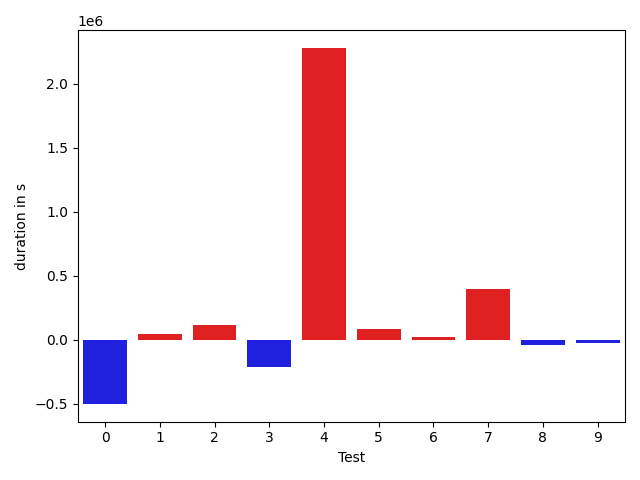

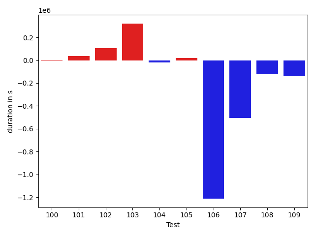

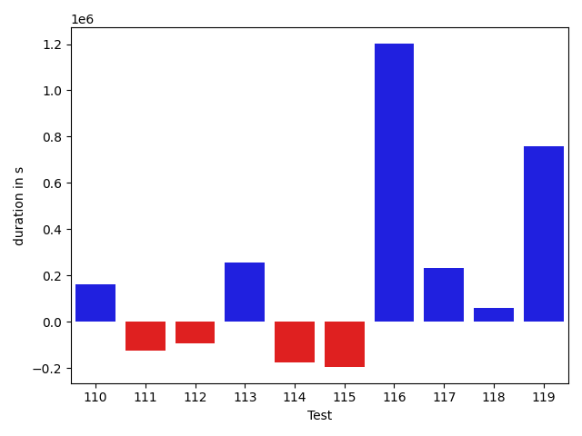

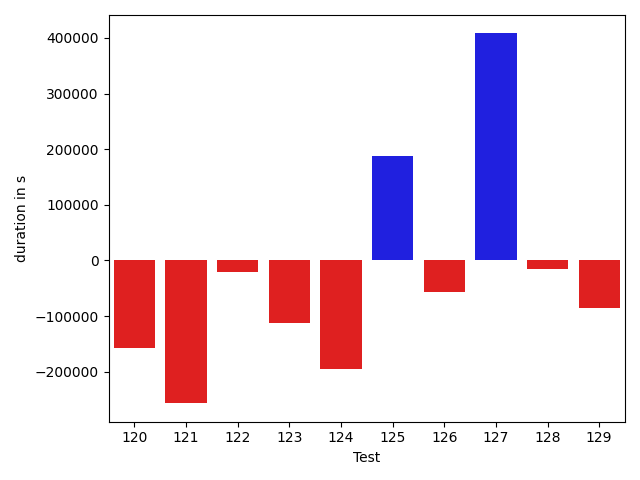

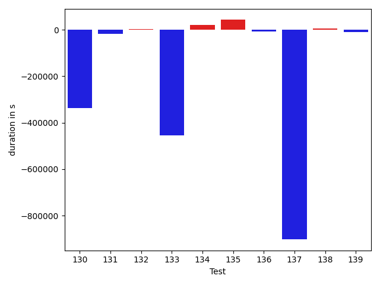

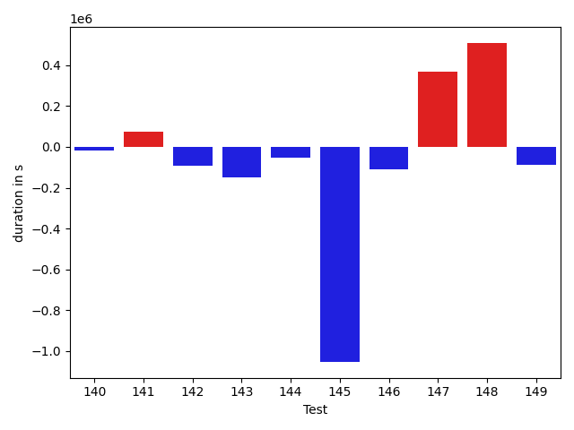

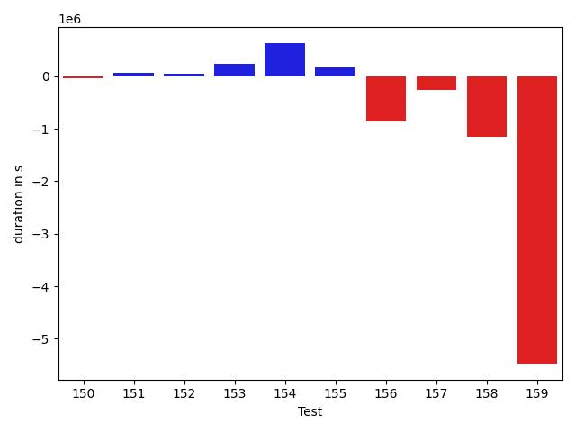

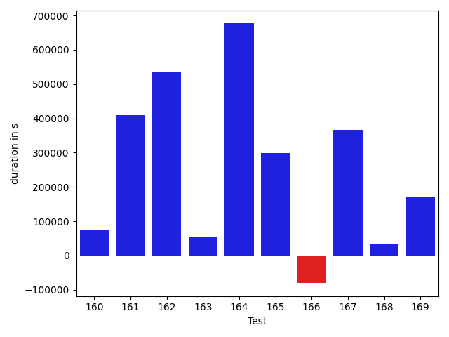

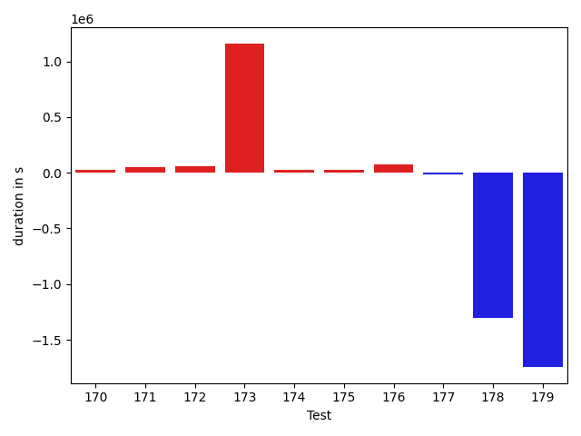

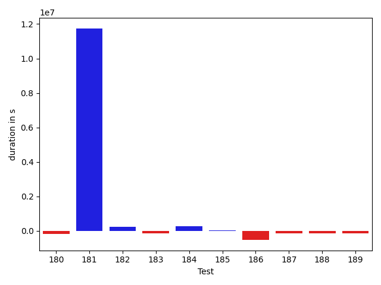

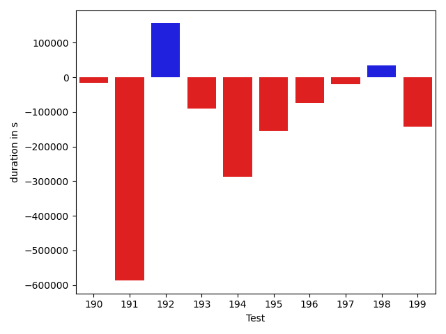

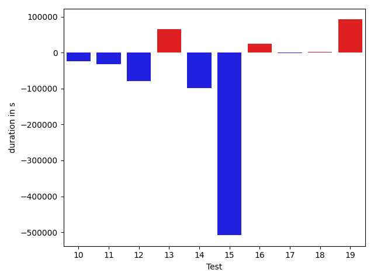

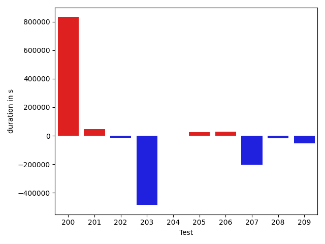

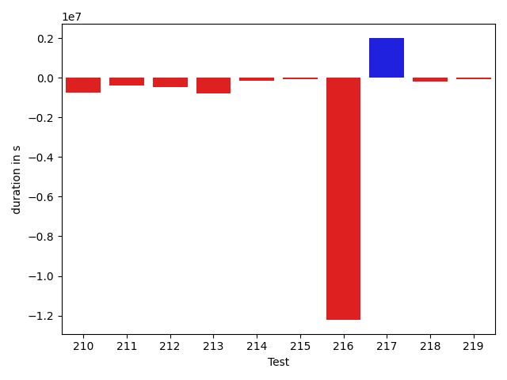

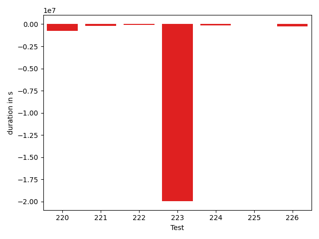

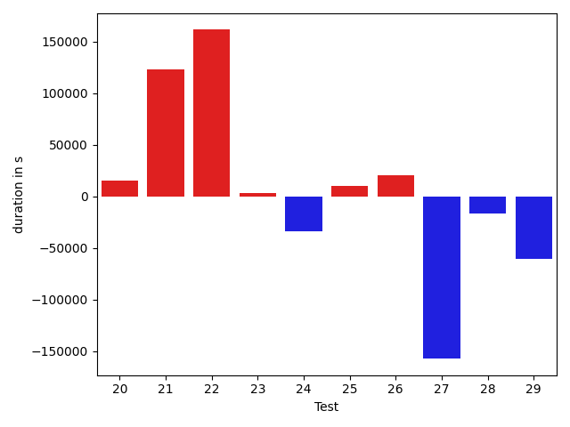

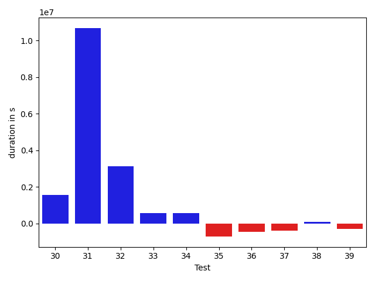

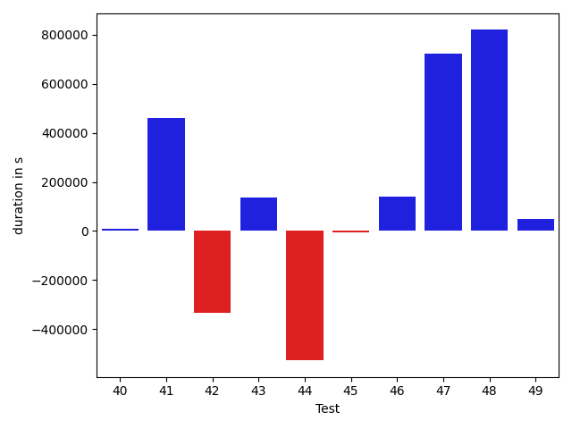

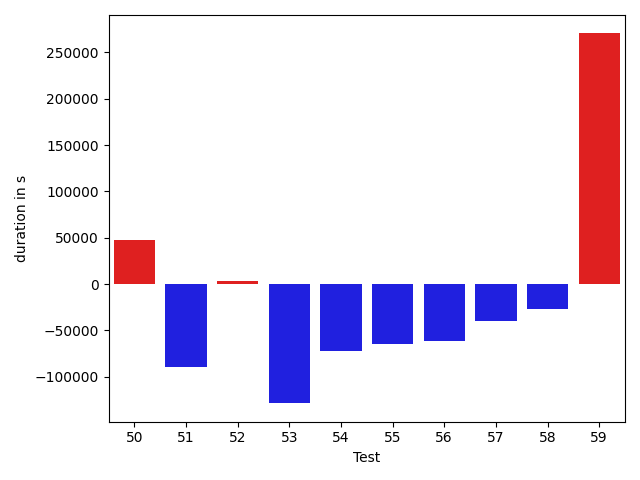

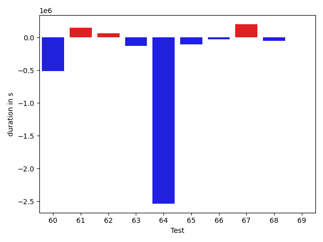

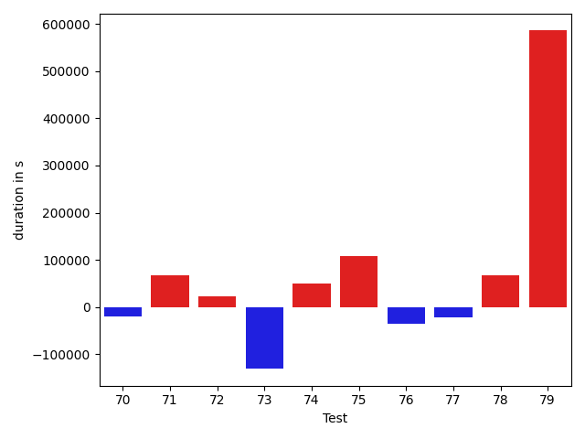

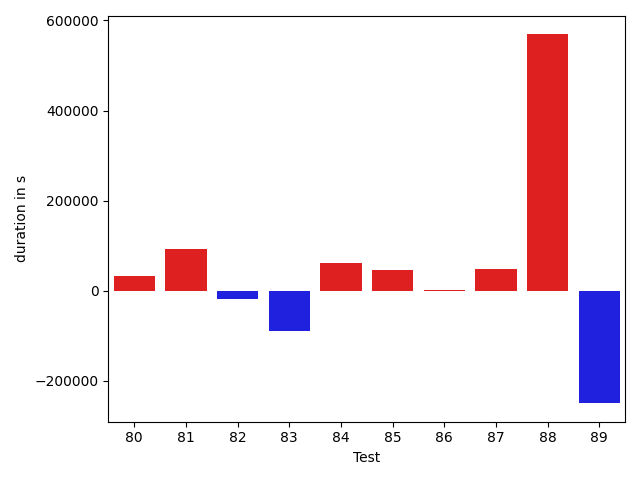

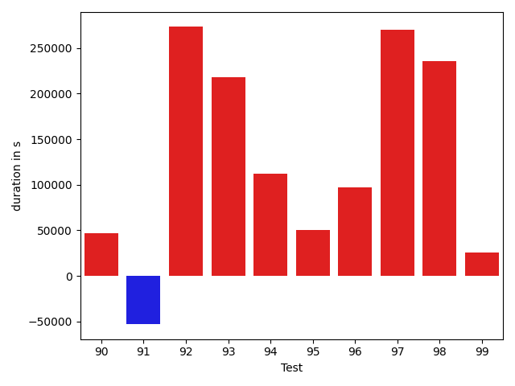

| ID | DurationV1 | DurationsV2 | DeltaDuration |
| --- | --- | --- | --- |
| 0 | 1060829.8242451418 | 936460.9736890178 | -124368.850556124 |
| 1 | 812761.6636286079 | 577745.8977339363 | -235015.76589467155 |
| 2 | 1257656.138414959 | 940440.6201203628 | -317215.5182945961 |
| 3 | 1192996.6136197802 | 945794.395282901 | -247202.21833687916 |
| 4 | 1419729.1392585547 | 1263538.3225989335 | -156190.8166596212 |
| 5 | 683398.7279154982 | 585096.24847617 | -98302.47943932819 |
| 6 | 1058388.4517297514 | 937121.6482183175 | -121266.80351143389 |
| 7 | 728032.8292328393 | 894237.1545949823 | 166204.325362143 |
| 8 | 644863.2712072703 | 543285.2861499218 | -101577.9850573485 |
| 9 | 789614.5099693921 | 946752.445043359 | 157137.93507396686 |
| 10 | 657892.3351892771 | 541916.223915373 | -115976.1112739041 |
| 11 | 681413.8698973088 | 642869.9304932269 | -38543.9394040819 |
| 12 | 1190252.3081765086 | 937007.5291456194 | -253244.77903088927 |
| 13 | 830455.765525667 | 692882.9009392384 | -137572.86458642862 |
| 14 | 949989.6776640236 | 828629.2091045458 | -121360.46855947783 |
| 15 | 982805.8728089887 | 3458893.5032024384 | 2476087.6303934497 |
| 16 | 814317.7480201474 | 647073.1364931418 | -167244.61152700568 |
| 17 | 480136.752822876 | 403350.1663219929 | -76786.5865008831 |
| 18 | 487758.37001657486 | 577166.7929196358 | 89408.42290306091 |
| 19 | 1045909.816300644 | 1199504.0494513765 | 153594.2331507326 |
| 20 | 798135.0002651137 | 982283.6619897394 | 184148.66172462574 |
| 21 | 514167.5159407229 | 645602.1254384969 | 131434.60949777404 |
| 22 | 1719762.279341978 | 1475456.4443732426 | -244305.83496873546 |
| 23 | 1557218.664050443 | 1214367.9875370488 | -342850.67651339434 |
| 24 | 1055003.7346175383 | 789212.6479007985 | -265791.0867167398 |
| 25 | 932016.9312427097 | 715161.0460547046 | -216855.88518800517 |
| 26 | 869414.2461132065 | 682749.8284727434 | -186664.4176404631 |
| 27 | 1048897.8498592752 | 1111483.9863484425 | 62586.136489167344 |
| 28 | 779143.156764132 | 725068.4488414412 | -54074.70792269078 |
| 29 | 683668.0872411306 | 775030.3231670288 | 91362.23592589819 |
| 30 | 1316897.9181497057 | 2872014.0087336656 | 1555116.0905839598 |
| 31 | 10668350.749443393 | 21349020.110072963 | 10680669.36062957 |
| 32 | 1876161.673024054 | 4997019.994505911 | 3120858.3214818574 |
| 33 | 1391472.0132904914 | 1969004.136983612 | 577532.1236931207 |
| 34 | 746361.6912245012 | 1310844.8261046926 | 564483.1348801914 |
| 35 | 2570277.833943977 | 1868596.471942875 | -701681.362001102 |
| 36 | 1856068.0549130265 | 1392202.764729296 | -463865.2901837304 |
| 37 | 1440722.1472660927 | 1041026.9261733652 | -399695.2210927275 |
| 38 | 1076722.1246400643 | 1165819.306353695 | 89097.18171363068 |
| 39 | 1825779.5410062815 | 1552670.1860155384 | -273109.3549907431 |
| 40 | 1060917.3037353721 | 1068753.0867105694 | 7835.782975197304 |
| 41 | 904252.9370041505 | 1366550.9044343934 | 462297.9674302429 |
| 42 | 1354496.6820420413 | 1019975.9091647309 | -334520.7728773104 |
| 43 | 746930.2816530194 | 882882.8347943153 | 135952.5531412959 |
| 44 | 3684513.7233249955 | 3157248.3144980706 | -527265.4088269249 |
| 45 | 614008.2573109965 | 608763.6275097071 | -5244.629801289411 |
| 46 | 860487.0022900107 | 1001116.8383477253 | 140629.83605771465 |
| 47 | 480785.0291748047 | 1205262.6611328125 | 724477.6319580078 |
| 48 | 962655.3442720199 | 1782035.9591703725 | 819380.6148983525 |
| 49 | 331175.1973876953 | 379661.93150520325 | 48486.734117507935 |
| 50 | 702925.747832146 | 1155341.374343827 | 452415.6265116809 |
| 51 | 396939.4296875 | 8578002.573242188 | 8181063.1435546875 |
| 52 | 520535.14265808254 | 771365.5413261149 | 250830.39866803237 |
| 53 | 1208926.149653514 | 1043909.9652038801 | -165016.18444963382 |
| 54 | 3760377.1279032333 | 596314.1669564438 | -3164062.9609467895 |
| 55 | 1023243.5267108778 | 922683.9599051988 | -100559.566805679 |
| 56 | 703755.8200129297 | 694958.4071595749 | -8797.412853354821 |
| 57 | 5055046.1671503335 | 4607618.454506373 | -447427.7126439605 |
| 58 | 637343.740712285 | 468065.9159460068 | -169277.82476627827 |
| 59 | 745543.7083949603 | 647283.441574746 | -98260.26682021422 |
| 60 | 1216356.2786823236 | 989178.0972753081 | -227178.18140701554 |
| 61 | 663966.872529542 | 592921.0027692949 | -71045.86976024706 |
| 62 | 470344.71960518905 | 571451.2524276674 | 101106.53282247833 |
| 63 | 861070.5596301311 | 711337.9702121927 | -149732.58941793838 |
| 64 | 797033.1649613958 | 643420.5450590053 | -153612.61990239052 |
| 65 | 453051.132440567 | 438074.3272309303 | -14976.805209636688 |
| 66 | 578618.4239974022 | 472128.065366745 | -106490.3586306572 |
| 67 | 491766.2546875477 | 381353.8257904053 | -110412.42889714241 |
| 68 | 493714.30704021454 | 386391.3004515171 | -107323.00658869743 |
| 69 | 522925.30781936646 | 703314.2653312683 | 180388.95751190186 |
| 70 | 620826.0229492188 | 407625.3809299469 | -213200.64201927185 |
| 71 | 482904.59621810913 | 495351.677734375 | 12447.08151626587 |
| 72 | 447172.42430114746 | 408671.3042974472 | -38501.120003700256 |
| 73 | 973560.5500312707 | 6741464.559730741 | 5767904.00969947 |
| 74 | 2395827.3959350586 | 429175.94162750244 | -1966651.4543075562 |
| 75 | 324351.06897735596 | 406243.82816696167 | 81892.75918960571 |
| 76 | 433400.30102424696 | 491822.75972099695 | 58422.45869674999 |
| 77 | 375211.5798782855 | 543787.3679585457 | 168575.78808026016 |
| 78 | 321180.1117153168 | 357739.0343017578 | 36558.92258644104 |
| 79 | 488407.28916580044 | 474682.1905057677 | -13725.09866003273 |
| 80 | 384261.094039917 | 873604.7084102631 | 489343.61437034607 |
| 81 | 624465.7756119758 | 610253.1757223957 | -14212.59988958016 |
| 82 | 808188.2500177167 | 777515.803639649 | -30672.446378067718 |
| 83 | 475672.485058967 | 493175.61345597636 | 17503.128397009335 |
| 84 | 713332.3984853663 | 771486.8380634333 | 58154.439578067046 |
| 85 | 684916.7174320222 | 634541.3243620996 | -50375.393069922575 |
| 86 | 871800.5385805429 | 1009599.6841429509 | 137799.14556240803 |
| 87 | 538516.1420740753 | 665085.9206546363 | 126569.77858056105 |
| 88 | 426067.7970508337 | 481656.9477856159 | 55589.15073478222 |
| 89 | 604697.5493343283 | 602570.3171575514 | -2127.232176776859 |
| 90 | 1735446.6323242188 | 1592011.1264648438 | -143435.505859375 |
| 91 | 399909.4475479126 | 439634.1184463501 | 39724.6708984375 |
| 92 | 497152.4245495796 | 391007.1541881561 | -106145.27036142349 |
| 93 | 556184.3089431468 | 717839.0398579347 | 161654.73091478785 |
| 94 | 495947.85595098353 | 482310.91632320924 | -13636.939627774293 |
| 95 | 814093.4839705616 | 541054.0215757401 | -273039.4623948216 |
| 96 | 1748775.0649926725 | 1081973.8596903072 | -666801.2053023654 |
| 97 | 825262.719890147 | 647153.8482878198 | -178108.8716023272 |
| 98 | 587871.8110774443 | 443787.22440373176 | -144084.5866737126 |
| 99 | 548218.4046661807 | 514110.4825653975 | -34107.92210078321 |
| 100 | 696326.1221472288 | 555987.1160266707 | -140339.00612055813 |
| 101 | 3984222.3701691716 | 3181763.007450928 | -802459.3627182436 |
| 102 | 902097.0422198456 | 676960.4549907692 | -225136.58722907642 |
| 103 | 1069505.5750394918 | 701010.952023177 | -368494.6230163148 |
| 104 | 1436408.3535065034 | 884085.7862155606 | -552322.5672909428 |
| 105 | 647086.1936521381 | 388505.09836512804 | -258581.09528701007 |
| 106 | 774998.3941380531 | 467262.5836009993 | -307735.81053705374 |
| 107 | 815244.4708679634 | 499142.214616563 | -316102.2562514004 |
| 108 | 1829367.7510881792 | 425194.38018329453 | -1404173.3709048848 |
| 109 | 442160.8073730469 | 326869.97412109375 | -115290.83325195312 |
| 110 | 1028845.0607988598 | 1189294.2677520195 | 160449.20695315965 |
| 111 | 611151.3440796044 | 485854.82988789404 | -125296.51419171033 |
| 112 | 508683.0930366516 | 413846.2799987793 | -94836.81303787231 |
| 113 | 1188712.335710487 | 1445421.8404860238 | 256709.5047755367 |
| 114 | 1505011.4876389476 | 1327452.4005968063 | -177559.08704214124 |
| 115 | 976363.6784226305 | 780765.4418315198 | -195598.2365911107 |
| 116 | 1480443.8702714932 | 2682654.1551069357 | 1202210.2848354424 |
| 117 | 1141793.5359201413 | 1374525.8634048859 | 232732.3274847446 |
| 118 | 565431.3944005249 | 625357.801563707 | 59926.40716318204 |
| 119 | 834349.7431677008 | 1594517.9782001593 | 760168.2350324584 |
| 120 | 1405731.3832358792 | 1248075.402525071 | -157655.9807108082 |
| 121 | 977654.1246846421 | 721122.6265704979 | -256531.4981141442 |
| 122 | 1004900.496035132 | 984340.2381371275 | -20560.257898004493 |
| 123 | 754283.085246105 | 642381.2648201843 | -111901.82042592065 |
| 124 | 609554.267578125 | 414652.8068847656 | -194901.46069335938 |
| 125 | 2682813.3636661707 | 2870854.1811426813 | 188040.81747651054 |
| 126 | 362286.5310058594 | 305217.3764343262 | -57069.1545715332 |
| 127 | 780935.0741366772 | 1188837.508366601 | 407902.4342299239 |
| 128 | 460058.19546652585 | 444526.7361512482 | -15531.459315277636 |
| 129 | 592112.2492768317 | 505836.30612409115 | -86275.9431527406 |
| 130 | 614610.7060262859 | 747525.0427767427 | 132914.33675045683 |
| 131 | 6291526.952852514 | 4449424.250777183 | -1842102.7020753305 |
| 132 | 602113.7106742859 | 578752.8792352676 | -23360.83143901825 |
| 133 | 1055972.1477225898 | 1937137.9665736593 | 881165.8188510695 |
| 134 | 514280.49338531494 | 384043.9821872711 | -130236.51119804382 |
| 135 | 1049810.673326258 | 1221966.5170273355 | 172155.8437010774 |
| 136 | 488430.5612850881 | 609315.9044709802 | 120885.3431858921 |
| 137 | 1120999.9613587486 | 911062.8494159586 | -209937.11194278998 |
| 138 | 837211.8094874893 | 777348.8215539273 | -59862.98793356202 |
| 139 | 673716.748997758 | 569349.2540974395 | -104367.49490031856 |
| 140 | 1019077.1819835047 | 1014788.7568066686 | -4288.425176836085 |
| 141 | 733616.3427591149 | 1036688.788206212 | 303072.44544709707 |
| 142 | 587877.502099812 | 651093.7369340835 | 63216.23483427148 |
| 143 | 747198.9850409753 | 765304.4120569392 | 18105.42701596394 |
| 144 | 603397.8906559305 | 723756.6720228838 | 120358.78136695328 |
| 145 | 489360.42752075195 | 424272.23224163055 | -65088.1952791214 |
| 146 | 658442.6350898584 | 546802.0609597862 | -111640.57413007226 |
| 147 | 622239.9837138513 | 527777.7781684697 | -94462.20554538164 |
| 148 | 464056.96583890915 | 610303.7976293266 | 146246.83179041743 |
| 149 | 2153428.5662082317 | 1518103.5736806442 | -635324.9925275876 |
| 150 | 1208540.873185946 | 1171491.7653425485 | -37049.10784339742 |
| 151 | 611431.1171114984 | 677935.991007516 | 66504.87389601767 |
| 152 | 773573.358128554 | 828010.922519106 | 54437.564390552 |
| 153 | 950120.0015161997 | 1189108.9538151673 | 238988.95229896763 |
| 154 | 1718108.82924846 | 2347598.7473760108 | 629489.9181275507 |
| 155 | 824527.1198388385 | 989965.5324106949 | 165438.4125718564 |
| 156 | 2461371.432161317 | 1591688.1602788689 | -869683.2718824483 |
| 157 | 1122889.9834217948 | 867821.8212144886 | -255068.16220730625 |
| 158 | 2161905.1010726066 | 1008115.7884578819 | -1153789.3126147247 |
| 159 | 7787064.211078327 | 2314063.7570897928 | -5473000.453988534 |
| 160 | 771374.7474070843 | 845828.50775546 | 74453.76034837565 |
| 161 | 864528.0631795847 | 1274299.7978279344 | 409771.7346483497 |
| 162 | 1075075.911615204 | 1609041.011896528 | 533965.100281324 |
| 163 | 740250.9736536194 | 795070.7016980061 | 54819.72804438672 |
| 164 | 771908.3431129456 | 1448530.1138628349 | 676621.7707498893 |
| 165 | 2263618.8369400613 | 2562414.670844497 | 298795.83390443586 |
| 166 | 908828.5777805727 | 828271.6208655563 | -80556.9569150164 |
| 167 | 615319.0776503047 | 981108.1965176901 | 365789.11886738543 |
| 168 | 732546.4347829805 | 764076.999784271 | 31530.565001290524 |
| 169 | 660187.8455460758 | 830540.9774839091 | 170353.13193783327 |
| 170 | 279046.7147216797 | 585377.7562255859 | 306331.04150390625 |
| 171 | 624944.1991161554 | 1292686.5181157151 | 667742.3189995597 |
| 172 | 339783.26618385315 | 663957.985168457 | 324174.7189846039 |
| 173 | 397344.609375 | 424342.5258483887 | 26997.916473388672 |
| 174 | 416018.09033584595 | 362718.75863194466 | -53299.33170390129 |
| 175 | 398266.12451934814 | 328137.38677978516 | -70128.73773956299 |
| 176 | 388624.7250366211 | 401088.9807815552 | 12464.255744934082 |
| 177 | 405171.47637939453 | 350771.734375 | -54399.74200439453 |
| 178 | 414921.2105407715 | 348143.921875 | -66777.28866577148 |
| 179 | 311280.2990722656 | 411873.0146484375 | 100592.71557617188 |
| 180 | 1117760.2803354983 | 943225.7981899106 | -174534.48214558768 |
| 181 | 2956417.697734721 | 14698889.689613352 | 11742471.99187863 |
| 182 | 1233116.2463098303 | 1459157.659057604 | 226041.41274777357 |
| 183 | 1063633.1047366005 | 920084.4303908085 | -143548.67434579204 |
| 184 | 1026961.0398483605 | 1278228.869441254 | 251267.8295928936 |
| 185 | 396313.22351795435 | 400808.5172777176 | 4495.293759763241 |
| 186 | 1208160.102429992 | 677139.2773163279 | -531020.8251136641 |
| 187 | 897649.0699873053 | 758959.74618286 | -138689.32380444533 |
| 188 | 1736879.8274024478 | 1592910.7947407013 | -143969.0326617465 |
| 189 | 520584.23921203613 | 379618.86800289154 | -140965.3712091446 |
| 190 | 972287.4066696125 | 956685.0032673964 | -15602.40340221615 |
| 191 | 1734532.870117479 | 1147384.5922304352 | -587148.2778870438 |
| 192 | 787981.5287859358 | 943759.096013492 | 155777.56722755614 |
| 193 | 595112.4038952366 | 505019.2630434744 | -90093.14085176215 |
| 194 | 866622.145988663 | 579528.5730679056 | -287093.57292075735 |
| 195 | 534077.7012895644 | 379724.22859221697 | -154353.4726973474 |
| 196 | 502331.8801765442 | 428538.92642789334 | -73792.95374865085 |
| 197 | 425515.76737618446 | 405619.86392211914 | -19895.903454065323 |
| 198 | 371211.0111236572 | 405250.7939453125 | 34039.78282165527 |
| 199 | 621407.4289894104 | 478846.3391723633 | -142561.08981704712 |
| 200 | 492359.1707662344 | 388043.7332993597 | -104315.43746687472 |
| 201 | 509225.1869665212 | 499608.6665918529 | -9616.520374668296 |
| 202 | 2747157.343545428 | 2634698.253335038 | -112459.09021038981 |
| 203 | 727156.4190302072 | 678988.2429109983 | -48168.17611920892 |
| 204 | 572018.6867022355 | 526312.6640107405 | -45706.02269149502 |
| 205 | 641720.0665390552 | 608818.2031968124 | -32901.86334224278 |
| 206 | 483160.6542162895 | 550168.0602769852 | 67007.40606069565 |
| 207 | 452984.1430837214 | 596405.5270360522 | 143421.3839523308 |
| 208 | 359912.91064453125 | 423289.69606018066 | 63376.785415649414 |
| 209 | 452519.97856235504 | 434643.9699707031 | -17876.008591651917 |
| 210 | 1293674.3963673648 | 545103.4753787306 | -748570.9209886342 |
| 211 | 1440781.214139872 | 1061623.051834439 | -379158.16230543307 |
| 212 | 1859765.2514319813 | 1397187.763056955 | -462577.48837502627 |
| 213 | 6570852.536302591 | 5802110.588176658 | -768741.9481259324 |
| 214 | 645110.5748554581 | 504606.36288613593 | -140504.21196932218 |
| 215 | 552463.1640277356 | 498766.65560531616 | -53696.50842241943 |
| 216 | 13280249.867603932 | 1064085.8452416873 | -12216164.022362243 |
| 217 | 1422598.9688055404 | 3440278.1922175023 | 2017679.223411962 |
| 218 | 1045627.8879717247 | 848828.8499206869 | -196799.03805103782 |
| 219 | 450821.5161476135 | 394805.26746463776 | -56016.24868297577 |
| 220 | 1133135.7992591858 | 400043.2137670517 | -733092.5854921341 |
| 221 | 571450.499168396 | 370984.1963119507 | -200466.3028564453 |
| 222 | 395642.19177246094 | 315875.9736261368 | -79766.21814632416 |
| 223 | 20316256.370579004 | 367103.91455078125 | -19949152.456028223 |
| 224 | 824731.8427284926 | 658245.7614682524 | -166486.08126024017 |
| 225 | 404547.1226902008 | 433915.4288330078 | 29368.306142807007 |
| 226 | 1039159.3537654653 | 799116.2205043909 | -240043.13326107443 |

## Misc.

| ID | Test Class | Test Method |
| --- | --- | --- |
| 0 | com.google.gson.functional.CustomTypeAdaptersTest | testCustomAdapterInvokedForCollectionElementDeserialization |
| 1 | com.google.gson.functional.CustomTypeAdaptersTest | testCustomTypeAdapterAppliesToSubClassesSerializedAsBaseClass |
| 2 | com.google.gson.functional.CustomTypeAdaptersTest | testCustomTypeAdapterDoesNotAppliesToSubClasses |
| 3 | com.google.gson.functional.CustomTypeAdaptersTest | testRegisterHierarchyAdapterForDate |
| 4 | com.google.gson.functional.CustomTypeAdaptersTest | testCustomAdapterInvokedForCollectionElementSerializationWithType |
| 5 | com.google.gson.functional.CustomTypeAdaptersTest | testCustomByteArraySerializer |
| 6 | com.google.gson.functional.CustomTypeAdaptersTest | testEnsureCustomSerializerNotInvokedForNullValues |
| 7 | com.google.gson.functional.CustomTypeAdaptersTest | testEnsureCustomDeserializerNotInvokedForNullValues |
| 8 | com.google.gson.functional.CustomTypeAdaptersTest | testCustomDeserializerInvokedForPrimitives |
| 9 | com.google.gson.functional.CustomTypeAdaptersTest | testCustomDeserializers |
| 10 | com.google.gson.functional.CustomTypeAdaptersTest | testCustomSerializerInvokedForPrimitives |
| 11 | com.google.gson.functional.CustomTypeAdaptersTest | testCustomByteArrayDeserializerAndInstanceCreator |
| 12 | com.google.gson.functional.CustomTypeAdaptersTest | testCustomAdapterInvokedForMapElementSerializationWithType |
| 13 | com.google.gson.functional.CustomTypeAdaptersTest | testCustomNestedDeserializers |
| 14 | com.google.gson.functional.CustomTypeAdaptersTest | testCustomNestedSerializers |
| 15 | com.google.gson.functional.CustomTypeAdaptersTest | testCustomSerializers |
| 16 | com.google.gson.functional.CustomTypeAdaptersTest | testCustomAdapterInvokedForMapElementDeserialization |
| 17 | com.google.gson.functional.CustomTypeAdaptersTest | testCustomAdapterInvokedForMapElementSerialization |
| 18 | com.google.gson.functional.CustomTypeAdaptersTest | testCustomAdapterInvokedForCollectionElementSerialization |
| 19 | com.google.gson.functional.StreamingTypeAdaptersTest | testNullSafe |
| 20 | com.google.gson.functional.StreamingTypeAdaptersTest | testSerializeWithCustomTypeAdapter |
| 21 | com.google.gson.functional.StreamingTypeAdaptersTest | testDeserializeWithCustomTypeAdapter |
| 22 | com.google.gson.functional.JsonAdapterAnnotationOnClassesTest | testJsonAdapterInvoked |
| 23 | com.google.gson.functional.JsonAdapterAnnotationOnClassesTest | testRegisteredDeserializerOverridesJsonAdapter |
| 24 | com.google.gson.functional.JsonAdapterAnnotationOnClassesTest | testSuperclassTypeAdapterNotInvoked |
| 25 | com.google.gson.functional.JsonAdapterAnnotationOnClassesTest | testNullSafeObjectFromJson |
| 26 | com.google.gson.functional.JsonAdapterAnnotationOnClassesTest | testIncorrectTypeAdapterFails |
| 27 | com.google.gson.functional.JsonAdapterAnnotationOnClassesTest | testJsonAdapterFactoryInvoked |
| 28 | com.google.gson.functional.JsonAdapterAnnotationOnClassesTest | testRegisteredAdapterOverridesJsonAdapter |
| 29 | com.google.gson.functional.JsonAdapterAnnotationOnClassesTest | testRegisteredSerializerOverridesJsonAdapter |
| 30 | com.google.gson.functional.InstanceCreatorTest | testInstanceCreatorForParametrizedType |
| 31 | com.google.gson.functional.InstanceCreatorTest | testInstanceCreatorReturnsBaseType |
| 32 | com.google.gson.functional.InstanceCreatorTest | testInstanceCreatorReturnsSubTypeForField |
| 33 | com.google.gson.functional.InstanceCreatorTest | testInstanceCreatorForCollectionType |
| 34 | com.google.gson.functional.InstanceCreatorTest | testInstanceCreatorReturnsSubTypeForTopLevelObject |
| 35 | com.google.gson.functional.JsonAdapterSerializerDeserializerTest | testJsonSerializerDeserializerBasedJsonAdapterOnFields |
| 36 | com.google.gson.functional.JsonAdapterSerializerDeserializerTest | testDifferentJsonAdaptersForGenericFieldsOfSameRawType |
| 37 | com.google.gson.functional.JsonAdapterSerializerDeserializerTest | testJsonSerializerDeserializerBasedJsonAdapterOnClass |
| 38 | com.google.gson.functional.MapTest | testSerializeMaps |
| 39 | com.google.gson.functional.MapTest | testInterfaceTypeMapWithSerializer |
| 40 | com.google.gson.functional.MapTest | testMapSubclassDeserialization |
| 41 | com.google.gson.functional.MapTest | testCustomSerializerForSpecificMapType |
| 42 | com.google.gson.functional.MapTest | testGeneralMapField |
| 43 | com.google.gson.functional.MapTest | testMapSerializationWithNullValueButSerializeNulls |
| 44 | com.google.gson.functional.MapTest | testInterfaceTypeMap |
| 45 | com.google.gson.functional.MapTest | testMapSerializationWithNullValuesSerialized |
| 46 | com.google.gson.functional.ReadersWritersTest | testReadWriteTwoObjects |
| 47 | com.google.gson.functional.ReadersWritersTest | testTopLevelNullObjectSerializationWithWriterAndSerializeNulls |
| 48 | com.google.gson.functional.ReadersWritersTest | testReadWriteTwoStrings |
| 49 | com.google.gson.functional.ReadersWritersTest | testTopLevelNullObjectDeserializationWithReaderAndSerializeNulls |
| 50 | com.google.gson.GsonBuilderTest | testExcludeFieldsWithModifiers |
| 51 | com.google.gson.GsonBuilderTest | testCreatingMoreThanOnce |
| 52 | com.google.gson.GsonBuilderTest | testTransientFieldExclusion |
| 53 | com.google.gson.functional.DefaultTypeAdaptersTest | testDateSerializationWithPattern |
| 54 | com.google.gson.functional.DefaultTypeAdaptersTest | testSqlDateSerialization |
| 55 | com.google.gson.functional.DefaultTypeAdaptersTest | testClassSerialization |
| 56 | com.google.gson.functional.DefaultTypeAdaptersTest | testTimestampSerialization |
| 57 | com.google.gson.functional.DefaultTypeAdaptersTest | testDefaultDateDeserializationUsingBuilder |
| 58 | com.google.gson.functional.DefaultTypeAdaptersTest | testOverrideBigDecimalTypeAdapter |
| 59 | com.google.gson.functional.DefaultTypeAdaptersTest | testDateDeserializationWithPattern |
| 60 | com.google.gson.functional.DefaultTypeAdaptersTest | testDateSerializationInCollection |
| 61 | com.google.gson.functional.DefaultTypeAdaptersTest | testDateSerializationWithPatternNotOverridenByTypeAdapter |
| 62 | com.google.gson.functional.DefaultTypeAdaptersTest | testBitSetDeserialization |
| 63 | com.google.gson.functional.DefaultTypeAdaptersTest | testOverrideBigIntegerTypeAdapter |
| 64 | com.google.gson.functional.DefaultTypeAdaptersTest | testSetSerialization |
| 65 | com.google.gson.functional.DefaultTypeAdaptersTest | testBitSetSerialization |
| 66 | com.google.gson.functional.DefaultTypeAdaptersTest | testDefaultCalendarDeserialization |
| 67 | com.google.gson.functional.DefaultTypeAdaptersTest | testDefaultGregorianCalendarDeserialization |
| 68 | com.google.gson.functional.DefaultTypeAdaptersTest | testDefaultCalendarSerialization |
| 69 | com.google.gson.functional.DefaultTypeAdaptersTest | testClassDeserialization |
| 70 | com.google.gson.functional.DefaultTypeAdaptersTest | testDefaultGregorianCalendarSerialization |
| 71 | com.google.gson.functional.TypeAdapterPrecedenceTest | testStreamingHierarchicalFollowedByNonstreaming |
| 72 | com.google.gson.functional.TypeAdapterPrecedenceTest | testNonstreamingHierarchicalFollowedByNonstreaming |
| 73 | com.google.gson.functional.TypeAdapterPrecedenceTest | testNonstreamingFollowedByNonstreaming |
| 74 | com.google.gson.functional.TypeAdapterPrecedenceTest | testStreamingFollowedByNonstreaming |
| 75 | com.google.gson.functional.TypeAdapterPrecedenceTest | testSerializeNonstreamingTypeAdapterFollowedByStreamingTypeAdapter |
| 76 | com.google.gson.functional.TypeAdapterPrecedenceTest | testStreamingFollowedByStreaming |
| 77 | com.google.gson.functional.TypeAdapterPrecedenceTest | testStreamingHierarchicalFollowedByNonstreamingHierarchical |
| 78 | com.google.gson.functional.TypeAdapterPrecedenceTest | testStreamingFollowedByNonstreamingHierarchical |
| 79 | com.google.gson.functional.NullObjectAndFieldTest | testExplicitSerializationOfNullStringMembers |
| 80 | com.google.gson.functional.NullObjectAndFieldTest | testTopLevelNullObjectDeserialization |
| 81 | com.google.gson.functional.NullObjectAndFieldTest | testCustomSerializationOfNulls |
| 82 | com.google.gson.functional.NullObjectAndFieldTest | testPrintPrintingObjectWithNulls |
| 83 | com.google.gson.functional.NullObjectAndFieldTest | testExplicitDeserializationOfNulls |
| 84 | com.google.gson.functional.NullObjectAndFieldTest | testAbsentJsonElementsAreSetToNull |
| 85 | com.google.gson.functional.NullObjectAndFieldTest | testExplicitNullSetsFieldToNullDuringDeserialization |
| 86 | com.google.gson.functional.NullObjectAndFieldTest | testExplicitSerializationOfNullArrayMembers |
| 87 | com.google.gson.functional.NullObjectAndFieldTest | testCustomTypeAdapterPassesNullDesrialization |
| 88 | com.google.gson.functional.NullObjectAndFieldTest | testNullWrappedPrimitiveMemberDeserialization |
| 89 | com.google.gson.functional.NullObjectAndFieldTest | testNullWrappedPrimitiveMemberSerialization |
| 90 | com.google.gson.functional.NullObjectAndFieldTest | testTopLevelNullObjectSerialization |
| 91 | com.google.gson.functional.NullObjectAndFieldTest | testCustomTypeAdapterPassesNullSerialization |
| 92 | com.google.gson.functional.NullObjectAndFieldTest | testPrintPrintingArraysWithNulls |
| 93 | com.google.gson.functional.NullObjectAndFieldTest | testExplicitSerializationOfNulls |
| 94 | com.google.gson.functional.NullObjectAndFieldTest | testExplicitSerializationOfNullCollectionMembers |
| 95 | com.google.gson.functional.CustomSerializerTest | testSerializerReturnsNull |
| 96 | com.google.gson.functional.CustomSerializerTest | testSubClassSerializerInvokedForBaseClassFieldsHoldingSubClassInstances |
| 97 | com.google.gson.functional.CustomSerializerTest | testSubClassSerializerInvokedForBaseClassFieldsHoldingArrayOfSubClassInstances |
| 98 | com.google.gson.functional.CustomSerializerTest | testBaseClassSerializerInvokedForBaseClassFieldsHoldingSubClassInstances |
| 99 | com.google.gson.functional.CustomSerializerTest | testBaseClassSerializerInvokedForBaseClassFields |
| 100 | com.google.gson.functional.VersioningTest | testVersionedGsonMixingSinceAndUntilDeserialization |
| 101 | com.google.gson.functional.VersioningTest | testVersionedUntilSerialization |
| 102 | com.google.gson.functional.VersioningTest | testIgnoreLaterVersionClassSerialization |
| 103 | com.google.gson.functional.VersioningTest | testVersionedClassesSerialization |
| 104 | com.google.gson.functional.VersioningTest | testVersionedGsonMixingSinceAndUntilSerialization |
| 105 | com.google.gson.functional.VersioningTest | testVersionedUntilDeserialization |
| 106 | com.google.gson.functional.VersioningTest | testVersionedClassesDeserialization |
| 107 | com.google.gson.functional.VersioningTest | testVersionedGsonWithUnversionedClassesSerialization |
| 108 | com.google.gson.functional.VersioningTest | testVersionedGsonWithUnversionedClassesDeserialization |
| 109 | com.google.gson.functional.VersioningTest | testIgnoreLaterVersionClassDeserialization |
| 110 | com.google.gson.functional.FieldExclusionTest | testDefaultInnerClassExclusion |
| 111 | com.google.gson.functional.FieldExclusionTest | testDefaultNestedStaticClassIncluded |
| 112 | com.google.gson.functional.FieldExclusionTest | testInnerClassExclusion |
| 113 | com.google.gson.functional.JsonAdapterAnnotationOnFieldsTest | testPrimitiveFieldAnnotationTakesPrecedenceOverDefault |
| 114 | com.google.gson.functional.JsonAdapterAnnotationOnFieldsTest | testClassAnnotationAdapterFactoryTakesPrecedenceOverDefault |
| 115 | com.google.gson.functional.JsonAdapterAnnotationOnFieldsTest | testJsonAdapterWrappedInNullSafeAsRequested |
| 116 | com.google.gson.functional.JsonAdapterAnnotationOnFieldsTest | testClassAnnotationAdapterTakesPrecedenceOverDefault |
| 117 | com.google.gson.functional.JsonAdapterAnnotationOnFieldsTest | testFieldAnnotationWorksForParameterizedType |
| 118 | com.google.gson.functional.JsonAdapterAnnotationOnFieldsTest | testNonPrimitiveFieldAnnotationTakesPrecedenceOverDefault |
| 119 | com.google.gson.functional.JsonAdapterAnnotationOnFieldsTest | testJsonAdapterInvokedOnlyForAnnotatedFields |
| 120 | com.google.gson.functional.JsonAdapterAnnotationOnFieldsTest | testFieldAnnotationTakesPrecedenceOverRegisteredTypeAdapter |
| 121 | com.google.gson.functional.JsonAdapterAnnotationOnFieldsTest | testRegisteredTypeAdapterTakesPrecedenceOverClassAnnotationAdapter |
| 122 | com.google.gson.functional.JsonAdapterAnnotationOnFieldsTest | testFieldAnnotationTakesPrecedenceOverClassAnnotation |
| 123 | com.google.gson.functional.TypeHierarchyAdapterTest | testRegisterSuperTypeFirst |
| 124 | com.google.gson.functional.TypeHierarchyAdapterTest | testRegisterSubTypeFirstAllowed |
| 125 | com.google.gson.functional.TypeHierarchyAdapterTest | testTypeHierarchy |
| 126 | com.google.gson.functional.SecurityTest | testJsonWithNonExectuableTokenSerialization |
| 127 | com.google.gson.functional.SecurityTest | testNonExecutableJsonSerialization |
| 128 | com.google.gson.functional.SecurityTest | testJsonWithNonExectuableTokenWithConfiguredGsonDeserialization |
| 129 | com.google.gson.functional.SecurityTest | testJsonWithNonExectuableTokenWithRegularGsonDeserialization |
| 130 | com.google.gson.functional.SecurityTest | testNonExecutableJsonDeserialization |
| 131 | com.google.gson.functional.RuntimeTypeAdapterFactoryFunctionalTest | testSubclassesAutomaticallySerialized |
| 132 | com.google.gson.OverrideCoreTypeAdaptersTest | testOverridePrimitiveBooleanAdapter |
| 133 | com.google.gson.OverrideCoreTypeAdaptersTest | testOverrideWrapperBooleanAdapter |
| 134 | com.google.gson.OverrideCoreTypeAdaptersTest | testOverrideStringAdapter |
| 135 | com.google.gson.functional.NamingPolicyTest | testGsonDuplicateNameUsingSerializedNameFieldNamingPolicySerialization |
| 136 | com.google.gson.functional.NamingPolicyTest | testGsonWithLowerCaseUnderscorePolicySerialization |
| 137 | com.google.gson.functional.NamingPolicyTest | testComplexFieldNameStrategy |
| 138 | com.google.gson.functional.NamingPolicyTest | testDeprecatedNamingStrategy |
| 139 | com.google.gson.functional.NamingPolicyTest | testGsonWithNonDefaultFieldNamingPolicySerialization |
| 140 | com.google.gson.functional.NamingPolicyTest | testGsonWithSerializedNameFieldNamingPolicySerialization |
| 141 | com.google.gson.functional.NamingPolicyTest | testGsonWithNonDefaultFieldNamingPolicyDeserialiation |
| 142 | com.google.gson.functional.NamingPolicyTest | testGsonWithUpperCamelCaseSpacesPolicyDeserialiation |
| 143 | com.google.gson.functional.NamingPolicyTest | testAtSignInSerializedName |
| 144 | com.google.gson.functional.NamingPolicyTest | testGsonWithLowerCaseDashPolicyDeserialiation |
| 145 | com.google.gson.functional.NamingPolicyTest | testGsonWithSerializedNameFieldNamingPolicyDeserialization |
| 146 | com.google.gson.functional.NamingPolicyTest | testGsonWithUpperCamelCaseSpacesPolicySerialiation |
| 147 | com.google.gson.functional.NamingPolicyTest | testGsonWithLowerCaseDashPolicySerialization |
| 148 | com.google.gson.functional.NamingPolicyTest | testGsonWithLowerCaseUnderscorePolicyDeserialiation |
| 149 | com.google.gson.functional.TypeVariableTest | testAdvancedTypeVariables |
| 150 | com.google.gson.functional.TypeVariableTest | testTypeVariablesViaTypeParameter |
| 151 | com.google.gson.functional.TypeVariableTest | testBasicTypeVariables |
| 152 | com.google.gson.functional.ParameterizedTypesTest | testParameterizedTypeWithReaderDeserialization |
| 153 | com.google.gson.functional.ParameterizedTypesTest | testParameterizedTypeWithCustomSerializer |
| 154 | com.google.gson.functional.ParameterizedTypesTest | testParameterizedTypeDeserialization |
| 155 | com.google.gson.functional.ParameterizedTypesTest | testParameterizedTypesWithCustomDeserializer |
| 156 | com.google.gson.functional.CustomDeserializerTest | testJsonTypeFieldBasedDeserialization |
| 157 | com.google.gson.functional.CustomDeserializerTest | testCustomDeserializerReturnsNullForArrayElements |
| 158 | com.google.gson.functional.CustomDeserializerTest | testCustomDeserializerReturnsNullForArrayElementsForArrayField |
| 159 | com.google.gson.functional.CustomDeserializerTest | testCustomDeserializerReturnsNull |
| 160 | com.google.gson.functional.CustomDeserializerTest | testCustomDeserializerReturnsNullForTopLevelObject |
| 161 | com.google.gson.functional.ObjectTest | testAnonymousLocalClassesCustomSerialization |
| 162 | com.google.gson.functional.ObjectTest | testSingletonLists |
| 163 | com.google.gson.functional.ObjectTest | testInnerClassDeserialization |
| 164 | com.google.gson.functional.ObjectTest | testJsonObjectSerialization |
| 165 | com.google.gson.functional.FieldNamingTest | testIdentity |
| 166 | com.google.gson.functional.FieldNamingTest | testUpperCamelCaseWithSpaces |
| 167 | com.google.gson.functional.FieldNamingTest | testLowerCaseWithDashes |
| 168 | com.google.gson.functional.FieldNamingTest | testLowerCaseWithUnderscores |
| 169 | com.google.gson.functional.FieldNamingTest | testUpperCamelCase |
| 170 | com.google.gson.functional.PrimitiveTest | testFloatInfinitySerialization |
| 171 | com.google.gson.functional.PrimitiveTest | testMoreSpecificSerialization |
| 172 | com.google.gson.functional.PrimitiveTest | testDoubleNaNSerialization |
| 173 | com.google.gson.functional.PrimitiveTest | testDoubleInfinitySerialization |
| 174 | com.google.gson.functional.PrimitiveTest | testLongAsStringDeserialization |
| 175 | com.google.gson.functional.PrimitiveTest | testHtmlCharacterSerialization |
| 176 | com.google.gson.functional.PrimitiveTest | testLongAsStringSerialization |
| 177 | com.google.gson.functional.PrimitiveTest | testNegativeInfinityFloatSerialization |
| 178 | com.google.gson.functional.PrimitiveTest | testFloatNaNSerialization |
| 179 | com.google.gson.functional.PrimitiveTest | testNegativeInfinitySerialization |
| 180 | com.google.gson.functional.MapAsArrayTypeAdapterTest | testMapWithTypeVariableDeserialization |
| 181 | com.google.gson.functional.MapAsArrayTypeAdapterTest | testSerializeComplexMapWithTypeAdapter |
| 182 | com.google.gson.functional.MapAsArrayTypeAdapterTest | testMapWithTypeVariableSerialization |
| 183 | com.google.gson.functional.MapAsArrayTypeAdapterTest | testMultipleEnableComplexKeyRegistrationHasNoEffect |
| 184 | com.google.gson.functional.MapAsArrayTypeAdapterTest | testTwoTypesCollapseToOneDeserialize |
| 185 | com.google.gson.functional.JavaUtilConcurrentAtomicTest | testAtomicLongArrayWithStringSerializationPolicy |
| 186 | com.google.gson.functional.JavaUtilConcurrentAtomicTest | testAtomicLongWithStringSerializationPolicy |
| 187 | com.google.gson.CommentsTest | testParseComments |
| 188 | com.google.gson.functional.UncategorizedTest | testReturningDerivedClassesDuringDeserialization |
| 189 | com.google.gson.MixedStreamTest | testWriteInvalidState |
| 190 | com.google.gson.MixedStreamTest | testWriteHtmlSafe |
| 191 | com.google.gson.MixedStreamTest | testWriteLenient |
| 192 | com.google.gson.MixedStreamTest | testWriteMixedStreamed |
| 193 | com.google.gson.MixedStreamTest | testReadMixedStreamed |
| 194 | com.google.gson.MixedStreamTest | testReadClosed |
| 195 | com.google.gson.MixedStreamTest | testReaderDoesNotMutateState |
| 196 | com.google.gson.MixedStreamTest | testReadInvalidState |
| 197 | com.google.gson.MixedStreamTest | testReadNulls |
| 198 | com.google.gson.MixedStreamTest | testWriteNulls |
| 199 | com.google.gson.MixedStreamTest | testWriteDoesNotMutateState |
| 200 | com.google.gson.MixedStreamTest | testWriteClosed |
| 201 | com.google.gson.functional.ExclusionStrategyFunctionalTest | testExcludeTopLevelClassSerializationDoesNotImpactDeserialization |
| 202 | com.google.gson.functional.ExclusionStrategyFunctionalTest | testExclusionStrategySerialization |
| 203 | com.google.gson.functional.ExclusionStrategyFunctionalTest | testExclusionStrategyWithMode |
| 204 | com.google.gson.functional.ExclusionStrategyFunctionalTest | testExclusionStrategySerializationDoesNotImpactDeserialization |
| 205 | com.google.gson.functional.ExclusionStrategyFunctionalTest | testExclusionStrategyDeserialization |
| 206 | com.google.gson.functional.ExclusionStrategyFunctionalTest | testExcludeTopLevelClassDeserializationDoesNotImpactSerialization |
| 207 | com.google.gson.functional.ExclusionStrategyFunctionalTest | testExclusionStrategySerializationDoesNotImpactSerialization |
| 208 | com.google.gson.functional.ExclusionStrategyFunctionalTest | testExcludeTopLevelClassDeserialization |
| 209 | com.google.gson.functional.ExclusionStrategyFunctionalTest | testExcludeTopLevelClassSerialization |
| 210 | com.google.gson.regression.JsonAdapterNullSafeTest | testNullSafeBugDeserialize |
| 211 | com.google.gson.regression.JsonAdapterNullSafeTest | testNullSafeBugSerialize |
| 212 | com.google.gson.GsonTypeAdapterTest | testDeserializerForAbstractClass |
| 213 | com.google.gson.functional.CircularReferenceTest | testSelfReferenceCustomHandlerSerialization |
| 214 | com.google.gson.LongSerializationPolicyTest | testDefaultLongSerializationIntegration |
| 215 | com.google.gson.LongSerializationPolicyTest | testStringLongSerializationIntegration |
| 216 | com.google.gson.JsonParserTest | testReadWriteTwoObjects |
| 217 | com.google.gson.functional.EnumTest | testEnumSubclassWithRegisteredTypeAdapter |
| 218 | com.google.gson.functional.CollectionTest | testUserCollectionTypeAdapter |
| 219 | com.google.gson.functional.ArrayTest | testArrayElementsAreArrays |
| 220 | com.google.gson.functional.ArrayTest | testNullsInArrayWithSerializeNullPropertySetSerialization |
| 221 | com.google.gson.functional.PrintFormattingTest | testJsonObjectWithNullValuesSerialized |
| 222 | com.google.gson.JsonObjectTest | testWritePropertyWithEmptyStringName |
| 223 | com.google.gson.JsonObjectTest | testPropertyWithQuotes |
| 224 | com.google.gson.DefaultMapJsonSerializerTest | testNonEmptyMapSerialization |
| 225 | com.google.gson.GsonTest | testOverridesDefaultExcluder |
| 226 | com.google.gson.functional.EscapingTest | testGsonAcceptsEscapedAndNonEscapedJsonDeserialization |

| Test | IterationV1 | IterationV2 | DeltaIteration |
| --- | --- | --- | --- |
| 0 | 51 | 62 | 11 |
| 1 | 52 | 42 | -10 |
| 2 | 82 | 81 | -1 |
| 3 | 70 | 63 | -7 |
| 4 | 83 | 81 | -2 |
| 5 | 49 | 41 | -8 |
| 6 | 76 | 84 | 8 |
| 7 | 54 | 63 | 9 |
| 8 | 41 | 37 | -4 |
| 9 | 54 | 42 | -12 |
| 10 | 41 | 35 | -6 |
| 11 | 47 | 46 | -1 |
| 12 | 51 | 52 | 1 |
| 13 | 44 | 58 | 14 |
| 14 | 57 | 53 | -4 |
| 15 | 60 | 57 | -3 |
| 16 | 43 | 47 | 4 |
| 17 | 17 | 23 | 6 |
| 18 | 24 | 22 | -2 |
| 19 | 84 | 84 | 0 |
| 20 | 63 | 71 | 8 |
| 21 | 34 | 34 | 0 |
| 22 | 99 | 99 | 0 |
| 23 | 90 | 86 | -4 |
| 24 | 46 | 47 | 1 |
| 25 | 64 | 63 | -1 |
| 26 | 43 | 50 | 7 |
| 27 | 81 | 84 | 3 |
| 28 | 40 | 39 | -1 |
| 29 | 45 | 46 | 1 |
| 30 | 99 | 99 | 0 |
| 31 | 64 | 62 | -2 |
| 32 | 57 | 45 | -12 |
| 33 | 95 | 99 | 4 |
| 34 | 43 | 50 | 7 |
| 35 | 99 | 99 | 0 |
| 36 | 99 | 99 | 0 |
| 37 | 87 | 93 | 6 |
| 38 | 59 | 65 | 6 |
| 39 | 92 | 98 | 6 |
| 40 | 50 | 48 | -2 |
| 41 | 50 | 51 | 1 |
| 42 | 70 | 74 | 4 |
| 43 | 44 | 52 | 8 |
| 44 | 97 | 94 | -3 |
| 45 | 35 | 31 | -4 |
| 46 | 54 | 52 | -2 |
| 47 | 13 | 12 | -1 |
| 48 | 68 | 68 | 0 |
| 49 | 15 | 20 | 5 |
| 50 | 38 | 44 | 6 |
| 51 | 13 | 10 | -3 |
| 52 | 32 | 32 | 0 |
| 53 | 88 | 81 | -7 |
| 54 | 44 | 38 | -6 |
| 55 | 58 | 55 | -3 |
| 56 | 48 | 43 | -5 |
| 57 | 99 | 99 | 0 |
| 58 | 23 | 21 | -2 |
| 59 | 52 | 52 | 0 |
| 60 | 90 | 88 | -2 |
| 61 | 48 | 49 | 1 |
| 62 | 34 | 26 | -8 |
| 63 | 58 | 48 | -10 |
| 64 | 37 | 36 | -1 |
| 65 | 20 | 22 | 2 |
| 66 | 22 | 19 | -3 |
| 67 | 23 | 20 | -3 |
| 68 | 22 | 27 | 5 |
| 69 | 19 | 19 | 0 |
| 70 | 12 | 20 | 8 |
| 71 | 19 | 12 | -7 |
| 72 | 19 | 21 | 2 |
| 73 | 81 | 83 | 2 |
| 74 | 15 | 21 | 6 |
| 75 | 18 | 20 | 2 |
| 76 | 29 | 31 | 2 |
| 77 | 27 | 22 | -5 |
| 78 | 21 | 16 | -5 |
| 79 | 29 | 36 | 7 |
| 80 | 16 | 20 | 4 |
| 81 | 41 | 44 | 3 |
| 82 | 49 | 49 | 0 |
| 83 | 29 | 31 | 2 |
| 84 | 60 | 56 | -4 |
| 85 | 40 | 33 | -7 |
| 86 | 79 | 74 | -5 |
| 87 | 47 | 38 | -9 |
| 88 | 25 | 23 | -2 |
| 89 | 39 | 38 | -1 |
| 90 | 12 | 16 | 4 |
| 91 | 20 | 18 | -2 |
| 92 | 23 | 20 | -3 |
| 93 | 30 | 40 | 10 |
| 94 | 35 | 35 | 0 |
| 95 | 44 | 48 | 4 |
| 96 | 68 | 73 | 5 |
| 97 | 45 | 45 | 0 |
| 98 | 33 | 42 | 9 |
| 99 | 31 | 33 | 2 |
| 100 | 42 | 38 | -4 |
| 101 | 99 | 99 | 0 |
| 102 | 45 | 45 | 0 |
| 103 | 63 | 65 | 2 |
| 104 | 78 | 73 | -5 |
| 105 | 26 | 25 | -1 |
| 106 | 30 | 33 | 3 |
| 107 | 34 | 44 | 10 |
| 108 | 34 | 38 | 4 |
| 109 | 14 | 15 | 1 |
| 110 | 70 | 77 | 7 |
| 111 | 32 | 43 | 11 |
| 112 | 19 | 16 | -3 |
| 113 | 89 | 94 | 5 |
| 114 | 97 | 96 | -1 |
| 115 | 60 | 59 | -1 |
| 116 | 97 | 93 | -4 |
| 117 | 96 | 95 | -1 |
| 118 | 30 | 33 | 3 |
| 119 | 67 | 63 | -4 |
| 120 | 89 | 96 | 7 |
| 121 | 60 | 59 | -1 |
| 122 | 76 | 75 | -1 |
| 123 | 38 | 60 | 22 |
| 124 | 11 | 13 | 2 |
| 125 | 99 | 99 | 0 |
| 126 | 12 | 15 | 3 |
| 127 | 40 | 36 | -4 |
| 128 | 28 | 26 | -2 |
| 129 | 27 | 26 | -1 |
| 130 | 29 | 33 | 4 |
| 131 | 99 | 99 | 0 |
| 132 | 18 | 21 | 3 |
| 133 | 39 | 29 | -10 |
| 134 | 20 | 20 | 0 |
| 135 | 82 | 73 | -9 |
| 136 | 32 | 28 | -4 |
| 137 | 63 | 72 | 9 |
| 138 | 59 | 59 | 0 |
| 139 | 43 | 44 | 1 |
| 140 | 56 | 53 | -3 |
| 141 | 41 | 34 | -7 |
| 142 | 25 | 31 | 6 |
| 143 | 50 | 44 | -6 |
| 144 | 37 | 37 | 0 |
| 145 | 16 | 21 | 5 |
| 146 | 34 | 29 | -5 |
| 147 | 32 | 26 | -6 |
| 148 | 23 | 26 | 3 |
| 149 | 99 | 99 | 0 |
| 150 | 86 | 81 | -5 |
| 151 | 48 | 50 | 2 |
| 152 | 60 | 66 | 6 |
| 153 | 72 | 82 | 10 |
| 154 | 98 | 98 | 0 |
| 155 | 73 | 72 | -1 |
| 156 | 99 | 99 | 0 |
| 157 | 40 | 40 | 0 |
| 158 | 59 | 53 | -6 |
| 159 | 62 | 58 | -4 |
| 160 | 40 | 44 | 4 |
| 161 | 57 | 57 | 0 |
| 162 | 93 | 96 | 3 |
| 163 | 50 | 41 | -9 |
| 164 | 20 | 28 | 8 |
| 165 | 86 | 85 | -1 |
| 166 | 51 | 47 | -4 |
| 167 | 48 | 37 | -11 |
| 168 | 47 | 43 | -4 |
| 169 | 41 | 43 | 2 |
| 170 | 13 | 14 | 1 |
| 171 | 40 | 31 | -9 |
| 172 | 21 | 14 | -7 |
| 173 | 7 | 17 | 10 |
| 174 | 19 | 22 | 3 |
| 175 | 18 | 18 | 0 |
| 176 | 15 | 18 | 3 |
| 177 | 15 | 10 | -5 |
| 178 | 18 | 9 | -9 |
| 179 | 13 | 10 | -3 |
| 180 | 61 | 65 | 4 |
| 181 | 99 | 99 | 0 |
| 182 | 83 | 76 | -7 |
| 183 | 60 | 57 | -3 |
| 184 | 53 | 56 | 3 |
| 185 | 24 | 21 | -3 |
| 186 | 59 | 53 | -6 |
| 187 | 63 | 65 | 2 |
| 188 | 99 | 99 | 0 |
| 189 | 16 | 24 | 8 |
| 190 | 62 | 63 | 1 |
| 191 | 67 | 56 | -11 |
| 192 | 37 | 41 | 4 |
| 193 | 27 | 28 | 1 |
| 194 | 40 | 52 | 12 |
| 195 | 26 | 26 | 0 |
| 196 | 19 | 28 | 9 |
| 197 | 23 | 16 | -7 |
| 198 | 21 | 11 | -10 |
| 199 | 20 | 15 | -5 |
| 200 | 24 | 28 | 4 |
| 201 | 31 | 27 | -4 |
| 202 | 98 | 99 | 1 |
| 203 | 43 | 43 | 0 |
| 204 | 41 | 39 | -2 |
| 205 | 37 | 38 | 1 |
| 206 | 25 | 21 | -4 |
| 207 | 27 | 28 | 1 |
| 208 | 13 | 18 | 5 |
| 209 | 22 | 13 | -9 |
| 210 | 34 | 42 | 8 |
| 211 | 89 | 81 | -8 |
| 212 | 99 | 98 | -1 |
| 213 | 99 | 99 | 0 |
| 214 | 34 | 33 | -1 |
| 215 | 29 | 20 | -9 |
| 216 | 65 | 69 | 4 |
| 217 | 85 | 85 | 0 |
| 218 | 65 | 70 | 5 |
| 219 | 20 | 22 | 2 |
| 220 | 19 | 20 | 1 |
| 221 | 18 | 19 | 1 |
| 222 | 14 | 22 | 8 |
| 223 | 23 | 12 | -11 |
| 224 | 40 | 41 | 1 |
| 225 | 23 | 15 | -8 |
| 226 | 47 | 50 | 3 |

| Time Label | Time (s) |
| --- | --- |
| Selection | 33.29898524284363 |
| Injection | 19.85307741165161 |
| Total | 1494.4922885894775 |

