# gson 3ff16c

https://github.com/google/gson/commit/3ff16c

## Delta Energy per test method

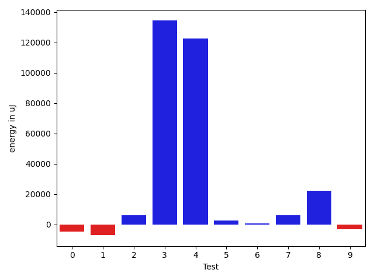

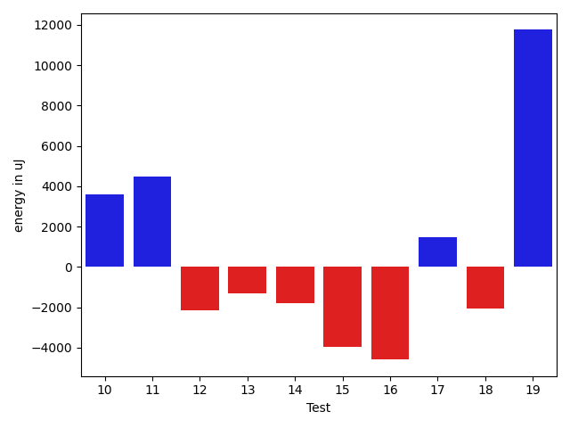

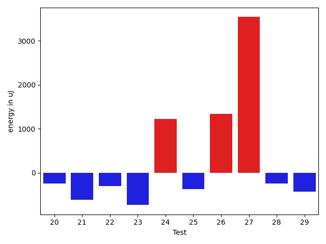

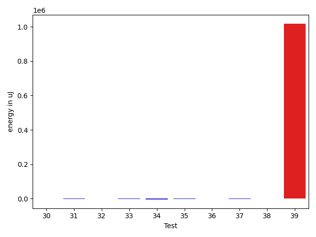

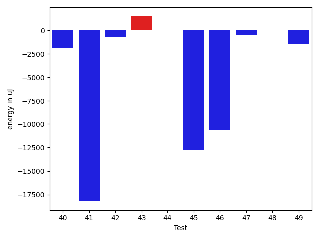

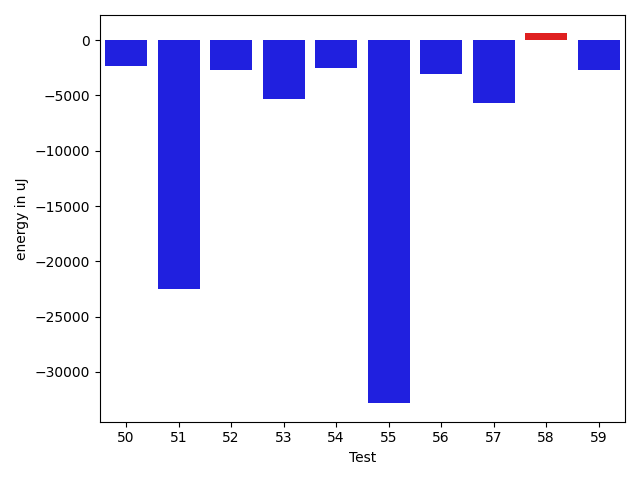

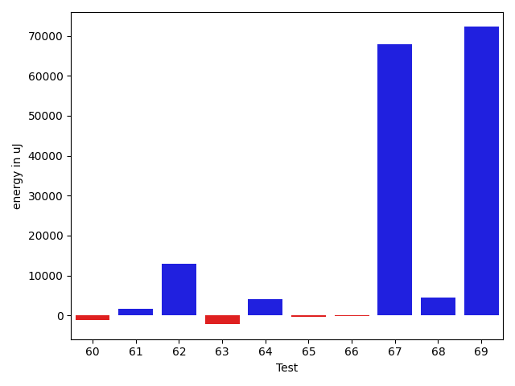

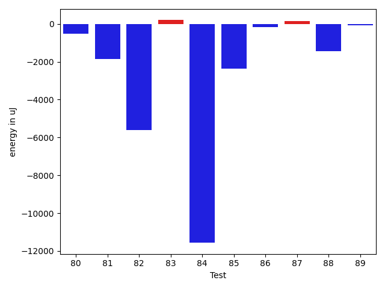

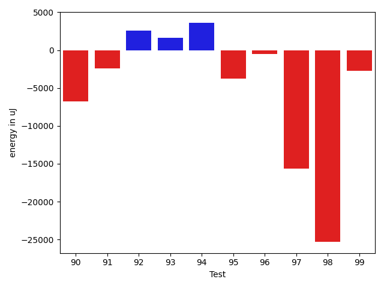

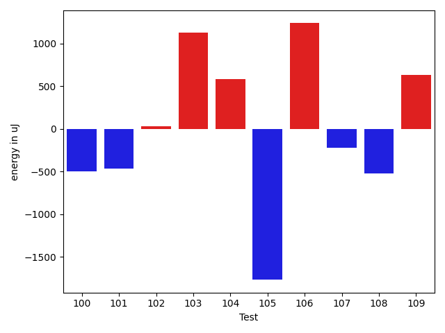

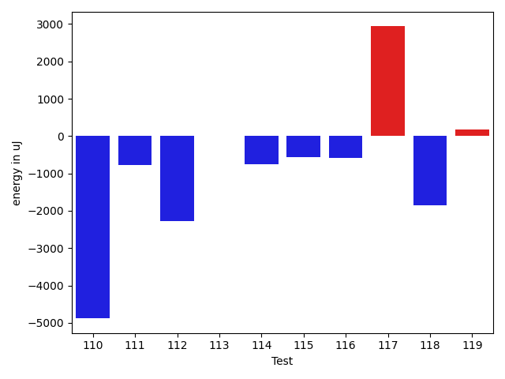

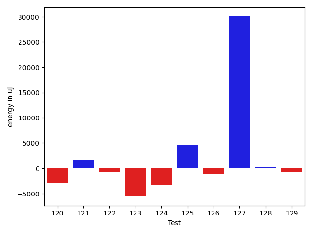

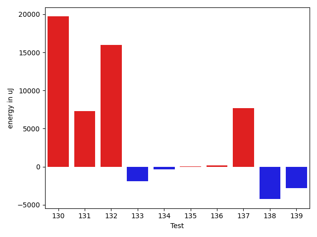

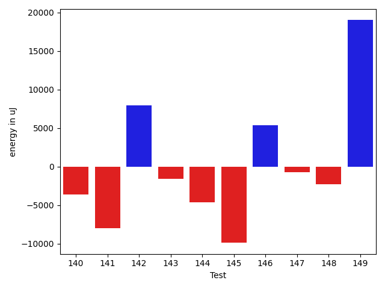

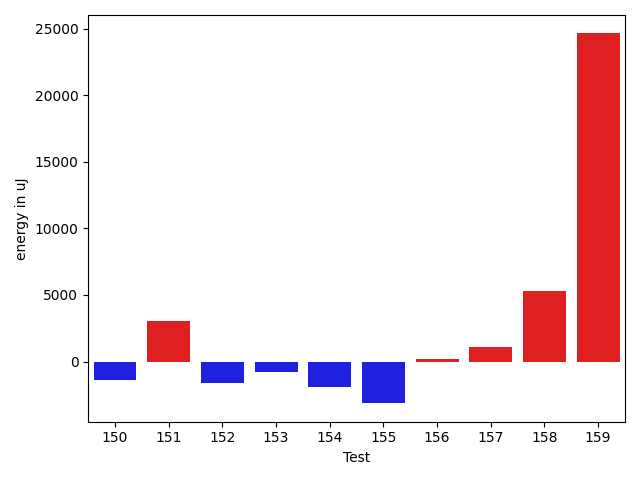

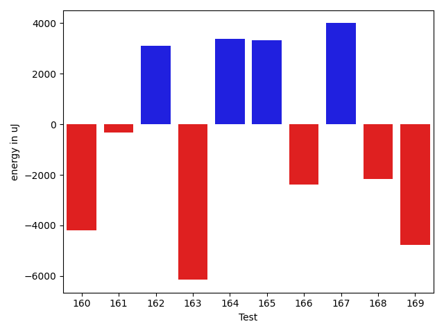

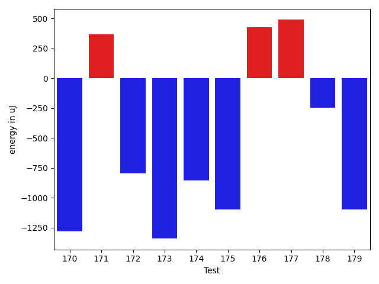

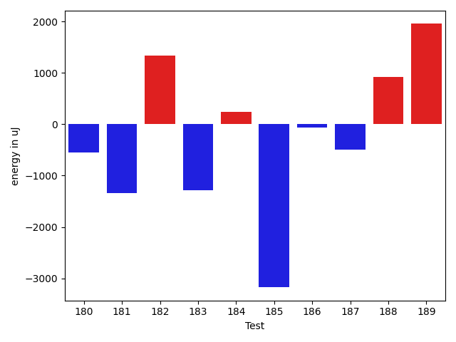

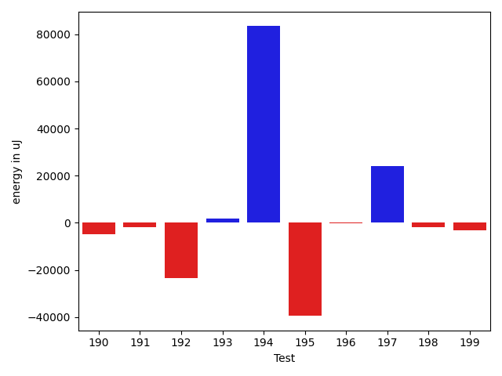

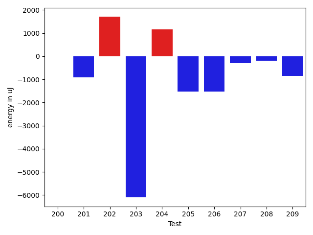

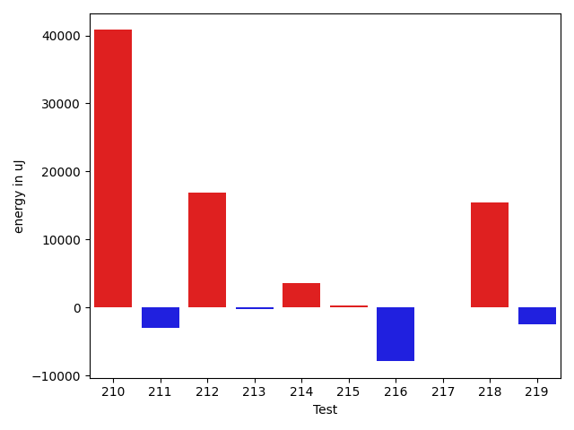

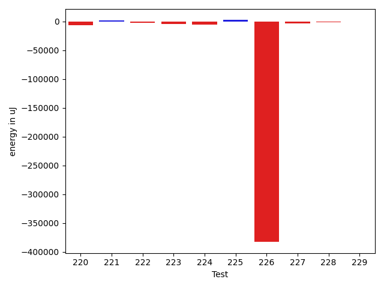

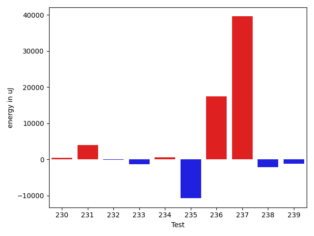

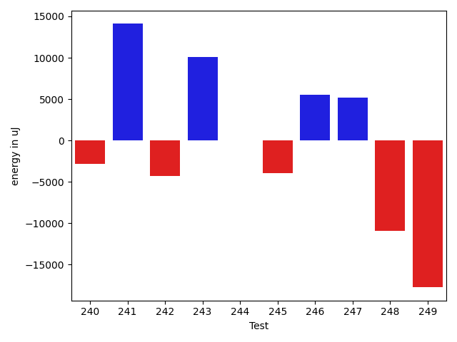

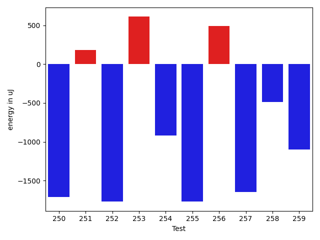

| ID | EnergyV1 | EnergyV2 | DeltaEnergy | σV1 | σV2 |
| --- | --- | --- | --- | --- | --- |
| 0 | 42813.11320754717 | 43125.294117647056 | 312.1809100998871 | 5232.584839292297 | 6670.343993522838 |
| 1 | 41584.57352941176 | 41872.36708860759 | 287.7935591958303 | 9120.110876061333 | 9931.809691658511 |
| 2 | 41531.7 | 40532.65671641791 | -999.0432835820902 | 8206.100038299033 | 6773.381303687359 |
| 3 | 59362.70909090909 | 59763.25581395349 | 400.54672304439737 | 57980.57333959452 | 59899.50748413158 |
| 4 | 68009.1052631579 | 69755.91176470589 | 1746.8065015479951 | 62999.12454103064 | 72222.54451606206 |
| 5 | 39141.58823529412 | 39664.69565217391 | 523.1074168797932 | 4138.865474823399 | 4093.1077428194976 |
| 6 | 45392.36842105263 | 39804.40625 | -5587.9621710526335 | 36211.954249958784 | 3653.1416604357046 |
| 7 | 38698.75 | 39987.98148148148 | 1289.2314814814818 | 4361.71718621233 | 6834.4496770805135 |
| 8 | 43417.0 | 44008.117647058825 | 591.1176470588252 | 20268.042571681657 | 12341.431015711707 |
| 9 | 39188.0 | 37611.46153846154 | -1576.538461538461 | 3849.8377310680976 | 3724.9253088099654 |
| 10 | 39143.86666666667 | 37826.5 | -1317.3666666666686 | 3484.65720679795 | 5514.364027247385 |
| 11 | 39275.944444444445 | 36786.23529411765 | -2489.7091503267948 | 4919.769489543886 | 3344.930959094263 |
| 12 | 40438.166666666664 | 40872.67857142857 | 434.5119047619082 | 4582.138357858213 | 4234.926349111393 |
| 13 | 45852.0 | 57585.91111111111 | 11733.911111111112 | 21118.739916367464 | 63957.96280815922 |
| 14 | 55010.93650793651 | 62385.15254237288 | 7374.216034436373 | 55685.19170310758 | 70063.79019219113 |
| 15 | 52303.292929292926 | 55395.17171717172 | 3091.8787878787916 | 20226.540506814017 | 23419.14355887336 |
| 16 | 40124.23809523809 | 39034.01724137931 | -1090.2208538587802 | 6892.6593013798365 | 3934.705424242685 |
| 17 | 108359.44086021505 | 87791.5172413793 | -20567.923618835746 | 116238.23097030823 | 87616.8328793784 |
| 18 | 40432.619718309856 | 43857.6231884058 | 3425.003470095944 | 7259.975911507388 | 12407.088893633942 |
| 19 | 66359.0989010989 | 59508.39772727273 | -6850.701173826172 | 45303.040148102074 | 38825.10170522877 |
| 20 | 41863.23809523809 | 44024.0 | 2160.761904761908 | 8639.630341361495 | 25364.95829360584 |
| 21 | 44908.23376623377 | 44053.831168831166 | -854.4025974026008 | 12559.987436812416 | 11872.196543340402 |
| 22 | 41095.346153846156 | 39528.32394366197 | -1567.0222101841864 | 13678.06168494281 | 4860.110796206042 |
| 23 | 40232.42372881356 | 40874.53448275862 | 642.1107539450604 | 3792.046190644216 | 7534.111558302603 |
| 24 | 40368.87837837838 | 41259.643835616436 | 890.7654572380561 | 9281.799992826273 | 7806.300925990461 |
| 25 | 39524.83050847457 | 39814.84375 | 290.01324152542657 | 4729.603617434793 | 6352.735437438422 |
| 26 | 38696.066666666666 | 38538.239130434784 | -157.82753623188182 | 5025.315894548322 | 4329.319813956032 |
| 27 | 68475.75757575757 | 63468.333333333336 | -5007.424242424233 | 50876.023623701294 | 23972.25299205629 |
| 28 | 39737.769230769234 | 40252.09589041096 | 514.3266596417234 | 4885.430091354782 | 5666.724209345081 |
| 29 | 70442.38383838384 | 69568.16161616161 | -874.2222222222335 | 28547.513071364705 | 38245.90759482193 |
| 30 | 39077.49382716049 | 41084.39743589744 | 2006.903608736946 | 4591.564732681696 | 7606.966421440055 |
| 31 | 44257.12345679013 | 43085.82666666667 | -1171.2967901234588 | 11236.411694243685 | 10059.917117449604 |
| 32 | 40973.67441860465 | 41882.5421686747 | 908.8677500700505 | 7770.708898016812 | 9053.54671672026 |
| 33 | 41081.57377049181 | 41077.5 | -4.073770491806499 | 7646.556071379759 | 7550.768635836717 |
| 34 | 74926.27272727272 | 66192.80808080808 | -8733.464646464636 | 31190.51572170979 | 30921.598377766542 |
| 35 | 39734.625 | 39945.6 | 210.97499999999854 | 7888.520922548542 | 5901.86000560114 |
| 36 | 38585.40740740741 | 39491.38888888889 | 905.9814814814818 | 4730.693405123445 | 4126.782222922856 |
| 37 | 37965.529411764706 | 36957.48648648649 | -1008.0429252782196 | 3526.02897151434 | 3838.330933872885 |
| 38 | 37203.24 | 36760.17543859649 | -443.0645614035093 | 7771.135758845036 | 4279.661529995867 |
| 39 | 645627.0101010101 | 750351.3636363636 | 104724.35353535356 | 618069.8018746128 | 598503.0034494136 |
| 40 | 39761.666666666664 | 37836.12987012987 | -1925.5367965367914 | 10623.272743264093 | 5668.826153372471 |
| 41 | 80747.5142857143 | 62576.6 | -18170.914285714294 | 59269.62272596619 | 52797.444344102216 |
| 42 | 53751.42028985507 | 52999.27142857143 | -752.1488612836401 | 20085.842357246762 | 20830.7615229575 |
| 43 | 35522.24324324324 | 36990.04347826087 | 1467.800235017632 | 4351.381684299177 | 7420.849526419588 |
| 44 | 35461.28571428572 | 35466.818181818184 | 5.5324675324663986 | 4462.908427545099 | 4615.5639036590455 |
| 45 | 252917.9898989899 | 240153.59595959596 | -12764.39393939395 | 88549.57563866569 | 89810.55225170338 |
| 46 | 177867.72727272726 | 167200.78787878787 | -10666.939393939392 | 34358.523626522525 | 34026.71403122972 |
| 47 | 37935.392857142855 | 37490.1724137931 | -445.2204433497536 | 3463.245137349874 | 4106.459940890152 |
| 48 | 40681.555555555555 | 40704.757575757576 | 23.20202020202123 | 3730.7305692380023 | 3815.9708644328225 |
| 49 | 43066.37142857143 | 41569.137931034486 | -1497.233497536945 | 8950.123092803055 | 7835.211999966772 |
| 50 | 43935.2 | 41573.7868852459 | -2361.4131147540975 | 11587.340776428857 | 5886.060312616787 |
| 51 | 78773.30120481928 | 56252.8875 | -22520.41370481928 | 109410.62354199904 | 46169.13112540507 |
| 52 | 43509.37209302326 | 40813.75 | -2695.6220930232594 | 8650.346787034923 | 5505.9232416603445 |
| 53 | 47759.97826086957 | 42458.92592592593 | -5301.052334943641 | 20238.87585756156 | 11518.46526693657 |
| 54 | 45352.78125 | 42834.08823529412 | -2518.693014705881 | 13169.292159542912 | 5589.476779510327 |
| 55 | 83924.65853658537 | 51098.514285714286 | -32826.14425087108 | 115656.24889249781 | 56247.6046227095 |
| 56 | 52175.1914893617 | 49139.80434782609 | -3035.3871415356116 | 25033.485014342925 | 19076.969846000135 |
| 57 | 45377.87142857143 | 39654.44285714286 | -5723.4285714285725 | 21378.049653739585 | 7590.565509961718 |
| 58 | 38692.67924528302 | 39299.828125 | 607.1488797169804 | 6099.502778292624 | 7824.446195567708 |
| 59 | 74027.05681818182 | 71349.908045977 | -2677.1487722048187 | 53131.54856181322 | 48925.02174172564 |
| 60 | 65761.92857142857 | 58482.524590163935 | -7279.40398126463 | 62312.51670120341 | 52019.50363986493 |
| 61 | 42635.307692307695 | 38964.980769230766 | -3670.3269230769292 | 10264.311632542185 | 4583.1948946054945 |
| 62 | 38140.46428571428 | 37193.653846153844 | -946.8104395604387 | 3982.5343374193894 | 4001.879855789966 |
| 63 | 139794.21212121213 | 108312.43434343435 | -31481.77777777778 | 105210.6741825415 | 51663.81099599146 |
| 64 | 38991.71428571428 | 39614.88157894737 | 623.1672932330839 | 4624.850360954881 | 5268.416078179338 |
| 65 | 37865.307692307695 | 38958.041666666664 | 1092.7339743589691 | 5058.8764241238605 | 4874.2857637398765 |
| 66 | 75612.65789473684 | 52344.142857142855 | -23268.515037593985 | 57112.70666031486 | 37108.731376008196 |
| 67 | 39670.9375 | 39917.0 | 246.0625 | 4701.404703234316 | 4617.1258942993445 |
| 68 | 39166.31914893617 | 40781.2972972973 | 1614.9781483611296 | 4306.867267992062 | 7343.004002210483 |
| 69 | 82848.56565656565 | 90791.09090909091 | 7942.525252525258 | 45005.929868591746 | 50823.454764546026 |
| 70 | 39449.46341463415 | 49669.06 | 10219.596585365849 | 4991.2078996413275 | 66199.42393477756 |
| 71 | 38161.64 | 36476.52631578947 | -1685.1136842105261 | 5239.835095725819 | 4407.196571260299 |
| 72 | 70450.91891891892 | 85456.28571428571 | 15005.36679536679 | 81204.15818050351 | 91808.33315230205 |
| 73 | 39306.6 | 37655.166666666664 | -1651.4333333333343 | 3342.9832744620985 | 2845.6317254111896 |
| 74 | 40856.42253521127 | 40898.346666666665 | 41.92413145539467 | 9107.31797019278 | 10384.612160298631 |
| 75 | 40403.96296296296 | 41291.23333333333 | 887.2703703703664 | 5269.862163363524 | 8781.303286655246 |
| 76 | 46849.730158730155 | 53232.10526315789 | 6382.375104427738 | 18136.903531772907 | 36571.33551796908 |
| 77 | 86309.81578947368 | 109880.17391304347 | 23570.358123569793 | 88665.0624662853 | 125770.33455820494 |
| 78 | 45618.90909090909 | 46620.25862068965 | 1001.3495297805639 | 15674.996974266078 | 15939.523819911597 |
| 79 | 39473.31578947369 | 39334.88461538462 | -138.43117408906983 | 4524.79593087539 | 4681.153624473048 |
| 80 | 40157.77777777778 | 39640.57894736842 | -517.1988304093611 | 4284.276803428446 | 5419.123762106792 |
| 81 | 38860.125 | 37001.88 | -1858.2450000000026 | 4553.67085266107 | 3041.7779448210877 |
| 82 | 59016.333333333336 | 53401.854166666664 | -5614.4791666666715 | 76267.45602811202 | 63889.45766549622 |
| 83 | 39375.35897435898 | 39575.025 | 199.66602564102504 | 4963.424347741466 | 4022.9604428051493 |
| 84 | 149345.898989899 | 137780.0101010101 | -11565.888888888905 | 102002.123173733 | 87671.81731758261 |
| 85 | 53085.637931034486 | 50735.59154929577 | -2350.0463817387135 | 55971.59586072647 | 60555.323229695394 |
| 86 | 40326.81081081081 | 40158.765432098764 | -168.04537871204957 | 4828.846369631648 | 7850.841081420424 |
| 87 | 44381.09411764706 | 44538.0 | 156.90588235294126 | 11698.545673939965 | 17184.8172777141 |
| 88 | 44857.793650793654 | 43424.985074626864 | -1432.8085761667899 | 16181.971080087405 | 15974.065490142428 |
| 89 | 39991.5 | 39911.53571428572 | -79.9642857142826 | 5643.284014846517 | 6744.260385066817 |
| 90 | 39749.39215686275 | 39019.83720930233 | -729.5549475604203 | 4044.584809048457 | 4417.917661282438 |
| 91 | 92795.43661971831 | 95538.66153846154 | 2743.2249187432317 | 273380.04409487615 | 280897.85834023653 |
| 92 | 40229.95652173913 | 41619.194444444445 | 1389.237922705317 | 4247.077434806208 | 18218.079804626694 |
| 93 | 52046.942028985504 | 53231.524590163935 | 1184.5825611784312 | 32729.59687973078 | 31588.505476147617 |
| 94 | 40854.63636363636 | 39978.92857142857 | -875.7077922077879 | 4384.929912837361 | 3888.164751879105 |
| 95 | 58742.01960784314 | 59206.46 | 464.44039215685916 | 79394.46766039841 | 93817.46350743233 |
| 96 | 42337.94623655914 | 39785.09090909091 | -2552.855327468227 | 11283.720387922078 | 7457.500279822571 |
| 97 | 39832.38461538462 | 37468.77777777778 | -2363.606837606836 | 4179.991195030505 | 3727.794336773952 |
| 98 | 39018.59375 | 37880.64 | -1137.9537500000006 | 3139.6452811123327 | 3202.2030151756458 |
| 99 | 38589.357142857145 | 37833.06976744186 | -756.2873754152824 | 4124.6243570457045 | 3474.898977252324 |
| 100 | 38858.53571428572 | 38363.96296296296 | -494.5727513227539 | 4456.003454266925 | 3525.1501305721295 |
| 101 | 38438.90476190476 | 37970.07894736842 | -468.8258145363434 | 4133.756206149812 | 3951.0382072083207 |
| 102 | 38250.75 | 38280.52380952381 | 29.773809523809177 | 4388.922178337182 | 3846.9929334982526 |
| 103 | 38903.04347826087 | 40032.46428571428 | 1129.4208074534108 | 5457.804834070681 | 4191.487934596418 |
| 104 | 39545.75675675676 | 40130.63157894737 | 584.8748221906062 | 4666.301506722806 | 7375.801499430607 |
| 105 | 41606.21428571428 | 39838.392857142855 | -1767.8214285714275 | 8764.177177404548 | 4485.137610082611 |
| 106 | 37035.13043478261 | 38272.333333333336 | 1237.2028985507277 | 4092.9987338332608 | 3352.1315275176453 |
| 107 | 39573.045454545456 | 39349.25 | -223.79545454545587 | 4536.759961963972 | 4054.9348807964843 |
| 108 | 39655.0 | 39131.09375 | -523.90625 | 4650.850271724516 | 3439.8791526681484 |
| 109 | 39340.2 | 39972.454545454544 | 632.254545454547 | 4594.026410459565 | 2819.286768723168 |
| 110 | 43515.98387096774 | 38637.32142857143 | -4878.662442396315 | 24196.59757106087 | 3757.8780491652415 |
| 111 | 40416.40909090909 | 39642.857142857145 | -773.5519480519433 | 7400.331664306373 | 6527.744811688844 |
| 112 | 41857.208333333336 | 39587.08064516129 | -2270.127688172048 | 11124.84131901502 | 7141.1634438798565 |
| 113 | 38665.61111111111 | 38672.121212121216 | 6.510101010106155 | 4445.456871144953 | 2837.5740573176527 |
| 114 | 40158.583333333336 | 39402.086956521736 | -756.4963768115995 | 4696.868397459691 | 3887.600410145094 |
| 115 | 46030.857142857145 | 45457.38888888889 | -573.4682539682544 | 18193.063340802426 | 16756.28256186944 |
| 116 | 40642.98529411765 | 40061.97101449275 | -581.0142796248983 | 7088.124499912113 | 6909.7100360122595 |
| 117 | 37424.555555555555 | 40358.36666666667 | 2933.811111111114 | 4556.05268019273 | 4501.697846245224 |
| 118 | 40413.77142857143 | 38565.357142857145 | -1848.414285714287 | 6420.980366115505 | 4212.374467941242 |
| 119 | 38438.739130434784 | 38619.48387096774 | 180.74474053295853 | 4639.126372191693 | 4142.420967930023 |
| 120 | 40150.23529411765 | 39051.09302325582 | -1099.1422708618338 | 8948.921910286253 | 6296.400528814352 |
| 121 | 44443.13157894737 | 48834.1 | 4390.968421052632 | 19765.208807890926 | 28459.82346086028 |
| 122 | 65734.69230769231 | 55750.558139534885 | -9984.134168157427 | 60291.32839980405 | 46787.05796567924 |
| 123 | 38483.90476190476 | 37926.67857142857 | -557.2261904761908 | 4492.938299415905 | 3273.6685194526194 |
| 124 | 39046.48387096774 | 38317.62222222222 | -728.861648745522 | 3902.986266710011 | 3926.468666705145 |
| 125 | 39360.88888888889 | 39091.76 | -269.12888888888847 | 5028.182683511552 | 3609.460095692983 |
| 126 | 38836.17647058824 | 39142.71428571428 | 306.53781512604473 | 4056.8234419859054 | 3924.18424331863 |
| 127 | 38733.333333333336 | 37564.583333333336 | -1168.75 | 2949.3048898568177 | 4015.284972417552 |
| 128 | 39750.07692307692 | 38734.59259259259 | -1015.4843304843307 | 4407.595000268348 | 4075.285413856258 |
| 129 | 38290.375 | 37484.55319148936 | -805.8218085106419 | 3823.476138852576 | 4294.068084608787 |
| 130 | 55663.93243243243 | 75363.01388888889 | 19699.081456456457 | 31804.337878673723 | 91653.53233865339 |
| 131 | 51768.35 | 59090.85365853659 | 7322.503658536589 | 37902.623061966304 | 45303.39357910687 |
| 132 | 40058.642857142855 | 56017.44827586207 | 15958.805418719217 | 4462.168468791553 | 78964.19547232879 |
| 133 | 42242.22 | 40309.269841269845 | -1932.9501587301565 | 11558.202727569715 | 5174.429505265625 |
| 134 | 39085.89743589744 | 38742.89361702128 | -343.00381887616095 | 4826.924968978415 | 4221.1753038851 |
| 135 | 41035.01388888889 | 41069.230769230766 | 34.21688034187537 | 8300.023806011803 | 8918.628730990606 |
| 136 | 42113.31506849315 | 42249.82352941176 | 136.50846091860876 | 15570.215301805158 | 12294.664477565744 |
| 137 | 54432.22 | 62119.83018867925 | 7687.610188679246 | 43918.281455125274 | 53919.98758178845 |
| 138 | 48210.54255319149 | 43957.53535353536 | -4253.007199656131 | 36157.05579023826 | 13206.528785868848 |
| 139 | 40937.709677419356 | 38141.779661016946 | -2795.93001640241 | 16643.59791320248 | 3935.2838205218313 |
| 140 | 64077.75 | 110473.31914893616 | 46395.56914893616 | 58664.32594222559 | 261381.08123260125 |
| 141 | 40896.10144927536 | 41027.90625 | 131.8048007246398 | 8112.768131644338 | 7442.569452394176 |
| 142 | 42087.142857142855 | 39587.438356164384 | -2499.7045009784706 | 29471.27926560062 | 6397.645812705651 |
| 143 | 38411.983606557376 | 40822.042253521126 | 2410.058646963749 | 4389.1237352876815 | 19897.119230538654 |
| 144 | 42871.395348837206 | 42283.73333333333 | -587.6620155038763 | 11725.505753240697 | 11783.699792321408 |
| 145 | 162544.202020202 | 153831.0404040404 | -8713.161616161611 | 200644.01336907133 | 146311.88213600492 |
| 146 | 37099.51612903226 | 40641.78125 | 3542.2651209677424 | 4339.100872159129 | 14849.10601209374 |
| 147 | 39309.8 | 47098.01724137931 | 7788.217241379309 | 3763.8833447288544 | 57759.4263892055 |
| 148 | 38781.3023255814 | 38934.604651162794 | 153.30232558139687 | 4020.213031118623 | 4492.729279467328 |
| 149 | 40460.621212121216 | 39595.82608695652 | -864.7951251646955 | 7246.382187758606 | 4465.353204967841 |
| 150 | 42555.5 | 41166.86956521739 | -1388.630434782608 | 11352.349781331277 | 5916.046493514191 |
| 151 | 37877.305555555555 | 40908.63888888889 | 3031.3333333333358 | 3500.9583514886353 | 10140.349090398926 |
| 152 | 38752.88888888889 | 37128.52631578947 | -1624.3625730994172 | 3230.7942187565304 | 3359.15892305799 |
| 153 | 40385.22388059701 | 39595.333333333336 | -789.8905472636761 | 4785.988251854824 | 4867.986790946068 |
| 154 | 41167.5593220339 | 39281.63636363636 | -1885.9229583975393 | 9026.331347918329 | 5755.5662482040425 |
| 155 | 126655.65656565657 | 123524.37373737374 | -3131.282828282827 | 301742.4719769004 | 231997.18053827458 |
| 156 | 41238.43373493976 | 41425.529411764706 | 187.09567682494526 | 7869.266621564654 | 9773.717407761593 |
| 157 | 39604.145833333336 | 40672.35555555556 | 1068.209722222222 | 5155.217668333637 | 5176.490892725414 |
| 158 | 38911.19047619047 | 44247.818181818184 | 5336.62770562771 | 3952.5066864682167 | 20381.589862681925 |
| 159 | 56497.19387755102 | 81142.0303030303 | 24644.836425479283 | 24841.150512175038 | 156906.19555674016 |
| 160 | 43564.76623376623 | 46375.8875 | 2811.121266233764 | 12235.621862452997 | 15310.570071843955 |
| 161 | 40321.208333333336 | 38563.79245283019 | -1757.4158805031475 | 7639.542037316802 | 4522.450076316291 |
| 162 | 40365.269230769234 | 39527.06451612903 | -838.2047146402037 | 4575.687384743347 | 4054.3022225737814 |
| 163 | 40284.267857142855 | 45163.529411764706 | 4879.261554621851 | 3938.825697423171 | 38202.90822127106 |
| 164 | 44950.40425531915 | 49515.0 | 4564.595744680853 | 11836.33112481026 | 23782.81859228524 |
| 165 | 40255.96296296296 | 39557.27027027027 | -698.6926926926899 | 4265.371795539494 | 3960.4282095033172 |
| 166 | 39420.57894736842 | 39580.2972972973 | 159.71834992888034 | 3788.7596889495935 | 3565.5549347465394 |
| 167 | 39962.18518518518 | 39654.67567567567 | -307.50950950950937 | 4739.672054892477 | 3959.9246993526863 |
| 168 | 41807.78431372549 | 43742.142857142855 | 1934.3585434173656 | 13174.518548800754 | 16178.155206251146 |
| 169 | 53302.74285714285 | 49465.5 | -3837.2428571428536 | 30984.961646711192 | 25262.51936224449 |
| 170 | 99793.11594202899 | 150178.03076923077 | 50384.91482720178 | 158867.94239310344 | 363663.60811027494 |
| 171 | 56926.107142857145 | 75562.35593220338 | 18636.24878934624 | 60661.06850852252 | 87378.7226964308 |
| 172 | 40419.51063829787 | 39991.57777777778 | -427.9328605200935 | 5316.273234226272 | 4372.948273134062 |
| 173 | 38695.08620689655 | 38811.80701754386 | 116.72081064731174 | 3952.318382420203 | 4045.485399881269 |
| 174 | 39025.0 | 41602.58823529412 | 2577.588235294119 | 4089.470452350177 | 20134.830854425676 |
| 175 | 43979.76315789474 | 43285.21333333333 | -694.5498245614071 | 12849.51379160892 | 14026.351524938893 |
| 176 | 39091.862068965514 | 39842.857142857145 | 750.9950738916305 | 4664.519295365504 | 4438.3089018412475 |
| 177 | 37624.0 | 37695.3 | 71.30000000000291 | 4222.292007902817 | 4152.453685473204 |
| 178 | 40208.78125 | 39371.17647058824 | -837.6047794117621 | 7949.474462717547 | 3702.599829615657 |
| 179 | 37785.833333333336 | 37918.3023255814 | 132.4689922480611 | 4079.1841010863377 | 4133.466024260454 |
| 180 | 38884.878787878784 | 38249.71428571428 | -635.1645021645018 | 4974.111973478437 | 4927.950200185693 |
| 181 | 47407.57575757576 | 43784.11111111111 | -3623.4646464646503 | 17468.926509541903 | 14483.816851878699 |
| 182 | 39317.63636363636 | 39230.25 | -87.38636363636033 | 4407.690866753192 | 3211.9460436781933 |
| 183 | 43339.50632911392 | 41600.98795180723 | -1738.5183773066965 | 10638.812556126286 | 6846.551552167073 |
| 184 | 41976.45945945946 | 40411.04109589041 | -1565.4183635690497 | 12006.163657133362 | 6222.371136468394 |
| 185 | 44869.281690140844 | 40738.844155844155 | -4130.437534296689 | 11309.44618285547 | 8309.728157625535 |
| 186 | 55884.72727272727 | 52415.25806451613 | -3469.4692082111433 | 36024.47848412094 | 33126.08910440165 |
| 187 | 39485.44827586207 | 39058.275862068964 | -427.1724137931087 | 4200.246261961044 | 4214.215474062895 |
| 188 | 43566.7 | 41065.913043478264 | -2500.7869565217334 | 18107.974790406573 | 3111.1901387403313 |
| 189 | 39198.454545454544 | 41649.3870967742 | 2450.9325513196527 | 4403.622947768769 | 7343.460104185832 |
| 190 | 41221.458333333336 | 40143.67857142857 | -1077.7797619047633 | 8056.324720259473 | 3818.365095669419 |
| 191 | 43927.76190476191 | 41798.17857142857 | -2129.5833333333358 | 13159.541220490433 | 6779.2110057859545 |
| 192 | 98164.66666666667 | 75858.52631578948 | -22306.14035087719 | 262510.69724108384 | 213224.374825618 |
| 193 | 319198.83838383836 | 315896.2121212121 | -3302.6262626262615 | 105360.41684164213 | 107037.16330900136 |
| 194 | 396622.1212121212 | 410652.0909090909 | 14029.969696969667 | 147538.87430236666 | 144586.3938829745 |
| 195 | 39791.517857142855 | 53109.69491525424 | 13318.177058111381 | 3929.822056090869 | 62411.20602015294 |
| 196 | 40442.056603773584 | 44051.975 | 3609.918396226414 | 6713.709781821959 | 10194.672232316987 |
| 197 | 47011.83783783784 | 43624.25714285715 | -3387.580694980694 | 19948.055232058865 | 13250.627806890308 |
| 198 | 39872.916666666664 | 39652.333333333336 | -220.58333333332848 | 4509.577205946128 | 4923.286760885915 |
| 199 | 42569.833333333336 | 41289.0 | -1280.8333333333358 | 8401.095254323818 | 6545.502225139821 |
| 200 | 39507.416666666664 | 41206.782608695656 | 1699.3659420289914 | 4878.248831263349 | 4871.937066386221 |
| 201 | 39311.5 | 37961.444444444445 | -1350.0555555555547 | 4188.563377420314 | 4278.133214670756 |
| 202 | 51570.125 | 46268.892857142855 | -5301.232142857145 | 30321.16953894383 | 17843.361215107598 |
| 203 | 140765.81818181818 | 129820.87878787878 | -10944.939393939392 | 272047.46960056055 | 251332.1603695912 |
| 204 | 37835.142857142855 | 38117.44827586207 | 282.3054187192174 | 4116.882330410838 | 4210.8418241504005 |
| 205 | 39962.36170212766 | 38927.44736842105 | -1034.9143337066052 | 4831.930429722908 | 4541.942348804253 |
| 206 | 47592.454545454544 | 44469.44117647059 | -3123.0133689839568 | 21270.768906748468 | 15171.131469671904 |
| 207 | 38251.25 | 39296.36666666667 | 1045.1166666666686 | 4257.600275292018 | 4896.872801311284 |
| 208 | 43998.775862068964 | 40203.120689655174 | -3795.65517241379 | 29287.5941166122 | 5773.4954095465155 |
| 209 | 71369.0 | 51892.934782608696 | -19476.065217391304 | 92891.06384093144 | 59190.15776490949 |
| 210 | 122491.74747474748 | 163297.0707070707 | 40805.32323232322 | 47162.190936021274 | 286525.7580924789 |
| 211 | 47321.52380952381 | 44263.739726027394 | -3057.7840834964154 | 29006.50719377923 | 14529.31985419167 |
| 212 | 45195.27160493827 | 62028.15909090909 | 16832.887485970816 | 12017.971920699625 | 78409.27011345465 |
| 213 | 44790.95918367347 | 44570.491228070176 | -220.46795560329338 | 18468.438257519327 | 18608.942414704354 |
| 214 | 55436.9375 | 58981.21649484536 | 3544.2789948453574 | 24976.76768261045 | 52449.88814612249 |
| 215 | 39033.8125 | 39304.0 | 270.1875 | 4230.36187457335 | 5045.3767285836375 |
| 216 | 48651.96153846154 | 40740.857142857145 | -7911.104395604394 | 31763.404781992034 | 4586.832915408796 |
| 217 | 40857.41176470588 | 40945.45 | 88.03823529411602 | 4136.803555159374 | 4886.784325862969 |
| 218 | 76973.29411764706 | 92474.10144927536 | 15500.807331628297 | 190791.37290576435 | 246130.84210598495 |
| 219 | 42028.068181818184 | 39509.48648648649 | -2518.581695331697 | 17407.577240435123 | 4110.325163842891 |
| 220 | 39501.03703703704 | 39180.75 | -320.2870370370365 | 4197.813006276638 | 4096.285031891702 |
| 221 | 39465.29090909091 | 38952.755102040814 | -512.5358070500952 | 4106.733927555514 | 4432.427429706755 |
| 222 | 39509.60655737705 | 39425.04347826087 | -84.56307911617478 | 6499.048347179258 | 4371.764133137879 |
| 223 | 38475.07547169811 | 39127.767857142855 | 652.692385444745 | 3572.940831161813 | 4551.110209887063 |
| 224 | 39441.137931034486 | 38155.47619047619 | -1285.6617405582947 | 4488.560453696961 | 4217.313911767238 |
| 225 | 39755.954545454544 | 38942.46666666667 | -813.487878787877 | 3878.255295142072 | 3789.12028253994 |
| 226 | 38539.92 | 40066.958333333336 | 1527.0383333333375 | 4288.348119451125 | 4135.465698072051 |
| 227 | 39433.708333333336 | 39737.15789473684 | 303.44956140350405 | 3975.3984336915496 | 4375.264891387274 |
| 228 | 62508.88888888889 | 47878.125 | -14630.76388888889 | 49542.75807102337 | 33142.23421835611 |
| 229 | 60794.671875 | 59837.78846153846 | -956.883413461539 | 76359.8844682318 | 79542.76313268338 |
| 230 | 39826.76271186441 | 40238.21052631579 | 411.4478144513778 | 3909.3400948999874 | 4115.049801394799 |
| 231 | 40722.89743589744 | 44716.583333333336 | 3993.6858974358984 | 4710.306020843382 | 11036.851746094888 |
| 232 | 41248.48333333333 | 41067.57352941176 | -180.9098039215678 | 8779.097071057795 | 8327.532129162906 |
| 233 | 64076.2 | 62762.47368421053 | -1313.7263157894704 | 62278.15693290867 | 64680.83563534218 |
| 234 | 38647.32 | 39210.425 | 563.1050000000032 | 4613.076350723019 | 4323.816166810864 |
| 235 | 104355.70707070707 | 93596.28282828283 | -10759.42424242424 | 46747.54772701934 | 25042.948855407445 |
| 236 | 48705.16049382716 | 66143.32926829268 | 17438.16877446552 | 62657.184261989525 | 93566.73584550136 |
| 237 | 65412.59210526316 | 104955.54545454546 | 39542.953349282296 | 183525.85941848677 | 294736.0518019138 |
| 238 | 40255.54838709677 | 38159.075 | -2096.4733870967757 | 4378.392545206147 | 4764.386678196365 |
| 239 | 42480.391304347824 | 41295.03846153846 | -1185.3528428093632 | 6166.597495618459 | 5739.307801205843 |
| 240 | 39776.95121951219 | 40388.3 | 611.3487804878096 | 4374.415907776241 | 7751.454338380637 |
| 241 | 49917.90476190476 | 39728.391304347824 | -10189.51345755694 | 38242.07510297272 | 4665.269317349497 |
| 242 | 84738.36904761905 | 133335.82716049382 | 48597.45811287477 | 244041.26588666558 | 336060.7892113462 |
| 243 | 43786.78571428572 | 39496.969696969696 | -4289.816017316021 | 28782.294845910717 | 4623.5793460022605 |
| 244 | 40030.5 | 39835.433333333334 | -195.0666666666657 | 4145.636149414627 | 4323.7482557254525 |
| 245 | 40626.62857142857 | 40003.416666666664 | -623.2119047619053 | 7046.700873805979 | 4061.903237365733 |
| 246 | 40347.54285714286 | 39707.875 | -639.6678571428565 | 3808.7568601305907 | 4684.991174951667 |
| 247 | 69015.92957746479 | 56543.5873015873 | -12472.34227587749 | 94269.13601429878 | 61512.83424597291 |
| 248 | 73707.03703703704 | 83108.57142857143 | 9401.534391534398 | 85056.72807587849 | 100946.55503889715 |
| 249 | 85650.05882352941 | 63677.439024390245 | -21972.619799139167 | 85470.30255004682 | 44799.211324203825 |
| 250 | 70663.31182795699 | 71596.01030927835 | 932.6984813213639 | 74749.9030063712 | 88753.55309298192 |
| 251 | 41569.57692307692 | 112381.83783783784 | 70812.26091476092 | 8850.315358019201 | 299017.41962305096 |
| 252 | 41448.96551724138 | 42696.77272727273 | 1247.8072100313511 | 3702.450479146896 | 14328.991663222876 |
| 253 | 40251.36 | 39759.208333333336 | -492.1516666666648 | 4011.1121338601342 | 5472.924819655138 |
| 254 | 41280.913043478264 | 42001.22222222222 | 720.3091787439553 | 4936.953020120138 | 7232.619480050771 |
| 255 | 41601.10810810811 | 45109.88 | 3508.771891891891 | 12376.479931782953 | 34719.21158012664 |
| 256 | 39944.11111111111 | 39156.107142857145 | -788.0039682539646 | 4049.6631349005856 | 4702.385825600247 |
| 257 | 40528.555555555555 | 37949.68571428571 | -2578.869841269843 | 4475.095780753031 | 4888.436821558334 |
| 258 | 106886.78181818181 | 108508.25 | 1621.4681818181853 | 225741.58563927523 | 230658.3349295516 |
| 259 | 41622.35849056604 | 42516.97777777778 | 894.619287211739 | 3967.6608293036056 | 8969.26766857904 |

## Delta Duration per test method

| ID | DurationV1 | DurationsV2 | DeltaDuration |
| --- | --- | --- | --- |
| 0 | 790528.6037735849 | 956088.5882352941 | 165559.98446170916 |
| 1 | 1075764.544117647 | 1106944.253164557 | 31179.70904691005 |
| 2 | 1048039.2571428572 | 1012525.4626865672 | -35513.794456289965 |
| 3 | 1520976.1090909091 | 1573466.558139535 | 52490.44904862577 |
| 4 | 1723502.894736842 | 1619266.8823529412 | -104236.01238390082 |
| 5 | 448328.0588235294 | 354657.2173913043 | -93670.84143222508 |
| 6 | 773090.7631578947 | 597070.0625 | -176020.70065789472 |
| 7 | 736883.5625 | 765263.1296296297 | 28379.567129629664 |
| 8 | 897615.15625 | 796205.0294117647 | -101410.1268382353 |
| 9 | 392822.05555555556 | 393926.53846153844 | 1104.4829059828771 |
| 10 | 366785.2 | 410421.375 | 43636.17499999999 |
| 11 | 343912.6666666667 | 465735.4117647059 | 121822.74509803922 |
| 12 | 749879.4791666666 | 770471.7321428572 | 20592.25297619053 |
| 13 | 821528.7931034482 | 1312445.8666666667 | 490917.07356321847 |
| 14 | 1222350.0158730159 | 1524778.152542373 | 302428.1366693571 |
| 15 | 1533104.3434343433 | 1564441.5858585858 | 31337.24242424243 |
| 16 | 852081.4444444445 | 866812.1206896552 | 14730.676245210692 |
| 17 | 3201255.2365591396 | 2413891.2183908047 | -787364.0181683348 |
| 18 | 1087479.5633802817 | 1039973.304347826 | -47506.25903245562 |
| 19 | 1960306.8241758242 | 1680970.0568181819 | -279336.7673576423 |
| 20 | 1012156.8412698413 | 1065951.709090909 | 53794.86782106769 |
| 21 | 1254743.1818181819 | 1166999.9090909092 | -87743.2727272727 |
| 22 | 1077168.6538461538 | 964741.6056338028 | -112427.04821235093 |
| 23 | 792200.6610169491 | 768069.9137931034 | -24130.747223845683 |
| 24 | 1070268.1486486488 | 1071158.095890411 | 889.9472417621873 |
| 25 | 876150.7118644068 | 836847.375 | -39303.336864406825 |
| 26 | 648111.8444444444 | 627876.3260869565 | -20235.51835748786 |
| 27 | 2059764.313131313 | 1831507.7878787878 | -228256.52525252523 |
| 28 | 1009965.5 | 988537.8767123288 | -21427.623287671246 |
| 29 | 2003807.7878787878 | 1954800.7373737374 | -49007.05050505046 |
| 30 | 1063373.6543209876 | 1020708.1282051282 | -42665.52611585939 |
| 31 | 1136703.3950617283 | 1016554.8666666667 | -120148.52839506161 |
| 32 | 1217109.5232558139 | 1151962.9759036144 | -65146.54735219944 |
| 33 | 1093441.5737704919 | 926580.5645161291 | -166861.00925436278 |
| 34 | 2061817.7575757576 | 1883501.2525252525 | -178316.50505050505 |
| 35 | 1026393.7083333334 | 976751.1714285715 | -49642.53690476192 |
| 36 | 583758.5925925926 | 531801.6666666666 | -51956.925925925956 |
| 37 | 651048.2058823529 | 649692.5945945946 | -1355.6112877583364 |
| 38 | 862896.56 | 820657.3859649122 | -42239.17403508781 |
| 39 | 18009775.535353534 | 20230311.858585857 | 2220536.323232323 |
| 40 | 1098907.5432098766 | 1108294.5454545454 | 9387.00224466878 |
| 41 | 2219744.1142857145 | 1547995.5714285714 | -671748.5428571431 |
| 42 | 1409203.7536231885 | 1370070.6714285715 | -39133.08219461702 |
| 43 | 575172.1621621621 | 940351.5652173914 | 365179.4030552292 |
| 44 | 474763.4285714286 | 447555.5909090909 | -27207.837662337697 |
| 45 | 6707731.343434343 | 6390876.161616161 | -316855.18181818165 |
| 46 | 4740797.424242424 | 4586645.232323232 | -154152.19191919174 |
| 47 | 683210.0 | 578565.3793103448 | -104644.62068965519 |
| 48 | 630408.5555555555 | 612542.7272727273 | -17865.82828282821 |
| 49 | 663002.2285714286 | 661367.8620689656 | -1634.3665024630027 |
| 50 | 1028291.0363636364 | 884011.475409836 | -144279.56095380033 |
| 51 | 2363601.0240963856 | 1536560.475 | -827040.5490963855 |
| 52 | 983957.3720930233 | 830156.4444444445 | -153800.92764857877 |
| 53 | 1205012.1304347827 | 917765.925925926 | -287246.20450885675 |
| 54 | 867134.71875 | 592725.2941176471 | -274409.4246323529 |
| 55 | 2247976.7560975607 | 1126768.6 | -1121208.1560975607 |
| 56 | 1444279.574468085 | 1479551.4347826086 | 35271.86031452357 |
| 57 | 1153068.8142857142 | 892997.0 | -260071.81428571418 |
| 58 | 850945.3962264151 | 1025661.234375 | 174715.83814858494 |
| 59 | 2086573.0795454546 | 2027353.7011494252 | -59219.37839602935 |
| 60 | 1636258.5535714286 | 1457734.9180327868 | -178523.63553864183 |
| 61 | 980895.0769230769 | 885221.9038461539 | -95673.173076923 |
| 62 | 575611.5714285715 | 603325.5 | 27713.92857142852 |
| 63 | 3911008.272727273 | 3001071.9494949495 | -909936.3232323234 |
| 64 | 1050598.3857142858 | 1002607.6447368421 | -47990.74097744364 |
| 65 | 549970.8076923077 | 515478.4583333333 | -34492.34935897443 |
| 66 | 1862797.3421052631 | 1536411.75 | -326385.59210526315 |
| 67 | 556600.71875 | 551479.8095238095 | -5120.909226190532 |
| 68 | 769339.0638297872 | 774475.5405405406 | 5136.476710753399 |
| 69 | 2390709.303030303 | 2681574.131313131 | 290864.828282828 |
| 70 | 691171.4146341464 | 1109039.66 | 417868.24536585354 |
| 71 | 451023.24 | 467277.2105263158 | 16253.970526315796 |
| 72 | 1651677.4864864864 | 2184416.523809524 | 532739.0373230374 |
| 73 | 404497.26666666666 | 478026.1666666667 | 73528.90000000002 |
| 74 | 1035848.8309859155 | 1122315.0933333333 | 86466.26234741777 |
| 75 | 771776.3518518518 | 909218.4833333333 | 137442.13148148148 |
| 76 | 1130332.3333333333 | 1436916.894736842 | 306584.56140350876 |
| 77 | 2055121.0 | 3133137.5217391304 | 1078016.5217391304 |
| 78 | 835305.2727272727 | 997913.948275862 | 162608.67554858932 |
| 79 | 361641.3157894737 | 469300.46153846156 | 107659.14574898785 |
| 80 | 456468.3333333333 | 484332.4210526316 | 27864.08771929826 |
| 81 | 416922.3125 | 489093.12 | 72170.8075 |
| 82 | 1571735.537037037 | 1247726.9583333333 | -324008.5787037038 |
| 83 | 730887.641025641 | 667719.5 | -63168.141025641 |
| 84 | 4052361.232323232 | 3649562.131313131 | -402799.1010101009 |
| 85 | 1368667.9310344828 | 1249228.4366197183 | -119439.49441476446 |
| 86 | 1065387.527027027 | 1047733.4567901235 | -17654.0702369035 |
| 87 | 1106661.717647059 | 1176389.6973684211 | 69727.97972136224 |
| 88 | 1037019.4126984127 | 1014496.0 | -22523.412698412663 |
| 89 | 857049.2407407408 | 853136.6785714285 | -3912.5621693122666 |
| 90 | 791058.5098039216 | 799001.1162790698 | 7942.606475148234 |
| 91 | 2571713.6056338027 | 2687796.030769231 | 116082.42513542809 |
| 92 | 482424.4347826087 | 823601.5 | 341177.0652173913 |
| 93 | 1267484.8260869565 | 1345164.524590164 | 77679.69850320742 |
| 94 | 781282.5272727272 | 807851.9107142857 | 26569.383441558457 |
| 95 | 1440071.450980392 | 1515889.68 | 75818.22901960788 |
| 96 | 1193647.569892473 | 1174154.5227272727 | -19493.047165200347 |
| 97 | 430294.23076923075 | 542691.0 | 112396.76923076925 |
| 98 | 458682.96875 | 476219.52 | 17536.55125000002 |
| 99 | 616069.3571428572 | 646860.1627906977 | 30790.80564784049 |
| 100 | 806527.5892857143 | 804579.3333333334 | -1948.2559523809468 |
| 101 | 553394.0714285715 | 595039.2368421053 | 41645.1654135338 |
| 102 | 472738.45 | 449447.2380952381 | -23291.211904761905 |
| 103 | 599856.6521739131 | 552627.7142857143 | -47228.937888198765 |
| 104 | 618839.6486486486 | 657955.5263157894 | 39115.8776671408 |
| 105 | 589651.5714285715 | 700400.6785714285 | 110749.10714285704 |
| 106 | 637822.695652174 | 429543.55555555556 | -208279.1400966184 |
| 107 | 924237.5 | 528304.95 | -395932.55000000005 |
| 108 | 549929.6666666666 | 550573.15625 | 643.4895833333721 |
| 109 | 453284.75 | 450578.86363636365 | -2705.886363636353 |
| 110 | 846968.3225806452 | 764898.4821428572 | -82069.84043778805 |
| 111 | 776145.5227272727 | 790632.6326530612 | 14487.109925788478 |
| 112 | 852806.8333333334 | 833267.3225806452 | -19539.510752688162 |
| 113 | 588639.3611111111 | 553156.0606060605 | -35483.300505050574 |
| 114 | 425568.9583333333 | 419649.0 | -5919.958333333314 |
| 115 | 910588.0 | 948565.0 | 37977.0 |
| 116 | 941449.1470588235 | 962550.7391304348 | 21101.592071611318 |
| 117 | 608953.5555555555 | 557195.5666666667 | -51757.98888888885 |
| 118 | 811118.0571428571 | 719842.7142857143 | -91275.3428571428 |
| 119 | 459210.0869565217 | 457984.5806451613 | -1225.5063113604556 |
| 120 | 783094.7352941176 | 823493.6511627907 | 40398.915868673124 |
| 121 | 799868.0 | 950305.9 | 150437.90000000002 |
| 122 | 1443049.0 | 1195899.8372093022 | -247149.16279069777 |
| 123 | 467449.14285714284 | 533611.25 | 66162.10714285716 |
| 124 | 609892.2258064516 | 624346.0222222222 | 14453.796415770543 |
| 125 | 473337.94444444444 | 481784.92 | 8446.975555555546 |
| 126 | 646009.3823529412 | 643232.1428571428 | -2777.2394957983634 |
| 127 | 424516.72222222225 | 403543.2916666667 | -20973.430555555562 |
| 128 | 592820.2307692308 | 619345.8888888889 | 26525.658119658125 |
| 129 | 680562.475 | 695620.9361702128 | 15058.461170212831 |
| 130 | 1499877.945945946 | 2120256.6805555555 | 620378.7346096095 |
| 131 | 1105820.75 | 1264492.0487804879 | 158671.29878048785 |
| 132 | 480128.53571428574 | 1017896.551724138 | 537768.0160098523 |
| 133 | 898940.06 | 908331.7301587302 | 9391.670158730121 |
| 134 | 722432.1794871795 | 774689.8297872341 | 52257.65030005458 |
| 135 | 1124092.763888889 | 1130032.5714285714 | 5939.80753968237 |
| 136 | 1086258.2328767122 | 1138611.0588235294 | 52352.825946817175 |
| 137 | 1208289.68 | 1432570.3396226414 | 224280.6596226415 |
| 138 | 1450693.7340425532 | 1416119.2525252525 | -34574.48151730071 |
| 139 | 870200.4354838709 | 808247.2711864407 | -61953.164297430194 |
| 140 | 1794423.1022727273 | 3270983.9680851065 | 1476560.8658123792 |
| 141 | 924965.3188405797 | 916375.828125 | -8589.490715579712 |
| 142 | 1099264.2571428572 | 1044344.493150685 | -54919.7639921722 |
| 143 | 969022.8852459016 | 993855.8028169014 | 24832.917570999707 |
| 144 | 1227763.7558139535 | 1230677.8777777778 | 2914.1219638243783 |
| 145 | 4297641.02020202 | 4110080.8585858587 | -187560.16161616147 |
| 146 | 746734.7096774194 | 809353.25 | 62618.54032258061 |
| 147 | 898461.6545454545 | 1095210.9827586208 | 196749.3282131662 |
| 148 | 697847.9302325582 | 667246.4651162791 | -30601.465116279083 |
| 149 | 987277.2878787878 | 982162.7101449275 | -5114.577733860351 |
| 150 | 886159.8846153846 | 551122.6521739131 | -335037.23244147154 |
| 151 | 719826.7222222222 | 806089.1111111111 | 86262.38888888888 |
| 152 | 586700.1481481482 | 546814.2631578947 | -39885.884990253486 |
| 153 | 879063.2388059702 | 963631.6507936508 | 84568.41198768059 |
| 154 | 975613.5762711865 | 1009842.3181818182 | 34228.74191063177 |
| 155 | 3715478.282828283 | 3564224.8383838385 | -151253.4444444445 |
| 156 | 1098250.4578313252 | 1142295.8588235294 | 44045.4009922042 |
| 157 | 968586.7916666666 | 817238.2222222222 | -151348.56944444438 |
| 158 | 492662.04761904763 | 801032.2727272727 | 308370.2251082251 |
| 159 | 1667838.5102040817 | 2402400.242424242 | 734561.7322201605 |
| 160 | 1141400.6103896103 | 1228925.7625 | 87525.15211038967 |
| 161 | 755153.2291666666 | 800437.4905660377 | 45284.261399371084 |
| 162 | 602346.4230769231 | 587427.5161290322 | -14918.906947890879 |
| 163 | 827377.7142857143 | 984750.431372549 | 157372.71708683472 |
| 164 | 912392.4255319149 | 1057896.0322580645 | 145503.60672614956 |
| 165 | 510867.0 | 572288.7837837838 | 61421.78378378379 |
| 166 | 681701.8684210526 | 755438.2702702703 | 73736.40184921771 |
| 167 | 634243.2222222222 | 752981.1351351351 | 118737.9129129129 |
| 168 | 841146.8823529412 | 1017954.8367346938 | 176807.95438175264 |
| 169 | 1101172.2 | 1174477.9444444445 | 73305.74444444454 |
| 170 | 2586918.5217391304 | 3818413.846153846 | 1231495.3244147156 |
| 171 | 1373709.4464285714 | 1904317.9491525423 | 530608.5027239709 |
| 172 | 733170.6170212766 | 746612.6888888889 | 13442.071867612307 |
| 173 | 807791.1896551724 | 841434.0350877193 | 33642.84543254692 |
| 174 | 690951.7741935484 | 934912.5294117647 | 243960.75521821633 |
| 175 | 1177912.9342105263 | 1131419.48 | -46493.45421052631 |
| 176 | 547428.5862068966 | 584695.75 | 37267.16379310342 |
| 177 | 592677.9333333333 | 589746.8 | -2931.1333333333023 |
| 178 | 689689.4375 | 1005119.3529411765 | 315429.9154411765 |
| 179 | 713272.6041666666 | 800824.6511627907 | 87552.04699612409 |
| 180 | 554216.2727272727 | 590240.3142857143 | 36024.04155844159 |
| 181 | 1199037.606060606 | 883653.6388888889 | -315383.9671717171 |
| 182 | 455686.86363636365 | 706362.1 | 250675.23636363633 |
| 183 | 1210652.746835443 | 1234507.4939759036 | 23854.747140460648 |
| 184 | 1177734.3243243243 | 1084953.5205479453 | -92780.80377637898 |
| 185 | 1148581.5492957747 | 1124292.3246753246 | -24289.224620450055 |
| 186 | 1527275.4 | 1436938.7096774194 | -90336.69032258051 |
| 187 | 467748.4482758621 | 624317.4137931034 | 156568.96551724133 |
| 188 | 659920.05 | 476269.95652173914 | -183650.0934782609 |
| 189 | 513243.5 | 744229.8709677419 | 230986.37096774194 |
| 190 | 693222.5 | 476697.46428571426 | -216525.03571428574 |
| 191 | 848351.4761904762 | 634092.0 | -214259.4761904762 |
| 192 | 2386964.296296296 | 1695663.6842105263 | -691300.6120857699 |
| 193 | 8395537.141414141 | 8495381.777777778 | 99844.6363636367 |
| 194 | 10803487.262626262 | 11076172.888888888 | 272685.6262626257 |
| 195 | 923726.3392857143 | 1383760.0 | 460033.6607142857 |
| 196 | 762410.320754717 | 848119.35 | 85709.02924528299 |
| 197 | 989834.5675675676 | 809283.8571428572 | -180550.7104247104 |
| 198 | 590766.0833333334 | 575484.1282051282 | -15281.955128205125 |
| 199 | 702495.5 | 674300.2068965518 | -28195.29310344823 |
| 200 | 675411.75 | 634693.0869565217 | -40718.66304347827 |
| 201 | 515353.7916666667 | 731127.4814814815 | 215773.68981481477 |
| 202 | 1186752.525 | 946689.1785714285 | -240063.34642857139 |
| 203 | 4132284.595959596 | 3832775.9696969697 | -299508.62626262615 |
| 204 | 591198.1785714285 | 579201.275862069 | -11996.902709359536 |
| 205 | 749588.5531914893 | 745659.5263157894 | -3929.0268756998703 |
| 206 | 1071008.5757575757 | 893889.6764705882 | -177118.8992869875 |
| 207 | 556242.0833333334 | 511310.76666666666 | -44931.31666666671 |
| 208 | 957564.1724137932 | 885125.551724138 | -72438.62068965519 |
| 209 | 1881372.0625 | 1145924.847826087 | -735447.2146739131 |
| 210 | 3293735.9494949495 | 4565571.131313131 | 1271835.1818181816 |
| 211 | 1158057.0 | 1187362.3287671234 | 29305.3287671234 |
| 212 | 1280204.6419753085 | 1850736.2613636365 | 570531.6193883279 |
| 213 | 980577.8367346938 | 927131.8947368421 | -53445.94199785171 |
| 214 | 1680627.1770833333 | 1709592.8453608248 | 28965.668277491583 |
| 215 | 469848.53125 | 515201.5 | 45352.96875 |
| 216 | 949912.8076923077 | 563626.6071428572 | -386286.2005494506 |
| 217 | 677127.1470588235 | 702937.575 | 25810.42794117646 |
| 218 | 1941029.455882353 | 2650251.9565217393 | 709222.5006393862 |
| 219 | 744923.0227272727 | 674768.7027027027 | -70154.32002456998 |
| 220 | 532188.7407407408 | 481163.0 | -51025.74074074079 |
| 221 | 800036.6727272727 | 808850.7142857143 | 8814.04155844159 |
| 222 | 922057.9672131147 | 868612.0724637681 | -53445.894749346655 |
| 223 | 768553.9433962264 | 749705.8928571428 | -18848.050539083546 |
| 224 | 488050.0689655172 | 482708.3333333333 | -5341.735632183903 |
| 225 | 543279.8636363636 | 543006.3666666667 | -273.49696969694924 |
| 226 | 585324.96 | 566043.4166666666 | -19281.543333333335 |
| 227 | 507082.5 | 503891.7894736842 | -3190.7105263157864 |
| 228 | 1312747.2962962964 | 857990.09375 | -454757.2025462964 |
| 229 | 1573823.171875 | 1594573.8461538462 | 20750.674278846243 |
| 230 | 765258.7627118644 | 762446.6315789474 | -2812.131132917013 |
| 231 | 773426.7435897436 | 886628.6388888889 | 113201.89529914525 |
| 232 | 1088286.0833333333 | 949558.6617647059 | -138727.42156862735 |
| 233 | 1729545.4666666666 | 1686526.1315789474 | -43019.33508771914 |
| 234 | 701744.64 | 594724.65 | -107019.98999999999 |
| 235 | 2871188.6767676766 | 2624315.4646464647 | -246873.21212121192 |
| 236 | 1279981.6049382717 | 2019670.3170731708 | 739688.7121348991 |
| 237 | 1749504.7105263157 | 3027952.5194805195 | 1278447.8089542037 |
| 238 | 819106.8387096775 | 730035.3 | -89071.5387096774 |
| 239 | 860733.4347826086 | 710555.7307692308 | -150177.7040133779 |
| 240 | 744381.1463414634 | 874544.05 | 130162.90365853661 |
| 241 | 764667.1904761905 | 466261.7826086957 | -298405.40786749485 |
| 242 | 2176116.75 | 3825239.4320987654 | 1649122.6820987654 |
| 243 | 797761.2857142857 | 709650.3333333334 | -88110.95238095231 |
| 244 | 632908.1666666666 | 703403.5666666667 | 70495.40000000002 |
| 245 | 888556.5714285715 | 689574.6666666666 | -198981.90476190485 |
| 246 | 684898.5714285715 | 746964.475 | 62065.9035714285 |
| 247 | 1946999.309859155 | 1529779.349206349 | -417219.96065280586 |
| 248 | 2092971.3086419753 | 2408568.6785714286 | 315597.36992945336 |
| 249 | 2308643.117647059 | 1436621.780487805 | -872021.3371592539 |
| 250 | 2050683.9569892474 | 2145175.505154639 | 94491.54816539166 |
| 251 | 864301.3846153846 | 2845934.918918919 | 1981633.5343035343 |
| 252 | 503607.6206896552 | 658961.3181818182 | 155353.69749216305 |
| 253 | 569804.24 | 555288.5 | -14515.73999999999 |
| 254 | 520631.47826086957 | 570461.7037037037 | 49830.22544283414 |
| 255 | 638179.2162162162 | 900576.84 | 262397.62378378375 |
| 256 | 619074.0 | 625868.7857142857 | 6794.785714285681 |
| 257 | 741019.3777777777 | 815839.9428571429 | 74820.56507936516 |
| 258 | 2814078.709090909 | 2984224.375 | 170145.665909091 |
| 259 | 796519.962264151 | 944406.3111111111 | 147886.3488469601 |

## Misc.

| ID | Test Class | Test Method |
| --- | --- | --- |
| 0 | com.google.gson.functional.PrimitiveTest | testDeserializePrimitiveWrapperAsObjectField |
| 1 | com.google.gson.functional.StreamingTypeAdaptersTest | testNullSafe |
| 2 | com.google.gson.functional.StreamingTypeAdaptersTest | testSerializeWithCustomTypeAdapter |
| 3 | com.google.gson.functional.StreamingTypeAdaptersTest | testSerialize |
| 4 | com.google.gson.functional.StreamingTypeAdaptersTest | testDeserialize |
| 5 | com.google.gson.functional.StreamingTypeAdaptersTest | testSerializeNullField |
| 6 | com.google.gson.functional.StreamingTypeAdaptersTest | testDeserializeWithCustomTypeAdapter |
| 7 | com.google.gson.functional.StreamingTypeAdaptersTest | testSerializeRecursive |
| 8 | com.google.gson.functional.StreamingTypeAdaptersTest | testFromJsonTree |
| 9 | com.google.gson.functional.StreamingTypeAdaptersTest | testSerializeNullObject |
| 10 | com.google.gson.functional.StreamingTypeAdaptersTest | testDeserializeNullObject |
| 11 | com.google.gson.functional.StreamingTypeAdaptersTest | testDeserializeNullField |
| 12 | com.google.gson.functional.CustomDeserializerTest | testDefaultConstructorNotCalledOnField |
| 13 | com.google.gson.functional.CustomDeserializerTest | testDefaultConstructorNotCalledOnObject |
| 14 | com.google.gson.functional.CustomDeserializerTest | testCustomDeserializerReturnsNull |
| 15 | com.google.gson.functional.CustomDeserializerTest | testJsonTypeFieldBasedDeserialization |
| 16 | com.google.gson.functional.CustomDeserializerTest | testCustomDeserializerReturnsNullForArrayElementsForArrayField |
| 17 | com.google.gson.functional.ThrowableFunctionalTest | testExceptionWithoutCause |
| 18 | com.google.gson.functional.ThrowableFunctionalTest | testErrornWithCause |
| 19 | com.google.gson.functional.ThrowableFunctionalTest | testSerializedNameOnExceptionFields |
| 20 | com.google.gson.functional.ThrowableFunctionalTest | testErrorWithoutCause |
| 21 | com.google.gson.functional.ThrowableFunctionalTest | testExceptionWithCause |
| 22 | com.google.gson.functional.ParameterizedTypesTest | testParameterizedTypeGenericArraysSerialization |
| 23 | com.google.gson.functional.ParameterizedTypesTest | testParameterizedTypesWithWriterSerialization |
| 24 | com.google.gson.functional.ParameterizedTypesTest | testVariableTypeArrayDeserialization |
| 25 | com.google.gson.functional.ParameterizedTypesTest | testParameterizedTypeWithReaderDeserialization |
| 26 | com.google.gson.functional.ParameterizedTypesTest | testDeepParameterizedTypeDeserialization |
| 27 | com.google.gson.functional.ParameterizedTypesTest | testParameterizedTypesSerialization |
| 28 | com.google.gson.functional.ParameterizedTypesTest | testVariableTypeDeserialization |
| 29 | com.google.gson.functional.ParameterizedTypesTest | testVariableTypeFieldsAndGenericArraysSerialization |
| 30 | com.google.gson.functional.ParameterizedTypesTest | testParameterizedTypeGenericArraysDeserialization |
| 31 | com.google.gson.functional.ParameterizedTypesTest | testParameterizedTypeDeserialization |
| 32 | com.google.gson.functional.ParameterizedTypesTest | testVariableTypeFieldsAndGenericArraysDeserialization |
| 33 | com.google.gson.functional.ParameterizedTypesTest | testTypesWithMultipleParametersDeserialization |
| 34 | com.google.gson.functional.ParameterizedTypesTest | testTypesWithMultipleParametersSerialization |
| 35 | com.google.gson.functional.ParameterizedTypesTest | testParameterizedTypeWithVariableTypeDeserialization |
| 36 | com.google.gson.functional.ParameterizedTypesTest | testDeepParameterizedTypeSerialization |
| 37 | com.google.gson.functional.DefaultTypeAdaptersTest | testBadValueForBigDecimalDeserialization |
| 38 | com.google.gson.functional.DefaultTypeAdaptersTest | testUrlNullSerialization |
| 39 | com.google.gson.functional.DefaultTypeAdaptersTest | testNullSerialization |
| 40 | com.google.gson.functional.DefaultTypeAdaptersTest | testBigIntegerFieldSerialization |
| 41 | com.google.gson.functional.DefaultTypeAdaptersTest | testBigDecimalFieldDeserialization |
| 42 | com.google.gson.functional.DefaultTypeAdaptersTest | testBigDecimalFieldSerialization |
| 43 | com.google.gson.functional.DefaultTypeAdaptersTest | testBigIntegerFieldDeserialization |
| 44 | com.google.gson.functional.DefaultTypeAdaptersTest | testUrlNullDeserialization |
| 45 | com.google.gson.functional.CircularReferenceTest | testCircularSerialization |
| 46 | com.google.gson.functional.CircularReferenceTest | testSelfReferenceArrayFieldSerialization |
| 47 | com.google.gson.functional.CircularReferenceTest | testSelfReferenceIgnoredInSerialization |
| 48 | com.google.gson.functional.CircularReferenceTest | testDirectedAcyclicGraphSerialization |
| 49 | com.google.gson.functional.CircularReferenceTest | testDirectedAcyclicGraphDeserialization |
| 50 | com.google.gson.functional.PrettyPrintingTest | testEmptyMapField |
| 51 | com.google.gson.functional.PrettyPrintingTest | testPrettyPrintList |
| 52 | com.google.gson.functional.PrettyPrintingTest | testPrettyPrintArrayOfObjects |
| 53 | com.google.gson.functional.ReadersWritersTest | testReadWriteTwoObjects |
| 54 | com.google.gson.functional.ReadersWritersTest | testReaderForDeserialization |
| 55 | com.google.gson.functional.ReadersWritersTest | testWriterForSerialization |
| 56 | com.google.gson.functional.MapTest | testInterfaceTypeMapWithSerializer |
| 57 | com.google.gson.functional.MapTest | testComplexKeysSerialization |
| 58 | com.google.gson.functional.MapTest | testGeneralMapField |
| 59 | com.google.gson.functional.MapTest | testInterfaceTypeMap |
| 60 | com.google.gson.functional.MapTest | testComplexKeysDeserialization |
| 61 | com.google.gson.functional.MapTest | testMapSerializationWithNullValues |
| 62 | com.google.gson.functional.MapTest | testMapSerializationWithNullValuesSerialized |
| 63 | com.google.gson.functional.ExposeFieldsTest | testNullExposeFieldSerialization |
| 64 | com.google.gson.functional.ExposeFieldsTest | testExposedInterfaceFieldSerialization |
| 65 | com.google.gson.functional.ExposeFieldsTest | testExposedInterfaceFieldDeserialization |
| 66 | com.google.gson.functional.ExposeFieldsTest | testExposeAnnotationDeserialization |
| 67 | com.google.gson.functional.ExposeFieldsTest | testExposeAnnotationSerialization |
| 68 | com.google.gson.functional.ExposeFieldsTest | testArrayWithOneNullExposeFieldObjectSerialization |
| 69 | com.google.gson.functional.InheritanceTest | testSubInterfacesOfCollectionSerialization |
| 70 | com.google.gson.functional.InheritanceTest | testClassWithBaseArrayFieldSerialization |
| 71 | com.google.gson.functional.InheritanceTest | testBaseSerializedAsSub |
| 72 | com.google.gson.functional.InheritanceTest | testSubClassDeserialization |
| 73 | com.google.gson.functional.InheritanceTest | testBaseSerializedAsSubWhenSpecifiedWithExplicitTypeForToJsonMethod |
| 74 | com.google.gson.functional.InheritanceTest | testSubInterfacesOfCollectionDeserialization |
| 75 | com.google.gson.functional.InheritanceTest | testClassWithBaseCollectionFieldSerialization |
| 76 | com.google.gson.functional.InheritanceTest | testSubClassSerialization |
| 77 | com.google.gson.functional.InheritanceTest | testBaseSerializedAsBaseWhenSpecifiedWithExplicitTypeForToJsonMethod |
| 78 | com.google.gson.functional.InheritanceTest | testClassWithBaseFieldSerialization |
| 79 | com.google.gson.functional.InheritanceTest | testBaseSerializedAsBaseWhenSpecifiedWithExplicitType |
| 80 | com.google.gson.functional.InheritanceTest | testBaseSerializedAsSubForToJsonMethod |
| 81 | com.google.gson.functional.InheritanceTest | testBaseSerializedAsSubWhenSpecifiedWithExplicitType |
| 82 | com.google.gson.GsonBuilderTest | testExcludeFieldsWithModifiers |
| 83 | com.google.gson.GsonBuilderTest | testTransientFieldExclusion |
| 84 | com.google.gson.functional.RuntimeTypeAdapterFactoryFunctionalTest | testSubclassesAutomaticallySerialzed |
| 85 | com.google.gson.functional.MoreSpecificTypeSerializationTest | testSubclassFields |
| 86 | com.google.gson.functional.MoreSpecificTypeSerializationTest | testParameterizedSubclassFields |
| 87 | com.google.gson.functional.MoreSpecificTypeSerializationTest | testListOfSubclassFields |
| 88 | com.google.gson.functional.MoreSpecificTypeSerializationTest | testMapOfSubclassFields |
| 89 | com.google.gson.functional.MoreSpecificTypeSerializationTest | testListOfParameterizedSubclassFields |
| 90 | com.google.gson.functional.MoreSpecificTypeSerializationTest | testMapOfParameterizedSubclassFields |
| 91 | com.google.gson.JsonParserTest | testReadWriteTwoObjects |
| 92 | com.google.gson.functional.JsonTreeTest | testJsonTreeNull |
| 93 | com.google.gson.functional.JsonTreeTest | testJsonTreeToString |
| 94 | com.google.gson.functional.JsonTreeTest | testToJsonTreeObjectType |
| 95 | com.google.gson.functional.JsonTreeTest | testToJsonTree |
| 96 | com.google.gson.functional.ObjectTest | testSingletonLists |
| 97 | com.google.gson.functional.ObjectTest | testClassWithTransientFieldsDeserialization |
| 98 | com.google.gson.functional.ObjectTest | testStringFieldWithNumberValueDeserialization |
| 99 | com.google.gson.functional.ObjectTest | testStringFieldWithEmptyValueSerialization |
| 100 | com.google.gson.functional.ObjectTest | testInnerClassSerialization |
| 101 | com.google.gson.functional.ObjectTest | testClassWithObjectFieldSerialization |
| 102 | com.google.gson.functional.ObjectTest | testObjectFieldNamesWithoutQuotesDeserialization |
| 103 | com.google.gson.functional.ObjectTest | testBagOfPrimitivesSerialization |
| 104 | com.google.gson.functional.ObjectTest | testClassWithTransientFieldsSerialization |
| 105 | com.google.gson.functional.ObjectTest | testNullFieldsSerialization |
| 106 | com.google.gson.functional.ObjectTest | testPrimitiveArrayFieldSerialization |
| 107 | com.google.gson.functional.ObjectTest | testJsonInMixedQuotesDeserialization |
| 108 | com.google.gson.functional.ObjectTest | testNullFieldsDeserialization |
| 109 | com.google.gson.functional.ObjectTest | testNullObjectFieldsDeserialization |
| 110 | com.google.gson.functional.ObjectTest | testEmptyCollectionInAnObjectDeserialization |
| 111 | com.google.gson.functional.ObjectTest | testArrayOfArraysDeserialization |
| 112 | com.google.gson.functional.ObjectTest | testArrayOfObjectsAsFields |
| 113 | com.google.gson.functional.ObjectTest | testPrimitiveArrayInAnObjectDeserialization |
| 114 | com.google.gson.functional.ObjectTest | testNullArraysDeserialization |
| 115 | com.google.gson.functional.ObjectTest | testBagOfPrimitiveWrappersSerialization |
| 116 | com.google.gson.functional.ObjectTest | testArrayOfArraysSerialization |
| 117 | com.google.gson.functional.ObjectTest | testBagOfPrimitivesDeserialization |
| 118 | com.google.gson.functional.ObjectTest | testNestedSerialization |
| 119 | com.google.gson.functional.ObjectTest | testEmptyCollectionInAnObjectSerialization |
| 120 | com.google.gson.functional.ObjectTest | testArrayOfObjectsSerialization |
| 121 | com.google.gson.functional.ObjectTest | testJsonInSingleQuotesDeserialization |
| 122 | com.google.gson.functional.ObjectTest | testBagOfPrimitiveWrappersDeserialization |
| 123 | com.google.gson.functional.ObjectTest | testNullPrimitiveFieldsDeserialization |
| 124 | com.google.gson.functional.ObjectTest | testPrivateNoArgConstructorDeserialization |
| 125 | com.google.gson.functional.ObjectTest | testClassWithTransientFieldsDeserializationTransientFieldsPassedInJsonAreIgnored |
| 126 | com.google.gson.functional.ObjectTest | testArrayOfObjectsDeserialization |
| 127 | com.google.gson.functional.ObjectTest | testStringFieldWithEmptyValueDeserialization |
| 128 | com.google.gson.functional.ObjectTest | testNestedDeserialization |
| 129 | com.google.gson.functional.ObjectTest | testInnerClassDeserialization |
| 130 | com.google.gson.functional.SerializedNameTest | testFirstNameIsChosenForSerialization |
| 131 | com.google.gson.functional.SerializedNameTest | testMultipleNamesDeserializedCorrectly |
| 132 | com.google.gson.functional.SerializedNameTest | testMultipleNamesInTheSameString |
| 133 | com.google.gson.functional.CustomTypeAdaptersTest | testCustomNestedSerializers |
| 134 | com.google.gson.functional.CustomTypeAdaptersTest | testCustomNestedDeserializers |
| 135 | com.google.gson.functional.CustomTypeAdaptersTest | testCustomTypeAdapterDoesNotAppliesToSubClasses |
| 136 | com.google.gson.functional.CustomTypeAdaptersTest | testEnsureCustomSerializerNotInvokedForNullValues |
| 137 | com.google.gson.functional.CustomTypeAdaptersTest | testEnsureCustomDeserializerNotInvokedForNullValues |
| 138 | com.google.gson.functional.JsonAdapterAnnotationOnFieldsTest | testClassAnnotationAdapterFactoryTakesPrecedenceOverDefault |
| 139 | com.google.gson.functional.JsonAdapterAnnotationOnFieldsTest | testJsonAdapterWrappedInNullSafeAsRequested |
| 140 | com.google.gson.functional.JsonAdapterAnnotationOnFieldsTest | testClassAnnotationAdapterTakesPrecedenceOverDefault |
| 141 | com.google.gson.functional.JsonAdapterAnnotationOnFieldsTest | testRegisteredTypeAdapterTakesPrecedenceOverClassAnnotationAdapter |
| 142 | com.google.gson.functional.JsonAdapterAnnotationOnFieldsTest | testFieldAnnotationTakesPrecedenceOverClassAnnotation |
| 143 | com.google.gson.functional.JsonAdapterAnnotationOnFieldsTest | testJsonAdapterInvokedOnlyForAnnotatedFields |
| 144 | com.google.gson.functional.JsonAdapterAnnotationOnFieldsTest | testFieldAnnotationTakesPrecedenceOverRegisteredTypeAdapter |
| 145 | com.google.gson.functional.VersioningTest | testVersionedUntilSerialization |
| 146 | com.google.gson.functional.VersioningTest | testVersionedClassesDeserialization |
| 147 | com.google.gson.functional.VersioningTest | testVersionedClassesSerialization |
| 148 | com.google.gson.functional.VersioningTest | testVersionedGsonMixingSinceAndUntilDeserialization |
| 149 | com.google.gson.functional.VersioningTest | testVersionedGsonMixingSinceAndUntilSerialization |
| 150 | com.google.gson.functional.VersioningTest | testVersionedUntilDeserialization |
| 151 | com.google.gson.functional.VersioningTest | testVersionedGsonWithUnversionedClassesSerialization |
| 152 | com.google.gson.functional.VersioningTest | testVersionedGsonWithUnversionedClassesDeserialization |
| 153 | com.google.gson.functional.MapAsArrayTypeAdapterTest | testMultipleEnableComplexKeyRegistrationHasNoEffect |
| 154 | com.google.gson.functional.MapAsArrayTypeAdapterTest | testMapWithTypeVariableDeserialization |
| 155 | com.google.gson.functional.MapAsArrayTypeAdapterTest | testSerializeComplexMapWithTypeAdapter |
| 156 | com.google.gson.functional.MapAsArrayTypeAdapterTest | testMapWithTypeVariableSerialization |
| 157 | com.google.gson.functional.EnumTest | testClassWithEnumFieldSerialization |
| 158 | com.google.gson.functional.EnumTest | testClassWithEnumFieldDeserialization |
| 159 | com.google.gson.functional.TypeVariableTest | testAdvancedTypeVariables |
| 160 | com.google.gson.functional.TypeVariableTest | testTypeVariablesViaTypeParameter |
| 161 | com.google.gson.functional.TypeVariableTest | testBasicTypeVariables |
| 162 | com.google.gson.functional.EscapingTest | testGsonDoubleDeserialization |
| 163 | com.google.gson.functional.EscapingTest | testGsonAcceptsEscapedAndNonEscapedJsonDeserialization |
| 164 | com.google.gson.functional.EscapingTest | testEscapingObjectFields |
| 165 | com.google.gson.functional.JsonParserTest | testBadFieldTypeForCustomDeserializerCustomTree |
| 166 | com.google.gson.functional.JsonParserTest | testBadFieldTypeForDeserializingCustomTree |
| 167 | com.google.gson.functional.JsonParserTest | testBadTypeForDeserializingCustomTree |
| 168 | com.google.gson.functional.JsonParserTest | testChangingCustomTreeAndDeserializing |
| 169 | com.google.gson.functional.JsonParserTest | testDeserializingCustomTree |
| 170 | com.google.gson.functional.InstanceCreatorTest | testInstanceCreatorReturnsBaseType |
| 171 | com.google.gson.functional.InstanceCreatorTest | testInstanceCreatorReturnsSubTypeForField |
| 172 | com.google.gson.functional.InstanceCreatorTest | testInstanceCreatorReturnsSubTypeForTopLevelObject |
| 173 | com.google.gson.functional.NullObjectAndFieldTest | testAbsentJsonElementsAreSetToNull |
| 174 | com.google.gson.functional.NullObjectAndFieldTest | testExplicitNullSetsFieldToNullDuringDeserialization |
| 175 | com.google.gson.functional.NullObjectAndFieldTest | testExplicitSerializationOfNullArrayMembers |
| 176 | com.google.gson.functional.NullObjectAndFieldTest | testExplicitDeserializationOfNulls |
| 177 | com.google.gson.functional.NullObjectAndFieldTest | testExplicitSerializationOfNullCollectionMembers |
| 178 | com.google.gson.functional.NullObjectAndFieldTest | testNullWrappedPrimitiveMemberSerialization |
| 179 | com.google.gson.functional.NullObjectAndFieldTest | testPrintPrintingObjectWithNulls |
| 180 | com.google.gson.functional.NullObjectAndFieldTest | testExplicitSerializationOfNullStringMembers |
| 181 | com.google.gson.functional.NullObjectAndFieldTest | testExplicitSerializationOfNulls |
| 182 | com.google.gson.functional.NullObjectAndFieldTest | testNullWrappedPrimitiveMemberDeserialization |
| 183 | com.google.gson.functional.RawSerializationTest | testParameterizedObject |
| 184 | com.google.gson.functional.RawSerializationTest | testTwoLevelParameterizedObject |
| 185 | com.google.gson.functional.RawSerializationTest | testThreeLevelParameterizedObject |
| 186 | com.google.gson.functional.RawSerializationTest | testCollectionOfObjects |
| 187 | com.google.gson.MixedStreamTest | testWriteClosed |
| 188 | com.google.gson.MixedStreamTest | testWriteInvalidState |
| 189 | com.google.gson.MixedStreamTest | testReaderDoesNotMutateState |
| 190 | com.google.gson.MixedStreamTest | testWriteDoesNotMutateState |
| 191 | com.google.gson.MixedStreamTest | testReadMixedStreamed |
| 192 | com.google.gson.MixedStreamTest | testWriteMixedStreamed |
| 193 | com.google.gson.functional.ConcurrencyTest | testMultiThreadSerialization |
| 194 | com.google.gson.functional.ConcurrencyTest | testMultiThreadDeserialization |
| 195 | com.google.gson.functional.ConcurrencyTest | testSingleThreadSerialization |
| 196 | com.google.gson.functional.ConcurrencyTest | testSingleThreadDeserialization |
| 197 | com.google.gson.functional.UncategorizedTest | testInvalidJsonDeserializationFails |
| 198 | com.google.gson.functional.UncategorizedTest | testGsonInstanceReusableForSerializationAndDeserialization |
| 199 | com.google.gson.functional.UncategorizedTest | testStaticFieldsAreNotSerialized |
| 200 | com.google.gson.functional.UncategorizedTest | testObjectEqualButNotSameSerialization |
| 201 | com.google.gson.functional.ExclusionStrategyFunctionalTest | testExcludeTopLevelClassSerializationDoesNotImpactDeserialization |
| 202 | com.google.gson.functional.ExclusionStrategyFunctionalTest | testExclusionStrategyDeserialization |
| 203 | com.google.gson.functional.ExclusionStrategyFunctionalTest | testExclusionStrategySerialization |
| 204 | com.google.gson.functional.ExclusionStrategyFunctionalTest | testExclusionStrategySerializationDoesNotImpactSerialization |
| 205 | com.google.gson.functional.ExclusionStrategyFunctionalTest | testExclusionStrategyWithMode |
| 206 | com.google.gson.functional.ExclusionStrategyFunctionalTest | testExclusionStrategySerializationDoesNotImpactDeserialization |
| 207 | com.google.gson.functional.ExclusionStrategyFunctionalTest | testExcludeTopLevelClassDeserializationDoesNotImpactSerialization |
| 208 | com.google.gson.functional.InterfaceTest | testSerializingInterfaceObjectField |
| 209 | com.google.gson.functional.InterfaceTest | testSerializingObjectImplementingInterface |
| 210 | com.google.gson.functional.TypeHierarchyAdapterTest | testTypeHierarchy |
| 211 | com.google.gson.functional.TreeTypeAdaptersTest | testDeserializeId |
| 212 | com.google.gson.functional.TreeTypeAdaptersTest | testSerializeId |
| 213 | com.google.gson.functional.JsonAdapterAnnotationOnClassesTest | testSuperclassTypeAdapterNotInvoked |
| 214 | com.google.gson.GsonTypeAdapterTest | testDeserializerForAbstractClass |
| 215 | com.google.gson.functional.NamingPolicyTest | testGsonWithUpperCamelCaseSpacesPolicySerialiation |
| 216 | com.google.gson.functional.NamingPolicyTest | testGsonWithLowerCaseDashPolicySerialization |
| 217 | com.google.gson.functional.NamingPolicyTest | testGsonWithNonDefaultFieldNamingPolicySerialization |
| 218 | com.google.gson.functional.NamingPolicyTest | testGsonDuplicateNameUsingSerializedNameFieldNamingPolicySerialization |
| 219 | com.google.gson.functional.NamingPolicyTest | testAtSignInSerializedName |
| 220 | com.google.gson.functional.NamingPolicyTest | testGsonWithUpperCamelCaseSpacesPolicyDeserialiation |
| 221 | com.google.gson.functional.NamingPolicyTest | testGsonWithSerializedNameFieldNamingPolicySerialization |
| 222 | com.google.gson.functional.NamingPolicyTest | testComplexFieldNameStrategy |
| 223 | com.google.gson.functional.NamingPolicyTest | testDeprecatedNamingStrategy |
| 224 | com.google.gson.functional.NamingPolicyTest | testGsonWithSerializedNameFieldNamingPolicyDeserialization |
| 225 | com.google.gson.functional.NamingPolicyTest | testGsonWithLowerCaseUnderscorePolicyDeserialiation |
| 226 | com.google.gson.functional.NamingPolicyTest | testGsonWithLowerCaseDashPolicyDeserialiation |
| 227 | com.google.gson.functional.NamingPolicyTest | testGsonWithLowerCaseUnderscorePolicySerialization |
| 228 | com.google.gson.functional.NamingPolicyTest | testGsonWithNonDefaultFieldNamingPolicyDeserialiation |
| 229 | com.google.gson.functional.CollectionTest | testSetSerialization |
| 230 | com.google.gson.functional.CollectionTest | testFieldIsArrayList |
| 231 | com.google.gson.functional.CollectionTest | testCollectionOfBagOfPrimitivesSerialization |
| 232 | com.google.gson.functional.CollectionTest | testSetDeserialization |
| 233 | com.google.gson.functional.CollectionTest | testWildcardCollectionField |
| 234 | com.google.gson.functional.CollectionTest | testRawCollectionSerialization |
| 235 | com.google.gson.functional.JavaUtilTest | testCurrency |
| 236 | com.google.gson.ObjectTypeAdapterTest | testSerialize |
| 237 | com.google.gson.functional.FieldExclusionTest | testDefaultInnerClassExclusion |
| 238 | com.google.gson.functional.FieldExclusionTest | testDefaultNestedStaticClassIncluded |
| 239 | com.google.gson.functional.ArrayTest | testSingleNullInArraySerialization |
| 240 | com.google.gson.functional.ArrayTest | testObjectArrayWithNonPrimitivesSerialization |
| 241 | com.google.gson.functional.ArrayTest | testSingleNullInArrayDeserialization |
| 242 | com.google.gson.functional.FieldNamingTest | testIdentity |
| 243 | com.google.gson.functional.FieldNamingTest | testLowerCaseWithUnderscores |
| 244 | com.google.gson.functional.FieldNamingTest | testLowerCaseWithDashes |
| 245 | com.google.gson.functional.FieldNamingTest | testUpperCamelCase |
| 246 | com.google.gson.functional.FieldNamingTest | testUpperCamelCaseWithSpaces |
| 247 | com.google.gson.functional.PrintFormattingTest | testCompactFormattingLeavesNoWhiteSpace |
| 248 | com.google.gson.regression.JsonAdapterNullSafeTest | testNullSafeBugSerialize |
| 249 | com.google.gson.regression.JsonAdapterNullSafeTest | testNullSafeBugDeserialize |
| 250 | com.google.gson.functional.DelegateTypeAdapterTest | testDelegateInvoked |
| 251 | com.google.gson.functional.SecurityTest | testNonExecutableJsonSerialization |
| 252 | com.google.gson.functional.SecurityTest | testJsonWithNonExectuableTokenWithConfiguredGsonDeserialization |
| 253 | com.google.gson.functional.SecurityTest | testJsonWithNonExectuableTokenWithRegularGsonDeserialization |
| 254 | com.google.gson.functional.SecurityTest | testNonExecutableJsonDeserialization |
| 255 | com.google.gson.functional.CustomSerializerTest | testSubClassSerializerInvokedForBaseClassFieldsHoldingSubClassInstances |
| 256 | com.google.gson.functional.CustomSerializerTest | testBaseClassSerializerInvokedForBaseClassFieldsHoldingSubClassInstances |
| 257 | com.google.gson.functional.CustomSerializerTest | testSubClassSerializerInvokedForBaseClassFieldsHoldingArrayOfSubClassInstances |
| 258 | com.google.gson.functional.CustomSerializerTest | testBaseClassSerializerInvokedForBaseClassFields |
| 259 | com.google.gson.functional.JavaUtilConcurrentAtomicTest | testAtomicLongWithStringSerializationPolicy |

| Test | IterationV1 | IterationV2 | DeltaIteration |
| --- | --- | --- | --- |
| 0 | 53 | 51 | -2 |
| 1 | 68 | 79 | 11 |
| 2 | 70 | 67 | -3 |
| 3 | 55 | 43 | -12 |
| 4 | 38 | 34 | -4 |
| 5 | 17 | 23 | 6 |
| 6 | 38 | 32 | -6 |
| 7 | 48 | 54 | 6 |
| 8 | 32 | 34 | 2 |
| 9 | 18 | 13 | -5 |
| 10 | 15 | 16 | 1 |
| 11 | 18 | 17 | -1 |
| 12 | 48 | 56 | 8 |
| 13 | 29 | 45 | 16 |
| 14 | 63 | 59 | -4 |
| 15 | 99 | 99 | 0 |
| 16 | 63 | 58 | -5 |
| 17 | 93 | 87 | -6 |
| 18 | 71 | 69 | -2 |
| 19 | 91 | 88 | -3 |
| 20 | 63 | 55 | -8 |
| 21 | 77 | 77 | 0 |
| 22 | 78 | 71 | -7 |
| 23 | 59 | 58 | -1 |
| 24 | 74 | 73 | -1 |
| 25 | 59 | 64 | 5 |
| 26 | 45 | 46 | 1 |
| 27 | 99 | 99 | 0 |
| 28 | 78 | 73 | -5 |
| 29 | 99 | 99 | 0 |
| 30 | 81 | 78 | -3 |
| 31 | 81 | 75 | -6 |
| 32 | 86 | 83 | -3 |
| 33 | 61 | 62 | 1 |
| 34 | 99 | 99 | 0 |
| 35 | 72 | 70 | -2 |
| 36 | 27 | 36 | 9 |
| 37 | 34 | 37 | 3 |
| 38 | 50 | 57 | 7 |
| 39 | 99 | 99 | 0 |
| 40 | 81 | 77 | -4 |
| 41 | 35 | 35 | 0 |
| 42 | 69 | 70 | 1 |
| 43 | 37 | 23 | -14 |
| 44 | 21 | 22 | 1 |
| 45 | 99 | 99 | 0 |
| 46 | 99 | 99 | 0 |
| 47 | 28 | 29 | 1 |
| 48 | 36 | 33 | -3 |
| 49 | 35 | 29 | -6 |
| 50 | 55 | 61 | 6 |
| 51 | 83 | 80 | -3 |
| 52 | 43 | 36 | -7 |
| 53 | 46 | 54 | 8 |
| 54 | 32 | 34 | 2 |
| 55 | 41 | 35 | -6 |
| 56 | 94 | 92 | -2 |
| 57 | 70 | 70 | 0 |
| 58 | 53 | 64 | 11 |
| 59 | 88 | 87 | -1 |
| 60 | 56 | 61 | 5 |
| 61 | 52 | 52 | 0 |
| 62 | 28 | 26 | -2 |
| 63 | 99 | 99 | 0 |
| 64 | 70 | 76 | 6 |
| 65 | 26 | 24 | -2 |
| 66 | 38 | 28 | -10 |
| 67 | 32 | 21 | -11 |
| 68 | 47 | 37 | -10 |
| 69 | 99 | 99 | 0 |
| 70 | 41 | 50 | 9 |
| 71 | 25 | 19 | -6 |
| 72 | 37 | 42 | 5 |
| 73 | 15 | 18 | 3 |
| 74 | 71 | 75 | 4 |
| 75 | 54 | 60 | 6 |
| 76 | 63 | 76 | 13 |
| 77 | 38 | 46 | 8 |
| 78 | 33 | 58 | 25 |
| 79 | 19 | 26 | 7 |
| 80 | 18 | 19 | 1 |
| 81 | 16 | 25 | 9 |
| 82 | 54 | 48 | -6 |
| 83 | 39 | 40 | 1 |
| 84 | 99 | 99 | 0 |
| 85 | 58 | 71 | 13 |
| 86 | 74 | 81 | 7 |
| 87 | 85 | 76 | -9 |
| 88 | 63 | 67 | 4 |
| 89 | 54 | 56 | 2 |
| 90 | 51 | 43 | -8 |
| 91 | 71 | 65 | -6 |
| 92 | 23 | 36 | 13 |
| 93 | 69 | 61 | -8 |
| 94 | 55 | 56 | 1 |
| 95 | 51 | 50 | -1 |
| 96 | 93 | 88 | -5 |
| 97 | 26 | 18 | -8 |
| 98 | 32 | 25 | -7 |
| 99 | 56 | 43 | -13 |
| 100 | 56 | 54 | -2 |
| 101 | 42 | 38 | -4 |
| 102 | 20 | 21 | 1 |
| 103 | 23 | 28 | 5 |
| 104 | 37 | 38 | 1 |
| 105 | 28 | 28 | 0 |
| 106 | 23 | 18 | -5 |
| 107 | 22 | 20 | -2 |
| 108 | 24 | 32 | 8 |
| 109 | 20 | 22 | 2 |
| 110 | 62 | 56 | -6 |
| 111 | 44 | 49 | 5 |
| 112 | 48 | 62 | 14 |
| 113 | 36 | 33 | -3 |
| 114 | 24 | 23 | -1 |
| 115 | 35 | 36 | 1 |
| 116 | 68 | 69 | 1 |
| 117 | 18 | 30 | 12 |
| 118 | 35 | 28 | -7 |
| 119 | 23 | 31 | 8 |
| 120 | 34 | 43 | 9 |
| 121 | 38 | 30 | -8 |
| 122 | 26 | 43 | 17 |
| 123 | 21 | 28 | 7 |
| 124 | 31 | 45 | 14 |
| 125 | 18 | 25 | 7 |
| 126 | 34 | 35 | 1 |
| 127 | 18 | 24 | 6 |
| 128 | 26 | 27 | 1 |
| 129 | 40 | 47 | 7 |
| 130 | 74 | 72 | -2 |
| 131 | 40 | 41 | 1 |
| 132 | 28 | 29 | 1 |
| 133 | 50 | 63 | 13 |
| 134 | 39 | 47 | 8 |
| 135 | 72 | 91 | 19 |
| 136 | 73 | 85 | 12 |
| 137 | 50 | 53 | 3 |
| 138 | 94 | 99 | 5 |
| 139 | 62 | 59 | -3 |
| 140 | 88 | 94 | 6 |
| 141 | 69 | 64 | -5 |
| 142 | 70 | 73 | 3 |
| 143 | 61 | 71 | 10 |
| 144 | 86 | 90 | 4 |
| 145 | 99 | 99 | 0 |
| 146 | 31 | 32 | 1 |
| 147 | 55 | 58 | 3 |
| 148 | 43 | 43 | 0 |
| 149 | 66 | 69 | 3 |
| 150 | 26 | 23 | -3 |
| 151 | 36 | 36 | 0 |
| 152 | 27 | 19 | -8 |
| 153 | 67 | 63 | -4 |
| 154 | 59 | 66 | 7 |
| 155 | 99 | 99 | 0 |
| 156 | 83 | 85 | 2 |
| 157 | 48 | 45 | -3 |
| 158 | 21 | 22 | 1 |
| 159 | 98 | 99 | 1 |
| 160 | 77 | 80 | 3 |
| 161 | 48 | 53 | 5 |
| 162 | 26 | 31 | 5 |
| 163 | 56 | 51 | -5 |
| 164 | 47 | 31 | -16 |
| 165 | 27 | 37 | 10 |
| 166 | 38 | 37 | -1 |
| 167 | 27 | 37 | 10 |
| 168 | 51 | 49 | -2 |
| 169 | 35 | 36 | 1 |
| 170 | 69 | 65 | -4 |
| 171 | 56 | 59 | 3 |
| 172 | 47 | 45 | -2 |
| 173 | 58 | 57 | -1 |
| 174 | 31 | 34 | 3 |
| 175 | 76 | 75 | -1 |
| 176 | 29 | 28 | -1 |
| 177 | 30 | 30 | 0 |
| 178 | 32 | 34 | 2 |
| 179 | 48 | 43 | -5 |
| 180 | 33 | 35 | 2 |
| 181 | 33 | 36 | 3 |
| 182 | 22 | 20 | -2 |
| 183 | 79 | 83 | 4 |
| 184 | 74 | 73 | -1 |
| 185 | 71 | 77 | 6 |
| 186 | 55 | 62 | 7 |
| 187 | 29 | 29 | 0 |
| 188 | 20 | 23 | 3 |
| 189 | 22 | 31 | 9 |
| 190 | 24 | 28 | 4 |
| 191 | 21 | 28 | 7 |
| 192 | 27 | 38 | 11 |
| 193 | 99 | 99 | 0 |
| 194 | 99 | 99 | 0 |
| 195 | 56 | 59 | 3 |
| 196 | 53 | 40 | -13 |
| 197 | 37 | 35 | -2 |
| 198 | 36 | 39 | 3 |
| 199 | 30 | 29 | -1 |
| 200 | 24 | 23 | -1 |
| 201 | 24 | 27 | 3 |
| 202 | 40 | 28 | -12 |
| 203 | 99 | 99 | 0 |
| 204 | 28 | 29 | 1 |
| 205 | 47 | 38 | -9 |
| 206 | 33 | 34 | 1 |
| 207 | 24 | 30 | 6 |
| 208 | 58 | 58 | 0 |
| 209 | 48 | 46 | -2 |
| 210 | 99 | 99 | 0 |
| 211 | 63 | 73 | 10 |
| 212 | 81 | 88 | 7 |
| 213 | 49 | 57 | 8 |
| 214 | 96 | 97 | 1 |
| 215 | 32 | 24 | -8 |
| 216 | 26 | 28 | 2 |
| 217 | 34 | 40 | 6 |
| 218 | 68 | 69 | 1 |
| 219 | 44 | 37 | -7 |
| 220 | 27 | 32 | 5 |
| 221 | 55 | 49 | -6 |
| 222 | 61 | 69 | 8 |
| 223 | 53 | 56 | 3 |
| 224 | 29 | 21 | -8 |
| 225 | 22 | 30 | 8 |
| 226 | 25 | 24 | -1 |
| 227 | 24 | 19 | -5 |
| 228 | 27 | 32 | 5 |
| 229 | 64 | 52 | -12 |
| 230 | 59 | 57 | -2 |
| 231 | 39 | 36 | -3 |
| 232 | 60 | 68 | 8 |
| 233 | 75 | 76 | 1 |
| 234 | 25 | 40 | 15 |
| 235 | 99 | 99 | 0 |
| 236 | 81 | 82 | 1 |
| 237 | 76 | 77 | 1 |
| 238 | 31 | 40 | 9 |
| 239 | 23 | 26 | 3 |
| 240 | 41 | 40 | -1 |
| 241 | 21 | 23 | 2 |
| 242 | 84 | 81 | -3 |
| 243 | 42 | 33 | -9 |
| 244 | 36 | 30 | -6 |
| 245 | 35 | 36 | 1 |
| 246 | 35 | 40 | 5 |
| 247 | 71 | 63 | -8 |
| 248 | 81 | 84 | 3 |
| 249 | 34 | 41 | 7 |
| 250 | 93 | 97 | 4 |
| 251 | 26 | 37 | 11 |
| 252 | 29 | 22 | -7 |
| 253 | 25 | 24 | -1 |
| 254 | 23 | 27 | 4 |
| 255 | 37 | 25 | -12 |
| 256 | 27 | 28 | 1 |
| 257 | 45 | 35 | -10 |
| 258 | 55 | 56 | 1 |
| 259 | 53 | 45 | -8 |

| Time Label | Time (s) |
| --- | --- |
| Selection | 34.38874435424805 |
| Injection | 20.62318205833435 |
| Total | 1512.2287690639496 |

