# gson 3ff16c

https://github.com/google/gson/commit/3ff16c

## Delta Energy per test method

| ID | EnergyV1 | EnergyV2 | DeltaEnergy |
| --- | --- | --- | --- |
| 0 | 41141.375075359094 | 36505.03789255938 | -4636.337182799711 |
| 1 | 38675.21789550781 | 31613.809112548828 | -7061.408782958984 |
| 2 | 37787.01441532587 | 43855.36139844527 | 6068.346983119394 |
| 3 | 54785.548068676566 | 189174.24661617228 | 134388.6985474957 |
| 4 | 38408.8699168522 | 160869.8080832826 | 122460.93816643041 |
| 5 | 36829.017654418945 | 39625.314811468124 | 2796.297157049179 |
| 6 | 38251.492470664656 | 38865.06287498446 | 613.5704043198057 |
| 7 | 34208.45935814581 | 40522.887461195576 | 6314.428103049766 |
| 8 | 31787.02820086805 | 54007.70931471838 | 22220.681113850325 |
| 9 | 36620.58368682861 | 33550.478759765625 | -3070.1049270629883 |
| 10 | 35953.414207458496 | 39570.65133666992 | 3617.237129211426 |
| 11 | 37820.881425619125 | 42287.846982443705 | 4466.96555682458 |
| 12 | 39987.34879684448 | 37816.07841172069 | -2171.2703851237893 |
| 13 | 43064.16334718466 | 41753.90944103073 | -1310.2539061539283 |
| 14 | 43735.696319598705 | 41959.43254581094 | -1776.2637737877667 |
| 15 | 44288.058599472046 | 40311.147581100464 | -3976.911018371582 |
| 16 | 41436.965702056885 | 36844.04288917035 | -4592.922812886536 |
| 17 | 39339.71579051018 | 40796.56802987329 | 1456.8522393631138 |
| 18 | 41508.03314437717 | 39432.6136879063 | -2075.419456470874 |
| 19 | 39385.81365697767 | 51140.09085637389 | 11754.277199396223 |
| 20 | 42968.742186376534 | 40074.321010939864 | -2894.4211754366697 |
| 21 | 39155.60257413698 | 40537.62258765992 | 1382.0200135229388 |
| 22 | 84626.48712784621 | 56658.21853043926 | -27968.268597406946 |
| 23 | 50123.55002712057 | 43607.34659755904 | -6516.20342956153 |
| 24 | 39692.31331689054 | 37291.42037092429 | -2400.892945966254 |
| 25 | 41651.94358513616 | 37888.758526672 | -3763.185058464165 |
| 26 | 39934.08465072344 | 36569.25750598057 | -3364.8271447428706 |
| 27 | 45802.87198317348 | 37610.52767441517 | -8192.344308758307 |
| 28 | 40965.43049514598 | 62000.97354732842 | 21035.543052182446 |
| 29 | 41357.45919133815 | 39704.05649759054 | -1653.4026937476083 |
| 30 | 38476.56308261733 | 39322.05178507467 | 845.48870245734 |
| 31 | 58483.62250882787 | 81896.44393821352 | 23412.821429385644 |
| 32 | 37656.29034777731 | 38621.27121188809 | 964.9808641107811 |
| 33 | 42850.66800986481 | 42156.39881439326 | -694.2691954715483 |
| 34 | 77322.98346888833 | 90642.34208715803 | 13319.358618269704 |
| 35 | 38212.697776320376 | 44538.493414588265 | 6325.795638267889 |
| 36 | 41581.335775758766 | 44449.05116990954 | 2867.7153941507713 |
| 37 | 42065.990249214345 | 41927.47827147068 | -138.511977743663 |
| 38 | 50583.67480659047 | 41447.820818748165 | -9135.853987842303 |
| 39 | 68657.40142437968 | 58437.74702229815 | -10219.654402081534 |
| 40 | 41714.32171762381 | 40033.90339354568 | -1680.4183240781276 |
| 41 | 42072.340581463664 | 51641.778723884156 | 9569.438142420491 |
| 42 | 274081.2323617405 | 190822.09204949433 | -83259.14031224616 |
| 43 | 164620.74164993028 | 171319.9309839016 | 6699.189333971328 |
| 44 | 39473.18671641499 | 37652.27732736431 | -1820.9093890506774 |
| 45 | 40498.260383198736 | 41724.15558361658 | 1225.8952004178427 |
| 46 | 51395.83836522035 | 40892.582786951214 | -10503.255578269134 |
| 47 | 38479.0799407959 | 38476.319307267666 | -2.7606335282325745 |
| 48 | 69866.95536953205 | 102300.91147669706 | 32433.95610716501 |
| 49 | 41090.30214519488 | 50682.30363017159 | 9592.00148497671 |
| 50 | 39498.69182037703 | 39231.33876985112 | -267.3530505259114 |
| 51 | 37788.738319814205 | 33658.20351409912 | -4130.534805715084 |
| 52 | 111006.88412868419 | 41496.933703692266 | -69509.95042499193 |
| 53 | 38933.97985839844 | 39787.23292541504 | 853.2530670166016 |
| 54 | 38454.506292480146 | 41188.85554809913 | 2734.3492556189813 |
| 55 | 40677.75935323439 | 38861.29483193639 | -1816.4645212979958 |
| 56 | 58821.0592565568 | 60996.35845305255 | 2175.2991964957473 |
| 57 | 46066.150742700556 | 41833.59073213453 | -4232.560010566027 |
| 58 | 40922.854106903076 | 39663.45722010732 | -1259.3968867957592 |
| 59 | 42768.91004943848 | 38348.04669570923 | -4420.863353729248 |
| 60 | 42235.48042642513 | 41113.33574196907 | -1122.144684456056 |
| 61 | 42753.477814732134 | 44505.23376139824 | 1751.7559466661041 |
| 62 | 45505.24742311178 | 58403.82049332473 | 12898.573070212951 |
| 63 | 44627.46903636704 | 42423.901077094415 | -2203.567959272623 |
| 64 | 41754.296083735346 | 45749.430999792734 | 3995.134916057388 |
| 65 | 39960.30392140818 | 39662.229000189654 | -298.07492121852556 |
| 66 | 38908.08909182623 | 38674.12350858748 | -233.9655832387507 |
| 67 | 42679.33707901041 | 110679.83764675571 | 68000.5005677453 |
| 68 | 34651.35173187482 | 39224.29257136007 | 4572.940839485251 |
| 69 | 41653.71410027834 | 113888.26232914216 | 72234.54822886383 |
| 70 | 43064.9274374417 | 40647.311918454885 | -2417.615518986815 |
| 71 | 42924.13949248585 | 38124.3166733511 | -4799.822819134744 |
| 72 | 41486.33668513943 | 39790.25279635587 | -1696.0838887835635 |
| 73 | 46844.01682576882 | 37280.84786650833 | -9563.168959260489 |
| 74 | 39154.73164618015 | 38561.613708496094 | -593.1179376840591 |
| 75 | 43736.64403784275 | 41107.576441049576 | -2629.0675967931747 |
| 76 | 45111.14734896764 | 38396.42497162002 | -6714.722377347622 |
| 77 | 44310.56221973826 | 43477.90002793362 | -832.662191804644 |
| 78 | 41054.74361895735 | 38078.62710981374 | -2976.1165091436123 |
| 79 | 43944.33287490385 | 37776.37207191279 | -6167.96080299106 |
| 80 | 44435.023829102516 | 39450.34372238605 | -4984.680106716463 |
| 81 | 34517.380486788985 | 36507.0199170408 | 1989.6394302518165 |
| 82 | 39784.4401232089 | 34929.34088823694 | -4855.09923497196 |
| 83 | 40044.311014831066 | 36001.90478515625 | -4042.406229674816 |
| 84 | 41897.53807613533 | 36512.572787463665 | -5384.965288671665 |
| 85 | 40589.689704505094 | 35172.795047146086 | -5416.894657359007 |
| 86 | 39826.04695263402 | 39651.36573112534 | -174.68122150867566 |
| 87 | 40449.679708480835 | 38043.654686927795 | -2406.0250215530396 |
| 88 | 42427.71278882027 | 41536.79011750966 | -890.9226713106036 |
| 89 | 44569.721722298986 | 37755.355817907024 | -6814.3659043919615 |
| 90 | 45568.54380751401 | 38843.64058960974 | -6724.90321790427 |
| 91 | 41943.306091308594 | 39505.99974441528 | -2437.3063468933105 |
| 92 | 37517.06730079651 | 40074.39657020569 | 2557.3292694091797 |
| 93 | 36526.807564816205 | 38158.0639914223 | 1631.2564266060945 |
| 94 | 39750.961097717285 | 43329.430054370314 | 3578.4689566530287 |
| 95 | 43055.376528011984 | 39272.800910286605 | -3782.575617725379 |
| 96 | 38932.377002477646 | 38443.805676093325 | -488.57132638432086 |
| 97 | 60274.80497236023 | 44622.903199817054 | -15651.901772543177 |
| 98 | 64595.42122107744 | 39260.413182925266 | -25335.008038152177 |
| 99 | 41815.43836402893 | 39099.03741250932 | -2716.4009515196085 |
| 100 | 39912.67986626923 | 40139.07024987852 | 226.3903836092868 |
| 101 | 41492.19264984131 | 35938.15187886357 | -5554.0407709777355 |
| 102 | 39486.63003540039 | 35561.62589132786 | -3925.0041440725327 |
| 103 | 42060.42543268204 | 41585.760169655085 | -474.66526302695274 |
| 104 | 142157.1914636766 | 83302.54286560576 | -58854.64859807084 |
| 105 | 39696.83425185084 | 39398.02862942219 | -298.8056224286556 |
| 106 | 38534.030767627504 | 48164.35842548605 | 9630.327657858543 |
| 107 | 96261.99877195005 | 36582.06021669507 | -59679.93855525498 |
| 108 | 39931.686578124296 | 36835.46067523956 | -3096.225902884733 |
| 109 | 39453.289866619816 | 33699.310050147775 | -5753.979816472041 |
| 110 | 44073.12356352806 | 39124.7134432704 | -4948.410120257664 |
| 111 | 44978.36541488261 | 36811.84899605237 | -8166.516418830237 |
| 112 | 39290.916202157736 | 36800.59824165268 | -2490.3179605050536 |
| 113 | 40641.39915987711 | 42660.357611759755 | 2018.958451882645 |
| 114 | 37918.74382155886 | 41205.12356049809 | 3286.3797389392275 |
| 115 | 61067.52781749841 | 39891.574558309934 | -21175.953259188478 |
| 116 | 47700.13244933291 | 40502.22452619603 | -7197.907923136881 |
| 117 | 39318.14998165406 | 42696.27308231749 | 3378.1231006634334 |
| 118 | 165481.23288293814 | 83893.18093303428 | -81588.05194990386 |
| 119 | 94495.03327493493 | 40897.162179475454 | -53597.87109545948 |
| 120 | 43714.71342743131 | 40734.750673526876 | -2979.9627539044304 |
| 121 | 40480.72743593012 | 42064.91263670606 | 1584.1852007759371 |
| 122 | 41371.60568188796 | 40583.29140549277 | -788.314276395191 |
| 123 | 45900.0655805965 | 40304.47022652562 | -5595.59535407088 |
| 124 | 44367.38130524303 | 41135.93459500561 | -3231.4467102374183 |
| 125 | 34097.87785155326 | 38651.03583690524 | 4553.15798535198 |
| 126 | 35677.82804586552 | 34504.6945908706 | -1173.1334549949243 |
| 127 | 37497.16010121396 | 67584.00757758846 | 30086.847476374503 |
| 128 | 34864.40139587802 | 35043.0214830506 | 178.6200871725814 |
| 129 | 36999.989461385645 | 36295.66757260123 | -704.3218887844123 |
| 130 | 34599.27988856472 | 37040.626514485106 | 2441.346625920385 |
| 131 | 38510.18330338132 | 38172.3928097859 | -337.79049359541386 |
| 132 | 38208.79240985913 | 33365.49754214712 | -4843.294867712015 |
| 133 | 43682.31449090666 | 37624.56681290126 | -6057.7476780053985 |
| 134 | 37522.81081676483 | 34207.24202919006 | -3315.568787574768 |
| 135 | 42524.86707209995 | 42671.48593499054 | 146.61886289058748 |
| 136 | 40135.748761057854 | 49126.30523442369 | 8990.55647336584 |
| 137 | 43204.49656618471 | 50109.485009468204 | 6904.988443283495 |
| 138 | 40305.831585493564 | 37471.437740156136 | -2834.3938453374285 |
| 139 | 44085.58656110744 | 37966.957483681574 | -6118.629077425867 |
| 140 | 42848.770336587026 | 39241.288898472325 | -3607.4814381147007 |
| 141 | 138225.9378332109 | 130210.96879325411 | -8014.969039956777 |
| 142 | 36978.50649085548 | 44907.868012986146 | 7929.361522130668 |
| 143 | 40378.939906783686 | 38765.9105575622 | -1613.0293492214842 |
| 144 | 40482.537964831834 | 35816.87429510613 | -4665.663669725705 |
| 145 | 51638.91806682944 | 41750.96908450127 | -9887.948982328176 |
| 146 | 36196.79171504016 | 41523.06732141362 | 5326.275606373456 |
| 147 | 38817.6859433949 | 38059.78756713867 | -757.8983762562275 |
| 148 | 38920.89752338086 | 36599.48706458711 | -2321.4104587937472 |
| 149 | 49074.67823560431 | 68067.8698842335 | 18993.19164862919 |
| 150 | 36577.903543560766 | 42644.17968306053 | 6066.276139499765 |
| 151 | 37457.950574308634 | 43187.295326989624 | 5729.3447526809905 |
| 152 | 45242.666808834336 | 39389.87675494669 | -5852.790053887649 |
| 153 | 52226.50485246661 | 94694.82475622825 | 42468.319903761636 |
| 154 | 41111.86647102973 | 105209.61491103438 | 64097.74844000465 |
| 155 | 39810.0837090984 | 41916.8279723227 | 2106.7442632243037 |
| 156 | 44827.86962091645 | 43179.928907531634 | -1647.9407133848144 |
| 157 | 43074.1528495172 | 66465.1527919045 | 23390.9999423873 |
| 158 | 39800.94559488275 | 39117.159435218724 | -683.7861596640287 |
| 159 | 39305.54055194281 | 40677.31359005436 | 1371.773038111547 |
| 160 | 41600.67425836113 | 37399.71022026234 | -4200.964038098784 |
| 161 | 38244.47843390266 | 37909.16623465798 | -335.31219924467587 |
| 162 | 39037.177047141595 | 42136.930230079844 | 3099.7531829382497 |
| 163 | 43026.775783824996 | 36880.057623366825 | -6146.718160458171 |
| 164 | 54079.979659433026 | 57464.48042921086 | 3384.5007697778346 |
| 165 | 41209.460775730455 | 44541.00933559425 | 3331.548559863797 |
| 166 | 41844.636405706406 | 39461.432016178966 | -2383.20438952744 |
| 167 | 37334.89524503154 | 41326.61818663351 | 3991.722941601969 |
| 168 | 40397.46481704712 | 38224.697650909424 | -2172.7671661376953 |
| 169 | 40593.246223484064 | 35822.10505447397 | -4771.141169010094 |
| 170 | 39026.62205585239 | 35958.17912498354 | -3068.442930868856 |
| 171 | 94742.55890186007 | 124375.74119822407 | 29633.182296364 |
| 172 | 36147.47408558572 | 32124.34638345874 | -4023.1277021269852 |
| 173 | 40156.554465284775 | 44691.03920593887 | 4534.484740654094 |
| 174 | 44430.53812908745 | 40732.30454131384 | -3698.2335877736114 |
| 175 | 41887.94583302084 | 42554.53667109087 | 666.5908380700275 |
| 176 | 38959.26812559471 | 44816.15580007262 | 5856.887674477912 |
| 177 | 40476.44788259268 | 40632.11599493027 | 155.66811233758926 |
| 178 | 39794.69762056542 | 44421.68330121228 | 4626.98568064686 |
| 179 | 342955.707789592 | 443826.2359651942 | 100870.5281756022 |
| 180 | 489109.5881207937 | 342264.7478028673 | -146844.84031792637 |
| 181 | 43131.636666607475 | 41529.535634258085 | -1602.1010323493902 |
| 182 | 40580.802887529135 | 34263.815948892385 | -6316.98693863675 |
| 183 | 62513.2625137993 | 48069.10827369243 | -14444.154240106873 |
| 184 | 39842.602210623525 | 35080.185968334656 | -4762.416242288869 |
| 185 | 50569.06340902389 | 846645.2903514979 | 796076.226942474 |
| 186 | 38300.21314720875 | 36816.16749488539 | -1484.0456523233588 |
| 187 | 37035.66811043274 | 39904.800638750196 | 2869.132528317452 |
| 188 | 39600.79267656291 | 37698.41839951335 | -1902.3742770495592 |
| 189 | 41771.67796583491 | 36438.108492242114 | -5333.569473592797 |
| 190 | 45986.65274415479 | 41202.7288007559 | -4783.923943398891 |
| 191 | 44756.94966452329 | 42765.59856274567 | -1991.3511017776182 |
| 192 | 67542.19185941972 | 44152.43542928153 | -23389.756430138186 |
| 193 | 40317.29369335529 | 41963.471682785326 | 1646.1779894300344 |
| 194 | 96583.69701202828 | 179950.26534237998 | 83366.5683303517 |
| 195 | 92893.71892428245 | 53402.59913301425 | -39491.119791268204 |
| 196 | 40786.40251335084 | 40704.81729605418 | -81.58521729666245 |
| 197 | 38509.66552861035 | 62686.40204826194 | 24176.73651965159 |
| 198 | 39756.381882056594 | 37929.990585803986 | -1826.3912962526083 |
| 199 | 42308.77538257837 | 39246.164058446884 | -3062.611324131489 |
| 200 | 40111.94022369385 | 37864.486404418945 | -2247.4538192749023 |
| 201 | 42256.75422216568 | 42114.021992962844 | -142.73222920283297 |
| 202 | 38251.42194208533 | 39359.1406232531 | 1107.7186811677675 |
| 203 | 42084.70788585588 | 42334.083084097314 | 249.37519824143237 |
| 204 | 42978.9194622732 | 36240.75512586182 | -6738.164336411384 |
| 205 | 41061.977473300765 | 42806.014458143436 | 1744.0369848426708 |
| 206 | 36812.303184168486 | 34746.15944746534 | -2066.1437367031467 |
| 207 | 588006.0581433715 | 1107857.3601251396 | 519851.3019817681 |
| 208 | 59355.3125576736 | 46683.54489035225 | -12671.76766732135 |
| 209 | 35173.28552259889 | 37524.76274778326 | 2351.477225184368 |
| 210 | 39488.69741341092 | 37769.12118590812 | -1719.5762275027955 |
| 211 | 91499.97165935847 | 38166.92265700543 | -53333.049002353044 |
| 212 | 34851.4466764652 | 33880.934606313705 | -970.512070151497 |
| 213 | 37566.04539680481 | 35455.48303937912 | -2110.5623574256897 |
| 214 | 48886.11624706889 | 37400.95061468699 | -11485.165632381897 |
| 215 | 154089.86013510296 | 70613.7652455613 | -83476.09488954167 |
| 216 | 180385.14787535305 | 96152.77915554814 | -84232.36871980492 |
| 217 | 53146.67925079289 | 49144.18449422035 | -4002.494756572538 |
| 218 | 57428.33329814982 | 72910.26612388805 | 15481.932825738237 |
| 219 | 38368.98865098567 | 43258.75801448795 | 4889.769363502273 |
| 220 | 51904.55511610753 | 45588.77582444447 | -6315.779291663057 |
| 221 | 40892.57700520697 | 43251.55957316443 | 2358.982567957457 |
| 222 | 39012.15619337176 | 36592.35635305653 | -2419.7998403152305 |
| 223 | 41079.76660933858 | 36475.153421640396 | -4604.613187698182 |
| 224 | 41384.85135316849 | 36137.57788936049 | -5247.273463808 |
| 225 | 38867.42044835875 | 41289.32217637724 | 2421.9017280184853 |
| 226 | 837616.3706856348 | 454781.4109738012 | -382834.95971183357 |
| 227 | 40522.078859487134 | 37499.59474938028 | -3022.4841101068523 |
| 228 | 39087.07106123865 | 38172.43942574947 | -914.6316354891751 |
| 229 | 38382.876180474384 | 38623.69255455977 | 240.81637408538518 |
| 230 | 36250.00370547909 | 40363.10561872897 | 4113.101913249884 |
| 231 | 37010.85655439645 | 39408.78316402435 | 2397.9266096279025 |
| 232 | 41849.243208408356 | 36249.33810279891 | -5599.905105609447 |
| 233 | 35518.36240559816 | 35141.03649032116 | -377.32591527700424 |
| 234 | 41385.22758638859 | 33998.12879943848 | -7387.098786950111 |
| 235 | 136070.2248607278 | 96006.00033882819 | -40064.224521899596 |
| 236 | 44842.250464812416 | 44268.49673291377 | -573.7537318986433 |
| 237 | 40330.74321281165 | 38304.695930443704 | -2026.0472823679447 |
| 238 | 122157.7027782855 | 127455.1363600714 | 5297.4335817858955 |
| 239 | 37788.137144304725 | 36026.88218520209 | -1761.2549591026327 |
| 240 | 42666.418245598456 | 39876.9861934185 | -2789.4320521799527 |
| 241 | 87391.35352069105 | 101484.97754757552 | 14093.62402688447 |
| 242 | 38564.98168921471 | 34263.78600148857 | -4301.19568772614 |
| 243 | 35501.52666085402 | 45604.48725763708 | 10102.960596783065 |
| 244 | 39326.19558992237 | 39301.03650278598 | -25.159087136387825 |
| 245 | 39829.503356740446 | 35897.25709773089 | -3932.246259009553 |
| 246 | 35485.463618248 | 40990.53988521919 | 5505.076266971184 |
| 247 | 35975.225301623344 | 41171.917931213975 | 5196.6926295906305 |
| 248 | 100180.62344903339 | 89264.67540129142 | -10915.948047741971 |
| 249 | 63284.88538871636 | 45540.84271229395 | -17744.04267642241 |
| 250 | 40605.20902359664 | 42069.97891452993 | 1464.7698909332903 |
| 251 | 40839.18318010758 | 41708.4407929563 | 869.2576128487199 |
| 252 | 63472.259456013795 | 40480.003447912866 | -22992.25600810093 |
| 253 | 44126.47842183197 | 41727.57622514968 | -2398.902196682291 |
| 254 | 41593.35369919936 | 41662.25443620268 | 68.90073700332141 |
| 255 | 190553.53357638305 | 43278.48346480654 | -147275.0501115765 |
| 256 | 43919.40287922845 | 37449.64417767577 | -6469.758701552681 |
| 257 | 40033.10251611272 | 42262.03788758346 | 2228.9353714707395 |
| 258 | 36918.280678749084 | 49545.757147789 | 12627.476469039917 |
| 259 | 90659.54589002577 | 46122.005338173105 | -44537.54055185266 |

## Delta Duration per test method

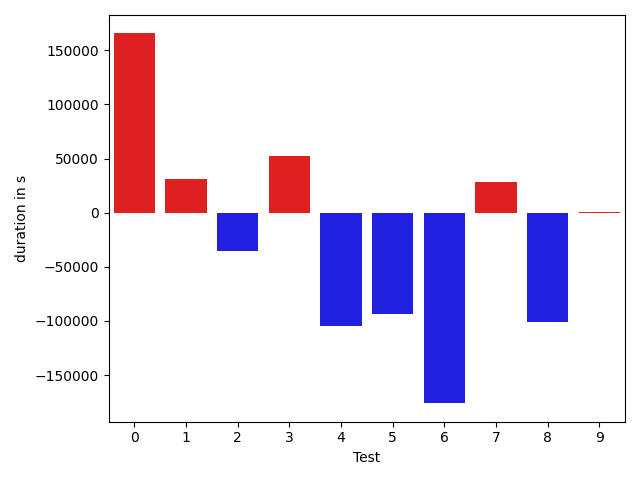

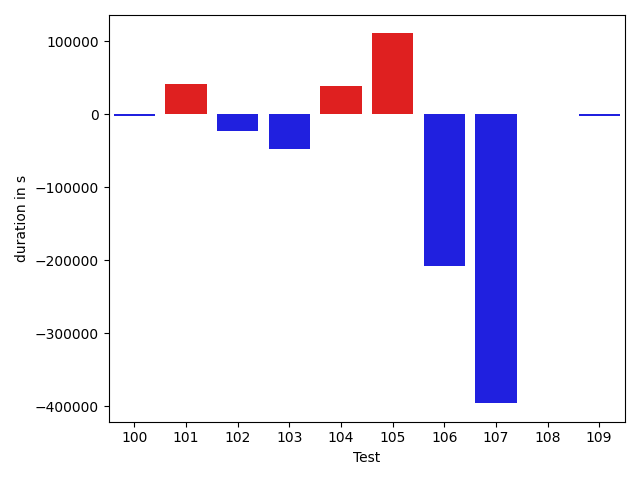

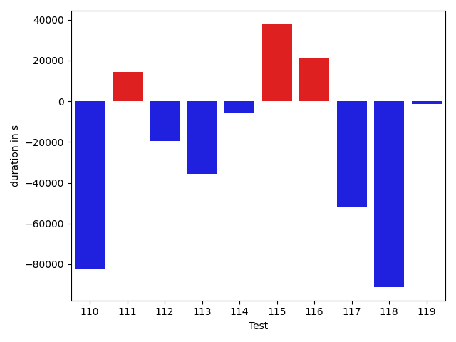

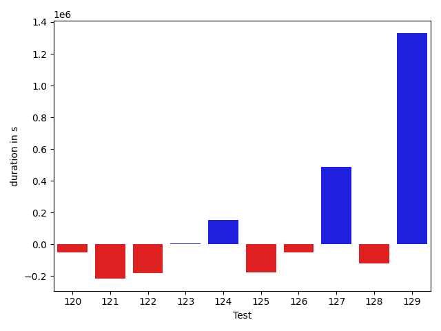

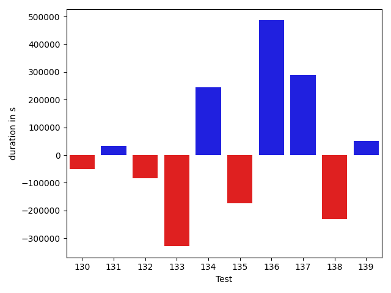

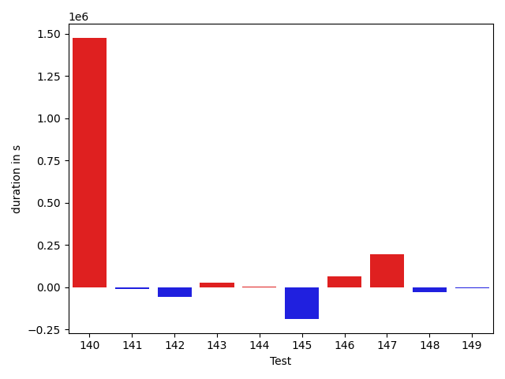

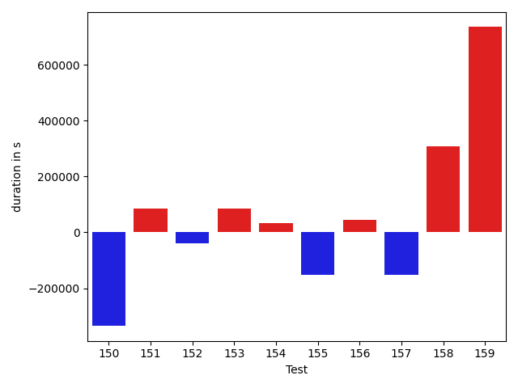

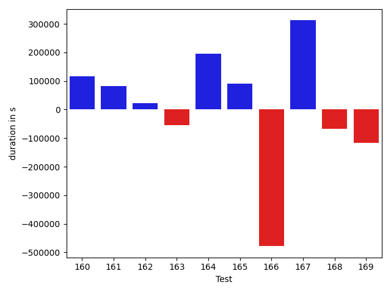

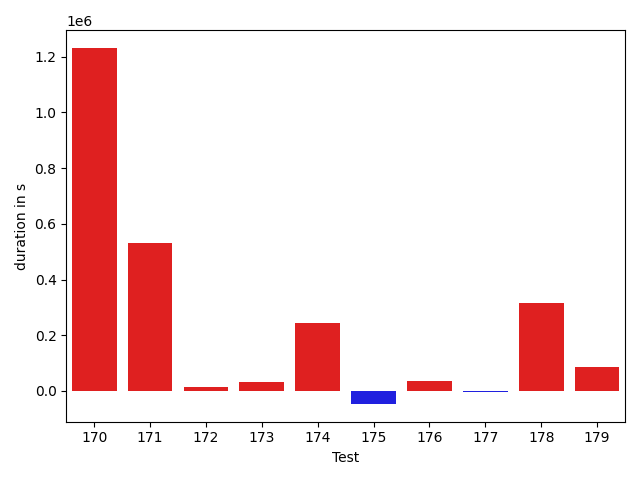

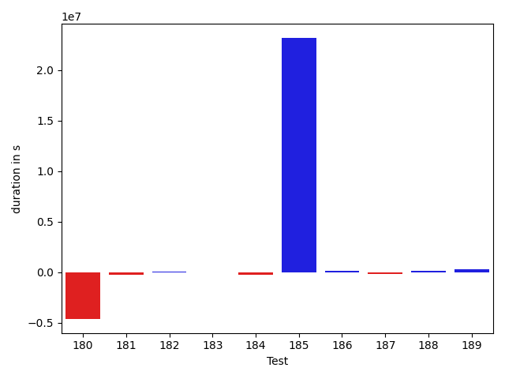

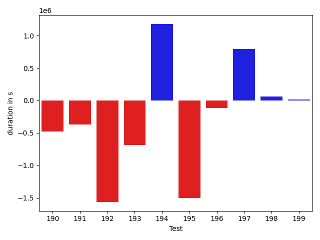

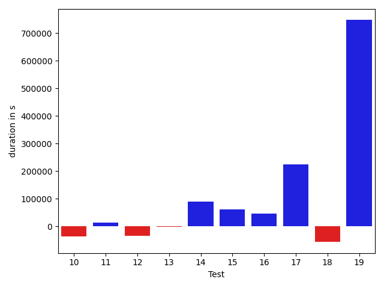

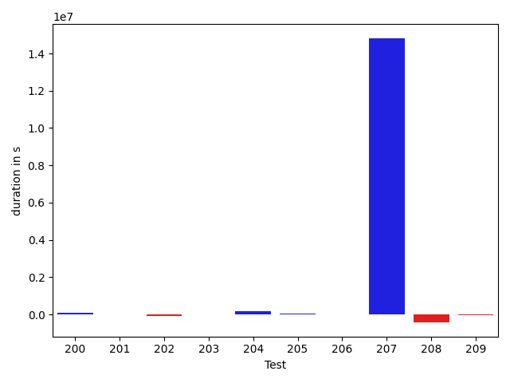

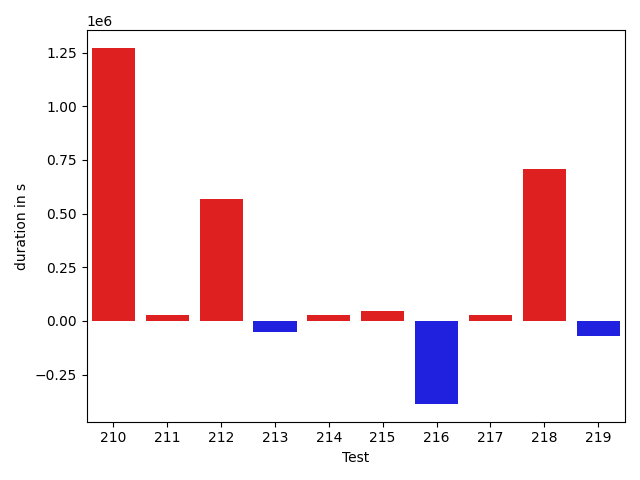

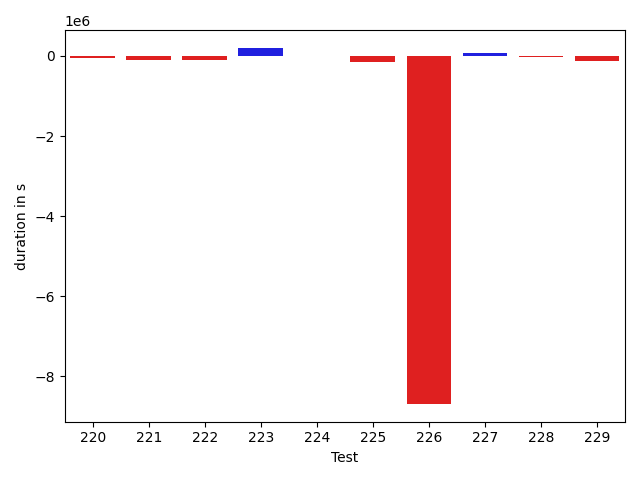

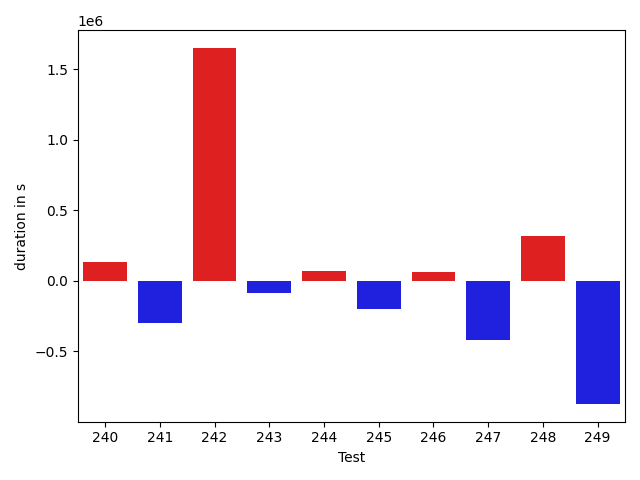

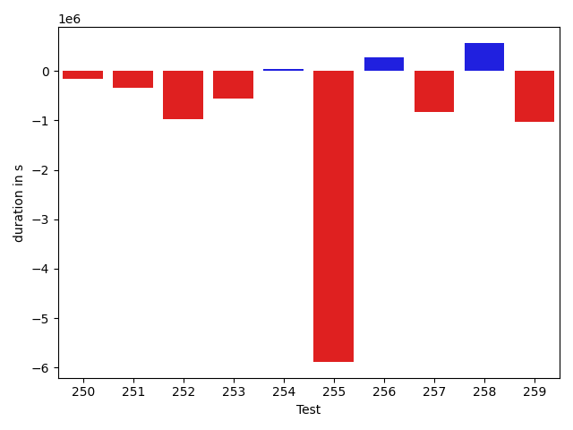

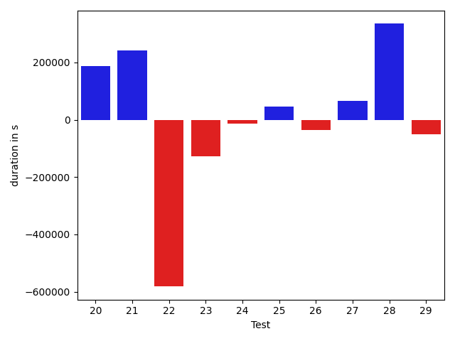

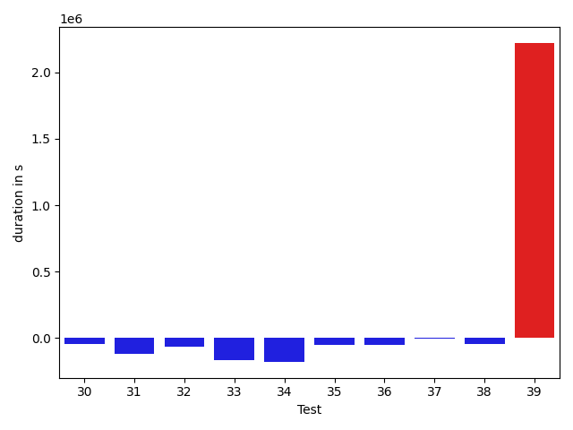

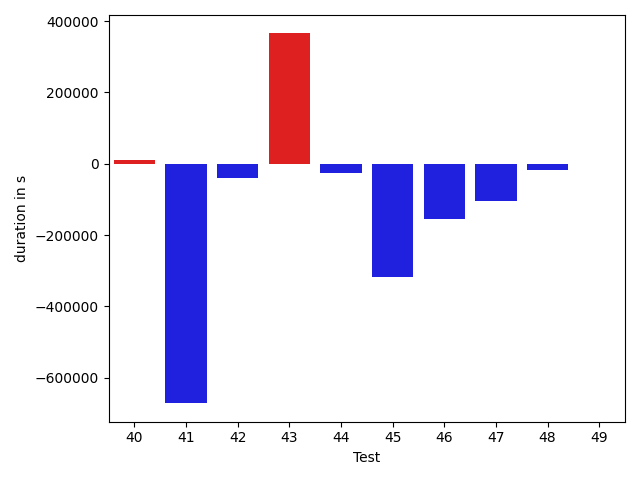

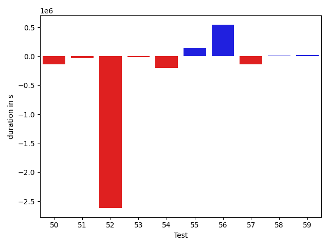

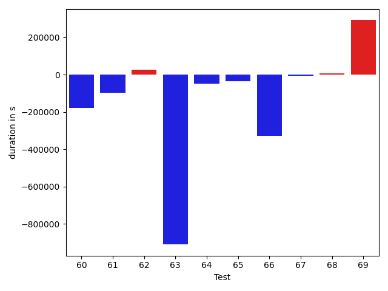

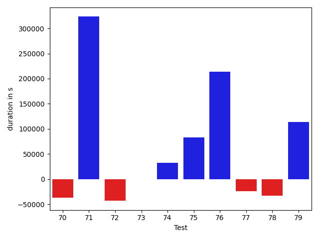

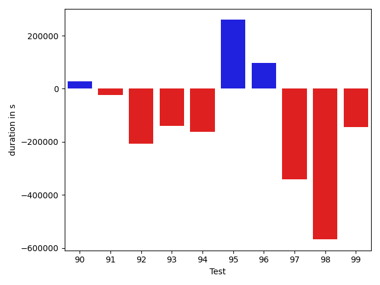

| ID | DurationV1 | DurationsV2 | DeltaDuration |
| --- | --- | --- | --- |
| 0 | 1177513.8927896218 | 1214903.808189128 | 37389.91539950622 |
| 1 | 336518.3981628418 | 624297.8275909424 | 287779.4294281006 |
| 2 | 1015296.390380005 | 1000938.1801236684 | -14358.210256336606 |
| 3 | 1576854.5354470746 | 6659456.367947753 | 5082601.832500678 |
| 4 | 923817.0694333428 | 4848897.792797815 | 3925080.7233644724 |
| 5 | 404820.7729797363 | 348964.61576867104 | -55856.15721106529 |
| 6 | 594617.0341404733 | 641101.5815518764 | 46484.54741140304 |
| 7 | 763703.0985535008 | 752029.8139429248 | -11673.284610575996 |
| 8 | 387279.6752381432 | 1051216.0201609498 | 663936.3449228066 |
| 9 | 430508.709854126 | 667737.84375 | 237229.13389587402 |
| 10 | 383787.7733078003 | 347764.7737121582 | -36022.99959564209 |
| 11 | 511984.9526975155 | 526224.0588006442 | 14239.106103128754 |
| 12 | 488105.10237699747 | 453576.2318388149 | -34528.87053818256 |
| 13 | 551827.2880829498 | 549508.7867031856 | -2318.501379764173 |
| 14 | 368785.11566127837 | 459176.9710871354 | 90391.85542585701 |
| 15 | 495334.1424598694 | 556372.1396237612 | 61037.99716389179 |
| 16 | 633812.9253587723 | 680465.6045838818 | 46652.67922510952 |
| 17 | 537018.6015861556 | 762421.8139604349 | 225403.21237427928 |
| 18 | 516724.41322728246 | 460679.6417667381 | -56044.771460544376 |
| 19 | 600103.792822723 | 1347055.5780995549 | 746951.7852768318 |
| 20 | 545099.6319198234 | 731365.3280706271 | 186265.6961508037 |
| 21 | 665073.497106428 | 906154.5008330697 | 241081.00372664165 |
| 22 | 2223290.881377293 | 1641808.8731843508 | -581482.008192942 |
| 23 | 1408391.2059060102 | 1279844.7934768086 | -128546.41242920165 |
| 24 | 1193002.726225807 | 1180443.2722435251 | -12559.453982281964 |
| 25 | 967962.7239453003 | 1014351.9214133258 | 46389.19746802549 |
| 26 | 1049730.9493617315 | 1013637.5169440414 | -36093.43241769017 |
| 27 | 999290.6837372017 | 1065702.1683128509 | 66411.48457564914 |
| 28 | 856562.3122413427 | 1191315.550376922 | 334753.23813557916 |
| 29 | 933096.1065094223 | 882434.8329322336 | -50661.273577188724 |
| 30 | 595042.4630866937 | 1046069.6376054557 | 451027.17451876204 |
| 31 | 1807997.096241588 | 2073803.3114110115 | 265806.2151694235 |
| 32 | 493313.06892674416 | 683069.5253676253 | 189756.45644088113 |
| 33 | 993017.0861887529 | 1106443.7286984068 | 113426.64250965393 |
| 34 | 2146702.4763669604 | 2117058.6414473685 | -29643.8349195919 |
| 35 | 987543.0066068424 | 1208434.5076414093 | 220891.5010345669 |
| 36 | 932446.7951700492 | 1043124.5618549366 | 110677.76668488747 |
| 37 | 1175207.559484165 | 1362830.9345037239 | 187623.37501955894 |
| 38 | 983156.6348016844 | 1094626.2320808207 | 111469.5972791363 |
| 39 | 1890320.1851375662 | 1976071.343036303 | 85751.15789873688 |
| 40 | 968229.6557050024 | 1076651.931222076 | 108422.2755170737 |
| 41 | 1050491.5212160936 | 1218591.5685197227 | 168100.0473036291 |
| 42 | 6845199.405855844 | 5072944.673993103 | -1772254.7318627406 |
| 43 | 4598845.195769826 | 4304882.234999854 | -293962.96076997183 |
| 44 | 827473.385991618 | 536417.8767715376 | -291055.50922008045 |
| 45 | 603505.1459318986 | 484080.17267280794 | -119424.97325909068 |
| 46 | 932566.4004558783 | 475428.81128000095 | -457137.5891758774 |
| 47 | 429716.02659606934 | 474269.7325450778 | 44553.705949008465 |
| 48 | 1903454.1449198253 | 2555281.1166055202 | 651826.971685695 |
| 49 | 881667.9257289957 | 939811.0137808035 | 58143.088051807834 |
| 50 | 779572.182639288 | 640318.8841676194 | -139253.29847166862 |
| 51 | 468387.00384902954 | 432440.2432575226 | -35946.76059150696 |
| 52 | 3207119.6719645904 | 594925.4923859676 | -2612194.179578623 |
| 53 | 362434.6079711914 | 350369.8025588989 | -12064.80541229248 |
| 54 | 785730.7504134914 | 588055.6392057798 | -197675.11120771163 |
| 55 | 950412.2756952033 | 1092716.236366155 | 142303.96067095175 |
| 56 | 1005242.7354125291 | 1550502.7691775332 | 545260.0337650041 |
| 57 | 767333.329290549 | 627881.9762487379 | -139451.35304181115 |
| 58 | 362260.9499359131 | 377587.27266067266 | 15326.322724759579 |
| 59 | 376391.81228637695 | 395490.0621910095 | 19098.24990463257 |
| 60 | 798261.6525596322 | 682159.104971525 | -116102.54758810718 |
| 61 | 728144.7494683017 | 825825.4475531593 | 97680.69808485766 |
| 62 | 1198431.844832276 | 1384064.506074299 | 185632.6612420231 |
| 63 | 700953.8258187465 | 944636.1836914984 | 243682.3578727519 |
| 64 | 1094443.307361911 | 1818600.7960581211 | 724157.4886962101 |
| 65 | 812100.3616066825 | 1047839.5386867963 | 235739.1770801138 |
| 66 | 515110.81230505183 | 647285.1882523447 | 132174.3759472929 |
| 67 | 738130.4550126551 | 2926112.0547855236 | 2187981.5997728687 |
| 68 | 825580.7410654078 | 1011331.7014061495 | 185750.9603407418 |
| 69 | 996644.488076211 | 3122744.745610361 | 2126100.25753415 |
| 70 | 705226.2989917059 | 668125.5597495304 | -37100.73924217548 |
| 71 | 602698.75934914 | 926151.3781350369 | 323452.6187858969 |
| 72 | 1081988.3089031952 | 1038717.6888199152 | -43270.620083280024 |
| 73 | 755361.8649910719 | 755453.6196382458 | 91.75464717391878 |
| 74 | 390002.4512089491 | 421953.36082458496 | 31950.909615635872 |
| 75 | 383802.46706300974 | 466748.61447930336 | 82946.14741629362 |
| 76 | 787810.0227848445 | 1001366.8983958021 | 213556.87561095762 |
| 77 | 600126.3147466371 | 575866.5979966534 | -24259.716749983723 |
| 78 | 687667.9311946498 | 654441.1105664345 | -33226.820628215326 |
| 79 | 874626.4684780403 | 988319.5943738918 | 113693.12589585152 |
| 80 | 549094.0914085507 | 562384.2861668845 | 13290.194758333731 |
| 81 | 905325.4805718604 | 598555.624115151 | -306769.85645670944 |
| 82 | 608861.6722600964 | 707613.5259425803 | 98751.8536824839 |
| 83 | 572840.1805808842 | 589835.734085083 | 16995.55350419879 |
| 84 | 518428.1195833492 | 532396.0424041748 | 13967.922820825595 |
| 85 | 553768.8909852427 | 679367.1761536279 | 125598.28516838525 |
| 86 | 546738.1847920635 | 821575.1840867167 | 274836.9992946532 |
| 87 | 401006.94810676575 | 388762.5549850464 | -12244.39312171936 |
| 88 | 546481.2406973839 | 424552.6593327001 | -121928.5813646838 |
| 89 | 475781.8048560764 | 707458.7967016533 | 231676.9918455769 |
| 90 | 432251.1625431031 | 460978.01652920246 | 28726.853986099362 |
| 91 | 523005.8613562584 | 500040.41100883484 | -22965.450347423553 |
| 92 | 645019.5712165833 | 438433.9527540207 | -206585.61846256256 |
| 93 | 636981.6661565765 | 498077.80788727547 | -138903.858269301 |
| 94 | 566561.7767791748 | 403896.36361646093 | -162665.41316271387 |
| 95 | 700143.4224820854 | 959690.5756538212 | 259547.15317173582 |
| 96 | 400318.6816763878 | 497316.03306465875 | 96997.35138827097 |
| 97 | 1053798.8851217916 | 711363.0485461894 | -342435.8365756022 |
| 98 | 1184206.8594807982 | 616275.9690064691 | -567930.8904743291 |
| 99 | 544675.4427461624 | 399503.14867850393 | -145172.29406765848 |
| 100 | 561392.7031543143 | 609311.2764704505 | 47918.57331613614 |
| 101 | 393552.34282684326 | 406780.68258339167 | 13228.339756548405 |
| 102 | 434289.2791900635 | 420516.15314412117 | -13773.126045942307 |
| 103 | 821747.9121958613 | 656307.1688176692 | -165440.7433781922 |
| 104 | 4000645.2640885217 | 2606920.786661043 | -1393724.4774274789 |
| 105 | 510625.29043877125 | 432751.29965245724 | -77873.99078631401 |
| 106 | 1002680.0685981361 | 933997.3369247545 | -68682.73167338152 |
| 107 | 2774909.4536247556 | 479009.9488548711 | -2295899.5047698845 |
| 108 | 607978.2271472067 | 580464.4926719666 | -27513.73447524011 |
| 109 | 897843.4347703996 | 977855.8244787989 | 80012.3897083993 |
| 110 | 556604.796304754 | 900404.3727347058 | 343799.5764299518 |
| 111 | 863465.2039715569 | 922912.6752352966 | 59447.471263739746 |
| 112 | 611649.9585227668 | 463822.67204200925 | -147827.28648075758 |
| 113 | 888314.9299071981 | 682034.6133760607 | -206280.31653113733 |
| 114 | 848425.0487094386 | 662629.8920797461 | -185795.15662969253 |
| 115 | 1546584.9679438695 | 857194.591804801 | -689390.3761390685 |
| 116 | 877357.9789821021 | 767983.8551507216 | -109374.12383138051 |
| 117 | 678694.0117200505 | 545397.6290409754 | -133296.38267907512 |
| 118 | 4231337.854254138 | 2601197.1362151215 | -1630140.7180390162 |
| 119 | 2737452.89310183 | 751880.7193448383 | -1985572.1737569917 |
| 120 | 997317.4927208014 | 946716.3220255483 | -50601.170695253066 |
| 121 | 884559.7033502315 | 668966.3503334487 | -215593.35301678278 |
| 122 | 793541.4084141094 | 610892.0439975337 | -182649.36441657564 |
| 123 | 954964.375090941 | 960963.8475252648 | 5999.472434323863 |
| 124 | 832842.7641687646 | 984661.0308824591 | 151818.26671369455 |
| 125 | 702330.5242212936 | 525882.2311853543 | -176448.29303593934 |
| 126 | 1101719.901333136 | 1052049.0840789548 | -49670.81725418125 |
| 127 | 1345138.6561187534 | 1832104.5635878677 | 486965.9074691143 |
| 128 | 1159013.383504958 | 1039170.3056699745 | -119843.07783498336 |
| 129 | 847830.4687492521 | 2178468.966818405 | 1330638.4980691527 |
| 130 | 637476.6839744989 | 587289.2827098221 | -50187.401264676824 |
| 131 | 672245.6721822186 | 704252.2425507607 | 32006.570368542103 |
| 132 | 797623.4254923784 | 713496.715685636 | -84126.70980674238 |
| 133 | 1394691.3553808338 | 1065988.9325271181 | -328702.4228537157 |
| 134 | 424191.28774929047 | 668786.5663852692 | 244595.2786359787 |
| 135 | 1146976.2430139096 | 972066.0685436836 | -174910.17447022593 |
| 136 | 573001.2459434271 | 1058798.0456848461 | 485796.79974141903 |
| 137 | 902743.3234140223 | 1191252.5637642965 | 288509.24035027414 |
| 138 | 985957.546707252 | 754583.8545239891 | -231373.6921832629 |
| 139 | 795376.8799266183 | 846695.8503610084 | 51318.970434390125 |
| 140 | 560469.5652610399 | 713922.8903060002 | 153453.32504496037 |
| 141 | 4076534.499971528 | 3398013.3710674047 | -678521.1289041233 |
| 142 | 2641888.3879563403 | 610567.1597514981 | -2031321.2282048422 |
| 143 | 1164614.5046912115 | 891366.5181930594 | -273247.98649815214 |
| 144 | 1005123.1942690815 | 994302.7582951651 | -10820.43597391632 |
| 145 | 966992.564419955 | 449058.85940790176 | -517933.70501205325 |
| 146 | 1226985.1554190733 | 742356.7208237846 | -484628.4345952887 |
| 147 | 443046.3804605603 | 552642.7138252258 | 109596.33336466551 |
| 148 | 716330.8001820713 | 1185167.1960765151 | 468836.39589444385 |
| 149 | 1383195.8113564635 | 1489517.7551943175 | 106321.94383785408 |
| 150 | 759655.6572330435 | 748382.8400989831 | -11272.817134060315 |
| 151 | 554303.5152867474 | 580749.7947097381 | 26446.279422990745 |
| 152 | 758425.5844953911 | 806095.6126002285 | 47670.0281048374 |
| 153 | 1406191.1283161445 | 2865839.491040171 | 1459648.3627240267 |
| 154 | 731244.9550357736 | 2794489.1693717223 | 2063244.2143359487 |
| 155 | 473199.8264008984 | 580314.3295899034 | 107114.50318900496 |
| 156 | 1255803.3206504302 | 1380405.12129603 | 124601.80064559984 |
| 157 | 1322548.0900561535 | 1783068.4043560685 | 460520.314299915 |
| 158 | 932708.9051804873 | 988954.6591460011 | 56245.75396551378 |
| 159 | 816822.4423897712 | 837503.1486281077 | 20680.706238336512 |
| 160 | 1144671.4269094213 | 1260489.0283254636 | 115817.60141604231 |
| 161 | 759770.7711607519 | 842444.0337580676 | 82673.26259731571 |
| 162 | 743646.4632562797 | 765742.8792256216 | 22096.415969341877 |
| 163 | 875107.4374902537 | 820043.7191576615 | -55063.718332592165 |
| 164 | 1622093.3693533642 | 1818056.3782597703 | 195963.00890640612 |
| 165 | 1118199.9316356839 | 1209067.10058327 | 90867.16894758609 |
| 166 | 1332795.6423889399 | 854277.4165402353 | -478518.2258487046 |
| 167 | 689221.8134172255 | 1001499.3995702157 | 312277.58615299023 |
| 168 | 536507.5365743637 | 468482.4613893032 | -68025.0751850605 |
| 169 | 1121634.4933975202 | 1004054.7476581293 | -117579.74573939084 |
| 170 | 960173.2173085755 | 937994.5447226496 | -22178.672585925902 |
| 171 | 2398477.1687315535 | 3878162.5026080254 | 1479685.333876472 |
| 172 | 1216112.4857087987 | 1284850.3771547298 | 68737.89144593105 |
| 173 | 859736.7065084924 | 810480.2659948238 | -49256.44051366858 |
| 174 | 471829.6106205639 | 490895.2495109023 | 19065.638890338363 |
| 175 | 571461.395506015 | 593538.7603534758 | 22077.36484746076 |
| 176 | 710624.3735978459 | 994902.4499970719 | 284278.076399226 |
| 177 | 643142.4434450865 | 619349.5211180449 | -23792.922327041626 |
| 178 | 1222610.5843879727 | 953192.9914245064 | -269417.5929634663 |
| 179 | 8827059.42174868 | 11629389.62731579 | 2802330.2055671103 |
| 180 | 14528192.293853372 | 9886044.251053996 | -4642148.042799376 |
| 181 | 1025209.5194180675 | 776373.1704489305 | -248836.34896913706 |
| 182 | 688658.3904947788 | 709120.6540298536 | 20462.26353507489 |
| 183 | 1227796.7772432002 | 1220806.0381809417 | -6990.739062258508 |
| 184 | 1045088.9874245807 | 787335.5520686747 | -257753.43535590603 |
| 185 | 1478203.332226664 | 24672152.48571739 | 23193949.153490726 |
| 186 | 733498.9614341464 | 869802.1020240958 | 136303.14058994944 |
| 187 | 777695.5316535037 | 582701.4794702521 | -194994.0521832516 |
| 188 | 845625.7183201492 | 973196.2569335025 | 127570.53861335327 |
| 189 | 684614.2247839621 | 965049.5077469153 | 280435.2829629532 |
| 190 | 1421058.250080606 | 943350.9476785666 | -477707.3024020394 |
| 191 | 1488196.8456725734 | 1117180.2829840202 | -371016.56268855324 |
| 192 | 2405884.6228987384 | 841001.9999591776 | -1564882.6229395608 |
| 193 | 1616764.9453563138 | 931753.6832184113 | -685011.2621379026 |
| 194 | 2836332.5446924237 | 4015343.2012771387 | 1179010.656584715 |
| 195 | 2579701.967881183 | 1074247.2791192988 | -1505454.6887618843 |
| 196 | 816012.1349001089 | 696174.7392964488 | -119837.39560366014 |
| 197 | 561553.1141448766 | 1353133.21753337 | 791580.1033884934 |
| 198 | 562109.3871917799 | 624895.7818212509 | 62786.394629471004 |
| 199 | 437604.2185652256 | 449997.2175168991 | 12392.998951673508 |
| 200 | 413230.0813064575 | 521479.99490098655 | 108249.91359452903 |
| 201 | 1073867.0179443806 | 1076213.3683773354 | 2346.3504329547286 |
| 202 | 740280.5443590902 | 660512.9366459455 | -79767.60771314462 |
| 203 | 821916.262573287 | 845940.4708580743 | 24024.20828478725 |
| 204 | 630041.897159175 | 828392.9209414445 | 198351.02378226945 |
| 205 | 991166.4592022719 | 1023238.475586143 | 32072.016383871087 |
| 206 | 820303.9054448245 | 810063.9484882205 | -10239.95695660403 |
| 207 | 16323265.154378997 | 31137790.18515473 | 14814525.030775731 |
| 208 | 1362913.5486511267 | 948352.1331396608 | -414561.41551146586 |
| 209 | 709053.7125187183 | 663876.5577641889 | -45177.154754529474 |
| 210 | 1220009.161270357 | 977454.0882198645 | -242555.07305049244 |
| 211 | 2778475.4523530765 | 579889.2358375723 | -2198586.2165155043 |
| 212 | 599301.5686712103 | 446914.66880989075 | -152386.89986131957 |
| 213 | 492431.8925304413 | 393483.4190311432 | -98948.4734992981 |
| 214 | 1498455.7495017308 | 986479.4664503179 | -511976.2830514129 |
| 215 | 4762445.513681424 | 2096761.395644066 | -2665684.118037358 |
| 216 | 5376978.855174059 | 2562528.1203774298 | -2814450.7347966293 |
| 217 | 896842.42338629 | 942595.5033946398 | 45753.08000834985 |
| 218 | 1604566.793738617 | 2657728.150779837 | 1053161.3570412197 |
| 219 | 908574.1250718466 | 1185872.2598429755 | 277298.1347711289 |
| 220 | 1269341.4883255134 | 1219762.9366456403 | -49578.55167987314 |
| 221 | 749264.0782056516 | 646415.137251022 | -102848.94095462956 |
| 222 | 1054375.3865938163 | 947097.1323150411 | -107278.25427877519 |
| 223 | 500871.37030748976 | 700027.709705472 | 199156.33939798223 |
| 224 | 715545.8455711901 | 718851.6940352768 | 3305.848464086652 |
| 225 | 1006652.2104406747 | 866150.3893379031 | -140501.82110277156 |
| 226 | 23739157.016599648 | 15052362.998041196 | -8686794.018558452 |
| 227 | 802897.4700724948 | 877335.9498490692 | 74438.47977657442 |
| 228 | 674493.8518303633 | 636177.946988184 | -38315.90484217927 |
| 229 | 1075194.1812888896 | 940446.1311817768 | -134748.05010711285 |
| 230 | 1057293.7109617065 | 1005837.706590273 | -51456.00437143352 |
| 231 | 631985.8250181489 | 546674.0238437653 | -85311.80117438361 |
| 232 | 522841.2737851143 | 504521.7083752528 | -18319.565409861505 |
| 233 | 789827.1046846509 | 758466.0921369791 | -31361.012547671795 |
| 234 | 485176.84364044666 | 708073.0289421082 | 222896.1853016615 |
| 235 | 3635714.362076834 | 2594355.8647312685 | -1041358.4973455654 |
| 236 | 1352731.3637226848 | 1347287.3079586779 | -5444.055764006916 |
| 237 | 565331.5660389885 | 541553.8382009715 | -23777.727838017046 |
| 238 | 3112903.8514452795 | 4247598.476387736 | 1134694.6249424568 |
| 239 | 841016.1952854288 | 711583.6888344025 | -129432.5064510263 |
| 240 | 527993.6340701857 | 596286.3529078364 | 68292.71883765073 |
| 241 | 2267418.5157978255 | 3225435.144408717 | 958016.6286108913 |
| 242 | 476086.5388585329 | 687692.7208405957 | 211606.18198206276 |
| 243 | 651570.0025585406 | 1208394.079948932 | 556824.0773903914 |
| 244 | 470769.6216412559 | 628889.8946655318 | 158120.2730242759 |
| 245 | 569504.6962646018 | 1017467.7361954087 | 447963.03993080696 |
| 246 | 595196.8634592046 | 1148509.0188832711 | 553312.1554240666 |
| 247 | 496860.11874997616 | 558948.7974755783 | 62088.678725602105 |
| 248 | 2721318.0891195717 | 2118527.4555276185 | -602790.6335919532 |
| 249 | 1719372.4186118906 | 1303735.7401983922 | -415636.67841349845 |
| 250 | 1216359.1102947255 | 1065800.2647823812 | -150558.84551234427 |
| 251 | 886001.3993966433 | 537514.9447011125 | -348486.4546955308 |
| 252 | 1729482.6622294928 | 747607.9820679878 | -981874.680161505 |
| 253 | 980721.5694683949 | 416854.18789008015 | -563867.3815783147 |
| 254 | 714257.864873836 | 759137.031468059 | 44879.166594223 |
| 255 | 6483009.819933569 | 596276.6304409022 | -5886733.189492667 |
| 256 | 690684.546081638 | 969142.6791333384 | 278458.1330517004 |
| 257 | 1656639.3016659678 | 833975.9661217488 | -822663.335544219 |
| 258 | 688868.4758796692 | 1255843.8131108284 | 566975.3372311592 |
| 259 | 2291954.312833826 | 1260441.6486791233 | -1031512.6641547028 |

## Misc.

| ID | Test Class | Test Method |
| --- | --- | --- |
| 0 | com.google.gson.functional.StreamingTypeAdaptersTest | testNullSafe |
| 1 | com.google.gson.functional.StreamingTypeAdaptersTest | testDeserializeNullObject |
| 2 | com.google.gson.functional.StreamingTypeAdaptersTest | testSerializeWithCustomTypeAdapter |
| 3 | com.google.gson.functional.StreamingTypeAdaptersTest | testSerialize |
| 4 | com.google.gson.functional.StreamingTypeAdaptersTest | testDeserialize |
| 5 | com.google.gson.functional.StreamingTypeAdaptersTest | testSerializeNullField |
| 6 | com.google.gson.functional.StreamingTypeAdaptersTest | testDeserializeWithCustomTypeAdapter |
| 7 | com.google.gson.functional.StreamingTypeAdaptersTest | testSerializeRecursive |
| 8 | com.google.gson.functional.StreamingTypeAdaptersTest | testFromJsonTree |
| 9 | com.google.gson.functional.StreamingTypeAdaptersTest | testSerializeNullObject |
| 10 | com.google.gson.functional.StreamingTypeAdaptersTest | testDeserializeNullField |
| 11 | com.google.gson.MixedStreamTest | testReaderDoesNotMutateState |
| 12 | com.google.gson.MixedStreamTest | testWriteDoesNotMutateState |
| 13 | com.google.gson.MixedStreamTest | testWriteMixedStreamed |
| 14 | com.google.gson.MixedStreamTest | testWriteClosed |
| 15 | com.google.gson.MixedStreamTest | testWriteInvalidState |
| 16 | com.google.gson.MixedStreamTest | testReadMixedStreamed |
| 17 | com.google.gson.functional.JsonParserTest | testBadTypeForDeserializingCustomTree |
| 18 | com.google.gson.functional.JsonParserTest | testBadFieldTypeForCustomDeserializerCustomTree |
| 19 | com.google.gson.functional.JsonParserTest | testChangingCustomTreeAndDeserializing |
| 20 | com.google.gson.functional.JsonParserTest | testBadFieldTypeForDeserializingCustomTree |
| 21 | com.google.gson.functional.JsonParserTest | testDeserializingCustomTree |
| 22 | com.google.gson.functional.ThrowableFunctionalTest | testExceptionWithoutCause |
| 23 | com.google.gson.functional.ThrowableFunctionalTest | testSerializedNameOnExceptionFields |
| 24 | com.google.gson.functional.ThrowableFunctionalTest | testErrornWithCause |
| 25 | com.google.gson.functional.ThrowableFunctionalTest | testErrorWithoutCause |
| 26 | com.google.gson.functional.ThrowableFunctionalTest | testExceptionWithCause |
| 27 | com.google.gson.functional.ParameterizedTypesTest | testParameterizedTypeGenericArraysSerialization |
| 28 | com.google.gson.functional.ParameterizedTypesTest | testParameterizedTypesWithWriterSerialization |
| 29 | com.google.gson.functional.ParameterizedTypesTest | testParameterizedTypeWithReaderDeserialization |
| 30 | com.google.gson.functional.ParameterizedTypesTest | testDeepParameterizedTypeDeserialization |
| 31 | com.google.gson.functional.ParameterizedTypesTest | testParameterizedTypesSerialization |
| 32 | com.google.gson.functional.ParameterizedTypesTest | testDeepParameterizedTypeSerialization |
| 33 | com.google.gson.functional.ParameterizedTypesTest | testVariableTypeDeserialization |
| 34 | com.google.gson.functional.ParameterizedTypesTest | testVariableTypeFieldsAndGenericArraysSerialization |
| 35 | com.google.gson.functional.ParameterizedTypesTest | testParameterizedTypeGenericArraysDeserialization |
| 36 | com.google.gson.functional.ParameterizedTypesTest | testParameterizedTypeDeserialization |
| 37 | com.google.gson.functional.ParameterizedTypesTest | testVariableTypeFieldsAndGenericArraysDeserialization |
| 38 | com.google.gson.functional.ParameterizedTypesTest | testTypesWithMultipleParametersDeserialization |
| 39 | com.google.gson.functional.ParameterizedTypesTest | testTypesWithMultipleParametersSerialization |
| 40 | com.google.gson.functional.ParameterizedTypesTest | testParameterizedTypeWithVariableTypeDeserialization |
| 41 | com.google.gson.functional.ParameterizedTypesTest | testVariableTypeArrayDeserialization |
| 42 | com.google.gson.functional.CircularReferenceTest | testCircularSerialization |
| 43 | com.google.gson.functional.CircularReferenceTest | testSelfReferenceArrayFieldSerialization |
| 44 | com.google.gson.functional.CircularReferenceTest | testSelfReferenceIgnoredInSerialization |
| 45 | com.google.gson.functional.CircularReferenceTest | testDirectedAcyclicGraphSerialization |
| 46 | com.google.gson.functional.CircularReferenceTest | testDirectedAcyclicGraphDeserialization |
| 47 | com.google.gson.functional.InheritanceTest | testBaseSerializedAsSubWhenSpecifiedWithExplicitType |
| 48 | com.google.gson.functional.InheritanceTest | testSubInterfacesOfCollectionSerialization |
| 49 | com.google.gson.functional.InheritanceTest | testSubInterfacesOfCollectionDeserialization |
| 50 | com.google.gson.functional.InheritanceTest | testClassWithBaseArrayFieldSerialization |
| 51 | com.google.gson.functional.InheritanceTest | testBaseSerializedAsSub |
| 52 | com.google.gson.functional.InheritanceTest | testSubClassDeserialization |
| 53 | com.google.gson.functional.InheritanceTest | testBaseSerializedAsSubWhenSpecifiedWithExplicitTypeForToJsonMethod |
| 54 | com.google.gson.functional.InheritanceTest | testClassWithBaseCollectionFieldSerialization |
| 55 | com.google.gson.functional.InheritanceTest | testSubClassSerialization |
| 56 | com.google.gson.functional.InheritanceTest | testBaseSerializedAsBaseWhenSpecifiedWithExplicitTypeForToJsonMethod |
| 57 | com.google.gson.functional.InheritanceTest | testClassWithBaseFieldSerialization |
| 58 | com.google.gson.functional.InheritanceTest | testBaseSerializedAsBaseWhenSpecifiedWithExplicitType |
| 59 | com.google.gson.functional.InheritanceTest | testBaseSerializedAsSubForToJsonMethod |
| 60 | com.google.gson.functional.PrettyPrintingTest | testEmptyMapField |
| 61 | com.google.gson.functional.PrettyPrintingTest | testPrettyPrintArrayOfObjects |
| 62 | com.google.gson.functional.PrettyPrintingTest | testPrettyPrintList |
| 63 | com.google.gson.functional.MapTest | testMapSerializationWithNullValues |
| 64 | com.google.gson.functional.MapTest | testInterfaceTypeMapWithSerializer |
| 65 | com.google.gson.functional.MapTest | testComplexKeysSerialization |
| 66 | com.google.gson.functional.MapTest | testMapSerializationWithNullValuesSerialized |
| 67 | com.google.gson.functional.MapTest | testComplexKeysDeserialization |
| 68 | com.google.gson.functional.MapTest | testGeneralMapField |
| 69 | com.google.gson.functional.MapTest | testInterfaceTypeMap |
| 70 | com.google.gson.functional.ObjectTest | testEmptyCollectionInAnObjectDeserialization |
| 71 | com.google.gson.functional.ObjectTest | testArrayOfArraysDeserialization |
| 72 | com.google.gson.functional.ObjectTest | testSingletonLists |
| 73 | com.google.gson.functional.ObjectTest | testArrayOfObjectsAsFields |
| 74 | com.google.gson.functional.ObjectTest | testPrimitiveArrayFieldSerialization |
| 75 | com.google.gson.functional.ObjectTest | testNullArraysDeserialization |
| 76 | com.google.gson.functional.ObjectTest | testInnerClassSerialization |
| 77 | com.google.gson.functional.ObjectTest | testBagOfPrimitiveWrappersSerialization |
| 78 | com.google.gson.functional.ObjectTest | testArrayOfObjectsDeserialization |
| 79 | com.google.gson.functional.ObjectTest | testArrayOfArraysSerialization |
| 80 | com.google.gson.functional.ObjectTest | testNullFieldsDeserialization |
| 81 | com.google.gson.functional.ObjectTest | testArrayOfObjectsSerialization |
| 82 | com.google.gson.functional.ObjectTest | testInnerClassDeserialization |
| 83 | com.google.gson.functional.ObjectTest | testClassWithTransientFieldsDeserialization |
| 84 | com.google.gson.functional.ObjectTest | testStringFieldWithNumberValueDeserialization |
| 85 | com.google.gson.functional.ObjectTest | testStringFieldWithEmptyValueSerialization |
| 86 | com.google.gson.functional.ObjectTest | testClassWithObjectFieldSerialization |
| 87 | com.google.gson.functional.ObjectTest | testObjectFieldNamesWithoutQuotesDeserialization |
| 88 | com.google.gson.functional.ObjectTest | testBagOfPrimitivesSerialization |
| 89 | com.google.gson.functional.ObjectTest | testClassWithTransientFieldsSerialization |
| 90 | com.google.gson.functional.ObjectTest | testNullFieldsSerialization |
| 91 | com.google.gson.functional.ObjectTest | testJsonInMixedQuotesDeserialization |
| 92 | com.google.gson.functional.ObjectTest | testNullObjectFieldsDeserialization |
| 93 | com.google.gson.functional.ObjectTest | testPrimitiveArrayInAnObjectDeserialization |
| 94 | com.google.gson.functional.ObjectTest | testBagOfPrimitivesDeserialization |
| 95 | com.google.gson.functional.ObjectTest | testNestedSerialization |
| 96 | com.google.gson.functional.ObjectTest | testEmptyCollectionInAnObjectSerialization |
| 97 | com.google.gson.functional.ObjectTest | testJsonInSingleQuotesDeserialization |
| 98 | com.google.gson.functional.ObjectTest | testBagOfPrimitiveWrappersDeserialization |
| 99 | com.google.gson.functional.ObjectTest | testNullPrimitiveFieldsDeserialization |
| 100 | com.google.gson.functional.ObjectTest | testPrivateNoArgConstructorDeserialization |
| 101 | com.google.gson.functional.ObjectTest | testClassWithTransientFieldsDeserializationTransientFieldsPassedInJsonAreIgnored |
| 102 | com.google.gson.functional.ObjectTest | testStringFieldWithEmptyValueDeserialization |
| 103 | com.google.gson.functional.ObjectTest | testNestedDeserialization |
| 104 | com.google.gson.functional.ExposeFieldsTest | testNullExposeFieldSerialization |
| 105 | com.google.gson.functional.ExposeFieldsTest | testExposedInterfaceFieldDeserialization |
| 106 | com.google.gson.functional.ExposeFieldsTest | testExposedInterfaceFieldSerialization |
| 107 | com.google.gson.functional.ExposeFieldsTest | testExposeAnnotationDeserialization |
| 108 | com.google.gson.functional.ExposeFieldsTest | testExposeAnnotationSerialization |
| 109 | com.google.gson.functional.ExposeFieldsTest | testArrayWithOneNullExposeFieldObjectSerialization |
| 110 | com.google.gson.functional.FieldExclusionTest | testDefaultNestedStaticClassIncluded |
| 111 | com.google.gson.functional.FieldExclusionTest | testDefaultInnerClassExclusion |
| 112 | com.google.gson.functional.CollectionTest | testRawCollectionSerialization |
| 113 | com.google.gson.functional.CollectionTest | testFieldIsArrayList |
| 114 | com.google.gson.functional.CollectionTest | testSetDeserialization |
| 115 | com.google.gson.functional.CollectionTest | testWildcardCollectionField |
| 116 | com.google.gson.functional.CollectionTest | testSetSerialization |
| 117 | com.google.gson.functional.CollectionTest | testCollectionOfBagOfPrimitivesSerialization |
| 118 | com.google.gson.functional.RuntimeTypeAdapterFactoryFunctionalTest | testSubclassesAutomaticallySerialzed |
| 119 | com.google.gson.functional.MoreSpecificTypeSerializationTest | testSubclassFields |
| 120 | com.google.gson.functional.MoreSpecificTypeSerializationTest | testParameterizedSubclassFields |
| 121 | com.google.gson.functional.MoreSpecificTypeSerializationTest | testListOfParameterizedSubclassFields |
| 122 | com.google.gson.functional.MoreSpecificTypeSerializationTest | testMapOfParameterizedSubclassFields |
| 123 | com.google.gson.functional.MoreSpecificTypeSerializationTest | testListOfSubclassFields |
| 124 | com.google.gson.functional.MoreSpecificTypeSerializationTest | testMapOfSubclassFields |
| 125 | com.google.gson.functional.NullObjectAndFieldTest | testExplicitDeserializationOfNulls |
| 126 | com.google.gson.functional.NullObjectAndFieldTest | testPrintPrintingObjectWithNulls |
| 127 | com.google.gson.functional.NullObjectAndFieldTest | testExplicitSerializationOfNullArrayMembers |
| 128 | com.google.gson.functional.NullObjectAndFieldTest | testAbsentJsonElementsAreSetToNull |
| 129 | com.google.gson.functional.NullObjectAndFieldTest | testExplicitNullSetsFieldToNullDuringDeserialization |
| 130 | com.google.gson.functional.NullObjectAndFieldTest | testExplicitSerializationOfNullCollectionMembers |
| 131 | com.google.gson.functional.NullObjectAndFieldTest | testNullWrappedPrimitiveMemberSerialization |
| 132 | com.google.gson.functional.NullObjectAndFieldTest | testExplicitSerializationOfNullStringMembers |
| 133 | com.google.gson.functional.NullObjectAndFieldTest | testExplicitSerializationOfNulls |
| 134 | com.google.gson.functional.NullObjectAndFieldTest | testNullWrappedPrimitiveMemberDeserialization |
| 135 | com.google.gson.JsonParserTest | testReadWriteTwoObjects |
| 136 | com.google.gson.functional.JsonTreeTest | testJsonTreeNull |
| 137 | com.google.gson.functional.JsonTreeTest | testJsonTreeToString |
| 138 | com.google.gson.functional.JsonTreeTest | testToJsonTreeObjectType |
| 139 | com.google.gson.functional.JsonTreeTest | testToJsonTree |
| 140 | com.google.gson.functional.VersioningTest | testVersionedGsonMixingSinceAndUntilDeserialization |
| 141 | com.google.gson.functional.VersioningTest | testVersionedUntilSerialization |
| 142 | com.google.gson.functional.VersioningTest | testVersionedClassesDeserialization |
| 143 | com.google.gson.functional.VersioningTest | testVersionedGsonMixingSinceAndUntilSerialization |
| 144 | com.google.gson.functional.VersioningTest | testVersionedClassesSerialization |
| 145 | com.google.gson.functional.VersioningTest | testVersionedUntilDeserialization |
| 146 | com.google.gson.functional.VersioningTest | testVersionedGsonWithUnversionedClassesSerialization |
| 147 | com.google.gson.functional.VersioningTest | testVersionedGsonWithUnversionedClassesDeserialization |
| 148 | com.google.gson.functional.CustomDeserializerTest | testCustomDeserializerReturnsNull |
| 149 | com.google.gson.functional.CustomDeserializerTest | testJsonTypeFieldBasedDeserialization |
| 150 | com.google.gson.functional.CustomDeserializerTest | testDefaultConstructorNotCalledOnField |
| 151 | com.google.gson.functional.CustomDeserializerTest | testDefaultConstructorNotCalledOnObject |
| 152 | com.google.gson.functional.CustomDeserializerTest | testCustomDeserializerReturnsNullForArrayElementsForArrayField |
| 153 | com.google.gson.functional.SerializedNameTest | testFirstNameIsChosenForSerialization |
| 154 | com.google.gson.functional.SerializedNameTest | testMultipleNamesDeserializedCorrectly |
| 155 | com.google.gson.functional.SerializedNameTest | testMultipleNamesInTheSameString |
| 156 | com.google.gson.functional.JsonAdapterAnnotationOnFieldsTest | testClassAnnotationAdapterFactoryTakesPrecedenceOverDefault |
| 157 | com.google.gson.functional.JsonAdapterAnnotationOnFieldsTest | testClassAnnotationAdapterTakesPrecedenceOverDefault |
| 158 | com.google.gson.functional.JsonAdapterAnnotationOnFieldsTest | testFieldAnnotationTakesPrecedenceOverClassAnnotation |
| 159 | com.google.gson.functional.JsonAdapterAnnotationOnFieldsTest | testJsonAdapterInvokedOnlyForAnnotatedFields |
| 160 | com.google.gson.functional.JsonAdapterAnnotationOnFieldsTest | testFieldAnnotationTakesPrecedenceOverRegisteredTypeAdapter |
| 161 | com.google.gson.functional.JsonAdapterAnnotationOnFieldsTest | testJsonAdapterWrappedInNullSafeAsRequested |
| 162 | com.google.gson.functional.JsonAdapterAnnotationOnFieldsTest | testRegisteredTypeAdapterTakesPrecedenceOverClassAnnotationAdapter |
| 163 | com.google.gson.functional.TypeVariableTest | testBasicTypeVariables |
| 164 | com.google.gson.functional.TypeVariableTest | testAdvancedTypeVariables |
| 165 | com.google.gson.functional.TypeVariableTest | testTypeVariablesViaTypeParameter |
| 166 | com.google.gson.functional.ArrayTest | testSingleNullInArraySerialization |
| 167 | com.google.gson.functional.ArrayTest | testObjectArrayWithNonPrimitivesSerialization |
| 168 | com.google.gson.functional.ArrayTest | testSingleNullInArrayDeserialization |
| 169 | com.google.gson.functional.MapAsArrayTypeAdapterTest | testMultipleEnableComplexKeyRegistrationHasNoEffect |
| 170 | com.google.gson.functional.MapAsArrayTypeAdapterTest | testMapWithTypeVariableDeserialization |
| 171 | com.google.gson.functional.MapAsArrayTypeAdapterTest | testSerializeComplexMapWithTypeAdapter |
| 172 | com.google.gson.functional.MapAsArrayTypeAdapterTest | testMapWithTypeVariableSerialization |
| 173 | com.google.gson.functional.JavaUtilConcurrentAtomicTest | testAtomicLongWithStringSerializationPolicy |
| 174 | com.google.gson.functional.UncategorizedTest | testGsonInstanceReusableForSerializationAndDeserialization |
| 175 | com.google.gson.functional.UncategorizedTest | testStaticFieldsAreNotSerialized |
| 176 | com.google.gson.functional.UncategorizedTest | testInvalidJsonDeserializationFails |
| 177 | com.google.gson.functional.UncategorizedTest | testObjectEqualButNotSameSerialization |
| 178 | com.google.gson.functional.ConcurrencyTest | testSingleThreadSerialization |
| 179 | com.google.gson.functional.ConcurrencyTest | testMultiThreadSerialization |
| 180 | com.google.gson.functional.ConcurrencyTest | testMultiThreadDeserialization |
| 181 | com.google.gson.functional.ConcurrencyTest | testSingleThreadDeserialization |
| 182 | com.google.gson.functional.EscapingTest | testGsonDoubleDeserialization |
| 183 | com.google.gson.functional.EscapingTest | testEscapingObjectFields |
| 184 | com.google.gson.functional.EscapingTest | testGsonAcceptsEscapedAndNonEscapedJsonDeserialization |
| 185 | com.google.gson.functional.FieldNamingTest | testIdentity |
| 186 | com.google.gson.functional.FieldNamingTest | testLowerCaseWithUnderscores |
| 187 | com.google.gson.functional.FieldNamingTest | testLowerCaseWithDashes |
| 188 | com.google.gson.functional.FieldNamingTest | testUpperCamelCase |
| 189 | com.google.gson.functional.FieldNamingTest | testUpperCamelCaseWithSpaces |
| 190 | com.google.gson.functional.RawSerializationTest | testThreeLevelParameterizedObject |
| 191 | com.google.gson.functional.RawSerializationTest | testParameterizedObject |
| 192 | com.google.gson.functional.RawSerializationTest | testCollectionOfObjects |
| 193 | com.google.gson.functional.RawSerializationTest | testTwoLevelParameterizedObject |
| 194 | com.google.gson.functional.InstanceCreatorTest | testInstanceCreatorReturnsBaseType |
| 195 | com.google.gson.functional.InstanceCreatorTest | testInstanceCreatorReturnsSubTypeForField |
| 196 | com.google.gson.functional.InstanceCreatorTest | testInstanceCreatorReturnsSubTypeForTopLevelObject |
| 197 | com.google.gson.functional.SecurityTest | testNonExecutableJsonSerialization |
| 198 | com.google.gson.functional.SecurityTest | testJsonWithNonExectuableTokenWithConfiguredGsonDeserialization |
| 199 | com.google.gson.functional.SecurityTest | testJsonWithNonExectuableTokenWithRegularGsonDeserialization |
| 200 | com.google.gson.functional.SecurityTest | testNonExecutableJsonDeserialization |
| 201 | com.google.gson.functional.CustomTypeAdaptersTest | testCustomTypeAdapterDoesNotAppliesToSubClasses |
| 202 | com.google.gson.functional.CustomTypeAdaptersTest | testEnsureCustomDeserializerNotInvokedForNullValues |
| 203 | com.google.gson.functional.CustomTypeAdaptersTest | testCustomNestedSerializers |
| 204 | com.google.gson.functional.CustomTypeAdaptersTest | testCustomNestedDeserializers |
| 205 | com.google.gson.functional.CustomTypeAdaptersTest | testEnsureCustomSerializerNotInvokedForNullValues |
| 206 | com.google.gson.functional.DefaultTypeAdaptersTest | testUrlNullSerialization |
| 207 | com.google.gson.functional.DefaultTypeAdaptersTest | testNullSerialization |
| 208 | com.google.gson.functional.DefaultTypeAdaptersTest | testBigDecimalFieldSerialization |
| 209 | com.google.gson.functional.DefaultTypeAdaptersTest | testBadValueForBigDecimalDeserialization |
| 210 | com.google.gson.functional.DefaultTypeAdaptersTest | testBigIntegerFieldSerialization |
| 211 | com.google.gson.functional.DefaultTypeAdaptersTest | testBigDecimalFieldDeserialization |
| 212 | com.google.gson.functional.DefaultTypeAdaptersTest | testBigIntegerFieldDeserialization |
| 213 | com.google.gson.functional.DefaultTypeAdaptersTest | testUrlNullDeserialization |
| 214 | com.google.gson.functional.InterfaceTest | testSerializingInterfaceObjectField |
| 215 | com.google.gson.functional.InterfaceTest | testSerializingObjectImplementingInterface |
| 216 | com.google.gson.functional.TypeHierarchyAdapterTest | testTypeHierarchy |
| 217 | com.google.gson.regression.JsonAdapterNullSafeTest | testNullSafeBugDeserialize |
| 218 | com.google.gson.regression.JsonAdapterNullSafeTest | testNullSafeBugSerialize |
| 219 | com.google.gson.functional.TreeTypeAdaptersTest | testDeserializeId |
| 220 | com.google.gson.functional.TreeTypeAdaptersTest | testSerializeId |
| 221 | com.google.gson.functional.JsonAdapterAnnotationOnClassesTest | testSuperclassTypeAdapterNotInvoked |
| 222 | com.google.gson.functional.NamingPolicyTest | testDeprecatedNamingStrategy |
| 223 | com.google.gson.functional.NamingPolicyTest | testGsonWithUpperCamelCaseSpacesPolicySerialiation |
| 224 | com.google.gson.functional.NamingPolicyTest | testGsonWithLowerCaseDashPolicySerialization |
| 225 | com.google.gson.functional.NamingPolicyTest | testGsonWithNonDefaultFieldNamingPolicySerialization |
| 226 | com.google.gson.functional.NamingPolicyTest | testGsonDuplicateNameUsingSerializedNameFieldNamingPolicySerialization |
| 227 | com.google.gson.functional.NamingPolicyTest | testAtSignInSerializedName |
| 228 | com.google.gson.functional.NamingPolicyTest | testGsonWithUpperCamelCaseSpacesPolicyDeserialiation |
| 229 | com.google.gson.functional.NamingPolicyTest | testGsonWithSerializedNameFieldNamingPolicySerialization |
| 230 | com.google.gson.functional.NamingPolicyTest | testComplexFieldNameStrategy |
| 231 | com.google.gson.functional.NamingPolicyTest | testGsonWithSerializedNameFieldNamingPolicyDeserialization |
| 232 | com.google.gson.functional.NamingPolicyTest | testGsonWithLowerCaseUnderscorePolicyDeserialiation |
| 233 | com.google.gson.functional.NamingPolicyTest | testGsonWithLowerCaseDashPolicyDeserialiation |
| 234 | com.google.gson.functional.NamingPolicyTest | testGsonWithLowerCaseUnderscorePolicySerialization |
| 235 | com.google.gson.functional.NamingPolicyTest | testGsonWithNonDefaultFieldNamingPolicyDeserialiation |
| 236 | com.google.gson.GsonTypeAdapterTest | testDeserializerForAbstractClass |
| 237 | com.google.gson.functional.CustomSerializerTest | testBaseClassSerializerInvokedForBaseClassFieldsHoldingSubClassInstances |
| 238 | com.google.gson.functional.CustomSerializerTest | testBaseClassSerializerInvokedForBaseClassFields |
| 239 | com.google.gson.functional.CustomSerializerTest | testSubClassSerializerInvokedForBaseClassFieldsHoldingArrayOfSubClassInstances |
| 240 | com.google.gson.functional.CustomSerializerTest | testSubClassSerializerInvokedForBaseClassFieldsHoldingSubClassInstances |
| 241 | com.google.gson.functional.ExclusionStrategyFunctionalTest | testExclusionStrategySerialization |
| 242 | com.google.gson.functional.ExclusionStrategyFunctionalTest | testExcludeTopLevelClassSerializationDoesNotImpactDeserialization |
| 243 | com.google.gson.functional.ExclusionStrategyFunctionalTest | testExclusionStrategyDeserialization |
| 244 | com.google.gson.functional.ExclusionStrategyFunctionalTest | testExclusionStrategySerializationDoesNotImpactSerialization |
| 245 | com.google.gson.functional.ExclusionStrategyFunctionalTest | testExclusionStrategyWithMode |
| 246 | com.google.gson.functional.ExclusionStrategyFunctionalTest | testExclusionStrategySerializationDoesNotImpactDeserialization |
| 247 | com.google.gson.functional.ExclusionStrategyFunctionalTest | testExcludeTopLevelClassDeserializationDoesNotImpactSerialization |
| 248 | com.google.gson.functional.JavaUtilTest | testCurrency |
| 249 | com.google.gson.functional.DelegateTypeAdapterTest | testDelegateInvoked |
| 250 | com.google.gson.ObjectTypeAdapterTest | testSerialize |
| 251 | com.google.gson.functional.ReadersWritersTest | testWriterForSerialization |
| 252 | com.google.gson.functional.ReadersWritersTest | testReadWriteTwoObjects |
| 253 | com.google.gson.functional.ReadersWritersTest | testReaderForDeserialization |
| 254 | com.google.gson.functional.PrimitiveTest | testDeserializePrimitiveWrapperAsObjectField |
| 255 | com.google.gson.GsonBuilderTest | testExcludeFieldsWithModifiers |
| 256 | com.google.gson.GsonBuilderTest | testTransientFieldExclusion |
| 257 | com.google.gson.functional.EnumTest | testClassWithEnumFieldSerialization |
| 258 | com.google.gson.functional.EnumTest | testClassWithEnumFieldDeserialization |
| 259 | com.google.gson.functional.PrintFormattingTest | testCompactFormattingLeavesNoWhiteSpace |

| Test | IterationV1 | IterationV2 | DeltaIteration |
| --- | --- | --- | --- |
| 0 | 68 | 79 | 11 |
| 1 | 15 | 16 | 1 |
| 2 | 70 | 67 | -3 |
| 3 | 55 | 43 | -12 |
| 4 | 38 | 34 | -4 |
| 5 | 17 | 23 | 6 |
| 6 | 38 | 32 | -6 |
| 7 | 48 | 54 | 6 |
| 8 | 32 | 34 | 2 |
| 9 | 18 | 13 | -5 |
| 10 | 18 | 17 | -1 |
| 11 | 22 | 31 | 9 |
| 12 | 24 | 28 | 4 |
| 13 | 27 | 38 | 11 |
| 14 | 29 | 29 | 0 |
| 15 | 20 | 23 | 3 |
| 16 | 21 | 28 | 7 |
| 17 | 27 | 37 | 10 |
| 18 | 27 | 37 | 10 |
| 19 | 51 | 49 | -2 |
| 20 | 38 | 37 | -1 |
| 21 | 35 | 36 | 1 |
| 22 | 93 | 87 | -6 |
| 23 | 91 | 88 | -3 |
| 24 | 71 | 69 | -2 |
| 25 | 63 | 55 | -8 |
| 26 | 77 | 77 | 0 |
| 27 | 78 | 71 | -7 |
| 28 | 59 | 58 | -1 |
| 29 | 59 | 64 | 5 |
| 30 | 45 | 46 | 1 |
| 31 | 99 | 99 | 0 |
| 32 | 27 | 36 | 9 |
| 33 | 78 | 73 | -5 |
| 34 | 99 | 99 | 0 |
| 35 | 81 | 78 | -3 |
| 36 | 81 | 75 | -6 |
| 37 | 86 | 83 | -3 |
| 38 | 61 | 62 | 1 |
| 39 | 99 | 99 | 0 |
| 40 | 72 | 70 | -2 |
| 41 | 74 | 73 | -1 |
| 42 | 99 | 99 | 0 |
| 43 | 99 | 99 | 0 |
| 44 | 28 | 29 | 1 |
| 45 | 36 | 33 | -3 |
| 46 | 35 | 29 | -6 |
| 47 | 16 | 25 | 9 |
| 48 | 99 | 99 | 0 |
| 49 | 71 | 75 | 4 |
| 50 | 41 | 50 | 9 |
| 51 | 25 | 19 | -6 |
| 52 | 37 | 42 | 5 |
| 53 | 15 | 18 | 3 |
| 54 | 54 | 60 | 6 |
| 55 | 63 | 76 | 13 |
| 56 | 38 | 46 | 8 |
| 57 | 33 | 58 | 25 |
| 58 | 19 | 26 | 7 |
| 59 | 18 | 19 | 1 |
| 60 | 55 | 61 | 6 |
| 61 | 43 | 36 | -7 |
| 62 | 83 | 80 | -3 |
| 63 | 52 | 52 | 0 |
| 64 | 94 | 92 | -2 |
| 65 | 70 | 70 | 0 |
| 66 | 28 | 26 | -2 |
| 67 | 56 | 61 | 5 |
| 68 | 53 | 64 | 11 |
| 69 | 88 | 87 | -1 |
| 70 | 62 | 56 | -6 |
| 71 | 44 | 49 | 5 |
| 72 | 93 | 88 | -5 |
| 73 | 48 | 62 | 14 |
| 74 | 23 | 18 | -5 |
| 75 | 24 | 23 | -1 |
| 76 | 56 | 54 | -2 |
| 77 | 35 | 36 | 1 |
| 78 | 34 | 35 | 1 |
| 79 | 68 | 69 | 1 |
| 80 | 24 | 32 | 8 |
| 81 | 34 | 43 | 9 |
| 82 | 40 | 47 | 7 |
| 83 | 26 | 18 | -8 |
| 84 | 32 | 25 | -7 |
| 85 | 56 | 43 | -13 |
| 86 | 42 | 38 | -4 |
| 87 | 20 | 21 | 1 |
| 88 | 23 | 28 | 5 |
| 89 | 37 | 38 | 1 |
| 90 | 28 | 28 | 0 |
| 91 | 22 | 20 | -2 |
| 92 | 20 | 22 | 2 |
| 93 | 36 | 33 | -3 |
| 94 | 18 | 30 | 12 |
| 95 | 35 | 28 | -7 |
| 96 | 23 | 31 | 8 |
| 97 | 38 | 30 | -8 |
| 98 | 26 | 43 | 17 |
| 99 | 21 | 28 | 7 |
| 100 | 31 | 45 | 14 |
| 101 | 18 | 25 | 7 |
| 102 | 18 | 24 | 6 |
| 103 | 26 | 27 | 1 |
| 104 | 99 | 99 | 0 |
| 105 | 26 | 24 | -2 |
| 106 | 70 | 76 | 6 |
| 107 | 38 | 28 | -10 |
| 108 | 32 | 21 | -11 |
| 109 | 47 | 37 | -10 |
| 110 | 31 | 40 | 9 |
| 111 | 76 | 77 | 1 |
| 112 | 25 | 40 | 15 |
| 113 | 59 | 57 | -2 |
| 114 | 60 | 68 | 8 |
| 115 | 75 | 76 | 1 |
| 116 | 64 | 52 | -12 |
| 117 | 39 | 36 | -3 |
| 118 | 99 | 99 | 0 |
| 119 | 58 | 71 | 13 |
| 120 | 74 | 81 | 7 |
| 121 | 54 | 56 | 2 |
| 122 | 51 | 43 | -8 |
| 123 | 85 | 76 | -9 |
| 124 | 63 | 67 | 4 |
| 125 | 29 | 28 | -1 |
| 126 | 48 | 43 | -5 |
| 127 | 76 | 75 | -1 |
| 128 | 58 | 57 | -1 |
| 129 | 31 | 34 | 3 |
| 130 | 30 | 30 | 0 |
| 131 | 32 | 34 | 2 |
| 132 | 33 | 35 | 2 |
| 133 | 33 | 36 | 3 |
| 134 | 22 | 20 | -2 |
| 135 | 71 | 65 | -6 |
| 136 | 23 | 36 | 13 |
| 137 | 69 | 61 | -8 |
| 138 | 55 | 56 | 1 |
| 139 | 51 | 50 | -1 |
| 140 | 43 | 43 | 0 |
| 141 | 99 | 99 | 0 |
| 142 | 31 | 32 | 1 |
| 143 | 66 | 69 | 3 |
| 144 | 55 | 58 | 3 |
| 145 | 26 | 23 | -3 |
| 146 | 36 | 36 | 0 |
| 147 | 27 | 19 | -8 |
| 148 | 63 | 59 | -4 |
| 149 | 99 | 99 | 0 |
| 150 | 48 | 56 | 8 |
| 151 | 29 | 45 | 16 |
| 152 | 63 | 58 | -5 |
| 153 | 74 | 72 | -2 |
| 154 | 40 | 41 | 1 |
| 155 | 28 | 29 | 1 |
| 156 | 94 | 99 | 5 |
| 157 | 88 | 94 | 6 |
| 158 | 70 | 73 | 3 |
| 159 | 61 | 71 | 10 |
| 160 | 86 | 90 | 4 |
| 161 | 62 | 59 | -3 |
| 162 | 69 | 64 | -5 |
| 163 | 48 | 53 | 5 |
| 164 | 98 | 99 | 1 |
| 165 | 77 | 80 | 3 |
| 166 | 23 | 26 | 3 |
| 167 | 41 | 40 | -1 |
| 168 | 21 | 23 | 2 |
| 169 | 67 | 63 | -4 |
| 170 | 59 | 66 | 7 |
| 171 | 99 | 99 | 0 |
| 172 | 83 | 85 | 2 |
| 173 | 53 | 45 | -8 |
| 174 | 36 | 39 | 3 |
| 175 | 30 | 29 | -1 |
| 176 | 37 | 35 | -2 |
| 177 | 24 | 23 | -1 |
| 178 | 56 | 59 | 3 |
| 179 | 99 | 99 | 0 |
| 180 | 99 | 99 | 0 |
| 181 | 53 | 40 | -13 |
| 182 | 26 | 31 | 5 |
| 183 | 47 | 31 | -16 |
| 184 | 56 | 51 | -5 |
| 185 | 84 | 81 | -3 |
| 186 | 42 | 33 | -9 |
| 187 | 36 | 30 | -6 |
| 188 | 35 | 36 | 1 |
| 189 | 35 | 40 | 5 |
| 190 | 71 | 77 | 6 |
| 191 | 79 | 83 | 4 |
| 192 | 55 | 62 | 7 |
| 193 | 74 | 73 | -1 |
| 194 | 69 | 65 | -4 |
| 195 | 56 | 59 | 3 |
| 196 | 47 | 45 | -2 |
| 197 | 26 | 37 | 11 |
| 198 | 29 | 22 | -7 |
| 199 | 25 | 24 | -1 |
| 200 | 23 | 27 | 4 |
| 201 | 72 | 91 | 19 |
| 202 | 50 | 53 | 3 |
| 203 | 50 | 63 | 13 |
| 204 | 39 | 47 | 8 |
| 205 | 73 | 85 | 12 |
| 206 | 50 | 57 | 7 |
| 207 | 99 | 99 | 0 |
| 208 | 69 | 70 | 1 |
| 209 | 34 | 37 | 3 |
| 210 | 81 | 77 | -4 |
| 211 | 35 | 35 | 0 |
| 212 | 37 | 23 | -14 |
| 213 | 21 | 22 | 1 |
| 214 | 58 | 58 | 0 |
| 215 | 48 | 46 | -2 |
| 216 | 99 | 99 | 0 |
| 217 | 34 | 41 | 7 |
| 218 | 81 | 84 | 3 |
| 219 | 63 | 73 | 10 |
| 220 | 81 | 88 | 7 |
| 221 | 49 | 57 | 8 |
| 222 | 53 | 56 | 3 |
| 223 | 32 | 24 | -8 |
| 224 | 26 | 28 | 2 |
| 225 | 34 | 40 | 6 |
| 226 | 68 | 69 | 1 |
| 227 | 44 | 37 | -7 |
| 228 | 27 | 32 | 5 |
| 229 | 55 | 49 | -6 |
| 230 | 61 | 69 | 8 |
| 231 | 29 | 21 | -8 |
| 232 | 22 | 30 | 8 |
| 233 | 25 | 24 | -1 |
| 234 | 24 | 19 | -5 |
| 235 | 27 | 32 | 5 |
| 236 | 96 | 97 | 1 |
| 237 | 27 | 28 | 1 |
| 238 | 55 | 56 | 1 |
| 239 | 45 | 35 | -10 |
| 240 | 37 | 25 | -12 |
| 241 | 99 | 99 | 0 |
| 242 | 24 | 27 | 3 |
| 243 | 40 | 28 | -12 |
| 244 | 28 | 29 | 1 |
| 245 | 47 | 38 | -9 |
| 246 | 33 | 34 | 1 |
| 247 | 24 | 30 | 6 |
| 248 | 99 | 99 | 0 |
| 249 | 93 | 97 | 4 |
| 250 | 81 | 82 | 1 |
| 251 | 41 | 35 | -6 |
| 252 | 46 | 54 | 8 |
| 253 | 32 | 34 | 2 |
| 254 | 53 | 51 | -2 |
| 255 | 54 | 48 | -6 |
| 256 | 39 | 40 | 1 |
| 257 | 48 | 45 | -3 |
| 258 | 21 | 22 | 1 |
| 259 | 71 | 63 | -8 |

| Time Label | Time (s) |
| --- | --- |
| Selection | 34.38874435424805 |
| Injection | 20.62318205833435 |
| Total | 1512.2287690639496 |

