# gson 8537c8

https://github.com/google/gson/commit/8537c8

## Delta Energy per test method

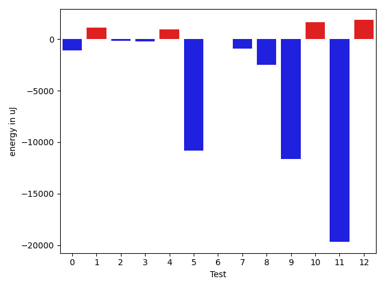

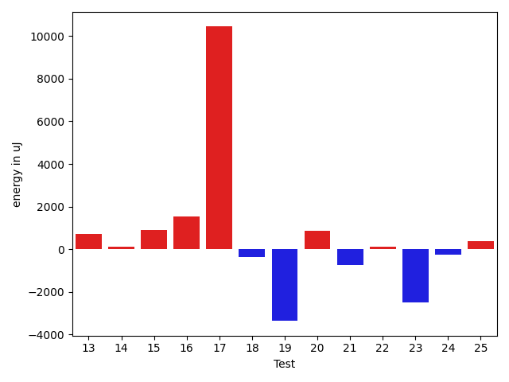

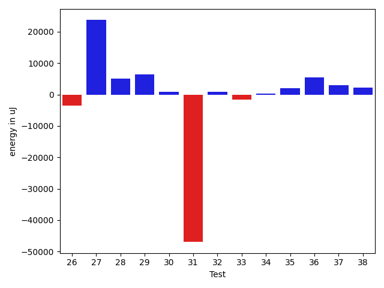

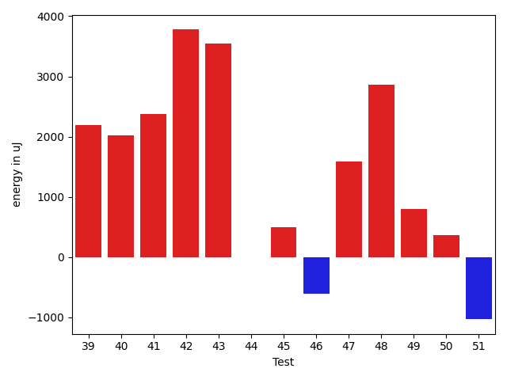

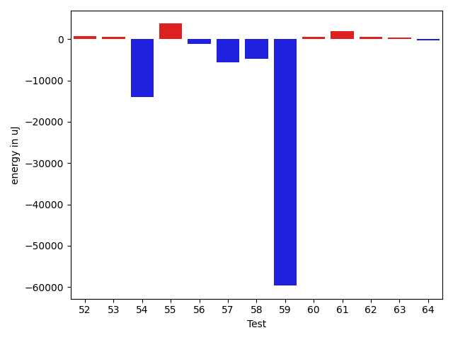

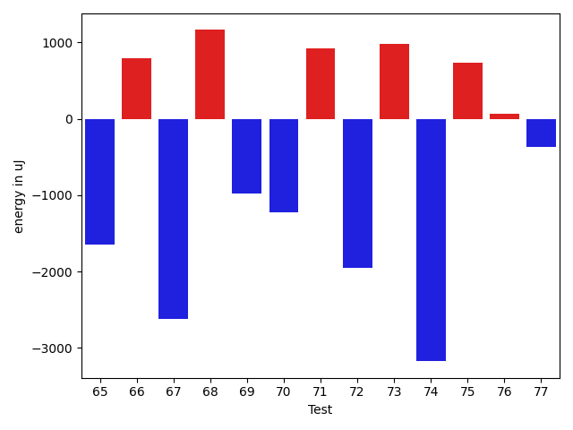

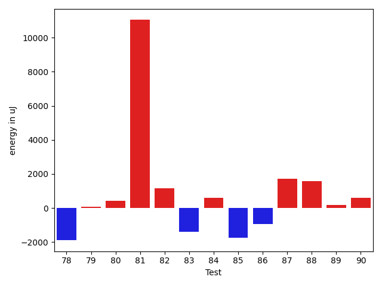

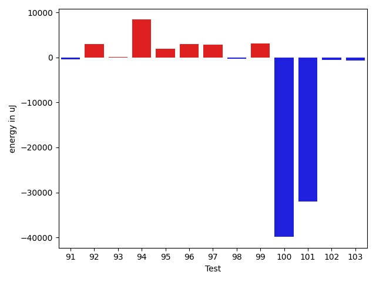

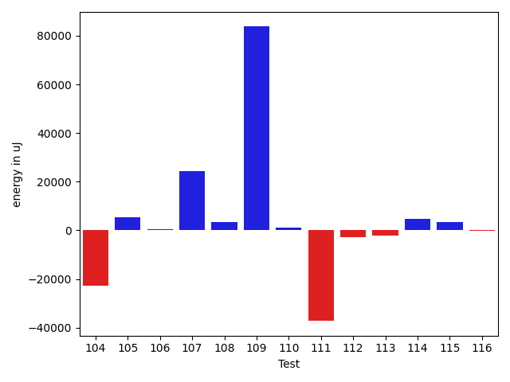

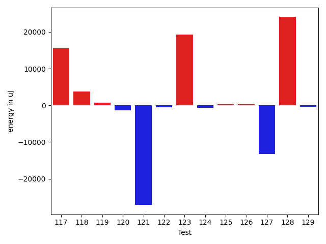

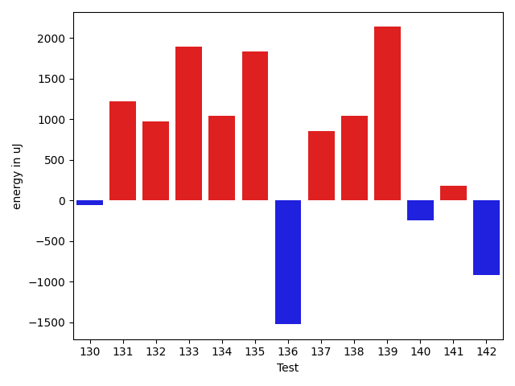

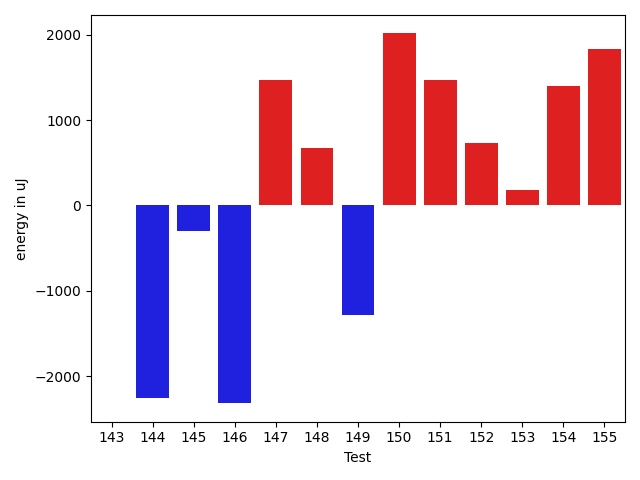

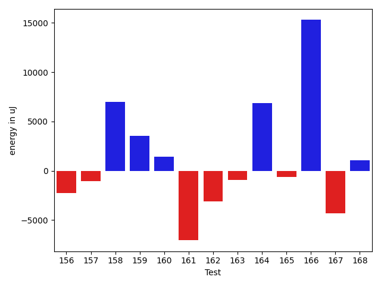

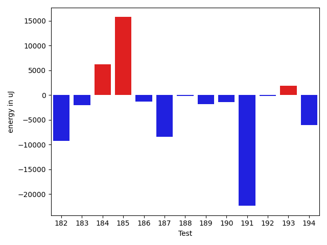

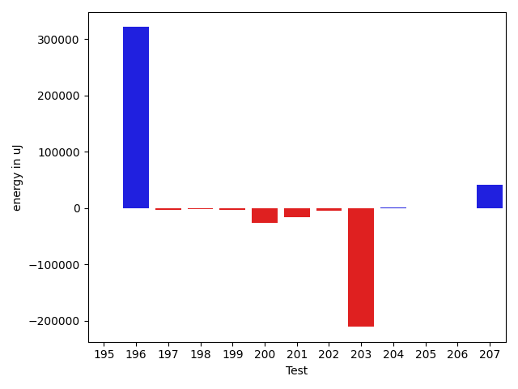

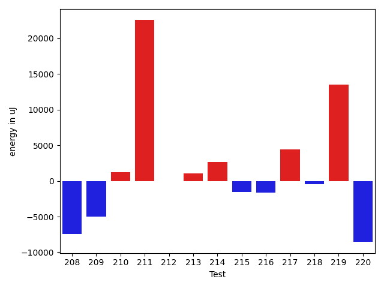

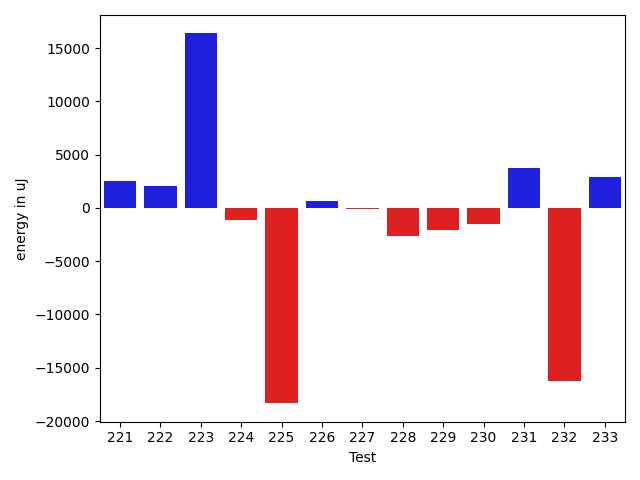

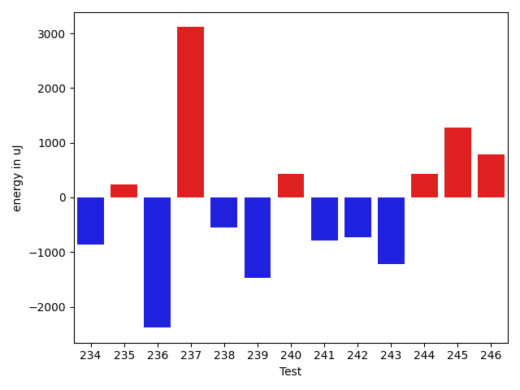

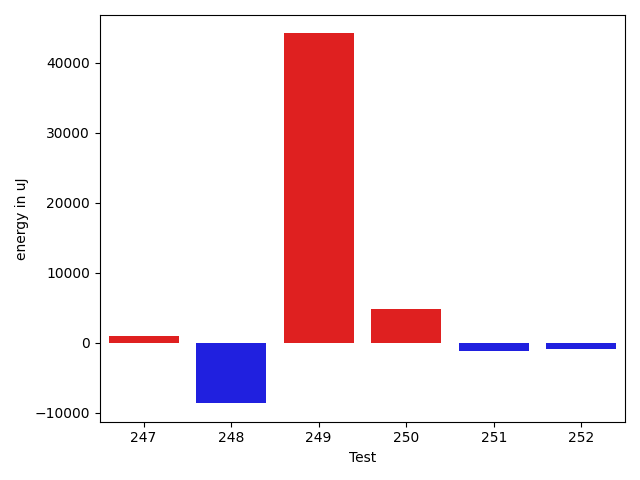

| ID | EnergyV1 | EnergyV2 | DeltaEnergy | σV1 | σV2 |
| --- | --- | --- | --- | --- | --- |
| 0 | 39794 | 39551 | -243 | 19305.02828857413 | 8322.716034013785 |
| 1 | 39245 | 41381 | 2136 | 5887.191294528519 | 7236.792063687382 |
| 2 | 40466 | 42175 | 1709 | 6313.033889246807 | 3830.9126967651823 |
| 3 | 39428 | 39551 | 123 | 4836.577260246829 | 4155.099710816093 |
| 4 | 36621 | 38513 | 1892 | 4098.22321785926 | 4985.955920828466 |
| 5 | 38452 | 38636 | 184 | 65766.27242743307 | 4216.75441678036 |
| 6 | 39184 | 40588 | 1404 | 3888.648594734851 | 4093.9393325901365 |
| 7 | 38635 | 39123 | 488 | 4673.5069788630335 | 4391.508510886557 |
| 8 | 40283 | 39856 | -427 | 29653.636566962927 | 25692.828622923997 |
| 9 | 84534 | 84229 | -305 | 281447.9569100021 | 265082.81294256466 |
| 10 | 39368 | 39490 | 122 | 21371.14904714513 | 20998.888420339998 |
| 11 | 40955 | 40649 | -306 | 125388.3663661659 | 83866.45629305887 |
| 12 | 39307 | 39490 | 183 | 3904.426279548222 | 7298.0335562232385 |
| 13 | 38879 | 39612 | 733 | 7902.427007184018 | 7897.812113448223 |
| 14 | 38757 | 38879 | 122 | 5276.23551327963 | 5438.677927547762 |
| 15 | 38696 | 39611 | 915 | 7843.600358336837 | 4065.954326949944 |
| 16 | 36926 | 38452 | 1526 | 6995.135779169009 | 3163.7160849334255 |
| 17 | 69641 | 80078 | 10437 | 83053.4373295829 | 66722.25716114904 |
| 18 | 39612 | 39245 | -367 | 5204.556669139839 | 9397.804236640688 |
| 19 | 77332 | 73974 | -3358 | 37800.83251190916 | 28552.679245187548 |
| 20 | 38391 | 39245 | 854 | 7446.703469918005 | 8910.38242862645 |
| 21 | 41259 | 40527 | -732 | 31113.766244410566 | 21366.593220907565 |
| 22 | 39123 | 39246 | 123 | 10059.746081932413 | 9940.627224743661 |
| 23 | 75378 | 72876 | -2502 | 35067.24110017668 | 35110.06323437199 |
| 24 | 38574 | 38330 | -244 | 7135.00904730935 | 5694.3622106359035 |
| 25 | 39123 | 39490 | 367 | 4520.195896828506 | 4144.452224950597 |
| 26 | 36621 | 38452 | 1831 | 3651.105649257608 | 2192.8165099706816 |
| 27 | 38391 | 39368 | 977 | 5513.795112826854 | 4847.799487329811 |
| 28 | 37719 | 37232 | -487 | 5239.801926520378 | 3199.841830615991 |
| 29 | 39612 | 38574 | -1038 | 3820.3186666796623 | 3961.6278196895896 |
| 30 | 43091 | 43030 | -61 | 334453.5180972021 | 30162.59300505549 |
| 31 | 37720 | 37719 | -1 | 6248.334782247031 | 3119.657884510558 |
| 32 | 42664 | 41381 | -1283 | 61036.32652248475 | 45042.72894549796 |
| 33 | 39734 | 37659 | -2075 | 5834.922719823752 | 3489.8594049999588 |
| 34 | 38757 | 38941 | 184 | 4241.371991755614 | 3599.2069809308878 |
| 35 | 40771 | 39002 | -1769 | 4328.930129031979 | 3302.5669946065364 |
| 36 | 40344 | 39429 | -915 | 3275.5411400255684 | 4340.692813603723 |
| 37 | 38452 | 39673 | 1221 | 4084.573902992607 | 3399.740136722979 |
| 38 | 37415 | 39123 | 1708 | 4281.960506510498 | 3301.2894763406043 |
| 39 | 37964 | 40161 | 2197 | 3847.6914146306253 | 4501.100694812742 |
| 40 | 37414 | 39429 | 2015 | 4413.03400599372 | 4314.255540416477 |
| 41 | 37292 | 39673 | 2381 | 4459.878625095747 | 4085.113508847127 |
| 42 | 218018 | 221801 | 3783 | 86017.87161488466 | 97713.74986414448 |
| 43 | 167480 | 171021 | 3541 | 338286.7724697542 | 55691.751887896535 |
| 44 | 39795 | 39794 | -1 | 5717.475950863219 | 6335.4228967033805 |
| 45 | 40771 | 41260 | 489 | 3646.3168396777282 | 3574.5378251021402 |
| 46 | 37964 | 37354 | -610 | 3759.0360059299182 | 3555.4506388841673 |
| 47 | 40344 | 41931 | 1587 | 10376.969338542984 | 12431.514326700759 |
| 48 | 40223 | 43091 | 2868 | 77830.8988090991 | 104747.19957470687 |
| 49 | 40100 | 40893 | 793 | 8034.103365226022 | 22774.02666674843 |
| 50 | 38269 | 38635 | 366 | 8559.488285919006 | 6489.849584042006 |
| 51 | 42175 | 41138 | -1037 | 18620.62807362192 | 16145.695949951923 |
| 52 | 39916 | 40466 | 550 | 14470.728701185906 | 14462.865334118253 |
| 53 | 37720 | 37903 | 183 | 5308.218570769456 | 4372.544614108227 |
| 54 | 43518 | 41565 | -1953 | 58346.22916144348 | 39863.216139029944 |
| 55 | 40527 | 40771 | 244 | 60164.95899552789 | 63416.29999323833 |
| 56 | 39795 | 38024 | -1771 | 6816.825543899676 | 4040.8179825871753 |
| 57 | 41077 | 41382 | 305 | 23566.428182682685 | 16381.382727118116 |
| 58 | 40649 | 41137 | 488 | 14050.877326709178 | 7713.813526298916 |
| 59 | 40405 | 39551 | -854 | 147217.5672288414 | 59120.43066829499 |
| 60 | 38086 | 38940 | 854 | 3596.282475773498 | 4906.392894079558 |
| 61 | 37964 | 39367 | 1403 | 3961.066823160953 | 6746.569813238277 |
| 62 | 39184 | 39063 | -121 | 11066.180546796335 | 13938.251284933851 |
| 63 | 38208 | 37414 | -794 | 4478.938019925278 | 3926.378618872582 |
| 64 | 38452 | 38269 | -183 | 4238.106519653343 | 3567.2047943708944 |
| 65 | 40466 | 38819 | -1647 | 24230.348262965563 | 24891.935969757007 |
| 66 | 38085 | 38880 | 795 | 8006.391186659317 | 4030.0632598255534 |
| 67 | 40161 | 37537 | -2624 | 31477.051025457567 | 3653.393409016016 |
| 68 | 38024 | 39185 | 1161 | 3679.944500156856 | 4431.514738102926 |
| 69 | 38696 | 37720 | -976 | 4415.019923923213 | 4400.125262917532 |
| 70 | 38757 | 37536 | -1221 | 6266.564981218288 | 3951.2096112823792 |
| 71 | 38269 | 39184 | 915 | 3488.211583318879 | 5169.647078242406 |
| 72 | 38758 | 36804 | -1954 | 3545.9396180727986 | 3417.228892766119 |
| 73 | 38269 | 39245 | 976 | 3227.8259364256414 | 4245.270666706659 |
| 74 | 39550 | 36377 | -3173 | 3748.9510141634582 | 4114.480819778668 |
| 75 | 37658 | 38391 | 733 | 3970.250979472205 | 4672.689600404502 |
| 76 | 39307 | 39367 | 60 | 6700.150074060944 | 5363.662134602316 |
| 77 | 37110 | 36743 | -367 | 4049.140129107338 | 4297.688536211729 |
| 78 | 38757 | 38391 | -366 | 7674.9459224414095 | 4614.35050098044 |
| 79 | 38696 | 38269 | -427 | 4236.090228217246 | 3526.5091201738283 |
| 80 | 38391 | 38574 | 183 | 3368.8405473126786 | 3747.8298489110853 |
| 81 | 39184 | 42602 | 3418 | 67058.61524549311 | 77214.1231977813 |
| 82 | 38269 | 39002 | 733 | 4312.856475654139 | 3889.5372443526767 |
| 83 | 38208 | 36682 | -1526 | 4218.832571781879 | 3796.9658601748492 |
| 84 | 37293 | 37720 | 427 | 3716.9114633508407 | 4083.211990578006 |
| 85 | 38819 | 36133 | -2686 | 4271.37106035136 | 3313.74649428745 |
| 86 | 38880 | 38574 | -306 | 3743.0040185183652 | 3131.683020358223 |
| 87 | 36194 | 36560 | 366 | 3794.4968397046955 | 5190.434826676961 |
| 88 | 36194 | 37902 | 1708 | 4278.472877058148 | 4007.234496557445 |
| 89 | 37414 | 37659 | 245 | 3007.54345261663 | 4446.060118202316 |
| 90 | 37720 | 38696 | 976 | 4510.821405276124 | 5532.595123540164 |
| 91 | 39734 | 37658 | -2076 | 3738.5878547253637 | 3341.13252958438 |
| 92 | 38818 | 41504 | 2686 | 3753.058167064814 | 4251.680921490142 |
| 93 | 38025 | 38086 | 61 | 4178.728079137837 | 4195.2486167803245 |
| 94 | 101929 | 100952 | -977 | 72036.40930624855 | 114003.57079527134 |
| 95 | 37841 | 40222 | 2381 | 4034.510539029588 | 5564.216633877989 |
| 96 | 39184 | 41016 | 1832 | 47086.98589794115 | 56464.34444221895 |
| 97 | 38025 | 40832 | 2807 | 7416.8035735877265 | 8917.321653846373 |
| 98 | 38513 | 38879 | 366 | 4151.018267642831 | 2928.7875414598107 |
| 99 | 38636 | 40222 | 1586 | 6727.737119050918 | 10372.033910002467 |
| 100 | 38696 | 41076 | 2380 | 256093.29749524 | 8759.92923384503 |
| 101 | 40650 | 41504 | 854 | 283123.5660023546 | 174838.8043069326 |
| 102 | 39246 | 39855 | 609 | 7565.1972115001 | 4297.0873055743705 |
| 103 | 41015 | 40222 | -793 | 3834.464153490027 | 3886.2403388879598 |
| 104 | 39306 | 39673 | 367 | 9138.756259994674 | 7433.895453921031 |
| 105 | 40527 | 42114 | 1587 | 47443.15876148739 | 62261.431598724485 |
| 106 | 40405 | 41748 | 1343 | 81887.5260112607 | 106937.45179408655 |
| 107 | 39673 | 42176 | 2503 | 9090.253196734837 | 32112.226451220133 |
| 108 | 81055 | 76416 | -4639 | 40358.54274854639 | 59339.42117306825 |
| 109 | 37903 | 39002 | 1099 | 7771.713945626454 | 7813.251002164452 |
| 110 | 38086 | 38391 | 305 | 4162.545742433497 | 4356.875296080896 |
| 111 | 39002 | 39185 | 183 | 9429.747602789797 | 8595.003195966152 |
| 112 | 39550 | 38635 | -915 | 7802.636127756523 | 8263.518309195804 |
| 113 | 39978 | 40955 | 977 | 14567.828422135466 | 25422.9738683542 |
| 114 | 76782 | 79163 | 2381 | 65857.50200997171 | 78194.67029700479 |
| 115 | 38574 | 37414 | -1160 | 3290.5961334658264 | 3641.33503693509 |
| 116 | 39612 | 38269 | -1343 | 3506.116135843862 | 4306.754882628871 |
| 117 | 40466 | 43274 | 2808 | 56550.98974758813 | 67901.71756868367 |
| 118 | 39001 | 40283 | 1282 | 11243.90164114478 | 17210.102718267935 |
| 119 | 36560 | 38452 | 1892 | 3900.817943916243 | 3930.8911635714044 |
| 120 | 41138 | 38452 | -2686 | 4224.34207412038 | 5500.386438703125 |
| 121 | 41687 | 40649 | -1038 | 119972.8377178021 | 65765.95861791611 |
| 122 | 40405 | 40832 | 427 | 4084.5301535728904 | 4411.8627231234095 |
| 123 | 124816 | 123229 | -1587 | 121012.6459293455 | 182915.92798195587 |
| 124 | 40466 | 39001 | -1465 | 4331.465742865531 | 6334.337854515726 |
| 125 | 42785 | 42237 | -548 | 25350.245925268355 | 21333.604837923558 |
| 126 | 40344 | 40527 | 183 | 4378.106198397252 | 4043.36739399201 |
| 127 | 41748 | 40222 | -1526 | 82149.77021527219 | 69643.18535706769 |
| 128 | 40589 | 42236 | 1647 | 17652.99279442441 | 99298.12789136794 |
| 129 | 39428 | 40222 | 794 | 7049.639955977632 | 4047.0732775858933 |
| 130 | 38513 | 38452 | -61 | 4341.76564550035 | 4303.02632101815 |
| 131 | 38452 | 39673 | 1221 | 4451.557148959621 | 7662.112481743678 |
| 132 | 40649 | 41626 | 977 | 10517.506278731538 | 21411.333096614166 |
| 133 | 37964 | 39856 | 1892 | 4109.281200329262 | 5247.875932222483 |
| 134 | 38330 | 39367 | 1037 | 5064.219051657877 | 4648.706507025232 |
| 135 | 41321 | 43152 | 1831 | 14495.717278420376 | 13596.276834691014 |
| 136 | 39856 | 38330 | -1526 | 3402.812485275817 | 4027.9599295631865 |
| 137 | 38635 | 39489 | 854 | 4141.636662109522 | 4394.757939300107 |
| 138 | 37780 | 38819 | 1039 | 4320.366182137238 | 4226.378077488756 |
| 139 | 40344 | 42480 | 2136 | 17026.11635900563 | 181416.34773383118 |
| 140 | 39245 | 39001 | -244 | 35327.133871306694 | 37124.428742103235 |
| 141 | 42847 | 43029 | 182 | 212239.8182958314 | 474088.33824040316 |
| 142 | 40100 | 39184 | -916 | 6137.470067996711 | 7526.63172513317 |
| 143 | 39673 | 39672 | -1 | 15375.952001994101 | 11819.004454209931 |
| 144 | 39855 | 37598 | -2257 | 6536.48551340423 | 4353.91621477417 |
| 145 | 39184 | 38879 | -305 | 41930.94376886135 | 11972.216795853657 |
| 146 | 41137 | 38818 | -2319 | 8346.195795953987 | 4788.246806725673 |
| 147 | 45349 | 46813 | 1464 | 24388.75259527128 | 231134.55952123186 |
| 148 | 40954 | 41626 | 672 | 15268.764518400545 | 20538.93660013902 |
| 149 | 133605 | 132324 | -1281 | 141260.62313151866 | 319775.06234187656 |
| 150 | 38269 | 40283 | 2014 | 4309.70710114029 | 4009.4577700731556 |
| 151 | 38636 | 40100 | 1464 | 8134.831766682223 | 9867.433220488665 |
| 152 | 40223 | 40955 | 732 | 4484.802018171707 | 7723.248800919742 |
| 153 | 40344 | 40528 | 184 | 35596.208030861766 | 8919.066638488055 |
| 154 | 38757 | 40161 | 1404 | 4174.881095284429 | 4297.444555765269 |
| 155 | 39184 | 41016 | 1832 | 6576.964068747829 | 16521.05342805139 |
| 156 | 39368 | 40161 | 793 | 4029.5094524298083 | 4369.686226650799 |
| 157 | 40405 | 39001 | -1404 | 4472.732031535953 | 4137.547117096948 |
| 158 | 75134 | 79772 | 4638 | 184038.95185634535 | 233234.31954827096 |
| 159 | 40161 | 39795 | -366 | 9285.621949381857 | 4741.252819907809 |
| 160 | 39124 | 39795 | 671 | 30546.088002604363 | 29087.590650732018 |
| 161 | 41260 | 40345 | -915 | 9034.456942631576 | 4570.6887786325715 |
| 162 | 40588 | 38147 | -2441 | 4084.0133281205053 | 3680.2604170118475 |
| 163 | 40405 | 41382 | 977 | 80984.57054692427 | 45855.54373167589 |
| 164 | 276367 | 290099 | 13732 | 121138.9727116535 | 98424.01496953676 |
| 165 | 401122 | 385741 | -15381 | 142540.90141767653 | 130152.20119030005 |
| 166 | 42237 | 40588 | -1649 | 63301.110537725755 | 11829.426167818816 |
| 167 | 39184 | 38330 | -854 | 4726.34191437539 | 4825.823970340809 |
| 168 | 39612 | 40588 | 976 | 6921.835157846509 | 4729.092420444674 |
| 169 | 41443 | 42664 | 1221 | 25873.979814670955 | 18544.85610003036 |
| 170 | 42603 | 43579 | 976 | 176196.2767619871 | 259901.40106971943 |
| 171 | 39123 | 40833 | 1710 | 4402.180422371523 | 4449.136963179266 |
| 172 | 38208 | 38696 | 488 | 7027.182121885109 | 4210.845833103521 |
| 173 | 40588 | 40161 | -427 | 4320.6458428665155 | 4493.241695103018 |
| 174 | 37903 | 40222 | 2319 | 4298.672060663281 | 4349.471715672157 |
| 175 | 46813 | 76172 | 29359 | 296439.38921804767 | 55740.85120394114 |
| 176 | 41870 | 41381 | -489 | 85398.87970695697 | 54037.41579432159 |
| 177 | 40893 | 41382 | 489 | 3935.5726423041897 | 4225.929308039027 |
| 178 | 40894 | 39307 | -1587 | 8700.867580594493 | 10932.007846915789 |
| 179 | 40161 | 38941 | -1220 | 5221.309602259426 | 8192.079710348886 |
| 180 | 39917 | 39733 | -184 | 11078.52585487598 | 8881.754300736739 |
| 181 | 42663 | 39612 | -3051 | 20141.785059615624 | 19796.56542533006 |
| 182 | 40833 | 39490 | -1343 | 41757.573578055395 | 8157.784251228195 |
| 183 | 40772 | 39428 | -1344 | 6884.688008343023 | 7233.620289102379 |
| 184 | 39124 | 38208 | -916 | 4429.662387588276 | 38162.172787384196 |
| 185 | 42603 | 42907 | 304 | 30960.563611687558 | 50787.66044682727 |
| 186 | 39368 | 38269 | -1099 | 4644.643988223828 | 5150.231035534394 |
| 187 | 42480 | 43579 | 1099 | 50124.54247993063 | 37710.47773197981 |
| 188 | 39672 | 41138 | 1466 | 9043.978264736032 | 7900.657845575718 |
| 189 | 40222 | 39673 | -549 | 9965.99882685438 | 7033.896369333393 |
| 190 | 40344 | 40649 | 305 | 14094.963298494247 | 9067.530672415347 |
| 191 | 82641 | 66650 | -15991 | 75555.82324808778 | 35812.901155321095 |
| 192 | 38697 | 39123 | 426 | 4538.411401028195 | 5341.137257176602 |
| 193 | 39611 | 40649 | 1038 | 4524.904370536465 | 4816.417235798665 |
| 194 | 40039 | 40954 | 915 | 27374.597643112273 | 7057.505129741425 |
| 195 | 39978 | 37476 | -2502 | 4075.0914305193 | 4225.007820300127 |
| 196 | 39733 | 39124 | -609 | 20803.514237737672 | 4535.5514028325915 |
| 197 | 39490 | 39429 | -61 | 11255.262621326448 | 8505.84692909241 |
| 198 | 41870 | 39612 | -2258 | 17665.929625104447 | 14884.856922704195 |
| 199 | 41687 | 40771 | -916 | 64094.2017800019 | 51461.65226607169 |
| 200 | 41992 | 39917 | -2075 | 44267.956771687575 | 5004.965208306766 |
| 201 | 42724 | 42237 | -487 | 36145.89512601983 | 49676.57107516338 |
| 202 | 38880 | 40283 | 1403 | 4148.976188226237 | 4489.277875454359 |
| 203 | 39978 | 41809 | 1831 | 98822.47599458527 | 108373.98583484991 |
| 204 | 39856 | 40710 | 854 | 4218.232764608962 | 14849.151824673638 |
| 205 | 40161 | 41504 | 1343 | 4480.200580142884 | 6528.915884308437 |
| 206 | 42053 | 42053 | 0 | 17102.325961528597 | 19947.780294076572 |
| 207 | 40039 | 41748 | 1709 | 26012.136391390213 | 18993.57985061034 |
| 208 | 41687 | 41748 | 61 | 52412.713164122826 | 13057.339988874373 |
| 209 | 40100 | 39795 | -305 | 29274.754443864815 | 4010.3804352704497 |
| 210 | 39489 | 40771 | 1282 | 4533.490530697851 | 4209.011070470879 |
| 211 | 135681 | 177063 | 41382 | 582552.128427064 | 573417.6027844915 |
| 212 | 37109 | 36987 | -122 | 4424.045893908082 | 4932.34942961357 |
| 213 | 38757 | 38635 | -122 | 10265.688060654089 | 17165.13554093576 |
| 214 | 41504 | 40771 | -733 | 15890.535315297666 | 17957.474451383438 |
| 215 | 37537 | 36682 | -855 | 4332.949741483534 | 4464.825301204235 |
| 216 | 37719 | 35339 | -2380 | 5228.364440781035 | 5013.908439464683 |
| 217 | 39551 | 39246 | -305 | 41731.09754486883 | 45168.00702707376 |
| 218 | 38758 | 37842 | -916 | 4892.041424280359 | 4651.40726181179 |
| 219 | 118347 | 111511 | -6836 | 57178.39780776543 | 186519.28571419016 |
| 220 | 43212 | 43701 | 489 | 64733.074720054996 | 55444.44656734681 |
| 221 | 42724 | 44311 | 1587 | 83817.23698876459 | 101187.98443052193 |
| 222 | 42359 | 41932 | -427 | 19563.807773645873 | 14486.215495422286 |
| 223 | 42480 | 43884 | 1404 | 56289.78972575948 | 63489.20074073346 |
| 224 | 38818 | 41809 | 2991 | 15223.096652995646 | 23986.02469018991 |
| 225 | 43091 | 44190 | 1099 | 24635.546168989884 | 20688.60286235443 |
| 226 | 42114 | 42236 | 122 | 24667.97282752662 | 21462.24641150517 |
| 227 | 43884 | 45105 | 1221 | 46730.20102792969 | 369248.1985261625 |
| 228 | 39306 | 38147 | -1159 | 4104.084453322081 | 3588.743650311947 |
| 229 | 39367 | 39856 | 489 | 4317.317300809744 | 8157.080084577378 |
| 230 | 40405 | 39367 | -1038 | 5325.1499715574355 | 5948.341593074435 |
| 231 | 89355 | 91430 | 2075 | 72684.68965444119 | 45804.06251135179 |
| 232 | 44190 | 44250 | 60 | 67899.98130233552 | 82556.66475638385 |
| 233 | 43030 | 42236 | -794 | 112347.05718282078 | 66611.66025625587 |
| 234 | 43701 | 42846 | -855 | 7843.8626771771505 | 5151.20082009316 |
| 235 | 42297 | 42541 | 244 | 187413.52773611055 | 278047.76029759087 |
| 236 | 44129 | 41748 | -2381 | 75925.99678156628 | 32564.56068413534 |
| 237 | 38269 | 41382 | 3113 | 4663.117263943075 | 20736.487122549344 |
| 238 | 43457 | 42907 | -550 | 52171.32687357468 | 40329.82472358468 |
| 239 | 41443 | 39978 | -1465 | 7494.228726846038 | 10756.46214748252 |
| 240 | 40588 | 41016 | 428 | 213973.23339400376 | 326680.0421823725 |
| 241 | 40466 | 39673 | -793 | 3595.8969435014164 | 4088.7844382190437 |
| 242 | 41077 | 40344 | -733 | 9614.122499344283 | 6638.627754381748 |
| 243 | 40710 | 39490 | -1220 | 4630.856008234183 | 4818.009623732087 |
| 244 | 41625 | 42054 | 429 | 10589.006331635312 | 5868.192533998133 |
| 245 | 39916 | 41199 | 1283 | 58127.07671962539 | 6845.985569624079 |
| 246 | 39368 | 40161 | 793 | 3415.0644021377257 | 4131.64005664451 |
| 247 | 39367 | 40283 | 916 | 4891.6068748120315 | 4445.786984119152 |
| 248 | 40222 | 40771 | 549 | 51178.17233655437 | 4092.5458812333422 |
| 249 | 42481 | 41259 | -1222 | 270025.4988282002 | 387083.527940632 |
| 250 | 41382 | 41809 | 427 | 4242.901938916103 | 12339.775045241295 |
| 251 | 40406 | 38940 | -1466 | 3853.0227726664675 | 4012.9677295318347 |
| 252 | 40222 | 39612 | -610 | 4307.403343840636 | 5430.442938349197 |

## Delta Duration per test method

| ID | DurationV1 | DurationsV2 | DeltaDuration |
| --- | --- | --- | --- |
| 0 | 1134953.3095238095 | 1073346.4415584416 | -61606.867965367856 |
| 1 | 1012388.873015873 | 975446.7121212122 | -36942.16089466086 |
| 2 | 751064.4864864865 | 546394.7692307692 | -204669.71725571726 |
| 3 | 815719.4210526316 | 731244.2142857143 | -84475.20676691725 |
| 4 | 622813.6551724138 | 501624.1666666667 | -121189.48850574711 |
| 5 | 1060672.076923077 | 657840.1304347826 | -402831.9464882944 |
| 6 | 545731.1333333333 | 506643.4285714286 | -39087.70476190472 |
| 7 | 560090.3703703703 | 486174.0 | -73916.37037037034 |
| 8 | 1130762.2352941176 | 1011678.0 | -119084.23529411759 |
| 9 | 4039005.292929293 | 3766321.6767676766 | -272683.6161616165 |
| 10 | 887918.5319148937 | 920331.4736842106 | 32412.94176931691 |
| 11 | 2186708.9795918367 | 1364244.8666666667 | -822464.11292517 |
| 12 | 830130.0327868853 | 875528.2916666666 | 45398.25887978135 |
| 13 | 1048831.7901234569 | 1061366.9154929577 | 12535.125369500834 |
| 14 | 1066167.4383561644 | 1197269.5714285714 | 131102.13307240698 |
| 15 | 887129.0307692308 | 870919.2575757576 | -16209.77319347323 |
| 16 | 790255.4791666666 | 661540.1578947369 | -128715.32127192977 |
| 17 | 2454722.5656565656 | 2293357.484848485 | -161365.08080808073 |
| 18 | 1040410.141025641 | 1034270.7105263158 | -6139.430499325157 |
| 19 | 2092674.4444444445 | 1971487.3535353534 | -121187.09090909106 |
| 20 | 1125530.2133333334 | 1107544.175 | -17986.03833333333 |
| 21 | 1284589.4933333334 | 1262016.7066666668 | -22572.786666666623 |
| 22 | 1211500.5909090908 | 1202755.0352941176 | -8745.555614973186 |
| 23 | 2141191.737373737 | 2055344.2828282828 | -85847.45454545435 |
| 24 | 1033048.0405405406 | 1042159.3194444445 | 9111.278903903905 |
| 25 | 812838.8644067796 | 779295.2040816327 | -33543.66032514698 |
| 26 | 567602.3142857143 | 589685.24 | 22082.925714285695 |
| 27 | 1014876.6507936508 | 1078098.391304348 | 63221.74051069713 |
| 28 | 701137.5208333334 | 649410.9487179487 | -51726.572115384624 |
| 29 | 682072.8372093023 | 667082.6756756756 | -14990.161533626728 |
| 30 | 3802212.375 | 1463877.3333333333 | -2338335.041666667 |
| 31 | 911582.0294117647 | 899795.5666666667 | -11786.462745098048 |
| 32 | 1864828.21875 | 1335954.84 | -528873.3787499999 |
| 33 | 805715.8113207547 | 754047.8039215687 | -51668.007399186026 |
| 34 | 562403.6071428572 | 517972.39285714284 | -44431.21428571432 |
| 35 | 524660.3714285714 | 631861.6551724138 | 107201.28374384239 |
| 36 | 514585.48 | 459906.8076923077 | -54678.67230769229 |
| 37 | 505798.2272727273 | 562848.8484848485 | 57050.621212121216 |
| 38 | 820446.1568627451 | 793559.7083333334 | -26886.44852941169 |
| 39 | 510225.6666666667 | 617459.15625 | 107233.48958333331 |
| 40 | 503314.8918918919 | 483139.7586206897 | -20175.133271202212 |
| 41 | 520747.21875 | 491992.45454545453 | -28754.76420454547 |
| 42 | 6468753.626262627 | 6614967.171717172 | 146213.54545454495 |
| 43 | 5713759.4949494945 | 4936594.3838383835 | -777165.111111111 |
| 44 | 593818.5161290322 | 708272.0909090909 | 114453.5747800587 |
| 45 | 643686.8709677419 | 639171.375 | -4515.495967741939 |
| 46 | 533098.4642857143 | 926649.2962962963 | 393550.832010582 |
| 47 | 958596.3265306122 | 1063335.8113207547 | 104739.48479014251 |
| 48 | 1712684.5444444444 | 2332029.518987342 | 619344.9745428974 |
| 49 | 835492.3269230769 | 1072587.4545454546 | 237095.1276223777 |
| 50 | 968027.224489796 | 915615.2448979592 | -52411.9795918368 |
| 51 | 1428886.8085106383 | 1333085.8804347827 | -95800.9280758556 |
| 52 | 1082802.2777777778 | 1081398.3194444445 | -1403.9583333332557 |
| 53 | 541882.5925925926 | 509752.1538461539 | -32130.43874643871 |
| 54 | 2054988.797752809 | 1667692.6506024096 | -387296.1471503994 |
| 55 | 1491660.0545454544 | 1578964.54 | 87304.48545454559 |
| 56 | 882237.7450980392 | 811850.2372881356 | -70387.50780990359 |
| 57 | 1300769.0357142857 | 1009426.5614035088 | -291342.4743107769 |
| 58 | 932425.8461538461 | 645654.9117647059 | -286770.9343891402 |
| 59 | 3241147.435897436 | 1087692.027027027 | -2153455.4088704092 |
| 60 | 790897.7833333333 | 773662.4181818182 | -17235.365151515114 |
| 61 | 896880.340425532 | 813738.3333333334 | -83142.00709219859 |
| 62 | 1203015.4421052632 | 1254765.074468085 | 51749.63236282184 |
| 63 | 792394.8529411765 | 866308.1320754717 | 73913.27913429518 |
| 64 | 579402.9782608695 | 574449.2647058824 | -4953.713554987102 |
| 65 | 970044.5263157894 | 1121492.2708333333 | 151447.74451754382 |
| 66 | 1019652.3880597015 | 949377.8513513514 | -70274.53670835018 |
| 67 | 1080592.0 | 695514.25 | -385077.75 |
| 68 | 559866.7857142857 | 624859.65625 | 64992.87053571432 |
| 69 | 768740.5652173914 | 723312.0 | -45428.565217391355 |
| 70 | 693218.1730769231 | 730990.8095238095 | 37772.63644688635 |
| 71 | 410367.3 | 378276.3888888889 | -32090.911111111112 |
| 72 | 662780.027027027 | 679070.5277777778 | 16290.500750750769 |
| 73 | 588197.4137931034 | 544866.6 | -43330.81379310344 |
| 74 | 499262.375 | 465247.7428571429 | -34014.632142857125 |
| 75 | 626894.4666666667 | 630551.7333333333 | 3657.2666666666046 |
| 76 | 890525.8297872341 | 836079.05 | -54446.77978723403 |
| 77 | 595255.3095238095 | 576840.3428571429 | -18414.966666666558 |
| 78 | 690503.0 | 649587.8125 | -40915.1875 |
| 79 | 655864.8076923077 | 548218.6086956522 | -107646.19899665553 |
| 80 | 616035.0882352941 | 582108.1111111111 | -33926.97712418297 |
| 81 | 1650521.9677419355 | 2097511.46875 | 446989.5010080645 |
| 82 | 598594.2380952381 | 495779.04545454547 | -102815.19264069264 |
| 83 | 725051.3103448276 | 701474.9333333333 | -23576.377011494245 |
| 84 | 575056.5 | 480627.7 | -94428.79999999999 |
| 85 | 553703.2692307692 | 551855.8461538461 | -1847.4230769231217 |
| 86 | 431526.9090909091 | 476174.25 | 44647.34090909088 |
| 87 | 827867.2727272727 | 489703.52173913043 | -338163.7509881423 |
| 88 | 447995.0416666667 | 439985.36 | -8009.6816666667 |
| 89 | 445619.1176470588 | 463868.17391304346 | 18249.056265984662 |
| 90 | 483222.2413793103 | 510865.0 | 27642.75862068968 |
| 91 | 391225.4 | 403424.1666666667 | 12198.766666666663 |
| 92 | 411944.0 | 391707.21428571426 | -20236.78571428574 |
| 93 | 640450.05 | 635242.8125 | -5207.237500000047 |
| 94 | 3327962.757575758 | 3577916.737373737 | 249953.97979797935 |
| 95 | 527678.5714285715 | 536052.8571428572 | 8374.285714285681 |
| 96 | 1349573.3421052631 | 1491930.5 | 142357.15789473685 |
| 97 | 957296.0142857142 | 987356.9264705882 | 30060.912184873945 |
| 98 | 590772.7058823529 | 587991.6071428572 | -2781.0987394957338 |
| 99 | 773409.3958333334 | 1095601.1351351351 | 322191.7393018018 |
| 100 | 2037160.4102564103 | 982084.6666666666 | -1055075.7435897435 |
| 101 | 2782280.375 | 1734844.310810811 | -1047436.0641891891 |
| 102 | 838346.5333333333 | 693281.2222222222 | -145065.31111111108 |
| 103 | 778817.56 | 789398.9 | 10581.339999999967 |
| 104 | 999996.9 | 1012070.6086956522 | 12073.708695652196 |
| 105 | 1471095.8902439023 | 1837961.3452380951 | 366865.4549941928 |
| 106 | 1533863.9682539683 | 2054638.7118644067 | 520774.7436104384 |
| 107 | 794487.6578947369 | 1019725.5 | 225237.84210526315 |
| 108 | 2496728.292929293 | 2672028.8282828284 | 175300.53535353532 |
| 109 | 767261.5918367347 | 807710.6734693878 | 40449.081632653135 |
| 110 | 455778.3181818182 | 460857.08 | 5078.76181818184 |
| 111 | 1070813.5526315789 | 1102260.5507246377 | 31446.99809305882 |
| 112 | 930279.2058823529 | 863311.701754386 | -66967.50412796694 |
| 113 | 1151128.2753623188 | 1255847.6 | 104719.32463768125 |
| 114 | 2322314.027027027 | 2356173.1555555556 | 33859.12852852838 |
| 115 | 421643.55555555556 | 497019.35294117645 | 75375.79738562088 |
| 116 | 395998.6111111111 | 436729.4761904762 | 40730.86507936509 |
| 117 | 1271687.0681818181 | 1747725.9777777777 | 476038.9095959596 |
| 118 | 896288.8837209302 | 1114853.5111111111 | 218564.62739018095 |
| 119 | 468115.2631578947 | 1146710.875 | 678595.6118421053 |
| 120 | 430244.6666666667 | 445830.15789473685 | 15585.491228070168 |
| 121 | 1987449.75 | 1523840.425531915 | -463609.3244680851 |
| 122 | 640833.8372093023 | 633398.0487804879 | -7435.7884288145 |
| 123 | 4202872.868686869 | 5005231.323232323 | 802358.4545454541 |
| 124 | 840048.1764705882 | 964385.6935483871 | 124337.51707779896 |
| 125 | 1557955.7171717172 | 1577848.878787879 | 19893.1616161617 |
| 126 | 762366.6444444444 | 776744.6304347826 | 14377.985990338144 |
| 127 | 1773236.7608695652 | 1447031.25 | -326205.5108695652 |
| 128 | 768763.525 | 1634536.2972972973 | 865772.7722972973 |
| 129 | 551023.9629629629 | 642439.5862068966 | 91415.62324393366 |
| 130 | 628320.5897435897 | 580354.375 | -47966.21474358975 |
| 131 | 804966.619047619 | 788711.1521739131 | -16255.46687370597 |
| 132 | 1110599.3766233767 | 1274163.391304348 | 163564.01468097116 |
| 133 | 454429.7368421053 | 499904.55 | 45474.81315789471 |
| 134 | 632185.5952380953 | 737028.3513513514 | 104842.7561132561 |
| 135 | 872684.9722222222 | 1111527.9666666666 | 238842.9944444443 |
| 136 | 844964.2678571428 | 832768.6166666667 | -12195.651190476143 |
| 137 | 676237.1666666666 | 656048.9772727273 | -20188.189393939334 |
| 138 | 578704.3142857143 | 561188.6571428571 | -17515.657142857206 |
| 139 | 1343172.0416666667 | 2016612.2916666667 | 673440.25 |
| 140 | 960352.5178571428 | 948091.7666666667 | -12260.75119047612 |
| 141 | 2450005.912087912 | 5614832.5930232555 | 3164826.6809353433 |
| 142 | 1001837.92 | 1068501.2025316455 | 66663.2825316455 |
| 143 | 1233514.4838709678 | 1256181.6630434783 | 22667.179172510514 |
| 144 | 989961.578125 | 964978.828125 | -24982.75 |
| 145 | 1070741.453125 | 1109054.5 | 38313.046875 |
| 146 | 817038.82 | 790410.5744680851 | -26628.245531914872 |
| 147 | 1628517.2222222222 | 2735432.762886598 | 1106915.5406643755 |
| 148 | 1183477.3506493506 | 1290495.5064935065 | 107018.15584415593 |
| 149 | 4095922.3636363638 | 5125295.313131313 | 1029372.9494949491 |
| 150 | 636881.4285714285 | 664401.45 | 27520.021428571432 |
| 151 | 687383.1 | 779747.5263157894 | 92364.42631578946 |
| 152 | 954038.0289855072 | 1002252.5479452055 | 48214.51895969827 |
| 153 | 1009534.1 | 893437.6666666666 | -116096.43333333335 |
| 154 | 548184.9615384615 | 663559.25 | 115374.2884615385 |
| 155 | 595683.8 | 674833.2580645161 | 79149.45806451607 |
| 156 | 552755.2173913043 | 587540.6896551724 | 34785.47226386808 |
| 157 | 846939.28125 | 834184.0327868853 | -12755.248463114724 |
| 158 | 2595524.5555555555 | 3029517.4343434344 | 433992.8787878789 |
| 159 | 1045103.7894736842 | 1033049.7764705883 | -12054.013003095868 |
| 160 | 975036.7894736842 | 968840.7049180327 | -6196.0845556514105 |
| 161 | 1075176.9375 | 813308.8275862068 | -261868.10991379316 |
| 162 | 563068.3684210526 | 481331.17647058825 | -81737.19195046433 |
| 163 | 1559966.9272727272 | 1158045.037037037 | -401921.89023569017 |
| 164 | 8545235.151515152 | 8045536.848484849 | -499698.3030303037 |
| 165 | 11376765.383838383 | 11107375.595959596 | -269389.78787878715 |
| 166 | 1135840.525 | 864728.3333333334 | -271112.19166666653 |
| 167 | 675122.8571428572 | 630991.9354838709 | -44130.92165898625 |
| 168 | 900354.92 | 809744.9019607843 | -90610.0180392157 |
| 169 | 1188033.85 | 973705.1458333334 | -214328.70416666672 |
| 170 | 2101230.864197531 | 2832313.528735632 | 731082.6645381013 |
| 171 | 633479.5111111111 | 699351.1764705882 | 65871.66535947705 |
| 172 | 976427.7027027027 | 701699.8409090909 | -274727.8617936118 |
| 173 | 1054838.0967741935 | 663040.5428571429 | -391797.5539170506 |
| 174 | 698154.3953488372 | 766426.2 | 68271.8046511627 |
| 175 | 3708961.6714285715 | 2316920.5322580645 | -1392041.139170507 |
| 176 | 1985613.1636363636 | 1346109.2222222222 | -639503.9414141413 |
| 177 | 789228.7631578947 | 711224.7777777778 | -78003.98538011697 |
| 178 | 1133479.9540229884 | 1325811.0989010988 | 192331.14487811038 |
| 179 | 1017636.640625 | 1067588.9305555555 | 49952.289930555504 |
| 180 | 1189132.3066666666 | 1212590.6219512196 | 23458.315284552984 |
| 181 | 1007829.5918367347 | 1134761.4528301887 | 126931.860993454 |
| 182 | 1145277.5609756098 | 969761.0727272728 | -175516.48824833706 |
| 183 | 766428.3611111111 | 727844.4888888889 | -38583.87222222227 |
| 184 | 575024.0344827586 | 902293.5416666666 | 327269.507183908 |
| 185 | 1195777.3333333333 | 2016164.5666666667 | 820387.2333333334 |
| 186 | 608161.96875 | 550834.9310344828 | -57327.03771551722 |
| 187 | 1866814.775280899 | 1572997.191011236 | -293817.58426966285 |
| 188 | 1020656.1692307693 | 1163982.517857143 | 143326.34862637368 |
| 189 | 1135313.9605263157 | 1015380.34375 | -119933.61677631573 |
| 190 | 1227959.025974026 | 1064573.142857143 | -163385.883116883 |
| 191 | 2621346.909090909 | 1908443.148148148 | -712903.7609427611 |
| 192 | 642082.2058823529 | 559504.2 | -82578.00588235294 |
| 193 | 549244.875 | 524563.7931034482 | -24681.08189655177 |
| 194 | 1054192.435897436 | 740315.7428571428 | -313876.6930402932 |
| 195 | 619049.1428571428 | 606202.875 | -12846.26785714284 |
| 196 | 871046.7843137255 | 794120.7307692308 | -76926.05354449479 |
| 197 | 1139409.2142857143 | 1239664.0595238095 | 100254.84523809515 |
| 198 | 1260809.2535211267 | 1197621.0 | -63188.253521126695 |
| 199 | 1857390.9772727273 | 1464930.267857143 | -392460.70941558434 |
| 200 | 1161876.3333333333 | 951921.7868852459 | -209954.54644808732 |
| 201 | 1480776.0714285714 | 1696318.3188405796 | 215542.24741200823 |
| 202 | 508772.0 | 526980.6206896552 | 18208.62068965519 |
| 203 | 1659486.9767441861 | 2192758.153846154 | 533271.1771019679 |
| 204 | 787919.5254237289 | 902318.9444444445 | 114399.41902071564 |
| 205 | 1035461.9054054054 | 1036749.15 | 1287.2445945945801 |
| 206 | 1148765.825 | 1209905.2307692308 | 61139.4057692308 |
| 207 | 1018615.390625 | 1056483.593220339 | 37868.202595338924 |
| 208 | 1206030.2 | 1043297.4590163934 | -162732.74098360655 |
| 209 | 903490.2826086957 | 732881.78 | -170608.50260869565 |
| 210 | 835507.8541666666 | 810573.0491803279 | -24934.804986338713 |
| 211 | 15403238.545454545 | 16413703.555555556 | 1010465.010101011 |
| 212 | 801752.8363636363 | 811057.9019607843 | 9305.06559714803 |
| 213 | 1061598.5 | 1195612.7083333333 | 134014.20833333326 |
| 214 | 1211365.7627118644 | 1349209.2535211267 | 137843.49080926226 |
| 215 | 531507.8 | 550730.9310344828 | 19223.131034482736 |
| 216 | 386165.7619047619 | 460877.7894736842 | 74712.02756892232 |
| 217 | 1031508.0606060605 | 1146449.7631578948 | 114941.70255183429 |
| 218 | 601811.53125 | 635143.4210526316 | 33331.88980263157 |
| 219 | 3330365.9595959596 | 3788071.393939394 | 457705.4343434344 |
| 220 | 1785417.8666666667 | 1440508.8 | -344909.06666666665 |
| 221 | 1876280.12345679 | 2081188.2441860465 | 204908.12072925642 |
| 222 | 1062563.9305555555 | 1127157.4193548388 | 64593.48879928328 |
| 223 | 1490949.4197530865 | 1549176.950617284 | 58227.53086419753 |
| 224 | 916611.9629629629 | 1234501.0 | 317889.0370370371 |
| 225 | 1679254.2315789473 | 1498745.3723404256 | -180508.85923852166 |
| 226 | 1283135.6 | 1269724.6883116884 | -13410.911688311724 |
| 227 | 1731937.0983606558 | 4541629.45 | 2809692.3516393444 |
| 228 | 514482.88 | 565432.1111111111 | 50949.23111111112 |
| 229 | 606100.8974358974 | 776085.5675675676 | 169984.6701316702 |
| 230 | 746140.976744186 | 843003.25 | 96862.27325581398 |
| 231 | 3077592.6767676766 | 2829177.6464646463 | -248415.03030303027 |
| 232 | 1823171.2872340425 | 2143844.7789473683 | 320673.4917133257 |
| 233 | 2517183.1975308643 | 1518768.4810126582 | -998414.716518206 |
| 234 | 971173.5476190476 | 871312.5849056604 | -99860.96271338721 |
| 235 | 1750263.640625 | 2693198.396551724 | 942934.755926724 |
| 236 | 1998986.012987013 | 1245664.513888889 | -753321.499098124 |
| 237 | 584321.3703703703 | 605725.8181818182 | 21404.4478114479 |
| 238 | 1640028.775 | 1069489.4222222222 | -570539.3527777777 |
| 239 | 880009.8813559322 | 996310.6603773584 | 116300.77902142622 |
| 240 | 1704936.435897436 | 3532090.1333333333 | 1827153.6974358973 |
| 241 | 537005.1818181818 | 556525.6333333333 | 19520.451515151537 |
| 242 | 1046255.3928571428 | 773191.4782608695 | -273063.91459627333 |
| 243 | 866092.7777777778 | 555764.0833333334 | -310328.6944444444 |
| 244 | 740580.8947368421 | 1228542.7857142857 | 487961.89097744355 |
| 245 | 1013496.3191489362 | 1110234.9761904762 | 96738.65704154002 |
| 246 | 520004.3333333333 | 499205.724137931 | -20798.6091954023 |
| 247 | 653066.0416666666 | 489691.60714285716 | -163374.43452380947 |
| 248 | 724448.6153846154 | 588313.15 | -136135.46538461535 |
| 249 | 2223185.3571428573 | 3421979.9393939395 | 1198794.5822510822 |
| 250 | 779975.0689655172 | 940369.8461538461 | 160394.7771883289 |
| 251 | 484209.8846153846 | 582101.6666666666 | 97891.782051282 |
| 252 | 460424.6296296296 | 465520.3333333333 | 5095.703703703708 |

## Misc.

| ID | Test Class | Test Method |
| --- | --- | --- |
| 0 | com.google.gson.functional.StreamingTypeAdaptersTest | testNullSafe |
| 1 | com.google.gson.functional.StreamingTypeAdaptersTest | testSerializeWithCustomTypeAdapter |
| 2 | com.google.gson.functional.StreamingTypeAdaptersTest | testDeserializeWithCustomTypeAdapter |
| 3 | com.google.gson.functional.StreamingTypeAdaptersTest | testSerializeRecursive |
| 4 | com.google.gson.functional.ExclusionStrategyFunctionalTest | testExclusionStrategySerializationDoesNotImpactSerialization |
| 5 | com.google.gson.functional.ExclusionStrategyFunctionalTest | testExclusionStrategyWithMode |
| 6 | com.google.gson.functional.ExclusionStrategyFunctionalTest | testExcludeTopLevelClassDeserializationDoesNotImpactSerialization |
| 7 | com.google.gson.functional.ExclusionStrategyFunctionalTest | testExcludeTopLevelClassSerializationDoesNotImpactDeserialization |
| 8 | com.google.gson.functional.ExclusionStrategyFunctionalTest | testExclusionStrategyDeserialization |
| 9 | com.google.gson.functional.ExclusionStrategyFunctionalTest | testExclusionStrategySerialization |
| 10 | com.google.gson.functional.ExclusionStrategyFunctionalTest | testExclusionStrategySerializationDoesNotImpactDeserialization |
| 11 | com.google.gson.functional.InterfaceTest | testSerializingObjectImplementingInterface |
| 12 | com.google.gson.functional.InterfaceTest | testSerializingInterfaceObjectField |
| 13 | com.google.gson.functional.ParameterizedTypesTest | testParameterizedTypeGenericArraysSerialization |
| 14 | com.google.gson.functional.ParameterizedTypesTest | testVariableTypeArrayDeserialization |
| 15 | com.google.gson.functional.ParameterizedTypesTest | testParameterizedTypeWithReaderDeserialization |
| 16 | com.google.gson.functional.ParameterizedTypesTest | testDeepParameterizedTypeDeserialization |
| 17 | com.google.gson.functional.ParameterizedTypesTest | testParameterizedTypesSerialization |
| 18 | com.google.gson.functional.ParameterizedTypesTest | testVariableTypeDeserialization |
| 19 | com.google.gson.functional.ParameterizedTypesTest | testVariableTypeFieldsAndGenericArraysSerialization |
| 20 | com.google.gson.functional.ParameterizedTypesTest | testParameterizedTypeGenericArraysDeserialization |
| 21 | com.google.gson.functional.ParameterizedTypesTest | testParameterizedTypeDeserialization |
| 22 | com.google.gson.functional.ParameterizedTypesTest | testVariableTypeFieldsAndGenericArraysDeserialization |
| 23 | com.google.gson.functional.ParameterizedTypesTest | testTypesWithMultipleParametersSerialization |
| 24 | com.google.gson.functional.ParameterizedTypesTest | testParameterizedTypeWithVariableTypeDeserialization |
| 25 | com.google.gson.functional.ParameterizedTypesTest | testParameterizedTypesWithWriterSerialization |
| 26 | com.google.gson.functional.ParameterizedTypesTest | testDeepParameterizedTypeSerialization |
| 27 | com.google.gson.functional.ParameterizedTypesTest | testTypesWithMultipleParametersDeserialization |
| 28 | com.google.gson.functional.NamingPolicyTest | testAtSignInSerializedName |
| 29 | com.google.gson.functional.NamingPolicyTest | testGsonWithNonDefaultFieldNamingPolicySerialization |
| 30 | com.google.gson.functional.NamingPolicyTest | testGsonDuplicateNameUsingSerializedNameFieldNamingPolicySerialization |
| 31 | com.google.gson.functional.NamingPolicyTest | testComplexFieldNameStrategy |
| 32 | com.google.gson.functional.NamingPolicyTest | testGsonWithNonDefaultFieldNamingPolicyDeserialiation |
| 33 | com.google.gson.functional.NamingPolicyTest | testDeprecatedNamingStrategy |
| 34 | com.google.gson.functional.NamingPolicyTest | testGsonWithLowerCaseDashPolicySerialization |
| 35 | com.google.gson.functional.NamingPolicyTest | testGsonWithLowerCaseDashPolicyDeserialiation |
| 36 | com.google.gson.functional.NamingPolicyTest | testGsonWithSerializedNameFieldNamingPolicyDeserialization |
| 37 | com.google.gson.functional.NamingPolicyTest | testGsonWithUpperCamelCaseSpacesPolicyDeserialiation |
| 38 | com.google.gson.functional.NamingPolicyTest | testGsonWithSerializedNameFieldNamingPolicySerialization |
| 39 | com.google.gson.functional.NamingPolicyTest | testGsonWithUpperCamelCaseSpacesPolicySerialiation |
| 40 | com.google.gson.functional.NamingPolicyTest | testGsonWithLowerCaseUnderscorePolicyDeserialiation |
| 41 | com.google.gson.functional.NamingPolicyTest | testGsonWithLowerCaseUnderscorePolicySerialization |
| 42 | com.google.gson.functional.CircularReferenceTest | testCircularSerialization |
| 43 | com.google.gson.functional.CircularReferenceTest | testSelfReferenceArrayFieldSerialization |
| 44 | com.google.gson.functional.CircularReferenceTest | testDirectedAcyclicGraphDeserialization |
| 45 | com.google.gson.functional.CircularReferenceTest | testDirectedAcyclicGraphSerialization |
| 46 | com.google.gson.functional.CircularReferenceTest | testSelfReferenceIgnoredInSerialization |
| 47 | com.google.gson.functional.PrettyPrintingTest | testEmptyMapField |
| 48 | com.google.gson.functional.PrettyPrintingTest | testPrettyPrintList |
| 49 | com.google.gson.functional.PrettyPrintingTest | testPrettyPrintArrayOfObjects |
| 50 | com.google.gson.functional.MapTest | testMapSerializationWithNullValues |
| 51 | com.google.gson.functional.MapTest | testInterfaceTypeMapWithSerializer |
| 52 | com.google.gson.functional.MapTest | testComplexKeysSerialization |
| 53 | com.google.gson.functional.MapTest | testMapSerializationWithNullValuesSerialized |
| 54 | com.google.gson.functional.MapTest | testInterfaceTypeMap |
| 55 | com.google.gson.functional.MapTest | testComplexKeysDeserialization |
| 56 | com.google.gson.functional.MapTest | testGeneralMapField |
| 57 | com.google.gson.functional.ReadersWritersTest | testReadWriteTwoObjects |
| 58 | com.google.gson.functional.ReadersWritersTest | testReaderForDeserialization |
| 59 | com.google.gson.functional.ReadersWritersTest | testWriterForSerialization |
| 60 | com.google.gson.functional.ObjectTest | testEmptyCollectionInAnObjectDeserialization |
| 61 | com.google.gson.functional.ObjectTest | testArrayOfArraysDeserialization |
| 62 | com.google.gson.functional.ObjectTest | testSingletonLists |
| 63 | com.google.gson.functional.ObjectTest | testInnerClassSerialization |
| 64 | com.google.gson.functional.ObjectTest | testClassWithObjectFieldSerialization |
| 65 | com.google.gson.functional.ObjectTest | testBagOfPrimitiveWrappersSerialization |
| 66 | com.google.gson.functional.ObjectTest | testArrayOfArraysSerialization |
| 67 | com.google.gson.functional.ObjectTest | testJsonInSingleQuotesDeserialization |
| 68 | com.google.gson.functional.ObjectTest | testNullFieldsDeserialization |
| 69 | com.google.gson.functional.ObjectTest | testArrayOfObjectsSerialization |
| 70 | com.google.gson.functional.ObjectTest | testInnerClassDeserialization |
| 71 | com.google.gson.functional.ObjectTest | testStringFieldWithEmptyValueDeserialization |
| 72 | com.google.gson.functional.ObjectTest | testNestedSerialization |
| 73 | com.google.gson.functional.ObjectTest | testNullFieldsSerialization |
| 74 | com.google.gson.functional.ObjectTest | testStringFieldWithNumberValueDeserialization |
| 75 | com.google.gson.functional.ObjectTest | testPrivateNoArgConstructorDeserialization |
| 76 | com.google.gson.functional.ObjectTest | testArrayOfObjectsAsFields |
| 77 | com.google.gson.functional.ObjectTest | testPrimitiveArrayInAnObjectDeserialization |
| 78 | com.google.gson.functional.ObjectTest | testArrayOfObjectsDeserialization |
| 79 | com.google.gson.functional.ObjectTest | testBagOfPrimitivesSerialization |
| 80 | com.google.gson.functional.ObjectTest | testNestedDeserialization |
| 81 | com.google.gson.functional.ObjectTest | testBagOfPrimitiveWrappersDeserialization |
| 82 | com.google.gson.functional.ObjectTest | testJsonInMixedQuotesDeserialization |
| 83 | com.google.gson.functional.ObjectTest | testClassWithTransientFieldsSerialization |
| 84 | com.google.gson.functional.ObjectTest | testNullPrimitiveFieldsDeserialization |
| 85 | com.google.gson.functional.ObjectTest | testBagOfPrimitivesDeserialization |
| 86 | com.google.gson.functional.ObjectTest | testClassWithTransientFieldsDeserialization |
| 87 | com.google.gson.functional.ObjectTest | testEmptyCollectionInAnObjectSerialization |
| 88 | com.google.gson.functional.ObjectTest | testObjectFieldNamesWithoutQuotesDeserialization |
| 89 | com.google.gson.functional.ObjectTest | testNullObjectFieldsDeserialization |
| 90 | com.google.gson.functional.ObjectTest | testClassWithTransientFieldsDeserializationTransientFieldsPassedInJsonAreIgnored |
| 91 | com.google.gson.functional.ObjectTest | testPrimitiveArrayFieldSerialization |
| 92 | com.google.gson.functional.ObjectTest | testNullArraysDeserialization |
| 93 | com.google.gson.functional.ObjectTest | testStringFieldWithEmptyValueSerialization |
| 94 | com.google.gson.functional.ExposeFieldsTest | testNullExposeFieldSerialization |
| 95 | com.google.gson.functional.ExposeFieldsTest | testExposedInterfaceFieldDeserialization |
| 96 | com.google.gson.functional.ExposeFieldsTest | testExposeAnnotationDeserialization |
| 97 | com.google.gson.functional.ExposeFieldsTest | testExposedInterfaceFieldSerialization |
| 98 | com.google.gson.functional.ExposeFieldsTest | testExposeAnnotationSerialization |
| 99 | com.google.gson.functional.ExposeFieldsTest | testArrayWithOneNullExposeFieldObjectSerialization |
| 100 | com.google.gson.functional.FieldExclusionTest | testDefaultNestedStaticClassIncluded |
| 101 | com.google.gson.functional.FieldExclusionTest | testDefaultInnerClassExclusion |
| 102 | com.google.gson.functional.CollectionTest | testRawCollectionSerialization |
| 103 | com.google.gson.functional.CollectionTest | testFieldIsArrayList |
| 104 | com.google.gson.functional.CollectionTest | testSetDeserialization |
| 105 | com.google.gson.functional.CollectionTest | testWildcardCollectionField |
| 106 | com.google.gson.functional.CollectionTest | testSetSerialization |
| 107 | com.google.gson.functional.CollectionTest | testCollectionOfBagOfPrimitivesSerialization |
| 108 | com.google.gson.functional.InheritanceTest | testSubInterfacesOfCollectionSerialization |
| 109 | com.google.gson.functional.InheritanceTest | testClassWithBaseArrayFieldSerialization |
| 110 | com.google.gson.functional.InheritanceTest | testBaseSerializedAsSub |
| 111 | com.google.gson.functional.InheritanceTest | testSubInterfacesOfCollectionDeserialization |
| 112 | com.google.gson.functional.InheritanceTest | testClassWithBaseCollectionFieldSerialization |
| 113 | com.google.gson.functional.InheritanceTest | testSubClassSerialization |
| 114 | com.google.gson.functional.InheritanceTest | testBaseSerializedAsBaseWhenSpecifiedWithExplicitTypeForToJsonMethod |
| 115 | com.google.gson.functional.InheritanceTest | testBaseSerializedAsSubWhenSpecifiedWithExplicitTypeForToJsonMethod |
| 116 | com.google.gson.functional.InheritanceTest | testBaseSerializedAsBaseWhenSpecifiedWithExplicitType |
| 117 | com.google.gson.functional.InheritanceTest | testSubClassDeserialization |
| 118 | com.google.gson.functional.InheritanceTest | testClassWithBaseFieldSerialization |
| 119 | com.google.gson.functional.InheritanceTest | testBaseSerializedAsSubWhenSpecifiedWithExplicitType |
| 120 | com.google.gson.functional.InheritanceTest | testBaseSerializedAsSubForToJsonMethod |
| 121 | com.google.gson.GsonBuilderTest | testExcludeFieldsWithModifiers |
| 122 | com.google.gson.GsonBuilderTest | testTransientFieldExclusion |
| 123 | com.google.gson.functional.RuntimeTypeAdapterFactoryFunctionalTest | testSubclassesAutomaticallySerialzed |
| 124 | com.google.gson.functional.CustomDeserializerTest | testCustomDeserializerReturnsNullForArrayElementsForArrayField |
| 125 | com.google.gson.functional.CustomDeserializerTest | testJsonTypeFieldBasedDeserialization |
| 126 | com.google.gson.functional.CustomDeserializerTest | testDefaultConstructorNotCalledOnField |
| 127 | com.google.gson.functional.CustomDeserializerTest | testCustomDeserializerReturnsNull |
| 128 | com.google.gson.functional.CustomDeserializerTest | testDefaultConstructorNotCalledOnObject |
| 129 | com.google.gson.functional.NullObjectAndFieldTest | testExplicitDeserializationOfNulls |
| 130 | com.google.gson.functional.NullObjectAndFieldTest | testExplicitSerializationOfNullCollectionMembers |
| 131 | com.google.gson.functional.NullObjectAndFieldTest | testPrintPrintingObjectWithNulls |
| 132 | com.google.gson.functional.NullObjectAndFieldTest | testExplicitSerializationOfNullArrayMembers |
| 133 | com.google.gson.functional.NullObjectAndFieldTest | testNullWrappedPrimitiveMemberDeserialization |
| 134 | com.google.gson.functional.NullObjectAndFieldTest | testNullWrappedPrimitiveMemberSerialization |
| 135 | com.google.gson.functional.NullObjectAndFieldTest | testExplicitSerializationOfNulls |
| 136 | com.google.gson.functional.NullObjectAndFieldTest | testAbsentJsonElementsAreSetToNull |
| 137 | com.google.gson.functional.NullObjectAndFieldTest | testExplicitNullSetsFieldToNullDuringDeserialization |
| 138 | com.google.gson.functional.NullObjectAndFieldTest | testExplicitSerializationOfNullStringMembers |
| 139 | com.google.gson.functional.JsonAdapterAnnotationOnFieldsTest | testClassAnnotationAdapterFactoryTakesPrecedenceOverDefault |
| 140 | com.google.gson.functional.JsonAdapterAnnotationOnFieldsTest | testJsonAdapterWrappedInNullSafeAsRequested |
| 141 | com.google.gson.functional.JsonAdapterAnnotationOnFieldsTest | testClassAnnotationAdapterTakesPrecedenceOverDefault |
| 142 | com.google.gson.functional.JsonAdapterAnnotationOnFieldsTest | testFieldAnnotationTakesPrecedenceOverClassAnnotation |
| 143 | com.google.gson.functional.JsonAdapterAnnotationOnFieldsTest | testFieldAnnotationTakesPrecedenceOverRegisteredTypeAdapter |
| 144 | com.google.gson.functional.JsonAdapterAnnotationOnFieldsTest | testJsonAdapterInvokedOnlyForAnnotatedFields |
| 145 | com.google.gson.functional.JsonAdapterAnnotationOnFieldsTest | testRegisteredTypeAdapterTakesPrecedenceOverClassAnnotationAdapter |
| 146 | com.google.gson.functional.TypeVariableTest | testBasicTypeVariables |
| 147 | com.google.gson.functional.TypeVariableTest | testAdvancedTypeVariables |
| 148 | com.google.gson.functional.TypeVariableTest | testTypeVariablesViaTypeParameter |
| 149 | com.google.gson.functional.VersioningTest | testVersionedUntilSerialization |
| 150 | com.google.gson.functional.VersioningTest | testVersionedGsonMixingSinceAndUntilDeserialization |
| 151 | com.google.gson.functional.VersioningTest | testVersionedGsonWithUnversionedClassesSerialization |
| 152 | com.google.gson.functional.VersioningTest | testVersionedGsonMixingSinceAndUntilSerialization |
| 153 | com.google.gson.functional.VersioningTest | testVersionedClassesSerialization |
| 154 | com.google.gson.functional.VersioningTest | testVersionedClassesDeserialization |
| 155 | com.google.gson.functional.VersioningTest | testVersionedUntilDeserialization |
| 156 | com.google.gson.functional.VersioningTest | testVersionedGsonWithUnversionedClassesDeserialization |
| 157 | com.google.gson.functional.MapAsArrayTypeAdapterTest | testMultipleEnableComplexKeyRegistrationHasNoEffect |
| 158 | com.google.gson.functional.MapAsArrayTypeAdapterTest | testSerializeComplexMapWithTypeAdapter |
| 159 | com.google.gson.functional.MapAsArrayTypeAdapterTest | testMapWithTypeVariableSerialization |
| 160 | com.google.gson.functional.MapAsArrayTypeAdapterTest | testMapWithTypeVariableDeserialization |
| 161 | com.google.gson.functional.EnumTest | testClassWithEnumFieldSerialization |
| 162 | com.google.gson.functional.EnumTest | testClassWithEnumFieldDeserialization |
| 163 | com.google.gson.functional.ConcurrencyTest | testSingleThreadSerialization |
| 164 | com.google.gson.functional.ConcurrencyTest | testMultiThreadSerialization |
| 165 | com.google.gson.functional.ConcurrencyTest | testMultiThreadDeserialization |
| 166 | com.google.gson.functional.ConcurrencyTest | testSingleThreadDeserialization |
| 167 | com.google.gson.functional.EscapingTest | testGsonDoubleDeserialization |
| 168 | com.google.gson.functional.EscapingTest | testGsonAcceptsEscapedAndNonEscapedJsonDeserialization |
| 169 | com.google.gson.functional.EscapingTest | testEscapingObjectFields |
| 170 | com.google.gson.functional.FieldNamingTest | testIdentity |
| 171 | com.google.gson.functional.FieldNamingTest | testLowerCaseWithDashes |
| 172 | com.google.gson.functional.FieldNamingTest | testLowerCaseWithUnderscores |
| 173 | com.google.gson.functional.FieldNamingTest | testUpperCamelCase |
| 174 | com.google.gson.functional.FieldNamingTest | testUpperCamelCaseWithSpaces |
| 175 | com.google.gson.functional.InstanceCreatorTest | testInstanceCreatorReturnsBaseType |
| 176 | com.google.gson.functional.InstanceCreatorTest | testInstanceCreatorReturnsSubTypeForField |
| 177 | com.google.gson.functional.InstanceCreatorTest | testInstanceCreatorReturnsSubTypeForTopLevelObject |
| 178 | com.google.gson.functional.RawSerializationTest | testParameterizedObject |
| 179 | com.google.gson.functional.RawSerializationTest | testTwoLevelParameterizedObject |
| 180 | com.google.gson.functional.RawSerializationTest | testThreeLevelParameterizedObject |
| 181 | com.google.gson.functional.RawSerializationTest | testCollectionOfObjects |
| 182 | com.google.gson.functional.JsonParserTest | testChangingCustomTreeAndDeserializing |
| 183 | com.google.gson.functional.JsonParserTest | testBadFieldTypeForDeserializingCustomTree |
| 184 | com.google.gson.functional.JsonParserTest | testBadTypeForDeserializingCustomTree |
| 185 | com.google.gson.functional.JsonParserTest | testDeserializingCustomTree |
| 186 | com.google.gson.functional.JsonParserTest | testBadFieldTypeForCustomDeserializerCustomTree |
| 187 | com.google.gson.functional.ThrowableFunctionalTest | testSerializedNameOnExceptionFields |
| 188 | com.google.gson.functional.ThrowableFunctionalTest | testErrorWithoutCause |
| 189 | com.google.gson.functional.ThrowableFunctionalTest | testErrornWithCause |
| 190 | com.google.gson.functional.ThrowableFunctionalTest | testExceptionWithCause |
| 191 | com.google.gson.functional.ThrowableFunctionalTest | testExceptionWithoutCause |
| 192 | com.google.gson.functional.UncategorizedTest | testStaticFieldsAreNotSerialized |
| 193 | com.google.gson.functional.UncategorizedTest | testGsonInstanceReusableForSerializationAndDeserialization |
| 194 | com.google.gson.functional.UncategorizedTest | testInvalidJsonDeserializationFails |
| 195 | com.google.gson.functional.UncategorizedTest | testObjectEqualButNotSameSerialization |
| 196 | com.google.gson.functional.CustomTypeAdaptersTest | testCustomNestedDeserializers |
| 197 | com.google.gson.functional.CustomTypeAdaptersTest | testCustomTypeAdapterDoesNotAppliesToSubClasses |
| 198 | com.google.gson.functional.CustomTypeAdaptersTest | testEnsureCustomSerializerNotInvokedForNullValues |
| 199 | com.google.gson.functional.CustomTypeAdaptersTest | testEnsureCustomDeserializerNotInvokedForNullValues |
| 200 | com.google.gson.functional.CustomTypeAdaptersTest | testCustomNestedSerializers |
| 201 | com.google.gson.functional.JsonTreeTest | testJsonTreeToString |
| 202 | com.google.gson.functional.JsonTreeTest | testJsonTreeNull |
| 203 | com.google.gson.functional.JsonTreeTest | testToJsonTree |
| 204 | com.google.gson.functional.JsonTreeTest | testToJsonTreeObjectType |
| 205 | com.google.gson.functional.MoreSpecificTypeSerializationTest | testParameterizedSubclassFields |
| 206 | com.google.gson.functional.MoreSpecificTypeSerializationTest | testListOfSubclassFields |
| 207 | com.google.gson.functional.MoreSpecificTypeSerializationTest | testMapOfSubclassFields |
| 208 | com.google.gson.functional.MoreSpecificTypeSerializationTest | testSubclassFields |
| 209 | com.google.gson.functional.MoreSpecificTypeSerializationTest | testMapOfParameterizedSubclassFields |
| 210 | com.google.gson.functional.MoreSpecificTypeSerializationTest | testListOfParameterizedSubclassFields |
| 211 | com.google.gson.functional.DefaultTypeAdaptersTest | testNullSerialization |
| 212 | com.google.gson.functional.DefaultTypeAdaptersTest | testUrlNullSerialization |
| 213 | com.google.gson.functional.DefaultTypeAdaptersTest | testBigIntegerFieldSerialization |
| 214 | com.google.gson.functional.DefaultTypeAdaptersTest | testBigDecimalFieldSerialization |
| 215 | com.google.gson.functional.DefaultTypeAdaptersTest | testBigIntegerFieldDeserialization |
| 216 | com.google.gson.functional.DefaultTypeAdaptersTest | testUrlNullDeserialization |
| 217 | com.google.gson.functional.DefaultTypeAdaptersTest | testBigDecimalFieldDeserialization |
| 218 | com.google.gson.functional.DefaultTypeAdaptersTest | testBadValueForBigDecimalDeserialization |
| 219 | com.google.gson.functional.TypeHierarchyAdapterTest | testTypeHierarchy |
| 220 | com.google.gson.regression.JsonAdapterNullSafeTest | testNullSafeBugDeserialize |
| 221 | com.google.gson.regression.JsonAdapterNullSafeTest | testNullSafeBugSerialize |
| 222 | com.google.gson.functional.TreeTypeAdaptersTest | testDeserializeId |
| 223 | com.google.gson.functional.TreeTypeAdaptersTest | testSerializeId |
| 224 | com.google.gson.functional.JsonAdapterAnnotationOnClassesTest | testSuperclassTypeAdapterNotInvoked |
| 225 | com.google.gson.GsonTypeAdapterTest | testDeserializerForAbstractClass |
| 226 | com.google.gson.functional.PrintFormattingTest | testCompactFormattingLeavesNoWhiteSpace |
| 227 | com.google.gson.functional.CustomSerializerTest | testBaseClassSerializerInvokedForBaseClassFields |
| 228 | com.google.gson.functional.CustomSerializerTest | testSubClassSerializerInvokedForBaseClassFieldsHoldingSubClassInstances |
| 229 | com.google.gson.functional.CustomSerializerTest | testBaseClassSerializerInvokedForBaseClassFieldsHoldingSubClassInstances |
| 230 | com.google.gson.functional.CustomSerializerTest | testSubClassSerializerInvokedForBaseClassFieldsHoldingArrayOfSubClassInstances |
| 231 | com.google.gson.functional.JavaUtilTest | testCurrency |
| 232 | com.google.gson.functional.DelegateTypeAdapterTest | testDelegateInvoked |
| 233 | com.google.gson.ObjectTypeAdapterTest | testSerialize |
| 234 | com.google.gson.functional.PrimitiveTest | testDeserializePrimitiveWrapperAsObjectField |
| 235 | com.google.gson.JsonParserTest | testReadWriteTwoObjects |
| 236 | com.google.gson.functional.SerializedNameTest | testFirstNameIsChosenForSerialization |
| 237 | com.google.gson.functional.SerializedNameTest | testMultipleNamesInTheSameString |
| 238 | com.google.gson.functional.SerializedNameTest | testMultipleNamesDeserializedCorrectly |
| 239 | com.google.gson.functional.JavaUtilConcurrentAtomicTest | testAtomicLongWithStringSerializationPolicy |
| 240 | com.google.gson.functional.SecurityTest | testNonExecutableJsonSerialization |
| 241 | com.google.gson.functional.SecurityTest | testJsonWithNonExectuableTokenWithConfiguredGsonDeserialization |
| 242 | com.google.gson.functional.SecurityTest | testNonExecutableJsonDeserialization |
| 243 | com.google.gson.functional.SecurityTest | testJsonWithNonExectuableTokenWithRegularGsonDeserialization |
| 244 | com.google.gson.functional.ArrayTest | testSingleNullInArraySerialization |
| 245 | com.google.gson.functional.ArrayTest | testObjectArrayWithNonPrimitivesSerialization |
| 246 | com.google.gson.functional.ArrayTest | testSingleNullInArrayDeserialization |
| 247 | com.google.gson.MixedStreamTest | testWriteDoesNotMutateState |
| 248 | com.google.gson.MixedStreamTest | testWriteInvalidState |
| 249 | com.google.gson.MixedStreamTest | testWriteMixedStreamed |
| 250 | com.google.gson.MixedStreamTest | testReadMixedStreamed |
| 251 | com.google.gson.MixedStreamTest | testReaderDoesNotMutateState |
| 252 | com.google.gson.MixedStreamTest | testWriteClosed |

| Test | IterationV1 | IterationV2 | DeltaIteration |
| --- | --- | --- | --- |
| 0 | 84 | 77 | -7 |
| 1 | 63 | 66 | 3 |
| 2 | 37 | 26 | -11 |
| 3 | 57 | 56 | -1 |
| 4 | 29 | 18 | -11 |
| 5 | 39 | 46 | 7 |
| 6 | 30 | 28 | -2 |
| 7 | 27 | 29 | 2 |
| 8 | 51 | 39 | -12 |
| 9 | 99 | 99 | 0 |
| 10 | 47 | 38 | -9 |
| 11 | 49 | 45 | -4 |
| 12 | 61 | 48 | -13 |
| 13 | 81 | 71 | -10 |
| 14 | 73 | 77 | 4 |
| 15 | 65 | 66 | 1 |
| 16 | 48 | 38 | -10 |
| 17 | 99 | 99 | 0 |
| 18 | 78 | 76 | -2 |
| 19 | 99 | 99 | 0 |
| 20 | 75 | 80 | 5 |
| 21 | 75 | 75 | 0 |
| 22 | 88 | 85 | -3 |
| 23 | 99 | 99 | 0 |
| 24 | 74 | 72 | -2 |
| 25 | 59 | 49 | -10 |
| 26 | 35 | 25 | -10 |
| 27 | 63 | 69 | 6 |
| 28 | 48 | 39 | -9 |
| 29 | 43 | 37 | -6 |
| 30 | 72 | 75 | 3 |
| 31 | 68 | 60 | -8 |
| 32 | 32 | 25 | -7 |
| 33 | 53 | 51 | -2 |
| 34 | 28 | 28 | 0 |
| 35 | 35 | 29 | -6 |
| 36 | 25 | 26 | 1 |
| 37 | 22 | 33 | 11 |
| 38 | 51 | 48 | -3 |
| 39 | 30 | 32 | 2 |
| 40 | 37 | 29 | -8 |
| 41 | 32 | 22 | -10 |
| 42 | 99 | 99 | 0 |
| 43 | 99 | 99 | 0 |
| 44 | 31 | 33 | 2 |
| 45 | 31 | 32 | 1 |
| 46 | 28 | 27 | -1 |
| 47 | 49 | 53 | 4 |
| 48 | 90 | 79 | -11 |
| 49 | 52 | 44 | -8 |
| 50 | 49 | 49 | 0 |
| 51 | 94 | 92 | -2 |
| 52 | 72 | 72 | 0 |
| 53 | 27 | 26 | -1 |
| 54 | 89 | 83 | -6 |
| 55 | 55 | 50 | -5 |
| 56 | 51 | 59 | 8 |
| 57 | 56 | 57 | 1 |
| 58 | 39 | 34 | -5 |
| 59 | 39 | 37 | -2 |
| 60 | 60 | 55 | -5 |
| 61 | 47 | 63 | 16 |
| 62 | 95 | 94 | -1 |
| 63 | 68 | 53 | -15 |
| 64 | 46 | 34 | -12 |
| 65 | 38 | 48 | 10 |
| 66 | 67 | 74 | 7 |
| 67 | 27 | 24 | -3 |
| 68 | 28 | 32 | 4 |
| 69 | 46 | 42 | -4 |
| 70 | 52 | 42 | -10 |
| 71 | 20 | 18 | -2 |
| 72 | 37 | 36 | -1 |
| 73 | 29 | 25 | -4 |
| 74 | 24 | 35 | 11 |
| 75 | 30 | 45 | 15 |
| 76 | 47 | 60 | 13 |
| 77 | 42 | 35 | -7 |
| 78 | 50 | 32 | -18 |
| 79 | 26 | 23 | -3 |
| 80 | 34 | 36 | 2 |
| 81 | 31 | 32 | 1 |
| 82 | 21 | 22 | 1 |
| 83 | 29 | 30 | 1 |
| 84 | 24 | 20 | -4 |
| 85 | 26 | 26 | 0 |
| 86 | 22 | 20 | -2 |
| 87 | 22 | 23 | 1 |
| 88 | 24 | 25 | 1 |
| 89 | 17 | 23 | 6 |
| 90 | 29 | 28 | -1 |
| 91 | 20 | 18 | -2 |
| 92 | 22 | 14 | -8 |
| 93 | 40 | 48 | 8 |
| 94 | 99 | 99 | 0 |
| 95 | 28 | 28 | 0 |
| 96 | 38 | 28 | -10 |
| 97 | 70 | 68 | -2 |
| 98 | 34 | 28 | -6 |
| 99 | 48 | 37 | -11 |
| 100 | 39 | 42 | 3 |
| 101 | 64 | 74 | 10 |
| 102 | 30 | 36 | 6 |
| 103 | 50 | 50 | 0 |
| 104 | 70 | 69 | -1 |
| 105 | 82 | 84 | 2 |
| 106 | 63 | 59 | -4 |
| 107 | 38 | 44 | 6 |
| 108 | 99 | 99 | 0 |
| 109 | 49 | 49 | 0 |
| 110 | 22 | 25 | 3 |
| 111 | 76 | 69 | -7 |
| 112 | 68 | 57 | -11 |
| 113 | 69 | 70 | 1 |
| 114 | 37 | 45 | 8 |
| 115 | 18 | 17 | -1 |
| 116 | 18 | 21 | 3 |
| 117 | 44 | 45 | 1 |
| 118 | 43 | 45 | 2 |
| 119 | 19 | 16 | -3 |
| 120 | 21 | 19 | -2 |
| 121 | 48 | 47 | -1 |
| 122 | 43 | 41 | -2 |
| 123 | 99 | 99 | 0 |
| 124 | 68 | 62 | -6 |
| 125 | 99 | 99 | 0 |
| 126 | 45 | 46 | 1 |
| 127 | 46 | 60 | 14 |
| 128 | 40 | 37 | -3 |
| 129 | 27 | 29 | 2 |
| 130 | 39 | 40 | 1 |
| 131 | 42 | 46 | 4 |
| 132 | 77 | 69 | -8 |
| 133 | 19 | 20 | 1 |
| 134 | 42 | 37 | -5 |
| 135 | 36 | 30 | -6 |
| 136 | 56 | 60 | 4 |
| 137 | 42 | 44 | 2 |
| 138 | 35 | 35 | 0 |
| 139 | 96 | 96 | 0 |
| 140 | 56 | 60 | 4 |
| 141 | 91 | 86 | -5 |
| 142 | 75 | 79 | 4 |
| 143 | 93 | 92 | -1 |
| 144 | 64 | 64 | 0 |
| 145 | 64 | 68 | 4 |
| 146 | 50 | 47 | -3 |
| 147 | 99 | 97 | -2 |
| 148 | 77 | 77 | 0 |
| 149 | 99 | 99 | 0 |
| 150 | 42 | 40 | -2 |
| 151 | 30 | 38 | 8 |
| 152 | 69 | 73 | 4 |
| 153 | 60 | 66 | 6 |
| 154 | 26 | 36 | 10 |
| 155 | 25 | 31 | 6 |
| 156 | 23 | 29 | 6 |
| 157 | 64 | 61 | -3 |
| 158 | 99 | 99 | 0 |
| 159 | 76 | 85 | 9 |
| 160 | 57 | 61 | 4 |
| 161 | 48 | 58 | 10 |
| 162 | 19 | 34 | 15 |
| 163 | 55 | 54 | -1 |
| 164 | 99 | 99 | 0 |
| 165 | 99 | 99 | 0 |
| 166 | 40 | 36 | -4 |
| 167 | 28 | 31 | 3 |
| 168 | 50 | 51 | 1 |
| 169 | 40 | 48 | 8 |
| 170 | 81 | 87 | 6 |
| 171 | 45 | 34 | -11 |
| 172 | 37 | 44 | 7 |
| 173 | 31 | 35 | 4 |
| 174 | 43 | 45 | 2 |
| 175 | 70 | 62 | -8 |
| 176 | 55 | 54 | -1 |
| 177 | 38 | 45 | 7 |
| 178 | 87 | 91 | 4 |
| 179 | 64 | 72 | 8 |
| 180 | 75 | 82 | 7 |
| 181 | 49 | 53 | 4 |
| 182 | 41 | 55 | 14 |
| 183 | 36 | 45 | 9 |
| 184 | 29 | 24 | -5 |
| 185 | 33 | 30 | -3 |
| 186 | 32 | 29 | -3 |
| 187 | 89 | 89 | 0 |
| 188 | 65 | 56 | -9 |
| 189 | 76 | 64 | -12 |
| 190 | 77 | 77 | 0 |
| 191 | 88 | 81 | -7 |
| 192 | 34 | 25 | -9 |
| 193 | 32 | 29 | -3 |
| 194 | 39 | 35 | -4 |
| 195 | 28 | 24 | -4 |
| 196 | 51 | 52 | 1 |
| 197 | 84 | 84 | 0 |
| 198 | 71 | 80 | 9 |
| 199 | 44 | 56 | 12 |
| 200 | 60 | 61 | 1 |
| 201 | 70 | 69 | -1 |
| 202 | 33 | 29 | -4 |
| 203 | 43 | 52 | 9 |
| 204 | 59 | 54 | -5 |
| 205 | 74 | 80 | 6 |
| 206 | 80 | 78 | -2 |
| 207 | 64 | 59 | -5 |
| 208 | 65 | 61 | -4 |
| 209 | 46 | 50 | 4 |
| 210 | 48 | 61 | 13 |
| 211 | 99 | 99 | 0 |
| 212 | 55 | 51 | -4 |
| 213 | 74 | 72 | -2 |
| 214 | 59 | 71 | 12 |
| 215 | 30 | 29 | -1 |
| 216 | 21 | 19 | -2 |
| 217 | 33 | 38 | 5 |
| 218 | 32 | 38 | 6 |
| 219 | 99 | 99 | 0 |
| 220 | 30 | 40 | 10 |
| 221 | 81 | 86 | 5 |
| 222 | 72 | 62 | -10 |
| 223 | 81 | 81 | 0 |
| 224 | 54 | 50 | -4 |
| 225 | 95 | 94 | -1 |
| 226 | 70 | 77 | 7 |
| 227 | 61 | 60 | -1 |
| 228 | 25 | 27 | 2 |
| 229 | 39 | 37 | -2 |
| 230 | 43 | 48 | 5 |
| 231 | 99 | 99 | 0 |
| 232 | 94 | 95 | 1 |
| 233 | 81 | 79 | -2 |
| 234 | 42 | 53 | 11 |
| 235 | 64 | 58 | -6 |
| 236 | 77 | 72 | -5 |
| 237 | 27 | 33 | 6 |
| 238 | 40 | 45 | 5 |
| 239 | 59 | 53 | -6 |
| 240 | 39 | 30 | -9 |
| 241 | 33 | 30 | -3 |
| 242 | 28 | 23 | -5 |
| 243 | 27 | 24 | -3 |
| 244 | 19 | 28 | 9 |
| 245 | 47 | 42 | -5 |
| 246 | 21 | 29 | 8 |
| 247 | 24 | 28 | 4 |
| 248 | 26 | 20 | -6 |
| 249 | 28 | 33 | 5 |
| 250 | 29 | 26 | -3 |
| 251 | 26 | 24 | -2 |
| 252 | 27 | 15 | -12 |

| Time Label | Time (s) |
| --- | --- |
| Selection | 33.55161809921265 |
| Injection | 20.890461444854736 |
| Total | 1506.2775342464447 |

