# gson 8537c8

https://github.com/google/gson/commit/8537c8

## Delta Energy per test method

| ID | EnergyV1 | EnergyV2 | DeltaEnergy |
| --- | --- | --- | --- |
| 0 | 46750.63922864728 | 44724.09742347898 | -2026.5418051682936 |
| 1 | 36665.53941621484 | 37730.309742849306 | 1064.7703266344688 |
| 2 | 36353.89404707162 | 40413.19363800249 | 4059.299590930874 |
| 3 | 42704.01089861321 | 43075.606791466475 | 371.59589285326365 |
| 4 | 37984.719922261516 | 36518.72679294293 | -1465.9931293185873 |
| 5 | 44109.42360957143 | 39115.584075488376 | -4993.839534083054 |
| 6 | 41089.668142731636 | 41404.347627405295 | 314.6794846736593 |
| 7 | 41325.941266091526 | 39668.64628547339 | -1657.294980618135 |
| 8 | 44297.95209841192 | 38406.43470201497 | -5891.51739639695 |
| 9 | 40479.98622988975 | 39113.16001794009 | -1366.8262119496576 |
| 10 | 93441.88192112178 | 92439.55150997946 | -1002.3304111423204 |
| 11 | 54155.606460310446 | 46441.20851715408 | -7714.397943156364 |
| 12 | 40082.881263226336 | 37155.0792004051 | -2927.8020628212325 |
| 13 | 41200.859427892094 | 41371.389521751815 | 170.5300938597211 |
| 14 | 38423.89645818369 | 42824.699009311924 | 4400.802551128232 |
| 15 | 39285.97326591855 | 38684.4375869556 | -601.5356789629441 |
| 16 | 38407.85417358186 | 37899.208734605345 | -508.6454389765131 |
| 17 | 37192.43964145216 | 35156.03292289356 | -2036.4067185586027 |
| 18 | 38242.01475414168 | 35678.9225753136 | -2563.092178828083 |
| 19 | 34354.64913473328 | 33180.305748643485 | -1174.343386089793 |
| 20 | 519220.9103067949 | 174006.56889372424 | -345214.3414130707 |
| 21 | 37514.597668986615 | 57015.03302212311 | 19500.435353136498 |
| 22 | 37884.82855378324 | 35961.30892962154 | -1923.5196241617014 |
| 23 | 35478.041781569285 | 39198.15373361437 | 3720.111952045081 |
| 24 | 33179.652886390686 | 41875.252449035645 | 8695.599562644958 |
| 25 | 37012.947997926894 | 37547.438995626086 | 534.4909976991912 |
| 26 | 38786.49087859028 | 35265.5232693597 | -3520.9676092305817 |
| 27 | 67627.26602395902 | 91344.19932425092 | 23716.9333002919 |
| 28 | 33083.311439393496 | 38159.46473636531 | 5076.153296971817 |
| 29 | 33690.97897277921 | 40169.64904399634 | 6478.67007121713 |
| 30 | 38765.515510817284 | 39671.72507964543 | 906.2095688281479 |
| 31 | 114901.05361020984 | 67955.76840516925 | -46945.28520504059 |
| 32 | 36800.421662159264 | 37613.34794751555 | 812.9262853562832 |
| 33 | 40913.294173939736 | 39348.4100551717 | -1564.8841187680373 |
| 34 | 38908.218263447285 | 39136.78858432174 | 228.5703208744526 |
| 35 | 37883.15664720535 | 40000.558854608214 | 2117.4022074028617 |
| 36 | 34921.60484723933 | 40440.68335383409 | 5519.078506594757 |
| 37 | 35918.80032420605 | 38836.45538358763 | 2917.6550593815773 |
| 38 | 34288.67041977169 | 36527.78280901909 | 2239.112389247399 |
| 39 | 233365.72104145944 | 223471.48557297577 | -9894.235468483676 |
| 40 | 275402.09960035863 | 151296.4190209256 | -124105.68057943304 |
| 41 | 39171.572486105375 | 42593.51929600653 | 3421.9468099011574 |
| 42 | 39957.731486045755 | 43010.12824784964 | 3052.396761803888 |
| 43 | 35947.26114180684 | 36546.7715934664 | 599.5104516595602 |
| 44 | 46501.43089420514 | 34064.365582662715 | -12437.065311542428 |
| 45 | 43763.00542626618 | 61325.10230786023 | 17562.09688159405 |
| 46 | 43433.15750583808 | 67362.86705660657 | 23929.709550768494 |
| 47 | 40501.57971664518 | 38170.37493883073 | -2331.204777814448 |
| 48 | 69513.1271768312 | 92276.36689886688 | 22763.23972203568 |
| 49 | 81744.23800864677 | 138841.9869370367 | 57097.748928389934 |
| 50 | 41323.7468573687 | 35651.34118260938 | -5672.40567475932 |
| 51 | 38412.68227964879 | 40648.21051020437 | 2235.528230555581 |
| 52 | 41157.69932576243 | 40358.086808941676 | -799.6125168207509 |
| 53 | 50906.069232398615 | 42702.85261748255 | -8203.216614916062 |
| 54 | 37855.095267899465 | 41161.68619693446 | 3306.5909290349955 |
| 55 | 41105.975921712045 | 39839.48659318831 | -1266.489328523734 |
| 56 | 41266.93691046726 | 40929.23867590999 | -337.69823455726873 |
| 57 | 37212.681495737284 | 41045.361773610115 | 3832.6802778728306 |
| 58 | 38862.34195363615 | 41137.92489058702 | 2275.582936950872 |
| 59 | 39554.8679348568 | 41165.15157291898 | 1610.2836380621811 |
| 60 | 35338.01599159464 | 40462.6044261232 | 5124.588434528559 |
| 61 | 39936.64064359665 | 41710.869140625 | 1774.2284970283508 |
| 62 | 38324.01514576307 | 42825.00772014058 | 4500.992574377509 |
| 63 | 38964.32042186007 | 34421.30852500268 | -4543.011896857395 |
| 64 | 38808.24472299343 | 43620.898827739875 | 4812.654104746442 |
| 65 | 36853.53758053633 | 37310.0370223691 | 456.49944183276966 |
| 66 | 38354.36720484807 | 48734.037159500316 | 10379.669954652243 |
| 67 | 36342.18072505295 | 34040.32660484314 | -2301.854120209813 |
| 68 | 35114.167731672525 | 40869.21902004955 | 5755.051288377028 |
| 69 | 39472.79096774275 | 42118.97460133859 | 2646.183633595836 |
| 70 | 42372.79690163749 | 38285.14462085561 | -4087.6522807818837 |
| 71 | 33796.57626533508 | 41604.211013793945 | 7807.634748458862 |
| 72 | 37170.957589651516 | 32752.494152880856 | -4418.46343677066 |
| 73 | 41952.64542782307 | 36743.40766256218 | -5209.237765260885 |
| 74 | 39065.8301218918 | 39996.995163565036 | 931.1650416732373 |
| 75 | 40761.35964088539 | 40898.564964591525 | 137.20532370613364 |
| 76 | 38159.33879303932 | 35825.99300599098 | -2333.34578704834 |
| 77 | 36034.07838827465 | 90360.06707160268 | 54325.98868332803 |
| 78 | 39018.7051115036 | 37594.50537824631 | -1424.1997332572937 |
| 79 | 34915.01112935692 | 36238.505142944865 | 1323.4940135879442 |
| 80 | 38597.543417453766 | 42338.20153141022 | 3740.6581139564514 |
| 81 | 36882.63293346763 | 37374.59796409309 | 491.96503062546253 |
| 82 | 35558.53190422058 | 36308.564279556274 | 750.0323753356934 |
| 83 | 37769.36646652222 | 36603.64382123947 | -1165.7226452827454 |
| 84 | 41993.20069241524 | 40696.49669647217 | -1296.7039959430695 |
| 85 | 40207.30744934082 | 39592.04276776314 | -615.2646815776825 |
| 86 | 40102.50096702576 | 36270.65282058716 | -3831.8481464385986 |
| 87 | 40024.431162523055 | 36512.7087286615 | -3511.722433861556 |
| 88 | 147163.14356249155 | 86489.89332825041 | -60673.25023424113 |
| 89 | 37773.7670064522 | 40073.9776238662 | 2300.210617413999 |
| 90 | 37173.84689025581 | 43896.27076674253 | 6722.423876486719 |
| 91 | 38968.87601923222 | 42483.05542847514 | 3514.179409242919 |
| 92 | 35557.19281603012 | 38375.09359039366 | 2817.9007743635448 |
| 93 | 34824.24292062465 | 40434.338191844894 | 5610.095271220242 |
| 94 | 37414.71960841627 | 37982.39236451818 | 567.672756101907 |
| 95 | 61696.10447783188 | 41400.4149653324 | -20295.689512499484 |
| 96 | 106761.09147398155 | 136280.87485925402 | 29519.783385272473 |
| 97 | 43589.0656580925 | 36740.4547958374 | -6848.610862255096 |
| 98 | 36364.535663589246 | 39626.42255428694 | 3261.886890697693 |
| 99 | 54538.26032546031 | 40316.09889794043 | -14222.16142751988 |
| 100 | 41373.13735369243 | 36944.91476292679 | -4428.222590765639 |
| 101 | 53793.0190226792 | 46752.557978367055 | -7040.461044312142 |
| 102 | 53387.73876481518 | 46659.55949843508 | -6728.179266380095 |
| 103 | 37606.577743053436 | 39310.09104722738 | 1703.5133041739464 |
| 104 | 93295.66740755807 | 70470.73848717276 | -22824.92892038531 |
| 105 | 36710.87382507324 | 42142.1364440918 | 5431.262619018555 |
| 106 | 38869.55972290039 | 39411.7084608078 | 542.1487379074097 |
| 107 | 36803.23654181244 | 61103.14013651186 | 24299.90359469942 |
| 108 | 35141.732837677 | 38567.99142456055 | 3426.258586883545 |
| 109 | 39610.21310718496 | 123335.75105244174 | 83725.53794525679 |
| 110 | 39250.01445774911 | 40449.924719617105 | 1199.9102618679972 |
| 111 | 162695.5133175294 | 125498.09890536466 | -37197.41441216474 |
| 112 | 44027.47632279992 | 41253.04392857477 | -2774.4323942251503 |
| 113 | 39282.2112045209 | 37176.708964246674 | -2105.502240274225 |
| 114 | 35805.32474748716 | 40566.72841063659 | 4761.403663149431 |
| 115 | 37016.30376218479 | 40286.8715081493 | 3270.5677459645085 |
| 116 | 39849.473278045494 | 39675.2744296874 | -174.19884835809353 |
| 117 | 42102.76987578821 | 39825.862070033574 | -2276.907805754636 |
| 118 | 39285.85709953308 | 38284.85411071777 | -1001.0029888153076 |
| 119 | 38193.14197208625 | 37267.63128643647 | -925.5106856497732 |
| 120 | 41583.40854799084 | 42611.23448392842 | 1027.8259359375807 |
| 121 | 42472.52727588767 | 36449.736793122254 | -6022.790482765413 |
| 122 | 47944.37019964022 | 46115.43674297325 | -1828.9334566669713 |
| 123 | 37754.13110039213 | 39024.573464641246 | 1270.4423642491165 |
| 124 | 43398.437971398016 | 39926.75599677813 | -3471.681974619889 |
| 125 | 72287.22819981544 | 45595.702448660406 | -26691.52575115503 |
| 126 | 38640.82193421939 | 36318.1186224631 | -2322.7033117562896 |
| 127 | 50601.94620786398 | 59343.43698426089 | 8741.49077639691 |
| 128 | 35568.40846108536 | 36178.916956369125 | 610.5084952837642 |
| 129 | 39231.407854763755 | 37222.22048296625 | -2009.1873717975031 |
| 130 | 35214.516103021946 | 37961.058865928346 | 2746.5427629063997 |
| 131 | 37135.25573727649 | 39143.52641805768 | 2008.2706807811846 |
| 132 | 50193.14073834884 | 59050.72446823261 | 8857.583729883772 |
| 133 | 37548.99372931011 | 36546.874186369896 | -1002.1195429402142 |
| 134 | 37368.591312785866 | 38621.46201433311 | 1252.8707015472464 |
| 135 | 39873.150353343524 | 39449.82690936795 | -423.3234439755761 |
| 136 | 37542.25039709079 | 39574.23719574718 | 2031.986798656384 |
| 137 | 35808.69156220474 | 39288.62542325258 | 3479.9338610478444 |
| 138 | 41444.83330905973 | 36998.820355696604 | -4446.012953363126 |
| 139 | 44653.91177748497 | 120590.53196725098 | 75936.620189766 |
| 140 | 38212.39338713483 | 36705.13848617487 | -1507.2549009599607 |
| 141 | 43431.15512816973 | 278957.5301851894 | 235526.37505701964 |
| 142 | 306846.91765039234 | 39525.20262442788 | -267321.7150259644 |
| 143 | 32664.37593755126 | 41039.397610567044 | 8375.021673015784 |
| 144 | 123416.09736717498 | 40070.75134709598 | -83345.346020079 |
| 145 | 36734.924363371545 | 38803.525906570314 | 2068.601543198769 |
| 146 | 60054.92650715723 | 36535.02172628196 | -23519.904780875273 |
| 147 | 55542.623958071665 | 46992.123154646564 | -8550.5008034251 |
| 148 | 90990.84192272785 | 75182.75245970426 | -15808.089463023585 |
| 149 | 37060.09875244065 | 41451.09661267718 | 4390.99786023653 |
| 150 | 62132.847093356206 | 44025.91461280771 | -18106.932480548494 |
| 151 | 37383.84791148791 | 39768.10432474695 | 2384.2564132590414 |
| 152 | 60630.4959834973 | 94033.96168866458 | 33403.465705167284 |
| 153 | 41700.578254819105 | 41697.48169385891 | -3.0965609601989854 |
| 154 | 41421.71122292866 | 44480.02802096616 | 3058.3167980375 |
| 155 | 39776.960437177404 | 37282.188862635056 | -2494.7715745423484 |
| 156 | 40147.833248243434 | 37892.26262663324 | -2255.570621610197 |
| 157 | 39859.951464774305 | 38842.0581163694 | -1017.8933484049048 |
| 158 | 42018.37683119401 | 48974.535907412865 | 6956.159076218857 |
| 159 | 39029.75186985404 | 42563.65867945078 | 3533.906809596745 |
| 160 | 141348.61934081122 | 142760.6498561317 | 1412.0305153204827 |
| 161 | 41467.42434024811 | 34430.085303834 | -7037.339036414109 |
| 162 | 42749.65566149548 | 39677.569942205744 | -3072.0857192897383 |
| 163 | 41290.25993451476 | 40375.31713835336 | -914.9427961613983 |
| 164 | 34525.568393371504 | 41399.95780593442 | 6874.389412562916 |
| 165 | 36969.05246696994 | 36317.07381822075 | -651.9786487491874 |
| 166 | 41626.84153029368 | 56916.57267462095 | 15289.73114432727 |
| 167 | 41615.86556172371 | 37331.28022428602 | -4284.585337437689 |
| 168 | 37142.83143540064 | 38239.138534009646 | 1096.3070986090024 |
| 169 | 109631.53437365737 | 66355.1311564718 | -43276.403217185565 |
| 170 | 51966.67774783652 | 39163.45224607295 | -12803.225501763569 |
| 171 | 36116.17156167928 | 40700.337487322184 | 4584.165925642905 |
| 172 | 54897.172226499104 | 41058.19316372587 | -13838.979062773236 |
| 173 | 39416.14630317688 | 37174.253442877554 | -2241.8928602993255 |
| 174 | 38734.81319662376 | 40249.369246378104 | 1514.556049754341 |
| 175 | 258405.95551979824 | 231712.1960331204 | -26693.759486677853 |
| 176 | 305137.23088238505 | 287888.77389668825 | -17248.4569856968 |
| 177 | 42836.75525345924 | 43793.99530232366 | 957.2400488644198 |
| 178 | 43710.75157785788 | 37902.634157739114 | -5808.117420118768 |
| 179 | 41113.7551719565 | 42685.56955406096 | 1571.8143821044578 |
| 180 | 45512.333713002605 | 40182.91304407831 | -5329.420668924293 |
| 181 | 40281.70943773446 | 39710.83140379941 | -570.8780339350487 |
| 182 | 41888.23076966901 | 38540.79032378539 | -3347.4404458836216 |
| 183 | 36772.75029194922 | 40243.36215978069 | 3470.6118678314742 |
| 184 | 34501.76202776471 | 40963.891399070795 | 6462.129371306088 |
| 185 | 36273.374544354156 | 40385.270515282056 | 4111.895970927901 |
| 186 | 41893.80577817781 | 40691.815941916015 | -1201.9898362617969 |
| 187 | 42075.655053482966 | 40743.91225561967 | -1331.7427978632986 |
| 188 | 46303.37783066211 | 38830.71968036449 | -7472.658150297619 |
| 189 | 42806.55189385412 | 40778.23441939178 | -2028.3174744623393 |
| 190 | 57681.81350573815 | 69353.84243203668 | 11672.028926298524 |
| 191 | 49106.400280172114 | 36422.04467964136 | -12684.355600530755 |
| 192 | 44757.413095894895 | 42618.2477641327 | -2139.1653317621967 |
| 193 | 39465.37971421331 | 36384.387145996094 | -3080.992568217218 |
| 194 | 41444.314409166574 | 42694.017333984375 | 1249.7029248178005 |
| 195 | 38728.75447845459 | 38338.66697206348 | -390.08750639110804 |
| 196 | 41665.44745516777 | 363167.7051969946 | 321502.2577418268 |
| 197 | 40937.730080168694 | 38462.6402669251 | -2475.0898132435977 |
| 198 | 38817.86946901679 | 36657.235003471375 | -2160.634465545416 |
| 199 | 47500.21101499415 | 44184.93615904945 | -3315.274855944699 |
| 200 | 68523.3970133774 | 42016.1037432398 | -26507.293270137598 |
| 201 | 93248.64534545364 | 77533.70784615177 | -15714.937499301872 |
| 202 | 37760.70027220994 | 33728.21031951904 | -4032.4899526908994 |
| 203 | 247554.64810157457 | 37095.88189434348 | -210458.7662072311 |
| 204 | 40062.15942784585 | 42016.49664328247 | 1954.3372154366225 |
| 205 | 39404.76253479719 | 39901.87652778998 | 497.11399299278855 |
| 206 | 40761.53038781881 | 41063.14248098433 | 301.61209316551685 |
| 207 | 60606.009829550734 | 102363.36212325445 | 41757.35229370372 |
| 208 | 39367.96201178596 | 37463.68269933897 | -1904.27931244699 |
| 209 | 43527.76859587674 | 36641.1142024851 | -6886.65439339164 |
| 210 | 40754.27010882522 | 37046.04373525588 | -3708.2263735693414 |
| 211 | 39327.00032333376 | 39343.95784490744 | 16.957521573676786 |
| 212 | 41159.614771848144 | 39880.57745639706 | -1279.0373154510817 |
| 213 | 38670.60036803481 | 39586.8110120412 | 916.2106440063944 |
| 214 | 37637.86559055958 | 40819.545608659624 | 3181.6800181000435 |
| 215 | 41775.350396699425 | 39667.5018255913 | -2107.848571108123 |
| 216 | 114628.39871975881 | 37330.08133863256 | -77298.31738112625 |
| 217 | 40392.28665968403 | 38294.35768711567 | -2097.928972568363 |
| 218 | 37870.300229674904 | 35903.826337337494 | -1966.4738923374098 |
| 219 | 38153.818659278564 | 41724.35168805346 | 3570.533028774895 |
| 220 | 38493.5325147119 | 42265.6185927194 | 3772.086078007502 |
| 221 | 42333.995793976814 | 44828.823686199095 | 2494.8278922222817 |
| 222 | 38676.54572073194 | 40711.52892770126 | 2034.983206969322 |
| 223 | 102451.68616980987 | 118816.39643330505 | 16364.710263495188 |
| 224 | 41491.03012772954 | 40353.76923576287 | -1137.2608919666673 |
| 225 | 57969.392949954956 | 39638.406446674635 | -18330.98650328032 |
| 226 | 40707.717099102694 | 41355.77527893991 | 648.058179837215 |
| 227 | 40361.708829210234 | 40287.04549431284 | -74.6633348973919 |
| 228 | 40222.8586627538 | 37540.480263498896 | -2682.378399254907 |
| 229 | 40844.299163745716 | 38811.45769859938 | -2032.841465146339 |
| 230 | 41357.84850410555 | 39843.99909269815 | -1513.8494114073983 |
| 231 | 34611.85085538682 | 38339.453200175376 | 3727.6023447885527 |
| 232 | 59412.38265844709 | 43150.65282164929 | -16261.7298367978 |
| 233 | 106156.97696412796 | 109016.79346904182 | 2859.8165049138624 |
| 234 | 43830.58209303231 | 115382.52414064202 | 71551.94204760971 |
| 235 | 44662.42325224963 | 39886.603801629186 | -4775.819450620445 |
| 236 | 41315.44312031404 | 35211.89261930753 | -6103.55050100651 |
| 237 | 38915.47559996322 | 34807.260343551636 | -4108.215256411582 |
| 238 | 39671.060305110645 | 32925.0702542495 | -6745.990050861146 |
| 239 | 47390.50329405692 | 70268.39670378959 | 22877.89340973267 |
| 240 | 43190.79823884261 | 42112.116567945166 | -1078.6816708974438 |
| 241 | 51247.90281348489 | 69182.45697661159 | 17934.554163126697 |
| 242 | 40217.188574946704 | 76037.50839509987 | 35820.31982015316 |
| 243 | 39929.5568532811 | 39911.23514059441 | -18.32171268669481 |
| 244 | 47452.20166531304 | 43791.72191270792 | -3660.479752605119 |
| 245 | 40982.69615790063 | 39025.023719748504 | -1957.6724381521271 |
| 246 | 36734.44593176294 | 81690.81980518252 | 44956.37387341958 |
| 247 | 39434.23103287048 | 35637.62158770487 | -3796.60944516561 |
| 248 | 42776.19186640531 | 43126.27559351921 | 350.08372711390257 |
| 249 | 47613.633675560355 | 37037.832755208015 | -10575.80092035234 |
| 250 | 63959.75881195068 | 41358.80083463341 | -22600.957977317274 |
| 251 | 45344.745246933824 | 45476.10513894331 | 131.35989200948825 |
| 252 | 42831.33906364441 | 43387.45442798361 | 556.1153643392026 |

## Delta Duration per test method

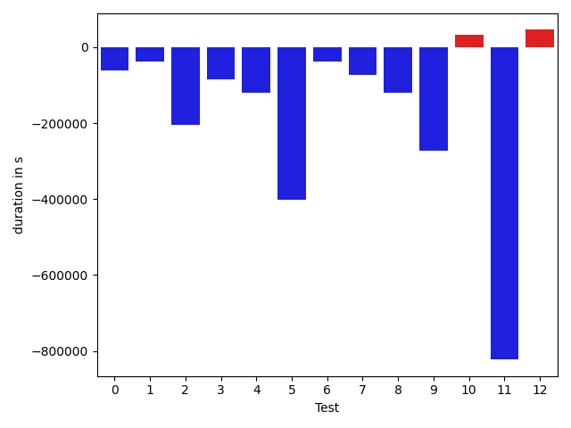

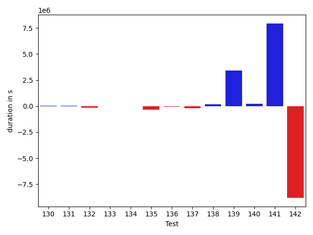

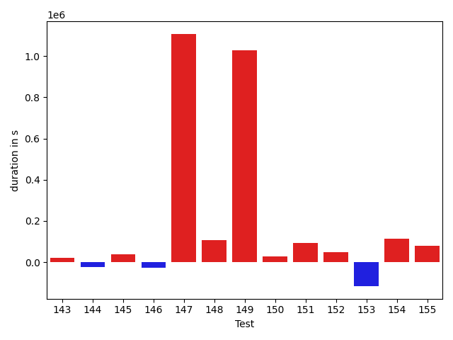

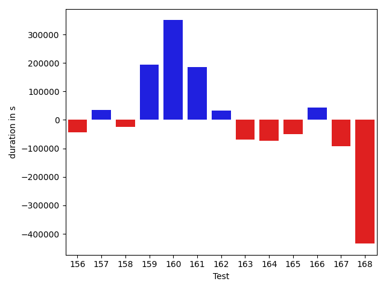

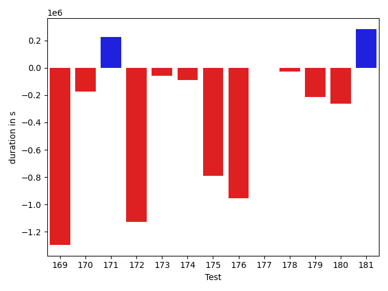

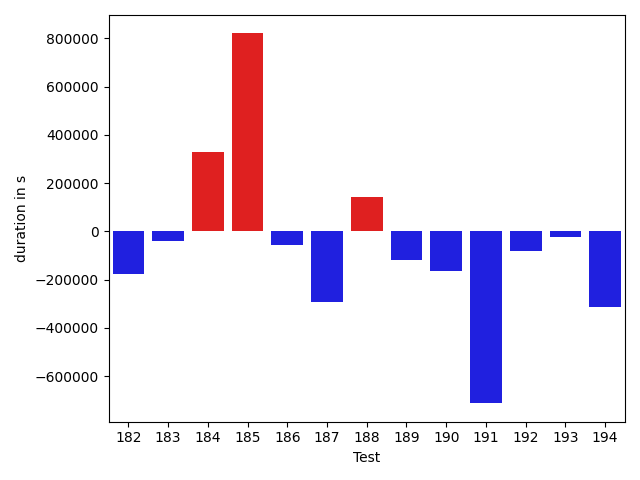

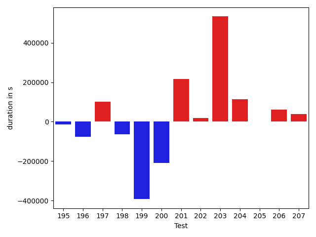

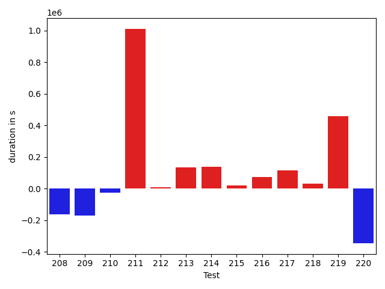

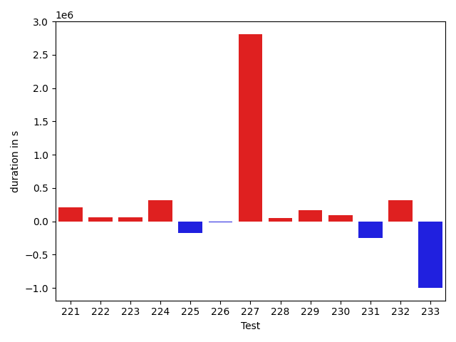

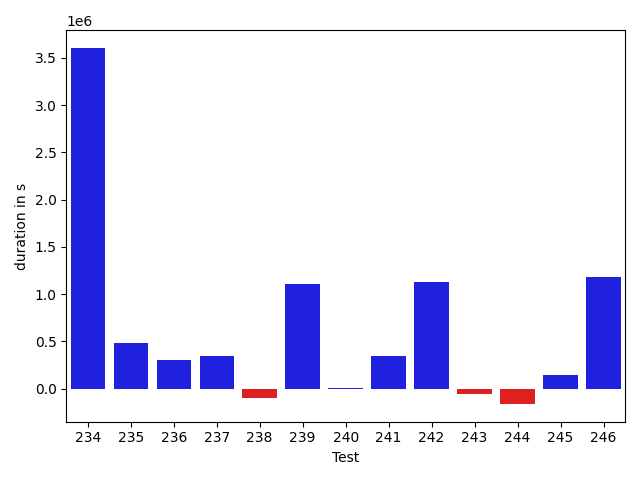

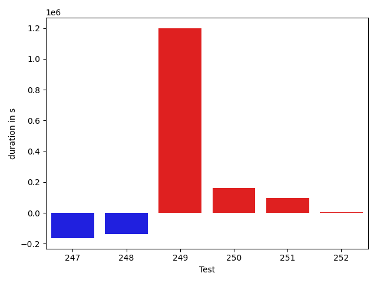

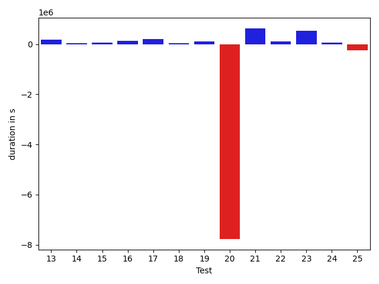

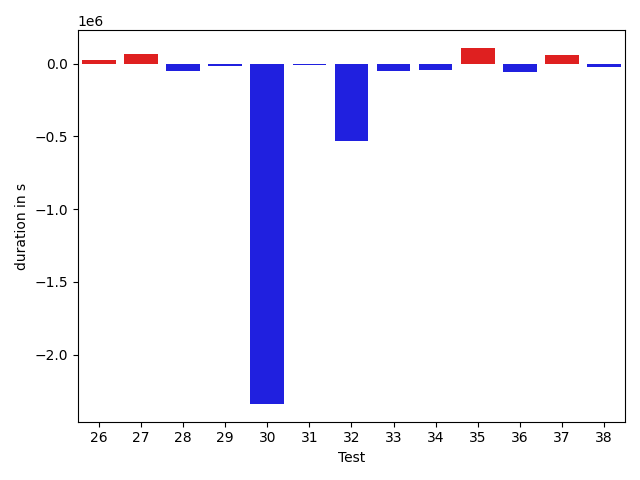

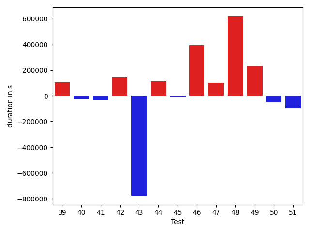

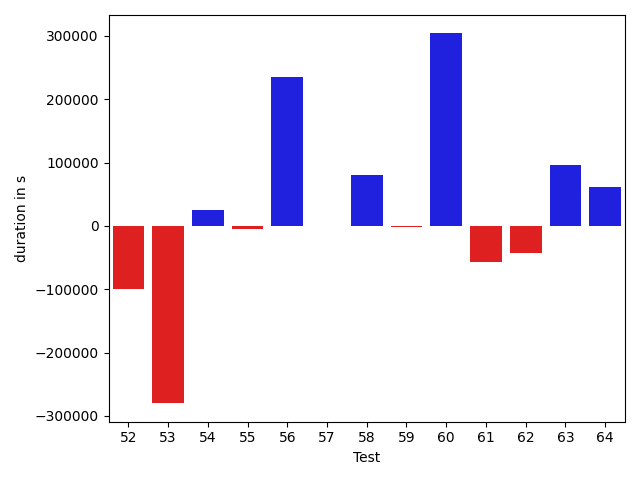

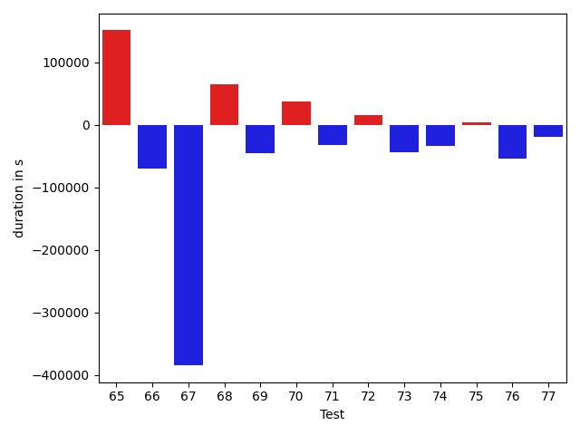

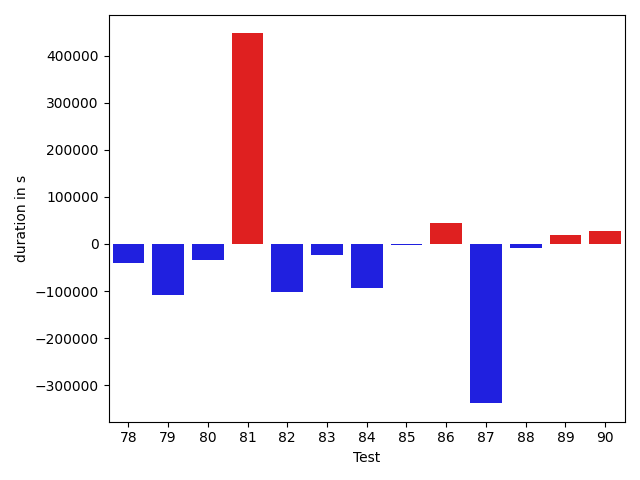

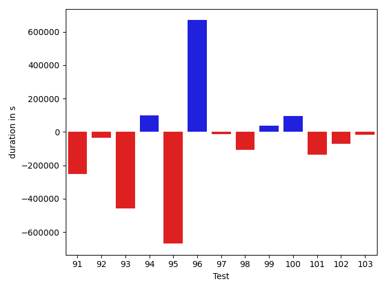

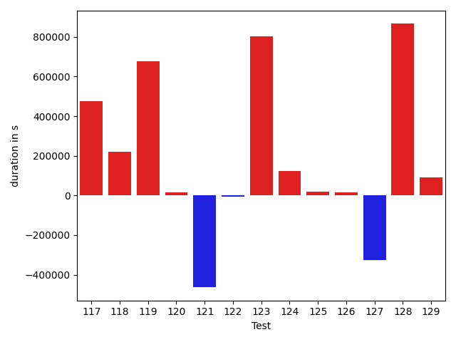

| ID | DurationV1 | DurationsV2 | DeltaDuration |
| --- | --- | --- | --- |
| 0 | 694617.8163646485 | 651068.0452952567 | -43549.77106939186 |
| 1 | 1057125.8277870226 | 939121.2495577686 | -118004.578229254 |
| 2 | 994526.4611623844 | 833556.7451822506 | -160969.71598013374 |
| 3 | 598031.8181861895 | 521599.84834620357 | -76431.96983998595 |
| 4 | 698569.5330597128 | 747795.4325797064 | 49225.899519993574 |
| 5 | 669264.7103177023 | 749885.4345125834 | 80620.72419488116 |
| 6 | 567593.5878722261 | 656290.2585500034 | 88696.67067777726 |
| 7 | 747839.672016829 | 829143.2694590986 | 81303.59744226956 |
| 8 | 1418192.9953401776 | 1442000.072816009 | 23807.07747583138 |
| 9 | 853028.2434111544 | 927791.6141126181 | 74763.37070146378 |
| 10 | 2649126.621457096 | 2530738.552465746 | -118388.06899135001 |
| 11 | 1714737.7517905089 | 1486843.1046817158 | -227894.64710879303 |
| 12 | 1207728.0692392464 | 1118447.30024408 | -89280.76899516652 |
| 13 | 956925.242885723 | 1123376.3751003817 | 166451.13221465866 |
| 14 | 1100977.038917322 | 1132909.4675512551 | 31932.42863393319 |
| 15 | 623508.9946880927 | 675001.9138309782 | 51492.91914288548 |
| 16 | 810505.648349969 | 936639.8691081234 | 126134.2207581544 |
| 17 | 494245.8196129948 | 688281.7323202848 | 194035.91270729003 |
| 18 | 572183.4228846002 | 611740.3027067371 | 39556.879822136834 |
| 19 | 786997.1320156336 | 887541.2648094497 | 100544.13279381604 |
| 20 | 12553398.754042398 | 4781072.915522751 | -7772325.838519647 |
| 21 | 749698.0142275121 | 1376710.2297911937 | 627012.2155636817 |
| 22 | 462031.8753831412 | 574206.9985324328 | 112175.12314929161 |
| 23 | 717705.0541245961 | 1254004.0637720835 | 536299.0096474874 |
| 24 | 342708.20551490784 | 404578.8843612671 | 61870.67884635925 |
| 25 | 885960.5350911267 | 632904.50449362 | -253056.03059750667 |
| 26 | 870518.1321016364 | 666109.0812946667 | -204409.05080696964 |
| 27 | 1694898.2145325872 | 2397188.109348365 | 702289.8948157779 |
| 28 | 1018741.8707062637 | 874322.9786815646 | -144418.89202469913 |
| 29 | 986654.4422954705 | 949740.8493750903 | -36913.59292038018 |
| 30 | 780348.6796114999 | 762712.4114951568 | -17636.268116343068 |
| 31 | 3315867.643617945 | 1839007.5903303921 | -1476860.0532875527 |
| 32 | 726286.9720582888 | 566124.6019214578 | -160162.37013683096 |
| 33 | 478212.80149640184 | 504873.34608304314 | 26660.544586641307 |
| 34 | 447397.4764098525 | 450241.6588073671 | 2844.1823975145817 |
| 35 | 476611.36415958405 | 651446.484181852 | 174835.12002226792 |
| 36 | 488696.2550637722 | 526620.0712735627 | 37923.81620979053 |
| 37 | 610717.7679317872 | 455051.5520831272 | -155666.21584865998 |
| 38 | 532983.415128062 | 516996.84089422226 | -15986.574233839754 |
| 39 | 5566126.613809809 | 5999696.453663278 | 433569.8398534693 |
| 40 | 7565101.996678988 | 4442674.448169974 | -3122427.548509015 |
| 41 | 641678.1564228768 | 879744.3964974161 | 238066.24007453932 |
| 42 | 708509.524049324 | 603269.3662329935 | -105240.15781633044 |
| 43 | 345035.659618482 | 732757.3165383115 | 387721.65691982955 |
| 44 | 1139500.2182224777 | 1105981.9233217991 | -33518.294900678564 |
| 45 | 1581154.7642725566 | 1723658.1764887685 | 142503.4122162119 |
| 46 | 1254912.742725776 | 2085861.9730198719 | 830949.2302940958 |
| 47 | 580775.535611555 | 474647.70789833367 | -106127.82771322131 |
| 48 | 1667114.1204000239 | 2970167.736603878 | 1303053.616203854 |
| 49 | 2017336.6250573664 | 3791085.1401052536 | 1773748.515047887 |
| 50 | 974542.229594931 | 1088967.7454221565 | 114425.51582722552 |
| 51 | 796970.3491758229 | 709700.5923506357 | -87269.75682518724 |
| 52 | 660188.3442938562 | 559844.5783061613 | -100343.76598769485 |
| 53 | 1035335.6415398099 | 755468.6782029297 | -279866.9633368802 |
| 54 | 708617.1284195435 | 733721.1968332105 | 25104.06841366703 |
| 55 | 701526.9856971136 | 696573.7892417327 | -4953.196455380879 |
| 56 | 1095716.9022057396 | 1331087.611659907 | 235370.7094541674 |
| 57 | 487943.00413019955 | 487593.6473441124 | -349.35678608715534 |
| 58 | 587385.089444804 | 667999.6560313033 | 80614.56658649934 |
| 59 | 705672.3617609146 | 704489.6827473826 | -1182.6790135320043 |
| 60 | 409911.37324968353 | 713548.5401833132 | 303637.16693362966 |
| 61 | 414565.8798215389 | 358223.56787109375 | -56342.311950445175 |
| 62 | 788503.5181260232 | 745163.3871772521 | -43340.13094877114 |
| 63 | 542849.0865840551 | 638504.3253790215 | 95655.23879496637 |
| 64 | 832976.7554233068 | 893620.7871664924 | 60644.031743185595 |
| 65 | 529267.1381738078 | 926828.9428578517 | 397561.804684044 |
| 66 | 610606.7023616347 | 1291650.177097418 | 681043.4747357834 |
| 67 | 648081.2337318212 | 1018598.2511177659 | 370517.0173859447 |
| 68 | 504899.0552344844 | 472444.9395373319 | -32454.115697152447 |
| 69 | 642873.0842259355 | 640897.9017476793 | -1975.1824782561744 |
| 70 | 603940.2194289295 | 671615.153134269 | 67674.93370533956 |
| 71 | 389867.50857543945 | 423965.1292076111 | 34097.62063217163 |
| 72 | 563753.7907709421 | 667315.7424507223 | 103561.95167978015 |
| 73 | 454644.1674824953 | 445994.97555032576 | -8649.191932169546 |
| 74 | 509807.77740652516 | 543223.8656336496 | 33416.08822712448 |
| 75 | 583002.125362588 | 647092.7203235435 | 64090.594960955554 |
| 76 | 489676.56228223443 | 576241.0103017092 | 86564.44801947474 |
| 77 | 647863.090648869 | 2741286.2138731554 | 2093423.1232242864 |
| 78 | 494364.2242641449 | 554909.2185049057 | 60544.9942407608 |
| 79 | 533066.9195387512 | 773312.8468538104 | 240245.92731505912 |
| 80 | 400832.11812353134 | 391852.8094177246 | -8979.308705806732 |
| 81 | 487668.4200581908 | 596476.378551349 | 108807.95849315822 |
| 82 | 489891.53752326965 | 390052.68818473816 | -99838.8493385315 |
| 83 | 448797.54192733765 | 432802.4316329956 | -15995.110294342041 |
| 84 | 396742.23962926865 | 443049.9402387738 | 46307.70060950518 |
| 85 | 418876.46339416504 | 406722.3131763935 | -12154.15021777153 |
| 86 | 399744.5756473541 | 434313.96200180054 | 34569.38635444641 |
| 87 | 607758.6046315979 | 590384.3185341076 | -17374.28609749023 |
| 88 | 3689998.6287155887 | 2500324.560702228 | -1189674.0680133607 |
| 89 | 1083441.2453497103 | 1083130.4361582745 | -310.8091914358083 |
| 90 | 611455.7985521778 | 527878.4164753631 | -83577.38207681477 |
| 91 | 731372.9422124496 | 478457.38527373224 | -252915.55693871737 |
| 92 | 502785.2863923003 | 466616.4346887842 | -36168.85170351609 |
| 93 | 1038095.0152944301 | 579947.733945065 | -458147.28134936513 |
| 94 | 620638.5467708674 | 721387.2722161773 | 100748.72544530989 |
| 95 | 1780733.2507964522 | 1111535.6355599593 | -669197.6152364928 |
| 96 | 3364170.046159751 | 4033561.9409572585 | 669391.8947975077 |
| 97 | 440867.0316147804 | 428998.72866249084 | -11868.302952289581 |
| 98 | 940079.1076472633 | 833112.3324104768 | -106966.77523678658 |
| 99 | 1252632.0419545227 | 1289392.1874329376 | 36760.14547841484 |
| 100 | 778590.0696144036 | 874172.0077430811 | 95581.93812867743 |
| 101 | 1538955.610129697 | 1400992.7064881774 | -137962.9036415196 |
| 102 | 1496014.3918348923 | 1426453.628251018 | -69560.76358387433 |
| 103 | 529927.9661769867 | 512254.16434812546 | -17673.801828861237 |
| 104 | 3049341.3222988714 | 1628048.6364396308 | -1421292.6858592406 |
| 105 | 397755.7024307251 | 473880.8481140137 | 76125.14568328857 |
| 106 | 426050.9515991211 | 420347.48319530487 | -5703.468403816223 |
| 107 | 1020108.1877980053 | 1344761.5475382912 | 324653.3597402859 |
| 108 | 529001.3510818481 | 919139.598236084 | 390138.24715423584 |
| 109 | 619262.7616158401 | 3859298.570875124 | 3240035.809259284 |
| 110 | 574145.0005603519 | 578698.6665227723 | 4553.665962420404 |
| 111 | 4454114.258708065 | 3383816.1318888636 | -1070298.1268192017 |
| 112 | 431579.7760022506 | 554468.0648848955 | 122888.28888264485 |
| 113 | 794252.866904899 | 837075.6627993849 | 42822.7958944859 |
| 114 | 767224.8262215344 | 808612.6946441823 | 41387.86842264794 |
| 115 | 621880.2737326585 | 679068.9556973912 | 57188.68196473271 |
| 116 | 555942.4419991685 | 685313.0619280819 | 129370.61992891342 |
| 117 | 983423.7376044363 | 1043370.705216014 | 59946.967611577595 |
| 118 | 393059.9759979248 | 465775.97679138184 | 72716.00079345703 |
| 119 | 494025.1452741382 | 592041.6572501813 | 98016.51197604311 |
| 120 | 614374.9114781437 | 851079.3495316114 | 236704.43805346778 |
| 121 | 472640.17846548057 | 486090.74234060134 | 13450.563875120773 |
| 122 | 926311.3857243485 | 865748.3378304383 | -60563.0478939102 |
| 123 | 973019.2195547321 | 906231.7149678478 | -66787.50458688429 |
| 124 | 997139.0621472674 | 768683.9603445998 | -228455.1018026676 |
| 125 | 1844346.140985995 | 1692787.3088883306 | -151558.83209766448 |
| 126 | 930629.1710613103 | 849117.3166278579 | -81511.85443345248 |
| 127 | 1638628.3151373952 | 1654580.9080825597 | 15952.592945164535 |
| 128 | 1117292.3278066125 | 895359.9871698474 | -221932.34063676512 |
| 129 | 1079353.283979527 | 1007894.0359033418 | -71459.24807618512 |
| 130 | 1012622.3667376838 | 1039047.2314988745 | 26424.86476119072 |
| 131 | 879815.9040285773 | 911599.5444340244 | 31783.640405447106 |
| 132 | 1778015.1591124248 | 1604252.1301769016 | -173763.02893552324 |
| 133 | 1097584.856912185 | 1099378.2373462406 | 1793.3804340555798 |
| 134 | 963321.0203373043 | 970826.5117594787 | 7505.491422174382 |
| 135 | 999745.0512220236 | 646471.152813809 | -353273.89840821456 |
| 136 | 708840.2103732086 | 646537.1856229678 | -62303.024750240846 |
| 137 | 664110.9250746937 | 448494.9411352873 | -215615.98393940646 |
| 138 | 454273.6740265143 | 609114.6544781029 | 154840.98045158864 |
| 139 | 911300.6465591924 | 4345403.785552426 | 3434103.138993234 |
| 140 | 712616.582160404 | 952652.0592443696 | 240035.47708396567 |
| 141 | 769449.3464041012 | 8709788.480716996 | 7940339.134312894 |
| 142 | 9834100.274455057 | 1029508.6987707339 | -8804591.575684324 |
| 143 | 760598.567377083 | 445812.5759146346 | -314785.9914624484 |
| 144 | 3224443.924290732 | 964570.6741442495 | -2259873.2501464826 |
| 145 | 943932.4688763046 | 851790.3688350065 | -92142.10004129808 |
| 146 | 1403180.795121477 | 1101436.635630533 | -301744.1594909439 |
| 147 | 1676994.689210441 | 1307795.9964728858 | -369198.69273755513 |
| 148 | 2347459.3383919997 | 2253978.9592233105 | -93480.37916868925 |
| 149 | 794344.6607419259 | 755350.0727965919 | -38994.58794533403 |
| 150 | 1413515.906104875 | 1372383.2183221807 | -41132.68778269435 |
| 151 | 924908.945739133 | 782249.2591451486 | -142659.6865939845 |
| 152 | 1374931.150528956 | 2164350.23397749 | 789419.0834485341 |
| 153 | 956232.2126781287 | 1071090.3379046023 | 114858.12522647355 |
| 154 | 1208132.3023525786 | 1373872.845410448 | 165740.54305786942 |
| 155 | 956095.2362676808 | 1033685.4604932538 | 77590.22422557301 |
| 156 | 987360.7098977226 | 943342.9689780774 | -44017.74091964518 |
| 157 | 718564.0607331247 | 753344.7123671203 | 34780.651633995585 |
| 158 | 1450878.1658789748 | 1426470.232122675 | -24407.933756299783 |
| 159 | 865563.0772739333 | 1060731.918954766 | 195168.84168083256 |
| 160 | 3330106.105195589 | 3680215.216491796 | 350109.1112962072 |
| 161 | 506834.3498506993 | 693132.5481823361 | 186298.19833163684 |
| 162 | 828147.8888794464 | 860116.5452217134 | 31968.656342266942 |
| 163 | 499671.68240475655 | 431552.99833212607 | -68118.68407263048 |
| 164 | 703891.2595958537 | 629723.9753720223 | -74167.28422383149 |
| 165 | 689057.0037381966 | 639280.8972493748 | -49776.106488821795 |
| 166 | 1263496.3075497148 | 1306989.9315254064 | 43493.62397569162 |
| 167 | 778801.0565629005 | 686460.6988535095 | -92340.35770939104 |
| 168 | 1210458.8431063793 | 776043.3269571476 | -434415.5161492317 |
| 169 | 3122948.7048484767 | 1827424.7138101547 | -1295523.991038322 |
| 170 | 1184155.0427997122 | 1012186.6076369267 | -171968.43516278546 |
| 171 | 880612.4543157921 | 1104230.0499005876 | 223617.59558479558 |
| 172 | 1895593.3362710068 | 766840.8167585938 | -1128752.519512413 |
| 173 | 485657.85463142395 | 427685.8365531729 | -57972.01807825104 |
| 174 | 737027.5692032306 | 649465.9764223384 | -87561.59278089216 |
| 175 | 7079764.597520915 | 6290426.5997218415 | -789337.9977990733 |
| 176 | 8699251.066760734 | 7743339.494580261 | -955911.5721804723 |
| 177 | 566423.4717186478 | 566950.7846137502 | 527.3128951024264 |
| 178 | 564833.8667740524 | 537678.3147543543 | -27155.55201969808 |
| 179 | 818677.2021448335 | 606059.323072976 | -212617.87907185755 |
| 180 | 994558.9287360879 | 732598.1785239516 | -261960.7502121363 |
| 181 | 888724.7275193683 | 1171818.6621543032 | 283093.9346349349 |
| 182 | 454700.145554869 | 509793.86719906144 | 55093.72164419241 |
| 183 | 2590114.820397186 | 722899.3641039345 | -1867215.4562932516 |
| 184 | 678597.301070099 | 542344.7359409153 | -136252.5651291837 |
| 185 | 926188.1104648737 | 664230.6994696611 | -261957.41099521262 |
| 186 | 1077663.3098597587 | 1000437.4319059486 | -77225.87795381015 |
| 187 | 930328.0455015171 | 1199232.0652597863 | 268904.0197582692 |
| 188 | 723280.1342148288 | 765902.4521131612 | 42622.317898332374 |
| 189 | 886253.5704430876 | 1097131.643373415 | 210878.0729303275 |
| 190 | 1228939.6592437567 | 1969808.430304121 | 740868.7710603643 |
| 191 | 1207933.8202414466 | 803439.7418538537 | -404494.0783875929 |
| 192 | 658648.0716455341 | 753516.988165623 | 94868.91652008891 |
| 193 | 433918.8188635558 | 566252.2423095703 | 132333.42344601452 |
| 194 | 357589.2953745574 | 547298.2200202942 | 189708.9246457368 |
| 195 | 559918.839397788 | 438777.5263394937 | -121141.31305829436 |
| 196 | 728039.5902937427 | 11082559.589411685 | 10354519.999117943 |
| 197 | 500801.62940233946 | 1010567.0385302305 | 509765.40912789106 |
| 198 | 374561.7086728215 | 493882.91508829594 | 119321.20641547441 |
| 199 | 1015499.3930172463 | 768120.3984676576 | -247378.99454958865 |
| 200 | 1703466.6451723129 | 779003.1149948069 | -924463.5301775059 |
| 201 | 2569640.865328169 | 2369757.6233145166 | -199883.24201365234 |
| 202 | 662611.2288234308 | 506033.55211639404 | -156577.6767070368 |
| 203 | 6146660.041243024 | 489370.4292611528 | -5657289.611981872 |
| 204 | 712722.462465547 | 457326.65493795276 | -255395.80752759427 |
| 205 | 543022.8237728775 | 402824.69312427565 | -140198.1306486018 |
| 206 | 516939.3210824728 | 613091.3694908917 | 96152.0484084189 |
| 207 | 1623877.6136527439 | 2896001.219772885 | 1272123.6061201412 |
| 208 | 593132.0003941441 | 504737.6407770084 | -88394.35961713572 |
| 209 | 782910.0534944282 | 1157186.1927844752 | 374276.139290047 |
| 210 | 728027.9078122063 | 764709.1297252453 | 36681.221913038986 |
| 211 | 790856.6926963363 | 738080.058577657 | -52776.63411867933 |
| 212 | 1140259.8885335866 | 1056833.8421026627 | -83426.04643092398 |
| 213 | 1091794.862359757 | 961716.3510987371 | -130078.51126101997 |
| 214 | 968120.3414251022 | 796506.3087477091 | -171614.03267739306 |
| 215 | 992506.7001281411 | 868854.3279320436 | -123652.37219609751 |
| 216 | 3338657.4455618234 | 667866.1546008696 | -2670791.2909609536 |
| 217 | 937996.4966495298 | 536576.9691385031 | -401419.5275110267 |
| 218 | 869890.8206539126 | 513062.1464443803 | -356828.6742095323 |
| 219 | 692374.5831533154 | 463270.0216660239 | -229104.56148729147 |
| 220 | 950510.3734359654 | 872880.7401559633 | -77629.63328000205 |
| 221 | 1465937.8692741466 | 1093001.621729808 | -372936.2475443387 |
| 222 | 1077609.5727480936 | 843669.1968880414 | -233940.37586005218 |
| 223 | 2959653.1688701166 | 3357593.876250097 | 397940.7073799805 |
| 224 | 1302435.9493710394 | 870915.0333343077 | -431520.9160367317 |
| 225 | 2170023.481591552 | 1213417.6031394647 | -956605.8784520873 |
| 226 | 719775.2509752733 | 819452.5960140417 | 99677.34503876837 |
| 227 | 882782.1419956397 | 1063529.4923697389 | 180747.35037409922 |
| 228 | 732506.5348104454 | 1233625.8140635118 | 501119.2792530664 |
| 229 | 718140.4806730989 | 792518.5568629452 | 74378.07618984627 |
| 230 | 896719.1090547771 | 757066.5004958769 | -139652.6085589002 |
| 231 | 957421.8907209751 | 673810.3959700146 | -283611.4947509605 |
| 232 | 2087356.350617474 | 1474935.1176713658 | -612421.2329461081 |
| 233 | 2850127.2751527 | 2261251.91927759 | -588875.3558751103 |
| 234 | 765898.049089717 | 4369292.154875236 | 3603394.105785519 |
| 235 | 1054500.2932316726 | 1535006.5478537031 | 480506.25462203054 |
| 236 | 907942.6008993498 | 1212628.4438762637 | 304685.8429769139 |
| 237 | 633156.3895393685 | 976273.2143263221 | 343116.8247869536 |
| 238 | 570455.3479076349 | 469322.0272974316 | -101133.32061020331 |
| 239 | 1318546.5931738014 | 2424867.588629865 | 1106320.9954560637 |
| 240 | 1306062.4143701226 | 1309569.0825821278 | 3506.66821200517 |
| 241 | 1084617.706427712 | 1432249.5910994108 | 347631.8846716988 |
| 242 | 1079238.3615387212 | 2203590.9094052436 | 1124352.5478665223 |
| 243 | 815519.2460304392 | 759325.3092162882 | -56193.936814151006 |
| 244 | 1256644.4070804077 | 1096052.8321649618 | -160591.57491544588 |
| 245 | 696421.6055546682 | 839185.5897570068 | 142763.98420233862 |
| 246 | 761866.0695985828 | 1946685.3866457306 | 1184819.3170471478 |
| 247 | 423829.12379876524 | 531396.5374516211 | 107567.4136528559 |
| 248 | 594228.4983072504 | 642146.4066958427 | 47917.9083885923 |
| 249 | 409422.8272912204 | 546459.5707889795 | 137036.7434977591 |
| 250 | 2124392.9812660217 | 843673.1929147169 | -1280719.7883513048 |
| 251 | 1007627.5146905108 | 1138325.534547601 | 130698.01985709008 |
| 252 | 547141.8780612946 | 507051.4573149085 | -40090.42074638605 |

## Misc.

| ID | Test Class | Test Method |
| --- | --- | --- |
| 0 | com.google.gson.functional.PrimitiveTest | testDeserializePrimitiveWrapperAsObjectField |
| 1 | com.google.gson.functional.StreamingTypeAdaptersTest | testNullSafe |
| 2 | com.google.gson.functional.StreamingTypeAdaptersTest | testSerializeWithCustomTypeAdapter |
| 3 | com.google.gson.functional.StreamingTypeAdaptersTest | testDeserializeWithCustomTypeAdapter |
| 4 | com.google.gson.functional.StreamingTypeAdaptersTest | testSerializeRecursive |
| 5 | com.google.gson.functional.CustomDeserializerTest | testDefaultConstructorNotCalledOnField |
| 6 | com.google.gson.functional.CustomDeserializerTest | testDefaultConstructorNotCalledOnObject |
| 7 | com.google.gson.functional.CustomDeserializerTest | testCustomDeserializerReturnsNullForArrayElementsForArrayField |
| 8 | com.google.gson.functional.CustomDeserializerTest | testJsonTypeFieldBasedDeserialization |
| 9 | com.google.gson.functional.CustomDeserializerTest | testCustomDeserializerReturnsNull |
| 10 | com.google.gson.functional.ThrowableFunctionalTest | testExceptionWithoutCause |
| 11 | com.google.gson.functional.ThrowableFunctionalTest | testSerializedNameOnExceptionFields |
| 12 | com.google.gson.functional.ThrowableFunctionalTest | testExceptionWithCause |
| 13 | com.google.gson.functional.ThrowableFunctionalTest | testErrorWithoutCause |
| 14 | com.google.gson.functional.ThrowableFunctionalTest | testErrornWithCause |
| 15 | com.google.gson.functional.InterfaceTest | testSerializingObjectImplementingInterface |
| 16 | com.google.gson.functional.InterfaceTest | testSerializingInterfaceObjectField |
| 17 | com.google.gson.functional.DefaultTypeAdaptersTest | testBadValueForBigDecimalDeserialization |
| 18 | com.google.gson.functional.DefaultTypeAdaptersTest | testBigIntegerFieldDeserialization |
| 19 | com.google.gson.functional.DefaultTypeAdaptersTest | testUrlNullSerialization |
| 20 | com.google.gson.functional.DefaultTypeAdaptersTest | testNullSerialization |
| 21 | com.google.gson.functional.DefaultTypeAdaptersTest | testBigIntegerFieldSerialization |
| 22 | com.google.gson.functional.DefaultTypeAdaptersTest | testBigDecimalFieldDeserialization |
| 23 | com.google.gson.functional.DefaultTypeAdaptersTest | testBigDecimalFieldSerialization |
| 24 | com.google.gson.functional.DefaultTypeAdaptersTest | testUrlNullDeserialization |
| 25 | com.google.gson.functional.NamingPolicyTest | testAtSignInSerializedName |
| 26 | com.google.gson.functional.NamingPolicyTest | testGsonWithNonDefaultFieldNamingPolicySerialization |
| 27 | com.google.gson.functional.NamingPolicyTest | testGsonDuplicateNameUsingSerializedNameFieldNamingPolicySerialization |
| 28 | com.google.gson.functional.NamingPolicyTest | testGsonWithSerializedNameFieldNamingPolicySerialization |
| 29 | com.google.gson.functional.NamingPolicyTest | testComplexFieldNameStrategy |
| 30 | com.google.gson.functional.NamingPolicyTest | testDeprecatedNamingStrategy |
| 31 | com.google.gson.functional.NamingPolicyTest | testGsonWithNonDefaultFieldNamingPolicyDeserialiation |
| 32 | com.google.gson.functional.NamingPolicyTest | testGsonWithLowerCaseDashPolicySerialization |
| 33 | com.google.gson.functional.NamingPolicyTest | testGsonWithLowerCaseDashPolicyDeserialiation |
| 34 | com.google.gson.functional.NamingPolicyTest | testGsonWithSerializedNameFieldNamingPolicyDeserialization |
| 35 | com.google.gson.functional.NamingPolicyTest | testGsonWithUpperCamelCaseSpacesPolicyDeserialiation |
| 36 | com.google.gson.functional.NamingPolicyTest | testGsonWithUpperCamelCaseSpacesPolicySerialiation |
| 37 | com.google.gson.functional.NamingPolicyTest | testGsonWithLowerCaseUnderscorePolicyDeserialiation |
| 38 | com.google.gson.functional.NamingPolicyTest | testGsonWithLowerCaseUnderscorePolicySerialization |
| 39 | com.google.gson.functional.CircularReferenceTest | testCircularSerialization |
| 40 | com.google.gson.functional.CircularReferenceTest | testSelfReferenceArrayFieldSerialization |
| 41 | com.google.gson.functional.CircularReferenceTest | testDirectedAcyclicGraphDeserialization |
| 42 | com.google.gson.functional.CircularReferenceTest | testDirectedAcyclicGraphSerialization |
| 43 | com.google.gson.functional.CircularReferenceTest | testSelfReferenceIgnoredInSerialization |
| 44 | com.google.gson.functional.MapTest | testMapSerializationWithNullValues |
| 45 | com.google.gson.functional.MapTest | testInterfaceTypeMapWithSerializer |
| 46 | com.google.gson.functional.MapTest | testComplexKeysSerialization |
| 47 | com.google.gson.functional.MapTest | testMapSerializationWithNullValuesSerialized |
| 48 | com.google.gson.functional.MapTest | testInterfaceTypeMap |
| 49 | com.google.gson.functional.MapTest | testComplexKeysDeserialization |
| 50 | com.google.gson.functional.MapTest | testGeneralMapField |
| 51 | com.google.gson.functional.ReadersWritersTest | testReadWriteTwoObjects |
| 52 | com.google.gson.functional.ReadersWritersTest | testReaderForDeserialization |
| 53 | com.google.gson.functional.ReadersWritersTest | testWriterForSerialization |
| 54 | com.google.gson.functional.ObjectTest | testEmptyCollectionInAnObjectDeserialization |
| 55 | com.google.gson.functional.ObjectTest | testArrayOfArraysDeserialization |
| 56 | com.google.gson.functional.ObjectTest | testSingletonLists |
| 57 | com.google.gson.functional.ObjectTest | testNullFieldsSerialization |
| 58 | com.google.gson.functional.ObjectTest | testPrivateNoArgConstructorDeserialization |
| 59 | com.google.gson.functional.ObjectTest | testArrayOfObjectsAsFields |
| 60 | com.google.gson.functional.ObjectTest | testClassWithTransientFieldsDeserializationTransientFieldsPassedInJsonAreIgnored |
| 61 | com.google.gson.functional.ObjectTest | testNullArraysDeserialization |
| 62 | com.google.gson.functional.ObjectTest | testInnerClassSerialization |
| 63 | com.google.gson.functional.ObjectTest | testClassWithObjectFieldSerialization |
| 64 | com.google.gson.functional.ObjectTest | testArrayOfArraysSerialization |
| 65 | com.google.gson.functional.ObjectTest | testNestedDeserialization |
| 66 | com.google.gson.functional.ObjectTest | testBagOfPrimitiveWrappersSerialization |
| 67 | com.google.gson.functional.ObjectTest | testJsonInSingleQuotesDeserialization |
| 68 | com.google.gson.functional.ObjectTest | testNullFieldsDeserialization |
| 69 | com.google.gson.functional.ObjectTest | testArrayOfObjectsSerialization |
| 70 | com.google.gson.functional.ObjectTest | testInnerClassDeserialization |
| 71 | com.google.gson.functional.ObjectTest | testStringFieldWithEmptyValueDeserialization |
| 72 | com.google.gson.functional.ObjectTest | testNestedSerialization |
| 73 | com.google.gson.functional.ObjectTest | testStringFieldWithNumberValueDeserialization |
| 74 | com.google.gson.functional.ObjectTest | testPrimitiveArrayInAnObjectDeserialization |
| 75 | com.google.gson.functional.ObjectTest | testArrayOfObjectsDeserialization |
| 76 | com.google.gson.functional.ObjectTest | testBagOfPrimitivesSerialization |
| 77 | com.google.gson.functional.ObjectTest | testBagOfPrimitiveWrappersDeserialization |
| 78 | com.google.gson.functional.ObjectTest | testJsonInMixedQuotesDeserialization |
| 79 | com.google.gson.functional.ObjectTest | testClassWithTransientFieldsSerialization |
| 80 | com.google.gson.functional.ObjectTest | testNullPrimitiveFieldsDeserialization |
| 81 | com.google.gson.functional.ObjectTest | testBagOfPrimitivesDeserialization |
| 82 | com.google.gson.functional.ObjectTest | testClassWithTransientFieldsDeserialization |
| 83 | com.google.gson.functional.ObjectTest | testEmptyCollectionInAnObjectSerialization |
| 84 | com.google.gson.functional.ObjectTest | testObjectFieldNamesWithoutQuotesDeserialization |
| 85 | com.google.gson.functional.ObjectTest | testNullObjectFieldsDeserialization |
| 86 | com.google.gson.functional.ObjectTest | testPrimitiveArrayFieldSerialization |
| 87 | com.google.gson.functional.ObjectTest | testStringFieldWithEmptyValueSerialization |
| 88 | com.google.gson.functional.ExposeFieldsTest | testNullExposeFieldSerialization |
| 89 | com.google.gson.functional.ExposeFieldsTest | testExposedInterfaceFieldSerialization |
| 90 | com.google.gson.functional.ExposeFieldsTest | testExposedInterfaceFieldDeserialization |
| 91 | com.google.gson.functional.ExposeFieldsTest | testExposeAnnotationDeserialization |
| 92 | com.google.gson.functional.ExposeFieldsTest | testExposeAnnotationSerialization |
| 93 | com.google.gson.functional.ExposeFieldsTest | testArrayWithOneNullExposeFieldObjectSerialization |
| 94 | com.google.gson.functional.FieldExclusionTest | testDefaultNestedStaticClassIncluded |
| 95 | com.google.gson.functional.FieldExclusionTest | testDefaultInnerClassExclusion |
| 96 | com.google.gson.functional.InheritanceTest | testSubInterfacesOfCollectionSerialization |
| 97 | com.google.gson.functional.InheritanceTest | testBaseSerializedAsSubForToJsonMethod |
| 98 | com.google.gson.functional.InheritanceTest | testClassWithBaseArrayFieldSerialization |
| 99 | com.google.gson.functional.InheritanceTest | testSubInterfacesOfCollectionDeserialization |
| 100 | com.google.gson.functional.InheritanceTest | testClassWithBaseCollectionFieldSerialization |
| 101 | com.google.gson.functional.InheritanceTest | testClassWithBaseFieldSerialization |
| 102 | com.google.gson.functional.InheritanceTest | testSubClassSerialization |
| 103 | com.google.gson.functional.InheritanceTest | testBaseSerializedAsSub |
| 104 | com.google.gson.functional.InheritanceTest | testBaseSerializedAsBaseWhenSpecifiedWithExplicitTypeForToJsonMethod |
| 105 | com.google.gson.functional.InheritanceTest | testBaseSerializedAsSubWhenSpecifiedWithExplicitTypeForToJsonMethod |
| 106 | com.google.gson.functional.InheritanceTest | testBaseSerializedAsBaseWhenSpecifiedWithExplicitType |
| 107 | com.google.gson.functional.InheritanceTest | testSubClassDeserialization |
| 108 | com.google.gson.functional.InheritanceTest | testBaseSerializedAsSubWhenSpecifiedWithExplicitType |
| 109 | com.google.gson.GsonBuilderTest | testExcludeFieldsWithModifiers |
| 110 | com.google.gson.GsonBuilderTest | testTransientFieldExclusion |
| 111 | com.google.gson.functional.RuntimeTypeAdapterFactoryFunctionalTest | testSubclassesAutomaticallySerialzed |
| 112 | com.google.gson.functional.NullObjectAndFieldTest | testExplicitDeserializationOfNulls |
| 113 | com.google.gson.functional.NullObjectAndFieldTest | testAbsentJsonElementsAreSetToNull |
| 114 | com.google.gson.functional.NullObjectAndFieldTest | testPrintPrintingObjectWithNulls |
| 115 | com.google.gson.functional.NullObjectAndFieldTest | testNullWrappedPrimitiveMemberSerialization |
| 116 | com.google.gson.functional.NullObjectAndFieldTest | testExplicitNullSetsFieldToNullDuringDeserialization |
| 117 | com.google.gson.functional.NullObjectAndFieldTest | testExplicitSerializationOfNullArrayMembers |
| 118 | com.google.gson.functional.NullObjectAndFieldTest | testNullWrappedPrimitiveMemberDeserialization |
| 119 | com.google.gson.functional.NullObjectAndFieldTest | testExplicitSerializationOfNullCollectionMembers |
| 120 | com.google.gson.functional.NullObjectAndFieldTest | testExplicitSerializationOfNulls |
| 121 | com.google.gson.functional.NullObjectAndFieldTest | testExplicitSerializationOfNullStringMembers |
| 122 | com.google.gson.JsonParserTest | testReadWriteTwoObjects |
| 123 | com.google.gson.functional.ParameterizedTypesTest | testVariableTypeArrayDeserialization |
| 124 | com.google.gson.functional.ParameterizedTypesTest | testParameterizedTypeWithReaderDeserialization |
| 125 | com.google.gson.functional.ParameterizedTypesTest | testParameterizedTypesSerialization |
| 126 | com.google.gson.functional.ParameterizedTypesTest | testVariableTypeDeserialization |
| 127 | com.google.gson.functional.ParameterizedTypesTest | testVariableTypeFieldsAndGenericArraysSerialization |
| 128 | com.google.gson.functional.ParameterizedTypesTest | testParameterizedTypeGenericArraysDeserialization |
| 129 | com.google.gson.functional.ParameterizedTypesTest | testParameterizedTypeDeserialization |
| 130 | com.google.gson.functional.ParameterizedTypesTest | testVariableTypeFieldsAndGenericArraysDeserialization |
| 131 | com.google.gson.functional.ParameterizedTypesTest | testTypesWithMultipleParametersDeserialization |
| 132 | com.google.gson.functional.ParameterizedTypesTest | testTypesWithMultipleParametersSerialization |
| 133 | com.google.gson.functional.ParameterizedTypesTest | testParameterizedTypeWithVariableTypeDeserialization |
| 134 | com.google.gson.functional.ParameterizedTypesTest | testParameterizedTypeGenericArraysSerialization |
| 135 | com.google.gson.functional.ParameterizedTypesTest | testDeepParameterizedTypeDeserialization |
| 136 | com.google.gson.functional.ParameterizedTypesTest | testParameterizedTypesWithWriterSerialization |
| 137 | com.google.gson.functional.ParameterizedTypesTest | testDeepParameterizedTypeSerialization |
| 138 | com.google.gson.functional.JsonTreeTest | testJsonTreeNull |
| 139 | com.google.gson.functional.JsonTreeTest | testJsonTreeToString |
| 140 | com.google.gson.functional.JsonTreeTest | testToJsonTreeObjectType |
| 141 | com.google.gson.functional.JsonTreeTest | testToJsonTree |
| 142 | com.google.gson.functional.SerializedNameTest | testFirstNameIsChosenForSerialization |
| 143 | com.google.gson.functional.SerializedNameTest | testMultipleNamesInTheSameString |
| 144 | com.google.gson.functional.SerializedNameTest | testMultipleNamesDeserializedCorrectly |
| 145 | com.google.gson.functional.CustomTypeAdaptersTest | testCustomNestedSerializers |
| 146 | com.google.gson.functional.CustomTypeAdaptersTest | testCustomTypeAdapterDoesNotAppliesToSubClasses |
| 147 | com.google.gson.functional.CustomTypeAdaptersTest | testEnsureCustomSerializerNotInvokedForNullValues |
| 148 | com.google.gson.functional.CustomTypeAdaptersTest | testEnsureCustomDeserializerNotInvokedForNullValues |
| 149 | com.google.gson.functional.CustomTypeAdaptersTest | testCustomNestedDeserializers |
| 150 | com.google.gson.functional.JsonAdapterAnnotationOnFieldsTest | testClassAnnotationAdapterFactoryTakesPrecedenceOverDefault |
| 151 | com.google.gson.functional.JsonAdapterAnnotationOnFieldsTest | testJsonAdapterWrappedInNullSafeAsRequested |
| 152 | com.google.gson.functional.JsonAdapterAnnotationOnFieldsTest | testClassAnnotationAdapterTakesPrecedenceOverDefault |
| 153 | com.google.gson.functional.JsonAdapterAnnotationOnFieldsTest | testFieldAnnotationTakesPrecedenceOverClassAnnotation |
| 154 | com.google.gson.functional.JsonAdapterAnnotationOnFieldsTest | testFieldAnnotationTakesPrecedenceOverRegisteredTypeAdapter |
| 155 | com.google.gson.functional.JsonAdapterAnnotationOnFieldsTest | testJsonAdapterInvokedOnlyForAnnotatedFields |
| 156 | com.google.gson.functional.JsonAdapterAnnotationOnFieldsTest | testRegisteredTypeAdapterTakesPrecedenceOverClassAnnotationAdapter |
| 157 | com.google.gson.functional.TypeVariableTest | testBasicTypeVariables |
| 158 | com.google.gson.functional.TypeVariableTest | testAdvancedTypeVariables |
| 159 | com.google.gson.functional.TypeVariableTest | testTypeVariablesViaTypeParameter |
| 160 | com.google.gson.functional.VersioningTest | testVersionedUntilSerialization |
| 161 | com.google.gson.functional.VersioningTest | testVersionedClassesDeserialization |
| 162 | com.google.gson.functional.VersioningTest | testVersionedClassesSerialization |
| 163 | com.google.gson.functional.VersioningTest | testVersionedUntilDeserialization |
| 164 | com.google.gson.functional.VersioningTest | testVersionedGsonMixingSinceAndUntilDeserialization |
| 165 | com.google.gson.functional.VersioningTest | testVersionedGsonWithUnversionedClassesSerialization |
| 166 | com.google.gson.functional.VersioningTest | testVersionedGsonMixingSinceAndUntilSerialization |
| 167 | com.google.gson.functional.VersioningTest | testVersionedGsonWithUnversionedClassesDeserialization |
| 168 | com.google.gson.functional.MapAsArrayTypeAdapterTest | testMultipleEnableComplexKeyRegistrationHasNoEffect |
| 169 | com.google.gson.functional.MapAsArrayTypeAdapterTest | testSerializeComplexMapWithTypeAdapter |
| 170 | com.google.gson.functional.MapAsArrayTypeAdapterTest | testMapWithTypeVariableSerialization |
| 171 | com.google.gson.functional.MapAsArrayTypeAdapterTest | testMapWithTypeVariableDeserialization |
| 172 | com.google.gson.functional.EnumTest | testClassWithEnumFieldSerialization |
| 173 | com.google.gson.functional.EnumTest | testClassWithEnumFieldDeserialization |
| 174 | com.google.gson.functional.ConcurrencyTest | testSingleThreadSerialization |
| 175 | com.google.gson.functional.ConcurrencyTest | testMultiThreadSerialization |
| 176 | com.google.gson.functional.ConcurrencyTest | testMultiThreadDeserialization |
| 177 | com.google.gson.functional.ConcurrencyTest | testSingleThreadDeserialization |
| 178 | com.google.gson.functional.EscapingTest | testGsonDoubleDeserialization |
| 179 | com.google.gson.functional.EscapingTest | testGsonAcceptsEscapedAndNonEscapedJsonDeserialization |
| 180 | com.google.gson.functional.EscapingTest | testEscapingObjectFields |
| 181 | com.google.gson.functional.FieldNamingTest | testIdentity |
| 182 | com.google.gson.functional.FieldNamingTest | testLowerCaseWithDashes |
| 183 | com.google.gson.functional.FieldNamingTest | testLowerCaseWithUnderscores |
| 184 | com.google.gson.functional.FieldNamingTest | testUpperCamelCaseWithSpaces |
| 185 | com.google.gson.functional.FieldNamingTest | testUpperCamelCase |
| 186 | com.google.gson.functional.RawSerializationTest | testThreeLevelParameterizedObject |
| 187 | com.google.gson.functional.RawSerializationTest | testParameterizedObject |
| 188 | com.google.gson.functional.RawSerializationTest | testCollectionOfObjects |
| 189 | com.google.gson.functional.RawSerializationTest | testTwoLevelParameterizedObject |
| 190 | com.google.gson.functional.InstanceCreatorTest | testInstanceCreatorReturnsBaseType |
| 191 | com.google.gson.functional.InstanceCreatorTest | testInstanceCreatorReturnsSubTypeForField |
| 192 | com.google.gson.functional.InstanceCreatorTest | testInstanceCreatorReturnsSubTypeForTopLevelObject |
| 193 | com.google.gson.MixedStreamTest | testWriteClosed |
| 194 | com.google.gson.MixedStreamTest | testWriteInvalidState |
| 195 | com.google.gson.MixedStreamTest | testWriteDoesNotMutateState |
| 196 | com.google.gson.MixedStreamTest | testWriteMixedStreamed |
| 197 | com.google.gson.MixedStreamTest | testReadMixedStreamed |
| 198 | com.google.gson.MixedStreamTest | testReaderDoesNotMutateState |
| 199 | com.google.gson.functional.ExclusionStrategyFunctionalTest | testExclusionStrategySerializationDoesNotImpactDeserialization |
| 200 | com.google.gson.functional.ExclusionStrategyFunctionalTest | testExclusionStrategyDeserialization |
| 201 | com.google.gson.functional.ExclusionStrategyFunctionalTest | testExclusionStrategySerialization |
| 202 | com.google.gson.functional.ExclusionStrategyFunctionalTest | testExclusionStrategySerializationDoesNotImpactSerialization |
| 203 | com.google.gson.functional.ExclusionStrategyFunctionalTest | testExclusionStrategyWithMode |
| 204 | com.google.gson.functional.ExclusionStrategyFunctionalTest | testExcludeTopLevelClassDeserializationDoesNotImpactSerialization |
| 205 | com.google.gson.functional.ExclusionStrategyFunctionalTest | testExcludeTopLevelClassSerializationDoesNotImpactDeserialization |
| 206 | com.google.gson.functional.CustomSerializerTest | testSubClassSerializerInvokedForBaseClassFieldsHoldingSubClassInstances |
| 207 | com.google.gson.functional.CustomSerializerTest | testBaseClassSerializerInvokedForBaseClassFields |
| 208 | com.google.gson.functional.CustomSerializerTest | testBaseClassSerializerInvokedForBaseClassFieldsHoldingSubClassInstances |
| 209 | com.google.gson.functional.CustomSerializerTest | testSubClassSerializerInvokedForBaseClassFieldsHoldingArrayOfSubClassInstances |
| 210 | com.google.gson.functional.MoreSpecificTypeSerializationTest | testListOfParameterizedSubclassFields |
| 211 | com.google.gson.functional.MoreSpecificTypeSerializationTest | testMapOfParameterizedSubclassFields |
| 212 | com.google.gson.functional.MoreSpecificTypeSerializationTest | testListOfSubclassFields |
| 213 | com.google.gson.functional.MoreSpecificTypeSerializationTest | testParameterizedSubclassFields |
| 214 | com.google.gson.functional.MoreSpecificTypeSerializationTest | testMapOfSubclassFields |
| 215 | com.google.gson.functional.MoreSpecificTypeSerializationTest | testSubclassFields |
| 216 | com.google.gson.functional.UncategorizedTest | testInvalidJsonDeserializationFails |
| 217 | com.google.gson.functional.UncategorizedTest | testObjectEqualButNotSameSerialization |
| 218 | com.google.gson.functional.UncategorizedTest | testStaticFieldsAreNotSerialized |
| 219 | com.google.gson.functional.UncategorizedTest | testGsonInstanceReusableForSerializationAndDeserialization |
| 220 | com.google.gson.functional.PrettyPrintingTest | testPrettyPrintArrayOfObjects |
| 221 | com.google.gson.functional.PrettyPrintingTest | testPrettyPrintList |
| 222 | com.google.gson.functional.PrettyPrintingTest | testEmptyMapField |
| 223 | com.google.gson.functional.TypeHierarchyAdapterTest | testTypeHierarchy |
| 224 | com.google.gson.functional.TreeTypeAdaptersTest | testDeserializeId |
| 225 | com.google.gson.functional.TreeTypeAdaptersTest | testSerializeId |
| 226 | com.google.gson.functional.CollectionTest | testSetDeserialization |
| 227 | com.google.gson.functional.CollectionTest | testWildcardCollectionField |
| 228 | com.google.gson.functional.CollectionTest | testSetSerialization |
| 229 | com.google.gson.functional.CollectionTest | testRawCollectionSerialization |
| 230 | com.google.gson.functional.CollectionTest | testFieldIsArrayList |
| 231 | com.google.gson.functional.CollectionTest | testCollectionOfBagOfPrimitivesSerialization |
| 232 | com.google.gson.GsonTypeAdapterTest | testDeserializerForAbstractClass |
| 233 | com.google.gson.functional.JavaUtilTest | testCurrency |
| 234 | com.google.gson.functional.JsonParserTest | testDeserializingCustomTree |
| 235 | com.google.gson.functional.JsonParserTest | testChangingCustomTreeAndDeserializing |
| 236 | com.google.gson.functional.JsonParserTest | testBadFieldTypeForDeserializingCustomTree |
| 237 | com.google.gson.functional.JsonParserTest | testBadTypeForDeserializingCustomTree |
| 238 | com.google.gson.functional.JsonParserTest | testBadFieldTypeForCustomDeserializerCustomTree |
| 239 | com.google.gson.functional.DelegateTypeAdapterTest | testDelegateInvoked |
| 240 | com.google.gson.ObjectTypeAdapterTest | testSerialize |
| 241 | com.google.gson.regression.JsonAdapterNullSafeTest | testNullSafeBugDeserialize |
| 242 | com.google.gson.regression.JsonAdapterNullSafeTest | testNullSafeBugSerialize |
| 243 | com.google.gson.functional.JsonAdapterAnnotationOnClassesTest | testSuperclassTypeAdapterNotInvoked |
| 244 | com.google.gson.functional.PrintFormattingTest | testCompactFormattingLeavesNoWhiteSpace |
| 245 | com.google.gson.functional.JavaUtilConcurrentAtomicTest | testAtomicLongWithStringSerializationPolicy |
| 246 | com.google.gson.functional.SecurityTest | testNonExecutableJsonSerialization |
| 247 | com.google.gson.functional.SecurityTest | testJsonWithNonExectuableTokenWithConfiguredGsonDeserialization |
| 248 | com.google.gson.functional.SecurityTest | testNonExecutableJsonDeserialization |
| 249 | com.google.gson.functional.SecurityTest | testJsonWithNonExectuableTokenWithRegularGsonDeserialization |
| 250 | com.google.gson.functional.ArrayTest | testSingleNullInArraySerialization |
| 251 | com.google.gson.functional.ArrayTest | testObjectArrayWithNonPrimitivesSerialization |
| 252 | com.google.gson.functional.ArrayTest | testSingleNullInArrayDeserialization |

| Test | IterationV1 | IterationV2 | DeltaIteration |
| --- | --- | --- | --- |
| 0 | 42 | 53 | 11 |
| 1 | 84 | 77 | -7 |
| 2 | 63 | 66 | 3 |
| 3 | 37 | 26 | -11 |
| 4 | 57 | 56 | -1 |
| 5 | 45 | 46 | 1 |
| 6 | 40 | 37 | -3 |
| 7 | 68 | 62 | -6 |
| 8 | 99 | 99 | 0 |
| 9 | 46 | 60 | 14 |
| 10 | 88 | 81 | -7 |
| 11 | 89 | 89 | 0 |
| 12 | 77 | 77 | 0 |
| 13 | 65 | 56 | -9 |
| 14 | 76 | 64 | -12 |
| 15 | 49 | 45 | -4 |
| 16 | 61 | 48 | -13 |
| 17 | 32 | 38 | 6 |
| 18 | 30 | 29 | -1 |
| 19 | 55 | 51 | -4 |
| 20 | 99 | 99 | 0 |
| 21 | 74 | 72 | -2 |
| 22 | 33 | 38 | 5 |
| 23 | 59 | 71 | 12 |
| 24 | 21 | 19 | -2 |
| 25 | 48 | 39 | -9 |
| 26 | 43 | 37 | -6 |
| 27 | 72 | 75 | 3 |
| 28 | 51 | 48 | -3 |
| 29 | 68 | 60 | -8 |
| 30 | 53 | 51 | -2 |
| 31 | 32 | 25 | -7 |
| 32 | 28 | 28 | 0 |
| 33 | 35 | 29 | -6 |
| 34 | 25 | 26 | 1 |
| 35 | 22 | 33 | 11 |
| 36 | 30 | 32 | 2 |
| 37 | 37 | 29 | -8 |
| 38 | 32 | 22 | -10 |
| 39 | 99 | 99 | 0 |
| 40 | 99 | 99 | 0 |
| 41 | 31 | 33 | 2 |
| 42 | 31 | 32 | 1 |
| 43 | 28 | 27 | -1 |
| 44 | 49 | 49 | 0 |
| 45 | 94 | 92 | -2 |
| 46 | 72 | 72 | 0 |
| 47 | 27 | 26 | -1 |
| 48 | 89 | 83 | -6 |
| 49 | 55 | 50 | -5 |
| 50 | 51 | 59 | 8 |
| 51 | 56 | 57 | 1 |
| 52 | 39 | 34 | -5 |
| 53 | 39 | 37 | -2 |
| 54 | 60 | 55 | -5 |
| 55 | 47 | 63 | 16 |
| 56 | 95 | 94 | -1 |
| 57 | 29 | 25 | -4 |
| 58 | 30 | 45 | 15 |
| 59 | 47 | 60 | 13 |
| 60 | 29 | 28 | -1 |
| 61 | 22 | 14 | -8 |
| 62 | 68 | 53 | -15 |
| 63 | 46 | 34 | -12 |
| 64 | 67 | 74 | 7 |
| 65 | 34 | 36 | 2 |
| 66 | 38 | 48 | 10 |
| 67 | 27 | 24 | -3 |
| 68 | 28 | 32 | 4 |
| 69 | 46 | 42 | -4 |
| 70 | 52 | 42 | -10 |
| 71 | 20 | 18 | -2 |
| 72 | 37 | 36 | -1 |
| 73 | 24 | 35 | 11 |
| 74 | 42 | 35 | -7 |
| 75 | 50 | 32 | -18 |
| 76 | 26 | 23 | -3 |
| 77 | 31 | 32 | 1 |
| 78 | 21 | 22 | 1 |
| 79 | 29 | 30 | 1 |
| 80 | 24 | 20 | -4 |
| 81 | 26 | 26 | 0 |
| 82 | 22 | 20 | -2 |
| 83 | 22 | 23 | 1 |
| 84 | 24 | 25 | 1 |
| 85 | 17 | 23 | 6 |
| 86 | 20 | 18 | -2 |
| 87 | 40 | 48 | 8 |
| 88 | 99 | 99 | 0 |
| 89 | 70 | 68 | -2 |
| 90 | 28 | 28 | 0 |
| 91 | 38 | 28 | -10 |
| 92 | 34 | 28 | -6 |
| 93 | 48 | 37 | -11 |
| 94 | 39 | 42 | 3 |
| 95 | 64 | 74 | 10 |
| 96 | 99 | 99 | 0 |
| 97 | 21 | 19 | -2 |
| 98 | 49 | 49 | 0 |
| 99 | 76 | 69 | -7 |
| 100 | 68 | 57 | -11 |
| 101 | 43 | 45 | 2 |
| 102 | 69 | 70 | 1 |
| 103 | 22 | 25 | 3 |
| 104 | 37 | 45 | 8 |
| 105 | 18 | 17 | -1 |
| 106 | 18 | 21 | 3 |
| 107 | 44 | 45 | 1 |
| 108 | 19 | 16 | -3 |
| 109 | 48 | 47 | -1 |
| 110 | 43 | 41 | -2 |
| 111 | 99 | 99 | 0 |
| 112 | 27 | 29 | 2 |
| 113 | 56 | 60 | 4 |
| 114 | 42 | 46 | 4 |
| 115 | 42 | 37 | -5 |
| 116 | 42 | 44 | 2 |
| 117 | 77 | 69 | -8 |
| 118 | 19 | 20 | 1 |
| 119 | 39 | 40 | 1 |
| 120 | 36 | 30 | -6 |
| 121 | 35 | 35 | 0 |
| 122 | 64 | 58 | -6 |
| 123 | 73 | 77 | 4 |
| 124 | 65 | 66 | 1 |
| 125 | 99 | 99 | 0 |
| 126 | 78 | 76 | -2 |
| 127 | 99 | 99 | 0 |
| 128 | 75 | 80 | 5 |
| 129 | 75 | 75 | 0 |
| 130 | 88 | 85 | -3 |
| 131 | 63 | 69 | 6 |
| 132 | 99 | 99 | 0 |
| 133 | 74 | 72 | -2 |
| 134 | 81 | 71 | -10 |
| 135 | 48 | 38 | -10 |
| 136 | 59 | 49 | -10 |
| 137 | 35 | 25 | -10 |
| 138 | 33 | 29 | -4 |
| 139 | 70 | 69 | -1 |
| 140 | 59 | 54 | -5 |
| 141 | 43 | 52 | 9 |
| 142 | 77 | 72 | -5 |
| 143 | 27 | 33 | 6 |
| 144 | 40 | 45 | 5 |
| 145 | 60 | 61 | 1 |
| 146 | 84 | 84 | 0 |
| 147 | 71 | 80 | 9 |
| 148 | 44 | 56 | 12 |
| 149 | 51 | 52 | 1 |
| 150 | 96 | 96 | 0 |
| 151 | 56 | 60 | 4 |
| 152 | 91 | 86 | -5 |
| 153 | 75 | 79 | 4 |
| 154 | 93 | 92 | -1 |
| 155 | 64 | 64 | 0 |
| 156 | 64 | 68 | 4 |
| 157 | 50 | 47 | -3 |
| 158 | 99 | 97 | -2 |
| 159 | 77 | 77 | 0 |
| 160 | 99 | 99 | 0 |
| 161 | 26 | 36 | 10 |
| 162 | 60 | 66 | 6 |
| 163 | 25 | 31 | 6 |
| 164 | 42 | 40 | -2 |
| 165 | 30 | 38 | 8 |
| 166 | 69 | 73 | 4 |
| 167 | 23 | 29 | 6 |
| 168 | 64 | 61 | -3 |
| 169 | 99 | 99 | 0 |
| 170 | 76 | 85 | 9 |
| 171 | 57 | 61 | 4 |
| 172 | 48 | 58 | 10 |
| 173 | 19 | 34 | 15 |
| 174 | 55 | 54 | -1 |
| 175 | 99 | 99 | 0 |
| 176 | 99 | 99 | 0 |
| 177 | 40 | 36 | -4 |
| 178 | 28 | 31 | 3 |
| 179 | 50 | 51 | 1 |
| 180 | 40 | 48 | 8 |
| 181 | 81 | 87 | 6 |
| 182 | 45 | 34 | -11 |
| 183 | 37 | 44 | 7 |
| 184 | 43 | 45 | 2 |
| 185 | 31 | 35 | 4 |
| 186 | 75 | 82 | 7 |
| 187 | 87 | 91 | 4 |
| 188 | 49 | 53 | 4 |
| 189 | 64 | 72 | 8 |
| 190 | 70 | 62 | -8 |
| 191 | 55 | 54 | -1 |
| 192 | 38 | 45 | 7 |
| 193 | 27 | 15 | -12 |
| 194 | 26 | 20 | -6 |
| 195 | 24 | 28 | 4 |
| 196 | 28 | 33 | 5 |
| 197 | 29 | 26 | -3 |
| 198 | 26 | 24 | -2 |
| 199 | 47 | 38 | -9 |
| 200 | 51 | 39 | -12 |
| 201 | 99 | 99 | 0 |
| 202 | 29 | 18 | -11 |
| 203 | 39 | 46 | 7 |
| 204 | 30 | 28 | -2 |
| 205 | 27 | 29 | 2 |
| 206 | 25 | 27 | 2 |
| 207 | 61 | 60 | -1 |
| 208 | 39 | 37 | -2 |
| 209 | 43 | 48 | 5 |
| 210 | 48 | 61 | 13 |
| 211 | 46 | 50 | 4 |
| 212 | 80 | 78 | -2 |
| 213 | 74 | 80 | 6 |
| 214 | 64 | 59 | -5 |
| 215 | 65 | 61 | -4 |
| 216 | 39 | 35 | -4 |
| 217 | 28 | 24 | -4 |
| 218 | 34 | 25 | -9 |
| 219 | 32 | 29 | -3 |
| 220 | 52 | 44 | -8 |
| 221 | 90 | 79 | -11 |
| 222 | 49 | 53 | 4 |
| 223 | 99 | 99 | 0 |
| 224 | 72 | 62 | -10 |
| 225 | 81 | 81 | 0 |
| 226 | 70 | 69 | -1 |
| 227 | 82 | 84 | 2 |
| 228 | 63 | 59 | -4 |
| 229 | 30 | 36 | 6 |
| 230 | 50 | 50 | 0 |
| 231 | 38 | 44 | 6 |
| 232 | 95 | 94 | -1 |
| 233 | 99 | 99 | 0 |
| 234 | 33 | 30 | -3 |
| 235 | 41 | 55 | 14 |
| 236 | 36 | 45 | 9 |
| 237 | 29 | 24 | -5 |
| 238 | 32 | 29 | -3 |
| 239 | 94 | 95 | 1 |
| 240 | 81 | 79 | -2 |
| 241 | 30 | 40 | 10 |
| 242 | 81 | 86 | 5 |
| 243 | 54 | 50 | -4 |
| 244 | 70 | 77 | 7 |
| 245 | 59 | 53 | -6 |
| 246 | 39 | 30 | -9 |
| 247 | 33 | 30 | -3 |
| 248 | 28 | 23 | -5 |
| 249 | 27 | 24 | -3 |
| 250 | 19 | 28 | 9 |
| 251 | 47 | 42 | -5 |
| 252 | 21 | 29 | 8 |

| Time Label | Time (s) |
| --- | --- |
| Selection | 33.55161809921265 |
| Injection | 20.890461444854736 |
| Total | 1506.2775342464447 |

