# gson a85156

https://github.com/google/gson/commit/a85156

## Delta Energy per test method

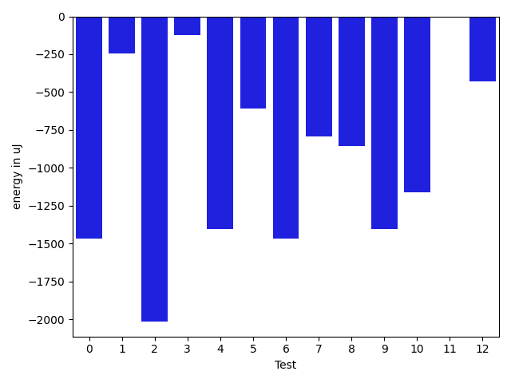

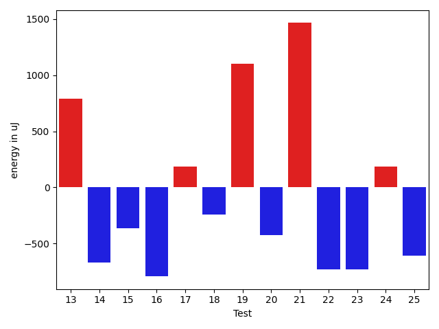

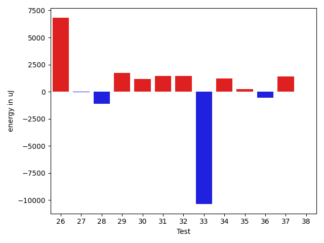

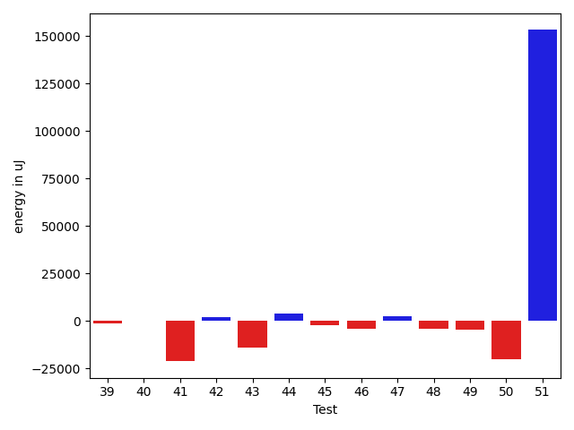

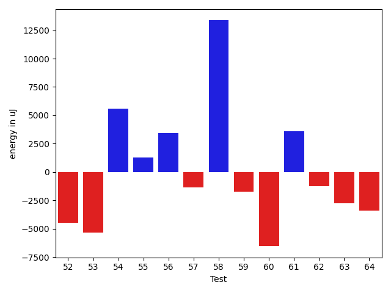

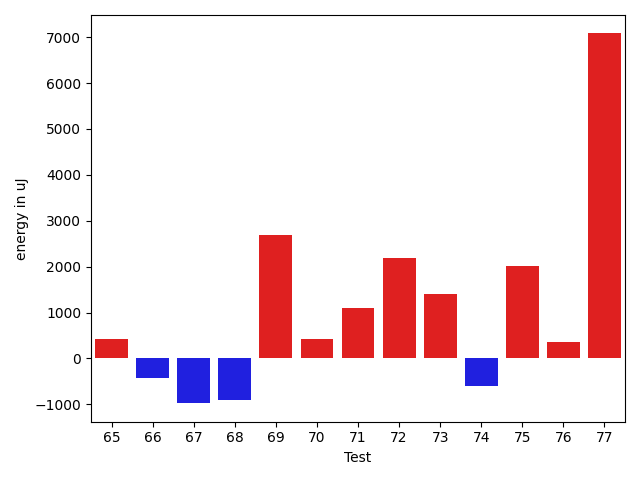

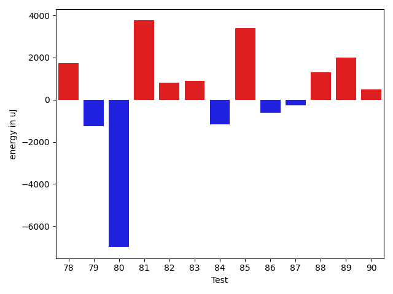

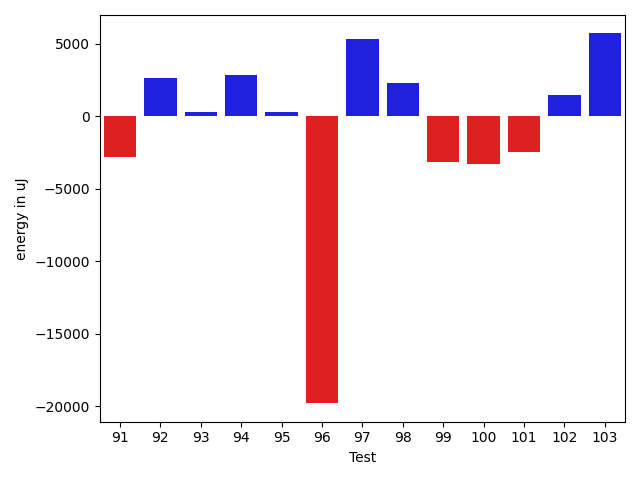

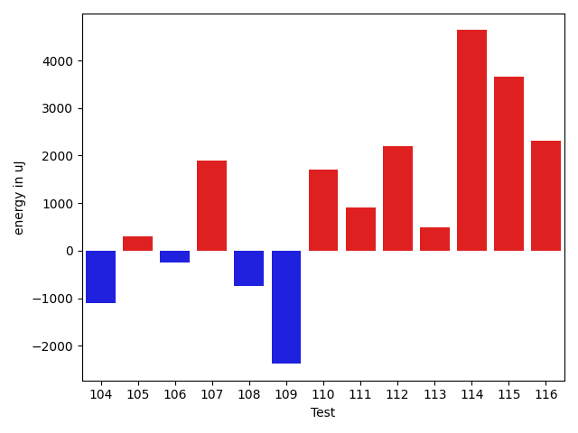

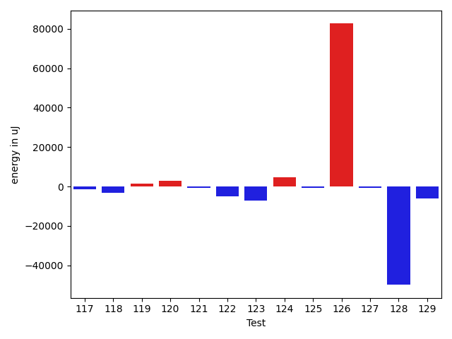

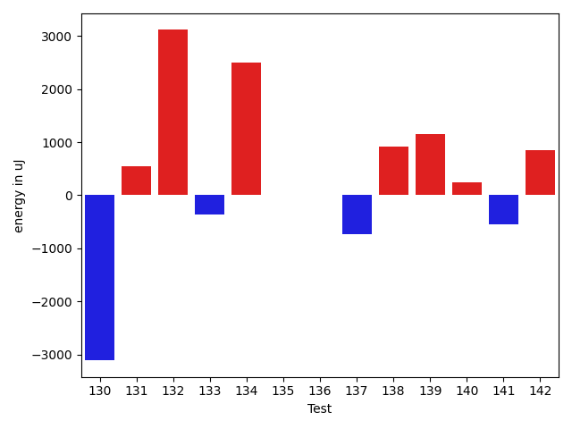

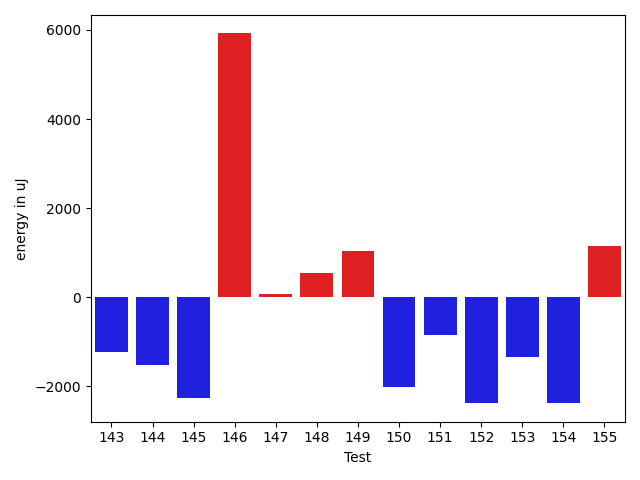

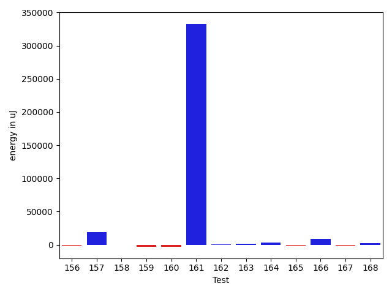

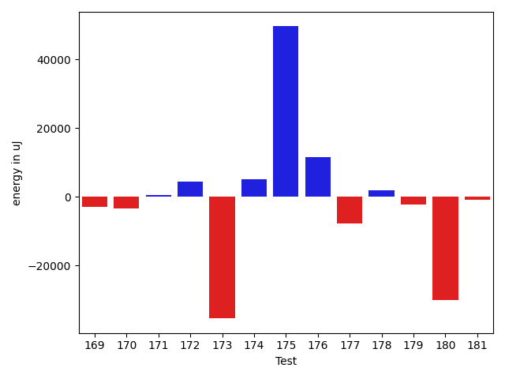

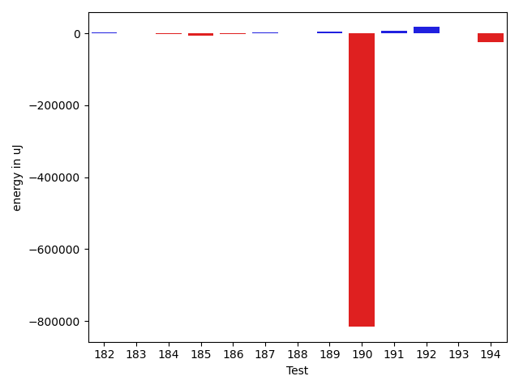

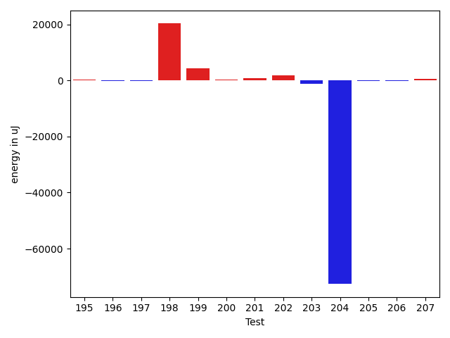

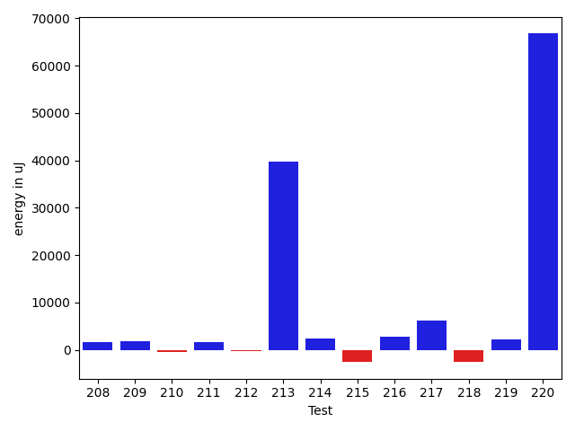

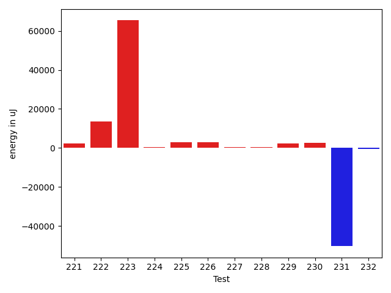

| ID | EnergyV1 | EnergyV2 | DeltaEnergy | σV1 | σV2 |
| --- | --- | --- | --- | --- | --- |
| 0 | 40482.611940298506 | 39036.21428571428 | -1446.3976545842233 | 10495.154741281309 | 5920.533291358275 |
| 1 | 39435.91379310345 | 44767.96153846154 | 5332.04774535809 | 3716.8583799636895 | 48031.06163161563 |
| 2 | 43032.01960784314 | 42152.51851851852 | -879.5010893246217 | 13932.591087496261 | 9187.426876989413 |
| 3 | 97856.85483870968 | 126933.25 | 29076.39516129032 | 259649.7407073271 | 314571.8052763635 |
| 4 | 39253.681818181816 | 38283.313725490196 | -970.3680926916204 | 3819.336138011941 | 3578.7922515853993 |
| 5 | 43051.703296703294 | 44824.393258426964 | 1772.6899617236704 | 11752.397263513501 | 12731.354269753749 |
| 6 | 45558.470588235294 | 44410.705882352944 | -1147.7647058823495 | 19056.395958202636 | 17896.771581241737 |
| 7 | 39110.770833333336 | 38419.441860465115 | -691.3289728682212 | 4316.099252795589 | 4118.783176044954 |
| 8 | 46272.42307692308 | 46246.12790697674 | -26.29516994633741 | 18481.113747462485 | 19430.088580030348 |
| 9 | 42655.565217391304 | 39561.46666666667 | -3094.098550724637 | 22017.1611541821 | 7584.389153166302 |
| 10 | 39647.66071428572 | 41117.24074074074 | 1469.5800264550198 | 5205.827696907112 | 9134.055989121935 |
| 11 | 40300.126582278484 | 40994.48809523809 | 694.3615129596074 | 9167.42413798713 | 7598.514561121308 |
| 12 | 41318.893939393936 | 43377.555555555555 | 2058.6616161616184 | 10668.409655598169 | 14456.807915444422 |
| 13 | 63208.48148148148 | 79356.77777777778 | 16148.2962962963 | 55574.17320047435 | 74593.82127864625 |
| 14 | 39044.95918367347 | 38206.05714285714 | -838.9020408163269 | 4049.06341883683 | 3901.2275866000155 |
| 15 | 47021.48 | 38646.318181818184 | -8375.16181818182 | 36832.1208274734 | 4653.78836283227 |
| 16 | 38795.375 | 37992.6 | -802.7750000000015 | 4466.676610491108 | 4265.585679598993 |
| 17 | 39550.666666666664 | 39336.2972972973 | -214.369369369364 | 5077.901531716814 | 3979.1655030676357 |
| 18 | 38588.09090909091 | 47918.41935483871 | 9330.3284457478 | 4251.233381556794 | 46708.51904391483 |
| 19 | 41894.10989010989 | 41402.79012345679 | -491.31976665309776 | 10635.50682461798 | 7167.1100667590035 |
| 20 | 39789.40909090909 | 51545.391304347824 | 11755.982213438736 | 4237.590242097194 | 54679.60029491893 |
| 21 | 40101.05084745763 | 40975.20338983051 | 874.1525423728817 | 6441.666466204326 | 4001.733331138874 |
| 22 | 51274.40540540541 | 43449.325 | -7825.08040540541 | 57219.93464361376 | 19822.196885546644 |
| 23 | 39351.07692307692 | 40096.75675675676 | 745.6798336798383 | 4645.194373039046 | 3529.799943840363 |
| 24 | 40113.67741935484 | 40809.117647058825 | 695.4402277039844 | 3448.4067137858992 | 3343.2493067875803 |
| 25 | 59500.28571428572 | 43452.392857142855 | -16047.892857142862 | 71604.84762662827 | 11784.028829428673 |
| 26 | 38567.333333333336 | 43226.22222222222 | 4658.888888888883 | 5143.675037255842 | 4615.636028828235 |
| 27 | 38593.07692307692 | 40344.1875 | 1751.110576923078 | 4519.277656057921 | 5537.587665431921 |
| 28 | 61469.61616161616 | 76443.56565656565 | 14973.949494949491 | 32108.890534047037 | 172150.67054248 |
| 29 | 39958.95238095238 | 39998.38888888889 | 39.43650793650886 | 6088.912718455614 | 5332.0707374120075 |
| 30 | 44664.57142857143 | 44788.743589743586 | 124.17216117215867 | 28815.598295056112 | 18428.491586111486 |
| 31 | 39344.66071428572 | 40150.833333333336 | 806.1726190476184 | 4673.685224885579 | 4870.893019309247 |
| 32 | 39805.28947368421 | 41548.35897435898 | 1743.0695006747628 | 7389.818085532121 | 10014.691285197168 |
| 33 | 116906.64130434782 | 128237.28735632185 | 11330.646051974021 | 304990.5249892335 | 304614.3100119672 |
| 34 | 55777.104166666664 | 53331.5 | -2445.6041666666642 | 39616.23611982402 | 34800.96240048542 |
| 35 | 40598.45238095238 | 41594.75555555556 | 996.3031746031775 | 3926.8108846649216 | 5117.13304348161 |
| 36 | 38769.96551724138 | 39492.5 | 722.5344827586232 | 4891.5394127408545 | 4155.812465691877 |
| 37 | 39809.64864864865 | 40775.756097560974 | 966.1074489123275 | 7146.836473521339 | 8946.588055954662 |
| 38 | 43967.760869565216 | 40874.28571428572 | -3093.4751552794987 | 14313.80209445898 | 7065.078042522868 |
| 39 | 48274.6 | 42281.26470588235 | -5993.335294117649 | 18968.913861485176 | 12539.702077586879 |
| 40 | 130626.62626262626 | 103433.28282828283 | -27193.343434343435 | 210963.84613667702 | 144473.54460365488 |
| 41 | 39555.885714285716 | 40049.166666666664 | 493.2809523809483 | 6697.535422063546 | 5003.371435564446 |
| 42 | 38624.68965517241 | 39949.958333333336 | 1325.2686781609227 | 3828.5991144997356 | 4058.876429908145 |
| 43 | 42844.16 | 40059.333333333336 | -2784.8266666666677 | 23679.11576166644 | 4608.040714036956 |
| 44 | 40649.230769230766 | 40359.4375 | -289.7932692307659 | 5223.874691538783 | 4440.781771951168 |
| 45 | 65610.13265306123 | 60092.919191919194 | -5517.213461142033 | 31020.77827568712 | 23572.78890674489 |
| 46 | 144491.73134328358 | 117712.26470588235 | -26779.46663740123 | 287131.0327952677 | 224267.79632385774 |
| 47 | 69266.47457627118 | 77677.55172413793 | 8411.077147866745 | 87173.69666660088 | 86849.51293019921 |
| 48 | 39181.666666666664 | 39287.444444444445 | 105.77777777778101 | 4590.611932096974 | 4179.8474536521635 |
| 49 | 48360.020202020205 | 45460.0 | -2900.020202020205 | 17350.192478762212 | 14723.768103706238 |
| 50 | 38537.04651162791 | 37020.36956521739 | -1516.6769464105164 | 4347.9290603821655 | 4374.500758390685 |
| 51 | 44207.058139534885 | 45410.717647058824 | 1203.6595075239384 | 14639.379670072318 | 16994.70054673568 |
| 52 | 40112.4406779661 | 36666.2037037037 | -3446.2369742623996 | 5461.307089684376 | 4143.1504982437455 |
| 53 | 38448.28571428572 | 38253.3023255814 | -194.98338870432053 | 4534.788805468684 | 3965.535838949711 |
| 54 | 38253.41176470588 | 38803.439024390245 | 550.0272596843643 | 4192.188577073311 | 5022.63822448789 |
| 55 | 175991.70707070708 | 170550.87878787878 | -5440.828282828297 | 37559.43480611225 | 32884.24378081108 |
| 56 | 38120.15625 | 37992.96 | -127.19625000000087 | 3938.8268249360667 | 4629.811481950426 |
| 57 | 660856.1616161616 | 722528.0202020202 | 61671.8585858586 | 569342.7133039263 | 574313.4775230738 |
| 58 | 38178.6875 | 38293.1875 | 114.5 | 3907.373393962209 | 4162.869386293996 |
| 59 | 37491.73333333333 | 36037.666666666664 | -1454.0666666666657 | 4598.701685862605 | 4234.118227762029 |
| 60 | 41888.17543859649 | 40265.94736842105 | -1622.2280701754353 | 8787.007186895584 | 7947.274475801196 |
| 61 | 38728.11627906977 | 37522.73863636364 | -1205.3776427061312 | 6544.3638069442595 | 5619.121494937698 |
| 62 | 38711.11111111111 | 37566.96428571428 | -1144.146825396827 | 5913.625841026324 | 4147.843178621724 |
| 63 | 37119.444444444445 | 37844.8 | 725.3555555555577 | 3509.7618346267413 | 3304.464746369675 |
| 64 | 39755.954545454544 | 39333.93103448276 | -422.02351097178325 | 3231.508942179865 | 3773.6533467517465 |
| 65 | 38241.181818181816 | 37760.333333333336 | -480.84848484848044 | 6043.145723848584 | 3928.6770037762076 |
| 66 | 38475.23809523809 | 36600.7037037037 | -1874.534391534391 | 4061.997032949632 | 3911.8893021414224 |
| 67 | 38877.10344827586 | 37600.65 | -1276.4534482758609 | 3737.36158405741 | 3148.6805216630028 |
| 68 | 39049.666666666664 | 39735.709677419356 | 686.0430107526918 | 4048.5064186959394 | 8699.973964342016 |
| 69 | 37891.09523809524 | 39866.75 | 1975.6547619047633 | 3985.584618702063 | 4016.5566687418072 |
| 70 | 40409.2 | 40810.416666666664 | 401.21666666666715 | 3162.0449648921817 | 4259.6608653154535 |
| 71 | 49092.96 | 49700.8 | 607.8400000000038 | 25122.59970461656 | 27904.732104788254 |
| 72 | 38920.362068965514 | 41409.37096774193 | 2489.0088987764175 | 3851.7884189138013 | 7317.542303422847 |
| 73 | 38965.13559322034 | 40295.96153846154 | 1330.8259452412021 | 3821.1524149429906 | 4689.085969492343 |
| 74 | 39428.76190476191 | 38396.34782608696 | -1032.4140786749485 | 7260.751521543509 | 5272.754544610688 |
| 75 | 38935.51282051282 | 40527.18 | 1591.66717948718 | 3768.011159217749 | 4013.603775611139 |
| 76 | 44285.88372093023 | 46102.29113924051 | 1816.4074183102784 | 13082.488339351574 | 15909.041978931033 |
| 77 | 44180.71428571428 | 59020.6 | 14839.885714285716 | 11887.052124226662 | 22174.993123786982 |
| 78 | 39387.88888888889 | 41135.88888888889 | 1748.0 | 4604.293447894149 | 4467.635018029225 |
| 79 | 39683.94736842105 | 38414.137931034486 | -1269.8094373865679 | 4107.203773777869 | 4740.080769893374 |
| 80 | 46820.846153846156 | 39829.434782608696 | -6991.41137123746 | 32033.7720931331 | 4935.991507163498 |
| 81 | 43103.294117647056 | 46860.44117647059 | 3757.1470588235316 | 11535.028222330684 | 15041.522349798273 |
| 82 | 38886.617647058825 | 39689.02222222222 | 802.4045751633967 | 4069.907391739478 | 4343.026873245018 |
| 83 | 38760.76470588235 | 39662.34285714286 | 901.5781512605099 | 3342.4616682110523 | 5501.3578944156125 |
| 84 | 240342.7142857143 | 239161.05263157896 | -1181.6616541353287 | 465610.2952222152 | 459988.30981135 |
| 85 | 47498.05970149254 | 50901.08620689655 | 3403.0265054040137 | 18134.006662572585 | 26972.287615563986 |
| 86 | 45428.14864864865 | 44810.23188405797 | -617.9167645906782 | 11619.126625179608 | 12672.363249332831 |
| 87 | 39594.21428571428 | 39330.0 | -264.2142857142826 | 3977.6417668651616 | 3943.606412721931 |
| 88 | 39391.333333333336 | 40694.42105263158 | 1303.0877192982443 | 5765.591412277957 | 4829.691297923813 |
| 89 | 49509.552083333336 | 51496.76530612245 | 1987.2132227891125 | 19149.861315789047 | 27443.608678190503 |
| 90 | 39175.17391304348 | 39668.188679245286 | 493.0147662018062 | 5167.285526162134 | 5454.203710473559 |
| 91 | 39382.28 | 43497.549019607846 | 4115.269019607847 | 5674.30406672043 | 8776.735194761752 |
| 92 | 39652.42857142857 | 39041.69642857143 | -610.7321428571449 | 3925.462519363764 | 6847.599315817714 |
| 93 | 66079.375 | 69635.83333333333 | 3556.4583333333285 | 43184.14708924195 | 43548.030080462755 |
| 94 | 40541.27868852459 | 42074.47368421053 | 1533.194995685939 | 7347.1187441312995 | 11047.659801578468 |
| 95 | 40332.44680851064 | 39430.1 | -902.3468085106433 | 5928.625759491556 | 5496.909389829889 |
| 96 | 37285.46153846154 | 38155.379310344826 | 869.9177718832871 | 4292.915803352606 | 3855.6791289964513 |
| 97 | 148345.87878787878 | 132446.53535353535 | -15899.343434343435 | 127302.47667941335 | 97961.59413711636 |
| 98 | 40105.12765957447 | 40605.36 | 500.2323404255294 | 4209.353508845086 | 6496.118015430447 |
| 99 | 43332.607142857145 | 39683.34482758621 | -3649.262315270935 | 26013.715502375286 | 3934.499120519637 |
| 100 | 38446.0 | 40407.121212121216 | 1961.1212121212156 | 4826.925425844765 | 4169.284988896893 |
| 101 | 91155.0125 | 67014.18292682926 | -24140.829573170733 | 233952.19478028486 | 170763.7893162999 |
| 102 | 38302.75 | 40566.13636363636 | 2263.3863636363603 | 4411.643479192307 | 4299.79278882826 |
| 103 | 47182.56862745098 | 41634.914893617024 | -5547.653733833955 | 17014.13526898069 | 6737.742408159751 |
| 104 | 352725.1875 | 198638.66666666666 | -154086.52083333334 | 465001.0420679478 | 350246.8523718505 |
| 105 | 38889.555555555555 | 40964.666666666664 | 2075.1111111111095 | 4141.8707625395855 | 7237.014263109093 |
| 106 | 52408.59259259259 | 51466.57142857143 | -942.0211640211637 | 23247.333430929964 | 23117.705195413335 |
| 107 | 39076.57692307692 | 39998.11111111111 | 921.5341880341875 | 3324.11767556534 | 3701.8130376117188 |
| 108 | 40042.26315789474 | 39386.84210526316 | -655.4210526315801 | 4417.414555121644 | 3883.032134043783 |
| 109 | 58622.57142857143 | 51235.28 | -7387.291428571429 | 22916.62004408368 | 17427.943271700195 |
| 110 | 42512.470588235294 | 42147.0 | -365.4705882352937 | 3958.5312207440697 | 3899.8920300636332 |
| 111 | 39597.35294117647 | 40653.333333333336 | 1055.9803921568673 | 3684.411469343853 | 2477.8241709657736 |
| 112 | 40948.90909090909 | 62866.055555555555 | 21917.146464646466 | 4063.897154535856 | 92953.67863288576 |
| 113 | 39611.666666666664 | 41709.181818181816 | 2097.515151515152 | 4247.282412188868 | 2868.857099587088 |
| 114 | 39023.78947368421 | 40719.0 | 1695.2105263157864 | 4506.410913809317 | 5323.957496878748 |
| 115 | 40425.53333333333 | 47093.42105263158 | 6667.887719298247 | 4804.812946295505 | 26108.496992188877 |
| 116 | 40240.92307692308 | 41288.13333333333 | 1047.2102564102534 | 3444.0350990246325 | 3338.67196884563 |
| 117 | 40567.933333333334 | 39331.916666666664 | -1236.01666666667 | 5423.517634237846 | 2842.764131918479 |
| 118 | 42214.58823529412 | 38997.13333333333 | -3217.4549019607875 | 5394.633455997495 | 3646.344797495462 |
| 119 | 38617.71428571428 | 40111.09090909091 | 1493.3766233766291 | 3399.1179408061444 | 3196.8073122625856 |
| 120 | 38019.916666666664 | 40746.933333333334 | 2727.01666666667 | 4341.817120713656 | 5099.552613928227 |
| 121 | 39416.23333333333 | 38556.59090909091 | -859.6424242424182 | 5292.131414867002 | 3744.5415950269603 |
| 122 | 59299.9081632653 | 54428.40404040404 | -4871.504122861261 | 49399.09430263006 | 20664.197561164878 |
| 123 | 83247.8085106383 | 76010.47540983607 | -7237.333100802221 | 87861.73491044875 | 91175.94696161788 |
| 124 | 40059.21212121212 | 44796.73170731707 | 4737.519586104951 | 8086.959404470264 | 21380.71844263286 |
| 125 | 40043.55 | 39356.104166666664 | -687.4458333333387 | 4523.601242096832 | 4598.536607079398 |
| 126 | 45931.80281690141 | 128531.97183098592 | 82600.1690140845 | 14592.648690080385 | 324218.1203477097 |
| 127 | 40112.51282051282 | 39595.27027027027 | -517.2425502425467 | 4693.949929658744 | 4010.920502615993 |
| 128 | 150926.33783783784 | 101079.3375 | -49847.000337837846 | 341751.0655206417 | 227394.55431858654 |
| 129 | 44465.18518518518 | 38461.275 | -6003.910185185181 | 19460.605304500637 | 3490.5019122434237 |
| 130 | 85075.30303030302 | 78746.34210526316 | -6328.960925039864 | 56910.48224344001 | 63566.59515246747 |
| 131 | 38632.983050847455 | 40007.5 | 1374.5169491525448 | 4577.216634414062 | 7033.071241549433 |
| 132 | 38749.18918918919 | 40311.65625 | 1562.4670608108136 | 4035.120225529559 | 4512.254401968703 |
| 133 | 44072.8 | 40512.54 | -3560.260000000002 | 20072.81045901735 | 6590.7323059277705 |
| 134 | 38765.68965517241 | 40168.708333333336 | 1403.0186781609227 | 4168.0748396835825 | 4013.6577818656333 |
| 135 | 38813.82352941176 | 38812.0 | -1.823529411762138 | 4066.3283118123118 | 3808.3282923551824 |
| 136 | 39800.086956521736 | 38820.791666666664 | -979.295289855072 | 4485.2151217183255 | 4106.558981060732 |
| 137 | 40136.84210526316 | 45763.708333333336 | 5626.866228070176 | 3072.9780474862505 | 32097.401028586886 |
| 138 | 41039.5 | 39873.705882352944 | -1165.7941176470558 | 13812.747434112138 | 4110.979799694327 |
| 139 | 38749.5 | 39604.529411764706 | 855.0294117647063 | 4245.062641862111 | 3852.048524794339 |
| 140 | 39500.42222222222 | 39135.260869565216 | -365.1613526570072 | 4293.163922583534 | 4481.696192072152 |
| 141 | 46503.59375 | 46487.645161290326 | -15.948588709674368 | 14316.861984196967 | 14240.05030168502 |
| 142 | 44117.360655737706 | 43839.82352941176 | -277.537126325944 | 11364.614446133743 | 8208.35031957446 |
| 143 | 40298.357142857145 | 38859.78723404255 | -1438.569908814592 | 4618.843749980583 | 4310.1958682658205 |
| 144 | 46941.13043478261 | 48956.88888888889 | 2015.7584541062824 | 11402.224967100854 | 15950.036429386782 |
| 145 | 40105.171428571426 | 38579.05405405405 | -1526.1173745173728 | 4669.370905842298 | 4179.942414875205 |
| 146 | 168636.0 | 222979.36363636365 | 54343.36363636365 | 213747.80982298093 | 339407.6837593069 |
| 147 | 43145.40789473684 | 40818.41428571429 | -2326.993609022553 | 26745.499594952827 | 7456.495495286272 |
| 148 | 40172.21212121212 | 38913.0 | -1259.21212121212 | 4062.345790136649 | 4551.219275815188 |
| 149 | 40869.63043478261 | 40360.18421052631 | -509.44622425629495 | 6550.303854082867 | 4639.904835998161 |
| 150 | 41982.620689655174 | 40847.73333333333 | -1134.887356321844 | 6035.423002709993 | 5748.901039522442 |
| 151 | 39803.27777777778 | 40216.94285714286 | 413.66507936507696 | 4096.134475949457 | 7056.204831586602 |
| 152 | 40390.44827586207 | 39675.97435897436 | -714.4739168877131 | 4587.723171955456 | 5067.970501033184 |
| 153 | 42675.93103448276 | 45967.65517241379 | 3291.724137931029 | 8319.541055524283 | 15114.623488246038 |
| 154 | 41301.769230769234 | 38891.4 | -2410.3692307692327 | 3480.279899306203 | 3534.3718121706816 |
| 155 | 40819.94871794872 | 40987.52 | 167.5712820512781 | 3661.5971080917047 | 4373.098755985279 |
| 156 | 138377.42424242425 | 170605.7676767677 | 32228.343434343435 | 177276.20024126655 | 243858.57388160922 |
| 157 | 39883.92307692308 | 45635.0625 | 5751.139423076922 | 3527.201450301063 | 18302.719348735962 |
| 158 | 51549.758241758245 | 50069.463917525776 | -1480.294324232469 | 41785.99014374556 | 18867.73432771061 |
| 159 | 40140.98181818182 | 43795.62903225807 | 3654.647214076249 | 6789.274175936119 | 23458.95973564284 |
| 160 | 39940.52 | 40906.955882352944 | 966.4358823529474 | 10047.887141563646 | 8931.335725203087 |
| 161 | 42191.079545454544 | 41865.732558139534 | -325.34698731500976 | 12194.509152056171 | 9719.59434198058 |
| 162 | 94333.53191489361 | 126045.15053763441 | 31711.618622740803 | 206409.50229496034 | 264226.2197449536 |
| 163 | 41223.207792207795 | 40032.0 | -1191.2077922077951 | 9347.721431280588 | 4853.1421522555875 |
| 164 | 43746.767857142855 | 40200.267857142855 | -3546.5 | 18895.270250015205 | 7371.333019327235 |
| 165 | 43591.028169014084 | 39792.119402985074 | -3798.9087660290097 | 30240.781115075562 | 6091.16366727769 |
| 166 | 39475.166666666664 | 40262.1 | 786.9333333333343 | 4580.710307001161 | 4896.34546852475 |
| 167 | 123992.22222222222 | 118437.54545454546 | -5554.676767676763 | 226861.01877873237 | 227741.6526216357 |
| 168 | 50169.763636363634 | 52582.32653061225 | 2412.5628942486146 | 22101.242752358467 | 25043.143125567596 |
| 169 | 40829.375 | 42622.275 | 1792.9000000000015 | 7288.767442741949 | 11346.657961680829 |
| 170 | 39672.882352941175 | 40149.75 | 476.86764705882524 | 5551.831154009436 | 3641.721510837972 |
| 171 | 159388.62857142856 | 128915.64516129032 | -30472.983410138244 | 387625.5404135053 | 332286.7874625237 |
| 172 | 40152.46428571428 | 39523.3 | -629.1642857142797 | 4374.621685538263 | 3800.6094524431214 |
| 173 | 38969.117647058825 | 37991.15 | -977.9676470588238 | 3787.616833878107 | 3448.6902916179642 |
| 174 | 40308.045454545456 | 37340.0 | -2968.045454545456 | 3812.5804727992627 | 4417.216101455364 |
| 175 | 41316.31884057971 | 40521.13333333333 | -795.1855072463804 | 9216.606130512866 | 8025.1080708541795 |
| 176 | 61462.09523809524 | 38571.583333333336 | -22890.5119047619 | 99461.79924157758 | 5098.47312859993 |
| 177 | 50328.126760563384 | 56604.05263157895 | 6275.925871015563 | 23068.091822603023 | 24176.422544855668 |
| 178 | 208091.81818181818 | 223993.44897959183 | 15901.630797773658 | 460555.2516964156 | 499007.74835974607 |
| 179 | 38344.42857142857 | 36516.708333333336 | -1827.7202380952367 | 5045.406364977463 | 4822.69397812024 |
| 180 | 44208.096153846156 | 46659.92857142857 | 2451.8324175824164 | 9508.75504521939 | 15948.47011530283 |
| 181 | 38367.90476190476 | 38610.25925925926 | 242.35449735449947 | 3801.7938861588054 | 4006.063049304998 |
| 182 | 39068.09375 | 39578.454545454544 | 510.36079545454413 | 4206.126457022059 | 4913.541305110276 |
| 183 | 38704.431818181816 | 39530.07547169811 | 825.6436535162939 | 4304.518500143601 | 4124.944060679852 |
| 184 | 40741.71428571428 | 39291.88 | -1449.8342857142852 | 4804.311126902757 | 3904.0882092493766 |
| 185 | 93817.02040816327 | 82679.59595959596 | -11137.424448567312 | 243859.87333741985 | 198314.85790988166 |
| 186 | 45997.376470588235 | 43920.7375 | -2076.638970588232 | 15413.927702664749 | 10136.073055853227 |
| 187 | 39370.875 | 49215.02 | 9844.144999999997 | 4813.022773322173 | 62977.289749397765 |
| 188 | 62227.02409638554 | 77560.53333333334 | 15333.5092369478 | 34351.47177393661 | 162532.3417146535 |
| 189 | 39051.7 | 40358.91891891892 | 1307.218918918923 | 3685.8277577770777 | 3916.7324176236107 |
| 190 | 39948.205128205125 | 41055.3023255814 | 1107.0971973762717 | 4331.427639222415 | 3263.7203948218344 |
| 191 | 39716.88888888889 | 40934.09523809524 | 1217.2063492063462 | 3773.889216840851 | 6804.5938012825945 |
| 192 | 40576.75675675676 | 41257.75 | 680.9932432432397 | 4017.260290064614 | 3467.1396532300223 |
| 193 | 48405.875 | 46213.4 | -2192.4749999999985 | 26326.52371022294 | 19105.849665482037 |
| 194 | 68751.31313131313 | 77963.9494949495 | 9212.636363636368 | 31427.74077234098 | 39073.040051112395 |
| 195 | 37930.36 | 38200.2875 | 269.92749999999796 | 4482.62157117908 | 5035.958595922305 |
| 196 | 38019.536231884056 | 37719.71428571428 | -299.8219461697736 | 4404.103868707959 | 3719.1499132325257 |
| 197 | 51636.48051948052 | 51388.51219512195 | -247.96832435857505 | 27770.99707819568 | 24590.884537718695 |
| 198 | 110872.46031746031 | 131132.703125 | 20260.24280753969 | 209460.55163991151 | 249388.99815597307 |
| 199 | 40659.857142857145 | 45076.7027027027 | 4416.845559845555 | 4153.053541967522 | 35670.058091667954 |
| 200 | 39258.02564102564 | 39540.63888888889 | 282.61324786324985 | 3947.2573307601792 | 4831.889089699216 |
| 201 | 38396.65625 | 39223.0 | 826.34375 | 4659.164622073998 | 4097.335834267861 |
| 202 | 39697.52380952381 | 41604.48148148148 | 1906.9576719576726 | 4359.760217511395 | 9344.173113528184 |
| 203 | 42498.6 | 41375.31578947369 | -1123.2842105263117 | 4230.320961818382 | 9050.191815662087 |
| 204 | 123066.14102564103 | 50470.4025974026 | -72595.73842823843 | 338369.4642730091 | 27130.56734810615 |
| 205 | 39810.6129032258 | 39614.76190476191 | -195.85099846389494 | 4883.481007783474 | 4239.397238206236 |
| 206 | 39454.71428571428 | 39160.0 | -294.7142857142826 | 3341.5364892282023 | 3531.4242594171546 |
| 207 | 38606.294117647056 | 39119.5625 | 513.2683823529442 | 4348.957383702388 | 3940.495130195411 |
| 208 | 45754.85 | 39884.80952380953 | -5870.040476190472 | 27340.254103199186 | 4384.63633306602 |
| 209 | 40835.22727272727 | 38560.22727272727 | -2275.0 | 11866.348526713602 | 3744.0427825330758 |
| 210 | 41149.0 | 41227.666666666664 | 78.66666666666424 | 3719.6373143090173 | 3976.6626751267236 |
| 211 | 46351.65573770492 | 47285.833333333336 | 934.1775956284182 | 15514.77545986432 | 19255.24621167494 |
| 212 | 62575.06060606061 | 61478.27272727273 | -1096.78787878788 | 31383.369345420426 | 29852.768419350272 |
| 213 | 40645.311111111114 | 41300.8 | 655.488888888889 | 3685.531047652411 | 3739.5720630234487 |
| 214 | 39419.857142857145 | 40425.444444444445 | 1005.5873015873003 | 4293.7206119957955 | 4139.412253263637 |
| 215 | 42063.96428571428 | 41105.76 | -958.2042857142806 | 8128.317926862424 | 4009.219398137249 |
| 216 | 89467.8125 | 39877.93939393939 | -49589.87310606061 | 264961.7102860616 | 4115.915310694785 |
| 217 | 38844.192307692305 | 39693.846153846156 | 849.6538461538512 | 4522.203547448546 | 4164.964268867951 |
| 218 | 39209.58823529412 | 40035.68421052631 | 826.0959752321942 | 3764.334361263755 | 3849.524209187301 |
| 219 | 39274.42105263158 | 40615.38888888889 | 1340.9678362573104 | 3945.9746486739923 | 4037.550882223431 |
| 220 | 180137.52380952382 | 269415.22222222225 | 89277.69841269843 | 434834.90292180015 | 510366.89877953444 |
| 221 | 52614.62626262626 | 54892.0404040404 | 2277.4141414141413 | 20541.711568251794 | 23492.78357709848 |
| 222 | 238211.61616161617 | 251911.12121212122 | 13699.505050505046 | 50563.530508150114 | 135785.38940007778 |
| 223 | 38805.88 | 104176.58333333333 | 65370.70333333333 | 3592.512016068979 | 304953.2010578176 |
| 224 | 39791.9 | 40114.68965517241 | 322.7896551724116 | 4458.180547039341 | 3827.1071825132763 |
| 225 | 44098.132530120485 | 47058.76315789474 | 2960.630627774255 | 16276.259393666156 | 21079.70898185492 |
| 226 | 42979.781818181815 | 45962.82352941176 | 2983.0417112299474 | 10916.555042171514 | 15597.385656634875 |
| 227 | 39650.76 | 40111.36363636364 | 460.60363636363763 | 3582.558050108889 | 4282.30677582936 |
| 228 | 42085.09523809524 | 42622.125 | 537.0297619047633 | 7514.284710151421 | 11029.54805456445 |
| 229 | 39905.19047619047 | 42059.57894736842 | 2154.3884711779465 | 4516.042753805041 | 3303.6688587050976 |
| 230 | 38218.208333333336 | 40747.846153846156 | 2529.6378205128203 | 4244.983146601475 | 5043.264492921438 |
| 231 | 116520.49056603774 | 66118.44067796611 | -50402.04988807163 | 298152.9544757644 | 163339.72172405143 |
| 232 | 40623.75 | 40025.857142857145 | -597.8928571428551 | 5176.354655627195 | 4902.456015059373 |

## Delta Duration per test method

| ID | DurationV1 | DurationsV2 | DeltaDuration |
| --- | --- | --- | --- |
| 0 | 977710.9552238806 | 896159.5857142857 | -81551.36950959486 |
| 1 | 745923.9655172414 | 954193.8846153846 | 208269.91909814323 |
| 2 | 965364.1176470588 | 968983.8888888889 | 3619.77124183008 |
| 3 | 2724485.4032258065 | 3690619.535714286 | 966134.1324884794 |
| 4 | 766605.1818181818 | 770662.1372549019 | 4056.9554367201636 |
| 5 | 1271136.7252747254 | 1284467.2696629213 | 13330.544388195965 |
| 6 | 898099.431372549 | 902943.9607843137 | 4844.529411764699 |
| 7 | 661844.9375 | 702845.4651162791 | 41000.52761627908 |
| 8 | 1254133.8076923077 | 1291846.6627906978 | 37712.85509839002 |
| 9 | 745919.2391304348 | 789466.3333333334 | 43547.09420289856 |
| 10 | 810959.9642857143 | 857910.9444444445 | 46950.98015873018 |
| 11 | 1171883.3670886075 | 1087955.7261904762 | -83927.6408981313 |
| 12 | 1052514.606060606 | 1274039.126984127 | 221524.52092352114 |
| 13 | 1579451.6851851852 | 2139806.9814814813 | 560355.2962962962 |
| 14 | 637740.4081632653 | 682595.2857142857 | 44854.877551020356 |
| 15 | 658269.72 | 417889.95454545453 | -240379.76545454544 |
| 16 | 724415.1666666666 | 707844.375 | -16570.791666666628 |
| 17 | 869358.8974358974 | 654333.8918918918 | -215025.00554400554 |
| 18 | 711874.4090909091 | 751927.6451612903 | 40053.236070381245 |
| 19 | 1190633.3736263737 | 1167331.6172839506 | -23301.75634242315 |
| 20 | 468687.6818181818 | 895670.2608695652 | 426982.57905138336 |
| 21 | 930986.3389830509 | 873086.9830508474 | -57899.35593220347 |
| 22 | 1180085.6216216215 | 812087.2 | -367998.4216216216 |
| 23 | 601511.3461538461 | 564181.8108108108 | -37329.53534303536 |
| 24 | 551193.4838709678 | 557493.3235294118 | 6299.839658444049 |
| 25 | 1444390.0 | 768358.5714285715 | -676031.4285714285 |
| 26 | 330411.77777777775 | 327690.1111111111 | -2721.666666666628 |
| 27 | 449531.6923076923 | 404442.125 | -45089.56730769231 |
| 28 | 1734593.6464646466 | 2238487.3636363638 | 503893.7171717172 |
| 29 | 716754.4047619047 | 742956.8888888889 | 26202.48412698414 |
| 30 | 857770.7619047619 | 900865.2564102564 | 43094.494505494484 |
| 31 | 888879.8571428572 | 857401.0 | -31478.85714285716 |
| 32 | 1040687.1842105263 | 1058258.8974358975 | 17571.713225371204 |
| 33 | 3140196.565217391 | 3572712.9195402297 | 432516.3543228386 |
| 34 | 1359409.8958333333 | 1232281.2142857143 | -127128.68154761894 |
| 35 | 916193.380952381 | 753186.3111111111 | -163007.06984126987 |
| 36 | 559137.448275862 | 459345.1818181818 | -99792.2664576802 |
| 37 | 807388.2702702703 | 644617.1707317074 | -162771.09953856294 |
| 38 | 804011.7826086957 | 687624.0285714286 | -116387.75403726706 |
| 39 | 1046396.2888888889 | 680629.4117647059 | -365766.877124183 |
| 40 | 3635850.1616161615 | 2859867.98989899 | -775982.1717171716 |
| 41 | 835345.1714285715 | 479490.8333333333 | -355854.33809523814 |
| 42 | 528813.2068965518 | 490575.7916666667 | -38237.41522988508 |
| 43 | 611931.28 | 337397.0 | -274534.28 |
| 44 | 342683.1538461539 | 369097.3125 | 26414.158653846127 |
| 45 | 1934345.581632653 | 1812458.202020202 | -121887.37961245095 |
| 46 | 4132594.074626866 | 3261797.0147058824 | -870797.0599209834 |
| 47 | 1708804.6779661018 | 2194014.396551724 | 485209.71858562226 |
| 48 | 744924.3111111111 | 780240.3777777777 | 35316.06666666665 |
| 49 | 1386251.2525252525 | 1417577.7676767677 | 31326.515151515137 |
| 50 | 688416.3720930233 | 671853.2391304348 | -16563.132962588454 |
| 51 | 1200380.3953488371 | 1243749.0470588235 | 43368.651709986385 |
| 52 | 843165.186440678 | 825587.3148148148 | -17577.871625863132 |
| 53 | 666230.1224489796 | 716339.1627906977 | 50109.040341718006 |
| 54 | 685880.5882352941 | 698222.3170731707 | 12341.72883787658 |
| 55 | 4796139.3838383835 | 4811707.94949495 | 15568.565656566061 |
| 56 | 472175.46875 | 438910.56 | -33264.90875 |
| 57 | 17894175.808080807 | 19811872.808080807 | 1917697.0 |
| 58 | 722964.6458333334 | 723945.375 | 980.7291666666279 |
| 59 | 609254.6333333333 | 545477.2222222222 | -63777.411111111054 |
| 60 | 959878.3333333334 | 920877.2807017544 | -39001.05263157899 |
| 61 | 1119455.3023255814 | 1101170.0227272727 | -18285.279598308727 |
| 62 | 689063.8444444444 | 644651.9285714285 | -44411.91587301588 |
| 63 | 419282.55555555556 | 738096.6 | 318814.0444444444 |
| 64 | 470206.45454545453 | 461875.5172413793 | -8330.937304075225 |
| 65 | 534307.3181818182 | 476689.3888888889 | -57617.92929292936 |
| 66 | 454423.1904761905 | 484698.9259259259 | 30275.735449735424 |
| 67 | 500552.724137931 | 446404.4 | -54148.32413793099 |
| 68 | 397222.375 | 622241.8709677419 | 225019.49596774194 |
| 69 | 435813.4285714286 | 423038.35714285716 | -12775.07142857142 |
| 70 | 493063.1666666667 | 523491.6666666667 | 30428.5 |
| 71 | 970410.24 | 1026320.16 | 55909.92000000004 |
| 72 | 803394.4827586206 | 827056.1290322581 | 23661.646273637423 |
| 73 | 754771.033898305 | 707698.0 | -47073.03389830503 |
| 74 | 680111.1428571428 | 481050.347826087 | -199060.79503105587 |
| 75 | 620166.3846153846 | 639053.48 | 18887.095384615357 |
| 76 | 1126765.4186046512 | 1196936.3924050634 | 70170.97380041215 |
| 77 | 657157.9285714285 | 1323802.5 | 666644.5714285715 |
| 78 | 564096.25 | 593793.6944444445 | 29697.444444444496 |
| 79 | 649169.8947368421 | 712671.8275862068 | 63501.932849364704 |
| 80 | 713563.2307692308 | 1076442.0 | 362878.76923076925 |
| 81 | 777070.3823529412 | 927780.1470588235 | 150709.7647058823 |
| 82 | 643757.0294117647 | 674974.8 | 31217.770588235348 |
| 83 | 577271.5 | 548006.1428571428 | -29265.35714285716 |
| 84 | 6293793.5 | 6693462.157894737 | 399668.6578947371 |
| 85 | 1159884.8507462686 | 1361256.396551724 | 201371.54580545542 |
| 86 | 1204028.7432432433 | 1128433.8260869565 | -75594.91715628677 |
| 87 | 441813.21428571426 | 471530.53846153844 | 29717.32417582418 |
| 88 | 563068.0555555555 | 539332.6315789474 | -23735.423976608086 |
| 89 | 1517289.1666666667 | 1507103.306122449 | -10185.86054421775 |
| 90 | 775566.3478260869 | 821650.6603773584 | 46084.31255127152 |
| 91 | 830687.44 | 965212.6470588235 | 134525.20705882355 |
| 92 | 827934.6666666666 | 895139.0357142857 | 67204.36904761905 |
| 93 | 1937834.4431818181 | 2078758.0104166667 | 140923.56723484863 |
| 94 | 890412.606557377 | 1058713.0175438595 | 168300.41098648251 |
| 95 | 721920.1276595745 | 851416.75 | 129496.6223404255 |
| 96 | 563160.9230769231 | 565850.6551724138 | 2689.7320954906754 |
| 97 | 4134401.707070707 | 3682179.3636363638 | -452222.3434343431 |
| 98 | 863047.6170212766 | 825990.86 | -37056.75702127663 |
| 99 | 851264.0357142857 | 615520.0 | -235744.03571428568 |
| 100 | 693078.9333333333 | 643353.0 | -49725.93333333335 |
| 101 | 2624627.9125 | 1848880.9268292682 | -775746.9856707319 |
| 102 | 501395.8 | 702825.2272727273 | 201429.4272727273 |
| 103 | 977807.4509803922 | 853060.1063829787 | -124747.34459741344 |
| 104 | 9850412.5625 | 5364809.416666667 | -4485603.145833333 |
| 105 | 660341.4722222222 | 804682.0555555555 | 144340.58333333326 |
| 106 | 1032181.1851851852 | 1115564.1142857142 | 83382.92910052906 |
| 107 | 470656.5 | 509557.3888888889 | 38900.888888888876 |
| 108 | 414417.3157894737 | 410481.94736842107 | -3935.3684210526408 |
| 109 | 1661070.7142857143 | 1194934.48 | -466136.23428571434 |
| 110 | 354434.4117647059 | 323363.53846153844 | -31070.873303167464 |
| 111 | 696756.4117647059 | 357023.73333333334 | -339732.67843137257 |
| 112 | 427123.63636363635 | 975039.5555555555 | 547915.9191919192 |
| 113 | 409354.8888888889 | 392479.0 | -16875.888888888876 |
| 114 | 459903.05263157893 | 404902.6666666667 | -55000.385964912246 |
| 115 | 381313.8 | 600557.052631579 | 219243.252631579 |
| 116 | 352679.76923076925 | 385970.93333333335 | 33291.1641025641 |
| 117 | 448879.5333333333 | 445209.25 | -3670.2833333333256 |
| 118 | 331043.82352941175 | 430580.06666666665 | 99536.2431372549 |
| 119 | 365501.85714285716 | 404035.1818181818 | 38533.324675324664 |
| 120 | 426382.9166666667 | 415142.2 | -11240.716666666674 |
| 121 | 863081.4666666667 | 897739.4545454546 | 34657.98787878791 |
| 122 | 1732974.530612245 | 1615045.4646464647 | -117929.06596578029 |
| 123 | 2197579.85106383 | 1938422.8688524591 | -259156.98221137072 |
| 124 | 889133.8181818182 | 914657.0975609756 | 25523.27937915735 |
| 125 | 683994.4 | 746407.2083333334 | 62412.80833333335 |
| 126 | 1140818.647887324 | 3672699.8450704226 | 2531881.1971830986 |
| 127 | 890907.1282051282 | 830934.8378378379 | -59972.29036729038 |
| 128 | 4279383.324324325 | 2817138.55 | -1462244.774324325 |
| 129 | 735145.6666666666 | 541625.625 | -193520.04166666663 |
| 130 | 2267070.393939394 | 1789912.7368421052 | -477157.6570972889 |
| 131 | 835278.966101695 | 810004.0806451613 | -25274.885456533637 |
| 132 | 550930.9189189189 | 549388.125 | -1542.7939189189347 |
| 133 | 1020982.3272727273 | 1021584.64 | 602.3127272727434 |
| 134 | 532883.5172413794 | 463516.3333333333 | -69367.18390804605 |
| 135 | 920675.0147058824 | 962287.8970588235 | 41612.88235294109 |
| 136 | 483573.1304347826 | 512762.6666666667 | 29189.536231884093 |
| 137 | 526131.6578947369 | 725728.8333333334 | 199597.17543859652 |
| 138 | 660729.7142857143 | 533430.5588235294 | -127299.15546218492 |
| 139 | 610255.2083333334 | 545124.3823529412 | -65130.82598039217 |
| 140 | 696906.4888888889 | 705072.8478260869 | 8166.358937198063 |
| 141 | 1324996.2708333333 | 1285175.7741935484 | -39820.49663978489 |
| 142 | 1053237.3442622952 | 1134176.7450980393 | 80939.4008357441 |
| 143 | 818494.4107142857 | 763512.3829787234 | -54982.0277355623 |
| 144 | 877008.5217391305 | 951394.1666666666 | 74385.64492753614 |
| 145 | 672154.4857142858 | 729055.6486486486 | 56901.16293436289 |
| 146 | 4453640.373737373 | 6027768.646464647 | 1574128.2727272734 |
| 147 | 1039134.3289473684 | 1090563.2857142857 | 51428.956766917254 |
| 148 | 511051.45454545453 | 578795.8620689656 | 67744.40752351104 |
| 149 | 857799.0217391305 | 713290.2105263158 | -144508.81121281465 |
| 150 | 922414.7586206896 | 911775.3833333333 | -10639.37528735632 |
| 151 | 871700.5 | 799935.2857142857 | -71765.21428571432 |
| 152 | 610960.7586206896 | 677827.1538461539 | 66866.39522546425 |
| 153 | 610791.448275862 | 896559.1034482758 | 285767.6551724138 |
| 154 | 344193.07692307694 | 405798.3333333333 | 61605.25641025638 |
| 155 | 829585.5384615385 | 751979.74 | -77605.7984615385 |
| 156 | 3790647.131313131 | 4544332.090909091 | 753684.9595959596 |
| 157 | 741300.4615384615 | 778269.9375 | 36969.4759615385 |
| 158 | 1469281.3076923077 | 1434548.5670103093 | -34732.74068199843 |
| 159 | 897350.5272727272 | 995601.4516129033 | 98250.92434017605 |
| 160 | 960096.3066666666 | 980305.2941176471 | 20208.987450980465 |
| 161 | 1211874.2386363635 | 1231055.6744186047 | 19181.43578224117 |
| 162 | 2727645.744680851 | 3556563.11827957 | 828917.3735987186 |
| 163 | 1069971.1948051949 | 1033458.225 | -36512.96980519488 |
| 164 | 1050180.0 | 869652.5 | -180527.5 |
| 165 | 1045116.338028169 | 1004918.6567164179 | -40197.681311751134 |
| 166 | 957851.5833333334 | 937059.9142857143 | -20791.6690476191 |
| 167 | 3509326.9191919193 | 3507493.98989899 | -1832.9292929293588 |
| 168 | 1255232.7454545454 | 1352563.8163265307 | 97331.07087198528 |
| 169 | 1147211.8625 | 1134835.1375 | -12376.725000000093 |
| 170 | 570263.9411764706 | 477950.125 | -92313.8161764706 |
| 171 | 4195120.0 | 3537733.870967742 | -657386.129032258 |
| 172 | 542894.75 | 448278.7 | -94616.04999999999 |
| 173 | 485124.9411764706 | 469529.05 | -15595.891176470614 |
| 174 | 500831.95454545453 | 506511.0869565217 | 5679.132411067199 |
| 175 | 1051405.6811594204 | 983791.8166666667 | -67613.86449275375 |
| 176 | 993427.619047619 | 439177.9166666667 | -554249.7023809524 |
| 177 | 1276285.1126760563 | 1489629.2280701755 | 213344.11539411917 |
| 178 | 5729194.454545454 | 6506239.510204081 | 777045.0556586273 |
| 179 | 610630.2857142857 | 697475.4166666666 | 86845.13095238095 |
| 180 | 917587.7884615385 | 951410.1666666666 | 33822.37820512813 |
| 181 | 516164.2380952381 | 486105.2962962963 | -30058.941798941814 |
| 182 | 862397.03125 | 527022.7272727273 | -335374.3039772727 |
| 183 | 821638.6590909091 | 777587.7358490566 | -44050.92324185243 |
| 184 | 506566.9142857143 | 796502.76 | 289935.84571428574 |
| 185 | 3018187.448979592 | 2344699.414141414 | -673488.0348381777 |
| 186 | 1236649.2705882352 | 1179535.8875 | -57113.38308823528 |
| 187 | 761844.375 | 975375.6 | 213531.22499999998 |
| 188 | 1687884.1686746988 | 2203046.3333333335 | 515162.1646586347 |
| 189 | 631661.4 | 639731.7027027027 | 8070.302702702698 |
| 190 | 641920.1538461539 | 660680.1627906977 | 18760.008944543777 |
| 191 | 649882.3333333334 | 770522.4047619047 | 120640.07142857136 |
| 192 | 606726.9459459459 | 638141.4375 | 31414.491554054082 |
| 193 | 1416395.9305555555 | 1310255.675 | -106140.25555555546 |
| 194 | 2101970.909090909 | 2339525.4242424243 | 237554.51515151514 |
| 195 | 989234.24 | 1010435.3625 | 21201.122500000056 |
| 196 | 864318.2753623188 | 959455.4603174604 | 95137.1849551415 |
| 197 | 1428719.1818181819 | 1425799.2073170731 | -2919.9745011087507 |
| 198 | 2972454.0317460317 | 3564258.421875 | 591804.3901289683 |
| 199 | 837444.8571428572 | 807940.4324324324 | -29504.424710424733 |
| 200 | 598878.0512820513 | 660941.3333333334 | 62063.28205128212 |
| 201 | 575831.71875 | 644455.8163265307 | 68624.09757653065 |
| 202 | 708138.0238095238 | 860979.9814814815 | 152841.95767195767 |
| 203 | 393484.2 | 461993.15789473685 | 68508.95789473684 |
| 204 | 3478865.7435897435 | 1345000.5064935065 | -2133865.237096237 |
| 205 | 797162.9032258064 | 645522.6666666666 | -151640.2365591398 |
| 206 | 557424.0476190476 | 819111.8 | 261687.75238095247 |
| 207 | 405273.5882352941 | 469221.8125 | 63948.2242647059 |
| 208 | 642660.25 | 428964.04761904763 | -213696.20238095237 |
| 209 | 543035.9545454546 | 588233.6363636364 | 45197.681818181765 |
| 210 | 431452.875 | 473371.38095238095 | 41918.50595238095 |
| 211 | 1373121.1311475409 | 1240170.9833333334 | -132950.14781420748 |
| 212 | 1880588.0303030303 | 1756100.8484848484 | -124487.18181818188 |
| 213 | 764331.4 | 755261.509090909 | -9069.890909090987 |
| 214 | 487443.4761904762 | 620908.1851851852 | 133464.70899470896 |
| 215 | 705755.0357142857 | 502717.36 | -203037.6757142857 |
| 216 | 2096941.5 | 672830.8181818182 | -1424110.6818181816 |
| 217 | 543171.5 | 532755.4615384615 | -10416.038461538497 |
| 218 | 769385.4117647059 | 422684.84210526315 | -346700.56965944276 |
| 219 | 465839.4736842105 | 379443.27777777775 | -86396.19590643275 |
| 220 | 5038751.571428572 | 7844330.611111111 | 2805579.039682539 |
| 221 | 1544923.9191919193 | 1582377.6565656567 | 37453.737373737385 |
| 222 | 6038203.747474748 | 6521244.95959596 | 483041.2121212119 |
| 223 | 590239.12 | 2366215.25 | 1775976.13 |
| 224 | 399031.2 | 562453.4137931034 | 163422.2137931034 |
| 225 | 1320930.3614457832 | 1410497.355263158 | 89566.99381737481 |
| 226 | 914291.0545454546 | 1046616.2156862745 | 132325.1611408199 |
| 227 | 420285.0 | 509279.9090909091 | 88994.90909090912 |
| 228 | 932882.8333333334 | 1048805.8035714286 | 115922.97023809527 |
| 229 | 487685.28571428574 | 492098.2631578947 | 4412.977443608979 |
| 230 | 1038161.0833333334 | 556343.5384615385 | -481817.5448717949 |
| 231 | 3244112.6415094337 | 1669249.220338983 | -1574863.4211704507 |
| 232 | 547512.6666666666 | 865291.1428571428 | 317778.4761904762 |

## Misc.

| ID | Test Class | Test Method |
| --- | --- | --- |
| 0 | com.google.gson.functional.CustomTypeAdaptersTest | testCustomAdapterInvokedForCollectionElementDeserialization |
| 1 | com.google.gson.functional.CustomTypeAdaptersTest | testCustomAdapterInvokedForMapElementDeserialization |
| 2 | com.google.gson.functional.CustomTypeAdaptersTest | testCustomNestedSerializers |
| 3 | com.google.gson.functional.CustomTypeAdaptersTest | testCustomSerializers |
| 4 | com.google.gson.functional.CustomTypeAdaptersTest | testCustomNestedDeserializers |
| 5 | com.google.gson.functional.CustomTypeAdaptersTest | testCustomAdapterInvokedForCollectionElementSerializationWithType |
| 6 | com.google.gson.functional.CustomTypeAdaptersTest | testCustomDeserializers |
| 7 | com.google.gson.functional.CustomTypeAdaptersTest | testCustomByteArrayDeserializerAndInstanceCreator |
| 8 | com.google.gson.functional.CustomTypeAdaptersTest | testEnsureCustomSerializerNotInvokedForNullValues |
| 9 | com.google.gson.functional.CustomTypeAdaptersTest | testCustomTypeAdapterAppliesToSubClassesSerializedAsBaseClass |
| 10 | com.google.gson.functional.CustomTypeAdaptersTest | testCustomAdapterInvokedForMapElementSerializationWithType |
| 11 | com.google.gson.functional.CustomTypeAdaptersTest | testCustomTypeAdapterDoesNotAppliesToSubClasses |
| 12 | com.google.gson.functional.CustomTypeAdaptersTest | testRegisterHierarchyAdapterForDate |
| 13 | com.google.gson.functional.CustomTypeAdaptersTest | testEnsureCustomDeserializerNotInvokedForNullValues |
| 14 | com.google.gson.functional.CustomTypeAdaptersTest | testCustomDeserializerInvokedForPrimitives |
| 15 | com.google.gson.functional.CustomTypeAdaptersTest | testCustomAdapterInvokedForMapElementSerialization |
| 16 | com.google.gson.functional.CustomTypeAdaptersTest | testCustomByteArraySerializer |
| 17 | com.google.gson.functional.CustomTypeAdaptersTest | testCustomSerializerInvokedForPrimitives |
| 18 | com.google.gson.functional.CustomTypeAdaptersTest | testCustomAdapterInvokedForCollectionElementSerialization |
| 19 | com.google.gson.functional.StreamingTypeAdaptersTest | testNullSafe |
| 20 | com.google.gson.functional.StreamingTypeAdaptersTest | testSerializeMap |
| 21 | com.google.gson.functional.StreamingTypeAdaptersTest | testSerializeWithCustomTypeAdapter |
| 22 | com.google.gson.functional.StreamingTypeAdaptersTest | testSerialize1dArray |
| 23 | com.google.gson.functional.StreamingTypeAdaptersTest | testDeserializeWithCustomTypeAdapter |
| 24 | com.google.gson.functional.StreamingTypeAdaptersTest | testSerialize2dArray |
| 25 | com.google.gson.functional.StreamingTypeAdaptersTest | testSerialize |
| 26 | com.google.gson.functional.StreamingTypeAdaptersTest | testSerializeNullObject |
| 27 | com.google.gson.functional.StreamingTypeAdaptersTest | testSerializeNullField |
| 28 | com.google.gson.functional.JsonAdapterAnnotationOnClassesTest | testJsonAdapterInvoked |
| 29 | com.google.gson.functional.JsonAdapterAnnotationOnClassesTest | testRegisteredAdapterOverridesJsonAdapter |
| 30 | com.google.gson.functional.JsonAdapterAnnotationOnClassesTest | testRegisteredSerializerOverridesJsonAdapter |
| 31 | com.google.gson.functional.JsonAdapterAnnotationOnClassesTest | testNullSafeObjectFromJson |
| 32 | com.google.gson.functional.JsonAdapterAnnotationOnClassesTest | testJsonAdapterFactoryInvoked |
| 33 | com.google.gson.functional.JsonAdapterAnnotationOnClassesTest | testRegisteredDeserializerOverridesJsonAdapter |
| 34 | com.google.gson.functional.JsonAdapterAnnotationOnClassesTest | testSuperclassTypeAdapterNotInvoked |
| 35 | com.google.gson.functional.JsonAdapterAnnotationOnClassesTest | testIncorrectTypeAdapterFails |
| 36 | com.google.gson.functional.ExclusionStrategyFunctionalTest | testExclusionStrategySerializationDoesNotImpactSerialization |
| 37 | com.google.gson.functional.ExclusionStrategyFunctionalTest | testExclusionStrategyWithMode |
| 38 | com.google.gson.functional.ExclusionStrategyFunctionalTest | testExclusionStrategySerializationDoesNotImpactDeserialization |
| 39 | com.google.gson.functional.ExclusionStrategyFunctionalTest | testExclusionStrategyDeserialization |
| 40 | com.google.gson.functional.ExclusionStrategyFunctionalTest | testExclusionStrategySerialization |
| 41 | com.google.gson.functional.ExclusionStrategyFunctionalTest | testExcludeTopLevelClassSerializationDoesNotImpactDeserialization |
| 42 | com.google.gson.functional.ExclusionStrategyFunctionalTest | testExcludeTopLevelClassDeserializationDoesNotImpactSerialization |
| 43 | com.google.gson.functional.ExclusionStrategyFunctionalTest | testExcludeTopLevelClassDeserialization |
| 44 | com.google.gson.functional.ExclusionStrategyFunctionalTest | testExcludeTopLevelClassSerialization |
| 45 | com.google.gson.functional.InstanceCreatorTest | testInstanceCreatorForParametrizedType |
| 46 | com.google.gson.functional.InstanceCreatorTest | testInstanceCreatorReturnsBaseType |
| 47 | com.google.gson.functional.InstanceCreatorTest | testInstanceCreatorReturnsSubTypeForField |
| 48 | com.google.gson.functional.InstanceCreatorTest | testInstanceCreatorReturnsSubTypeForTopLevelObject |
| 49 | com.google.gson.functional.InstanceCreatorTest | testInstanceCreatorForCollectionType |
| 50 | com.google.gson.functional.DefaultTypeAdaptersTest | testDateSerializationWithPatternNotOverridenByTypeAdapter |
| 51 | com.google.gson.functional.DefaultTypeAdaptersTest | testDateSerializationWithPattern |
| 52 | com.google.gson.functional.DefaultTypeAdaptersTest | testOverrideBigIntegerTypeAdapter |
| 53 | com.google.gson.functional.DefaultTypeAdaptersTest | testSqlDateSerialization |
| 54 | com.google.gson.functional.DefaultTypeAdaptersTest | testTimestampSerialization |
| 55 | com.google.gson.functional.DefaultTypeAdaptersTest | testDefaultDateDeserializationUsingBuilder |
| 56 | com.google.gson.functional.DefaultTypeAdaptersTest | testOverrideBigDecimalTypeAdapter |
| 57 | com.google.gson.functional.DefaultTypeAdaptersTest | testNullSerialization |
| 58 | com.google.gson.functional.DefaultTypeAdaptersTest | testDateDeserializationWithPattern |
| 59 | com.google.gson.functional.DefaultTypeAdaptersTest | testBitSetDeserialization |
| 60 | com.google.gson.functional.DefaultTypeAdaptersTest | testClassSerialization |
| 61 | com.google.gson.functional.DefaultTypeAdaptersTest | testDateSerializationInCollection |
| 62 | com.google.gson.functional.DefaultTypeAdaptersTest | testSetSerialization |
| 63 | com.google.gson.functional.DefaultTypeAdaptersTest | testBitSetSerialization |
| 64 | com.google.gson.functional.DefaultTypeAdaptersTest | testDefaultGregorianCalendarDeserialization |
| 65 | com.google.gson.functional.DefaultTypeAdaptersTest | testClassDeserialization |
| 66 | com.google.gson.functional.DefaultTypeAdaptersTest | testDefaultCalendarSerialization |
| 67 | com.google.gson.functional.DefaultTypeAdaptersTest | testDefaultCalendarDeserialization |
| 68 | com.google.gson.functional.DefaultTypeAdaptersTest | testDefaultGregorianCalendarSerialization |
| 69 | com.google.gson.functional.NullObjectAndFieldTest | testCustomTypeAdapterPassesNullSerialization |
| 70 | com.google.gson.functional.NullObjectAndFieldTest | testExplicitDeserializationOfNulls |
| 71 | com.google.gson.functional.NullObjectAndFieldTest | testCustomSerializationOfNulls |
| 72 | com.google.gson.functional.NullObjectAndFieldTest | testAbsentJsonElementsAreSetToNull |
| 73 | com.google.gson.functional.NullObjectAndFieldTest | testPrintPrintingObjectWithNulls |
| 74 | com.google.gson.functional.NullObjectAndFieldTest | testPrintPrintingArraysWithNulls |
| 75 | com.google.gson.functional.NullObjectAndFieldTest | testExplicitNullSetsFieldToNullDuringDeserialization |
| 76 | com.google.gson.functional.NullObjectAndFieldTest | testExplicitSerializationOfNullArrayMembers |
| 77 | com.google.gson.functional.NullObjectAndFieldTest | testTopLevelNullObjectDeserialization |
| 78 | com.google.gson.functional.NullObjectAndFieldTest | testExplicitSerializationOfNullCollectionMembers |
| 79 | com.google.gson.functional.NullObjectAndFieldTest | testNullWrappedPrimitiveMemberSerialization |
| 80 | com.google.gson.functional.NullObjectAndFieldTest | testNullWrappedPrimitiveMemberDeserialization |
| 81 | com.google.gson.functional.NullObjectAndFieldTest | testExplicitSerializationOfNulls |
| 82 | com.google.gson.functional.NullObjectAndFieldTest | testCustomTypeAdapterPassesNullDesrialization |
| 83 | com.google.gson.functional.NullObjectAndFieldTest | testExplicitSerializationOfNullStringMembers |
| 84 | com.google.gson.functional.NullObjectAndFieldTest | testTopLevelNullObjectSerialization |
| 85 | com.google.gson.functional.ReadersWritersTest | testReadWriteTwoObjects |
| 86 | com.google.gson.functional.ReadersWritersTest | testReadWriteTwoStrings |
| 87 | com.google.gson.functional.ReadersWritersTest | testTopLevelNullObjectDeserializationWithReaderAndSerializeNulls |
| 88 | com.google.gson.functional.ReadersWritersTest | testTopLevelNullObjectSerializationWithWriterAndSerializeNulls |
| 89 | com.google.gson.functional.MapTest | testInterfaceTypeMapWithSerializer |
| 90 | com.google.gson.functional.MapTest | testMapSubclassDeserialization |
| 91 | com.google.gson.functional.MapTest | testCustomSerializerForSpecificMapType |
| 92 | com.google.gson.functional.MapTest | testGeneralMapField |
| 93 | com.google.gson.functional.MapTest | testInterfaceTypeMap |
| 94 | com.google.gson.functional.MapTest | testSerializeMaps |
| 95 | com.google.gson.functional.MapTest | testMapSerializationWithNullValueButSerializeNulls |
| 96 | com.google.gson.functional.MapTest | testMapSerializationWithNullValuesSerialized |
| 97 | com.google.gson.functional.ExposeFieldsTest | testNullExposeFieldSerialization |
| 98 | com.google.gson.functional.ExposeFieldsTest | testArrayWithOneNullExposeFieldObjectSerialization |
| 99 | com.google.gson.functional.ExposeFieldsTest | testExposeAnnotationSerialization |
| 100 | com.google.gson.functional.FieldExclusionTest | testDefaultNestedStaticClassIncluded |
| 101 | com.google.gson.functional.FieldExclusionTest | testDefaultInnerClassExclusion |
| 102 | com.google.gson.functional.FieldExclusionTest | testInnerClassExclusion |
| 103 | com.google.gson.GsonBuilderTest | testExcludeFieldsWithModifiers |
| 104 | com.google.gson.GsonBuilderTest | testCreatingMoreThanOnce |
| 105 | com.google.gson.GsonBuilderTest | testTransientFieldExclusion |
| 106 | com.google.gson.functional.PrimitiveTest | testMoreSpecificSerialization |
| 107 | com.google.gson.functional.PrimitiveTest | testPrimitiveDoubleAutoboxedInASingleElementArraySerialization |
| 108 | com.google.gson.functional.PrimitiveTest | testFloatNaNSerialization |
| 109 | com.google.gson.functional.PrimitiveTest | testPrimitiveDoubleAutoboxedSerialization |
| 110 | com.google.gson.functional.PrimitiveTest | testNegativeInfinitySerializationNotSupportedByDefault |
| 111 | com.google.gson.functional.PrimitiveTest | testLongAsStringSerialization |
| 112 | com.google.gson.functional.PrimitiveTest | testDoubleNaNSerialization |
| 113 | com.google.gson.functional.PrimitiveTest | testHtmlCharacterSerialization |
| 114 | com.google.gson.functional.PrimitiveTest | testLongAsStringDeserialization |
| 115 | com.google.gson.functional.PrimitiveTest | testFloatInfinitySerialization |
| 116 | com.google.gson.functional.PrimitiveTest | testNegativeInfinitySerialization |
| 117 | com.google.gson.functional.PrimitiveTest | testDoubleInfinitySerializationNotSupportedByDefault |
| 118 | com.google.gson.functional.PrimitiveTest | testDoubleInfinitySerialization |
| 119 | com.google.gson.functional.PrimitiveTest | testNegativeInfinityFloatSerialization |
| 120 | com.google.gson.functional.PrimitiveTest | testDoubleNaNSerializationNotSupportedByDefault |
| 121 | com.google.gson.functional.CustomDeserializerTest | testCustomDeserializerReturnsNullForArrayElementsForArrayField |
| 122 | com.google.gson.functional.CustomDeserializerTest | testJsonTypeFieldBasedDeserialization |
| 123 | com.google.gson.functional.CustomDeserializerTest | testCustomDeserializerReturnsNull |
| 124 | com.google.gson.functional.CustomDeserializerTest | testCustomDeserializerReturnsNullForTopLevelObject |
| 125 | com.google.gson.functional.CustomDeserializerTest | testCustomDeserializerReturnsNullForArrayElements |
| 126 | com.google.gson.JsonParserTest | testReadWriteTwoObjects |
| 127 | com.google.gson.functional.NamingPolicyTest | testGsonWithNonDefaultFieldNamingPolicySerialization |
| 128 | com.google.gson.functional.NamingPolicyTest | testGsonDuplicateNameUsingSerializedNameFieldNamingPolicySerialization |
| 129 | com.google.gson.functional.NamingPolicyTest | testGsonWithUpperCamelCaseSpacesPolicyDeserialiation |
| 130 | com.google.gson.functional.NamingPolicyTest | testGsonWithNonDefaultFieldNamingPolicyDeserialiation |
| 131 | com.google.gson.functional.NamingPolicyTest | testDeprecatedNamingStrategy |
| 132 | com.google.gson.functional.NamingPolicyTest | testGsonWithLowerCaseDashPolicyDeserialiation |
| 133 | com.google.gson.functional.NamingPolicyTest | testGsonWithSerializedNameFieldNamingPolicySerialization |
| 134 | com.google.gson.functional.NamingPolicyTest | testGsonWithLowerCaseUnderscorePolicySerialization |
| 135 | com.google.gson.functional.NamingPolicyTest | testComplexFieldNameStrategy |
| 136 | com.google.gson.functional.NamingPolicyTest | testGsonWithSerializedNameFieldNamingPolicyDeserialization |
| 137 | com.google.gson.functional.NamingPolicyTest | testGsonWithLowerCaseUnderscorePolicyDeserialiation |
| 138 | com.google.gson.functional.NamingPolicyTest | testGsonWithUpperCamelCaseSpacesPolicySerialiation |
| 139 | com.google.gson.functional.NamingPolicyTest | testGsonWithLowerCaseDashPolicySerialization |
| 140 | com.google.gson.functional.NamingPolicyTest | testAtSignInSerializedName |
| 141 | com.google.gson.functional.ObjectTest | testSingletonLists |
| 142 | com.google.gson.functional.ObjectTest | testAnonymousLocalClassesCustomSerialization |
| 143 | com.google.gson.functional.ObjectTest | testInnerClassDeserialization |
| 144 | com.google.gson.functional.ObjectTest | testJsonObjectSerialization |
| 145 | com.google.gson.functional.VersioningTest | testVersionedGsonMixingSinceAndUntilDeserialization |
| 146 | com.google.gson.functional.VersioningTest | testVersionedUntilSerialization |
| 147 | com.google.gson.functional.VersioningTest | testVersionedGsonMixingSinceAndUntilSerialization |
| 148 | com.google.gson.functional.VersioningTest | testVersionedGsonWithUnversionedClassesDeserialization |
| 149 | com.google.gson.functional.VersioningTest | testIgnoreLaterVersionClassSerialization |
| 150 | com.google.gson.functional.VersioningTest | testVersionedClassesSerialization |
| 151 | com.google.gson.functional.VersioningTest | testVersionedGsonWithUnversionedClassesSerialization |
| 152 | com.google.gson.functional.VersioningTest | testVersionedClassesDeserialization |
| 153 | com.google.gson.functional.VersioningTest | testVersionedUntilDeserialization |
| 154 | com.google.gson.functional.VersioningTest | testIgnoreLaterVersionClassDeserialization |
| 155 | com.google.gson.functional.TypeHierarchyAdapterTest | testRegisterSuperTypeFirst |
| 156 | com.google.gson.functional.TypeHierarchyAdapterTest | testTypeHierarchy |
| 157 | com.google.gson.functional.TypeHierarchyAdapterTest | testRegisterSubTypeFirstAllowed |
| 158 | com.google.gson.functional.JsonAdapterAnnotationOnFieldsTest | testClassAnnotationAdapterFactoryTakesPrecedenceOverDefault |
| 159 | com.google.gson.functional.JsonAdapterAnnotationOnFieldsTest | testRegisteredTypeAdapterTakesPrecedenceOverClassAnnotationAdapter |
| 160 | com.google.gson.functional.JsonAdapterAnnotationOnFieldsTest | testJsonAdapterInvokedOnlyForAnnotatedFields |
| 161 | com.google.gson.functional.JsonAdapterAnnotationOnFieldsTest | testFieldAnnotationTakesPrecedenceOverRegisteredTypeAdapter |
| 162 | com.google.gson.functional.JsonAdapterAnnotationOnFieldsTest | testClassAnnotationAdapterTakesPrecedenceOverDefault |
| 163 | com.google.gson.functional.JsonAdapterAnnotationOnFieldsTest | testFieldAnnotationTakesPrecedenceOverClassAnnotation |
| 164 | com.google.gson.functional.JsonAdapterAnnotationOnFieldsTest | testJsonAdapterWrappedInNullSafeAsRequested |
| 165 | com.google.gson.functional.MapAsArrayTypeAdapterTest | testMultipleEnableComplexKeyRegistrationHasNoEffect |
| 166 | com.google.gson.functional.MapAsArrayTypeAdapterTest | testMapWithTypeVariableDeserialization |
| 167 | com.google.gson.functional.MapAsArrayTypeAdapterTest | testSerializeComplexMapWithTypeAdapter |
| 168 | com.google.gson.functional.MapAsArrayTypeAdapterTest | testTwoTypesCollapseToOneDeserialize |
| 169 | com.google.gson.functional.MapAsArrayTypeAdapterTest | testMapWithTypeVariableSerialization |
| 170 | com.google.gson.OverrideCoreTypeAdaptersTest | testOverridePrimitiveBooleanAdapter |
| 171 | com.google.gson.OverrideCoreTypeAdaptersTest | testOverrideWrapperBooleanAdapter |
| 172 | com.google.gson.OverrideCoreTypeAdaptersTest | testOverrideStringAdapter |
| 173 | com.google.gson.MixedStreamTest | testReadInvalidState |
| 174 | com.google.gson.MixedStreamTest | testWriteClosed |
| 175 | com.google.gson.MixedStreamTest | testWriteHtmlSafe |
| 176 | com.google.gson.MixedStreamTest | testReadNulls |
| 177 | com.google.gson.MixedStreamTest | testWriteLenient |
| 178 | com.google.gson.MixedStreamTest | testWriteMixedStreamed |
| 179 | com.google.gson.MixedStreamTest | testWriteNulls |
| 180 | com.google.gson.MixedStreamTest | testReadMixedStreamed |
| 181 | com.google.gson.MixedStreamTest | testWriteInvalidState |
| 182 | com.google.gson.MixedStreamTest | testWriteDoesNotMutateState |
| 183 | com.google.gson.MixedStreamTest | testReadClosed |
| 184 | com.google.gson.MixedStreamTest | testReaderDoesNotMutateState |
| 185 | com.google.gson.functional.TypeVariableTest | testAdvancedTypeVariables |
| 186 | com.google.gson.functional.TypeVariableTest | testTypeVariablesViaTypeParameter |
| 187 | com.google.gson.functional.TypeVariableTest | testBasicTypeVariables |
| 188 | com.google.gson.functional.FieldNamingTest | testIdentity |
| 189 | com.google.gson.functional.FieldNamingTest | testLowerCaseWithDashes |
| 190 | com.google.gson.functional.FieldNamingTest | testLowerCaseWithUnderscores |
| 191 | com.google.gson.functional.FieldNamingTest | testUpperCamelCaseWithSpaces |
| 192 | com.google.gson.functional.FieldNamingTest | testUpperCamelCase |
| 193 | com.google.gson.functional.ParameterizedTypesTest | testParameterizedTypeDeserialization |
| 194 | com.google.gson.functional.ParameterizedTypesTest | testTypesWithMultipleParametersSerialization |
| 195 | com.google.gson.functional.ParameterizedTypesTest | testParameterizedTypesWithCustomDeserializer |
| 196 | com.google.gson.functional.ParameterizedTypesTest | testParameterizedTypeWithReaderDeserialization |
| 197 | com.google.gson.functional.ParameterizedTypesTest | testParameterizedTypeWithCustomSerializer |
| 198 | com.google.gson.functional.CustomSerializerTest | testSubClassSerializerInvokedForBaseClassFieldsHoldingSubClassInstances |
| 199 | com.google.gson.functional.CustomSerializerTest | testBaseClassSerializerInvokedForBaseClassFields |
| 200 | com.google.gson.functional.CustomSerializerTest | testSerializerReturnsNull |
| 201 | com.google.gson.functional.CustomSerializerTest | testBaseClassSerializerInvokedForBaseClassFieldsHoldingSubClassInstances |
| 202 | com.google.gson.functional.CustomSerializerTest | testSubClassSerializerInvokedForBaseClassFieldsHoldingArrayOfSubClassInstances |
| 203 | com.google.gson.functional.TypeAdapterPrecedenceTest | testNonstreamingHierarchicalFollowedByNonstreaming |
| 204 | com.google.gson.functional.TypeAdapterPrecedenceTest | testNonstreamingFollowedByNonstreaming |
| 205 | com.google.gson.functional.TypeAdapterPrecedenceTest | testStreamingFollowedByStreaming |
| 206 | com.google.gson.functional.TypeAdapterPrecedenceTest | testStreamingHierarchicalFollowedByNonstreaming |
| 207 | com.google.gson.functional.TypeAdapterPrecedenceTest | testStreamingFollowedByNonstreamingHierarchical |
| 208 | com.google.gson.functional.TypeAdapterPrecedenceTest | testSerializeNonstreamingTypeAdapterFollowedByStreamingTypeAdapter |
| 209 | com.google.gson.functional.TypeAdapterPrecedenceTest | testStreamingHierarchicalFollowedByNonstreamingHierarchical |
| 210 | com.google.gson.functional.TypeAdapterPrecedenceTest | testStreamingFollowedByNonstreaming |
| 211 | com.google.gson.functional.CollectionTest | testUserCollectionTypeAdapter |
| 212 | com.google.gson.functional.UncategorizedTest | testReturningDerivedClassesDuringDeserialization |
| 213 | com.google.gson.DefaultMapJsonSerializerTest | testNonEmptyMapSerialization |
| 214 | com.google.gson.functional.SecurityTest | testJsonWithNonExectuableTokenWithRegularGsonDeserialization |
| 215 | com.google.gson.functional.SecurityTest | testNonExecutableJsonDeserialization |
| 216 | com.google.gson.functional.SecurityTest | testNonExecutableJsonSerialization |
| 217 | com.google.gson.functional.SecurityTest | testJsonWithNonExectuableTokenWithConfiguredGsonDeserialization |
| 218 | com.google.gson.functional.SecurityTest | testJsonWithNonExectuableTokenSerialization |
| 219 | com.google.gson.JsonObjectTest | testWritePropertyWithEmptyStringName |
| 220 | com.google.gson.JsonObjectTest | testPropertyWithQuotes |
| 221 | com.google.gson.GsonTypeAdapterTest | testDeserializerForAbstractClass |
| 222 | com.google.gson.functional.CircularReferenceTest | testSelfReferenceCustomHandlerSerialization |
| 223 | com.google.gson.LongSerializationPolicyTest | testDefaultLongSerializationIntegration |
| 224 | com.google.gson.LongSerializationPolicyTest | testStringLongSerializationIntegration |
| 225 | com.google.gson.functional.EnumTest | testEnumSubclassWithRegisteredTypeAdapter |
| 226 | com.google.gson.functional.JavaUtilConcurrentAtomicTest | testAtomicLongWithStringSerializationPolicy |
| 227 | com.google.gson.functional.JavaUtilConcurrentAtomicTest | testAtomicLongArrayWithStringSerializationPolicy |
| 228 | com.google.gson.functional.EscapingTest | testGsonAcceptsEscapedAndNonEscapedJsonDeserialization |
| 229 | com.google.gson.functional.ArrayTest | testArrayElementsAreArrays |
| 230 | com.google.gson.functional.ArrayTest | testNullsInArrayWithSerializeNullPropertySetSerialization |
| 231 | com.google.gson.CommentsTest | testParseComments |
| 232 | com.google.gson.functional.PrintFormattingTest | testJsonObjectWithNullValuesSerialized |

| Test | IterationV1 | IterationV2 | DeltaIteration |
| --- | --- | --- | --- |
| 0 | 67 | 70 | 3 |
| 1 | 58 | 52 | -6 |
| 2 | 51 | 54 | 3 |
| 3 | 62 | 56 | -6 |
| 4 | 44 | 51 | 7 |
| 5 | 91 | 89 | -2 |
| 6 | 51 | 51 | 0 |
| 7 | 48 | 43 | -5 |
| 8 | 78 | 86 | 8 |
| 9 | 46 | 45 | -1 |
| 10 | 56 | 54 | -2 |
| 11 | 79 | 84 | 5 |
| 12 | 66 | 63 | -3 |
| 13 | 54 | 54 | 0 |
| 14 | 49 | 35 | -14 |
| 15 | 25 | 22 | -3 |
| 16 | 48 | 40 | -8 |
| 17 | 39 | 37 | -2 |
| 18 | 22 | 31 | 9 |
| 19 | 91 | 81 | -10 |
| 20 | 22 | 23 | 1 |
| 21 | 59 | 59 | 0 |
| 22 | 37 | 40 | 3 |
| 23 | 26 | 37 | 11 |
| 24 | 31 | 34 | 3 |
| 25 | 21 | 28 | 7 |
| 26 | 9 | 9 | 0 |
| 27 | 13 | 16 | 3 |
| 28 | 99 | 99 | 0 |
| 29 | 42 | 36 | -6 |
| 30 | 42 | 39 | -3 |
| 31 | 56 | 60 | 4 |
| 32 | 76 | 78 | 2 |
| 33 | 92 | 87 | -5 |
| 34 | 48 | 56 | 8 |
| 35 | 42 | 45 | 3 |
| 36 | 29 | 22 | -7 |
| 37 | 37 | 41 | 4 |
| 38 | 46 | 35 | -11 |
| 39 | 45 | 34 | -11 |
| 40 | 99 | 99 | 0 |
| 41 | 35 | 24 | -11 |
| 42 | 29 | 24 | -5 |
| 43 | 25 | 12 | -13 |
| 44 | 13 | 16 | 3 |
| 45 | 98 | 99 | 1 |
| 46 | 67 | 68 | 1 |
| 47 | 59 | 58 | -1 |
| 48 | 45 | 45 | 0 |
| 49 | 99 | 99 | 0 |
| 50 | 43 | 46 | 3 |
| 51 | 86 | 85 | -1 |
| 52 | 59 | 54 | -5 |
| 53 | 49 | 43 | -6 |
| 54 | 51 | 41 | -10 |
| 55 | 99 | 99 | 0 |
| 56 | 32 | 25 | -7 |
| 57 | 99 | 99 | 0 |
| 58 | 48 | 48 | 0 |
| 59 | 30 | 36 | 6 |
| 60 | 57 | 57 | 0 |
| 61 | 86 | 88 | 2 |
| 62 | 45 | 28 | -17 |
| 63 | 18 | 20 | 2 |
| 64 | 22 | 29 | 7 |
| 65 | 22 | 18 | -4 |
| 66 | 21 | 27 | 6 |
| 67 | 29 | 20 | -9 |
| 68 | 24 | 31 | 7 |
| 69 | 21 | 28 | 7 |
| 70 | 30 | 36 | 6 |
| 71 | 50 | 50 | 0 |
| 72 | 58 | 62 | 4 |
| 73 | 59 | 52 | -7 |
| 74 | 21 | 23 | 2 |
| 75 | 39 | 50 | 11 |
| 76 | 86 | 79 | -7 |
| 77 | 14 | 10 | -4 |
| 78 | 36 | 36 | 0 |
| 79 | 38 | 29 | -9 |
| 80 | 26 | 23 | -3 |
| 81 | 34 | 34 | 0 |
| 82 | 34 | 45 | 11 |
| 83 | 34 | 35 | 1 |
| 84 | 14 | 19 | 5 |
| 85 | 67 | 58 | -9 |
| 86 | 74 | 69 | -5 |
| 87 | 14 | 13 | -1 |
| 88 | 18 | 19 | 1 |
| 89 | 96 | 98 | 2 |
| 90 | 46 | 53 | 7 |
| 91 | 50 | 51 | 1 |
| 92 | 63 | 56 | -7 |
| 93 | 88 | 96 | 8 |
| 94 | 61 | 57 | -4 |
| 95 | 47 | 40 | -7 |
| 96 | 26 | 29 | 3 |
| 97 | 99 | 99 | 0 |
| 98 | 47 | 50 | 3 |
| 99 | 28 | 29 | 1 |
| 100 | 30 | 33 | 3 |
| 101 | 80 | 82 | 2 |
| 102 | 20 | 22 | 2 |
| 103 | 51 | 47 | -4 |
| 104 | 16 | 12 | -4 |
| 105 | 36 | 36 | 0 |
| 106 | 27 | 35 | 8 |
| 107 | 26 | 18 | -8 |
| 108 | 19 | 19 | 0 |
| 109 | 21 | 25 | 4 |
| 110 | 17 | 13 | -4 |
| 111 | 17 | 15 | -2 |
| 112 | 11 | 18 | 7 |
| 113 | 18 | 11 | -7 |
| 114 | 19 | 21 | 2 |
| 115 | 15 | 19 | 4 |
| 116 | 13 | 15 | 2 |
| 117 | 15 | 12 | -3 |
| 118 | 17 | 15 | -2 |
| 119 | 14 | 11 | -3 |
| 120 | 12 | 15 | 3 |
| 121 | 60 | 66 | 6 |
| 122 | 98 | 99 | 1 |
| 123 | 47 | 61 | 14 |
| 124 | 33 | 41 | 8 |
| 125 | 40 | 48 | 8 |
| 126 | 71 | 71 | 0 |
| 127 | 39 | 37 | -2 |
| 128 | 74 | 80 | 6 |
| 129 | 27 | 40 | 13 |
| 130 | 33 | 38 | 5 |
| 131 | 59 | 62 | 3 |
| 132 | 37 | 32 | -5 |
| 133 | 55 | 50 | -5 |
| 134 | 29 | 24 | -5 |
| 135 | 68 | 68 | 0 |
| 136 | 23 | 24 | 1 |
| 137 | 38 | 24 | -14 |
| 138 | 28 | 34 | 6 |
| 139 | 24 | 34 | 10 |
| 140 | 45 | 46 | 1 |
| 141 | 96 | 93 | -3 |
| 142 | 61 | 51 | -10 |
| 143 | 56 | 47 | -9 |
| 144 | 23 | 18 | -5 |
| 145 | 35 | 37 | 2 |
| 146 | 99 | 99 | 0 |
| 147 | 76 | 70 | -6 |
| 148 | 33 | 29 | -4 |
| 149 | 46 | 38 | -8 |
| 150 | 58 | 60 | 2 |
| 151 | 36 | 35 | -1 |
| 152 | 29 | 39 | 10 |
| 153 | 29 | 29 | 0 |
| 154 | 13 | 15 | 2 |
| 155 | 39 | 50 | 11 |
| 156 | 99 | 99 | 0 |
| 157 | 13 | 16 | 3 |
| 158 | 91 | 97 | 6 |
| 159 | 55 | 62 | 7 |
| 160 | 75 | 68 | -7 |
| 161 | 88 | 86 | -2 |
| 162 | 94 | 93 | -1 |
| 163 | 77 | 80 | 3 |
| 164 | 56 | 56 | 0 |
| 165 | 71 | 67 | -4 |
| 166 | 72 | 70 | -2 |
| 167 | 99 | 99 | 0 |
| 168 | 55 | 49 | -6 |
| 169 | 80 | 80 | 0 |
| 170 | 17 | 16 | -1 |
| 171 | 35 | 31 | -4 |
| 172 | 28 | 20 | -8 |
| 173 | 17 | 20 | 3 |
| 174 | 22 | 23 | 1 |
| 175 | 69 | 60 | -9 |
| 176 | 21 | 24 | 3 |
| 177 | 71 | 57 | -14 |
| 178 | 44 | 49 | 5 |
| 179 | 21 | 24 | 3 |
| 180 | 52 | 42 | -10 |
| 181 | 21 | 27 | 6 |
| 182 | 32 | 22 | -10 |
| 183 | 44 | 53 | 9 |
| 184 | 35 | 25 | -10 |
| 185 | 98 | 99 | 1 |
| 186 | 85 | 80 | -5 |
| 187 | 56 | 50 | -6 |
| 188 | 83 | 90 | 7 |
| 189 | 40 | 37 | -3 |
| 190 | 39 | 43 | 4 |
| 191 | 36 | 42 | 6 |
| 192 | 37 | 32 | -5 |
| 193 | 72 | 80 | 8 |
| 194 | 99 | 99 | 0 |
| 195 | 75 | 80 | 5 |
| 196 | 69 | 63 | -6 |
| 197 | 77 | 82 | 5 |
| 198 | 63 | 64 | 1 |
| 199 | 35 | 37 | 2 |
| 200 | 39 | 36 | -3 |
| 201 | 32 | 49 | 17 |
| 202 | 42 | 54 | 12 |
| 203 | 10 | 19 | 9 |
| 204 | 78 | 77 | -1 |
| 205 | 31 | 21 | -10 |
| 206 | 21 | 20 | -1 |
| 207 | 17 | 16 | -1 |
| 208 | 20 | 21 | 1 |
| 209 | 22 | 22 | 0 |
| 210 | 16 | 21 | 5 |
| 211 | 61 | 60 | -1 |
| 212 | 99 | 99 | 0 |
| 213 | 45 | 55 | 10 |
| 214 | 21 | 27 | 6 |
| 215 | 28 | 25 | -3 |
| 216 | 32 | 33 | 1 |
| 217 | 26 | 26 | 0 |
| 218 | 17 | 19 | 2 |
| 219 | 19 | 18 | -1 |
| 220 | 21 | 18 | -3 |
| 221 | 99 | 99 | 0 |
| 222 | 99 | 99 | 0 |
| 223 | 25 | 24 | -1 |
| 224 | 20 | 29 | 9 |
| 225 | 83 | 76 | -7 |
| 226 | 55 | 51 | -4 |
| 227 | 25 | 11 | -14 |
| 228 | 42 | 56 | 14 |
| 229 | 21 | 19 | -2 |
| 230 | 24 | 13 | -11 |
| 231 | 53 | 59 | 6 |
| 232 | 24 | 14 | -10 |

| Time Label | Time (s) |
| --- | --- |
| Selection | 33.72808241844177 |
| Injection | 19.99252414703369 |
| Total | 1490.227774143219 |

