# gson a85156

https://github.com/google/gson/commit/a85156

## Delta Energy per test method

| ID | EnergyV1 | EnergyV2 | DeltaEnergy |
| --- | --- | --- | --- |
| 0 | 56163.70420173028 | 495180.30405521847 | 439016.5998534882 |
| 1 | 39255.65916555714 | 38761.63378364523 | -494.0253819119098 |
| 2 | 44805.783638946006 | 49663.45017571963 | 4857.6665367736205 |
| 3 | 44167.13873117149 | 42093.62678057386 | -2073.5119505976327 |
| 4 | 40542.351600232854 | 35943.998679167096 | -4598.352921065758 |
| 5 | 80263.55788900948 | 64563.434670879695 | -15700.123218129782 |
| 6 | 38020.64017168241 | 62415.80760226115 | 24395.16743057874 |
| 7 | 41379.3414788044 | 47256.982294677204 | 5877.640815872801 |
| 8 | 41973.45050595142 | 39352.62934541702 | -2620.8211605343968 |
| 9 | 39770.71698724046 | 37658.14967161734 | -2112.5673156231205 |
| 10 | 44561.16845703125 | 38863.40646362305 | -5697.761993408203 |
| 11 | 42224.92183130823 | 41772.66810214723 | -452.2537291609988 |
| 12 | 55235.91344784222 | 40496.09785436478 | -14739.81559347744 |
| 13 | 78212.31473950189 | 80514.99190689178 | 2302.677167389891 |
| 14 | 37208.02565438667 | 40124.82210981846 | 2916.7964554317878 |
| 15 | 37916.15636585653 | 40398.839086055756 | 2482.6827201992273 |
| 16 | 35860.00919121504 | 38807.691650390625 | 2947.6824591755867 |
| 17 | 41363.11097865258 | 38324.31345552206 | -3038.797523130517 |
| 18 | 46181.18112483557 | 45696.42500127435 | -484.7561235612229 |
| 19 | 46675.69704205108 | 73142.61260221284 | 26466.915560161768 |
| 20 | 34357.224044799805 | 36852.4140111804 | 2495.189966380596 |
| 21 | 37162.22589111328 | 38005.448722839355 | 843.2228317260742 |
| 22 | 40941.34426164627 | 40741.50294089317 | -199.84132075309753 |
| 23 | 51288.4882440567 | 42049.6563616395 | -9238.831882417202 |
| 24 | 876113.885266415 | 209345.95460628995 | -666767.930660125 |
| 25 | 54741.72866456247 | 48330.091131493245 | -6411.637533069224 |
| 26 | 38244.92214012146 | 40394.19433109462 | 2149.2721909731627 |
| 27 | 34533.343530062586 | 45722.03563785553 | 11188.692107792944 |
| 28 | 38707.72053592357 | 42012.86140819734 | 3305.140872273776 |
| 29 | 53195.99525449372 | 55685.253377901296 | 2489.258123407577 |
| 30 | 124896.33469739162 | 97999.157467101 | -26897.177230290617 |
| 31 | 40515.30189743498 | 73248.72302122033 | 32733.421123785345 |
| 32 | 40970.902742992184 | 36603.16777962043 | -4367.734963371753 |
| 33 | 52609.508945110225 | 40218.032146265024 | -12391.4767988452 |
| 34 | 38014.91775573016 | 36123.77935750122 | -1891.1383982289408 |
| 35 | 41093.28809853345 | 38842.6234584285 | -2250.664640104951 |
| 36 | 48914.15737647086 | 64841.77290927139 | 15927.615532800533 |
| 37 | 89739.15239176899 | 37311.51406392348 | -52427.63832784551 |
| 38 | 81277.55575071299 | 47556.324089798334 | -33721.23166091465 |
| 39 | 38029.560182556685 | 36721.0500586265 | -1308.5101239301875 |
| 40 | 38947.639533095804 | 38854.260122625295 | -93.37941047050845 |
| 41 | 57329.44942789525 | 36029.2527695325 | -21300.19665836275 |
| 42 | 41431.25505900891 | 43206.27428070735 | 1775.0192216984433 |
| 43 | 53728.64294413252 | 39618.30118661935 | -14110.341757513175 |
| 44 | 39321.0326269418 | 43006.014661192894 | 3684.982034251094 |
| 45 | 42207.42401766777 | 39886.99930906296 | -2320.4247086048126 |
| 46 | 42003.83168681141 | 37783.36430442333 | -4220.46738238808 |
| 47 | 38168.30772423744 | 40711.358962923056 | 2543.0512386856135 |
| 48 | 43006.77943642971 | 38598.683158162596 | -4408.096278267112 |
| 49 | 40524.99914147004 | 35709.0153205582 | -4815.983820911839 |
| 50 | 65579.60114557033 | 45503.640288666385 | -20075.96085690394 |
| 51 | 48454.9586562083 | 201566.77659075748 | 153111.81793454918 |
| 52 | 41976.26758052625 | 37487.533205857806 | -4488.734374668442 |
| 53 | 42577.36985072993 | 37233.430936275305 | -5343.938914454622 |
| 54 | 39694.00584938015 | 45261.056599884265 | 5567.050750504117 |
| 55 | 41705.46284683152 | 42989.133934496414 | 1283.671087664894 |
| 56 | 44357.91524953799 | 47793.61619237413 | 3435.7009428361416 |
| 57 | 43572.13741081479 | 42245.06199115733 | -1327.0754196574562 |
| 58 | 38636.267692841866 | 52001.05667608658 | 13364.78898324471 |
| 59 | 42895.41845130055 | 41155.55391525574 | -1739.8645360448136 |
| 60 | 44515.71390648644 | 37983.60355209952 | -6532.110354386918 |
| 61 | 41136.263548413655 | 44729.85214941181 | 3593.588600998155 |
| 62 | 41321.02650227516 | 40052.07069721924 | -1268.9558050559208 |
| 63 | 41483.9913279917 | 38752.159446792066 | -2731.831881199636 |
| 64 | 39743.42478954792 | 36323.37606215477 | -3420.0487273931503 |
| 65 | 43067.63870429402 | 38410.95965525698 | -4656.67904903704 |
| 66 | 40084.6678853035 | 41310.644761630334 | 1225.9768763268366 |
| 67 | 39526.346778046944 | 36810.84276856329 | -2715.5040094836513 |
| 68 | 44051.04987778675 | 58269.71052184253 | 14218.66064405578 |
| 69 | 36431.996003370594 | 47997.20002226331 | 11565.204018892713 |
| 70 | 40011.46360440292 | 40296.539746391776 | 285.0761419888586 |
| 71 | 53362.80767560974 | 53618.97089449806 | 256.1632188883159 |
| 72 | 33890.64700540378 | 34566.64276325838 | 675.9957578546018 |
| 73 | 39260.36735689336 | 42489.1110278735 | 3228.7436709801405 |
| 74 | 39312.40615478158 | 39912.34687373042 | 599.9407189488411 |
| 75 | 45033.87357591654 | 68127.82409323304 | 23093.950517316494 |
| 76 | 42089.18015722667 | 51514.45359148394 | 9425.273434257273 |
| 77 | 35776.3583984375 | 33932.824951171875 | -1843.533447265625 |
| 78 | 38935.452323913574 | 35118.099239349365 | -3817.353084564209 |
| 79 | 124251.12936123146 | 99207.05623917535 | -25044.073122056114 |
| 80 | 42654.127724713064 | 39914.151189298864 | -2739.9765354142 |
| 81 | 38905.07773127407 | 36903.086646389216 | -2001.9910848848522 |
| 82 | 38210.769449885935 | 42204.67791087949 | 3993.9084609935526 |
| 83 | 59594.73586112769 | 70811.52808726055 | 11216.792226132864 |
| 84 | 36920.896505355835 | 39669.60792350769 | 2748.7114181518555 |
| 85 | 61988.51254833124 | 46446.0742620519 | -15542.438286279335 |
| 86 | 44038.80424717823 | 36997.58542171142 | -7041.218825466814 |
| 87 | 40650.49485270159 | 42575.5096930196 | 1925.0148403180137 |
| 88 | 141681.32373097423 | 200916.43849783047 | 59235.11476685625 |
| 89 | 37608.793741226196 | 37941.1619220376 | 332.3681808114052 |
| 90 | 199738.18508327636 | 911991.4918424902 | 712253.3067592138 |
| 91 | 38827.59603404999 | 35989.4094543457 | -2838.1865797042847 |
| 92 | 38039.90402835149 | 40704.455399715625 | 2664.551371364134 |
| 93 | 40294.642785853495 | 40571.75247132536 | 277.1096854718635 |
| 94 | 34154.03817367554 | 37003.60992050171 | 2849.571746826172 |
| 95 | 36571.20381465554 | 36849.617621536854 | 278.41380688131176 |
| 96 | 56004.82470970271 | 36201.213392071266 | -19803.611317631447 |
| 97 | 35862.07466370335 | 41203.43481196665 | 5341.360148263295 |
| 98 | 34576.61754782591 | 36831.26409596205 | 2254.6465481361374 |
| 99 | 35638.66301164217 | 32488.572181853204 | -3150.090829788969 |
| 100 | 38354.64746798007 | 35073.88847156614 | -3280.758996413926 |
| 101 | 39752.266651153564 | 37260.228337107226 | -2492.038314046338 |
| 102 | 38321.5950037539 | 39780.32183647156 | 1458.726832717657 |
| 103 | 36027.74374258518 | 41730.36337220017 | 5702.6196296149865 |
| 104 | 42687.61925537699 | 55718.85364057451 | 13031.234385197524 |
| 105 | 38153.95053642988 | 38638.90609741211 | 484.9555609822273 |
| 106 | 41624.0177192688 | 43798.291015625 | 2174.273296356201 |
| 107 | 39112.50019836426 | 40860.56774902344 | 1748.0675506591797 |
| 108 | 39853.18148231506 | 40781.00012969971 | 927.8186473846436 |
| 109 | 40153.45654296875 | 53768.48693084717 | 13615.030387878418 |
| 110 | 56757.311307907104 | 64056.61915540695 | 7299.307847499847 |
| 111 | 42038.50586330891 | 52135.67962181856 | 10097.173758509656 |
| 112 | 44873.10678100586 | 42361.55224609375 | -2511.5545349121094 |
| 113 | 37214.073780059814 | 43439.353543281555 | 6225.279763221741 |
| 114 | 40406.35479736328 | 42911.15003204346 | 2504.795234680176 |
| 115 | 40969.599853515625 | 43520.321838378906 | 2550.7219848632812 |
| 116 | 43531.10546875 | 39909.6884765625 | -3621.4169921875 |
| 117 | 45176.37968444824 | 40480.31756591797 | -4696.062118530273 |
| 118 | 38742.05798339844 | 36929.6943359375 | -1812.3636474609375 |
| 119 | 38607.029296875 | 42717.45135498047 | 4110.422058105469 |
| 120 | 39739.68469209368 | 35948.83114468843 | -3790.853547405248 |
| 121 | 57295.25685525312 | 55194.059203016666 | -2101.1976522364566 |
| 122 | 42789.61423756165 | 38489.89498346421 | -4299.719254097436 |
| 123 | 44060.707713840064 | 38447.87861148815 | -5612.829102351912 |
| 124 | 42573.59459430451 | 40405.55612102903 | -2168.0384732754756 |
| 125 | 60281.24602954974 | 43855.19768008611 | -16426.04834946363 |
| 126 | 58795.951520777 | 42294.56813814767 | -16501.383382629334 |
| 127 | 40021.684708831424 | 43527.80812071587 | 3506.123411884444 |
| 128 | 50196.0625 | 40352.061294555664 | -9844.001205444336 |
| 129 | 39145.7720240792 | 40769.66866182134 | 1623.8966377421457 |
| 130 | 160519.64509482417 | 148592.12991879432 | -11927.515176029847 |
| 131 | 40975.196177534046 | 43918.480897569345 | 2943.284720035299 |
| 132 | 42089.8997202734 | 43272.44746690009 | 1182.5477466266893 |
| 133 | 38809.07102167886 | 42244.27747880826 | 3435.206457129403 |
| 134 | 42740.91830238188 | 40959.09525016695 | -1781.8230522149242 |
| 135 | 40323.055237172084 | 40700.288260811125 | 377.23302363904077 |
| 136 | 41826.15485394746 | 44055.86275286083 | 2229.707898913366 |
| 137 | 41593.412114504725 | 46986.85374868661 | 5393.441634181887 |
| 138 | 40404.85009765625 | 41062.951599121094 | 658.1015014648438 |
| 139 | 40023.74258019957 | 50189.72037227565 | 10165.977792076083 |
| 140 | 44697.794953666744 | 41615.15445641955 | -3082.6404972471937 |
| 141 | 44958.576164382626 | 38429.8904291666 | -6528.68573521603 |
| 142 | 41527.76754589853 | 39979.413174178866 | -1548.3543717196662 |
| 143 | 38484.491419870916 | 40896.39604959158 | 2411.904629720666 |
| 144 | 38765.06461668765 | 41250.80747390115 | 2485.742857213503 |
| 145 | 172419.968362029 | 172692.33663971044 | 272.3682776814385 |
| 146 | 41101.98291015625 | 48260.7184753418 | 7158.735565185547 |
| 147 | 40256.827768417716 | 43602.20001896791 | 3345.3722505501937 |
| 148 | 42416.81560534334 | 41006.65939185563 | -1410.1562134877095 |
| 149 | 41079.04899611653 | 49608.742655730195 | 8529.693659613666 |
| 150 | 47336.99625868239 | 43518.20632336099 | -3818.7899353214016 |
| 151 | 40251.41852023048 | 43006.07188647366 | 2754.653366243183 |
| 152 | 41076.404398755294 | 43042.140670667795 | 1965.7362719125013 |
| 153 | 39307.92173653034 | 41121.17964504201 | 1813.2579085116668 |
| 154 | 51162.101488517685 | 38434.893705575174 | -12727.20778294251 |
| 155 | 39110.878809534945 | 38730.28341485198 | -380.59539468296134 |
| 156 | 87005.60361034315 | 85559.99871484214 | -1445.6048955010192 |
| 157 | 38624.160945657175 | 58062.20119944728 | 19438.040253790103 |
| 158 | 39565.79579453643 | 38719.60338205706 | -846.1924124793732 |
| 159 | 42277.17887602675 | 39360.345639358384 | -2916.833236668368 |
| 160 | 46274.477294921875 | 42665.020904541016 | -3609.4563903808594 |
| 161 | 39600.32088273991 | 372940.0952329701 | 333339.7743502302 |
| 162 | 42446.973345048726 | 42840.06949424744 | 393.0961491987109 |
| 163 | 58956.79991886753 | 60691.98978817445 | 1735.189869306916 |
| 164 | 39082.73512484038 | 42160.86120018377 | 3078.126075343389 |
| 165 | 41795.395118504646 | 40198.459698434846 | -1596.9354200697999 |
| 166 | 35432.21484375 | 44087.70703125 | 8655.4921875 |
| 167 | 41759.834530903885 | 40395.60197182374 | -1364.2325590801483 |
| 168 | 38626.864986705856 | 40632.51652783646 | 2005.6515411306027 |
| 169 | 41136.64534702897 | 38265.18430182511 | -2871.4610452038614 |
| 170 | 44402.89763395296 | 41061.87649762069 | -3341.021136332274 |
| 171 | 38637.57728719711 | 39113.67453682423 | 476.09724962711334 |
| 172 | 37114.280786002055 | 41501.409897401696 | 4387.129111399641 |
| 173 | 79086.07679748535 | 43662.12830111012 | -35423.94849637523 |
| 174 | 36760.136962890625 | 41897.301666259766 | 5137.164703369141 |
| 175 | 39207.46947704849 | 88815.3793530448 | 49607.90987599631 |
| 176 | 41259.02652524727 | 52823.2147670213 | 11564.188241774034 |
| 177 | 70995.55559042444 | 63206.88925379318 | -7788.666336631257 |
| 178 | 34839.05563137469 | 36749.21019953645 | 1910.1545681617572 |
| 179 | 38175.95677450018 | 35890.52063940854 | -2285.436135091637 |
| 180 | 76767.58536480993 | 46608.44125253043 | -30159.1441122795 |
| 181 | 38941.313991763185 | 37990.625136919945 | -950.6888548432398 |
| 182 | 38887.25989725004 | 41203.55584801361 | 2316.295950763568 |
| 183 | 39001.93316291474 | 39995.89261286812 | 993.9594499533778 |
| 184 | 38988.7933387424 | 37782.52943740497 | -1206.2639013374283 |
| 185 | 43463.788004744565 | 37906.175086793024 | -5557.612917951541 |
| 186 | 41646.08185958862 | 40579.70192115009 | -1066.3799384385347 |
| 187 | 40908.7156457454 | 42590.052878171206 | 1681.337232425809 |
| 188 | 40685.27015405893 | 41765.612817555666 | 1080.3426634967327 |
| 189 | 39263.7420501709 | 43168.40309524536 | 3904.661045074463 |
| 190 | 857376.4621402035 | 41614.09120265322 | -815762.3709375502 |
| 191 | 39701.76920454915 | 47353.856444774145 | 7652.087240224995 |
| 192 | 57526.10543511849 | 74796.7876719825 | 17270.682236864013 |
| 193 | 37652.816994428635 | 38495.72250175476 | 842.9055073261261 |
| 194 | 63118.27685240222 | 39185.90612956646 | -23932.37072283576 |
| 195 | 40853.13281846419 | 40320.03581428528 | -533.0970041789114 |
| 196 | 42499.9375 | 38681.28631591797 | -3818.6511840820312 |
| 197 | 39737.6398229599 | 36459.231145858765 | -3278.4086771011353 |
| 198 | 42812.673904418945 | 37149.232513427734 | -5663.441390991211 |
| 199 | 36721.910959243774 | 36911.50588512421 | 189.59492588043213 |
| 200 | 39474.349548339844 | 39805.91815471649 | 331.56860637664795 |
| 201 | 37724.07021286086 | 51260.48401689901 | 13536.413804038151 |
| 202 | 38212.383420944214 | 37100.85656738281 | -1111.5268535614014 |
| 203 | 42858.52913284302 | 39253.196228027344 | -3605.332904815674 |
| 204 | 251672.36639998335 | 256806.95511528887 | 5134.588715305523 |
| 205 | 37379.59307193756 | 39670.845404438674 | 2291.2523325011134 |
| 206 | 41524.28268767707 | 42299.08064895577 | 774.7979612787021 |
| 207 | 38105.76926738713 | 51257.71829536677 | 13151.949027979645 |
| 208 | 41681.70739850642 | 43366.72760313344 | 1685.0202046270206 |
| 209 | 39807.77845899832 | 41570.21424974273 | 1762.4357907444064 |
| 210 | 41481.44107913971 | 40980.17305588722 | -501.2680232524872 |
| 211 | 40015.18972344122 | 41735.54627042197 | 1720.3565469807509 |
| 212 | 37597.33401411405 | 37315.95778721424 | -281.3762268998107 |
| 213 | 40346.53759765625 | 80031.015625 | 39684.47802734375 |
| 214 | 39127.337320374005 | 41595.601371055236 | 2468.2640506812313 |
| 215 | 38045.11837202728 | 35445.5052013658 | -2599.6131706614833 |
| 216 | 37072.32199883461 | 39874.140954732895 | 2801.818955898285 |
| 217 | 40112.040669241804 | 46285.80591650633 | 6173.765247264528 |
| 218 | 41269.66107874701 | 38816.46088496683 | -2453.2001937801833 |
| 219 | 41201.424512166646 | 43490.01243590325 | 2288.5879237366025 |
| 220 | 50409.877197265625 | 117199.71677207947 | 66789.83957481384 |
| 221 | 42619.95197998468 | 38933.71952888639 | -3686.2324510982944 |
| 222 | 186482.76641845703 | 42029.938232421875 | -144452.82818603516 |
| 223 | 40987.45492344038 | 39024.32636609001 | -1963.12855735037 |
| 224 | 51273.81624878416 | 45134.45436064464 | -6139.361888139523 |
| 225 | 43020.62086800626 | 43792.77911758154 | 772.1582495752737 |
| 226 | 40342.577045440674 | 41366.777420043945 | 1024.2003746032715 |
| 227 | 48737.09459209442 | 45172.44034576416 | -3564.6542463302612 |
| 228 | 38751.29060763121 | 43569.43923020363 | 4818.148622572422 |
| 229 | 40253.37537193298 | 37713.34039820172 | -2540.0349737312645 |
| 230 | 46499.39053878853 | 45461.340837266725 | -1038.0497015218061 |
| 231 | 36731.65990459919 | 37464.27734375 | 732.6174391508102 |
| 232 | 38964.02429711819 | 43440.05114746094 | 4476.026850342751 |

## Delta Duration per test method

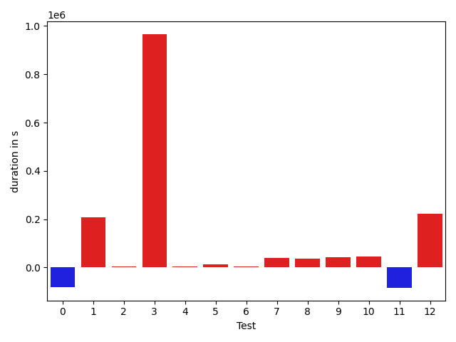

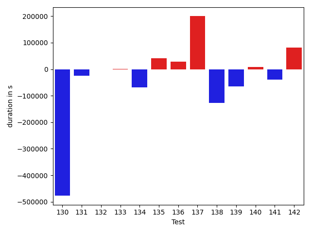

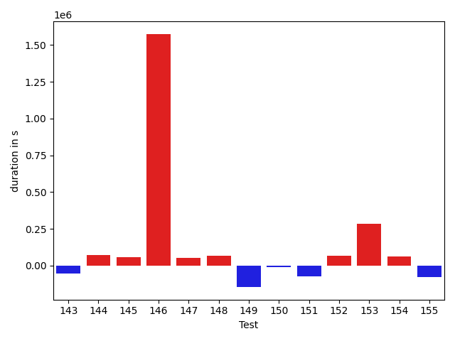

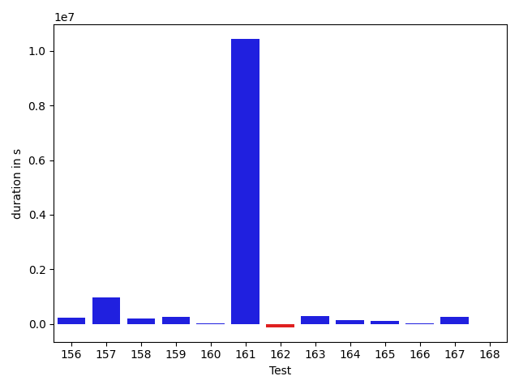

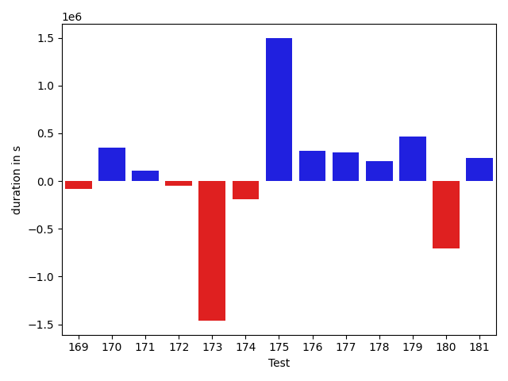

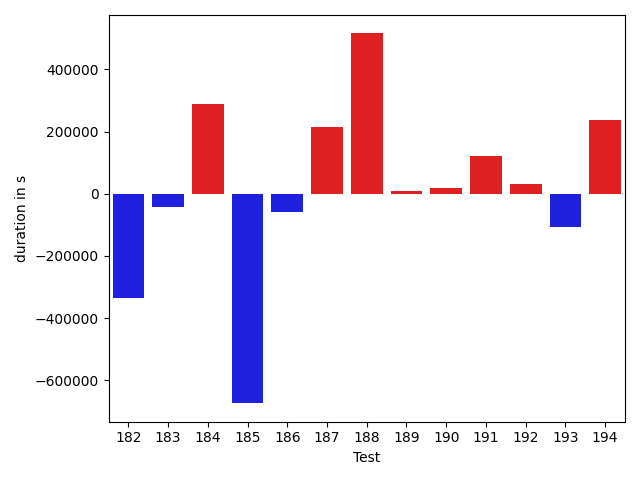

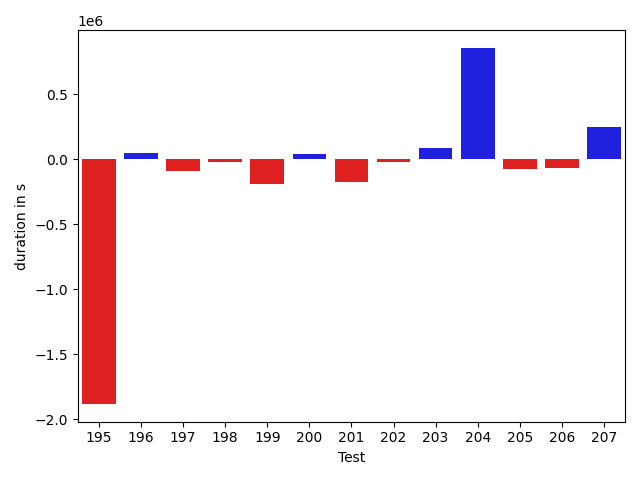

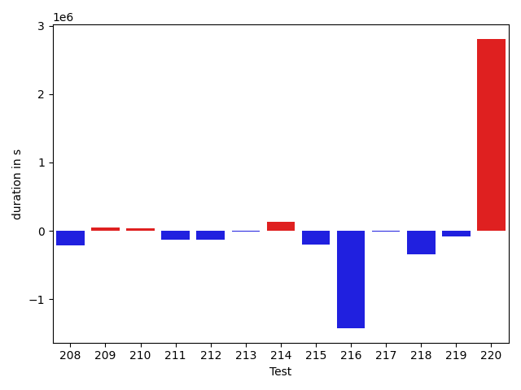

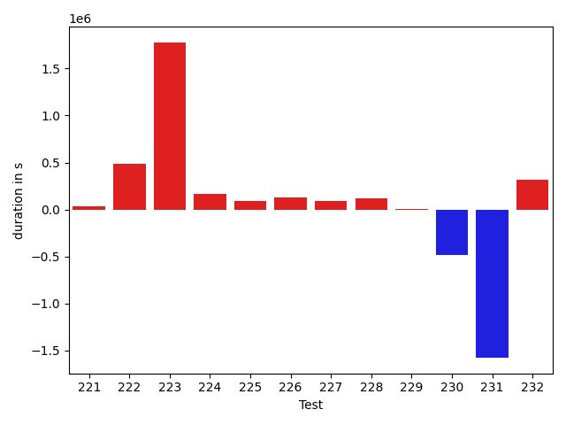

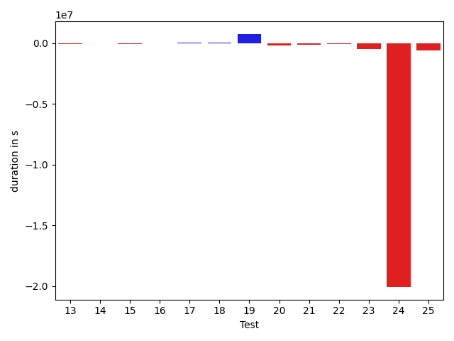

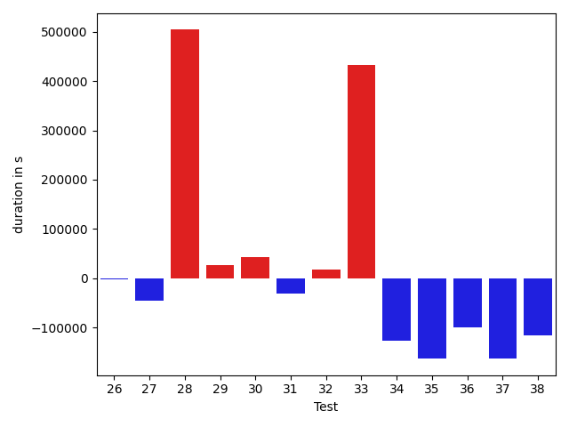

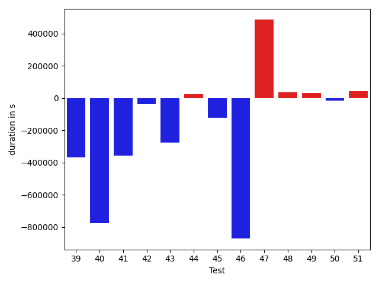

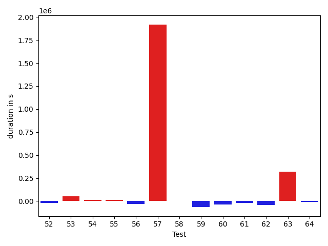

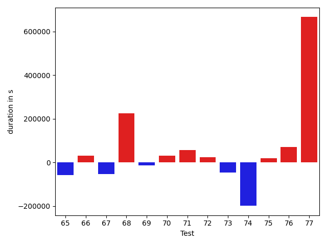

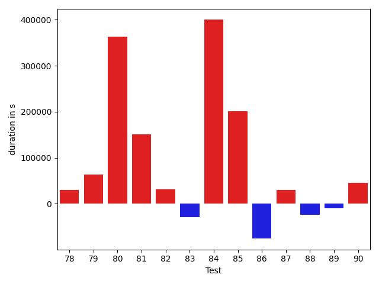

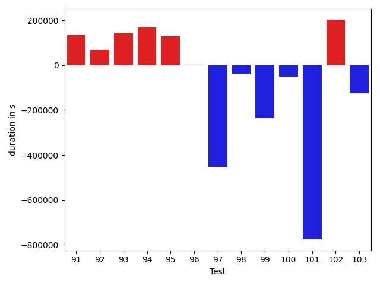

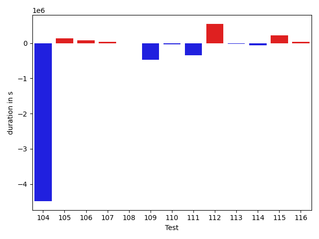

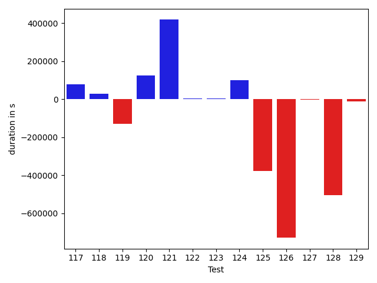

| ID | DurationV1 | DurationsV2 | DeltaDuration |
| --- | --- | --- | --- |
| 0 | 1528769.3493012385 | 15056532.449409379 | 13527763.10010814 |
| 1 | 810183.0063004948 | 897539.900739698 | 87356.8944392032 |
| 2 | 854911.4907319825 | 1708822.8538017175 | 853911.363069735 |
| 3 | 773020.3608096936 | 846529.7656181351 | 73509.40480844153 |
| 4 | 1120341.2669288504 | 1292592.749292621 | 172251.48236377048 |
| 5 | 2130541.793199024 | 2141230.9525382454 | 10689.159339221194 |
| 6 | 893089.0056965068 | 1774444.6461745359 | 881355.640478029 |
| 7 | 735094.5134101568 | 725800.3334466359 | -9294.17996352096 |
| 8 | 506175.9808631111 | 416154.19189453125 | -90021.78896857984 |
| 9 | 1407968.182770632 | 696383.0379008995 | -711585.1448697324 |
| 10 | 324944.8876953125 | 334774.9281616211 | 9830.040466308594 |
| 11 | 714064.9054342023 | 489388.1847163404 | -224676.7207178619 |
| 12 | 1482476.0337250803 | 460155.63467457914 | -1022320.3990505012 |
| 13 | 2278727.8069315027 | 2195956.404257234 | -82771.40267426847 |
| 14 | 499689.43554310093 | 480283.557228446 | -19405.878314654925 |
| 15 | 481587.6989141926 | 376726.12902104855 | -104861.56989314407 |
| 16 | 330537.947167933 | 303308.9362792969 | -27229.010888636112 |
| 17 | 529183.8915758987 | 534048.5281661749 | 4864.636590276146 |
| 18 | 1054823.9456982533 | 1060725.6609624093 | 5901.715264155995 |
| 19 | 1316422.9472165036 | 2051649.257272411 | 735226.3100559074 |
| 20 | 733112.8436150551 | 533085.666321516 | -200027.17729353905 |
| 21 | 625589.1855621338 | 468433.1479797363 | -157156.03758239746 |
| 22 | 463784.4079031944 | 379256.45354413986 | -84527.95435905457 |
| 23 | 873117.2247400284 | 385146.39012396336 | -487970.834616065 |
| 24 | 26006730.311835647 | 5934219.793032764 | -20072510.51880288 |
| 25 | 1552341.1260713993 | 939339.7451351809 | -613001.3809362184 |
| 26 | 492160.527674675 | 466360.5369013846 | -25799.990773290396 |
| 27 | 723807.8738169656 | 352581.1666097641 | -371226.7072072015 |
| 28 | 814356.4527521641 | 747091.2688889131 | -67265.183863251 |
| 29 | 1986633.2392498613 | 1963434.2429125544 | -23198.99633730692 |
| 30 | 3604641.5656087194 | 2949326.84168247 | -655314.7239262494 |
| 31 | 912741.9984200057 | 1897405.4048038425 | 984663.4063838369 |
| 32 | 820712.7896999504 | 696375.6184421484 | -124337.17125780194 |
| 33 | 1503421.7519706185 | 1304942.5219068686 | -198479.23006374994 |
| 34 | 670912.6275754005 | 633273.8839861715 | -37638.74358922907 |
| 35 | 1845221.431241897 | 766553.1144097492 | -1078668.3168321478 |
| 36 | 1584832.3107028003 | 1655038.1029362984 | 70205.79223349807 |
| 37 | 2665666.1879753172 | 515284.83120469586 | -2150381.3567706216 |
| 38 | 1941425.5407934766 | 686789.5887505224 | -1254635.9520429543 |
| 39 | 888562.7610924003 | 864922.3643873796 | -23640.396705020685 |
| 40 | 921317.7133238947 | 701555.0039909156 | -219762.70933297905 |
| 41 | 1317055.7533697858 | 447121.67038369505 | -869934.0829860908 |
| 42 | 574759.7705694499 | 473103.8470616203 | -101655.92350782955 |
| 43 | 1331571.4440770666 | 964218.3985379346 | -367353.04553913197 |
| 44 | 591493.1638221368 | 473382.996299386 | -118110.1675227508 |
| 45 | 433162.79659056664 | 536892.7408441305 | 103729.94425356388 |
| 46 | 474904.383622964 | 578338.0347938538 | 103433.65117088979 |
| 47 | 547498.2254903316 | 566333.3379987496 | 18835.112508417922 |
| 48 | 637226.3934000526 | 702049.160851317 | 64822.76745126443 |
| 49 | 863080.408855204 | 1158413.426624968 | 295333.01776976394 |
| 50 | 1123367.6500512166 | 941226.1164382416 | -182141.53361297504 |
| 51 | 1038088.3192256985 | 5821156.02467111 | 4783067.705445412 |
| 52 | 632243.1918143923 | 923552.1696355077 | 291308.9778211154 |
| 53 | 1154310.3506701316 | 1088980.654432746 | -65329.696237385506 |
| 54 | 1044720.9726849146 | 1096213.9584745923 | 51492.98578967771 |
| 55 | 1223820.4243728102 | 1293843.0376818166 | 70022.61330900644 |
| 56 | 650880.5791693325 | 882245.2862960645 | 231364.70712673198 |
| 57 | 579308.6609353153 | 646302.7670181539 | 66994.10608283861 |
| 58 | 835990.354956171 | 1118980.507918643 | 282990.15296247206 |
| 59 | 578371.2426050259 | 597210.7822133026 | 18839.539608276682 |
| 60 | 683379.2567929714 | 939595.6476609912 | 256216.39086801978 |
| 61 | 1000254.6011967869 | 1042044.3798766925 | 41789.77867990569 |
| 62 | 699132.8167591868 | 640975.5182515774 | -58157.298507609405 |
| 63 | 612868.7196765337 | 613118.7587257216 | 250.03904918790795 |
| 64 | 333937.1186828613 | 553174.987682581 | 219237.86899971962 |
| 65 | 660009.7008618932 | 660314.2909158348 | 304.59005394158885 |
| 66 | 575437.1639280319 | 455241.1185238147 | -120196.0454042172 |
| 67 | 863172.1686198631 | 838439.8929118391 | -24732.27570802404 |
| 68 | 1265815.7576327305 | 1338025.5571395012 | 72209.79950677068 |
| 69 | 1097309.507543501 | 1376031.6964633693 | 278722.1889198683 |
| 70 | 731964.8627360511 | 812971.9669399514 | 81007.10420390032 |
| 71 | 1455712.2659511433 | 1507306.8926938751 | 51594.62674273178 |
| 72 | 602387.0868322207 | 1170762.364376376 | 568375.2775441553 |
| 73 | 705904.8542030356 | 1020177.9575087328 | 314273.1033056972 |
| 74 | 517110.6411514878 | 508416.58147826046 | -8694.05967322737 |
| 75 | 760249.3061590954 | 2229936.596275504 | 1469687.2901164088 |
| 76 | 940682.018806404 | 1373493.4336137478 | 432811.41480734386 |
| 77 | 602401.0444335938 | 592876.6071777344 | -9524.437255859375 |
| 78 | 481354.32319641113 | 1085187.48462677 | 603833.1614303589 |
| 79 | 2913557.6584862648 | 3141355.521176037 | 227797.86268977216 |
| 80 | 536107.5651909714 | 623872.3511372537 | 87764.78594628233 |
| 81 | 526338.1765581667 | 514894.2292127218 | -11443.947345444933 |
| 82 | 580559.1847649319 | 478299.985282975 | -102259.1994819569 |
| 83 | 1825869.6684122388 | 2344146.5466233483 | 518276.87821110943 |
| 84 | 648718.9756326675 | 552569.6062717438 | -96149.36936092377 |
| 85 | 1996407.457468186 | 1168603.842971791 | -827803.614496395 |
| 86 | 1106814.4952336692 | 937507.6709103142 | -169306.824323355 |
| 87 | 780990.5572234548 | 680482.7069345277 | -100507.85028892709 |
| 88 | 4900387.776249595 | 4851239.989927862 | -49147.78632173315 |
| 89 | 509621.85973644257 | 519454.2506942898 | 9832.390957847238 |
| 90 | 5866255.080596207 | 24475312.68523527 | 18609057.60463906 |
| 91 | 577494.4664316177 | 592993.9041061401 | 15499.4376745224 |
| 92 | 931807.3867205955 | 707200.552007077 | -224606.8347135185 |
| 93 | 1424562.360423441 | 1166749.573069376 | -257812.7873540651 |
| 94 | 440793.74642944336 | 372627.6139650345 | -68166.13246440887 |
| 95 | 851892.9046695365 | 749410.217311792 | -102482.68735774455 |
| 96 | 1449921.424114994 | 847847.2572405883 | -602074.1668744057 |
| 97 | 672176.9599295246 | 677400.4314802669 | 5223.471550742281 |
| 98 | 515656.15250737965 | 413244.467592597 | -102411.68491478264 |
| 99 | 957675.1571410373 | 670712.7693049987 | -286962.3878360386 |
| 100 | 1076484.114226319 | 589329.9393662661 | -487154.17486005276 |
| 101 | 573216.9084606171 | 361494.7382120639 | -211722.17024855316 |
| 102 | 766502.8105866723 | 427660.8905887604 | -338841.9199979119 |
| 103 | 380004.1793204546 | 496507.72794438154 | 116503.54862392694 |
| 104 | 802658.8557840815 | 1563911.3754032431 | 761252.5196191616 |
| 105 | 397292.6664920747 | 440083.97761535645 | 42791.31112328172 |
| 106 | 350511.02590179443 | 346125.1337890625 | -4385.892112731934 |
| 107 | 445109.3061981201 | 304423.80770874023 | -140685.49848937988 |
| 108 | 374396.9190044403 | 384244.3036727905 | 9847.38466835022 |
| 109 | 442382.462890625 | 687792.6072235107 | 245410.14433288574 |
| 110 | 1413128.8633179665 | 1269511.6217354536 | -143617.24158251286 |
| 111 | 439877.64514654875 | 980219.5635447314 | 540341.9183981826 |
| 112 | 268775.2775878906 | 326725.67919921875 | 57950.401611328125 |
| 113 | 374932.98611831665 | 349786.7323513031 | -25146.25376701355 |
| 114 | 308230.4468383789 | 312958.1959991455 | 4727.749160766602 |
| 115 | 262719.70263671875 | 375586.381439209 | 112866.67880249023 |
| 116 | 374788.13385009766 | 378000.1220703125 | 3211.9882202148438 |
| 117 | 305159.8852081299 | 383804.716796875 | 78644.83158874512 |
| 118 | 367528.73669433594 | 396552.455078125 | 29023.718383789062 |
| 119 | 456218.197265625 | 327721.4409790039 | -128496.7562866211 |
| 120 | 520884.02103782084 | 645554.5823451245 | 124670.56130730361 |
| 121 | 1145172.9547063815 | 1563800.0375118374 | 418627.0828054559 |
| 122 | 469594.04604656197 | 473114.45546735695 | 3520.409420794982 |
| 123 | 508764.19371530553 | 511455.1008833405 | 2690.907168034988 |
| 124 | 581426.8830928551 | 683139.3799754786 | 101712.49688262353 |
| 125 | 1604324.726822352 | 1225571.9997481527 | -378752.72707419936 |
| 126 | 1471745.9412758276 | 742305.0385720339 | -729440.9027037937 |
| 127 | 752100.155451749 | 749239.3198886598 | -2860.835563089233 |
| 128 | 966897.2934408188 | 462665.93574523926 | -504231.3576955795 |
| 129 | 623728.4394067876 | 613188.923774552 | -10539.515632235678 |
| 130 | 3834964.6104364833 | 3611351.3117384873 | -223613.29869799595 |
| 131 | 819188.8528428964 | 600400.5547851189 | -218788.29805777746 |
| 132 | 876673.4074975108 | 957744.9682763045 | 81071.56077879376 |
| 133 | 871235.0175176228 | 956258.8304228764 | 85023.81290525361 |
| 134 | 442474.7205175583 | 593745.4924889058 | 151270.7719713475 |
| 135 | 577623.9605999471 | 725462.4248211273 | 147838.46422118018 |
| 136 | 593456.5756994188 | 673642.1334119644 | 80185.55771254562 |
| 137 | 512724.5656438656 | 695509.4830054641 | 182784.91736159846 |
| 138 | 296245.6906738281 | 368561.59576416016 | 72315.90509033203 |
| 139 | 790194.09086618 | 1214091.0458507473 | 423896.95498456724 |
| 140 | 1403413.6420208914 | 1555240.4624308788 | 151826.82040998735 |
| 141 | 796881.6021093924 | 706303.4270042263 | -90578.17510516616 |
| 142 | 809585.2952083286 | 833503.1465436528 | 23917.851335324114 |
| 143 | 551342.909000797 | 924301.0266542712 | 372958.1176534742 |
| 144 | 808516.4699481206 | 753007.3689137576 | -55509.10103436303 |
| 145 | 4492285.241256094 | 3894096.1401745672 | -598189.1010815264 |
| 146 | 492763.93896484375 | 994282.4046325684 | 501518.4656677246 |
| 147 | 1136517.332862532 | 1516605.7487148067 | 380088.41585227475 |
| 148 | 1029636.7325790691 | 761004.5027897898 | -268632.2297892793 |
| 149 | 1114469.5871906206 | 1169235.42810605 | 54765.840915429406 |
| 150 | 1172036.8431532374 | 1076342.9678335288 | -95693.8753197086 |
| 151 | 673649.1601686726 | 921915.3830051105 | 248266.22283643798 |
| 152 | 865464.0740702053 | 920867.1136273473 | 55403.03955714195 |
| 153 | 872209.0226986809 | 936036.061798061 | 63827.03909938014 |
| 154 | 1345675.686022708 | 1242737.6702679996 | -102938.01575470832 |
| 155 | 858561.0596222682 | 1003056.2347606628 | 144495.17513839458 |
| 156 | 2300903.2466511955 | 2526443.820001327 | 225540.5733501315 |
| 157 | 975630.6659648356 | 1933689.2145232845 | 958058.5485584489 |
| 158 | 1005540.8879366717 | 1194654.7938634525 | 189113.90592678078 |
| 159 | 790179.7156061273 | 1060300.0644279364 | 270120.34882180917 |
| 160 | 428317.36238098145 | 444206.8310852051 | 15889.468704223633 |
| 161 | 753177.2510990059 | 11197297.502425812 | 10444120.251326807 |
| 162 | 596623.7367286682 | 468914.68471717834 | -127709.05201148987 |
| 163 | 1627248.602564389 | 1908398.5109744226 | 281149.9084100337 |
| 164 | 952471.9747397854 | 1094348.373516922 | 141876.39877713646 |
| 165 | 662970.1403350678 | 770499.8240270747 | 107529.68369200698 |
| 166 | 294961.6015625 | 310836.48828125 | 15874.88671875 |
| 167 | 773573.6088516287 | 1021195.5818301872 | 247621.9729785585 |
| 168 | 735287.4017340549 | 723547.9063998742 | -11739.495334180654 |
| 169 | 585633.714005962 | 503408.3380769726 | -82225.37592898944 |
| 170 | 940156.9547175026 | 1286578.7802778436 | 346421.825560341 |
| 171 | 367590.07594394684 | 476463.520085454 | 108873.44414150715 |
| 172 | 599885.6724353479 | 554098.9163943748 | -45786.75604097312 |
| 173 | 2101423.3577594757 | 640658.0777271874 | -1460765.2800322883 |
| 174 | 606822.1491699219 | 413954.4987182617 | -192867.65045166016 |
| 175 | 998137.0962823019 | 2494317.786613756 | 1496180.690331454 |
| 176 | 941727.8542244192 | 1262054.9344645077 | 320327.0802400885 |
| 177 | 1886914.7074340244 | 2188135.1901350655 | 301220.48270104104 |
| 178 | 846191.3918791312 | 1052422.1532355787 | 206230.76135644747 |
| 179 | 774774.8591052738 | 1236587.151252168 | 461812.29214689415 |
| 180 | 2025383.2316474635 | 1320120.857395139 | -705262.3742523245 |
| 181 | 577395.9680931246 | 820463.6757839386 | 243067.70769081404 |
| 182 | 612231.6241331005 | 814653.7827334269 | 202422.1586003264 |
| 183 | 842217.0310124361 | 858914.6341847368 | 16697.603172300616 |
| 184 | 577233.5019726871 | 542001.515076245 | -35231.98689644213 |
| 185 | 673612.1186681036 | 595220.7689409258 | -78391.34972717776 |
| 186 | 463622.4792470932 | 438981.7562765628 | -24640.72297053039 |
| 187 | 716442.1305624694 | 582995.7996318042 | -133446.33093066514 |
| 188 | 555065.1196429133 | 685352.296917066 | 130287.17727415264 |
| 189 | 3270014.2819976807 | 466934.52827835083 | -2803079.75371933 |
| 190 | 28276757.471257158 | 980037.082589211 | -27296720.38866795 |
| 191 | 995921.6334529434 | 687294.7548820206 | -308626.87857092277 |
| 192 | 1830055.6563534462 | 2590742.545259582 | 760686.8889061357 |
| 193 | 676163.3151950836 | 596388.9503946304 | -79774.36480045319 |
| 194 | 1564250.3076776464 | 1090198.5882561216 | -474051.7194215248 |
| 195 | 2516611.794299483 | 633411.2883367538 | -1883200.505962729 |
| 196 | 382247.34765625 | 427935.5089683533 | 45688.16131210327 |
| 197 | 510975.54604434967 | 420036.2230396271 | -90939.3230047226 |
| 198 | 389439.2633972168 | 366183.5456542969 | -23255.717742919922 |
| 199 | 553077.2054576874 | 367240.2149152756 | -185836.9905424118 |
| 200 | 348681.9650878906 | 389504.9922981262 | 40823.027210235596 |
| 201 | 1416921.2652993985 | 1242268.1021319479 | -174653.16316745058 |
| 202 | 672065.9720938802 | 654410.4802246094 | -17655.4918692708 |
| 203 | 351172.2899532318 | 442185.5132141113 | 91013.22326087952 |
| 204 | 6169464.475998864 | 7027804.754962353 | 858340.2789634895 |
| 205 | 450410.67209243774 | 373678.42211708054 | -76732.2499753572 |
| 206 | 552569.3617052529 | 488949.83842589543 | -63619.52327935747 |
| 207 | 665159.9708065083 | 913951.1593694487 | 248791.18856294034 |
| 208 | 776342.0564542577 | 745487.3926188734 | -30854.6638353843 |
| 209 | 794379.601828149 | 596228.2994024807 | -198151.30242566834 |
| 210 | 428231.1794452667 | 449081.42643857 | 20850.2469933033 |
| 211 | 633196.2756502395 | 578151.7265306956 | -55044.54911954398 |
| 212 | 1137274.5596551201 | 1026127.2987634707 | -111147.2608916494 |
| 213 | 374889.22802734375 | 2495295.224609375 | 2120405.9965820312 |
| 214 | 604902.4685906897 | 485998.6625023758 | -118903.80608831393 |
| 215 | 644393.0100534889 | 654141.2366703115 | 9748.226616822649 |
| 216 | 531401.0877568424 | 1174337.2546038628 | 642936.1668470204 |
| 217 | 566344.9541925555 | 497319.58120484254 | -69025.37298771297 |
| 218 | 647406.6927370878 | 908819.1645960298 | 261412.47185894195 |
| 219 | 607452.0421519936 | 473804.3143515572 | -133647.72780043643 |
| 220 | 951291.4252929688 | 3202404.0754528046 | 2251112.650159836 |
| 221 | 727751.6477941702 | 574955.0581461809 | -152796.58964798925 |
| 222 | 4722027.919403076 | 503458.02587890625 | -4218569.89352417 |
| 223 | 579730.3990950133 | 878299.3544027589 | 298568.9553077456 |
| 224 | 1406338.9267316866 | 1054281.2322832635 | -352057.6944484231 |
| 225 | 668069.5436335987 | 789538.9564372455 | 121469.41280364676 |
| 226 | 513191.5837097168 | 333976.79290771484 | -179214.79080200195 |
| 227 | 873643.0258274078 | 690148.7817459106 | -183494.2440814972 |
| 228 | 524470.8119467497 | 559786.1587240696 | 35315.34677731991 |
| 229 | 345535.52580833435 | 603611.3648537602 | 258075.83904542588 |
| 230 | 1281166.912866549 | 679869.3572694756 | -601297.5555970735 |
| 231 | 389170.7032241821 | 574083.88671875 | 184913.18349456787 |
| 232 | 468685.07620728016 | 532403.2421875 | 63718.16598021984 |

## Misc.

| ID | Test Class | Test Method |
| --- | --- | --- |
| 0 | com.google.gson.functional.JsonAdapterAnnotationOnClassesTest | testJsonAdapterInvoked |
| 1 | com.google.gson.functional.JsonAdapterAnnotationOnClassesTest | testRegisteredAdapterOverridesJsonAdapter |
| 2 | com.google.gson.functional.JsonAdapterAnnotationOnClassesTest | testRegisteredSerializerOverridesJsonAdapter |
| 3 | com.google.gson.functional.JsonAdapterAnnotationOnClassesTest | testNullSafeObjectFromJson |
| 4 | com.google.gson.functional.JsonAdapterAnnotationOnClassesTest | testJsonAdapterFactoryInvoked |
| 5 | com.google.gson.functional.JsonAdapterAnnotationOnClassesTest | testRegisteredDeserializerOverridesJsonAdapter |
| 6 | com.google.gson.functional.JsonAdapterAnnotationOnClassesTest | testSuperclassTypeAdapterNotInvoked |
| 7 | com.google.gson.functional.JsonAdapterAnnotationOnClassesTest | testIncorrectTypeAdapterFails |
| 8 | com.google.gson.functional.ExclusionStrategyFunctionalTest | testExclusionStrategySerializationDoesNotImpactSerialization |
| 9 | com.google.gson.functional.ExclusionStrategyFunctionalTest | testExclusionStrategyWithMode |
| 10 | com.google.gson.functional.ExclusionStrategyFunctionalTest | testExcludeTopLevelClassSerialization |
| 11 | com.google.gson.functional.ExclusionStrategyFunctionalTest | testExclusionStrategySerializationDoesNotImpactDeserialization |
| 12 | com.google.gson.functional.ExclusionStrategyFunctionalTest | testExclusionStrategyDeserialization |
| 13 | com.google.gson.functional.ExclusionStrategyFunctionalTest | testExclusionStrategySerialization |
| 14 | com.google.gson.functional.ExclusionStrategyFunctionalTest | testExcludeTopLevelClassSerializationDoesNotImpactDeserialization |
| 15 | com.google.gson.functional.ExclusionStrategyFunctionalTest | testExcludeTopLevelClassDeserializationDoesNotImpactSerialization |
| 16 | com.google.gson.functional.ExclusionStrategyFunctionalTest | testExcludeTopLevelClassDeserialization |
| 17 | com.google.gson.MixedStreamTest | testReaderDoesNotMutateState |
| 18 | com.google.gson.MixedStreamTest | testWriteHtmlSafe |
| 19 | com.google.gson.MixedStreamTest | testWriteLenient |
| 20 | com.google.gson.MixedStreamTest | testWriteNulls |
| 21 | com.google.gson.MixedStreamTest | testReadInvalidState |
| 22 | com.google.gson.MixedStreamTest | testWriteClosed |
| 23 | com.google.gson.MixedStreamTest | testReadNulls |
| 24 | com.google.gson.MixedStreamTest | testWriteMixedStreamed |
| 25 | com.google.gson.MixedStreamTest | testReadMixedStreamed |
| 26 | com.google.gson.MixedStreamTest | testWriteInvalidState |
| 27 | com.google.gson.MixedStreamTest | testWriteDoesNotMutateState |
| 28 | com.google.gson.MixedStreamTest | testReadClosed |
| 29 | com.google.gson.functional.InstanceCreatorTest | testInstanceCreatorForParametrizedType |
| 30 | com.google.gson.functional.InstanceCreatorTest | testInstanceCreatorReturnsBaseType |
| 31 | com.google.gson.functional.InstanceCreatorTest | testInstanceCreatorReturnsSubTypeForField |
| 32 | com.google.gson.functional.InstanceCreatorTest | testInstanceCreatorReturnsSubTypeForTopLevelObject |
| 33 | com.google.gson.functional.InstanceCreatorTest | testInstanceCreatorForCollectionType |
| 34 | com.google.gson.functional.NamingPolicyTest | testAtSignInSerializedName |
| 35 | com.google.gson.functional.NamingPolicyTest | testGsonWithNonDefaultFieldNamingPolicySerialization |
| 36 | com.google.gson.functional.NamingPolicyTest | testGsonDuplicateNameUsingSerializedNameFieldNamingPolicySerialization |
| 37 | com.google.gson.functional.NamingPolicyTest | testGsonWithUpperCamelCaseSpacesPolicyDeserialiation |
| 38 | com.google.gson.functional.NamingPolicyTest | testGsonWithNonDefaultFieldNamingPolicyDeserialiation |
| 39 | com.google.gson.functional.NamingPolicyTest | testComplexFieldNameStrategy |
| 40 | com.google.gson.functional.NamingPolicyTest | testDeprecatedNamingStrategy |
| 41 | com.google.gson.functional.NamingPolicyTest | testGsonWithUpperCamelCaseSpacesPolicySerialiation |
| 42 | com.google.gson.functional.NamingPolicyTest | testGsonWithLowerCaseDashPolicyDeserialiation |
| 43 | com.google.gson.functional.NamingPolicyTest | testGsonWithSerializedNameFieldNamingPolicySerialization |
| 44 | com.google.gson.functional.NamingPolicyTest | testGsonWithLowerCaseUnderscorePolicySerialization |
| 45 | com.google.gson.functional.NamingPolicyTest | testGsonWithSerializedNameFieldNamingPolicyDeserialization |
| 46 | com.google.gson.functional.NamingPolicyTest | testGsonWithLowerCaseUnderscorePolicyDeserialiation |
| 47 | com.google.gson.functional.NamingPolicyTest | testGsonWithLowerCaseDashPolicySerialization |
| 48 | com.google.gson.functional.CustomTypeAdaptersTest | testCustomAdapterInvokedForMapElementDeserialization |
| 49 | com.google.gson.functional.CustomTypeAdaptersTest | testCustomAdapterInvokedForMapElementSerializationWithType |
| 50 | com.google.gson.functional.CustomTypeAdaptersTest | testCustomNestedSerializers |
| 51 | com.google.gson.functional.CustomTypeAdaptersTest | testCustomSerializers |
| 52 | com.google.gson.functional.CustomTypeAdaptersTest | testCustomNestedDeserializers |
| 53 | com.google.gson.functional.CustomTypeAdaptersTest | testCustomTypeAdapterDoesNotAppliesToSubClasses |
| 54 | com.google.gson.functional.CustomTypeAdaptersTest | testRegisterHierarchyAdapterForDate |
| 55 | com.google.gson.functional.CustomTypeAdaptersTest | testCustomAdapterInvokedForCollectionElementSerializationWithType |
| 56 | com.google.gson.functional.CustomTypeAdaptersTest | testCustomDeserializers |
| 57 | com.google.gson.functional.CustomTypeAdaptersTest | testCustomByteArrayDeserializerAndInstanceCreator |
| 58 | com.google.gson.functional.CustomTypeAdaptersTest | testEnsureCustomDeserializerNotInvokedForNullValues |
| 59 | com.google.gson.functional.CustomTypeAdaptersTest | testCustomSerializerInvokedForPrimitives |
| 60 | com.google.gson.functional.CustomTypeAdaptersTest | testCustomAdapterInvokedForCollectionElementDeserialization |
| 61 | com.google.gson.functional.CustomTypeAdaptersTest | testEnsureCustomSerializerNotInvokedForNullValues |
| 62 | com.google.gson.functional.CustomTypeAdaptersTest | testCustomTypeAdapterAppliesToSubClassesSerializedAsBaseClass |
| 63 | com.google.gson.functional.CustomTypeAdaptersTest | testCustomDeserializerInvokedForPrimitives |
| 64 | com.google.gson.functional.CustomTypeAdaptersTest | testCustomAdapterInvokedForMapElementSerialization |
| 65 | com.google.gson.functional.CustomTypeAdaptersTest | testCustomByteArraySerializer |
| 66 | com.google.gson.functional.CustomTypeAdaptersTest | testCustomAdapterInvokedForCollectionElementSerialization |
| 67 | com.google.gson.functional.MapTest | testSerializeMaps |
| 68 | com.google.gson.functional.MapTest | testInterfaceTypeMapWithSerializer |
| 69 | com.google.gson.functional.MapTest | testCustomSerializerForSpecificMapType |
| 70 | com.google.gson.functional.MapTest | testGeneralMapField |
| 71 | com.google.gson.functional.MapTest | testInterfaceTypeMap |
| 72 | com.google.gson.functional.MapTest | testMapSubclassDeserialization |
| 73 | com.google.gson.functional.MapTest | testMapSerializationWithNullValueButSerializeNulls |
| 74 | com.google.gson.functional.MapTest | testMapSerializationWithNullValuesSerialized |
| 75 | com.google.gson.functional.ReadersWritersTest | testReadWriteTwoObjects |
| 76 | com.google.gson.functional.ReadersWritersTest | testReadWriteTwoStrings |
| 77 | com.google.gson.functional.ReadersWritersTest | testTopLevelNullObjectDeserializationWithReaderAndSerializeNulls |
| 78 | com.google.gson.functional.ReadersWritersTest | testTopLevelNullObjectSerializationWithWriterAndSerializeNulls |
| 79 | com.google.gson.functional.ExposeFieldsTest | testNullExposeFieldSerialization |
| 80 | com.google.gson.functional.ExposeFieldsTest | testArrayWithOneNullExposeFieldObjectSerialization |
| 81 | com.google.gson.functional.ExposeFieldsTest | testExposeAnnotationSerialization |
| 82 | com.google.gson.functional.FieldExclusionTest | testDefaultNestedStaticClassIncluded |
| 83 | com.google.gson.functional.FieldExclusionTest | testDefaultInnerClassExclusion |
| 84 | com.google.gson.functional.FieldExclusionTest | testInnerClassExclusion |
| 85 | com.google.gson.functional.DefaultTypeAdaptersTest | testDateSerializationWithPattern |
| 86 | com.google.gson.functional.DefaultTypeAdaptersTest | testClassSerialization |
| 87 | com.google.gson.functional.DefaultTypeAdaptersTest | testTimestampSerialization |
| 88 | com.google.gson.functional.DefaultTypeAdaptersTest | testDefaultDateDeserializationUsingBuilder |
| 89 | com.google.gson.functional.DefaultTypeAdaptersTest | testDefaultCalendarSerialization |
| 90 | com.google.gson.functional.DefaultTypeAdaptersTest | testNullSerialization |
| 91 | com.google.gson.functional.DefaultTypeAdaptersTest | testClassDeserialization |
| 92 | com.google.gson.functional.DefaultTypeAdaptersTest | testDateDeserializationWithPattern |
| 93 | com.google.gson.functional.DefaultTypeAdaptersTest | testDateSerializationInCollection |
| 94 | com.google.gson.functional.DefaultTypeAdaptersTest | testBitSetSerialization |
| 95 | com.google.gson.functional.DefaultTypeAdaptersTest | testDateSerializationWithPatternNotOverridenByTypeAdapter |
| 96 | com.google.gson.functional.DefaultTypeAdaptersTest | testOverrideBigIntegerTypeAdapter |
| 97 | com.google.gson.functional.DefaultTypeAdaptersTest | testSqlDateSerialization |
| 98 | com.google.gson.functional.DefaultTypeAdaptersTest | testOverrideBigDecimalTypeAdapter |
| 99 | com.google.gson.functional.DefaultTypeAdaptersTest | testBitSetDeserialization |
| 100 | com.google.gson.functional.DefaultTypeAdaptersTest | testSetSerialization |
| 101 | com.google.gson.functional.DefaultTypeAdaptersTest | testDefaultGregorianCalendarDeserialization |
| 102 | com.google.gson.functional.DefaultTypeAdaptersTest | testDefaultCalendarDeserialization |
| 103 | com.google.gson.functional.DefaultTypeAdaptersTest | testDefaultGregorianCalendarSerialization |
| 104 | com.google.gson.JsonParserTest | testReadWriteTwoObjects |
| 105 | com.google.gson.functional.PrimitiveTest | testPrimitiveDoubleAutoboxedInASingleElementArraySerialization |
| 106 | com.google.gson.functional.PrimitiveTest | testHtmlCharacterSerialization |
| 107 | com.google.gson.functional.PrimitiveTest | testLongAsStringSerialization |
| 108 | com.google.gson.functional.PrimitiveTest | testFloatNaNSerialization |
| 109 | com.google.gson.functional.PrimitiveTest | testDoubleNaNSerialization |
| 110 | com.google.gson.functional.PrimitiveTest | testPrimitiveDoubleAutoboxedSerialization |
| 111 | com.google.gson.functional.PrimitiveTest | testMoreSpecificSerialization |
| 112 | com.google.gson.functional.PrimitiveTest | testNegativeInfinitySerializationNotSupportedByDefault |
| 113 | com.google.gson.functional.PrimitiveTest | testLongAsStringDeserialization |
| 114 | com.google.gson.functional.PrimitiveTest | testFloatInfinitySerialization |
| 115 | com.google.gson.functional.PrimitiveTest | testNegativeInfinitySerialization |
| 116 | com.google.gson.functional.PrimitiveTest | testDoubleInfinitySerializationNotSupportedByDefault |
| 117 | com.google.gson.functional.PrimitiveTest | testDoubleInfinitySerialization |
| 118 | com.google.gson.functional.PrimitiveTest | testNegativeInfinityFloatSerialization |
| 119 | com.google.gson.functional.PrimitiveTest | testDoubleNaNSerializationNotSupportedByDefault |
| 120 | com.google.gson.functional.CustomSerializerTest | testSerializerReturnsNull |
| 121 | com.google.gson.functional.CustomSerializerTest | testSubClassSerializerInvokedForBaseClassFieldsHoldingSubClassInstances |
| 122 | com.google.gson.functional.CustomSerializerTest | testBaseClassSerializerInvokedForBaseClassFields |
| 123 | com.google.gson.functional.CustomSerializerTest | testBaseClassSerializerInvokedForBaseClassFieldsHoldingSubClassInstances |
| 124 | com.google.gson.functional.CustomSerializerTest | testSubClassSerializerInvokedForBaseClassFieldsHoldingArrayOfSubClassInstances |
| 125 | com.google.gson.functional.ObjectTest | testSingletonLists |
| 126 | com.google.gson.functional.ObjectTest | testAnonymousLocalClassesCustomSerialization |
| 127 | com.google.gson.functional.ObjectTest | testInnerClassDeserialization |
| 128 | com.google.gson.functional.ObjectTest | testJsonObjectSerialization |
| 129 | com.google.gson.functional.VersioningTest | testVersionedGsonMixingSinceAndUntilDeserialization |
| 130 | com.google.gson.functional.VersioningTest | testVersionedUntilSerialization |
| 131 | com.google.gson.functional.VersioningTest | testIgnoreLaterVersionClassSerialization |
| 132 | com.google.gson.functional.VersioningTest | testVersionedClassesSerialization |
| 133 | com.google.gson.functional.VersioningTest | testVersionedGsonMixingSinceAndUntilSerialization |
| 134 | com.google.gson.functional.VersioningTest | testVersionedGsonWithUnversionedClassesDeserialization |
| 135 | com.google.gson.functional.VersioningTest | testVersionedGsonWithUnversionedClassesSerialization |
| 136 | com.google.gson.functional.VersioningTest | testVersionedClassesDeserialization |
| 137 | com.google.gson.functional.VersioningTest | testVersionedUntilDeserialization |
| 138 | com.google.gson.functional.VersioningTest | testIgnoreLaterVersionClassDeserialization |
| 139 | com.google.gson.functional.CustomDeserializerTest | testCustomDeserializerReturnsNull |
| 140 | com.google.gson.functional.CustomDeserializerTest | testJsonTypeFieldBasedDeserialization |
| 141 | com.google.gson.functional.CustomDeserializerTest | testCustomDeserializerReturnsNullForTopLevelObject |
| 142 | com.google.gson.functional.CustomDeserializerTest | testCustomDeserializerReturnsNullForArrayElementsForArrayField |
| 143 | com.google.gson.functional.CustomDeserializerTest | testCustomDeserializerReturnsNullForArrayElements |
| 144 | com.google.gson.functional.TypeHierarchyAdapterTest | testRegisterSuperTypeFirst |
| 145 | com.google.gson.functional.TypeHierarchyAdapterTest | testTypeHierarchy |
| 146 | com.google.gson.functional.TypeHierarchyAdapterTest | testRegisterSubTypeFirstAllowed |
| 147 | com.google.gson.functional.JsonAdapterAnnotationOnFieldsTest | testClassAnnotationAdapterFactoryTakesPrecedenceOverDefault |
| 148 | com.google.gson.functional.JsonAdapterAnnotationOnFieldsTest | testJsonAdapterWrappedInNullSafeAsRequested |
| 149 | com.google.gson.functional.JsonAdapterAnnotationOnFieldsTest | testClassAnnotationAdapterTakesPrecedenceOverDefault |
| 150 | com.google.gson.functional.JsonAdapterAnnotationOnFieldsTest | testFieldAnnotationTakesPrecedenceOverRegisteredTypeAdapter |
| 151 | com.google.gson.functional.JsonAdapterAnnotationOnFieldsTest | testRegisteredTypeAdapterTakesPrecedenceOverClassAnnotationAdapter |
| 152 | com.google.gson.functional.JsonAdapterAnnotationOnFieldsTest | testJsonAdapterInvokedOnlyForAnnotatedFields |
| 153 | com.google.gson.functional.JsonAdapterAnnotationOnFieldsTest | testFieldAnnotationTakesPrecedenceOverClassAnnotation |
| 154 | com.google.gson.functional.EnumTest | testEnumSubclassWithRegisteredTypeAdapter |
| 155 | com.google.gson.functional.MapAsArrayTypeAdapterTest | testMultipleEnableComplexKeyRegistrationHasNoEffect |
| 156 | com.google.gson.functional.MapAsArrayTypeAdapterTest | testSerializeComplexMapWithTypeAdapter |
| 157 | com.google.gson.functional.MapAsArrayTypeAdapterTest | testTwoTypesCollapseToOneDeserialize |
| 158 | com.google.gson.functional.MapAsArrayTypeAdapterTest | testMapWithTypeVariableSerialization |
| 159 | com.google.gson.functional.MapAsArrayTypeAdapterTest | testMapWithTypeVariableDeserialization |
| 160 | com.google.gson.OverrideCoreTypeAdaptersTest | testOverridePrimitiveBooleanAdapter |
| 161 | com.google.gson.OverrideCoreTypeAdaptersTest | testOverrideWrapperBooleanAdapter |
| 162 | com.google.gson.OverrideCoreTypeAdaptersTest | testOverrideStringAdapter |
| 163 | com.google.gson.functional.TypeVariableTest | testAdvancedTypeVariables |
| 164 | com.google.gson.functional.TypeVariableTest | testTypeVariablesViaTypeParameter |
| 165 | com.google.gson.functional.TypeVariableTest | testBasicTypeVariables |
| 166 | com.google.gson.functional.StreamingTypeAdaptersTest | testSerializeNullObject |
| 167 | com.google.gson.functional.StreamingTypeAdaptersTest | testSerializeWithCustomTypeAdapter |
| 168 | com.google.gson.functional.StreamingTypeAdaptersTest | testSerialize1dArray |
| 169 | com.google.gson.functional.StreamingTypeAdaptersTest | testDeserializeWithCustomTypeAdapter |
| 170 | com.google.gson.functional.StreamingTypeAdaptersTest | testNullSafe |
| 171 | com.google.gson.functional.StreamingTypeAdaptersTest | testSerializeMap |
| 172 | com.google.gson.functional.StreamingTypeAdaptersTest | testSerialize2dArray |
| 173 | com.google.gson.functional.StreamingTypeAdaptersTest | testSerialize |
| 174 | com.google.gson.functional.StreamingTypeAdaptersTest | testSerializeNullField |
| 175 | com.google.gson.functional.ParameterizedTypesTest | testParameterizedTypeWithCustomSerializer |
| 176 | com.google.gson.functional.ParameterizedTypesTest | testParameterizedTypeDeserialization |
| 177 | com.google.gson.functional.ParameterizedTypesTest | testTypesWithMultipleParametersSerialization |
| 178 | com.google.gson.functional.ParameterizedTypesTest | testParameterizedTypesWithCustomDeserializer |
| 179 | com.google.gson.functional.ParameterizedTypesTest | testParameterizedTypeWithReaderDeserialization |
| 180 | com.google.gson.functional.FieldNamingTest | testIdentity |
| 181 | com.google.gson.functional.FieldNamingTest | testLowerCaseWithUnderscores |
| 182 | com.google.gson.functional.FieldNamingTest | testUpperCamelCase |
| 183 | com.google.gson.functional.FieldNamingTest | testLowerCaseWithDashes |
| 184 | com.google.gson.functional.FieldNamingTest | testUpperCamelCaseWithSpaces |
| 185 | com.google.gson.functional.SecurityTest | testNonExecutableJsonSerialization |
| 186 | com.google.gson.functional.SecurityTest | testJsonWithNonExectuableTokenWithRegularGsonDeserialization |
| 187 | com.google.gson.functional.SecurityTest | testNonExecutableJsonDeserialization |
| 188 | com.google.gson.functional.SecurityTest | testJsonWithNonExectuableTokenWithConfiguredGsonDeserialization |
| 189 | com.google.gson.functional.SecurityTest | testJsonWithNonExectuableTokenSerialization |
| 190 | com.google.gson.CommentsTest | testParseComments |
| 191 | com.google.gson.functional.EscapingTest | testGsonAcceptsEscapedAndNonEscapedJsonDeserialization |
| 192 | com.google.gson.functional.UncategorizedTest | testReturningDerivedClassesDuringDeserialization |
| 193 | com.google.gson.functional.TypeAdapterPrecedenceTest | testStreamingHierarchicalFollowedByNonstreamingHierarchical |
| 194 | com.google.gson.functional.TypeAdapterPrecedenceTest | testNonstreamingFollowedByNonstreaming |
| 195 | com.google.gson.functional.TypeAdapterPrecedenceTest | testStreamingFollowedByStreaming |
| 196 | com.google.gson.functional.TypeAdapterPrecedenceTest | testNonstreamingHierarchicalFollowedByNonstreaming |
| 197 | com.google.gson.functional.TypeAdapterPrecedenceTest | testStreamingHierarchicalFollowedByNonstreaming |
| 198 | com.google.gson.functional.TypeAdapterPrecedenceTest | testStreamingFollowedByNonstreamingHierarchical |
| 199 | com.google.gson.functional.TypeAdapterPrecedenceTest | testSerializeNonstreamingTypeAdapterFollowedByStreamingTypeAdapter |
| 200 | com.google.gson.functional.TypeAdapterPrecedenceTest | testStreamingFollowedByNonstreaming |
| 201 | com.google.gson.GsonTypeAdapterTest | testDeserializerForAbstractClass |
| 202 | com.google.gson.functional.ArrayTest | testNullsInArrayWithSerializeNullPropertySetSerialization |
| 203 | com.google.gson.functional.ArrayTest | testArrayElementsAreArrays |
| 204 | com.google.gson.functional.CircularReferenceTest | testSelfReferenceCustomHandlerSerialization |
| 205 | com.google.gson.functional.NullObjectAndFieldTest | testCustomTypeAdapterPassesNullSerialization |
| 206 | com.google.gson.functional.NullObjectAndFieldTest | testExplicitDeserializationOfNulls |
| 207 | com.google.gson.functional.NullObjectAndFieldTest | testCustomSerializationOfNulls |
| 208 | com.google.gson.functional.NullObjectAndFieldTest | testAbsentJsonElementsAreSetToNull |
| 209 | com.google.gson.functional.NullObjectAndFieldTest | testPrintPrintingObjectWithNulls |
| 210 | com.google.gson.functional.NullObjectAndFieldTest | testPrintPrintingArraysWithNulls |
| 211 | com.google.gson.functional.NullObjectAndFieldTest | testExplicitNullSetsFieldToNullDuringDeserialization |
| 212 | com.google.gson.functional.NullObjectAndFieldTest | testExplicitSerializationOfNullArrayMembers |
| 213 | com.google.gson.functional.NullObjectAndFieldTest | testTopLevelNullObjectDeserialization |
| 214 | com.google.gson.functional.NullObjectAndFieldTest | testExplicitSerializationOfNullCollectionMembers |
| 215 | com.google.gson.functional.NullObjectAndFieldTest | testNullWrappedPrimitiveMemberSerialization |
| 216 | com.google.gson.functional.NullObjectAndFieldTest | testNullWrappedPrimitiveMemberDeserialization |
| 217 | com.google.gson.functional.NullObjectAndFieldTest | testExplicitSerializationOfNulls |
| 218 | com.google.gson.functional.NullObjectAndFieldTest | testCustomTypeAdapterPassesNullDesrialization |
| 219 | com.google.gson.functional.NullObjectAndFieldTest | testExplicitSerializationOfNullStringMembers |
| 220 | com.google.gson.functional.NullObjectAndFieldTest | testTopLevelNullObjectSerialization |
| 221 | com.google.gson.GsonBuilderTest | testExcludeFieldsWithModifiers |
| 222 | com.google.gson.GsonBuilderTest | testCreatingMoreThanOnce |
| 223 | com.google.gson.GsonBuilderTest | testTransientFieldExclusion |
| 224 | com.google.gson.functional.CollectionTest | testUserCollectionTypeAdapter |
| 225 | com.google.gson.DefaultMapJsonSerializerTest | testNonEmptyMapSerialization |
| 226 | com.google.gson.JsonObjectTest | testWritePropertyWithEmptyStringName |
| 227 | com.google.gson.JsonObjectTest | testPropertyWithQuotes |
| 228 | com.google.gson.LongSerializationPolicyTest | testDefaultLongSerializationIntegration |
| 229 | com.google.gson.LongSerializationPolicyTest | testStringLongSerializationIntegration |
| 230 | com.google.gson.functional.JavaUtilConcurrentAtomicTest | testAtomicLongWithStringSerializationPolicy |
| 231 | com.google.gson.functional.JavaUtilConcurrentAtomicTest | testAtomicLongArrayWithStringSerializationPolicy |
| 232 | com.google.gson.functional.PrintFormattingTest | testJsonObjectWithNullValuesSerialized |

| Test | IterationV1 | IterationV2 | DeltaIteration |
| --- | --- | --- | --- |
| 0 | 99 | 99 | 0 |
| 1 | 42 | 36 | -6 |
| 2 | 42 | 39 | -3 |
| 3 | 56 | 60 | 4 |
| 4 | 76 | 78 | 2 |
| 5 | 92 | 87 | -5 |
| 6 | 48 | 56 | 8 |
| 7 | 42 | 45 | 3 |
| 8 | 29 | 22 | -7 |
| 9 | 37 | 41 | 4 |
| 10 | 13 | 16 | 3 |
| 11 | 46 | 35 | -11 |
| 12 | 45 | 34 | -11 |
| 13 | 99 | 99 | 0 |
| 14 | 35 | 24 | -11 |
| 15 | 29 | 24 | -5 |
| 16 | 25 | 12 | -13 |
| 17 | 35 | 25 | -10 |
| 18 | 69 | 60 | -9 |
| 19 | 71 | 57 | -14 |
| 20 | 21 | 24 | 3 |
| 21 | 17 | 20 | 3 |
| 22 | 22 | 23 | 1 |
| 23 | 21 | 24 | 3 |
| 24 | 44 | 49 | 5 |
| 25 | 52 | 42 | -10 |
| 26 | 21 | 27 | 6 |
| 27 | 32 | 22 | -10 |
| 28 | 44 | 53 | 9 |
| 29 | 98 | 99 | 1 |
| 30 | 67 | 68 | 1 |
| 31 | 59 | 58 | -1 |
| 32 | 45 | 45 | 0 |
| 33 | 99 | 99 | 0 |
| 34 | 45 | 46 | 1 |
| 35 | 39 | 37 | -2 |
| 36 | 74 | 80 | 6 |
| 37 | 27 | 40 | 13 |
| 38 | 33 | 38 | 5 |
| 39 | 68 | 68 | 0 |
| 40 | 59 | 62 | 3 |
| 41 | 28 | 34 | 6 |
| 42 | 37 | 32 | -5 |
| 43 | 55 | 50 | -5 |
| 44 | 29 | 24 | -5 |
| 45 | 23 | 24 | 1 |
| 46 | 38 | 24 | -14 |
| 47 | 24 | 34 | 10 |
| 48 | 58 | 52 | -6 |
| 49 | 56 | 54 | -2 |
| 50 | 51 | 54 | 3 |
| 51 | 62 | 56 | -6 |
| 52 | 44 | 51 | 7 |
| 53 | 79 | 84 | 5 |
| 54 | 66 | 63 | -3 |
| 55 | 91 | 89 | -2 |
| 56 | 51 | 51 | 0 |
| 57 | 48 | 43 | -5 |
| 58 | 54 | 54 | 0 |
| 59 | 39 | 37 | -2 |
| 60 | 67 | 70 | 3 |
| 61 | 78 | 86 | 8 |
| 62 | 46 | 45 | -1 |
| 63 | 49 | 35 | -14 |
| 64 | 25 | 22 | -3 |
| 65 | 48 | 40 | -8 |
| 66 | 22 | 31 | 9 |
| 67 | 61 | 57 | -4 |
| 68 | 96 | 98 | 2 |
| 69 | 50 | 51 | 1 |
| 70 | 63 | 56 | -7 |
| 71 | 88 | 96 | 8 |
| 72 | 46 | 53 | 7 |
| 73 | 47 | 40 | -7 |
| 74 | 26 | 29 | 3 |
| 75 | 67 | 58 | -9 |
| 76 | 74 | 69 | -5 |
| 77 | 14 | 13 | -1 |
| 78 | 18 | 19 | 1 |
| 79 | 99 | 99 | 0 |
| 80 | 47 | 50 | 3 |
| 81 | 28 | 29 | 1 |
| 82 | 30 | 33 | 3 |
| 83 | 80 | 82 | 2 |
| 84 | 20 | 22 | 2 |
| 85 | 86 | 85 | -1 |
| 86 | 57 | 57 | 0 |
| 87 | 51 | 41 | -10 |
| 88 | 99 | 99 | 0 |
| 89 | 21 | 27 | 6 |
| 90 | 99 | 99 | 0 |
| 91 | 22 | 18 | -4 |
| 92 | 48 | 48 | 0 |
| 93 | 86 | 88 | 2 |
| 94 | 18 | 20 | 2 |
| 95 | 43 | 46 | 3 |
| 96 | 59 | 54 | -5 |
| 97 | 49 | 43 | -6 |
| 98 | 32 | 25 | -7 |
| 99 | 30 | 36 | 6 |
| 100 | 45 | 28 | -17 |
| 101 | 22 | 29 | 7 |
| 102 | 29 | 20 | -9 |
| 103 | 24 | 31 | 7 |
| 104 | 71 | 71 | 0 |
| 105 | 26 | 18 | -8 |
| 106 | 18 | 11 | -7 |
| 107 | 17 | 15 | -2 |
| 108 | 19 | 19 | 0 |
| 109 | 11 | 18 | 7 |
| 110 | 21 | 25 | 4 |
| 111 | 27 | 35 | 8 |
| 112 | 17 | 13 | -4 |
| 113 | 19 | 21 | 2 |
| 114 | 15 | 19 | 4 |
| 115 | 13 | 15 | 2 |
| 116 | 15 | 12 | -3 |
| 117 | 17 | 15 | -2 |
| 118 | 14 | 11 | -3 |
| 119 | 12 | 15 | 3 |
| 120 | 39 | 36 | -3 |
| 121 | 63 | 64 | 1 |
| 122 | 35 | 37 | 2 |
| 123 | 32 | 49 | 17 |
| 124 | 42 | 54 | 12 |
| 125 | 96 | 93 | -3 |
| 126 | 61 | 51 | -10 |
| 127 | 56 | 47 | -9 |
| 128 | 23 | 18 | -5 |
| 129 | 35 | 37 | 2 |
| 130 | 99 | 99 | 0 |
| 131 | 46 | 38 | -8 |
| 132 | 58 | 60 | 2 |
| 133 | 76 | 70 | -6 |
| 134 | 33 | 29 | -4 |
| 135 | 36 | 35 | -1 |
| 136 | 29 | 39 | 10 |
| 137 | 29 | 29 | 0 |
| 138 | 13 | 15 | 2 |
| 139 | 47 | 61 | 14 |
| 140 | 98 | 99 | 1 |
| 141 | 33 | 41 | 8 |
| 142 | 60 | 66 | 6 |
| 143 | 40 | 48 | 8 |
| 144 | 39 | 50 | 11 |
| 145 | 99 | 99 | 0 |
| 146 | 13 | 16 | 3 |
| 147 | 91 | 97 | 6 |
| 148 | 56 | 56 | 0 |
| 149 | 94 | 93 | -1 |
| 150 | 88 | 86 | -2 |
| 151 | 55 | 62 | 7 |
| 152 | 75 | 68 | -7 |
| 153 | 77 | 80 | 3 |
| 154 | 83 | 76 | -7 |
| 155 | 71 | 67 | -4 |
| 156 | 99 | 99 | 0 |
| 157 | 55 | 49 | -6 |
| 158 | 80 | 80 | 0 |
| 159 | 72 | 70 | -2 |
| 160 | 17 | 16 | -1 |
| 161 | 35 | 31 | -4 |
| 162 | 28 | 20 | -8 |
| 163 | 98 | 99 | 1 |
| 164 | 85 | 80 | -5 |
| 165 | 56 | 50 | -6 |
| 166 | 9 | 9 | 0 |
| 167 | 59 | 59 | 0 |
| 168 | 37 | 40 | 3 |
| 169 | 26 | 37 | 11 |
| 170 | 91 | 81 | -10 |
| 171 | 22 | 23 | 1 |
| 172 | 31 | 34 | 3 |
| 173 | 21 | 28 | 7 |
| 174 | 13 | 16 | 3 |
| 175 | 77 | 82 | 5 |
| 176 | 72 | 80 | 8 |
| 177 | 99 | 99 | 0 |
| 178 | 75 | 80 | 5 |
| 179 | 69 | 63 | -6 |
| 180 | 83 | 90 | 7 |
| 181 | 39 | 43 | 4 |
| 182 | 37 | 32 | -5 |
| 183 | 40 | 37 | -3 |
| 184 | 36 | 42 | 6 |
| 185 | 32 | 33 | 1 |
| 186 | 21 | 27 | 6 |
| 187 | 28 | 25 | -3 |
| 188 | 26 | 26 | 0 |
| 189 | 17 | 19 | 2 |
| 190 | 53 | 59 | 6 |
| 191 | 42 | 56 | 14 |
| 192 | 99 | 99 | 0 |
| 193 | 22 | 22 | 0 |
| 194 | 78 | 77 | -1 |
| 195 | 31 | 21 | -10 |
| 196 | 10 | 19 | 9 |
| 197 | 21 | 20 | -1 |
| 198 | 17 | 16 | -1 |
| 199 | 20 | 21 | 1 |
| 200 | 16 | 21 | 5 |
| 201 | 99 | 99 | 0 |
| 202 | 24 | 13 | -11 |
| 203 | 21 | 19 | -2 |
| 204 | 99 | 99 | 0 |
| 205 | 21 | 28 | 7 |
| 206 | 30 | 36 | 6 |
| 207 | 50 | 50 | 0 |
| 208 | 58 | 62 | 4 |
| 209 | 59 | 52 | -7 |
| 210 | 21 | 23 | 2 |
| 211 | 39 | 50 | 11 |
| 212 | 86 | 79 | -7 |
| 213 | 14 | 10 | -4 |
| 214 | 36 | 36 | 0 |
| 215 | 38 | 29 | -9 |
| 216 | 26 | 23 | -3 |
| 217 | 34 | 34 | 0 |
| 218 | 34 | 45 | 11 |
| 219 | 34 | 35 | 1 |
| 220 | 14 | 19 | 5 |
| 221 | 51 | 47 | -4 |
| 222 | 16 | 12 | -4 |
| 223 | 36 | 36 | 0 |
| 224 | 61 | 60 | -1 |
| 225 | 45 | 55 | 10 |
| 226 | 19 | 18 | -1 |
| 227 | 21 | 18 | -3 |
| 228 | 25 | 24 | -1 |
| 229 | 20 | 29 | 9 |
| 230 | 55 | 51 | -4 |
| 231 | 25 | 11 | -14 |
| 232 | 24 | 14 | -10 |

| Time Label | Time (s) |
| --- | --- |
| Selection | 33.72808241844177 |
| Injection | 19.99252414703369 |
| Total | 1490.227774143219 |

