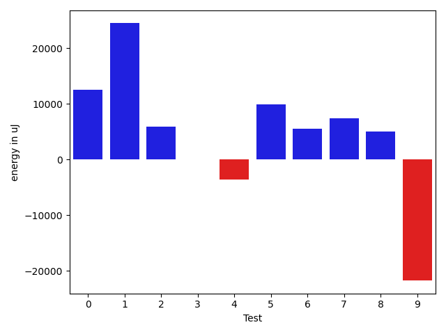
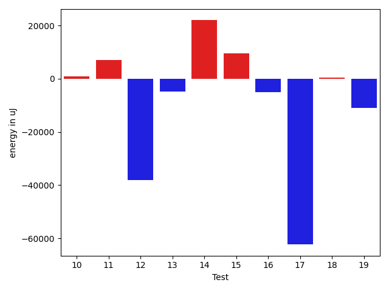
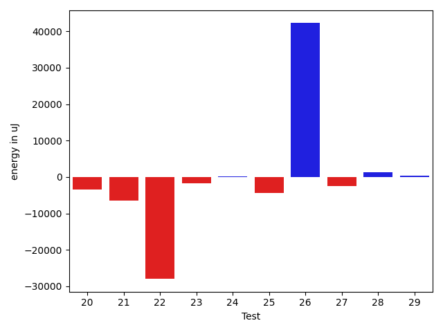
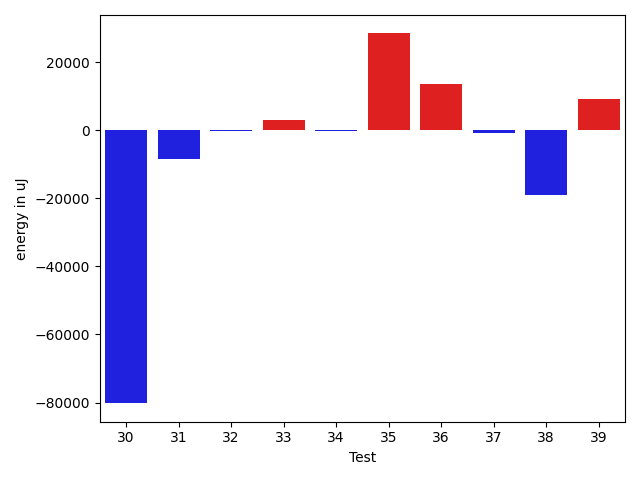
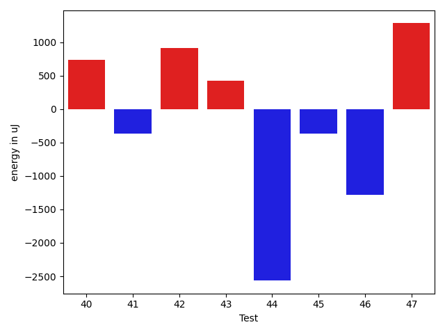
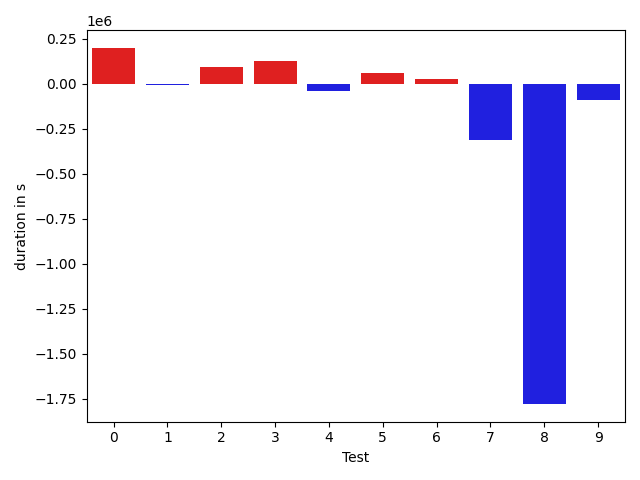
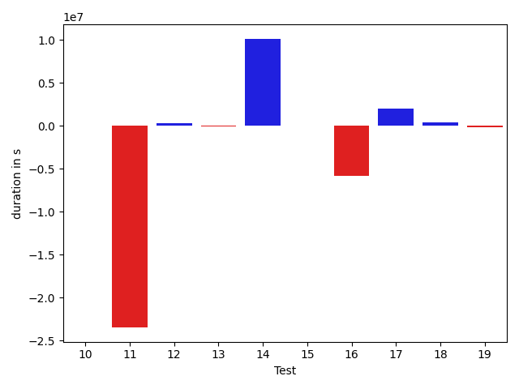
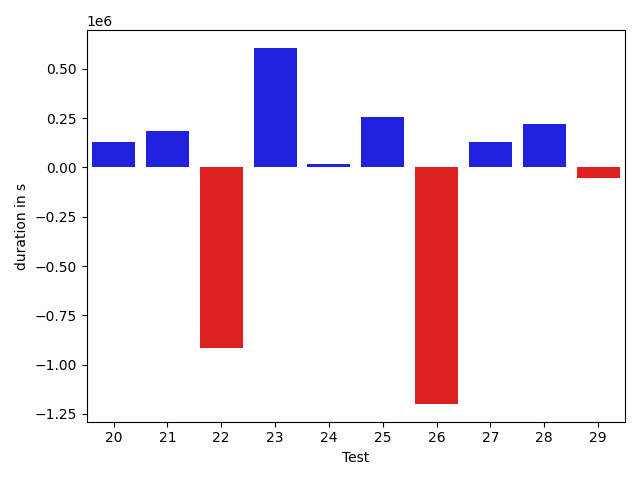
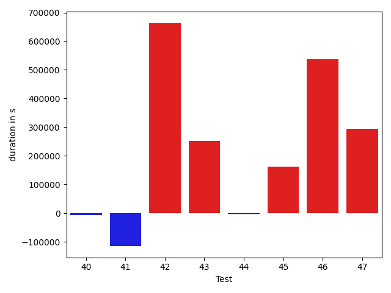

# gson 59edfc

https://github.com/google/gson/commit/59edfc

## Delta Energy per test method

| ID | EnergyV1 | EnergyV2 | DeltaEnergy |
| --- | --- | --- | --- |
| 0 | 40948.51181449493 | 53462.26493670727 | 12513.753122212343 |
| 1 | 41661.64236718354 | 66112.79237772727 | 24451.15001054373 |
| 2 | 35860.59218645377 | 41767.76511405911 | 5907.172927605345 |
| 3 | 36885.94177768816 | 36926.89269708609 | 40.95091939793201 |
| 4 | 44059.6119578057 | 40441.32310374129 | -3618.2888540644053 |
| 5 | 34343.516678766595 | 44183.43909314959 | 9839.922414382992 |
| 6 | 33394.96407346637 | 38872.4548549819 | 5477.490781515531 |
| 7 | 34846.14554373126 | 42205.191219722765 | 7359.045675991503 |
| 8 | 35959.37006082451 | 40955.11839801667 | 4995.748337192155 |
| 9 | 66485.27182511015 | 44716.162687930555 | -21769.109137179592 |
| 10 | 37156.78589078939 | 36048.60556632756 | -1108.1803244618277 |
| 11 | 914671.4373564173 | 106236.58573966661 | -808434.8516167507 |
| 12 | 54529.697937746474 | 65327.844901623146 | 10798.146963876672 |
| 13 | 39555.649518847466 | 39249.328624010086 | -306.32089483737946 |
| 14 | 96596.4325093765 | 413452.2241118883 | 316855.79160251183 |
| 15 | 40362.38698788862 | 41406.49825665048 | 1044.1112687618588 |
| 16 | 43058.14353714613 | 36400.521937250895 | -6657.621599895232 |
| 17 | 56905.98740775835 | 116814.22323920942 | 59908.235831451064 |
| 18 | 37538.16425217315 | 34218.35441545909 | -3319.8098367140556 |
| 19 | 46605.5642944801 | 40283.813047901975 | -6321.751246578126 |
| 20 | 38812.63357730148 | 35446.36567594076 | -3366.2679013607194 |
| 21 | 41843.76243215884 | 35325.29661262155 | -6518.46581953729 |
| 22 | 85854.31462054873 | 57895.12458154462 | -27959.190039004112 |
| 23 | 38712.56181683676 | 36903.02247099482 | -1809.5393458419348 |
| 24 | 38958.94490408018 | 39097.484442660076 | 138.53953857989836 |
| 25 | 42947.561537831345 | 38532.03015860026 | -4415.531379231084 |
| 26 | 46184.89858104631 | 88405.36145464586 | 42220.46287359954 |
| 27 | 45566.28197349858 | 43081.23106955804 | -2485.0509039405442 |
| 28 | 98031.31061753453 | 99338.8072842696 | 1307.4966667350673 |
| 29 | 39048.57305520773 | 39346.66783604465 | 298.09478083692375 |
| 30 | 39887.42952553727 | 43439.74617133234 | 3552.316645795072 |
| 31 | 44755.4928335759 | 71042.44792458945 | 26286.955091013544 |
| 32 | 193106.22445004378 | 829821.15823604 | 636714.9337859963 |
| 33 | 41672.93009983748 | 97045.53711950779 | 55372.60701967031 |
| 34 | 42202.949213027954 | 49526.26536548138 | 7323.316152453423 |
| 35 | 83054.6324023674 | 308630.1201389585 | 225575.4877365911 |
| 36 | 132987.05781860172 | 104540.30291163722 | -28446.754906964503 |
| 37 | 37323.57702790771 | 38368.492939237796 | 1044.9159113300848 |
| 38 | 133836.19363975525 | 42737.17579501867 | -91099.01784473658 |
| 39 | 40438.88453435898 | 38364.38996887207 | -2074.494565486908 |
| 40 | 37278.57928919792 | 44230.80611038208 | 6952.226821184158 |
| 41 | 62199.6423743114 | 137088.68378179637 | 74889.04140748497 |
| 42 | 38915.93583679199 | 37776.65719747543 | -1139.2786393165588 |
| 43 | 53626.16429519653 | 43279.53048706055 | -10346.633808135986 |
| 44 | 43602.44699309766 | 38129.76760772895 | -5472.679385368712 |
| 45 | 43159.194023499425 | 49384.177866167985 | 6224.98384266856 |
| 46 | 82404.45632819523 | 199752.5923787206 | 117348.13605052538 |
| 47 | 38281.17007765039 | 43023.113702548864 | 4741.943624898471 |

## Delta Duration per test method

| ID | DurationV1 | DurationsV2 | DeltaDuration |
| --- | --- | --- | --- |
| 0 | 814721.2400305329 | 1371452.0674650928 | 556730.8274345598 |
| 1 | 616277.4111702797 | 2308210.441092535 | 1691933.0299222553 |
| 2 | 955901.0700081796 | 888954.7290704685 | -66946.34093771118 |
| 3 | 743617.5235446652 | 713031.343941562 | -30586.1796031032 |
| 4 | 941565.9969204855 | 934021.9301580142 | -7544.066762471339 |
| 5 | 1251112.928672188 | 1073540.7718315478 | -177572.15684064012 |
| 6 | 1041401.29193927 | 747456.6473463336 | -293944.6445929364 |
| 7 | 1097693.7448890605 | 996003.6417329208 | -101690.10315613972 |
| 8 | 1245658.9039100213 | 690753.1146133547 | -554905.7892966666 |
| 9 | 1734714.3266734278 | 1471882.1378312507 | -262832.18884217716 |
| 10 | 1185255.020993742 | 1253765.4557216014 | 68510.43472785945 |
| 11 | 26914553.126392026 | 3442657.6808750415 | -23471895.445516985 |
| 12 | 1659479.7678292133 | 1929649.4859741284 | 270169.71814491507 |
| 13 | 634368.123826921 | 549224.2713291645 | -85143.85249775648 |
| 14 | 2402069.395226528 | 12528360.222073652 | 10126290.826847125 |
| 15 | 1048842.6041514655 | 1073898.9498868044 | 25056.345735338982 |
| 16 | 6844782.127344502 | 1062124.925592342 | -5782657.20175216 |
| 17 | 1936902.0381254388 | 3924396.40099083 | 1987494.362865391 |
| 18 | 671781.1585814798 | 1080020.7448973954 | 408239.58631591557 |
| 19 | 908234.9314357373 | 745765.5495430039 | -162469.3818927334 |
| 20 | 867428.2930648166 | 998270.1683334548 | 130841.87526863813 |
| 21 | 697968.7569972706 | 884540.367798663 | 186571.61080139235 |
| 22 | 2953577.0933504663 | 2038606.2705141674 | -914970.822836299 |
| 23 | 825912.6340822389 | 1432088.0663688378 | 606175.432286599 |
| 24 | 721586.4796954386 | 737843.1830171335 | 16256.703321694862 |
| 25 | 701030.4250525419 | 956857.0663766351 | 255826.64132409322 |
| 26 | 3488284.0621529357 | 2288800.3815906653 | -1199483.6805622703 |
| 27 | 1091494.3084019572 | 1221994.672742792 | 130500.36434083479 |
| 28 | 2682212.2225029385 | 2903404.4591704495 | 221192.23666751105 |
| 29 | 727980.9958868027 | 673101.1627749891 | -54879.833111813525 |
| 30 | 977413.3469745754 | 1005967.7229034656 | 28554.375928890193 |
| 31 | 1445427.1050944424 | 1895611.6798583919 | 450184.5747639495 |
| 32 | 5268008.071152626 | 22859371.57746029 | 17591363.50630766 |
| 33 | 547837.9977324307 | 2548908.3948699236 | 2001070.397137493 |
| 34 | 436509.8235874176 | 1063293.9568362236 | 626784.133248806 |
| 35 | 2478036.7143952716 | 10450903.411922324 | 7972866.697527053 |
| 36 | 4200971.180479264 | 3288268.2790702865 | -912702.9014089773 |
| 37 | 817867.3138023934 | 779897.3746818933 | -37969.939120500116 |
| 38 | 4548370.38586998 | 733471.8426769078 | -3814898.543193072 |
| 39 | 485031.5936207175 | 576090.5633239746 | 91058.96970325708 |
| 40 | 450744.57913303375 | 620239.2734298706 | 169494.69429683685 |
| 41 | 2206993.0404306226 | 3647175.6313708005 | 1440182.590940178 |
| 42 | 597034.0505599976 | 694465.682667613 | 97431.63210761547 |
| 43 | 1286477.4192371368 | 494688.5209350586 | -791788.8983020782 |
| 44 | 518262.3385238312 | 783169.4920756258 | 264907.1535517946 |
| 45 | 1185430.4987813586 | 1586581.098868053 | 401150.60008669435 |
| 46 | 2186049.092288432 | 6445853.801232541 | 4259804.708944108 |
| 47 | 1140861.1556559098 | 799631.8553367294 | -341229.30031918036 |

## Misc.

| ID | Test Class | Test Method |
| --- | --- | --- |
| 0 | com.google.gson.functional.ReadersWritersTest | testReadWriteTwoObjects |
| 1 | com.google.gson.functional.ReadersWritersTest | testWriterForSerialization |
| 2 | com.google.gson.functional.ObjectTest | testNestedSerialization |
| 3 | com.google.gson.functional.ObjectTest | testNullFieldsSerialization |
| 4 | com.google.gson.functional.ObjectTest | testBagOfPrimitiveWrappersSerialization |
| 5 | com.google.gson.functional.ObjectTest | testArrayOfArraysSerialization |
| 6 | com.google.gson.functional.ObjectTest | testBagOfPrimitivesSerialization |
| 7 | com.google.gson.functional.ObjectTest | testArrayOfObjectsAsFields |
| 8 | com.google.gson.functional.ObjectTest | testArrayOfObjectsSerialization |
| 9 | com.google.gson.JsonParserTest | testReadWriteTwoObjects |
| 10 | com.google.gson.functional.TypeVariableTest | testBasicTypeVariables |
| 11 | com.google.gson.functional.TypeVariableTest | testAdvancedTypeVariables |
| 12 | com.google.gson.functional.TypeVariableTest | testTypeVariablesViaTypeParameter |
| 13 | com.google.gson.OverrideCoreTypeAdaptersTest | testOverridePrimitiveBooleanAdapter |
| 14 | com.google.gson.OverrideCoreTypeAdaptersTest | testOverrideWrapperBooleanAdapter |
| 15 | com.google.gson.functional.ArrayTest | testObjectArrayWithNonPrimitivesSerialization |
| 16 | com.google.gson.functional.CollectionTest | testCollectionOfBagOfPrimitivesSerialization |
| 17 | com.google.gson.functional.CollectionTest | testWildcardCollectionField |
| 18 | com.google.gson.functional.CollectionTest | testRawCollectionSerialization |
| 19 | com.google.gson.functional.VersioningTest | testVersionedGsonWithUnversionedClassesSerialization |
| 20 | com.google.gson.functional.UncategorizedTest | testStaticFieldsAreNotSerialized |
| 21 | com.google.gson.functional.UncategorizedTest | testGsonInstanceReusableForSerializationAndDeserialization |
| 22 | com.google.gson.functional.MapAsArrayTypeAdapterTest | testSerializeComplexMapWithTypeAdapter |
| 23 | com.google.gson.functional.EscapingTest | testGsonAcceptsEscapedAndNonEscapedJsonDeserialization |
| 24 | com.google.gson.functional.EscapingTest | testGsonDoubleDeserialization |
| 25 | com.google.gson.functional.EscapingTest | testEscapingObjectFields |
| 26 | com.google.gson.functional.JsonTreeTest | testJsonTreeToString |
| 27 | com.google.gson.functional.JsonTreeTest | testToJsonTreeObjectType |
| 28 | com.google.gson.functional.JsonTreeTest | testToJsonTree |
| 29 | com.google.gson.functional.JsonTreeTest | testJsonTreeNull |
| 30 | com.google.gson.functional.PrettyPrintingTest | testPrettyPrintArrayOfObjects |
| 31 | com.google.gson.functional.PrettyPrintingTest | testPrettyPrintList |
| 32 | com.google.gson.functional.DefaultTypeAdaptersTest | testNullSerialization |
| 33 | com.google.gson.functional.PrimitiveTest | testPrimitiveBooleanAutoboxedInASingleElementArraySerialization |
| 34 | com.google.gson.functional.PrimitiveTest | testPrimitiveBooleanAutoboxedSerialization |
| 35 | com.google.gson.functional.PrintFormattingTest | testCompactFormattingLeavesNoWhiteSpace |
| 36 | com.google.gson.functional.ParameterizedTypesTest | testTypesWithMultipleParametersSerialization |
| 37 | com.google.gson.stream.JsonWriterTest | testDoubles |
| 38 | com.google.gson.stream.JsonWriterTest | testTopLevelValueTypes |
| 39 | com.google.gson.stream.JsonWriterTest | testPrettyPrintArray |
| 40 | com.google.gson.stream.JsonWriterTest | testPrettyPrintObject |
| 41 | com.google.gson.functional.DelegateTypeAdapterTest | testDelegateInvoked |
| 42 | com.google.gson.functional.MapTest | testWriteMapsWithEmptyStringKey |
| 43 | com.google.gson.internal.bind.JsonTreeWriterTest | testStrictNansAndInfinities |
| 44 | com.google.gson.internal.bind.JsonTreeWriterTest | testLenientNansAndInfinities |
| 45 | com.google.gson.functional.InheritanceTest | testSubClassSerialization |
| 46 | com.google.gson.functional.SecurityTest | testNonExecutableJsonSerialization |
| 47 | com.google.gson.functional.CustomTypeAdaptersTest | testCustomSerializerInvokedForPrimitives |

| Test | IterationV1 | IterationV2 | DeltaIteration |
| --- | --- | --- | --- |
| 0 | 70 | 69 | -1 |
| 1 | 49 | 47 | -2 |
| 2 | 50 | 54 | 4 |
| 3 | 43 | 37 | -6 |
| 4 | 49 | 52 | 3 |
| 5 | 82 | 83 | 1 |
| 6 | 39 | 36 | -3 |
| 7 | 66 | 74 | 8 |
| 8 | 49 | 56 | 7 |
| 9 | 77 | 75 | -2 |
| 10 | 63 | 60 | -3 |
| 11 | 99 | 99 | 0 |
| 12 | 91 | 90 | -1 |
| 13 | 24 | 24 | 0 |
| 14 | 54 | 60 | 6 |
| 15 | 61 | 56 | -5 |
| 16 | 47 | 58 | 11 |
| 17 | 83 | 93 | 10 |
| 18 | 38 | 50 | 12 |
| 19 | 48 | 52 | 4 |
| 20 | 42 | 34 | -8 |
| 21 | 38 | 38 | 0 |
| 22 | 99 | 99 | 0 |
| 23 | 52 | 59 | 7 |
| 24 | 40 | 41 | 1 |
| 25 | 51 | 53 | 2 |
| 26 | 78 | 77 | -1 |
| 27 | 57 | 60 | 3 |
| 28 | 61 | 47 | -14 |
| 29 | 25 | 35 | 10 |
| 30 | 62 | 60 | -2 |
| 31 | 92 | 95 | 3 |
| 32 | 99 | 99 | 0 |
| 33 | 27 | 24 | -3 |
| 34 | 20 | 24 | 4 |
| 35 | 80 | 79 | -1 |
| 36 | 99 | 99 | 0 |
| 37 | 46 | 50 | 4 |
| 38 | 20 | 25 | 5 |
| 39 | 25 | 17 | -8 |
| 40 | 23 | 19 | -4 |
| 41 | 98 | 98 | 0 |
| 42 | 18 | 24 | 6 |
| 43 | 20 | 18 | -2 |
| 44 | 29 | 30 | 1 |
| 45 | 89 | 85 | -4 |
| 46 | 35 | 39 | 4 |
| 47 | 46 | 45 | -1 |

| Time Label | Time (s) |
| --- | --- |
| Selection | 34.17454481124878 |
| Injection | 16.574002265930176 |
| Total | 1417.7748398780823 |

