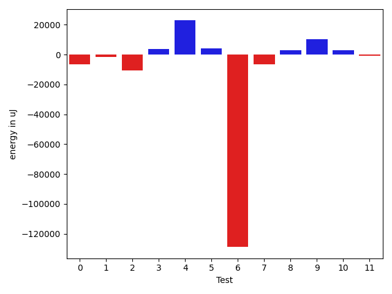
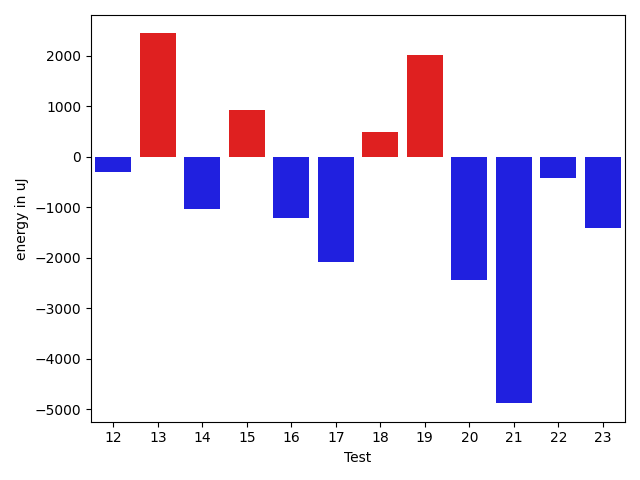
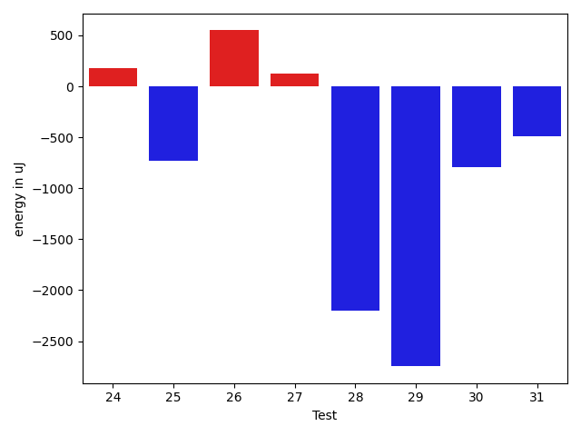
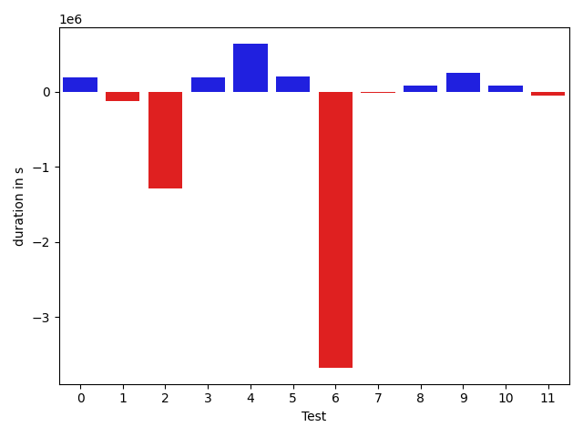
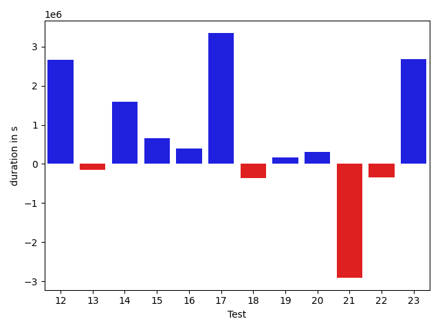
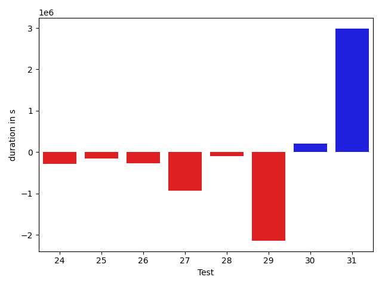

# gson ab4046

https://github.com/google/gson/commit/ab4046

## Delta Energy per test method

| ID | EnergyV1 | EnergyV2 | DeltaEnergy |
| --- | --- | --- | --- |
| 0 | 45958.22281640854 | 39595.26846185232 | -6362.954354556219 |
| 1 | 43579.12604841334 | 42099.8047879858 | -1479.3212604275395 |
| 2 | 180751.94587462928 | 170167.14940127122 | -10584.79647335806 |
| 3 | 42634.33056565458 | 46322.2063291073 | 3687.875763452721 |
| 4 | 48787.77194850964 | 71588.6041766358 | 22800.832228126157 |
| 5 | 39617.29887306498 | 43801.331144718 | 4184.032271653021 |
| 6 | 172360.30264409844 | 43528.35575388698 | -128831.94689021146 |
| 7 | 46681.08435901166 | 40295.21308346717 | -6385.871275544487 |
| 8 | 43178.81425782862 | 45982.22451525826 | 2803.410257429641 |
| 9 | 42124.3169226719 | 52316.14482737104 | 10191.827904699145 |
| 10 | 41217.906628072546 | 44276.32803304888 | 3058.4214049763323 |
| 11 | 36996.11502849232 | 36060.74102920276 | -935.3739992895571 |
| 12 | 39721.549699579286 | 98522.26952027192 | 58800.71982069263 |
| 13 | 34454.8777474025 | 42491.16378635442 | 8036.286038951919 |
| 14 | 53950.230835486844 | 93522.3171997018 | 39572.08636421496 |
| 15 | 43520.69834615958 | 46043.704414408 | 2523.006068248418 |
| 16 | 40361.6721807568 | 36873.0554342496 | -3488.6167465071994 |
| 17 | 41514.08316426486 | 60897.611231770476 | 19383.528067505613 |
| 18 | 49945.62890376203 | 42012.94173315304 | -7932.687170608988 |
| 19 | 38556.13066034354 | 38822.82985757373 | 266.6991972301912 |
| 20 | 44371.0919283903 | 40299.39235832014 | -4071.699570070159 |
| 21 | 99857.37378110165 | 43094.00694296958 | -56763.36683813207 |
| 22 | 34119.79706316197 | 43223.06347432762 | 9103.266411165649 |
| 23 | 38917.624175222656 | 166249.9831441873 | 127332.35896896466 |
| 24 | 121746.38229129737 | 103586.5692941091 | -18159.812997188274 |
| 25 | 49134.60750240119 | 40150.16346185224 | -8984.444040548951 |
| 26 | 36566.82139928425 | 45215.69809748429 | 8648.876698200038 |
| 27 | 56059.41126606833 | 37171.74839572031 | -18887.662870348024 |
| 28 | 43437.18356199171 | 39722.238967079764 | -3714.944594911947 |
| 29 | 122393.2223393851 | 61204.924276640624 | -61188.29806274448 |
| 30 | 43273.400614998274 | 43826.21269729252 | 552.8120822942437 |
| 31 | 43160.349216901464 | 59804.88910048257 | 16644.539883581107 |

## Delta Duration per test method

| ID | DurationV1 | DurationsV2 | DeltaDuration |
| --- | --- | --- | --- |
| 0 | 770837.9001850423 | 965641.1208136543 | 194803.22062861198 |
| 1 | 734758.9051947899 | 616261.2308214579 | -118497.67437333195 |
| 2 | 5080615.888612514 | 3791007.6866065767 | -1289608.2020059377 |
| 3 | 855816.8035841554 | 1047855.8513585643 | 192039.04777440894 |
| 4 | 1405609.9177835272 | 2049155.446081059 | 643545.5282975319 |
| 5 | 967474.5492817843 | 1167958.2068779953 | 200483.65759621095 |
| 6 | 5222558.994349603 | 1546454.6405236095 | -3676104.353825993 |
| 7 | 1001716.0852701461 | 984653.9970389765 | -17062.08823116962 |
| 8 | 1162567.2592443312 | 1245568.7499921438 | 83001.49074781267 |
| 9 | 1164052.481629834 | 1413609.095311849 | 249556.61368201487 |
| 10 | 1366082.9521764768 | 1446646.2896759692 | 80563.33749949234 |
| 11 | 793921.0675199811 | 747358.3340363407 | -46562.73348364036 |
| 12 | 890861.0160965439 | 3557060.0432765237 | 2666199.0271799797 |
| 13 | 916789.2317792815 | 760514.822037146 | -156274.40974213555 |
| 14 | 1335352.1882741498 | 2929402.188667914 | 1594050.000393764 |
| 15 | 1213401.404402471 | 1866772.9312338526 | 653371.5268313817 |
| 16 | 669068.7802515852 | 1060737.2931377962 | 391668.51288621104 |
| 17 | 1078671.41832405 | 4426463.447255531 | 3347792.0289314813 |
| 18 | 1163422.4891672046 | 796732.9951267272 | -366689.49404047744 |
| 19 | 772547.7553669248 | 935603.0308708511 | 163055.27550392633 |
| 20 | 626492.685756897 | 930711.6351530339 | 304218.9493961369 |
| 21 | 3723821.827418336 | 816549.2363264866 | -2907272.59109185 |
| 22 | 948457.5444310677 | 602514.3733358464 | -345943.1710952213 |
| 23 | 1089857.5164994975 | 3772377.081120599 | 2682519.5646211016 |
| 24 | 4114969.6598947174 | 3826948.5590879964 | -288021.100806721 |
| 25 | 1480685.234998349 | 1324571.7983046663 | -156113.4366936828 |
| 26 | 1519280.7537610729 | 1245433.1021624845 | -273847.65159858833 |
| 27 | 1876769.365752131 | 937742.6950578617 | -939026.6706942692 |
| 28 | 1176237.2897967356 | 1082945.0200319462 | -93292.26976478938 |
| 29 | 4009494.7629130706 | 1867546.801395923 | -2141947.9615171477 |
| 30 | 889540.6070679526 | 1099382.997599686 | 209842.3905317334 |
| 31 | 766164.3231720148 | 3753789.2884129304 | 2987624.965240916 |

## Misc.

| ID | Test Class | Test Method |
| --- | --- | --- |
| 0 | com.google.gson.functional.StreamingTypeAdaptersTest | testFromJsonTree |
| 1 | com.google.gson.functional.StreamingTypeAdaptersTest | testDeserialize |
| 2 | com.google.gson.functional.RuntimeTypeAdapterFactoryFunctionalTest | testSubclassesAutomaticallySerialzed |
| 3 | com.google.gson.functional.CustomDeserializerTest | testCustomDeserializerReturnsNull |
| 4 | com.google.gson.functional.JsonAdapterAnnotationOnFieldsTest | testClassAnnotationAdapterFactoryTakesPrecedenceOverDefault |
| 5 | com.google.gson.functional.JsonAdapterAnnotationOnFieldsTest | testJsonAdapterWrappedInNullSafeAsRequested |
| 6 | com.google.gson.functional.JsonAdapterAnnotationOnFieldsTest | testClassAnnotationAdapterTakesPrecedenceOverDefault |
| 7 | com.google.gson.functional.JsonAdapterAnnotationOnFieldsTest | testRegisteredTypeAdapterTakesPrecedenceOverClassAnnotationAdapter |
| 8 | com.google.gson.functional.JsonAdapterAnnotationOnFieldsTest | testFieldAnnotationTakesPrecedenceOverClassAnnotation |
| 9 | com.google.gson.functional.JsonAdapterAnnotationOnFieldsTest | testJsonAdapterInvokedOnlyForAnnotatedFields |
| 10 | com.google.gson.functional.JsonAdapterAnnotationOnFieldsTest | testFieldAnnotationTakesPrecedenceOverRegisteredTypeAdapter |
| 11 | com.google.gson.functional.DefaultTypeAdaptersTest | testBigIntegerFieldDeserialization |
| 12 | com.google.gson.functional.DefaultTypeAdaptersTest | testBigDecimalFieldDeserialization |
| 13 | com.google.gson.functional.DefaultTypeAdaptersTest | testBadValueForBigDecimalDeserialization |
| 14 | com.google.gson.functional.InheritanceTest | testSubClassDeserialization |
| 15 | com.google.gson.functional.InheritanceTest | testSubInterfacesOfCollectionDeserialization |
| 16 | com.google.gson.functional.NamingPolicyTest | testGsonWithUpperCamelCaseSpacesPolicyDeserialiation |
| 17 | com.google.gson.functional.NamingPolicyTest | testComplexFieldNameStrategy |
| 18 | com.google.gson.functional.NamingPolicyTest | testGsonWithNonDefaultFieldNamingPolicyDeserialiation |
| 19 | com.google.gson.functional.NamingPolicyTest | testGsonWithLowerCaseUnderscorePolicyDeserialiation |
| 20 | com.google.gson.functional.NamingPolicyTest | testGsonWithLowerCaseDashPolicyDeserialiation |
| 21 | com.google.gson.functional.SerializedNameTest | testMultipleNamesDeserializedCorrectly |
| 22 | com.google.gson.functional.SerializedNameTest | testMultipleNamesInTheSameString |
| 23 | com.google.gson.functional.InstanceCreatorTest | testInstanceCreatorReturnsSubTypeForField |
| 24 | com.google.gson.regression.JsonAdapterNullSafeTest | testNullSafeBugDeserialize |
| 25 | com.google.gson.functional.CollectionTest | testSetDeserialization |
| 26 | com.google.gson.functional.CollectionTest | testWildcardCollectionField |
| 27 | com.google.gson.functional.MapTest | testComplexKeysDeserialization |
| 28 | com.google.gson.functional.CustomTypeAdaptersTest | testEnsureCustomDeserializerNotInvokedForNullValues |
| 29 | com.google.gson.functional.ObjectTest | testBagOfPrimitiveWrappersDeserialization |
| 30 | com.google.gson.functional.ExposeFieldsTest | testExposeAnnotationDeserialization |
| 31 | com.google.gson.functional.ExposeFieldsTest | testExposedInterfaceFieldDeserialization |

| Test | IterationV1 | IterationV2 | DeltaIteration |
| --- | --- | --- | --- |
| 0 | 45 | 48 | 3 |
| 1 | 33 | 40 | 7 |
| 2 | 99 | 99 | 0 |
| 3 | 64 | 63 | -1 |
| 4 | 99 | 97 | -2 |
| 5 | 74 | 66 | -8 |
| 6 | 96 | 99 | 3 |
| 7 | 72 | 67 | -5 |
| 8 | 89 | 90 | 1 |
| 9 | 82 | 82 | 0 |
| 10 | 94 | 96 | 2 |
| 11 | 51 | 36 | -15 |
| 12 | 48 | 42 | -6 |
| 13 | 36 | 42 | 6 |
| 14 | 43 | 75 | 32 |
| 15 | 88 | 91 | 3 |
| 16 | 41 | 42 | 1 |
| 17 | 81 | 78 | -3 |
| 18 | 36 | 49 | 13 |
| 19 | 49 | 43 | -6 |
| 20 | 38 | 37 | -1 |
| 21 | 48 | 58 | 10 |
| 22 | 35 | 51 | 16 |
| 23 | 64 | 65 | 1 |
| 24 | 55 | 48 | -7 |
| 25 | 80 | 78 | -2 |
| 26 | 95 | 94 | -1 |
| 27 | 69 | 65 | -4 |
| 28 | 56 | 62 | 6 |
| 29 | 55 | 41 | -14 |
| 30 | 51 | 41 | -10 |
| 31 | 34 | 43 | 9 |

| Time Label | Time (s) |
| --- | --- |
| Selection | 33.937209129333496 |
| Injection | 16.208680629730225 |
| Total | 1401.6803324222565 |

