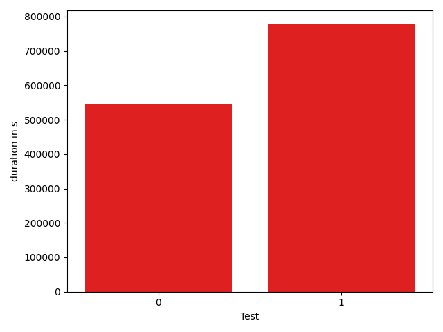

# gson 0669ff

https://github.com/google/gson/commit/0669ff

## Delta Energy per test method

| ID | EnergyV1 | EnergyV2 | DeltaEnergy |
| --- | --- | --- | --- |
| 0 | 119355.25677809931 | 141139.70827164696 | 21784.451493547647 |
| 1 | 56127.337546961186 | 238426.38629313678 | 182299.0487461756 |

## Delta Duration per test method

| ID | DurationV1 | DurationsV2 | DeltaDuration |
| --- | --- | --- | --- |
| 0 | 4410358.0545712765 | 5579805.87669236 | 1169447.8221210837 |
| 1 | 2237141.057390306 | 8104816.311554405 | 5867675.254164099 |

## Misc.

| ID | Test Class | Test Method |
| --- | --- | --- |
| 0 | com.google.gson.functional.JavaUtilConcurrentAtomicTest | testAtomicLongWithStringSerializationPolicy |
| 1 | com.google.gson.functional.JavaUtilConcurrentAtomicTest | testAtomicLongArrayWithStringSerializationPolicy |

| Test | IterationV1 | IterationV2 | DeltaIteration |
| --- | --- | --- | --- |
| 0 | 99 | 99 | 0 |
| 1 | 81 | 81 | 0 |

| Time Label | Time (s) |
| --- | --- |
| Selection | 34.60511898994446 |
| Injection | 12.798816919326782 |
| Total | 1317.2360339164734 |

