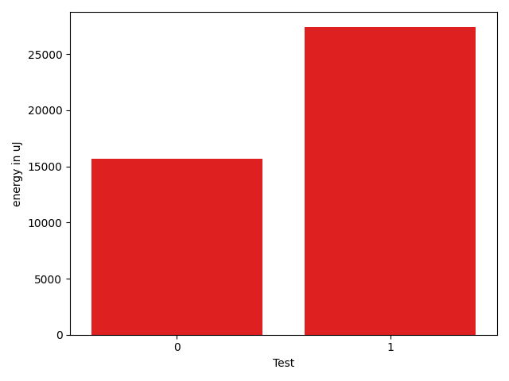

# gson 0669ff

https://github.com/google/gson/commit/0669ff

## Delta Energy per test method

| ID | EnergyV1 | EnergyV2 | DeltaEnergy | σV1 | σV2 |
| --- | --- | --- | --- | --- | --- |
| 0 | 114298.80808080808 | 129997.15151515152 | 15698.343434343435 | 94363.24004789632 | 109977.93271042999 |
| 1 | 136579.67901234567 | 163966.40740740742 | 27386.728395061742 | 162274.20070201307 | 180272.38786777656 |

## Delta Duration per test method

| ID | DurationV1 | DurationsV2 | DeltaDuration |
| --- | --- | --- | --- |
| 0 | 4163633.474747475 | 4709578.303030303 | 545944.828282828 |
| 1 | 4857359.185185186 | 5636337.8271604935 | 778978.6419753078 |

## Misc.

| ID | Test Class | Test Method |
| --- | --- | --- |
| 0 | com.google.gson.functional.JavaUtilConcurrentAtomicTest | testAtomicLongWithStringSerializationPolicy |
| 1 | com.google.gson.functional.JavaUtilConcurrentAtomicTest | testAtomicLongArrayWithStringSerializationPolicy |

| Test | IterationV1 | IterationV2 | DeltaIteration |
| --- | --- | --- | --- |
| 0 | 99 | 99 | 0 |
| 1 | 81 | 81 | 0 |

| Time Label | Time (s) |
| --- | --- |
| Selection | 34.60511898994446 |
| Injection | 12.798816919326782 |
| Total | 1317.2360339164734 |

