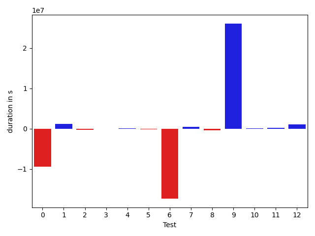

# gson c731ab

https://github.com/google/gson/commit/c731ab

## Delta Energy per test method

| ID | EnergyV1 | EnergyV2 | DeltaEnergy | σ |
| --- | --- | --- | --- | --- |
| 0 | 558909.8181818182 | 413443.63636363635 | -145466.18181818188 | 796979.7273521646 | 670932.8376662586 |
| 1 | 35890.8125 | 36639.112676056335 | 748.3001760563347 | 6836.083601181583 | 13595.42485549417 |
| 2 | 51005.295918367345 | 61963.68041237113 | 10958.384494003789 | 35389.31737991726 | 168165.44653648496 |
| 3 | 39814.9381443299 | 38421.18947368421 | -1393.7486706456912 | 11412.437397725282 | 11574.844677639012 |
| 4 | 34897.417721518985 | 33573.41891891892 | -1323.9988026000647 | 5739.224608254127 | 4767.306965456002 |
| 5 | 60517.2 | 60170.0 | -347.1999999999971 | 199314.95818200233 | 197428.33497351335 |
| 6 | 545705.8787878788 | 402150.9191919192 | -143554.95959595958 | 367024.53255998314 | 365896.6750951011 |
| 7 | 44402.62626262626 | 52000.020202020205 | 7597.393939393944 | 16007.42214186897 | 20610.913364447577 |
| 8 | 394933.0888888889 | 65574.97674418605 | -329358.1121447028 | 731663.5994764055 | 187997.23075700286 |
| 9 | 304063.48484848486 | 389816.4791666667 | 85752.99431818182 | 653133.8919376824 | 719799.7802801798 |
| 10 | 38593.208333333336 | 36700.948453608245 | -1892.2598797250903 | 22102.192378018313 | 10121.21978648894 |
| 11 | 95542.34020618557 | 49396.22680412371 | -46146.11340206186 | 298572.1708955408 | 23496.462181825627 |
| 12 | 37216.36734693877 | 50070.5 | 12854.132653061228 | 9690.084899259251 | 21593.778132738105 |

## Delta Duration per test method

| ID | DurationV1 | DurationsV2 | DeltaDuration |
| --- | --- | --- | --- |
| 0 | 16323111.04040404 | 12749024.525252525 | -3574086.5151515156 |
| 1 | 1155613.4 | 1173152.2112676057 | 17538.81126760575 |
| 2 | 1813060.693877551 | 2241375.092783505 | 428314.3989059541 |
| 3 | 1491375.5670103093 | 1460814.5578947368 | -30561.009115572553 |
| 4 | 1220062.759493671 | 1207879.7027027027 | -12183.05679096817 |
| 5 | 1908103.1 | 1843229.7068965517 | -64873.39310344844 |
| 6 | 17129509.585858587 | 12741674.848484848 | -4387834.7373737395 |
| 7 | 1685487.4040404041 | 1868679.7676767677 | 183192.36363636353 |
| 8 | 11971987.51111111 | 2121194.5581395347 | -9850792.952971576 |
| 9 | 9174250.414141415 | 12061299.052083334 | 2887048.6379419193 |
| 10 | 1478891.0833333333 | 1443549.4639175257 | -35341.61941580754 |
| 11 | 3133102.4226804124 | 1811379.6597938144 | -1321722.762886598 |
| 12 | 1473349.7551020407 | 1843399.6836734693 | 370049.92857142864 |

## Misc.

| ID | Test Class | Test Method |
| --- | --- | --- |
| 0 | com.google.gson.functional.JsonAdapterAnnotationOnClassesTest | testJsonAdapterInvoked |
| 1 | com.google.gson.functional.JsonAdapterAnnotationOnClassesTest | testRegisteredDeserializerOverridesJsonAdapter |
| 2 | com.google.gson.functional.JsonAdapterAnnotationOnClassesTest | testRegisteredSerializerOverridesJsonAdapter |
| 3 | com.google.gson.functional.JsonAdapterAnnotationOnClassesTest | testJsonAdapterFactoryInvoked |
| 4 | com.google.gson.functional.JsonAdapterAnnotationOnClassesTest | testNullSafeObjectFromJson |
| 5 | com.google.gson.functional.JsonAdapterAnnotationOnClassesTest | testIncorrectTypeAdapterFails |
| 6 | com.google.gson.functional.RuntimeTypeAdapterFactoryFunctionalTest | testSubclassesAutomaticallySerialzed |
| 7 | com.google.gson.functional.JsonAdapterAnnotationOnFieldsTest | testClassAnnotationAdapterFactoryTakesPrecedenceOverDefault |
| 8 | com.google.gson.functional.JsonAdapterAnnotationOnFieldsTest | testJsonAdapterWrappedInNullSafeAsRequested |
| 9 | com.google.gson.functional.JsonAdapterAnnotationOnFieldsTest | testClassAnnotationAdapterTakesPrecedenceOverDefault |
| 10 | com.google.gson.functional.JsonAdapterAnnotationOnFieldsTest | testFieldAnnotationTakesPrecedenceOverClassAnnotation |
| 11 | com.google.gson.functional.JsonAdapterAnnotationOnFieldsTest | testJsonAdapterInvokedOnlyForAnnotatedFields |
| 12 | com.google.gson.functional.JsonAdapterAnnotationOnFieldsTest | testFieldAnnotationTakesPrecedenceOverRegisteredTypeAdapter |

| Test | IterationV1 | IterationV2 | DeltaIteration |
| --- | --- | --- | --- |
| 0 | 99 | 99 | 0 |
| 1 | 80 | 71 | -9 |
| 2 | 98 | 97 | -1 |
| 3 | 97 | 95 | -2 |
| 4 | 79 | 74 | -5 |
| 5 | 60 | 58 | -2 |
| 6 | 99 | 99 | 0 |
| 7 | 99 | 99 | 0 |
| 8 | 90 | 86 | -4 |
| 9 | 99 | 96 | -3 |
| 10 | 96 | 97 | 1 |
| 11 | 97 | 97 | 0 |
| 12 | 98 | 98 | 0 |

| Time Label | Time (s) |
| --- | --- |
| Selection | 32.84650230407715 |
| Injection | 13.991409063339233 |
| Total | 1330.7629101276398 |

