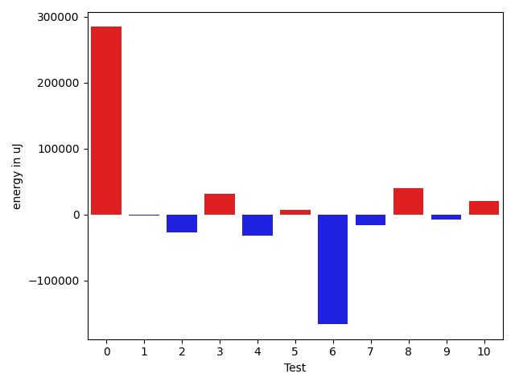
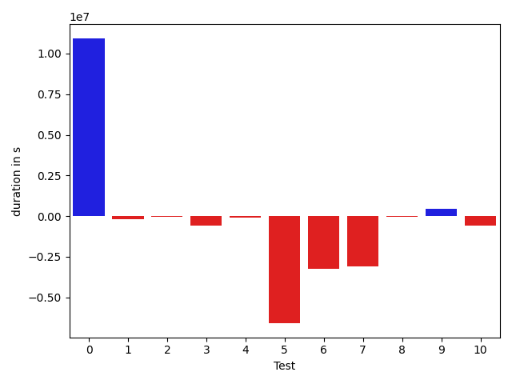

# gson 2ab776

https://github.com/google/gson/commit/2ab776

## Delta Energy per test method

| ID | EnergyV1 | EnergyV2 | DeltaEnergy |
| --- | --- | --- | --- |
| 0 | 549000.622769272 | 936528.1247524593 | 387527.5019831874 |
| 1 | 32159.809650186886 | 33547.31148548001 | 1387.501835293122 |
| 2 | 44830.393226736174 | 49285.83236650863 | 4455.439139772454 |
| 3 | 56484.71641880154 | 38697.83630405544 | -17786.880114746098 |
| 4 | 33013.02834726426 | 35727.7699270875 | 2714.7415798232396 |
| 5 | 469176.60005095485 | 335680.4576953614 | -133496.14235559345 |
| 6 | 188883.06520876475 | 51104.258470633155 | -137778.8067381316 |
| 7 | 198604.22210000045 | 98023.05205017718 | -100581.17004982327 |
| 8 | 35508.14890487047 | 36208.022480376916 | 699.8735755064481 |
| 9 | 34010.202339347845 | 34455.8911111575 | 445.688771809655 |
| 10 | 55891.751829273286 | 36994.11717402725 | -18897.634655246038 |

## Delta Duration per test method

| ID | DurationV1 | DurationsV2 | DeltaDuration |
| --- | --- | --- | --- |
| 0 | 15687280.506071445 | 26620145.741268516 | 10932865.235197071 |
| 1 | 1352983.9096774892 | 1164180.1235459698 | -188803.78613151936 |
| 2 | 1832129.0052514048 | 1799216.8745226078 | -32912.130728797056 |
| 3 | 1515609.4677902283 | 948446.3741706475 | -567163.0936195808 |
| 4 | 1372545.2275977288 | 1306004.403841722 | -66540.82375600678 |
| 5 | 17031174.930983894 | 10449549.936953027 | -6581624.994030867 |
| 6 | 5584381.945239514 | 2350178.918164755 | -3234203.027074759 |
| 7 | 5816552.878317208 | 2715016.7173745288 | -3101536.1609426793 |
| 8 | 1057911.067325664 | 1016205.7707117781 | -41705.296613885905 |
| 9 | 1161413.0228467342 | 1602016.2217482491 | 440603.198901515 |
| 10 | 1939125.450470015 | 1370335.1902385615 | -568790.2602314535 |

## Misc.

| ID | Test Class | Test Method |
| --- | --- | --- |
| 0 | com.google.gson.functional.JsonAdapterAnnotationOnClassesTest | testJsonAdapterInvoked |
| 1 | com.google.gson.functional.JsonAdapterAnnotationOnClassesTest | testRegisteredDeserializerOverridesJsonAdapter |
| 2 | com.google.gson.functional.JsonAdapterAnnotationOnClassesTest | testRegisteredSerializerOverridesJsonAdapter |
| 3 | com.google.gson.functional.JsonAdapterAnnotationOnClassesTest | testIncorrectTypeAdapterFails |
| 4 | com.google.gson.functional.JsonAdapterAnnotationOnClassesTest | testJsonAdapterFactoryInvoked |
| 5 | com.google.gson.functional.RuntimeTypeAdapterFactoryFunctionalTest | testSubclassesAutomaticallySerialzed |
| 6 | com.google.gson.functional.JsonAdapterAnnotationOnFieldsTest | testClassAnnotationAdapterFactoryTakesPrecedenceOverDefault |
| 7 | com.google.gson.functional.JsonAdapterAnnotationOnFieldsTest | testClassAnnotationAdapterTakesPrecedenceOverDefault |
| 8 | com.google.gson.functional.JsonAdapterAnnotationOnFieldsTest | testFieldAnnotationTakesPrecedenceOverClassAnnotation |
| 9 | com.google.gson.functional.JsonAdapterAnnotationOnFieldsTest | testJsonAdapterInvokedOnlyForAnnotatedFields |
| 10 | com.google.gson.functional.JsonAdapterAnnotationOnFieldsTest | testFieldAnnotationTakesPrecedenceOverRegisteredTypeAdapter |

| Test | IterationV1 | IterationV2 | DeltaIteration |
| --- | --- | --- | --- |
| 0 | 99 | 99 | 0 |
| 1 | 78 | 76 | -2 |
| 2 | 98 | 99 | 1 |
| 3 | 47 | 44 | -3 |
| 4 | 92 | 94 | 2 |
| 5 | 99 | 99 | 0 |
| 6 | 99 | 98 | -1 |
| 7 | 86 | 84 | -2 |
| 8 | 66 | 66 | 0 |
| 9 | 91 | 80 | -11 |
| 10 | 96 | 97 | 1 |

| Time Label | Time (s) |
| --- | --- |
| Selection | 28.886191368103027 |
| Injection | 11.209639549255371 |
| Total | 1025.2274305820465 |

