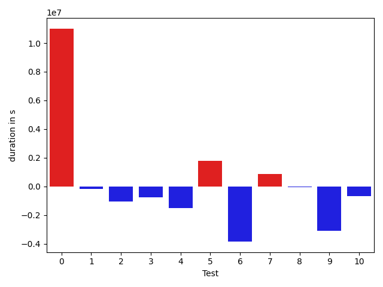

# gson 23e291

https://github.com/google/gson/commit/23e291

## Delta Energy per test method

| ID | EnergyV1 | EnergyV2 | DeltaEnergy |
| --- | --- | --- | --- |
| 0 | 1190796.1057154196 | 328185.664199442 | -862610.4415159776 |
| 1 | 33966.76367039654 | 33739.864949323135 | -226.8987210734049 |
| 2 | 105750.78917626488 | 61330.383436827746 | -44420.405739437134 |
| 3 | 31835.430464769306 | 32580.40130162398 | 744.9708368546744 |
| 4 | 32370.60575538411 | 58739.279619126886 | 26368.673863742777 |
| 5 | 237636.2186121143 | 553462.8944962833 | 315826.67588416894 |
| 6 | 93581.41699759179 | 39789.988188915115 | -53791.428808676676 |
| 7 | 161111.2522702426 | 262473.2634564389 | 101362.0111861963 |
| 8 | 36281.823565494735 | 35569.58914406785 | -712.2344214268815 |
| 9 | 64096.48173562408 | 37454.97353435661 | -26641.50820126747 |
| 10 | 33030.916313072965 | 37422.72903728906 | 4391.812724216092 |

## Delta Duration per test method

| ID | DurationV1 | DurationsV2 | DeltaDuration |
| --- | --- | --- | --- |
| 0 | 35723472.90677716 | 9903886.212402124 | -25819586.694375034 |
| 1 | 1419169.1989154364 | 1127522.8656045562 | -291646.33331088023 |
| 2 | 3389072.4348819354 | 2071310.1779619867 | -1317762.2569199486 |
| 3 | 898206.0865189994 | 800302.3882647029 | -97903.69825429656 |
| 4 | 1577278.378852265 | 1888493.4454396274 | 311215.06658736244 |
| 5 | 7542620.291284401 | 16961892.962031025 | 9419272.670746624 |
| 6 | 2640027.6593884956 | 1419066.3823895957 | -1220961.2769988999 |
| 7 | 5178987.773424408 | 8913896.883303253 | 3734909.1098788446 |
| 8 | 1110501.2795593056 | 1034641.5505739527 | -75859.72898535291 |
| 9 | 2487694.5269336035 | 1307425.3148781087 | -1180269.2120554948 |
| 10 | 1316226.7455852297 | 1363676.4971745808 | 47449.7515893511 |

## Misc.

| ID | Test Class | Test Method |
| --- | --- | --- |
| 0 | com.google.gson.functional.JsonAdapterAnnotationOnClassesTest | testJsonAdapterInvoked |
| 1 | com.google.gson.functional.JsonAdapterAnnotationOnClassesTest | testRegisteredDeserializerOverridesJsonAdapter |
| 2 | com.google.gson.functional.JsonAdapterAnnotationOnClassesTest | testRegisteredSerializerOverridesJsonAdapter |
| 3 | com.google.gson.functional.JsonAdapterAnnotationOnClassesTest | testIncorrectTypeAdapterFails |
| 4 | com.google.gson.functional.JsonAdapterAnnotationOnClassesTest | testJsonAdapterFactoryInvoked |
| 5 | com.google.gson.functional.RuntimeTypeAdapterFactoryFunctionalTest | testSubclassesAutomaticallySerialzed |
| 6 | com.google.gson.functional.JsonAdapterAnnotationOnFieldsTest | testClassAnnotationAdapterFactoryTakesPrecedenceOverDefault |
| 7 | com.google.gson.functional.JsonAdapterAnnotationOnFieldsTest | testClassAnnotationAdapterTakesPrecedenceOverDefault |
| 8 | com.google.gson.functional.JsonAdapterAnnotationOnFieldsTest | testFieldAnnotationTakesPrecedenceOverClassAnnotation |
| 9 | com.google.gson.functional.JsonAdapterAnnotationOnFieldsTest | testJsonAdapterInvokedOnlyForAnnotatedFields |
| 10 | com.google.gson.functional.JsonAdapterAnnotationOnFieldsTest | testFieldAnnotationTakesPrecedenceOverRegisteredTypeAdapter |

| Test | IterationV1 | IterationV2 | DeltaIteration |
| --- | --- | --- | --- |
| 0 | 98 | 99 | 1 |
| 1 | 78 | 73 | -5 |
| 2 | 97 | 99 | 2 |
| 3 | 53 | 46 | -7 |
| 4 | 94 | 90 | -4 |
| 5 | 99 | 99 | 0 |
| 6 | 99 | 99 | 0 |
| 7 | 82 | 82 | 0 |
| 8 | 67 | 68 | 1 |
| 9 | 92 | 83 | -9 |
| 10 | 99 | 96 | -3 |

| Time Label | Time (s) |
| --- | --- |
| Selection | 28.727761030197144 |
| Injection | 11.051305055618286 |
| Total | 1023.2331235408783 |

