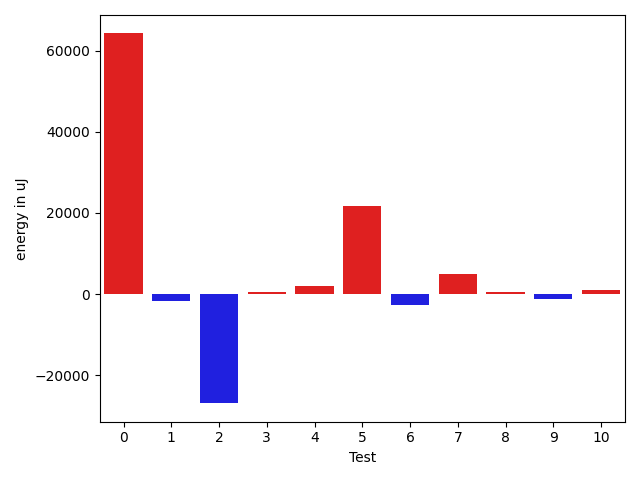

# gson 23e291

https://github.com/google/gson/commit/23e291

## Delta Energy per test method

| ID | EnergyV1 | EnergyV2 | DeltaEnergy | σV1 | σV2 |
| --- | --- | --- | --- | --- | --- |
| 0 | 89417 | 153625 | 64208 | 645954.9666231939 | 844755.1780054976 |
| 1 | 36255 | 34607 | -1648 | 21202.96449360081 | 10189.428605879619 |
| 2 | 66467 | 39551 | -26916 | 81559.86095129335 | 20731.716331928335 |
| 3 | 34912 | 35461 | 549 | 177411.5380634224 | 3970.269903640113 |
| 4 | 34729 | 36621 | 1892 | 388323.0011145498 | 174414.899467195 |
| 5 | 260253 | 281860 | 21607 | 242161.4708490758 | 293765.43636206654 |
| 6 | 40344 | 37658 | -2686 | 558474.4609816995 | 275419.64722431876 |
| 7 | 37109 | 41992 | 4883 | 676083.186958562 | 740901.6195750486 |
| 8 | 33996 | 34546 | 550 | 8605.434767645933 | 5557.781843029275 |
| 9 | 36621 | 35400 | -1221 | 497805.9712554205 | 297425.6400661762 |
| 10 | 35461 | 36438 | 977 | 161178.1946924058 | 15369.979139850519 |

## Delta Duration per test method

| ID | DurationV1 | DurationsV2 | DeltaDuration |
| --- | --- | --- | --- |
| 0 | 10158836.663265307 | 21162599.232323233 | 11003762.569057927 |
| 1 | 1411503.5897435897 | 1257108.6164383562 | -154394.97330523352 |
| 2 | 2985584.2577319588 | 1930635.4040404041 | -1054948.8536915546 |
| 3 | 1648346.5283018867 | 884369.5652173914 | -763976.9630844954 |
| 4 | 3470458.8085106383 | 1950304.8444444444 | -1520153.964066194 |
| 5 | 12268740.343434343 | 14045956.171717172 | 1777215.8282828294 |
| 6 | 6713385.848484849 | 2873227.242424242 | -3840158.6060606064 |
| 7 | 10462811.512195121 | 11321148.524390243 | 858337.0121951215 |
| 8 | 1175572.6865671643 | 1111486.955882353 | -64085.73068481125 |
| 9 | 6092699.119565218 | 3007432.1566265062 | -3085266.9629387115 |
| 10 | 2311215.888888889 | 1622300.2916666667 | -688915.5972222222 |

## Misc.

| ID | Test Class | Test Method |
| --- | --- | --- |
| 0 | com.google.gson.functional.JsonAdapterAnnotationOnClassesTest | testJsonAdapterInvoked |
| 1 | com.google.gson.functional.JsonAdapterAnnotationOnClassesTest | testRegisteredDeserializerOverridesJsonAdapter |
| 2 | com.google.gson.functional.JsonAdapterAnnotationOnClassesTest | testRegisteredSerializerOverridesJsonAdapter |
| 3 | com.google.gson.functional.JsonAdapterAnnotationOnClassesTest | testIncorrectTypeAdapterFails |
| 4 | com.google.gson.functional.JsonAdapterAnnotationOnClassesTest | testJsonAdapterFactoryInvoked |
| 5 | com.google.gson.functional.RuntimeTypeAdapterFactoryFunctionalTest | testSubclassesAutomaticallySerialzed |
| 6 | com.google.gson.functional.JsonAdapterAnnotationOnFieldsTest | testClassAnnotationAdapterFactoryTakesPrecedenceOverDefault |
| 7 | com.google.gson.functional.JsonAdapterAnnotationOnFieldsTest | testClassAnnotationAdapterTakesPrecedenceOverDefault |
| 8 | com.google.gson.functional.JsonAdapterAnnotationOnFieldsTest | testFieldAnnotationTakesPrecedenceOverClassAnnotation |
| 9 | com.google.gson.functional.JsonAdapterAnnotationOnFieldsTest | testJsonAdapterInvokedOnlyForAnnotatedFields |
| 10 | com.google.gson.functional.JsonAdapterAnnotationOnFieldsTest | testFieldAnnotationTakesPrecedenceOverRegisteredTypeAdapter |

| Test | IterationV1 | IterationV2 | DeltaIteration |
| --- | --- | --- | --- |
| 0 | 98 | 99 | 1 |
| 1 | 78 | 73 | -5 |
| 2 | 97 | 99 | 2 |
| 3 | 53 | 46 | -7 |
| 4 | 94 | 90 | -4 |
| 5 | 99 | 99 | 0 |
| 6 | 99 | 99 | 0 |
| 7 | 82 | 82 | 0 |
| 8 | 67 | 68 | 1 |
| 9 | 92 | 83 | -9 |
| 10 | 99 | 96 | -3 |

| Time Label | Time (s) |
| --- | --- |
| Selection | 28.727761030197144 |
| Injection | 11.051305055618286 |
| Total | 1023.2331235408783 |

