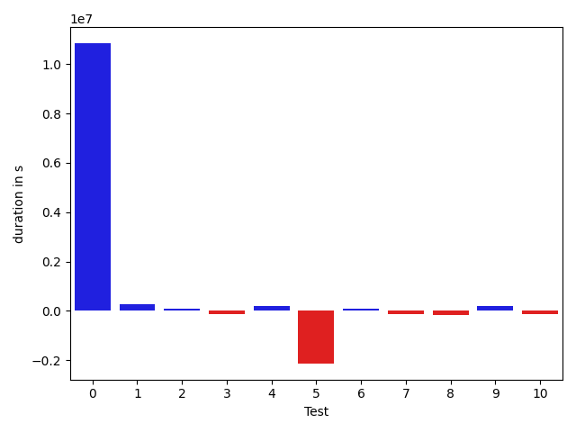
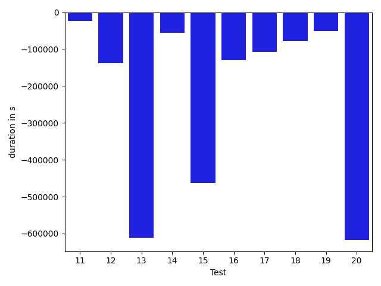

# gson 1f803b

https://github.com/google/gson/commit/1f803b

## Delta Energy per test method

| ID | EnergyV1 | EnergyV2 | DeltaEnergy |
| --- | --- | --- | --- |
| 0 | 619607.284467852 | 1031220.9471952395 | 411613.6627273875 |
| 1 | 82857.9412887838 | 95945.77051933497 | 13087.829230551171 |
| 2 | 62691.672118232105 | 67400.03496712903 | 4708.362848896926 |
| 3 | 36769.71142897096 | 34997.49945904846 | -1772.2119699225004 |
| 4 | 333377.06210953335 | 349607.4254234383 | 16230.363313904963 |
| 5 | 173931.87519567623 | 93988.6907334227 | -79943.18446225353 |
| 6 | 38737.62822176054 | 35449.848165943375 | -3287.7800558171657 |
| 7 | 36591.090332961976 | 32654.55299770316 | -3936.5373352588176 |
| 8 | 32481.651658142167 | 36027.04719604161 | 3545.3955378994433 |
| 9 | 43589.47278874152 | 43388.28934770703 | -201.18344103448908 |
| 10 | 34055.5339809398 | 31873.202548172692 | -2182.331432767107 |
| 11 | 56735.24027436249 | 72076.93979994647 | 15341.69952558398 |
| 12 | 198109.18100373892 | 339606.9765993586 | 141497.79559561968 |
| 13 | 34320.37857829642 | 32532.940665844282 | -1787.4379124521365 |
| 14 | 37796.033797856566 | 36107.17066913052 | -1688.8631287260432 |
| 15 | 53421.8056838878 | 63699.12977609122 | 10277.324092203424 |
| 16 | 32174.859540792455 | 36831.26721325812 | 4656.407672465666 |
| 17 | 215195.67468721425 | 35891.4370945449 | -179304.23759266935 |
| 18 | 30938.940864175744 | 37113.582599660556 | 6174.641735484813 |
| 19 | 33484.07572836223 | 38099.49423003272 | 4615.418501670487 |
| 20 | 269256.7408222177 | 183494.98727245312 | -85761.7535497646 |

## Delta Duration per test method

| ID | DurationV1 | DurationsV2 | DeltaDuration |
| --- | --- | --- | --- |
| 0 | 19331423.806457296 | 30181302.219206035 | 10849878.41274874 |
| 1 | 2780147.447319472 | 3058690.158859042 | 278542.7115395698 |
| 2 | 2059655.719185309 | 2158687.0538969445 | 99031.33471163549 |
| 3 | 918818.3207073073 | 786999.1200376314 | -131819.20066967595 |
| 4 | 10333669.701374657 | 10519350.192834005 | 185680.4914593473 |
| 5 | 5600339.449072861 | 3465418.332622907 | -2134921.116449954 |
| 6 | 907827.5543989846 | 980825.3474427146 | 72997.79304372997 |
| 7 | 862543.3636139382 | 726020.8152535837 | -136522.5483603545 |
| 8 | 1305914.7600744655 | 1152905.3276544712 | -153009.43241999438 |
| 9 | 1326274.7033273063 | 1525837.0760510028 | 199562.37272369652 |
| 10 | 932603.3279868279 | 800136.4917886159 | -132466.836198212 |
| 11 | 2222356.9239435256 | 2245677.8847826957 | 23320.96083917003 |
| 12 | 5649450.359033775 | 10261055.664968124 | 4611605.305934349 |
| 13 | 845190.5482151229 | 1218124.0952980747 | 372933.54708295176 |
| 14 | 1773028.760424113 | 1690294.7031416863 | -82734.05728242663 |
| 15 | 1943623.4771435224 | 1891131.1001232509 | -52492.377020271495 |
| 16 | 979808.2954675797 | 944991.0246142177 | -34817.270853362046 |
| 17 | 7592898.2595754545 | 926857.3289121496 | -6666040.930663304 |
| 18 | 899116.2727949645 | 872958.5820889605 | -26157.69070600404 |
| 19 | 903351.0363770438 | 860666.9764220711 | -42684.059954972705 |
| 20 | 10368314.656182531 | 6446153.1389589105 | -3922161.517223621 |

## Misc.

| ID | Test Class | Test Method |
| --- | --- | --- |
| 0 | com.google.gson.DefaultDateTypeAdapterTest | testParsingDatesFormattedWithUsLocale |
| 1 | com.google.gson.DefaultDateTypeAdapterTest | testFormattingInEnUs |
| 2 | com.google.gson.DefaultDateTypeAdapterTest | testFormatUsesDefaultTimezone |
| 3 | com.google.gson.DefaultDateTypeAdapterTest | testDatePattern |
| 4 | com.google.gson.DefaultDateTypeAdapterTest | testParsingDatesFormattedWithSystemLocale |
| 5 | com.google.gson.DefaultDateTypeAdapterTest | testFormattingInFr |
| 6 | com.google.gson.DefaultDateTypeAdapterTest | testDateSerialization |
| 7 | com.google.gson.functional.DefaultTypeAdaptersTest | testDateSerializationWithPatternNotOverridenByTypeAdapter |
| 8 | com.google.gson.functional.DefaultTypeAdaptersTest | testDefaultJavaSqlTimestampDeserialization |
| 9 | com.google.gson.functional.DefaultTypeAdaptersTest | testDateSerializationWithPattern |
| 10 | com.google.gson.functional.DefaultTypeAdaptersTest | testSqlDateSerialization |
| 11 | com.google.gson.functional.DefaultTypeAdaptersTest | testDefaultDateDeserializationUsingBuilder |
| 12 | com.google.gson.functional.DefaultTypeAdaptersTest | testNullSerialization |
| 13 | com.google.gson.functional.DefaultTypeAdaptersTest | testDateDeserializationWithPattern |
| 14 | com.google.gson.functional.DefaultTypeAdaptersTest | testDateSerializationInCollection |
| 15 | com.google.gson.functional.DefaultTypeAdaptersTest | testDefaultDateDeserialization |
| 16 | com.google.gson.functional.DefaultTypeAdaptersTest | testDefaultJavaSqlTimestampSerialization |
| 17 | com.google.gson.functional.DefaultTypeAdaptersTest | testDefaultDateSerialization |
| 18 | com.google.gson.functional.DefaultTypeAdaptersTest | testDefaultDateSerializationUsingBuilder |
| 19 | com.google.gson.functional.DefaultTypeAdaptersTest | testTimestampSerialization |
| 20 | com.google.gson.functional.ObjectTest | testDateAsMapObjectField |

| Test | IterationV1 | IterationV2 | DeltaIteration |
| --- | --- | --- | --- |
| 0 | 99 | 99 | 0 |
| 1 | 99 | 99 | 0 |
| 2 | 99 | 99 | 0 |
| 3 | 49 | 58 | 9 |
| 4 | 99 | 99 | 0 |
| 5 | 99 | 99 | 0 |
| 6 | 61 | 47 | -14 |
| 7 | 63 | 51 | -12 |
| 8 | 85 | 84 | -1 |
| 9 | 85 | 79 | -6 |
| 10 | 55 | 57 | 2 |
| 11 | 99 | 97 | -2 |
| 12 | 99 | 99 | 0 |
| 13 | 60 | 61 | 1 |
| 14 | 99 | 99 | 0 |
| 15 | 94 | 89 | -5 |
| 16 | 58 | 65 | 7 |
| 17 | 73 | 63 | -10 |
| 18 | 65 | 42 | -23 |
| 19 | 59 | 44 | -15 |
| 20 | 99 | 99 | 0 |

| Time Label | Time (s) |
| --- | --- |
| Selection | 29.018330097198486 |
| Injection | 12.031095743179321 |
| Total | 1048.5769262313843 |

