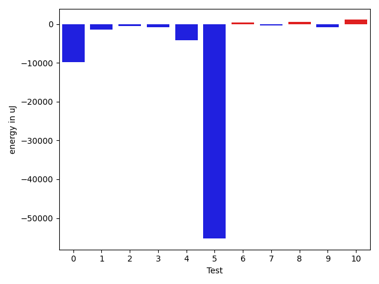
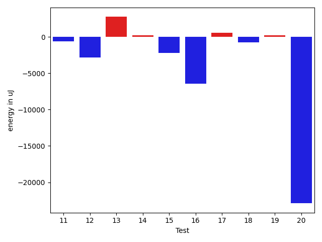

# gson 1f803b

https://github.com/google/gson/commit/1f803b

## Delta Energy per test method

| ID | EnergyV1 | EnergyV2 | DeltaEnergy | σV1 | σV2 |
| --- | --- | --- | --- | --- | --- |
| 0 | 450743 | 440917 | -9826 | 443308.5883470065 | 539251.2536986595 |
| 1 | 69031 | 67566 | -1465 | 28429.625620527877 | 31430.535375913172 |
| 2 | 67383 | 66834 | -549 | 168453.07832419165 | 28585.393775144556 |
| 3 | 36438 | 35644 | -794 | 150786.98806381525 | 3541.267006307101 |
| 4 | 365538 | 361388 | -4150 | 217032.49342205742 | 197872.2148298514 |
| 5 | 130981 | 75684 | -55297 | 55791.93534264455 | 56056.225583542386 |
| 6 | 35400 | 35766 | 366 | 3171.329933984703 | 3318.639288445389 |
| 7 | 34729 | 34301 | -428 | 2888.199523889567 | 3015.157486723108 |
| 8 | 34180 | 34729 | 549 | 6451.586429789037 | 5737.037913404556 |
| 9 | 37903 | 37048 | -855 | 19325.075806960635 | 18434.034150896816 |
| 10 | 33997 | 35096 | 1099 | 3817.9630478464 | 3610.7690082265344 |
| 11 | 34729 | 34119 | -610 | 3057.3184698548666 | 2912.773212000737 |
| 12 | 93505 | 90637 | -2868 | 48491.50515328871 | 42336.093381141145 |
| 13 | 159850 | 162597 | 2747 | 408722.03514626063 | 347429.0177364748 |
| 14 | 37292 | 37476 | 184 | 18324.023572365986 | 19038.670243361146 |
| 15 | 36743 | 34546 | -2197 | 144112.24610547512 | 126890.94249051235 |
| 16 | 69885 | 63415 | -6470 | 35505.92204099179 | 30819.341985593175 |
| 17 | 34119 | 34667 | 548 | 3100.9379254533287 | 3129.388979937634 |
| 18 | 34729 | 33996 | -733 | 2920.741577943 | 2884.84452463242 |
| 19 | 34912 | 35157 | 245 | 2948.647393109066 | 2789.4950934010576 |
| 20 | 64025 | 41137 | -22888 | 199657.15747120173 | 192166.48728343344 |

## Delta Duration per test method

| ID | DurationV1 | DurationsV2 | DeltaDuration |
| --- | --- | --- | --- |
| 0 | 18617868.05050505 | 20975227.888888888 | 2357359.8383838385 |
| 1 | 2442293.212121212 | 2229078.6363636362 | -213214.5757575757 |
| 2 | 2856354.414141414 | 2109477.797979798 | -746876.616161616 |
| 3 | 1741702.8852459015 | 909906.9787234042 | -831795.9065224973 |
| 4 | 12031510.858585859 | 11661749.828282828 | -369761.0303030312 |
| 5 | 4124560.9393939395 | 3198469.7474747472 | -926091.1919191922 |
| 6 | 897866.2857142857 | 914272.9137931034 | 16406.62807881774 |
| 7 | 930274.8095238095 | 884037.431372549 | -46237.37815126043 |
| 8 | 1326141.4 | 1233255.4523809524 | -92885.94761904748 |
| 9 | 1649008.4705882352 | 1644791.7341772153 | -4216.736411019927 |
| 10 | 1070615.4827586208 | 975328.2923076923 | -95287.1904509284 |
| 11 | 906834.6909090909 | 883543.1052631579 | -23291.585645933053 |
| 12 | 2812847.101010101 | 2675523.907216495 | -137323.193793606 |
| 13 | 12594503.535353536 | 11982930.656565657 | -611572.8787878789 |
| 14 | 1824878.0303030303 | 1769468.8585858585 | -55409.17171717179 |
| 15 | 2954907.383561644 | 2491582.8571428573 | -463324.5264187865 |
| 16 | 2356880.244680851 | 2227073.786516854 | -129806.45816399716 |
| 17 | 918769.6 | 811246.4285714285 | -107523.17142857146 |
| 18 | 929611.5423728813 | 851681.6818181818 | -77929.86055469955 |
| 19 | 1000638.85 | 949485.9180327869 | -51152.93196721305 |
| 20 | 6417559.626262627 | 5800310.646464647 | -617248.9797979798 |

## Misc.

| ID | Test Class | Test Method |
| --- | --- | --- |
| 0 | com.google.gson.DefaultDateTypeAdapterTest | testParsingDatesFormattedWithUsLocale |
| 1 | com.google.gson.DefaultDateTypeAdapterTest | testFormattingInEnUs |
| 2 | com.google.gson.DefaultDateTypeAdapterTest | testFormatUsesDefaultTimezone |
| 3 | com.google.gson.DefaultDateTypeAdapterTest | testDateSerialization |
| 4 | com.google.gson.DefaultDateTypeAdapterTest | testParsingDatesFormattedWithSystemLocale |
| 5 | com.google.gson.DefaultDateTypeAdapterTest | testFormattingInFr |
| 6 | com.google.gson.DefaultDateTypeAdapterTest | testDatePattern |
| 7 | com.google.gson.functional.DefaultTypeAdaptersTest | testDateSerializationWithPatternNotOverridenByTypeAdapter |
| 8 | com.google.gson.functional.DefaultTypeAdaptersTest | testDefaultJavaSqlTimestampDeserialization |
| 9 | com.google.gson.functional.DefaultTypeAdaptersTest | testDateSerializationWithPattern |
| 10 | com.google.gson.functional.DefaultTypeAdaptersTest | testDefaultJavaSqlTimestampSerialization |
| 11 | com.google.gson.functional.DefaultTypeAdaptersTest | testSqlDateSerialization |
| 12 | com.google.gson.functional.DefaultTypeAdaptersTest | testDefaultDateDeserializationUsingBuilder |
| 13 | com.google.gson.functional.DefaultTypeAdaptersTest | testNullSerialization |
| 14 | com.google.gson.functional.DefaultTypeAdaptersTest | testDateSerializationInCollection |
| 15 | com.google.gson.functional.DefaultTypeAdaptersTest | testDefaultDateSerialization |
| 16 | com.google.gson.functional.DefaultTypeAdaptersTest | testDefaultDateDeserialization |
| 17 | com.google.gson.functional.DefaultTypeAdaptersTest | testDefaultDateSerializationUsingBuilder |
| 18 | com.google.gson.functional.DefaultTypeAdaptersTest | testTimestampSerialization |
| 19 | com.google.gson.functional.DefaultTypeAdaptersTest | testDateDeserializationWithPattern |
| 20 | com.google.gson.functional.ObjectTest | testDateAsMapObjectField |

| Test | IterationV1 | IterationV2 | DeltaIteration |
| --- | --- | --- | --- |
| 0 | 99 | 99 | 0 |
| 1 | 99 | 99 | 0 |
| 2 | 99 | 99 | 0 |
| 3 | 61 | 47 | -14 |
| 4 | 99 | 99 | 0 |
| 5 | 99 | 99 | 0 |
| 6 | 49 | 58 | 9 |
| 7 | 63 | 51 | -12 |
| 8 | 85 | 84 | -1 |
| 9 | 85 | 79 | -6 |
| 10 | 58 | 65 | 7 |
| 11 | 55 | 57 | 2 |
| 12 | 99 | 97 | -2 |
| 13 | 99 | 99 | 0 |
| 14 | 99 | 99 | 0 |
| 15 | 73 | 63 | -10 |
| 16 | 94 | 89 | -5 |
| 17 | 65 | 42 | -23 |
| 18 | 59 | 44 | -15 |
| 19 | 60 | 61 | 1 |
| 20 | 99 | 99 | 0 |

| Time Label | Time (s) |
| --- | --- |
| Selection | 29.018330097198486 |
| Injection | 12.031095743179321 |
| Total | 1048.5769262313843 |

