# gson 7a1c94

https://github.com/google/gson/commit/7a1c94

## Delta Energy per test method

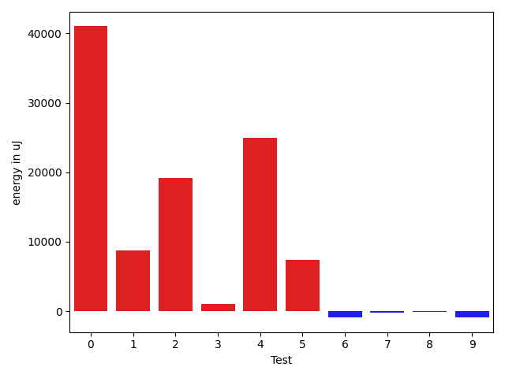

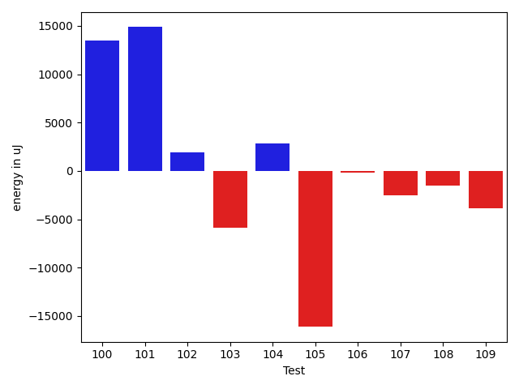

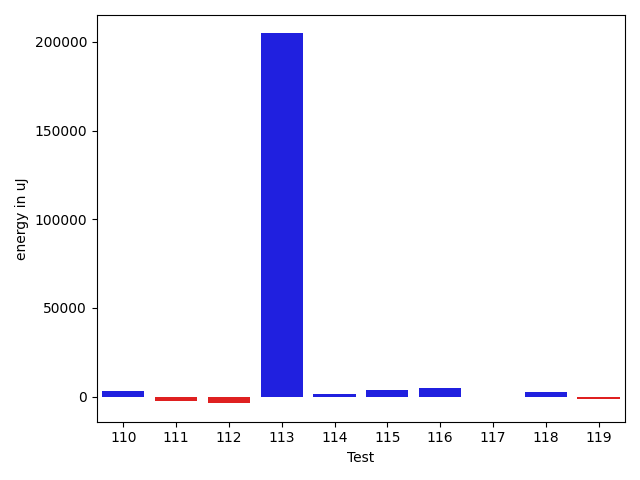

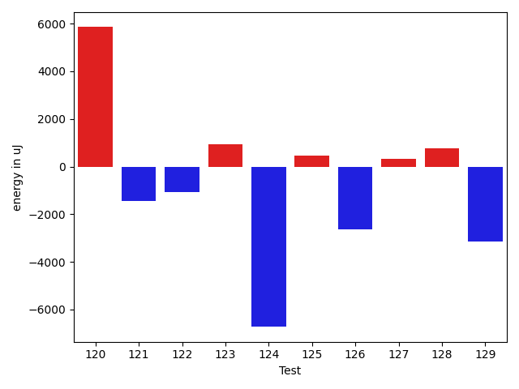

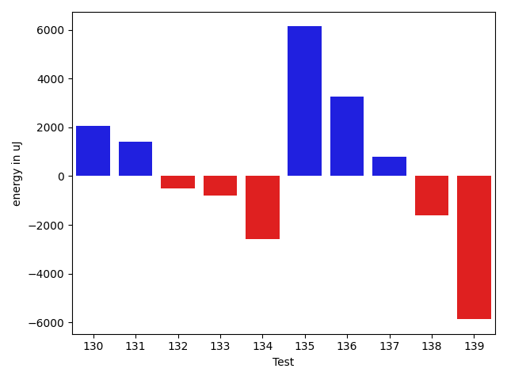

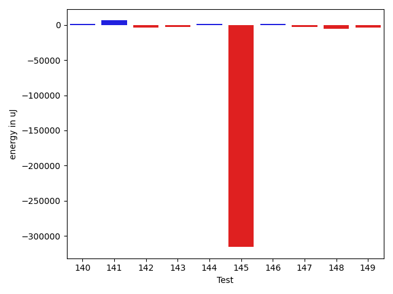

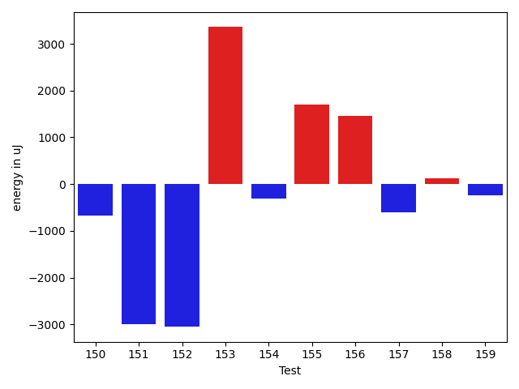

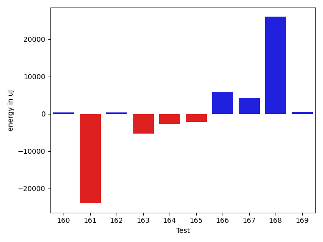

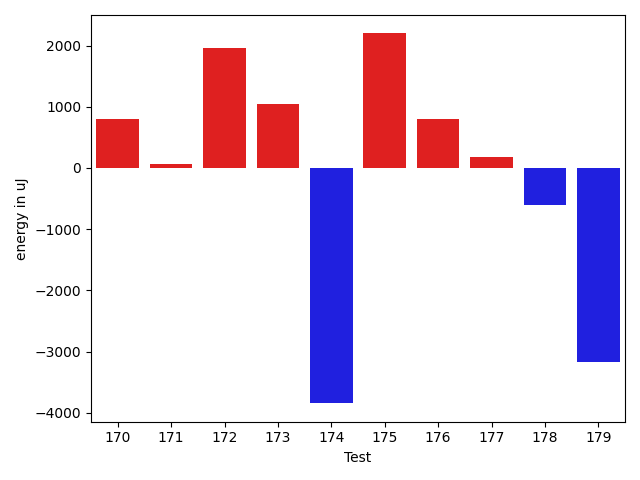

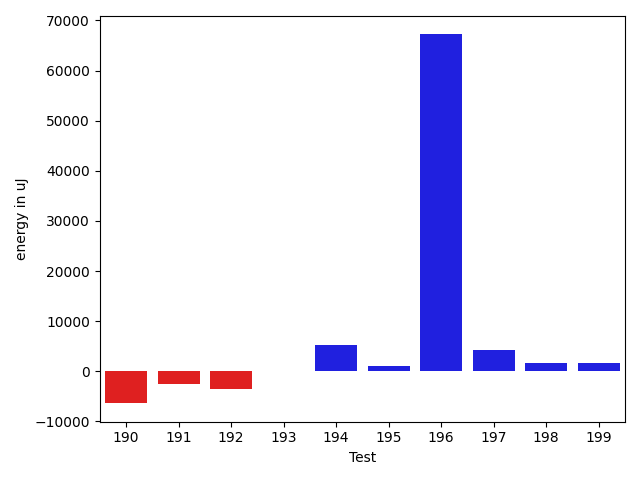

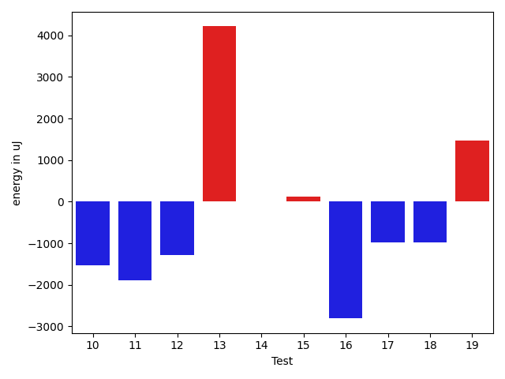

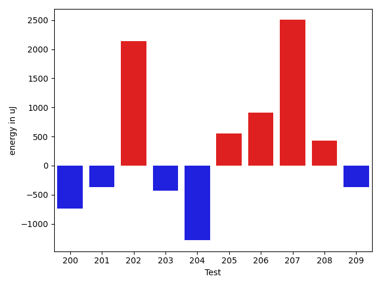

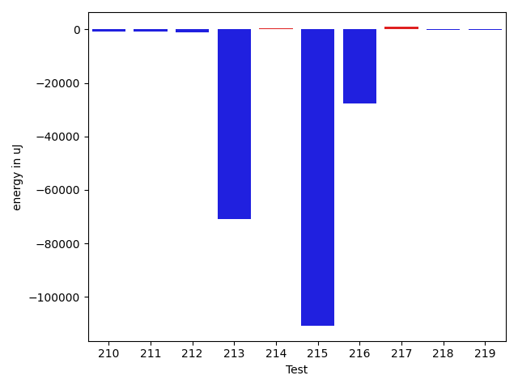

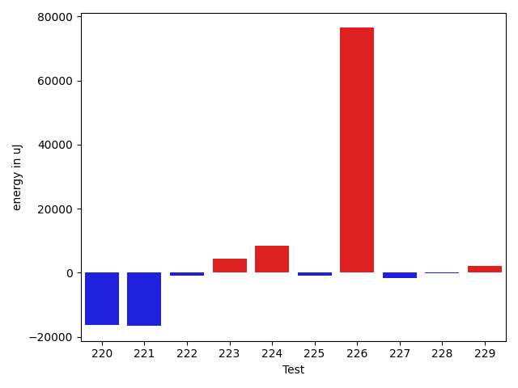

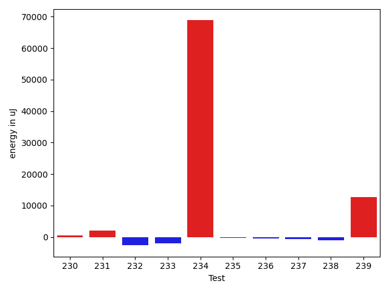

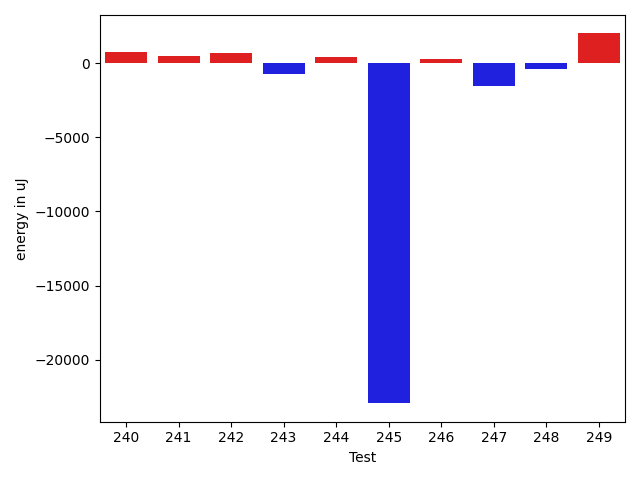

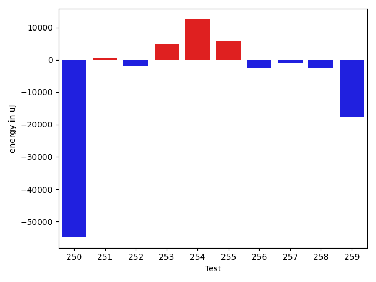

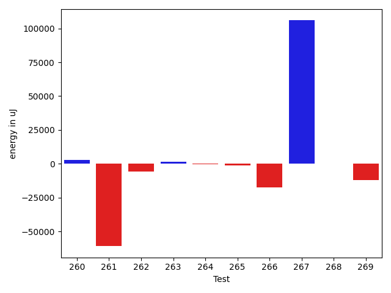

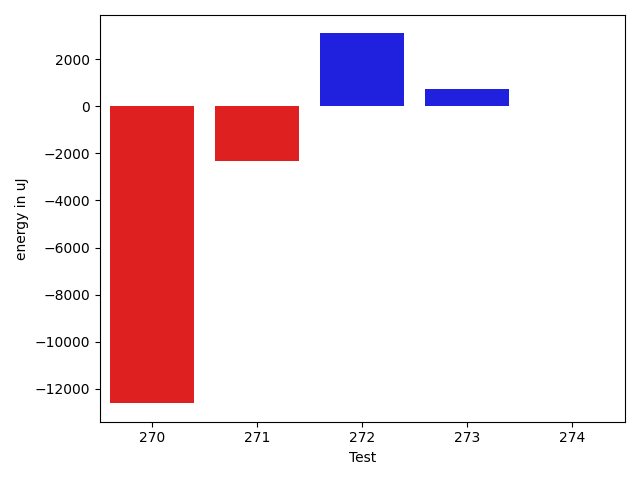

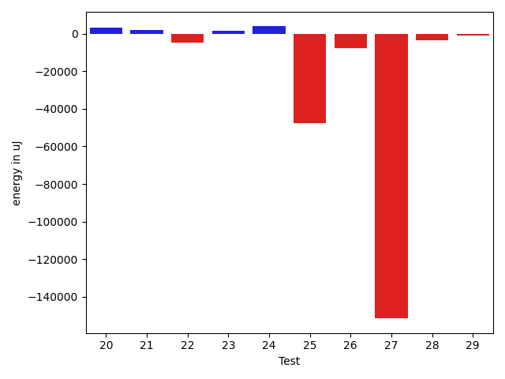

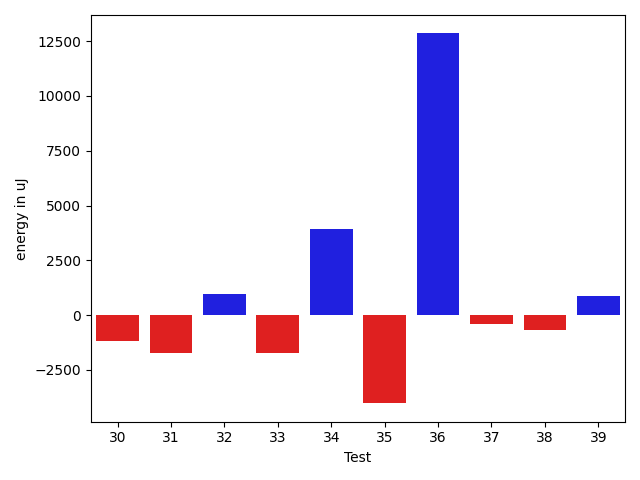

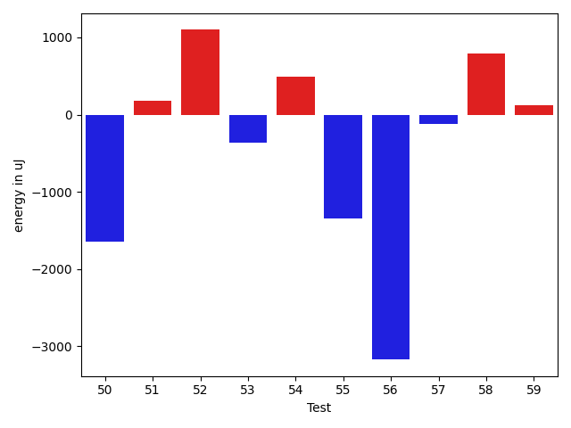

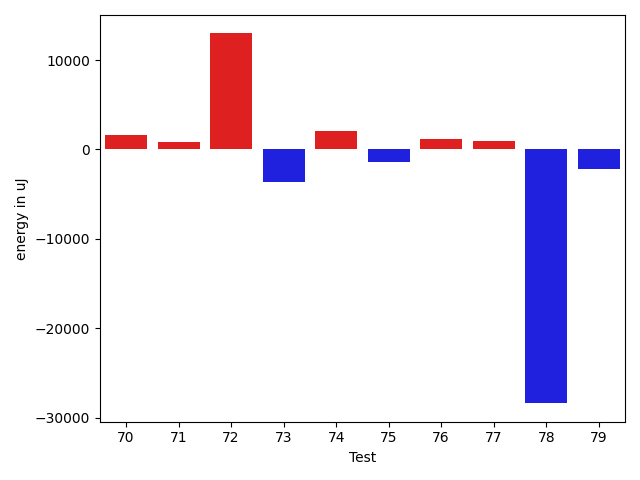

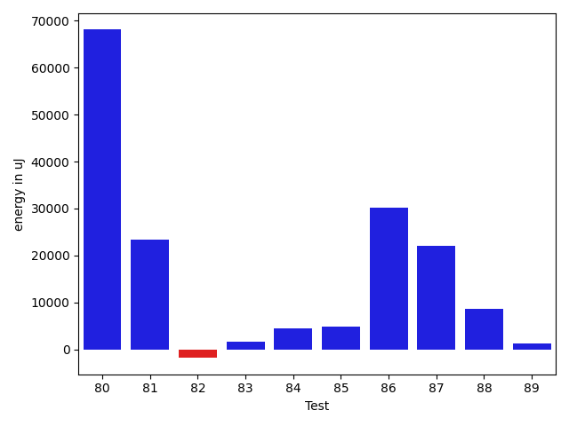

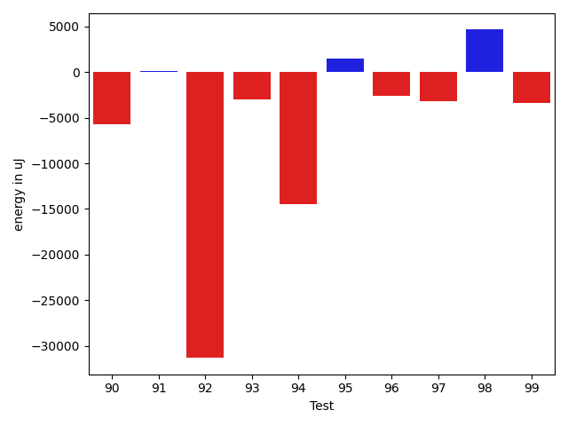

| ID | EnergyV1 | EnergyV2 | DeltaEnergy |
| --- | --- | --- | --- |
| 0 | 670400.6499775031 | 745474.5278728249 | 75073.87789532181 |
| 1 | 73330.14287899435 | 99298.76155594148 | 25968.61867694714 |
| 2 | 92891.68258682408 | 78815.46848528048 | -14076.214101543606 |
| 3 | 296375.9494826401 | 41373.24138764084 | -255002.70809499925 |
| 4 | 35881.37212462495 | 38159.04046099475 | 2277.668336369803 |
| 5 | 262552.95784580044 | 373445.2079921614 | 110892.25014636095 |
| 6 | 164892.9223761468 | 222325.86172832534 | 57432.93935217854 |
| 7 | 42441.47519334741 | 37741.15989600372 | -4700.315297343688 |
| 8 | 48190.458753719926 | 90914.58551451564 | 42724.12676079571 |
| 9 | 39639.887289071565 | 37546.06704353882 | -2093.8202455327482 |
| 10 | 39130.031949880395 | 40871.51131619442 | 1741.4793663140226 |
| 11 | 39231.80786822736 | 36851.711166919486 | -2380.096701307877 |
| 12 | 40227.60357340053 | 38706.61807719694 | -1520.9854962035897 |
| 13 | 48350.576707098255 | 46909.48514006625 | -1441.0915670320028 |
| 14 | 38784.46426392972 | 37335.769810638914 | -1448.6944532908092 |
| 15 | 36109.338276072645 | 35888.50141314054 | -220.83686293210485 |
| 16 | 40138.26298427612 | 35461.30816947033 | -4676.954814805795 |
| 17 | 44111.68159586191 | 38588.20863723755 | -5523.472958624363 |
| 18 | 36517.86543073971 | 40966.03705793619 | 4448.171627196483 |
| 19 | 35667.44955084895 | 39505.25809788523 | 3837.8085470362785 |
| 20 | 35100.91064260341 | 38258.312871638685 | 3157.402229035273 |
| 21 | 35811.28073686962 | 37625.30998092522 | 1814.0292440556004 |
| 22 | 77740.01328021634 | 72954.45932273785 | -4785.5539574784925 |
| 23 | 39333.15338088339 | 40716.36157655436 | 1383.2081956709662 |
| 24 | 36368.58911911398 | 40250.63079456985 | 3882.0416754558682 |
| 25 | 85672.12370790914 | 37895.88030306995 | -47776.24340483919 |
| 26 | 41591.1429453271 | 34006.585177481174 | -7584.557767845923 |
| 27 | 190115.6603256551 | 38595.395976345986 | -151520.26434930912 |
| 28 | 44246.17558838613 | 40726.25079679489 | -3519.924791591242 |
| 29 | 38922.69772148132 | 37953.57795333862 | -969.1197681427002 |
| 30 | 40083.93169307709 | 38884.168540120125 | -1199.7631529569626 |
| 31 | 38985.64925511828 | 37235.68628227278 | -1749.9629728455038 |
| 32 | 38607.907200309804 | 39591.55600107291 | 983.6488007631051 |
| 33 | 41662.648467795654 | 39932.855496775665 | -1729.7929710199896 |
| 34 | 54591.650919248554 | 58507.63105996558 | 3915.9801407170235 |
| 35 | 38448.4146123411 | 34429.46043615232 | -4018.954176188774 |
| 36 | 73719.53510164107 | 86567.39361610581 | 12847.858514464737 |
| 37 | 37160.780330271766 | 36739.87352919449 | -420.9068010772753 |
| 38 | 36310.31621985587 | 35629.53644508751 | -680.779774768358 |
| 39 | 40271.968527899204 | 41144.99926377733 | 873.0307358781283 |
| 40 | 43424.819257301395 | 40049.66854615524 | -3375.150711146154 |
| 41 | 42546.636668651976 | 51270.76667396939 | 8724.130005317413 |
| 42 | 39835.88198355125 | 38187.57274722401 | -1648.3092363272372 |
| 43 | 36943.9712926739 | 36340.266918670815 | -603.7043740030858 |
| 44 | 37049.794902641945 | 36695.42642494412 | -354.36847769782617 |
| 45 | 34676.76971489191 | 38585.177460718754 | 3908.407745826844 |
| 46 | 42881.39323816603 | 38139.61665152447 | -4741.7765866415575 |
| 47 | 40141.657487630844 | 34189.227842375636 | -5952.429645255208 |
| 48 | 35424.517085431944 | 34774.98105712256 | -649.5360283093833 |
| 49 | 37077.79504130781 | 39477.4651184082 | 2399.670077100396 |
| 50 | 37915.103759765625 | 36266.49396896362 | -1648.609790802002 |
| 51 | 52541.15105948707 | 39975.830014382445 | -12565.321045104625 |
| 52 | 38651.855337456625 | 38289.07423336263 | -362.7811040939923 |
| 53 | 47770.686459973105 | 56410.24085627133 | 8639.554396298226 |
| 54 | 48981.01236443259 | 35103.559535398555 | -13877.452829034031 |
| 55 | 80529.68400799122 | 271790.22063543263 | 191260.5366274414 |
| 56 | 46919.99796678838 | 37365.79510483841 | -9554.202861949969 |
| 57 | 74393.24032214293 | 106134.40134606864 | 31741.161023925713 |
| 58 | 39457.93733954451 | 38188.160519432466 | -1269.7768201120416 |
| 59 | 40498.91610988696 | 119783.5395894189 | 79284.62347953193 |
| 60 | 36953.55779470982 | 49455.62697967217 | 12502.069184962347 |
| 61 | 99758.34995400437 | 102772.83556408496 | 3014.485610080592 |
| 62 | 38784.78257315801 | 40847.05040329265 | 2062.2678301346386 |
| 63 | 43951.489895955405 | 56945.74261398868 | 12994.252718033276 |
| 64 | 47532.247487776134 | 37795.930101791106 | -9736.317385985029 |
| 65 | 42878.3532448411 | 36287.78964780949 | -6590.563597031607 |
| 66 | 37199.1703571694 | 39275.46915030189 | 2076.2987931324897 |
| 67 | 35775.82559339497 | 40233.502396780736 | 4457.676803385766 |
| 68 | 38424.72529506683 | 41659.01055737771 | 3234.2852623108774 |
| 69 | 43292.707567071266 | 63873.52735148407 | 20580.8197844128 |
| 70 | 35800.2121474973 | 35627.09026779654 | -173.12187970076047 |
| 71 | 39614.79710492515 | 37563.56494021416 | -2051.232164710993 |
| 72 | 37775.25354094697 | 34507.4078757869 | -3267.845665160072 |
| 73 | 38269.39318502859 | 31464.491564802825 | -6804.901620225763 |
| 74 | 34638.7167320922 | 35270.000583827496 | 631.2838517352939 |
| 75 | 40641.2083568573 | 40871.77394104004 | 230.56558418273926 |
| 76 | 37211.96687400341 | 32993.01864302158 | -4218.948230981827 |
| 77 | 36670.1923031007 | 37053.77278008695 | 383.5804769862443 |
| 78 | 41550.131018698215 | 39533.898453086615 | -2016.2325656116009 |
| 79 | 41155.69983291626 | 36804.197083458304 | -4351.502749457955 |
| 80 | 197750.12715168518 | 265857.5478581295 | 68107.4207064443 |
| 81 | 154809.0076617758 | 178137.3835709234 | 23328.37590914761 |
| 82 | 42962.386427667574 | 41142.5066940207 | -1819.8797336468706 |
| 83 | 38143.89683430176 | 39758.297947600484 | 1614.4011132987216 |
| 84 | 42798.21766639632 | 47351.305105513246 | 4553.087439116927 |
| 85 | 38836.90603637695 | 43761.97401380539 | 4925.067977428436 |
| 86 | 85983.81107866838 | 116115.84196707216 | 30132.03088840378 |
| 87 | 42410.79267547716 | 64532.72527745456 | 22121.9326019774 |
| 88 | 35350.177239918325 | 44043.19050685576 | 8693.013266937436 |
| 89 | 39344.33145337627 | 40676.72315770858 | 1332.391704332309 |
| 90 | 42222.430087924 | 36542.42774772644 | -5680.002340197563 |
| 91 | 40018.039452120654 | 40131.88830750496 | 113.84885538430535 |
| 92 | 75189.92021502319 | 43862.101411053896 | -31327.81880396929 |
| 93 | 55790.69707136575 | 52774.35812781169 | -3016.3389435540594 |
| 94 | 66049.69775826765 | 51612.275226144644 | -14437.422532123004 |
| 95 | 35769.76274108887 | 37279.38446044922 | 1509.6217193603516 |
| 96 | 38754.02118778229 | 36103.82745933533 | -2650.1937284469604 |
| 97 | 41015.50846862793 | 37779.40728467703 | -3236.101183950901 |
| 98 | 41659.36021300948 | 46302.21986042062 | 4642.85964741114 |
| 99 | 39369.2537720079 | 35942.35380137348 | -3426.8999706344184 |
| 100 | 39739.09907342095 | 53193.05316675674 | 13453.954093335793 |
| 101 | 45420.313354856036 | 60289.57181769273 | 14869.258462836697 |
| 102 | 46214.60694700292 | 48128.540495076704 | 1913.9335480737864 |
| 103 | 44018.700583054684 | 38184.598292444105 | -5834.102290610579 |
| 104 | 49809.446552743204 | 52663.03914120405 | 2853.592588460844 |
| 105 | 49510.09103379714 | 33390.34835265677 | -16119.742681140371 |
| 106 | 39211.28590066919 | 39033.19938226203 | -178.08651840715902 |
| 107 | 40958.05896566886 | 38423.93369996134 | -2534.125265707524 |
| 108 | 38560.69350422057 | 37054.98076834803 | -1505.712735872541 |
| 109 | 38925.65360879153 | 35078.35558291525 | -3847.2980258762836 |
| 110 | 36024.36969541857 | 39046.70239827618 | 3022.3327028576095 |
| 111 | 39015.89469316739 | 36578.5901303118 | -2437.304562855592 |
| 112 | 39990.364682344385 | 36277.09266503902 | -3713.2720173053676 |
| 113 | 200792.11085086898 | 405487.3543583375 | 204695.24350746855 |
| 114 | 38009.13198051504 | 39679.79159848624 | 1670.6596179711996 |
| 115 | 44895.28811723783 | 48578.905384038575 | 3683.617266800742 |
| 116 | 35016.20525607325 | 40168.851136860845 | 5152.645880787597 |
| 117 | 35873.661604209934 | 35435.53766608238 | -438.1239381275518 |
| 118 | 39007.220453739166 | 41440.80542743206 | 2433.584973692894 |
| 119 | 37849.09882980687 | 36424.62126134316 | -1424.4775684637061 |
| 120 | 39064.84195546806 | 37304.884378910065 | -1759.957576557994 |
| 121 | 39344.36518859863 | 37930.18426120281 | -1414.1809273958206 |
| 122 | 36987.73825458065 | 38278.4298658371 | 1290.6916112564504 |
| 123 | 42208.24697408639 | 44904.66925315674 | 2696.4222790703498 |
| 124 | 35846.831705629826 | 42318.33011264354 | 6471.498407013714 |
| 125 | 40465.44680355489 | 42885.530902802944 | 2420.0840992480516 |
| 126 | 39921.20019483566 | 40157.110471725464 | 235.91027688980103 |
| 127 | 35207.65396856121 | 35724.488842283085 | 516.8348737218766 |
| 128 | 35487.42661521025 | 40238.1411166226 | 4750.714501412353 |
| 129 | 32993.54484901205 | 39800.50258880854 | 6806.9577397964895 |
| 130 | 39120.107995930084 | 41174.251457537095 | 2054.143461607011 |
| 131 | 36999.32424578471 | 38417.29882776887 | 1417.9745819841628 |
| 132 | 40159.53903979063 | 39651.59773544967 | -507.9413043409586 |
| 133 | 35414.81258010864 | 34630.51678466797 | -784.2957954406738 |
| 134 | 38508.88520157337 | 35934.215088665485 | -2574.6701129078865 |
| 135 | 35344.36944580078 | 41476.32776785642 | 6131.958322055638 |
| 136 | 35088.76729683869 | 38350.22824085399 | 3261.4609440153 |
| 137 | 38793.29288981855 | 39569.97527325153 | 776.6823834329844 |
| 138 | 37284.243019104004 | 35687.98423933983 | -1596.2587797641754 |
| 139 | 40518.28366088867 | 34647.94989013672 | -5870.333770751953 |
| 140 | 37979.18133455515 | 39600.22265744209 | 1621.0413228869438 |
| 141 | 36279.77313899994 | 42710.39664244652 | 6430.623503446579 |
| 142 | 40458.82900261879 | 36717.94351768494 | -3740.885484933853 |
| 143 | 39256.59849572182 | 36350.78658246994 | -2905.811913251877 |
| 144 | 37522.488498687744 | 39440.90464782715 | 1918.4161491394043 |
| 145 | 436134.53326599684 | 120288.9214952125 | -315845.61177078437 |
| 146 | 38347.72936741804 | 39926.01975984614 | 1578.2903924280981 |
| 147 | 38997.63562100667 | 36275.39893089028 | -2722.2366901163914 |
| 148 | 39649.50439453125 | 34483.5678922832 | -5165.936502248049 |
| 149 | 41127.12855822181 | 37957.15630618285 | -3169.9722520389623 |
| 150 | 55591.61735113582 | 38774.882029199274 | -16816.735321936547 |
| 151 | 36601.80980069398 | 39291.70247343881 | 2689.892672744827 |
| 152 | 37875.88577032089 | 38886.5354681015 | 1010.6496977806091 |
| 153 | 40824.28798070733 | 38314.62458065152 | -2509.6634000558115 |
| 154 | 41104.90915164499 | 44934.144906423324 | 3829.235754778332 |
| 155 | 38175.8302770753 | 35105.88142371178 | -3069.948853363523 |
| 156 | 37418.351739721955 | 38110.29271817823 | 691.940978456274 |
| 157 | 61078.14827361816 | 40258.9592623652 | -20819.189011252958 |
| 158 | 55043.813567090634 | 40949.568787502634 | -14094.244779588 |
| 159 | 57169.05588156745 | 46189.78771127661 | -10979.268170290845 |
| 160 | 38230.92308651757 | 38599.04588234212 | 368.12279582455085 |
| 161 | 144285.55619751877 | 120329.51840180914 | -23956.037795709635 |
| 162 | 41837.43987892266 | 42209.16999640244 | 371.7301174797758 |
| 163 | 43374.176058993005 | 38109.50208548527 | -5264.673973507735 |
| 164 | 40747.821997591396 | 38036.648964791515 | -2711.173032799881 |
| 165 | 39676.11757488917 | 37548.623898907084 | -2127.493675982085 |
| 166 | 38506.506855924235 | 44386.6433681327 | 5880.136512208468 |
| 167 | 40436.51634057201 | 44694.42704733247 | 4257.910706760464 |
| 168 | 37058.620488906316 | 63045.729931846174 | 25987.109442939858 |
| 169 | 36572.51478050277 | 37040.05855374038 | 467.5437732376158 |
| 170 | 36620.986410877005 | 39912.922655863265 | 3291.93624498626 |
| 171 | 53882.51415771333 | 45903.048105684014 | -7979.466052029318 |
| 172 | 37971.72675700486 | 40490.36460933089 | 2518.6378523260355 |
| 173 | 40518.655423443764 | 37710.31602707392 | -2808.3393963698472 |
| 174 | 36469.95965108894 | 37728.97530094127 | 1259.0156498523284 |
| 175 | 37324.93194487113 | 39475.812460802765 | 2150.8805159316325 |
| 176 | 36457.02576828003 | 41306.9462723732 | 4849.92050409317 |
| 177 | 44278.739902887435 | 42907.87661552429 | -1370.8632873631432 |
| 178 | 37362.14208984375 | 36445.603479729034 | -916.538610114716 |
| 179 | 105888.02056389138 | 130480.70489428504 | 24592.684330393662 |
| 180 | 37027.60166619718 | 38392.63338947296 | 1365.0317232757807 |
| 181 | 41417.64172708063 | 42726.76526314154 | 1309.1235360609135 |
| 182 | 45143.81681259465 | 41415.98197607235 | -3727.834836522299 |
| 183 | 39826.03474880383 | 39469.04432137091 | -356.99042743292375 |
| 184 | 112463.9373987343 | 77052.87788217729 | -35411.05951655701 |
| 185 | 39218.28358521387 | 40662.636837483486 | 1444.3532522696187 |
| 186 | 40387.50994717551 | 40952.391543626785 | 564.881596451276 |
| 187 | 49610.818007245565 | 63445.002363584616 | 13834.18435633905 |
| 188 | 73326.42228164712 | 80923.82945063434 | 7597.407168987222 |
| 189 | 41182.04663569442 | 37611.11845680896 | -3570.928178885464 |
| 190 | 41859.198028904306 | 35464.75238345313 | -6394.445645451175 |
| 191 | 39701.28746799906 | 37082.645934372995 | -2618.6415336260616 |
| 192 | 41550.125541216694 | 37997.25407843942 | -3552.8714627772715 |
| 193 | 40051.99204251926 | 40029.94573417436 | -22.046308344899444 |
| 194 | 39446.534343846644 | 44775.045335547955 | 5328.510991701311 |
| 195 | 42619.28595880431 | 43639.36771862711 | 1020.0817598228023 |
| 196 | 147365.71530908596 | 214665.6082129046 | 67299.89290381863 |
| 197 | 37157.43358810817 | 41351.98830041276 | 4194.554712304591 |
| 198 | 40307.973202070476 | 41997.7577245826 | 1689.7845225121273 |
| 199 | 39803.88658487238 | 41453.279186564265 | 1649.392601691885 |
| 200 | 43101.63432300091 | 36296.04079843617 | -6805.5935245647415 |
| 201 | 38882.32529852935 | 39251.40636950359 | 369.08107097423635 |
| 202 | 39745.85566884442 | 33187.01241624018 | -6558.843252604245 |
| 203 | 36288.70680186665 | 43689.13104572454 | 7400.424243857895 |
| 204 | 35866.67959237555 | 37116.93206837908 | 1250.2524760035303 |
| 205 | 40831.776719229354 | 35578.62995924516 | -5253.146759984193 |
| 206 | 78018.1703768748 | 72030.77524347264 | -5987.395133402155 |
| 207 | 37476.97573580338 | 36982.8344574849 | -494.1412783184787 |
| 208 | 39125.986885984705 | 41251.18746989983 | 2125.2005839151243 |
| 209 | 41336.54991149902 | 39833.77711495757 | -1502.7727965414524 |
| 210 | 72970.5280674519 | 38997.60894923671 | -33972.91911821519 |
| 211 | 41583.25582851477 | 38326.87259282917 | -3256.3832356856 |
| 212 | 72781.12989138157 | 40455.55947375592 | -32325.570417625648 |
| 213 | 44634.910979260545 | 38616.84059733278 | -6018.070381927762 |
| 214 | 56354.984028092484 | 39848.73940335946 | -16506.244624733023 |
| 215 | 85863.64908889284 | 43959.92793127044 | -41903.7211576224 |
| 216 | 36059.780240781605 | 39749.78596326709 | 3690.0057224854827 |
| 217 | 39679.55388512593 | 40275.75034967438 | 596.1964645484477 |
| 218 | 43739.83684823796 | 40089.368484286475 | -3650.468363951484 |
| 219 | 38404.973769506774 | 39665.3851317219 | 1260.4113622151272 |
| 220 | 38580.67812271128 | 40689.63145080089 | 2108.9533280896067 |
| 221 | 36463.107461211 | 37106.2372744056 | 643.129813194595 |
| 222 | 47673.00012536575 | 37730.34514988877 | -9942.654975476973 |
| 223 | 49666.60333607964 | 37610.653154910004 | -12055.95018116964 |
| 224 | 70640.28504972742 | 36645.557931758856 | -33994.72711796856 |
| 225 | 66583.29329313198 | 50032.612555863336 | -16550.680737268645 |
| 226 | 37772.82598720986 | 41253.68745020055 | 3480.861462990695 |
| 227 | 40066.72412882745 | 43565.613815017045 | 3498.889686189592 |
| 228 | 41904.05673150718 | 35897.99393773079 | -6006.062793776393 |
| 229 | 38425.66192023037 | 38438.74300802499 | 13.081087794620544 |
| 230 | 35848.1958517257 | 36489.34001790623 | 641.1441661805293 |
| 231 | 55817.47810146375 | 39929.52153023228 | -15887.956571231465 |
| 232 | 42067.625020980835 | 39313.34988913289 | -2754.2751318479422 |
| 233 | 340223.1199342 | 242295.56458841654 | -97927.55534578348 |
| 234 | 508951.4928018929 | 251921.73394485342 | -257029.7588570395 |
| 235 | 44287.753934413384 | 39588.178747185215 | -4699.575187228169 |
| 236 | 48522.209349301454 | 37805.65731870907 | -10716.552030592386 |
| 237 | 66066.5983382076 | 99451.33486095678 | 33384.73652274918 |
| 238 | 34561.99722217794 | 39204.845958731676 | 4642.848736553737 |
| 239 | 33939.01059562502 | 39276.1207943147 | 5337.110198689683 |
| 240 | 35127.04042554367 | 38169.229638001416 | 3042.1892124577425 |
| 241 | 140955.11951865783 | 232685.84819170288 | 91730.72867304506 |
| 242 | 43603.3048391233 | 44034.55679314956 | 431.2519540262583 |
| 243 | 40915.99887819635 | 44640.64108656303 | 3724.642208366684 |
| 244 | 46088.857531018046 | 42588.18728745027 | -3500.6702435677726 |
| 245 | 50050.29620911724 | 47098.29615524568 | -2952.000053871554 |
| 246 | 36544.22886364162 | 39425.919202804565 | 2881.6903391629457 |
| 247 | 41206.04392533866 | 44279.87819701914 | 3073.8342716804837 |
| 248 | 40029.01981163025 | 37496.7961008111 | -2532.2237108191475 |
| 249 | 39056.92008748159 | 76661.78223394908 | 37604.862146467494 |
| 250 | 36690.109396493295 | 42742.48021008316 | 6052.370813589863 |
| 251 | 77664.94852954918 | 41196.5319996771 | -36468.416529872076 |
| 252 | 49266.76209040552 | 40997.19422657079 | -8269.56786383473 |
| 253 | 41056.76588176143 | 36519.65971040765 | -4537.106171353778 |
| 254 | 41476.43922802554 | 47207.71161979508 | 5731.27239176954 |
| 255 | 43437.04646196304 | 46445.5596072755 | 3008.513145312463 |
| 256 | 40127.447827704615 | 38691.2320436702 | -1436.2157840344153 |
| 257 | 41888.36332866922 | 32213.706012305163 | -9674.657316364057 |
| 258 | 82888.0777485109 | 189791.02448783335 | 106902.94673932245 |
| 259 | 56225.556044871686 | 37513.75621474057 | -18711.799830131116 |
| 260 | 40699.13619860947 | 43379.379563872666 | 2680.2433652631953 |
| 261 | 98365.53118060503 | 37464.10330684188 | -60901.427873763154 |
| 262 | 42452.39280796051 | 36875.751430722186 | -5576.641377238324 |
| 263 | 40090.892683312195 | 41765.88240631492 | 1674.9897230027273 |
| 264 | 39308.10665156598 | 39191.68034598095 | -116.42630558502424 |
| 265 | 38350.67898154259 | 36907.755838021636 | -1442.9231435209513 |
| 266 | 64094.896838739056 | 46810.21544825869 | -17284.681390480364 |
| 267 | 61332.16185835749 | 167279.11490178108 | 105946.9530434236 |
| 268 | 38937.53553581111 | 39198.46898958606 | 260.9334537749455 |
| 269 | 50719.00316519005 | 38634.72061387949 | -12084.282551310556 |
| 270 | 53122.40576437802 | 40503.7115408331 | -12618.694223544917 |
| 271 | 40530.45008350642 | 38214.04163649166 | -2316.4084470147573 |
| 272 | 37773.93458542549 | 40871.26610128849 | 3097.3315158629994 |
| 273 | 38633.67803359032 | 39368.40143537521 | 734.7234017848969 |
| 274 | 37844.67224914767 | 37872.4711080664 | 27.79885891872982 |

## Delta Duration per test method

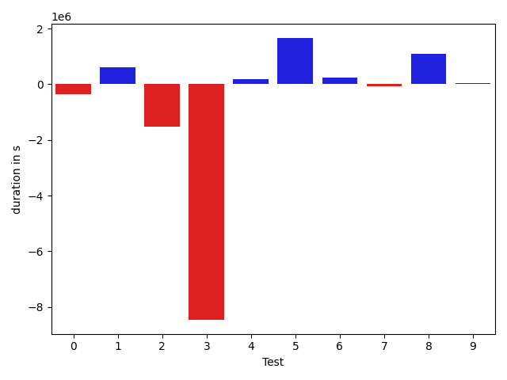

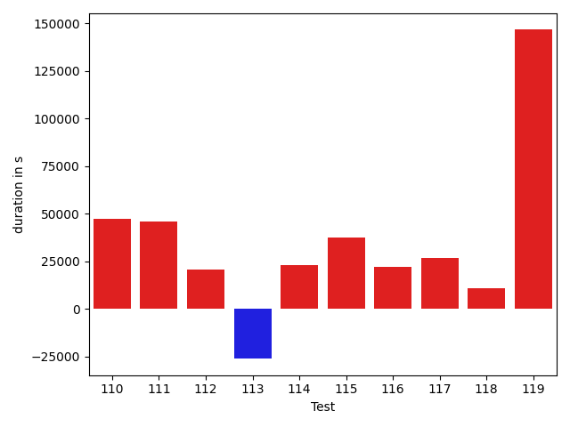

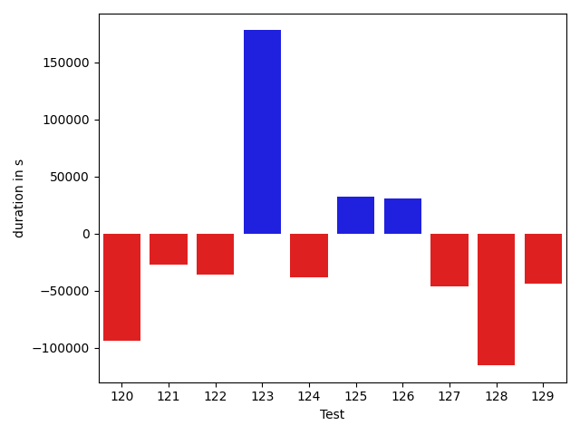

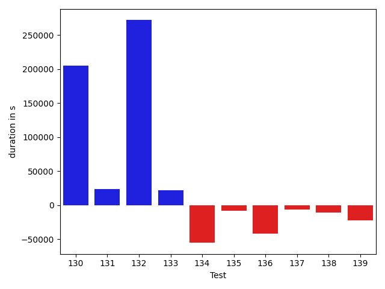

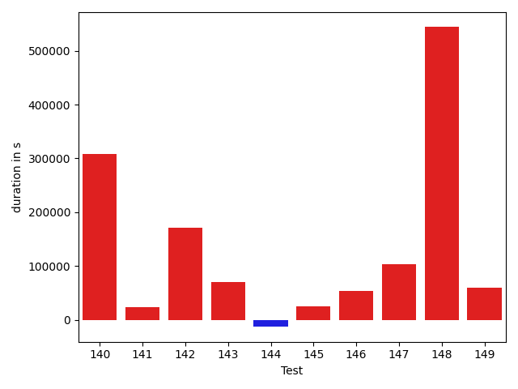

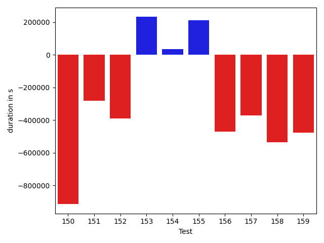

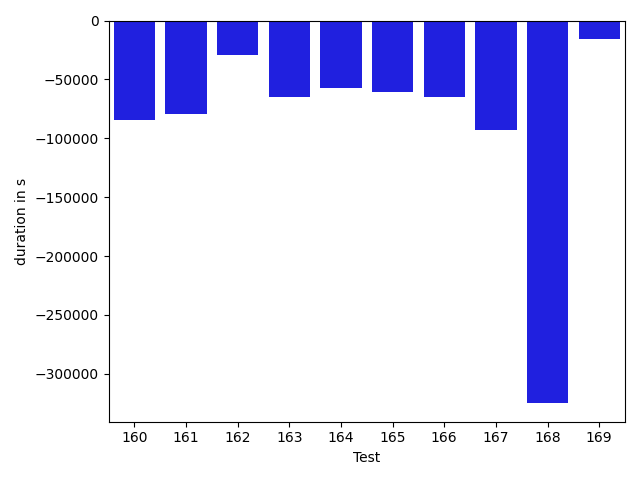

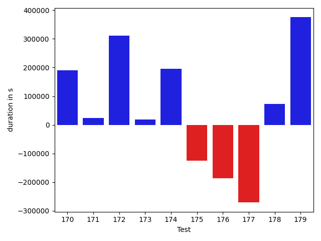

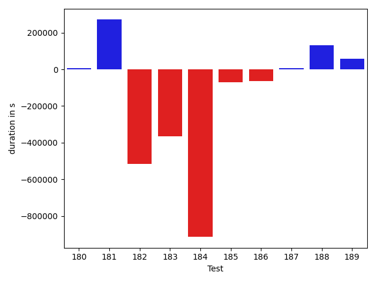

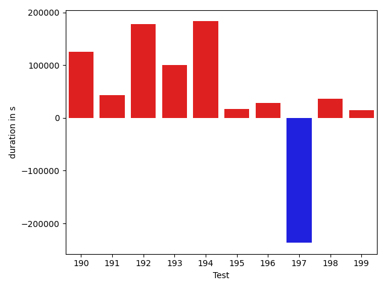

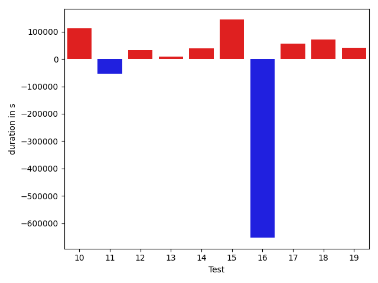

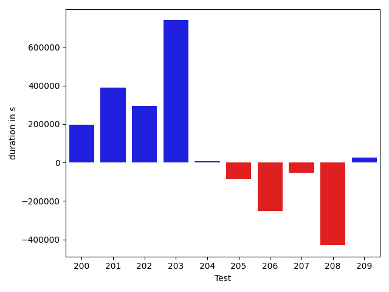

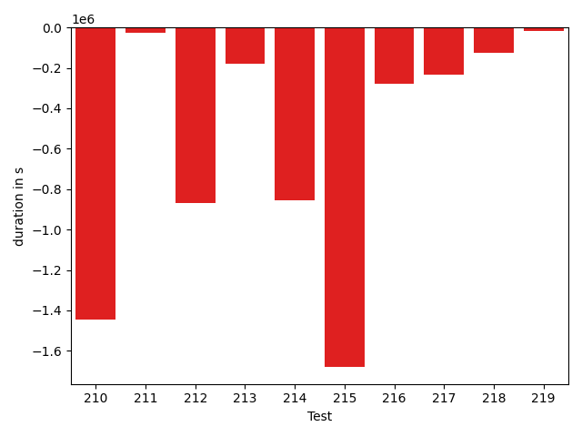

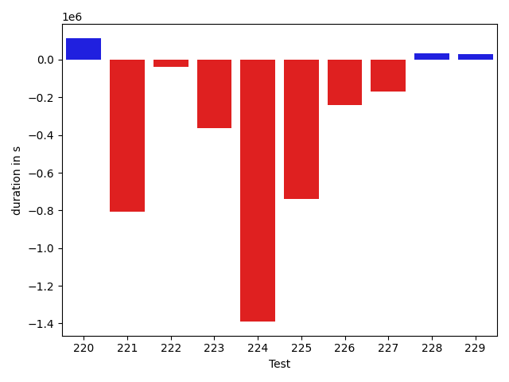

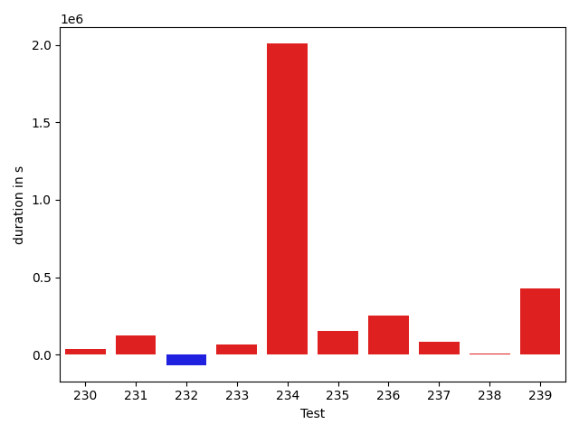

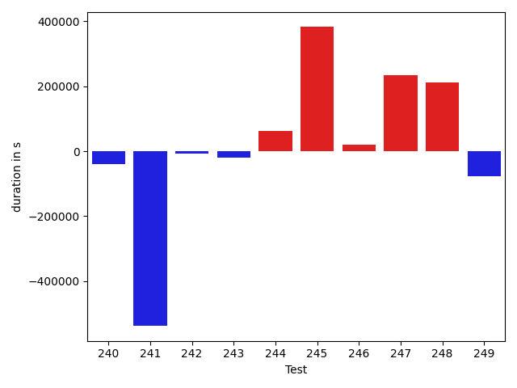

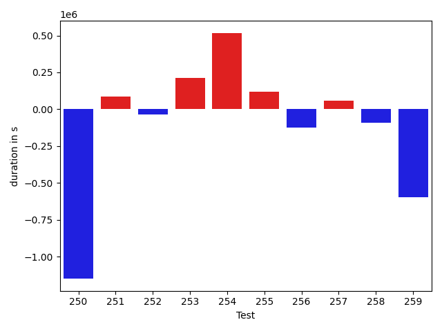

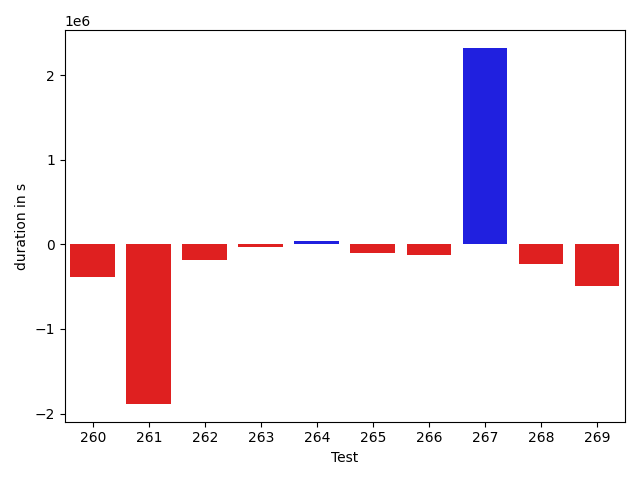

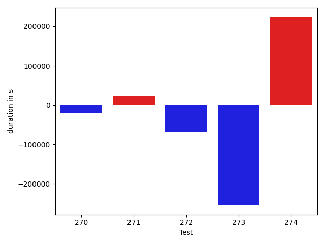

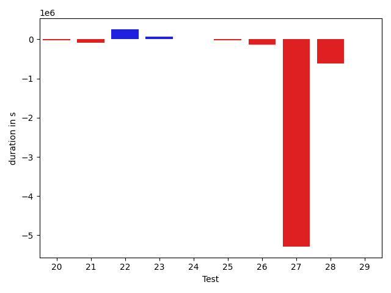

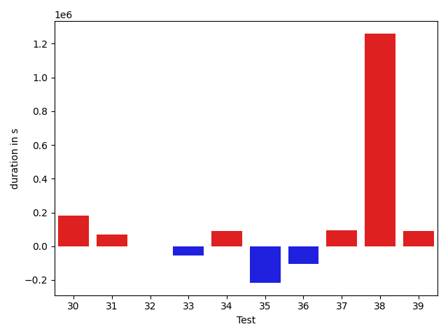

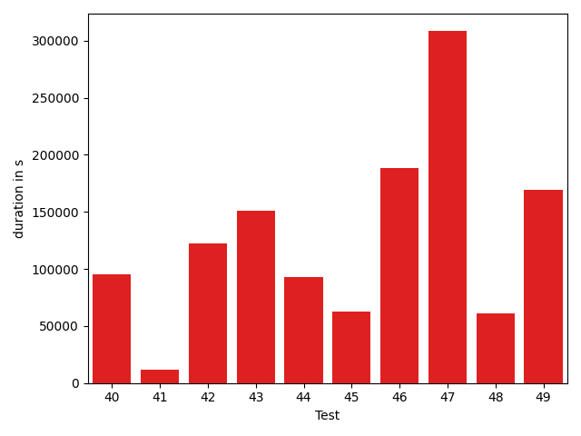

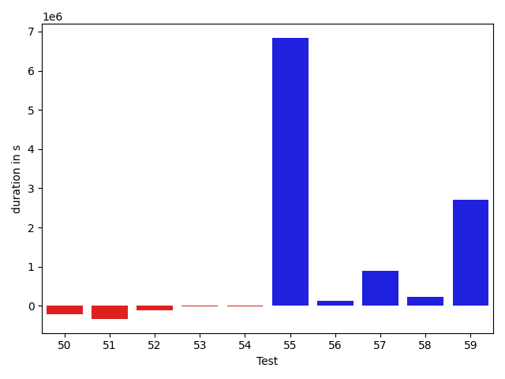

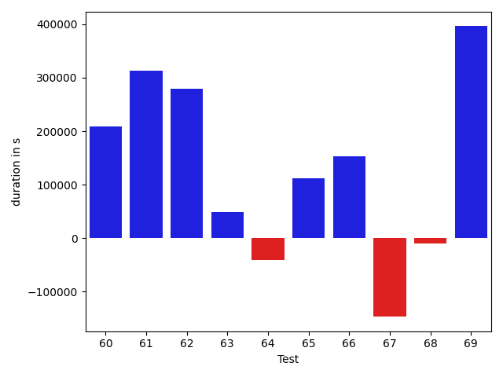

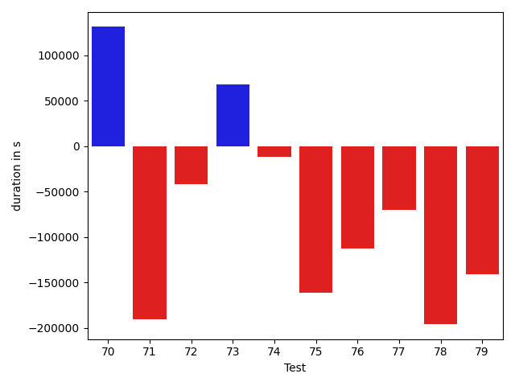

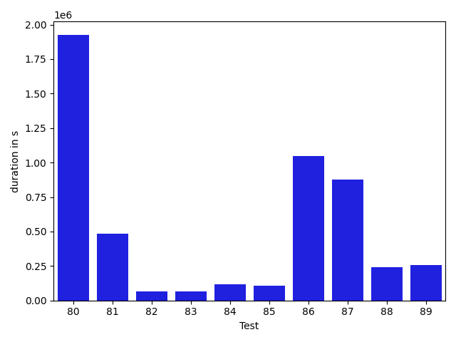

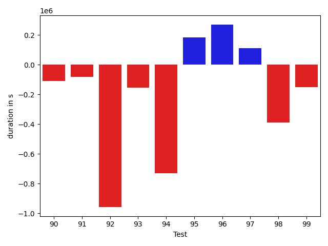

| ID | DurationV1 | DurationsV2 | DeltaDuration |
| --- | --- | --- | --- |
| 0 | 19379453.83618033 | 19026290.724315464 | -353163.1118648648 |
| 1 | 2093213.9370824953 | 2702515.0501133977 | 609301.1130309023 |
| 2 | 3270549.441699398 | 1761234.3776280796 | -1509315.0640713186 |
| 3 | 9167004.79732913 | 707966.6064500643 | -8459038.190879066 |
| 4 | 706272.4422556653 | 890688.0588161267 | 184415.61656046135 |
| 5 | 8082449.26358729 | 9745313.611486195 | 1662864.3478989042 |
| 6 | 5497587.997688744 | 5732842.233205387 | 235254.23551664315 |
| 7 | 1006504.837078474 | 937340.8199313816 | -69164.01714709238 |
| 8 | 1301412.783521384 | 2393749.2857755423 | 1092336.5022541583 |
| 9 | 960850.7205520375 | 1012632.698304936 | 51781.97775289859 |
| 10 | 750977.1735477932 | 876789.4133395598 | 125812.23979176662 |
| 11 | 527355.347681269 | 519574.69599104626 | -7780.651690222789 |
| 12 | 463616.4350820258 | 543387.6078075356 | 79771.17272550974 |
| 13 | 1486644.417472149 | 1529738.7125967974 | 43094.29512464837 |
| 14 | 617528.693438778 | 747195.6913945556 | 129666.99795577757 |
| 15 | 758596.626213548 | 781974.336478628 | 23377.71026507998 |
| 16 | 888343.336181903 | 961896.4775604731 | 73553.14137857012 |
| 17 | 610438.1215037405 | 429286.78369903564 | -181151.3378047049 |
| 18 | 501824.5870628292 | 568587.0029774904 | 66762.41591466125 |
| 19 | 554975.6528945017 | 733630.0879847237 | 178654.43509022205 |
| 20 | 504108.70037500095 | 482931.34179923683 | -21177.358575764112 |
| 21 | 571003.0676192289 | 489908.882075697 | -81094.18554353184 |
| 22 | 2245856.4866836527 | 2502302.3293425897 | 256445.84265893698 |
| 23 | 524297.4704651409 | 599842.2570823006 | 75544.78661715973 |
| 24 | 517178.70769079775 | 519069.19046841376 | 1890.4827776160091 |
| 25 | 1773978.3350392394 | 1756431.901105225 | -17546.43393401429 |
| 26 | 724746.5539492529 | 592560.1982854009 | -132186.35566385207 |
| 27 | 5894915.054345415 | 607125.0283517204 | -5287790.025993695 |
| 28 | 1148872.9779938404 | 529031.9331738949 | -619841.0448199455 |
| 29 | 439813.8601665497 | 442595.70552921295 | 2781.845362663269 |
| 30 | 701940.4304885864 | 415664.86359366775 | -286275.5668949187 |
| 31 | 644972.2132905453 | 565831.0818365538 | -79141.13145399152 |
| 32 | 882794.2897865975 | 1143796.9925948686 | 261002.70280827116 |
| 33 | 650374.8677604124 | 583714.4096094777 | -66660.45815093466 |
| 34 | 1576312.0099664943 | 1551196.4470233978 | -25115.562943096505 |
| 35 | 1176230.9041351345 | 1158137.4266494531 | -18093.47748568142 |
| 36 | 2379852.357735771 | 1944027.268925347 | -435825.0888104243 |
| 37 | 617681.3326159924 | 558175.5727327919 | -59505.75988320052 |
| 38 | 1081348.8089065186 | 899738.9182939591 | -181609.8906125595 |
| 39 | 642149.0204470871 | 537635.6371270055 | -104513.38332008163 |
| 40 | 1156926.1506969808 | 1095026.4176381151 | -61899.73305886565 |
| 41 | 772892.8777740669 | 1458165.3164142575 | 685272.4386401906 |
| 42 | 556211.2609316356 | 479027.6830344442 | -77183.5778971914 |
| 43 | 747638.1109149338 | 541621.8137616527 | -206016.29715328116 |
| 44 | 668964.2090493524 | 675905.0575670024 | 6940.848517649923 |
| 45 | 635029.2493262067 | 448163.00295803463 | -186866.2463681721 |
| 46 | 658012.630654976 | 1081963.7582547988 | 423951.1275998228 |
| 47 | 609634.4490688741 | 504371.98193342984 | -105262.46713544428 |
| 48 | 834590.3943321755 | 969185.0361720243 | 134594.64183984883 |
| 49 | 1772855.2671552598 | 416392.4219779968 | -1356462.845177263 |
| 50 | 541844.0782775879 | 330708.3546054363 | -211135.72367215157 |
| 51 | 1559584.6911626486 | 1223925.074981261 | -335659.61618138757 |
| 52 | 917145.6432339344 | 795333.713341804 | -121811.92989213043 |
| 53 | 1272728.4764451021 | 1257745.6424744027 | -14982.83397069946 |
| 54 | 1127077.2878429554 | 1107396.281388721 | -19681.006454234477 |
| 55 | 2534943.452294237 | 9373961.417217003 | 6839017.964922766 |
| 56 | 1256262.6437110803 | 1375222.5315890317 | 118959.88787795138 |
| 57 | 2280980.5891727787 | 3177338.005929986 | 896357.4167572074 |
| 58 | 1116673.3198897494 | 1334842.4740644684 | 218169.154174719 |
| 59 | 1283295.6562959612 | 3991995.631434536 | 2708699.975138575 |
| 60 | 1243676.706926093 | 1452362.3319002476 | 208685.62497415463 |
| 61 | 3065824.336210084 | 3379118.3989375206 | 313294.0627274364 |
| 62 | 563801.4719360532 | 842695.6386905743 | 278894.1667545211 |
| 63 | 1515285.7314487433 | 1563994.06535942 | 48708.33391067665 |
| 64 | 1278939.2012871613 | 1237885.4953309323 | -41053.70595622901 |
| 65 | 519008.9232099354 | 631656.3973399892 | 112647.47413005377 |
| 66 | 699672.6727368517 | 853315.8548312724 | 153643.18209442066 |
| 67 | 714895.9688004667 | 567997.0972603299 | -146898.87154013687 |
| 68 | 549114.694675386 | 538875.166683132 | -10239.527992254007 |
| 69 | 1343012.8049535383 | 1739205.9846801544 | 396193.179726616 |
| 70 | 745783.5557096459 | 876848.4507982034 | 131064.8950885575 |
| 71 | 630048.6341326243 | 439705.53572297096 | -190343.0984096533 |
| 72 | 753245.4146646871 | 711294.5840588408 | -41950.830605846364 |
| 73 | 565241.2237142096 | 632613.889240589 | 67372.66552637937 |
| 74 | 534092.2174775302 | 522721.6679327786 | -11370.549544751644 |
| 75 | 517604.506734848 | 356529.7775878906 | -161074.7291469574 |
| 76 | 593880.2041156292 | 481489.2239586711 | -112390.9801569581 |
| 77 | 825656.6156816992 | 755284.0585096951 | -70372.55717200413 |
| 78 | 650704.0852305293 | 454716.634339571 | -195987.4508909583 |
| 79 | 651845.5597486496 | 510595.3708129376 | -141250.18893571198 |
| 80 | 4737134.691983139 | 6663349.00035242 | 1926214.3083692808 |
| 81 | 3439545.6583264116 | 3925717.7908026474 | 486172.13247623574 |
| 82 | 534906.8574962277 | 599599.6676167883 | 64692.81012056058 |
| 83 | 539540.9077235851 | 607107.329630523 | 67566.42190693785 |
| 84 | 477272.7839453019 | 594244.1837718226 | 116971.3998265207 |
| 85 | 486279.2169342041 | 594165.4922196865 | 107886.2752854824 |
| 86 | 2826427.290320106 | 3874143.951258346 | 1047716.6609382401 |
| 87 | 1198829.315193649 | 2075347.943349047 | 876518.6281553982 |
| 88 | 1114946.0733276713 | 1358520.4719606473 | 243574.398632976 |
| 89 | 737979.688186157 | 994308.1518798276 | 256328.46369367058 |
| 90 | 604523.8294239044 | 496310.7723464966 | -108213.05707740784 |
| 91 | 1147951.6116119684 | 1065093.0424633522 | -82858.56914861617 |
| 92 | 1988859.9811084485 | 1032005.4299895908 | -956854.5511188577 |
| 93 | 1137416.7434739317 | 983915.3668675773 | -153501.37660635437 |
| 94 | 2431345.2893768307 | 1699957.0555354252 | -731388.2338414055 |
| 95 | 456166.79402160645 | 638295.7401123047 | 182128.94609069824 |
| 96 | 308831.6968666315 | 577850.2938132286 | 269018.5969465971 |
| 97 | 472064.1058807373 | 582505.6529762745 | 110441.54709553719 |
| 98 | 1371579.472709332 | 984155.8311982267 | -387423.64151110523 |
| 99 | 1016814.9353424319 | 864703.4944674432 | -152111.44087498868 |
| 100 | 1400884.8689466384 | 1164091.5512983317 | -236793.31764830672 |
| 101 | 1343198.4494533346 | 1561691.740000774 | 218493.29054743936 |
| 102 | 1218784.138193994 | 1361546.207008536 | 142762.0688145419 |
| 103 | 660507.5434103478 | 536434.5112066932 | -124073.03220365453 |
| 104 | 1202632.772639588 | 1502135.770095713 | 299502.997456125 |
| 105 | 1254402.6719488502 | 1078044.5109004308 | -176358.1610484193 |
| 106 | 761459.9985333631 | 858991.602576222 | 97531.60404285893 |
| 107 | 770815.552309077 | 800706.2656200577 | 29890.713310980704 |
| 108 | 1050322.344479759 | 973589.0110657852 | -76733.3334139738 |
| 109 | 620146.7556317784 | 521378.4669928686 | -98768.28863890981 |
| 110 | 894124.8290758479 | 748507.5708748276 | -145617.2582010203 |
| 111 | 858147.1439679539 | 1011883.7302123132 | 153736.58624435938 |
| 112 | 1210380.9346143738 | 792822.3807118372 | -417558.55390253663 |
| 113 | 5305472.039524979 | 11458301.47757734 | 6152829.438052361 |
| 114 | 660757.8167383717 | 663782.7784205704 | 3024.9616821986856 |
| 115 | 1526242.3724172453 | 1584400.8759009321 | 58158.50348368683 |
| 116 | 650706.6223099204 | 643308.5622927076 | -7398.06001721276 |
| 117 | 510995.3772305483 | 575805.7687879801 | 64810.39155743178 |
| 118 | 430329.03160858154 | 417568.1584199667 | -12760.873188614845 |
| 119 | 586038.2405415368 | 519259.39548144524 | -66778.84506009158 |
| 120 | 548338.8616011888 | 454579.40526020527 | -93759.45634098351 |
| 121 | 453708.69033813477 | 426557.01257687807 | -27151.677761256695 |
| 122 | 561097.9280868657 | 525273.3054897785 | -35824.622597087175 |
| 123 | 510643.4724362884 | 688582.6875826262 | 177939.21514633787 |
| 124 | 562465.06569314 | 524522.5119470842 | -37942.55374605581 |
| 125 | 411757.7632020563 | 444349.696223855 | 32591.93302179873 |
| 126 | 359211.4447917938 | 389773.11618232727 | 30561.671390533447 |
| 127 | 500808.8666189951 | 454191.0281608693 | -46617.83845812577 |
| 128 | 712658.1321183704 | 597177.2885995134 | -115480.84351885703 |
| 129 | 461236.1946863048 | 417278.4519121051 | -43957.742774199694 |
| 130 | 616415.520788969 | 821190.4079497338 | 204774.88716076477 |
| 131 | 577552.4841126322 | 601526.8687740038 | 23974.384661371587 |
| 132 | 340783.53172144294 | 612659.9764452279 | 271876.4447237849 |
| 133 | 458566.8552932739 | 480419.8996582031 | 21853.0443649292 |
| 134 | 533112.2820835114 | 477862.4212961495 | -55249.86078736186 |
| 135 | 464182.5496826172 | 456411.08079049736 | -7771.468892119825 |
| 136 | 547348.5816511359 | 505337.02849891025 | -42011.55315222568 |
| 137 | 448966.1855302304 | 442861.0684863329 | -6105.11704389751 |
| 138 | 436935.60165405273 | 426561.57019501925 | -10374.03145903349 |
| 139 | 378281.5161743164 | 355730.46464538574 | -22551.051528930664 |
| 140 | 498655.36834448576 | 568744.8224967718 | 70089.45415228605 |
| 141 | 425508.1146621704 | 453073.95229415596 | 27565.837631985545 |
| 142 | 473334.4574520588 | 494237.8557033539 | 20903.39825129509 |
| 143 | 421446.1625421047 | 418984.5005726814 | -2461.661969423294 |
| 144 | 384775.75834941864 | 405633.6180419922 | 20857.859692573547 |
| 145 | 11916350.023166109 | 2861478.401861345 | -9054871.621304763 |
| 146 | 1142154.000087159 | 566744.3653967768 | -575409.6346903822 |
| 147 | 1026787.3199701322 | 777375.9796016982 | -249411.34036843397 |
| 148 | 425821.7053222656 | 518601.72586753964 | 92780.02054527402 |
| 149 | 633685.5362160713 | 601996.6893871098 | -31688.846828961512 |
| 150 | 1405347.5845966656 | 490045.08885473013 | -915302.4957419354 |
| 151 | 713200.8894431393 | 430233.96736659855 | -282966.92207654077 |
| 152 | 765249.3353641033 | 374336.8188905716 | -390912.5164735317 |
| 153 | 539460.743746615 | 770732.5065280497 | 231271.7627814347 |
| 154 | 1062493.5794247398 | 1097025.5179807935 | 34531.938556053676 |
| 155 | 562758.0214708664 | 775212.7450642586 | 212454.72359339218 |
| 156 | 1075095.9991230913 | 602462.4964521556 | -472633.5026709357 |
| 157 | 1277270.2302030486 | 906365.5594054963 | -370904.6707975522 |
| 158 | 1583334.8621720665 | 1046667.4723874588 | -536667.3897846077 |
| 159 | 1599363.6011383068 | 1122132.4392531156 | -477231.1618851912 |
| 160 | 882703.1817359366 | 867466.6230960507 | -15236.558639885858 |
| 161 | 3940731.964193451 | 3030317.7854811186 | -910414.1787123326 |
| 162 | 1201492.1027518637 | 1499276.8727851508 | 297784.7700332871 |
| 163 | 563758.9468033796 | 740715.0136747529 | 176956.06687137333 |
| 164 | 647400.1372327323 | 865747.9902470416 | 218347.8530143093 |
| 165 | 611863.9065141194 | 864136.2507906588 | 252272.3442765394 |
| 166 | 689953.8094574644 | 1387193.239495756 | 697239.4300382917 |
| 167 | 637339.1124222734 | 1125104.175604646 | 487765.0631823727 |
| 168 | 1243390.5860796752 | 1372865.4037464368 | 129474.81766676158 |
| 169 | 571828.0849142466 | 483334.4663416892 | -88493.61857255735 |
| 170 | 685728.0678227829 | 876590.8384949408 | 190862.77067215787 |
| 171 | 1375408.7710090675 | 1399748.1030129245 | 24339.33200385701 |
| 172 | 528676.4355019182 | 839932.6254894882 | 311256.18998757005 |
| 173 | 646230.5336305127 | 664446.1642239944 | 18215.630593481706 |
| 174 | 725272.6342591529 | 921048.3851337339 | 195775.75087458093 |
| 175 | 663479.0112884823 | 538887.0150307042 | -124591.99625777814 |
| 176 | 570164.1554985046 | 384220.1951289177 | -185943.96036958694 |
| 177 | 882783.5280387512 | 611280.235868454 | -271503.29217029724 |
| 178 | 483485.17736816406 | 555476.0058184883 | 71990.82845032425 |
| 179 | 2854973.2852004603 | 3230678.3623904027 | 375705.07718994236 |
| 180 | 457780.33803353086 | 465571.5081050396 | 7791.170071508735 |
| 181 | 544769.8752019195 | 816327.8289219224 | 271557.9537200029 |
| 182 | 1196385.5909291767 | 680219.7154414265 | -516165.87548775016 |
| 183 | 968185.0696089786 | 602976.8152570807 | -365208.25435189786 |
| 184 | 2953978.497760676 | 2039349.5619331584 | -914628.9358275174 |
| 185 | 726116.4089366545 | 656327.1856652898 | -69789.2232713647 |
| 186 | 517260.0071726854 | 454503.55138130486 | -62756.45579138055 |
| 187 | 1406735.9641851375 | 1414658.6061583518 | 7922.641973214224 |
| 188 | 2182471.51778085 | 2314021.7435096344 | 131550.22572878422 |
| 189 | 618746.9301790886 | 678268.7126779236 | 59521.782498835004 |
| 190 | 657322.5715799064 | 700117.455206583 | 42794.88362667663 |
| 191 | 1032259.556851066 | 932702.5775366006 | -99556.97931446531 |
| 192 | 680286.6859601671 | 499351.9458689128 | -180934.7400912543 |
| 193 | 763837.1551493746 | 624914.645955841 | -138922.50919353357 |
| 194 | 1376095.9830558936 | 1350941.4803261799 | -25154.502729713684 |
| 195 | 912510.2437621574 | 883146.8349153937 | -29363.40884676366 |
| 196 | 3706886.5915690316 | 6335524.918429003 | 2628638.3268599715 |
| 197 | 735546.3705784116 | 1352359.3831084627 | 616813.012530051 |
| 198 | 594986.3192026005 | 836409.2014421059 | 241422.88223950542 |
| 199 | 440417.72423170484 | 757292.7981492667 | 316875.0739175619 |
| 200 | 704266.755181767 | 899248.8376937644 | 194982.08251199732 |
| 201 | 411390.8644457811 | 799506.5713289864 | 388115.70688320533 |
| 202 | 629608.2548186141 | 924187.3730055544 | 294579.1181869403 |
| 203 | 605794.5249244934 | 1343935.7889985384 | 738141.264074045 |
| 204 | 840149.6683707633 | 845401.3813984678 | 5251.713027704507 |
| 205 | 905137.6130749309 | 820352.0209810635 | -84785.59209386737 |
| 206 | 2254251.8766599074 | 2000506.655740546 | -253745.22091936134 |
| 207 | 989399.0287501882 | 935213.086797896 | -54185.941952292225 |
| 208 | 1403077.5567552536 | 973119.9906719113 | -429957.5660833423 |
| 209 | 641866.1213150024 | 666033.6264796853 | 24167.505164682865 |
| 210 | 2210560.8410527594 | 763260.2125302455 | -1447300.628522514 |
| 211 | 747241.3828750768 | 718837.9310631439 | -28403.45181193296 |
| 212 | 1877956.2445096984 | 1010843.4086542211 | -867112.8358554773 |
| 213 | 714459.5622083341 | 532783.5868012074 | -181675.9754071267 |
| 214 | 1649542.3423978556 | 795493.7121757308 | -854048.6302221247 |
| 215 | 2578002.5334017538 | 898276.484143688 | -1679726.0492580659 |
| 216 | 661992.2275872044 | 383351.0017545223 | -278641.2258326821 |
| 217 | 695747.9288312248 | 463510.6759664576 | -232237.25286476722 |
| 218 | 1053017.8723092298 | 929829.3238050895 | -123188.54850414034 |
| 219 | 705504.9668285925 | 689894.724676071 | -15610.242152521503 |
| 220 | 627429.1540964188 | 741257.1120179963 | 113827.9579215775 |
| 221 | 1691267.908519173 | 883300.1182982419 | -807967.7902209312 |
| 222 | 1100090.041563588 | 1063507.3820966727 | -36582.6594669153 |
| 223 | 1139089.8722346378 | 775498.0619034093 | -363591.81033122854 |
| 224 | 2241784.5728199286 | 852643.0858621849 | -1389141.4869577438 |
| 225 | 1706989.3440854973 | 967005.930224665 | -739983.4138608323 |
| 226 | 720157.2339932777 | 480326.10660120216 | -239831.1273920755 |
| 227 | 842787.5513022095 | 671943.1923402026 | -170844.35896200687 |
| 228 | 479224.40829357505 | 513158.5896413326 | 33934.18134775758 |
| 229 | 553266.3731937199 | 581794.93035236 | 28528.55715864012 |
| 230 | 1003447.533013083 | 704116.5985602362 | -299330.9344528469 |
| 231 | 1524731.3157304293 | 812496.6460706401 | -712234.6696597892 |
| 232 | 646930.6333007812 | 671041.5911590054 | 24110.957858224167 |
| 233 | 9059068.222259043 | 6628079.170522565 | -2430989.0517364778 |
| 234 | 13882737.571991416 | 7032592.711563423 | -6850144.860427992 |
| 235 | 574694.3077492922 | 566293.8672251281 | -8400.440524164122 |
| 236 | 958475.8319558967 | 714950.5251714726 | -243525.30678442412 |
| 237 | 1650622.504894258 | 2673511.4585088594 | 1022888.9536146014 |
| 238 | 591183.448002354 | 558470.9519842056 | -32712.496018148377 |
| 239 | 642471.8759385811 | 911109.839718454 | 268637.963779873 |
| 240 | 497014.171812824 | 437169.9551083697 | -59844.21670445427 |
| 241 | 3056343.500534309 | 6157579.7236049045 | 3101236.2230705954 |
| 242 | 718851.5603945449 | 1076069.7338080336 | 357218.1734134888 |
| 243 | 838168.317350355 | 1454464.7696775205 | 616296.4523271655 |
| 244 | 1417343.7535332383 | 1192162.291508772 | -225181.46202446637 |
| 245 | 999971.1699023807 | 1065766.3554189112 | 65795.18551653053 |
| 246 | 473766.24539631605 | 732976.2127263546 | 259209.96733003855 |
| 247 | 768896.6582930433 | 890760.1550917681 | 121863.49679872487 |
| 248 | 466623.630194664 | 420144.1790766071 | -46479.451118056895 |
| 249 | 742592.911717486 | 1680446.211379495 | 937853.299662009 |
| 250 | 1316856.2929976573 | 1297101.7301686243 | -19754.562829033006 |
| 251 | 2259242.890710961 | 1419978.864135753 | -839264.0265752082 |
| 252 | 830931.4897000275 | 698346.7336127427 | -132584.75608728477 |
| 253 | 669359.5032509058 | 770734.6534527043 | 101375.15020179853 |
| 254 | 766554.3040633681 | 945531.087691497 | 178976.78362812893 |
| 255 | 863466.548324895 | 1420104.0223258862 | 556637.4740009912 |
| 256 | 975079.0689189913 | 695281.0030421447 | -279798.06587684655 |
| 257 | 780056.0929526319 | 883702.1970055351 | 103646.10405290325 |
| 258 | 2202949.1250130124 | 6390337.725746128 | 4187388.6007331153 |
| 259 | 1143067.3938977628 | 571908.4277722123 | -571158.9661255504 |
| 260 | 1189097.2610088626 | 805620.2767742558 | -383476.98423460685 |
| 261 | 2478092.1896874947 | 591428.4360059821 | -1886663.7536815125 |
| 262 | 822672.529271841 | 635395.2346372227 | -187277.29463461833 |
| 263 | 612936.4266637721 | 586826.3313109853 | -26110.095352786826 |
| 264 | 747083.7108728567 | 792704.668476999 | 45620.95760414237 |
| 265 | 824149.626055479 | 728116.0911531448 | -96033.53490233421 |
| 266 | 1515788.0644836347 | 1387260.1416691802 | -128527.92281445442 |
| 267 | 2057176.69709865 | 4381523.582534552 | 2324346.8854359016 |
| 268 | 998486.1928264378 | 765934.6510136137 | -232551.54181282409 |
| 269 | 964295.3932325636 | 466784.0224618169 | -497511.3707707467 |
| 270 | 1257032.027210662 | 905509.3477831414 | -351522.6794275205 |
| 271 | 603203.5807750763 | 485591.7594144661 | -117611.82136061019 |
| 272 | 783325.7427543476 | 819635.6228907135 | 36309.880136365886 |
| 273 | 509554.7958250046 | 604112.2944970131 | 94557.49867200851 |
| 274 | 536473.1818903383 | 806217.1465180195 | 269743.9646276812 |

## Misc.

| ID | Test Class | Test Method |
| --- | --- | --- |
| 0 | com.google.gson.DefaultDateTypeAdapterTest | testParsingDatesFormattedWithUsLocale |
| 1 | com.google.gson.DefaultDateTypeAdapterTest | testFormattingInEnUs |
| 2 | com.google.gson.DefaultDateTypeAdapterTest | testFormatUsesDefaultTimezone |
| 3 | com.google.gson.DefaultDateTypeAdapterTest | testDatePattern |
| 4 | com.google.gson.DefaultDateTypeAdapterTest | testDateSerialization |
| 5 | com.google.gson.DefaultDateTypeAdapterTest | testParsingDatesFormattedWithSystemLocale |
| 6 | com.google.gson.DefaultDateTypeAdapterTest | testFormattingInFr |
| 7 | com.google.gson.functional.PrimitiveTest | testDeserializePrimitiveWrapperAsObjectField |
| 8 | com.google.gson.functional.PrimitiveTest | testMoreSpecificSerialization |
| 9 | com.google.gson.functional.StreamingTypeAdaptersTest | testNullSafe |
| 10 | com.google.gson.functional.StreamingTypeAdaptersTest | testSerializeWithCustomTypeAdapter |
| 11 | com.google.gson.functional.StreamingTypeAdaptersTest | testDeserializeWithCustomTypeAdapter |
| 12 | com.google.gson.functional.StreamingTypeAdaptersTest | testSerializeRecursive |
| 13 | com.google.gson.functional.CustomDeserializerTest | testDefaultConstructorNotCalledOnField |
| 14 | com.google.gson.functional.CustomDeserializerTest | testCustomDeserializerReturnsNullForArrayElementsForArrayField |
| 15 | com.google.gson.functional.CustomDeserializerTest | testCustomDeserializerReturnsNull |
| 16 | com.google.gson.functional.CustomDeserializerTest | testJsonTypeFieldBasedDeserialization |
| 17 | com.google.gson.functional.CustomDeserializerTest | testDefaultConstructorNotCalledOnObject |
| 18 | com.google.gson.functional.ExclusionStrategyFunctionalTest | testExclusionStrategySerializationDoesNotImpactSerialization |
| 19 | com.google.gson.functional.ExclusionStrategyFunctionalTest | testExclusionStrategyWithMode |
| 20 | com.google.gson.functional.ExclusionStrategyFunctionalTest | testExcludeTopLevelClassDeserializationDoesNotImpactSerialization |
| 21 | com.google.gson.functional.ExclusionStrategyFunctionalTest | testExclusionStrategyDeserialization |
| 22 | com.google.gson.functional.ExclusionStrategyFunctionalTest | testExclusionStrategySerialization |
| 23 | com.google.gson.functional.ExclusionStrategyFunctionalTest | testExclusionStrategySerializationDoesNotImpactDeserialization |
| 24 | com.google.gson.functional.ExclusionStrategyFunctionalTest | testExcludeTopLevelClassSerializationDoesNotImpactDeserialization |
| 25 | com.google.gson.MixedStreamTest | testReaderDoesNotMutateState |
| 26 | com.google.gson.MixedStreamTest | testWriteDoesNotMutateState |
| 27 | com.google.gson.MixedStreamTest | testWriteMixedStreamed |
| 28 | com.google.gson.MixedStreamTest | testReadMixedStreamed |
| 29 | com.google.gson.MixedStreamTest | testWriteClosed |
| 30 | com.google.gson.MixedStreamTest | testWriteInvalidState |
| 31 | com.google.gson.functional.DefaultTypeAdaptersTest | testDateSerializationWithPatternNotOverridenByTypeAdapter |
| 32 | com.google.gson.functional.DefaultTypeAdaptersTest | testDefaultJavaSqlTimestampDeserialization |
| 33 | com.google.gson.functional.DefaultTypeAdaptersTest | testDefaultJavaSqlTimestampSerialization |
| 34 | com.google.gson.functional.DefaultTypeAdaptersTest | testDefaultDateDeserializationUsingBuilder |
| 35 | com.google.gson.functional.DefaultTypeAdaptersTest | testUrlNullSerialization |
| 36 | com.google.gson.functional.DefaultTypeAdaptersTest | testNullSerialization |
| 37 | com.google.gson.functional.DefaultTypeAdaptersTest | testDateDeserializationWithPattern |
| 38 | com.google.gson.functional.DefaultTypeAdaptersTest | testDateSerializationInCollection |
| 39 | com.google.gson.functional.DefaultTypeAdaptersTest | testDefaultDateSerialization |
| 40 | com.google.gson.functional.DefaultTypeAdaptersTest | testDefaultDateDeserialization |
| 41 | com.google.gson.functional.DefaultTypeAdaptersTest | testBigDecimalFieldSerialization |
| 42 | com.google.gson.functional.DefaultTypeAdaptersTest | testDefaultDateSerializationUsingBuilder |
| 43 | com.google.gson.functional.DefaultTypeAdaptersTest | testSqlDateSerialization |
| 44 | com.google.gson.functional.DefaultTypeAdaptersTest | testTimestampSerialization |
| 45 | com.google.gson.functional.DefaultTypeAdaptersTest | testBadValueForBigDecimalDeserialization |
| 46 | com.google.gson.functional.DefaultTypeAdaptersTest | testDateSerializationWithPattern |
| 47 | com.google.gson.functional.DefaultTypeAdaptersTest | testBigIntegerFieldDeserialization |
| 48 | com.google.gson.functional.DefaultTypeAdaptersTest | testBigIntegerFieldSerialization |
| 49 | com.google.gson.functional.DefaultTypeAdaptersTest | testBigDecimalFieldDeserialization |
| 50 | com.google.gson.functional.DefaultTypeAdaptersTest | testUrlNullDeserialization |
| 51 | com.google.gson.functional.ParameterizedTypesTest | testParameterizedTypeGenericArraysSerialization |
| 52 | com.google.gson.functional.ParameterizedTypesTest | testParameterizedTypesWithWriterSerialization |
| 53 | com.google.gson.functional.ParameterizedTypesTest | testVariableTypeArrayDeserialization |
| 54 | com.google.gson.functional.ParameterizedTypesTest | testParameterizedTypeWithReaderDeserialization |
| 55 | com.google.gson.functional.ParameterizedTypesTest | testParameterizedTypesSerialization |
| 56 | com.google.gson.functional.ParameterizedTypesTest | testVariableTypeDeserialization |
| 57 | com.google.gson.functional.ParameterizedTypesTest | testVariableTypeFieldsAndGenericArraysSerialization |
| 58 | com.google.gson.functional.ParameterizedTypesTest | testParameterizedTypeGenericArraysDeserialization |
| 59 | com.google.gson.functional.ParameterizedTypesTest | testParameterizedTypeDeserialization |
| 60 | com.google.gson.functional.ParameterizedTypesTest | testTypesWithMultipleParametersDeserialization |
| 61 | com.google.gson.functional.ParameterizedTypesTest | testTypesWithMultipleParametersSerialization |
| 62 | com.google.gson.functional.ParameterizedTypesTest | testDeepParameterizedTypeDeserialization |
| 63 | com.google.gson.functional.ParameterizedTypesTest | testVariableTypeFieldsAndGenericArraysDeserialization |
| 64 | com.google.gson.functional.ParameterizedTypesTest | testParameterizedTypeWithVariableTypeDeserialization |
| 65 | com.google.gson.functional.ParameterizedTypesTest | testDeepParameterizedTypeSerialization |
| 66 | com.google.gson.functional.NamingPolicyTest | testAtSignInSerializedName |
| 67 | com.google.gson.functional.NamingPolicyTest | testGsonWithNonDefaultFieldNamingPolicySerialization |
| 68 | com.google.gson.functional.NamingPolicyTest | testGsonWithLowerCaseDashPolicyDeserialiation |
| 69 | com.google.gson.functional.NamingPolicyTest | testGsonDuplicateNameUsingSerializedNameFieldNamingPolicySerialization |
| 70 | com.google.gson.functional.NamingPolicyTest | testGsonWithSerializedNameFieldNamingPolicySerialization |
| 71 | com.google.gson.functional.NamingPolicyTest | testGsonWithLowerCaseUnderscorePolicySerialization |
| 72 | com.google.gson.functional.NamingPolicyTest | testComplexFieldNameStrategy |
| 73 | com.google.gson.functional.NamingPolicyTest | testGsonWithLowerCaseUnderscorePolicyDeserialiation |
| 74 | com.google.gson.functional.NamingPolicyTest | testGsonWithSerializedNameFieldNamingPolicyDeserialization |
| 75 | com.google.gson.functional.NamingPolicyTest | testGsonWithUpperCamelCaseSpacesPolicySerialiation |
| 76 | com.google.gson.functional.NamingPolicyTest | testGsonWithUpperCamelCaseSpacesPolicyDeserialiation |
| 77 | com.google.gson.functional.NamingPolicyTest | testDeprecatedNamingStrategy |
| 78 | com.google.gson.functional.NamingPolicyTest | testGsonWithLowerCaseDashPolicySerialization |
| 79 | com.google.gson.functional.NamingPolicyTest | testGsonWithNonDefaultFieldNamingPolicyDeserialiation |
| 80 | com.google.gson.functional.CircularReferenceTest | testCircularSerialization |
| 81 | com.google.gson.functional.CircularReferenceTest | testSelfReferenceArrayFieldSerialization |
| 82 | com.google.gson.functional.CircularReferenceTest | testDirectedAcyclicGraphDeserialization |
| 83 | com.google.gson.functional.CircularReferenceTest | testSelfReferenceIgnoredInSerialization |
| 84 | com.google.gson.functional.CircularReferenceTest | testDirectedAcyclicGraphSerialization |
| 85 | com.google.gson.functional.InheritanceTest | testBaseSerializedAsSubWhenSpecifiedWithExplicitType |
| 86 | com.google.gson.functional.InheritanceTest | testSubInterfacesOfCollectionSerialization |
| 87 | com.google.gson.functional.InheritanceTest | testSubClassSerialization |
| 88 | com.google.gson.functional.InheritanceTest | testSubInterfacesOfCollectionDeserialization |
| 89 | com.google.gson.functional.InheritanceTest | testClassWithBaseCollectionFieldSerialization |
| 90 | com.google.gson.functional.InheritanceTest | testBaseSerializedAsSubForToJsonMethod |
| 91 | com.google.gson.functional.InheritanceTest | testClassWithBaseArrayFieldSerialization |
| 92 | com.google.gson.functional.InheritanceTest | testSubClassDeserialization |
| 93 | com.google.gson.functional.InheritanceTest | testClassWithBaseFieldSerialization |
| 94 | com.google.gson.functional.InheritanceTest | testBaseSerializedAsBaseWhenSpecifiedWithExplicitTypeForToJsonMethod |
| 95 | com.google.gson.functional.InheritanceTest | testBaseSerializedAsSub |
| 96 | com.google.gson.functional.InheritanceTest | testBaseSerializedAsBaseWhenSpecifiedWithExplicitType |
| 97 | com.google.gson.functional.InheritanceTest | testBaseSerializedAsSubWhenSpecifiedWithExplicitTypeForToJsonMethod |
| 98 | com.google.gson.functional.PrettyPrintingTest | testEmptyMapField |
| 99 | com.google.gson.functional.PrettyPrintingTest | testPrettyPrintArrayOfObjects |
| 100 | com.google.gson.functional.PrettyPrintingTest | testPrettyPrintList |
| 101 | com.google.gson.functional.MapTest | testMapSerializationWithNullValues |
| 102 | com.google.gson.functional.MapTest | testInterfaceTypeMapWithSerializer |
| 103 | com.google.gson.functional.MapTest | testMapSerializationWithNullValuesSerialized |
| 104 | com.google.gson.functional.MapTest | testInterfaceTypeMap |
| 105 | com.google.gson.functional.MapTest | testComplexKeysSerialization |
| 106 | com.google.gson.functional.MapTest | testComplexKeysDeserialization |
| 107 | com.google.gson.functional.MapTest | testGeneralMapField |
| 108 | com.google.gson.functional.ObjectTest | testEmptyCollectionInAnObjectDeserialization |
| 109 | com.google.gson.functional.ObjectTest | testNestedSerialization |
| 110 | com.google.gson.functional.ObjectTest | testArrayOfArraysDeserialization |
| 111 | com.google.gson.functional.ObjectTest | testSingletonLists |
| 112 | com.google.gson.functional.ObjectTest | testArrayOfObjectsAsFields |
| 113 | com.google.gson.functional.ObjectTest | testDateAsMapObjectField |
| 114 | com.google.gson.functional.ObjectTest | testInnerClassSerialization |
| 115 | com.google.gson.functional.ObjectTest | testArrayOfArraysSerialization |
| 116 | com.google.gson.functional.ObjectTest | testArrayOfObjectsSerialization |
| 117 | com.google.gson.functional.ObjectTest | testNullFieldsSerialization |
| 118 | com.google.gson.functional.ObjectTest | testEmptyCollectionInAnObjectSerialization |
| 119 | com.google.gson.functional.ObjectTest | testArrayOfObjectsDeserialization |
| 120 | com.google.gson.functional.ObjectTest | testNullObjectFieldsDeserialization |
| 121 | com.google.gson.functional.ObjectTest | testPrimitiveArrayFieldSerialization |
| 122 | com.google.gson.functional.ObjectTest | testPrimitiveArrayInAnObjectDeserialization |
| 123 | com.google.gson.functional.ObjectTest | testJsonInSingleQuotesDeserialization |
| 124 | com.google.gson.functional.ObjectTest | testBagOfPrimitiveWrappersDeserialization |
| 125 | com.google.gson.functional.ObjectTest | testStringFieldWithNumberValueDeserialization |
| 126 | com.google.gson.functional.ObjectTest | testNullArraysDeserialization |
| 127 | com.google.gson.functional.ObjectTest | testNullFieldsDeserialization |
| 128 | com.google.gson.functional.ObjectTest | testClassWithTransientFieldsSerialization |
| 129 | com.google.gson.functional.ObjectTest | testBagOfPrimitivesDeserialization |
| 130 | com.google.gson.functional.ObjectTest | testInnerClassDeserialization |
| 131 | com.google.gson.functional.ObjectTest | testBagOfPrimitiveWrappersSerialization |
| 132 | com.google.gson.functional.ObjectTest | testJsonInMixedQuotesDeserialization |
| 133 | com.google.gson.functional.ObjectTest | testStringFieldWithEmptyValueDeserialization |
| 134 | com.google.gson.functional.ObjectTest | testStringFieldWithEmptyValueSerialization |
| 135 | com.google.gson.functional.ObjectTest | testObjectFieldNamesWithoutQuotesDeserialization |
| 136 | com.google.gson.functional.ObjectTest | testNestedDeserialization |
| 137 | com.google.gson.functional.ObjectTest | testPrivateNoArgConstructorDeserialization |
| 138 | com.google.gson.functional.ObjectTest | testClassWithTransientFieldsDeserializationTransientFieldsPassedInJsonAreIgnored |
| 139 | com.google.gson.functional.ObjectTest | testClassWithNoFieldsDeserialization |
| 140 | com.google.gson.functional.ObjectTest | testBagOfPrimitivesSerialization |
| 141 | com.google.gson.functional.ObjectTest | testNullPrimitiveFieldsDeserialization |
| 142 | com.google.gson.functional.ObjectTest | testClassWithTransientFieldsDeserialization |
| 143 | com.google.gson.functional.ObjectTest | testClassWithObjectFieldSerialization |
| 144 | com.google.gson.functional.ObjectTest | testClassWithNoFieldsSerialization |
| 145 | com.google.gson.functional.ExposeFieldsTest | testNullExposeFieldSerialization |
| 146 | com.google.gson.functional.ExposeFieldsTest | testArrayWithOneNullExposeFieldObjectSerialization |
| 147 | com.google.gson.functional.ExposeFieldsTest | testExposedInterfaceFieldSerialization |
| 148 | com.google.gson.functional.ExposeFieldsTest | testNoExposedFieldDeserialization |
| 149 | com.google.gson.functional.ExposeFieldsTest | testNoExposedFieldSerialization |
| 150 | com.google.gson.functional.ExposeFieldsTest | testExposeAnnotationDeserialization |
| 151 | com.google.gson.functional.ExposeFieldsTest | testExposeAnnotationSerialization |
| 152 | com.google.gson.functional.ExposeFieldsTest | testExposedInterfaceFieldDeserialization |
| 153 | com.google.gson.functional.FieldExclusionTest | testDefaultNestedStaticClassIncluded |
| 154 | com.google.gson.functional.FieldExclusionTest | testDefaultInnerClassExclusion |
| 155 | com.google.gson.functional.CollectionTest | testRawCollectionSerialization |
| 156 | com.google.gson.functional.CollectionTest | testCollectionOfBagOfPrimitivesSerialization |
| 157 | com.google.gson.functional.CollectionTest | testSetDeserialization |
| 158 | com.google.gson.functional.CollectionTest | testWildcardCollectionField |
| 159 | com.google.gson.functional.CollectionTest | testSetSerialization |
| 160 | com.google.gson.functional.CollectionTest | testFieldIsArrayList |
| 161 | com.google.gson.functional.RuntimeTypeAdapterFactoryFunctionalTest | testSubclassesAutomaticallySerialzed |
| 162 | com.google.gson.functional.MoreSpecificTypeSerializationTest | testSubclassFields |
| 163 | com.google.gson.functional.MoreSpecificTypeSerializationTest | testParameterizedSubclassFields |
| 164 | com.google.gson.functional.MoreSpecificTypeSerializationTest | testListOfParameterizedSubclassFields |
| 165 | com.google.gson.functional.MoreSpecificTypeSerializationTest | testMapOfParameterizedSubclassFields |
| 166 | com.google.gson.functional.MoreSpecificTypeSerializationTest | testListOfSubclassFields |
| 167 | com.google.gson.functional.MoreSpecificTypeSerializationTest | testMapOfSubclassFields |
| 168 | com.google.gson.JsonParserTest | testReadWriteTwoObjects |
| 169 | com.google.gson.functional.NullObjectAndFieldTest | testExplicitSerializationOfNullStringMembers |
| 170 | com.google.gson.functional.NullObjectAndFieldTest | testAbsentJsonElementsAreSetToNull |
| 171 | com.google.gson.functional.NullObjectAndFieldTest | testExplicitSerializationOfNullArrayMembers |
| 172 | com.google.gson.functional.NullObjectAndFieldTest | testExplicitDeserializationOfNulls |
| 173 | com.google.gson.functional.NullObjectAndFieldTest | testExplicitSerializationOfNullCollectionMembers |
| 174 | com.google.gson.functional.NullObjectAndFieldTest | testPrintPrintingObjectWithNulls |
| 175 | com.google.gson.functional.NullObjectAndFieldTest | testNullWrappedPrimitiveMemberSerialization |
| 176 | com.google.gson.functional.NullObjectAndFieldTest | testExplicitNullSetsFieldToNullDuringDeserialization |
| 177 | com.google.gson.functional.NullObjectAndFieldTest | testExplicitSerializationOfNulls |
| 178 | com.google.gson.functional.NullObjectAndFieldTest | testNullWrappedPrimitiveMemberDeserialization |
| 179 | com.google.gson.functional.SerializedNameTest | testFirstNameIsChosenForSerialization |
| 180 | com.google.gson.functional.SerializedNameTest | testMultipleNamesInTheSameString |
| 181 | com.google.gson.functional.SerializedNameTest | testMultipleNamesDeserializedCorrectly |
| 182 | com.google.gson.functional.CustomTypeAdaptersTest | testCustomNestedSerializers |
| 183 | com.google.gson.functional.CustomTypeAdaptersTest | testCustomNestedDeserializers |
| 184 | com.google.gson.functional.CustomTypeAdaptersTest | testCustomTypeAdapterDoesNotAppliesToSubClasses |
| 185 | com.google.gson.functional.CustomTypeAdaptersTest | testEnsureCustomSerializerNotInvokedForNullValues |
| 186 | com.google.gson.functional.CustomTypeAdaptersTest | testEnsureCustomDeserializerNotInvokedForNullValues |
| 187 | com.google.gson.functional.JsonAdapterAnnotationOnFieldsTest | testClassAnnotationAdapterFactoryTakesPrecedenceOverDefault |
| 188 | com.google.gson.functional.JsonAdapterAnnotationOnFieldsTest | testClassAnnotationAdapterTakesPrecedenceOverDefault |
| 189 | com.google.gson.functional.JsonAdapterAnnotationOnFieldsTest | testFieldAnnotationTakesPrecedenceOverClassAnnotation |
| 190 | com.google.gson.functional.JsonAdapterAnnotationOnFieldsTest | testJsonAdapterInvokedOnlyForAnnotatedFields |
| 191 | com.google.gson.functional.JsonAdapterAnnotationOnFieldsTest | testFieldAnnotationTakesPrecedenceOverRegisteredTypeAdapter |
| 192 | com.google.gson.functional.JsonAdapterAnnotationOnFieldsTest | testRegisteredTypeAdapterTakesPrecedenceOverClassAnnotationAdapter |
| 193 | com.google.gson.functional.TypeVariableTest | testBasicTypeVariables |
| 194 | com.google.gson.functional.TypeVariableTest | testAdvancedTypeVariables |
| 195 | com.google.gson.functional.TypeVariableTest | testTypeVariablesViaTypeParameter |
| 196 | com.google.gson.functional.VersioningTest | testVersionedUntilSerialization |
| 197 | com.google.gson.functional.VersioningTest | testVersionedGsonMixingSinceAndUntilSerialization |
| 198 | com.google.gson.functional.VersioningTest | testVersionedClassesSerialization |
| 199 | com.google.gson.functional.VersioningTest | testVersionedUntilDeserialization |
| 200 | com.google.gson.functional.VersioningTest | testVersionedGsonMixingSinceAndUntilDeserialization |
| 201 | com.google.gson.functional.VersioningTest | testVersionedGsonWithUnversionedClassesDeserialization |
| 202 | com.google.gson.functional.VersioningTest | testVersionedClassesDeserialization |
| 203 | com.google.gson.functional.VersioningTest | testVersionedGsonWithUnversionedClassesSerialization |
| 204 | com.google.gson.functional.MapAsArrayTypeAdapterTest | testMultipleEnableComplexKeyRegistrationHasNoEffect |
| 205 | com.google.gson.functional.MapAsArrayTypeAdapterTest | testMapWithTypeVariableDeserialization |
| 206 | com.google.gson.functional.MapAsArrayTypeAdapterTest | testSerializeComplexMapWithTypeAdapter |
| 207 | com.google.gson.functional.MapAsArrayTypeAdapterTest | testMapWithTypeVariableSerialization |
| 208 | com.google.gson.functional.EnumTest | testClassWithEnumFieldSerialization |
| 209 | com.google.gson.functional.EnumTest | testClassWithEnumFieldDeserialization |
| 210 | com.google.gson.functional.JavaUtilConcurrentAtomicTest | testAtomicLongWithStringSerializationPolicy |
| 211 | com.google.gson.functional.ThrowableFunctionalTest | testErrornWithCause |
| 212 | com.google.gson.functional.ThrowableFunctionalTest | testSerializedNameOnExceptionFields |
| 213 | com.google.gson.functional.ThrowableFunctionalTest | testErrorWithoutCause |
| 214 | com.google.gson.functional.ThrowableFunctionalTest | testExceptionWithCause |
| 215 | com.google.gson.functional.ThrowableFunctionalTest | testExceptionWithoutCause |
| 216 | com.google.gson.functional.FieldNamingTest | testIdentity |
| 217 | com.google.gson.functional.FieldNamingTest | testLowerCaseWithUnderscores |
| 218 | com.google.gson.functional.FieldNamingTest | testUpperCamelCase |
| 219 | com.google.gson.functional.FieldNamingTest | testUpperCamelCaseWithSpaces |
| 220 | com.google.gson.functional.FieldNamingTest | testLowerCaseWithDashes |
| 221 | com.google.gson.functional.RawSerializationTest | testThreeLevelParameterizedObject |
| 222 | com.google.gson.functional.RawSerializationTest | testParameterizedObject |
| 223 | com.google.gson.functional.RawSerializationTest | testTwoLevelParameterizedObject |
| 224 | com.google.gson.functional.RawSerializationTest | testCollectionOfObjects |
| 225 | com.google.gson.functional.SecurityTest | testNonExecutableJsonSerialization |
| 226 | com.google.gson.functional.SecurityTest | testJsonWithNonExectuableTokenWithRegularGsonDeserialization |
| 227 | com.google.gson.functional.SecurityTest | testNonExecutableJsonDeserialization |
| 228 | com.google.gson.functional.SecurityTest | testJsonWithNonExectuableTokenWithConfiguredGsonDeserialization |
| 229 | com.google.gson.functional.UncategorizedTest | testStaticFieldsAreNotSerialized |
| 230 | com.google.gson.functional.UncategorizedTest | testGsonInstanceReusableForSerializationAndDeserialization |
| 231 | com.google.gson.functional.UncategorizedTest | testInvalidJsonDeserializationFails |
| 232 | com.google.gson.functional.UncategorizedTest | testObjectEqualButNotSameSerialization |
| 233 | com.google.gson.functional.ConcurrencyTest | testMultiThreadSerialization |
| 234 | com.google.gson.functional.ConcurrencyTest | testMultiThreadDeserialization |
| 235 | com.google.gson.functional.ConcurrencyTest | testSingleThreadDeserialization |
| 236 | com.google.gson.functional.ConcurrencyTest | testSingleThreadSerialization |
| 237 | com.google.gson.functional.CustomSerializerTest | testSubClassSerializerInvokedForBaseClassFieldsHoldingSubClassInstances |
| 238 | com.google.gson.functional.CustomSerializerTest | testBaseClassSerializerInvokedForBaseClassFieldsHoldingSubClassInstances |
| 239 | com.google.gson.functional.CustomSerializerTest | testSubClassSerializerInvokedForBaseClassFieldsHoldingArrayOfSubClassInstances |
| 240 | com.google.gson.functional.CustomSerializerTest | testBaseClassSerializerInvokedForBaseClassFields |
| 241 | com.google.gson.functional.TypeHierarchyAdapterTest | testTypeHierarchy |
| 242 | com.google.gson.functional.TreeTypeAdaptersTest | testDeserializeId |
| 243 | com.google.gson.functional.TreeTypeAdaptersTest | testSerializeId |
| 244 | com.google.gson.GsonTypeAdapterTest | testDeserializerForAbstractClass |
| 245 | com.google.gson.functional.JsonTreeTest | testToJsonTreeObjectType |
| 246 | com.google.gson.functional.JsonTreeTest | testToJsonTree |
| 247 | com.google.gson.functional.JsonTreeTest | testJsonTreeToString |
| 248 | com.google.gson.functional.JsonTreeTest | testJsonTreeNull |
| 249 | com.google.gson.functional.JavaUtilTest | testCurrency |
| 250 | com.google.gson.functional.DelegateTypeAdapterTest | testDelegateInvoked |
| 251 | com.google.gson.ObjectTypeAdapterTest | testSerialize |
| 252 | com.google.gson.functional.InstanceCreatorTest | testInstanceCreatorReturnsBaseType |
| 253 | com.google.gson.functional.InstanceCreatorTest | testInstanceCreatorReturnsSubTypeForField |
| 254 | com.google.gson.functional.InstanceCreatorTest | testInstanceCreatorReturnsSubTypeForTopLevelObject |
| 255 | com.google.gson.functional.JsonParserTest | testChangingCustomTreeAndDeserializing |
| 256 | com.google.gson.functional.JsonParserTest | testBadFieldTypeForDeserializingCustomTree |
| 257 | com.google.gson.functional.JsonParserTest | testBadTypeForDeserializingCustomTree |
| 258 | com.google.gson.functional.JsonParserTest | testDeserializingCustomTree |
| 259 | com.google.gson.functional.JsonParserTest | testBadFieldTypeForCustomDeserializerCustomTree |
| 260 | com.google.gson.functional.EscapingTest | testGsonAcceptsEscapedAndNonEscapedJsonDeserialization |
| 261 | com.google.gson.functional.EscapingTest | testEscapingObjectFields |
| 262 | com.google.gson.functional.EscapingTest | testGsonDoubleDeserialization |
| 263 | com.google.gson.functional.InterfaceTest | testSerializingInterfaceObjectField |
| 264 | com.google.gson.functional.InterfaceTest | testSerializingObjectImplementingInterface |
| 265 | com.google.gson.functional.ArrayTest | testSingleNullInArrayDeserialization |
| 266 | com.google.gson.functional.ArrayTest | testObjectArrayWithNonPrimitivesSerialization |
| 267 | com.google.gson.functional.ArrayTest | testSingleNullInArraySerialization |
| 268 | com.google.gson.functional.PrintFormattingTest | testCompactFormattingLeavesNoWhiteSpace |
| 269 | com.google.gson.functional.ReadersWritersTest | testWriterForSerialization |
| 270 | com.google.gson.functional.ReadersWritersTest | testReadWriteTwoObjects |
| 271 | com.google.gson.functional.ReadersWritersTest | testReaderForDeserialization |
| 272 | com.google.gson.GsonBuilderTest | testExcludeFieldsWithModifiers |
| 273 | com.google.gson.GsonBuilderTest | testTransientFieldExclusion |
| 274 | com.google.gson.functional.JsonAdapterAnnotationOnClassesTest | testSuperclassTypeAdapterNotInvoked |

| Test | IterationV1 | IterationV2 | DeltaIteration |
| --- | --- | --- | --- |
| 0 | 99 | 99 | 0 |
| 1 | 99 | 99 | 0 |
| 2 | 99 | 99 | 0 |
| 3 | 53 | 47 | -6 |
| 4 | 58 | 55 | -3 |
| 5 | 99 | 99 | 0 |
| 6 | 99 | 99 | 0 |
| 7 | 48 | 53 | 5 |
| 8 | 27 | 26 | -1 |
| 9 | 77 | 78 | 1 |
| 10 | 58 | 56 | -2 |
| 11 | 26 | 37 | 11 |
| 12 | 28 | 34 | 6 |
| 13 | 85 | 98 | 13 |
| 14 | 47 | 54 | 7 |
| 15 | 48 | 57 | 9 |
| 16 | 69 | 87 | 18 |
| 17 | 26 | 20 | -6 |
| 18 | 31 | 24 | -7 |
| 19 | 39 | 45 | 6 |
| 20 | 30 | 29 | -1 |
| 21 | 40 | 41 | 1 |
| 22 | 99 | 99 | 0 |
| 23 | 33 | 41 | 8 |
| 24 | 28 | 30 | 2 |
| 25 | 28 | 27 | -1 |
| 26 | 32 | 25 | -7 |
| 27 | 37 | 29 | -8 |
| 28 | 29 | 24 | -5 |
| 29 | 20 | 21 | 1 |
| 30 | 21 | 28 | 7 |
| 31 | 42 | 51 | 9 |
| 32 | 73 | 73 | 0 |
| 33 | 37 | 52 | 15 |
| 34 | 87 | 91 | 4 |
| 35 | 96 | 94 | -2 |
| 36 | 99 | 99 | 0 |
| 37 | 41 | 54 | 13 |
| 38 | 81 | 84 | 3 |
| 39 | 49 | 50 | 1 |
| 40 | 88 | 91 | 3 |
| 41 | 55 | 47 | -8 |
| 42 | 39 | 31 | -8 |
| 43 | 41 | 46 | 5 |
| 44 | 49 | 43 | -6 |
| 45 | 29 | 36 | 7 |
| 46 | 64 | 57 | -7 |
| 47 | 26 | 27 | 1 |
| 48 | 56 | 57 | 1 |
| 49 | 28 | 19 | -9 |
| 50 | 16 | 22 | 6 |
| 51 | 71 | 81 | 10 |
| 52 | 49 | 49 | 0 |
| 53 | 72 | 83 | 11 |
| 54 | 63 | 70 | 7 |
| 55 | 99 | 99 | 0 |
| 56 | 70 | 81 | 11 |
| 57 | 99 | 99 | 0 |
| 58 | 70 | 78 | 8 |
| 59 | 70 | 80 | 10 |
| 60 | 77 | 73 | -4 |
| 61 | 99 | 99 | 0 |
| 62 | 46 | 48 | 2 |
| 63 | 82 | 92 | 10 |
| 64 | 65 | 77 | 12 |
| 65 | 26 | 40 | 14 |
| 66 | 48 | 48 | 0 |
| 67 | 39 | 53 | 14 |
| 68 | 24 | 35 | 11 |
| 69 | 88 | 93 | 5 |
| 70 | 46 | 56 | 10 |
| 71 | 33 | 23 | -10 |
| 72 | 45 | 53 | 8 |
| 73 | 36 | 28 | -8 |
| 74 | 28 | 26 | -2 |
| 75 | 20 | 17 | -3 |
| 76 | 24 | 26 | 2 |
| 77 | 52 | 49 | -3 |
| 78 | 25 | 26 | 1 |
| 79 | 21 | 28 | 7 |
| 80 | 99 | 99 | 0 |
| 81 | 99 | 99 | 0 |
| 82 | 35 | 30 | -5 |
| 83 | 31 | 32 | 1 |
| 84 | 36 | 38 | 2 |
| 85 | 16 | 23 | 7 |
| 86 | 97 | 98 | 1 |
| 87 | 86 | 88 | 2 |
| 88 | 62 | 71 | 9 |
| 89 | 48 | 49 | 1 |
| 90 | 24 | 20 | -4 |
| 91 | 42 | 44 | 2 |
| 92 | 39 | 42 | 3 |
| 93 | 47 | 50 | 3 |
| 94 | 41 | 34 | -7 |
| 95 | 19 | 16 | -3 |
| 96 | 24 | 21 | -3 |
| 97 | 18 | 25 | 7 |
| 98 | 65 | 64 | -1 |
| 99 | 50 | 43 | -7 |
| 100 | 82 | 78 | -4 |
| 101 | 67 | 99 | 32 |
| 102 | 93 | 89 | -4 |
| 103 | 30 | 36 | 6 |
| 104 | 84 | 88 | 4 |
| 105 | 64 | 62 | -2 |
| 106 | 57 | 53 | -4 |
| 107 | 65 | 61 | -4 |
| 108 | 81 | 84 | 3 |
| 109 | 29 | 32 | 3 |
| 110 | 54 | 45 | -9 |
| 111 | 64 | 68 | 4 |
| 112 | 50 | 43 | -7 |
| 113 | 71 | 73 | 2 |
| 114 | 47 | 44 | -3 |
| 115 | 99 | 99 | 0 |
| 116 | 46 | 39 | -7 |
| 117 | 38 | 27 | -11 |
| 118 | 22 | 24 | 2 |
| 119 | 45 | 38 | -7 |
| 120 | 27 | 24 | -3 |
| 121 | 18 | 25 | 7 |
| 122 | 29 | 23 | -6 |
| 123 | 30 | 37 | 7 |
| 124 | 25 | 29 | 4 |
| 125 | 28 | 25 | -3 |
| 126 | 22 | 20 | -2 |
| 127 | 33 | 34 | 1 |
| 128 | 30 | 35 | 5 |
| 129 | 30 | 25 | -5 |
| 130 | 40 | 51 | 11 |
| 131 | 40 | 42 | 2 |
| 132 | 26 | 27 | 1 |
| 133 | 19 | 15 | -4 |
| 134 | 25 | 26 | 1 |
| 135 | 15 | 28 | 13 |
| 136 | 34 | 35 | 1 |
| 137 | 27 | 25 | -2 |
| 138 | 18 | 25 | 7 |
| 139 | 16 | 16 | 0 |
| 140 | 25 | 23 | -2 |
| 141 | 22 | 27 | 5 |
| 142 | 23 | 20 | -3 |
| 143 | 23 | 22 | -1 |
| 144 | 21 | 17 | -4 |
| 145 | 99 | 99 | 0 |
| 146 | 49 | 45 | -4 |
| 147 | 46 | 47 | 1 |
| 148 | 13 | 28 | 15 |
| 149 | 39 | 33 | -6 |
| 150 | 34 | 32 | -2 |
| 151 | 37 | 32 | -5 |
| 152 | 23 | 21 | -2 |
| 153 | 39 | 28 | -11 |
| 154 | 72 | 72 | 0 |
| 155 | 37 | 23 | -14 |
| 156 | 38 | 36 | -2 |
| 157 | 64 | 67 | 3 |
| 158 | 79 | 76 | -3 |
| 159 | 68 | 65 | -3 |
| 160 | 61 | 58 | -3 |
| 161 | 99 | 99 | 0 |
| 162 | 96 | 94 | -2 |
| 163 | 48 | 56 | 8 |
| 164 | 48 | 56 | 8 |
| 165 | 47 | 45 | -2 |
| 166 | 61 | 67 | 6 |
| 167 | 67 | 57 | -10 |
| 168 | 71 | 75 | 4 |
| 169 | 29 | 28 | -1 |
| 170 | 61 | 60 | -1 |
| 171 | 95 | 94 | -1 |
| 172 | 28 | 27 | -1 |
| 173 | 29 | 36 | 7 |
| 174 | 56 | 48 | -8 |
| 175 | 47 | 53 | 6 |
| 176 | 19 | 22 | 3 |
| 177 | 35 | 21 | -14 |
| 178 | 16 | 33 | 17 |
| 179 | 61 | 71 | 10 |
| 180 | 28 | 23 | -5 |
| 181 | 36 | 34 | -2 |
| 182 | 65 | 57 | -8 |
| 183 | 45 | 47 | 2 |
| 184 | 99 | 99 | 0 |
| 185 | 41 | 43 | 2 |
| 186 | 35 | 26 | -9 |
| 187 | 97 | 96 | -1 |
| 188 | 95 | 95 | 0 |
| 189 | 51 | 41 | -10 |
| 190 | 56 | 50 | -6 |
| 191 | 79 | 81 | 2 |
| 192 | 35 | 42 | 7 |
| 193 | 50 | 41 | -9 |
| 194 | 99 | 99 | 0 |
| 195 | 75 | 79 | 4 |
| 196 | 99 | 99 | 0 |
| 197 | 60 | 56 | -4 |
| 198 | 46 | 45 | -1 |
| 199 | 33 | 33 | 0 |
| 200 | 28 | 50 | 22 |
| 201 | 33 | 28 | -5 |
| 202 | 33 | 33 | 0 |
| 203 | 32 | 41 | 9 |
| 204 | 59 | 66 | 7 |
| 205 | 60 | 67 | 7 |
| 206 | 99 | 99 | 0 |
| 207 | 64 | 70 | 6 |
| 208 | 82 | 83 | 1 |
| 209 | 20 | 26 | 6 |
| 210 | 57 | 57 | 0 |
| 211 | 64 | 69 | 5 |
| 212 | 95 | 93 | -2 |
| 213 | 64 | 64 | 0 |
| 214 | 71 | 75 | 4 |
| 215 | 80 | 75 | -5 |
| 216 | 29 | 25 | -4 |
| 217 | 42 | 49 | 7 |
| 218 | 83 | 92 | 9 |
| 219 | 42 | 41 | -1 |
| 220 | 41 | 41 | 0 |
| 221 | 78 | 71 | -7 |
| 222 | 78 | 68 | -10 |
| 223 | 61 | 73 | 12 |
| 224 | 76 | 72 | -4 |
| 225 | 31 | 31 | 0 |
| 226 | 37 | 32 | -5 |
| 227 | 28 | 27 | -1 |
| 228 | 27 | 23 | -4 |
| 229 | 31 | 28 | -3 |
| 230 | 37 | 36 | -1 |
| 231 | 38 | 41 | 3 |
| 232 | 21 | 34 | 13 |
| 233 | 99 | 99 | 0 |
| 234 | 99 | 99 | 0 |
| 235 | 43 | 37 | -6 |
| 236 | 51 | 52 | 1 |
| 237 | 67 | 56 | -11 |
| 238 | 37 | 45 | 8 |
| 239 | 49 | 52 | 3 |
| 240 | 31 | 31 | 0 |
| 241 | 99 | 99 | 0 |
| 242 | 77 | 71 | -6 |
| 243 | 84 | 83 | -1 |
| 244 | 96 | 97 | 1 |
| 245 | 66 | 66 | 0 |
| 246 | 26 | 23 | -3 |
| 247 | 61 | 66 | 5 |
| 248 | 21 | 32 | 11 |
| 249 | 62 | 71 | 9 |
| 250 | 96 | 90 | -6 |
| 251 | 93 | 95 | 2 |
| 252 | 71 | 76 | 5 |
| 253 | 51 | 66 | 15 |
| 254 | 44 | 47 | 3 |
| 255 | 49 | 50 | 1 |
| 256 | 46 | 34 | -12 |
| 257 | 32 | 35 | 3 |
| 258 | 43 | 38 | -5 |
| 259 | 33 | 35 | 2 |
| 260 | 52 | 43 | -9 |
| 261 | 42 | 51 | 9 |
| 262 | 24 | 33 | 9 |
| 263 | 37 | 48 | 11 |
| 264 | 58 | 59 | 1 |
| 265 | 23 | 29 | 6 |
| 266 | 43 | 41 | -2 |
| 267 | 28 | 24 | -4 |
| 268 | 65 | 67 | 2 |
| 269 | 39 | 38 | -1 |
| 270 | 58 | 52 | -6 |
| 271 | 41 | 33 | -8 |
| 272 | 59 | 64 | 5 |
| 273 | 24 | 22 | -2 |
| 274 | 34 | 45 | 11 |

| Time Label | Time (s) |
| --- | --- |
| Selection | 30.608478784561157 |
| Injection | 18.285852193832397 |
| Total | 1180.1574923992157 |

