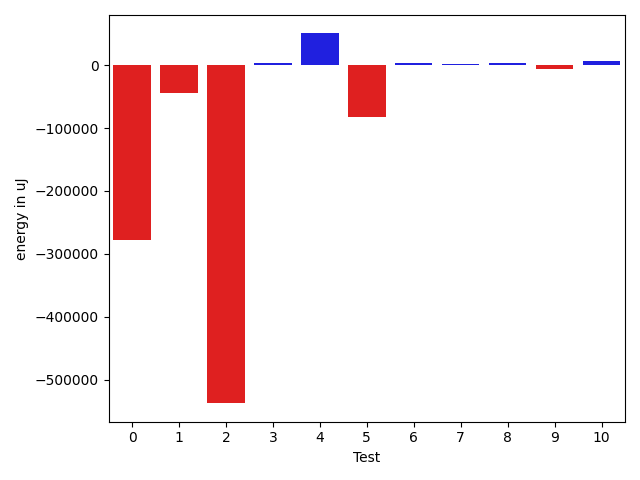
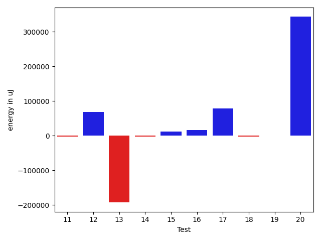
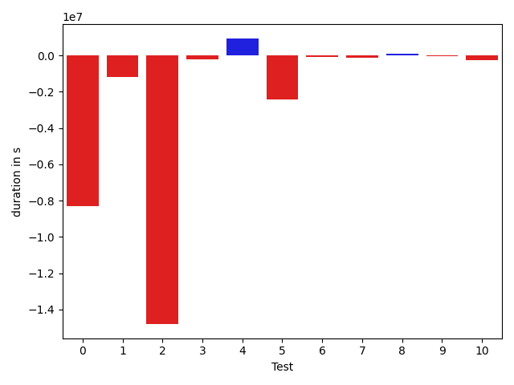
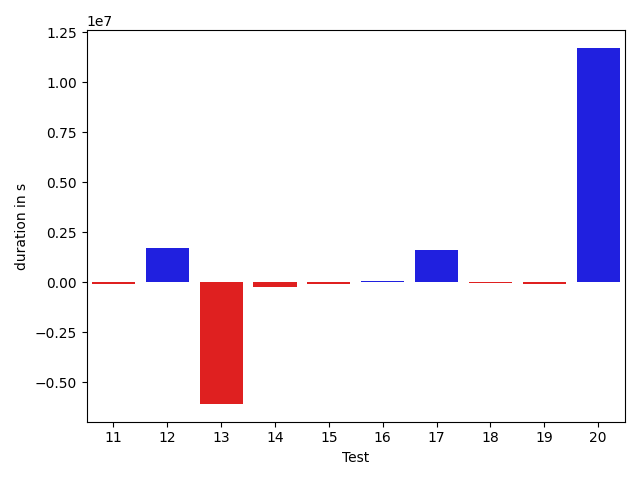

# gson bcd52a

https://github.com/google/gson/commit/bcd52a

## Delta Energy per test method

| ID | EnergyV1 | EnergyV2 | DeltaEnergy |
| --- | --- | --- | --- |
| 0 | 597391.9940246528 | 318658.07272114966 | -278733.9213035031 |
| 1 | 83572.08699399288 | 39460.52770326084 | -44111.55929073204 |
| 2 | 594410.1471254509 | 56936.93726819597 | -537473.2098572549 |
| 3 | 32657.444031622057 | 35672.153691979984 | 3014.7096603579266 |
| 4 | 306361.1715334659 | 356589.94128379633 | 50228.76975033042 |
| 5 | 140410.80186898983 | 57867.81584067298 | -82542.98602831685 |
| 6 | 33799.557154328984 | 36931.19396092398 | 3131.6368065949937 |
| 7 | 35749.2570473375 | 37044.69207306493 | 1295.4350257274273 |
| 8 | 36328.689820467356 | 39883.13015184589 | 3554.440331378537 |
| 9 | 49411.31637604809 | 43516.48391535878 | -5894.8324606893075 |
| 10 | 35953.15337888058 | 42621.91771679296 | 6668.7643379123765 |
| 11 | 35424.330230629566 | 33097.372985290276 | -2326.9572453392902 |
| 12 | 58959.56650126183 | 127784.90134763475 | 68825.33484637292 |
| 13 | 314549.61802160915 | 121472.66465758414 | -193076.953364025 |
| 14 | 36062.52860797215 | 33170.31978639518 | -2892.208821576969 |
| 15 | 43168.50570612336 | 55382.68746027044 | 12214.181754147081 |
| 16 | 29806.835365016348 | 45227.20832920043 | 15420.372964184084 |
| 17 | 42512.38308895771 | 120187.91252232208 | 77675.52943336437 |
| 18 | 38760.47099827175 | 35911.04264282697 | -2849.4283554447757 |
| 19 | 34076.387315363696 | 34739.3058662245 | 662.9185508608061 |
| 20 | 51727.461309267695 | 394668.1148352525 | 342940.65352598485 |

## Delta Duration per test method

| ID | DurationV1 | DurationsV2 | DeltaDuration |
| --- | --- | --- | --- |
| 0 | 17781059.438481398 | 9483382.500279956 | -8297676.938201442 |
| 1 | 2764809.6890958133 | 1603336.8053309806 | -1161472.8837648327 |
| 2 | 16712453.17636796 | 1913867.5593054274 | -14798585.617062533 |
| 3 | 930837.9771615227 | 730174.7047765804 | -200663.27238494228 |
| 4 | 9991942.323090693 | 10932794.933112532 | 940852.6100218389 |
| 5 | 4523722.531900559 | 2119493.5036158725 | -2404229.028284686 |
| 6 | 870555.9752198262 | 799849.9869697266 | -70705.98825009959 |
| 7 | 900431.0502240167 | 793603.4730682755 | -106827.57715574116 |
| 8 | 1164188.3636767198 | 1241934.3890968843 | 77746.02542016446 |
| 9 | 1654883.6330272073 | 1632998.919873037 | -21884.71315417043 |
| 10 | 1198437.6741568642 | 953878.5926953062 | -244559.081461558 |
| 11 | 824193.2008625076 | 753287.5019068656 | -70905.69895564194 |
| 12 | 2006830.9900865431 | 3729031.858411958 | 1722200.8683254148 |
| 13 | 10342647.141835352 | 4252505.978250426 | -6090141.163584926 |
| 14 | 1116382.8078454128 | 880172.4986000961 | -236210.30924531666 |
| 15 | 1572469.178453075 | 1496690.3886797985 | -75778.78977327654 |
| 16 | 1079202.6873736416 | 1131120.2446145872 | 51917.55724094552 |
| 17 | 1602221.2801612602 | 3193146.0706733335 | 1590924.7905120733 |
| 18 | 916165.729929861 | 859951.9499371366 | -56213.77999272442 |
| 19 | 912652.4071633683 | 830399.1379495343 | -82253.26921383396 |
| 20 | 2101088.062379144 | 13826405.145805165 | 11725317.083426021 |

## Misc.

| ID | Test Class | Test Method |
| --- | --- | --- |
| 0 | com.google.gson.DefaultDateTypeAdapterTest | testParsingDatesFormattedWithUsLocale |
| 1 | com.google.gson.DefaultDateTypeAdapterTest | testFormattingInEnUs |
| 2 | com.google.gson.DefaultDateTypeAdapterTest | testFormatUsesDefaultTimezone |
| 3 | com.google.gson.DefaultDateTypeAdapterTest | testDatePattern |
| 4 | com.google.gson.DefaultDateTypeAdapterTest | testParsingDatesFormattedWithSystemLocale |
| 5 | com.google.gson.DefaultDateTypeAdapterTest | testFormattingInFr |
| 6 | com.google.gson.DefaultDateTypeAdapterTest | testDateSerialization |
| 7 | com.google.gson.functional.DefaultTypeAdaptersTest | testDateSerializationWithPatternNotOverridenByTypeAdapter |
| 8 | com.google.gson.functional.DefaultTypeAdaptersTest | testDefaultJavaSqlTimestampDeserialization |
| 9 | com.google.gson.functional.DefaultTypeAdaptersTest | testDateSerializationWithPattern |
| 10 | com.google.gson.functional.DefaultTypeAdaptersTest | testDefaultJavaSqlTimestampSerialization |
| 11 | com.google.gson.functional.DefaultTypeAdaptersTest | testSqlDateSerialization |
| 12 | com.google.gson.functional.DefaultTypeAdaptersTest | testDefaultDateDeserializationUsingBuilder |
| 13 | com.google.gson.functional.DefaultTypeAdaptersTest | testNullSerialization |
| 14 | com.google.gson.functional.DefaultTypeAdaptersTest | testDateDeserializationWithPattern |
| 15 | com.google.gson.functional.DefaultTypeAdaptersTest | testDateSerializationInCollection |
| 16 | com.google.gson.functional.DefaultTypeAdaptersTest | testDefaultDateSerialization |
| 17 | com.google.gson.functional.DefaultTypeAdaptersTest | testDefaultDateDeserialization |
| 18 | com.google.gson.functional.DefaultTypeAdaptersTest | testTimestampSerialization |
| 19 | com.google.gson.functional.DefaultTypeAdaptersTest | testDefaultDateSerializationUsingBuilder |
| 20 | com.google.gson.functional.ObjectTest | testDateAsMapObjectField |

| Test | IterationV1 | IterationV2 | DeltaIteration |
| --- | --- | --- | --- |
| 0 | 99 | 99 | 0 |
| 1 | 99 | 99 | 0 |
| 2 | 99 | 99 | 0 |
| 3 | 60 | 46 | -14 |
| 4 | 99 | 99 | 0 |
| 5 | 99 | 99 | 0 |
| 6 | 58 | 49 | -9 |
| 7 | 64 | 49 | -15 |
| 8 | 89 | 85 | -4 |
| 9 | 82 | 81 | -1 |
| 10 | 68 | 52 | -16 |
| 11 | 54 | 48 | -6 |
| 12 | 96 | 97 | 1 |
| 13 | 99 | 99 | 0 |
| 14 | 63 | 62 | -1 |
| 15 | 99 | 97 | -2 |
| 16 | 72 | 72 | 0 |
| 17 | 97 | 96 | -1 |
| 18 | 55 | 53 | -2 |
| 19 | 59 | 39 | -20 |
| 20 | 99 | 99 | 0 |

| Time Label | Time (s) |
| --- | --- |
| Selection | 28.755564212799072 |
| Injection | 12.050554513931274 |
| Total | 1044.6489033699036 |

