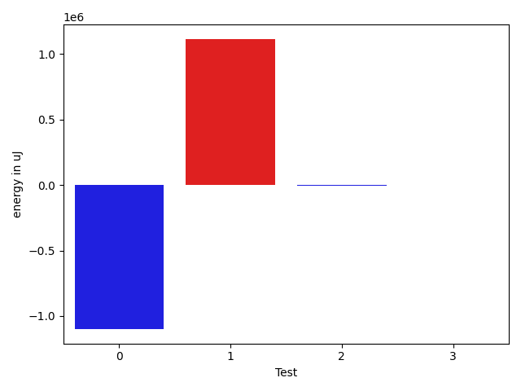
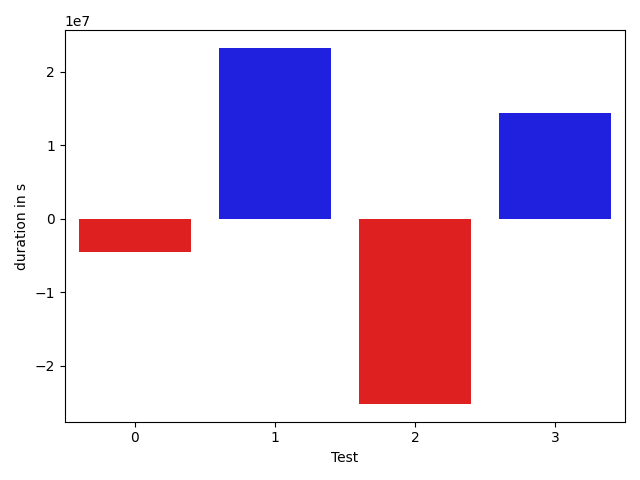

# gson 63ee47

https://github.com/google/gson/commit/63ee47

## Delta Energy per test method

| ID | EnergyV1 | EnergyV2 | DeltaEnergy |
| --- | --- | --- | --- |
| 0 | 195462.69865611827 | 49676.21682048565 | -145786.4818356326 |
| 1 | 403180.07759020117 | 1114049.6676238026 | 710869.5900336014 |
| 2 | 1051613.4831790049 | 236070.29957225535 | -815543.1836067495 |
| 3 | 36053.80237275541 | 512013.94025317446 | 475960.13788041903 |

## Delta Duration per test method

| ID | DurationV1 | DurationsV2 | DeltaDuration |
| --- | --- | --- | --- |
| 0 | 5962372.058979352 | 1491384.5115219546 | -4470987.547457397 |
| 1 | 11540483.000620607 | 34774708.0653958 | 23234225.064775195 |
| 2 | 32199750.984941475 | 7008161.009715372 | -25191589.975226104 |
| 3 | 867123.6567755617 | 15200369.40935785 | 14333245.752582287 |

## Misc.

| ID | Test Class | Test Method |
| --- | --- | --- |
| 0 | com.google.gson.functional.NamingPolicyTest | testGsonWithUpperCamelCaseSpacesPolicyDeserialiation |
| 1 | com.google.gson.functional.NamingPolicyTest | testGsonWithNonDefaultFieldNamingPolicyDeserialiation |
| 2 | com.google.gson.functional.NamingPolicyTest | testGsonWithUpperCamelCaseSpacesPolicySerialiation |
| 3 | com.google.gson.functional.NamingPolicyTest | testGsonWithNonDefaultFieldNamingPolicySerialization |

| Test | IterationV1 | IterationV2 | DeltaIteration |
| --- | --- | --- | --- |
| 0 | 76 | 77 | 1 |
| 1 | 70 | 69 | -1 |
| 2 | 71 | 73 | 2 |
| 3 | 63 | 61 | -2 |

| Time Label | Time (s) |
| --- | --- |
| Selection | 36.61677002906799 |
| Injection | 14.018634796142578 |
| Total | 1480.387576341629 |

