# gson caef76

https://github.com/google/gson/commit/caef76

## Delta Energy per test method

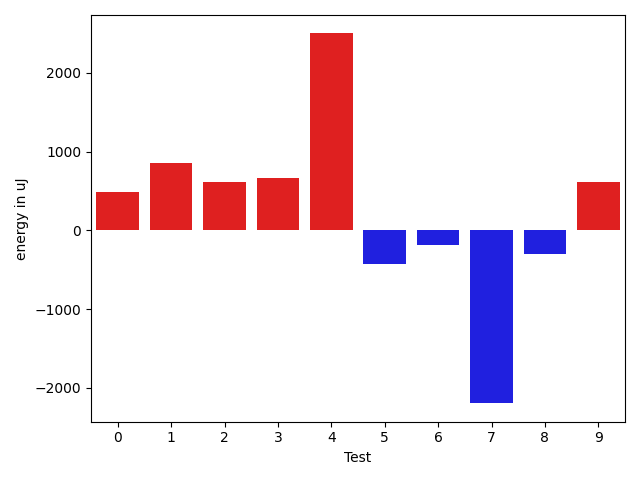

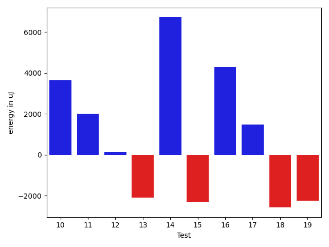

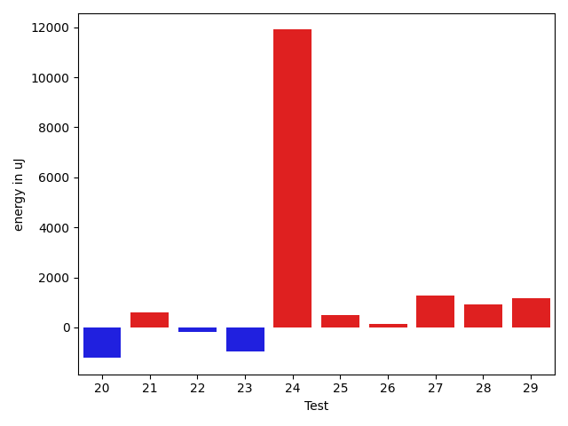

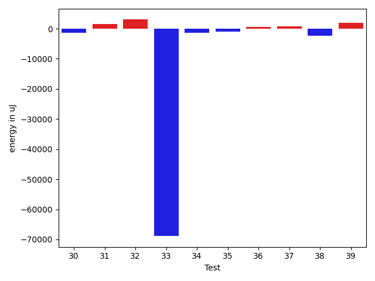

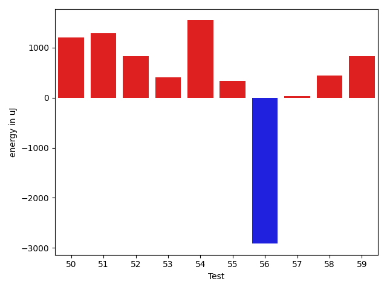

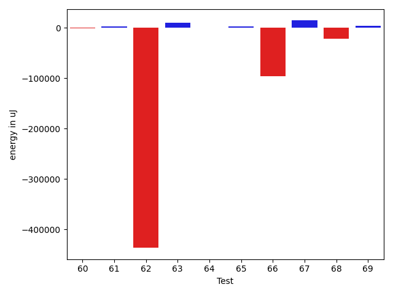

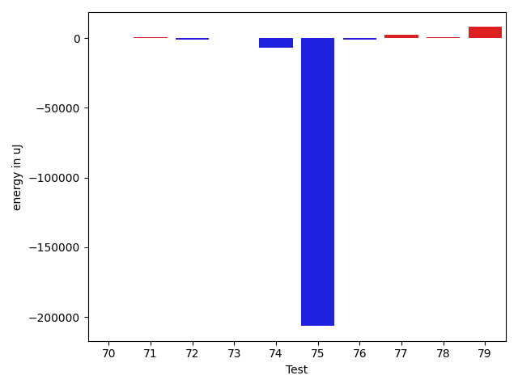

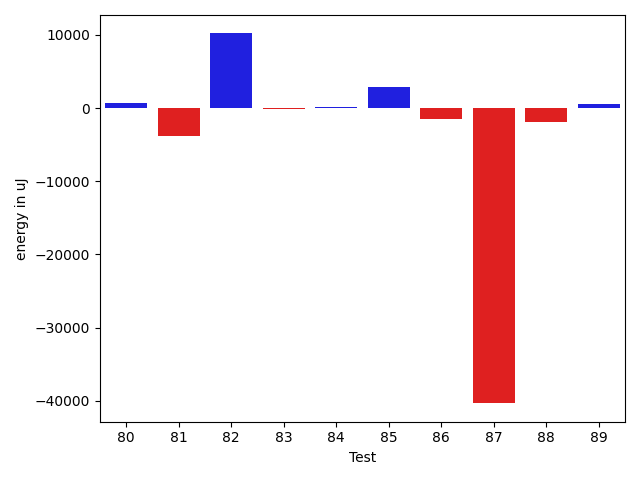

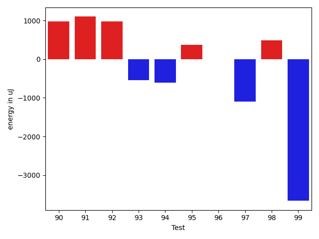

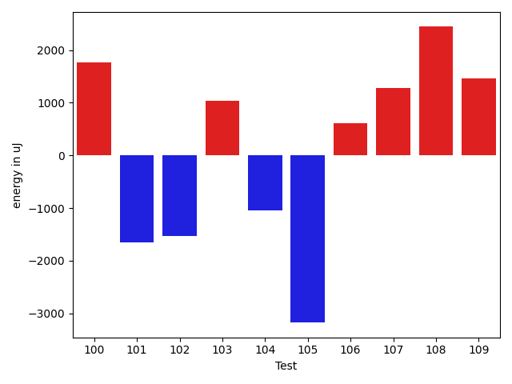

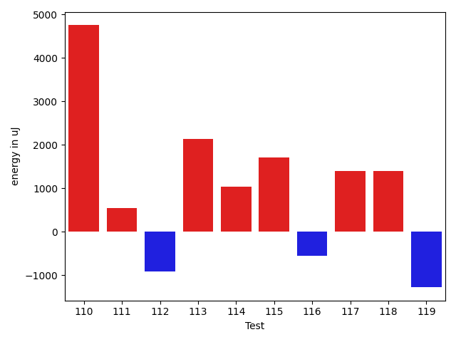

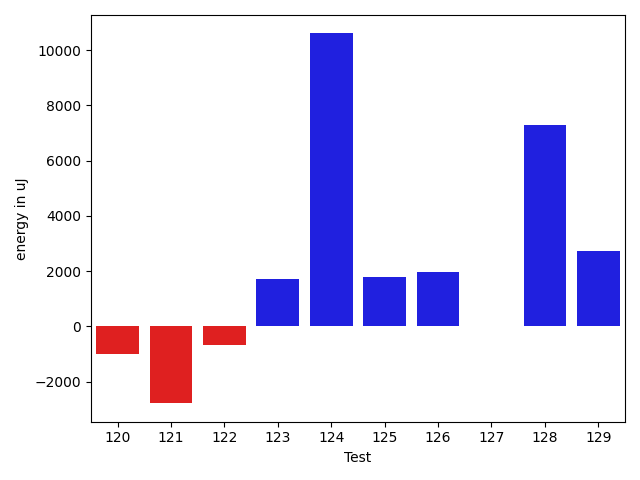

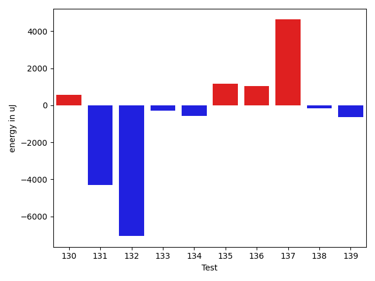

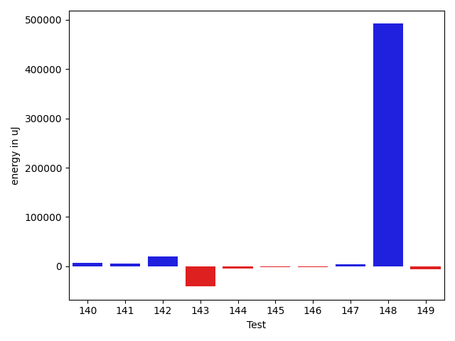

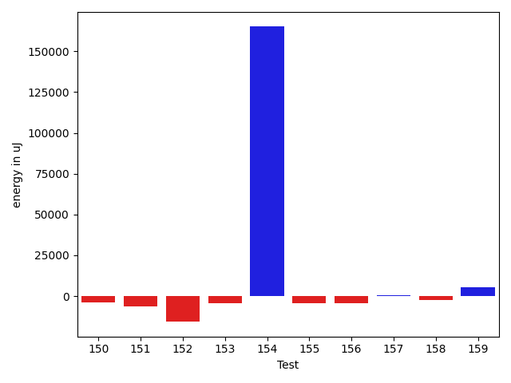

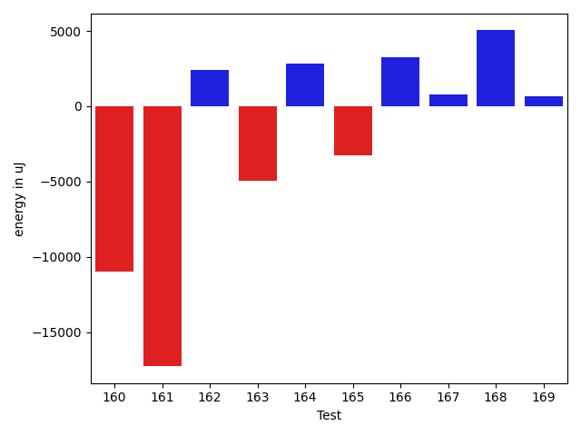

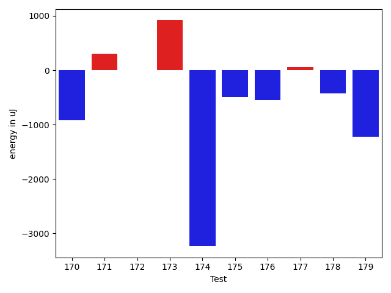

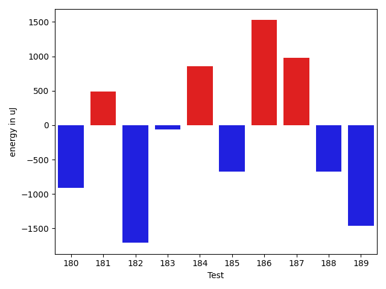

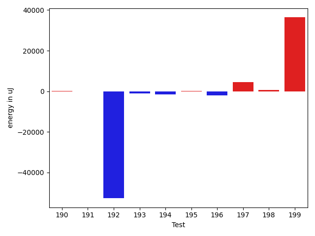

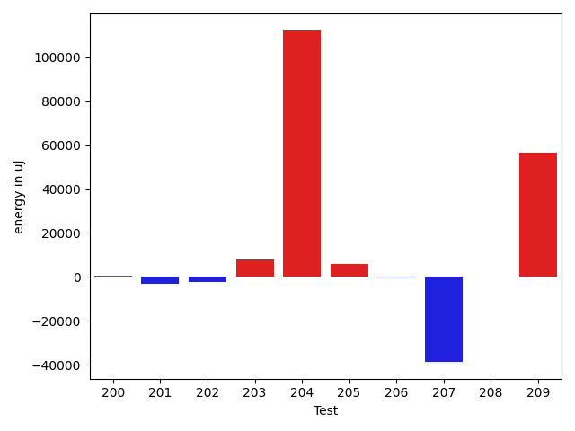

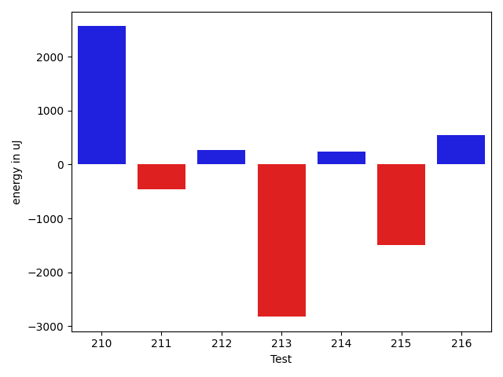

| ID | EnergyV1 | EnergyV2 | DeltaEnergy | σV1 | σV2 |
| --- | --- | --- | --- | --- | --- |
| 0 | 37334.37254901961 | 37837.770491803276 | 503.39794278366753 | 6324.77549771542 | 6629.403638568381 |
| 1 | 37067.177777777775 | 37879.71111111111 | 812.5333333333328 | 3378.2853723869966 | 4027.1013596615185 |
| 2 | 38575.32653061225 | 39084.527272727275 | 509.2007421150265 | 5832.8399299552 | 8058.729527333123 |
| 3 | 48138.35 | 89265.21538461538 | 41126.86538461538 | 34090.91652812374 | 206373.35383399687 |
| 4 | 82933.04040404041 | 83350.9494949495 | 417.90909090908826 | 19552.1596858814 | 21465.204079373816 |
| 5 | 41364.5625 | 40318.30985915493 | -1046.2526408450722 | 15954.49341082611 | 10701.454898575279 |
| 6 | 38505.25454545455 | 42482.6037735849 | 3977.349228130355 | 4395.745468759047 | 15109.951610551017 |
| 7 | 37305.28846153846 | 36149.56862745098 | -1155.719834087482 | 4023.422105126519 | 4696.42753362847 |
| 8 | 37358.34 | 36546.80392156863 | -811.5360784313671 | 3630.2145314567842 | 4163.3614577910375 |
| 9 | 36456.37209302326 | 36715.333333333336 | 258.9612403100764 | 4583.120136667615 | 4222.426517822743 |
| 10 | 40034.66071428572 | 47336.58181818182 | 7301.9211038961 | 12533.419283597617 | 27101.11631829677 |
| 11 | 35046.89473684211 | 37648.5 | 2601.605263157893 | 3904.5113434365803 | 3667.13483753552 |
| 12 | 37995.379310344826 | 37217.12765957447 | -778.2516507703549 | 8445.04551105024 | 5728.486215757927 |
| 13 | 37610.48936170213 | 37699.72093023256 | 89.23156853042747 | 3741.5124537245883 | 4412.280823072682 |
| 14 | 37997.55319148936 | 38675.47727272727 | 677.9240812379139 | 4825.856598236745 | 4462.074188946805 |
| 15 | 37504.59090909091 | 37358.475409836065 | -146.11549925484724 | 4183.214555155259 | 4186.061796503896 |
| 16 | 41283.256410256414 | 45028.811320754714 | 3745.5549104983 | 12850.71742528448 | 15877.700071147137 |
| 17 | 38008.87096774193 | 37650.083333333336 | -358.7876344085962 | 3580.27410864421 | 4157.216398926089 |
| 18 | 36002.958333333336 | 36071.47619047619 | 68.51785714285506 | 2879.940920678274 | 3864.0935685586032 |
| 19 | 41504.49411764706 | 39670.38461538462 | -1834.1095022624431 | 9181.93216962598 | 8037.111297345406 |
| 20 | 42866.02898550725 | 39157.470588235294 | -3708.558397271954 | 11118.24822242208 | 4323.120739188941 |
| 21 | 38352.62857142857 | 38753.06896551724 | 400.44039408866956 | 3871.9185800597934 | 4001.372195075037 |
| 22 | 39295.666666666664 | 41163.101265822785 | 1867.4345991561204 | 6689.931580782838 | 10612.524558686899 |
| 23 | 37167.40476190476 | 37782.256410256414 | 614.8516483516505 | 4925.335676544695 | 5362.172587424868 |
| 24 | 175317.87878787878 | 200995.0606060606 | 25677.181818181823 | 328304.00344378623 | 356153.9633336672 |
| 25 | 36535.04081632653 | 36705.755102040814 | 170.7142857142826 | 4625.670259029799 | 5213.018677881689 |
| 26 | 39182.769230769234 | 38656.64705882353 | -526.1221719457026 | 4181.596520417301 | 4896.622022208136 |
| 27 | 36898.41333333333 | 38198.78378378379 | 1300.3704504504567 | 4497.825125082368 | 4508.640021685303 |
| 28 | 52379.32558139535 | 57351.575 | 4972.249418604646 | 32660.550229433447 | 41003.27440271538 |
| 29 | 38536.709677419356 | 39105.541666666664 | 568.8319892473082 | 3265.7583537962846 | 3617.9265698643685 |
| 30 | 40246.04918032787 | 38856.106060606064 | -1389.9431197218073 | 11286.966476581869 | 6550.262708423013 |
| 31 | 36067.6875 | 37580.954545454544 | 1513.2670454545441 | 3116.0138341868364 | 4429.87186842477 |
| 32 | 51271.944444444445 | 54296.32203389831 | 3024.377589453863 | 26296.347074096782 | 31402.101563830212 |
| 33 | 108758.54761904762 | 39865.61363636364 | -68892.93398268399 | 296696.23317454173 | 4308.956170877273 |
| 34 | 38444.416666666664 | 37120.6875 | -1323.7291666666642 | 3394.514998698472 | 4740.509185714521 |
| 35 | 40740.170731707316 | 39702.34285714286 | -1037.8278745644566 | 9623.580969585477 | 3775.251484095234 |
| 36 | 38598.6 | 39273.181818181816 | 674.5818181818177 | 4927.981420419521 | 4403.135573206106 |
| 37 | 37774.954545454544 | 38615.681818181816 | 840.7272727272721 | 4084.631278310451 | 3602.106484549431 |
| 38 | 41316.096153846156 | 38943.16279069767 | -2372.933363148484 | 11548.271591054412 | 3612.789014303393 |
| 39 | 37658.56 | 39613.7 | 1955.1399999999994 | 2948.228988121514 | 4510.063393124315 |
| 40 | 37167.565217391304 | 37980.545454545456 | 812.9802371541518 | 3667.7998241581454 | 3545.913854863891 |
| 41 | 63173.68686868687 | 62235.919191919194 | -937.7676767676749 | 28907.86883005885 | 29597.151973849897 |
| 42 | 44612.79797979798 | 46016.683673469386 | 1403.8856936714074 | 15597.668252296007 | 16161.098819480027 |
| 43 | 159424.38095238095 | 80930.21428571429 | -78494.16666666666 | 391029.9848575911 | 203185.75533114962 |
| 44 | 46616.3125 | 39439.333333333336 | -7176.979166666664 | 20110.259295533553 | 5862.504542969657 |
| 45 | 37930.29090909091 | 40412.28571428572 | 2481.9948051948086 | 4094.3835130255616 | 9317.008460939836 |
| 46 | 88691.46590909091 | 131483.36781609195 | 42791.90190700104 | 167263.91522877224 | 280601.0066813738 |
| 47 | 45626.34782608696 | 50045.31578947369 | 4418.967963386727 | 22413.66482481205 | 28757.362035374703 |
| 48 | 79689.90566037736 | 51756.80303030303 | -27933.102630074332 | 196774.57655276352 | 33933.930049623166 |
| 49 | 36571.87096774193 | 37344.71428571428 | 772.8433179723506 | 4456.824493290693 | 4398.066716972217 |
| 50 | 37049.551020408166 | 38247.94827586207 | 1198.3972554539068 | 4133.612775034393 | 6440.99092671417 |
| 51 | 37421.5 | 38709.21428571428 | 1287.7142857142826 | 3606.96356691843 | 4005.448114373569 |
| 52 | 37185.625 | 38018.32142857143 | 832.6964285714275 | 4198.973067037741 | 3985.4901925930144 |
| 53 | 36379.1320754717 | 36783.339622641506 | 404.20754716980446 | 4139.017922154308 | 4598.255641138303 |
| 54 | 35476.206896551725 | 37022.3 | 1546.0931034482783 | 4700.347590810194 | 4494.123491850218 |
| 55 | 35605.0 | 35932.90909090909 | 327.90909090908826 | 4329.086642848619 | 5362.0783615471255 |
| 56 | 43358.42307692308 | 40444.22222222222 | -2914.200854700859 | 12148.77712799199 | 9079.80865593516 |
| 57 | 38020.666666666664 | 38049.0 | 28.33333333333576 | 4512.594910051446 | 3935.944151488479 |
| 58 | 35894.89655172414 | 36334.23333333333 | 439.33678160919226 | 4839.354134342135 | 4239.197154205289 |
| 59 | 37869.62857142857 | 38702.88888888889 | 833.260317460321 | 4503.391744551872 | 3201.809943388309 |
| 60 | 218043.45945945947 | 76585.78571428571 | -141457.67374517376 | 457679.5691811794 | 200785.27568459744 |
| 61 | 38094.31034482759 | 38952.55 | 858.239655172416 | 4739.95399441844 | 4711.484399581515 |
| 62 | 41188.82258064516 | 42528.80952380953 | 1339.9869431643674 | 10617.522442799973 | 10465.957320302117 |
| 63 | 48213.87628865979 | 49723.36082474227 | 1509.4845360824766 | 17689.091914159475 | 20318.87756772194 |
| 64 | 38891.84482758621 | 39224.282608695656 | 332.4377811094455 | 5562.192825464222 | 7043.305849506862 |
| 65 | 38574.17647058824 | 39396.1 | 821.9235294117607 | 4856.186596803687 | 6997.3875665612995 |
| 66 | 38265.22448979592 | 39014.382978723406 | 749.1584889274891 | 3927.3697760419245 | 5451.991596101885 |
| 67 | 64951.07608695652 | 63615.34042553192 | -1335.7356614246019 | 39647.3274885375 | 41975.59370394901 |
| 68 | 40129.32 | 44712.78846153846 | 4583.468461538461 | 8999.794418629794 | 15793.843245850017 |
| 69 | 37430.391304347824 | 36569.77419354839 | -860.6171107994378 | 3556.6236155282277 | 4151.2178136190605 |
| 70 | 42837.857142857145 | 42958.234042553195 | 120.3768996960498 | 16195.578289226012 | 18434.109500403963 |
| 71 | 38200.529411764706 | 38642.75 | 442.2205882352937 | 4417.965144027376 | 5235.054243988308 |
| 72 | 44492.666666666664 | 43752.30158730159 | -740.365079365074 | 13632.561562082212 | 14333.648377085785 |
| 73 | 39550.833333333336 | 39657.75 | 106.91666666666424 | 3094.355816105618 | 3206.913524585075 |
| 74 | 46696.367647058825 | 39770.149253731346 | -6926.218393327479 | 20843.236908424708 | 8432.320643832865 |
| 75 | 308137.95454545453 | 101726.375 | -206411.57954545453 | 440597.5215066134 | 243771.97940977418 |
| 76 | 39138.791666666664 | 38059.333333333336 | -1079.4583333333285 | 4425.735164722793 | 4222.494920725845 |
| 77 | 37291.8064516129 | 39810.27368421053 | 2518.467232597628 | 5666.330710961008 | 10164.456664943682 |
| 78 | 36817.775862068964 | 37341.529411764706 | 523.7535496957425 | 3666.919411032041 | 3663.437533637013 |
| 79 | 118891.30303030302 | 126856.63636363637 | 7965.333333333343 | 17589.14685767618 | 24589.24952311869 |
| 80 | 36562.625 | 35891.68421052631 | -670.9407894736869 | 3570.013910016085 | 3925.7864924735186 |
| 81 | 330666.0606060606 | 343767.0909090909 | 13101.030303030275 | 262034.6098517483 | 263730.6742304012 |
| 82 | 35637.38461538462 | 37885.93103448276 | 2248.546419098144 | 3994.910522507386 | 4440.601022780545 |
| 83 | 36566.482142857145 | 37138.62962962963 | 572.1474867724828 | 3718.739917110324 | 3346.646830930019 |
| 84 | 40951.011494252874 | 41672.72631578947 | 721.714821536596 | 12263.224966788906 | 11727.058154399845 |
| 85 | 37494.72727272727 | 37242.444444444445 | -252.2828282828268 | 4024.2767298419108 | 4001.0030347339925 |
| 86 | 37348.044444444444 | 36610.63829787234 | -737.4061465721024 | 3639.19033703045 | 4240.592418596833 |
| 87 | 36181.54285714286 | 37962.256410256414 | 1780.7135531135573 | 4312.212506974363 | 3859.8546785315616 |
| 88 | 37010.32432432433 | 37233.3870967742 | 223.06277244986995 | 4106.349283165555 | 4160.200093492863 |
| 89 | 37728.744680851065 | 37826.38636363636 | 97.64168278529542 | 3763.7349402913023 | 3342.0705831177956 |
| 90 | 36067.791666666664 | 37659.59016393442 | 1591.7984972677586 | 4459.558269223222 | 7579.224906037338 |
| 91 | 35836.65 | 36584.36 | 747.7099999999991 | 4833.917172180342 | 4878.837836042514 |
| 92 | 36983.177777777775 | 36260.205882352944 | -722.971895424831 | 6378.571471171231 | 3272.326207845672 |
| 93 | 37527.71428571428 | 36390.681818181816 | -1137.0324675324664 | 4511.562010602337 | 3840.9451179052703 |
| 94 | 38206.583333333336 | 37935.875 | -270.70833333333576 | 3687.1384954626024 | 4182.186642101832 |
| 95 | 36290.51724137931 | 36207.40740740741 | -83.10983397190284 | 3512.971859293139 | 3567.0266823417123 |
| 96 | 36949.47619047619 | 36910.05263157895 | -39.42355889724422 | 4278.954752418238 | 4146.690760158974 |
| 97 | 39384.61111111111 | 39095.63636363636 | -288.97474747474917 | 2913.395577879852 | 2719.1709389152647 |
| 98 | 39547.7 | 38447.38461538462 | -1100.31538461538 | 4129.877105919739 | 4608.34658382878 |
| 99 | 40023.625 | 37879.055555555555 | -2144.5694444444453 | 3717.474443002265 | 3446.79334828801 |
| 100 | 38101.77777777778 | 37940.0 | -161.777777777781 | 4073.634461803742 | 4272.755642744936 |
| 101 | 59225.03448275862 | 54170.846153846156 | -5054.188328912467 | 39228.38494085344 | 27765.989075863064 |
| 102 | 38504.28571428572 | 37264.59090909091 | -1239.6948051948057 | 2876.7472561054446 | 3128.5797483419747 |
| 103 | 39595.09090909091 | 40369.666666666664 | 774.5757575757525 | 2322.740112044215 | 4069.744859597739 |
| 104 | 39105.1 | 37631.0 | -1474.0999999999985 | 3692.9196565861002 | 3167.7650638896816 |
| 105 | 39837.5 | 37616.73684210526 | -2220.7631578947403 | 4155.6222698893125 | 3316.5861941730836 |
| 106 | 37649.230769230766 | 38618.36363636364 | 969.1328671328738 | 3558.9649349612905 | 3057.3417233314203 |
| 107 | 37697.80357142857 | 38386.98333333333 | 689.1797619047575 | 4363.088128262738 | 3969.5188394047073 |
| 108 | 41457.07792207792 | 45838.0 | 4380.922077922078 | 13142.351402376156 | 15413.767334903738 |
| 109 | 37464.26530612245 | 40932.41379310345 | 3468.148486981001 | 4767.853856715873 | 10317.331011850189 |
| 110 | 38464.24 | 46658.38181818182 | 8194.141818181823 | 8716.160956659762 | 19823.72050622083 |
| 111 | 57890.95348837209 | 56609.01724137931 | -1281.93624699278 | 39715.95278448235 | 26448.994076101153 |
| 112 | 64667.891304347824 | 62420.49462365591 | -2247.3966806919125 | 134203.84805670558 | 154049.93721026482 |
| 113 | 36947.5 | 37707.3 | 759.8000000000029 | 3691.1793440579395 | 3675.8478219316967 |
| 114 | 39511.294117647056 | 38964.76666666667 | -546.5274509803858 | 3697.740180557116 | 3778.5744462105754 |
| 115 | 38078.705882352944 | 38783.53333333333 | 704.8274509803887 | 4848.569852995537 | 3708.271463753549 |
| 116 | 37444.90909090909 | 38616.95 | 1172.0409090909088 | 5176.2867167066515 | 4366.362393056719 |
| 117 | 36277.625 | 38903.217391304344 | 2625.5923913043443 | 4461.961744499274 | 5101.809934220887 |
| 118 | 38621.59259259259 | 39193.92307692308 | 572.3304843304868 | 3673.218240375408 | 3560.767548232315 |
| 119 | 37521.25 | 38180.35 | 659.0999999999985 | 3238.7189693611886 | 3173.4388488672666 |
| 120 | 37843.625 | 37538.74074074074 | -304.88425925926276 | 5198.147787613872 | 4070.1348106947366 |
| 121 | 40800.31578947369 | 39755.294117647056 | -1045.021671826631 | 8908.558280503032 | 3423.768868722885 |
| 122 | 38008.372881355936 | 38616.71428571428 | 608.3414043583471 | 3895.8083467386864 | 3912.7394107127975 |
| 123 | 106954.65 | 39662.666666666664 | -67291.98333333334 | 291553.94930497423 | 4153.919260436128 |
| 124 | 47865.795918367345 | 47656.666666666664 | -209.12925170068047 | 21066.850355891704 | 18513.263595311735 |
| 125 | 38151.68421052631 | 37991.454545454544 | -160.22966507176898 | 4049.5496897495523 | 4075.944241529206 |
| 126 | 37706.875 | 37774.42 | 67.54499999999825 | 4282.400678090308 | 4098.142496741663 |
| 127 | 36886.34782608696 | 39173.186046511626 | 2286.8382204246664 | 4064.9307455322696 | 4281.12698298666 |
| 128 | 37569.13333333333 | 38646.76190476191 | 1077.6285714285768 | 4472.819295353758 | 3351.1062694317743 |
| 129 | 37500.17021276596 | 37986.413043478264 | 486.24283071230457 | 6391.223561206843 | 3648.7326184168983 |
| 130 | 38292.382352941175 | 38844.566666666666 | 552.1843137254909 | 3936.455400295056 | 3942.8124284012742 |
| 131 | 43668.46666666667 | 39379.3870967742 | -4289.07956989247 | 32697.676680699427 | 4374.300280836957 |
| 132 | 50002.958333333336 | 42939.206896551725 | -7063.751436781611 | 35045.344164714144 | 21555.49739366337 |
| 133 | 38767.22222222222 | 38487.38461538462 | -279.8376068376019 | 2662.8681812318996 | 3390.5116368718323 |
| 134 | 38296.75 | 37731.09375 | -565.65625 | 3758.2790304650525 | 4070.3973113764873 |
| 135 | 37104.086956521736 | 38261.0 | 1156.9130434782637 | 2997.158827275729 | 4177.817778614135 |
| 136 | 39273.068493150684 | 40315.51515151515 | 1042.446658364468 | 5359.239307421604 | 13400.89083678647 |
| 137 | 41547.7 | 46180.0350877193 | 4632.335087719301 | 11194.588460948438 | 35577.627818993766 |
| 138 | 39362.859375 | 39198.479166666664 | -164.38020833333576 | 6495.998943742187 | 5570.880424843035 |
| 139 | 38809.57142857143 | 38162.555555555555 | -647.0158730158728 | 4723.939604583774 | 4603.230414275781 |
| 140 | 44535.19047619047 | 47090.41176470588 | 2555.2212885154077 | 17795.674786491687 | 14002.020493102891 |
| 141 | 120144.61038961039 | 66567.79220779221 | -53576.81818181818 | 335294.07620336657 | 194602.73554432232 |
| 142 | 38565.91891891892 | 37611.558139534885 | -954.3607793840347 | 3822.194532919526 | 3676.999284061922 |
| 143 | 37960.65 | 39840.625 | 1879.9749999999985 | 4489.784218367292 | 3637.365064077979 |
| 144 | 53760.989583333336 | 51453.142857142855 | -2307.8467261904807 | 20318.855652598682 | 20303.388194172552 |
| 145 | 154046.58333333334 | 134152.30107526883 | -19894.282258064515 | 292564.38032065646 | 274536.3053040051 |
| 146 | 42409.53571428572 | 43629.875 | 1220.3392857142826 | 15965.215151076201 | 20533.677378704193 |
| 147 | 40196.964705882354 | 42253.38461538462 | 2056.419909502263 | 9824.984695628924 | 14423.67725636083 |
| 148 | 40629.441860465115 | 39880.84090909091 | -748.6009513742029 | 7061.576704174881 | 5577.9784540441715 |
| 149 | 40613.295454545456 | 41451.4081632653 | 838.1127087198474 | 11306.131336539049 | 9826.574832333166 |
| 150 | 39158.967741935485 | 39494.73333333333 | 335.7655913978451 | 4209.905163163463 | 4223.829750619953 |
| 151 | 153088.08080808082 | 165838.21212121213 | 12750.131313131307 | 371643.1336110163 | 418505.3700285974 |
| 152 | 44405.09523809524 | 42258.666666666664 | -2146.4285714285725 | 13668.410861073799 | 13340.95109886182 |
| 153 | 192754.69696969696 | 222767.22222222222 | 30012.525252525258 | 208633.748559646 | 282136.4138052369 |
| 154 | 38083.06976744186 | 38735.06060606061 | 651.9908386187453 | 4727.278775684747 | 4108.264817962533 |
| 155 | 38752.475 | 39724.26666666667 | 971.7916666666715 | 4344.530567204586 | 4277.200207820271 |
| 156 | 37873.16129032258 | 38633.145161290326 | 759.9838709677424 | 4219.342542400944 | 8554.77276115837 |
| 157 | 47008.2962962963 | 44707.18518518518 | -2301.1111111111168 | 21065.907988826166 | 12639.834097121033 |
| 158 | 38383.065217391304 | 37196.510204081635 | -1186.5550133096694 | 3829.986266306254 | 3910.5679170127387 |
| 159 | 51479.9 | 49013.891304347824 | -2466.0086956521773 | 37957.95568112171 | 31387.471683174776 |
| 160 | 38137.46153846154 | 38117.608695652176 | -19.85284280936321 | 5019.357890521067 | 3621.11482640517 |
| 161 | 37384.066666666666 | 38658.275862068964 | 1274.209195402298 | 4404.651555899614 | 4129.20240187185 |
| 162 | 37620.148148148146 | 39373.13636363636 | 1752.9882154882143 | 4123.271469074254 | 3528.989300267848 |
| 163 | 39949.30303030303 | 38426.522388059704 | -1522.7806422433277 | 8050.94924757078 | 5444.221598783702 |
| 164 | 145353.9090909091 | 162722.9393939394 | 17369.030303030304 | 291522.3912022273 | 353571.6089244021 |
| 165 | 58806.11666666667 | 60098.15 | 1292.0333333333328 | 36486.84387606564 | 40905.64908657687 |
| 166 | 40044.39240506329 | 41276.98648648649 | 1232.5940814231944 | 6401.3406673672 | 10245.736016843513 |
| 167 | 39706.24657534246 | 40872.75 | 1166.5034246575378 | 8044.731005627175 | 10541.206539345818 |
| 168 | 40825.72972972973 | 38362.53333333333 | -2463.1963963963935 | 7933.168065065531 | 4260.345883715181 |
| 169 | 44132.260869565216 | 46231.25 | 2098.989130434784 | 17634.28330348583 | 19853.281389099706 |
| 170 | 38009.12903225807 | 38266.96875 | 257.83971774193196 | 4660.715013274635 | 4628.776549237761 |
| 171 | 54956.10638297872 | 55836.13333333333 | 880.0269503546078 | 32236.474705785797 | 38415.12772599415 |
| 172 | 159851.25252525252 | 176725.38383838383 | 16874.131313131307 | 281560.6206884972 | 338769.2975578104 |
| 173 | 37105.88888888889 | 37841.7 | 735.8111111111066 | 3426.3025080315383 | 4055.7055008962375 |
| 174 | 39068.354838709674 | 37505.06451612903 | -1563.290322580644 | 4178.821376883193 | 5099.227050442713 |
| 175 | 37571.3 | 37307.121212121216 | -264.17878787878726 | 4438.880287865398 | 4535.149857251893 |
| 176 | 39710.875 | 38079.9 | -1630.9749999999985 | 3048.563839642365 | 4479.526402422471 |
| 177 | 39503.08823529412 | 41686.014925373136 | 2182.926690079017 | 9963.046592482604 | 15297.926871050731 |
| 178 | 56891.21428571428 | 52901.24137931035 | -3989.9729064039348 | 39319.81170450707 | 71713.85413804321 |
| 179 | 53960.08450704225 | 44383.81428571429 | -9576.270221327963 | 47801.691552291995 | 24810.16141324405 |
| 180 | 45479.15789473684 | 46537.71951219512 | 1058.5616174582829 | 18957.8257949008 | 17278.35339608098 |
| 181 | 96230.55555555556 | 86957.03370786516 | -9273.521847690397 | 214102.2359501342 | 151796.01413017357 |
| 182 | 39062.40476190476 | 38184.14634146341 | -878.2584204413506 | 4087.7032033924565 | 4076.8907243859476 |
| 183 | 38313.8 | 39053.916666666664 | 740.1166666666613 | 3962.381526304603 | 5033.284146420816 |
| 184 | 39046.86046511628 | 38728.175 | -318.6854651162794 | 3907.1457826112055 | 4748.258443300554 |
| 185 | 40272.68085106383 | 38914.88888888889 | -1357.7919621749388 | 5299.002058221677 | 3505.681735711153 |
| 186 | 154143.925 | 143580.42857142858 | -10563.496428571409 | 394136.7498706754 | 356712.9091719306 |
| 187 | 45945.51612903226 | 44879.1 | -1066.416129032259 | 19769.724283604457 | 18106.073812121715 |
| 188 | 38503.42105263158 | 38193.666666666664 | -309.75438596491585 | 4429.861092223874 | 4657.354186898632 |
| 189 | 38674.5 | 37715.28571428572 | -959.2142857142826 | 3641.453011603237 | 4212.046176123419 |
| 190 | 38250.94117647059 | 38479.90909090909 | 228.96791443850088 | 3451.957423747188 | 4289.723808751782 |
| 191 | 42037.875 | 41812.41509433962 | -225.45990566037653 | 7275.838523257498 | 10221.766901197348 |
| 192 | 188319.08823529413 | 135556.78125 | -52762.306985294126 | 416821.5591986059 | 331702.09561943857 |
| 193 | 39173.295454545456 | 38016.8 | -1156.495454545453 | 4213.5699535685535 | 4348.160416135132 |
| 194 | 38656.15789473684 | 37030.243902439026 | -1625.9139922978138 | 4339.084820596667 | 3765.99747924535 |
| 195 | 38895.34210526316 | 38917.46875 | 22.126644736839808 | 3392.209955613595 | 4726.953154413892 |
| 196 | 40989.28571428572 | 38864.64 | -2124.645714285718 | 8887.80544525211 | 5752.501236018989 |
| 197 | 62826.0101010101 | 67412.21212121213 | 4586.2020202020285 | 28628.143702807294 | 28200.377039628864 |
| 198 | 39764.87272727273 | 40438.454545454544 | 673.5818181818177 | 4065.177089084783 | 4653.803319742141 |
| 199 | 138341.70707070708 | 174826.42424242425 | 36484.71717171717 | 185526.08055784667 | 310378.774454375 |
| 200 | 38693.55319148936 | 39398.8 | 705.2468085106448 | 4500.092551334352 | 4371.258169248554 |
| 201 | 39561.0 | 36611.769230769234 | -2949.230769230766 | 4728.836872494828 | 5121.803380628983 |
| 202 | 61969.06060606061 | 59514.08163265306 | -2454.9789734075457 | 36103.7254779928 | 32888.42811710137 |
| 203 | 204845.80808080808 | 212802.49494949495 | 7956.686868686869 | 58480.87858362476 | 73319.0294229452 |
| 204 | 48104.55737704918 | 160458.43055555556 | 112353.87317850639 | 24586.73718679666 | 411323.50610964175 |
| 205 | 40277.79012345679 | 46060.24637681159 | 5782.456253354801 | 11106.928725862246 | 18465.463509494093 |
| 206 | 39087.36363636364 | 38678.458333333336 | -408.9053030303039 | 4374.995901769037 | 4008.9931402116276 |
| 207 | 146521.86486486485 | 107787.8918918919 | -38733.97297297296 | 355062.3903942733 | 283348.5527764856 |
| 208 | 37986.15789473684 | 38003.692307692305 | 17.534412955465086 | 4075.3796369903466 | 4185.311814219882 |
| 209 | 63802.27118644068 | 120202.01408450704 | 56399.74289806636 | 148508.3116112407 | 310267.7503898166 |
| 210 | 42211.044117647056 | 44257.303797468354 | 2046.259679821298 | 9300.983851238256 | 14538.956163107803 |
| 211 | 38099.0 | 39435.333333333336 | 1336.3333333333358 | 4802.278283719688 | 4152.707256183074 |
| 212 | 99152.56521739131 | 243945.77272727274 | 144793.2075098814 | 257301.13113504997 | 465978.60375069623 |
| 213 | 40195.0 | 40408.57142857143 | 213.57142857142753 | 4313.543316630128 | 3541.0852032006424 |
| 214 | 39459.1875 | 38570.77777777778 | -888.409722222219 | 3448.4938237357696 | 3786.3457692015686 |
| 215 | 41346.857142857145 | 39694.15 | -1652.7071428571435 | 3469.548128746318 | 3590.635086931001 |
| 216 | 39489.64705882353 | 40119.5 | 629.8529411764684 | 3548.207002734769 | 3900.808910865913 |

## Delta Duration per test method

| ID | DurationV1 | DurationsV2 | DeltaDuration |
| --- | --- | --- | --- |
| 0 | 953047.0196078431 | 942750.606557377 | -10296.4130504661 |
| 1 | 702501.0 | 714397.5111111111 | 11896.511111111147 |
| 2 | 860756.1020408163 | 956292.4181818182 | 95536.31614100188 |
| 3 | 1169284.4833333334 | 2435522.030769231 | 1266237.5474358974 |
| 4 | 2422636.8181818184 | 2461924.292929293 | 39287.47474747477 |
| 5 | 1126313.609375 | 1144804.2112676057 | 18490.601892605657 |
| 6 | 781598.7636363637 | 983310.7358490566 | 201711.97221269296 |
| 7 | 719130.3653846154 | 723085.0980392157 | 3954.732654600288 |
| 8 | 744996.42 | 756874.6274509804 | 11878.20745098032 |
| 9 | 671247.023255814 | 681420.0 | 10172.976744186017 |
| 10 | 951436.4821428572 | 1238756.0727272728 | 287319.5905844156 |
| 11 | 534526.2105263158 | 503683.625 | -30842.585526315845 |
| 12 | 912220.5862068966 | 964503.4255319149 | 52282.83932501834 |
| 13 | 643244.8936170213 | 682338.0697674418 | 39093.176150420564 |
| 14 | 756525.7872340425 | 844344.5909090909 | 87818.8036750484 |
| 15 | 773685.3863636364 | 812139.655737705 | 38454.26937406859 |
| 16 | 803799.5641025641 | 960500.6037735849 | 156701.03967102082 |
| 17 | 605100.4838709678 | 587768.4166666666 | -17332.06720430113 |
| 18 | 438977.5 | 482464.95238095237 | 43487.45238095237 |
| 19 | 1224196.2705882352 | 1169775.5128205128 | -54420.757767722476 |
| 20 | 1213331.579710145 | 1022360.5441176471 | -190971.0355924979 |
| 21 | 651147.9428571429 | 632512.0 | -18635.942857142887 |
| 22 | 1041745.0128205129 | 1083952.82278481 | 42207.80996429722 |
| 23 | 669716.6428571428 | 801277.7692307692 | 131561.1263736264 |
| 24 | 4983600.121212121 | 5561941.202020202 | 578341.0808080807 |
| 25 | 704228.8571428572 | 776705.7959183673 | 72476.93877551018 |
| 26 | 573763.8205128205 | 636446.1470588235 | 62682.326546002994 |
| 27 | 985417.8266666667 | 1041930.1486486486 | 56512.32198198198 |
| 28 | 1120085.1860465116 | 1361728.225 | 241643.03895348846 |
| 29 | 573781.7419354839 | 517790.5416666667 | -55991.20026881719 |
| 30 | 1011003.7049180327 | 919095.7272727273 | -91907.97764530545 |
| 31 | 466931.5625 | 454673.0909090909 | -12258.471590909117 |
| 32 | 1373499.0277777778 | 1359727.6949152541 | -13771.332862523617 |
| 33 | 2732122.3095238097 | 737629.5454545454 | -1994492.7640692643 |
| 34 | 458979.75 | 429361.4375 | -29618.3125 |
| 35 | 798876.0 | 666036.5428571429 | -132839.45714285714 |
| 36 | 502850.92 | 490852.9090909091 | -11998.010909090866 |
| 37 | 564995.7727272727 | 478622.0909090909 | -86373.68181818182 |
| 38 | 914247.5 | 752403.4186046511 | -161844.08139534888 |
| 39 | 567022.72 | 534887.5666666667 | -32135.15333333332 |
| 40 | 545801.3478260869 | 509801.8181818182 | -35999.52964426874 |
| 41 | 1978888.202020202 | 1893044.5252525252 | -85843.67676767684 |
| 42 | 1505259.01010101 | 1491460.3673469387 | -13798.642754071392 |
| 43 | 4239238.53968254 | 2048831.142857143 | -2190407.3968253974 |
| 44 | 1206895.84375 | 902406.3333333334 | -304489.5104166666 |
| 45 | 821692.6 | 759736.2 | -61956.40000000002 |
| 46 | 2548395.6704545454 | 3563477.3448275863 | 1015081.6743730409 |
| 47 | 1036796.8478260869 | 1147536.7192982456 | 110739.8714721587 |
| 48 | 2148381.2264150945 | 1344515.7575757576 | -803865.4688393369 |
| 49 | 522804.6451612903 | 547251.1071428572 | 24446.461981566856 |
| 50 | 841014.224489796 | 842238.4827586206 | 1224.258268824662 |
| 51 | 585777.8846153846 | 572149.1428571428 | -13628.741758241784 |
| 52 | 576850.875 | 559895.2857142857 | -16955.58928571432 |
| 53 | 830900.0754716981 | 781541.3018867924 | -49358.77358490566 |
| 54 | 657610.0344827586 | 658189.7 | 579.6655172413448 |
| 55 | 549159.7741935484 | 568377.9545454546 | 19218.180351906223 |
| 56 | 766872.3076923077 | 724168.8055555555 | -42703.50213675224 |
| 57 | 577975.0333333333 | 601659.6363636364 | 23684.603030303027 |
| 58 | 549941.724137931 | 569248.9666666667 | 19307.24252873566 |
| 59 | 589873.0285714286 | 589457.7777777778 | -415.25079365086276 |
| 60 | 5430736.540540541 | 1891715.7142857143 | -3539020.826254826 |
| 61 | 564796.448275862 | 571084.5 | 6288.051724137971 |
| 62 | 998102.4354838709 | 1071079.238095238 | 72976.8026113672 |
| 63 | 1535418.6494845361 | 1555120.5154639175 | 19701.86597938137 |
| 64 | 841941.1034482758 | 960029.7391304348 | 118088.63568215899 |
| 65 | 899163.1911764706 | 925197.0833333334 | 26033.89215686277 |
| 66 | 744661.387755102 | 854475.4042553192 | 109814.01650021714 |
| 67 | 1883671.4456521738 | 1868814.4787234042 | -14856.966928769602 |
| 68 | 879503.92 | 1005307.0192307692 | 125803.0992307692 |
| 69 | 635929.304347826 | 559952.5161290322 | -75976.78821879381 |
| 70 | 1018099.2571428572 | 1034883.0425531915 | 16783.785410334356 |
| 71 | 416952.0 | 720115.75 | 303163.75 |
| 72 | 1164225.7971014492 | 1117754.0158730159 | -46471.78122843336 |
| 73 | 418644.8888888889 | 382913.8333333333 | -35731.05555555556 |
| 74 | 1188102.5735294118 | 938551.3880597015 | -249551.18546971027 |
| 75 | 7447533.636363637 | 2049498.0 | -5398035.636363637 |
| 76 | 564959.0 | 496500.4666666667 | -68458.53333333333 |
| 77 | 1236654.311827957 | 1257266.4105263157 | 20612.09869835875 |
| 78 | 734748.5 | 722025.6078431372 | -12722.89215686277 |
| 79 | 3403760.787878788 | 3610523.707070707 | 206762.9191919188 |
| 80 | 478628.0416666667 | 496100.5789473684 | 17472.53728070174 |
| 81 | 9711056.91919192 | 10163465.545454545 | 452408.6262626257 |
| 82 | 513856.03846153844 | 486444.3793103448 | -27411.659151193628 |
| 83 | 813693.2321428572 | 809400.8333333334 | -4292.398809523787 |
| 84 | 1207861.0574712644 | 1217739.7894736843 | 9878.732002419885 |
| 85 | 451883.5 | 450178.8888888889 | -1704.611111111124 |
| 86 | 727442.088888889 | 764022.8723404255 | 36580.783451536554 |
| 87 | 526188.6 | 558488.1794871795 | 32299.579487179522 |
| 88 | 614984.7027027027 | 632652.8064516129 | 17668.10374891013 |
| 89 | 699402.0212765958 | 737690.6363636364 | 38288.61508704058 |
| 90 | 871030.4791666666 | 902285.1803278689 | 31254.701161202276 |
| 91 | 495064.5 | 487636.16 | -7428.340000000026 |
| 92 | 694760.6888888889 | 833370.2941176471 | 138609.60522875818 |
| 93 | 421225.5 | 473182.45454545453 | 51956.95454545453 |
| 94 | 725832.4583333334 | 789842.8958333334 | 64010.4375 |
| 95 | 471272.2413793103 | 527884.5185185185 | 56612.27713920822 |
| 96 | 456716.61904761905 | 451344.94736842107 | -5371.671679197985 |
| 97 | 420282.94444444444 | 427483.2727272727 | 7200.328282828268 |
| 98 | 400659.0 | 384285.23076923075 | -16373.769230769249 |
| 99 | 452526.875 | 420243.72222222225 | -32283.152777777752 |
| 100 | 486470.7037037037 | 439225.6956521739 | -47245.00805152982 |
| 101 | 1351355.9655172413 | 1343586.2692307692 | -7769.696286472026 |
| 102 | 466840.0 | 414164.8181818182 | -52675.18181818182 |
| 103 | 438421.13636363635 | 440329.25 | 1908.113636363647 |
| 104 | 514503.0 | 443991.4 | -70511.59999999998 |
| 105 | 424980.8 | 415484.2105263158 | -9496.589473684202 |
| 106 | 433215.46153846156 | 379120.0 | -54095.46153846156 |
| 107 | 807359.9285714285 | 834544.3 | 27184.371428571525 |
| 108 | 1143779.7792207792 | 1265491.3376623376 | 121711.55844155839 |
| 109 | 753477.5918367347 | 817471.2068965518 | 63993.61505981709 |
| 110 | 880299.34 | 1060881.6 | 180582.26000000013 |
| 111 | 1416425.8837209302 | 1498331.1379310344 | 81905.25421010423 |
| 112 | 1902927.25 | 1848084.9569892474 | -54842.29301075265 |
| 113 | 419709.25 | 376346.6 | -43362.65000000002 |
| 114 | 473733.1176470588 | 457295.9 | -16437.217647058773 |
| 115 | 437505.29411764705 | 488299.73333333334 | 50794.43921568629 |
| 116 | 445164.45454545453 | 458034.1 | 12869.645454545447 |
| 117 | 479171.125 | 421245.26086956525 | -57925.864130434755 |
| 118 | 628973.1851851852 | 685640.8846153846 | 56667.69943019946 |
| 119 | 569674.9375 | 458764.6 | -110910.33750000002 |
| 120 | 592515.75 | 575047.1481481482 | -17468.601851851796 |
| 121 | 501553.2631578947 | 386026.4117647059 | -115526.85139318882 |
| 122 | 883643.8983050848 | 860644.6666666666 | -22999.23163841816 |
| 123 | 2131614.2 | 467526.125 | -1664088.0750000002 |
| 124 | 1433849.142857143 | 1412073.1515151516 | -21775.99134199135 |
| 125 | 620856.5 | 578776.7878787878 | -42079.71212121216 |
| 126 | 733676.375 | 750957.94 | 17281.564999999944 |
| 127 | 706147.3695652174 | 711204.7674418605 | 5057.39787664311 |
| 128 | 491255.63333333336 | 527384.0952380953 | 36128.461904761905 |
| 129 | 750267.0425531915 | 697515.4565217391 | -52751.5860314524 |
| 130 | 585987.4117647059 | 509798.86666666664 | -76188.54509803926 |
| 131 | 813033.9666666667 | 582261.7419354839 | -230772.2247311828 |
| 132 | 909132.9583333334 | 623666.448275862 | -285466.51005747134 |
| 133 | 448799.94444444444 | 418194.0 | -30605.944444444438 |
| 134 | 510196.5416666667 | 487198.875 | -22997.666666666686 |
| 135 | 485451.4347826087 | 415728.8695652174 | -69722.5652173913 |
| 136 | 1014339.7808219178 | 1121867.2727272727 | 107527.4919053549 |
| 137 | 948932.54 | 1160565.8421052631 | 211633.3021052631 |
| 138 | 874292.890625 | 852661.0833333334 | -21631.807291666628 |
| 139 | 707302.5 | 589974.1111111111 | -117328.38888888888 |
| 140 | 797878.7142857143 | 960241.9411764706 | 162363.22689075628 |
| 141 | 3508727.2077922076 | 1926968.5194805195 | -1581758.6883116881 |
| 142 | 670053.5945945946 | 639099.976744186 | -30953.61785040854 |
| 143 | 578395.75 | 485564.8125 | -92830.9375 |
| 144 | 1584621.8541666667 | 1516812.7857142857 | -67809.06845238106 |
| 145 | 4376649.802083333 | 3607247.924731183 | -769401.8773521502 |
| 146 | 969413.9285714285 | 969845.7291666666 | 431.8005952381063 |
| 147 | 1139859.6705882354 | 1172514.7948717948 | 32655.124283559388 |
| 148 | 739446.0 | 756482.0227272727 | 17036.022727272706 |
| 149 | 856678.4545454546 | 861438.8571428572 | 4760.402597402572 |
| 150 | 856959.3548387097 | 825935.4166666666 | -31023.93817204307 |
| 151 | 4418939.0 | 4751904.282828283 | 332965.28282828256 |
| 152 | 1296804.4047619049 | 1194684.4252873564 | -102119.97947454848 |
| 153 | 5248746.393939394 | 5870799.606060606 | 622053.2121212129 |
| 154 | 687455.5813953489 | 666522.303030303 | -20933.278365045902 |
| 155 | 771781.45 | 777930.088888889 | 6148.638888888992 |
| 156 | 923725.2258064516 | 901246.8225806452 | -22478.403225806425 |
| 157 | 865605.3703703703 | 817675.4814814815 | -47929.888888888876 |
| 158 | 699051.9130434783 | 714047.1428571428 | 14995.22981366457 |
| 159 | 1070977.0 | 993060.5217391305 | -77916.47826086951 |
| 160 | 422464.6153846154 | 365292.04347826086 | -57172.57190635451 |
| 161 | 606529.3 | 616285.4827586206 | 9756.18275862059 |
| 162 | 562694.8148148148 | 591160.1363636364 | 28465.32154882152 |
| 163 | 991257.4393939395 | 1008668.1641791045 | 17410.724785165046 |
| 164 | 4146563.737373737 | 4483366.242424242 | 336802.50505050505 |
| 165 | 1455997.7666666666 | 1472704.1833333333 | 16706.416666666744 |
| 166 | 1107224.0506329115 | 1129289.4324324324 | 22065.381799520925 |
| 167 | 1046236.8493150685 | 1058127.205882353 | 11890.356567284558 |
| 168 | 867086.6756756756 | 861416.2666666667 | -5670.409009008901 |
| 169 | 863991.5652173914 | 1031894.1363636364 | 167902.571146245 |
| 170 | 609296.1290322581 | 583286.375 | -26009.75403225806 |
| 171 | 1174025.5957446808 | 1239094.8 | 65069.2042553192 |
| 172 | 4465818.545454546 | 4914816.181818182 | 448997.6363636358 |
| 173 | 417500.55555555556 | 443459.2 | 25958.64444444445 |
| 174 | 564337.2903225806 | 666612.9354838709 | 102275.6451612903 |
| 175 | 574486.2666666667 | 562796.0909090909 | -11690.17575757578 |
| 176 | 444223.1875 | 458405.9 | 14182.712500000023 |
| 177 | 1039146.8529411765 | 1099241.8059701493 | 60094.95302897284 |
| 178 | 1676589.5714285714 | 1569152.8390804597 | -107436.73234811169 |
| 179 | 1516824.647887324 | 1340960.6285714286 | -175864.0193158954 |
| 180 | 1304841.0131578948 | 1269621.0731707318 | -35219.93998716306 |
| 181 | 2719239.4777777777 | 2493992.9325842694 | -225246.54519350827 |
| 182 | 698860.7619047619 | 777904.3658536585 | 79043.60394889663 |
| 183 | 663329.7666666667 | 706690.8611111111 | 43361.0944444444 |
| 184 | 740548.1395348837 | 750773.7 | 10225.560465116287 |
| 185 | 675000.5957446808 | 734399.5555555555 | 59398.95981087466 |
| 186 | 4093679.05 | 3789684.657142857 | -303994.3928571427 |
| 187 | 941833.5806451613 | 897693.1 | -44140.480645161355 |
| 188 | 604096.5 | 613464.4 | 9367.900000000023 |
| 189 | 600643.1071428572 | 606122.6428571428 | 5479.535714285681 |
| 190 | 444603.0588235294 | 453128.2727272727 | 8525.213903743308 |
| 191 | 1005595.0357142857 | 1068934.8301886793 | 63339.794474393595 |
| 192 | 5154272.705882353 | 3758963.46875 | -1395309.2371323528 |
| 193 | 719398.3863636364 | 687534.8666666667 | -31863.519696969655 |
| 194 | 721294.3157894737 | 685322.0487804879 | -35972.26700898586 |
| 195 | 634201.0789473684 | 570457.78125 | -63743.29769736843 |
| 196 | 880704.6326530612 | 827708.66 | -52995.97265306115 |
| 197 | 1953673.7373737374 | 1957631.494949495 | 3957.7575757575687 |
| 198 | 870452.1454545455 | 865197.509090909 | -5254.6363636364695 |
| 199 | 3982997.515151515 | 4913214.3838383835 | 930216.8686868683 |
| 200 | 751887.4042553192 | 791272.9333333333 | 39385.529078014195 |
| 201 | 355711.75 | 383442.46153846156 | 27730.71153846156 |
| 202 | 1923707.01010101 | 1832556.193877551 | -91150.81622345909 |
| 203 | 5473527.4949494945 | 5700499.414141414 | 226971.91919191927 |
| 204 | 1151016.213114754 | 4575934.388888889 | 3424918.1757741347 |
| 205 | 1152408.7777777778 | 1273253.347826087 | 120844.57004830916 |
| 206 | 480854.7272727273 | 459419.8333333333 | -21434.89393939398 |
| 207 | 3803347.3513513515 | 2704252.054054054 | -1099095.2972972975 |
| 208 | 460836.4736842105 | 483677.23076923075 | 22840.757085020246 |
| 209 | 1709492.6779661018 | 3151961.7887323946 | 1442469.1107662928 |
| 210 | 1167578.6176470588 | 1215168.5063291139 | 47589.888682055054 |
| 211 | 418177.5 | 469639.44444444444 | 51461.94444444444 |
| 212 | 2139746.304347826 | 6155009.318181818 | 4015263.013833992 |
| 213 | 660401.5277777778 | 599219.6857142857 | -61181.84206349205 |
| 214 | 655378.25 | 580427.5555555555 | -74950.6944444445 |
| 215 | 460898.09523809527 | 523760.4 | 62862.30476190476 |
| 216 | 458584.9411764706 | 429937.0909090909 | -28647.85026737972 |

## Misc.

| ID | Test Class | Test Method |
| --- | --- | --- |
| 0 | com.google.gson.functional.CustomTypeAdaptersTest | testCustomAdapterInvokedForCollectionElementDeserialization |
| 1 | com.google.gson.functional.CustomTypeAdaptersTest | testCustomTypeAdapterAppliesToSubClassesSerializedAsBaseClass |
| 2 | com.google.gson.functional.CustomTypeAdaptersTest | testCustomAdapterInvokedForMapElementSerializationWithType |
| 3 | com.google.gson.functional.CustomTypeAdaptersTest | testCustomSerializers |
| 4 | com.google.gson.functional.CustomTypeAdaptersTest | testCustomTypeAdapterDoesNotAppliesToSubClasses |
| 5 | com.google.gson.functional.CustomTypeAdaptersTest | testCustomAdapterInvokedForCollectionElementSerializationWithType |
| 6 | com.google.gson.functional.CustomTypeAdaptersTest | testCustomDeserializers |
| 7 | com.google.gson.functional.CustomTypeAdaptersTest | testCustomByteArrayDeserializerAndInstanceCreator |
| 8 | com.google.gson.functional.CustomTypeAdaptersTest | testCustomByteArraySerializer |
| 9 | com.google.gson.functional.CustomTypeAdaptersTest | testCustomSerializerInvokedForPrimitives |
| 10 | com.google.gson.functional.CustomTypeAdaptersTest | testCustomNestedSerializers |
| 11 | com.google.gson.functional.CustomTypeAdaptersTest | testCustomAdapterInvokedForCollectionElementSerialization |
| 12 | com.google.gson.functional.CustomTypeAdaptersTest | testRegisterHierarchyAdapterForDate |
| 13 | com.google.gson.functional.CustomTypeAdaptersTest | testCustomDeserializerInvokedForPrimitives |
| 14 | com.google.gson.functional.CustomTypeAdaptersTest | testCustomNestedDeserializers |
| 15 | com.google.gson.functional.CustomTypeAdaptersTest | testCustomAdapterInvokedForMapElementDeserialization |
| 16 | com.google.gson.functional.CustomTypeAdaptersTest | testEnsureCustomSerializerNotInvokedForNullValues |
| 17 | com.google.gson.functional.CustomTypeAdaptersTest | testEnsureCustomDeserializerNotInvokedForNullValues |
| 18 | com.google.gson.functional.CustomTypeAdaptersTest | testCustomAdapterInvokedForMapElementSerialization |
| 19 | com.google.gson.functional.StreamingTypeAdaptersTest | testNullSafe |
| 20 | com.google.gson.functional.StreamingTypeAdaptersTest | testSerializeWithCustomTypeAdapter |
| 21 | com.google.gson.functional.StreamingTypeAdaptersTest | testDeserializeWithCustomTypeAdapter |
| 22 | com.google.gson.functional.JsonAdapterAnnotationOnClassesTest | testJsonAdapterInvoked |
| 23 | com.google.gson.functional.JsonAdapterAnnotationOnClassesTest | testRegisteredAdapterOverridesJsonAdapter |
| 24 | com.google.gson.functional.JsonAdapterAnnotationOnClassesTest | testRegisteredDeserializerOverridesJsonAdapter |
| 25 | com.google.gson.functional.JsonAdapterAnnotationOnClassesTest | testRegisteredSerializerOverridesJsonAdapter |
| 26 | com.google.gson.functional.JsonAdapterAnnotationOnClassesTest | testIncorrectTypeAdapterFails |
| 27 | com.google.gson.functional.JsonAdapterAnnotationOnClassesTest | testJsonAdapterFactoryInvoked |
| 28 | com.google.gson.functional.JsonAdapterAnnotationOnClassesTest | testSuperclassTypeAdapterNotInvoked |
| 29 | com.google.gson.MixedStreamTest | testReaderDoesNotMutateState |
| 30 | com.google.gson.MixedStreamTest | testWriteHtmlSafe |
| 31 | com.google.gson.MixedStreamTest | testReadNulls |
| 32 | com.google.gson.MixedStreamTest | testWriteLenient |
| 33 | com.google.gson.MixedStreamTest | testWriteMixedStreamed |
| 34 | com.google.gson.MixedStreamTest | testWriteNulls |
| 35 | com.google.gson.MixedStreamTest | testReadMixedStreamed |
| 36 | com.google.gson.MixedStreamTest | testReadInvalidState |
| 37 | com.google.gson.MixedStreamTest | testWriteInvalidState |
| 38 | com.google.gson.MixedStreamTest | testReadClosed |
| 39 | com.google.gson.MixedStreamTest | testWriteDoesNotMutateState |
| 40 | com.google.gson.MixedStreamTest | testWriteClosed |
| 41 | com.google.gson.functional.InstanceCreatorTest | testInstanceCreatorForParametrizedType |
| 42 | com.google.gson.functional.InstanceCreatorTest | testInstanceCreatorForCollectionType |
| 43 | com.google.gson.functional.InstanceCreatorTest | testInstanceCreatorReturnsBaseType |
| 44 | com.google.gson.functional.InstanceCreatorTest | testInstanceCreatorReturnsSubTypeForField |
| 45 | com.google.gson.functional.InstanceCreatorTest | testInstanceCreatorReturnsSubTypeForTopLevelObject |
| 46 | com.google.gson.functional.NamingPolicyTest | testAtSignInSerializedName |
| 47 | com.google.gson.functional.NamingPolicyTest | testGsonWithNonDefaultFieldNamingPolicySerialization |
| 48 | com.google.gson.functional.NamingPolicyTest | testGsonDuplicateNameUsingSerializedNameFieldNamingPolicySerialization |
| 49 | com.google.gson.functional.NamingPolicyTest | testGsonWithSerializedNameFieldNamingPolicyDeserialization |
| 50 | com.google.gson.functional.NamingPolicyTest | testGsonWithSerializedNameFieldNamingPolicySerialization |
| 51 | com.google.gson.functional.NamingPolicyTest | testGsonWithLowerCaseUnderscorePolicyDeserialiation |
| 52 | com.google.gson.functional.NamingPolicyTest | testGsonWithLowerCaseUnderscorePolicySerialization |
| 53 | com.google.gson.functional.NamingPolicyTest | testComplexFieldNameStrategy |
| 54 | com.google.gson.functional.NamingPolicyTest | testDeprecatedNamingStrategy |
| 55 | com.google.gson.functional.NamingPolicyTest | testGsonWithUpperCamelCaseSpacesPolicyDeserialiation |
| 56 | com.google.gson.functional.NamingPolicyTest | testGsonWithNonDefaultFieldNamingPolicyDeserialiation |
| 57 | com.google.gson.functional.NamingPolicyTest | testGsonWithLowerCaseDashPolicyDeserialiation |
| 58 | com.google.gson.functional.NamingPolicyTest | testGsonWithUpperCamelCaseSpacesPolicySerialiation |
| 59 | com.google.gson.functional.NamingPolicyTest | testGsonWithLowerCaseDashPolicySerialization |
| 60 | com.google.gson.LongSerializationPolicyTest | testDefaultLongSerializationIntegration |
| 61 | com.google.gson.LongSerializationPolicyTest | testStringLongSerializationIntegration |
| 62 | com.google.gson.functional.MapTest | testSerializeMaps |
| 63 | com.google.gson.functional.MapTest | testInterfaceTypeMapWithSerializer |
| 64 | com.google.gson.functional.MapTest | testMapSubclassDeserialization |
| 65 | com.google.gson.functional.MapTest | testGeneralMapField |
| 66 | com.google.gson.functional.MapTest | testMapSerializationWithNullValueButSerializeNulls |
| 67 | com.google.gson.functional.MapTest | testInterfaceTypeMap |
| 68 | com.google.gson.functional.MapTest | testCustomSerializerForSpecificMapType |
| 69 | com.google.gson.functional.MapTest | testMapSerializationWithNullValuesSerialized |
| 70 | com.google.gson.functional.ReadersWritersTest | testReadWriteTwoObjects |
| 71 | com.google.gson.functional.ReadersWritersTest | testTopLevelNullObjectSerializationWithWriterAndSerializeNulls |
| 72 | com.google.gson.functional.ReadersWritersTest | testReadWriteTwoStrings |
| 73 | com.google.gson.functional.ReadersWritersTest | testTopLevelNullObjectDeserializationWithReaderAndSerializeNulls |
| 74 | com.google.gson.GsonBuilderTest | testExcludeFieldsWithModifiers |
| 75 | com.google.gson.GsonBuilderTest | testCreatingMoreThanOnce |
| 76 | com.google.gson.GsonBuilderTest | testTransientFieldExclusion |
| 77 | com.google.gson.functional.DefaultTypeAdaptersTest | testDateSerializationWithPattern |
| 78 | com.google.gson.functional.DefaultTypeAdaptersTest | testTimestampSerialization |
| 79 | com.google.gson.functional.DefaultTypeAdaptersTest | testDefaultDateDeserializationUsingBuilder |
| 80 | com.google.gson.functional.DefaultTypeAdaptersTest | testOverrideBigDecimalTypeAdapter |
| 81 | com.google.gson.functional.DefaultTypeAdaptersTest | testNullSerialization |
| 82 | com.google.gson.functional.DefaultTypeAdaptersTest | testDefaultCalendarDeserialization |
| 83 | com.google.gson.functional.DefaultTypeAdaptersTest | testDateDeserializationWithPattern |
| 84 | com.google.gson.functional.DefaultTypeAdaptersTest | testDateSerializationInCollection |
| 85 | com.google.gson.functional.DefaultTypeAdaptersTest | testDefaultGregorianCalendarSerialization |
| 86 | com.google.gson.functional.DefaultTypeAdaptersTest | testDateSerializationWithPatternNotOverridenByTypeAdapter |
| 87 | com.google.gson.functional.DefaultTypeAdaptersTest | testBitSetDeserialization |
| 88 | com.google.gson.functional.DefaultTypeAdaptersTest | testOverrideBigIntegerTypeAdapter |
| 89 | com.google.gson.functional.DefaultTypeAdaptersTest | testSqlDateSerialization |
| 90 | com.google.gson.functional.DefaultTypeAdaptersTest | testClassSerialization |
| 91 | com.google.gson.functional.DefaultTypeAdaptersTest | testClassDeserialization |
| 92 | com.google.gson.functional.DefaultTypeAdaptersTest | testSetSerialization |
| 93 | com.google.gson.functional.DefaultTypeAdaptersTest | testBitSetSerialization |
| 94 | com.google.gson.functional.DefaultTypeAdaptersTest | testDefaultDateSerializationUsingBuilder |
| 95 | com.google.gson.functional.DefaultTypeAdaptersTest | testDefaultCalendarSerialization |
| 96 | com.google.gson.functional.DefaultTypeAdaptersTest | testDefaultGregorianCalendarDeserialization |
| 97 | com.google.gson.functional.PrimitiveTest | testDoubleInfinitySerialization |
| 98 | com.google.gson.functional.PrimitiveTest | testFloatInfinitySerialization |
| 99 | com.google.gson.functional.PrimitiveTest | testDoubleNaNSerialization |
| 100 | com.google.gson.functional.PrimitiveTest | testLongAsStringDeserialization |
| 101 | com.google.gson.functional.PrimitiveTest | testMoreSpecificSerialization |
| 102 | com.google.gson.functional.PrimitiveTest | testHtmlCharacterSerialization |
| 103 | com.google.gson.functional.PrimitiveTest | testNegativeInfinitySerialization |
| 104 | com.google.gson.functional.PrimitiveTest | testLongAsStringSerialization |
| 105 | com.google.gson.functional.PrimitiveTest | testFloatNaNSerialization |
| 106 | com.google.gson.functional.PrimitiveTest | testNegativeInfinityFloatSerialization |
| 107 | com.google.gson.functional.CustomDeserializerTest | testCustomDeserializerReturnsNullForArrayElementsForArrayField |
| 108 | com.google.gson.functional.CustomDeserializerTest | testJsonTypeFieldBasedDeserialization |
| 109 | com.google.gson.functional.CustomDeserializerTest | testCustomDeserializerReturnsNullForArrayElements |
| 110 | com.google.gson.functional.CustomDeserializerTest | testCustomDeserializerReturnsNull |
| 111 | com.google.gson.functional.CustomDeserializerTest | testCustomDeserializerReturnsNullForTopLevelObject |
| 112 | com.google.gson.functional.TypeAdapterPrecedenceTest | testStreamingHierarchicalFollowedByNonstreaming |
| 113 | com.google.gson.functional.TypeAdapterPrecedenceTest | testSerializeNonstreamingTypeAdapterFollowedByStreamingTypeAdapter |
| 114 | com.google.gson.functional.TypeAdapterPrecedenceTest | testNonstreamingFollowedByNonstreaming |
| 115 | com.google.gson.functional.TypeAdapterPrecedenceTest | testStreamingFollowedByStreaming |
| 116 | com.google.gson.functional.TypeAdapterPrecedenceTest | testNonstreamingHierarchicalFollowedByNonstreaming |
| 117 | com.google.gson.functional.TypeAdapterPrecedenceTest | testStreamingFollowedByNonstreaming |
| 118 | com.google.gson.functional.TypeAdapterPrecedenceTest | testStreamingFollowedByNonstreamingHierarchical |
| 119 | com.google.gson.functional.TypeAdapterPrecedenceTest | testStreamingHierarchicalFollowedByNonstreamingHierarchical |
| 120 | com.google.gson.functional.NullObjectAndFieldTest | testExplicitSerializationOfNullStringMembers |
| 121 | com.google.gson.functional.NullObjectAndFieldTest | testTopLevelNullObjectDeserialization |
| 122 | com.google.gson.functional.NullObjectAndFieldTest | testAbsentJsonElementsAreSetToNull |
| 123 | com.google.gson.functional.NullObjectAndFieldTest | testTopLevelNullObjectSerialization |
| 124 | com.google.gson.functional.NullObjectAndFieldTest | testExplicitSerializationOfNullArrayMembers |
| 125 | com.google.gson.functional.NullObjectAndFieldTest | testExplicitSerializationOfNullCollectionMembers |
| 126 | com.google.gson.functional.NullObjectAndFieldTest | testPrintPrintingObjectWithNulls |
| 127 | com.google.gson.functional.NullObjectAndFieldTest | testNullWrappedPrimitiveMemberSerialization |
| 128 | com.google.gson.functional.NullObjectAndFieldTest | testNullWrappedPrimitiveMemberDeserialization |
| 129 | com.google.gson.functional.NullObjectAndFieldTest | testCustomTypeAdapterPassesNullDesrialization |
| 130 | com.google.gson.functional.NullObjectAndFieldTest | testExplicitDeserializationOfNulls |
| 131 | com.google.gson.functional.NullObjectAndFieldTest | testExplicitSerializationOfNulls |
| 132 | com.google.gson.functional.NullObjectAndFieldTest | testCustomSerializationOfNulls |
| 133 | com.google.gson.functional.NullObjectAndFieldTest | testPrintPrintingArraysWithNulls |
| 134 | com.google.gson.functional.NullObjectAndFieldTest | testExplicitNullSetsFieldToNullDuringDeserialization |
| 135 | com.google.gson.functional.NullObjectAndFieldTest | testCustomTypeAdapterPassesNullSerialization |
| 136 | com.google.gson.functional.ObjectTest | testSingletonLists |
| 137 | com.google.gson.functional.ObjectTest | testInnerClassDeserialization |
| 138 | com.google.gson.functional.ObjectTest | testAnonymousLocalClassesCustomSerialization |
| 139 | com.google.gson.functional.ObjectTest | testNullPrimitiveFieldsDeserialization |
| 140 | com.google.gson.functional.ObjectTest | testJsonObjectSerialization |
| 141 | com.google.gson.functional.FieldExclusionTest | testDefaultInnerClassExclusion |
| 142 | com.google.gson.functional.FieldExclusionTest | testDefaultNestedStaticClassIncluded |
| 143 | com.google.gson.functional.FieldExclusionTest | testInnerClassExclusion |
| 144 | com.google.gson.functional.JsonAdapterAnnotationOnFieldsTest | testClassAnnotationAdapterFactoryTakesPrecedenceOverDefault |
| 145 | com.google.gson.functional.JsonAdapterAnnotationOnFieldsTest | testClassAnnotationAdapterTakesPrecedenceOverDefault |
| 146 | com.google.gson.functional.JsonAdapterAnnotationOnFieldsTest | testJsonAdapterInvokedOnlyForAnnotatedFields |
| 147 | com.google.gson.functional.JsonAdapterAnnotationOnFieldsTest | testFieldAnnotationTakesPrecedenceOverRegisteredTypeAdapter |
| 148 | com.google.gson.functional.JsonAdapterAnnotationOnFieldsTest | testRegisteredTypeAdapterTakesPrecedenceOverClassAnnotationAdapter |
| 149 | com.google.gson.functional.JsonAdapterAnnotationOnFieldsTest | testFieldAnnotationTakesPrecedenceOverClassAnnotation |
| 150 | com.google.gson.functional.TypeVariableTest | testBasicTypeVariables |
| 151 | com.google.gson.functional.TypeVariableTest | testAdvancedTypeVariables |
| 152 | com.google.gson.functional.TypeVariableTest | testTypeVariablesViaTypeParameter |
| 153 | com.google.gson.functional.VersioningTest | testVersionedUntilSerialization |
| 154 | com.google.gson.functional.VersioningTest | testVersionedClassesDeserialization |
| 155 | com.google.gson.functional.VersioningTest | testVersionedClassesSerialization |
| 156 | com.google.gson.functional.VersioningTest | testVersionedGsonMixingSinceAndUntilSerialization |
| 157 | com.google.gson.functional.VersioningTest | testVersionedUntilDeserialization |
| 158 | com.google.gson.functional.VersioningTest | testVersionedGsonMixingSinceAndUntilDeserialization |
| 159 | com.google.gson.functional.VersioningTest | testVersionedGsonWithUnversionedClassesSerialization |
| 160 | com.google.gson.functional.VersioningTest | testIgnoreLaterVersionClassDeserialization |
| 161 | com.google.gson.functional.VersioningTest | testVersionedGsonWithUnversionedClassesDeserialization |
| 162 | com.google.gson.functional.VersioningTest | testIgnoreLaterVersionClassSerialization |
| 163 | com.google.gson.functional.MapAsArrayTypeAdapterTest | testMultipleEnableComplexKeyRegistrationHasNoEffect |
| 164 | com.google.gson.functional.MapAsArrayTypeAdapterTest | testSerializeComplexMapWithTypeAdapter |
| 165 | com.google.gson.functional.MapAsArrayTypeAdapterTest | testTwoTypesCollapseToOneDeserialize |
| 166 | com.google.gson.functional.MapAsArrayTypeAdapterTest | testMapWithTypeVariableSerialization |
| 167 | com.google.gson.functional.MapAsArrayTypeAdapterTest | testMapWithTypeVariableDeserialization |
| 168 | com.google.gson.functional.ExclusionStrategyFunctionalTest | testExclusionStrategyWithMode |
| 169 | com.google.gson.functional.ExclusionStrategyFunctionalTest | testExclusionStrategySerializationDoesNotImpactDeserialization |
| 170 | com.google.gson.functional.ExclusionStrategyFunctionalTest | testExcludeTopLevelClassSerializationDoesNotImpactDeserialization |
| 171 | com.google.gson.functional.ExclusionStrategyFunctionalTest | testExclusionStrategyDeserialization |
| 172 | com.google.gson.functional.ExclusionStrategyFunctionalTest | testExclusionStrategySerialization |
| 173 | com.google.gson.functional.ExclusionStrategyFunctionalTest | testExcludeTopLevelClassDeserialization |
| 174 | com.google.gson.functional.ExclusionStrategyFunctionalTest | testExclusionStrategySerializationDoesNotImpactSerialization |
| 175 | com.google.gson.functional.ExclusionStrategyFunctionalTest | testExcludeTopLevelClassDeserializationDoesNotImpactSerialization |
| 176 | com.google.gson.functional.ExclusionStrategyFunctionalTest | testExcludeTopLevelClassSerialization |
| 177 | com.google.gson.functional.ParameterizedTypesTest | testParameterizedTypeWithReaderDeserialization |
| 178 | com.google.gson.functional.ParameterizedTypesTest | testParameterizedTypeWithCustomSerializer |
| 179 | com.google.gson.functional.ParameterizedTypesTest | testParameterizedTypeDeserialization |
| 180 | com.google.gson.functional.ParameterizedTypesTest | testParameterizedTypesWithCustomDeserializer |
| 181 | com.google.gson.functional.FieldNamingTest | testIdentity |
| 182 | com.google.gson.functional.FieldNamingTest | testLowerCaseWithUnderscores |
| 183 | com.google.gson.functional.FieldNamingTest | testUpperCamelCase |
| 184 | com.google.gson.functional.FieldNamingTest | testUpperCamelCaseWithSpaces |
| 185 | com.google.gson.functional.FieldNamingTest | testLowerCaseWithDashes |
| 186 | com.google.gson.functional.SecurityTest | testNonExecutableJsonSerialization |
| 187 | com.google.gson.functional.SecurityTest | testNonExecutableJsonDeserialization |
| 188 | com.google.gson.functional.SecurityTest | testJsonWithNonExectuableTokenWithRegularGsonDeserialization |
| 189 | com.google.gson.functional.SecurityTest | testJsonWithNonExectuableTokenWithConfiguredGsonDeserialization |
| 190 | com.google.gson.functional.SecurityTest | testJsonWithNonExectuableTokenSerialization |
| 191 | com.google.gson.functional.EscapingTest | testGsonAcceptsEscapedAndNonEscapedJsonDeserialization |
| 192 | com.google.gson.functional.CustomSerializerTest | testSubClassSerializerInvokedForBaseClassFieldsHoldingSubClassInstances |
| 193 | com.google.gson.functional.CustomSerializerTest | testSerializerReturnsNull |
| 194 | com.google.gson.functional.CustomSerializerTest | testBaseClassSerializerInvokedForBaseClassFieldsHoldingSubClassInstances |
| 195 | com.google.gson.functional.CustomSerializerTest | testBaseClassSerializerInvokedForBaseClassFields |
| 196 | com.google.gson.functional.CustomSerializerTest | testSubClassSerializerInvokedForBaseClassFieldsHoldingArrayOfSubClassInstances |
| 197 | com.google.gson.functional.UncategorizedTest | testReturningDerivedClassesDuringDeserialization |
| 198 | com.google.gson.DefaultMapJsonSerializerTest | testNonEmptyMapSerialization |
| 199 | com.google.gson.functional.TypeHierarchyAdapterTest | testTypeHierarchy |
| 200 | com.google.gson.functional.TypeHierarchyAdapterTest | testRegisterSuperTypeFirst |
| 201 | com.google.gson.functional.TypeHierarchyAdapterTest | testRegisterSubTypeFirstAllowed |
| 202 | com.google.gson.GsonTypeAdapterTest | testDeserializerForAbstractClass |
| 203 | com.google.gson.functional.CircularReferenceTest | testSelfReferenceCustomHandlerSerialization |
| 204 | com.google.gson.JsonParserTest | testReadWriteTwoObjects |
| 205 | com.google.gson.functional.EnumTest | testEnumSubclassWithRegisteredTypeAdapter |
| 206 | com.google.gson.OverrideCoreTypeAdaptersTest | testOverridePrimitiveBooleanAdapter |
| 207 | com.google.gson.OverrideCoreTypeAdaptersTest | testOverrideWrapperBooleanAdapter |
| 208 | com.google.gson.OverrideCoreTypeAdaptersTest | testOverrideStringAdapter |
| 209 | com.google.gson.CommentsTest | testParseComments |
| 210 | com.google.gson.functional.CollectionTest | testUserCollectionTypeAdapter |
| 211 | com.google.gson.JsonObjectTest | testWritePropertyWithEmptyStringName |
| 212 | com.google.gson.JsonObjectTest | testPropertyWithQuotes |
| 213 | com.google.gson.functional.JavaUtilConcurrentLocksTest | testAtomicIntegerArray |
| 214 | com.google.gson.functional.ArrayTest | testNullsInArrayWithSerializeNullPropertySetSerialization |
| 215 | com.google.gson.functional.ArrayTest | testArrayElementsAreArrays |
| 216 | com.google.gson.functional.PrintFormattingTest | testJsonObjectWithNullValuesSerialized |

| Test | IterationV1 | IterationV2 | DeltaIteration |
| --- | --- | --- | --- |
| 0 | 51 | 61 | 10 |
| 1 | 45 | 45 | 0 |
| 2 | 49 | 55 | 6 |
| 3 | 60 | 65 | 5 |
| 4 | 99 | 99 | 0 |
| 5 | 64 | 71 | 7 |
| 6 | 55 | 53 | -2 |
| 7 | 52 | 51 | -1 |
| 8 | 50 | 51 | 1 |
| 9 | 43 | 42 | -1 |
| 10 | 56 | 55 | -1 |
| 11 | 19 | 24 | 5 |
| 12 | 58 | 47 | -11 |
| 13 | 47 | 43 | -4 |
| 14 | 47 | 44 | -3 |
| 15 | 44 | 61 | 17 |
| 16 | 39 | 53 | 14 |
| 17 | 31 | 36 | 5 |
| 18 | 24 | 21 | -3 |
| 19 | 85 | 78 | -7 |
| 20 | 69 | 68 | -1 |
| 21 | 35 | 29 | -6 |
| 22 | 78 | 79 | 1 |
| 23 | 42 | 39 | -3 |
| 24 | 99 | 99 | 0 |
| 25 | 49 | 49 | 0 |
| 26 | 39 | 34 | -5 |
| 27 | 75 | 74 | -1 |
| 28 | 43 | 40 | -3 |
| 29 | 31 | 24 | -7 |
| 30 | 61 | 66 | 5 |
| 31 | 16 | 22 | 6 |
| 32 | 72 | 59 | -13 |
| 33 | 42 | 44 | 2 |
| 34 | 24 | 16 | -8 |
| 35 | 41 | 35 | -6 |
| 36 | 25 | 22 | -3 |
| 37 | 22 | 22 | 0 |
| 38 | 52 | 43 | -9 |
| 39 | 25 | 30 | 5 |
| 40 | 23 | 22 | -1 |
| 41 | 99 | 99 | 0 |
| 42 | 99 | 98 | -1 |
| 43 | 63 | 56 | -7 |
| 44 | 64 | 51 | -13 |
| 45 | 55 | 35 | -20 |
| 46 | 88 | 87 | -1 |
| 47 | 46 | 57 | 11 |
| 48 | 53 | 66 | 13 |
| 49 | 31 | 28 | -3 |
| 50 | 49 | 58 | 9 |
| 51 | 26 | 28 | 2 |
| 52 | 24 | 28 | 4 |
| 53 | 53 | 53 | 0 |
| 54 | 29 | 40 | 11 |
| 55 | 31 | 22 | -9 |
| 56 | 26 | 36 | 10 |
| 57 | 30 | 33 | 3 |
| 58 | 29 | 30 | 1 |
| 59 | 35 | 27 | -8 |
| 60 | 37 | 28 | -9 |
| 61 | 29 | 20 | -9 |
| 62 | 62 | 63 | 1 |
| 63 | 97 | 97 | 0 |
| 64 | 58 | 46 | -12 |
| 65 | 68 | 60 | -8 |
| 66 | 49 | 47 | -2 |
| 67 | 92 | 94 | 2 |
| 68 | 50 | 52 | 2 |
| 69 | 23 | 31 | 8 |
| 70 | 70 | 47 | -23 |
| 71 | 17 | 8 | -9 |
| 72 | 69 | 63 | -6 |
| 73 | 18 | 12 | -6 |
| 74 | 68 | 67 | -1 |
| 75 | 22 | 16 | -6 |
| 76 | 24 | 30 | 6 |
| 77 | 93 | 95 | 2 |
| 78 | 58 | 51 | -7 |
| 79 | 99 | 99 | 0 |
| 80 | 24 | 19 | -5 |
| 81 | 99 | 99 | 0 |
| 82 | 26 | 29 | 3 |
| 83 | 56 | 54 | -2 |
| 84 | 87 | 95 | 8 |
| 85 | 22 | 27 | 5 |
| 86 | 45 | 47 | 2 |
| 87 | 35 | 39 | 4 |
| 88 | 37 | 31 | -6 |
| 89 | 47 | 44 | -3 |
| 90 | 48 | 61 | 13 |
| 91 | 20 | 25 | 5 |
| 92 | 45 | 34 | -11 |
| 93 | 28 | 22 | -6 |
| 94 | 48 | 48 | 0 |
| 95 | 29 | 27 | -2 |
| 96 | 21 | 19 | -2 |
| 97 | 18 | 11 | -7 |
| 98 | 20 | 13 | -7 |
| 99 | 16 | 18 | 2 |
| 100 | 27 | 23 | -4 |
| 101 | 29 | 26 | -3 |
| 102 | 14 | 22 | 8 |
| 103 | 22 | 12 | -10 |
| 104 | 20 | 20 | 0 |
| 105 | 10 | 19 | 9 |
| 106 | 13 | 11 | -2 |
| 107 | 56 | 60 | 4 |
| 108 | 77 | 77 | 0 |
| 109 | 49 | 58 | 9 |
| 110 | 50 | 55 | 5 |
| 111 | 43 | 58 | 15 |
| 112 | 92 | 93 | 1 |
| 113 | 20 | 10 | -10 |
| 114 | 17 | 30 | 13 |
| 115 | 17 | 30 | 13 |
| 116 | 22 | 20 | -2 |
| 117 | 16 | 23 | 7 |
| 118 | 27 | 26 | -1 |
| 119 | 16 | 20 | 4 |
| 120 | 32 | 27 | -5 |
| 121 | 19 | 17 | -2 |
| 122 | 59 | 63 | 4 |
| 123 | 20 | 24 | 4 |
| 124 | 98 | 99 | 1 |
| 125 | 38 | 33 | -5 |
| 126 | 48 | 50 | 2 |
| 127 | 46 | 43 | -3 |
| 128 | 30 | 21 | -9 |
| 129 | 47 | 46 | -1 |
| 130 | 34 | 30 | -4 |
| 131 | 30 | 31 | 1 |
| 132 | 24 | 29 | 5 |
| 133 | 18 | 26 | 8 |
| 134 | 24 | 32 | 8 |
| 135 | 23 | 23 | 0 |
| 136 | 73 | 66 | -7 |
| 137 | 50 | 57 | 7 |
| 138 | 64 | 48 | -16 |
| 139 | 28 | 27 | -1 |
| 140 | 21 | 17 | -4 |
| 141 | 77 | 77 | 0 |
| 142 | 37 | 43 | 6 |
| 143 | 20 | 16 | -4 |
| 144 | 96 | 98 | 2 |
| 145 | 96 | 93 | -3 |
| 146 | 56 | 48 | -8 |
| 147 | 85 | 78 | -7 |
| 148 | 43 | 44 | 1 |
| 149 | 44 | 49 | 5 |
| 150 | 62 | 60 | -2 |
| 151 | 99 | 99 | 0 |
| 152 | 84 | 87 | 3 |
| 153 | 99 | 99 | 0 |
| 154 | 43 | 33 | -10 |
| 155 | 40 | 45 | 5 |
| 156 | 62 | 62 | 0 |
| 157 | 27 | 27 | 0 |
| 158 | 46 | 49 | 3 |
| 159 | 40 | 46 | 6 |
| 160 | 26 | 23 | -3 |
| 161 | 30 | 29 | -1 |
| 162 | 27 | 22 | -5 |
| 163 | 66 | 67 | 1 |
| 164 | 99 | 99 | 0 |
| 165 | 60 | 60 | 0 |
| 166 | 79 | 74 | -5 |
| 167 | 73 | 68 | -5 |
| 168 | 37 | 45 | 8 |
| 169 | 46 | 44 | -2 |
| 170 | 31 | 32 | 1 |
| 171 | 47 | 45 | -2 |
| 172 | 99 | 99 | 0 |
| 173 | 18 | 20 | 2 |
| 174 | 31 | 31 | 0 |
| 175 | 30 | 33 | 3 |
| 176 | 16 | 20 | 4 |
| 177 | 68 | 67 | -1 |
| 178 | 84 | 87 | 3 |
| 179 | 71 | 70 | -1 |
| 180 | 76 | 82 | 6 |
| 181 | 90 | 89 | -1 |
| 182 | 42 | 41 | -1 |
| 183 | 30 | 36 | 6 |
| 184 | 43 | 40 | -3 |
| 185 | 47 | 36 | -11 |
| 186 | 40 | 35 | -5 |
| 187 | 31 | 30 | -1 |
| 188 | 38 | 30 | -8 |
| 189 | 28 | 28 | 0 |
| 190 | 17 | 22 | 5 |
| 191 | 56 | 53 | -3 |
| 192 | 68 | 64 | -4 |
| 193 | 44 | 45 | 1 |
| 194 | 38 | 41 | 3 |
| 195 | 38 | 32 | -6 |
| 196 | 49 | 50 | 1 |
| 197 | 99 | 99 | 0 |
| 198 | 55 | 55 | 0 |
| 199 | 99 | 99 | 0 |
| 200 | 47 | 45 | -2 |
| 201 | 12 | 13 | 1 |
| 202 | 99 | 98 | -1 |
| 203 | 99 | 99 | 0 |
| 204 | 61 | 72 | 11 |
| 205 | 81 | 69 | -12 |
| 206 | 22 | 24 | 2 |
| 207 | 37 | 37 | 0 |
| 208 | 19 | 26 | 7 |
| 209 | 59 | 71 | 12 |
| 210 | 68 | 79 | 11 |
| 211 | 14 | 18 | 4 |
| 212 | 23 | 22 | -1 |
| 213 | 36 | 35 | -1 |
| 214 | 16 | 18 | 2 |
| 215 | 21 | 20 | -1 |
| 216 | 17 | 22 | 5 |

| Time Label | Time (s) |
| --- | --- |
| Selection | 28.663830041885376 |
| Injection | 17.314621448516846 |
| Total | 1144.1101791858673 |

