# gson caef76

https://github.com/google/gson/commit/caef76

## Delta Energy per test method

| ID | EnergyV1 | EnergyV2 | DeltaEnergy |
| --- | --- | --- | --- |
| 0 | 38697.45507484357 | 33903.750583108704 | -4793.7044917348685 |
| 1 | 35760.31624569354 | 38151.926591740325 | 2391.6103460467857 |
| 2 | 38900.75488181952 | 44695.70520639071 | 5794.950324571189 |
| 3 | 36807.017931274284 | 38609.69652276137 | 1802.6785914870852 |
| 4 | 70613.21998150385 | 41184.596354246576 | -29428.62362725727 |
| 5 | 76698.11734731097 | 75794.07201040033 | -904.0453369106399 |
| 6 | 46158.02891762015 | 42982.056569795124 | -3175.9723478250235 |
| 7 | 34230.77677600154 | 34961.75568517842 | 730.9789091768762 |
| 8 | 36361.127554275175 | 46871.79366250748 | 10510.666108232304 |
| 9 | 34452.989114329896 | 36860.65707907659 | 2407.6679647466954 |
| 10 | 31431.67579538774 | 35069.33570699983 | 3637.6599116120924 |
| 11 | 37111.615584015424 | 39127.56916790839 | 2015.953583892966 |
| 12 | 36202.80880051166 | 36359.124076617445 | 156.31527610578632 |
| 13 | 38973.40633392334 | 36883.14763891697 | -2090.2586950063705 |
| 14 | 33187.30149706775 | 39905.25006930154 | 6717.948572233792 |
| 15 | 39489.17395852933 | 37180.975838741855 | -2308.1981197874775 |
| 16 | 35236.515382298356 | 39533.048634017534 | 4296.533251719178 |
| 17 | 36165.0040517766 | 37646.507018159085 | 1481.5029663824826 |
| 18 | 36655.2567961216 | 34078.25817871094 | -2576.99861741066 |
| 19 | 38565.142368782814 | 36317.79661381131 | -2247.345754971502 |
| 20 | 41130.43160978557 | 37955.114770986176 | -3175.3168387993937 |
| 21 | 36285.8083467345 | 37100.63582348265 | 814.8274767481489 |
| 22 | 41416.278891035414 | 33525.4667988356 | -7890.8120921998125 |
| 23 | 142591.77370486927 | 106899.12603346318 | -35692.647671406085 |
| 24 | 38063.97532255924 | 34414.179372508734 | -3649.7959500505094 |
| 25 | 35412.949945358225 | 36771.05715743423 | 1358.1072120760073 |
| 26 | 38013.68212443821 | 34596.09915739128 | -3417.5829670469248 |
| 27 | 39234.63093192599 | 32798.22583140177 | -6436.405100524222 |
| 28 | 48428.62910313898 | 35923.69646893871 | -12504.932634200268 |
| 29 | 61987.69467748689 | 75828.25728305089 | 13840.562605563995 |
| 30 | 241429.39877495525 | 806763.9210850929 | 565334.5223101377 |
| 31 | 43383.972093047465 | 53094.07630277098 | 9710.104209723519 |
| 32 | 35091.15107100355 | 41701.43294506712 | 6610.28187406357 |
| 33 | 44799.60972433088 | 49631.520719873355 | 4831.910995542472 |
| 34 | 35681.270473480225 | 39004.79364335537 | 3323.523169875145 |
| 35 | 38114.422865867615 | 38815.431742310524 | 701.0088764429092 |
| 36 | 71961.39521042009 | 43642.19766215765 | -28319.19754826244 |
| 37 | 37106.46505022049 | 38940.61930799484 | 1834.154257774353 |
| 38 | 37758.53623606353 | 36886.26339905514 | -872.2728370083933 |
| 39 | 37706.68406429115 | 36918.88535781236 | -787.7987064787885 |
| 40 | 34506.74410774159 | 37281.31450853922 | 2774.5704007976237 |
| 41 | 39366.23954780307 | 50598.854106833016 | 11232.61455902995 |
| 42 | 38144.034321725834 | 38419.82256640494 | 275.78824467910454 |
| 43 | 39728.201137542725 | 41146.95487976074 | 1418.7537422180176 |
| 44 | 37864.01334190369 | 42825.13388800621 | 4961.120546102524 |
| 45 | 37402.07161476078 | 38166.771512803156 | 764.6998980423741 |
| 46 | 37610.889771393864 | 36746.8459532536 | -864.0438181402642 |
| 47 | 33474.89341751486 | 41283.644506931305 | 7808.751089416444 |
| 48 | 37605.297563954606 | 40155.80388879776 | 2550.5063248431543 |
| 49 | 34027.112364271656 | 40770.72292308882 | 6743.610558817163 |
| 50 | 41293.05960607529 | 42684.16892468929 | 1391.109318614006 |
| 51 | 37558.45391082764 | 38458.304196193814 | 899.8502853661776 |
| 52 | 38289.63836288452 | 37055.575780213345 | -1234.0625826711766 |
| 53 | 58225.7196705371 | 43817.656827443 | -14408.0628430941 |
| 54 | 37087.57460844517 | 39778.681083175354 | 2691.106474730186 |
| 55 | 43286.9707800328 | 73609.21739870583 | 30322.24661867303 |
| 56 | 39205.260969958494 | 41631.31942056435 | 2426.0584506058585 |
| 57 | 40014.234181810665 | 38841.22942473543 | -1173.0047570752358 |
| 58 | 39137.78591245099 | 40331.91193843415 | 1194.1260259831542 |
| 59 | 42478.194167399444 | 36935.99939327978 | -5542.194774119664 |
| 60 | 40949.96313960639 | 40011.07217855017 | -938.8909610562259 |
| 61 | 36607.346793029246 | 39260.069897666806 | 2652.72310463756 |
| 62 | 478230.61476144474 | 41652.260125748944 | -436578.3546356958 |
| 63 | 31161.364532470703 | 40660.44471740723 | 9499.080184936523 |
| 64 | 40476.021138297176 | 40864.95703880591 | 388.9359005087317 |
| 65 | 37972.52459448576 | 40325.355114378035 | 2352.8305198922753 |
| 66 | 143906.20202684402 | 47384.47509765625 | -96521.72692918777 |
| 67 | 36561.6931837062 | 50796.168348884254 | 14234.475165178053 |
| 68 | 126670.48268127898 | 104832.52547126877 | -21837.95721001021 |
| 69 | 35920.49666800164 | 39169.26546686888 | 3248.7687988672405 |
| 70 | 537206.1421047116 | 532944.0650236963 | -4262.0770810153335 |
| 71 | 37793.15990274916 | 35458.05250390897 | -2335.1073988401913 |
| 72 | 39979.7059325391 | 33839.30201444294 | -6140.403918096163 |
| 73 | 40026.974103412496 | 37647.42124905187 | -2379.552854360627 |
| 74 | 37919.790843725204 | 34628.21138000488 | -3291.5794637203217 |
| 75 | 35408.82438635826 | 37459.69091057405 | 2050.8665242157876 |
| 76 | 38273.57410180065 | 32941.07343905531 | -5332.50066274534 |
| 77 | 42107.65334844589 | 32448.690580055118 | -9658.962768390775 |
| 78 | 35551.931187742346 | 34758.30995423852 | -793.621233503829 |
| 79 | 33732.09721565002 | 39135.51711094724 | 5403.419895297222 |
| 80 | 36607.57643831651 | 37241.17883213749 | 633.6023938209837 |
| 81 | 39449.63735403087 | 35618.628931119325 | -3831.0084229115455 |
| 82 | 36092.72156340384 | 46282.48193145149 | 10189.760368047653 |
| 83 | 36552.75454521179 | 36449.54031419754 | -103.21423101425171 |
| 84 | 34111.65665838593 | 34304.76116545027 | 193.10450706433767 |
| 85 | 34088.264801763 | 36989.72614812851 | 2901.4613463655114 |
| 86 | 40147.92343044281 | 38582.17667007446 | -1565.7467603683472 |
| 87 | 84566.14929397544 | 44215.536359146165 | -40350.612934829274 |
| 88 | 39564.33383178711 | 37706.0793132782 | -1858.2545185089111 |
| 89 | 36333.9278049469 | 36882.609375 | 548.6815700531006 |
| 90 | 38257.6424407959 | 40435.43163413182 | 2177.7891933359206 |
| 91 | 43507.0869140625 | 40154.68824174069 | -3352.3986723218113 |
| 92 | 43368.5667424202 | 38051.537605285645 | -5317.029137134552 |
| 93 | 38583.758544921875 | 40228.341593027115 | 1644.5830481052399 |
| 94 | 38705.46633937955 | 38021.2524343133 | -684.2139050662518 |
| 95 | 37111.47465639399 | 55887.591820353875 | 18776.117163959883 |
| 96 | 44672.81902141505 | 55978.43823050796 | 11305.61920909291 |
| 97 | 37151.74528371915 | 40209.97506074794 | 3058.229777028784 |
| 98 | 52828.70934413907 | 36007.30430725953 | -16821.405036879536 |
| 99 | 34061.21007706826 | 40622.66124559472 | 6561.451168526459 |
| 100 | 45907.84125383198 | 37032.17834502537 | -8875.662908806611 |
| 101 | 36432.76649969816 | 37296.60538503528 | 863.8388853371143 |
| 102 | 37780.186514649045 | 37857.11556844413 | 76.92905379508738 |
| 103 | 36258.262809604406 | 39646.67788782716 | 3388.4150782227516 |
| 104 | 117406.66275774155 | 74514.01348792898 | -42892.649269812566 |
| 105 | 34057.7946469076 | 38590.72584912181 | 4532.931202214211 |
| 106 | 36622.386912300375 | 39951.31878873595 | 3328.9318764355776 |
| 107 | 31852.622691892087 | 39358.358800828624 | 7505.736108936537 |
| 108 | 33015.555439138785 | 36070.694544792175 | 3055.1391056533903 |
| 109 | 35567.43586234003 | 37863.75622972194 | 2296.320367381908 |
| 110 | 40431.96963895323 | 37996.97761574649 | -2434.992023206745 |
| 111 | 39473.13964148177 | 38619.65658750162 | -853.4830539801551 |
| 112 | 38026.96553376317 | 41718.41954255104 | 3691.4540087878704 |
| 113 | 42123.626558819175 | 59415.677639152054 | 17292.05108033288 |
| 114 | 54257.7620882988 | 44380.41500854492 | -9877.347079753876 |
| 115 | 57142.686012326216 | 63739.970844494994 | 6597.284832168778 |
| 116 | 57360.56683062231 | 46299.928909003465 | -11060.637921618843 |
| 117 | 39048.75204176478 | 41819.82284693792 | 2771.0708051731344 |
| 118 | 39186.0434400434 | 41005.67848354461 | 1819.6350435012064 |
| 119 | 40957.496337244316 | 44183.04635974535 | 3225.550022501033 |
| 120 | 42208.45552654624 | 41206.275878702436 | -1002.1796478438046 |
| 121 | 161288.10742741142 | 158510.93516819453 | -2777.1722592168953 |
| 122 | 38311.28903738409 | 37639.74373817444 | -671.5452992096543 |
| 123 | 41018.888345687345 | 42740.73395401938 | 1721.8456083320343 |
| 124 | 39473.497453178454 | 50077.91086991977 | 10604.413416741314 |
| 125 | 38557.12510576977 | 40338.64502478739 | 1781.5199190176209 |
| 126 | 38652.276700068476 | 40630.50704746016 | 1978.2303473916836 |
| 127 | 41035.22685471177 | 41065.629210948944 | 30.40235623717308 |
| 128 | 40538.37677576393 | 47818.87514098734 | 7280.498365223408 |
| 129 | 37678.011107256636 | 40417.23971202597 | 2739.228604769334 |
| 130 | 40936.47576183782 | 34249.554059719376 | -6686.921702118445 |
| 131 | 36655.39970503628 | 39454.747657833126 | 2799.3479527968448 |
| 132 | 38675.3985658639 | 39632.55085371545 | 957.1522878515534 |
| 133 | 156801.8143844343 | 286317.3426187916 | 129515.5282343573 |
| 134 | 74396.94177373353 | 62207.290155746625 | -12189.651617986907 |
| 135 | 39720.303886585 | 43637.90569779909 | 3917.6018112140882 |
| 136 | 84283.04204206912 | 79570.06258832004 | -4712.979453749082 |
| 137 | 48275.537941899885 | 38616.155649456865 | -9659.38229244302 |
| 138 | 37644.42969834278 | 39252.63173144656 | 1608.2020331037857 |
| 139 | 42931.10389590801 | 34369.21285574918 | -8561.89104015883 |
| 140 | 42322.722147335095 | 48546.643639107104 | 6223.921491772009 |
| 141 | 39180.31838458461 | 44514.9438371556 | 5334.625452570996 |
| 142 | 40185.05377902792 | 60679.70002827552 | 20494.6462492476 |
| 143 | 80496.32905053621 | 39492.66477220022 | -41003.664278335986 |
| 144 | 42077.57738583084 | 37159.7338128751 | -4917.843572955739 |
| 145 | 39074.64990073629 | 37471.433409616555 | -1603.2164911197324 |
| 146 | 39497.83759603641 | 38112.37373659422 | -1385.463859442185 |
| 147 | 35465.604453500906 | 39968.90187709723 | 4503.297423596327 |
| 148 | 70261.71355416175 | 562345.4105624065 | 492083.6970082448 |
| 149 | 41620.19482542775 | 36109.5844084511 | -5510.610416976655 |
| 150 | 40559.224177629134 | 36498.678691492794 | -4060.5454861363396 |
| 151 | 40024.37104744077 | 33713.374280673626 | -6310.996766767144 |
| 152 | 67566.04000795796 | 51811.48862806959 | -15754.55137988837 |
| 153 | 41295.58611330997 | 36719.374602764525 | -4576.211510545443 |
| 154 | 87454.49967110751 | 252517.3991085781 | 165062.8994374706 |
| 155 | 50247.37569320202 | 45895.59103092365 | -4351.784662278369 |
| 156 | 39377.99311341795 | 34755.0974759683 | -4622.895637449648 |
| 157 | 37544.98486606032 | 37997.13586165011 | 452.15099558979273 |
| 158 | 39411.86959838867 | 36732.57866573334 | -2679.2909326553345 |
| 159 | 35717.89354348183 | 41247.24782037735 | 5529.354276895523 |
| 160 | 48276.44823611516 | 37320.684399639234 | -10955.763836475926 |
| 161 | 55158.67981736575 | 37885.68101014939 | -17272.99880721636 |
| 162 | 38962.170211208126 | 41367.758733093084 | 2405.588521884958 |
| 163 | 40573.480184478685 | 35593.39294755459 | -4980.087236924097 |
| 164 | 35951.677490234375 | 38804.37415742874 | 2852.6966671943665 |
| 165 | 40832.497438099395 | 37591.04800256841 | -3241.449435530987 |
| 166 | 35445.56370019913 | 38720.645263671875 | 3275.081563472748 |
| 167 | 37250.09333242926 | 38020.860152825015 | 770.7668203957583 |
| 168 | 37947.51502996683 | 42980.204869270325 | 5032.6898393034935 |
| 169 | 40205.16229867935 | 40889.147461891174 | 683.9851632118225 |
| 170 | 35275.11281043291 | 40390.27209147066 | 5115.159281037748 |
| 171 | 48579.16408542337 | 82030.15963426753 | 33450.99554884416 |
| 172 | 40834.47356461064 | 35984.206103931705 | -4850.267460678937 |
| 173 | 71998.19707178071 | 71401.56904372157 | -596.6280280591454 |
| 174 | 39826.93365182807 | 36848.35310519999 | -2978.58054662808 |
| 175 | 36286.03080853155 | 48140.688451486516 | 11854.657642954968 |
| 176 | 39149.15914494508 | 33969.60741189587 | -5179.5517330492075 |
| 177 | 36724.47357555722 | 40286.717101393784 | 3562.243525836566 |
| 178 | 39682.569876365 | 39056.01010773767 | -626.5597686273322 |
| 179 | 44402.929699002736 | 67689.61300454596 | 23286.68330554322 |
| 180 | 36715.17733155094 | 35405.029501764424 | -1310.1478297865178 |
| 181 | 38440.23442363134 | 38826.03136512544 | 385.7969414941035 |
| 182 | 91762.87137151585 | 84587.1149355539 | -7175.756435961957 |
| 183 | 42329.55284384542 | 42302.89557962058 | -26.657264224842947 |
| 184 | 40385.3975409421 | 36999.85631539782 | -3385.541225544279 |
| 185 | 43030.0590479113 | 47733.30354394529 | 4703.244496033985 |
| 186 | 40055.078269958496 | 38900.1795463562 | -1154.898723602295 |
| 187 | 42478.80399942491 | 37292.89471607655 | -5185.909283348359 |
| 188 | 39549.640141967684 | 37379.48234399222 | -2170.1577979754657 |
| 189 | 40424.1552734375 | 40050.929611206055 | -373.2256622314453 |
| 190 | 565727.1443985873 | 91538.07700652111 | -474189.0673920662 |
| 191 | 37819.34718627275 | 41012.74300321427 | 3193.39581694152 |
| 192 | 38181.01220703125 | 35733.030517578125 | -2447.981689453125 |
| 193 | 34953.79679624606 | 40235.65516826151 | 5281.858372015449 |
| 194 | 39483.469486302725 | 53653.90652770093 | 14170.437041398203 |
| 195 | 36645.338638305664 | 41073.7890625 | 4428.450424194336 |
| 196 | 36845.891174316406 | 37451.71728515625 | 605.8261108398438 |
| 197 | 50604.061164376515 | 58795.41319782348 | 8191.352033446965 |
| 198 | 167201.6704336866 | 194127.1521954824 | 26925.48176179579 |
| 199 | 87988.82654732192 | 39990.14526774734 | -47998.68127957458 |
| 200 | 40911.798863723874 | 39732.03720283508 | -1179.761660888791 |
| 201 | 41192.8180847168 | 39077.650390625 | -2115.167694091797 |
| 202 | 37311.339809417725 | 42304.701171875 | 4993.361362457275 |
| 203 | 38985.62829589844 | 37525.26983642578 | -1460.3584594726562 |
| 204 | 42019.30751159787 | 37551.2820456028 | -4468.025465995073 |
| 205 | 47743.51249379292 | 41239.143341466784 | -6504.369152326137 |
| 206 | 39074.5986328125 | 38956.38056087494 | -118.21807193756104 |
| 207 | 38815.56035709381 | 37973.42626953125 | -842.134087562561 |
| 208 | 43358.245502471924 | 36876.04768371582 | -6482.1978187561035 |
| 209 | 35856.56640625 | 37795.36682510376 | 1938.8004188537598 |
| 210 | 35162.83349609375 | 37728.4755859375 | 2565.64208984375 |
| 211 | 39635.51208496094 | 39180.75877380371 | -454.75331115722656 |
| 212 | 58736.35268473625 | 59007.14635324478 | 270.79366850852966 |
| 213 | 44859.849155154894 | 42034.48804470152 | -2825.3611104533775 |
| 214 | 39732.4919128418 | 39969.58856964111 | 237.0966567993164 |
| 215 | 41811.36268424988 | 40314.866176605225 | -1496.4965076446533 |
| 216 | 41309.15968322754 | 41852.04198169708 | 542.8822984695435 |

## Delta Duration per test method

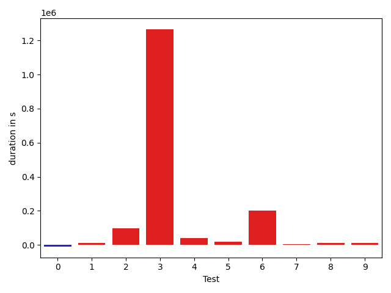

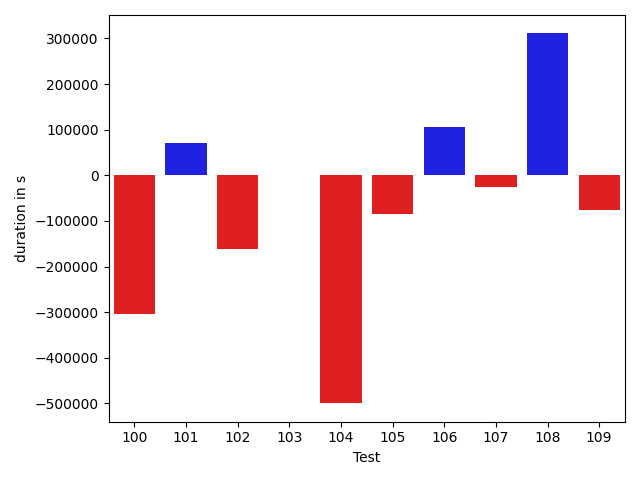

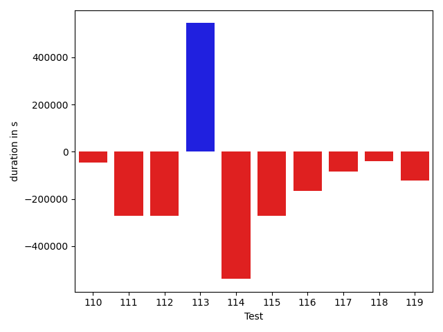

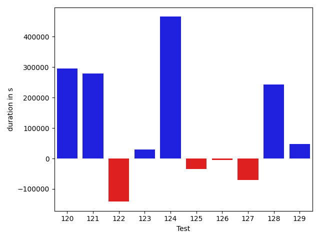

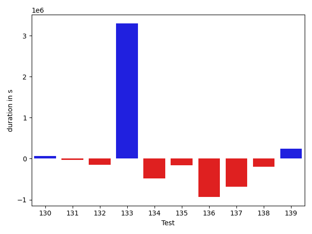

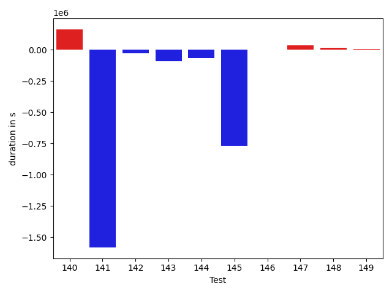

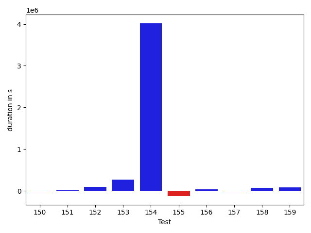

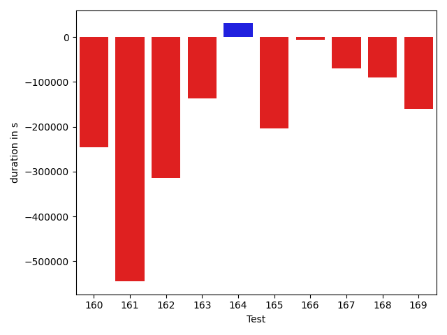

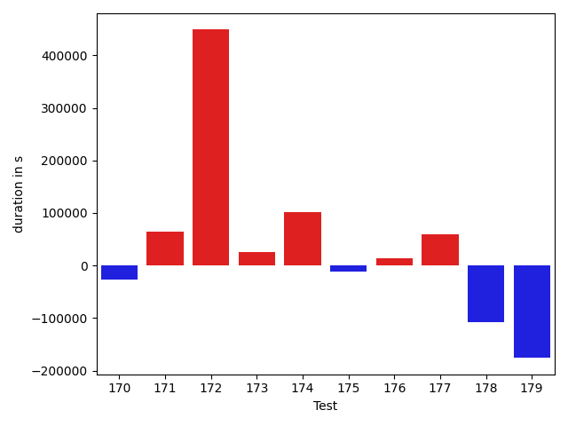

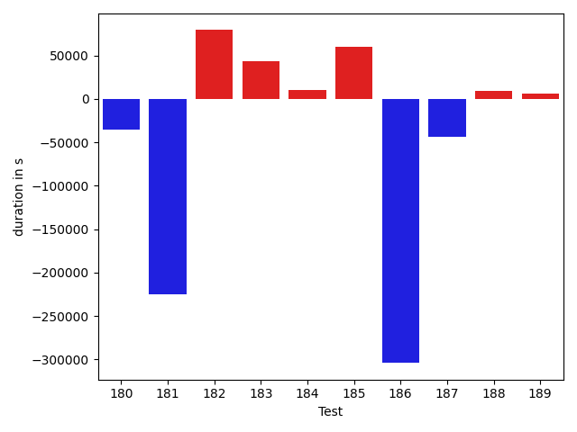

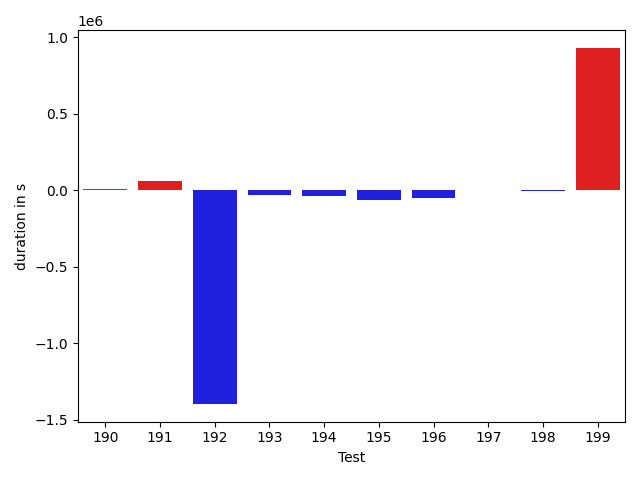

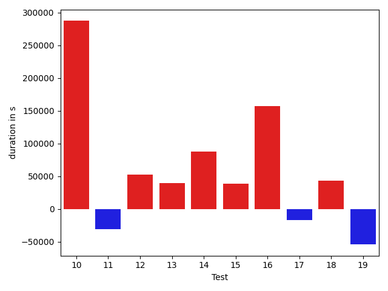

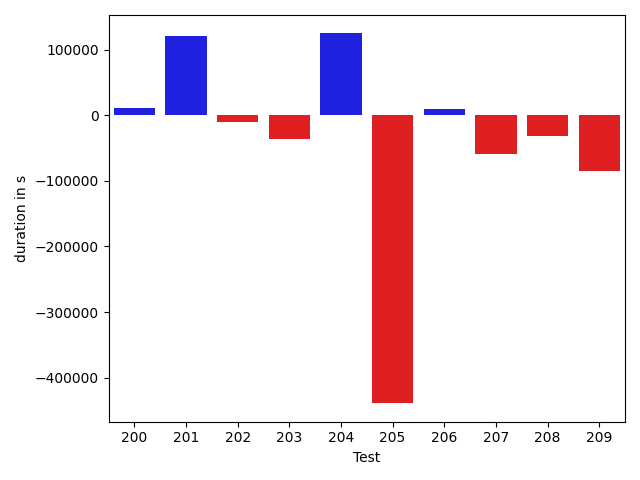

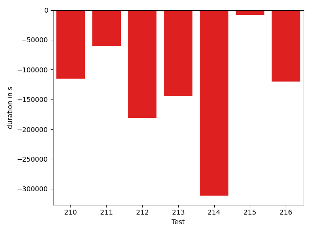

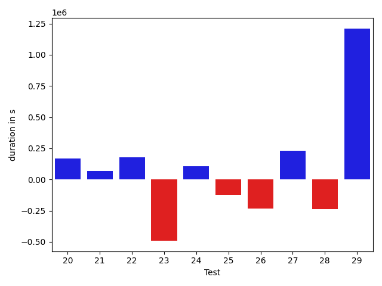

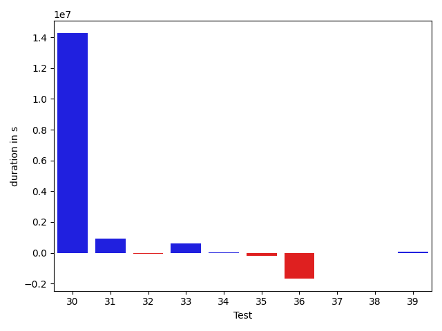

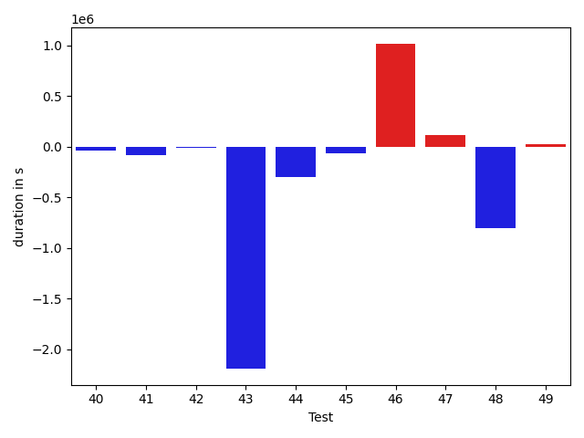

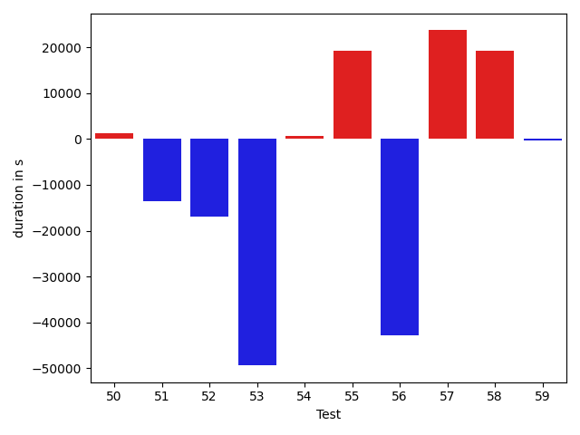

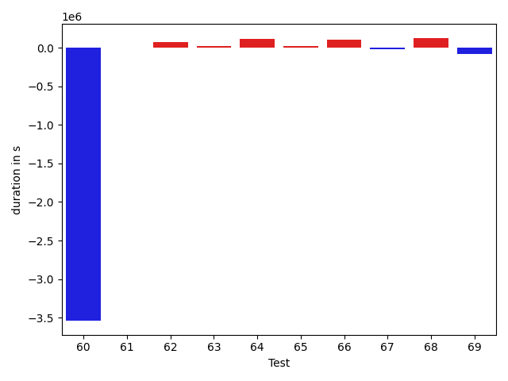

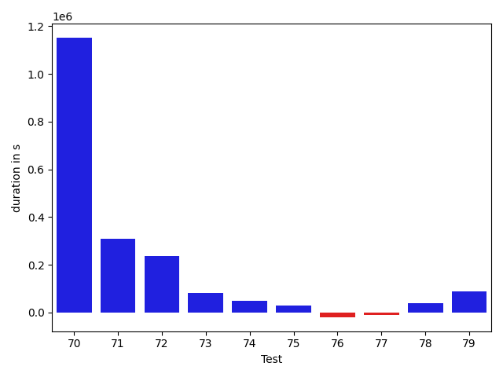

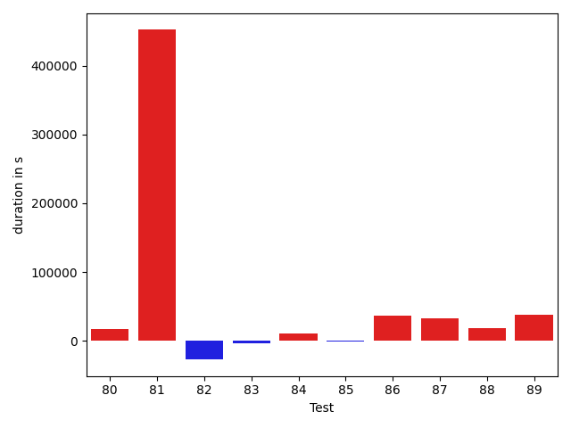

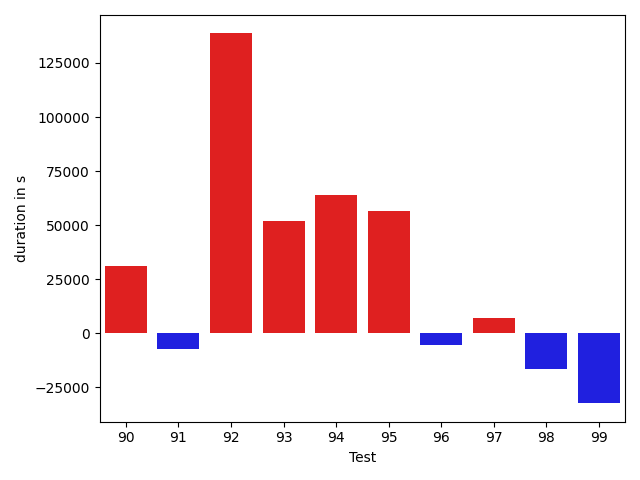

| ID | DurationV1 | DurationsV2 | DeltaDuration |
| --- | --- | --- | --- |
| 0 | 787490.0665925001 | 917663.6525553626 | 130173.58596286247 |
| 1 | 674463.8601297142 | 744291.2260985866 | 69827.36596887233 |
| 2 | 819702.0995419181 | 1051625.6014224163 | 231923.50188049814 |
| 3 | 912137.4236773112 | 950393.9838423816 | 38256.56016507046 |
| 4 | 1944517.6421291558 | 789202.4492492733 | -1155315.1928798826 |
| 5 | 2385248.796443947 | 2341614.104053447 | -43634.6923905001 |
| 6 | 1025074.6768454029 | 1303167.8804436307 | 278093.2035982278 |
| 7 | 912163.0119703149 | 964627.8900467374 | 52464.878076422494 |
| 8 | 655051.8491491836 | 810934.0663249083 | 155882.21717572468 |
| 9 | 573234.7865473186 | 804398.7408984419 | 231163.9543511233 |
| 10 | 725944.5372079432 | 816785.2716033914 | 90840.73439544823 |
| 11 | 1003016.1652685477 | 915274.6325409191 | -87741.5327276286 |
| 12 | 739602.0703816902 | 727868.5191238851 | -11733.551257805084 |
| 13 | 549538.5459022522 | 554129.2184915543 | 4590.672589302063 |
| 14 | 1000170.5169745401 | 1158381.1946793883 | 158210.67770484823 |
| 15 | 806445.8103279058 | 810308.6110967261 | 3862.800768820336 |
| 16 | 719789.9941793126 | 842305.2457704342 | 122515.25159112155 |
| 17 | 552619.6401508488 | 569467.1016374294 | 16847.461486580665 |
| 18 | 434877.6750032902 | 576206.3190841675 | 141328.6440808773 |
| 19 | 1032390.3585839453 | 1183717.7849977221 | 151327.42641377682 |
| 20 | 851090.6105034087 | 1020635.8543835824 | 169545.24388017366 |
| 21 | 516116.72254429315 | 582991.9949430022 | 66875.27239870909 |
| 22 | 1064834.2039280697 | 1245152.696592352 | 180318.4926642822 |
| 23 | 3525547.4136368376 | 3035344.5428751605 | -490202.87076167716 |
| 24 | 935147.1598498436 | 1040725.202250904 | 105578.04240106046 |
| 25 | 740474.3440977703 | 619985.7075283178 | -120488.63656945247 |
| 26 | 877609.1574543503 | 644301.3737727603 | -233307.78368159 |
| 27 | 512518.5772671221 | 744788.141184408 | 232269.56391728588 |
| 28 | 1090852.2364847152 | 855258.1264787649 | -235594.11000595032 |
| 29 | 1459653.9398254068 | 2669388.3097167644 | 1209734.3698913576 |
| 30 | 6329988.094876164 | 20604279.130747285 | 14274291.035871122 |
| 31 | 890717.7876470727 | 1833122.2142323018 | 942404.4265852291 |
| 32 | 751947.0451589702 | 679928.2703361041 | -72018.77482286608 |
| 33 | 1375896.4217690718 | 1971439.2024743326 | 595542.7807052608 |
| 34 | 420669.40511131287 | 448090.81844973564 | 27421.413338422775 |
| 35 | 573570.5531859398 | 378999.90304899216 | -194570.65013694763 |
| 36 | 2225939.865472369 | 552071.2706686535 | -1673868.5948037154 |
| 37 | 439741.5097966194 | 417454.1194553375 | -22287.39034128189 |
| 38 | 625443.7149332275 | 587195.8706240647 | -38247.844309162814 |
| 39 | 785823.7124190046 | 849873.5735400678 | 64049.86112106312 |
| 40 | 681295.7023810617 | 665108.0551096817 | -16187.647271380061 |
| 41 | 1295007.8874326616 | 1321756.345476612 | 26748.458043950377 |
| 42 | 457984.034096248 | 496143.4578089118 | 38159.42371266382 |
| 43 | 366265.5014190674 | 335738.83894348145 | -30526.662475585938 |
| 44 | 491573.22698783875 | 376489.62973082066 | -115083.59725701809 |
| 45 | 478702.99564556533 | 449806.5361754475 | -28896.459470117814 |
| 46 | 679309.796320624 | 679838.7296479394 | 528.9333273154916 |
| 47 | 450961.21742375754 | 443617.23322820663 | -7343.984195550904 |
| 48 | 485216.128885731 | 426348.63031917065 | -58867.49856656033 |
| 49 | 594630.2587390486 | 555593.6892745863 | -39036.56946446234 |
| 50 | 516785.9984496832 | 422249.83060440794 | -94536.16784527525 |
| 51 | 470472.0821456909 | 390031.7298655659 | -80440.35228012502 |
| 52 | 513525.77287614346 | 433936.87135549914 | -79588.90152064431 |
| 53 | 1323550.1029121021 | 1495771.774688251 | 172221.67177614896 |
| 54 | 777563.485296011 | 599926.2150143115 | -177637.2702816995 |
| 55 | 1362614.5930646318 | 2059752.1553947537 | 697137.5623301219 |
| 56 | 828528.9613509729 | 1021461.8511156256 | 192932.8897646527 |
| 57 | 691326.3145556941 | 1051140.4292456592 | 359814.11468996503 |
| 58 | 791227.6901392877 | 1090011.4568791713 | 298783.7667398836 |
| 59 | 666406.1681120897 | 858682.4600281226 | 192276.2919160329 |
| 60 | 743807.6557505678 | 802438.1970504925 | 58630.54129992472 |
| 61 | 942676.7150354319 | 563379.688256508 | -379297.02677892393 |
| 62 | 13676810.73449409 | 1306334.7678811452 | -12370475.966612944 |
| 63 | 852285.851436615 | 370735.8090209961 | -481550.0424156189 |
| 64 | 890904.3402246342 | 946105.472904308 | 55201.13267967384 |
| 65 | 536811.6631547213 | 435793.17848437093 | -101018.48467035033 |
| 66 | 2915171.206211567 | 522248.4661254883 | -2392922.7400860786 |
| 67 | 1149294.121586929 | 1599734.8617444057 | 450440.7401574766 |
| 68 | 3796961.2209537076 | 3622591.6316553135 | -174369.58929839404 |
| 69 | 456015.64273941517 | 550638.2084053457 | 94622.56566593051 |
| 70 | 14712807.425101744 | 15864361.173044853 | 1151553.747943109 |
| 71 | 1125799.2527671242 | 1434252.6807579272 | 308453.42799080303 |
| 72 | 650148.7860585952 | 885736.9091596336 | 235588.1231010384 |
| 73 | 720556.2221421226 | 803435.4149003786 | 82879.19275825599 |
| 74 | 433289.61886036396 | 481706.8360824585 | 48417.217222094536 |
| 75 | 514926.0004351139 | 542906.1478719357 | 27980.147436821833 |
| 76 | 827232.6977544024 | 807186.8110087656 | -20045.886745636817 |
| 77 | 412683.5727443695 | 403397.4483484179 | -9286.124395951629 |
| 78 | 806224.6281305095 | 846394.4939925218 | 40169.86586201226 |
| 79 | 502352.90967305057 | 591008.1007022467 | 88655.19102919608 |
| 80 | 561558.3833039396 | 640783.904867 | 79225.52156306035 |
| 81 | 654741.6621146091 | 715510.3574646722 | 60768.69535006303 |
| 82 | 824998.0562720912 | 1016178.3660143953 | 191180.30974230403 |
| 83 | 450446.3664264679 | 472505.0583655834 | 22058.691939115524 |
| 84 | 941988.9829140727 | 1199392.6785348167 | 257403.69562074402 |
| 85 | 522468.0884737894 | 488683.28114175797 | -33784.80733203143 |
| 86 | 472401.6549568176 | 496914.61207962036 | 24512.957122802734 |
| 87 | 2270382.619006181 | 1616341.8653987336 | -654040.7536074475 |
| 88 | 412192.78581237793 | 565007.0064239502 | 152814.22061157227 |
| 89 | 392194.26139450073 | 354816.40625 | -37377.85514450073 |
| 90 | 501688.3006439209 | 494277.4609661866 | -7410.8396777343005 |
| 91 | 406862.8531341553 | 709005.4328751639 | 302142.5797410086 |
| 92 | 334775.31913661957 | 472836.3718357086 | 138061.05269908905 |
| 93 | 491043.7255554199 | 473588.524130106 | -17455.20142531395 |
| 94 | 691092.6377767771 | 674006.8808024228 | -17085.756974354386 |
| 95 | 902606.5406366766 | 1244268.0435196813 | 341661.5028830047 |
| 96 | 798062.852359806 | 1221306.7679874992 | 423243.9156276933 |
| 97 | 511482.2005590722 | 634466.5455324023 | 122984.34497333015 |
| 98 | 1187111.9265042613 | 746360.017792377 | -440751.9087118843 |
| 99 | 815585.4080776534 | 990018.7877165752 | 174433.37963892182 |
| 100 | 984166.6716473848 | 679188.0821245413 | -304978.5895228435 |
| 101 | 566554.2432525158 | 636953.2309086248 | 70398.98765610904 |
| 102 | 622096.2279445487 | 459921.3070237562 | -162174.9209207925 |
| 103 | 496927.8547836691 | 496797.38602887094 | -130.4687547981739 |
| 104 | 2776268.352181631 | 2276732.373841798 | -499535.9783398332 |
| 105 | 479577.9420131324 | 395193.5525658205 | -84384.38944731187 |
| 106 | 808625.3754340903 | 915085.2543930815 | 106459.87895899126 |
| 107 | 802744.5648569614 | 777962.5412938744 | -24782.023563086987 |
| 108 | 597204.4303302467 | 908178.7568831444 | 310974.3265528977 |
| 109 | 612069.1103566922 | 536790.45426834 | -75278.6560883522 |
| 110 | 987043.4364262507 | 939633.4775800236 | -47409.95884622715 |
| 111 | 964658.7659085658 | 693571.3910253523 | -271087.37488321355 |
| 112 | 699772.1177052334 | 428484.44238099456 | -271287.67532423884 |
| 113 | 672948.8816180435 | 1217711.0261758273 | 544762.1445577837 |
| 114 | 1428618.996246338 | 889380.1978912354 | -539238.7983551025 |
| 115 | 1503966.5897657543 | 1233062.9374852474 | -270903.6522805069 |
| 116 | 1311858.0609198678 | 1145143.1431079532 | -166714.91781191458 |
| 117 | 671664.4788976297 | 587718.3521808017 | -83946.12671682797 |
| 118 | 831056.0320587895 | 790188.2267007455 | -40867.80535804399 |
| 119 | 1674367.9721543659 | 1550843.2228372076 | -123524.74931715825 |
| 120 | 1005819.6017161848 | 1301938.238526139 | 296118.6368099542 |
| 121 | 3716195.018082576 | 3996063.8403507266 | 279868.82226815075 |
| 122 | 672883.2937085554 | 531419.7151007652 | -141463.57860779017 |
| 123 | 605768.7571151241 | 636147.3954425883 | 30378.638327464112 |
| 124 | 518888.28674363624 | 984286.1598864808 | 465397.87314284453 |
| 125 | 647660.4446259969 | 613452.0724910503 | -34208.37213494652 |
| 126 | 773943.8313905443 | 769034.0912309822 | -4909.74015956209 |
| 127 | 387945.30862894654 | 317055.97150969505 | -70889.33711925149 |
| 128 | 459455.1372197494 | 701975.0197736695 | 242519.88255392015 |
| 129 | 526513.1794947702 | 574311.1438177824 | 47797.96432301216 |
| 130 | 568409.7457545748 | 631619.825585545 | 63210.079830970266 |
| 131 | 1047198.291331786 | 1015564.5787534843 | -31633.712578301667 |
| 132 | 1125932.6900897105 | 977620.428018985 | -148312.26207072556 |
| 133 | 4279180.850996105 | 7577488.063348255 | 3298307.21235215 |
| 134 | 1951159.8588878647 | 1472748.1743561896 | -478411.6845316752 |
| 135 | 1252256.66505221 | 1094995.673249675 | -157260.99180253502 |
| 136 | 2520434.7701766863 | 1587903.5362729176 | -932531.2339037687 |
| 137 | 1568488.7405163238 | 889218.458647711 | -679270.2818686129 |
| 138 | 941348.0146500987 | 741711.8676484718 | -199636.1470016269 |
| 139 | 903883.3497045998 | 1148986.2271113545 | 245102.87740675465 |
| 140 | 1113666.1551873898 | 1291445.312915574 | 177779.15772818425 |
| 141 | 1138847.0828163333 | 1408025.8693650179 | 269178.7865486846 |
| 142 | 1079945.159084593 | 2151540.386067366 | 1071595.2269827733 |
| 143 | 2282038.174767835 | 1247720.2313263863 | -1034317.9434414487 |
| 144 | 720262.023008206 | 712650.2009149201 | -7611.8220932859695 |
| 145 | 649791.4561602119 | 700643.8371849046 | 50852.38102469267 |
| 146 | 710709.1078970019 | 783991.7191997299 | 73282.61130272795 |
| 147 | 823111.0128357036 | 635819.3263546481 | -187291.68648105545 |
| 148 | 2376966.4724962367 | 14514264.565637177 | 12137298.093140941 |
| 149 | 731117.1282277338 | 744076.8396644854 | 12959.711436751648 |
| 150 | 788352.6063354905 | 775070.5671568403 | -13282.039178650128 |
| 151 | 1086890.5162221638 | 1095409.1748740417 | 8518.658651877893 |
| 152 | 1582191.2630572605 | 1679168.4168092175 | 96977.153751957 |
| 153 | 559979.335863205 | 826109.1025986328 | 266129.7667354278 |
| 154 | 1925985.2042594892 | 5945329.3863888 | 4019344.182129311 |
| 155 | 1142020.5690953182 | 1015454.8634311501 | -126565.70566416811 |
| 156 | 442660.6265668019 | 474396.7657762803 | 31736.139209478395 |
| 157 | 680701.7270586118 | 668246.2514915094 | -12455.475567102432 |
| 158 | 383138.45806884766 | 449587.15431928635 | 66448.69625043869 |
| 159 | 476439.20247364044 | 558157.2717423439 | 81718.06926870346 |
| 160 | 1083776.3289412179 | 837473.1437522377 | -246303.1851889802 |
| 161 | 1410019.1854448202 | 865072.7030975963 | -544946.4823472239 |
| 162 | 1262773.0807402767 | 948030.1399849987 | -314742.940755278 |
| 163 | 624062.0150922975 | 486890.97033548355 | -137171.0447568139 |
| 164 | 428587.50494384766 | 459246.2946662903 | 30658.789722442627 |
| 165 | 977273.284533022 | 773175.3098486332 | -204097.97468438873 |
| 166 | 457822.7617999315 | 451754.68716430664 | -6068.074635624886 |
| 167 | 613459.8043255834 | 543334.1742001139 | -70125.63012546953 |
| 168 | 602910.6575605869 | 512271.9299983978 | -90638.7275621891 |
| 169 | 621744.966873169 | 461145.03578042984 | -160599.9310927391 |
| 170 | 658892.7020788789 | 548953.4070734363 | -109939.29500544257 |
| 171 | 1304809.4372936026 | 1991346.072522224 | 686536.6352286213 |
| 172 | 1283709.361543182 | 1263069.439024583 | -20639.92251859908 |
| 173 | 1667046.512374103 | 2095014.61670863 | 427968.1043345269 |
| 174 | 527376.4749335671 | 450435.6014949754 | -76940.87343859172 |
| 175 | 708997.5957113551 | 986825.037809721 | 277827.44209836586 |
| 176 | 649014.7903781442 | 667791.0760768293 | 18776.285698685097 |
| 177 | 573794.3166899346 | 484347.04760447325 | -89447.26908546133 |
| 178 | 967948.2760676589 | 972292.6141428857 | 4344.338075226755 |
| 179 | 1761227.39421672 | 1725028.2547815796 | -36199.139435140416 |
| 180 | 827019.7926437589 | 736811.1562719032 | -90208.63637185574 |
| 181 | 568979.2302737138 | 534271.2996240787 | -34707.93064963515 |
| 182 | 2439764.2245845813 | 2304419.4985390697 | -135344.72604551166 |
| 183 | 589813.6545111133 | 711202.3754169459 | 121388.7209058326 |
| 184 | 522479.8111911975 | 900912.1945233195 | 378432.383332122 |
| 185 | 692586.4453200498 | 1250957.3251283176 | 558370.8798082678 |
| 186 | 367067.54819488525 | 497777.27683258057 | 130709.72863769531 |
| 187 | 456579.89018015936 | 736755.5029331641 | 280175.61275300477 |
| 188 | 467242.4998978395 | 635588.5820395546 | 168346.0821417151 |
| 189 | 663027.869140625 | 424711.56740760803 | -238316.30173301697 |
| 190 | 15521263.176902242 | 2813389.574446438 | -12707873.602455804 |
| 191 | 776358.148119922 | 732347.7308784989 | -44010.41724142316 |
| 192 | 320703.0263671875 | 395039.91357421875 | 74336.88720703125 |
| 193 | 1194917.5297101773 | 1369134.094848654 | 174216.56513847667 |
| 194 | 984034.0361669294 | 1204461.318596441 | 220427.28242951166 |
| 195 | 498988.4845275879 | 384848.84375 | -114139.64077758789 |
| 196 | 312806.8759765625 | 439667.6220703125 | 126860.74609375 |
| 197 | 1625415.3494062133 | 1762543.4508737796 | 137128.10146756633 |
| 198 | 4747586.222572145 | 5641560.825967415 | 893974.6033952702 |
| 199 | 2170306.4315404342 | 533890.9814196229 | -1636415.4501208114 |
| 200 | 529710.9143512622 | 540717.6257534027 | 11006.711402140558 |
| 201 | 357812.7445831299 | 477727.7421875 | 119914.99760437012 |
| 202 | 391027.2674751282 | 380618.94689941406 | -10408.320575714111 |
| 203 | 417276.1146850586 | 380570.2206726074 | -36705.89401245117 |
| 204 | 347683.7338296175 | 472182.0559655428 | 124498.3221359253 |
| 205 | 970661.5179457739 | 531631.2326917797 | -439030.28525399417 |
| 206 | 354510.9636230469 | 363809.83704948425 | 9298.873426437378 |
| 207 | 425505.882581234 | 366874.5031738281 | -58631.37940740585 |
| 208 | 419105.5150871277 | 387638.95502853394 | -31466.56005859375 |
| 209 | 451753.58984375 | 367092.24352264404 | -84661.34632110596 |
| 210 | 511080.5349121094 | 395647.1181640625 | -115433.41674804688 |
| 211 | 413017.3231201172 | 352491.5410385132 | -60525.782081604004 |
| 212 | 1290849.4244060516 | 1109701.5489544868 | -181147.8754515648 |
| 213 | 674853.1575362005 | 530389.9439547264 | -144463.21358147403 |
| 214 | 728246.8536682129 | 417007.7983016968 | -311239.0553665161 |
| 215 | 476497.85563087463 | 467891.57661628723 | -8606.279014587402 |
| 216 | 563075.7047576904 | 442658.3305263519 | -120417.3742313385 |

## Misc.

| ID | Test Class | Test Method |
| --- | --- | --- |
| 0 | com.google.gson.functional.CustomTypeAdaptersTest | testCustomAdapterInvokedForCollectionElementDeserialization |
| 1 | com.google.gson.functional.CustomTypeAdaptersTest | testCustomTypeAdapterAppliesToSubClassesSerializedAsBaseClass |
| 2 | com.google.gson.functional.CustomTypeAdaptersTest | testCustomAdapterInvokedForMapElementSerializationWithType |
| 3 | com.google.gson.functional.CustomTypeAdaptersTest | testCustomNestedSerializers |
| 4 | com.google.gson.functional.CustomTypeAdaptersTest | testCustomSerializers |
| 5 | com.google.gson.functional.CustomTypeAdaptersTest | testCustomTypeAdapterDoesNotAppliesToSubClasses |
| 6 | com.google.gson.functional.CustomTypeAdaptersTest | testCustomAdapterInvokedForCollectionElementSerializationWithType |
| 7 | com.google.gson.functional.CustomTypeAdaptersTest | testCustomByteArraySerializer |
| 8 | com.google.gson.functional.CustomTypeAdaptersTest | testEnsureCustomSerializerNotInvokedForNullValues |
| 9 | com.google.gson.functional.CustomTypeAdaptersTest | testCustomDeserializerInvokedForPrimitives |
| 10 | com.google.gson.functional.CustomTypeAdaptersTest | testCustomSerializerInvokedForPrimitives |
| 11 | com.google.gson.functional.CustomTypeAdaptersTest | testCustomDeserializers |
| 12 | com.google.gson.functional.CustomTypeAdaptersTest | testCustomByteArrayDeserializerAndInstanceCreator |
| 13 | com.google.gson.functional.CustomTypeAdaptersTest | testCustomAdapterInvokedForCollectionElementSerialization |
| 14 | com.google.gson.functional.CustomTypeAdaptersTest | testRegisterHierarchyAdapterForDate |
| 15 | com.google.gson.functional.CustomTypeAdaptersTest | testCustomNestedDeserializers |
| 16 | com.google.gson.functional.CustomTypeAdaptersTest | testCustomAdapterInvokedForMapElementDeserialization |
| 17 | com.google.gson.functional.CustomTypeAdaptersTest | testEnsureCustomDeserializerNotInvokedForNullValues |
| 18 | com.google.gson.functional.CustomTypeAdaptersTest | testCustomAdapterInvokedForMapElementSerialization |
| 19 | com.google.gson.functional.StreamingTypeAdaptersTest | testNullSafe |
| 20 | com.google.gson.functional.StreamingTypeAdaptersTest | testSerializeWithCustomTypeAdapter |
| 21 | com.google.gson.functional.StreamingTypeAdaptersTest | testDeserializeWithCustomTypeAdapter |
| 22 | com.google.gson.functional.JsonAdapterAnnotationOnClassesTest | testJsonAdapterInvoked |
| 23 | com.google.gson.functional.JsonAdapterAnnotationOnClassesTest | testRegisteredDeserializerOverridesJsonAdapter |
| 24 | com.google.gson.functional.JsonAdapterAnnotationOnClassesTest | testJsonAdapterFactoryInvoked |
| 25 | com.google.gson.functional.JsonAdapterAnnotationOnClassesTest | testRegisteredAdapterOverridesJsonAdapter |
| 26 | com.google.gson.functional.JsonAdapterAnnotationOnClassesTest | testRegisteredSerializerOverridesJsonAdapter |
| 27 | com.google.gson.functional.JsonAdapterAnnotationOnClassesTest | testIncorrectTypeAdapterFails |
| 28 | com.google.gson.functional.JsonAdapterAnnotationOnClassesTest | testSuperclassTypeAdapterNotInvoked |
| 29 | com.google.gson.functional.InstanceCreatorTest | testInstanceCreatorForParametrizedType |
| 30 | com.google.gson.functional.InstanceCreatorTest | testInstanceCreatorReturnsBaseType |
| 31 | com.google.gson.functional.InstanceCreatorTest | testInstanceCreatorReturnsSubTypeForField |
| 32 | com.google.gson.functional.InstanceCreatorTest | testInstanceCreatorReturnsSubTypeForTopLevelObject |
| 33 | com.google.gson.functional.InstanceCreatorTest | testInstanceCreatorForCollectionType |
| 34 | com.google.gson.OverrideCoreTypeAdaptersTest | testOverrideStringAdapter |
| 35 | com.google.gson.OverrideCoreTypeAdaptersTest | testOverridePrimitiveBooleanAdapter |
| 36 | com.google.gson.OverrideCoreTypeAdaptersTest | testOverrideWrapperBooleanAdapter |
| 37 | com.google.gson.functional.NullObjectAndFieldTest | testCustomTypeAdapterPassesNullSerialization |
| 38 | com.google.gson.functional.NullObjectAndFieldTest | testCustomTypeAdapterPassesNullDesrialization |
| 39 | com.google.gson.functional.NullObjectAndFieldTest | testAbsentJsonElementsAreSetToNull |
| 40 | com.google.gson.functional.NullObjectAndFieldTest | testNullWrappedPrimitiveMemberSerialization |
| 41 | com.google.gson.functional.NullObjectAndFieldTest | testExplicitSerializationOfNullArrayMembers |
| 42 | com.google.gson.functional.NullObjectAndFieldTest | testExplicitSerializationOfNullStringMembers |
| 43 | com.google.gson.functional.NullObjectAndFieldTest | testTopLevelNullObjectDeserialization |
| 44 | com.google.gson.functional.NullObjectAndFieldTest | testTopLevelNullObjectSerialization |
| 45 | com.google.gson.functional.NullObjectAndFieldTest | testExplicitSerializationOfNullCollectionMembers |
| 46 | com.google.gson.functional.NullObjectAndFieldTest | testPrintPrintingObjectWithNulls |
| 47 | com.google.gson.functional.NullObjectAndFieldTest | testNullWrappedPrimitiveMemberDeserialization |
| 48 | com.google.gson.functional.NullObjectAndFieldTest | testExplicitDeserializationOfNulls |
| 49 | com.google.gson.functional.NullObjectAndFieldTest | testExplicitSerializationOfNulls |
| 50 | com.google.gson.functional.NullObjectAndFieldTest | testCustomSerializationOfNulls |
| 51 | com.google.gson.functional.NullObjectAndFieldTest | testPrintPrintingArraysWithNulls |
| 52 | com.google.gson.functional.NullObjectAndFieldTest | testExplicitNullSetsFieldToNullDuringDeserialization |
| 53 | com.google.gson.functional.MapTest | testInterfaceTypeMapWithSerializer |
| 54 | com.google.gson.functional.MapTest | testMapSerializationWithNullValuesSerialized |
| 55 | com.google.gson.functional.MapTest | testInterfaceTypeMap |
| 56 | com.google.gson.functional.MapTest | testSerializeMaps |
| 57 | com.google.gson.functional.MapTest | testMapSubclassDeserialization |
| 58 | com.google.gson.functional.MapTest | testGeneralMapField |
| 59 | com.google.gson.functional.MapTest | testMapSerializationWithNullValueButSerializeNulls |
| 60 | com.google.gson.functional.MapTest | testCustomSerializerForSpecificMapType |
| 61 | com.google.gson.functional.FieldExclusionTest | testDefaultNestedStaticClassIncluded |
| 62 | com.google.gson.functional.FieldExclusionTest | testDefaultInnerClassExclusion |
| 63 | com.google.gson.functional.FieldExclusionTest | testInnerClassExclusion |
| 64 | com.google.gson.GsonBuilderTest | testExcludeFieldsWithModifiers |
| 65 | com.google.gson.GsonBuilderTest | testTransientFieldExclusion |
| 66 | com.google.gson.GsonBuilderTest | testCreatingMoreThanOnce |
| 67 | com.google.gson.functional.DefaultTypeAdaptersTest | testDateSerializationWithPattern |
| 68 | com.google.gson.functional.DefaultTypeAdaptersTest | testDefaultDateDeserializationUsingBuilder |
| 69 | com.google.gson.functional.DefaultTypeAdaptersTest | testDefaultCalendarSerialization |
| 70 | com.google.gson.functional.DefaultTypeAdaptersTest | testNullSerialization |
| 71 | com.google.gson.functional.DefaultTypeAdaptersTest | testDateSerializationInCollection |
| 72 | com.google.gson.functional.DefaultTypeAdaptersTest | testDefaultDateSerializationUsingBuilder |
| 73 | com.google.gson.functional.DefaultTypeAdaptersTest | testTimestampSerialization |
| 74 | com.google.gson.functional.DefaultTypeAdaptersTest | testOverrideBigDecimalTypeAdapter |
| 75 | com.google.gson.functional.DefaultTypeAdaptersTest | testDefaultCalendarDeserialization |
| 76 | com.google.gson.functional.DefaultTypeAdaptersTest | testDateDeserializationWithPattern |
| 77 | com.google.gson.functional.DefaultTypeAdaptersTest | testDefaultGregorianCalendarSerialization |
| 78 | com.google.gson.functional.DefaultTypeAdaptersTest | testDateSerializationWithPatternNotOverridenByTypeAdapter |
| 79 | com.google.gson.functional.DefaultTypeAdaptersTest | testBitSetDeserialization |
| 80 | com.google.gson.functional.DefaultTypeAdaptersTest | testOverrideBigIntegerTypeAdapter |
| 81 | com.google.gson.functional.DefaultTypeAdaptersTest | testSqlDateSerialization |
| 82 | com.google.gson.functional.DefaultTypeAdaptersTest | testClassSerialization |
| 83 | com.google.gson.functional.DefaultTypeAdaptersTest | testClassDeserialization |
| 84 | com.google.gson.functional.DefaultTypeAdaptersTest | testSetSerialization |
| 85 | com.google.gson.functional.DefaultTypeAdaptersTest | testBitSetSerialization |
| 86 | com.google.gson.functional.DefaultTypeAdaptersTest | testDefaultGregorianCalendarDeserialization |
| 87 | com.google.gson.functional.TypeAdapterPrecedenceTest | testStreamingHierarchicalFollowedByNonstreaming |
| 88 | com.google.gson.functional.TypeAdapterPrecedenceTest | testStreamingHierarchicalFollowedByNonstreamingHierarchical |
| 89 | com.google.gson.functional.TypeAdapterPrecedenceTest | testSerializeNonstreamingTypeAdapterFollowedByStreamingTypeAdapter |
| 90 | com.google.gson.functional.TypeAdapterPrecedenceTest | testNonstreamingFollowedByNonstreaming |
| 91 | com.google.gson.functional.TypeAdapterPrecedenceTest | testStreamingFollowedByStreaming |
| 92 | com.google.gson.functional.TypeAdapterPrecedenceTest | testNonstreamingHierarchicalFollowedByNonstreaming |
| 93 | com.google.gson.functional.TypeAdapterPrecedenceTest | testStreamingFollowedByNonstreaming |
| 94 | com.google.gson.functional.TypeAdapterPrecedenceTest | testStreamingFollowedByNonstreamingHierarchical |
| 95 | com.google.gson.JsonParserTest | testReadWriteTwoObjects |
| 96 | com.google.gson.functional.NamingPolicyTest | testGsonWithNonDefaultFieldNamingPolicySerialization |
| 97 | com.google.gson.functional.NamingPolicyTest | testGsonWithLowerCaseDashPolicyDeserialiation |
| 98 | com.google.gson.functional.NamingPolicyTest | testGsonDuplicateNameUsingSerializedNameFieldNamingPolicySerialization |
| 99 | com.google.gson.functional.NamingPolicyTest | testGsonWithSerializedNameFieldNamingPolicySerialization |
| 100 | com.google.gson.functional.NamingPolicyTest | testGsonWithNonDefaultFieldNamingPolicyDeserialiation |
| 101 | com.google.gson.functional.NamingPolicyTest | testGsonWithLowerCaseUnderscorePolicySerialization |
| 102 | com.google.gson.functional.NamingPolicyTest | testGsonWithLowerCaseDashPolicySerialization |
| 103 | com.google.gson.functional.NamingPolicyTest | testGsonWithLowerCaseUnderscorePolicyDeserialiation |
| 104 | com.google.gson.functional.NamingPolicyTest | testAtSignInSerializedName |
| 105 | com.google.gson.functional.NamingPolicyTest | testGsonWithSerializedNameFieldNamingPolicyDeserialization |
| 106 | com.google.gson.functional.NamingPolicyTest | testComplexFieldNameStrategy |
| 107 | com.google.gson.functional.NamingPolicyTest | testDeprecatedNamingStrategy |
| 108 | com.google.gson.functional.NamingPolicyTest | testGsonWithUpperCamelCaseSpacesPolicyDeserialiation |
| 109 | com.google.gson.functional.NamingPolicyTest | testGsonWithUpperCamelCaseSpacesPolicySerialiation |
| 110 | com.google.gson.functional.ObjectTest | testSingletonLists |
| 111 | com.google.gson.functional.ObjectTest | testAnonymousLocalClassesCustomSerialization |
| 112 | com.google.gson.functional.ObjectTest | testNullPrimitiveFieldsDeserialization |
| 113 | com.google.gson.functional.ObjectTest | testInnerClassDeserialization |
| 114 | com.google.gson.functional.ObjectTest | testJsonObjectSerialization |
| 115 | com.google.gson.functional.CustomDeserializerTest | testCustomDeserializerReturnsNull |
| 116 | com.google.gson.functional.CustomDeserializerTest | testJsonTypeFieldBasedDeserialization |
| 117 | com.google.gson.functional.CustomDeserializerTest | testCustomDeserializerReturnsNullForArrayElements |
| 118 | com.google.gson.functional.CustomDeserializerTest | testCustomDeserializerReturnsNullForArrayElementsForArrayField |
| 119 | com.google.gson.functional.CustomDeserializerTest | testCustomDeserializerReturnsNullForTopLevelObject |
| 120 | com.google.gson.functional.EnumTest | testEnumSubclassWithRegisteredTypeAdapter |
| 121 | com.google.gson.functional.VersioningTest | testVersionedUntilSerialization |
| 122 | com.google.gson.functional.VersioningTest | testIgnoreLaterVersionClassSerialization |
| 123 | com.google.gson.functional.VersioningTest | testVersionedClassesDeserialization |
| 124 | com.google.gson.functional.VersioningTest | testVersionedGsonWithUnversionedClassesSerialization |
| 125 | com.google.gson.functional.VersioningTest | testVersionedClassesSerialization |
| 126 | com.google.gson.functional.VersioningTest | testVersionedGsonMixingSinceAndUntilSerialization |
| 127 | com.google.gson.functional.VersioningTest | testIgnoreLaterVersionClassDeserialization |
| 128 | com.google.gson.functional.VersioningTest | testVersionedUntilDeserialization |
| 129 | com.google.gson.functional.VersioningTest | testVersionedGsonWithUnversionedClassesDeserialization |
| 130 | com.google.gson.functional.VersioningTest | testVersionedGsonMixingSinceAndUntilDeserialization |
| 131 | com.google.gson.functional.MapAsArrayTypeAdapterTest | testMultipleEnableComplexKeyRegistrationHasNoEffect |
| 132 | com.google.gson.functional.MapAsArrayTypeAdapterTest | testMapWithTypeVariableDeserialization |
| 133 | com.google.gson.functional.MapAsArrayTypeAdapterTest | testSerializeComplexMapWithTypeAdapter |
| 134 | com.google.gson.functional.MapAsArrayTypeAdapterTest | testTwoTypesCollapseToOneDeserialize |
| 135 | com.google.gson.functional.MapAsArrayTypeAdapterTest | testMapWithTypeVariableSerialization |
| 136 | com.google.gson.functional.TypeVariableTest | testAdvancedTypeVariables |
| 137 | com.google.gson.functional.TypeVariableTest | testTypeVariablesViaTypeParameter |
| 138 | com.google.gson.functional.TypeVariableTest | testBasicTypeVariables |
| 139 | com.google.gson.functional.ParameterizedTypesTest | testParameterizedTypeWithReaderDeserialization |
| 140 | com.google.gson.functional.ParameterizedTypesTest | testParameterizedTypeWithCustomSerializer |
| 141 | com.google.gson.functional.ParameterizedTypesTest | testParameterizedTypeDeserialization |
| 142 | com.google.gson.functional.ParameterizedTypesTest | testParameterizedTypesWithCustomDeserializer |
| 143 | com.google.gson.functional.FieldNamingTest | testIdentity |
| 144 | com.google.gson.functional.FieldNamingTest | testLowerCaseWithUnderscores |
| 145 | com.google.gson.functional.FieldNamingTest | testUpperCamelCase |
| 146 | com.google.gson.functional.FieldNamingTest | testUpperCamelCaseWithSpaces |
| 147 | com.google.gson.functional.FieldNamingTest | testLowerCaseWithDashes |
| 148 | com.google.gson.functional.JsonAdapterAnnotationOnFieldsTest | testClassAnnotationAdapterTakesPrecedenceOverDefault |
| 149 | com.google.gson.functional.JsonAdapterAnnotationOnFieldsTest | testFieldAnnotationTakesPrecedenceOverClassAnnotation |
| 150 | com.google.gson.functional.JsonAdapterAnnotationOnFieldsTest | testJsonAdapterInvokedOnlyForAnnotatedFields |
| 151 | com.google.gson.functional.JsonAdapterAnnotationOnFieldsTest | testFieldAnnotationTakesPrecedenceOverRegisteredTypeAdapter |
| 152 | com.google.gson.functional.JsonAdapterAnnotationOnFieldsTest | testClassAnnotationAdapterFactoryTakesPrecedenceOverDefault |
| 153 | com.google.gson.functional.JsonAdapterAnnotationOnFieldsTest | testRegisteredTypeAdapterTakesPrecedenceOverClassAnnotationAdapter |
| 154 | com.google.gson.functional.SecurityTest | testNonExecutableJsonSerialization |
| 155 | com.google.gson.functional.SecurityTest | testNonExecutableJsonDeserialization |
| 156 | com.google.gson.functional.SecurityTest | testJsonWithNonExectuableTokenWithRegularGsonDeserialization |
| 157 | com.google.gson.functional.SecurityTest | testJsonWithNonExectuableTokenWithConfiguredGsonDeserialization |
| 158 | com.google.gson.functional.SecurityTest | testJsonWithNonExectuableTokenSerialization |
| 159 | com.google.gson.MixedStreamTest | testWriteClosed |
| 160 | com.google.gson.MixedStreamTest | testWriteHtmlSafe |
| 161 | com.google.gson.MixedStreamTest | testWriteLenient |
| 162 | com.google.gson.MixedStreamTest | testReadClosed |
| 163 | com.google.gson.MixedStreamTest | testReaderDoesNotMutateState |
| 164 | com.google.gson.MixedStreamTest | testReadNulls |
| 165 | com.google.gson.MixedStreamTest | testWriteMixedStreamed |
| 166 | com.google.gson.MixedStreamTest | testWriteNulls |
| 167 | com.google.gson.MixedStreamTest | testReadMixedStreamed |
| 168 | com.google.gson.MixedStreamTest | testReadInvalidState |
| 169 | com.google.gson.MixedStreamTest | testWriteInvalidState |
| 170 | com.google.gson.MixedStreamTest | testWriteDoesNotMutateState |
| 171 | com.google.gson.CommentsTest | testParseComments |
| 172 | com.google.gson.functional.EscapingTest | testGsonAcceptsEscapedAndNonEscapedJsonDeserialization |
| 173 | com.google.gson.functional.CustomSerializerTest | testSubClassSerializerInvokedForBaseClassFieldsHoldingSubClassInstances |
| 174 | com.google.gson.functional.CustomSerializerTest | testBaseClassSerializerInvokedForBaseClassFields |
| 175 | com.google.gson.functional.CustomSerializerTest | testSubClassSerializerInvokedForBaseClassFieldsHoldingArrayOfSubClassInstances |
| 176 | com.google.gson.functional.CustomSerializerTest | testSerializerReturnsNull |
| 177 | com.google.gson.functional.CustomSerializerTest | testBaseClassSerializerInvokedForBaseClassFieldsHoldingSubClassInstances |
| 178 | com.google.gson.functional.CollectionTest | testUserCollectionTypeAdapter |
| 179 | com.google.gson.functional.UncategorizedTest | testReturningDerivedClassesDuringDeserialization |
| 180 | com.google.gson.DefaultMapJsonSerializerTest | testNonEmptyMapSerialization |
| 181 | com.google.gson.functional.ExclusionStrategyFunctionalTest | testExcludeTopLevelClassSerializationDoesNotImpactDeserialization |
| 182 | com.google.gson.functional.ExclusionStrategyFunctionalTest | testExclusionStrategySerialization |
| 183 | com.google.gson.functional.ExclusionStrategyFunctionalTest | testExclusionStrategyWithMode |
| 184 | com.google.gson.functional.ExclusionStrategyFunctionalTest | testExclusionStrategySerializationDoesNotImpactDeserialization |
| 185 | com.google.gson.functional.ExclusionStrategyFunctionalTest | testExclusionStrategyDeserialization |
| 186 | com.google.gson.functional.ExclusionStrategyFunctionalTest | testExcludeTopLevelClassDeserialization |
| 187 | com.google.gson.functional.ExclusionStrategyFunctionalTest | testExclusionStrategySerializationDoesNotImpactSerialization |
| 188 | com.google.gson.functional.ExclusionStrategyFunctionalTest | testExcludeTopLevelClassDeserializationDoesNotImpactSerialization |
| 189 | com.google.gson.functional.ExclusionStrategyFunctionalTest | testExcludeTopLevelClassSerialization |
| 190 | com.google.gson.functional.TypeHierarchyAdapterTest | testTypeHierarchy |
| 191 | com.google.gson.functional.TypeHierarchyAdapterTest | testRegisterSuperTypeFirst |
| 192 | com.google.gson.functional.TypeHierarchyAdapterTest | testRegisterSubTypeFirstAllowed |
| 193 | com.google.gson.functional.ReadersWritersTest | testReadWriteTwoStrings |
| 194 | com.google.gson.functional.ReadersWritersTest | testReadWriteTwoObjects |
| 195 | com.google.gson.functional.ReadersWritersTest | testTopLevelNullObjectSerializationWithWriterAndSerializeNulls |
| 196 | com.google.gson.functional.ReadersWritersTest | testTopLevelNullObjectDeserializationWithReaderAndSerializeNulls |
| 197 | com.google.gson.GsonTypeAdapterTest | testDeserializerForAbstractClass |
| 198 | com.google.gson.functional.CircularReferenceTest | testSelfReferenceCustomHandlerSerialization |
| 199 | com.google.gson.LongSerializationPolicyTest | testDefaultLongSerializationIntegration |
| 200 | com.google.gson.LongSerializationPolicyTest | testStringLongSerializationIntegration |
| 201 | com.google.gson.functional.PrimitiveTest | testDoubleInfinitySerialization |
| 202 | com.google.gson.functional.PrimitiveTest | testFloatInfinitySerialization |
| 203 | com.google.gson.functional.PrimitiveTest | testDoubleNaNSerialization |
| 204 | com.google.gson.functional.PrimitiveTest | testLongAsStringDeserialization |
| 205 | com.google.gson.functional.PrimitiveTest | testMoreSpecificSerialization |
| 206 | com.google.gson.functional.PrimitiveTest | testHtmlCharacterSerialization |
| 207 | com.google.gson.functional.PrimitiveTest | testNegativeInfinitySerialization |
| 208 | com.google.gson.functional.PrimitiveTest | testLongAsStringSerialization |
| 209 | com.google.gson.functional.PrimitiveTest | testFloatNaNSerialization |
| 210 | com.google.gson.functional.PrimitiveTest | testNegativeInfinityFloatSerialization |
| 211 | com.google.gson.JsonObjectTest | testWritePropertyWithEmptyStringName |
| 212 | com.google.gson.JsonObjectTest | testPropertyWithQuotes |
| 213 | com.google.gson.functional.JavaUtilConcurrentLocksTest | testAtomicIntegerArray |
| 214 | com.google.gson.functional.ArrayTest | testNullsInArrayWithSerializeNullPropertySetSerialization |
| 215 | com.google.gson.functional.ArrayTest | testArrayElementsAreArrays |
| 216 | com.google.gson.functional.PrintFormattingTest | testJsonObjectWithNullValuesSerialized |

| Test | IterationV1 | IterationV2 | DeltaIteration |
| --- | --- | --- | --- |
| 0 | 51 | 61 | 10 |
| 1 | 45 | 45 | 0 |
| 2 | 49 | 55 | 6 |
| 3 | 56 | 55 | -1 |
| 4 | 60 | 65 | 5 |
| 5 | 99 | 99 | 0 |
| 6 | 64 | 71 | 7 |
| 7 | 50 | 51 | 1 |
| 8 | 39 | 53 | 14 |
| 9 | 47 | 43 | -4 |
| 10 | 43 | 42 | -1 |
| 11 | 55 | 53 | -2 |
| 12 | 52 | 51 | -1 |
| 13 | 19 | 24 | 5 |
| 14 | 58 | 47 | -11 |
| 15 | 47 | 44 | -3 |
| 16 | 44 | 61 | 17 |
| 17 | 31 | 36 | 5 |
| 18 | 24 | 21 | -3 |
| 19 | 85 | 78 | -7 |
| 20 | 69 | 68 | -1 |
| 21 | 35 | 29 | -6 |
| 22 | 78 | 79 | 1 |
| 23 | 99 | 99 | 0 |
| 24 | 75 | 74 | -1 |
| 25 | 42 | 39 | -3 |
| 26 | 49 | 49 | 0 |
| 27 | 39 | 34 | -5 |
| 28 | 43 | 40 | -3 |
| 29 | 99 | 99 | 0 |
| 30 | 63 | 56 | -7 |
| 31 | 64 | 51 | -13 |
| 32 | 55 | 35 | -20 |
| 33 | 99 | 98 | -1 |
| 34 | 19 | 26 | 7 |
| 35 | 22 | 24 | 2 |
| 36 | 37 | 37 | 0 |
| 37 | 23 | 23 | 0 |
| 38 | 47 | 46 | -1 |
| 39 | 59 | 63 | 4 |
| 40 | 46 | 43 | -3 |
| 41 | 98 | 99 | 1 |
| 42 | 32 | 27 | -5 |
| 43 | 19 | 17 | -2 |
| 44 | 20 | 24 | 4 |
| 45 | 38 | 33 | -5 |
| 46 | 48 | 50 | 2 |
| 47 | 30 | 21 | -9 |
| 48 | 34 | 30 | -4 |
| 49 | 30 | 31 | 1 |
| 50 | 24 | 29 | 5 |
| 51 | 18 | 26 | 8 |
| 52 | 24 | 32 | 8 |
| 53 | 97 | 97 | 0 |
| 54 | 23 | 31 | 8 |
| 55 | 92 | 94 | 2 |
| 56 | 62 | 63 | 1 |
| 57 | 58 | 46 | -12 |
| 58 | 68 | 60 | -8 |
| 59 | 49 | 47 | -2 |
| 60 | 50 | 52 | 2 |
| 61 | 37 | 43 | 6 |
| 62 | 77 | 77 | 0 |
| 63 | 20 | 16 | -4 |
| 64 | 68 | 67 | -1 |
| 65 | 24 | 30 | 6 |
| 66 | 22 | 16 | -6 |
| 67 | 93 | 95 | 2 |
| 68 | 99 | 99 | 0 |
| 69 | 29 | 27 | -2 |
| 70 | 99 | 99 | 0 |
| 71 | 87 | 95 | 8 |
| 72 | 48 | 48 | 0 |
| 73 | 58 | 51 | -7 |
| 74 | 24 | 19 | -5 |
| 75 | 26 | 29 | 3 |
| 76 | 56 | 54 | -2 |
| 77 | 22 | 27 | 5 |
| 78 | 45 | 47 | 2 |
| 79 | 35 | 39 | 4 |
| 80 | 37 | 31 | -6 |
| 81 | 47 | 44 | -3 |
| 82 | 48 | 61 | 13 |
| 83 | 20 | 25 | 5 |
| 84 | 45 | 34 | -11 |
| 85 | 28 | 22 | -6 |
| 86 | 21 | 19 | -2 |
| 87 | 92 | 93 | 1 |
| 88 | 16 | 20 | 4 |
| 89 | 20 | 10 | -10 |
| 90 | 17 | 30 | 13 |
| 91 | 17 | 30 | 13 |
| 92 | 22 | 20 | -2 |
| 93 | 16 | 23 | 7 |
| 94 | 27 | 26 | -1 |
| 95 | 61 | 72 | 11 |
| 96 | 46 | 57 | 11 |
| 97 | 30 | 33 | 3 |
| 98 | 53 | 66 | 13 |
| 99 | 49 | 58 | 9 |
| 100 | 26 | 36 | 10 |
| 101 | 24 | 28 | 4 |
| 102 | 35 | 27 | -8 |
| 103 | 26 | 28 | 2 |
| 104 | 88 | 87 | -1 |
| 105 | 31 | 28 | -3 |
| 106 | 53 | 53 | 0 |
| 107 | 29 | 40 | 11 |
| 108 | 31 | 22 | -9 |
| 109 | 29 | 30 | 1 |
| 110 | 73 | 66 | -7 |
| 111 | 64 | 48 | -16 |
| 112 | 28 | 27 | -1 |
| 113 | 50 | 57 | 7 |
| 114 | 21 | 17 | -4 |
| 115 | 50 | 55 | 5 |
| 116 | 77 | 77 | 0 |
| 117 | 49 | 58 | 9 |
| 118 | 56 | 60 | 4 |
| 119 | 43 | 58 | 15 |
| 120 | 81 | 69 | -12 |
| 121 | 99 | 99 | 0 |
| 122 | 27 | 22 | -5 |
| 123 | 43 | 33 | -10 |
| 124 | 40 | 46 | 6 |
| 125 | 40 | 45 | 5 |
| 126 | 62 | 62 | 0 |
| 127 | 26 | 23 | -3 |
| 128 | 27 | 27 | 0 |
| 129 | 30 | 29 | -1 |
| 130 | 46 | 49 | 3 |
| 131 | 66 | 67 | 1 |
| 132 | 73 | 68 | -5 |
| 133 | 99 | 99 | 0 |
| 134 | 60 | 60 | 0 |
| 135 | 79 | 74 | -5 |
| 136 | 99 | 99 | 0 |
| 137 | 84 | 87 | 3 |
| 138 | 62 | 60 | -2 |
| 139 | 68 | 67 | -1 |
| 140 | 84 | 87 | 3 |
| 141 | 71 | 70 | -1 |
| 142 | 76 | 82 | 6 |
| 143 | 90 | 89 | -1 |
| 144 | 42 | 41 | -1 |
| 145 | 30 | 36 | 6 |
| 146 | 43 | 40 | -3 |
| 147 | 47 | 36 | -11 |
| 148 | 96 | 93 | -3 |
| 149 | 44 | 49 | 5 |
| 150 | 56 | 48 | -8 |
| 151 | 85 | 78 | -7 |
| 152 | 96 | 98 | 2 |
| 153 | 43 | 44 | 1 |
| 154 | 40 | 35 | -5 |
| 155 | 31 | 30 | -1 |
| 156 | 38 | 30 | -8 |
| 157 | 28 | 28 | 0 |
| 158 | 17 | 22 | 5 |
| 159 | 23 | 22 | -1 |
| 160 | 61 | 66 | 5 |
| 161 | 72 | 59 | -13 |
| 162 | 52 | 43 | -9 |
| 163 | 31 | 24 | -7 |
| 164 | 16 | 22 | 6 |
| 165 | 42 | 44 | 2 |
| 166 | 24 | 16 | -8 |
| 167 | 41 | 35 | -6 |
| 168 | 25 | 22 | -3 |
| 169 | 22 | 22 | 0 |
| 170 | 25 | 30 | 5 |
| 171 | 59 | 71 | 12 |
| 172 | 56 | 53 | -3 |
| 173 | 68 | 64 | -4 |
| 174 | 38 | 32 | -6 |
| 175 | 49 | 50 | 1 |
| 176 | 44 | 45 | 1 |
| 177 | 38 | 41 | 3 |
| 178 | 68 | 79 | 11 |
| 179 | 99 | 99 | 0 |
| 180 | 55 | 55 | 0 |
| 181 | 31 | 32 | 1 |
| 182 | 99 | 99 | 0 |
| 183 | 37 | 45 | 8 |
| 184 | 46 | 44 | -2 |
| 185 | 47 | 45 | -2 |
| 186 | 18 | 20 | 2 |
| 187 | 31 | 31 | 0 |
| 188 | 30 | 33 | 3 |
| 189 | 16 | 20 | 4 |
| 190 | 99 | 99 | 0 |
| 191 | 47 | 45 | -2 |
| 192 | 12 | 13 | 1 |
| 193 | 69 | 63 | -6 |
| 194 | 70 | 47 | -23 |
| 195 | 17 | 8 | -9 |
| 196 | 18 | 12 | -6 |
| 197 | 99 | 98 | -1 |
| 198 | 99 | 99 | 0 |
| 199 | 37 | 28 | -9 |
| 200 | 29 | 20 | -9 |
| 201 | 18 | 11 | -7 |
| 202 | 20 | 13 | -7 |
| 203 | 16 | 18 | 2 |
| 204 | 27 | 23 | -4 |
| 205 | 29 | 26 | -3 |
| 206 | 14 | 22 | 8 |
| 207 | 22 | 12 | -10 |
| 208 | 20 | 20 | 0 |
| 209 | 10 | 19 | 9 |
| 210 | 13 | 11 | -2 |
| 211 | 14 | 18 | 4 |
| 212 | 23 | 22 | -1 |
| 213 | 36 | 35 | -1 |
| 214 | 16 | 18 | 2 |
| 215 | 21 | 20 | -1 |
| 216 | 17 | 22 | 5 |

| Time Label | Time (s) |
| --- | --- |
| Selection | 28.663830041885376 |
| Injection | 17.314621448516846 |
| Total | 1144.1101791858673 |

