# gson fef43b

https://github.com/google/gson/commit/fef43b

## Delta Energy per test method

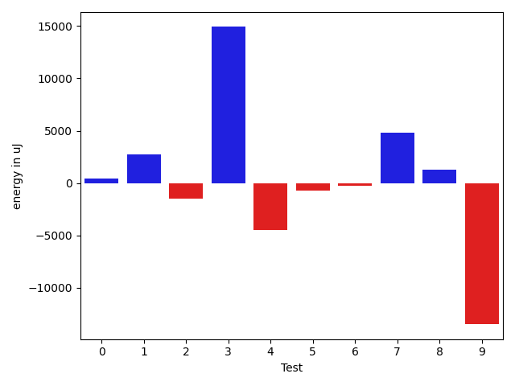

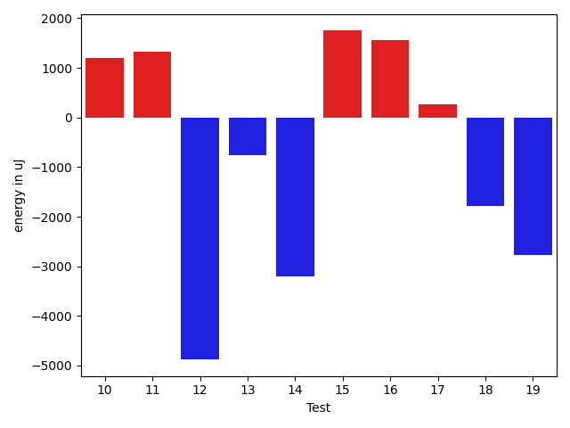

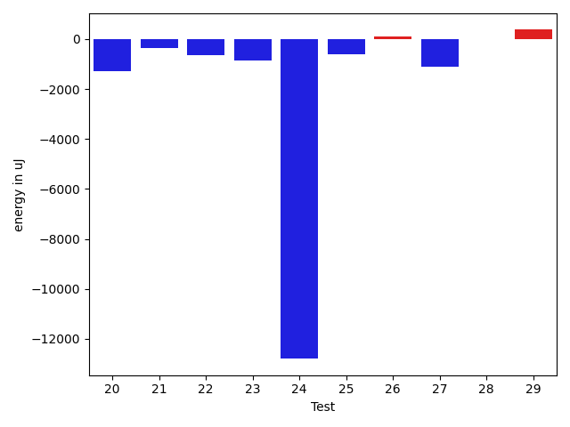

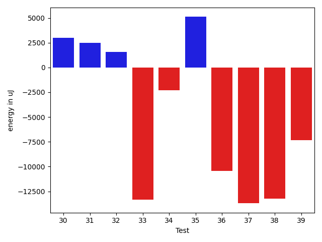

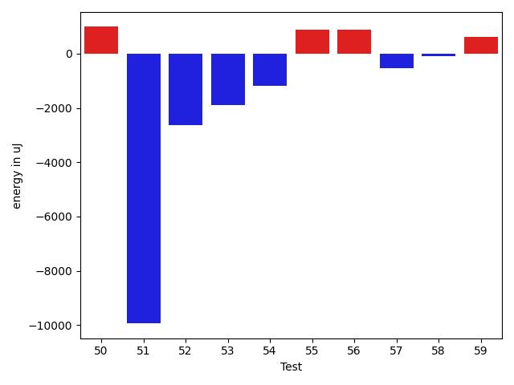

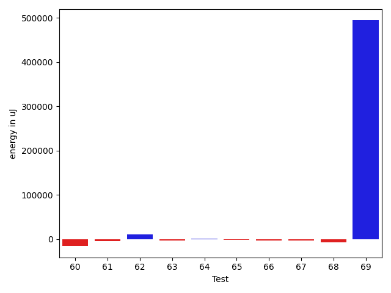

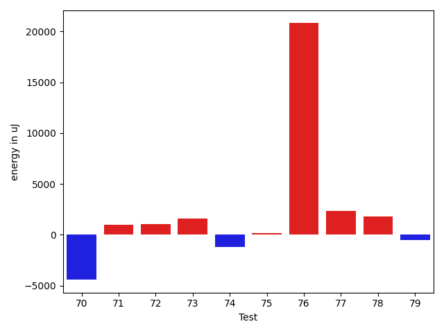

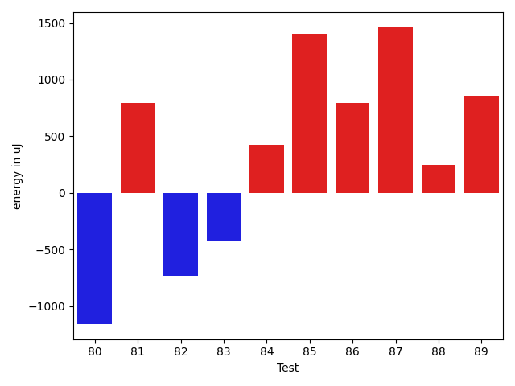

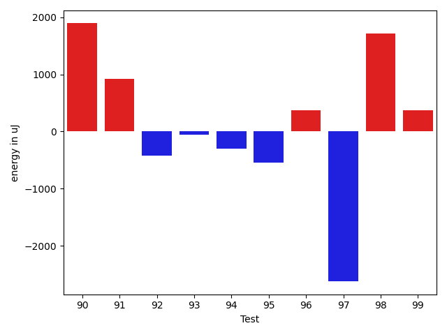

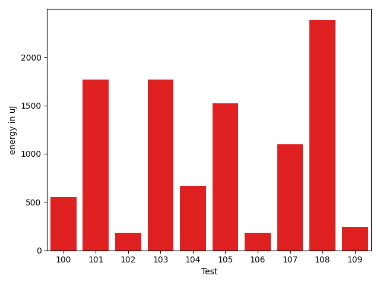

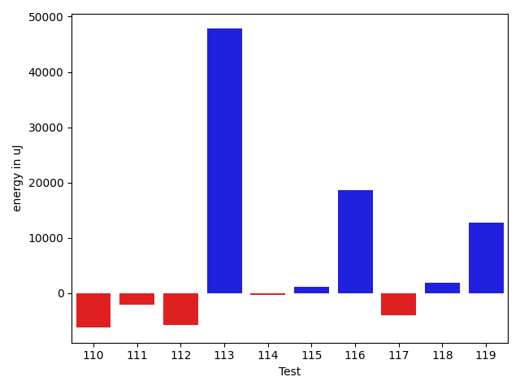

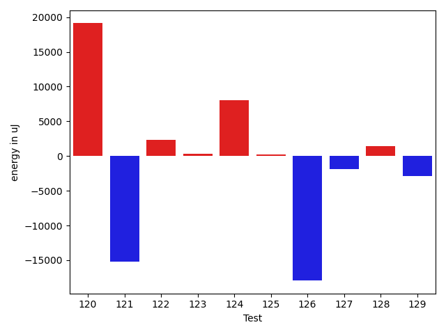

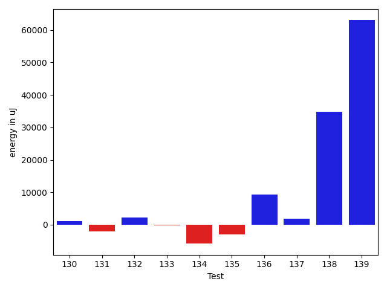

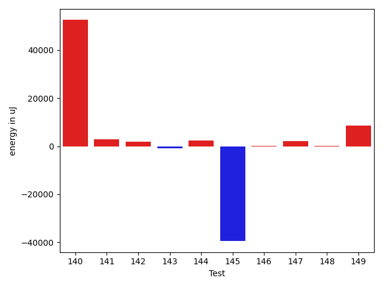

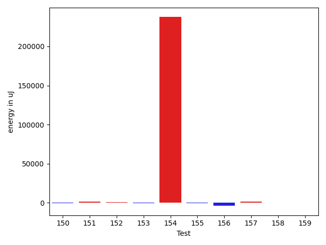

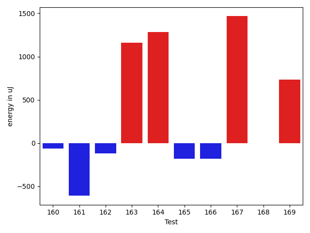

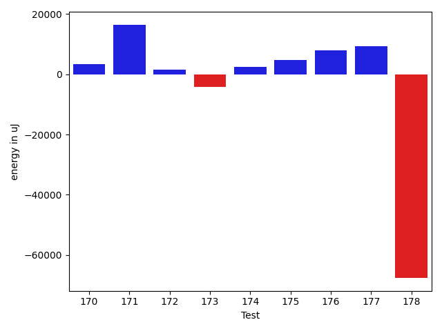

| ID | EnergyV1 | EnergyV2 | DeltaEnergy | σV1 | σV2 |
| --- | --- | --- | --- | --- | --- |
| 0 | 38757 | 38513 | -244 | 5053.6509705614635 | 7136.299095790513 |
| 1 | 39184 | 39123 | -61 | 4961.667062506295 | 4229.49929412552 |
| 2 | 37903 | 40039 | 2136 | 5606.195084339814 | 7968.32731055643 |
| 3 | 39978 | 41016 | 1038 | 14638.415874066155 | 35490.94080646672 |
| 4 | 38452 | 39062 | 610 | 8395.134016078637 | 6149.965441204083 |
| 5 | 36133 | 38757 | 2624 | 4739.061718559735 | 3934.196679237849 |
| 6 | 39184 | 39734 | 550 | 9396.455775127184 | 10061.285056412618 |
| 7 | 39978 | 39184 | -794 | 11640.10370430236 | 10190.121908004832 |
| 8 | 39428 | 40222 | 794 | 13878.480043418254 | 14610.599540699832 |
| 9 | 39489 | 38757 | -732 | 16426.924697706054 | 18272.386049900466 |
| 10 | 37903 | 39612 | 1709 | 3967.0536037910397 | 4309.706465005329 |
| 11 | 37902 | 39306 | 1404 | 4494.184909617822 | 3695.8969801967082 |
| 12 | 41504 | 40955 | -549 | 12888.911799681237 | 9162.06544991869 |
| 13 | 38086 | 37475 | -611 | 4070.6421502119138 | 3682.5118015245175 |
| 14 | 39245 | 37659 | -1586 | 11657.848316661659 | 9200.956879277339 |
| 15 | 39246 | 39550 | 304 | 10962.76430893028 | 13601.502459216708 |
| 16 | 38697 | 38819 | 122 | 6941.41649720389 | 15488.188972327858 |
| 17 | 38452 | 38269 | -183 | 7146.6236017787805 | 8123.605022993178 |
| 18 | 38696 | 37048 | -1648 | 3895.3834351813057 | 3747.7989106291907 |
| 19 | 40222 | 38025 | -2197 | 8603.602894657384 | 7167.53746592455 |
| 20 | 38452 | 38635 | 183 | 4031.7895910519405 | 3800.7501891074085 |
| 21 | 38636 | 37841 | -795 | 3904.96361855296 | 4000.161577861506 |
| 22 | 38330 | 37415 | -915 | 3676.6267855512883 | 3790.0421475756707 |
| 23 | 40405 | 37781 | -2624 | 3401.8713214241866 | 3815.3788196180576 |
| 24 | 42175 | 39368 | -2807 | 88488.84505827662 | 53905.846107971716 |
| 25 | 38879 | 37171 | -1708 | 3826.3462559418367 | 4054.4833000466465 |
| 26 | 38269 | 36193 | -2076 | 4183.01710569294 | 6226.056328764542 |
| 27 | 38696 | 38147 | -549 | 8338.428297843155 | 7630.039026603994 |
| 28 | 38330 | 38513 | 183 | 3833.1384860269823 | 3617.391134236877 |
| 29 | 36805 | 38086 | 1281 | 3855.9248075656246 | 4152.601184799715 |
| 30 | 39368 | 38330 | -1038 | 3410.9941646117027 | 3635.7245239658446 |
| 31 | 39429 | 37537 | -1892 | 4356.776710673462 | 4187.967310594581 |
| 32 | 41504 | 41076 | -428 | 140416.14405211442 | 71360.14325414124 |
| 33 | 39063 | 40100 | 1037 | 10337.22813116424 | 6468.51842537184 |
| 34 | 41138 | 43396 | 2258 | 56281.932263027324 | 44434.9617640801 |
| 35 | 39551 | 40100 | 549 | 14562.661170565763 | 13088.389033898917 |
| 36 | 39612 | 40222 | 610 | 3982.1558941803823 | 7848.362530405127 |
| 37 | 39062 | 38697 | -365 | 10315.080777606814 | 10252.058383674517 |
| 38 | 38879 | 38208 | -671 | 5932.036230759552 | 4206.621373546979 |
| 39 | 70435 | 74280 | 3845 | 66740.05540107437 | 83244.23238483659 |
| 40 | 38818 | 37841 | -977 | 12002.342951293249 | 12861.81173447079 |
| 41 | 70862 | 74402 | 3540 | 31482.216543013255 | 34932.860526878525 |
| 42 | 39673 | 39246 | -427 | 12004.881266936809 | 17450.13889291311 |
| 43 | 38269 | 38025 | -244 | 10074.802020697274 | 8882.885290202146 |
| 44 | 38757 | 38513 | -244 | 6526.3040856211455 | 13539.684605919656 |
| 45 | 39551 | 38880 | -671 | 12934.919229764037 | 11041.464704921122 |
| 46 | 201355 | 204468 | 3113 | 89622.91247668985 | 92456.9973613817 |
| 47 | 41443 | 41015 | -428 | 4024.6446897655474 | 4402.516982181142 |
| 48 | 40893 | 40466 | -427 | 14181.685716617823 | 7087.982139616566 |
| 49 | 38025 | 39429 | 1404 | 9737.443569634126 | 7247.321932648277 |
| 50 | 39368 | 40161 | 793 | 3743.803443650598 | 3464.8244061648434 |
| 51 | 41199 | 41259 | 60 | 53523.604210022815 | 27551.029704193235 |
| 52 | 38941 | 39246 | 305 | 16604.774622713223 | 14634.630390784254 |
| 53 | 38025 | 35767 | -2258 | 3220.2200178453377 | 3872.241371306071 |
| 54 | 40161 | 38330 | -1831 | 4029.7521005762583 | 4005.410985098246 |
| 55 | 37231 | 38879 | 1648 | 3398.8237803491465 | 4905.085923416609 |
| 56 | 36133 | 38758 | 2625 | 3272.4854642305136 | 4801.873718359946 |
| 57 | 38697 | 38452 | -245 | 7120.733895860789 | 5417.209318508477 |
| 58 | 38513 | 37415 | -1098 | 4170.373667652922 | 4631.970488767173 |
| 59 | 39306 | 39490 | 184 | 6497.080692070429 | 7696.567020576264 |
| 60 | 41809 | 41443 | -366 | 34502.73096922104 | 46353.698882101075 |
| 61 | 40161 | 41199 | 1038 | 36096.63505427724 | 75499.12571238125 |
| 62 | 38208 | 38635 | 427 | 3798.8369974682164 | 4366.110934518358 |
| 63 | 38025 | 37659 | -366 | 3428.044916853163 | 4534.031761212901 |
| 64 | 38452 | 38452 | 0 | 4051.2848025065346 | 3820.273307766114 |
| 65 | 37354 | 36926 | -428 | 3777.79689102819 | 4221.153964510033 |
| 66 | 39428 | 41199 | 1771 | 21521.78248586851 | 27001.5670252091 |
| 67 | 37963 | 38513 | 550 | 3911.995793646278 | 4531.752569263541 |
| 68 | 39429 | 39307 | -122 | 5534.332313572159 | 8164.230610927619 |
| 69 | 39551 | 39612 | 61 | 5891.065920406207 | 8047.922570484343 |
| 70 | 453551 | 440245 | -13306 | 234795.85468436623 | 240562.32863777658 |
| 71 | 38879 | 40161 | 1282 | 3879.412211353674 | 4291.410035920596 |
| 72 | 39306 | 40039 | 733 | 9835.81721522394 | 11566.978181002845 |
| 73 | 37598 | 38635 | 1037 | 4735.276211254735 | 3994.1429428806455 |
| 74 | 38696 | 40710 | 2014 | 14910.956982251113 | 11277.418990154725 |
| 75 | 39367 | 38757 | -610 | 3409.9198769446075 | 2977.017241851989 |
| 76 | 121521 | 127868 | 6347 | 88023.26486611272 | 122022.52212642474 |
| 77 | 40405 | 39002 | -1403 | 7235.539328492002 | 28820.382137387467 |
| 78 | 39124 | 38941 | -183 | 8915.533397356268 | 13975.276424792999 |
| 79 | 39123 | 37903 | -1220 | 4485.562718038946 | 3071.4848707132533 |
| 80 | 39124 | 37964 | -1160 | 7473.142657949 | 3978.4136499126535 |
| 81 | 38147 | 38940 | 793 | 4107.613749148203 | 4028.0016738297168 |
| 82 | 40039 | 39307 | -732 | 3906.2826352296333 | 3776.476093145403 |
| 83 | 40893 | 40466 | -427 | 164260.46153145476 | 345606.4106366099 |
| 84 | 69275 | 69702 | 427 | 52121.68533777428 | 61142.57689153367 |
| 85 | 37537 | 38940 | 1403 | 5996.638859889214 | 11054.126044466027 |
| 86 | 39795 | 40588 | 793 | 21264.156469857106 | 20131.44898212836 |
| 87 | 38941 | 40406 | 1465 | 7370.897373183158 | 12162.950579173006 |
| 88 | 39489 | 39734 | 245 | 18325.149806215148 | 24157.504194849815 |
| 89 | 41137 | 41992 | 855 | 28330.912930676433 | 30998.25037663444 |
| 90 | 38086 | 39978 | 1892 | 6808.831733129347 | 11969.094215095969 |
| 91 | 124023 | 124939 | 916 | 120016.4015479421 | 193435.3843520992 |
| 92 | 41870 | 41443 | -427 | 78904.1168578693 | 71662.67884267996 |
| 93 | 39917 | 39856 | -61 | 16885.32744534017 | 22741.150156062893 |
| 94 | 37475 | 37170 | -305 | 3371.9043256723053 | 3763.417740959741 |
| 95 | 38757 | 38207 | -550 | 6259.545058996382 | 6872.882123272597 |
| 96 | 37963 | 38330 | 367 | 3771.593749960133 | 4303.283657348188 |
| 97 | 41443 | 38818 | -2625 | 23839.933585215796 | 26619.382335950246 |
| 98 | 39124 | 40833 | 1709 | 8346.731069613226 | 14679.720116118508 |
| 99 | 39367 | 39734 | 367 | 4816.766849424505 | 4131.8145450018455 |
| 100 | 40405 | 40955 | 550 | 45016.73063884107 | 39203.4819456094 |
| 101 | 37048 | 38818 | 1770 | 3688.2720039954393 | 4513.399877462393 |
| 102 | 38208 | 38391 | 183 | 4522.761767641088 | 4067.0432666001916 |
| 103 | 40649 | 42419 | 1770 | 18379.780697092505 | 19100.00402039087 |
| 104 | 38696 | 39367 | 671 | 4406.391803858262 | 5194.342698354842 |
| 105 | 42054 | 43579 | 1525 | 270468.3189368223 | 260887.62343830365 |
| 106 | 37110 | 37293 | 183 | 4246.116356808366 | 4651.989371912718 |
| 107 | 36987 | 38086 | 1099 | 4186.190205903215 | 4256.75777356559 |
| 108 | 37415 | 39795 | 2380 | 4017.313856300928 | 2984.1806486315963 |
| 109 | 37842 | 38086 | 244 | 4731.118257966469 | 4378.3507500951455 |
| 110 | 35645 | 38879 | 3234 | 3976.4479301908686 | 3988.515197720698 |
| 111 | 38513 | 41687 | 3174 | 5168.738507700661 | 16861.053370066074 |
| 112 | 38574 | 39917 | 1343 | 4039.170025916697 | 7276.160549033837 |
| 113 | 40161 | 39489 | -672 | 11613.941114662315 | 13450.223722213696 |
| 114 | 78735 | 79224 | 489 | 22240.518398013715 | 28049.298511940317 |
| 115 | 39306 | 37720 | -1586 | 3987.0781860471207 | 4034.91663954681 |
| 116 | 39490 | 39246 | -244 | 12387.201815684532 | 14445.378058346614 |
| 117 | 37110 | 38635 | 1525 | 4649.1503035201595 | 17595.930288332707 |
| 118 | 39734 | 39367 | -367 | 52883.59653381072 | 65599.93512727089 |
| 119 | 38880 | 39123 | 243 | 7558.6556482851065 | 3908.8999257664145 |
| 120 | 42847 | 40649 | -2198 | 20687.604884938202 | 204375.52101523598 |
| 121 | 83008 | 80139 | -2869 | 286481.1542574051 | 291440.5403787841 |
| 122 | 38452 | 40466 | 2014 | 5427.849600414718 | 7969.531355502844 |
| 123 | 39367 | 39246 | -121 | 4382.052172914813 | 3611.394519410783 |
| 124 | 38758 | 39428 | 670 | 14281.416785394515 | 37269.85489050433 |
| 125 | 38818 | 39245 | 427 | 8740.699299726672 | 9990.986801581465 |
| 126 | 42664 | 44860 | 2196 | 324393.6179811025 | 244909.46819573047 |
| 127 | 38940 | 39978 | 1038 | 13163.532218036244 | 8275.126655944396 |
| 128 | 40100 | 39368 | -732 | 3864.6699643141933 | 7855.49806299241 |
| 129 | 40650 | 41076 | 426 | 18206.288254286024 | 13332.931117188806 |
| 130 | 38330 | 39855 | 1525 | 7168.852812909157 | 9010.96592014076 |
| 131 | 39978 | 41260 | 1282 | 15368.039017714656 | 34781.10487978349 |
| 132 | 39306 | 40344 | 1038 | 8872.649006092099 | 9391.201245212376 |
| 133 | 38025 | 39794 | 1769 | 13024.839334174785 | 9867.423591809164 |
| 134 | 39489 | 40527 | 1038 | 45329.60275198034 | 89988.91147502855 |
| 135 | 2014155 | 2069269 | 55114 | 203528.8925035411 | 225128.27336708325 |
| 136 | 385559 | 381652 | -3907 | 50574.030862511616 | 48308.38044050127 |
| 137 | 65430 | 59204 | -6226 | 19719.947797802255 | 23972.087203217947 |
| 138 | 38391 | 39916 | 1525 | 18814.335773895727 | 17852.523543115538 |
| 139 | 41809 | 41748 | -61 | 14463.32478701217 | 16201.753474752626 |
| 140 | 83130 | 86303 | 3173 | 158463.75213342026 | 303987.3715155774 |
| 141 | 41198 | 40649 | -549 | 22916.228963657893 | 25694.30995108923 |
| 142 | 39307 | 39734 | 427 | 5606.742790921165 | 10540.949939829492 |
| 143 | 38636 | 37781 | -855 | 4416.463219632919 | 4261.30294752129 |
| 144 | 38391 | 39123 | 732 | 5599.287441913587 | 8961.818754093525 |
| 145 | 40771 | 42175 | 1404 | 370441.94112319505 | 190053.79392530388 |
| 146 | 38269 | 37903 | -366 | 4632.979333669524 | 4576.247948839332 |
| 147 | 38086 | 40283 | 2197 | 4289.806728829407 | 3688.4202519257074 |
| 148 | 38208 | 39917 | 1709 | 8883.621297453867 | 4598.044540241575 |
| 149 | 40344 | 41504 | 1160 | 24552.033719459465 | 41745.71847243894 |
| 150 | 41016 | 40710 | -306 | 17201.575262791142 | 8876.26194709174 |
| 151 | 39673 | 41016 | 1343 | 11388.695527912756 | 32210.21093270638 |
| 152 | 38513 | 39123 | 610 | 4007.1122339887497 | 4550.805866658243 |
| 153 | 39917 | 39734 | -183 | 91601.83206015221 | 8689.115912925508 |
| 154 | 165954 | 403503 | 237549 | 224061.97733458428 | 250189.74383884878 |
| 155 | 38635 | 38452 | -183 | 6992.010879916352 | 7276.722266363563 |
| 156 | 39673 | 35767 | -3906 | 3663.1331313440046 | 4133.190007512379 |
| 157 | 38635 | 40100 | 1465 | 3608.1933799972 | 4508.261582916412 |
| 158 | 37476 | 37903 | 427 | 3090.486223284923 | 4361.8433744535 |
| 159 | 37353 | 37842 | 489 | 3361.418361131022 | 5788.874937080446 |
| 160 | 37476 | 37415 | -61 | 3984.731563508136 | 3737.5553244720595 |
| 161 | 41503 | 40894 | -609 | 18859.27910711203 | 15693.364711240223 |
| 162 | 41504 | 41382 | -122 | 24808.418579822894 | 14634.343413086104 |
| 163 | 40161 | 41320 | 1159 | 46789.42397072514 | 40443.25539233909 |
| 164 | 39978 | 41259 | 1281 | 8372.597576329063 | 5484.685685917941 |
| 165 | 41565 | 41382 | -183 | 31677.41980058117 | 20678.647945670178 |
| 166 | 41077 | 40894 | -183 | 20753.16022947609 | 13610.649753713024 |
| 167 | 37414 | 38880 | 1466 | 3547.938145933528 | 3966.282957631742 |
| 168 | 38818 | 38819 | 1 | 3722.981568021779 | 5975.846306457353 |
| 169 | 39978 | 40711 | 733 | 4181.9156920998585 | 4481.244527162317 |
| 170 | 42847 | 42725 | -122 | 69352.81975829208 | 45683.05903694817 |
| 171 | 41382 | 41199 | -183 | 86970.47297729392 | 83479.81670098857 |
| 172 | 42358 | 42114 | -244 | 120255.39256032553 | 102273.59166944755 |
| 173 | 39245 | 40161 | 916 | 13261.913559513197 | 8030.0002637702055 |
| 174 | 38574 | 38818 | 244 | 6845.473699325947 | 4108.416060425819 |
| 175 | 41138 | 41992 | 854 | 10586.0835813851 | 14055.326193783827 |
| 176 | 40100 | 41382 | 1282 | 17553.34287222807 | 13192.393499401673 |
| 177 | 39063 | 39185 | 122 | 24331.88791024516 | 24679.57346020216 |
| 178 | 39612 | 40284 | 672 | 147014.45197978284 | 252891.04377149788 |

## Delta Duration per test method

| ID | DurationV1 | DurationsV2 | DeltaDuration |
| --- | --- | --- | --- |
| 0 | 953677.3333333334 | 880399.5396825396 | -73277.79365079373 |
| 1 | 792590.9811320754 | 772490.4 | -20100.5811320754 |
| 2 | 880647.7234042553 | 823980.0754716981 | -56667.64793255727 |
| 3 | 1291983.0606060605 | 1234920.15625 | -57062.90435606055 |
| 4 | 776152.195652174 | 707962.119047619 | -68190.0766045549 |
| 5 | 609084.0588235294 | 564777.0322580645 | -44307.02656546491 |
| 6 | 1203883.5604395603 | 1145317.1609195403 | -58566.39952002 |
| 7 | 1016153.9555555555 | 713653.9166666666 | -302500.0388888889 |
| 8 | 1121208.8648648649 | 1005271.6307692308 | -115937.23409563408 |
| 9 | 1076640.0 | 730025.1666666666 | -346614.8333333334 |
| 10 | 634549.2142857143 | 581361.6666666666 | -53187.54761904769 |
| 11 | 623468.9393939395 | 571450.3421052631 | -52018.597288676305 |
| 12 | 845347.4347826086 | 608151.625 | -237195.80978260865 |
| 13 | 796137.5254237289 | 755899.5714285715 | -40237.95399515738 |
| 14 | 946976.0434782609 | 719439.8444444444 | -227536.19903381646 |
| 15 | 1162494.04 | 1164157.5652173914 | 1663.5252173913177 |
| 16 | 972207.7962962963 | 974006.5 | 1798.703703703708 |
| 17 | 1113405.313253012 | 1118440.84 | 5035.526746988064 |
| 18 | 806037.0697674418 | 818846.6382978724 | 12809.568530430552 |
| 19 | 886233.7358490566 | 834288.9777777778 | -51944.758071278804 |
| 20 | 725441.7735849057 | 745947.6086956522 | 20505.835110746557 |
| 21 | 675791.4 | 669203.9534883721 | -6587.446511627873 |
| 22 | 724215.1481481482 | 690619.92 | -33595.22814814816 |
| 23 | 713478.8333333334 | 724118.6818181818 | 10639.848484848393 |
| 24 | 1756983.476923077 | 1357460.5692307693 | -399522.9076923076 |
| 25 | 616150.9736842106 | 622839.3214285715 | 6688.347744360915 |
| 26 | 751172.3939393939 | 742411.9354838709 | -8760.45845552301 |
| 27 | 947227.46875 | 947264.2666666667 | 36.797916666720994 |
| 28 | 716988.2653061225 | 703961.5208333334 | -13026.744472789112 |
| 29 | 588422.0 | 587339.8 | -1082.1999999999534 |
| 30 | 887809.3333333334 | 839384.0166666667 | -48425.31666666665 |
| 31 | 687942.2666666667 | 682654.4358974359 | -5287.830769230844 |
| 32 | 2130702.1341463416 | 1453723.0361445784 | -676979.0980017632 |
| 33 | 1086206.4 | 1055036.6875 | -31169.712499999907 |
| 34 | 1869819.224489796 | 1864986.7916666667 | -4832.432823129231 |
| 35 | 1194744.5060240964 | 1148813.1686746988 | -45931.337349397596 |
| 36 | 964050.3 | 928604.6031746032 | -35445.69682539685 |
| 37 | 1115476.7948717948 | 1193685.7407407407 | 78208.94586894591 |
| 38 | 852877.3103448276 | 919870.9710144928 | 66993.6606696652 |
| 39 | 2198134.737373737 | 2546995.9494949495 | 348861.2121212124 |
| 40 | 1140306.4935064935 | 1191139.1785714286 | 50832.685064935125 |
| 41 | 2109545.3434343436 | 2359080.272727273 | 249534.92929292936 |
| 42 | 1283086.9680851065 | 1387364.8131868131 | 104277.84510170668 |
| 43 | 1082186.5384615385 | 1203851.4189189188 | 121664.88045738032 |
| 44 | 1128099.8658536586 | 1198317.588888889 | 70217.7230352303 |
| 45 | 1145626.155844156 | 1204349.156626506 | 58723.00078235008 |
| 46 | 6143938.252525252 | 6391841.03030303 | 247902.77777777798 |
| 47 | 725089.25 | 721568.2105263158 | -3521.0394736841554 |
| 48 | 677675.7575757576 | 749764.53125 | 72088.77367424243 |
| 49 | 1015431.0151515151 | 951212.8771929825 | -64218.137958532665 |
| 50 | 733983.5227272727 | 662020.4333333333 | -71963.08939393936 |
| 51 | 1795193.475609756 | 1369549.5 | -425643.9756097561 |
| 52 | 1183492.7301587302 | 1169206.5352112676 | -14286.194947462529 |
| 53 | 711316.4042553192 | 776426.0 | 65109.595744680846 |
| 54 | 765676.4 | 703396.2558139535 | -62280.14418604656 |
| 55 | 740773.0961538461 | 812574.0476190476 | 71800.95146520145 |
| 56 | 549190.8 | 592356.3870967742 | 43165.587096774136 |
| 57 | 866660.8064516129 | 913271.6206896552 | 46610.81423804234 |
| 58 | 706858.2558139535 | 750516.1538461539 | 43657.898032200406 |
| 59 | 1006034.619047619 | 1010171.1866666666 | 4136.567619047593 |
| 60 | 1675000.711111111 | 1962662.268292683 | 287661.55718157184 |
| 61 | 1050942.7413793104 | 1781419.6666666667 | 730476.9252873564 |
| 62 | 721966.0222222222 | 785713.2368421053 | 63747.2146198831 |
| 63 | 842905.75 | 867926.6756756756 | 25020.925675675622 |
| 64 | 782111.4523809524 | 777253.1739130435 | -4858.278467908967 |
| 65 | 692685.8181818182 | 755542.5111111111 | 62856.69292929291 |
| 66 | 902878.1578947369 | 1110018.9090909092 | 207140.75119617232 |
| 67 | 730682.5185185185 | 764159.5531914893 | 33477.03467297077 |
| 68 | 1112328.7837837837 | 1115269.810810811 | 2941.027027027216 |
| 69 | 1049657.2714285713 | 1026805.2567567568 | -22852.01467181451 |
| 70 | 8834328.095238095 | 8794812.074074075 | -39516.02116402052 |
| 71 | 805454.38 | 775411.82 | -30042.560000000056 |
| 72 | 922576.8813559322 | 925242.2857142857 | 2665.404358353466 |
| 73 | 619548.5625 | 611000.2571428572 | -8548.305357142817 |
| 74 | 975917.7777777778 | 799500.0697674418 | -176417.70801033592 |
| 75 | 521468.2068965517 | 531407.3846153846 | 9939.177718832914 |
| 76 | 4117329.6666666665 | 4629490.469387755 | 512160.8027210883 |
| 77 | 813774.3396226416 | 1053471.1276595744 | 239696.78803693282 |
| 78 | 738087.225 | 892657.625 | 154570.40000000002 |
| 79 | 589732.65625 | 650470.5714285715 | 60737.91517857148 |
| 80 | 855884.7872340425 | 920966.1132075472 | 65081.32597350469 |
| 81 | 628113.5833333334 | 706330.40625 | 78216.82291666663 |
| 82 | 716915.6756756756 | 697253.5833333334 | -19662.09234234225 |
| 83 | 1688284.417721519 | 3382324.8947368423 | 1694040.4770153232 |
| 84 | 2439730.909090909 | 2541959.8775510206 | 102228.96846011141 |
| 85 | 912790.224137931 | 993116.8181818182 | 80326.59404388722 |
| 86 | 1014588.3333333334 | 1026034.8245614035 | 11446.49122807011 |
| 87 | 916671.3278688524 | 993136.4363636364 | 76465.10849478398 |
| 88 | 1145812.7441860465 | 1133206.5384615385 | -12606.205724508036 |
| 89 | 1530623.5934065934 | 1600462.5106382978 | 69838.91723170434 |
| 90 | 1103111.3235294118 | 1126545.625 | 23434.301470588194 |
| 91 | 4405697.313131313 | 5577215.292929293 | 1171517.9797979798 |
| 92 | 1937484.9696969697 | 1827602.9595959596 | -109882.01010101009 |
| 93 | 1223689.9855072463 | 1233184.357142857 | 9494.371635610703 |
| 94 | 801271.9090909091 | 821033.5 | 19761.59090909094 |
| 95 | 927692.8360655737 | 897967.04 | -29725.796065573697 |
| 96 | 867772.7924528302 | 806969.14 | -60803.652452830225 |
| 97 | 1342391.1666666667 | 1203984.6166666667 | -138406.55000000005 |
| 98 | 958773.3269230769 | 1028133.0172413794 | 69359.69031830248 |
| 99 | 767450.4772727273 | 719928.6511627907 | -47521.82610993658 |
| 100 | 1435766.894736842 | 1327869.1666666667 | -107897.72807017528 |
| 101 | 624479.7837837838 | 602023.4 | -22456.383783783764 |
| 102 | 551990.8125 | 579392.7142857143 | 27401.90178571432 |
| 103 | 974420.1428571428 | 813968.4210526316 | -160451.72180451127 |
| 104 | 578907.5151515151 | 606105.9393939395 | 27198.424242424313 |
| 105 | 3424764.6904761903 | 3070931.10989011 | -353833.58058608044 |
| 106 | 812291.2666666667 | 852581.95 | 40290.68333333323 |
| 107 | 838449.26 | 854392.344262295 | 15943.084262295044 |
| 108 | 618194.925925926 | 551558.9565217391 | -66635.96940418682 |
| 109 | 645294.5161290322 | 588548.8421052631 | -56745.6740237691 |
| 110 | 556717.9677419355 | 593186.3714285714 | 36468.403686635895 |
| 111 | 916029.3555555556 | 1083020.4827586208 | 166991.1272030652 |
| 112 | 744015.9791666666 | 822013.1162790698 | 77997.13711240317 |
| 113 | 1057555.015625 | 998335.48 | -59219.53562500002 |
| 114 | 2413499.97979798 | 2497865.1515151514 | 84365.17171717156 |
| 115 | 822790.6034482758 | 839431.8269230769 | 16641.223474801052 |
| 116 | 1232860.9189189188 | 1200928.042253521 | -31932.87666539778 |
| 117 | 923763.7142857143 | 999406.6101694915 | 75642.89588377718 |
| 118 | 1488400.9298245613 | 1455303.75 | -33097.179824561346 |
| 119 | 1001356.262295082 | 958548.5675675676 | -42807.694727514405 |
| 120 | 1626387.4545454546 | 2173166.4795918367 | 546779.0250463821 |
| 121 | 4432277.340206185 | 3967236.193548387 | -465041.14665779844 |
| 122 | 863981.4791666666 | 977528.6136363636 | 113547.13446969702 |
| 123 | 766753.1836734693 | 755467.8510638297 | -11285.33260963962 |
| 124 | 944896.6296296297 | 1180008.3333333333 | 235111.7037037036 |
| 125 | 1165141.3720930233 | 1200101.2 | 34959.82790697669 |
| 126 | 3784615.090909091 | 3185375.232323232 | -599239.8585858587 |
| 127 | 1209957.3448275863 | 1234394.012195122 | 24436.667367535643 |
| 128 | 827068.2264150943 | 847739.5769230769 | 20671.35050798254 |
| 129 | 1162534.4561403508 | 1001928.7678571428 | -160605.68828320794 |
| 130 | 1111184.56 | 1178975.0 | 67790.43999999994 |
| 131 | 1123725.388888889 | 1445027.2686567164 | 321301.87976782746 |
| 132 | 1060966.9012345679 | 1139020.219512195 | 78053.31827762723 |
| 133 | 1155132.72 | 1238191.1975308643 | 83058.4775308643 |
| 134 | 1006220.6875 | 1965097.4736842106 | 958876.7861842106 |
| 135 | 55732847.72727273 | 56126163.85858586 | 393316.13131313026 |
| 136 | 11057598.090909092 | 10862885.797979798 | -194712.2929292936 |
| 137 | 1854582.878787879 | 1878208.6262626264 | 23625.747474747477 |
| 138 | 1115864.7636363637 | 1167688.701754386 | 51823.9381180224 |
| 139 | 1063806.7307692308 | 1118000.3448275863 | 54193.61405835557 |
| 140 | 2908710.0606060605 | 4286412.171717172 | 1377702.111111111 |
| 141 | 1108046.3230769231 | 1353280.6935483871 | 245234.370471464 |
| 142 | 1049572.1641791044 | 1112799.1162790698 | 63226.95209996542 |
| 143 | 964399.574074074 | 1071723.1029411764 | 107323.52886710234 |
| 144 | 932578.9014084507 | 1109495.4492753623 | 176916.54786691163 |
| 145 | 3386787.4677419355 | 2245962.238095238 | -1140825.2296466976 |
| 146 | 728937.9189189189 | 714122.4545454546 | -14815.464373464347 |
| 147 | 600769.5769230769 | 599130.4137931034 | -1639.1631299734581 |
| 148 | 869527.8571428572 | 798803.6304347826 | -70724.22670807457 |
| 149 | 1265021.9375 | 1560534.0447761193 | 295512.1072761193 |
| 150 | 1347628.644736842 | 1026389.948275862 | -321238.69646098 |
| 151 | 1000294.7833333333 | 1337897.6621621621 | 337602.8788288288 |
| 152 | 724290.0 | 693221.1315789474 | -31068.868421052583 |
| 153 | 1757762.9538461538 | 953180.0454545454 | -804582.9083916084 |
| 154 | 8675030.565656565 | 9472786.090909092 | 797755.5252525266 |
| 155 | 1162879.9879518072 | 1210003.4578313252 | 47123.46987951803 |
| 156 | 670180.3421052631 | 740595.2727272727 | 70414.93062200956 |
| 157 | 551646.9615384615 | 560800.9375 | 9153.975961538497 |
| 158 | 579113.9310344828 | 541477.3333333334 | -37636.59770114941 |
| 159 | 921772.0163934426 | 924441.0862068966 | 2669.0698134539416 |
| 160 | 553418.5588235294 | 561460.6060606061 | 8042.04723707668 |
| 161 | 1270575.2241379311 | 1366797.86 | 96222.63586206897 |
| 162 | 1277780.2432432433 | 1236495.0147058824 | -41285.228537360905 |
| 163 | 1622784.7272727273 | 1566581.7294117648 | -56202.997860962525 |
| 164 | 962387.5849056604 | 932599.9852941176 | -29787.59961154277 |
| 165 | 1289596.3278688525 | 1139185.857142857 | -150410.4707259955 |
| 166 | 1488043.84375 | 1398307.1649484537 | -89736.67880154634 |
| 167 | 633952.6176470588 | 622319.96875 | -11632.648897058796 |
| 168 | 775628.2592592592 | 810118.02 | 34489.76074074081 |
| 169 | 596724.7878787878 | 546525.4 | -50199.38787878782 |
| 170 | 1965980.2842105264 | 1862816.414893617 | -103163.86931690946 |
| 171 | 2126154.8469387754 | 2033572.3608247424 | -92582.48611403303 |
| 172 | 2762435.301204819 | 2233948.4266666668 | -528486.8745381525 |
| 173 | 955147.175 | 796485.1842105263 | -158661.99078947376 |
| 174 | 596375.8 | 551381.8965517242 | -44993.90344827587 |
| 175 | 950006.6440677966 | 1078877.5438596492 | 128870.89979185257 |
| 176 | 874988.65 | 848130.5833333334 | -26858.06666666665 |
| 177 | 796615.3428571429 | 1169637.0256410257 | 373021.68278388283 |
| 178 | 1507597.0344827587 | 2683326.3870967743 | 1175729.3526140156 |

## Misc.

| ID | Test Class | Test Method |
| --- | --- | --- |
| 0 | com.google.gson.functional.CustomTypeAdaptersTest | testCustomAdapterInvokedForCollectionElementDeserialization |
| 1 | com.google.gson.functional.CustomTypeAdaptersTest | testCustomAdapterInvokedForMapElementDeserialization |
| 2 | com.google.gson.functional.CustomTypeAdaptersTest | testCustomAdapterInvokedForMapElementSerializationWithType |
| 3 | com.google.gson.functional.CustomTypeAdaptersTest | testCustomAdapterInvokedForCollectionElementSerializationWithType |
| 4 | com.google.gson.functional.CustomTypeAdaptersTest | testEnsureCustomSerializerNotInvokedForNullValues |
| 5 | com.google.gson.functional.CustomTypeAdaptersTest | testEnsureCustomDeserializerNotInvokedForNullValues |
| 6 | com.google.gson.functional.StreamingTypeAdaptersTest | testNullSafe |
| 7 | com.google.gson.functional.StreamingTypeAdaptersTest | testFromJsonTree |
| 8 | com.google.gson.functional.StreamingTypeAdaptersTest | testSerializeWithCustomTypeAdapter |
| 9 | com.google.gson.functional.StreamingTypeAdaptersTest | testDeserialize |
| 10 | com.google.gson.functional.StreamingTypeAdaptersTest | testDeserializeWithCustomTypeAdapter |
| 11 | com.google.gson.functional.StreamingTypeAdaptersTest | testSerializeRecursive |
| 12 | com.google.gson.functional.StreamingTypeAdaptersTest | testDeserializeMap |
| 13 | com.google.gson.functional.CollectionTest | testCollectionOfObjectSerialization |
| 14 | com.google.gson.functional.CollectionTest | testRawCollectionOfBagOfPrimitivesNotAllowed |
| 15 | com.google.gson.functional.CollectionTest | testWildcardPrimitiveCollectionSerilaization |
| 16 | com.google.gson.functional.CollectionTest | testTopLevelCollectionOfIntegersDeserialization |
| 17 | com.google.gson.functional.CollectionTest | testWildcardCollectionField |
| 18 | com.google.gson.functional.CollectionTest | testTopLevelListOfIntegerCollectionsDeserialization |
| 19 | com.google.gson.functional.CollectionTest | testTopLevelCollectionOfIntegersSerialization |
| 20 | com.google.gson.functional.CollectionTest | testCollectionOfObjectWithNullSerialization |
| 21 | com.google.gson.functional.CollectionTest | testNullsInListDeserialization |
| 22 | com.google.gson.functional.CollectionTest | testNullsInListSerialization |
| 23 | com.google.gson.functional.CollectionTest | testWildcardPrimitiveCollectionDeserilaization |
| 24 | com.google.gson.functional.CollectionTest | testSetSerialization |
| 25 | com.google.gson.functional.CollectionTest | testRawCollectionSerialization |
| 26 | com.google.gson.functional.CollectionTest | testRawCollectionDeserializationNotAlllowed |
| 27 | com.google.gson.functional.CollectionTest | testSetDeserialization |
| 28 | com.google.gson.functional.CollectionTest | testQueueDeserialization |
| 29 | com.google.gson.functional.CollectionTest | testRawCollectionOfIntegersSerialization |
| 30 | com.google.gson.functional.CollectionTest | testQueueSerialization |
| 31 | com.google.gson.functional.CollectionTest | testCollectionOfStringsDeserialization |
| 32 | com.google.gson.functional.ThrowableFunctionalTest | testExceptionWithoutCause |
| 33 | com.google.gson.functional.ThrowableFunctionalTest | testErrornWithCause |
| 34 | com.google.gson.functional.ThrowableFunctionalTest | testSerializedNameOnExceptionFields |
| 35 | com.google.gson.functional.ThrowableFunctionalTest | testExceptionWithCause |
| 36 | com.google.gson.functional.ThrowableFunctionalTest | testErrorWithoutCause |
| 37 | com.google.gson.functional.ParameterizedTypesTest | testParameterizedTypeGenericArraysSerialization |
| 38 | com.google.gson.functional.ParameterizedTypesTest | testParameterizedTypesWithWriterSerialization |
| 39 | com.google.gson.functional.ParameterizedTypesTest | testParameterizedTypesSerialization |
| 40 | com.google.gson.functional.ParameterizedTypesTest | testVariableTypeDeserialization |
| 41 | com.google.gson.functional.ParameterizedTypesTest | testVariableTypeFieldsAndGenericArraysSerialization |
| 42 | com.google.gson.functional.ParameterizedTypesTest | testVariableTypeFieldsAndGenericArraysDeserialization |
| 43 | com.google.gson.functional.ParameterizedTypesTest | testParameterizedTypeWithVariableTypeDeserialization |
| 44 | com.google.gson.functional.ParameterizedTypesTest | testVariableTypeArrayDeserialization |
| 45 | com.google.gson.functional.ParameterizedTypesTest | testParameterizedTypeGenericArraysDeserialization |
| 46 | com.google.gson.functional.CircularReferenceTest | testCircularSerialization |
| 47 | com.google.gson.functional.CircularReferenceTest | testDirectedAcyclicGraphSerialization |
| 48 | com.google.gson.functional.CircularReferenceTest | testDirectedAcyclicGraphDeserialization |
| 49 | com.google.gson.functional.PrettyPrintingTest | testEmptyMapField |
| 50 | com.google.gson.functional.PrettyPrintingTest | testPrettyPrintListOfPrimitiveArrays |
| 51 | com.google.gson.functional.PrettyPrintingTest | testPrettyPrintList |
| 52 | com.google.gson.functional.MapTest | testMapSerializationWithNullValues |
| 53 | com.google.gson.functional.MapTest | testMapDeserializationWithIntegerKeys |
| 54 | com.google.gson.functional.MapTest | testMapSerializationEmpty |
| 55 | com.google.gson.functional.MapTest | testMapDeserializationWithNullKey |
| 56 | com.google.gson.functional.MapTest | testMapSerializationWithNullValuesSerialized |
| 57 | com.google.gson.functional.MapTest | testGeneralMapField |
| 58 | com.google.gson.functional.MapTest | testMapSerializationWithNullValueButSerializeNulls |
| 59 | com.google.gson.functional.MapTest | testSortedMap |
| 60 | com.google.gson.functional.MapTest | testInterfaceTypeMap |
| 61 | com.google.gson.functional.MapTest | testMapSerialization |
| 62 | com.google.gson.functional.MapTest | testMapDeserializationWithNullValue |
| 63 | com.google.gson.functional.MapTest | testMapSerializationWithIntegerKeys |
| 64 | com.google.gson.functional.MapTest | testMapDeserializationEmpty |
| 65 | com.google.gson.functional.MapTest | testMapSerializationWithNullValue |
| 66 | com.google.gson.functional.MapTest | testMapDeserialization |
| 67 | com.google.gson.functional.MapTest | testMapSerializationWithNullKey |
| 68 | com.google.gson.functional.ObjectTest | testEmptyCollectionInAnObjectDeserialization |
| 69 | com.google.gson.functional.ObjectTest | testSingletonLists |
| 70 | com.google.gson.functional.ObjectTest | testDateAsMapObjectField |
| 71 | com.google.gson.functional.ObjectTest | testInnerClassSerialization |
| 72 | com.google.gson.functional.ObjectTest | testTruncatedDeserialization |
| 73 | com.google.gson.functional.ObjectTest | testBagOfPrimitiveWrappersDeserialization |
| 74 | com.google.gson.functional.ObjectTest | testBagOfPrimitiveWrappersSerialization |
| 75 | com.google.gson.functional.ObjectTest | testEmptyCollectionInAnObjectSerialization |
| 76 | com.google.gson.functional.ExposeFieldsTest | testNullExposeFieldSerialization |
| 77 | com.google.gson.functional.ExposeFieldsTest | testArrayWithOneNullExposeFieldObjectSerialization |
| 78 | com.google.gson.functional.ExposeFieldsTest | testExposeAnnotationDeserialization |
| 79 | com.google.gson.functional.ExposeFieldsTest | testExposedInterfaceFieldDeserialization |
| 80 | com.google.gson.functional.ExposeFieldsTest | testExposedInterfaceFieldSerialization |
| 81 | com.google.gson.functional.ExposeFieldsTest | testExposeAnnotationSerialization |
| 82 | com.google.gson.functional.FieldExclusionTest | testDefaultNestedStaticClassIncluded |
| 83 | com.google.gson.functional.FieldExclusionTest | testDefaultInnerClassExclusion |
| 84 | com.google.gson.functional.InheritanceTest | testSubInterfacesOfCollectionSerialization |
| 85 | com.google.gson.functional.InheritanceTest | testClassWithBaseArrayFieldSerialization |
| 86 | com.google.gson.functional.InheritanceTest | testSubClassDeserialization |
| 87 | com.google.gson.functional.InheritanceTest | testClassWithBaseCollectionFieldSerialization |
| 88 | com.google.gson.functional.InheritanceTest | testClassWithBaseFieldSerialization |
| 89 | com.google.gson.functional.InheritanceTest | testSubClassSerialization |
| 90 | com.google.gson.functional.InheritanceTest | testSubInterfacesOfCollectionDeserialization |
| 91 | com.google.gson.functional.RuntimeTypeAdapterFactoryFunctionalTest | testSubclassesAutomaticallySerialzed |
| 92 | com.google.gson.functional.MoreSpecificTypeSerializationTest | testSubclassFields |
| 93 | com.google.gson.functional.MoreSpecificTypeSerializationTest | testListOfSubclassFields |
| 94 | com.google.gson.functional.MoreSpecificTypeSerializationTest | testParameterizedSubclassFields |
| 95 | com.google.gson.functional.MoreSpecificTypeSerializationTest | testListOfParameterizedSubclassFields |
| 96 | com.google.gson.functional.MoreSpecificTypeSerializationTest | testMapOfParameterizedSubclassFields |
| 97 | com.google.gson.functional.MoreSpecificTypeSerializationTest | testMapOfSubclassFields |
| 98 | com.google.gson.functional.ReadersWritersTest | testTypeMismatchThrowsJsonSyntaxExceptionForStrings |
| 99 | com.google.gson.functional.ReadersWritersTest | testTypeMismatchThrowsJsonSyntaxExceptionForReaders |
| 100 | com.google.gson.functional.NamingPolicyTest | testGsonWithNonDefaultFieldNamingPolicySerialization |
| 101 | com.google.gson.functional.NamingPolicyTest | testGsonWithLowerCaseDashPolicyDeserialiation |
| 102 | com.google.gson.functional.NamingPolicyTest | testGsonWithUpperCamelCaseSpacesPolicyDeserialiation |
| 103 | com.google.gson.functional.NamingPolicyTest | testGsonWithNonDefaultFieldNamingPolicyDeserialiation |
| 104 | com.google.gson.functional.NamingPolicyTest | testGsonWithLowerCaseUnderscorePolicyDeserialiation |
| 105 | com.google.gson.functional.NamingPolicyTest | testGsonDuplicateNameUsingSerializedNameFieldNamingPolicySerialization |
| 106 | com.google.gson.functional.NamingPolicyTest | testDeprecatedNamingStrategy |
| 107 | com.google.gson.functional.NamingPolicyTest | testComplexFieldNameStrategy |
| 108 | com.google.gson.functional.NamingPolicyTest | testGsonWithUpperCamelCaseSpacesPolicySerialiation |
| 109 | com.google.gson.functional.NamingPolicyTest | testGsonWithLowerCaseDashPolicySerialization |
| 110 | com.google.gson.functional.NamingPolicyTest | testGsonWithLowerCaseUnderscorePolicySerialization |
| 111 | com.google.gson.DefaultMapJsonSerializerTest | testEmptyMapSerialization |
| 112 | com.google.gson.DefaultMapJsonSerializerTest | testNonEmptyMapSerialization |
| 113 | com.google.gson.functional.CustomDeserializerTest | testCustomDeserializerReturnsNull |
| 114 | com.google.gson.functional.EnumTest | testEnumSubclass |
| 115 | com.google.gson.functional.EnumTest | testEnumSubclassAsParameterizedType |
| 116 | com.google.gson.functional.EnumTest | testEnumSubclassWithRegisteredTypeAdapter |
| 117 | com.google.gson.functional.EnumTest | testCollectionOfEnumsDeserialization |
| 118 | com.google.gson.functional.EnumTest | testCollectionOfEnumsSerialization |
| 119 | com.google.gson.functional.EnumTest | testEnumSet |
| 120 | com.google.gson.functional.JsonAdapterAnnotationOnFieldsTest | testClassAnnotationAdapterFactoryTakesPrecedenceOverDefault |
| 121 | com.google.gson.functional.JsonAdapterAnnotationOnFieldsTest | testClassAnnotationAdapterTakesPrecedenceOverDefault |
| 122 | com.google.gson.functional.JsonAdapterAnnotationOnFieldsTest | testRegisteredTypeAdapterTakesPrecedenceOverClassAnnotationAdapter |
| 123 | com.google.gson.functional.JsonAdapterAnnotationOnFieldsTest | testFieldAnnotationTakesPrecedenceOverClassAnnotation |
| 124 | com.google.gson.functional.JsonAdapterAnnotationOnFieldsTest | testJsonAdapterInvokedOnlyForAnnotatedFields |
| 125 | com.google.gson.functional.JsonAdapterAnnotationOnFieldsTest | testFieldAnnotationTakesPrecedenceOverRegisteredTypeAdapter |
| 126 | com.google.gson.functional.TypeVariableTest | testAdvancedTypeVariables |
| 127 | com.google.gson.functional.TypeVariableTest | testTypeVariablesViaTypeParameter |
| 128 | com.google.gson.functional.JsonParserTest | testExtraCommasInMaps |
| 129 | com.google.gson.functional.JsonParserTest | testExtraCommasInArrays |
| 130 | com.google.gson.functional.RawSerializationTest | testParameterizedObject |
| 131 | com.google.gson.functional.RawSerializationTest | testCollectionOfObjects |
| 132 | com.google.gson.functional.RawSerializationTest | testTwoLevelParameterizedObject |
| 133 | com.google.gson.functional.RawSerializationTest | testThreeLevelParameterizedObject |
| 134 | com.google.gson.functional.RawSerializationTest | testCollectionOfPrimitives |
| 135 | com.google.gson.JavaSerializationTest | testMapIsSerializable |
| 136 | com.google.gson.JavaSerializationTest | testNumberIsSerializable |
| 137 | com.google.gson.JavaSerializationTest | testListIsSerializable |
| 138 | com.google.gson.functional.UncategorizedTest | testTrailingWhitespace |
| 139 | com.google.gson.functional.InstanceCreatorTest | testInstanceCreatorReturnsSubTypeForField |
| 140 | com.google.gson.functional.MapAsArrayTypeAdapterTest | testSerializeComplexMapWithTypeAdapter |
| 141 | com.google.gson.functional.MapAsArrayTypeAdapterTest | testTwoTypesCollapseToOneDeserialize |
| 142 | com.google.gson.functional.MapAsArrayTypeAdapterTest | testMapWithTypeVariableSerialization |
| 143 | com.google.gson.functional.MapAsArrayTypeAdapterTest | testMultipleEnableComplexKeyRegistrationHasNoEffect |
| 144 | com.google.gson.functional.MapAsArrayTypeAdapterTest | testMapWithTypeVariableDeserialization |
| 145 | com.google.gson.functional.CustomSerializerTest | testSubClassSerializerInvokedForBaseClassFieldsHoldingSubClassInstances |
| 146 | com.google.gson.functional.CustomSerializerTest | testBaseClassSerializerInvokedForBaseClassFieldsHoldingSubClassInstances |
| 147 | com.google.gson.functional.CustomSerializerTest | testBaseClassSerializerInvokedForBaseClassFields |
| 148 | com.google.gson.functional.CustomSerializerTest | testSubClassSerializerInvokedForBaseClassFieldsHoldingArrayOfSubClassInstances |
| 149 | com.google.gson.functional.JsonTreeTest | testJsonTreeToString |
| 150 | com.google.gson.functional.ArrayTest | testArrayOfCollectionSerialization |
| 151 | com.google.gson.functional.ArrayTest | testArrayOfCollectionDeserialization |
| 152 | com.google.gson.functional.InterfaceTest | testSerializingInterfaceObjectField |
| 153 | com.google.gson.functional.InterfaceTest | testSerializingObjectImplementingInterface |
| 154 | com.google.gson.functional.DefaultTypeAdaptersTest | testNullSerialization |
| 155 | com.google.gson.functional.DefaultTypeAdaptersTest | testDateSerializationInCollection |
| 156 | com.google.gson.functional.DefaultTypeAdaptersTest | testSetSerialization |
| 157 | com.google.gson.functional.DefaultTypeAdaptersTest | testBadValueForBigDecimalDeserialization |
| 158 | com.google.gson.functional.DefaultTypeAdaptersTest | testBigIntegerFieldDeserialization |
| 159 | com.google.gson.functional.DefaultTypeAdaptersTest | testBigIntegerFieldSerialization |
| 160 | com.google.gson.functional.DefaultTypeAdaptersTest | testBigDecimalFieldDeserialization |
| 161 | com.google.gson.functional.DefaultTypeAdaptersTest | testBigDecimalFieldSerialization |
| 162 | com.google.gson.functional.TreeTypeAdaptersTest | testDeserializeId |
| 163 | com.google.gson.functional.TreeTypeAdaptersTest | testSerializeId |
| 164 | com.google.gson.MixedStreamTest | testWriteHtmlSafe |
| 165 | com.google.gson.MixedStreamTest | testWriteLenient |
| 166 | com.google.gson.functional.NullObjectAndFieldTest | testExplicitSerializationOfNullArrayMembers |
| 167 | com.google.gson.functional.NullObjectAndFieldTest | testExplicitSerializationOfNullCollectionMembers |
| 168 | com.google.gson.functional.NullObjectAndFieldTest | testPrintPrintingObjectWithNulls |
| 169 | com.google.gson.functional.NullObjectAndFieldTest | testExplicitSerializationOfNullStringMembers |
| 170 | com.google.gson.functional.DelegateTypeAdapterTest | testDelegateInvoked |
| 171 | com.google.gson.ObjectTypeAdapterTest | testSerialize |
| 172 | com.google.gson.functional.SerializedNameTest | testFirstNameIsChosenForSerialization |
| 173 | com.google.gson.functional.SerializedNameTest | testMultipleNamesDeserializedCorrectly |
| 174 | com.google.gson.functional.SerializedNameTest | testMultipleNamesInTheSameString |
| 175 | com.google.gson.functional.PrimitiveTest | testStringsAsBooleans |
| 176 | com.google.gson.functional.PrimitiveTest | testMoreSpecificSerialization |
| 177 | com.google.gson.functional.JsonAdapterAnnotationOnClassesTest | testSuperclassTypeAdapterNotInvoked |
| 178 | com.google.gson.CommentsTest | testParseComments |

| Test | IterationV1 | IterationV2 | DeltaIteration |
| --- | --- | --- | --- |
| 0 | 51 | 63 | 12 |
| 1 | 53 | 55 | 2 |
| 2 | 47 | 53 | 6 |
| 3 | 66 | 64 | -2 |
| 4 | 46 | 42 | -4 |
| 5 | 34 | 31 | -3 |
| 6 | 91 | 87 | -4 |
| 7 | 45 | 36 | -9 |
| 8 | 74 | 65 | -9 |
| 9 | 37 | 24 | -13 |
| 10 | 42 | 33 | -9 |
| 11 | 33 | 38 | 5 |
| 12 | 23 | 16 | -7 |
| 13 | 59 | 42 | -17 |
| 14 | 46 | 45 | -1 |
| 15 | 75 | 69 | -6 |
| 16 | 54 | 56 | 2 |
| 17 | 83 | 75 | -8 |
| 18 | 43 | 47 | 4 |
| 19 | 53 | 45 | -8 |
| 20 | 53 | 46 | -7 |
| 21 | 45 | 43 | -2 |
| 22 | 54 | 50 | -4 |
| 23 | 42 | 44 | 2 |
| 24 | 65 | 65 | 0 |
| 25 | 38 | 28 | -10 |
| 26 | 33 | 31 | -2 |
| 27 | 64 | 60 | -4 |
| 28 | 49 | 48 | -1 |
| 29 | 25 | 20 | -5 |
| 30 | 54 | 60 | 6 |
| 31 | 30 | 39 | 9 |
| 32 | 82 | 83 | 1 |
| 33 | 75 | 80 | 5 |
| 34 | 98 | 96 | -2 |
| 35 | 83 | 83 | 0 |
| 36 | 60 | 63 | 3 |
| 37 | 78 | 81 | 3 |
| 38 | 58 | 69 | 11 |
| 39 | 99 | 99 | 0 |
| 40 | 77 | 84 | 7 |
| 41 | 99 | 99 | 0 |
| 42 | 94 | 91 | -3 |
| 43 | 78 | 74 | -4 |
| 44 | 82 | 90 | 8 |
| 45 | 77 | 83 | 6 |
| 46 | 99 | 99 | 0 |
| 47 | 36 | 38 | 2 |
| 48 | 33 | 32 | -1 |
| 49 | 66 | 57 | -9 |
| 50 | 44 | 30 | -14 |
| 51 | 82 | 84 | 2 |
| 52 | 63 | 71 | 8 |
| 53 | 47 | 36 | -11 |
| 54 | 45 | 43 | -2 |
| 55 | 52 | 42 | -10 |
| 56 | 25 | 31 | 6 |
| 57 | 62 | 58 | -4 |
| 58 | 43 | 39 | -4 |
| 59 | 63 | 75 | 12 |
| 60 | 90 | 82 | -8 |
| 61 | 58 | 57 | -1 |
| 62 | 45 | 38 | -7 |
| 63 | 44 | 37 | -7 |
| 64 | 42 | 46 | 4 |
| 65 | 33 | 45 | 12 |
| 66 | 57 | 55 | -2 |
| 67 | 54 | 47 | -7 |
| 68 | 74 | 74 | 0 |
| 69 | 70 | 74 | 4 |
| 70 | 84 | 81 | -3 |
| 71 | 50 | 50 | 0 |
| 72 | 59 | 56 | -3 |
| 73 | 32 | 35 | 3 |
| 74 | 36 | 43 | 7 |
| 75 | 29 | 26 | -3 |
| 76 | 99 | 98 | -1 |
| 77 | 53 | 47 | -6 |
| 78 | 40 | 40 | 0 |
| 79 | 32 | 35 | 3 |
| 80 | 47 | 53 | 6 |
| 81 | 36 | 32 | -4 |
| 82 | 37 | 36 | -1 |
| 83 | 79 | 76 | -3 |
| 84 | 99 | 98 | -1 |
| 85 | 58 | 55 | -3 |
| 86 | 48 | 57 | 9 |
| 87 | 61 | 55 | -6 |
| 88 | 43 | 52 | 9 |
| 89 | 91 | 94 | 3 |
| 90 | 68 | 80 | 12 |
| 91 | 99 | 99 | 0 |
| 92 | 99 | 99 | 0 |
| 93 | 69 | 56 | -13 |
| 94 | 55 | 42 | -13 |
| 95 | 61 | 50 | -11 |
| 96 | 53 | 50 | -3 |
| 97 | 60 | 60 | 0 |
| 98 | 52 | 58 | 6 |
| 99 | 44 | 43 | -1 |
| 100 | 38 | 48 | 10 |
| 101 | 37 | 35 | -2 |
| 102 | 32 | 28 | -4 |
| 103 | 28 | 38 | 10 |
| 104 | 33 | 33 | 0 |
| 105 | 84 | 91 | 7 |
| 106 | 60 | 60 | 0 |
| 107 | 50 | 61 | 11 |
| 108 | 27 | 23 | -4 |
| 109 | 31 | 38 | 7 |
| 110 | 31 | 35 | 4 |
| 111 | 45 | 58 | 13 |
| 112 | 48 | 43 | -5 |
| 113 | 64 | 50 | -14 |
| 114 | 99 | 99 | 0 |
| 115 | 58 | 52 | -6 |
| 116 | 74 | 71 | -3 |
| 117 | 63 | 59 | -4 |
| 118 | 57 | 64 | 7 |
| 119 | 61 | 74 | 13 |
| 120 | 99 | 98 | -1 |
| 121 | 97 | 93 | -4 |
| 122 | 48 | 44 | -4 |
| 123 | 49 | 47 | -2 |
| 124 | 54 | 57 | 3 |
| 125 | 86 | 80 | -6 |
| 126 | 99 | 99 | 0 |
| 127 | 87 | 82 | -5 |
| 128 | 53 | 52 | -1 |
| 129 | 57 | 56 | -1 |
| 130 | 75 | 78 | 3 |
| 131 | 72 | 67 | -5 |
| 132 | 81 | 82 | 1 |
| 133 | 75 | 81 | 6 |
| 134 | 32 | 38 | 6 |
| 135 | 99 | 99 | 0 |
| 136 | 99 | 99 | 0 |
| 137 | 99 | 99 | 0 |
| 138 | 55 | 57 | 2 |
| 139 | 52 | 58 | 6 |
| 140 | 99 | 99 | 0 |
| 141 | 65 | 62 | -3 |
| 142 | 67 | 86 | 19 |
| 143 | 54 | 68 | 14 |
| 144 | 71 | 69 | -2 |
| 145 | 62 | 63 | 1 |
| 146 | 37 | 33 | -4 |
| 147 | 26 | 29 | 3 |
| 148 | 42 | 46 | 4 |
| 149 | 64 | 67 | 3 |
| 150 | 76 | 58 | -18 |
| 151 | 60 | 74 | 14 |
| 152 | 42 | 38 | -4 |
| 153 | 65 | 66 | 1 |
| 154 | 99 | 99 | 0 |
| 155 | 83 | 83 | 0 |
| 156 | 38 | 33 | -5 |
| 157 | 26 | 32 | 6 |
| 158 | 29 | 24 | -5 |
| 159 | 61 | 58 | -3 |
| 160 | 34 | 33 | -1 |
| 161 | 58 | 50 | -8 |
| 162 | 74 | 68 | -6 |
| 163 | 88 | 85 | -3 |
| 164 | 53 | 68 | 15 |
| 165 | 61 | 56 | -5 |
| 166 | 96 | 97 | 1 |
| 167 | 34 | 32 | -2 |
| 168 | 54 | 50 | -4 |
| 169 | 33 | 30 | -3 |
| 170 | 95 | 94 | -1 |
| 171 | 98 | 97 | -1 |
| 172 | 83 | 75 | -8 |
| 173 | 40 | 38 | -2 |
| 174 | 35 | 29 | -6 |
| 175 | 59 | 57 | -2 |
| 176 | 20 | 36 | 16 |
| 177 | 35 | 39 | 4 |
| 178 | 58 | 62 | 4 |

| Time Label | Time (s) |
| --- | --- |
| Selection | 29.313511848449707 |
| Injection | 17.075148105621338 |
| Total | 1146.0889256000519 |

