# gson 109915

https://github.com/google/gson/commit/109915

## Delta Energy per test method

| ID | EnergyV1 | EnergyV2 | DeltaEnergy |
| --- | --- | --- | --- |
| 0 | 42971.971396157605 | 37550.9862773101 | -5420.985118847508 |
| 1 | 41268.17684656792 | 36477.86340426691 | -4790.313442301012 |
| 2 | 41357.469519875245 | 37072.4847786203 | -4284.9847412549425 |
| 3 | 42516.463325155535 | 34779.7341500707 | -7736.729175084838 |
| 4 | 51181.46184636236 | 36850.63556972686 | -14330.826276635504 |
| 5 | 32850.41769981556 | 43932.74722362863 | 11082.329523813067 |
| 6 | 33399.18736779725 | 40965.46473362323 | 7566.277365825983 |
| 7 | 31632.00285386967 | 35061.1134758686 | 3429.1106219989306 |
| 8 | 35671.80438031596 | 36761.55545606075 | 1089.751075744789 |
| 9 | 38630.738216288155 | 41302.69450528268 | 2671.9562889945228 |
| 10 | 47926.83759186918 | 41428.87831689828 | -6497.9592749709045 |
| 11 | 37456.347639294676 | 39065.77565892313 | 1609.4280196284526 |
| 12 | 58378.45130311149 | 36230.36317065974 | -22148.088132451754 |
| 13 | 35342.505964159966 | 40346.77268077992 | 5004.2667166199535 |
| 14 | 146076.1094532511 | 35674.722477917654 | -110401.38697533344 |
| 15 | 39457.67637890751 | 33821.151100829666 | -5636.525278077846 |
| 16 | 65715.69515980239 | 50268.6587589832 | -15447.03640081919 |
| 17 | 42653.90855240187 | 36789.827716974876 | -5864.08083542699 |
| 18 | 46382.69206963823 | 36977.39288269439 | -9405.299186943841 |
| 19 | 249558.5747505001 | 35044.35382291826 | -214514.22092758183 |
| 20 | 38613.12427630799 | 34985.15967204301 | -3627.964604264984 |
| 21 | 36342.75935251702 | 38051.9754329071 | 1709.216080390077 |
| 22 | 34229.16688538609 | 36185.632197523446 | 1956.4653121373558 |
| 23 | 35056.98130082635 | 39328.16538052045 | 4271.184079694096 |
| 24 | 272949.3706548938 | 81571.14367854194 | -191378.22697635187 |
| 25 | 39090.387516990304 | 39728.63923436031 | 638.2517173700035 |
| 26 | 37537.08071547274 | 37225.651029338886 | -311.42968613385165 |
| 27 | 94691.84247087645 | 42112.8639400589 | -52578.97853081755 |
| 28 | 57112.18589064242 | 37508.85676915012 | -19603.329121492294 |
| 29 | 135796.87780976237 | 48620.24970441513 | -87176.62810534725 |
| 30 | 48857.447324625144 | 35717.097088082905 | -13140.35023654224 |
| 31 | 48014.40484156602 | 35937.29987932007 | -12077.104962245954 |
| 32 | 109134.1298467902 | 56998.049468989644 | -52136.08037780055 |
| 33 | 53465.7368193194 | 35085.71359163032 | -18380.023227689075 |
| 34 | 35356.21767362977 | 32031.27491742721 | -3324.9427562025594 |
| 35 | 41425.11485730278 | 34679.64522249169 | -6745.469634811096 |
| 36 | 41285.30585306618 | 37602.73166656494 | -3682.5741865012387 |
| 37 | 41929.677238345146 | 41644.08179491758 | -285.5954434275627 |
| 38 | 56078.89507702121 | 97451.01489524418 | 41372.11981822297 |
| 39 | 34563.82942044735 | 44965.40533720772 | 10401.575916760368 |
| 40 | 41046.75744504323 | 37881.35877418518 | -3165.3986708580487 |
| 41 | 38745.190005102675 | 33617.63115788462 | -5127.558847218053 |
| 42 | 36111.22983169556 | 38190.15373110771 | 2078.923899412155 |
| 43 | 38816.32962180166 | 33640.59486158543 | -5175.734760216234 |
| 44 | 54229.50056820414 | 40159.325815048105 | -14070.174753156032 |
| 45 | 39365.20835216825 | 37471.66298344621 | -1893.5453687220433 |
| 46 | 37514.79881716201 | 43427.53543664088 | 5912.73661947887 |
| 47 | 38998.09392156167 | 33494.50422802875 | -5503.589693532915 |
| 48 | 38386.06425516773 | 39170.33051300049 | 784.2662578327581 |
| 49 | 202790.88132934042 | 146979.92468588852 | -55810.95664345191 |
| 50 | 107583.58151675467 | 123659.51403603317 | 16075.932519278504 |
| 51 | 62469.709621071815 | 40790.25447903783 | -21679.455142033985 |
| 52 | 38612.177258729935 | 41677.28536790013 | 3065.1081091701926 |
| 53 | 38580.005890250206 | 34794.81544326991 | -3785.1904469802976 |
| 54 | 35280.19621364153 | 33813.70418264052 | -1466.492031001013 |
| 55 | 54193.09496607463 | 78036.16944071668 | 23843.074474642053 |
| 56 | 36948.983200176575 | 39795.02715809392 | 2846.043957917347 |
| 57 | 37590.65932595941 | 177568.83909953196 | 139978.17977357254 |
| 58 | 40165.8305120807 | 39081.36149080268 | -1084.4690212780188 |
| 59 | 36791.12515482375 | 37948.87565805995 | 1157.7505032362023 |
| 60 | 38600.187648986 | 36191.97919804789 | -2408.2084509381093 |
| 61 | 41287.42498444869 | 37001.27770321271 | -4286.147281235979 |
| 62 | 141084.51000934624 | 54968.728728689566 | -86115.78128065667 |
| 63 | 34517.635810668304 | 35243.25621458743 | 725.6204039191289 |
| 64 | 31915.29486632347 | 37913.99669160321 | 5998.7018252797425 |
| 65 | 55932.21689514588 | 39141.90480708108 | -16790.3120880648 |
| 66 | 55013.45725250749 | 62600.16900201447 | 7586.711749506976 |
| 67 | 35127.22534894943 | 39386.05415484309 | 4258.82880589366 |
| 68 | 35263.750813458115 | 35300.23905324936 | 36.48823979124427 |
| 69 | 39583.33503435366 | 34742.46399569751 | -4840.871038656151 |
| 70 | 32111.734207987785 | 37358.19033432007 | 5246.456126332283 |
| 71 | 38222.511310891605 | 40546.26659868032 | 2323.7552877887138 |
| 72 | 38947.072247080505 | 38215.870912492275 | -731.2013345882297 |
| 73 | 41858.368103258195 | 39948.92220794939 | -1909.4458953088033 |
| 74 | 36400.837593209 | 39309.62471243739 | 2908.787119228393 |
| 75 | 36219.773658419086 | 36527.53488305041 | 307.76122463132197 |
| 76 | 43513.55751565099 | 37510.48064888269 | -6003.0768667683005 |
| 77 | 41099.46601867676 | 41128.96066045761 | 29.49464178085327 |
| 78 | 41190.23485213518 | 36895.743538443 | -4294.491313692182 |
| 79 | 35176.6713360548 | 42677.79904508963 | 7501.12770903483 |
| 80 | 34845.65840345687 | 40676.457478415025 | 5830.799074958151 |
| 81 | 34588.32258511038 | 50286.00821855664 | 15697.685633446265 |
| 82 | 39671.32754433202 | 40019.914067390106 | 348.5865230580821 |
| 83 | 36765.29346090183 | 38865.15926310141 | 2099.86580219958 |
| 84 | 39296.93573760986 | 39301.459671378136 | 4.5239337682724 |
| 85 | 37922.90109395981 | 37716.6593054831 | -206.24178847670555 |
| 86 | 38150.23774719238 | 36670.52794916928 | -1479.7097980231047 |
| 87 | 35068.36997852102 | 40815.857066348195 | 5747.487087827176 |
| 88 | 37176.26634938296 | 38721.39122994803 | 1545.1248805650685 |
| 89 | 34077.222974300385 | 38421.14942458947 | 4343.926450289087 |
| 90 | 38787.26200842112 | 41563.61601638794 | 2776.3540079668164 |
| 91 | 35374.08687019348 | 36056.06597328186 | 681.9791030883789 |
| 92 | 35295.64527237415 | 39094.452192670666 | 3798.8069202965125 |
| 93 | 37872.38785651373 | 39685.06583404541 | 1812.6779775316827 |
| 94 | 37189.65472698212 | 39745.55169502646 | 2555.8969680443406 |
| 95 | 39472.194528677035 | 39958.84301567078 | 486.64848699374124 |
| 96 | 38116.124450683594 | 38387.99319076538 | 271.8687400817871 |
| 97 | 38587.17326322198 | 41170.01411058009 | 2582.8408473581076 |
| 98 | 120294.11240775906 | 137690.0244743261 | 17395.91206656705 |
| 99 | 39780.66946107282 | 37098.627776471505 | -2682.0416846013177 |
| 100 | 44574.04264757337 | 39747.692186559194 | -4826.350461014175 |
| 101 | 35136.59044647217 | 37177.2289096117 | 2040.638463139534 |
| 102 | 39410.85635054749 | 37692.13110243871 | -1718.725248108778 |
| 103 | 40005.80429448187 | 34788.958075810224 | -5216.84621867165 |
| 104 | 41387.38091027535 | 47121.80005786611 | 5734.419147590757 |
| 105 | 38153.0448281765 | 36722.20984143764 | -1430.8349867388606 |
| 106 | 37427.88488944713 | 36948.83600315265 | -479.0488862944767 |
| 107 | 194822.89004892536 | 41113.76887655227 | -153709.1211723731 |
| 108 | 35773.043772842095 | 38726.60044861811 | 2953.556675776017 |
| 109 | 35840.30931663513 | 41127.77828758955 | 5287.468970954418 |
| 110 | 186899.08333187035 | 169812.0559813439 | -17087.02735052645 |
| 111 | 67303.22706892467 | 41172.63754311063 | -26130.589525814037 |
| 112 | 43903.021276959735 | 42667.518800648206 | -1235.5024763115289 |
| 113 | 47626.64546163466 | 34161.727736354034 | -13464.917725280626 |
| 114 | 38959.8773609289 | 32941.179542143786 | -6018.697818785113 |
| 115 | 38693.33826233739 | 33101.947866596565 | -5591.390395740826 |
| 116 | 38767.896523462885 | 34137.74681368462 | -4630.149709778263 |
| 117 | 40570.6530315143 | 38446.95535353357 | -2123.69767798073 |
| 118 | 56471.89104224164 | 47117.04224947811 | -9354.848792763529 |
| 119 | 44789.08388652719 | 40132.549496827276 | -4656.534389699911 |
| 120 | 64825.18038715622 | 40225.599602448914 | -24599.58078470731 |
| 121 | 39716.862424850464 | 36268.58981132507 | -3448.2726135253906 |
| 122 | 101946.24354994755 | 68107.45583436279 | -33838.78771558477 |
| 123 | 35975.62525125653 | 36212.17928746417 | 236.55403620763536 |
| 124 | 42578.460661025165 | 40003.94154339849 | -2574.5191176266744 |
| 125 | 36523.20878325525 | 37434.50162515628 | 911.2928419010277 |
| 126 | 36462.74468231201 | 36436.60949707031 | -26.13518524169922 |
| 127 | 52100.005672334446 | 47520.45830835621 | -4579.547363978236 |
| 128 | 35716.34745497769 | 41170.594501670945 | 5454.247046693257 |
| 129 | 144535.361149175 | 205533.42890961023 | 60998.067760435224 |
| 130 | 38120.837025949964 | 38374.99543132288 | 254.1584053729166 |
| 131 | 31126.10765185859 | 40388.31312853098 | 9262.205476672389 |
| 132 | 40527.02349164778 | 38267.78640716653 | -2259.2370844812467 |
| 133 | 33531.697639419814 | 39140.82288030654 | 5609.125240886729 |
| 134 | 38100.49927419424 | 60452.181093107676 | 22351.681818913436 |
| 135 | 36674.42503643036 | 39905.85737338662 | 3231.4323369562626 |
| 136 | 53190.17203377427 | 39879.82239812765 | -13310.34963564662 |
| 137 | 39634.510798699055 | 38526.55928550681 | -1107.9515131922453 |
| 138 | 82592.10188566917 | 102844.15573791192 | 20252.053852242752 |
| 139 | 65810.77228623707 | 38012.54413116633 | -27798.22815507074 |
| 140 | 37065.341462891665 | 37119.46184876561 | 54.12038587394636 |
| 141 | 71089.01054528993 | 58487.375276264946 | -12601.635269024984 |
| 142 | 83049.17583758931 | 120042.33169429345 | 36993.155856704136 |
| 143 | 36834.034038377344 | 38432.46685889305 | 1598.4328205157071 |
| 144 | 37178.110678599376 | 38766.18444113234 | 1588.0737625329639 |
| 145 | 59428.58940661807 | 48191.2779304945 | -11237.31147612357 |
| 146 | 40076.21279755738 | 41772.45917856745 | 1696.2463810100671 |
| 147 | 37271.9275192993 | 42080.1399146662 | 4808.2123953669 |
| 148 | 76927.07750498147 | 66545.67962122572 | -10381.397883755752 |
| 149 | 39418.78549633414 | 41803.93909464471 | 2385.1535983105714 |
| 150 | 37570.4580197767 | 37337.172012604526 | -233.2860071721734 |
| 151 | 39449.01977598445 | 36428.82382393541 | -3020.195952049042 |
| 152 | 128691.21928712688 | 522216.01892949344 | 393524.7996423666 |
| 153 | 50297.21139559554 | 44891.983741936434 | -5405.227653659109 |
| 154 | 40855.230621147275 | 40007.094743262685 | -848.1358778845897 |
| 155 | 40574.37386875852 | 45445.71574707258 | 4871.341878314059 |
| 156 | 41671.5067340112 | 41773.45965206282 | 101.95291805161833 |
| 157 | 39339.77773285902 | 95143.25990265858 | 55803.482169799565 |
| 158 | 40666.55038049449 | 42551.63851881701 | 1885.0881383225205 |
| 159 | 37771.41120447358 | 40106.863310351866 | 2335.452105878285 |
| 160 | 39662.150522667085 | 41366.884874275405 | 1704.7343516083201 |
| 161 | 105232.94570207215 | 87673.91599090451 | -17559.029711167634 |
| 162 | 46664.15553633578 | 38578.01685832509 | -8086.138678010684 |
| 163 | 33624.564771855716 | 36862.56334608793 | 3237.998574232217 |
| 164 | 39779.97555744648 | 39412.957956403494 | -367.0176010429859 |
| 165 | 38684.95870608195 | 54333.139403682784 | 15648.180697600837 |
| 166 | 36103.932628091425 | 37910.657745147124 | 1806.7251170556992 |
| 167 | 38846.67477112662 | 155969.73733341222 | 117123.0625622856 |
| 168 | 40320.35278262026 | 40656.74595478934 | 336.3931721690751 |
| 169 | 43073.424416825175 | 40096.47277794778 | -2976.951638877392 |
| 170 | 40975.459123529494 | 37299.614382743835 | -3675.8447407856584 |
| 171 | 37077.96756342496 | 44414.50092269351 | 7336.533359268549 |
| 172 | 41063.704833984375 | 35047.68808555603 | -6016.016748428345 |
| 173 | 31786.406644289826 | 40663.21243865427 | 8876.805794364445 |
| 174 | 34538.57524264266 | 39687.52499996185 | 5148.949757319191 |
| 175 | 35711.64457985209 | 40211.37753066555 | 4499.732950813464 |
| 176 | 39751.62138274312 | 41313.73765430227 | 1562.116271559149 |
| 177 | 38000.66623735428 | 35010.40362787247 | -2990.2626094818115 |
| 178 | 41391.250965418294 | 38649.669049203396 | -2741.5819162148982 |
| 179 | 35057.69735342264 | 41548.0018157959 | 6490.304462373257 |
| 180 | 37283.96912609786 | 37951.239673947915 | 667.2705478500575 |
| 181 | 40470.871046917484 | 36545.368168073655 | -3925.5028788438285 |
| 182 | 40708.81756528493 | 77043.20222145047 | 36334.38465616554 |
| 183 | 45519.511645300314 | 34606.14543736144 | -10913.366207938874 |
| 184 | 36120.29292297363 | 41097.05350679718 | 4976.760583823547 |
| 185 | 125161.32687072211 | 37737.87995862961 | -87423.4469120925 |
| 186 | 38193.21380292247 | 35537.59349839043 | -2655.6203045320435 |
| 187 | 39990.91940717566 | 39877.27680517762 | -113.64260199803539 |
| 188 | 39458.970295230836 | 34528.156151532006 | -4930.81414369883 |
| 189 | 40638.793025379106 | 38125.679504301195 | -2513.1135210779103 |
| 190 | 41567.18025658581 | 39742.15060208483 | -1825.029654500977 |
| 191 | 40086.32375455764 | 38170.64331047372 | -1915.6804440839187 |
| 192 | 44480.01821447393 | 82225.43934113145 | 37745.42112665752 |
| 193 | 39054.18346314554 | 37865.38084718918 | -1188.8026159563597 |
| 194 | 52894.64691416672 | 48872.5700018019 | -4022.0769123648206 |
| 195 | 39504.355527621905 | 39251.66224469035 | -252.6932829315556 |
| 196 | 39440.083674421105 | 38475.97815612136 | -964.1055182997443 |
| 197 | 37279.73446273804 | 37634.16041660309 | 354.42595386505127 |
| 198 | 34923.59933989423 | 34536.77739671005 | -386.82194318417896 |
| 199 | 502241.20868957206 | 758378.4071290214 | 256137.1984394493 |
| 200 | 58731.85611920933 | 52220.47844064816 | -6511.37767856117 |
| 201 | 38771.8088157475 | 36773.23243182237 | -1998.5763839251304 |
| 202 | 34541.02269783616 | 34176.71053010214 | -364.3121677340241 |
| 203 | 34696.631901048124 | 36766.23042494756 | 2069.5985238994326 |
| 204 | 35076.391061710514 | 35138.08186692771 | 61.690805217192974 |
| 205 | 44760.98616954073 | 51200.2377707297 | 6439.2516011889675 |
| 206 | 41438.587860342 | 41209.46918487549 | -229.11867546651047 |
| 207 | 41009.874229580164 | 37863.983545422554 | -3145.89068415761 |
| 208 | 41791.5485958457 | 40323.299580574036 | -1468.2490152716637 |
| 209 | 342201.0930137005 | 295173.21421353915 | -47027.87880016136 |
| 210 | 314324.56767738925 | 258899.5112863161 | -55425.05639107316 |
| 211 | 41581.676981975725 | 37923.12774980895 | -3658.549232166777 |
| 212 | 42457.40791307443 | 38732.45774145535 | -3724.950171619079 |
| 213 | 35732.784636278324 | 41234.184337005354 | 5501.39970072703 |
| 214 | 37283.74740923777 | 35322.411841176625 | -1961.335568061142 |
| 215 | 47117.400599549335 | 41987.94730435249 | -5129.453295196843 |
| 216 | 43926.69570107678 | 40334.97119014566 | -3591.724510931119 |
| 217 | 34445.44391330403 | 39427.548380038184 | 4982.104466734156 |
| 218 | 38223.88266801105 | 42746.86701277999 | 4522.984344768942 |
| 219 | 39444.147751626886 | 44280.54349066232 | 4836.3957390354335 |
| 220 | 40033.53766196966 | 41237.04801553674 | 1203.5103535670787 |
| 221 | 38049.11610665545 | 41832.450783759356 | 3783.334677103907 |
| 222 | 36695.97138977051 | 40345.10969567299 | 3649.138305902481 |
| 223 | 38184.97375890985 | 215092.86397493538 | 176907.89021602552 |
| 224 | 42503.263249162585 | 45978.11816780269 | 3474.854918640107 |
| 225 | 40608.7578125 | 40119.75506591797 | -489.00274658203125 |
| 226 | 121843.55706466238 | 102488.86527695504 | -19354.691787707343 |
| 227 | 41681.6334438324 | 36716.8033657074 | -4964.830078125 |
| 228 | 41367.524421319366 | 40187.9817841053 | -1179.5426372140646 |
| 229 | 69285.18323272109 | 46867.674626963984 | -22417.508605757102 |
| 230 | 53916.65684003911 | 59804.443108709725 | 5887.786268670614 |
| 231 | 84320.73209738077 | 38532.023179849944 | -45788.70891753082 |
| 232 | 53889.09736026594 | 39710.408515496994 | -14178.688844768949 |
| 233 | 35386.94729731469 | 40269.159971116154 | 4882.212673801463 |
| 234 | 34927.76101630926 | 39249.304142387584 | 4321.5431260783225 |
| 235 | 37901.40640800353 | 43217.01780382008 | 5315.6113958165515 |
| 236 | 34796.20486450195 | 41849.59814453125 | 7053.393280029297 |
| 237 | 39045.98164222203 | 41241.57322125882 | 2195.591579036787 |
| 238 | 36420.57310864964 | 41427.91935479827 | 5007.346246148634 |
| 239 | 32406.038154464637 | 38301.38056033988 | 5895.342405875243 |
| 240 | 38518.571168174036 | 37500.72434091568 | -1017.8468272583559 |
| 241 | 35267.74336690875 | 38844.94522949157 | 3577.2018625828205 |
| 242 | 50015.63337703275 | 104637.49122591718 | 54621.857848884436 |
| 243 | 41505.76135330163 | 42512.005877480886 | 1006.2445241792593 |
| 244 | 195172.78618085384 | 53499.543537797406 | -141673.24264305644 |
| 245 | 42716.048398341576 | 43365.858420315446 | 649.8100219738699 |
| 246 | 61520.241071266355 | 48896.40553331375 | -12623.835537952604 |
| 247 | 36056.089592013916 | 40427.48020863946 | 4371.390616625547 |
| 248 | 36711.30085425524 | 40611.52871975033 | 3900.227865495086 |
| 249 | 41615.1187228173 | 41892.059415259435 | 276.9406924421346 |
| 250 | 42249.20017634015 | 41395.77661812103 | -853.4235582191177 |
| 251 | 50651.1252600351 | 38573.88120740339 | -12077.244052631708 |
| 252 | 55064.27680456638 | 35831.75200891495 | -19232.524795651436 |
| 253 | 36589.17052233849 | 38067.03938555593 | 1477.868863217438 |
| 254 | 58292.19929422104 | 1305824.3035272101 | 1247532.104232989 |
| 255 | 38618.89238460362 | 32632.642388189677 | -5986.249996413942 |
| 256 | 41015.20614987612 | 31613.148951468058 | -9402.05719840806 |
| 257 | 40314.1470281027 | 36012.403941217475 | -4301.743086885224 |
| 258 | 38586.75908098434 | 39699.28422160423 | 1112.525140619895 |

## Delta Duration per test method

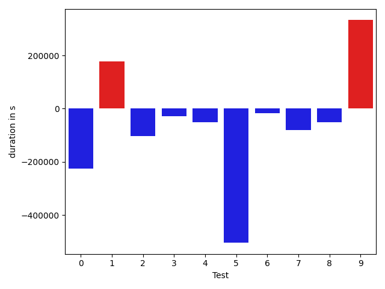

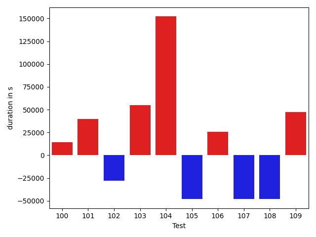

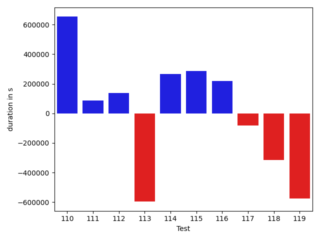

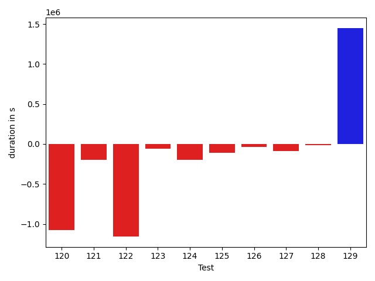

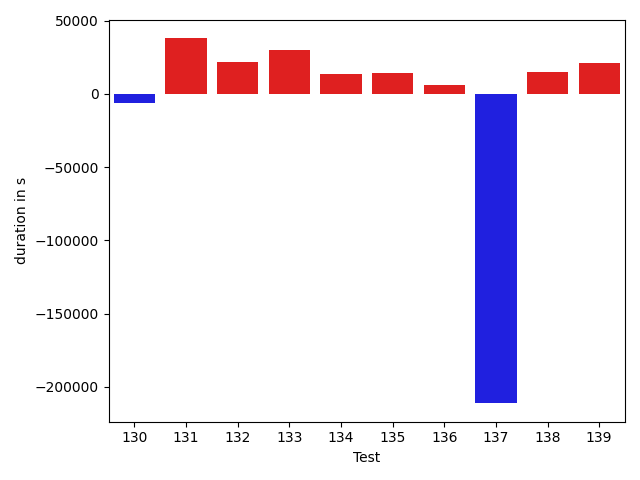

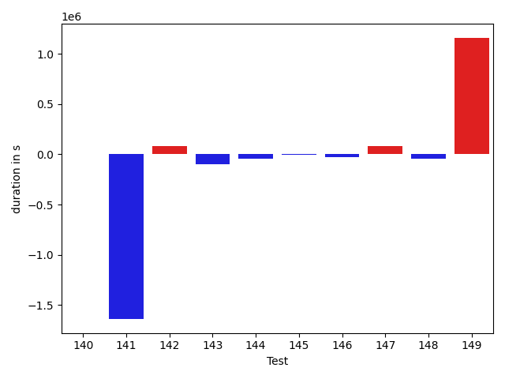

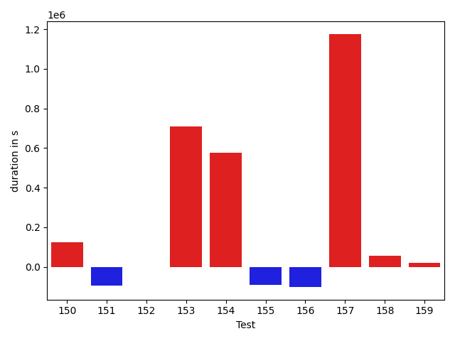

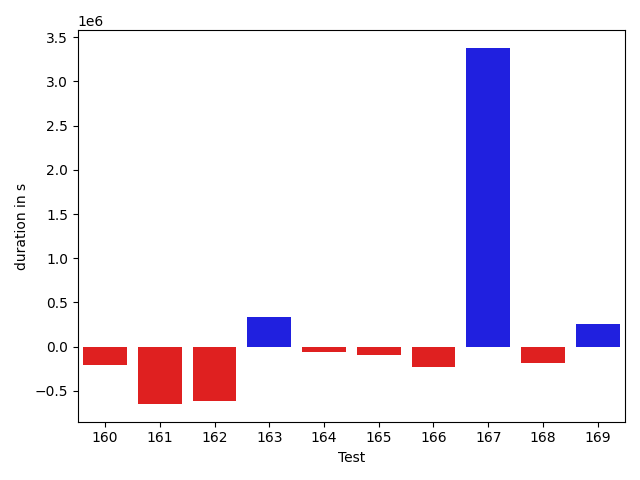

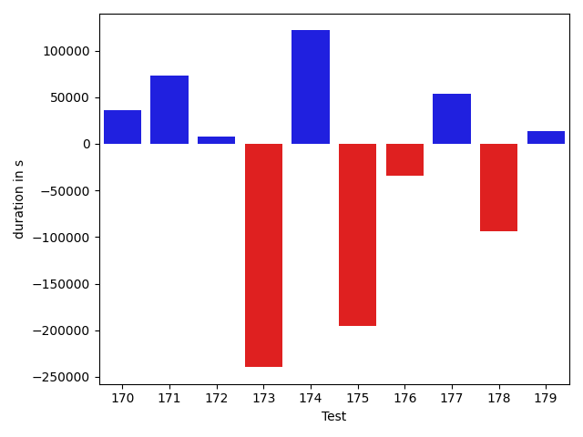

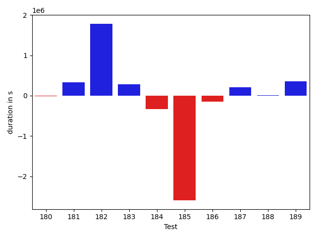

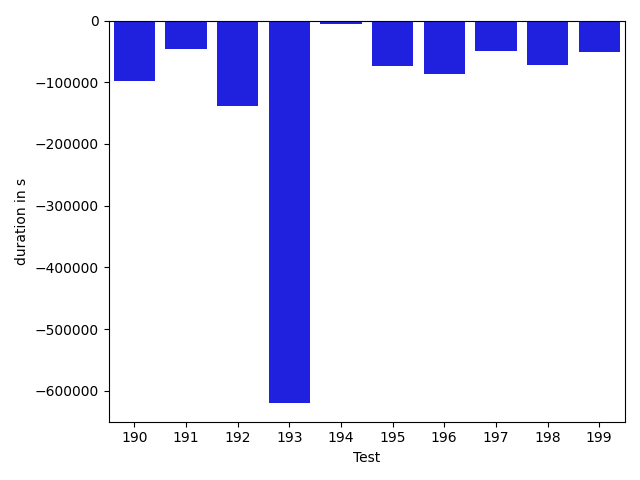

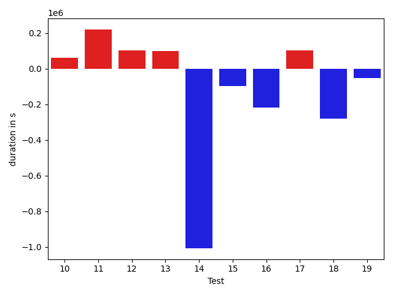

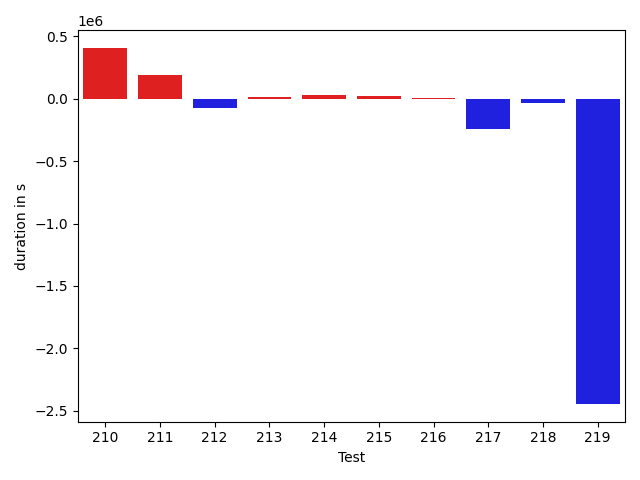

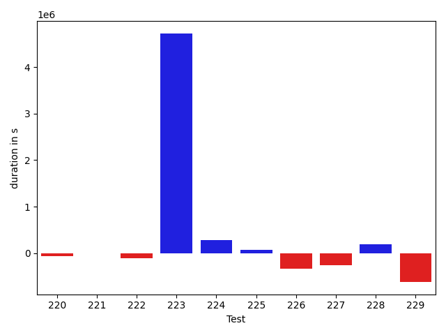

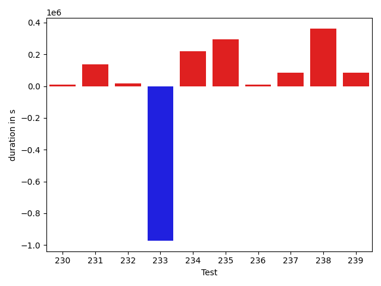

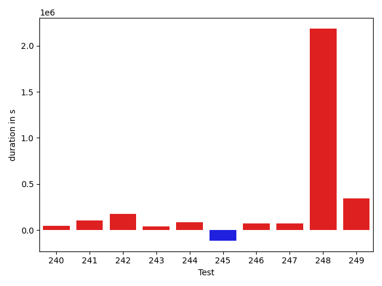

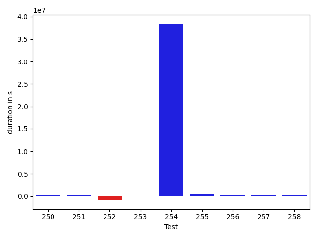

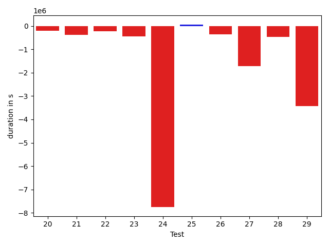

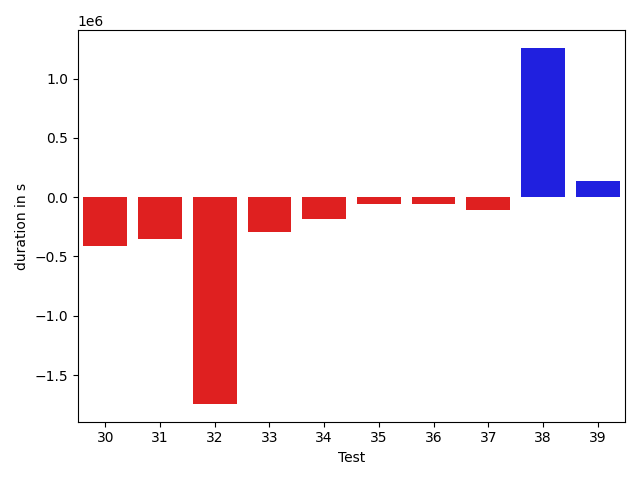

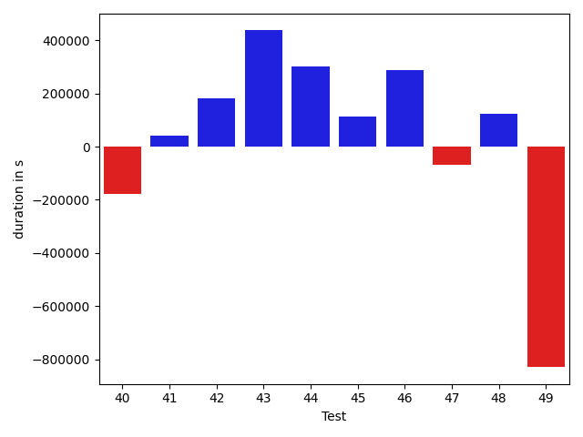

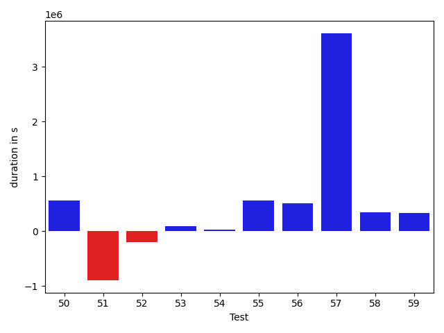

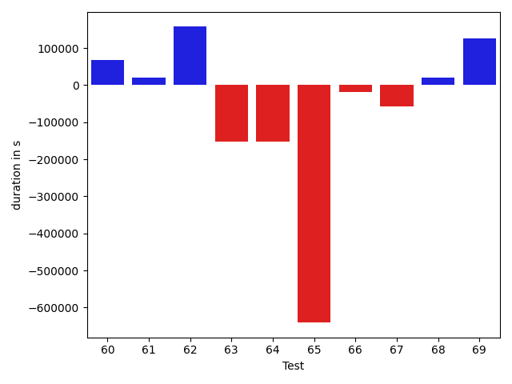

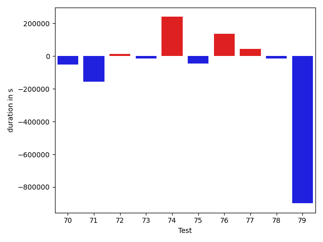

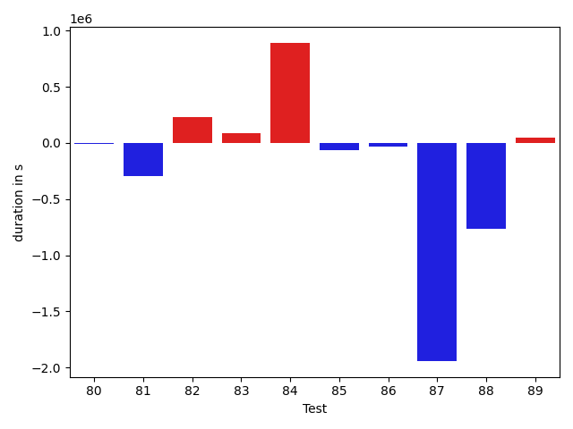

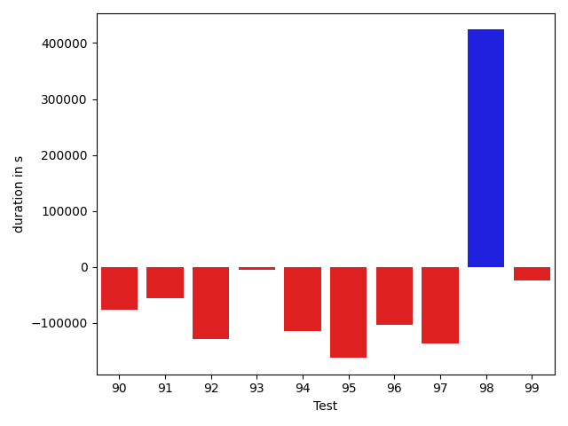

| ID | DurationV1 | DurationsV2 | DeltaDuration |
| --- | --- | --- | --- |
| 0 | 1274126.451454918 | 1082979.9251954523 | -191146.5262594656 |
| 1 | 835456.1967541497 | 755526.7076194391 | -79929.48913471063 |
| 2 | 515913.72707026126 | 508527.5985996481 | -7386.1284706131555 |
| 3 | 520432.92103173584 | 523426.27526675817 | 2993.354235022329 |
| 4 | 1465150.7830292613 | 1482759.1596141916 | 17608.376584930345 |
| 5 | 834864.3540303174 | 1019991.7699456387 | 185127.41591532133 |
| 6 | 1034044.7903306696 | 1173657.0176159223 | 139612.22728525265 |
| 7 | 610574.5627335082 | 809144.3594838693 | 198569.7967503611 |
| 8 | 857322.7532344558 | 835603.6850272438 | -21719.068207212025 |
| 9 | 675418.586665287 | 505230.80013832543 | -170187.7865269616 |
| 10 | 1195234.8894423211 | 802770.9789703111 | -392463.91047201003 |
| 11 | 1001344.7150790989 | 714838.3955880408 | -286506.3194910581 |
| 12 | 1388003.524064172 | 585109.4787121845 | -802894.0453519876 |
| 13 | 807230.6573816538 | 525118.2004006822 | -282112.4569809716 |
| 14 | 4543097.701978598 | 1067384.653334685 | -3475713.048643913 |
| 15 | 938100.7075014393 | 877227.4925344344 | -60873.21496700484 |
| 16 | 1999228.2090937812 | 1595094.9179722732 | -404133.291121508 |
| 17 | 968524.6799453085 | 770492.64539029 | -198032.03455501853 |
| 18 | 1472167.9381658258 | 877090.9270751353 | -595077.0110906905 |
| 19 | 7274053.9138871115 | 790031.5767466235 | -6484022.3371404875 |
| 20 | 792839.596640754 | 585434.5829736711 | -207405.01366708288 |
| 21 | 1327129.588192682 | 950729.4323101919 | -376400.1558824901 |
| 22 | 1014619.1770408064 | 782285.8066403958 | -232333.3704004106 |
| 23 | 1413884.0523508468 | 966283.2870589688 | -447600.765291878 |
| 24 | 9869075.968355296 | 2116812.460091807 | -7752263.508263489 |
| 25 | 569725.3379778974 | 631214.8937337799 | 61489.555755882524 |
| 26 | 1338840.03449318 | 989399.1453071982 | -349440.8891859818 |
| 27 | 3451778.5521028154 | 1744102.6918888502 | -1707675.8602139652 |
| 28 | 1413622.6970646502 | 951281.054863693 | -462341.6422009573 |
| 29 | 4700135.51439248 | 1278182.2367071733 | -3421953.277685307 |
| 30 | 1681224.9109812323 | 1272092.0193424055 | -409132.8916388268 |
| 31 | 1502611.2336927052 | 1151892.2463446592 | -350718.9873480459 |
| 32 | 3701353.9945438816 | 1957867.2716100388 | -1743486.7229338428 |
| 33 | 1337254.9990402258 | 1044076.4317181958 | -293178.56732202996 |
| 34 | 1157002.1926205794 | 971158.839774134 | -185843.3528464454 |
| 35 | 776964.9308128825 | 718532.9099569984 | -58432.02085588407 |
| 36 | 628624.7151347989 | 575030.1904907227 | -53594.52464407624 |
| 37 | 508715.87569510937 | 398247.48633277416 | -110468.3893623352 |
| 38 | 1714915.7444598614 | 2972834.306769182 | 1257918.5623093206 |
| 39 | 885393.397035718 | 1017830.3245377229 | 132436.9275020049 |
| 40 | 596255.2116627682 | 419897.7457149029 | -176357.46594786528 |
| 41 | 978954.4950804684 | 1020228.7941633775 | 41274.29908290913 |
| 42 | 334715.0334777832 | 516391.0553572178 | 181676.0218794346 |
| 43 | 840871.38068519 | 1277253.392451561 | 436382.0117663711 |
| 44 | 1293894.8766340776 | 1596284.2744330796 | 302389.397799002 |
| 45 | 756255.5902487417 | 868136.013888773 | 111880.42364003137 |
| 46 | 709938.152216668 | 997995.34484703 | 288057.192630362 |
| 47 | 941258.2990140992 | 872195.9467365266 | -69062.35227757262 |
| 48 | 361663.6342747165 | 484733.92388916016 | 123070.28961444367 |
| 49 | 5359889.17861547 | 4531063.40566857 | -828825.7729469007 |
| 50 | 3103658.931201836 | 3659852.2828018507 | 556193.3516000146 |
| 51 | 1433274.8036689758 | 539453.2705350027 | -893821.5331339731 |
| 52 | 773502.0070815086 | 576721.9484295861 | -196780.0586519225 |
| 53 | 538674.0750661492 | 632938.8438158482 | 94264.768749699 |
| 54 | 1108326.0512009067 | 1142979.3006537054 | 34653.24945279863 |
| 55 | 1542537.6227709379 | 2099329.0852672886 | 556791.4624963508 |
| 56 | 671339.9759727239 | 1179403.1780855218 | 508063.2021127979 |
| 57 | 1306175.9093175072 | 4913896.92363457 | 3607721.0143170627 |
| 58 | 725422.3387216752 | 1065845.1846326152 | 340422.84591093997 |
| 59 | 914820.1839294294 | 1252091.7302820885 | 337271.5463526591 |
| 60 | 465511.44014682993 | 534123.4829781242 | 68612.04283129424 |
| 61 | 953896.0266674224 | 974965.1105639348 | 21069.0838965124 |
| 62 | 3881740.5000043907 | 4039190.6062611844 | 157450.10625679372 |
| 63 | 843859.686726952 | 691559.2066307086 | -152300.48009624332 |
| 64 | 591053.5642778873 | 437944.67390857637 | -153108.89036931098 |
| 65 | 1194404.3689133185 | 553793.9705151971 | -640610.3983981214 |
| 66 | 1554297.1268370673 | 1535942.5186950415 | -18354.60814202577 |
| 67 | 562032.1351079941 | 503969.64780682325 | -58062.487301170826 |
| 68 | 610372.8072412536 | 630079.0735449791 | 19706.26630372554 |
| 69 | 555603.3515753802 | 682688.4854523239 | 127085.13387694373 |
| 70 | 541245.3763720989 | 437447.6558380127 | -103797.72053408623 |
| 71 | 950979.253887329 | 822795.6834989879 | -128183.57038834109 |
| 72 | 687678.5206501111 | 427386.82248955965 | -260291.6981605515 |
| 73 | 687300.5252805162 | 619813.1137646663 | -67487.41151584999 |
| 74 | 527357.2721138634 | 495258.88789847493 | -32098.384215388447 |
| 75 | 1127293.0331703334 | 624225.1591937593 | -503067.87397657405 |
| 76 | 463463.89455955103 | 380574.20381715894 | -82889.6907423921 |
| 77 | 448378.86988830566 | 382707.3238425255 | -65671.54604578018 |
| 78 | 524962.5823580027 | 449622.03883367777 | -75340.5435243249 |
| 79 | 603215.382925868 | 458726.66615795344 | -144488.7167679146 |
| 80 | 669020.8574924641 | 547143.237378622 | -121877.62011384207 |
| 81 | 786970.5115160008 | 1605343.5174119473 | 818373.0058959464 |
| 82 | 650597.6905050979 | 591827.2909490837 | -58770.399556014105 |
| 83 | 654580.4493242595 | 513233.47272552224 | -141346.9765987373 |
| 84 | 404589.72208976746 | 594145.9786488861 | 189556.25655911863 |
| 85 | 471207.79943823814 | 379487.6095763445 | -91720.18986189365 |
| 86 | 514102.37744140625 | 546245.8708483875 | 32143.49340698123 |
| 87 | 639354.0402263366 | 478047.0293604662 | -161307.0108658704 |
| 88 | 545335.3392632633 | 492843.43598938733 | -52491.90327387594 |
| 89 | 570627.4820544124 | 525948.2610049834 | -44679.22104942892 |
| 90 | 428264.9723258987 | 352261.6338005066 | -76003.33852539212 |
| 91 | 465828.85270500183 | 409402.3817977905 | -56426.470907211304 |
| 92 | 595540.9366916418 | 466650.4971112823 | -128890.4395803595 |
| 93 | 483184.1794971032 | 478777.473207891 | -4406.706289212219 |
| 94 | 515824.62249565125 | 401788.71286726 | -114035.90962839127 |
| 95 | 569006.7542972711 | 406701.6118917465 | -162305.14240552462 |
| 96 | 495134.1982727051 | 391440.7005214691 | -103693.49775123596 |
| 97 | 602059.8974174559 | 464955.45681741834 | -137104.44060003757 |
| 98 | 3174123.96210197 | 3597900.621691365 | 423776.6595893949 |
| 99 | 686553.371558167 | 663236.4735460458 | -23316.898012121208 |
| 100 | 638260.7380106996 | 501926.90639328584 | -136333.8316174138 |
| 101 | 364730.8944745064 | 370363.8922906369 | 5632.997816130519 |
| 102 | 653263.6142830291 | 618825.1485080714 | -34438.46577495767 |
| 103 | 662792.3136918023 | 637042.1936642937 | -25750.120027508587 |
| 104 | 669296.9734012737 | 1188996.8967124855 | 519699.92331121175 |
| 105 | 613829.6894614697 | 454200.180865027 | -159629.50859644264 |
| 106 | 454775.5224794231 | 678969.7768865079 | 224194.25440708478 |
| 107 | 5876486.156460641 | 944502.2057559614 | -4931983.95070468 |
| 108 | 958345.0622936066 | 1192998.2580401127 | 234653.1957465061 |
| 109 | 589719.5574269295 | 543680.8750562668 | -46038.68237066269 |
| 110 | 4626844.288483026 | 5279816.313486147 | 652972.0250031203 |
| 111 | 1405973.5964905317 | 1491560.773155266 | 85587.17666473426 |
| 112 | 1120614.5334858191 | 1256754.8394374864 | 136140.30595166725 |
| 113 | 1598624.8184828614 | 1001904.594426893 | -596720.2240559683 |
| 114 | 619104.9722419282 | 886268.399981966 | 267163.4277400378 |
| 115 | 708067.6779811268 | 995818.2853301747 | 287750.6073490479 |
| 116 | 669314.4573483195 | 888084.2186746357 | 218769.76132631628 |
| 117 | 875581.9622762959 | 793748.8547229385 | -81833.10755335737 |
| 118 | 1418085.5432151626 | 1102903.6307404707 | -315181.91247469187 |
| 119 | 1521822.4644723549 | 946277.3718749546 | -575545.0925974003 |
| 120 | 2033249.2721261499 | 953729.0782363059 | -1079520.193889844 |
| 121 | 608029.6656990051 | 408837.37906837463 | -199192.2866306305 |
| 122 | 3099377.4374824744 | 1943469.0170175924 | -1155908.420464882 |
| 123 | 736441.1519736614 | 675636.2675336214 | -60804.88444003998 |
| 124 | 955317.9182030865 | 756227.9895052961 | -199089.92869779037 |
| 125 | 800405.670549725 | 688617.8657359389 | -111787.80481378606 |
| 126 | 431726.95206451416 | 394484.92794799805 | -37242.02411651611 |
| 127 | 1437846.1064443667 | 1348783.1736584704 | -89062.93278589635 |
| 128 | 643095.5715888548 | 625595.6670126289 | -17499.904576225905 |
| 129 | 3809973.8488957323 | 5259333.424847334 | 1449359.5759516014 |
| 130 | 563014.5115439468 | 604759.1301857164 | 41744.61864176963 |
| 131 | 535735.3077535774 | 547555.3015766144 | 11819.993823037017 |
| 132 | 593844.4653888794 | 625632.5137103631 | 31788.048321483657 |
| 133 | 849100.4302370795 | 786870.6315949848 | -62229.79864209471 |
| 134 | 470875.6826659441 | 1147305.3769196102 | 676429.6942536661 |
| 135 | 574895.6545686722 | 442623.87662518024 | -132271.77794349194 |
| 136 | 1407376.9510921137 | 660155.7646544243 | -747221.1864376895 |
| 137 | 674722.3111817111 | 653408.9526992253 | -21313.35848248587 |
| 138 | 2220952.634593338 | 2927268.210162112 | 706315.5755687742 |
| 139 | 1716699.8377180607 | 541999.4678006378 | -1174700.369917423 |
| 140 | 848491.8946544208 | 505143.9696870893 | -343347.92496733146 |
| 141 | 1885296.5934992398 | 1526132.3568215861 | -359164.2366776536 |
| 142 | 2364291.9292493323 | 3125846.1779393014 | 761554.2486899691 |
| 143 | 748127.7845970371 | 746372.5148834727 | -1755.2697135644266 |
| 144 | 883595.4643831928 | 875692.8247342766 | -7902.6396489162 |
| 145 | 1286646.2254080763 | 1142107.896467809 | -144538.3289402672 |
| 146 | 769505.3415095478 | 651952.7585959645 | -117552.58291358326 |
| 147 | 753255.1632857639 | 1117911.3665730404 | 364656.20328727644 |
| 148 | 2082350.251551007 | 1648315.9983875386 | -434034.2531634683 |
| 149 | 1167605.4008367844 | 998129.7942710654 | -169475.606565719 |
| 150 | 906342.1482399204 | 1125576.9603421828 | 219234.8121022624 |
| 151 | 938659.0251485767 | 1145457.5126092366 | 206798.48746065993 |
| 152 | 4237749.9384643445 | 14925709.404503144 | 10687959.4660388 |
| 153 | 968008.5116374136 | 1353678.1121728364 | 385669.6005354228 |
| 154 | 664811.2568605056 | 923804.463240098 | 258993.20637959242 |
| 155 | 1021457.403601065 | 1274891.7996932736 | 253434.39609220857 |
| 156 | 953454.8858293525 | 1094380.5112906576 | 140925.62546130503 |
| 157 | 524079.3233464285 | 2539014.43575305 | 2014935.1124066212 |
| 158 | 972321.5406849617 | 1318917.910110985 | 346596.3694260232 |
| 159 | 365674.7971309405 | 749261.5829750296 | 383586.7858440891 |
| 160 | 771369.041373223 | 560138.8739900042 | -211230.16738321877 |
| 161 | 3021914.5316162906 | 2372860.2753491057 | -649054.2562671849 |
| 162 | 1455968.2120502852 | 834704.9485164584 | -621263.2635338268 |
| 163 | 565141.4493269087 | 901000.4679155946 | 335859.0185886859 |
| 164 | 623974.104534626 | 567111.6382264793 | -56862.466308146715 |
| 165 | 963799.2890328481 | 871401.2066315451 | -92398.08240130299 |
| 166 | 816631.2434107512 | 590331.027940183 | -226300.21547056828 |
| 167 | 1068070.974563137 | 4447019.139018215 | 3378948.1644550785 |
| 168 | 878704.3341647043 | 693602.1483532225 | -185102.1858114818 |
| 169 | 361940.7221969068 | 619660.4297457635 | 257719.70754885674 |
| 170 | 666991.8067473173 | 703321.0950554013 | 36329.28830808401 |
| 171 | 703651.5489952601 | 777081.0707029277 | 73429.5217076675 |
| 172 | 567307.689376831 | 575154.2640838623 | 7846.57470703125 |
| 173 | 906506.1400294711 | 666938.207858385 | -239567.93217108608 |
| 174 | 696933.622691202 | 818514.2757443016 | 121580.65305309964 |
| 175 | 822084.138136374 | 626495.5818251001 | -195588.55631127383 |
| 176 | 519184.8352110088 | 484829.7431053743 | -34355.09210563451 |
| 177 | 507634.0770120621 | 561508.3254024982 | 53874.24839043617 |
| 178 | 585394.727661009 | 491979.255203709 | -93415.47245729994 |
| 179 | 424988.3608392775 | 438273.94352531433 | 13285.582686036825 |
| 180 | 487157.8494566381 | 469722.04437460005 | -17435.805082038045 |
| 181 | 699943.7422254274 | 1029354.4508808933 | 329410.70865546586 |
| 182 | 737721.7739006581 | 2521974.113644838 | 1784252.3397441797 |
| 183 | 618585.2506240103 | 901495.626938737 | 282910.37631472666 |
| 184 | 770349.4149398804 | 440962.1553393414 | -329387.259600539 |
| 185 | 3457550.731542372 | 862287.5437350273 | -2595263.187807345 |
| 186 | 909556.4470506368 | 759182.638150261 | -150373.80890037573 |
| 187 | 619272.7760848359 | 830437.2749805064 | 211164.49889567052 |
| 188 | 721785.3973401637 | 732493.0761255296 | 10707.67878536589 |
| 189 | 763872.2029404903 | 1117420.4525011557 | 353548.24956066534 |
| 190 | 1018365.2011827598 | 1048169.4671783114 | 29804.2659955516 |
| 191 | 1151128.2609257714 | 1376453.041826615 | 225324.78090084367 |
| 192 | 1161547.236317998 | 2424671.233757481 | 1263123.997439483 |
| 193 | 1117856.7975331945 | 1173311.6504512073 | 55454.852918012766 |
| 194 | 1143241.5871549672 | 1375532.1687433333 | 232290.58158836607 |
| 195 | 632472.4953356886 | 716490.9264771659 | 84018.43114147731 |
| 196 | 577979.7979468359 | 680993.3307203101 | 103013.53277347423 |
| 197 | 495372.83794021606 | 417251.76615047455 | -78121.07178974152 |
| 198 | 1375503.1200694104 | 1658065.7943164061 | 282562.6742469957 |
| 199 | 14544814.170646325 | 24164578.190182615 | 9619764.01953629 |
| 200 | 1582795.8671766664 | 1708629.9378395025 | 125834.07066283608 |
| 201 | 491925.7999600768 | 511522.98586696736 | 19597.185906890547 |
| 202 | 511376.5877787322 | 684257.8879866467 | 172881.30020791455 |
| 203 | 669489.9258598015 | 571348.2659441463 | -98141.65991565515 |
| 204 | 967340.6696230327 | 1110335.4787740242 | 142994.8091509915 |
| 205 | 680559.3243141384 | 1068998.9880365469 | 388439.66372240847 |
| 206 | 593968.295232699 | 404584.9119949341 | -189383.38323776494 |
| 207 | 573872.8593100607 | 981483.4224009514 | 407610.56309089065 |
| 208 | 822913.3995762169 | 606727.1412916183 | -216186.2582845986 |
| 209 | 8294498.318587936 | 8485776.634140644 | 191278.31555270776 |
| 210 | 8484802.5005434 | 7628844.258688383 | -855958.2418550178 |
| 211 | 901900.5572599443 | 821332.6382770508 | -80567.91898289346 |
| 212 | 849842.0926773512 | 1231778.2991510227 | 381936.2064736715 |
| 213 | 1010303.4557762897 | 859781.1386991756 | -150522.31707711413 |
| 214 | 492712.3074873334 | 683194.55441186 | 190482.24692452652 |
| 215 | 1070441.2393105759 | 956046.0159659592 | -114395.22334461671 |
| 216 | 1295108.5689584704 | 732382.2821840169 | -562726.2867744535 |
| 217 | 861197.4926558111 | 693431.5355288275 | -167765.95712698367 |
| 218 | 782912.1577185125 | 509608.5932672343 | -273303.5644512782 |
| 219 | 608906.6239605566 | 646023.5369488283 | 37116.91298827168 |
| 220 | 465764.9358346462 | 394463.4111267943 | -71301.52470785193 |
| 221 | 416346.9105318021 | 417643.86806572974 | 1296.9575339276344 |
| 222 | 619205.3216876984 | 512031.10389356315 | -107174.21779413521 |
| 223 | 596827.3996381946 | 5322080.346823163 | 4725252.947184969 |
| 224 | 560246.9157028887 | 837074.1706562787 | 276827.25495339 |
| 225 | 396302.9167480469 | 459964.4331817627 | 63661.51643371582 |
| 226 | 3438073.52243099 | 3102040.994509347 | -336032.5279216431 |
| 227 | 614066.2286195755 | 349312.9884853363 | -264753.2401342392 |
| 228 | 619317.935530439 | 815755.4190782905 | 196437.48354785144 |
| 229 | 1524382.8445855917 | 904918.6615848229 | -619464.1830007688 |
| 230 | 1403389.2470536237 | 1400860.6149109947 | -2528.6321426290087 |
| 231 | 2151264.123591087 | 984140.1808297336 | -1167123.9427613532 |
| 232 | 1361859.896732282 | 1262670.8661436026 | -99189.03058867925 |
| 233 | 833425.8107482746 | 758625.3762986708 | -74800.43444960378 |
| 234 | 486874.654340744 | 495175.0124601992 | 8300.358119455166 |
| 235 | 579503.0993602276 | 508980.19406546524 | -70522.90529476234 |
| 236 | 539791.2421264648 | 412133.83837890625 | -127657.4037475586 |
| 237 | 494032.4549079705 | 383200.89818127453 | -110831.55672669597 |
| 238 | 617301.3092054363 | 532561.9240321139 | -84739.3851733224 |
| 239 | 667502.1954447213 | 599870.197219481 | -67631.99822524027 |
| 240 | 679741.2164956098 | 501635.749685809 | -178105.46680980083 |
| 241 | 499238.2452869015 | 462724.41820593306 | -36513.82708096842 |
| 242 | 1583146.8208631244 | 2767433.4160694224 | 1184286.595206298 |
| 243 | 1144582.817684722 | 1272259.148996203 | 127676.33131148107 |
| 244 | 5267283.898964047 | 1693885.5845289938 | -3573398.3144350536 |
| 245 | 938576.8025738123 | 959741.8701214525 | 21165.06754764018 |
| 246 | 1488068.078930062 | 822688.3689379692 | -665379.7099920928 |
| 247 | 1101911.7115347704 | 937796.3270271376 | -164115.3845076328 |
| 248 | 1038408.230700387 | 824019.0139971086 | -214389.21670327848 |
| 249 | 797429.7586499882 | 980795.326280014 | 183365.5676300258 |
| 250 | 596204.1945025395 | 893209.4179849959 | 297005.2234824564 |
| 251 | 1138856.1397090934 | 1491113.5650991916 | 352257.42539009824 |
| 252 | 1728203.6533967257 | 823839.6877477169 | -904363.9656490088 |
| 253 | 830903.0477045202 | 965844.339537242 | 134941.2918327218 |
| 254 | 1340446.6750980266 | 39756653.893139146 | 38416207.21804112 |
| 255 | 625110.9023666605 | 1112322.676205852 | 487211.77383919153 |
| 256 | 543139.6459515542 | 758280.1923471065 | 215140.54639555234 |
| 257 | 773103.6372290783 | 1061172.979661418 | 288069.34243233956 |
| 258 | 534482.0087831828 | 686179.8855841901 | 151697.8768010073 |

## Misc.

| ID | Test Class | Test Method |
| --- | --- | --- |
| 0 | com.google.gson.functional.StreamingTypeAdaptersTest | testNullSafe |
| 1 | com.google.gson.functional.StreamingTypeAdaptersTest | testSerializeWithCustomTypeAdapter |
| 2 | com.google.gson.functional.StreamingTypeAdaptersTest | testSerializeRecursive |
| 3 | com.google.gson.functional.StreamingTypeAdaptersTest | testDeserializeWithCustomTypeAdapter |
| 4 | com.google.gson.functional.CustomDeserializerTest | testDefaultConstructorNotCalledOnObject |
| 5 | com.google.gson.functional.CustomDeserializerTest | testCustomDeserializerReturnsNullForArrayElementsForArrayField |
| 6 | com.google.gson.functional.CustomDeserializerTest | testJsonTypeFieldBasedDeserialization |
| 7 | com.google.gson.functional.CustomDeserializerTest | testDefaultConstructorNotCalledOnField |
| 8 | com.google.gson.functional.CustomDeserializerTest | testCustomDeserializerReturnsNull |
| 9 | com.google.gson.functional.JsonParserTest | testBadTypeForDeserializingCustomTree |
| 10 | com.google.gson.functional.JsonParserTest | testChangingCustomTreeAndDeserializing |
| 11 | com.google.gson.functional.JsonParserTest | testBadFieldTypeForDeserializingCustomTree |
| 12 | com.google.gson.functional.JsonParserTest | testDeserializingCustomTree |
| 13 | com.google.gson.functional.JsonParserTest | testBadFieldTypeForCustomDeserializerCustomTree |
| 14 | com.google.gson.functional.ThrowableFunctionalTest | testExceptionWithoutCause |
| 15 | com.google.gson.functional.ThrowableFunctionalTest | testErrornWithCause |
| 16 | com.google.gson.functional.ThrowableFunctionalTest | testSerializedNameOnExceptionFields |
| 17 | com.google.gson.functional.ThrowableFunctionalTest | testErrorWithoutCause |
| 18 | com.google.gson.functional.ThrowableFunctionalTest | testExceptionWithCause |
| 19 | com.google.gson.functional.InterfaceTest | testSerializingObjectImplementingInterface |
| 20 | com.google.gson.functional.InterfaceTest | testSerializingInterfaceObjectField |
| 21 | com.google.gson.functional.ParameterizedTypesTest | testParameterizedTypeGenericArraysSerialization |
| 22 | com.google.gson.functional.ParameterizedTypesTest | testParameterizedTypesWithWriterSerialization |
| 23 | com.google.gson.functional.ParameterizedTypesTest | testVariableTypeArrayDeserialization |
| 24 | com.google.gson.functional.ParameterizedTypesTest | testParameterizedTypesSerialization |
| 25 | com.google.gson.functional.ParameterizedTypesTest | testDeepParameterizedTypeSerialization |
| 26 | com.google.gson.functional.ParameterizedTypesTest | testVariableTypeDeserialization |
| 27 | com.google.gson.functional.ParameterizedTypesTest | testVariableTypeFieldsAndGenericArraysSerialization |
| 28 | com.google.gson.functional.ParameterizedTypesTest | testParameterizedTypeGenericArraysDeserialization |
| 29 | com.google.gson.functional.ParameterizedTypesTest | testParameterizedTypeDeserialization |
| 30 | com.google.gson.functional.ParameterizedTypesTest | testVariableTypeFieldsAndGenericArraysDeserialization |
| 31 | com.google.gson.functional.ParameterizedTypesTest | testTypesWithMultipleParametersDeserialization |
| 32 | com.google.gson.functional.ParameterizedTypesTest | testTypesWithMultipleParametersSerialization |
| 33 | com.google.gson.functional.ParameterizedTypesTest | testParameterizedTypeWithVariableTypeDeserialization |
| 34 | com.google.gson.functional.ParameterizedTypesTest | testParameterizedTypeWithReaderDeserialization |
| 35 | com.google.gson.functional.ParameterizedTypesTest | testDeepParameterizedTypeDeserialization |
| 36 | com.google.gson.functional.InheritanceTest | testBaseSerializedAsBaseWhenSpecifiedWithExplicitType |
| 37 | com.google.gson.functional.InheritanceTest | testBaseSerializedAsSubWhenSpecifiedWithExplicitType |
| 38 | com.google.gson.functional.InheritanceTest | testSubInterfacesOfCollectionSerialization |
| 39 | com.google.gson.functional.InheritanceTest | testBaseSerializedAsBaseWhenSpecifiedWithExplicitTypeForToJsonMethod |
| 40 | com.google.gson.functional.InheritanceTest | testBaseSerializedAsSubForToJsonMethod |
| 41 | com.google.gson.functional.InheritanceTest | testClassWithBaseArrayFieldSerialization |
| 42 | com.google.gson.functional.InheritanceTest | testBaseSerializedAsSub |
| 43 | com.google.gson.functional.InheritanceTest | testSubInterfacesOfCollectionDeserialization |
| 44 | com.google.gson.functional.InheritanceTest | testSubClassSerialization |
| 45 | com.google.gson.functional.InheritanceTest | testSubClassDeserialization |
| 46 | com.google.gson.functional.InheritanceTest | testClassWithBaseFieldSerialization |
| 47 | com.google.gson.functional.InheritanceTest | testClassWithBaseCollectionFieldSerialization |
| 48 | com.google.gson.functional.InheritanceTest | testBaseSerializedAsSubWhenSpecifiedWithExplicitTypeForToJsonMethod |
| 49 | com.google.gson.functional.CircularReferenceTest | testCircularSerialization |
| 50 | com.google.gson.functional.CircularReferenceTest | testSelfReferenceArrayFieldSerialization |
| 51 | com.google.gson.functional.CircularReferenceTest | testDirectedAcyclicGraphDeserialization |
| 52 | com.google.gson.functional.CircularReferenceTest | testDirectedAcyclicGraphSerialization |
| 53 | com.google.gson.functional.CircularReferenceTest | testSelfReferenceIgnoredInSerialization |
| 54 | com.google.gson.functional.MapTest | testMapSerializationWithNullValues |
| 55 | com.google.gson.functional.MapTest | testInterfaceTypeMapWithSerializer |
| 56 | com.google.gson.functional.MapTest | testGeneralMapField |
| 57 | com.google.gson.functional.MapTest | testInterfaceTypeMap |
| 58 | com.google.gson.functional.MapTest | testComplexKeysDeserialization |
| 59 | com.google.gson.functional.MapTest | testComplexKeysSerialization |
| 60 | com.google.gson.functional.MapTest | testMapSerializationWithNullValuesSerialized |
| 61 | com.google.gson.functional.ObjectTest | testEmptyCollectionInAnObjectDeserialization |
| 62 | com.google.gson.functional.ObjectTest | testDateAsMapObjectField |
| 63 | com.google.gson.functional.ObjectTest | testInnerClassSerialization |
| 64 | com.google.gson.functional.ObjectTest | testClassWithObjectFieldSerialization |
| 65 | com.google.gson.functional.ObjectTest | testBagOfPrimitiveWrappersSerialization |
| 66 | com.google.gson.functional.ObjectTest | testArrayOfArraysSerialization |
| 67 | com.google.gson.functional.ObjectTest | testBagOfPrimitivesSerialization |
| 68 | com.google.gson.functional.ObjectTest | testBagOfPrimitiveWrappersDeserialization |
| 69 | com.google.gson.functional.ObjectTest | testClassWithTransientFieldsSerialization |
| 70 | com.google.gson.functional.ObjectTest | testBagOfPrimitivesDeserialization |
| 71 | com.google.gson.functional.ObjectTest | testSingletonLists |
| 72 | com.google.gson.functional.ObjectTest | testStringFieldWithNumberValueDeserialization |
| 73 | com.google.gson.functional.ObjectTest | testArrayOfObjectsAsFields |
| 74 | com.google.gson.functional.ObjectTest | testPrimitiveArrayInAnObjectDeserialization |
| 75 | com.google.gson.functional.ObjectTest | testInnerClassDeserialization |
| 76 | com.google.gson.functional.ObjectTest | testNullObjectFieldsDeserialization |
| 77 | com.google.gson.functional.ObjectTest | testNullArraysDeserialization |
| 78 | com.google.gson.functional.ObjectTest | testObjectFieldNamesWithoutQuotesDeserialization |
| 79 | com.google.gson.functional.ObjectTest | testNullFieldsDeserialization |
| 80 | com.google.gson.functional.ObjectTest | testArrayOfObjectsSerialization |
| 81 | com.google.gson.functional.ObjectTest | testNestedSerialization |
| 82 | com.google.gson.functional.ObjectTest | testArrayOfArraysDeserialization |
| 83 | com.google.gson.functional.ObjectTest | testNullFieldsSerialization |
| 84 | com.google.gson.functional.ObjectTest | testClassWithTransientFieldsDeserialization |
| 85 | com.google.gson.functional.ObjectTest | testPrimitiveArrayFieldSerialization |
| 86 | com.google.gson.functional.ObjectTest | testClassWithNoFieldsSerialization |
| 87 | com.google.gson.functional.ObjectTest | testArrayOfObjectsDeserialization |
| 88 | com.google.gson.functional.ObjectTest | testJsonInSingleQuotesDeserialization |
| 89 | com.google.gson.functional.ObjectTest | testNestedDeserialization |
| 90 | com.google.gson.functional.ObjectTest | testNullPrimitiveFieldsDeserialization |
| 91 | com.google.gson.functional.ObjectTest | testClassWithNoFieldsDeserialization |
| 92 | com.google.gson.functional.ObjectTest | testJsonInMixedQuotesDeserialization |
| 93 | com.google.gson.functional.ObjectTest | testPrivateNoArgConstructorDeserialization |
| 94 | com.google.gson.functional.ObjectTest | testClassWithTransientFieldsDeserializationTransientFieldsPassedInJsonAreIgnored |
| 95 | com.google.gson.functional.ObjectTest | testEmptyCollectionInAnObjectSerialization |
| 96 | com.google.gson.functional.ObjectTest | testStringFieldWithEmptyValueDeserialization |
| 97 | com.google.gson.functional.ObjectTest | testStringFieldWithEmptyValueSerialization |
| 98 | com.google.gson.functional.ExposeFieldsTest | testNullExposeFieldSerialization |
| 99 | com.google.gson.functional.ExposeFieldsTest | testArrayWithOneNullExposeFieldObjectSerialization |
| 100 | com.google.gson.functional.ExposeFieldsTest | testExposeAnnotationDeserialization |
| 101 | com.google.gson.functional.ExposeFieldsTest | testNoExposedFieldDeserialization |
| 102 | com.google.gson.functional.ExposeFieldsTest | testNoExposedFieldSerialization |
| 103 | com.google.gson.functional.ExposeFieldsTest | testExposeAnnotationSerialization |
| 104 | com.google.gson.functional.ExposeFieldsTest | testExposedInterfaceFieldSerialization |
| 105 | com.google.gson.functional.ExposeFieldsTest | testExposedInterfaceFieldDeserialization |
| 106 | com.google.gson.functional.FieldExclusionTest | testDefaultNestedStaticClassIncluded |
| 107 | com.google.gson.functional.FieldExclusionTest | testDefaultInnerClassExclusion |
| 108 | com.google.gson.GsonBuilderTest | testExcludeFieldsWithModifiers |
| 109 | com.google.gson.GsonBuilderTest | testTransientFieldExclusion |
| 110 | com.google.gson.functional.RuntimeTypeAdapterFactoryFunctionalTest | testSubclassesAutomaticallySerialzed |
| 111 | com.google.gson.functional.MoreSpecificTypeSerializationTest | testSubclassFields |
| 112 | com.google.gson.functional.MoreSpecificTypeSerializationTest | testListOfSubclassFields |
| 113 | com.google.gson.functional.MoreSpecificTypeSerializationTest | testMapOfSubclassFields |
| 114 | com.google.gson.functional.MoreSpecificTypeSerializationTest | testMapOfParameterizedSubclassFields |
| 115 | com.google.gson.functional.MoreSpecificTypeSerializationTest | testListOfParameterizedSubclassFields |
| 116 | com.google.gson.functional.MoreSpecificTypeSerializationTest | testParameterizedSubclassFields |
| 117 | com.google.gson.functional.EnumTest | testEnumSubclassAsParameterizedType |
| 118 | com.google.gson.functional.EnumTest | testEnumCaseMapping |
| 119 | com.google.gson.functional.EnumTest | testEnumSubclass |
| 120 | com.google.gson.functional.EnumTest | testClassWithEnumFieldSerialization |
| 121 | com.google.gson.functional.EnumTest | testClassWithEnumFieldDeserialization |
| 122 | com.google.gson.functional.EnumTest | testEnumSet |
| 123 | com.google.gson.functional.EnumTest | testCollectionOfEnumsSerialization |
| 124 | com.google.gson.functional.EnumTest | testCollectionOfEnumsDeserialization |
| 125 | com.google.gson.functional.EnumTest | testTopLevelEnumSerialization |
| 126 | com.google.gson.functional.EnumTest | testTopLevelEnumDeserialization |
| 127 | com.google.gson.JsonParserTest | testReadWriteTwoObjects |
| 128 | com.google.gson.functional.VersioningTest | testVersionedGsonMixingSinceAndUntilDeserialization |
| 129 | com.google.gson.functional.VersioningTest | testVersionedUntilSerialization |
| 130 | com.google.gson.functional.VersioningTest | testVersionedClassesDeserialization |
| 131 | com.google.gson.functional.VersioningTest | testVersionedGsonWithUnversionedClassesDeserialization |
| 132 | com.google.gson.functional.VersioningTest | testVersionedClassesSerialization |
| 133 | com.google.gson.functional.VersioningTest | testVersionedGsonMixingSinceAndUntilSerialization |
| 134 | com.google.gson.functional.VersioningTest | testVersionedGsonWithUnversionedClassesSerialization |
| 135 | com.google.gson.functional.VersioningTest | testVersionedUntilDeserialization |
| 136 | com.google.gson.functional.CustomTypeAdaptersTest | testCustomNestedSerializers |
| 137 | com.google.gson.functional.CustomTypeAdaptersTest | testCustomNestedDeserializers |
| 138 | com.google.gson.functional.CustomTypeAdaptersTest | testCustomTypeAdapterDoesNotAppliesToSubClasses |
| 139 | com.google.gson.functional.CustomTypeAdaptersTest | testEnsureCustomSerializerNotInvokedForNullValues |
| 140 | com.google.gson.functional.CustomTypeAdaptersTest | testEnsureCustomDeserializerNotInvokedForNullValues |
| 141 | com.google.gson.functional.JsonAdapterAnnotationOnFieldsTest | testClassAnnotationAdapterFactoryTakesPrecedenceOverDefault |
| 142 | com.google.gson.functional.JsonAdapterAnnotationOnFieldsTest | testClassAnnotationAdapterTakesPrecedenceOverDefault |
| 143 | com.google.gson.functional.JsonAdapterAnnotationOnFieldsTest | testFieldAnnotationTakesPrecedenceOverClassAnnotation |
| 144 | com.google.gson.functional.JsonAdapterAnnotationOnFieldsTest | testJsonAdapterInvokedOnlyForAnnotatedFields |
| 145 | com.google.gson.functional.JsonAdapterAnnotationOnFieldsTest | testFieldAnnotationTakesPrecedenceOverRegisteredTypeAdapter |
| 146 | com.google.gson.functional.JsonAdapterAnnotationOnFieldsTest | testRegisteredTypeAdapterTakesPrecedenceOverClassAnnotationAdapter |
| 147 | com.google.gson.functional.TypeVariableTest | testBasicTypeVariables |
| 148 | com.google.gson.functional.TypeVariableTest | testAdvancedTypeVariables |
| 149 | com.google.gson.functional.TypeVariableTest | testTypeVariablesViaTypeParameter |
| 150 | com.google.gson.functional.MapAsArrayTypeAdapterTest | testMultipleEnableComplexKeyRegistrationHasNoEffect |
| 151 | com.google.gson.functional.MapAsArrayTypeAdapterTest | testMapWithTypeVariableDeserialization |
| 152 | com.google.gson.functional.MapAsArrayTypeAdapterTest | testSerializeComplexMapWithTypeAdapter |
| 153 | com.google.gson.functional.MapAsArrayTypeAdapterTest | testMapWithTypeVariableSerialization |
| 154 | com.google.gson.functional.CollectionTest | testFieldIsArrayList |
| 155 | com.google.gson.functional.CollectionTest | testWildcardCollectionField |
| 156 | com.google.gson.functional.CollectionTest | testSetSerialization |
| 157 | com.google.gson.functional.CollectionTest | testCollectionOfBagOfPrimitivesSerialization |
| 158 | com.google.gson.functional.CollectionTest | testSetDeserialization |
| 159 | com.google.gson.functional.CollectionTest | testRawCollectionSerialization |
| 160 | com.google.gson.functional.ExclusionStrategyFunctionalTest | testExclusionStrategyWithMode |
| 161 | com.google.gson.functional.ExclusionStrategyFunctionalTest | testExclusionStrategySerialization |
| 162 | com.google.gson.functional.ExclusionStrategyFunctionalTest | testExclusionStrategyDeserialization |
| 163 | com.google.gson.functional.ExclusionStrategyFunctionalTest | testExclusionStrategySerializationDoesNotImpactSerialization |
| 164 | com.google.gson.functional.ExclusionStrategyFunctionalTest | testExcludeTopLevelClassDeserializationDoesNotImpactSerialization |
| 165 | com.google.gson.functional.ExclusionStrategyFunctionalTest | testExclusionStrategySerializationDoesNotImpactDeserialization |
| 166 | com.google.gson.functional.ExclusionStrategyFunctionalTest | testExcludeTopLevelClassSerializationDoesNotImpactDeserialization |
| 167 | com.google.gson.functional.NamingPolicyTest | testGsonDuplicateNameUsingSerializedNameFieldNamingPolicySerialization |
| 168 | com.google.gson.functional.NamingPolicyTest | testGsonWithSerializedNameFieldNamingPolicySerialization |
| 169 | com.google.gson.functional.NamingPolicyTest | testGsonWithLowerCaseUnderscorePolicySerialization |
| 170 | com.google.gson.functional.NamingPolicyTest | testGsonWithLowerCaseUnderscorePolicyDeserialiation |
| 171 | com.google.gson.functional.NamingPolicyTest | testGsonWithNonDefaultFieldNamingPolicySerialization |
| 172 | com.google.gson.functional.NamingPolicyTest | testGsonWithUpperCamelCaseSpacesPolicyDeserialiation |
| 173 | com.google.gson.functional.NamingPolicyTest | testComplexFieldNameStrategy |
| 174 | com.google.gson.functional.NamingPolicyTest | testDeprecatedNamingStrategy |
| 175 | com.google.gson.functional.NamingPolicyTest | testAtSignInSerializedName |
| 176 | com.google.gson.functional.NamingPolicyTest | testGsonWithLowerCaseDashPolicySerialization |
| 177 | com.google.gson.functional.NamingPolicyTest | testGsonWithUpperCamelCaseSpacesPolicySerialiation |
| 178 | com.google.gson.functional.NamingPolicyTest | testGsonWithNonDefaultFieldNamingPolicyDeserialiation |
| 179 | com.google.gson.functional.NamingPolicyTest | testGsonWithSerializedNameFieldNamingPolicyDeserialization |
| 180 | com.google.gson.functional.NamingPolicyTest | testGsonWithLowerCaseDashPolicyDeserialiation |
| 181 | com.google.gson.functional.UncategorizedTest | testGsonInstanceReusableForSerializationAndDeserialization |
| 182 | com.google.gson.functional.UncategorizedTest | testInvalidJsonDeserializationFails |
| 183 | com.google.gson.functional.UncategorizedTest | testStaticFieldsAreNotSerialized |
| 184 | com.google.gson.functional.UncategorizedTest | testObjectEqualButNotSameSerialization |
| 185 | com.google.gson.functional.FieldNamingTest | testIdentity |
| 186 | com.google.gson.functional.FieldNamingTest | testLowerCaseWithDashes |
| 187 | com.google.gson.functional.FieldNamingTest | testLowerCaseWithUnderscores |
| 188 | com.google.gson.functional.FieldNamingTest | testUpperCamelCaseWithSpaces |
| 189 | com.google.gson.functional.FieldNamingTest | testUpperCamelCase |
| 190 | com.google.gson.functional.RawSerializationTest | testThreeLevelParameterizedObject |
| 191 | com.google.gson.functional.RawSerializationTest | testParameterizedObject |
| 192 | com.google.gson.functional.RawSerializationTest | testCollectionOfObjects |
| 193 | com.google.gson.functional.RawSerializationTest | testTwoLevelParameterizedObject |
| 194 | com.google.gson.functional.InstanceCreatorTest | testInstanceCreatorReturnsBaseType |
| 195 | com.google.gson.functional.InstanceCreatorTest | testInstanceCreatorReturnsSubTypeForField |
| 196 | com.google.gson.functional.InstanceCreatorTest | testInstanceCreatorReturnsSubTypeForTopLevelObject |
| 197 | com.google.gson.functional.DefaultTypeAdaptersTest | testUrlNullDeserialization |
| 198 | com.google.gson.functional.DefaultTypeAdaptersTest | testUrlNullSerialization |
| 199 | com.google.gson.functional.DefaultTypeAdaptersTest | testNullSerialization |
| 200 | com.google.gson.functional.DefaultTypeAdaptersTest | testBigDecimalFieldSerialization |
| 201 | com.google.gson.functional.DefaultTypeAdaptersTest | testBadValueForBigDecimalDeserialization |
| 202 | com.google.gson.functional.DefaultTypeAdaptersTest | testBigDecimalFieldDeserialization |
| 203 | com.google.gson.functional.DefaultTypeAdaptersTest | testBigIntegerFieldDeserialization |
| 204 | com.google.gson.functional.DefaultTypeAdaptersTest | testBigIntegerFieldSerialization |
| 205 | com.google.gson.functional.SecurityTest | testNonExecutableJsonSerialization |
| 206 | com.google.gson.functional.SecurityTest | testNonExecutableJsonDeserialization |
| 207 | com.google.gson.functional.SecurityTest | testJsonWithNonExectuableTokenWithConfiguredGsonDeserialization |
| 208 | com.google.gson.functional.SecurityTest | testJsonWithNonExectuableTokenWithRegularGsonDeserialization |
| 209 | com.google.gson.functional.ConcurrencyTest | testMultiThreadSerialization |
| 210 | com.google.gson.functional.ConcurrencyTest | testMultiThreadDeserialization |
| 211 | com.google.gson.functional.ConcurrencyTest | testSingleThreadDeserialization |
| 212 | com.google.gson.functional.ConcurrencyTest | testSingleThreadSerialization |
| 213 | com.google.gson.functional.EscapingTest | testGsonAcceptsEscapedAndNonEscapedJsonDeserialization |
| 214 | com.google.gson.functional.EscapingTest | testGsonDoubleDeserialization |
| 215 | com.google.gson.functional.EscapingTest | testEscapingObjectFields |
| 216 | com.google.gson.functional.JsonTreeTest | testJsonTreeToString |
| 217 | com.google.gson.functional.JsonTreeTest | testToJsonTreeObjectType |
| 218 | com.google.gson.functional.JsonTreeTest | testJsonTreeNull |
| 219 | com.google.gson.functional.JsonTreeTest | testToJsonTree |
| 220 | com.google.gson.MixedStreamTest | testWriteInvalidState |
| 221 | com.google.gson.MixedStreamTest | testReaderDoesNotMutateState |
| 222 | com.google.gson.MixedStreamTest | testWriteDoesNotMutateState |
| 223 | com.google.gson.MixedStreamTest | testWriteMixedStreamed |
| 224 | com.google.gson.MixedStreamTest | testReadMixedStreamed |
| 225 | com.google.gson.MixedStreamTest | testWriteClosed |
| 226 | com.google.gson.functional.TypeHierarchyAdapterTest | testTypeHierarchy |
| 227 | com.google.gson.functional.ArrayTest | testSingleNullInArrayDeserialization |
| 228 | com.google.gson.functional.ArrayTest | testSingleNullInArraySerialization |
| 229 | com.google.gson.functional.ArrayTest | testObjectArrayWithNonPrimitivesSerialization |
| 230 | com.google.gson.GsonTypeAdapterTest | testDeserializerForAbstractClass |
| 231 | com.google.gson.functional.PrintFormattingTest | testCompactFormattingLeavesNoWhiteSpace |
| 232 | com.google.gson.functional.NullObjectAndFieldTest | testExplicitSerializationOfNullArrayMembers |
| 233 | com.google.gson.functional.NullObjectAndFieldTest | testAbsentJsonElementsAreSetToNull |
| 234 | com.google.gson.functional.NullObjectAndFieldTest | testExplicitNullSetsFieldToNullDuringDeserialization |
| 235 | com.google.gson.functional.NullObjectAndFieldTest | testExplicitSerializationOfNulls |
| 236 | com.google.gson.functional.NullObjectAndFieldTest | testNullWrappedPrimitiveMemberDeserialization |
| 237 | com.google.gson.functional.NullObjectAndFieldTest | testExplicitSerializationOfNullStringMembers |
| 238 | com.google.gson.functional.NullObjectAndFieldTest | testPrintPrintingObjectWithNulls |
| 239 | com.google.gson.functional.NullObjectAndFieldTest | testNullWrappedPrimitiveMemberSerialization |
| 240 | com.google.gson.functional.NullObjectAndFieldTest | testExplicitSerializationOfNullCollectionMembers |
| 241 | com.google.gson.functional.NullObjectAndFieldTest | testExplicitDeserializationOfNulls |
| 242 | com.google.gson.functional.DelegateTypeAdapterTest | testDelegateInvoked |
| 243 | com.google.gson.ObjectTypeAdapterTest | testSerialize |
| 244 | com.google.gson.functional.ReadersWritersTest | testWriterForSerialization |
| 245 | com.google.gson.functional.ReadersWritersTest | testReadWriteTwoObjects |
| 246 | com.google.gson.functional.ReadersWritersTest | testReaderForDeserialization |
| 247 | com.google.gson.functional.TreeTypeAdaptersTest | testSerializeId |
| 248 | com.google.gson.functional.TreeTypeAdaptersTest | testDeserializeId |
| 249 | com.google.gson.functional.PrettyPrintingTest | testEmptyMapField |
| 250 | com.google.gson.functional.PrettyPrintingTest | testPrettyPrintArrayOfObjects |
| 251 | com.google.gson.functional.PrettyPrintingTest | testPrettyPrintList |
| 252 | com.google.gson.functional.PrimitiveTest | testMoreSpecificSerialization |
| 253 | com.google.gson.functional.PrimitiveTest | testDeserializePrimitiveWrapperAsObjectField |
| 254 | com.google.gson.functional.CustomSerializerTest | testSubClassSerializerInvokedForBaseClassFieldsHoldingSubClassInstances |
| 255 | com.google.gson.functional.CustomSerializerTest | testBaseClassSerializerInvokedForBaseClassFieldsHoldingSubClassInstances |
| 256 | com.google.gson.functional.CustomSerializerTest | testBaseClassSerializerInvokedForBaseClassFields |
| 257 | com.google.gson.functional.CustomSerializerTest | testSubClassSerializerInvokedForBaseClassFieldsHoldingArrayOfSubClassInstances |
| 258 | com.google.gson.functional.JsonAdapterAnnotationOnClassesTest | testSuperclassTypeAdapterNotInvoked |

| Test | IterationV1 | IterationV2 | DeltaIteration |
| --- | --- | --- | --- |
| 0 | 96 | 91 | -5 |
| 1 | 66 | 72 | 6 |
| 2 | 34 | 30 | -4 |
| 3 | 37 | 33 | -4 |
| 4 | 99 | 97 | -2 |
| 5 | 49 | 62 | 13 |
| 6 | 76 | 81 | 5 |
| 7 | 38 | 41 | 3 |
| 8 | 60 | 48 | -12 |
| 9 | 36 | 31 | -5 |
| 10 | 49 | 49 | 0 |
| 11 | 41 | 46 | 5 |
| 12 | 38 | 43 | 5 |
| 13 | 25 | 30 | 5 |
| 14 | 72 | 79 | 7 |
| 15 | 65 | 71 | 6 |
| 16 | 93 | 96 | 3 |
| 17 | 60 | 60 | 0 |
| 18 | 72 | 73 | 1 |
| 19 | 57 | 64 | 7 |
| 20 | 37 | 37 | 0 |
| 21 | 81 | 79 | -2 |
| 22 | 63 | 44 | -19 |
| 23 | 75 | 80 | 5 |
| 24 | 99 | 99 | 0 |
| 25 | 30 | 31 | 1 |
| 26 | 75 | 76 | 1 |
| 27 | 99 | 99 | 0 |
| 28 | 73 | 83 | 10 |
| 29 | 78 | 77 | -1 |
| 30 | 92 | 87 | -5 |
| 31 | 76 | 73 | -3 |
| 32 | 99 | 99 | 0 |
| 33 | 79 | 67 | -12 |
| 34 | 71 | 65 | -6 |
| 35 | 47 | 46 | -1 |
| 36 | 35 | 18 | -17 |
| 37 | 23 | 25 | 2 |
| 38 | 98 | 99 | 1 |
| 39 | 23 | 40 | 17 |
| 40 | 45 | 23 | -22 |
| 41 | 53 | 40 | -13 |
| 42 | 18 | 23 | 5 |
| 43 | 72 | 70 | -2 |
| 44 | 70 | 86 | 16 |
| 45 | 43 | 41 | -2 |
| 46 | 37 | 41 | 4 |
| 47 | 52 | 52 | 0 |
| 48 | 31 | 18 | -13 |
| 49 | 99 | 99 | 0 |
| 50 | 99 | 99 | 0 |
| 51 | 24 | 32 | 8 |
| 52 | 23 | 35 | 12 |
| 53 | 26 | 28 | 2 |
| 54 | 67 | 57 | -10 |
| 55 | 94 | 93 | -1 |
| 56 | 56 | 63 | 7 |
| 57 | 90 | 86 | -4 |
| 58 | 55 | 64 | 9 |
| 59 | 69 | 73 | 4 |
| 60 | 32 | 29 | -3 |
| 61 | 82 | 74 | -8 |
| 62 | 86 | 89 | 3 |
| 63 | 43 | 60 | 17 |
| 64 | 22 | 28 | 6 |
| 65 | 37 | 36 | -1 |
| 66 | 99 | 99 | 0 |
| 67 | 21 | 27 | 6 |
| 68 | 29 | 22 | -7 |
| 69 | 29 | 41 | 12 |
| 70 | 23 | 19 | -4 |
| 71 | 71 | 74 | 3 |
| 72 | 28 | 25 | -3 |
| 73 | 47 | 59 | 12 |
| 74 | 29 | 26 | -3 |
| 75 | 53 | 47 | -6 |
| 76 | 29 | 27 | -2 |
| 77 | 17 | 23 | 6 |
| 78 | 25 | 28 | 3 |
| 79 | 24 | 29 | 5 |
| 80 | 41 | 37 | -4 |
| 81 | 35 | 28 | -7 |
| 82 | 50 | 54 | 4 |
| 83 | 30 | 32 | 2 |
| 84 | 23 | 27 | 4 |
| 85 | 23 | 26 | 3 |
| 86 | 18 | 27 | 9 |
| 87 | 30 | 42 | 12 |
| 88 | 37 | 32 | -5 |
| 89 | 25 | 35 | 10 |
| 90 | 28 | 18 | -10 |
| 91 | 20 | 20 | 0 |
| 92 | 24 | 31 | 7 |
| 93 | 32 | 26 | -6 |
| 94 | 21 | 27 | 6 |
| 95 | 33 | 21 | -12 |
| 96 | 17 | 20 | 3 |
| 97 | 26 | 28 | 2 |
| 98 | 99 | 99 | 0 |
| 99 | 42 | 44 | 2 |
| 100 | 37 | 40 | 3 |
| 101 | 23 | 27 | 4 |
| 102 | 47 | 47 | 0 |
| 103 | 28 | 33 | 5 |
| 104 | 49 | 48 | -1 |
| 105 | 23 | 28 | 5 |
| 106 | 32 | 30 | -2 |
| 107 | 76 | 72 | -4 |
| 108 | 63 | 56 | -7 |
| 109 | 21 | 24 | 3 |
| 110 | 99 | 99 | 0 |
| 111 | 93 | 95 | 2 |
| 112 | 58 | 65 | 7 |
| 113 | 63 | 55 | -8 |
| 114 | 57 | 49 | -8 |
| 115 | 60 | 59 | -1 |
| 116 | 50 | 45 | -5 |
| 117 | 54 | 53 | -1 |
| 118 | 61 | 52 | -9 |
| 119 | 85 | 85 | 0 |
| 120 | 88 | 84 | -4 |
| 121 | 19 | 21 | 2 |
| 122 | 80 | 77 | -3 |
| 123 | 53 | 52 | -1 |
| 124 | 54 | 56 | 2 |
| 125 | 44 | 46 | 2 |
| 126 | 18 | 15 | -3 |
| 127 | 67 | 71 | 4 |
| 128 | 32 | 49 | 17 |
| 129 | 99 | 99 | 0 |
| 130 | 33 | 37 | 4 |
| 131 | 32 | 25 | -7 |
| 132 | 45 | 44 | -1 |
| 133 | 54 | 67 | 13 |
| 134 | 30 | 33 | 3 |
| 135 | 21 | 27 | 6 |
| 136 | 59 | 64 | 5 |
| 137 | 55 | 45 | -10 |
| 138 | 99 | 99 | 0 |
| 139 | 45 | 43 | -2 |
| 140 | 33 | 27 | -6 |
| 141 | 95 | 94 | -1 |
| 142 | 94 | 92 | -2 |
| 143 | 48 | 52 | 4 |
| 144 | 52 | 53 | 1 |
| 145 | 85 | 92 | 7 |
| 146 | 48 | 49 | 1 |
| 147 | 58 | 45 | -13 |
| 148 | 99 | 99 | 0 |
| 149 | 79 | 77 | -2 |
| 150 | 63 | 71 | 8 |
| 151 | 65 | 64 | -1 |
| 152 | 99 | 99 | 0 |
| 153 | 82 | 71 | -11 |
| 154 | 48 | 57 | 9 |
| 155 | 77 | 82 | 5 |
| 156 | 72 | 68 | -4 |
| 157 | 36 | 44 | 8 |
| 158 | 60 | 64 | 4 |
| 159 | 33 | 36 | 3 |
| 160 | 46 | 37 | -9 |
| 161 | 99 | 99 | 0 |
| 162 | 48 | 39 | -9 |
| 163 | 32 | 26 | -6 |
| 164 | 27 | 27 | 0 |
| 165 | 43 | 35 | -8 |
| 166 | 29 | 31 | 2 |
| 167 | 69 | 67 | -2 |
| 168 | 54 | 47 | -7 |
| 169 | 26 | 27 | 1 |
| 170 | 27 | 25 | -2 |
| 171 | 33 | 37 | 4 |
| 172 | 24 | 23 | -1 |
| 173 | 42 | 47 | 5 |
| 174 | 47 | 59 | 12 |
| 175 | 40 | 46 | 6 |
| 176 | 26 | 29 | 3 |
| 177 | 22 | 23 | 1 |
| 178 | 31 | 27 | -4 |
| 179 | 26 | 21 | -5 |
| 180 | 28 | 30 | 2 |
| 181 | 36 | 39 | 3 |
| 182 | 35 | 46 | 11 |
| 183 | 30 | 33 | 3 |
| 184 | 18 | 33 | 15 |
| 185 | 89 | 23 | -66 |
| 186 | 41 | 36 | -5 |
| 187 | 43 | 36 | -7 |
| 188 | 50 | 39 | -11 |
| 189 | 41 | 85 | 44 |
| 190 | 78 | 81 | 3 |
| 191 | 76 | 81 | 5 |
| 192 | 76 | 75 | -1 |
| 193 | 71 | 75 | 4 |
| 194 | 55 | 56 | 1 |
| 195 | 58 | 55 | -3 |
| 196 | 46 | 45 | -1 |
| 197 | 19 | 21 | 2 |
| 198 | 89 | 93 | 4 |
| 199 | 99 | 99 | 0 |
| 200 | 55 | 62 | 7 |
| 201 | 26 | 36 | 10 |
| 202 | 28 | 36 | 8 |
| 203 | 28 | 39 | 11 |
| 204 | 55 | 66 | 11 |
| 205 | 35 | 31 | -4 |
| 206 | 34 | 18 | -16 |
| 207 | 26 | 26 | 0 |
| 208 | 26 | 21 | -5 |
| 209 | 99 | 99 | 0 |
| 210 | 99 | 99 | 0 |
| 211 | 41 | 39 | -2 |
| 212 | 54 | 62 | 8 |
| 213 | 42 | 53 | 11 |
| 214 | 37 | 34 | -3 |
| 215 | 45 | 39 | -6 |
| 216 | 68 | 69 | 1 |
| 217 | 57 | 58 | 1 |
| 218 | 39 | 37 | -2 |
| 219 | 41 | 40 | -1 |
| 220 | 24 | 30 | 6 |
| 221 | 31 | 28 | -3 |
| 222 | 20 | 27 | 7 |
| 223 | 29 | 32 | 3 |
| 224 | 30 | 27 | -3 |
| 225 | 14 | 17 | 3 |
| 226 | 99 | 99 | 0 |
| 227 | 21 | 20 | -1 |
| 228 | 27 | 25 | -2 |
| 229 | 60 | 39 | -21 |
| 230 | 97 | 98 | 1 |
| 231 | 72 | 60 | -12 |
| 232 | 97 | 94 | -3 |
| 233 | 53 | 71 | 18 |
| 234 | 25 | 31 | 6 |
| 235 | 32 | 35 | 3 |
| 236 | 16 | 12 | -4 |
| 237 | 30 | 30 | 0 |
| 238 | 40 | 41 | 1 |
| 239 | 45 | 46 | 1 |
| 240 | 31 | 27 | -4 |
| 241 | 32 | 36 | 4 |
| 242 | 92 | 94 | 2 |
| 243 | 95 | 94 | -1 |
| 244 | 24 | 31 | 7 |
| 245 | 51 | 49 | -2 |
| 246 | 33 | 22 | -11 |
| 247 | 87 | 83 | -4 |
| 248 | 75 | 68 | -7 |
| 249 | 60 | 58 | -2 |
| 250 | 43 | 45 | 2 |
| 251 | 89 | 75 | -14 |
| 252 | 24 | 23 | -1 |
| 253 | 56 | 51 | -5 |
| 254 | 49 | 56 | 7 |
| 255 | 28 | 35 | 7 |
| 256 | 27 | 31 | 4 |
| 257 | 43 | 46 | 3 |
| 258 | 35 | 34 | -1 |

| Time Label | Time (s) |
| --- | --- |
| Selection | 28.71843981742859 |
| Injection | 17.71815299987793 |
| Total | 1152.1348876953125 |

