# gson 109915

https://github.com/google/gson/commit/109915

## Delta Energy per test method

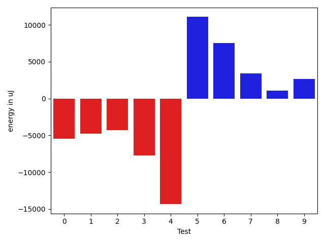

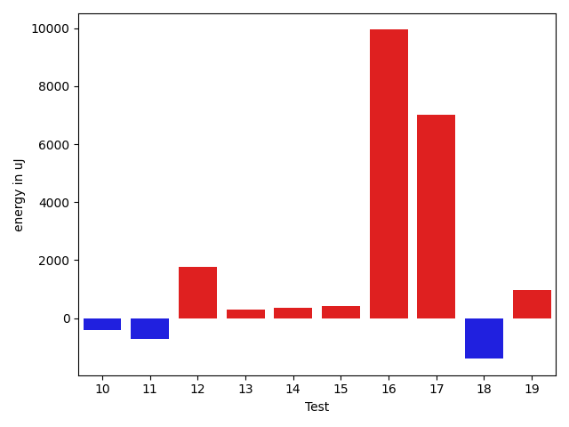

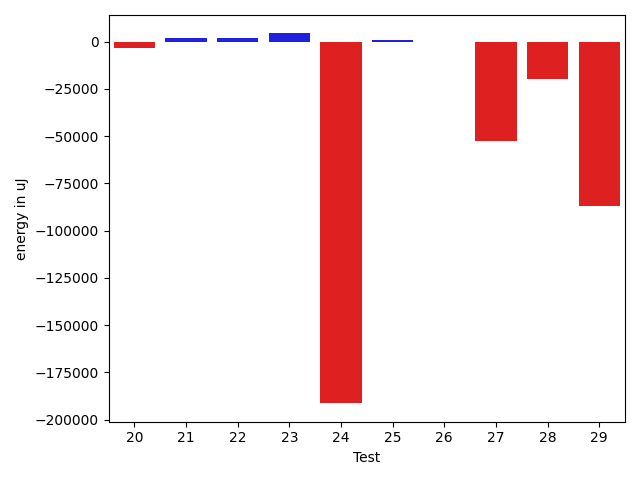

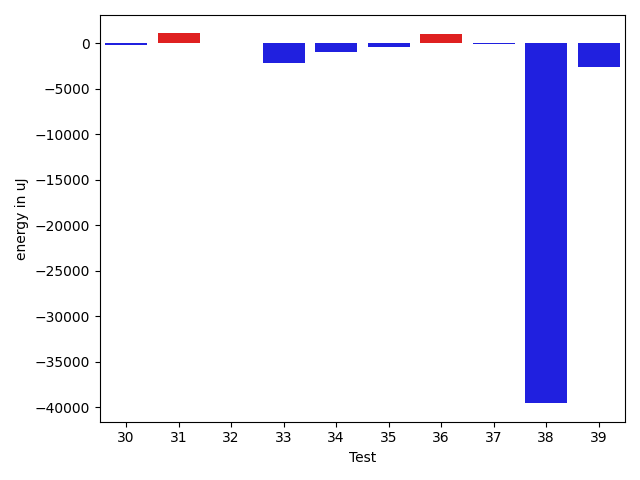

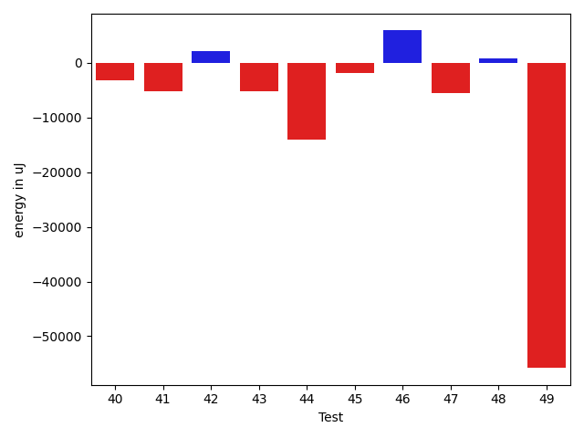

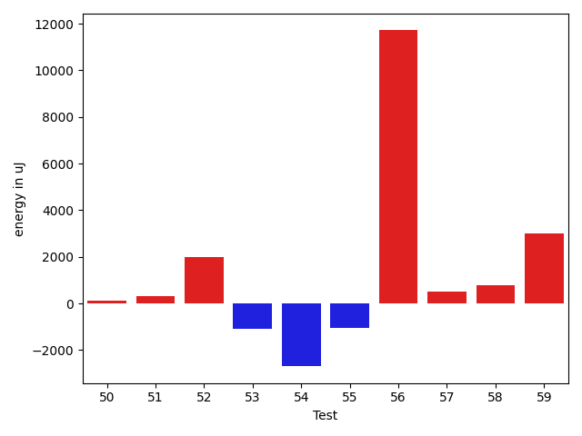

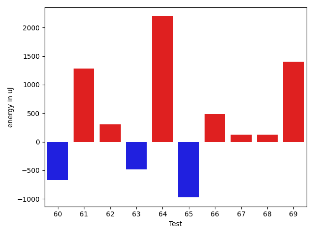

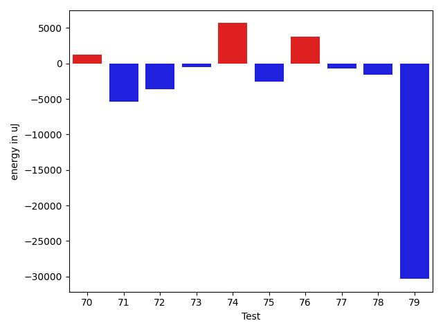

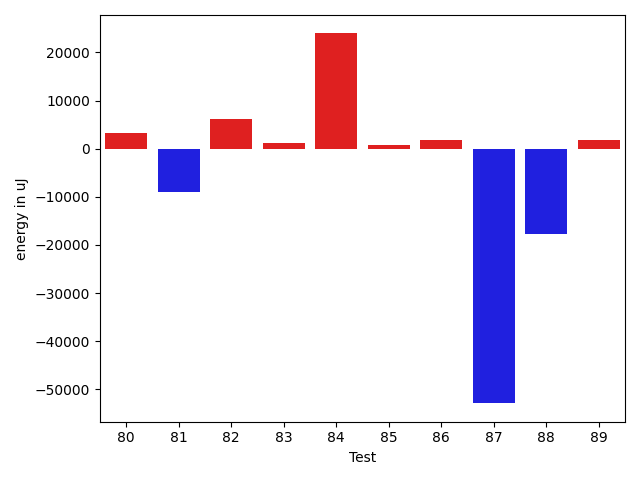

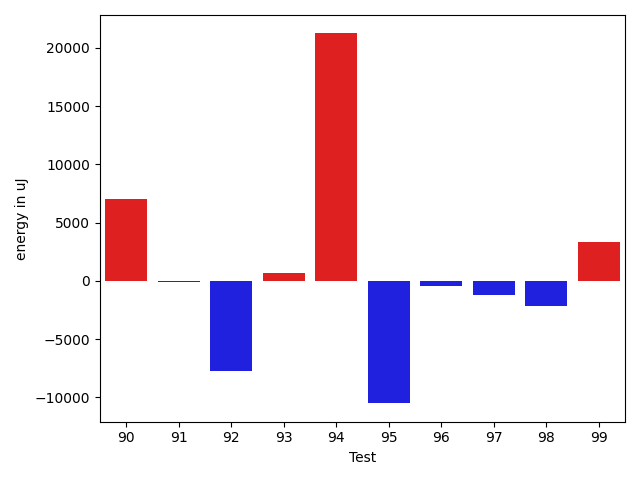

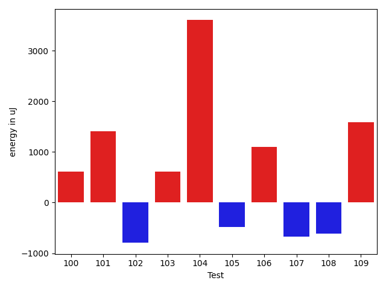

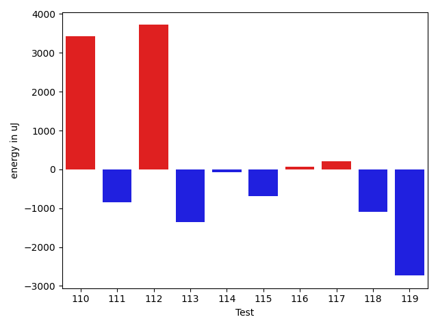

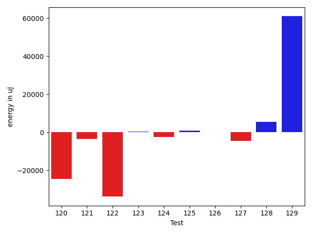

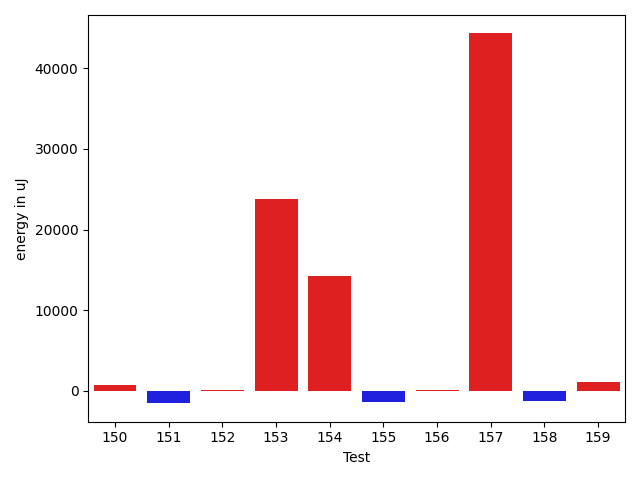

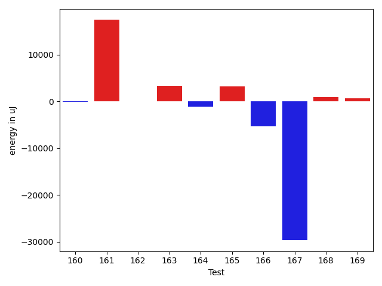

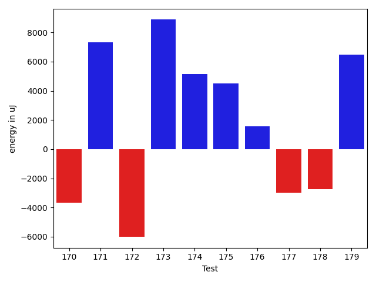

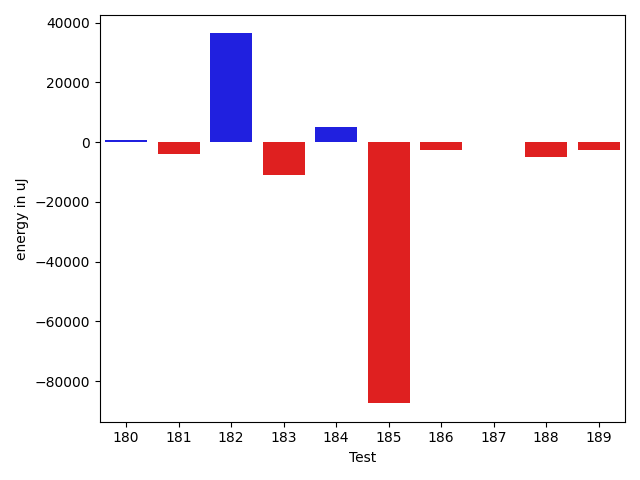

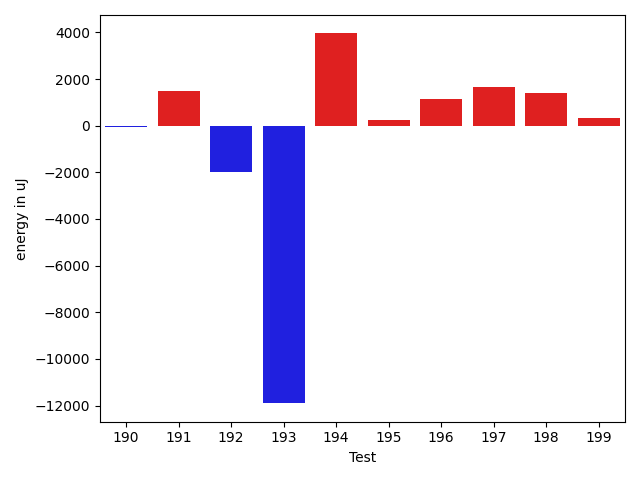

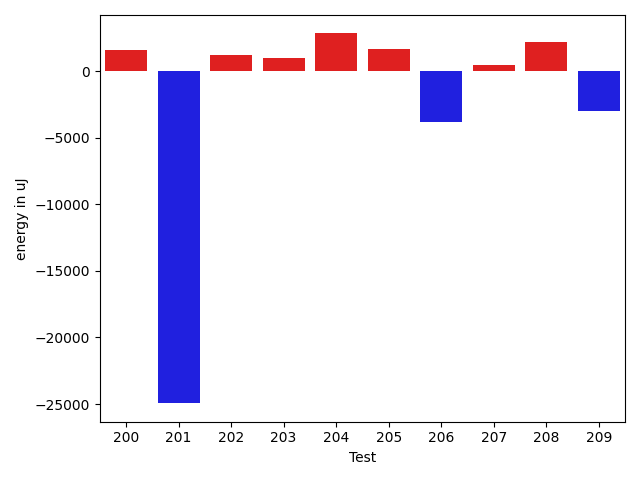

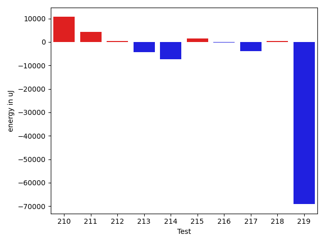

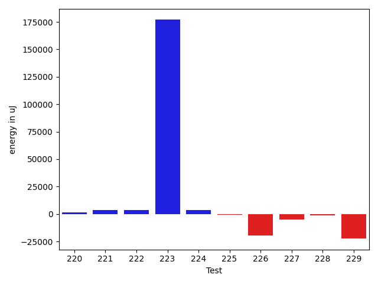

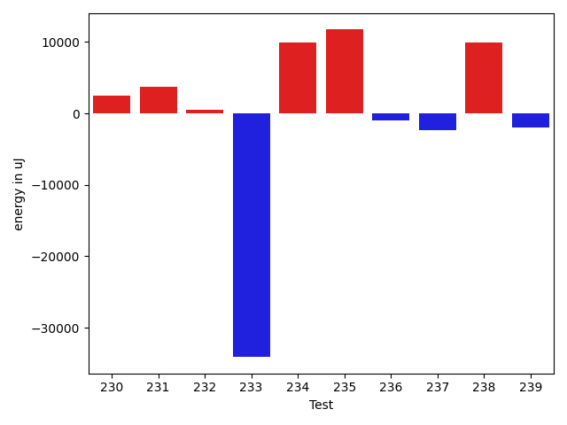

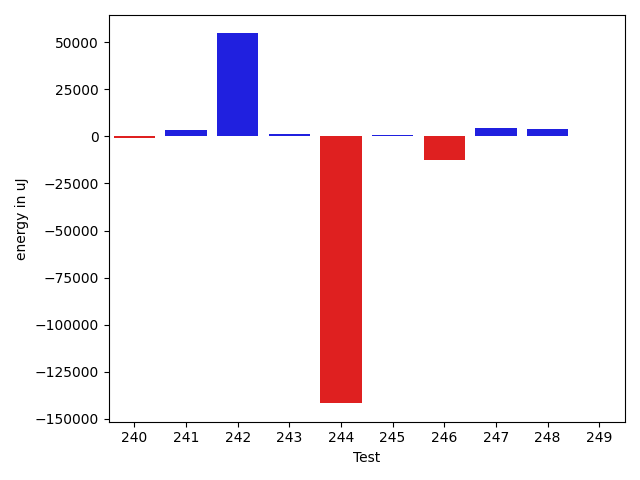

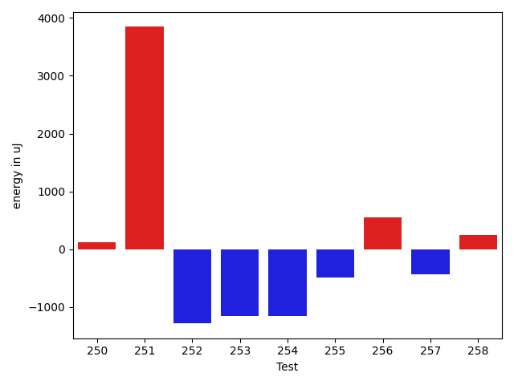

| ID | EnergyV1 | EnergyV2 | DeltaEnergy | σV1 | σV2 |
| --- | --- | --- | --- | --- | --- |
| 0 | 41260 | 39429 | -1831 | 14516.644915774343 | 10689.856946167492 |
| 1 | 40893 | 39612 | -1281 | 3652.6349018693963 | 7654.060167558858 |
| 2 | 39673 | 39550 | -123 | 4620.638369537431 | 4774.801908165638 |
| 3 | 39490 | 37048 | -2442 | 4236.379967797492 | 4519.070070807362 |
| 4 | 39611 | 38330 | -1281 | 4872.866067014741 | 5005.212363554934 |
| 5 | 43824 | 42114 | -1710 | 87816.84615645475 | 20488.296883735573 |
| 6 | 39917 | 38757 | -1160 | 4784.952275263719 | 4659.526030546929 |
| 7 | 38880 | 40649 | 1769 | 19526.056580077464 | 16170.389398030915 |
| 8 | 41015 | 40222 | -793 | 12196.450352413562 | 8954.268252462956 |
| 9 | 41015 | 42724 | 1709 | 66659.90755732213 | 113106.94872309057 |
| 10 | 39673 | 39246 | -427 | 5280.354139414622 | 6411.079491441841 |
| 11 | 42725 | 41992 | -733 | 41480.11431596901 | 49978.40102816013 |
| 12 | 39002 | 40771 | 1769 | 7158.507079381535 | 5310.591660278751 |
| 13 | 41016 | 41320 | 304 | 14343.758299595489 | 12909.063007298502 |
| 14 | 39856 | 40222 | 366 | 111355.46255443244 | 60027.10514867657 |
| 15 | 37475 | 37903 | 428 | 5036.520310403541 | 4198.674210553804 |
| 16 | 174010 | 183960 | 9950 | 113512.92401678374 | 81564.47835245107 |
| 17 | 111144 | 118164 | 7020 | 31464.641012886023 | 31095.374238765366 |
| 18 | 41626 | 40222 | -1404 | 20588.658559749118 | 3556.088592421235 |
| 19 | 40589 | 41565 | 976 | 3747.975368256654 | 3030.987974713384 |
| 20 | 37232 | 37903 | 671 | 10257.309380597328 | 10835.071581078357 |
| 21 | 39673 | 39794 | 121 | 5605.1239725362 | 7734.163472125172 |
| 22 | 39917 | 42175 | 2258 | 4686.61090074607 | 11104.213099317829 |
| 23 | 40894 | 42480 | 1586 | 40502.226902565635 | 66954.73168748368 |
| 24 | 40710 | 39306 | -1404 | 15551.08219927872 | 19749.585743044154 |
| 25 | 42541 | 40527 | -2014 | 21659.765965360155 | 20616.801172629686 |
| 26 | 39002 | 38940 | -62 | 15673.116382750366 | 12502.370755252092 |
| 27 | 38208 | 39245 | 1037 | 4506.864018066637 | 3506.765769778525 |
| 28 | 37780 | 39428 | 1648 | 4132.841374122737 | 27320.138360968893 |
| 29 | 42663 | 41686 | -977 | 45898.07419161385 | 48693.347128754715 |
| 30 | 38513 | 38330 | -183 | 5261.081147287799 | 3880.8153271279843 |
| 31 | 39856 | 40955 | 1099 | 14749.353862909316 | 20648.300743144508 |
| 32 | 40832 | 40832 | 0 | 31508.960280290168 | 11870.903871275952 |
| 33 | 41260 | 39062 | -2198 | 166578.92823221386 | 73874.98690567909 |
| 34 | 39185 | 38208 | -977 | 6975.741896422393 | 6436.420835514158 |
| 35 | 38696 | 38269 | -427 | 4870.299091373816 | 8558.530783302487 |
| 36 | 38452 | 39490 | 1038 | 4033.69517253076 | 3923.558716471566 |
| 37 | 37842 | 37781 | -61 | 4472.544337315512 | 4369.25240197224 |
| 38 | 440978 | 401428 | -39550 | 227172.09502558588 | 238077.56092603272 |
| 39 | 38757 | 36193 | -2564 | 4278.969611042306 | 3735.811345579875 |
| 40 | 39490 | 38147 | -1343 | 3913.023275854919 | 4800.888939995038 |
| 41 | 36927 | 37414 | 487 | 5487.6341618419565 | 3628.427753588351 |
| 42 | 39489 | 39306 | -183 | 18870.533232391692 | 17047.900480663626 |
| 43 | 44067 | 42297 | -1770 | 18592.469879704848 | 20695.29034753853 |
| 44 | 38758 | 37110 | -1648 | 5151.244651092609 | 4121.262135419558 |
| 45 | 37597 | 36193 | -1404 | 4483.2802521438225 | 4585.50663419071 |
| 46 | 36133 | 35827 | -306 | 4093.3652093650376 | 4648.087150121505 |
| 47 | 38635 | 36071 | -2564 | 4293.044472765292 | 6569.739627297599 |
| 48 | 38513 | 36194 | -2319 | 3945.9594373350997 | 5286.432430889937 |
| 49 | 37659 | 38635 | 976 | 3557.580045276102 | 4464.892449545828 |
| 50 | 35339 | 36926 | 1587 | 4480.85337479369 | 3711.9934868859445 |
| 51 | 37476 | 37781 | 305 | 4132.564507629883 | 4257.94496663382 |
| 52 | 35278 | 38697 | 3419 | 4201.261342423352 | 4534.269237956545 |
| 53 | 37964 | 35705 | -2259 | 4369.35286722958 | 7168.529117195635 |
| 54 | 38330 | 37903 | -427 | 23337.687162604612 | 7978.8471627787285 |
| 55 | 37293 | 36621 | -672 | 4276.878290944875 | 3755.4307559966987 |
| 56 | 38574 | 39245 | 671 | 4986.512364512563 | 59234.1602654807 |
| 57 | 36377 | 37658 | 1281 | 4676.366249618084 | 3667.6247009127806 |
| 58 | 36133 | 36071 | -62 | 5071.204650576103 | 4856.16301678 |
| 59 | 36865 | 38941 | 2076 | 4082.1364292079543 | 7175.147337248516 |
| 60 | 39245 | 38574 | -671 | 72078.63093064161 | 117631.67219092652 |
| 61 | 36438 | 37719 | 1281 | 4007.651556510371 | 4117.901690156762 |
| 62 | 38819 | 39124 | 305 | 3490.683853531586 | 4022.5855959249907 |
| 63 | 36377 | 35889 | -488 | 4482.063322566963 | 35414.40633640497 |
| 64 | 36865 | 39062 | 2197 | 3883.8156996552875 | 4383.087907229035 |
| 65 | 39123 | 38147 | -976 | 41923.746811174926 | 3641.443210910205 |
| 66 | 37536 | 38025 | 489 | 3333.3599223429333 | 4053.736102606429 |
| 67 | 36987 | 37109 | 122 | 4549.141661332969 | 4432.700267928672 |
| 68 | 37353 | 37475 | 122 | 3861.6739824511506 | 3109.0999382946593 |
| 69 | 36804 | 38208 | 1404 | 4581.330014194779 | 4552.997696847649 |
| 70 | 38880 | 39734 | 854 | 3663.0885368358518 | 3746.491496645732 |
| 71 | 122315 | 114807 | -7508 | 95874.59349753046 | 85849.57507476019 |
| 72 | 39307 | 34302 | -5005 | 5092.264607769194 | 3583.8475695710663 |
| 73 | 38452 | 37109 | -1343 | 4303.723314478655 | 4014.3513550974744 |
| 74 | 39123 | 37475 | -1648 | 3571.83810437673 | 35195.69456665665 |
| 75 | 38452 | 37842 | -610 | 14258.04704795231 | 13919.182363199354 |
| 76 | 38208 | 37659 | -549 | 4614.6931827781 | 29229.176229202225 |
| 77 | 39490 | 37841 | -1649 | 4597.858791559413 | 3935.079844716943 |
| 78 | 40283 | 37231 | -3052 | 4407.585121257923 | 4541.60076109892 |
| 79 | 80017 | 69397 | -10620 | 74652.81905990838 | 45282.561278481095 |
| 80 | 36560 | 38636 | 2076 | 4592.094897994854 | 8600.08940340619 |
| 81 | 38697 | 37536 | -1161 | 24864.56087315701 | 5381.368765718724 |
| 82 | 37292 | 39124 | 1832 | 4549.538066277542 | 14216.722524788102 |
| 83 | 39063 | 39856 | 793 | 12189.746238916689 | 13691.848418051284 |
| 84 | 37781 | 39856 | 2075 | 33254.85207908032 | 75238.8309102047 |
| 85 | 37415 | 37171 | -244 | 3694.415665183815 | 4422.168350410803 |
| 86 | 38208 | 38086 | -122 | 4364.463411151931 | 3389.005890005987 |
| 87 | 41748 | 36926 | -4822 | 125407.38583310526 | 3796.3740899210416 |
| 88 | 39672 | 39245 | -427 | 28782.478727850797 | 4054.61102737776 |
| 89 | 37476 | 38940 | 1464 | 4069.603366684544 | 5219.034767874615 |
| 90 | 38819 | 39978 | 1159 | 5210.410940619974 | 30883.53052874622 |
| 91 | 38146 | 39551 | 1405 | 3725.383066294627 | 4337.0803561188595 |
| 92 | 39917 | 39734 | -183 | 73628.261179259 | 39688.07040663531 |
| 93 | 40161 | 40405 | 244 | 4975.953227427079 | 3463.3445650684093 |
| 94 | 127624 | 128479 | 855 | 91696.81096195322 | 164261.8171077181 |
| 95 | 41260 | 41382 | 122 | 53326.751051235304 | 18207.405235199796 |
| 96 | 38147 | 38636 | 489 | 3589.8471000738014 | 4144.801971677676 |
| 97 | 39734 | 38697 | -1037 | 17803.03077615957 | 18639.975072525678 |
| 98 | 40466 | 38086 | -2380 | 21967.132074367113 | 21692.452527393558 |
| 99 | 38941 | 38880 | -61 | 3939.525103747348 | 25838.64461275598 |
| 100 | 38391 | 39001 | 610 | 4007.406288411496 | 5009.681877482865 |
| 101 | 36376 | 37780 | 1404 | 4356.174327142514 | 3847.6732311084356 |
| 102 | 38208 | 37414 | -794 | 7867.098496893389 | 7948.073046342743 |
| 103 | 36560 | 37171 | 611 | 4597.585680556861 | 4915.023619005774 |
| 104 | 69396 | 72997 | 3601 | 75282.72515113957 | 100862.02463114755 |
| 105 | 38086 | 37598 | -488 | 3173.882538084161 | 3497.457416886508 |
| 106 | 37720 | 38819 | 1099 | 5782.820530671478 | 10177.869494616543 |
| 107 | 68909 | 68237 | -672 | 29538.999043878135 | 38903.8916506033 |
| 108 | 38086 | 37475 | -611 | 7995.507035735212 | 6705.590438597304 |
| 109 | 38391 | 39978 | 1587 | 44979.3856793098 | 54959.03150054429 |
| 110 | 38941 | 37598 | -1343 | 12458.737661104478 | 32462.649531814946 |
| 111 | 38879 | 38147 | -732 | 10779.391272364848 | 9350.15468667043 |
| 112 | 70617 | 71472 | 855 | 30299.09669490311 | 33202.592617855786 |
| 113 | 38941 | 37720 | -1221 | 9123.213849327134 | 7912.428690492833 |
| 114 | 37414 | 37476 | 62 | 7831.654600396495 | 5695.257020767978 |
| 115 | 38024 | 37903 | -121 | 4517.023034645532 | 3640.983225295183 |
| 116 | 37109 | 37781 | 672 | 4020.379247819327 | 4600.373961380712 |
| 117 | 41016 | 41564 | 548 | 37816.08098418474 | 38101.324126432926 |
| 118 | 64880 | 45593 | -19287 | 55387.67320085618 | 63688.02971833568 |
| 119 | 66467 | 65246 | -1221 | 31857.97179700373 | 26643.077801320127 |
| 120 | 38880 | 39673 | 793 | 26113.466194991084 | 11003.100324396051 |
| 121 | 39184 | 38758 | -426 | 4315.662845382369 | 3988.401799731287 |
| 122 | 39246 | 38452 | -794 | 7550.454397478444 | 3753.516388563659 |
| 123 | 38818 | 38757 | -61 | 11947.628157096575 | 6083.407198481643 |
| 124 | 39306 | 40039 | 733 | 30702.945109327276 | 8468.884035665285 |
| 125 | 37597 | 37353 | -244 | 13132.550373822582 | 4683.302476766677 |
| 126 | 41321 | 41321 | 0 | 39345.84947217448 | 315782.70779510366 |
| 127 | 40405 | 38330 | -2075 | 18175.126313873378 | 13481.6635779789 |
| 128 | 42114 | 41321 | -793 | 194727.02381050293 | 46246.2525125803 |
| 129 | 39001 | 36743 | -2258 | 4613.996682874268 | 4128.9878809193215 |
| 130 | 39306 | 36865 | -2441 | 3384.559765955958 | 5153.00515287924 |
| 131 | 40161 | 37659 | -2502 | 3884.5170298964526 | 3270.7290944182037 |
| 132 | 38818 | 36743 | -2075 | 5110.713607977505 | 4303.535183286996 |
| 133 | 38758 | 38208 | -550 | 4372.919884675553 | 3764.5280762515185 |
| 134 | 38757 | 36926 | -1831 | 4221.572133400068 | 4540.022239354938 |
| 135 | 39062 | 37049 | -2013 | 3991.5687408979447 | 4120.077378549081 |
| 136 | 37109 | 39368 | 2259 | 5279.561365177763 | 4189.811767430947 |
| 137 | 39124 | 36926 | -2198 | 13449.852833332172 | 4749.935066482748 |
| 138 | 39124 | 38147 | -977 | 4373.139413835355 | 4220.13156752108 |
| 139 | 41016 | 36804 | -4212 | 4918.945900815329 | 5334.0852237851595 |
| 140 | 40283 | 37170 | -3113 | 4404.600141688604 | 4953.790126985824 |
| 141 | 39734 | 41259 | 1525 | 296172.0734443477 | 10275.827006374257 |
| 142 | 38940 | 39245 | 305 | 3975.3798698206188 | 5136.375468708996 |
| 143 | 39612 | 37781 | -1831 | 23477.484619616927 | 20371.797470491183 |
| 144 | 36865 | 36132 | -733 | 4580.376832813924 | 4413.446113810179 |
| 145 | 79834 | 77758 | -2076 | 20882.922222851295 | 32235.140423137254 |
| 146 | 37231 | 38575 | 1344 | 4387.165358877423 | 4938.098218869729 |
| 147 | 39856 | 40466 | 610 | 14817.754015577826 | 14289.17478569867 |
| 148 | 44189 | 41015 | -3174 | 20992.520857563424 | 19352.57893487648 |
| 149 | 82641 | 78613 | -4028 | 67452.18977567286 | 301236.2805645248 |
| 150 | 40039 | 39673 | -366 | 13090.739458930395 | 17586.70602762564 |
| 151 | 38819 | 38391 | -428 | 9207.021440084576 | 4663.7568012396905 |
| 152 | 39063 | 39123 | 60 | 11367.710511371242 | 14939.454972251315 |
| 153 | 39673 | 39429 | -244 | 22843.816364195958 | 178276.66089277077 |
| 154 | 40894 | 42237 | 1343 | 31581.798608574172 | 53613.81082483879 |
| 155 | 40222 | 39856 | -366 | 21800.06019548264 | 11548.225443396866 |
| 156 | 39673 | 39612 | -61 | 4724.748825103558 | 3658.0788865195345 |
| 157 | 149414 | 151306 | 1892 | 53325.121154351946 | 245224.14319886282 |
| 158 | 39063 | 38086 | -977 | 3442.308120727238 | 4252.014674340364 |
| 159 | 38574 | 38696 | 122 | 5904.121707981736 | 7927.271191722609 |
| 160 | 39367 | 37659 | -1708 | 3630.228778517271 | 4425.494393632381 |
| 161 | 37964 | 40466 | 2502 | 4248.134809013899 | 37169.10010704694 |
| 162 | 38757 | 37415 | -1342 | 4464.904652253051 | 4652.2235172442 |
| 163 | 39307 | 39612 | 305 | 13300.761205945935 | 16792.27606467029 |
| 164 | 38147 | 36621 | -1526 | 3196.9757299957437 | 3654.9900014752243 |
| 165 | 37781 | 38696 | 915 | 5933.661315000563 | 11327.628296448383 |
| 166 | 40772 | 38452 | -2320 | 38489.30700382877 | 38123.14936709728 |
| 167 | 84106 | 85327 | 1221 | 235270.13211383275 | 150829.15134291782 |
| 168 | 36682 | 36988 | 306 | 3802.260331938877 | 3477.3099701778424 |
| 169 | 37354 | 37903 | 549 | 5245.013351911355 | 3668.8675654239732 |
| 170 | 40039 | 40649 | 610 | 19562.575687148503 | 19766.707374878642 |
| 171 | 38819 | 38574 | -245 | 4130.7078795536845 | 4450.66453783071 |
| 172 | 66773 | 45105 | -21668 | 302101.07894717465 | 193885.20906948257 |
| 173 | 39245 | 37720 | -1525 | 14344.046622621425 | 8540.553366579208 |
| 174 | 38635 | 39856 | 1221 | 5149.0292659865245 | 5509.044799461077 |
| 175 | 39001 | 39124 | 123 | 4980.390881483037 | 4128.966920064827 |
| 176 | 39124 | 40100 | 976 | 7874.585120698692 | 7716.246717048543 |
| 177 | 40528 | 39185 | -1343 | 36937.44263289982 | 37073.15139632675 |
| 178 | 43945 | 40588 | -3357 | 321431.38193938235 | 6833.8605863872945 |
| 179 | 39367 | 39246 | -121 | 4090.7259596383387 | 4033.7566532519436 |
| 180 | 39184 | 40222 | 1038 | 30059.98160811399 | 4498.3030897773 |
| 181 | 40284 | 40589 | 305 | 4677.980861176879 | 54295.48719846062 |
| 182 | 39367 | 38330 | -1037 | 4828.337473251016 | 4341.919596716687 |
| 183 | 39368 | 38513 | -855 | 8838.771053546703 | 8715.148997036287 |
| 184 | 40100 | 39490 | -610 | 5030.152783647351 | 5365.748336711745 |
| 185 | 40588 | 41931 | 1343 | 19834.924781522182 | 27316.9976138293 |
| 186 | 39429 | 40039 | 610 | 7058.626832449065 | 22537.73539110105 |
| 187 | 42541 | 41260 | -1281 | 331932.47215977113 | 189757.7268674366 |
| 188 | 39978 | 39307 | -671 | 19421.245902020346 | 10878.492840493169 |
| 189 | 39368 | 39367 | -1 | 4088.9401863262187 | 4267.132774540249 |
| 190 | 38452 | 39673 | 1221 | 6959.023633963045 | 3856.3821143273685 |
| 191 | 37842 | 39673 | 1831 | 4172.168476751628 | 3743.77991473163 |
| 192 | 39429 | 39856 | 427 | 19786.983270283094 | 15757.559556744805 |
| 193 | 41504 | 40527 | -977 | 48198.505121885006 | 37624.55697552994 |
| 194 | 35095 | 41382 | 6287 | 4296.10867484678 | 3696.77808199248 |
| 195 | 37781 | 37049 | -732 | 4362.624286163344 | 4082.026836429831 |
| 196 | 37109 | 39002 | 1893 | 5543.103316509624 | 4069.704411139851 |
| 197 | 37048 | 38757 | 1709 | 4144.846322844793 | 4064.398731855954 |
| 198 | 36438 | 38818 | 2380 | 4118.6082896406115 | 4273.1762234943035 |
| 199 | 39001 | 38757 | -244 | 4005.9307398872284 | 3751.507869991893 |
| 200 | 39307 | 39124 | -183 | 6203.493973236076 | 9822.805509086289 |
| 201 | 82703 | 81115 | -1588 | 330827.44951233204 | 261646.12521102795 |
| 202 | 38269 | 39245 | 976 | 9752.058069521257 | 10860.666682717807 |
| 203 | 38330 | 39001 | 671 | 3952.3810671893907 | 5636.4847658247 |
| 204 | 37842 | 40100 | 2258 | 6353.002217417417 | 11316.04168537919 |
| 205 | 38147 | 39611 | 1464 | 4363.219398214373 | 4971.766597137109 |
| 206 | 41687 | 41260 | -427 | 63818.87385807168 | 56220.990205590766 |
| 207 | 39123 | 40161 | 1038 | 4966.210701401007 | 4470.533229130228 |
| 208 | 39673 | 40955 | 1282 | 5199.7689188655295 | 3850.2285005784615 |
| 209 | 40771 | 37476 | -3295 | 7005.915013282229 | 3641.873508508264 |
| 210 | 41138 | 42236 | 1098 | 60478.54303681866 | 69089.88502429036 |
| 211 | 39429 | 37415 | -2014 | 6292.660522619354 | 33034.854295378645 |
| 212 | 39185 | 37903 | -1282 | 4409.240791917709 | 4469.674702563949 |
| 213 | 213378 | 214599 | 1221 | 149322.81047585982 | 113461.13047759281 |
| 214 | 316466 | 320861 | 4395 | 163348.95401422336 | 163997.57810125753 |
| 215 | 40039 | 39245 | -794 | 42344.01793755956 | 63059.54327157109 |
| 216 | 40222 | 39245 | -977 | 8773.25718076165 | 12634.91564097038 |
| 217 | 40466 | 40100 | -366 | 38180.07074965894 | 32669.541381914136 |
| 218 | 38879 | 39490 | 611 | 5492.6329638855195 | 4555.16249264758 |
| 219 | 40893 | 41809 | 916 | 178547.6763776425 | 12710.92700431344 |
| 220 | 41321 | 41320 | -1 | 23337.319424226676 | 34256.79465781205 |
| 221 | 41504 | 40039 | -1465 | 15096.166680416145 | 17450.904568156737 |
| 222 | 40649 | 40650 | 1 | 7518.715735656553 | 4154.409494029547 |
| 223 | 42236 | 39734 | -2502 | 404009.6130081066 | 293968.30998786184 |
| 224 | 40588 | 38208 | -2380 | 4433.203763752208 | 4250.539343661948 |
| 225 | 37475 | 38269 | 794 | 27744.950302345762 | 11579.978265469379 |
| 226 | 107299 | 194336 | 87037 | 230626.7014416402 | 299777.2758843818 |
| 227 | 41809 | 43151 | 1342 | 17416.784363698433 | 20999.259242224813 |
| 228 | 39062 | 38025 | -1037 | 3174.3214333350334 | 3965.9423944869504 |
| 229 | 37354 | 36194 | -1160 | 4106.756235219008 | 4034.3690913546543 |
| 230 | 34912 | 38147 | 3235 | 4764.784996862558 | 4057.992989386088 |
| 231 | 36438 | 37537 | 1099 | 4489.955288260509 | 26409.398109172256 |
| 232 | 34424 | 35218 | 794 | 4761.306605046309 | 4680.1543586575945 |
| 233 | 114379 | 109253 | -5126 | 276187.3039249471 | 198052.30961365264 |
| 234 | 40466 | 40771 | 305 | 17164.53636335362 | 41125.26053346392 |
| 235 | 40649 | 40954 | 305 | 35754.56718069781 | 71838.61301398416 |
| 236 | 42846 | 42114 | -732 | 23027.068875331603 | 24785.150783740675 |
| 237 | 41808 | 41199 | -609 | 124303.42040938463 | 119052.1487886296 |
| 238 | 40100 | 42053 | 1953 | 67151.68631941771 | 101790.10510314858 |
| 239 | 40039 | 39978 | -61 | 12689.567640281704 | 10030.081104898938 |
| 240 | 39856 | 39611 | -245 | 3599.441980044731 | 3713.4673217088925 |
| 241 | 39673 | 39856 | 183 | 45377.023993188384 | 32849.48469349404 |
| 242 | 39734 | 38574 | -1160 | 6953.226172951821 | 10449.82942252939 |
| 243 | 38879 | 38330 | -549 | 3495.9959126817644 | 3737.8986120480336 |
| 244 | 42358 | 42114 | -244 | 104282.72594606213 | 115216.2657838676 |
| 245 | 41626 | 41260 | -366 | 78584.48471320179 | 56739.74493580148 |
| 246 | 39246 | 38697 | -549 | 3736.824808347729 | 4125.885474998807 |
| 247 | 38086 | 38941 | 855 | 4148.624535915488 | 4960.029380084673 |
| 248 | 41503 | 41015 | -488 | 220365.1819048436 | 406277.83604453166 |
| 249 | 39672 | 40161 | 489 | 10587.297092060635 | 19024.686701147475 |
| 250 | 39246 | 39368 | 122 | 3893.2611167585314 | 30997.95671502666 |
| 251 | 36804 | 40649 | 3845 | 3812.6207073564588 | 4110.474166739468 |
| 252 | 41382 | 40100 | -1282 | 23937.758897207426 | 25910.317101468998 |
| 253 | 40955 | 39795 | -1160 | 5269.725738292648 | 7489.595920828151 |
| 254 | 43823 | 42663 | -1160 | 270806.9409937545 | 417573.08781645657 |
| 255 | 39184 | 38696 | -488 | 4352.145524723105 | 4720.504820461473 |
| 256 | 39917 | 40466 | 549 | 4700.731621543372 | 5085.670301361653 |
| 257 | 39917 | 39489 | -428 | 34228.68152383209 | 8504.91373183828 |
| 258 | 39367 | 39612 | 245 | 20276.41084743248 | 14937.358301509732 |

## Delta Duration per test method

| ID | DurationV1 | DurationsV2 | DeltaDuration |
| --- | --- | --- | --- |
| 0 | 1497234.2708333333 | 1271161.2637362638 | -226073.0070970694 |
| 1 | 919823.803030303 | 1096957.5416666667 | 177133.73863636376 |
| 2 | 672728.3529411765 | 569519.5666666667 | -103208.78627450985 |
| 3 | 660947.0 | 631514.9393939395 | -29432.06060606055 |
| 4 | 665923.8684210526 | 615332.5609756098 | -50591.30744544277 |
| 5 | 2061266.6363636365 | 1556914.9896907217 | -504351.64667291474 |
| 6 | 806327.1836734693 | 788347.0806451613 | -17980.103028308018 |
| 7 | 1245450.9078947369 | 1165859.6172839506 | -79591.2906107863 |
| 8 | 949542.7333333333 | 899129.5625 | -50413.17083333328 |
| 9 | 1554463.9722222222 | 1886901.7088607594 | 332437.73663853714 |
| 10 | 969441.6153846154 | 1029519.014084507 | 60077.39869989164 |
| 11 | 1700824.4731182796 | 1920845.8125 | 220021.3393817204 |
| 12 | 865650.35 | 967862.75 | 102212.40000000002 |
| 13 | 1073765.75 | 1172990.2465753425 | 99224.49657534249 |
| 14 | 2243676.4385964912 | 1235618.4375 | -1008058.0010964912 |
| 15 | 722464.5675675676 | 624434.1621621621 | -98030.40540540544 |
| 16 | 5724207.292929293 | 5505508.767676768 | -218698.52525252476 |
| 17 | 3177327.1919191917 | 3280825.303030303 | 103498.11111111147 |
| 18 | 872034.7916666666 | 592112.3125 | -279922.4791666666 |
| 19 | 631841.3913043478 | 577676.2285714286 | -54165.16273291921 |
| 20 | 673571.9615384615 | 592136.0357142857 | -81435.92582417582 |
| 21 | 860580.05 | 1025751.0862068966 | 165171.03620689653 |
| 22 | 756178.9069767442 | 970881.8888888889 | 214702.9819121447 |
| 23 | 1418730.0786516855 | 1983073.64 | 564343.5613483144 |
| 24 | 1248097.1492537314 | 1213050.2631578948 | -35046.886095836526 |
| 25 | 1542374.8617021276 | 1491652.247311828 | -50722.614390299655 |
| 26 | 1065492.536231884 | 1005281.2602739726 | -60211.27595791139 |
| 27 | 596024.78125 | 552079.5172413794 | -43945.26400862064 |
| 28 | 900496.0892857143 | 955627.4761904762 | 55131.386904761894 |
| 29 | 1868703.9555555556 | 1819421.7674418604 | -49282.18811369524 |
| 30 | 854041.8727272727 | 781835.96875 | -72205.90397727268 |
| 31 | 992464.2156862745 | 899932.8979591837 | -92531.31772709079 |
| 32 | 958439.7575757576 | 718505.7727272727 | -239933.98484848486 |
| 33 | 2779181.25 | 1247090.0322580645 | -1532091.2177419355 |
| 34 | 1062970.9390243902 | 1059494.5810810812 | -3476.3579433090053 |
| 35 | 980851.8309859155 | 958750.2567567568 | -22101.574229158694 |
| 36 | 488645.4285714286 | 492890.28 | 4244.851428571448 |
| 37 | 793180.3829787234 | 780832.8474576271 | -12347.535521096317 |
| 38 | 9850596.686046511 | 8488488.696629213 | -1362107.9894172978 |
| 39 | 528650.448275862 | 616536.1923076923 | 87885.74403183023 |
| 40 | 749765.4418604651 | 764133.1666666666 | 14367.724806201528 |
| 41 | 503152.54545454547 | 495218.46428571426 | -7934.08116883121 |
| 42 | 910490.7567567568 | 928432.2222222222 | 17941.465465465444 |
| 43 | 1649686.5959595959 | 1660662.9494949495 | 10976.353535353672 |
| 44 | 544880.3103448276 | 531321.9090909091 | -13558.401253918535 |
| 45 | 583027.3793103448 | 608085.5365853659 | 25058.157275021076 |
| 46 | 506877.9130434783 | 555445.1052631579 | 48567.19221967959 |
| 47 | 784538.2075471698 | 810022.4680851063 | 25484.260537936585 |
| 48 | 502870.5517241379 | 481334.4074074074 | -21536.144316730497 |
| 49 | 431225.35294117645 | 433906.2173913043 | 2680.864450127876 |
| 50 | 491589.4 | 442893.5714285714 | -48695.8285714286 |
| 51 | 530796.4166666666 | 550539.275862069 | 19742.859195402358 |
| 52 | 714114.3902439025 | 752443.5945945946 | 38329.2043506921 |
| 53 | 615684.1142857143 | 841354.2142857143 | 225670.09999999998 |
| 54 | 906292.52 | 818293.2222222222 | -87999.29777777777 |
| 55 | 592334.3666666667 | 611137.96875 | 18803.602083333302 |
| 56 | 502619.8695652174 | 889916.0 | 387296.1304347826 |
| 57 | 689130.6086956522 | 476925.3461538461 | -212205.2625418061 |
| 58 | 749683.6111111111 | 458274.4074074074 | -291409.2037037037 |
| 59 | 670341.6 | 695996.8333333334 | 25655.233333333395 |
| 60 | 1376766.6216216215 | 2266420.53125 | 889653.9096283785 |
| 61 | 681710.6 | 560192.2285714286 | -121518.37142857141 |
| 62 | 521244.03571428574 | 514008.27777777775 | -7235.757936507987 |
| 63 | 438322.2 | 721373.5 | 283051.3 |
| 64 | 551173.8333333334 | 464747.93548387097 | -86425.8978494624 |
| 65 | 708019.40625 | 460916.3461538461 | -247103.06009615387 |
| 66 | 488915.09523809527 | 484043.6666666667 | -4871.42857142858 |
| 67 | 650465.7619047619 | 670841.8888888889 | 20376.126984126982 |
| 68 | 458429.9393939394 | 453572.14285714284 | -4857.796536796552 |
| 69 | 484350.9411764706 | 413915.0 | -70435.9411764706 |
| 70 | 532412.2692307692 | 480618.0 | -51794.26923076925 |
| 71 | 3976821.3232323234 | 3821813.707070707 | -155007.61616161652 |
| 72 | 419627.26086956525 | 432296.037037037 | 12668.776167471777 |
| 73 | 708364.8723404255 | 694072.8297872341 | -14292.042553191422 |
| 74 | 523949.71428571426 | 763660.4242424242 | 239710.70995670994 |
| 75 | 769310.3243243244 | 722924.5 | -46385.82432432438 |
| 76 | 833007.3673469388 | 970699.0416666666 | 137691.6743197278 |
| 77 | 697652.5714285715 | 741944.1136363636 | 44291.54220779217 |
| 78 | 519055.04347826086 | 505803.0714285714 | -13251.972049689444 |
| 79 | 3191081.326530612 | 2291522.272727273 | -899559.0538033391 |
| 80 | 724157.6744186047 | 713107.0975609756 | -11050.576857629116 |
| 81 | 1327878.6805555555 | 1035852.6428571428 | -292026.03769841266 |
| 82 | 707536.5135135135 | 934455.1707317074 | 226918.65721819387 |
| 83 | 1212478.8 | 1300285.546511628 | 87806.74651162792 |
| 84 | 833349.8695652174 | 1725015.75 | 891665.8804347826 |
| 85 | 897842.9056603773 | 831849.85 | -65993.05566037737 |
| 86 | 461459.3888888889 | 429040.82608695654 | -32418.562801932334 |
| 87 | 2435412.466666667 | 492648.1304347826 | -1942764.336231884 |
| 88 | 1210978.857142857 | 444724.3888888889 | -766254.4682539682 |
| 89 | 791189.25 | 834945.5192307692 | 43756.26923076925 |
| 90 | 475189.5652173913 | 640494.4 | 165304.83478260873 |
| 91 | 547972.8064516129 | 455416.1666666667 | -92556.63978494616 |
| 92 | 1361356.349206349 | 1110095.392857143 | -251260.95634920616 |
| 93 | 555580.380952381 | 533300.4166666666 | -22279.96428571432 |
| 94 | 4219222.373737373 | 4963532.777777778 | 744310.4040404046 |
| 95 | 1753500.494623656 | 1519488.347368421 | -234012.1472552349 |
| 96 | 816536.1578947369 | 810133.7142857143 | -6402.443609022535 |
| 97 | 1215092.7068965517 | 1099123.4923076923 | -115969.21458885935 |
| 98 | 1200912.9682539683 | 1168866.8181818181 | -32046.150072150165 |
| 99 | 915741.3666666667 | 987459.4237288135 | 71718.05706214684 |
| 100 | 811914.96 | 825950.088888889 | 14035.128888888983 |
| 101 | 801053.9682539683 | 840567.0681818182 | 39513.09992784995 |
| 102 | 1112109.6533333333 | 1084140.2625 | -27969.390833333367 |
| 103 | 905373.2957746478 | 960323.0769230769 | 54949.78114842903 |
| 104 | 2538153.111111111 | 2690242.0303030303 | 152088.91919191927 |
| 105 | 619190.9333333333 | 571066.7741935484 | -48124.159139784984 |
| 106 | 1094441.04 | 1119833.855263158 | 25392.815263157943 |
| 107 | 2243890.4646464647 | 2195934.7474747472 | -47955.717171717435 |
| 108 | 1143651.5342465753 | 1095710.0361445784 | -47941.49810199696 |
| 109 | 1582845.5384615385 | 1630197.8961038962 | 47352.3576423577 |
| 110 | 1275467.2826086956 | 1376193.7586206896 | 100726.47601199406 |
| 111 | 1082165.9605263157 | 1118440.3698630137 | 36274.40933669801 |
| 112 | 2266683.1515151514 | 2345349.9191919193 | 78666.7676767679 |
| 113 | 1086902.6962025317 | 1165220.9253731344 | 78318.22917060275 |
| 114 | 1074802.851851852 | 1079311.835443038 | 4508.9835911861155 |
| 115 | 724792.9361702128 | 714889.2173913043 | -9903.718778908486 |
| 116 | 820128.2962962963 | 851633.5283018867 | 31505.232005590457 |
| 117 | 1497720.5737704919 | 1549092.0961538462 | 51371.52238335437 |
| 118 | 2027131.0 | 1885337.9090909092 | -141793.09090909082 |
| 119 | 1952324.3764705881 | 1848725.4117647058 | -103598.96470588236 |
| 120 | 1213572.6477272727 | 1110856.869047619 | -102715.77867965377 |
| 121 | 478427.7894736842 | 588571.619047619 | 110143.82957393484 |
| 122 | 934341.320754717 | 841972.5961538461 | -92368.72460087086 |
| 123 | 974235.2037037037 | 901090.1785714285 | -73145.02513227519 |
| 124 | 1042943.6818181818 | 822173.3695652174 | -220770.31225296436 |
| 125 | 597463.6666666666 | 491188.4 | -106275.2666666666 |
| 126 | 1438011.6268656717 | 2696220.676056338 | 1258209.0491906663 |
| 127 | 861073.7575757576 | 735148.0 | -125925.75757575757 |
| 128 | 2252554.188405797 | 1557126.0447761193 | -695428.1436296776 |
| 129 | 840362.5555555555 | 761511.8936170213 | -78850.66193853423 |
| 130 | 513545.44444444444 | 507500.0 | -6045.444444444438 |
| 131 | 468814.4583333333 | 506770.6956521739 | 37956.237318840576 |
| 132 | 731970.2380952381 | 753661.3191489362 | 21691.081053698086 |
| 133 | 739547.0212765958 | 769260.813559322 | 29713.792282726266 |
| 134 | 676527.675 | 690055.5 | 13527.824999999953 |
| 135 | 508653.46153846156 | 522886.2413793103 | 14232.779840848758 |
| 136 | 460503.95454545453 | 466372.6956521739 | 5868.741106719361 |
| 137 | 725080.8064516129 | 513786.48148148146 | -211294.3249701314 |
| 138 | 467658.8076923077 | 482343.18518518517 | 14684.37749287748 |
| 139 | 464022.07692307694 | 484846.38095238095 | 20824.30402930401 |
| 140 | 515523.89285714284 | 519279.26666666666 | 3755.3738095238223 |
| 141 | 2738068.8157894737 | 1100203.5277777778 | -1637865.288011696 |
| 142 | 527459.5 | 606254.2666666667 | 78794.76666666672 |
| 143 | 1175025.813559322 | 1079842.5 | -95183.31355932192 |
| 144 | 816190.4 | 770125.8888888889 | -46064.51111111115 |
| 145 | 2461444.272727273 | 2456177.515151515 | -5266.7575757578015 |
| 146 | 641826.0 | 612551.5555555555 | -29274.444444444496 |
| 147 | 884908.7555555556 | 969921.2558139535 | 85012.5002583979 |
| 148 | 1575303.1368421053 | 1529881.0106382978 | -45422.12620380754 |
| 149 | 2743087.5 | 3901506.8586956523 | 1158419.3586956523 |
| 150 | 912712.3333333334 | 1036556.2448979592 | 123843.9115646258 |
| 151 | 845862.2291666666 | 751984.9230769231 | -93877.3060897435 |
| 152 | 949571.8461538461 | 949616.0188679246 | 44.172714078449644 |
| 153 | 1337866.3529411764 | 2048244.8043478262 | 710378.4514066498 |
| 154 | 908750.7407407408 | 1483281.88 | 574531.1392592591 |
| 155 | 1029973.3666666667 | 939297.6923076923 | -90675.67435897444 |
| 156 | 586549.0 | 484971.2 | -101577.79999999999 |
| 157 | 4367939.202020202 | 5543156.808080808 | 1175217.6060606064 |
| 158 | 721217.9777777778 | 777450.4318181818 | 56232.45404040394 |
| 159 | 842667.8888888889 | 863514.776119403 | 20846.887230514083 |
| 160 | 643062.375 | 708783.7346938775 | 65721.35969387752 |
| 161 | 598978.5333333333 | 1170741.5757575757 | 571763.0424242424 |
| 162 | 534095.1875 | 671545.4 | 137450.21250000002 |
| 163 | 670612.8571428572 | 824488.4444444445 | 153875.58730158734 |
| 164 | 628567.4545454546 | 616031.6486486486 | -12535.805896805949 |
| 165 | 724772.1739130435 | 968961.0810810811 | 244188.9071680376 |
| 166 | 1301465.1666666667 | 1206707.0512820513 | -94758.11538461549 |
| 167 | 3990941.707070707 | 3107793.707070707 | -883148.0 |
| 168 | 576743.375 | 583693.6153846154 | 6950.240384615376 |
| 169 | 542928.2592592592 | 559934.3703703703 | 17006.111111111124 |
| 170 | 967907.9302325582 | 862619.1142857143 | -105288.81594684382 |
| 171 | 540345.5172413794 | 577082.0 | 36736.48275862064 |
| 172 | 3485624.4343434344 | 2361002.242424242 | -1124622.1919191922 |
| 173 | 1239819.746835443 | 1113300.3246753246 | -126519.42216011835 |
| 174 | 834568.724137931 | 798105.3111111111 | -36463.41302681994 |
| 175 | 585190.2162162162 | 632625.0882352941 | 47434.872019077884 |
| 176 | 924462.619047619 | 894816.8867924528 | -29645.73225516628 |
| 177 | 1127648.0666666667 | 1174601.7435897435 | 46953.676923076855 |
| 178 | 3576825.5168539328 | 623061.3913043478 | -2953764.125549585 |
| 179 | 719110.5853658536 | 681783.5833333334 | -37327.00203252025 |
| 180 | 847753.2558139535 | 680658.4444444445 | -167094.81136950897 |
| 181 | 667384.4634146341 | 1678434.1176470588 | 1011049.6542324247 |
| 182 | 713524.54 | 728958.0769230769 | 15433.536923076841 |
| 183 | 1129592.282051282 | 1154548.888888889 | 24956.60683760699 |
| 184 | 1110256.5394736843 | 1071862.6172839506 | -38393.92218973371 |
| 185 | 1216398.25 | 1302390.84 | 85992.59000000008 |
| 186 | 1087847.1830985916 | 1108159.2 | 20312.016901408322 |
| 187 | 3070792.8 | 2167966.4464285714 | -902826.3535714285 |
| 188 | 973878.6206896552 | 934425.2181818181 | -39453.40250783705 |
| 189 | 739453.8478260869 | 755115.7555555556 | 15661.907729468658 |
| 190 | 923972.4716981133 | 826621.309859155 | -97351.16183895827 |
| 191 | 509585.92 | 463279.0 | -46306.919999999984 |
| 192 | 1493961.2886597938 | 1355671.2978723405 | -138289.99078745325 |
| 193 | 1623848.5 | 1004834.2285714286 | -619014.2714285714 |
| 194 | 527780.5 | 522736.75 | -5043.75 |
| 195 | 622845.0666666667 | 549209.7 | -73635.3666666667 |
| 196 | 801630.975 | 714203.4146341464 | -87427.5603658536 |
| 197 | 748042.8444444444 | 699361.3695652174 | -48681.474879227 |
| 198 | 646200.8387096775 | 574317.2592592592 | -71883.57945041824 |
| 199 | 602731.75 | 551178.2777777778 | -51553.47222222225 |
| 200 | 993687.1846153847 | 968861.453125 | -24825.73149038467 |
| 201 | 4257147.343434343 | 3501788.4343434344 | -755358.9090909087 |
| 202 | 1053604.1341463414 | 1042860.7042253522 | -10743.429920989205 |
| 203 | 985169.5238095238 | 937501.014084507 | -47668.509725016775 |
| 204 | 927876.7142857143 | 1052350.306122449 | 124473.59183673467 |
| 205 | 690964.5365853659 | 695078.5217391305 | 4113.985153764603 |
| 206 | 1328352.7368421052 | 1332301.2325581396 | 3948.4957160344347 |
| 207 | 664405.7222222222 | 729662.7419354839 | 65257.01971326163 |
| 208 | 568327.92 | 608902.7333333333 | 40574.81333333324 |
| 209 | 576972.8666666667 | 724785.5454545454 | 147812.6787878787 |
| 210 | 1133666.2 | 1541616.6956521738 | 407950.4956521739 |
| 211 | 641831.2222222222 | 830421.9743589744 | 188590.75213675213 |
| 212 | 674487.7777777778 | 601715.8484848485 | -72771.92929292924 |
| 213 | 7176785.575757576 | 7193568.434343434 | 16782.858585857786 |
| 214 | 9673428.757575758 | 9701846.565656565 | 28417.80808080733 |
| 215 | 1207328.3703703703 | 1233838.4677419355 | 26510.097371565178 |
| 216 | 813774.3658536585 | 820629.5128205129 | 6855.146966854343 |
| 217 | 1474182.9411764706 | 1235656.7391304348 | -238526.2020460358 |
| 218 | 869084.8947368421 | 833746.9655172414 | -35337.929219600745 |
| 219 | 3289687.3333333335 | 844102.7567567568 | -2445584.5765765766 |
| 220 | 1034032.1463414634 | 856785.65 | -177246.4963414634 |
| 221 | 791823.2941176471 | 756657.2777777778 | -35166.016339869355 |
| 222 | 632957.1153846154 | 694761.5769230769 | 61804.4615384615 |
| 223 | 4315757.085714285 | 3015915.1612903224 | -1299841.9244239628 |
| 224 | 594254.2692307692 | 531297.8095238095 | -62956.45970695978 |
| 225 | 1375821.2471910112 | 1348415.8387096773 | -27405.40848133387 |
| 226 | 7766888.838383839 | 10208520.878787879 | 2441632.0404040404 |
| 227 | 1220360.7272727273 | 1495249.8870967743 | 274889.159824047 |
| 228 | 575607.8846153846 | 594615.25 | 19007.365384615376 |
| 229 | 501358.03571428574 | 636726.3888888889 | 135368.35317460314 |
| 230 | 526366.6428571428 | 537303.0 | 10936.35714285716 |
| 231 | 898270.6181818182 | 1037098.5606060605 | 138827.94242424238 |
| 232 | 438092.4736842105 | 455618.71428571426 | 17526.240601503756 |
| 233 | 4746654.595959596 | 3774467.121212121 | -972187.4747474752 |
| 234 | 1178512.8533333333 | 1396400.3088235294 | 217887.45549019612 |
| 235 | 1401489.2068965517 | 1694909.2409638555 | 293420.0340673039 |
| 236 | 1570315.907216495 | 1579815.1836734693 | 9499.276456974447 |
| 237 | 2135995.111111111 | 2221733.1666666665 | 85738.0555555555 |
| 238 | 1446202.1527777778 | 1808381.2352941176 | 362179.08251633984 |
| 239 | 1145755.142857143 | 1229415.0975609757 | 83659.95470383274 |
| 240 | 794444.125 | 838059.4912280702 | 43615.36622807023 |
| 241 | 1167551.8333333333 | 1270550.4090909092 | 102998.57575757592 |
| 242 | 970587.5 | 1145071.171875 | 174483.671875 |
| 243 | 650953.4848484849 | 689266.0 | 38312.51515151514 |
| 244 | 2375187.586956522 | 2457287.9787234045 | 82100.3917668825 |
| 245 | 1757407.0 | 1642137.5 | -115269.5 |
| 246 | 485158.12903225806 | 554706.1071428572 | 69547.9781105991 |
| 247 | 505540.1 | 577123.7777777778 | 71583.67777777778 |
| 248 | 2140276.6551724137 | 4326386.15625 | 2186109.5010775863 |
| 249 | 625042.7666666667 | 966107.9629629629 | 341065.1962962962 |
| 250 | 452576.7916666667 | 697619.1333333333 | 245042.34166666662 |
| 251 | 444652.14285714284 | 539009.4705882353 | 94357.32773109246 |
| 252 | 1330246.5416666667 | 1135829.043478261 | -194417.49818840576 |
| 253 | 846418.9642857143 | 868115.3725490196 | 21696.40826330532 |
| 254 | 2766424.7959183673 | 4919742.75 | 2153317.9540816327 |
| 255 | 618062.8214285715 | 676632.1428571428 | 58569.32142857136 |
| 256 | 523760.25925925927 | 600171.3225806452 | 76411.06332138594 |
| 257 | 874775.5581395349 | 807874.7391304348 | -66900.81900910009 |
| 258 | 990184.6 | 802640.7941176471 | -187543.80588235287 |

## Misc.

| ID | Test Class | Test Method |
| --- | --- | --- |
| 0 | com.google.gson.functional.StreamingTypeAdaptersTest | testNullSafe |
| 1 | com.google.gson.functional.StreamingTypeAdaptersTest | testSerializeWithCustomTypeAdapter |
| 2 | com.google.gson.functional.StreamingTypeAdaptersTest | testSerializeRecursive |
| 3 | com.google.gson.functional.StreamingTypeAdaptersTest | testDeserializeWithCustomTypeAdapter |
| 4 | com.google.gson.functional.CustomDeserializerTest | testDefaultConstructorNotCalledOnField |
| 5 | com.google.gson.functional.CustomDeserializerTest | testDefaultConstructorNotCalledOnObject |
| 6 | com.google.gson.functional.CustomDeserializerTest | testCustomDeserializerReturnsNullForArrayElementsForArrayField |
| 7 | com.google.gson.functional.CustomDeserializerTest | testJsonTypeFieldBasedDeserialization |
| 8 | com.google.gson.functional.CustomDeserializerTest | testCustomDeserializerReturnsNull |
| 9 | com.google.gson.functional.ThrowableFunctionalTest | testExceptionWithoutCause |
| 10 | com.google.gson.functional.ThrowableFunctionalTest | testErrornWithCause |
| 11 | com.google.gson.functional.ThrowableFunctionalTest | testSerializedNameOnExceptionFields |
| 12 | com.google.gson.functional.ThrowableFunctionalTest | testErrorWithoutCause |
| 13 | com.google.gson.functional.ThrowableFunctionalTest | testExceptionWithCause |
| 14 | com.google.gson.functional.InterfaceTest | testSerializingObjectImplementingInterface |
| 15 | com.google.gson.functional.InterfaceTest | testSerializingInterfaceObjectField |
| 16 | com.google.gson.functional.CircularReferenceTest | testCircularSerialization |
| 17 | com.google.gson.functional.CircularReferenceTest | testSelfReferenceArrayFieldSerialization |
| 18 | com.google.gson.functional.CircularReferenceTest | testDirectedAcyclicGraphDeserialization |
| 19 | com.google.gson.functional.CircularReferenceTest | testDirectedAcyclicGraphSerialization |
| 20 | com.google.gson.functional.CircularReferenceTest | testSelfReferenceIgnoredInSerialization |
| 21 | com.google.gson.functional.PrettyPrintingTest | testEmptyMapField |
| 22 | com.google.gson.functional.PrettyPrintingTest | testPrettyPrintArrayOfObjects |
| 23 | com.google.gson.functional.PrettyPrintingTest | testPrettyPrintList |
| 24 | com.google.gson.functional.MapTest | testMapSerializationWithNullValues |
| 25 | com.google.gson.functional.MapTest | testInterfaceTypeMapWithSerializer |
| 26 | com.google.gson.functional.MapTest | testComplexKeysSerialization |
| 27 | com.google.gson.functional.MapTest | testMapSerializationWithNullValuesSerialized |
| 28 | com.google.gson.functional.MapTest | testGeneralMapField |
| 29 | com.google.gson.functional.MapTest | testInterfaceTypeMap |
| 30 | com.google.gson.functional.MapTest | testComplexKeysDeserialization |
| 31 | com.google.gson.functional.ReadersWritersTest | testReadWriteTwoObjects |
| 32 | com.google.gson.functional.ReadersWritersTest | testReaderForDeserialization |
| 33 | com.google.gson.functional.ReadersWritersTest | testWriterForSerialization |
| 34 | com.google.gson.functional.ObjectTest | testEmptyCollectionInAnObjectDeserialization |
| 35 | com.google.gson.functional.ObjectTest | testSingletonLists |
| 36 | com.google.gson.functional.ObjectTest | testStringFieldWithNumberValueDeserialization |
| 37 | com.google.gson.functional.ObjectTest | testArrayOfObjectsAsFields |
| 38 | com.google.gson.functional.ObjectTest | testDateAsMapObjectField |
| 39 | com.google.gson.functional.ObjectTest | testPrimitiveArrayInAnObjectDeserialization |
| 40 | com.google.gson.functional.ObjectTest | testInnerClassSerialization |
| 41 | com.google.gson.functional.ObjectTest | testClassWithObjectFieldSerialization |
| 42 | com.google.gson.functional.ObjectTest | testBagOfPrimitiveWrappersSerialization |
| 43 | com.google.gson.functional.ObjectTest | testArrayOfArraysSerialization |
| 44 | com.google.gson.functional.ObjectTest | testBagOfPrimitiveWrappersDeserialization |
| 45 | com.google.gson.functional.ObjectTest | testClassWithTransientFieldsSerialization |
| 46 | com.google.gson.functional.ObjectTest | testBagOfPrimitivesDeserialization |
| 47 | com.google.gson.functional.ObjectTest | testInnerClassDeserialization |
| 48 | com.google.gson.functional.ObjectTest | testNullObjectFieldsDeserialization |
| 49 | com.google.gson.functional.ObjectTest | testNullArraysDeserialization |
| 50 | com.google.gson.functional.ObjectTest | testObjectFieldNamesWithoutQuotesDeserialization |
| 51 | com.google.gson.functional.ObjectTest | testNullFieldsDeserialization |
| 52 | com.google.gson.functional.ObjectTest | testArrayOfObjectsSerialization |
| 53 | com.google.gson.functional.ObjectTest | testNestedSerialization |
| 54 | com.google.gson.functional.ObjectTest | testArrayOfArraysDeserialization |
| 55 | com.google.gson.functional.ObjectTest | testNullFieldsSerialization |
| 56 | com.google.gson.functional.ObjectTest | testClassWithTransientFieldsDeserialization |
| 57 | com.google.gson.functional.ObjectTest | testPrimitiveArrayFieldSerialization |
| 58 | com.google.gson.functional.ObjectTest | testClassWithNoFieldsSerialization |
| 59 | com.google.gson.functional.ObjectTest | testArrayOfObjectsDeserialization |
| 60 | com.google.gson.functional.ObjectTest | testJsonInSingleQuotesDeserialization |
| 61 | com.google.gson.functional.ObjectTest | testNestedDeserialization |
| 62 | com.google.gson.functional.ObjectTest | testNullPrimitiveFieldsDeserialization |
| 63 | com.google.gson.functional.ObjectTest | testClassWithNoFieldsDeserialization |
| 64 | com.google.gson.functional.ObjectTest | testJsonInMixedQuotesDeserialization |
| 65 | com.google.gson.functional.ObjectTest | testPrivateNoArgConstructorDeserialization |
| 66 | com.google.gson.functional.ObjectTest | testClassWithTransientFieldsDeserializationTransientFieldsPassedInJsonAreIgnored |
| 67 | com.google.gson.functional.ObjectTest | testBagOfPrimitivesSerialization |
| 68 | com.google.gson.functional.ObjectTest | testEmptyCollectionInAnObjectSerialization |
| 69 | com.google.gson.functional.ObjectTest | testStringFieldWithEmptyValueDeserialization |
| 70 | com.google.gson.functional.ObjectTest | testStringFieldWithEmptyValueSerialization |
| 71 | com.google.gson.functional.ExposeFieldsTest | testNullExposeFieldSerialization |
| 72 | com.google.gson.functional.ExposeFieldsTest | testNoExposedFieldDeserialization |
| 73 | com.google.gson.functional.ExposeFieldsTest | testNoExposedFieldSerialization |
| 74 | com.google.gson.functional.ExposeFieldsTest | testExposeAnnotationSerialization |
| 75 | com.google.gson.functional.ExposeFieldsTest | testExposeAnnotationDeserialization |
| 76 | com.google.gson.functional.ExposeFieldsTest | testExposedInterfaceFieldSerialization |
| 77 | com.google.gson.functional.ExposeFieldsTest | testArrayWithOneNullExposeFieldObjectSerialization |
| 78 | com.google.gson.functional.ExposeFieldsTest | testExposedInterfaceFieldDeserialization |
| 79 | com.google.gson.functional.InheritanceTest | testSubInterfacesOfCollectionSerialization |
| 80 | com.google.gson.functional.InheritanceTest | testSubClassDeserialization |
| 81 | com.google.gson.functional.InheritanceTest | testSubInterfacesOfCollectionDeserialization |
| 82 | com.google.gson.functional.InheritanceTest | testClassWithBaseFieldSerialization |
| 83 | com.google.gson.functional.InheritanceTest | testSubClassSerialization |
| 84 | com.google.gson.functional.InheritanceTest | testBaseSerializedAsBaseWhenSpecifiedWithExplicitTypeForToJsonMethod |
| 85 | com.google.gson.functional.InheritanceTest | testClassWithBaseArrayFieldSerialization |
| 86 | com.google.gson.functional.InheritanceTest | testBaseSerializedAsSub |
| 87 | com.google.gson.functional.InheritanceTest | testBaseSerializedAsSubForToJsonMethod |
| 88 | com.google.gson.functional.InheritanceTest | testBaseSerializedAsBaseWhenSpecifiedWithExplicitType |
| 89 | com.google.gson.functional.InheritanceTest | testClassWithBaseCollectionFieldSerialization |
| 90 | com.google.gson.functional.InheritanceTest | testBaseSerializedAsSubWhenSpecifiedWithExplicitType |
| 91 | com.google.gson.functional.InheritanceTest | testBaseSerializedAsSubWhenSpecifiedWithExplicitTypeForToJsonMethod |
| 92 | com.google.gson.GsonBuilderTest | testExcludeFieldsWithModifiers |
| 93 | com.google.gson.GsonBuilderTest | testTransientFieldExclusion |
| 94 | com.google.gson.functional.RuntimeTypeAdapterFactoryFunctionalTest | testSubclassesAutomaticallySerialzed |
| 95 | com.google.gson.functional.MoreSpecificTypeSerializationTest | testSubclassFields |
| 96 | com.google.gson.functional.MoreSpecificTypeSerializationTest | testMapOfParameterizedSubclassFields |
| 97 | com.google.gson.functional.MoreSpecificTypeSerializationTest | testListOfSubclassFields |
| 98 | com.google.gson.functional.MoreSpecificTypeSerializationTest | testMapOfSubclassFields |
| 99 | com.google.gson.functional.MoreSpecificTypeSerializationTest | testListOfParameterizedSubclassFields |
| 100 | com.google.gson.functional.MoreSpecificTypeSerializationTest | testParameterizedSubclassFields |
| 101 | com.google.gson.functional.ParameterizedTypesTest | testParameterizedTypesWithWriterSerialization |
| 102 | com.google.gson.functional.ParameterizedTypesTest | testVariableTypeArrayDeserialization |
| 103 | com.google.gson.functional.ParameterizedTypesTest | testParameterizedTypeWithReaderDeserialization |
| 104 | com.google.gson.functional.ParameterizedTypesTest | testParameterizedTypesSerialization |
| 105 | com.google.gson.functional.ParameterizedTypesTest | testDeepParameterizedTypeSerialization |
| 106 | com.google.gson.functional.ParameterizedTypesTest | testVariableTypeDeserialization |
| 107 | com.google.gson.functional.ParameterizedTypesTest | testVariableTypeFieldsAndGenericArraysSerialization |
| 108 | com.google.gson.functional.ParameterizedTypesTest | testParameterizedTypeGenericArraysDeserialization |
| 109 | com.google.gson.functional.ParameterizedTypesTest | testParameterizedTypeDeserialization |
| 110 | com.google.gson.functional.ParameterizedTypesTest | testVariableTypeFieldsAndGenericArraysDeserialization |
| 111 | com.google.gson.functional.ParameterizedTypesTest | testTypesWithMultipleParametersDeserialization |
| 112 | com.google.gson.functional.ParameterizedTypesTest | testTypesWithMultipleParametersSerialization |
| 113 | com.google.gson.functional.ParameterizedTypesTest | testParameterizedTypeWithVariableTypeDeserialization |
| 114 | com.google.gson.functional.ParameterizedTypesTest | testParameterizedTypeGenericArraysSerialization |
| 115 | com.google.gson.functional.ParameterizedTypesTest | testDeepParameterizedTypeDeserialization |
| 116 | com.google.gson.functional.EnumTest | testEnumSubclassAsParameterizedType |
| 117 | com.google.gson.functional.EnumTest | testEnumCaseMapping |
| 118 | com.google.gson.functional.EnumTest | testEnumSet |
| 119 | com.google.gson.functional.EnumTest | testEnumSubclass |
| 120 | com.google.gson.functional.EnumTest | testClassWithEnumFieldSerialization |
| 121 | com.google.gson.functional.EnumTest | testClassWithEnumFieldDeserialization |
| 122 | com.google.gson.functional.EnumTest | testCollectionOfEnumsSerialization |
| 123 | com.google.gson.functional.EnumTest | testCollectionOfEnumsDeserialization |
| 124 | com.google.gson.functional.EnumTest | testTopLevelEnumSerialization |
| 125 | com.google.gson.functional.EnumTest | testTopLevelEnumDeserialization |
| 126 | com.google.gson.JsonParserTest | testReadWriteTwoObjects |
| 127 | com.google.gson.functional.NamingPolicyTest | testGsonWithNonDefaultFieldNamingPolicySerialization |
| 128 | com.google.gson.functional.NamingPolicyTest | testGsonDuplicateNameUsingSerializedNameFieldNamingPolicySerialization |
| 129 | com.google.gson.functional.NamingPolicyTest | testGsonWithSerializedNameFieldNamingPolicySerialization |
| 130 | com.google.gson.functional.NamingPolicyTest | testGsonWithLowerCaseUnderscorePolicyDeserialiation |
| 131 | com.google.gson.functional.NamingPolicyTest | testGsonWithUpperCamelCaseSpacesPolicyDeserialiation |
| 132 | com.google.gson.functional.NamingPolicyTest | testComplexFieldNameStrategy |
| 133 | com.google.gson.functional.NamingPolicyTest | testDeprecatedNamingStrategy |
| 134 | com.google.gson.functional.NamingPolicyTest | testAtSignInSerializedName |
| 135 | com.google.gson.functional.NamingPolicyTest | testGsonWithLowerCaseDashPolicySerialization |
| 136 | com.google.gson.functional.NamingPolicyTest | testGsonWithUpperCamelCaseSpacesPolicySerialiation |
| 137 | com.google.gson.functional.NamingPolicyTest | testGsonWithNonDefaultFieldNamingPolicyDeserialiation |
| 138 | com.google.gson.functional.NamingPolicyTest | testGsonWithLowerCaseUnderscorePolicySerialization |
| 139 | com.google.gson.functional.NamingPolicyTest | testGsonWithSerializedNameFieldNamingPolicyDeserialization |
| 140 | com.google.gson.functional.NamingPolicyTest | testGsonWithLowerCaseDashPolicyDeserialiation |
| 141 | com.google.gson.functional.FieldExclusionTest | testDefaultInnerClassExclusion |
| 142 | com.google.gson.functional.FieldExclusionTest | testDefaultNestedStaticClassIncluded |
| 143 | com.google.gson.functional.CustomTypeAdaptersTest | testCustomNestedSerializers |
| 144 | com.google.gson.functional.CustomTypeAdaptersTest | testCustomNestedDeserializers |
| 145 | com.google.gson.functional.CustomTypeAdaptersTest | testCustomTypeAdapterDoesNotAppliesToSubClasses |
| 146 | com.google.gson.functional.CustomTypeAdaptersTest | testEnsureCustomDeserializerNotInvokedForNullValues |
| 147 | com.google.gson.functional.CustomTypeAdaptersTest | testEnsureCustomSerializerNotInvokedForNullValues |
| 148 | com.google.gson.functional.JsonAdapterAnnotationOnFieldsTest | testClassAnnotationAdapterFactoryTakesPrecedenceOverDefault |
| 149 | com.google.gson.functional.JsonAdapterAnnotationOnFieldsTest | testClassAnnotationAdapterTakesPrecedenceOverDefault |
| 150 | com.google.gson.functional.JsonAdapterAnnotationOnFieldsTest | testRegisteredTypeAdapterTakesPrecedenceOverClassAnnotationAdapter |
| 151 | com.google.gson.functional.JsonAdapterAnnotationOnFieldsTest | testFieldAnnotationTakesPrecedenceOverClassAnnotation |
| 152 | com.google.gson.functional.JsonAdapterAnnotationOnFieldsTest | testJsonAdapterInvokedOnlyForAnnotatedFields |
| 153 | com.google.gson.functional.JsonAdapterAnnotationOnFieldsTest | testFieldAnnotationTakesPrecedenceOverRegisteredTypeAdapter |
| 154 | com.google.gson.functional.ArrayTest | testSingleNullInArraySerialization |
| 155 | com.google.gson.functional.ArrayTest | testObjectArrayWithNonPrimitivesSerialization |
| 156 | com.google.gson.functional.ArrayTest | testSingleNullInArrayDeserialization |
| 157 | com.google.gson.functional.VersioningTest | testVersionedUntilSerialization |
| 158 | com.google.gson.functional.VersioningTest | testVersionedClassesSerialization |
| 159 | com.google.gson.functional.VersioningTest | testVersionedGsonMixingSinceAndUntilSerialization |
| 160 | com.google.gson.functional.VersioningTest | testVersionedGsonMixingSinceAndUntilDeserialization |
| 161 | com.google.gson.functional.VersioningTest | testVersionedGsonWithUnversionedClassesSerialization |
| 162 | com.google.gson.functional.VersioningTest | testVersionedGsonWithUnversionedClassesDeserialization |
| 163 | com.google.gson.functional.VersioningTest | testVersionedUntilDeserialization |
| 164 | com.google.gson.functional.VersioningTest | testVersionedClassesDeserialization |
| 165 | com.google.gson.functional.ExclusionStrategyFunctionalTest | testExclusionStrategyWithMode |
| 166 | com.google.gson.functional.ExclusionStrategyFunctionalTest | testExclusionStrategyDeserialization |
| 167 | com.google.gson.functional.ExclusionStrategyFunctionalTest | testExclusionStrategySerialization |
| 168 | com.google.gson.functional.ExclusionStrategyFunctionalTest | testExclusionStrategySerializationDoesNotImpactSerialization |
| 169 | com.google.gson.functional.ExclusionStrategyFunctionalTest | testExcludeTopLevelClassDeserializationDoesNotImpactSerialization |
| 170 | com.google.gson.functional.ExclusionStrategyFunctionalTest | testExclusionStrategySerializationDoesNotImpactDeserialization |
| 171 | com.google.gson.functional.ExclusionStrategyFunctionalTest | testExcludeTopLevelClassSerializationDoesNotImpactDeserialization |
| 172 | com.google.gson.functional.TypeVariableTest | testAdvancedTypeVariables |
| 173 | com.google.gson.functional.TypeVariableTest | testTypeVariablesViaTypeParameter |
| 174 | com.google.gson.functional.TypeVariableTest | testBasicTypeVariables |
| 175 | com.google.gson.functional.EscapingTest | testGsonDoubleDeserialization |
| 176 | com.google.gson.functional.EscapingTest | testGsonAcceptsEscapedAndNonEscapedJsonDeserialization |
| 177 | com.google.gson.functional.EscapingTest | testEscapingObjectFields |
| 178 | com.google.gson.functional.FieldNamingTest | testIdentity |
| 179 | com.google.gson.functional.FieldNamingTest | testLowerCaseWithDashes |
| 180 | com.google.gson.functional.FieldNamingTest | testLowerCaseWithUnderscores |
| 181 | com.google.gson.functional.FieldNamingTest | testUpperCamelCase |
| 182 | com.google.gson.functional.FieldNamingTest | testUpperCamelCaseWithSpaces |
| 183 | com.google.gson.functional.RawSerializationTest | testThreeLevelParameterizedObject |
| 184 | com.google.gson.functional.RawSerializationTest | testParameterizedObject |
| 185 | com.google.gson.functional.RawSerializationTest | testCollectionOfObjects |
| 186 | com.google.gson.functional.RawSerializationTest | testTwoLevelParameterizedObject |
| 187 | com.google.gson.functional.InstanceCreatorTest | testInstanceCreatorReturnsBaseType |
| 188 | com.google.gson.functional.InstanceCreatorTest | testInstanceCreatorReturnsSubTypeForField |
| 189 | com.google.gson.functional.InstanceCreatorTest | testInstanceCreatorReturnsSubTypeForTopLevelObject |
| 190 | com.google.gson.functional.NullObjectAndFieldTest | testAbsentJsonElementsAreSetToNull |
| 191 | com.google.gson.functional.NullObjectAndFieldTest | testExplicitNullSetsFieldToNullDuringDeserialization |
| 192 | com.google.gson.functional.NullObjectAndFieldTest | testExplicitSerializationOfNullArrayMembers |
| 193 | com.google.gson.functional.NullObjectAndFieldTest | testExplicitSerializationOfNulls |
| 194 | com.google.gson.functional.NullObjectAndFieldTest | testNullWrappedPrimitiveMemberDeserialization |
| 195 | com.google.gson.functional.NullObjectAndFieldTest | testExplicitSerializationOfNullStringMembers |
| 196 | com.google.gson.functional.NullObjectAndFieldTest | testPrintPrintingObjectWithNulls |
| 197 | com.google.gson.functional.NullObjectAndFieldTest | testNullWrappedPrimitiveMemberSerialization |
| 198 | com.google.gson.functional.NullObjectAndFieldTest | testExplicitSerializationOfNullCollectionMembers |
| 199 | com.google.gson.functional.NullObjectAndFieldTest | testExplicitDeserializationOfNulls |
| 200 | com.google.gson.functional.MapAsArrayTypeAdapterTest | testMapWithTypeVariableDeserialization |
| 201 | com.google.gson.functional.MapAsArrayTypeAdapterTest | testSerializeComplexMapWithTypeAdapter |
| 202 | com.google.gson.functional.MapAsArrayTypeAdapterTest | testMapWithTypeVariableSerialization |
| 203 | com.google.gson.functional.MapAsArrayTypeAdapterTest | testMultipleEnableComplexKeyRegistrationHasNoEffect |
| 204 | com.google.gson.functional.JsonParserTest | testChangingCustomTreeAndDeserializing |
| 205 | com.google.gson.functional.JsonParserTest | testBadFieldTypeForDeserializingCustomTree |
| 206 | com.google.gson.functional.JsonParserTest | testDeserializingCustomTree |
| 207 | com.google.gson.functional.JsonParserTest | testBadTypeForDeserializingCustomTree |
| 208 | com.google.gson.functional.JsonParserTest | testBadFieldTypeForCustomDeserializerCustomTree |
| 209 | com.google.gson.functional.UncategorizedTest | testStaticFieldsAreNotSerialized |
| 210 | com.google.gson.functional.UncategorizedTest | testInvalidJsonDeserializationFails |
| 211 | com.google.gson.functional.UncategorizedTest | testGsonInstanceReusableForSerializationAndDeserialization |
| 212 | com.google.gson.functional.UncategorizedTest | testObjectEqualButNotSameSerialization |
| 213 | com.google.gson.functional.ConcurrencyTest | testMultiThreadSerialization |
| 214 | com.google.gson.functional.ConcurrencyTest | testMultiThreadDeserialization |
| 215 | com.google.gson.functional.ConcurrencyTest | testSingleThreadSerialization |
| 216 | com.google.gson.functional.ConcurrencyTest | testSingleThreadDeserialization |
| 217 | com.google.gson.functional.JsonTreeTest | testJsonTreeToString |
| 218 | com.google.gson.functional.JsonTreeTest | testToJsonTreeObjectType |
| 219 | com.google.gson.functional.JsonTreeTest | testJsonTreeNull |
| 220 | com.google.gson.functional.JsonTreeTest | testToJsonTree |
| 221 | com.google.gson.functional.SecurityTest | testNonExecutableJsonDeserialization |
| 222 | com.google.gson.functional.SecurityTest | testJsonWithNonExectuableTokenWithConfiguredGsonDeserialization |
| 223 | com.google.gson.functional.SecurityTest | testNonExecutableJsonSerialization |
| 224 | com.google.gson.functional.SecurityTest | testJsonWithNonExectuableTokenWithRegularGsonDeserialization |
| 225 | com.google.gson.functional.DefaultTypeAdaptersTest | testUrlNullSerialization |
| 226 | com.google.gson.functional.DefaultTypeAdaptersTest | testNullSerialization |
| 227 | com.google.gson.functional.DefaultTypeAdaptersTest | testBigDecimalFieldSerialization |
| 228 | com.google.gson.functional.DefaultTypeAdaptersTest | testBadValueForBigDecimalDeserialization |
| 229 | com.google.gson.functional.DefaultTypeAdaptersTest | testBigDecimalFieldDeserialization |
| 230 | com.google.gson.functional.DefaultTypeAdaptersTest | testBigIntegerFieldDeserialization |
| 231 | com.google.gson.functional.DefaultTypeAdaptersTest | testBigIntegerFieldSerialization |
| 232 | com.google.gson.functional.DefaultTypeAdaptersTest | testUrlNullDeserialization |
| 233 | com.google.gson.functional.TypeHierarchyAdapterTest | testTypeHierarchy |
| 234 | com.google.gson.functional.TreeTypeAdaptersTest | testDeserializeId |
| 235 | com.google.gson.functional.TreeTypeAdaptersTest | testSerializeId |
| 236 | com.google.gson.GsonTypeAdapterTest | testDeserializerForAbstractClass |
| 237 | com.google.gson.functional.PrintFormattingTest | testCompactFormattingLeavesNoWhiteSpace |
| 238 | com.google.gson.functional.CollectionTest | testSetSerialization |
| 239 | com.google.gson.functional.CollectionTest | testWildcardCollectionField |
| 240 | com.google.gson.functional.CollectionTest | testFieldIsArrayList |
| 241 | com.google.gson.functional.CollectionTest | testCollectionOfBagOfPrimitivesSerialization |
| 242 | com.google.gson.functional.CollectionTest | testSetDeserialization |
| 243 | com.google.gson.functional.CollectionTest | testRawCollectionSerialization |
| 244 | com.google.gson.functional.DelegateTypeAdapterTest | testDelegateInvoked |
| 245 | com.google.gson.ObjectTypeAdapterTest | testSerialize |
| 246 | com.google.gson.MixedStreamTest | testReaderDoesNotMutateState |
| 247 | com.google.gson.MixedStreamTest | testWriteDoesNotMutateState |
| 248 | com.google.gson.MixedStreamTest | testWriteMixedStreamed |
| 249 | com.google.gson.MixedStreamTest | testReadMixedStreamed |
| 250 | com.google.gson.MixedStreamTest | testWriteInvalidState |
| 251 | com.google.gson.MixedStreamTest | testWriteClosed |
| 252 | com.google.gson.functional.PrimitiveTest | testMoreSpecificSerialization |
| 253 | com.google.gson.functional.PrimitiveTest | testDeserializePrimitiveWrapperAsObjectField |
| 254 | com.google.gson.functional.CustomSerializerTest | testSubClassSerializerInvokedForBaseClassFieldsHoldingSubClassInstances |
| 255 | com.google.gson.functional.CustomSerializerTest | testBaseClassSerializerInvokedForBaseClassFieldsHoldingSubClassInstances |
| 256 | com.google.gson.functional.CustomSerializerTest | testBaseClassSerializerInvokedForBaseClassFields |
| 257 | com.google.gson.functional.CustomSerializerTest | testSubClassSerializerInvokedForBaseClassFieldsHoldingArrayOfSubClassInstances |
| 258 | com.google.gson.functional.JsonAdapterAnnotationOnClassesTest | testSuperclassTypeAdapterNotInvoked |

| Test | IterationV1 | IterationV2 | DeltaIteration |
| --- | --- | --- | --- |
| 0 | 96 | 91 | -5 |
| 1 | 66 | 72 | 6 |
| 2 | 34 | 30 | -4 |
| 3 | 37 | 33 | -4 |
| 4 | 38 | 41 | 3 |
| 5 | 99 | 97 | -2 |
| 6 | 49 | 62 | 13 |
| 7 | 76 | 81 | 5 |
| 8 | 60 | 48 | -12 |
| 9 | 72 | 79 | 7 |
| 10 | 65 | 71 | 6 |
| 11 | 93 | 96 | 3 |
| 12 | 60 | 60 | 0 |
| 13 | 72 | 73 | 1 |
| 14 | 57 | 64 | 7 |
| 15 | 37 | 37 | 0 |
| 16 | 99 | 99 | 0 |
| 17 | 99 | 99 | 0 |
| 18 | 24 | 32 | 8 |
| 19 | 23 | 35 | 12 |
| 20 | 26 | 28 | 2 |
| 21 | 60 | 58 | -2 |
| 22 | 43 | 45 | 2 |
| 23 | 89 | 75 | -14 |
| 24 | 67 | 57 | -10 |
| 25 | 94 | 93 | -1 |
| 26 | 69 | 73 | 4 |
| 27 | 32 | 29 | -3 |
| 28 | 56 | 63 | 7 |
| 29 | 90 | 86 | -4 |
| 30 | 55 | 64 | 9 |
| 31 | 51 | 49 | -2 |
| 32 | 33 | 22 | -11 |
| 33 | 24 | 31 | 7 |
| 34 | 82 | 74 | -8 |
| 35 | 71 | 74 | 3 |
| 36 | 28 | 25 | -3 |
| 37 | 47 | 59 | 12 |
| 38 | 86 | 89 | 3 |
| 39 | 29 | 26 | -3 |
| 40 | 43 | 60 | 17 |
| 41 | 22 | 28 | 6 |
| 42 | 37 | 36 | -1 |
| 43 | 99 | 99 | 0 |
| 44 | 29 | 22 | -7 |
| 45 | 29 | 41 | 12 |
| 46 | 23 | 19 | -4 |
| 47 | 53 | 47 | -6 |
| 48 | 29 | 27 | -2 |
| 49 | 17 | 23 | 6 |
| 50 | 25 | 28 | 3 |
| 51 | 24 | 29 | 5 |
| 52 | 41 | 37 | -4 |
| 53 | 35 | 28 | -7 |
| 54 | 50 | 54 | 4 |
| 55 | 30 | 32 | 2 |
| 56 | 23 | 27 | 4 |
| 57 | 23 | 26 | 3 |
| 58 | 18 | 27 | 9 |
| 59 | 30 | 42 | 12 |
| 60 | 37 | 32 | -5 |
| 61 | 25 | 35 | 10 |
| 62 | 28 | 18 | -10 |
| 63 | 20 | 20 | 0 |
| 64 | 24 | 31 | 7 |
| 65 | 32 | 26 | -6 |
| 66 | 21 | 27 | 6 |
| 67 | 21 | 27 | 6 |
| 68 | 33 | 21 | -12 |
| 69 | 17 | 20 | 3 |
| 70 | 26 | 28 | 2 |
| 71 | 99 | 99 | 0 |
| 72 | 23 | 27 | 4 |
| 73 | 47 | 47 | 0 |
| 74 | 28 | 33 | 5 |
| 75 | 37 | 40 | 3 |
| 76 | 49 | 48 | -1 |
| 77 | 42 | 44 | 2 |
| 78 | 23 | 28 | 5 |
| 79 | 98 | 99 | 1 |
| 80 | 43 | 41 | -2 |
| 81 | 72 | 70 | -2 |
| 82 | 37 | 41 | 4 |
| 83 | 70 | 86 | 16 |
| 84 | 23 | 40 | 17 |
| 85 | 53 | 40 | -13 |
| 86 | 18 | 23 | 5 |
| 87 | 45 | 23 | -22 |
| 88 | 35 | 18 | -17 |
| 89 | 52 | 52 | 0 |
| 90 | 23 | 25 | 2 |
| 91 | 31 | 18 | -13 |
| 92 | 63 | 56 | -7 |
| 93 | 21 | 24 | 3 |
| 94 | 99 | 99 | 0 |
| 95 | 93 | 95 | 2 |
| 96 | 57 | 49 | -8 |
| 97 | 58 | 65 | 7 |
| 98 | 63 | 55 | -8 |
| 99 | 60 | 59 | -1 |
| 100 | 50 | 45 | -5 |
| 101 | 63 | 44 | -19 |
| 102 | 75 | 80 | 5 |
| 103 | 71 | 65 | -6 |
| 104 | 99 | 99 | 0 |
| 105 | 30 | 31 | 1 |
| 106 | 75 | 76 | 1 |
| 107 | 99 | 99 | 0 |
| 108 | 73 | 83 | 10 |
| 109 | 78 | 77 | -1 |
| 110 | 92 | 87 | -5 |
| 111 | 76 | 73 | -3 |
| 112 | 99 | 99 | 0 |
| 113 | 79 | 67 | -12 |
| 114 | 81 | 79 | -2 |
| 115 | 47 | 46 | -1 |
| 116 | 54 | 53 | -1 |
| 117 | 61 | 52 | -9 |
| 118 | 80 | 77 | -3 |
| 119 | 85 | 85 | 0 |
| 120 | 88 | 84 | -4 |
| 121 | 19 | 21 | 2 |
| 122 | 53 | 52 | -1 |
| 123 | 54 | 56 | 2 |
| 124 | 44 | 46 | 2 |
| 125 | 18 | 15 | -3 |
| 126 | 67 | 71 | 4 |
| 127 | 33 | 37 | 4 |
| 128 | 69 | 67 | -2 |
| 129 | 54 | 47 | -7 |
| 130 | 27 | 25 | -2 |
| 131 | 24 | 23 | -1 |
| 132 | 42 | 47 | 5 |
| 133 | 47 | 59 | 12 |
| 134 | 40 | 46 | 6 |
| 135 | 26 | 29 | 3 |
| 136 | 22 | 23 | 1 |
| 137 | 31 | 27 | -4 |
| 138 | 26 | 27 | 1 |
| 139 | 26 | 21 | -5 |
| 140 | 28 | 30 | 2 |
| 141 | 76 | 72 | -4 |
| 142 | 32 | 30 | -2 |
| 143 | 59 | 64 | 5 |
| 144 | 55 | 45 | -10 |
| 145 | 99 | 99 | 0 |
| 146 | 33 | 27 | -6 |
| 147 | 45 | 43 | -2 |
| 148 | 95 | 94 | -1 |
| 149 | 94 | 92 | -2 |
| 150 | 48 | 49 | 1 |
| 151 | 48 | 52 | 4 |
| 152 | 52 | 53 | 1 |
| 153 | 85 | 92 | 7 |
| 154 | 27 | 25 | -2 |
| 155 | 60 | 39 | -21 |
| 156 | 21 | 20 | -1 |
| 157 | 99 | 99 | 0 |
| 158 | 45 | 44 | -1 |
| 159 | 54 | 67 | 13 |
| 160 | 32 | 49 | 17 |
| 161 | 30 | 33 | 3 |
| 162 | 32 | 25 | -7 |
| 163 | 21 | 27 | 6 |
| 164 | 33 | 37 | 4 |
| 165 | 46 | 37 | -9 |
| 166 | 48 | 39 | -9 |
| 167 | 99 | 99 | 0 |
| 168 | 32 | 26 | -6 |
| 169 | 27 | 27 | 0 |
| 170 | 43 | 35 | -8 |
| 171 | 29 | 31 | 2 |
| 172 | 99 | 99 | 0 |
| 173 | 79 | 77 | -2 |
| 174 | 58 | 45 | -13 |
| 175 | 37 | 34 | -3 |
| 176 | 42 | 53 | 11 |
| 177 | 45 | 39 | -6 |
| 178 | 89 | 23 | -66 |
| 179 | 41 | 36 | -5 |
| 180 | 43 | 36 | -7 |
| 181 | 41 | 85 | 44 |
| 182 | 50 | 39 | -11 |
| 183 | 78 | 81 | 3 |
| 184 | 76 | 81 | 5 |
| 185 | 76 | 75 | -1 |
| 186 | 71 | 75 | 4 |
| 187 | 55 | 56 | 1 |
| 188 | 58 | 55 | -3 |
| 189 | 46 | 45 | -1 |
| 190 | 53 | 71 | 18 |
| 191 | 25 | 31 | 6 |
| 192 | 97 | 94 | -3 |
| 193 | 32 | 35 | 3 |
| 194 | 16 | 12 | -4 |
| 195 | 30 | 30 | 0 |
| 196 | 40 | 41 | 1 |
| 197 | 45 | 46 | 1 |
| 198 | 31 | 27 | -4 |
| 199 | 32 | 36 | 4 |
| 200 | 65 | 64 | -1 |
| 201 | 99 | 99 | 0 |
| 202 | 82 | 71 | -11 |
| 203 | 63 | 71 | 8 |
| 204 | 49 | 49 | 0 |
| 205 | 41 | 46 | 5 |
| 206 | 38 | 43 | 5 |
| 207 | 36 | 31 | -5 |
| 208 | 25 | 30 | 5 |
| 209 | 30 | 33 | 3 |
| 210 | 35 | 46 | 11 |
| 211 | 36 | 39 | 3 |
| 212 | 18 | 33 | 15 |
| 213 | 99 | 99 | 0 |
| 214 | 99 | 99 | 0 |
| 215 | 54 | 62 | 8 |
| 216 | 41 | 39 | -2 |
| 217 | 68 | 69 | 1 |
| 218 | 57 | 58 | 1 |
| 219 | 39 | 37 | -2 |
| 220 | 41 | 40 | -1 |
| 221 | 34 | 18 | -16 |
| 222 | 26 | 26 | 0 |
| 223 | 35 | 31 | -4 |
| 224 | 26 | 21 | -5 |
| 225 | 89 | 93 | 4 |
| 226 | 99 | 99 | 0 |
| 227 | 55 | 62 | 7 |
| 228 | 26 | 36 | 10 |
| 229 | 28 | 36 | 8 |
| 230 | 28 | 39 | 11 |
| 231 | 55 | 66 | 11 |
| 232 | 19 | 21 | 2 |
| 233 | 99 | 99 | 0 |
| 234 | 75 | 68 | -7 |
| 235 | 87 | 83 | -4 |
| 236 | 97 | 98 | 1 |
| 237 | 72 | 60 | -12 |
| 238 | 72 | 68 | -4 |
| 239 | 77 | 82 | 5 |
| 240 | 48 | 57 | 9 |
| 241 | 36 | 44 | 8 |
| 242 | 60 | 64 | 4 |
| 243 | 33 | 36 | 3 |
| 244 | 92 | 94 | 2 |
| 245 | 95 | 94 | -1 |
| 246 | 31 | 28 | -3 |
| 247 | 20 | 27 | 7 |
| 248 | 29 | 32 | 3 |
| 249 | 30 | 27 | -3 |
| 250 | 24 | 30 | 6 |
| 251 | 14 | 17 | 3 |
| 252 | 24 | 23 | -1 |
| 253 | 56 | 51 | -5 |
| 254 | 49 | 56 | 7 |
| 255 | 28 | 35 | 7 |
| 256 | 27 | 31 | 4 |
| 257 | 43 | 46 | 3 |
| 258 | 35 | 34 | -1 |

| Time Label | Time (s) |
| --- | --- |
| Selection | 28.71843981742859 |
| Injection | 17.71815299987793 |
| Total | 1152.1348876953125 |

