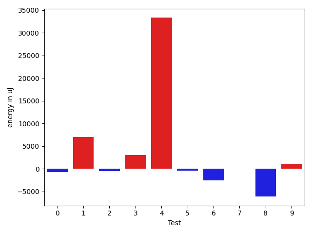
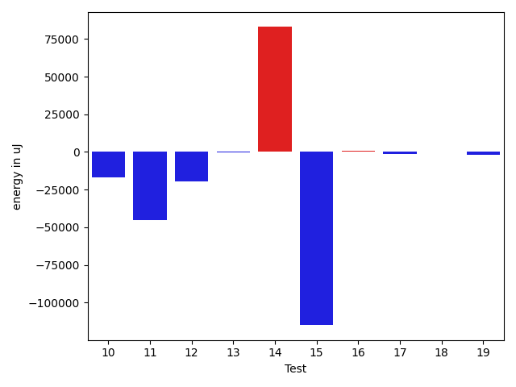
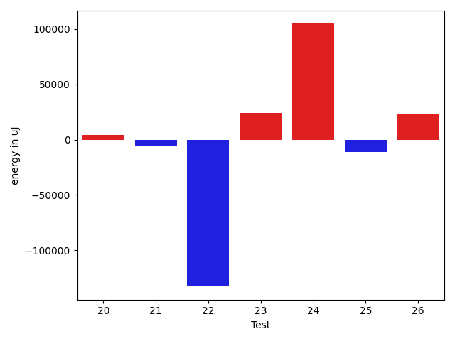

# gson 55acc2

https://github.com/google/gson/commit/55acc2

## Delta Energy per test method

| ID | EnergyV1 | EnergyV2 | DeltaEnergy | σV1 | σV2 |
| --- | --- | --- | --- | --- | --- |
| 0 | 40405 | 38635 | -1770 | 3505.7189442560425 | 4004.1984148160655 |
| 1 | 41992 | 41687 | -305 | 21737.73708678941 | 26886.55468759561 |
| 2 | 39246 | 38330 | -916 | 3540.3997641769797 | 3662.269640278883 |
| 3 | 42663 | 46265 | 3602 | 20795.218368097103 | 19522.830604512757 |
| 4 | 42785 | 74341 | 31556 | 134722.7331510988 | 140105.8079623538 |
| 5 | 38696 | 39245 | 549 | 3833.9834026204385 | 3438.2048232338143 |
| 6 | 135864 | 132263 | -3601 | 199823.75051420464 | 198557.06915290366 |
| 7 | 37659 | 37903 | 244 | 2979.3117037059233 | 3318.1198373775605 |
| 8 | 117798 | 113159 | -4639 | 35723.32719735925 | 35701.93171812804 |
| 9 | 38574 | 39246 | 672 | 9967.750501426342 | 14465.226476959368 |
| 10 | 44067 | 42541 | -1526 | 103935.22096858991 | 85034.45102391428 |
| 11 | 41870 | 42847 | 977 | 335961.2976729592 | 210610.352420908 |
| 12 | 96131 | 89416 | -6715 | 422095.0875955975 | 386091.4904994924 |
| 13 | 41748 | 42969 | 1221 | 22330.31106079423 | 19356.080733334726 |
| 14 | 133911 | 134582 | 671 | 388136.34977592976 | 492683.7072987033 |
| 15 | 76294 | 68847 | -7447 | 558856.2202825908 | 408421.2613072332 |
| 16 | 38452 | 39734 | 1282 | 6297.3696909879745 | 6808.578374123844 |
| 17 | 39001 | 39306 | 305 | 9534.74755293477 | 7072.279305229254 |
| 18 | 38757 | 39429 | 672 | 3993.1672379499323 | 7940.467613906627 |
| 19 | 42175 | 43396 | 1221 | 59986.7330226378 | 55902.3157941386 |
| 20 | 42969 | 44677 | 1708 | 30203.82387830971 | 45653.292876086736 |
| 21 | 80750 | 75439 | -5311 | 120187.11524891146 | 125399.73856307671 |
| 22 | 181030 | 174560 | -6470 | 527546.8031642574 | 337001.7309870786 |
| 23 | 40955 | 39184 | -1771 | 3661.7294067057833 | 121143.34059169923 |
| 24 | 38574 | 42054 | 3480 | 138976.96965433683 | 284654.79485903366 |
| 25 | 37903 | 39673 | 1770 | 204736.66913967393 | 150277.69049407632 |
| 26 | 40771 | 39733 | -1038 | 152073.02345058555 | 194637.57491922396 |

## Delta Duration per test method

| ID | DurationV1 | DurationsV2 | DeltaDuration |
| --- | --- | --- | --- |
| 0 | 774498.5227272727 | 800502.0540540541 | 26003.531326781376 |
| 1 | 1481100.91954023 | 1735318.4157303371 | 254217.4961901072 |
| 2 | 778197.0731707317 | 833220.1176470588 | 55023.04447632714 |
| 3 | 1586370.6956521738 | 1760742.6666666667 | 174371.9710144929 |
| 4 | 3472084.3950617285 | 4576886.829545454 | 1104802.4344837256 |
| 5 | 739470.0434782609 | 767111.6136363636 | 27641.570158102782 |
| 6 | 6955835.333333333 | 6950293.111111111 | -5542.222222222015 |
| 7 | 922859.3018867924 | 909282.9347826086 | -13576.367104183766 |
| 8 | 3553117.787878788 | 3469449.222222222 | -83668.56565656606 |
| 9 | 1287010.6 | 1274294.7241379311 | -12715.875862068962 |
| 10 | 2923536.0606060605 | 2399497.717171717 | -524038.3434343436 |
| 11 | 4044884.5306122447 | 2861427.075268817 | -1183457.4553434276 |
| 12 | 6600140.131313131 | 6068296.888888889 | -531843.2424242422 |
| 13 | 1746283.98989899 | 1710464.5454545454 | -35819.444444444496 |
| 14 | 7249029.96969697 | 10084809.505050505 | 2835779.535353535 |
| 15 | 9377883.853658536 | 6263031.675675675 | -3114852.177982861 |
| 16 | 1045508.6612903225 | 1060372.5806451612 | 14863.919354838668 |
| 17 | 1116818.880597015 | 1110110.6417910447 | -6708.238805970177 |
| 18 | 800258.8846153846 | 844890.6 | 44631.71538461535 |
| 19 | 2074622.7631578948 | 2091750.125 | 17127.361842105165 |
| 20 | 1903671.7474747475 | 1988938.2626262626 | 85266.51515151514 |
| 21 | 3614955.1414141413 | 3661764.4242424243 | 46809.28282828303 |
| 22 | 11125466.292929294 | 7272695.353535353 | -3852770.9393939404 |
| 23 | 569233.2272727273 | 1438942.4782608696 | 869709.2509881423 |
| 24 | 1574485.2608695652 | 4456955.142857143 | 2882469.8819875773 |
| 25 | 1861094.9411764706 | 1791233.8125 | -69861.1286764706 |
| 26 | 1865055.375 | 2527350.46875 | 662295.09375 |

## Misc.

| ID | Test Class | Test Method |
| --- | --- | --- |
| 0 | com.google.gson.functional.InheritanceTest | testBaseSerializedAsSubWhenSpecifiedWithExplicitType |
| 1 | com.google.gson.functional.InheritanceTest | testClassWithBaseArrayFieldSerialization |
| 2 | com.google.gson.functional.InheritanceTest | testBaseSerializedAsSub |
| 3 | com.google.gson.functional.InheritanceTest | testClassWithBaseCollectionFieldSerialization |
| 4 | com.google.gson.functional.InheritanceTest | testClassWithBaseFieldSerialization |
| 5 | com.google.gson.functional.InheritanceTest | testBaseSerializedAsBaseWhenSpecifiedWithExplicitType |
| 6 | com.google.gson.functional.MapTest | testInterfaceTypeMapWithSerializer |
| 7 | com.google.gson.functional.JsonTreeTest | testJsonTreeNull |
| 8 | com.google.gson.functional.JsonTreeTest | testJsonTreeToString |
| 9 | com.google.gson.functional.JsonTreeTest | testToJsonTreeObjectType |
| 10 | com.google.gson.functional.JsonTreeTest | testToJsonTree |
| 11 | com.google.gson.functional.MapAsArrayTypeAdapterTest | testMultipleEnableComplexKeyRegistrationHasNoEffect |
| 12 | com.google.gson.functional.MapAsArrayTypeAdapterTest | testSerializeComplexMapWithTypeAdapter |
| 13 | com.google.gson.functional.MapAsArrayTypeAdapterTest | testMapWithTypeVariableSerialization |
| 14 | com.google.gson.functional.ExclusionStrategyFunctionalTest | testExclusionStrategyWithMode |
| 15 | com.google.gson.functional.CustomSerializerTest | testSubClassSerializerInvokedForBaseClassFieldsHoldingSubClassInstances |
| 16 | com.google.gson.functional.CustomSerializerTest | testBaseClassSerializerInvokedForBaseClassFieldsHoldingSubClassInstances |
| 17 | com.google.gson.functional.CustomSerializerTest | testSubClassSerializerInvokedForBaseClassFieldsHoldingArrayOfSubClassInstances |
| 18 | com.google.gson.functional.CustomSerializerTest | testBaseClassSerializerInvokedForBaseClassFields |
| 19 | com.google.gson.DefaultMapJsonSerializerTest | testNonEmptyMapSerialization |
| 20 | com.google.gson.functional.MoreSpecificTypeSerializationTest | testMapOfParameterizedSubclassFields |
| 21 | com.google.gson.functional.MoreSpecificTypeSerializationTest | testMapOfSubclassFields |
| 22 | com.google.gson.functional.TypeHierarchyAdapterTest | testTypeHierarchy |
| 23 | com.google.gson.internal.bind.JsonTreeWriterTest | testSerializeNullsTrue |
| 24 | com.google.gson.internal.bind.JsonTreeWriterTest | testObject |
| 25 | com.google.gson.internal.bind.JsonTreeWriterTest | testNestedObject |
| 26 | com.google.gson.internal.bind.JsonTreeWriterTest | testSerializeNullsFalse |

| Test | IterationV1 | IterationV2 | DeltaIteration |
| --- | --- | --- | --- |
| 0 | 44 | 37 | -7 |
| 1 | 87 | 89 | 2 |
| 2 | 41 | 51 | 10 |
| 3 | 92 | 96 | 4 |
| 4 | 81 | 88 | 7 |
| 5 | 46 | 44 | -2 |
| 6 | 99 | 99 | 0 |
| 7 | 53 | 46 | -7 |
| 8 | 99 | 99 | 0 |
| 9 | 85 | 87 | 2 |
| 10 | 99 | 99 | 0 |
| 11 | 98 | 93 | -5 |
| 12 | 99 | 99 | 0 |
| 13 | 99 | 99 | 0 |
| 14 | 99 | 99 | 0 |
| 15 | 82 | 74 | -8 |
| 16 | 62 | 62 | 0 |
| 17 | 67 | 67 | 0 |
| 18 | 52 | 40 | -12 |
| 19 | 76 | 88 | 12 |
| 20 | 99 | 99 | 0 |
| 21 | 99 | 99 | 0 |
| 22 | 99 | 99 | 0 |
| 23 | 22 | 23 | 1 |
| 24 | 23 | 28 | 5 |
| 25 | 17 | 32 | 15 |
| 26 | 32 | 32 | 0 |

## Localization of Green Regression
### Selected Tests
| Test class | test method |
| --- | --- |
| com.google.gson.functional.InheritanceTest | testClassWithBaseFieldSerialization |

### Suspected lines
| Class | line |
| --- | --- |
| com.google.gson.internal.bind.JsonTreeWriter | [133](https://github.com/google/gson/tree/55acc2/gson/src/main/java/com/google/gson/internal/bind/JsonTreeWriter.java#L133) |

| Time Label | Time (s) |
| --- | --- |
| Selection | 36.45126223564148 |
| Injection | 15.579846382141113 |
| Total | 1530.9596247673035 |

