# gson e81f3e

https://github.com/google/gson/commit/e81f3e

## Delta Energy per test method

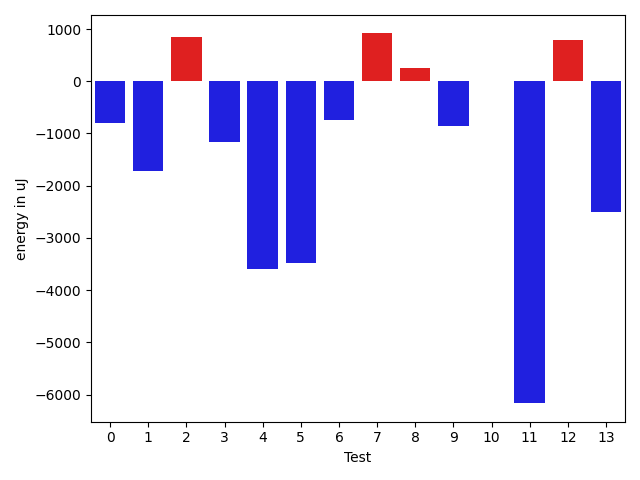

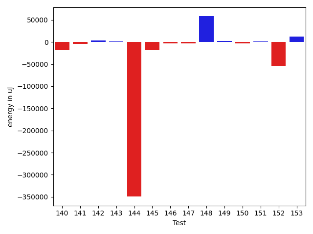

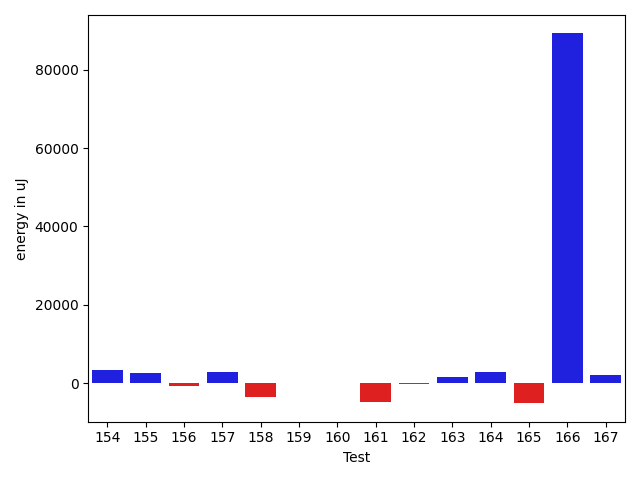

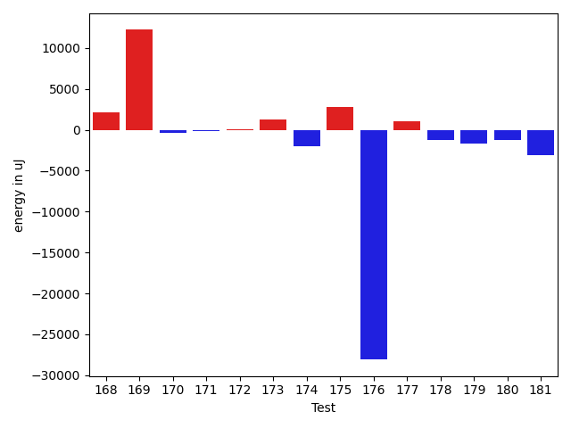

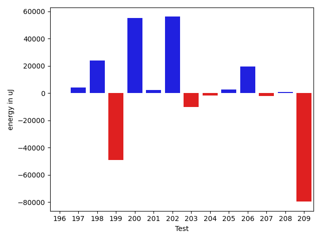

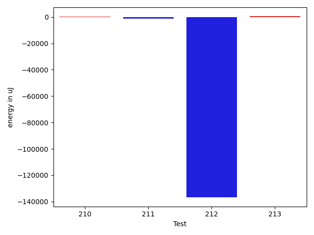

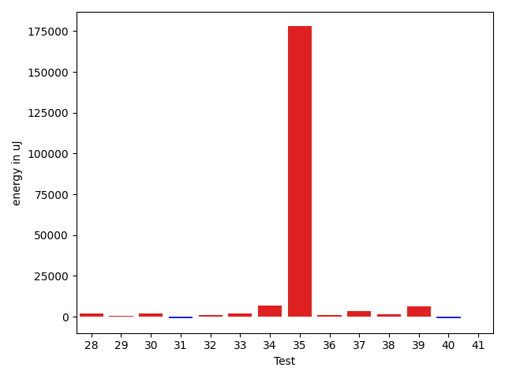

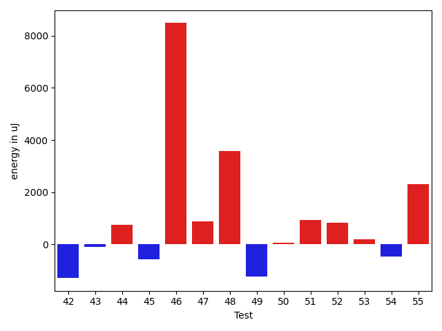

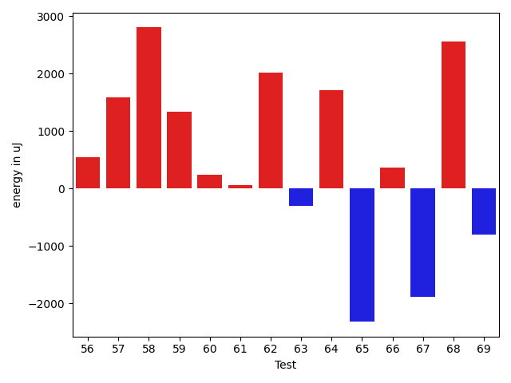

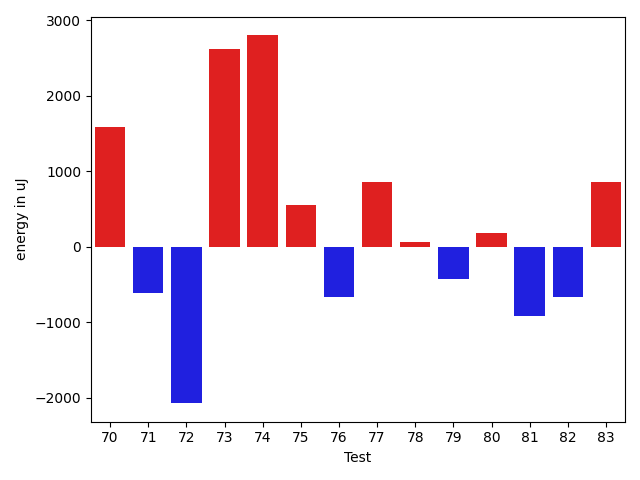

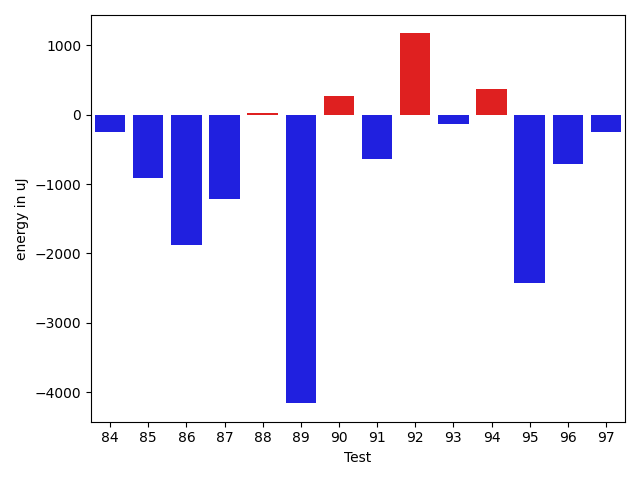

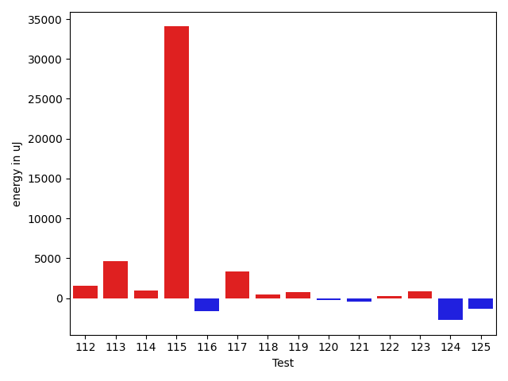

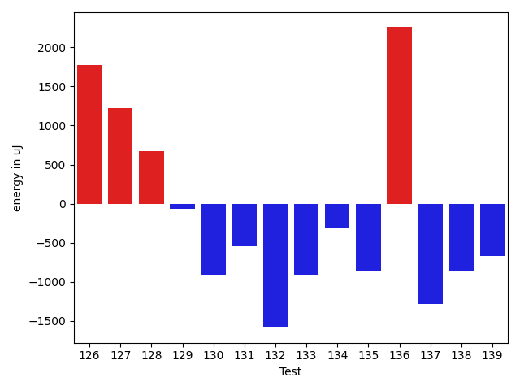

| ID | EnergyV1 | EnergyV2 | DeltaEnergy |
| --- | --- | --- | --- |
| 0 | 41791.36310158169 | 123816.14662159889 | 82024.7835200172 |
| 1 | 29870.432136535645 | 38041.6240234375 | 8171.1918869018555 |
| 2 | 39379.43995094299 | 32288.773221969604 | -7090.666728973389 |
| 3 | 36902.8351726532 | 36957.23077583313 | 54.39560317993164 |
| 4 | 32489.671219825745 | 36025.405197143555 | 3535.73397731781 |
| 5 | 36277.459815979004 | 40046.00812339783 | 3768.5483074188232 |
| 6 | 35374.08251953125 | 35841.61102294922 | 467.52850341796875 |
| 7 | 36785.7080078125 | 43837.43531155586 | 7051.727303743362 |
| 8 | 35989.35944626557 | 42898.40291855869 | 6909.043472293124 |
| 9 | 37460.587906766974 | 41462.17933660702 | 4001.5914298400457 |
| 10 | 42792.83204825208 | 41849.21053543575 | -943.6215128163312 |
| 11 | 44063.17819573569 | 54253.283569757594 | 10190.105374021907 |
| 12 | 70348.43641705452 | 83305.90131201984 | 12957.46489496532 |
| 13 | 34414.14173460007 | 39231.25663022697 | 4817.114895626903 |
| 14 | 36573.28068666592 | 38744.087652437556 | 2170.8069657716333 |
| 15 | 38702.91969689978 | 38598.61987854588 | -104.29981835390208 |
| 16 | 39063.272008270345 | 37859.40093769006 | -1203.8710705802878 |
| 17 | 39497.65459398898 | 38431.37194508897 | -1066.2826489000072 |
| 18 | 38417.83256473015 | 34489.53080828901 | -3928.301756441142 |
| 19 | 37238.584486463435 | 36368.6974883176 | -869.8869981458338 |
| 20 | 34072.68097732353 | 41842.110276457024 | 7769.429299133495 |
| 21 | 37852.74971745828 | 36568.38169056673 | -1284.3680268915487 |
| 22 | 38319.593764901605 | 33754.76040473234 | -4564.833360169265 |
| 23 | 36275.784757101355 | 40969.47182326213 | 4693.687066160775 |
| 24 | 38969.20887373487 | 41265.99428964362 | 2296.785415908751 |
| 25 | 42030.011451286875 | 35278.339081221726 | -6751.672370065149 |
| 26 | 35884.915771484375 | 39112.1592464447 | 3227.243474960327 |
| 27 | 34319.14846275688 | 40226.509420567934 | 5907.360957811055 |
| 28 | 43834.09106746472 | 42704.16372768396 | -1129.9273397807556 |
| 29 | 37970.81675709295 | 41328.09334351962 | 3357.2765864266694 |
| 30 | 302209.7237012114 | 95818.58023358078 | -206391.1434676306 |
| 31 | 44102.68422595362 | 33163.23082902032 | -10939.453396933299 |
| 32 | 37107.21044638024 | 36100.95152707017 | -1006.2589193100721 |
| 33 | 54541.19414631275 | 35886.17646038355 | -18655.017685929204 |
| 34 | 56694.90478880769 | 38203.27623296612 | -18491.62855584157 |
| 35 | 39045.59414784247 | 33820.12556839379 | -5225.4685794486795 |
| 36 | 37511.95003300326 | 33416.04624527987 | -4095.903787723393 |
| 37 | 47424.53231069392 | 78316.69721895887 | 30892.164908264953 |
| 38 | 37469.95697559301 | 56734.51357793002 | 19264.556602337005 |
| 39 | 39317.902190778186 | 39554.50704252878 | 236.60485175059148 |
| 40 | 40178.61662784682 | 41108.67162812756 | 930.0550002807358 |
| 41 | 59579.32718943998 | 63780.30800522865 | 4200.980815788673 |
| 42 | 35038.31850508433 | 37968.840875635506 | 2930.5223705511744 |
| 43 | 34120.50685431628 | 41011.853953504025 | 6891.3470991877475 |
| 44 | 39560.01562517136 | 35010.98133355053 | -4549.034291620832 |
| 45 | 41337.800339328845 | 31649.30679539917 | -9688.493543929675 |
| 46 | 119364.35409282571 | 118795.59241239054 | -568.761680435171 |
| 47 | 33713.90184134512 | 35322.396771228945 | 1608.4949298838255 |
| 48 | 41533.367758710374 | 42634.402418648955 | 1101.0346599385812 |
| 49 | 37967.92878837499 | 39591.788920425446 | 1623.860132050453 |
| 50 | 38879.5029566591 | 39270.481752660125 | 390.97879600102897 |
| 51 | 38948.23647514515 | 36867.19632610645 | -2081.040149038701 |
| 52 | 39792.68578717508 | 35461.346972109306 | -4331.338815065777 |
| 53 | 36129.81221437454 | 32935.79177856445 | -3194.020435810089 |
| 54 | 35196.461822390556 | 33791.85965825617 | -1404.6021641343832 |
| 55 | 33532.31866842508 | 35538.27588105202 | 2005.957212626934 |
| 56 | 35306.89431762695 | 34520.197026729584 | -786.6972908973694 |
| 57 | 34324.46594238281 | 39031.44423110224 | 4706.978288719431 |
| 58 | 40928.78448295593 | 33868.96081125736 | -7059.82367169857 |
| 59 | 36678.367248535156 | 36030.350200772285 | -648.0170477628708 |
| 60 | 36884.16889331397 | 38535.32001497655 | 1651.1511216625804 |
| 61 | 37730.105952076614 | 32368.91757106781 | -5361.188381008804 |
| 62 | 35361.88001659047 | 41353.788475868656 | 5991.908459278187 |
| 63 | 41002.44775524153 | 32879.724317811044 | -8122.723437430483 |
| 64 | 39077.18326356667 | 37327.008460009165 | -1750.1748035575074 |
| 65 | 38856.45600491251 | 48505.99105324928 | 9649.535048336773 |
| 66 | 38079.37883293629 | 34160.461166620255 | -3918.9176663160324 |
| 67 | 36479.241124322536 | 55427.29044587913 | 18948.049321556595 |
| 68 | 35316.44792374619 | 39293.87990966576 | 3977.4319859195675 |
| 69 | 35726.6451388635 | 40568.27142133165 | 4841.626282468147 |
| 70 | 39717.63165664673 | 38321.402398929 | -1396.2292577177286 |
| 71 | 37627.775337216444 | 36964.87528664246 | -662.9000505739823 |
| 72 | 38749.133796691895 | 104071.15703010559 | 65322.023233413696 |
| 73 | 37969.976868303886 | 38317.201493742556 | 347.22462543867005 |
| 74 | 49230.208907977954 | 34365.207444452615 | -14865.00146352534 |
| 75 | 36704.08645765204 | 37191.754914778285 | 487.6684571262449 |
| 76 | 36259.90673828125 | 43601.992319107056 | 7342.085580825806 |
| 77 | 33628.89660573006 | 38602.08269882202 | 4973.186093091965 |
| 78 | 402439.94848958787 | 162480.77512168046 | -239959.1733679074 |
| 79 | 51401.14461748392 | 39130.641831022294 | -12270.502786461628 |
| 80 | 43940.9724341984 | 36439.02589593317 | -7501.946538265227 |
| 81 | 40674.388092041016 | 38601.65135192871 | -2072.7367401123047 |
| 82 | 41958.44714927673 | 39923.93359375 | -2034.5135555267334 |
| 83 | 41684.93414026266 | 84061.61772400167 | 42376.68358373901 |
| 84 | 40939.77876044177 | 61701.36351549567 | 20761.584755053904 |
| 85 | 43550.14579470175 | 66215.5947005737 | 22665.44890587195 |
| 86 | 41075.232660103924 | 40643.16685285699 | -432.0658072469305 |
| 87 | 38310.873557029045 | 36171.40280055198 | -2139.470756477065 |
| 88 | 37495.382668905186 | 39143.99310226937 | 1648.6104333641852 |
| 89 | 39148.60252678861 | 56959.71418555142 | 17811.111658762813 |
| 90 | 36387.76288342476 | 41970.27361860761 | 5582.510735182848 |
| 91 | 38655.8269132985 | 40636.28304751793 | 1980.4561342194283 |
| 92 | 39785.8681339249 | 38827.84402179718 | -958.0241121277213 |
| 93 | 76608.951171875 | 380259.2032775879 | 303650.2521057129 |
| 94 | 58792.50124547156 | 51262.88360368088 | -7529.617641790683 |
| 95 | 40756.5686340332 | 38202.12060546875 | -2554.448028564453 |
| 96 | 35284.82268059254 | 37024.330419778824 | 1739.507739186287 |
| 97 | 39268.76708984375 | 40501.51220703125 | 1232.7451171875 |
| 98 | 41332.263627614826 | 41058.48718929291 | -273.77643832191825 |
| 99 | 35123.2339515686 | 37191.72036743164 | 2068.486415863037 |
| 100 | 39603.375549316406 | 40109.32141113281 | 505.94586181640625 |
| 101 | 42686.659776598215 | 35834.92051696777 | -6851.739259630442 |
| 102 | 40122.375 | 39715.34375 | -407.03125 |
| 103 | 39519.9638671875 | 36469.3203125 | -3050.6435546875 |
| 104 | 40815.314462115915 | 37686.555014512414 | -3128.759447603501 |
| 105 | 34945.7203922888 | 58977.6782260629 | 24031.957833774097 |
| 106 | 42784.01563745132 | 40081.99022289331 | -2702.025414558004 |
| 107 | 65707.48838004217 | 58330.63134460781 | -7376.857035434354 |
| 108 | 36295.20188200494 | 39615.097965725596 | 3319.896083720654 |
| 109 | 39724.63411986434 | 33857.35404358202 | -5867.280076282324 |
| 110 | 72607.76668882847 | 48662.89589325134 | -23944.87079557713 |
| 111 | 38928.092313514244 | 38000.19302201271 | -927.8992915015333 |
| 112 | 38828.98557193205 | 34774.99759620467 | -4053.987975727381 |
| 113 | 37095.72614755738 | 37525.50323773916 | 429.7770901817785 |
| 114 | 37615.434592066835 | 39629.03782852405 | 2013.6032364572166 |
| 115 | 39030.283230687 | 39729.61117397643 | 699.3279432894342 |
| 116 | 39759.266997762286 | 41213.83942270676 | 1454.5724249444756 |
| 117 | 43652.73823070526 | 57815.32186317444 | 14162.583632469177 |
| 118 | 36392.48276735918 | 36278.92623168975 | -113.55653566942783 |
| 119 | 94068.16300155752 | 96452.69510301648 | 2384.532101458957 |
| 120 | 36940.18708072881 | 41799.328049647585 | 4859.1409689187785 |
| 121 | 34642.96267318819 | 35463.0774192214 | 820.114746033214 |
| 122 | 34752.87460334739 | 35262.44381840285 | 509.5692150554605 |
| 123 | 36521.46626043692 | 41009.660923838615 | 4488.194663401693 |
| 124 | 34216.622578280396 | 34606.37785242588 | 389.7552741454856 |
| 125 | 75925.84181105054 | 35056.274030385604 | -40869.56778066494 |
| 126 | 36114.02869041078 | 37304.41019630432 | 1190.3815058935434 |
| 127 | 34834.192428439856 | 37120.03789329529 | 2285.8454648554325 |
| 128 | 41247.12456083298 | 37843.073300383985 | -3404.0512604489923 |
| 129 | 33756.44973305762 | 36369.33440406152 | 2612.8846710038997 |
| 130 | 35306.00943514705 | 38772.29431152344 | 3466.2848763763905 |
| 131 | 35076.411260446184 | 33833.28914800286 | -1243.1221124433214 |
| 132 | 38082.669897905296 | 54937.40722865665 | 16854.737330751355 |
| 133 | 57121.27804658408 | 80732.81884729497 | 23611.540800710893 |
| 134 | 40450.13392183549 | 37409.14484371334 | -3040.9890781221548 |
| 135 | 36588.77428063203 | 39371.970491454646 | 2783.1962108226144 |
| 136 | 38527.38799893075 | 37686.26080114007 | -841.1271977906799 |
| 137 | 38318.650755983996 | 39303.10647664402 | 984.455720660022 |
| 138 | 36454.945381063066 | 37285.42943720723 | 830.484056144167 |
| 139 | 100907.71992634883 | 960093.3448554127 | 859185.624929064 |
| 140 | 55005.84089990599 | 36227.318925015505 | -18778.521974890486 |
| 141 | 42289.30561055688 | 38115.793894059054 | -4173.511716497829 |
| 142 | 35476.38916567576 | 39517.88347775283 | 4041.4943120770695 |
| 143 | 37364.55915029332 | 39036.808733521466 | 1672.2495832281493 |
| 144 | 414659.0698300817 | 65152.51215763793 | -349506.5576724438 |
| 145 | 77484.17236209536 | 58911.33760239213 | -18572.834759703226 |
| 146 | 42095.194827668885 | 39151.18439440784 | -2944.0104332610426 |
| 147 | 40727.358708679094 | 38111.85057825464 | -2615.5081304244522 |
| 148 | 85007.88798780812 | 143262.70217953215 | 58254.81419172403 |
| 149 | 35387.86473938823 | 38122.0592417717 | 2734.1945023834705 |
| 150 | 39127.803919171565 | 36384.30060826428 | -2743.503310907283 |
| 151 | 36961.39508923997 | 38877.64788226597 | 1916.2527930259967 |
| 152 | 93470.29297193192 | 39531.27170769489 | -53939.02126423703 |
| 153 | 35747.56975018978 | 47863.80273887329 | 12116.232988683507 |
| 154 | 36314.97314453125 | 39562.864166259766 | 3247.8910217285156 |
| 155 | 38305.41162109375 | 40838.31935882568 | 2532.9077377319336 |
| 156 | 39767.96099290252 | 38914.33943016827 | -853.6215627342463 |
| 157 | 35811.97797393799 | 38528.971318244934 | 2716.993344306946 |
| 158 | 52085.79043439869 | 48493.602004316635 | -3592.188430082053 |
| 159 | 37005.69970206638 | 36926.28910803853 | -79.41059402784595 |
| 160 | 36994.29420077801 | 36930.96969240904 | -63.324508368968964 |
| 161 | 40996.86577796936 | 36236.39388320595 | -4760.47189476341 |
| 162 | 40776.22497872729 | 40551.47750186175 | -224.74747686553746 |
| 163 | 39946.21263658983 | 41449.77053448811 | 1503.5578978982812 |
| 164 | 35913.226207733154 | 38655.13543701172 | 2741.9092292785645 |
| 165 | 48926.6282584756 | 43764.39256323541 | -5162.23569524019 |
| 166 | 51913.574299905515 | 141171.01234534243 | 89257.43804543692 |
| 167 | 36254.81612920761 | 38185.62211036682 | 1930.8059811592102 |
| 168 | 42019.793734129365 | 35493.36185842628 | -6526.431875703085 |
| 169 | 45713.52622593459 | 50372.561411693765 | 4659.035185759174 |
| 170 | 45697.79570579899 | 36786.51135438985 | -8911.284351409144 |
| 171 | 40731.070096631665 | 36958.45750810177 | -3772.612588529897 |
| 172 | 41086.29593310386 | 35455.97476581883 | -5630.32116728503 |
| 173 | 39221.2341478242 | 35775.61029138734 | -3445.6238564368614 |
| 174 | 61560.880766646536 | 39761.84021975792 | -21799.040546888617 |
| 175 | 38277.25331293374 | 70295.02813938481 | 32017.774826451074 |
| 176 | 37607.203016457526 | 38058.2766894951 | 451.073673037572 |
| 177 | 42303.717868450665 | 46690.50001053145 | 4386.782142080781 |
| 178 | 102376.78036428962 | 187442.62315998581 | 85065.8427956962 |
| 179 | 64015.95011138916 | 34539.74114195228 | -29476.208969436877 |
| 180 | 780761.6753159475 | 146629.45588908673 | -634132.2194268608 |
| 181 | 41087.21247699857 | 36983.340100178495 | -4103.8723768200725 |
| 182 | 36757.96447136397 | 36700.07462748609 | -57.88984387788514 |
| 183 | 65445.96490171672 | 110628.6033692542 | 45182.63846753748 |
| 184 | 34427.013577564394 | 35915.323093729654 | 1488.30951616526 |
| 185 | 36155.223451412974 | 35620.932517745176 | -534.2909336677985 |
| 186 | 42732.524805384106 | 36766.82363082096 | -5965.701174563146 |
| 187 | 40291.22607421875 | 38326.712564468384 | -1964.5135097503662 |
| 188 | 38148.10194878094 | 61528.29432716321 | 23380.19237838227 |
| 189 | 69774.08516724658 | 75062.90060675549 | 5288.815439508908 |
| 190 | 39458.91657781601 | 42829.68859183788 | 3370.7720140218735 |
| 191 | 39027.90118408203 | 39411.802810668945 | 383.90162658691406 |
| 192 | 84517.43155497556 | 107313.3138897697 | 22795.88233479415 |
| 193 | 34882.615565748914 | 41435.70644441495 | 6553.090878666037 |
| 194 | 36665.905029296875 | 39267.28125 | 2601.376220703125 |
| 195 | 38944.41353872993 | 40834.567456804216 | 1890.1539180742839 |
| 196 | 37928.00860977173 | 38001.506229400635 | 73.49761962890625 |
| 197 | 39374.158222198486 | 43534.37490272522 | 4160.216680526733 |
| 198 | 54265.09331417366 | 78109.6053964102 | 23844.512082236542 |
| 199 | 245616.53506525035 | 196380.07252982937 | -49236.462535420986 |
| 200 | 42530.2752237705 | 97688.89525497681 | 55158.620031206316 |
| 201 | 36609.8170157671 | 38992.6396484375 | 2382.8226326704025 |
| 202 | 50788.83427379653 | 106762.32874613978 | 55973.494472343256 |
| 203 | 50763.614998579025 | 40484.45157145709 | -10279.163427121937 |
| 204 | 39348.51588630676 | 37618.38982503221 | -1730.1260612745536 |
| 205 | 35971.28468827531 | 38602.794083355926 | 2631.5093950806186 |
| 206 | 34724.08148022094 | 54235.64396063357 | 19511.562480412627 |
| 207 | 39637.6195825506 | 37630.324992092326 | -2007.294590458274 |
| 208 | 40651.07018327713 | 41250.51069641113 | 599.4405131340027 |
| 209 | 119926.97014676507 | 40308.24329936028 | -79618.72684740479 |
| 210 | 35381.498103672726 | 39279.12684902758 | 3897.6287453548575 |
| 211 | 39180.086029052734 | 40866.457275390625 | 1686.3712463378906 |
| 212 | 628696.5203535557 | 35892.93359720707 | -592803.5867563486 |
| 213 | 35647.185623168945 | 40389.153564453125 | 4741.96794128418 |

## Delta Duration per test method

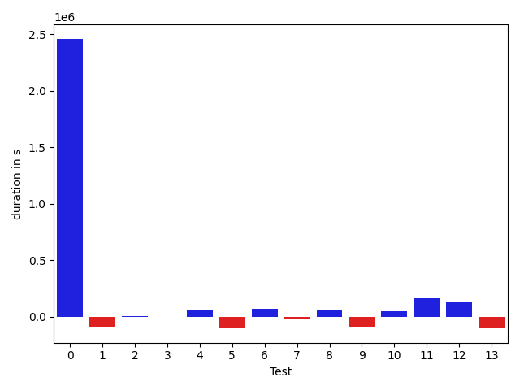

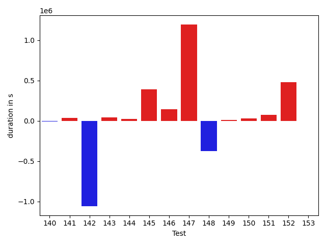

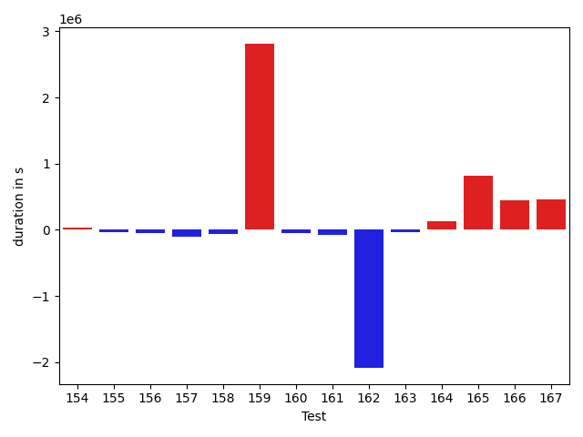

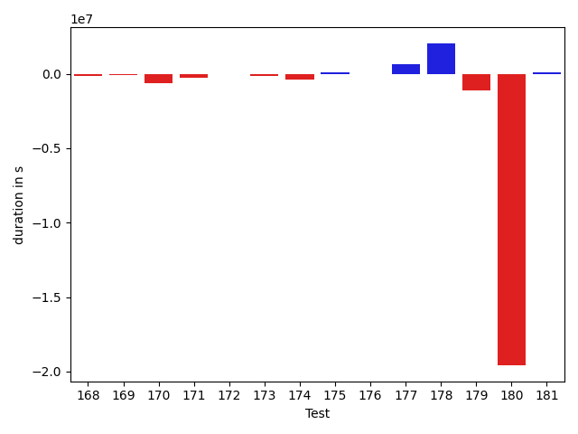

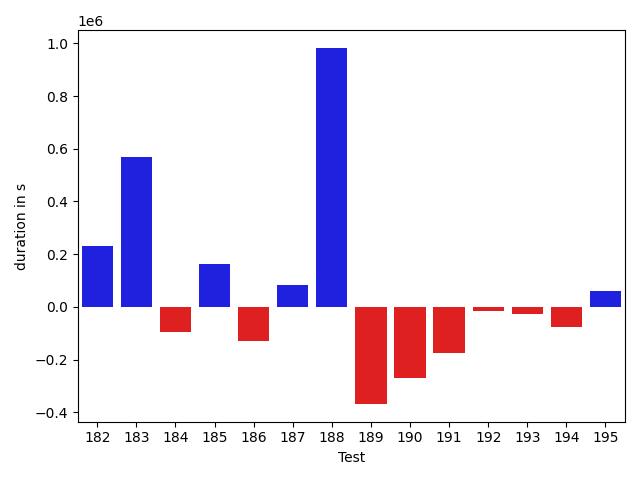

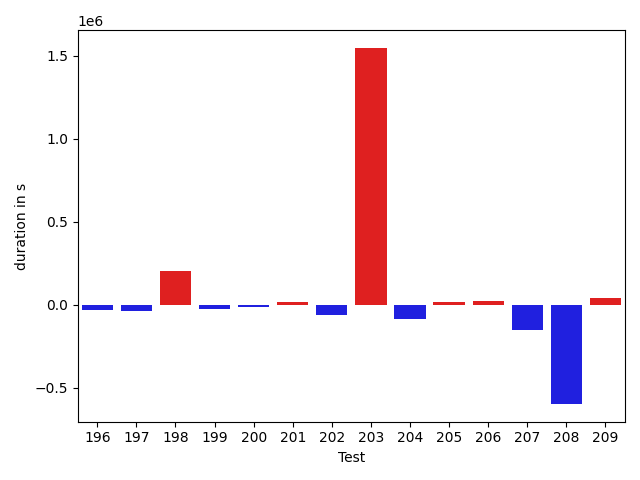

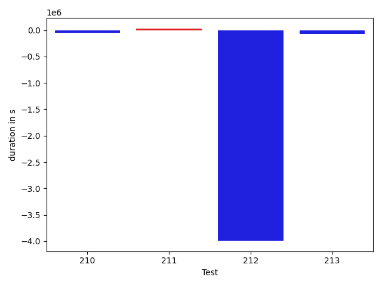

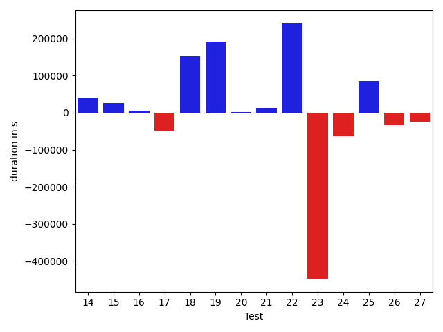

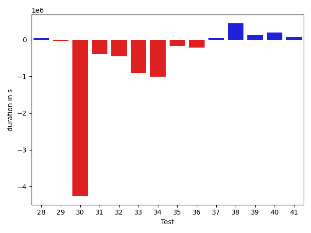

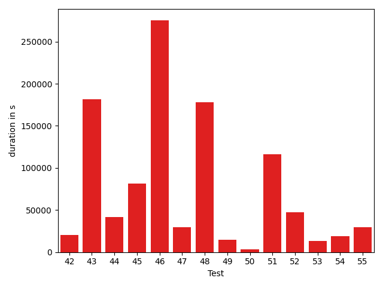

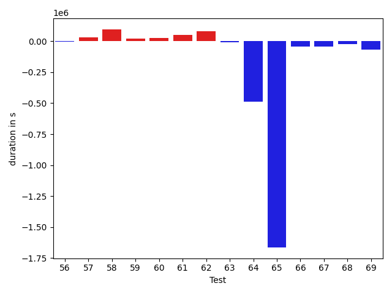

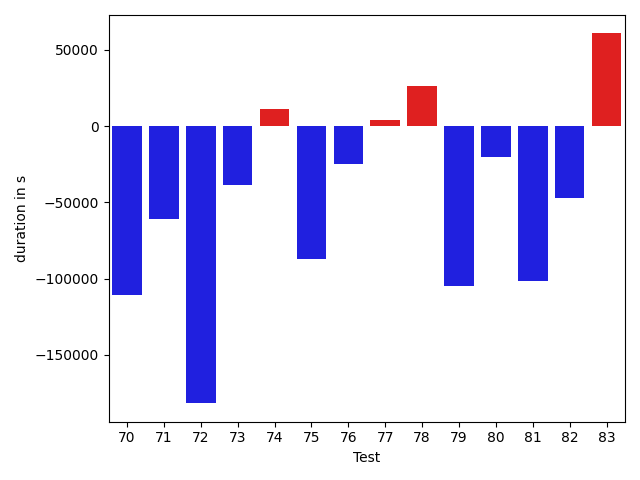

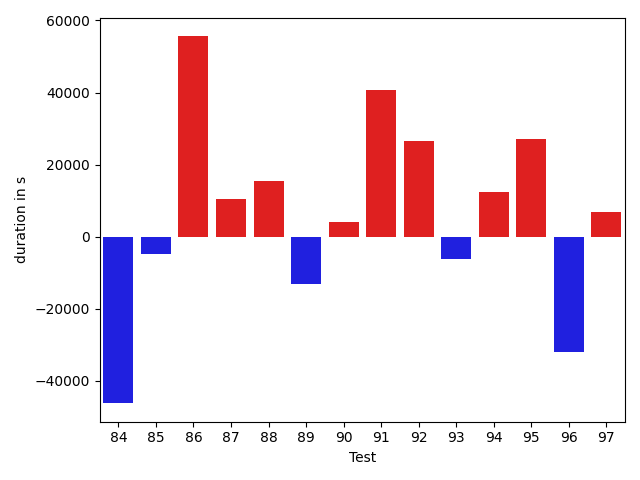

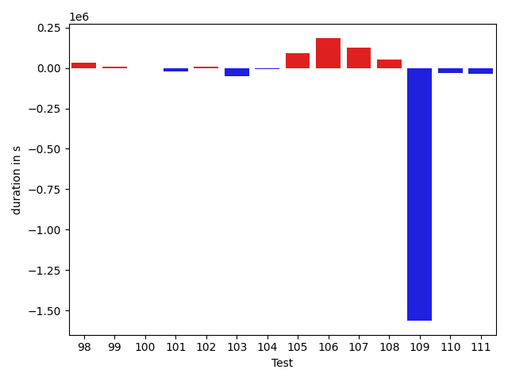

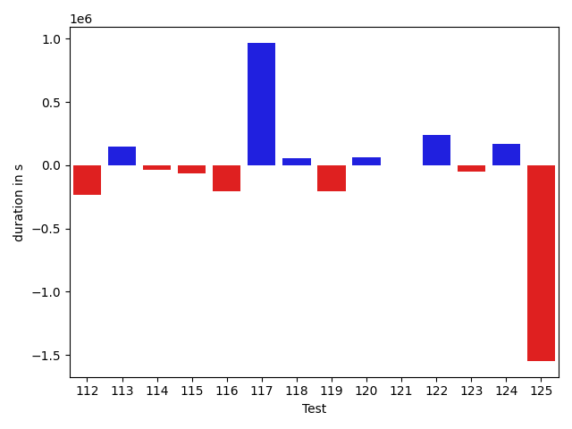

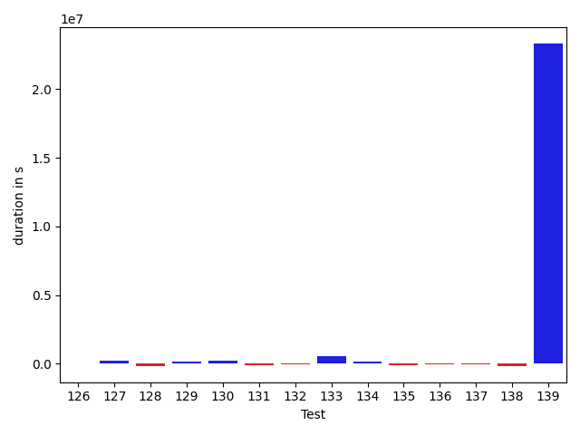

| ID | DurationV1 | DurationsV2 | DeltaDuration |
| --- | --- | --- | --- |
| 0 | 1340710.4644904048 | 3801100.6193868252 | 2460390.1548964204 |
| 1 | 497923.7781448364 | 405437.68896484375 | -92486.08917999268 |
| 2 | 411586.3649787903 | 412329.69336891174 | 743.32839012146 |
| 3 | 432579.41134929657 | 426806.9500427246 | -5772.46130657196 |
| 4 | 498876.4921236038 | 551668.9542827606 | 52792.4621591568 |
| 5 | 467253.009059906 | 363991.7915818691 | -103261.21747803688 |
| 6 | 344128.60107421875 | 411424.05908203125 | 67295.4580078125 |
| 7 | 550341.6494140625 | 528825.8058886528 | -21515.8435254097 |
| 8 | 698425.362243451 | 763504.6541918165 | 65079.29194836551 |
| 9 | 796298.7727261453 | 700698.3220400049 | -95600.45068614045 |
| 10 | 780269.845417052 | 825937.2512151102 | 45667.40579805814 |
| 11 | 1137220.258148068 | 1300564.0054784452 | 163343.7473303771 |
| 12 | 2250612.13319042 | 2380053.0572608323 | 129440.9240704123 |
| 13 | 528742.214063406 | 428315.7962709069 | -100426.41779249907 |
| 14 | 845358.804924448 | 886579.5772254626 | 41220.77230101463 |
| 15 | 612887.3792596762 | 639644.257971809 | 26756.878712132806 |
| 16 | 575476.008390635 | 581208.4393373993 | 5732.430946764303 |
| 17 | 568306.2289000798 | 519517.6766221839 | -48788.55227789597 |
| 18 | 674322.980824926 | 826790.1384718119 | 152467.15764688584 |
| 19 | 629672.0503917548 | 821418.9339186647 | 191746.88352690986 |
| 20 | 656195.3576782581 | 658069.624456661 | 1874.2667784029618 |
| 21 | 686448.8665829764 | 699096.7789418335 | 12647.91235885711 |
| 22 | 673296.4111689673 | 915216.1622488506 | 241919.7510798833 |
| 23 | 964626.704935306 | 515773.8792356153 | -448852.8256996907 |
| 24 | 714236.4125680127 | 651087.1380799268 | -63149.27448808588 |
| 25 | 674172.7390725394 | 759332.6025079724 | 85159.86343543301 |
| 26 | 462190.0183105469 | 428771.83000183105 | -33418.18830871582 |
| 27 | 1155030.3830827298 | 1130601.8193743583 | -24428.563708371483 |
| 28 | 867682.1809045955 | 917469.5100201701 | 49787.3291155746 |
| 29 | 580465.4398014352 | 548103.1624637077 | -32362.277337727486 |
| 30 | 7577111.313361492 | 3319887.678007447 | -4257223.635354045 |
| 31 | 984343.7893613229 | 588924.8192513507 | -395418.9701099722 |
| 32 | 1089924.2475974872 | 630654.463325302 | -459269.7842721852 |
| 33 | 1562828.1510880152 | 660620.0326049344 | -902208.1184830808 |
| 34 | 1584530.939757047 | 577961.7268865814 | -1006569.2128704656 |
| 35 | 726751.7641661173 | 551199.6795603936 | -175552.08460572374 |
| 36 | 1136642.1499388828 | 918759.1631189974 | -217882.98681988544 |
| 37 | 1547613.7193317402 | 1591059.8365952373 | 43446.117263497086 |
| 38 | 724389.9823647847 | 1167941.1741077174 | 443551.19174293266 |
| 39 | 714604.9412805542 | 838848.0204129518 | 124243.07913239766 |
| 40 | 606298.8505500803 | 797095.4376671156 | 190796.5871170353 |
| 41 | 1366129.695230078 | 1445731.1738307218 | 79601.47860064381 |
| 42 | 717358.7864558424 | 754060.7054889083 | 36701.919033065904 |
| 43 | 1173849.679633169 | 1300371.4184070257 | 126521.73877385678 |
| 44 | 583140.3332763221 | 639393.7983871568 | 56253.46511083469 |
| 45 | 942529.2360884092 | 1659500.9701543124 | 716971.7340659032 |
| 46 | 3365558.7036864497 | 3299592.9187442064 | -65965.78494224325 |
| 47 | 791852.4665724777 | 874456.9587983394 | 82604.49222586164 |
| 48 | 1130416.0154674686 | 1251836.9104381748 | 121420.8949707062 |
| 49 | 795142.6929078202 | 746191.8913470565 | -48950.801560763735 |
| 50 | 600822.0564961019 | 623334.0440581851 | 22511.987562083174 |
| 51 | 670651.5943039187 | 819823.8920712733 | 149172.29776735464 |
| 52 | 675429.2939590621 | 651527.667216317 | -23901.62674274505 |
| 53 | 618807.7688466907 | 594633.7967224121 | -24173.972124278545 |
| 54 | 580689.7203153968 | 457265.086215958 | -123424.63409943879 |
| 55 | 590725.2230466008 | 597108.6261230707 | 6383.403076469898 |
| 56 | 418084.5337295532 | 533060.3423461914 | 114975.80861663818 |
| 57 | 401340.44482421875 | 420235.70155233704 | 18895.256728118286 |
| 58 | 443888.92801475525 | 424109.3648828864 | -19779.56313186884 |
| 59 | 582352.3909912109 | 599633.0094095469 | 17280.618418335915 |
| 60 | 1044816.7773737274 | 767400.060846558 | -277416.71652716945 |
| 61 | 401937.4320747331 | 629516.8157525063 | 227579.38367777318 |
| 62 | 516852.5763562247 | 652039.0371656627 | 135186.46080943802 |
| 63 | 637666.9259038735 | 866451.4179839259 | 228784.49208005238 |
| 64 | 743377.064486112 | 919490.9514151623 | 176113.88692905032 |
| 65 | 666368.492046025 | 1124000.7301498267 | 457632.23810380173 |
| 66 | 473313.42113766074 | 577431.9545868635 | 104118.53344920278 |
| 67 | 1252730.3458435314 | 1760334.6376183361 | 507604.2917748047 |
| 68 | 668223.2724293948 | 659132.1080382543 | -9091.164391140454 |
| 69 | 659439.343107355 | 729353.5865416856 | 69914.24343433068 |
| 70 | 436770.43008995056 | 806780.2845884413 | 370009.8544984907 |
| 71 | 452707.926438814 | 583036.1772741005 | 130328.25083528645 |
| 72 | 508181.364654541 | 2732322.906518936 | 2224141.541864395 |
| 73 | 652062.6001096009 | 462458.5075225027 | -189604.09258709825 |
| 74 | 747439.371538742 | 1401401.1135973593 | 653961.7420586173 |
| 75 | 710833.0495945681 | 694649.4584116396 | -16183.591182928532 |
| 76 | 487130.8498535156 | 1098759.288526535 | 611628.4386730194 |
| 77 | 683201.2944412231 | 431400.9078178406 | -251800.38662338257 |
| 78 | 12415144.037901286 | 5018954.897763047 | -7396189.140138239 |
| 79 | 1102440.2387817933 | 764496.3226273373 | -337943.916154456 |
| 80 | 994157.4937576728 | 975434.7225094417 | -18722.771248231176 |
| 81 | 586123.8837280273 | 440605.068939209 | -145518.81478881836 |
| 82 | 360947.822599411 | 471689.53515625 | 110741.71255683899 |
| 83 | 1149306.2513887577 | 2071228.5278134178 | 921922.2764246601 |
| 84 | 781162.782171747 | 1416757.9165583896 | 635595.1343866426 |
| 85 | 1139162.7595005878 | 2582792.8421988306 | 1443630.0826982427 |
| 86 | 629121.1746042264 | 1341273.000561491 | 712151.8259572645 |
| 87 | 779789.9633583776 | 1010655.5530387292 | 230865.58968035167 |
| 88 | 1088503.4762400554 | 960050.0805851093 | -128453.3956549461 |
| 89 | 713869.0635561594 | 1354981.882802331 | 641112.8192461715 |
| 90 | 623306.0295362473 | 589799.6745847894 | -33506.35495145782 |
| 91 | 906652.8787298414 | 957676.0103756572 | 51023.131645815796 |
| 92 | 568373.4909344837 | 453351.9155521393 | -115021.57538234442 |
| 93 | 1505755.8583984375 | 10703166.326904297 | 9197410.46850586 |
| 94 | 1468313.990247508 | 2112193.587113494 | 643879.596865986 |
| 95 | 339659.61851501465 | 324012.7705078125 | -15646.848007202148 |
| 96 | 536942.6759051234 | 468397.4687137604 | -68545.20719136298 |
| 97 | 337667.12841796875 | 349234.94873046875 | 11567.8203125 |
| 98 | 524546.4766659588 | 341939.333940506 | -182607.14272545278 |
| 99 | 416475.7892303467 | 314919.6271972656 | -101556.16203308105 |
| 100 | 391252.5271911621 | 324731.6749267578 | -66520.8522644043 |
| 101 | 343406.8831064403 | 333190.5559501648 | -10216.32715627551 |
| 102 | 345877.89453125 | 380685.4931640625 | 34807.5986328125 |
| 103 | 363796.1936035156 | 371882.04296875 | 8085.849365234375 |
| 104 | 716675.5925907891 | 778771.2467692243 | 62095.654178435216 |
| 105 | 767014.0265409716 | 1263079.4163342873 | 496065.38979331567 |
| 106 | 1351643.303401731 | 1112346.2064394285 | -239297.09696230246 |
| 107 | 1567377.657912557 | 1129462.9855929748 | -437914.6723195822 |
| 108 | 731498.0586513865 | 716732.4489581577 | -14765.60969322885 |
| 109 | 912292.9093120911 | 660561.3126038045 | -251731.59670828655 |
| 110 | 1940412.897976307 | 1367034.9756643916 | -573377.9223119153 |
| 111 | 639770.7480745418 | 634771.3353698254 | -4999.412704716437 |
| 112 | 1005039.8611472673 | 774003.8077935422 | -231036.05335372512 |
| 113 | 950550.9522875169 | 1096554.6012817363 | 146003.64899421937 |
| 114 | 1036204.723641354 | 1002791.0325350086 | -33413.69110634539 |
| 115 | 864256.005408722 | 800004.6075316727 | -64251.39787704928 |
| 116 | 977957.8577807988 | 773769.0446767199 | -204188.81310407887 |
| 117 | 780267.6379861832 | 1748121.623846054 | 967853.9858598709 |
| 118 | 488993.9301473808 | 548242.6881730407 | 59248.75802565995 |
| 119 | 2696313.1859697625 | 2493871.9581891885 | -202441.227780574 |
| 120 | 803568.5893746506 | 868637.8388059824 | 65069.24943133176 |
| 121 | 526278.5565083404 | 524427.491249159 | -1851.0652591814287 |
| 122 | 735980.0849156778 | 972692.0406220946 | 236711.95570641686 |
| 123 | 495666.85583389364 | 445502.6283546686 | -50164.227479225025 |
| 124 | 743860.7827846379 | 913067.1555975555 | 169206.37281291757 |
| 125 | 2193942.5355034173 | 645586.6137782002 | -1548355.921725217 |
| 126 | 478746.5669949949 | 474098.9947900772 | -4647.572204917669 |
| 127 | 489736.10990932584 | 710229.2053272724 | 220493.09541794658 |
| 128 | 838945.8775031567 | 665998.2856885958 | -172947.59181456082 |
| 129 | 765436.543205784 | 934854.5389144939 | 169417.99570870982 |
| 130 | 522656.4175754413 | 715995.5795822144 | 193339.16200677305 |
| 131 | 649556.198224064 | 559107.0013485923 | -90449.19687547162 |
| 132 | 1545902.5544659537 | 1515050.1129697536 | -30852.44149620016 |
| 133 | 1879018.1234639129 | 2398158.6245070426 | 519140.5010431297 |
| 134 | 586523.1802794563 | 722512.705989367 | 135989.52570991067 |
| 135 | 772475.7251586107 | 641433.5507307053 | -131042.17442790547 |
| 136 | 823990.9539718763 | 797604.9596688761 | -26385.99430300016 |
| 137 | 1046923.27902789 | 1009632.8738818134 | -37290.40514607658 |
| 138 | 866429.9708596078 | 704153.2729055395 | -162276.6979540683 |
| 139 | 2851651.9794553835 | 26177112.823137693 | 23325460.84368231 |
| 140 | 1409586.4211228276 | 1515752.6966372682 | 106166.27551444061 |
| 141 | 1016842.6396376028 | 953280.8373136919 | -63561.80232391099 |
| 142 | 1051833.6525345116 | 888195.8876917488 | -163637.76484276284 |
| 143 | 1083838.6059370236 | 1117181.059823669 | 33342.45388664538 |
| 144 | 13136823.171433723 | 2169314.64636714 | -10967508.525066582 |
| 145 | 2637230.635621069 | 1924807.457599654 | -712423.1780214149 |
| 146 | 1204563.5909381895 | 1077277.4222651562 | -127286.16867303336 |
| 147 | 1305602.2495694456 | 929189.0562849382 | -376413.1932845074 |
| 148 | 2959493.052193665 | 3833920.8685746295 | 874427.8163809646 |
| 149 | 748474.169193849 | 453498.1785006523 | -294975.99069319665 |
| 150 | 770040.6595399796 | 462001.1688010567 | -308039.49073892296 |
| 151 | 685771.2160971242 | 570603.6133318963 | -115167.6027652279 |
| 152 | 2485126.811853233 | 627353.9874907571 | -1857772.8243624757 |
| 153 | 398748.76613748074 | 960947.6538680438 | 562198.8877305631 |
| 154 | 376035.1572265625 | 441292.7661437988 | 65257.60891723633 |
| 155 | 365824.06549072266 | 550973.5133590698 | 185149.44786834717 |
| 156 | 464161.0599492192 | 592254.5549812615 | 128093.49503204226 |
| 157 | 534785.725982666 | 539050.995018959 | 4265.26903629303 |
| 158 | 1330090.4015361117 | 820368.555554782 | -509721.8459813297 |
| 159 | 932997.774634131 | 834163.9482581002 | -98833.8263760308 |
| 160 | 1015143.6239732504 | 441598.60886090994 | -573545.0151123405 |
| 161 | 517497.30861473083 | 430959.00329327583 | -86538.305321455 |
| 162 | 584624.6043999465 | 456407.15829968825 | -128217.44610025827 |
| 163 | 905364.0095265025 | 854914.3155469424 | -50449.69397956005 |
| 164 | 454209.24144363403 | 405574.38775634766 | -48634.85368728638 |
| 165 | 1100690.4939919843 | 1025282.821127637 | -75407.67286434723 |
| 166 | 1405807.857632877 | 3075503.4277146077 | 1669695.5700817306 |
| 167 | 427993.99252414703 | 763830.6044330597 | 335836.61190891266 |
| 168 | 979708.5323126088 | 831345.2471435617 | -148363.28516904707 |
| 169 | 1365080.0547944463 | 1253318.77260667 | -111761.2821877764 |
| 170 | 1476309.895403789 | 845566.6122291443 | -630743.2831746446 |
| 171 | 1187900.4215315585 | 915383.9104379546 | -272516.5110936039 |
| 172 | 629461.0438152949 | 577872.84785028 | -51588.195965014864 |
| 173 | 765682.9446604471 | 596419.4727707168 | -169263.4718897303 |
| 174 | 1617937.8772441882 | 1227109.0411300305 | -390828.8361141577 |
| 175 | 1533684.4978896782 | 1654283.7830560512 | 120599.28516637301 |
| 176 | 764741.1199756656 | 715997.4180987709 | -48743.70187689469 |
| 177 | 815797.2089289833 | 1433484.5771879137 | 617687.3682589304 |
| 178 | 2962978.2587766806 | 5003883.804871711 | 2040905.5460950304 |
| 179 | 1802402.0973358154 | 710370.8996126149 | -1092031.1977232005 |
| 180 | 23503715.78952857 | 3927027.5592639614 | -19576688.23026461 |
| 181 | 728886.2002568394 | 850863.6199110225 | 121977.41965418309 |
| 182 | 764244.0732508707 | 995376.5650224887 | 231132.49177161802 |
| 183 | 2362569.8547234978 | 2930289.279648842 | 567719.4249253441 |
| 184 | 886589.8681288362 | 792875.6497059186 | -93714.21842291753 |
| 185 | 1193255.7903698224 | 1357538.9382557792 | 164283.1478859568 |
| 186 | 681687.0990023606 | 551557.5861341436 | -130129.51286821696 |
| 187 | 343044.2212524414 | 426209.20859336853 | 83164.98734092712 |
| 188 | 965347.7260802705 | 1947674.9627828565 | 982327.2367025861 |
| 189 | 2267768.1338527384 | 1899604.5053562038 | -368163.62849653466 |
| 190 | 655763.8622350693 | 387727.5473539829 | -268036.31488108635 |
| 191 | 674920.8930358887 | 499527.536567688 | -175393.35646820068 |
| 192 | 2695209.993785074 | 2677986.854444743 | -17223.139340330847 |
| 193 | 676810.7450198851 | 649741.2218287173 | -27069.523191167857 |
| 194 | 375625.64373779297 | 298632.42578125 | -76993.21795654297 |
| 195 | 676860.7987968167 | 737423.2460449599 | 60562.447248143144 |
| 196 | 458125.66510772705 | 494895.89825439453 | 36770.23314666748 |
| 197 | 560822.1232147217 | 395445.97062826157 | -165376.1525864601 |
| 198 | 1766721.9030189405 | 1835802.5026485594 | 69080.59962961893 |
| 199 | 5952141.067497492 | 4934388.253311677 | -1017752.8141858149 |
| 200 | 1051786.908344274 | 3050253.172488203 | 1998466.264143929 |
| 201 | 489712.9888442755 | 478368.57165527344 | -11344.417189002037 |
| 202 | 1044880.3753085136 | 3021596.3935159547 | 1976716.018207441 |
| 203 | 1255673.796717286 | 872207.9437517673 | -383465.85296551883 |
| 204 | 397103.43441581726 | 713438.7774282314 | 316335.3430124142 |
| 205 | 544920.7650036737 | 481807.2975335559 | -63113.467470117845 |
| 206 | 1256523.342618846 | 1354562.8092598093 | 98039.46664096322 |
| 207 | 633928.7763550524 | 561916.2318962332 | -72012.5444588192 |
| 208 | 495233.3842949867 | 398776.0013961792 | -96457.38289880753 |
| 209 | 3271325.9232218037 | 1315846.3726860003 | -1955479.5505358034 |
| 210 | 699447.6021253597 | 896949.7951060345 | 197502.1929806748 |
| 211 | 329550.02279663086 | 387644.130859375 | 58094.10806274414 |
| 212 | 18256056.442230225 | 474512.43522930145 | -17781544.007000923 |
| 213 | 477586.3265609741 | 455126.94970703125 | -22459.37685394287 |

## Misc.

| ID | Test Class | Test Method |
| --- | --- | --- |
| 0 | com.google.gson.functional.TypeAdapterPrecedenceTest | testStreamingFollowedByNonstreaming |
| 1 | com.google.gson.functional.TypeAdapterPrecedenceTest | testStreamingHierarchicalFollowedByNonstreamingHierarchical |
| 2 | com.google.gson.functional.TypeAdapterPrecedenceTest | testNonstreamingFollowedByNonstreaming |
| 3 | com.google.gson.functional.TypeAdapterPrecedenceTest | testNonstreamingHierarchicalFollowedByNonstreaming |
| 4 | com.google.gson.functional.TypeAdapterPrecedenceTest | testStreamingHierarchicalFollowedByNonstreaming |
| 5 | com.google.gson.functional.TypeAdapterPrecedenceTest | testStreamingFollowedByStreaming |
| 6 | com.google.gson.functional.TypeAdapterPrecedenceTest | testSerializeNonstreamingTypeAdapterFollowedByStreamingTypeAdapter |
| 7 | com.google.gson.functional.TypeAdapterPrecedenceTest | testStreamingFollowedByNonstreamingHierarchical |
| 8 | com.google.gson.functional.CustomTypeAdaptersTest | testCustomAdapterInvokedForCollectionElementDeserialization |
| 9 | com.google.gson.functional.CustomTypeAdaptersTest | testCustomAdapterInvokedForMapElementSerializationWithType |
| 10 | com.google.gson.functional.CustomTypeAdaptersTest | testCustomNestedSerializers |
| 11 | com.google.gson.functional.CustomTypeAdaptersTest | testCustomSerializers |
| 12 | com.google.gson.functional.CustomTypeAdaptersTest | testCustomTypeAdapterDoesNotAppliesToSubClasses |
| 13 | com.google.gson.functional.CustomTypeAdaptersTest | testCustomAdapterInvokedForCollectionElementSerialization |
| 14 | com.google.gson.functional.CustomTypeAdaptersTest | testCustomAdapterInvokedForCollectionElementSerializationWithType |
| 15 | com.google.gson.functional.CustomTypeAdaptersTest | testCustomTypeAdapterAppliesToSubClassesSerializedAsBaseClass |
| 16 | com.google.gson.functional.CustomTypeAdaptersTest | testEnsureCustomSerializerNotInvokedForNullValues |
| 17 | com.google.gson.functional.CustomTypeAdaptersTest | testEnsureCustomDeserializerNotInvokedForNullValues |
| 18 | com.google.gson.functional.CustomTypeAdaptersTest | testCustomDeserializerInvokedForPrimitives |
| 19 | com.google.gson.functional.CustomTypeAdaptersTest | testCustomSerializerInvokedForPrimitives |
| 20 | com.google.gson.functional.CustomTypeAdaptersTest | testCustomNestedDeserializers |
| 21 | com.google.gson.functional.CustomTypeAdaptersTest | testCustomByteArrayDeserializerAndInstanceCreator |
| 22 | com.google.gson.functional.CustomTypeAdaptersTest | testCustomByteArraySerializer |
| 23 | com.google.gson.functional.CustomTypeAdaptersTest | testRegisterHierarchyAdapterForDate |
| 24 | com.google.gson.functional.CustomTypeAdaptersTest | testCustomAdapterInvokedForMapElementDeserialization |
| 25 | com.google.gson.functional.CustomTypeAdaptersTest | testCustomDeserializers |
| 26 | com.google.gson.functional.CustomTypeAdaptersTest | testCustomAdapterInvokedForMapElementSerialization |
| 27 | com.google.gson.functional.StreamingTypeAdaptersTest | testNullSafe |
| 28 | com.google.gson.functional.StreamingTypeAdaptersTest | testSerializeWithCustomTypeAdapter |
| 29 | com.google.gson.functional.StreamingTypeAdaptersTest | testDeserializeWithCustomTypeAdapter |
| 30 | com.google.gson.functional.JsonAdapterAnnotationOnClassesTest | testJsonAdapterInvoked |
| 31 | com.google.gson.functional.JsonAdapterAnnotationOnClassesTest | testRegisteredAdapterOverridesJsonAdapter |
| 32 | com.google.gson.functional.JsonAdapterAnnotationOnClassesTest | testRegisteredDeserializerOverridesJsonAdapter |
| 33 | com.google.gson.functional.JsonAdapterAnnotationOnClassesTest | testRegisteredSerializerOverridesJsonAdapter |
| 34 | com.google.gson.functional.JsonAdapterAnnotationOnClassesTest | testSuperclassTypeAdapterNotInvoked |
| 35 | com.google.gson.functional.JsonAdapterAnnotationOnClassesTest | testIncorrectTypeAdapterFails |
| 36 | com.google.gson.functional.JsonAdapterAnnotationOnClassesTest | testJsonAdapterFactoryInvoked |
| 37 | com.google.gson.functional.InstanceCreatorTest | testInstanceCreatorForParametrizedType |
| 38 | com.google.gson.functional.InstanceCreatorTest | testInstanceCreatorReturnsBaseType |
| 39 | com.google.gson.functional.InstanceCreatorTest | testInstanceCreatorReturnsSubTypeForField |
| 40 | com.google.gson.functional.InstanceCreatorTest | testInstanceCreatorReturnsSubTypeForTopLevelObject |
| 41 | com.google.gson.functional.InstanceCreatorTest | testInstanceCreatorForCollectionType |
| 42 | com.google.gson.functional.DefaultTypeAdaptersTest | testDateSerializationWithPatternNotOverridenByTypeAdapter |
| 43 | com.google.gson.functional.DefaultTypeAdaptersTest | testDateSerializationWithPattern |
| 44 | com.google.gson.functional.DefaultTypeAdaptersTest | testBitSetDeserialization |
| 45 | com.google.gson.functional.DefaultTypeAdaptersTest | testClassSerialization |
| 46 | com.google.gson.functional.DefaultTypeAdaptersTest | testDefaultDateDeserializationUsingBuilder |
| 47 | com.google.gson.functional.DefaultTypeAdaptersTest | testDateDeserializationWithPattern |
| 48 | com.google.gson.functional.DefaultTypeAdaptersTest | testDateSerializationInCollection |
| 49 | com.google.gson.functional.DefaultTypeAdaptersTest | testDefaultDateSerializationUsingBuilder |
| 50 | com.google.gson.functional.DefaultTypeAdaptersTest | testOverrideBigIntegerTypeAdapter |
| 51 | com.google.gson.functional.DefaultTypeAdaptersTest | testSqlDateSerialization |
| 52 | com.google.gson.functional.DefaultTypeAdaptersTest | testTimestampSerialization |
| 53 | com.google.gson.functional.DefaultTypeAdaptersTest | testOverrideBigDecimalTypeAdapter |
| 54 | com.google.gson.functional.DefaultTypeAdaptersTest | testDefaultCalendarSerialization |
| 55 | com.google.gson.functional.DefaultTypeAdaptersTest | testDefaultCalendarDeserialization |
| 56 | com.google.gson.functional.DefaultTypeAdaptersTest | testDefaultGregorianCalendarSerialization |
| 57 | com.google.gson.functional.DefaultTypeAdaptersTest | testDefaultGregorianCalendarDeserialization |
| 58 | com.google.gson.functional.DefaultTypeAdaptersTest | testClassDeserialization |
| 59 | com.google.gson.functional.DefaultTypeAdaptersTest | testBitSetSerialization |
| 60 | com.google.gson.functional.DefaultTypeAdaptersTest | testSetSerialization |
| 61 | com.google.gson.functional.NullObjectAndFieldTest | testCustomTypeAdapterPassesNullSerialization |
| 62 | com.google.gson.functional.NullObjectAndFieldTest | testExplicitDeserializationOfNulls |
| 63 | com.google.gson.functional.NullObjectAndFieldTest | testCustomTypeAdapterPassesNullDesrialization |
| 64 | com.google.gson.functional.NullObjectAndFieldTest | testAbsentJsonElementsAreSetToNull |
| 65 | com.google.gson.functional.NullObjectAndFieldTest | testPrintPrintingObjectWithNulls |
| 66 | com.google.gson.functional.NullObjectAndFieldTest | testPrintPrintingArraysWithNulls |
| 67 | com.google.gson.functional.NullObjectAndFieldTest | testExplicitSerializationOfNullArrayMembers |
| 68 | com.google.gson.functional.NullObjectAndFieldTest | testExplicitSerializationOfNulls |
| 69 | com.google.gson.functional.NullObjectAndFieldTest | testNullWrappedPrimitiveMemberSerialization |
| 70 | com.google.gson.functional.NullObjectAndFieldTest | testNullWrappedPrimitiveMemberDeserialization |
| 71 | com.google.gson.functional.NullObjectAndFieldTest | testExplicitNullSetsFieldToNullDuringDeserialization |
| 72 | com.google.gson.functional.NullObjectAndFieldTest | testTopLevelNullObjectSerialization |
| 73 | com.google.gson.functional.NullObjectAndFieldTest | testExplicitSerializationOfNullStringMembers |
| 74 | com.google.gson.functional.NullObjectAndFieldTest | testCustomSerializationOfNulls |
| 75 | com.google.gson.functional.NullObjectAndFieldTest | testExplicitSerializationOfNullCollectionMembers |
| 76 | com.google.gson.functional.NullObjectAndFieldTest | testTopLevelNullObjectDeserialization |
| 77 | com.google.gson.LongSerializationPolicyTest | testDefaultLongSerializationIntegration |
| 78 | com.google.gson.LongSerializationPolicyTest | testStringLongSerializationIntegration |
| 79 | com.google.gson.functional.ReadersWritersTest | testReadWriteTwoObjects |
| 80 | com.google.gson.functional.ReadersWritersTest | testReadWriteTwoStrings |
| 81 | com.google.gson.functional.ReadersWritersTest | testTopLevelNullObjectSerializationWithWriterAndSerializeNulls |
| 82 | com.google.gson.functional.ReadersWritersTest | testTopLevelNullObjectDeserializationWithReaderAndSerializeNulls |
| 83 | com.google.gson.functional.MapTest | testInterfaceTypeMapWithSerializer |
| 84 | com.google.gson.functional.MapTest | testCustomSerializerForSpecificMapType |
| 85 | com.google.gson.functional.MapTest | testInterfaceTypeMap |
| 86 | com.google.gson.functional.MapTest | testMapSubclassDeserialization |
| 87 | com.google.gson.functional.MapTest | testGeneralMapField |
| 88 | com.google.gson.functional.MapTest | testMapSerializationWithNullValueButSerializeNulls |
| 89 | com.google.gson.functional.MapTest | testSerializeMaps |
| 90 | com.google.gson.functional.MapTest | testMapSerializationWithNullValuesSerialized |
| 91 | com.google.gson.GsonBuilderTest | testExcludeFieldsWithModifiers |
| 92 | com.google.gson.GsonBuilderTest | testTransientFieldExclusion |
| 93 | com.google.gson.GsonBuilderTest | testCreatingMoreThanOnce |
| 94 | com.google.gson.functional.PrimitiveTest | testMoreSpecificSerialization |
| 95 | com.google.gson.functional.PrimitiveTest | testNegativeInfinitySerialization |
| 96 | com.google.gson.functional.PrimitiveTest | testLongAsStringSerialization |
| 97 | com.google.gson.functional.PrimitiveTest | testNegativeInfinityFloatSerialization |
| 98 | com.google.gson.functional.PrimitiveTest | testLongAsStringDeserialization |
| 99 | com.google.gson.functional.PrimitiveTest | testDoubleNaNSerialization |
| 100 | com.google.gson.functional.PrimitiveTest | testHtmlCharacterSerialization |
| 101 | com.google.gson.functional.PrimitiveTest | testFloatNaNSerialization |
| 102 | com.google.gson.functional.PrimitiveTest | testFloatInfinitySerialization |
| 103 | com.google.gson.functional.PrimitiveTest | testDoubleInfinitySerialization |
| 104 | com.google.gson.functional.CustomDeserializerTest | testCustomDeserializerReturnsNullForArrayElementsForArrayField |
| 105 | com.google.gson.functional.CustomDeserializerTest | testCustomDeserializerReturnsNull |
| 106 | com.google.gson.functional.CustomDeserializerTest | testJsonTypeFieldBasedDeserialization |
| 107 | com.google.gson.functional.CustomDeserializerTest | testCustomDeserializerReturnsNullForTopLevelObject |
| 108 | com.google.gson.functional.CustomDeserializerTest | testCustomDeserializerReturnsNullForArrayElements |
| 109 | com.google.gson.functional.CustomSerializerTest | testSerializerReturnsNull |
| 110 | com.google.gson.functional.CustomSerializerTest | testSubClassSerializerInvokedForBaseClassFieldsHoldingSubClassInstances |
| 111 | com.google.gson.functional.CustomSerializerTest | testBaseClassSerializerInvokedForBaseClassFields |
| 112 | com.google.gson.functional.CustomSerializerTest | testBaseClassSerializerInvokedForBaseClassFieldsHoldingSubClassInstances |
| 113 | com.google.gson.functional.CustomSerializerTest | testSubClassSerializerInvokedForBaseClassFieldsHoldingArrayOfSubClassInstances |
| 114 | com.google.gson.functional.ObjectTest | testSingletonLists |
| 115 | com.google.gson.functional.ObjectTest | testInnerClassDeserialization |
| 116 | com.google.gson.functional.ObjectTest | testAnonymousLocalClassesCustomSerialization |
| 117 | com.google.gson.functional.ObjectTest | testJsonObjectSerialization |
| 118 | com.google.gson.functional.NamingPolicyTest | testGsonWithLowerCaseDashPolicyDeserialiation |
| 119 | com.google.gson.functional.NamingPolicyTest | testGsonDuplicateNameUsingSerializedNameFieldNamingPolicySerialization |
| 120 | com.google.gson.functional.NamingPolicyTest | testGsonWithSerializedNameFieldNamingPolicySerialization |
| 121 | com.google.gson.functional.NamingPolicyTest | testGsonWithLowerCaseUnderscorePolicySerialization |
| 122 | com.google.gson.functional.NamingPolicyTest | testComplexFieldNameStrategy |
| 123 | com.google.gson.functional.NamingPolicyTest | testGsonWithLowerCaseUnderscorePolicyDeserialiation |
| 124 | com.google.gson.functional.NamingPolicyTest | testAtSignInSerializedName |
| 125 | com.google.gson.functional.NamingPolicyTest | testGsonWithNonDefaultFieldNamingPolicySerialization |
| 126 | com.google.gson.functional.NamingPolicyTest | testGsonWithSerializedNameFieldNamingPolicyDeserialization |
| 127 | com.google.gson.functional.NamingPolicyTest | testGsonWithUpperCamelCaseSpacesPolicyDeserialiation |
| 128 | com.google.gson.functional.NamingPolicyTest | testGsonWithNonDefaultFieldNamingPolicyDeserialiation |
| 129 | com.google.gson.functional.NamingPolicyTest | testDeprecatedNamingStrategy |
| 130 | com.google.gson.functional.NamingPolicyTest | testGsonWithUpperCamelCaseSpacesPolicySerialiation |
| 131 | com.google.gson.functional.NamingPolicyTest | testGsonWithLowerCaseDashPolicySerialization |
| 132 | com.google.gson.functional.JsonAdapterAnnotationOnFieldsTest | testClassAnnotationAdapterFactoryTakesPrecedenceOverDefault |
| 133 | com.google.gson.functional.JsonAdapterAnnotationOnFieldsTest | testClassAnnotationAdapterTakesPrecedenceOverDefault |
| 134 | com.google.gson.functional.JsonAdapterAnnotationOnFieldsTest | testRegisteredTypeAdapterTakesPrecedenceOverClassAnnotationAdapter |
| 135 | com.google.gson.functional.JsonAdapterAnnotationOnFieldsTest | testFieldAnnotationTakesPrecedenceOverClassAnnotation |
| 136 | com.google.gson.functional.JsonAdapterAnnotationOnFieldsTest | testJsonAdapterInvokedOnlyForAnnotatedFields |
| 137 | com.google.gson.functional.JsonAdapterAnnotationOnFieldsTest | testFieldAnnotationTakesPrecedenceOverRegisteredTypeAdapter |
| 138 | com.google.gson.functional.TypeVariableTest | testBasicTypeVariables |
| 139 | com.google.gson.functional.TypeVariableTest | testAdvancedTypeVariables |
| 140 | com.google.gson.functional.TypeVariableTest | testTypeVariablesViaTypeParameter |
| 141 | com.google.gson.functional.EnumTest | testEnumSubclassWithRegisteredTypeAdapter |
| 142 | com.google.gson.functional.MapAsArrayTypeAdapterTest | testMultipleEnableComplexKeyRegistrationHasNoEffect |
| 143 | com.google.gson.functional.MapAsArrayTypeAdapterTest | testMapWithTypeVariableDeserialization |
| 144 | com.google.gson.functional.MapAsArrayTypeAdapterTest | testSerializeComplexMapWithTypeAdapter |
| 145 | com.google.gson.functional.MapAsArrayTypeAdapterTest | testTwoTypesCollapseToOneDeserialize |
| 146 | com.google.gson.functional.MapAsArrayTypeAdapterTest | testMapWithTypeVariableSerialization |
| 147 | com.google.gson.functional.ExclusionStrategyFunctionalTest | testExclusionStrategyWithMode |
| 148 | com.google.gson.functional.ExclusionStrategyFunctionalTest | testExclusionStrategySerializationDoesNotImpactDeserialization |
| 149 | com.google.gson.functional.ExclusionStrategyFunctionalTest | testExcludeTopLevelClassDeserializationDoesNotImpactSerialization |
| 150 | com.google.gson.functional.ExclusionStrategyFunctionalTest | testExclusionStrategySerializationDoesNotImpactSerialization |
| 151 | com.google.gson.functional.ExclusionStrategyFunctionalTest | testExcludeTopLevelClassSerializationDoesNotImpactDeserialization |
| 152 | com.google.gson.functional.ExclusionStrategyFunctionalTest | testExclusionStrategyDeserialization |
| 153 | com.google.gson.functional.ExclusionStrategyFunctionalTest | testExclusionStrategySerialization |
| 154 | com.google.gson.functional.ExclusionStrategyFunctionalTest | testExcludeTopLevelClassDeserialization |
| 155 | com.google.gson.functional.ExclusionStrategyFunctionalTest | testExcludeTopLevelClassSerialization |
| 156 | com.google.gson.MixedStreamTest | testReadInvalidState |
| 157 | com.google.gson.MixedStreamTest | testWriteInvalidState |
| 158 | com.google.gson.MixedStreamTest | testReadMixedStreamed |
| 159 | com.google.gson.MixedStreamTest | testReadClosed |
| 160 | com.google.gson.MixedStreamTest | testReaderDoesNotMutateState |
| 161 | com.google.gson.MixedStreamTest | testWriteClosed |
| 162 | com.google.gson.MixedStreamTest | testWriteDoesNotMutateState |
| 163 | com.google.gson.MixedStreamTest | testWriteHtmlSafe |
| 164 | com.google.gson.MixedStreamTest | testReadNulls |
| 165 | com.google.gson.MixedStreamTest | testWriteLenient |
| 166 | com.google.gson.MixedStreamTest | testWriteMixedStreamed |
| 167 | com.google.gson.MixedStreamTest | testWriteNulls |
| 168 | com.google.gson.functional.ParameterizedTypesTest | testParameterizedTypeWithReaderDeserialization |
| 169 | com.google.gson.functional.ParameterizedTypesTest | testParameterizedTypeWithCustomSerializer |
| 170 | com.google.gson.functional.ParameterizedTypesTest | testParameterizedTypeDeserialization |
| 171 | com.google.gson.functional.ParameterizedTypesTest | testParameterizedTypesWithCustomDeserializer |
| 172 | com.google.gson.functional.FieldNamingTest | testLowerCaseWithDashes |
| 173 | com.google.gson.functional.FieldNamingTest | testLowerCaseWithUnderscores |
| 174 | com.google.gson.functional.FieldNamingTest | testUpperCamelCase |
| 175 | com.google.gson.functional.FieldNamingTest | testIdentity |
| 176 | com.google.gson.functional.FieldNamingTest | testUpperCamelCaseWithSpaces |
| 177 | com.google.gson.functional.EscapingTest | testGsonAcceptsEscapedAndNonEscapedJsonDeserialization |
| 178 | com.google.gson.functional.VersioningTest | testVersionedClassesSerialization |
| 179 | com.google.gson.functional.VersioningTest | testVersionedUntilDeserialization |
| 180 | com.google.gson.functional.VersioningTest | testVersionedUntilSerialization |
| 181 | com.google.gson.functional.VersioningTest | testIgnoreLaterVersionClassSerialization |
| 182 | com.google.gson.functional.VersioningTest | testVersionedGsonMixingSinceAndUntilDeserialization |
| 183 | com.google.gson.functional.VersioningTest | testVersionedGsonWithUnversionedClassesSerialization |
| 184 | com.google.gson.functional.VersioningTest | testVersionedClassesDeserialization |
| 185 | com.google.gson.functional.VersioningTest | testVersionedGsonMixingSinceAndUntilSerialization |
| 186 | com.google.gson.functional.VersioningTest | testVersionedGsonWithUnversionedClassesDeserialization |
| 187 | com.google.gson.functional.VersioningTest | testIgnoreLaterVersionClassDeserialization |
| 188 | com.google.gson.functional.CollectionTest | testUserCollectionTypeAdapter |
| 189 | com.google.gson.functional.UncategorizedTest | testReturningDerivedClassesDuringDeserialization |
| 190 | com.google.gson.functional.ArrayTest | testArrayElementsAreArrays |
| 191 | com.google.gson.functional.ArrayTest | testNullsInArrayWithSerializeNullPropertySetSerialization |
| 192 | com.google.gson.functional.TypeHierarchyAdapterTest | testTypeHierarchy |
| 193 | com.google.gson.functional.TypeHierarchyAdapterTest | testRegisterSuperTypeFirst |
| 194 | com.google.gson.functional.TypeHierarchyAdapterTest | testRegisterSubTypeFirstAllowed |
| 195 | com.google.gson.OverrideCoreTypeAdaptersTest | testOverrideWrapperBooleanAdapter |
| 196 | com.google.gson.OverrideCoreTypeAdaptersTest | testOverridePrimitiveBooleanAdapter |
| 197 | com.google.gson.OverrideCoreTypeAdaptersTest | testOverrideStringAdapter |
| 198 | com.google.gson.GsonTypeAdapterTest | testDeserializerForAbstractClass |
| 199 | com.google.gson.functional.CircularReferenceTest | testSelfReferenceCustomHandlerSerialization |
| 200 | com.google.gson.JsonParserTest | testReadWriteTwoObjects |
| 201 | com.google.gson.functional.SecurityTest | testJsonWithNonExectuableTokenSerialization |
| 202 | com.google.gson.functional.SecurityTest | testNonExecutableJsonSerialization |
| 203 | com.google.gson.functional.SecurityTest | testNonExecutableJsonDeserialization |
| 204 | com.google.gson.functional.SecurityTest | testJsonWithNonExectuableTokenWithConfiguredGsonDeserialization |
| 205 | com.google.gson.functional.SecurityTest | testJsonWithNonExectuableTokenWithRegularGsonDeserialization |
| 206 | com.google.gson.functional.FieldExclusionTest | testDefaultInnerClassExclusion |
| 207 | com.google.gson.functional.FieldExclusionTest | testDefaultNestedStaticClassIncluded |
| 208 | com.google.gson.functional.FieldExclusionTest | testInnerClassExclusion |
| 209 | com.google.gson.CommentsTest | testParseComments |
| 210 | com.google.gson.DefaultMapJsonSerializerTest | testNonEmptyMapSerialization |
| 211 | com.google.gson.JsonObjectTest | testWritePropertyWithEmptyStringName |
| 212 | com.google.gson.JsonObjectTest | testPropertyWithQuotes |
| 213 | com.google.gson.functional.PrintFormattingTest | testJsonObjectWithNullValuesSerialized |

| Test | IterationV1 | IterationV2 | DeltaIteration |
| --- | --- | --- | --- |
| 0 | 96 | 97 | 1 |
| 1 | 18 | 12 | -6 |
| 2 | 20 | 20 | 0 |
| 3 | 21 | 20 | -1 |
| 4 | 21 | 21 | 0 |
| 5 | 19 | 23 | 4 |
| 6 | 12 | 15 | 3 |
| 7 | 12 | 24 | 12 |
| 8 | 58 | 68 | 10 |
| 9 | 55 | 58 | 3 |
| 10 | 57 | 62 | 5 |
| 11 | 56 | 63 | 7 |
| 12 | 99 | 99 | 0 |
| 13 | 23 | 27 | 4 |
| 14 | 69 | 77 | 8 |
| 15 | 47 | 39 | -8 |
| 16 | 47 | 59 | 12 |
| 17 | 39 | 44 | 5 |
| 18 | 46 | 36 | -10 |
| 19 | 49 | 37 | -12 |
| 20 | 52 | 54 | 2 |
| 21 | 51 | 42 | -9 |
| 22 | 48 | 42 | -6 |
| 23 | 55 | 55 | 0 |
| 24 | 55 | 61 | 6 |
| 25 | 49 | 57 | 8 |
| 26 | 13 | 22 | 9 |
| 27 | 88 | 90 | 2 |
| 28 | 63 | 69 | 6 |
| 29 | 35 | 41 | 6 |
| 30 | 99 | 99 | 0 |
| 31 | 53 | 46 | -7 |
| 32 | 55 | 52 | -3 |
| 33 | 65 | 48 | -17 |
| 34 | 50 | 45 | -5 |
| 35 | 42 | 35 | -7 |
| 36 | 78 | 75 | -3 |
| 37 | 99 | 99 | 0 |
| 38 | 70 | 65 | -5 |
| 39 | 53 | 60 | 7 |
| 40 | 50 | 50 | 0 |
| 41 | 99 | 99 | 0 |
| 42 | 48 | 52 | 4 |
| 43 | 95 | 97 | 2 |
| 44 | 30 | 31 | 1 |
| 45 | 59 | 61 | 2 |
| 46 | 99 | 99 | 0 |
| 47 | 55 | 58 | 3 |
| 48 | 86 | 90 | 4 |
| 49 | 50 | 48 | -2 |
| 50 | 36 | 29 | -7 |
| 51 | 50 | 57 | 7 |
| 52 | 44 | 48 | 4 |
| 53 | 27 | 15 | -12 |
| 54 | 25 | 27 | 2 |
| 55 | 25 | 24 | -1 |
| 56 | 18 | 22 | 4 |
| 57 | 14 | 30 | 16 |
| 58 | 20 | 26 | 6 |
| 59 | 15 | 24 | 9 |
| 60 | 31 | 34 | 3 |
| 61 | 27 | 22 | -5 |
| 62 | 30 | 36 | 6 |
| 63 | 41 | 52 | 11 |
| 64 | 60 | 69 | 9 |
| 65 | 54 | 63 | 9 |
| 66 | 25 | 23 | -2 |
| 67 | 98 | 99 | 1 |
| 68 | 32 | 35 | 3 |
| 69 | 42 | 37 | -5 |
| 70 | 20 | 27 | 7 |
| 71 | 31 | 29 | -2 |
| 72 | 18 | 20 | 2 |
| 73 | 39 | 40 | 1 |
| 74 | 39 | 42 | 3 |
| 75 | 31 | 32 | 1 |
| 76 | 14 | 19 | 5 |
| 77 | 23 | 20 | -3 |
| 78 | 33 | 32 | -1 |
| 79 | 48 | 56 | 8 |
| 80 | 73 | 73 | 0 |
| 81 | 16 | 17 | 1 |
| 82 | 21 | 8 | -13 |
| 83 | 95 | 94 | -1 |
| 84 | 56 | 56 | 0 |
| 85 | 92 | 92 | 0 |
| 86 | 63 | 46 | -17 |
| 87 | 59 | 56 | -3 |
| 88 | 52 | 45 | -7 |
| 89 | 69 | 58 | -11 |
| 90 | 23 | 34 | 11 |
| 91 | 71 | 64 | -7 |
| 92 | 28 | 21 | -7 |
| 93 | 11 | 15 | 4 |
| 94 | 35 | 30 | -5 |
| 95 | 17 | 13 | -4 |
| 96 | 27 | 23 | -4 |
| 97 | 12 | 12 | 0 |
| 98 | 29 | 21 | -8 |
| 99 | 19 | 17 | -2 |
| 100 | 16 | 14 | -2 |
| 101 | 26 | 18 | -8 |
| 102 | 9 | 11 | 2 |
| 103 | 13 | 10 | -3 |
| 104 | 60 | 58 | -2 |
| 105 | 59 | 48 | -11 |
| 106 | 81 | 82 | 1 |
| 107 | 53 | 46 | -7 |
| 108 | 44 | 38 | -6 |
| 109 | 46 | 39 | -7 |
| 110 | 70 | 58 | -12 |
| 111 | 37 | 23 | -14 |
| 112 | 48 | 39 | -9 |
| 113 | 49 | 44 | -5 |
| 114 | 80 | 73 | -7 |
| 115 | 58 | 55 | -3 |
| 116 | 62 | 60 | -2 |
| 117 | 21 | 19 | -2 |
| 118 | 35 | 27 | -8 |
| 119 | 74 | 72 | -2 |
| 120 | 56 | 56 | 0 |
| 121 | 31 | 28 | -3 |
| 122 | 60 | 45 | -15 |
| 123 | 29 | 24 | -5 |
| 124 | 48 | 46 | -2 |
| 125 | 44 | 49 | 5 |
| 126 | 30 | 22 | -8 |
| 127 | 26 | 23 | -3 |
| 128 | 23 | 30 | 7 |
| 129 | 62 | 48 | -14 |
| 130 | 28 | 19 | -9 |
| 131 | 35 | 28 | -7 |
| 132 | 99 | 98 | -1 |
| 133 | 96 | 96 | 0 |
| 134 | 42 | 44 | 2 |
| 135 | 51 | 54 | 3 |
| 136 | 60 | 54 | -6 |
| 137 | 89 | 79 | -10 |
| 138 | 59 | 58 | -1 |
| 139 | 99 | 99 | 0 |
| 140 | 78 | 79 | 1 |
| 141 | 81 | 82 | 1 |
| 142 | 69 | 71 | 2 |
| 143 | 68 | 79 | 11 |
| 144 | 99 | 99 | 0 |
| 145 | 54 | 61 | 7 |
| 146 | 76 | 78 | 2 |
| 147 | 43 | 36 | -7 |
| 148 | 99 | 98 | -1 |
| 149 | 26 | 22 | -4 |
| 150 | 34 | 31 | -3 |
| 151 | 42 | 31 | -11 |
| 152 | 42 | 43 | 1 |
| 153 | 24 | 30 | 6 |
| 154 | 13 | 17 | 4 |
| 155 | 16 | 17 | 1 |
| 156 | 25 | 26 | 1 |
| 157 | 17 | 21 | 4 |
| 158 | 30 | 31 | 1 |
| 159 | 50 | 47 | -3 |
| 160 | 24 | 26 | 2 |
| 161 | 22 | 28 | 6 |
| 162 | 31 | 29 | -2 |
| 163 | 67 | 62 | -5 |
| 164 | 19 | 15 | -4 |
| 165 | 70 | 63 | -7 |
| 166 | 38 | 33 | -5 |
| 167 | 23 | 21 | -2 |
| 168 | 73 | 75 | 2 |
| 169 | 91 | 84 | -7 |
| 170 | 82 | 72 | -10 |
| 171 | 80 | 79 | -1 |
| 172 | 35 | 44 | 9 |
| 173 | 43 | 49 | 6 |
| 174 | 66 | 69 | 3 |
| 175 | 55 | 50 | -5 |
| 176 | 43 | 48 | 5 |
| 177 | 56 | 52 | -4 |
| 178 | 75 | 74 | -1 |
| 179 | 19 | 37 | 18 |
| 180 | 64 | 61 | -3 |
| 181 | 27 | 29 | 2 |
| 182 | 41 | 41 | 0 |
| 183 | 38 | 39 | 1 |
| 184 | 39 | 38 | -1 |
| 185 | 60 | 64 | 4 |
| 186 | 35 | 32 | -3 |
| 187 | 15 | 19 | 4 |
| 188 | 70 | 74 | 4 |
| 189 | 99 | 99 | 0 |
| 190 | 22 | 24 | 2 |
| 191 | 16 | 17 | 1 |
| 192 | 99 | 99 | 0 |
| 193 | 53 | 53 | 0 |
| 194 | 15 | 9 | -6 |
| 195 | 36 | 31 | -5 |
| 196 | 19 | 19 | 0 |
| 197 | 20 | 21 | 1 |
| 198 | 98 | 97 | -1 |
| 199 | 99 | 99 | 0 |
| 200 | 77 | 70 | -7 |
| 201 | 24 | 14 | -10 |
| 202 | 29 | 36 | 7 |
| 203 | 25 | 28 | 3 |
| 204 | 20 | 43 | 23 |
| 205 | 30 | 31 | 1 |
| 206 | 78 | 83 | 5 |
| 207 | 32 | 34 | 2 |
| 208 | 23 | 18 | -5 |
| 209 | 70 | 49 | -21 |
| 210 | 40 | 48 | 8 |
| 211 | 16 | 13 | -3 |
| 212 | 23 | 24 | 1 |
| 213 | 18 | 13 | -5 |

| Time Label | Time (s) |
| --- | --- |
| Selection | 28.279093980789185 |
| Injection | 16.963058710098267 |
| Total | 1131.2131097316742 |

