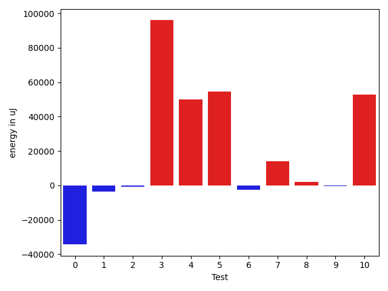

# gson 3ee3c1

https://github.com/google/gson/commit/3ee3c1

## Delta Energy per test method

| ID | EnergyV1 | EnergyV2 | DeltaEnergy | σV1 | σV2 |
| --- | --- | --- | --- | --- | --- |
| 0 | 81909 | 80139 | -1770 | 157914.1521930776 | 115472.44650976402 |
| 1 | 61768 | 61157 | -611 | 24915.433513654407 | 22250.44136031663 |
| 2 | 41686 | 42602 | 916 | 20672.9828062684 | 20746.484871875644 |
| 3 | 38086 | 38208 | 122 | 10203.943854978603 | 351087.0363784634 |
| 4 | 43518 | 42664 | -854 | 253409.05661008967 | 269341.2206127155 |
| 5 | 39307 | 41443 | 2136 | 231958.20476582038 | 275357.35423031537 |
| 6 | 75439 | 73608 | -1831 | 26071.135273662556 | 27597.28970008708 |
| 7 | 176330 | 182128 | 5798 | 100611.45862675365 | 118926.61255454477 |
| 8 | 37536 | 37537 | 1 | 16563.087348536064 | 17909.422384619535 |
| 9 | 40650 | 39855 | -795 | 13313.712040989036 | 12983.093945204278 |
| 10 | 79407 | 84045 | 4638 | 527590.8706903213 | 548084.8651273453 |

## Delta Duration per test method

| ID | DurationV1 | DurationsV2 | DeltaDuration |
| --- | --- | --- | --- |
| 0 | 5334690.848484849 | 4062887.262626263 | -1271803.5858585858 |
| 1 | 1992102.3777777778 | 1934402.0666666667 | -57700.311111111194 |
| 2 | 1710201.6097560977 | 1614714.463414634 | -95487.14634146355 |
| 3 | 1222089.0222222223 | 3843128.7560975607 | 2621039.7338753385 |
| 4 | 4740613.873015873 | 6434143.266666667 | 1693529.3936507935 |
| 5 | 4232653.7450980395 | 5696858.2 | 1464204.4549019607 |
| 6 | 2241875.205882353 | 2119139.815384615 | -122735.39049773756 |
| 7 | 6016116.313131313 | 6585943.414141414 | 569827.1010101009 |
| 8 | 1303962.4736842106 | 1473100.431372549 | 169137.95768833836 |
| 9 | 1498679.878787879 | 1336286.975 | -162392.9037878788 |
| 10 | 9026246.144329896 | 10833547.887755102 | 1807301.7434252053 |

## Misc.

| ID | Test Class | Test Method |
| --- | --- | --- |
| 0 | com.google.gson.functional.ReadersWritersTest | testReadWriteTwoObjects |
| 1 | com.google.gson.JsonObjectTest | testAddingBooleanProperties |
| 2 | com.google.gson.JsonObjectTest | testReadPropertyWithEmptyStringName |
| 3 | com.google.gson.JsonObjectTest | testWritePropertyWithEmptyStringName |
| 4 | com.google.gson.internal.bind.JsonElementReaderTest | testBooleans |
| 5 | com.google.gson.functional.JsonArrayTest | testBooleanPrimitiveAddition |
| 6 | com.google.gson.functional.JsonArrayTest | testSameAddition |
| 7 | com.google.gson.functional.JsonTreeTest | testJsonTreeToString |
| 8 | com.google.gson.functional.DefaultTypeAdaptersTest | testJsonPrimitiveSerialization |
| 9 | com.google.gson.JsonPrimitiveTest | testBoolean |
| 10 | com.google.gson.JsonParserTest | testReadWriteTwoObjects |

| Test | IterationV1 | IterationV2 | DeltaIteration |
| --- | --- | --- | --- |
| 0 | 99 | 99 | 0 |
| 1 | 45 | 30 | -15 |
| 2 | 41 | 41 | 0 |
| 3 | 45 | 41 | -4 |
| 4 | 63 | 60 | -3 |
| 5 | 51 | 40 | -11 |
| 6 | 68 | 65 | -3 |
| 7 | 99 | 99 | 0 |
| 8 | 57 | 51 | -6 |
| 9 | 33 | 40 | 7 |
| 10 | 97 | 98 | 1 |

| Time Label | Time (s) |
| --- | --- |
| Selection | 36.32548236846924 |
| Injection | 14.401998519897461 |
| Total | 1505.3732252120972 |

