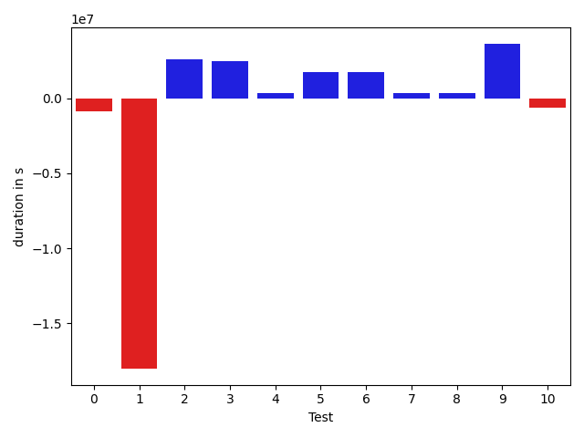

# gson 3ee3c1

https://github.com/google/gson/commit/3ee3c1

## Delta Energy per test method

| ID | EnergyV1 | EnergyV2 | DeltaEnergy |
| --- | --- | --- | --- |
| 0 | 128803.39945561331 | 94423.82806303633 | -34379.57139257698 |
| 1 | 1004305.1170301687 | 453391.1738943751 | -550913.9431357936 |
| 2 | 75824.42242961291 | 164790.6663928809 | 88966.24396326799 |
| 3 | 421900.26103801216 | 568893.4183773734 | 146993.1573393612 |
| 4 | 75567.9533357707 | 105978.49021193085 | 30410.536876160157 |
| 5 | 142000.097665844 | 186257.84190278637 | 44257.74423694238 |
| 6 | 36641.33768880044 | 58332.93151965374 | 21691.5938308533 |
| 7 | 48813.22156125076 | 40701.893988849595 | -8111.327572401162 |
| 8 | 63143.54230791773 | 58393.0305913018 | -4750.511716615925 |
| 9 | 33804.58252742974 | 175293.158165822 | 141488.57563839227 |
| 10 | 41788.24022946437 | 41814.66634963939 | 26.426120175019605 |

## Delta Duration per test method

| ID | DurationV1 | DurationsV2 | DeltaDuration |
| --- | --- | --- | --- |
| 0 | 4124164.6983404285 | 3281721.3434319003 | -842443.3549085283 |
| 1 | 32126262.73742153 | 14117892.749201681 | -18008369.98821985 |
| 2 | 2321352.2833670108 | 4937869.102579936 | 2616516.8192129256 |
| 3 | 12092445.902624652 | 14558396.815389682 | 2465950.91276503 |
| 4 | 2417741.940586706 | 2736865.684456139 | 319123.7438694327 |
| 5 | 4378487.848688428 | 6111437.663284952 | 1732949.8145965235 |
| 6 | 936109.4831635265 | 2660593.6714944406 | 1724484.1883309141 |
| 7 | 1129081.8622379552 | 1469307.2330338005 | 340225.3707958453 |
| 8 | 1935497.473200046 | 2297106.9735808633 | 361609.50038081734 |
| 9 | 1723954.3900537784 | 5357407.623542246 | 3633453.233488468 |
| 10 | 1348172.8849978175 | 738253.9828185354 | -609918.902179282 |

## Misc.

| ID | Test Class | Test Method |
| --- | --- | --- |
| 0 | com.google.gson.functional.ReadersWritersTest | testReadWriteTwoObjects |
| 1 | com.google.gson.JsonParserTest | testReadWriteTwoObjects |
| 2 | com.google.gson.internal.bind.JsonElementReaderTest | testBooleans |
| 3 | com.google.gson.functional.JsonArrayTest | testBooleanPrimitiveAddition |
| 4 | com.google.gson.functional.JsonArrayTest | testSameAddition |
| 5 | com.google.gson.functional.JsonTreeTest | testJsonTreeToString |
| 6 | com.google.gson.functional.DefaultTypeAdaptersTest | testJsonPrimitiveSerialization |
| 7 | com.google.gson.JsonObjectTest | testAddingBooleanProperties |
| 8 | com.google.gson.JsonObjectTest | testReadPropertyWithEmptyStringName |
| 9 | com.google.gson.JsonObjectTest | testWritePropertyWithEmptyStringName |
| 10 | com.google.gson.JsonPrimitiveTest | testBoolean |

| Test | IterationV1 | IterationV2 | DeltaIteration |
| --- | --- | --- | --- |
| 0 | 99 | 99 | 0 |
| 1 | 97 | 98 | 1 |
| 2 | 63 | 60 | -3 |
| 3 | 51 | 40 | -11 |
| 4 | 68 | 65 | -3 |
| 5 | 99 | 99 | 0 |
| 6 | 57 | 51 | -6 |
| 7 | 45 | 30 | -15 |
| 8 | 41 | 41 | 0 |
| 9 | 45 | 41 | -4 |
| 10 | 33 | 40 | 7 |

| Time Label | Time (s) |
| --- | --- |
| Selection | 36.32548236846924 |
| Injection | 14.401998519897461 |
| Total | 1505.3732252120972 |

