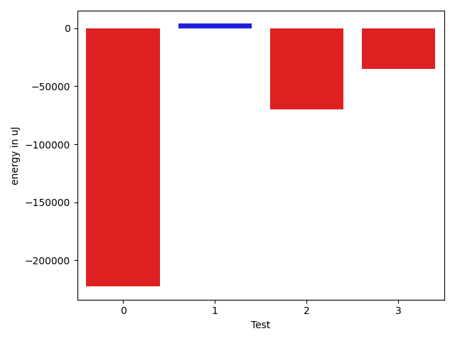
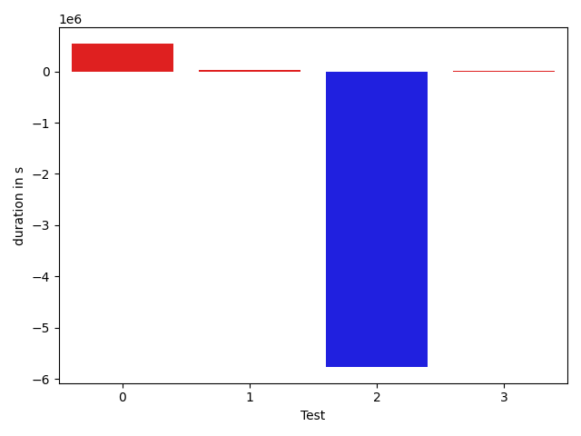

# gson 0a93ef

https://github.com/google/gson/commit/0a93ef

## Delta Energy per test method

| ID | EnergyV1 | EnergyV2 | DeltaEnergy | σ |
| --- | --- | --- | --- | --- |
| 0 | 1347272.7857142857 | 1394327.2210526315 | 47054.43533834582 | 305706.0315910832 | 342213.1641681889 |
| 1 | 34674.392857142855 | 35441.4 | 767.0071428571464 | 3019.058354133498 | 4344.793927951431 |
| 2 | 388668.1212121212 | 177872.38095238095 | -210795.74025974027 | 663493.8397381016 | 449638.99413578684 |
| 3 | 37292.36 | 35063.5 | -2228.8600000000006 | 14265.586680904504 | 9167.332397470613 |

## Delta Duration per test method

| ID | DurationV1 | DurationsV2 | DeltaDuration |
| --- | --- | --- | --- |
| 0 | 38114328.63095238 | 38657932.53684211 | 543603.9058897272 |
| 1 | 1069315.9464285714 | 1103181.5636363637 | 33865.617207792355 |
| 2 | 10992307.378787879 | 5226422.26984127 | -5765885.108946609 |
| 3 | 951761.48 | 960388.5178571428 | 8627.03785714286 |

## Misc.

| ID | Test Class | Test Method |
| --- | --- | --- |
| 0 | com.google.gson.functional.NamingPolicyTest | testGsonWithLowerCaseDashPolicyDeserialiation |
| 1 | com.google.gson.functional.NamingPolicyTest | testGsonWithLowerCaseUnderscorePolicySerialization |
| 2 | com.google.gson.functional.NamingPolicyTest | testGsonWithLowerCaseDashPolicySerialization |
| 3 | com.google.gson.functional.NamingPolicyTest | testGsonWithLowerCaseUnderscorePolicyDeserialiation |

| Test | IterationV1 | IterationV2 | DeltaIteration |
| --- | --- | --- | --- |
| 0 | 84 | 95 | 11 |
| 1 | 56 | 55 | -1 |
| 2 | 66 | 63 | -3 |
| 3 | 50 | 56 | 6 |

| Time Label | Time (s) |
| --- | --- |
| Selection | 27.948796033859253 |
| Injection | 10.535364866256714 |
| Total | 995.8623168468475 |

