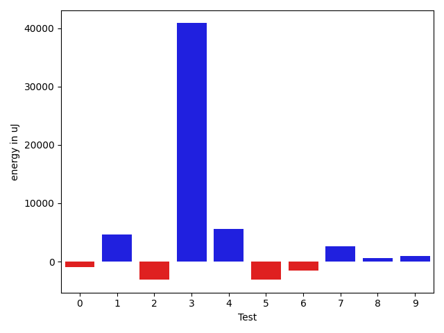
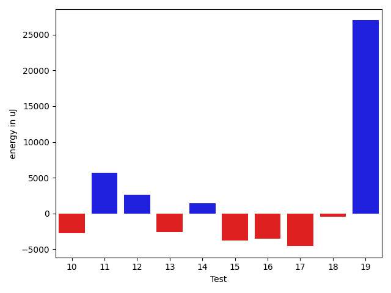
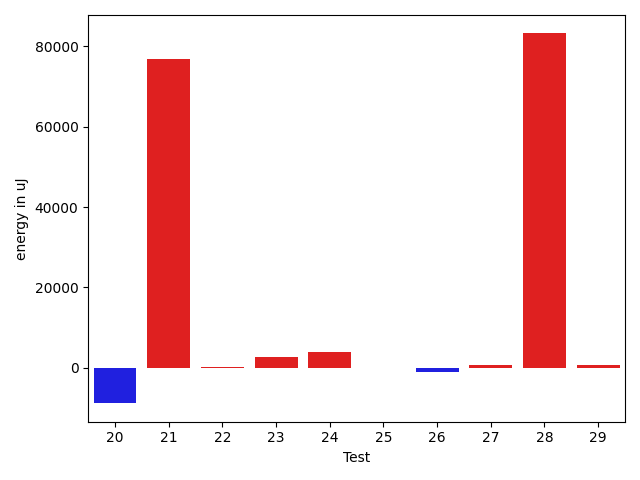
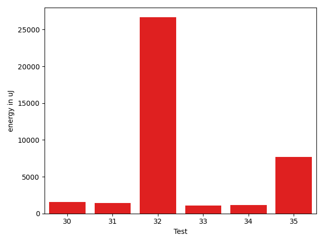

# gson 24eec9

https://github.com/google/gson/commit/24eec9

## Delta Energy per test method

| ID | EnergyV1 | EnergyV2 | DeltaEnergy | σV1 | σV2 |
| --- | --- | --- | --- | --- | --- |
| 0 | 40039 | 38269 | -1770 | 15175.1226220693 | 12835.554458830937 |
| 1 | 39001 | 38452 | -549 | 4175.556016311059 | 3962.39932867818 |
| 2 | 39673 | 39245 | -428 | 11799.573164049008 | 16221.264006053338 |
| 3 | 38452 | 36194 | -2258 | 4159.006084390837 | 3548.5743898464843 |
| 4 | 42542 | 38513 | -4029 | 33271.96941018668 | 32253.70602443038 |
| 5 | 37903 | 36621 | -1282 | 26544.599542777058 | 33232.79316253852 |
| 6 | 38757 | 37354 | -1403 | 4424.216689056764 | 3927.338338813552 |
| 7 | 37537 | 37781 | 244 | 10183.881394854461 | 266620.1103351458 |
| 8 | 37292 | 37293 | 1 | 4059.0319692631147 | 4320.459974354583 |
| 9 | 37536 | 38757 | 1221 | 3436.11722800178 | 3858.842110708101 |
| 10 | 36194 | 39246 | 3052 | 17664.274775203125 | 163259.37124973675 |
| 11 | 36926 | 38819 | 1893 | 3481.1786576034624 | 4547.160236558873 |
| 12 | 36926 | 36987 | 61 | 3456.4046625266164 | 4081.528144980001 |
| 13 | 37231 | 37170 | -61 | 3910.1995995208836 | 5500.013399534744 |
| 14 | 37415 | 38757 | 1342 | 4238.408194931148 | 4755.351252790372 |
| 15 | 35828 | 37659 | 1831 | 4427.937530876396 | 4668.029499692563 |
| 16 | 37903 | 38391 | 488 | 4339.173636485013 | 4171.609892926882 |
| 17 | 37658 | 40710 | 3052 | 7095.783607819701 | 352467.0844409525 |
| 18 | 38391 | 40222 | 1831 | 236881.3503730155 | 119973.43146893982 |
| 19 | 38696 | 37476 | -1220 | 68208.57595343611 | 4631.2875579523725 |
| 20 | 39245 | 39185 | -60 | 281454.63121901266 | 241722.71980530446 |
| 21 | 39185 | 39245 | 60 | 3589.1689226832937 | 248069.62507359168 |
| 22 | 39733 | 38330 | -1403 | 7859.933177439834 | 8815.695000193755 |
| 23 | 40405 | 41076 | 671 | 15777.600229918417 | 17532.539253767496 |
| 24 | 37536 | 38513 | 977 | 12361.805506804294 | 18475.865753178445 |
| 25 | 37659 | 37659 | 0 | 4835.902284770071 | 4255.2289984291465 |
| 26 | 37720 | 37903 | 183 | 7443.837749198251 | 4518.770325930044 |
| 27 | 37536 | 38024 | 488 | 4565.119514831058 | 3975.1624970395364 |
| 28 | 152710 | 136169 | -16541 | 372530.28021978243 | 560753.4767676974 |
| 29 | 37719 | 38085 | 366 | 8128.728268863075 | 6795.095566153194 |
| 30 | 41992 | 41321 | -671 | 15653.104273946117 | 20462.56385358937 |
| 31 | 36743 | 38696 | 1953 | 4480.432350510383 | 4310.946529736656 |
| 32 | 37231 | 39246 | 2015 | 3747.2207799025314 | 138305.11599501866 |
| 33 | 35461 | 35950 | 489 | 3932.102409449484 | 3482.7625803571127 |
| 34 | 34363 | 36011 | 1648 | 3047.1110966064384 | 3717.6798896686096 |
| 35 | 38696 | 38940 | 244 | 4908.23226991471 | 35786.0292850777 |

## Delta Duration per test method

| ID | DurationV1 | DurationsV2 | DeltaDuration |
| --- | --- | --- | --- |
| 0 | 1553966.5106382978 | 1350729.5384615385 | -203236.97217675927 |
| 1 | 564055.5714285715 | 513124.38095238095 | -50931.19047619053 |
| 2 | 1007346.4137931034 | 991821.0714285715 | -15525.342364531942 |
| 3 | 493334.8 | 515693.18518518517 | 22358.38518518518 |
| 4 | 1298651.4285714286 | 874011.7575757576 | -424639.67099567107 |
| 5 | 1123868.88 | 887970.6896551724 | -235898.19034482748 |
| 6 | 554714.1111111111 | 535061.7307692308 | -19652.380341880373 |
| 7 | 861638.1515151515 | 2856234.3684210526 | 1994596.2169059012 |
| 8 | 569804.35 | 547392.25 | -22412.099999999977 |
| 9 | 559652.3684210526 | 541265.619047619 | -18386.74937343353 |
| 10 | 913470.6285714286 | 1566512.7083333333 | 653042.0797619047 |
| 11 | 749139.2307692308 | 649989.0454545454 | -99150.18531468534 |
| 12 | 507449.1052631579 | 539298.5 | 31849.394736842078 |
| 13 | 580039.925925926 | 534201.8888888889 | -45838.03703703708 |
| 14 | 557747.0 | 524294.1904761905 | -33452.80952380947 |
| 15 | 523593.5625 | 506000.9 | -17592.662499999977 |
| 16 | 702654.0606060605 | 716278.9722222222 | 13624.911616161698 |
| 17 | 865266.052631579 | 5056557.791666667 | 4191291.739035088 |
| 18 | 3023315.7333333334 | 1450936.5714285714 | -1572379.161904762 |
| 19 | 887152.5357142857 | 633009.7222222222 | -254142.81349206343 |
| 20 | 3155105.904761905 | 3037617.793103448 | -117488.11165845674 |
| 21 | 714122.4814814815 | 3055208.34375 | 2341085.8622685187 |
| 22 | 1253260.7777777778 | 1232262.4366197183 | -20998.341158059426 |
| 23 | 1377367.5512820513 | 1477145.5142857144 | 99777.96300366311 |
| 24 | 1363630.8783783785 | 1425773.343283582 | 62142.46490520355 |
| 25 | 806764.0357142857 | 773999.2972972973 | -32764.738416988403 |
| 26 | 1076099.5666666667 | 992185.5961538461 | -83913.97051282052 |
| 27 | 982291.088888889 | 903036.2121212122 | -79254.87676767679 |
| 28 | 6846597.6161616165 | 9166860.333333334 | 2320262.7171717174 |
| 29 | 1250092.3770491802 | 1079625.1228070175 | -170467.2542421627 |
| 30 | 985194.0322580645 | 1138803.5333333334 | 153609.50107526896 |
| 31 | 579612.4 | 568161.1538461539 | -11451.24615384615 |
| 32 | 737632.9333333333 | 1384795.2 | 647162.2666666666 |
| 33 | 652940.5625 | 599622.5789473684 | -53317.98355263157 |
| 34 | 753393.4324324324 | 772835.0975609756 | 19441.665128543158 |
| 35 | 716830.2777777778 | 913694.2173913043 | 196863.93961352657 |

## Misc.

| ID | Test Class | Test Method |
| --- | --- | --- |
| 0 | com.google.gson.functional.StreamingTypeAdaptersTest | testFromJsonTree |
| 1 | com.google.gson.JsonArrayTest | testRemove |
| 2 | com.google.gson.JsonArrayTest | testSet |
| 3 | com.google.gson.JsonArrayTest | testDeepCopy |
| 4 | com.google.gson.JsonArrayTest | testEqualsNonEmptyArray |
| 5 | com.google.gson.internal.bind.JsonElementReaderTest | testArray |
| 6 | com.google.gson.internal.bind.JsonElementReaderTest | testStrings |
| 7 | com.google.gson.internal.bind.JsonElementReaderTest | testStrictNansAndInfinities |
| 8 | com.google.gson.internal.bind.JsonElementReaderTest | testNestedArrays |
| 9 | com.google.gson.internal.bind.JsonElementReaderTest | testSkipValue |
| 10 | com.google.gson.internal.bind.JsonElementReaderTest | testNumbers |
| 11 | com.google.gson.internal.bind.JsonElementReaderTest | testNumbersFromStrings |
| 12 | com.google.gson.internal.bind.JsonElementReaderTest | testEarlyClose |
| 13 | com.google.gson.internal.bind.JsonElementReaderTest | testBooleans |
| 14 | com.google.gson.internal.bind.JsonElementReaderTest | testNulls |
| 15 | com.google.gson.internal.bind.JsonElementReaderTest | testStringsFromNumbers |
| 16 | com.google.gson.internal.bind.JsonElementReaderTest | testWrongType |
| 17 | com.google.gson.internal.bind.JsonElementReaderTest | testLenientNansAndInfinities |
| 18 | com.google.gson.internal.bind.JsonTreeWriterTest | testLenientNansAndInfinities |
| 19 | com.google.gson.internal.bind.JsonTreeWriterTest | testWriteAfterClose |
| 20 | com.google.gson.internal.bind.JsonTreeWriterTest | testNestedArray |
| 21 | com.google.gson.internal.bind.JsonTreeWriterTest | testArray |
| 22 | com.google.gson.functional.InheritanceTest | testClassWithBaseArrayFieldSerialization |
| 23 | com.google.gson.functional.InheritanceTest | testClassWithBaseCollectionFieldSerialization |
| 24 | com.google.gson.functional.MapTest | testCustomSerializerForSpecificMapType |
| 25 | com.google.gson.functional.JsonParserTest | testBadFieldTypeForCustomDeserializerCustomTree |
| 26 | com.google.gson.functional.JsonParserTest | testBadFieldTypeForDeserializingCustomTree |
| 27 | com.google.gson.functional.JsonParserTest | testBadTypeForDeserializingCustomTree |
| 28 | com.google.gson.functional.TypeHierarchyAdapterTest | testTypeHierarchy |
| 29 | com.google.gson.functional.CustomSerializerTest | testSubClassSerializerInvokedForBaseClassFieldsHoldingArrayOfSubClassInstances |
| 30 | com.google.gson.JsonParserTest | testParseMixedArray |
| 31 | com.google.gson.JsonParserTest | testParseInvalidJson |
| 32 | com.google.gson.JsonParserTest | testParseUnquotedStringArrayFails |
| 33 | com.google.gson.functional.DefaultTypeAdaptersTest | testJsonArraySerialization |
| 34 | com.google.gson.functional.DefaultTypeAdaptersTest | testJsonArrayDeserialization |
| 35 | com.google.gson.JsonObjectTest | testDeepCopy |

| Test | IterationV1 | IterationV2 | DeltaIteration |
| --- | --- | --- | --- |
| 0 | 47 | 39 | -8 |
| 1 | 21 | 21 | 0 |
| 2 | 29 | 28 | -1 |
| 3 | 20 | 27 | 7 |
| 4 | 28 | 33 | 5 |
| 5 | 25 | 29 | 4 |
| 6 | 18 | 26 | 8 |
| 7 | 33 | 38 | 5 |
| 8 | 20 | 20 | 0 |
| 9 | 38 | 21 | -17 |
| 10 | 35 | 24 | -11 |
| 11 | 26 | 22 | -4 |
| 12 | 19 | 24 | 5 |
| 13 | 27 | 18 | -9 |
| 14 | 22 | 21 | -1 |
| 15 | 16 | 10 | -6 |
| 16 | 33 | 36 | 3 |
| 17 | 38 | 24 | -14 |
| 18 | 30 | 28 | -2 |
| 19 | 28 | 18 | -10 |
| 20 | 21 | 29 | 8 |
| 21 | 27 | 32 | 5 |
| 22 | 72 | 71 | -1 |
| 23 | 78 | 70 | -8 |
| 24 | 74 | 67 | -7 |
| 25 | 56 | 37 | -19 |
| 26 | 60 | 52 | -8 |
| 27 | 45 | 33 | -12 |
| 28 | 99 | 99 | 0 |
| 29 | 61 | 57 | -4 |
| 30 | 31 | 30 | -1 |
| 31 | 20 | 26 | 6 |
| 32 | 30 | 30 | 0 |
| 33 | 32 | 19 | -13 |
| 34 | 37 | 41 | 4 |
| 35 | 18 | 23 | 5 |

| Time Label | Time (s) |
| --- | --- |
| Selection | 27.425134658813477 |
| Injection | 12.634314775466919 |
| Total | 1039.5015752315521 |

