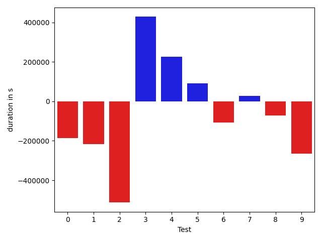
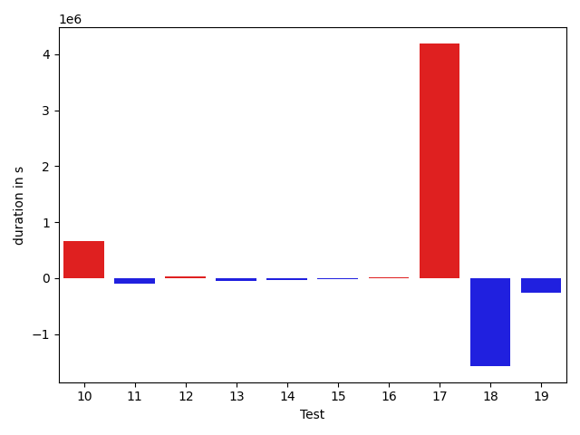
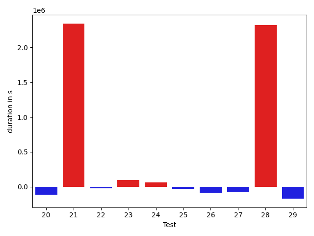
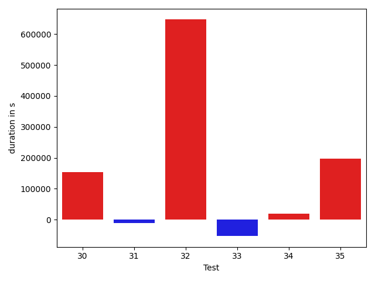

# gson 24eec9

https://github.com/google/gson/commit/24eec9

## Delta Energy per test method

| ID | EnergyV1 | EnergyV2 | DeltaEnergy |
| --- | --- | --- | --- |
| 0 | 37646.05766772597 | 36741.58347280859 | -904.4741949173767 |
| 1 | 35091.39236056324 | 39774.62587103208 | 4683.233510468846 |
| 2 | 38170.087925954154 | 35134.616741632126 | -3035.4711843220284 |
| 3 | 36171.26171579379 | 77020.41528880596 | 40849.15357301217 |
| 4 | 36555.91675169964 | 42140.70679500555 | 5584.790043305911 |
| 5 | 40971.61463543773 | 37861.32052864134 | -3110.294106796384 |
| 6 | 37881.91017246246 | 36372.639570236206 | -1509.2706022262573 |
| 7 | 39646.71725773811 | 42243.21516609192 | 2596.4979083538055 |
| 8 | 37142.950996398926 | 37735.95604431629 | 593.005047917366 |
| 9 | 37417.738863135455 | 38335.77601528168 | 918.0371521462221 |
| 10 | 44161.264099121094 | 41369.72849500179 | -2791.535604119301 |
| 11 | 36008.613654026965 | 41707.53706073761 | 5698.9234067106445 |
| 12 | 36203.24526807666 | 38808.796999931335 | 2605.551731854677 |
| 13 | 37238.10171292722 | 34681.788845062256 | -2556.3128678649664 |
| 14 | 35700.49136352539 | 37106.45703125 | 1405.9656677246094 |
| 15 | 40261.513609149726 | 36454.72533021154 | -3806.788278938184 |
| 16 | 39110.98690094799 | 35591.385372845456 | -3519.601528102532 |
| 17 | 38499.704263687134 | 33926.805582910776 | -4572.898680776358 |
| 18 | 56755.642477131914 | 56286.36654557474 | -469.2759315571748 |
| 19 | 39813.143981434405 | 66808.91210163385 | 26995.768120199442 |
| 20 | 41718.67378234863 | 37960.66091135144 | -3758.0128709971905 |
| 21 | 106892.20123884454 | 44951.373795288615 | -61940.82744355593 |
| 22 | 37889.61535167694 | 40071.23595428467 | 2181.620602607727 |
| 23 | 34096.06318929233 | 34968.08656692505 | 872.0233776327223 |
| 24 | 33884.28917626481 | 33904.562872173236 | 20.273695908428635 |
| 25 | 179766.91965179454 | 145908.9945550171 | -33857.92509677744 |
| 26 | 36685.056385644966 | 47148.848691469226 | 10463.79230582426 |
| 27 | 41397.94367965618 | 41502.278748668265 | 104.33506901208602 |
| 28 | 37074.51308382266 | 38876.891316855515 | 1802.378233032854 |
| 29 | 37563.90924962796 | 60757.31297148764 | 23193.40372185968 |
| 30 | 40321.90105304122 | 37822.04253387451 | -2499.858519166708 |
| 31 | 39459.21447658539 | 387968.3426192254 | 348509.12814264 |
| 32 | 39617.2826230675 | 36428.8536834924 | -3188.4289395750966 |
| 33 | 38430.836944383336 | 37185.234749937124 | -1245.6021944462118 |
| 34 | 35616.62363873549 | 41412.990204353664 | 5796.3665656181765 |
| 35 | 37041.027488708496 | 39747.28336119652 | 2706.255872488022 |

## Delta Duration per test method

| ID | DurationV1 | DurationsV2 | DeltaDuration |
| --- | --- | --- | --- |
| 0 | 1073102.710869285 | 888172.9938419047 | -184929.71702738036 |
| 1 | 856104.1638702166 | 639209.0939965067 | -216895.06987370993 |
| 2 | 1237717.4751246436 | 725567.9744744019 | -512149.50065024174 |
| 3 | 1096033.4583010008 | 1524216.2936888933 | 428182.83538789256 |
| 4 | 631122.5948414808 | 856250.3289114856 | 225127.73407000478 |
| 5 | 804024.2196638286 | 896125.6297437176 | 92101.410079889 |
| 6 | 537070.1932077408 | 429912.7079334259 | -107157.48527431488 |
| 7 | 462077.6880376339 | 488621.1952562332 | 26543.50721859932 |
| 8 | 524825.636384964 | 452726.9145902395 | -72098.72179472446 |
| 9 | 744155.577231273 | 478023.9012042284 | -266131.67602704465 |
| 10 | 593169.9146499634 | 496944.9987580478 | -96224.91589191556 |
| 11 | 539061.3610689202 | 470616.13555908203 | -68445.2255098382 |
| 12 | 712551.3295281231 | 501780.4325609207 | -210770.89696720243 |
| 13 | 528654.2976233214 | 497359.62478256226 | -31294.672840759158 |
| 14 | 435778.804107666 | 468167.9677734375 | 32389.163665771484 |
| 15 | 629819.2569331378 | 759753.357858666 | 129934.10092552821 |
| 16 | 702026.8221552148 | 1350099.3815719783 | 648072.5594167635 |
| 17 | 578524.5353794098 | 591355.4138009548 | 12830.878421545029 |
| 18 | 1092468.1955375355 | 1111025.5924440064 | 18557.39690647088 |
| 19 | 1160422.7732811961 | 1881652.7200627401 | 721229.946781544 |
| 20 | 474212.9264984131 | 519721.08523727953 | 45508.15873886645 |
| 21 | 2927140.2177435122 | 753727.8043573305 | -2173412.413386182 |
| 22 | 679109.3956308365 | 375270.61015319824 | -303838.78547763824 |
| 23 | 585723.3038622879 | 567503.562046051 | -18219.74181623687 |
| 24 | 583816.1198790044 | 602485.8362313756 | 18669.71635237115 |
| 25 | 5533500.3912904225 | 4463523.050311154 | -1069977.3409792688 |
| 26 | 1072607.8403261171 | 1467400.9386228975 | 394793.0982967804 |
| 27 | 993910.0919235761 | 1159555.1071039254 | 165645.01518034935 |
| 28 | 1106662.332703398 | 1373498.8401432664 | 266836.5074398683 |
| 29 | 790498.7213605959 | 1150347.9509611353 | 359849.22960053943 |
| 30 | 517844.06287011504 | 739984.7869262695 | 222140.7240561545 |
| 31 | 638995.6708221436 | 11712664.167412724 | 11073668.49659058 |
| 32 | 706476.6327182502 | 610545.1069202679 | -95931.52579798223 |
| 33 | 900427.3779192375 | 1577332.8145833681 | 676905.4366641307 |
| 34 | 1757652.976018135 | 828440.8902063298 | -929212.0858118052 |
| 35 | 565937.7341461182 | 513372.8268485069 | -52564.90729761124 |

## Misc.

| ID | Test Class | Test Method |
| --- | --- | --- |
| 0 | com.google.gson.functional.JsonParserTest | testBadTypeForDeserializingCustomTree |
| 1 | com.google.gson.functional.JsonParserTest | testBadFieldTypeForCustomDeserializerCustomTree |
| 2 | com.google.gson.functional.JsonParserTest | testBadFieldTypeForDeserializingCustomTree |
| 3 | com.google.gson.internal.bind.JsonElementReaderTest | testLenientNansAndInfinities |
| 4 | com.google.gson.internal.bind.JsonElementReaderTest | testStrictNansAndInfinities |
| 5 | com.google.gson.internal.bind.JsonElementReaderTest | testArray |
| 6 | com.google.gson.internal.bind.JsonElementReaderTest | testNestedArrays |
| 7 | com.google.gson.internal.bind.JsonElementReaderTest | testNulls |
| 8 | com.google.gson.internal.bind.JsonElementReaderTest | testEarlyClose |
| 9 | com.google.gson.internal.bind.JsonElementReaderTest | testNumbers |
| 10 | com.google.gson.internal.bind.JsonElementReaderTest | testStrings |
| 11 | com.google.gson.internal.bind.JsonElementReaderTest | testSkipValue |
| 12 | com.google.gson.internal.bind.JsonElementReaderTest | testNumbersFromStrings |
| 13 | com.google.gson.internal.bind.JsonElementReaderTest | testBooleans |
| 14 | com.google.gson.internal.bind.JsonElementReaderTest | testStringsFromNumbers |
| 15 | com.google.gson.internal.bind.JsonElementReaderTest | testWrongType |
| 16 | com.google.gson.JsonParserTest | testParseUnquotedStringArrayFails |
| 17 | com.google.gson.JsonParserTest | testParseInvalidJson |
| 18 | com.google.gson.JsonParserTest | testParseMixedArray |
| 19 | com.google.gson.JsonArrayTest | testSet |
| 20 | com.google.gson.JsonArrayTest | testDeepCopy |
| 21 | com.google.gson.JsonArrayTest | testEqualsNonEmptyArray |
| 22 | com.google.gson.JsonArrayTest | testRemove |
| 23 | com.google.gson.functional.DefaultTypeAdaptersTest | testJsonArraySerialization |
| 24 | com.google.gson.functional.DefaultTypeAdaptersTest | testJsonArrayDeserialization |
| 25 | com.google.gson.functional.TypeHierarchyAdapterTest | testTypeHierarchy |
| 26 | com.google.gson.functional.InheritanceTest | testClassWithBaseCollectionFieldSerialization |
| 27 | com.google.gson.functional.InheritanceTest | testClassWithBaseArrayFieldSerialization |
| 28 | com.google.gson.functional.StreamingTypeAdaptersTest | testFromJsonTree |
| 29 | com.google.gson.internal.bind.JsonTreeWriterTest | testLenientNansAndInfinities |
| 30 | com.google.gson.internal.bind.JsonTreeWriterTest | testWriteAfterClose |
| 31 | com.google.gson.internal.bind.JsonTreeWriterTest | testNestedArray |
| 32 | com.google.gson.internal.bind.JsonTreeWriterTest | testArray |
| 33 | com.google.gson.functional.MapTest | testCustomSerializerForSpecificMapType |
| 34 | com.google.gson.functional.CustomSerializerTest | testSubClassSerializerInvokedForBaseClassFieldsHoldingArrayOfSubClassInstances |
| 35 | com.google.gson.JsonObjectTest | testDeepCopy |

| Test | IterationV1 | IterationV2 | DeltaIteration |
| --- | --- | --- | --- |
| 0 | 45 | 33 | -12 |
| 1 | 56 | 37 | -19 |
| 2 | 60 | 52 | -8 |
| 3 | 38 | 24 | -14 |
| 4 | 33 | 38 | 5 |
| 5 | 25 | 29 | 4 |
| 6 | 20 | 20 | 0 |
| 7 | 22 | 21 | -1 |
| 8 | 19 | 24 | 5 |
| 9 | 35 | 24 | -11 |
| 10 | 18 | 26 | 8 |
| 11 | 38 | 21 | -17 |
| 12 | 26 | 22 | -4 |
| 13 | 27 | 18 | -9 |
| 14 | 16 | 10 | -6 |
| 15 | 33 | 36 | 3 |
| 16 | 30 | 30 | 0 |
| 17 | 20 | 26 | 6 |
| 18 | 31 | 30 | -1 |
| 19 | 29 | 28 | -1 |
| 20 | 20 | 27 | 7 |
| 21 | 28 | 33 | 5 |
| 22 | 21 | 21 | 0 |
| 23 | 32 | 19 | -13 |
| 24 | 37 | 41 | 4 |
| 25 | 99 | 99 | 0 |
| 26 | 78 | 70 | -8 |
| 27 | 72 | 71 | -1 |
| 28 | 47 | 39 | -8 |
| 29 | 30 | 28 | -2 |
| 30 | 28 | 18 | -10 |
| 31 | 21 | 29 | 8 |
| 32 | 27 | 32 | 5 |
| 33 | 74 | 67 | -7 |
| 34 | 61 | 57 | -4 |
| 35 | 18 | 23 | 5 |

| Time Label | Time (s) |
| --- | --- |
| Selection | 27.425134658813477 |
| Injection | 12.634314775466919 |
| Total | 1039.5015752315521 |

