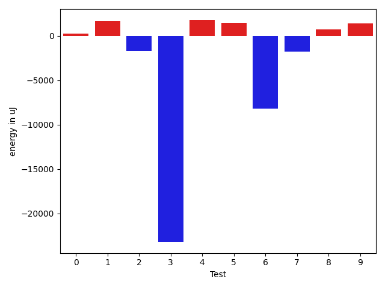
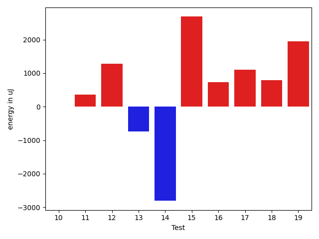
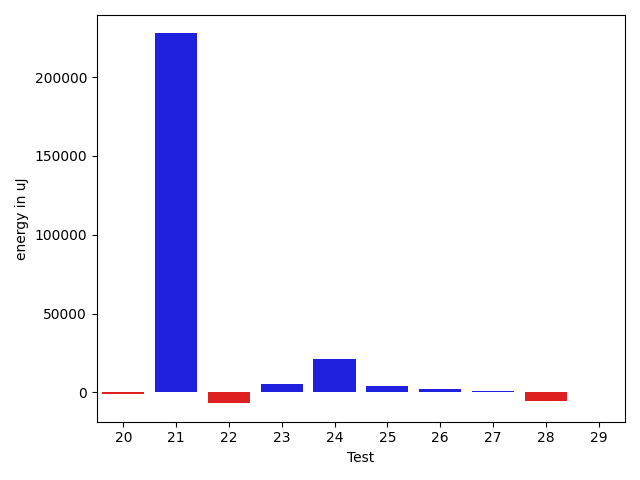
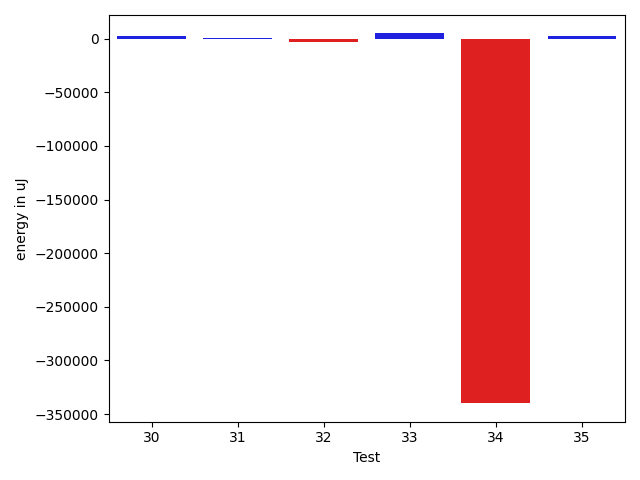

# gson d8c12a

https://github.com/google/gson/commit/d8c12a

## Delta Energy per test method

| ID | EnergyV1 | EnergyV2 | DeltaEnergy | σV1 | σV2 |
| --- | --- | --- | --- | --- | --- |
| 0 | 38025 | 38452 | 427 | 4861.420029704841 | 4813.152272246871 |
| 1 | 35644 | 38025 | 2381 | 4115.904627543489 | 3243.1175477573165 |
| 2 | 38207 | 37659 | -548 | 9985.339437548208 | 5189.664674585944 |
| 3 | 38635 | 36621 | -2014 | 162956.91288279445 | 142370.68401482108 |
| 4 | 38391 | 39184 | 793 | 3539.5758217989746 | 4164.88500908355 |
| 5 | 35034 | 37232 | 2198 | 3550.637935394693 | 3705.5395401272826 |
| 6 | 37171 | 37231 | 60 | 270552.79927071946 | 214620.80034098242 |
| 7 | 37353 | 34607 | -2746 | 3532.1526071221783 | 3438.4751980347337 |
| 8 | 37353 | 37170 | -183 | 3353.8283438482654 | 3493.9418726595623 |
| 9 | 37963 | 37475 | -488 | 4787.04395061545 | 3997.7326885657467 |
| 10 | 38513 | 38513 | 0 | 3529.481875573241 | 4475.161483979356 |
| 11 | 36316 | 36682 | 366 | 3557.432092732059 | 4619.684864749976 |
| 12 | 36193 | 37476 | 1283 | 5519.704228009494 | 3711.5951062429995 |
| 13 | 38025 | 37292 | -733 | 4501.8213192341855 | 4378.714686982928 |
| 14 | 42907 | 40100 | -2807 | 294895.25398890744 | 174936.05485621348 |
| 15 | 37903 | 40588 | 2685 | 112127.79207529238 | 249565.36357961062 |
| 16 | 39978 | 40711 | 733 | 20900.374103167793 | 20788.30381488591 |
| 17 | 37231 | 38330 | 1099 | 3759.1292002331293 | 3629.9954124550136 |
| 18 | 42481 | 43274 | 793 | 20942.398737940428 | 23268.94016377784 |
| 19 | 36987 | 38940 | 1953 | 4172.228584034918 | 4452.120592845911 |
| 20 | 38940 | 38025 | -915 | 8808.838391931418 | 8311.983627357795 |
| 21 | 40466 | 40283 | -183 | 16657.259114389526 | 22775.10321892053 |
| 22 | 36072 | 36011 | -61 | 4222.312515623617 | 4835.031089857561 |
| 23 | 40954 | 40100 | -854 | 12566.91796337731 | 14654.69376479235 |
| 24 | 37842 | 39429 | 1587 | 4092.169784815276 | 3642.4302229410087 |
| 25 | 136780 | 144164 | 7384 | 460630.7843939646 | 447465.8350534557 |
| 26 | 39490 | 38269 | -1221 | 4004.7910508250206 | 8208.469877638197 |
| 27 | 35705 | 35340 | -365 | 3454.3443225035767 | 3765.3619607030155 |
| 28 | 34484 | 35278 | 794 | 3920.9449625292714 | 3431.0846788543986 |
| 29 | 38208 | 38085 | -123 | 11098.940088612617 | 16703.127439746197 |
| 30 | 41137 | 38269 | -2868 | 20265.033534329523 | 14716.856649148247 |
| 31 | 36865 | 38025 | 1160 | 4720.531961548401 | 4918.445857704689 |
| 32 | 38879 | 39673 | 794 | 3848.7466426108467 | 3610.217337255782 |
| 33 | 38207 | 39978 | 1771 | 8781.657094620581 | 212286.82727521143 |
| 34 | 36499 | 38269 | 1770 | 253216.14074019282 | 4499.7155833853485 |
| 35 | 37719 | 38391 | 672 | 279601.02852625115 | 335053.1987129208 |

## Delta Duration per test method

| ID | DurationV1 | DurationsV2 | DeltaDuration |
| --- | --- | --- | --- |
| 0 | 989052.8333333334 | 872647.7659574468 | -116405.0673758866 |
| 1 | 839803.3902439025 | 759467.1428571428 | -80336.24738675961 |
| 2 | 1072825.4166666667 | 992397.4406779661 | -80427.97598870064 |
| 3 | 2353108.705882353 | 1482389.3255813953 | -870719.3803009575 |
| 4 | 540500.1666666666 | 578570.3888888889 | 38070.22222222225 |
| 5 | 527090.875 | 547764.0952380953 | 20673.220238095266 |
| 6 | 2563284.6666666665 | 2659770.1428571427 | 96485.47619047621 |
| 7 | 564213.3 | 600093.0 | 35879.69999999995 |
| 8 | 639080.3 | 616788.9047619047 | -22291.395238095312 |
| 9 | 546592.3636363636 | 604219.6551724138 | 57627.29153605015 |
| 10 | 521480.1 | 555211.0384615385 | 33730.93846153852 |
| 11 | 779369.08 | 639695.12 | -139673.95999999996 |
| 12 | 758335.2352941176 | 754153.1315789474 | -4182.103715170175 |
| 13 | 487981.4117647059 | 553229.15 | 65247.73823529412 |
| 14 | 3634890.966666667 | 2034756.923076923 | -1600134.0435897438 |
| 15 | 1757402.68 | 2724243.4166666665 | 966840.7366666666 |
| 16 | 1217635.8076923077 | 1307407.8181818181 | 89772.01048951037 |
| 17 | 549723.8695652174 | 563324.8888888889 | 13601.01932367147 |
| 18 | 1174914.4666666666 | 1430246.2580645161 | 255331.79139784956 |
| 19 | 527475.0454545454 | 541298.3333333334 | 13823.28787878796 |
| 20 | 1275076.7246376812 | 1268964.028169014 | -6112.696468667127 |
| 21 | 1440277.3246753246 | 1552789.3896103897 | 112512.06493506511 |
| 22 | 525263.3571428572 | 591216.1578947369 | 65952.8007518797 |
| 23 | 964585.7878787878 | 1116135.1875 | 151549.39962121216 |
| 24 | 721857.8285714285 | 892774.8461538461 | 170917.01758241758 |
| 25 | 8019789.323232323 | 7909083.666666667 | -110705.65656565595 |
| 26 | 957884.6296296297 | 1158651.0757575757 | 200766.44612794602 |
| 27 | 591341.5238095238 | 613926.0645161291 | 22584.5407066053 |
| 28 | 701543.4285714285 | 783782.7142857143 | 82239.2857142858 |
| 29 | 1327356.0428571429 | 1446491.646153846 | 119135.6032967032 |
| 30 | 1586349.9 | 1216827.6578947369 | -369522.24210526305 |
| 31 | 867932.2777777778 | 698965.1034482758 | -168967.17432950193 |
| 32 | 624514.3636363636 | 568987.7777777778 | -55526.585858585895 |
| 33 | 836898.5 | 2152333.0384615385 | 1315434.5384615385 |
| 34 | 2619501.9285714286 | 717539.7307692308 | -1901962.197802198 |
| 35 | 2834139.9166666665 | 4732989.6 | 1898849.683333333 |

## Misc.

| ID | Test Class | Test Method |
| --- | --- | --- |
| 0 | com.google.gson.functional.JsonParserTest | testBadTypeForDeserializingCustomTree |
| 1 | com.google.gson.functional.JsonParserTest | testBadFieldTypeForCustomDeserializerCustomTree |
| 2 | com.google.gson.functional.JsonParserTest | testBadFieldTypeForDeserializingCustomTree |
| 3 | com.google.gson.internal.bind.JsonElementReaderTest | testStrictNansAndInfinities |
| 4 | com.google.gson.internal.bind.JsonElementReaderTest | testNestedArrays |
| 5 | com.google.gson.internal.bind.JsonElementReaderTest | testEarlyClose |
| 6 | com.google.gson.internal.bind.JsonElementReaderTest | testNumbers |
| 7 | com.google.gson.internal.bind.JsonElementReaderTest | testSkipValue |
| 8 | com.google.gson.internal.bind.JsonElementReaderTest | testNulls |
| 9 | com.google.gson.internal.bind.JsonElementReaderTest | testBooleans |
| 10 | com.google.gson.internal.bind.JsonElementReaderTest | testStrings |
| 11 | com.google.gson.internal.bind.JsonElementReaderTest | testNumbersFromStrings |
| 12 | com.google.gson.internal.bind.JsonElementReaderTest | testWrongType |
| 13 | com.google.gson.internal.bind.JsonElementReaderTest | testStringsFromNumbers |
| 14 | com.google.gson.internal.bind.JsonElementReaderTest | testLenientNansAndInfinities |
| 15 | com.google.gson.internal.bind.JsonElementReaderTest | testArray |
| 16 | com.google.gson.JsonArrayTest | testSet |
| 17 | com.google.gson.JsonArrayTest | testRemove |
| 18 | com.google.gson.JsonArrayTest | testEqualsNonEmptyArray |
| 19 | com.google.gson.JsonArrayTest | testDeepCopy |
| 20 | com.google.gson.functional.InheritanceTest | testClassWithBaseArrayFieldSerialization |
| 21 | com.google.gson.functional.InheritanceTest | testClassWithBaseCollectionFieldSerialization |
| 22 | com.google.gson.JsonParserTest | testParseInvalidJson |
| 23 | com.google.gson.JsonParserTest | testParseMixedArray |
| 24 | com.google.gson.JsonParserTest | testParseUnquotedStringArrayFails |
| 25 | com.google.gson.functional.TypeHierarchyAdapterTest | testTypeHierarchy |
| 26 | com.google.gson.functional.CustomSerializerTest | testSubClassSerializerInvokedForBaseClassFieldsHoldingArrayOfSubClassInstances |
| 27 | com.google.gson.functional.DefaultTypeAdaptersTest | testJsonArraySerialization |
| 28 | com.google.gson.functional.DefaultTypeAdaptersTest | testJsonArrayDeserialization |
| 29 | com.google.gson.functional.MapTest | testCustomSerializerForSpecificMapType |
| 30 | com.google.gson.functional.StreamingTypeAdaptersTest | testFromJsonTree |
| 31 | com.google.gson.JsonObjectTest | testDeepCopy |
| 32 | com.google.gson.internal.bind.JsonTreeWriterTest | testWriteAfterClose |
| 33 | com.google.gson.internal.bind.JsonTreeWriterTest | testLenientNansAndInfinities |
| 34 | com.google.gson.internal.bind.JsonTreeWriterTest | testArray |
| 35 | com.google.gson.internal.bind.JsonTreeWriterTest | testNestedArray |

| Test | IterationV1 | IterationV2 | DeltaIteration |
| --- | --- | --- | --- |
| 0 | 42 | 47 | 5 |
| 1 | 41 | 42 | 1 |
| 2 | 60 | 59 | -1 |
| 3 | 34 | 43 | 9 |
| 4 | 24 | 18 | -6 |
| 5 | 24 | 21 | -3 |
| 6 | 30 | 28 | -2 |
| 7 | 20 | 24 | 4 |
| 8 | 20 | 21 | 1 |
| 9 | 22 | 29 | 7 |
| 10 | 20 | 26 | 6 |
| 11 | 25 | 25 | 0 |
| 12 | 34 | 38 | 4 |
| 13 | 17 | 20 | 3 |
| 14 | 30 | 39 | 9 |
| 15 | 25 | 24 | -1 |
| 16 | 26 | 44 | 18 |
| 17 | 23 | 18 | -5 |
| 18 | 30 | 31 | 1 |
| 19 | 22 | 21 | -1 |
| 20 | 69 | 71 | 2 |
| 21 | 77 | 77 | 0 |
| 22 | 14 | 19 | 5 |
| 23 | 33 | 32 | -1 |
| 24 | 35 | 26 | -9 |
| 25 | 99 | 99 | 0 |
| 26 | 54 | 66 | 12 |
| 27 | 21 | 31 | 10 |
| 28 | 35 | 35 | 0 |
| 29 | 70 | 65 | -5 |
| 30 | 40 | 38 | -2 |
| 31 | 18 | 29 | 11 |
| 32 | 22 | 18 | -4 |
| 33 | 20 | 26 | 6 |
| 34 | 28 | 26 | -2 |
| 35 | 24 | 25 | 1 |

| Time Label | Time (s) |
| --- | --- |
| Selection | 27.488807678222656 |
| Injection | 12.864572048187256 |
| Total | 1036.3794174194336 |

